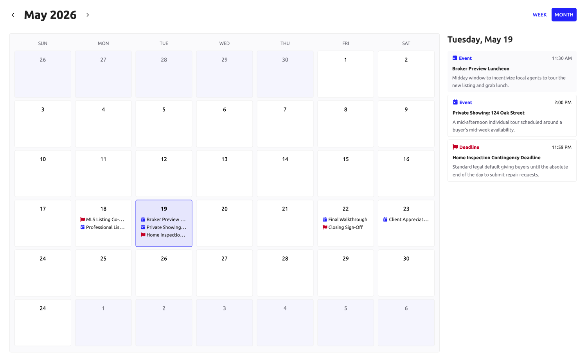
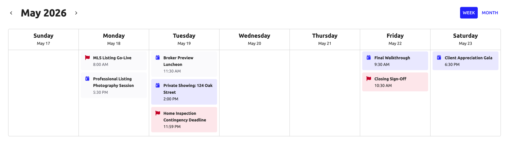

# Calendar [SAIL Design System: Patterns]

*Section: patterns | source: https://docs.appian.com/suite/help/26.7/sail/calendar.html | images referenced live in corpus/images/*

# Calendar

Use calendar patterns to give users a visual overview of time-based data like events, deadlines, and appointments.

## When to use a calendar

Use a calendar when users need to understand how time-sensitive items are distributed across days. Calendars work well for scheduling workflows, appointment tracking, project milestones, and any scenario where the relationship between events and dates matters at a glance.

Calendar patterns can be used as standalone widgets or combined — for example, offering a month view and a week view as toggle options on the same page. Each view serves a different purpose:

- **Month view**: Shows the full shape of a month at once. Use the month view when users need to see the overall distribution of events and navigate across a longer time range. The month view supports a detail panel alongside the calendar grid, making it well-suited for displaying additional event information without leaving the page.

- **Week view**: Shows a single week in column format. Use the week view when users need to focus on a shorter time window, compare events across days, or see more detail per day. The week view is best for high-level information that does not require additional event context.

## Month view

The month view displays a grid of seven-column weeks with additional details to the right. Clicking a date in the grid updates the right column with more context about that day's events.

This pattern uses color-coded event types (events and deadlines) and dims past events to help users distinguish between upcoming and completed items.



```sail
a!localVariables(
  local!today: date(2026, 5, 19),
  /* value can replace with now() */
  local!now: datetime(2026, 5, 19, 12, 0),
  /* row dates for month view */
  local!monthViewDates: {
    a!map(
      row: 1,
      dates: {
        date(2026, 4, 26),
        date(2026, 4, 27),
        date(2026, 4, 28),
        date(2026, 4, 29),
        date(2026, 4, 30),
        date(2026, 5, 1),
        date(2026, 5, 2)
      }
    ),
    a!map(
      row: 2,
      dates: {
        date(2026, 5, 3),
        date(2026, 5, 4),
        date(2026, 5, 5),
        date(2026, 5, 6),
        date(2026, 5, 7),
        date(2026, 5, 8),
        date(2026, 5, 9)
      }
    ),
    a!map(
      row: 3,
      dates: {
        date(2026, 5, 10),
        date(2026, 5, 11),
        date(2026, 5, 12),
        date(2026, 5, 13),
        date(2026, 5, 14),
        date(2026, 5, 15),
        date(2026, 5, 16)
      }
    ),
    a!map(
      row: 4,
      dates: {
        date(2026, 5, 17),
        date(2026, 5, 18),
        date(2026, 5, 19),
        date(2026, 5, 20),
        date(2026, 5, 21),
        date(2026, 5, 22),
        date(2026, 5, 23)
      }
    ),
    a!map(
      row: 5,
      dates: {
        date(2026, 5, 24),
        date(2026, 5, 25),
        date(2026, 5, 26),
        date(2026, 5, 27),
        date(2026, 5, 28),
        date(2026, 5, 29),
        date(2026, 5, 30)
      }
    ),
    a!map(
      row: 6,
      dates: {
        date(2026, 5, 24),
        date(2026, 6, 1),
        date(2026, 6, 2),
        date(2026, 6, 3),
        date(2026, 6, 4),
        date(2026, 6, 5),
        date(2026, 6, 6)
      }
    ),
  },
  /*list of events */
  local!events: {
    a!map(
      datetime: datetime(2026, 5, 18, 8, 0, 0),
      date: date(2026, 5, 18),
      title: "MLS Listing Go-Live",
      type: "Deadline",
      icon: "flag",
      color: "#B2002C",
      attendees: { "Colleen Brock" },
      desc: "Early morning push to ensure the listing hits buyer feeds at the start of the week."
    ),
    a!map(
      datetime: datetime(2026, 5, 18, 17, 30, 0),
      date: date(2026, 5, 18),
      title: "Professional Listing Photography Session",
      type: "Event",
      icon: "calendar-day",
      color: "#2322f0",
      attendees: {
        "Joshua Deacons",
        "Jane Kim",
        "Colleen Brock"
      },
      desc: "Scheduled for late afternoon to capture optimal golden hour lighting."
    ),
    a!map(
      datetime: datetime(2026, 5, 19, 11, 30, 0),
      date: date(2026, 5, 19),
      title: "Broker Preview Luncheon",
      type: "Event",
      icon: "calendar-day",
      color: "#2322f0",
      attendees: {
        "Elena Vance",
        "Maya Sterling",
        "Brokerage Partners"
      },
      desc: "Midday window to incentivize local agents to tour the new listing and grab lunch."
    ),
    a!map(
      datetime: datetime(2026, 5, 19, 14, 0, 0),
      date: date(2026, 5, 19),
      title: "Private Showing: 124 Oak Street",
      type: "Event",
      icon: "calendar-day",
      color: "#2322f0",
      attendees: {
        "Alasdair Finch",
        "Naomi Kincaid",
        "Gavin Zhao"
      },
      desc: "A mid-afternoon individual tour scheduled around a buyer's mid-week availability."
    ),
    a!map(
      datetime: datetime(2026, 5, 19, 23, 59, 0),
      date: date(2026, 5, 19),
      title: "Home Inspection Contingency Deadline",
      type: "Deadline",
      icon: "flag",
      color: "#B2002C",
      attendees: { "Gavin Zhao" },
      desc: "Standard legal default giving buyers until the absolute end of the day to submit repair requests."
    ),
    a!map(
      datetime: datetime(2026, 5, 22, 9, 30, 0),
      date: date(2026, 5, 22),
      title: "Final Walkthrough",
      type: "Event",
      icon: "calendar-day",
      color: "#2322f0",
      attendees: { "Clara Hendrickson", "Joshua Deacons" },
      desc: "Morning final walkthrough immediately preceding the title company signing appointment."
    ),
    a!map(
      datetime: datetime(2026, 5, 22, 10, 30, 0),
      date: date(2026, 5, 22),
      title: "Closing Sign-Off",
      type: "Deadline",
      icon: "flag",
      color: "#B2002C",
      attendees: { "Clara Hendrickson", "Joshua Deacons" },
      desc: "Signing appointment with client to finalize home closing."
    ),
    a!map(
      datetime: datetime(2026, 5, 23, 18, 30, 0),
      date: date(2026, 5, 23),
      title: "Client Appreciation Gala",
      type: "Event",
      icon: "calendar-day",
      color: "#2322f0",
      attendees: {
        "Apex Horizon Realtors",
        "Western-conference Clients",
        "Western-conference Brokerage Group"
      },
      desc: "An evening social event hosted after standard business hours to close out the week."
    ),
  },
  /*logic to get list of events on a particular date */
  local!selectedDay: local!today,
  {
    a!sideBySideLayout(
      marginBelow: "MORE",
      spacing: "SPARSE",
      alignVertical: "MIDDLE",
      items: {
        a!sideBySideItem(
          item: a!richTextDisplayField(
            labelPosition: "COLLAPSED",
            marginAbove: "NONE",
            marginBelow: "NONE",
            value: {
              a!richTextIcon(
                icon: "angle-left",
                size: "MEDIUM",
                link: a!dynamicLink(),
                linkStyle: "STANDALONE",
                color: "#000",
                caption: "Previous month",
                altText: "Previous month"
              )
            }
          ),
          width: "MINIMIZE"
        ),
        a!sideBySideItem(
          width: "MINIMIZE",
          item: a!headingField(
            text: text(local!today, "mmm yyyy"),
            size: "LARGE",
            fontWeight: "BOLD",
            headingTag: "H2",
            marginBelow: "NONE",
          )
        ),
        a!sideBySideItem(
          item: a!richTextDisplayField(
            labelPosition: "COLLAPSED",
            marginAbove: "NONE",
            marginBelow: "NONE",
            value: {
              a!richTextIcon(
                icon: "angle-right",
                size: "MEDIUM",
                link: a!dynamicLink(),
                linkStyle: "STANDALONE",
                color: "#000",
                caption: "Next month",
                altText: "Next month"
              )
            }
          )
        ),
      }
    ),
    a!columnsLayout(
      columns: {
        a!columnLayout(
          width: "WIDE_PLUS",
          contents: {
            a!cardLayout(
              shape: "SEMI_ROUNDED",
              padding: "LESS",
              borderColor: "#eee",
              style: "#FAFAFC",
              contents: {
                /*loop to display each row of the calendar */
                a!forEach(
                  items: local!monthViewDates,
                  expression: a!localVariables(
                    local!row: fv!item.row,
                    {
                      a!columnsLayout(
                        marginAbove: "NONE",
                        marginBelow: "LESS",
                        spacing: "DENSE",
                        columns: {
                          a!forEach(
                            items: { fv!item.dates },
                            expression: a!localVariables(
                              /*logic to detect if date is part of the current month */
                              local!isCurrentMonth: month(fv!item) = month(local!today),
                              local!date: fv!item,
                              {
                                a!columnLayout(
                                  contents: {
                                    /* DAYS OF WEEK */
                                    a!richTextDisplayField(
                                      showWhen: local!row = 1,
                                      align: "CENTER",
                                      value: {
                                        a!richTextItem(
                                          text: upper(text(fv!item, "eee")),
                                          size: "SMALL",
                                          color: "#6C6C75"
                                        )
                                      }
                                    ),
                                    /* EACH DATE */
                                    a!cardLayout(
                                      padding: "LESS",
                                      link: a!dynamicLink(
                                        saveInto: { a!save(local!selectedDay, fv!item) }
                                      ),
                                      accessibilityText: if(
                                        local!selectedDay = fv!item,
                                        "Selected",
                                        null
                                      ),
                                      shape: "SEMI_ROUNDED",
                                      borderColor: if(
                                        local!selectedDay = fv!item,
                                        "ACCENT",
                                        "#EEE"
                                      ),
                                      height: "SHORT",
                                      style: if(
                                        local!today = fv!item,
                                        "#D2D2F980",
                                        if(local!isCurrentMonth, "#FFF", "#F5F5FC")
                                      ),
                                      contents: {
                                        /* DATE */
                                        a!richTextDisplayField(
                                          labelPosition: "COLLAPSED",
                                          align: "CENTER",
                                          marginAbove: "EVEN_LESS",
                                          marginBelow: "LESS",
                                          value: {
                                            a!richTextItem(
                                              text: text(fv!item, "d"),
                                              style: if(local!today = fv!item, "STRONG", "PLAIN"),
                                              color: if(local!isCurrentMonth, "#000", "#6C6C75")
                                            )
                                          }
                                        ),
                                        /*EVENTS ON DATE */
                                        a!forEach(
                                          items: local!events,
                                          expression: {
                                            a!richTextDisplayField(
                                              labelPosition: "COLLAPSED",
                                              marginBelow: "NONE",
                                              preventWrapping: true,
                                              value: {
                                                if(
                                                  fv!item.date = local!date,
                                                  {
                                                    a!richTextIcon(
                                                      icon: fv!item.icon,
                                                      size: "SMALL",
                                                      color: fv!item.color,
                                                    ),
                                                    " ",
                                                    a!richTextItem(text: fv!item.title, size: "SMALL"),
                                                    char(10),
                                                  },
                                                  {}
                                                )
                                              }
                                            )
                                          }
                                        )
                                      }
                                    )
                                  }
                                )
                              }
                            )
                          )
                        }
                      )
                    }
                  )
                )
              }
            )
          }
        ),
        /*SELECTED DATE'S SCHEDULE */
        a!columnLayout(
          contents: {
            /*SELECTED DATE HEADER */
            a!headingField(
              headingTag: "H3",
              text: text(local!selectedDay, "dddd, mmm d"),
              fontWeight: "SEMI_BOLD",
              size: "MEDIUM"
            ),
            if(
              contains(local!events.date, local!selectedDay),
              /*LIST OF EVENTS */
              a!forEach(
                /*looping through list of events on the selected date */
                items: index(
                  local!events,
                  wherecontains(local!selectedDay, local!events.date)
                ),
                expression: {
                  a!cardLayout(
                    marginBelow: "LESS",
                    padding: "LESS",
                    shape: "SEMI_ROUNDED",
                    borderColor: "#eee",
                    showBorder: fv!item.datetime > local!now,
                    style: if(
                      fv!item.datetime < local!now,
                      "#FAFAFC",
                      "#fff"
                    ),
                    contents: {
                      a!sideBySideLayout(
                        marginBelow: "LESS",
                        items: {
                          a!sideBySideItem(
                            item: a!richTextDisplayField(
                              labelPosition: "COLLAPSED",
                              value: {
                                a!richTextIcon(icon: fv!item.icon, color: fv!item.color, ),
                                " ",
                                a!richTextItem(
                                  text: fv!item.type,
                                  style: "STRONG",
                                  color: fv!item.color,
                                  size: "SMALL"
                                )
                              }
                            )
                          ),
                          a!sideBySideItem(
                            width: "MINIMIZE",
                            item: a!richTextDisplayField(
                              labelPosition: "COLLAPSED",
                              value: {
                                a!richTextItem(
                                  text: { text(fv!item.datetime, "h:mm AM/PM") },
                                  size: "SMALL",
                                  color: if(
                                    fv!item.datetime < local!now,
                                    "#6C6C75",
                                    "STANDARD"
                                  )
                                )
                              }
                            )
                          )
                        }
                      ),
                      a!richTextDisplayField(
                        marginBelow: "EVEN_LESS",
                        labelPosition: "COLLAPSED",
                        value: {
                          a!richTextItem(
                            text: fv!item.title,
                            style: "STRONG",
                            size: "SMALL"
                          )
                        }
                      ),
                      a!richTextDisplayField(
                        labelPosition: "COLLAPSED",
                        value: {
                          a!richTextItem(
                            text: { fv!item.desc },
                            size: "SMALL",
                            color: "#6C6C75"
                          )
                        }
                      )
                    }
                  )
                }
              ),
              /*EMPTY STATE */
              a!cardLayout(
                shape: "SEMI_ROUNDED",
                borderColor: "#EEE",
                padding: "MORE",
                contents: {
                  a!stampField(
                    align: "CENTER",
                    size: "SMALL",
                    labelPosition: "COLLAPSED",
                    backgroundColor: "#FAFAFC",
                    contentColor: "#ddd",
                    icon: "calendar-o"
                  ),
                  a!richTextDisplayField(
                    align: "CENTER",
                    labelPosition: "COLLAPSED",
                    value: {
                      a!richTextItem(
                        text: "There are no events or deadlines scheduled for this date",
                        color: "#6C6C75",
                        size: "SMALL"
                      )
                    }
                  )
                }
              )
            )
          }
        )
      }
    )
  }
)
```

## Week view

The week view displays each day of the week as a column with events stacked vertically. Each event card uses a tinted background derived from the event's color, with past events displayed in a neutral gray to indicate they have already occurred.

** If users need more event context, surface it outside the calendar columns rather than cluttering the week view.



```sail
a!localVariables(
  local!today: date(2026, 5, 19),
  /* value can replace with now() */
  local!now: datetime(2026, 5, 19, 12, 0),
  /* column header dates for week view */
  local!weekViewDates: {
    date(2026, 5, 17),
    date(2026, 5, 18),
    date(2026, 5, 19),
    date(2026, 5, 20),
    date(2026, 5, 21),
    date(2026, 5, 22),
    date(2026, 5, 23)
  },
  /*list of events */
  local!events: {
    a!map(
      datetime: datetime(2026, 5, 18, 8, 0, 0),
      date: date(2026, 5, 18),
      title: "MLS Listing Go-Live",
      type: "Deadline",
      icon: "flag",
      color: "#B2002C",
      attendees: { "Colleen Brock" },
      desc: "Early morning push to ensure the listing hits buyer feeds at the start of the week."
    ),
    a!map(
      datetime: datetime(2026, 5, 18, 17, 30, 0),
      date: date(2026, 5, 18),
      title: "Professional Listing Photography Session",
      type: "Event",
      icon: "calendar-day",
      color: "#2322f0",
      attendees: {
        "Joshua Deacons",
        "Jane Kim",
        "Colleen Brock"
      },
      desc: "Scheduled for late afternoon to capture optimal golden hour lighting."
    ),
    a!map(
      datetime: datetime(2026, 5, 19, 11, 30, 0),
      date: date(2026, 5, 19),
      title: "Broker Preview Luncheon",
      type: "Event",
      icon: "calendar-day",
      color: "#2322f0",
      attendees: {
        "Elena Vance",
        "Maya Sterling",
        "Brokerage Partners"
      },
      desc: "Midday window to incentivize local agents to tour the new listing and grab lunch."
    ),
    a!map(
      datetime: datetime(2026, 5, 19, 14, 0, 0),
      date: date(2026, 5, 19),
      title: "Private Showing: 124 Oak Street",
      type: "Event",
      icon: "calendar-day",
      color: "#2322f0",
      attendees: {
        "Alasdair Finch",
        "Naomi Kincaid",
        "Gavin Zhao"
      },
      desc: "A mid-afternoon individual tour scheduled around a buyer's mid-week availability."
    ),
    a!map(
      datetime: datetime(2026, 5, 19, 23, 59, 0),
      date: date(2026, 5, 19),
      title: "Home Inspection Contingency Deadline",
      type: "Deadline",
      icon: "flag",
      color: "#B2002C",
      attendees: { "Gavin Zhao" },
      desc: "Standard legal default giving buyers until the absolute end of the day to submit repair requests."
    ),
    a!map(
      datetime: datetime(2026, 5, 22, 9, 30, 0),
      date: date(2026, 5, 22),
      title: "Final Walkthrough",
      type: "Event",
      icon: "calendar-day",
      color: "#2322f0",
      attendees: { "Clara Hendrickson", "Joshua Deacons" },
      desc: "Morning final walkthrough immediately preceding the title company signing appointment."
    ),
    a!map(
      datetime: datetime(2026, 5, 22, 10, 30, 0),
      date: date(2026, 5, 22),
      title: "Closing Sign-Off",
      type: "Deadline",
      icon: "flag",
      color: "#B2002C",
      attendees: { "Clara Hendrickson", "Joshua Deacons" },
      desc: "Signing appointment with client to finalize home closing."
    ),
    a!map(
      datetime: datetime(2026, 5, 23, 18, 30, 0),
      date: date(2026, 5, 23),
      title: "Client Appreciation Gala",
      type: "Event",
      icon: "calendar-day",
      color: "#2322f0",
      attendees: {
        "Apex Horizon Realtors",
        "Western-conference Clients",
        "Western-conference Brokerage Group"
      },
      desc: "An evening social event hosted after standard business hours to close out the week."
    ),
  },
  {
    a!sideBySideLayout(
      marginBelow: "MORE",
      spacing: "SPARSE",
      alignVertical: "MIDDLE",
      items: {
        a!sideBySideItem(
          item: a!richTextDisplayField(
            labelPosition: "COLLAPSED",
            marginAbove: "NONE",
            marginBelow: "NONE",
            value: {
              a!richTextIcon(
                icon: "angle-left",
                size: "MEDIUM",
                link: a!dynamicLink(),
                linkStyle: "STANDALONE",
                color: "#000",
                caption: "Previous week",
                altText: "Previous week",
              )
            }
          ),
          width: "MINIMIZE"
        ),
        a!sideBySideItem(
          width: "MINIMIZE",
          item: a!headingField(
            text: text(local!today, "mmm yyyy"),
            size: "LARGE",
            fontWeight: "BOLD",
            headingTag: "H2",
            marginBelow: "NONE",
          )
        ),
        a!sideBySideItem(
          item: a!richTextDisplayField(
            labelPosition: "COLLAPSED",
            marginAbove: "NONE",
            marginBelow: "NONE",
            value: {
              a!richTextIcon(
                icon: "angle-right",
                size: "MEDIUM",
                link: a!dynamicLink(),
                linkStyle: "STANDALONE",
                color: "#000",
                caption: "Next week",
                altText: "Next week",
              )
            }
          )
        ),
      }
    ),
    a!cardLayout(
      style: "NONE",
      shape: "SEMI_ROUNDED",
      padding: "NONE",
      marginAbove: "NONE",
      marginBelow: "NONE",
      contents: {
        a!columnsLayout(
          spacing: "NONE",
          showDividers: true,
          columns: {
            /* displaying days as columns */
            a!forEach(
              items: local!weekViewDates,
              expression: a!localVariables(
                /*logic to get list of events on a particular date */
                local!eventsPerDate: index(
                  local!events,
                  wherecontains(fv!item, local!events.date)
                ),
                {
                  a!columnLayout(
                    contents: {
                      a!headingField(
                        headingTag: "H3",
                        text: text(fv!item, "dddd"),
                        align: "CENTER",
                        size: "SMALL",
                        fontWeight: "BOLD",
                        marginAbove: "LESS",
                        marginBelow: "NONE",
                      ),
                      a!richTextDisplayField(
                        labelPosition: "COLLAPSED",
                        align: "CENTER",
                        marginAbove: "NONE",
                        marginBelow: "STANDARD",
                        value: {
                          a!richTextItem(
                            text: text(fv!item, "mmm d"),
                            size: "SMALL"
                          )
                        }
                      ),
                      a!horizontalLine(marginBelow: "NONE"),
                      a!cardLayout(
                        showBorder: false,
                        padding: "EVEN_LESS",
                        contents: {
                          a!forEach(
                            items: local!eventsPerDate,
                            expression: {
                              a!cardLayout(
                                marginBelow: "LESS",
                                shape: "SEMI_ROUNDED",
                                showBorder: false,
                                /* changing background color based on the event time and current time */
                                style: if(
                                  fv!item.datetime < local!now,
                                  "#FAFAFC",
                                  concat(fv!item.color, "1a")
                                ),
                                contents: {
                                  a!sideBySideLayout(
                                    items: {
                                      a!sideBySideItem(
                                        width: "MINIMIZE",
                                        item: a!richTextDisplayField(
                                          labelPosition: "COLLAPSED",
                                          value: {
                                            a!richTextIcon(
                                              icon: fv!item.icon,
                                              color: fv!item.color,
                                            )
                                          }
                                        )
                                      ),
                                      a!sideBySideItem(
                                        item: a!richTextDisplayField(
                                          labelPosition: "COLLAPSED",
                                          value: {
                                            a!richTextItem(
                                              text: fv!item.title,
                                              style: "STRONG",
                                              size: "SMALL"
                                            ),
                                            char(10),
                                            a!richTextItem(
                                              text: { text(fv!item.datetime, "h:mm AM/PM") },
                                              size: "SMALL",
                                              color: if(
                                                fv!item.datetime < local!now,
                                                "#6C6C75",
                                                "STANDARD"
                                              )
                                            )
                                          }
                                        )
                                      )
                                    }
                                  )
                                }
                              )
                            }
                          )
                        }
                      )
                    }
                  )
                }
              )
            )
          }
        )
      }
    )
  }
)
```
