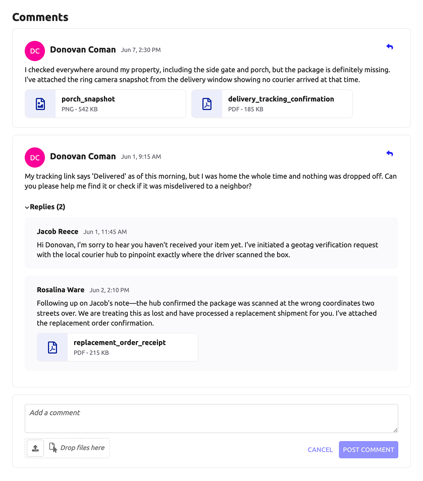

# Comment Thread [SAIL Design System: Patterns]

*Section: patterns | source: https://docs.appian.com/suite/help/26.7/sail/comment-thread.html | images referenced live in corpus/images/*

# Comment Thread

Use comment thread patterns to let users post, read, and respond to discussions within an application.

## Full page

Consider using a full-page UI for discussion threads to maximize usability. This design makes it easy to read longer posts and to skim long threads by scrolling.

You may also use this pattern at the bottom of a page, below other content.


```sail
a!headerContentLayout(
  header: {},
  contents: {
    a!columnsLayout(
      columns: {
        a!columnLayout(contents: {}),
        a!columnLayout(
          contents: {
            a!sectionLayout(
              label: "Let's brainstorm ideas for how to 10x our search engine marketing success",
              labelSize: "LARGE",
              labelColor: "STANDARD",
              contents: {
                a!richTextDisplayField(
                  labelPosition: "COLLAPSED",
                  value: {
                    a!richTextItem(
                      text: {
                        a!richTextIcon(icon: "chevron-left"),
                        " Back to all topics"
                      },
                      link: a!safeLink(
                        uri: "www.appian.com",
                        openLinkIn: "NEW_TAB"
                      ),
                      linkStyle: "STANDALONE"
                    )
                  }
                ),
                a!columnsLayout(
                  columns: {
                    a!columnLayout(
                      contents: {
                        a!imageField(
                          label: "",
                          labelPosition: "COLLAPSED",
                          images: {
                            a!webImage(
                              source: "https://randomuser.me/api/portraits/women/90.jpg"
                            )
                          },
                          size: "SMALL",
                          isThumbnail: false,
                          style: "AVATAR"
                        )
                      },
                      width: "EXTRA_NARROW"
                    ),
                    a!columnLayout(
                      contents: {
                        a!sideBySideLayout(
                          items: {
                            a!sideBySideItem(
                              item: a!richTextDisplayField(
                                labelPosition: "COLLAPSED",
                                value: {
                                  a!richTextItem(
                                    text: { "Irena Kim" },
                                    size: "MEDIUM",
                                    style: { "STRONG" }
                                  )
                                }
                              ),
                              width: "MINIMIZE"
                            ),
                            a!sideBySideItem(
                              item: a!richTextDisplayField(
                                labelPosition: "COLLAPSED",
                                value: {
                                  a!richTextItem(
                                    text: { "4 days ago" },
                                    color: "SECONDARY",
                                    size: "STANDARD"
                                  )
                                }
                              )
                            )
                          },
                          alignVertical: "BOTTOM",
                          spacing: "STANDARD"
                        ),
                        a!richTextDisplayField(
                          labelPosition: "COLLAPSED",
                          value: {
                            a!richTextItem(
                              text: {
                                "Lorem ipsum dolor sit amet, consectetur adipiscing elit, sed do eiusmod tempor incididunt ut labore et dolore magna aliqua. Ut enim ad minim veniam, quis nostrud exercitation ullamco laboris nisi ut aliquip ex ea commodo consequat. Duis aute irure dolor in reprehenderit in voluptate velit esse cillum dolore eu fugiat nulla pariatur. Excepteur sint occaecat cupidatat non proident, sunt in culpa qui officia deserunt mollit anim id est laborum."
                              },
                              size: "MEDIUM"
                            )
                          }
                        )
                      }
                    )
                  },
                  marginAbove: "MORE",
                  spacing: "DENSE"
                ),
                a!richTextDisplayField(
                  labelPosition: "COLLAPSED",
                  value: {
                    a!richTextItem(
                      text: { "4 Comments" },
                      size: "MEDIUM",
                      style: { "STRONG" }
                    )
                  },
                  marginAbove: "MORE",
                  marginBelow: "MORE"
                ),
                a!sideBySideLayout(
                  items: {
                    a!sideBySideItem(
                      item: a!imageField(
                        label: "",
                        labelPosition: "COLLAPSED",
                        images: {},
                        size: "TINY",
                        isThumbnail: false,
                        style: "AVATAR"
                      ),
                      width: "MINIMIZE"
                    ),
                    a!sideBySideItem(
                      item: a!paragraphField(
                        label: "Post a Comment",
                        labelPosition: "COLLAPSED",
                        placeholder: "Type your comment here...",
                        saveInto: {},
                        refreshAfter: "UNFOCUS",
                        height: "MEDIUM",
                        validations: {}
                      )
                    )
                  },
                  alignVertical: "TOP"
                ),
                a!buttonArrayLayout(
                  buttons: {
                    a!buttonWidget(label: "Post Comment", style: "SOLID")
                  },
                  align: "END",
                  marginBelow: "MORE"
                ),
                a!sideBySideLayout(
                  items: {
                    a!sideBySideItem(
                      item: a!imageField(
                        label: "",
                        labelPosition: "COLLAPSED",
                        images: {
                          a!webImage(
                            source: "https://randomuser.me/api/portraits/women/90.jpg"
                          )
                        },
                        size: "TINY",
                        isThumbnail: false,
                        style: "AVATAR"
                      ),
                      width: "MINIMIZE"
                    ),
                    a!sideBySideItem(
                      item: a!richTextDisplayField(
                        labelPosition: "COLLAPSED",
                        value: {
                          a!richTextItem(text: { "Irena Kim " }, style: { "STRONG" }),
                          "Lorem ipsum dolor sit amet, consectetur adipiscing elit, sed do eiusmod tempor incididunt ut labore et dolore magna aliqua. Ut enim ad minim veniam, quis nostrud exercitation ullamco laboris nisi ut aliquip ex ea commodo consequat. Duis aute irure dolor in reprehenderit in voluptate velit esse cillum dolore eu fugiat nulla pariatur. Excepteur sint occaecat cupidatat non proident, sunt in culpa qui officia deserunt mollit anim id est laborum.",
                          char(10),
                          char(10),
                          "Lorem ipsum dolor sit amet, consectetur adipiscing elit, sed do eiusmod tempor incididunt ut labore et dolore magna aliqua. Ut enim ad minim veniam, quis nostrud exercitation ullamco laboris nisi ut aliquip ex ea commodo consequat. Duis aute irure dolor in reprehenderit in voluptate velit esse ",
                          a!richTextItem(
                            text: {
                              a!richTextItem(text: { "...more" }, style: { "STRONG" })
                            },
                            link: a!safeLink(
                              uri: "www.appian.com",
                              openLinkIn: "NEW_TAB"
                            ),
                            linkStyle: "STANDALONE"
                          ),
                          char(10),
                          a!richTextItem(
                            text: { "5 minutes ago" },
                            color: "SECONDARY",
                            size: "SMALL"
                          )
                        },
                        /*marginAbove: "LESS"*/
                      )
                    )
                  },
                  alignVertical: "TOP",
                  marginBelow: "MORE"
                ),
                a!sideBySideLayout(
                  items: {
                    a!sideBySideItem(
                      item: a!imageField(
                        label: "",
                        labelPosition: "COLLAPSED",
                        images: {
                          a!webImage(
                            source: "https://randomuser.me/api/portraits/men/80.jpg"
                          )
                        },
                        size: "TINY",
                        isThumbnail: false,
                        style: "AVATAR"
                      ),
                      width: "MINIMIZE"
                    ),
                    a!sideBySideItem(
                      item: a!richTextDisplayField(
                        labelPosition: "COLLAPSED",
                        value: {
                          a!richTextItem(
                            text: { "Logan Douglas " },
                            style: { "STRONG" }
                          ),
                          "Lorem ipsum dolor sit amet, consectetur adipiscing elit, sed do eiusmod tempor incididunt ut labore et dolore magna aliqua. Ut enim ad minim veniam, quis nostrud exercitation ullamco laboris nisi ut aliquip ex ea commodo consequat. Duis aute irure dolor in reprehenderit in voluptate velit esse cillum dolore eu fugiat nulla pariatur. Excepteur sint occaecat cupidatat non proident, sunt in culpa qui officia deserunt mollit anim id est laborum.",
                          char(10),
                          a!richTextItem(
                            text: { "2 hours ago" },
                            color: "SECONDARY",
                            size: "SMALL"
                          )
                        },
                        /*marginAbove: "LESS"*/
                      )
                    )
                  },
                  alignVertical: "TOP",
                  marginBelow: "MORE"
                ),
                a!sideBySideLayout(
                  items: {
                    a!sideBySideItem(
                      item: a!imageField(
                        label: "",
                        labelPosition: "COLLAPSED",
                        images: {
                          a!webImage(
                            source: "https://randomuser.me/api/portraits/women/90.jpg"
                          )
                        },
                        size: "TINY",
                        isThumbnail: false,
                        style: "AVATAR"
                      ),
                      width: "MINIMIZE"
                    ),
                    a!sideBySideItem(
                      item: a!richTextDisplayField(
                        labelPosition: "COLLAPSED",
                        value: {
                          a!richTextItem(text: { "Irena Kim " }, style: { "STRONG" }),
                          "Lorem ipsum dolor sit amet, consectetur adipiscing elit, sed do eiusmod tempor incididunt ut labore et dolore magna aliqua. Ut enim ad minim veniam, quis nostrud exercitation ullamco laboris nisi ut aliquip ex ea commodo consequat. Duis aute irure dolor in reprehenderit in voluptate velit esse cillum dolore eu fugiat nulla pariatur. Excepteur sint occaecat cupidatat non proident, sunt in culpa qui officia deserunt mollit anim id est laborum.",
                          char(10),
                          a!richTextItem(
                            text: { "Yesterday 10:19AM" },
                            color: "SECONDARY",
                            size: "SMALL"
                          )
                        },
                        /*marginAbove: "LESS"*/
                      )
                    )
                  },
                  alignVertical: "TOP",
                  marginBelow: "MORE"
                ),
                a!sideBySideLayout(
                  items: {
                    a!sideBySideItem(
                      item: a!imageField(
                        label: "",
                        labelPosition: "COLLAPSED",
                        images: {
                          a!webImage(
                            source: "https://randomuser.me/api/portraits/women/53.jpg"
                          )
                        },
                        size: "TINY",
                        isThumbnail: false,
                        style: "AVATAR"
                      ),
                      width: "MINIMIZE"
                    ),
                    a!sideBySideItem(
                      item: a!richTextDisplayField(
                        labelPosition: "COLLAPSED",
                        value: {
                          a!richTextItem(text: { "Cheryl Hale " }, style: { "STRONG" }),
                          "Lorem ipsum dolor sit amet, consectetur adipiscing elit, sed do eiusmod tempor incididunt ut labore et dolore magna aliqua. Ut enim ad minim veniam, quis nostrud exercitation ullamco laboris nisi ut aliquip ex ea commodo consequat. Duis aute irure dolor in reprehenderit in voluptate velit esse cillum dolore eu fugiat nulla pariatur. Excepteur sint occaecat cupidatat non proident, sunt in culpa qui officia deserunt mollit anim id est laborum.",
                          char(10),
                          a!richTextItem(
                            text: { "2 days ago" },
                            color: "SECONDARY",
                            size: "SMALL"
                          )
                        },
                        /*marginAbove: "LESS"*/
                      )
                    )
                  },
                  alignVertical: "TOP"
                )
              }
            )
          },
          width: "WIDE"
        ),
        a!columnLayout(contents: {})
      }
    )
  },
  backgroundColor: "WHITE"
)
```

## With replies and attachments

Use this pattern when users need to reply to specific comments or attach files to a discussion. The collapsible replies section keeps the thread readable while still surfacing response context on demand.



```sail
a!localVariables(
  /* should be replaced with the logged in user's name */
  local!loggedInUser: "Donovan Coman",
  /* list of comments */
  local!comments: {
    a!map(
      name: "Donovan Coman",
      datetime: datetime(2026, 6, 7, 14, 30),
      comment: "I checked everywhere around my property, including the side gate and porch, but the package is definitely missing. I've attached the ring camera snapshot from the delivery window showing no courier arrived at that time.",
      attachments: {
        a!map(name: "porch_snapshot", size: 542, type: "image", extension: "png"),
        a!map(name: "delivery_tracking_confirmation", size: 185, type: "pdf", extension: "pdf")
      },
      replies: {}
    ),
    a!map(
      name: "Donovan Coman",
      datetime: datetime(2026, 6, 1, 9, 15),
      comment: "My tracking link says 'Delivered' as of this morning, but I was home the whole time and nothing was dropped off. Can you please help me find it or check if it was misdelivered to a neighbor?",
      attachments: {},
      replies: {
        a!map(
          name: "Jacob Reece",
          datetime: datetime(2026, 6, 1, 11, 45),
          comment: "Hi Donovan, I'm sorry to hear you haven't received your item yet. I've initiated a geotag verification request with the local courier hub to pinpoint exactly where the driver scanned the box.",
          attachments: {}
        ),
        a!map(
          name: "Rosalina Ware",
          datetime: datetime(2026, 6, 2, 14, 10),
          comment: "Following up on Jacob's note—the hub confirmed the package was scanned at the wrong coordinates two streets over. We are treating this as lost and have processed a replacement shipment for you. I've attached the replacement order confirmation.",
          attachments: {
            a!map(name: "replacement_order_receipt", size: 215, type: "pdf", extension: "pdf")
          }
        )
      }
    )
  },
  local!selectedAttachments: {},
  /* map to store new comment value */
  local!newComment: a!map(
    name: local!loggedInUser,
    datetime: now(),
    comment: null,
    attachments: {},
    replies: {}
  ),
  {
    /* TITLE + ADD COMMENT ACTION */
    a!headingField(
      text: "Comments",
      headingTag: "H3",
      marginAbove: "NONE",
      marginBelow: "LESS",
      size: "MEDIUM",
      fontWeight: "BOLD"
    ),
    a!forEach(
      items: local!comments,
      expression: a!localVariables(
        local!showReplyButton: false,
        local!replyAttachments,
        local!commentIndex: fv!index,
        local!reply: a!map(
          name: local!loggedInUser,
          datetime: now(),
          comment: null,
          attachments: {}
        ),
        local!replies: fv!item.replies,
        {
          a!cardLayout(
            contents: {
              /* COMMENTER + ACTIONS */
              a!sideBySideLayout(
                items: {
                  /* USER STAMP */
                  a!sideBySideItem(
                    item: a!stampField(
                      text: initials(fv!item.name),
                      marginAbove: "NONE",
                      marginBelow: "NONE",
                      size: "TINY",
                      backgroundColor: "#e21496"
                    ),
                    width: "MINIMIZE"
                  ),
                  /* NAME + DATE */
                  a!sideBySideItem(
                    item: a!richTextDisplayField(
                      label: "Commenter Name",
                      labelPosition: "COLLAPSED",
                      value: {
                        a!richTextItem(text: fv!item.name, size: "MEDIUM", style: "STRONG")
                      }
                    ),
                    width: "MINIMIZE"
                  ),
                  a!sideBySideItem(
                    item: a!richTextDisplayField(
                      label: "Comment Date",
                      labelPosition: "COLLAPSED",
                      value: {
                        a!richTextItem(
                          text: text(fv!item.datetime, "mmm d, h:mm AM/PM"),
                          size: "SMALL",
                          color: "#6C6C75"
                        )
                      }
                    ),
                    width: "MINIMIZE"
                  ),
                  /* REPLY ACTION */
                  a!sideBySideItem(
                    item: a!buttonArrayLayout(
                      buttons: {
                        a!buttonWidget(
                          tooltip: "Reply",
                          size: "SMALL",
                          color: "ACCENT",
                          icon: "reply",
                          style: "LINK",
                          value: true,
                          saveInto: local!showReplyButton
                        )
                      },
                      align: "END"
                    )
                  )
                },
                marginAbove: "NONE",
                marginBelow: "LESS",
                alignVertical: "MIDDLE"
              ),
              /* COMMENT */
              a!richTextDisplayField(
                label: "Comment",
                showWhen: a!isNotNullOrEmpty(fv!item.comment),
                labelPosition: "COLLAPSED",
                value: { a!richTextItem(text: fv!item.comment) }
              ),
              /* ATTACHMENTS */
              a!cardGroupLayout(
                label: "Attachments",
                showWhen: a!isNotNullOrEmpty(fv!item.attachments),
                labelPosition: "COLLAPSED",
                cards: {
                  a!forEach(
                    items: fv!item.attachments,
                    expression: {
                      a!cardLayout(
                        contents: {
                          a!columnsLayout(
                            columns: {
                              a!columnLayout(
                                contents: {
                                  a!cardLayout(
                                    contents: {
                                      a!richTextDisplayField(
                                        label: "Document Type",
                                        labelPosition: "COLLAPSED",
                                        value: {
                                          a!richTextIcon(
                                            icon: "file-" & fv!item.type & "-o",
                                            size: "MEDIUM_PLUS",
                                            color: "#152B99",
                                            caption: fv!item.type,
                                            altText: fv!item.type & " file"
                                          )
                                        },
                                        marginAbove: "EVEN_LESS",
                                        marginBelow: "EVEN_LESS",
                                        align: "CENTER"
                                      )
                                    },
                                    marginBelow: "NONE",
                                    style: "#EDEEFA",
                                    showBorder: false
                                  )
                                },
                                width: "EXTRA_NARROW"
                              ),
                              a!columnLayout(
                                contents: {
                                  a!cardLayout(
                                    contents: {
                                      a!richTextDisplayField(
                                        label: "Document Name",
                                        labelPosition: "COLLAPSED",
                                        value: {
                                          a!richTextItem(text: fv!item.name, style: "STRONG")
                                        },
                                        marginBelow: "NONE",
                                        preventWrapping: true
                                      ),
                                      a!richTextDisplayField(
                                        label: "Document Size",
                                        labelPosition: "COLLAPSED",
                                        value: {
                                          a!richTextItem(
                                            text: { upper(fv!item.extension), " - ", fv!item.size, " KB" },
                                            size: "SMALL",
                                            color: "#6C6C75"
                                          )
                                        },
                                        marginBelow: "NONE",
                                        preventWrapping: true
                                      )
                                    },
                                    showBorder: false
                                  )
                                }
                              )
                            },
                            marginAbove: "NONE",
                            marginBelow: "NONE",
                            alignVertical: "MIDDLE",
                            spacing: "NONE"
                          )
                        },
                        link: a!dynamicLink(),
                        borderColor: "#eee",
                        padding: "NONE",
                        shape: "ROUNDED"
                      )
                    }
                  )
                },
                cardWidth: "NARROW_PLUS",
                fillContainer: false,
                spacing: "DENSE"
              ),
              /* REPLIES */
              a!sectionLayout(
                label: concat("Replies (", count(fv!item.replies), ")"),
                contents: {
                  /* REPLY CARDS */
                  a!forEach(
                    items: fv!item.replies,
                    expression: {
                      a!cardLayout(
                        contents: {
                          /* COMMENTER */
                          a!sideBySideLayout(
                            items: {
                              a!sideBySideItem(
                                item: a!richTextDisplayField(
                                  label: "Replier Name",
                                  labelPosition: "COLLAPSED",
                                  value: {
                                    a!richTextItem(text: fv!item.name, style: "STRONG")
                                  }
                                ),
                                width: "MINIMIZE"
                              ),
                              a!sideBySideItem(
                                item: a!richTextDisplayField(
                                  label: "Reply Date",
                                  labelPosition: "COLLAPSED",
                                  value: {
                                    a!richTextItem(
                                      text: text(fv!item.datetime, "mmm d, h:mm AM/PM"),
                                      size: "SMALL",
                                      color: "#6C6C75"
                                    )
                                  }
                                ),
                                width: "MINIMIZE"
                              )
                            },
                            marginAbove: "NONE",
                            marginBelow: "LESS",
                            alignVertical: "MIDDLE"
                          ),
                          /* COMMENT */
                          a!richTextDisplayField(
                            label: "Reply",
                            labelPosition: "COLLAPSED",
                            value: { a!richTextItem(text: fv!item.comment) }
                          ),
                          /* ATTACHMENTS */
                          a!cardGroupLayout(
                            label: "Attachments",
                            showWhen: a!isNotNullOrEmpty(fv!item.attachments),
                            labelPosition: "COLLAPSED",
                            cards: {
                              a!forEach(
                                items: fv!item.attachments,
                                expression: {
                                  a!cardLayout(
                                    contents: {
                                      a!columnsLayout(
                                        columns: {
                                          a!columnLayout(
                                            contents: {
                                              a!cardLayout(
                                                contents: {
                                                  a!richTextDisplayField(
                                                    label: "Document Type",
                                                    labelPosition: "COLLAPSED",
                                                    value: {
                                                      a!richTextIcon(
                                                        icon: "file-" & fv!item.type & "-o",
                                                        size: "MEDIUM_PLUS",
                                                        color: "#152B99",
                                                        altText: fv!item.type & " file"
                                                      )
                                                    },
                                                    marginAbove: "EVEN_LESS",
                                                    marginBelow: "EVEN_LESS",
                                                    align: "CENTER"
                                                  )
                                                },
                                                marginBelow: "NONE",
                                                style: "#EDEEFA",
                                                showBorder: false
                                              )
                                            },
                                            width: "EXTRA_NARROW"
                                          ),
                                          a!columnLayout(
                                            contents: {
                                              a!cardLayout(
                                                contents: {
                                                  a!richTextDisplayField(
                                                    label: "Document Name",
                                                    labelPosition: "COLLAPSED",
                                                    value: {
                                                      a!richTextItem(text: fv!item.name, style: "STRONG")
                                                    },
                                                    marginBelow: "NONE",
                                                    preventWrapping: true
                                                  ),
                                                  a!richTextDisplayField(
                                                    label: "Document Size",
                                                    labelPosition: "COLLAPSED",
                                                    value: {
                                                      a!richTextItem(
                                                        text: { upper(fv!item.extension), " - ", fv!item.size, " KB" },
                                                        size: "SMALL",
                                                        color: "#6C6C75"
                                                      )
                                                    },
                                                    marginBelow: "NONE",
                                                    preventWrapping: true
                                                  )
                                                },
                                                showBorder: false
                                              )
                                            }
                                          )
                                        },
                                        marginAbove: "NONE",
                                        marginBelow: "NONE",
                                        alignVertical: "MIDDLE",
                                        spacing: "NONE"
                                      )
                                    },
                                    link: a!dynamicLink(),
                                    borderColor: "#eee",
                                    padding: "NONE",
                                    shape: "ROUNDED"
                                  )
                                }
                              )
                            },
                            marginAbove: "NONE",
                            marginBelow: "NONE",
                            cardWidth: "NARROW_PLUS",
                            fillContainer: false,
                            spacing: "DENSE"
                          )
                        },
                        marginAbove: "NONE",
                        marginBelow: "STANDARD",
                        style: "#FAFAFC",
                        showBorder: false,
                        padding: "STANDARD",
                        shape: "ROUNDED"
                      )
                    }
                  )
                },
                showWhen: a!isNotNullOrEmpty(fv!item.replies),
                isCollapsible: true,
                marginAbove: "STANDARD",
                marginBelow: "NONE",
                labelSize: "EXTRA_SMALL",
                labelColor: "STANDARD"
              ),
              /* NEW REPLY COMMENT */
              a!cardLayout(
                showWhen: local!showReplyButton,
                contents: {
                  a!paragraphField(
                    label: "Reply",
                    labelPosition: "COLLAPSED",
                    placeholder: "Add a reply",
                    height: "SHORT",
                    value: local!reply.comment,
                    saveInto: local!reply.comment
                  ),
                  a!sideBySideLayout(
                    alignVertical: "BOTTOM",
                    items: {
                      a!sideBySideItem(
                        width: "MINIMIZE",
                        item: a!fileUploadField(
                          placeholder: "Drop files here",
                          label: "Reply Attachments",
                          labelPosition: "COLLAPSED",
                          value: local!replyAttachments,
                          saveInto: local!replyAttachments,
                          dropZoneStyle: "COMPACT",
                          buttonDisplay: "ICON",
                          buttonStyle: "SECONDARY",
                          buttonSize: "SMALL"
                        )
                      ),
                      a!sideBySideItem(
                        item: a!buttonArrayLayout(
                          marginBelow: "NONE",
                          buttons: {
                            a!buttonWidget(
                              label: "cancel",
                              size: "SMALL",
                              style: "LINK",
                              saveInto: {
                                a!save(local!reply.comment, null),
                                a!save(local!replyAttachments, {}),
                                a!save(local!showReplyButton, false)
                              }
                            ),
                            a!buttonWidget(
                              label: "post reply",
                              disabled: and(
                                a!isNullOrEmpty(local!reply.comment),
                                a!isNullOrEmpty(local!replyAttachments)
                              ),
                              saveInto: {
                                if(
                                  a!isNotNullOrEmpty(local!replyAttachments),
                                  a!forEach(
                                    items: local!replyAttachments,
                                    expression: {
                                      a!save(
                                        local!reply.attachments,
                                        append(
                                          local!reply.attachments,
                                          a!map(
                                            name: document(fv!item, "name"),
                                            size: document(fv!item, "size"),
                                            extension: document(fv!item, "extension"),
                                            type: if(
                                              or(
                                                document(fv!item, "extension") = "png",
                                                document(fv!item, "extension") = "jpg"
                                              ),
                                              "image",
                                              document(fv!item, "extension")
                                            )
                                          )
                                        )
                                      )
                                    }
                                  ),
                                  {}
                                ),
                                a!save(local!replies, append(local!replies, local!reply)),
                                a!save(local!comments[local!commentIndex].replies, local!replies),
                                a!save(local!reply.comment, null),
                                a!save(local!replyAttachments, {})
                              },
                              size: "SMALL",
                              style: "SOLID"
                            )
                          },
                          align: "END"
                        )
                      )
                    }
                  )
                },
                marginBelow: "NONE",
                showBorder: false,
                style: "#FAFAFC",
                padding: "STANDARD",
                shape: "ROUNDED"
              )
            },
            marginBelow: "STANDARD",
            showBorder: true,
            borderColor: "#eee",
            padding: "STANDARD",
            shape: "ROUNDED"
          )
        }
      )
    ),
    /* NEW COMMENT FIELD */
    a!cardLayout(
      contents: {
        a!paragraphField(
          label: "Comment",
          labelPosition: "COLLAPSED",
          placeholder: "Add a comment",
          height: "SHORT",
          value: local!newComment.comment,
          saveInto: local!newComment.comment
        ),
        a!sideBySideLayout(
          alignVertical: "BOTTOM",
          items: {
            a!sideBySideItem(
              width: "MINIMIZE",
              item: a!fileUploadField(
                placeholder: "Drop files here",
                label: "Comment Attachments",
                labelPosition: "COLLAPSED",
                value: local!selectedAttachments,
                saveInto: local!selectedAttachments,
                dropZoneStyle: "COMPACT",
                buttonDisplay: "ICON",
                buttonStyle: "SECONDARY",
                buttonSize: "SMALL"
              )
            ),
            a!sideBySideItem(
              item: a!buttonArrayLayout(
                marginBelow: "NONE",
                buttons: {
                  a!buttonWidget(
                    label: "cancel",
                    size: "SMALL",
                    style: "LINK",
                    disabled: and(
                      a!isNullOrEmpty(local!newComment.comment),
                      a!isNullOrEmpty(local!selectedAttachments)
                    ),
                    saveInto: {
                      a!save(local!newComment.comment, null),
                      a!save(local!selectedAttachments, {})
                    }
                  ),
                  a!buttonWidget(
                    label: "post comment",
                    disabled: and(
                      a!isNullOrEmpty(local!newComment.comment),
                      a!isNullOrEmpty(local!selectedAttachments)
                    ),
                    saveInto: {
                      if(
                        a!isNotNullOrEmpty(local!selectedAttachments),
                        a!forEach(
                          items: local!selectedAttachments,
                          expression: {
                            a!save(
                              local!newComment.attachments,
                              append(
                                local!newComment.attachments,
                                a!map(
                                  name: document(fv!item, "name"),
                                  size: document(fv!item, "size"),
                                  extension: document(fv!item, "extension"),
                                  type: if(
                                    or(
                                      document(fv!item, "extension") = "png",
                                      document(fv!item, "extension") = "jpg"
                                    ),
                                    "image",
                                    document(fv!item, "extension")
                                  )
                                )
                              )
                            )
                          }
                        ),
                        {}
                      ),
                      a!save(local!comments, append(local!comments, local!newComment)),
                      a!save(
                        local!newComment,
                        a!map(
                          name: local!loggedInUser,
                          datetime: now(),
                          comment: null,
                          attachments: {},
                          replies: {}
                        )
                      ),
                      a!save(local!selectedAttachments, {})
                    },
                    size: "SMALL",
                    style: "SOLID"
                  )
                },
                align: "END"
              )
            )
          }
        )
      },
      marginBelow: "NONE",
      borderColor: "#eee",
      padding: "STANDARD",
      shape: "ROUNDED"
    )
  }
)
```

## Widget

Use this pattern to display a comment thread alongside other related content.

** Display comments in their own column or at the bottom of the page so that users can skim long threads by scrolling. While you may add paging controls for traversing long threads, aim to minimize the need to paginate.


```sail
{
 a!sectionLayout(
   label: "",
   contents: {
     a!sideBySideLayout(
       items: {
         a!sideBySideItem(
           item: a!imageField(
             label: "",
             labelPosition: "COLLAPSED",
             images: {},
             size: "TINY",
             isThumbnail: false,
             style: "AVATAR"
           ),
           width: "MINIMIZE"
         ),
         a!sideBySideItem(
           item: a!paragraphField(
             label: "Post a Comment",
             labelPosition: "COLLAPSED",
             placeholder: "Type your comment here...",
             saveInto: {},
             refreshAfter: "UNFOCUS",
             height: "MEDIUM",
             validations: {}
           )
         )
       },
       alignVertical: "TOP"
     ),
     a!buttonArrayLayout(
       buttons: {
         a!buttonWidget(label: "Post Comment", style: "SOLID")
       },
       align: "END",
       marginBelow: "NONE"
     )
   },
   divider: "BELOW"
 ),
 a!richTextDisplayField(
   labelPosition: "COLLAPSED",
   value: {
     a!richTextItem(
       text: { "4 Comments" },
       size: "MEDIUM",
       style: { "STRONG" }
     )
   },
   marginAbove: "EVEN_LESS",
   marginBelow: "MORE"
 ),
 a!sideBySideLayout(
   items: {
     a!sideBySideItem(
       item: a!imageField(
         label: "",
         labelPosition: "COLLAPSED",
         images: {
           a!webImage(
             source: "https://randomuser.me/api/portraits/women/90.jpg"
           )
         },
         size: "TINY",
         isThumbnail: false,
         style: "AVATAR"
       ),
       width: "MINIMIZE"
     ),
     a!sideBySideItem(
       item: a!richTextDisplayField(
         labelPosition: "COLLAPSED",
         value: {
           a!richTextItem(text: { "Irena Kim " }, style: { "STRONG" }),
           "Lorem ipsum dolor sit amet, consectetur adipiscing elit, sed do eiusmod tempor incididunt ut labore et dolore magna aliqua. Ut enim ad minim veniam, quis nostrud exercitation ullamco laboris nisi ut aliquip ex ea commodo consequat. Duis aute irure dolor in reprehenderit in voluptate velit esse cillum dolore eu fugiat nulla pariatur. Excepteur sint occaecat cupidatat non proident, sunt in culpa qui officia deserunt mollit anim id est laborum.",
           char(10),
           char(10),
           "Lorem ipsum dolor sit amet, consectetur adipiscing elit, sed do eiusmod tempor incididunt ut labore et dolore magna aliqua. Ut enim ad minim veniam, quis nostrud exercitation ullamco laboris nisi ut aliquip ex ea commodo consequat. Duis aute irure dolor in reprehenderit in voluptate velit esse ",
           a!richTextItem(
             text: {
               a!richTextItem(text: { "...more" }, style: { "STRONG" })
             },
             link: a!safeLink(
               uri: "www.appian.com",
               openLinkIn: "NEW_TAB"
             ),
             linkStyle: "STANDALONE"
           ),
           char(10),
           a!richTextItem(
             text: { "5 minutes ago" },
             color: "SECONDARY",
             size: "SMALL"
           )
         },
         marginAbove: "LESS"
       )
     )
   },
   alignVertical: "TOP"
 ),
 a!sideBySideLayout(
   items: {
     a!sideBySideItem(
       item: a!imageField(
         label: "",
         labelPosition: "COLLAPSED",
         images: {
           a!webImage(
             source: "https://randomuser.me/api/portraits/men/80.jpg"
           )
         },
         size: "TINY",
         isThumbnail: false,
         style: "AVATAR"
       ),
       width: "MINIMIZE"
     ),
     a!sideBySideItem(
       item: a!richTextDisplayField(
         labelPosition: "COLLAPSED",
         value: {
           a!richTextItem(
             text: { "Logan Douglas " },
             style: { "STRONG" }
           ),
           "Lorem ipsum dolor sit amet, consectetur adipiscing elit, sed do eiusmod tempor incididunt ut labore et dolore magna aliqua. Ut enim ad minim veniam, quis nostrud exercitation ullamco laboris nisi ut aliquip ex ea commodo consequat. Duis aute irure dolor in reprehenderit in voluptate velit esse cillum dolore eu fugiat nulla pariatur. Excepteur sint occaecat cupidatat non proident, sunt in culpa qui officia deserunt mollit anim id est laborum.",
           char(10),
           a!richTextItem(
             text: { "2 hours ago" },
             color: "SECONDARY",
             size: "SMALL"
           )
         },
         marginAbove: "LESS"
       )
     )
   },
   alignVertical: "TOP"
 ),
 a!sideBySideLayout(
   items: {
     a!sideBySideItem(
       item: a!imageField(
         label: "",
         labelPosition: "COLLAPSED",
         images: {
           a!webImage(
             source: "https://randomuser.me/api/portraits/women/90.jpg"
           )
         },
         size: "TINY",
         isThumbnail: false,
         style: "AVATAR"
       ),
       width: "MINIMIZE"
     ),
     a!sideBySideItem(
       item: a!richTextDisplayField(
         labelPosition: "COLLAPSED",
         value: {
           a!richTextItem(text: { "Irena Kim " }, style: { "STRONG" }),
           "Lorem ipsum dolor sit amet, consectetur adipiscing elit, sed do eiusmod tempor incididunt ut labore et dolore magna aliqua. Ut enim ad minim veniam, quis nostrud exercitation ullamco laboris nisi ut aliquip ex ea commodo consequat. Duis aute irure dolor in reprehenderit in voluptate velit esse cillum dolore eu fugiat nulla pariatur. Excepteur sint occaecat cupidatat non proident, sunt in culpa qui officia deserunt mollit anim id est laborum.",
           char(10),
           a!richTextItem(
             text: { "Yesterday 10:19AM" },
             color: "SECONDARY",
             size: "SMALL"
           )
         },
         marginAbove: "LESS"
       )
     )
   },
   alignVertical: "TOP"
 ),
 a!sideBySideLayout(
   items: {
     a!sideBySideItem(
       item: a!stampField(
         labelPosition: "COLLAPSED",
         text: "CH",
         backgroundColor: "#3c78d8",
         contentColor: "STANDARD",
         size: "TINY"
       ),
       width: "MINIMIZE"
     ),
     a!sideBySideItem(
       item: a!richTextDisplayField(
         labelPosition: "COLLAPSED",
         value: {
           a!richTextItem(text: { "Cheryl Hale " }, style: { "STRONG" }),
           "Lorem ipsum dolor sit amet, consectetur adipiscing elit, sed do eiusmod tempor incididunt ut labore et dolore magna aliqua. Ut enim ad minim veniam, quis nostrud exercitation ullamco laboris nisi ut aliquip ex ea commodo consequat. Duis aute irure dolor in reprehenderit in voluptate velit esse cillum dolore eu fugiat nulla pariatur. Excepteur sint occaecat cupidatat non proident, sunt in culpa qui officia deserunt mollit anim id est laborum.",
           char(10),
           a!richTextItem(
             text: { "2 days ago" },
             color: "SECONDARY",
             size: "SMALL"
           )
         },
         marginAbove: "LESS"
       )
     )
   },
   alignVertical: "TOP"
 )
}
```
