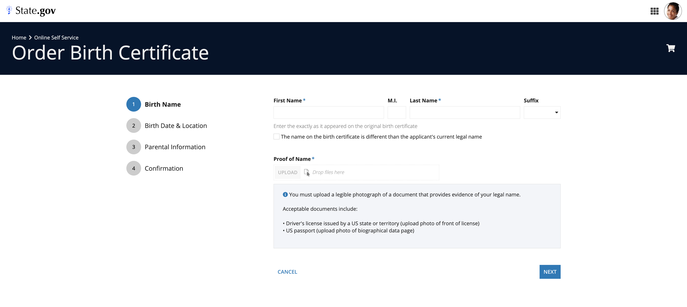

# Components Overview [SAIL Design System: Components]

*Section: components | source: https://docs.appian.com/suite/help/26.7/sail/components.html | images referenced live in corpus/images/*

# Components Overview

Learn about design best practices for our most popular components.

Components are the building blocks of SAIL interfaces.

This collection of documentation provides design best practices for our most popular components.

For detailed reference information about these components, see the developer documentation.

