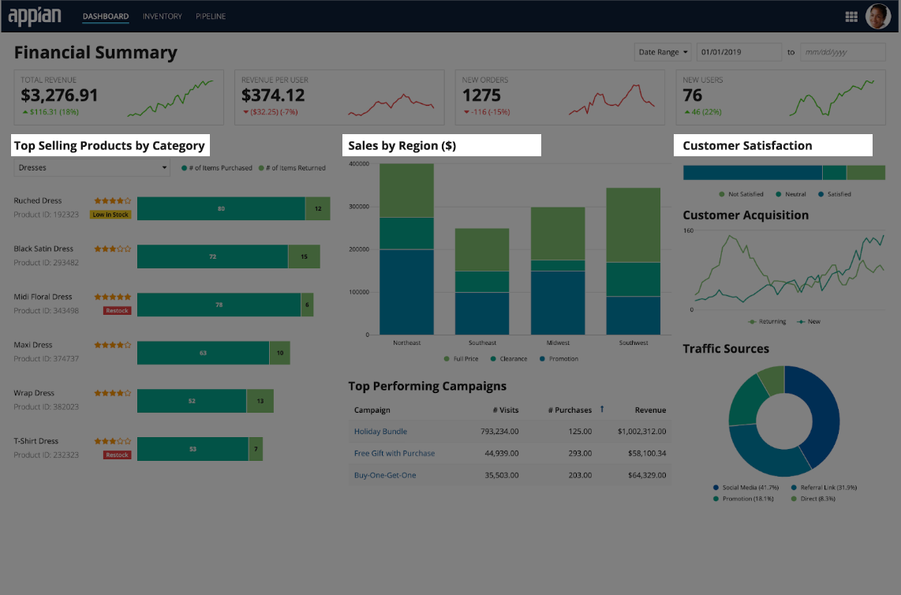
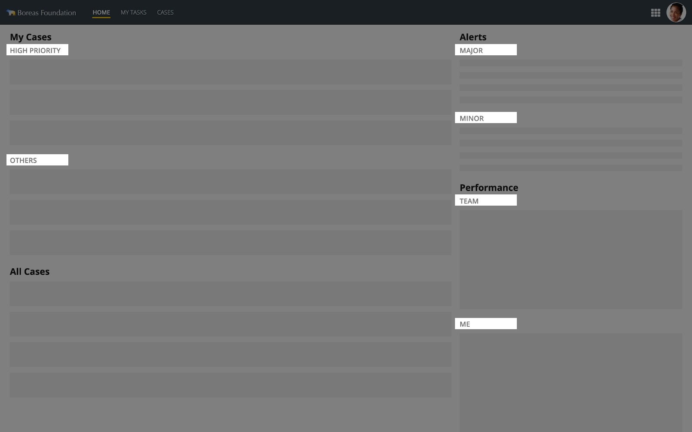
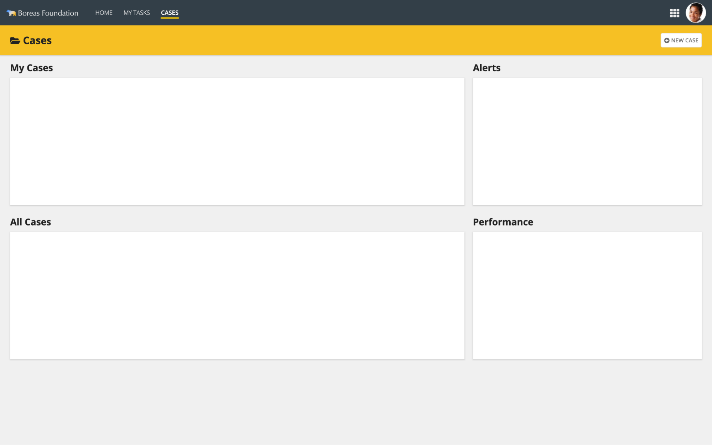
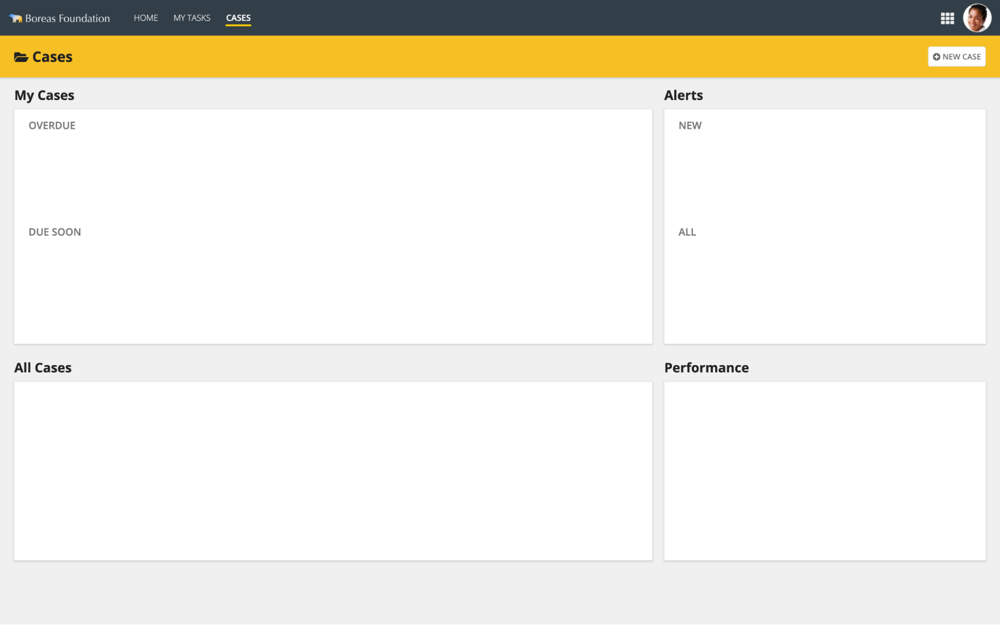
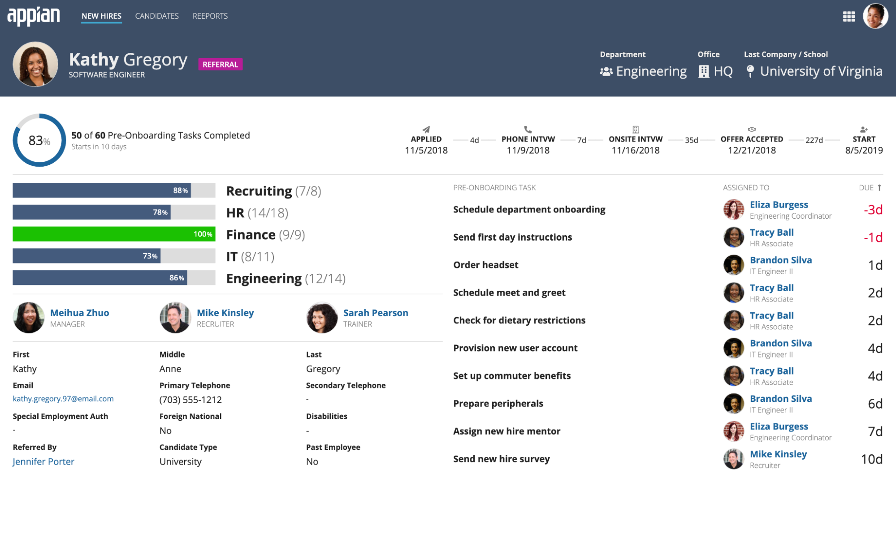

# Content Structure [SAIL Design System: Patterns]

*Section: patterns | source: https://docs.appian.com/suite/help/26.7/sail/content-structure.html | images referenced live in corpus/images/*

# Content Structure

Use a consistent method to express the structure of the main content sections on each page.

## Primary section heading

Use this style to label the primary content sections on a page.

Section Label Size: **Medium**
Heading Tag: **H2**
Section Label Color: **Standard**

## Secondary section heading

Use this style to label the secondary content sections on a page. Applying all-caps capitalization helps to make these headings stand out even when they are positioned next to primary section headings.

Section Label Size: **Small**
Heading Tag: **H3**
Section Label Color: **Secondary**

## Primary content card heading

When page content is laid out as cards, use this style for primary section headings. Showing the section heading above the card instead of inside the card makes it more visible and also makes it easier to balance the layout of card contents.

See Card Layout for more tips.

Section Label Size: **Medium**
Heading Tag: **H2**
Section Label Color: **Standard**

** This title bar header style works best for showing a page title alongside content cards.

** Primary content cards on transparent page backgrounds should have shadows enabled and borders disabled.

## Secondary section heading in cards

If needed, secondary sections may be added within each card to create sub-groups of contents.

Section Label Size: **Small**
Heading Tag: **H3**
Section Label Color: **Secondary**

## Omitting section headings

Section headings are not always needed for comprehension of content. In this example, the use of varied visual styles makes it easy to identify the different parts of the page. Use of standard information representation techniques also makes the purpose of each section clear without explicit labels.

** Non-sighted users may not easily understand page structure when using a screen reader. Consider adding hidden labels and/or accessibility text to explain the purpose of each section.

