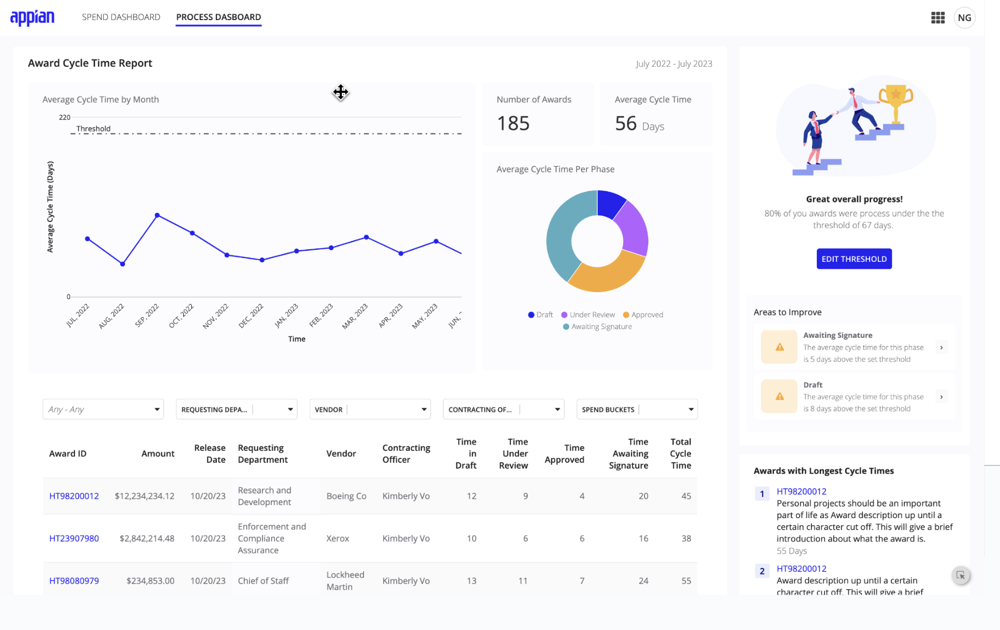

# Dashboards [SAIL Design System: Patterns]

*Section: patterns | source: https://docs.appian.com/suite/help/26.7/sail/dashboards.html | images referenced live in corpus/images/*

# Dashboards

Display charts, grids, and key performance indicators to visually show data to users.

## What is a dashboard?

Dashboards display data visually. They show some combination of charts, grids, and key performance indicators.

When deciding how to design a dashboard, keep the following questions and considerations in mind:

- **Information quantity**: What information should be prioritized? How can you select and highlight the most important data?

- **Data display**: What data is valuable for your users? How can you make it more digestible?

## Limiting information to reduce cognitive load

To make it easier for users to process data, limit data points and categories of data to reduce cognitive load. Note that this pattern uses a dark color scheme to reduce eye strain and make it easier to digest information.


```sail
a!headerContentLayout(
  header: a!cardLayout(
    contents: {
      a!localVariables(
        local!dateType: 1,
        local!startDate: todate("01/01/2019"),
        local!endDate: todate("16/01/2019"),
        local!kpis: {
          {
            name: "Total Revenue",
            todayPrice: dollar(fixed(3276.91)),
            yesterdayPrice: dollar(fixed(116.31)),
            icon: "caret-up",
            percent: "(18%)",
            color: "#4CC900",
            data: {
              1,
              3,
              2,
              4,
              3,
              2,
              5,
              7,
              10,
              12,
              7,
              6,
              15,
              14,
              13,
              10,
              15,
              13,
              15,
              22,
              24,
              19,
              15,
              25,
              25,
              30,
              30,
              35,
              32,
              36,
              39,
              35,
              38,
              39,
              40
            }
          },
          {
            name: "Revenue Per User",
            todayPrice: dollar(fixed(374.12)),
            yesterdayPrice: dollar(fixed( - 32.25)),
            icon: "caret-down",
            percent: "(-7%)",
            color: "#E64345",
            data: {
              3,
              5,
              4,
              2,
              3,
              2,
              4,
              5,
              7,
              10,
              12,
              16,
              17,
              15,
              15,
              16,
              13,
              10,
              15,
              17,
              20,
              21,
              25,
              22,
              22,
              17,
              15,
              17,
              16,
              15,
              14,
              13,
              13,
              14,
              10
            }
          },
          {
            name: "New Orders",
            todayPrice: 1275,
            yesterdayPrice: - 116,
            icon: "caret-down",
            percent: "(-15%)",
            color: "#E64345",
            data: {
              3,
              5,
              7,
              6,
              8,
              10,
              12,
              4,
              16,
              13,
              22,
              26,
              24,
              25,
              16,
              14,
              13,
              13,
              14,
              12,
              16,
              20,
              22,
              27,
              30,
              35,
              34,
              35,
              23,
              18,
              16,
              17,
              14,
              12
            }
          },
          {
            name: "New Users",
            todayPrice: 76,
            yesterdayPrice: 46,
            icon: "caret-up",
            percent: "(22%)",
            color: "#4CC900",
            data: {
              2,
              3,
              5,
              13,
              20,
              17,
              23,
              24,
              22,
              18,
              12,
              10,
              3,
              4,
              2,
              15,
              16,
              20,
              26,
              23,
              27,
              28,
              30,
              34,
              33,
              32,
              30,
              35,
              40,
              38,
              37,
              42
            }
          }
        },
        {
          a!sectionLayout(
            contents: {
              a!sideBySideLayout(
                items: {
                  a!sideBySideItem(
                    item: a!headingField(
                      marginBelow: "NONE",
                      text: "Financial Summary",
                      size: "SMALL",
                      weight: "SEMI_BOLD"
                    ),
                    width: "MINIMIZE"
                  ),
                  a!sideBySideItem(
                    item: a!dropdownField(
                      label: "Timeframe Type",
                      labelPosition: "COLLAPSED",
                      placeholder: "--- Select a Value ---",
                      choiceLabels: { "Date Range", "Week", "Month", "Year" },
                      choiceValues: { 1, 2, 3, 4 },
                      value: local!dateType,
                      saveInto: local!dateType
                    ),
                    width: "MINIMIZE"
                  ),
                  a!sideBySideItem(
                    item: a!dateField(
                      label: "Date",
                      labelPosition: "COLLAPSED",
                      value: local!startDate,
                      saveInto: local!startDate
                    ),
                    width: "MINIMIZE"
                  ),
                  a!sideBySideItem(
                    item: a!richTextDisplayField(
                      label: "Rich Text",
                      labelPosition: "COLLAPSED",
                      value: "to"
                    ),
                    width: "MINIMIZE"
                  ),
                  a!sideBySideItem(
                    item: a!dateField(
                      label: "Date",
                      labelPosition: "COLLAPSED",
                      value: local!endDate,
                      saveInto: local!endDate
                    ),
                    width: "MINIMIZE"
                  )
                },
                alignVertical: "MIDDLE"
              )
            },
            showWhen: false
          ),
          a!cardGroupLayout(
            labelPosition: "COLLAPSED",
            cardWidth: "NARROW_PLUS",
            cards: {
              a!forEach(
                items: local!kpis,
                expression: a!cardLayout(
                  contents: {
                    a!columnsLayout(
                      columns: {
                        a!columnLayout(
                          contents: {
                            a!headingField(
                              text: fv!item.name,
                              size: "SMALL",
                              weight: "SEMI_BOLD",
                              marginBelow: "NONE"
                            ),
                            a!richTextDisplayField(
                              labelPosition: "COLLAPSED",
                              value: {
                                a!richTextItem(
                                  text: fv!item.todayPrice,
                                  size: "MEDIUM_PLUS"
                                ),
                                char(10),
                                a!richTextIcon(
                                  icon: fv!item.icon,
                                  color: fv!item.color,
                                  size: "MEDIUM"
                                ),
                                a!richTextItem(
                                  text: fv!item.yesterdayPrice & " " & fv!item.percent,
                                  color: fv!item.color,
                                  size: "STANDARD"
                                )
                              }
                            )
                          }
                        ),
                        a!columnLayout(
                          contents: a!localVariables(
                            local!kpiName: fv!item.name,
                            {
                              a!lineChartField(
                                labelPosition: "ABOVE",
                                categories: a!forEach(
                                  items: fv!item.data,
                                  expression: local!kpiName
                                ),
                                series: {
                                  a!chartSeries(
                                    label: "count",
                                    data: fv!item.data,
                                    color: fv!item.color
                                  )
                                },
                                yAxisMax: 40,
                                showLegend: false,
                                height: "MICRO",
                                xAxisStyle: "NONE",
                                yAxisStyle: "NONE"
                              )
                            }
                          )
                        )
                      }
                    )
                  },
                  style: "PLUM_SCHEME",
                  padding: "STANDARD",
                  marginBelow: "NONE",
                  showBorder: false
                )
              )
            }
          )
        }
      )
    },
    height: "AUTO",
    style: "#17202b",
    padding: "STANDARD",
    marginBelow: "NONE",
    showBorder: false
  ),
  contents: a!localVariables(
    local!dateType: 1,
    local!startDate: todate("01/01/2019"),
    local!endDate: todate("16/01/2019"),
    local!category: 1,
    local!products: {
      {
        name: "Ruched Dress",
        rating: 4,
        tags: { "Low in Stock" },
        id: 192323,
        data: { 80 },
        data2: { 12 }
      },
      {
        name: "Black Satin Dress",
        rating: 3,
        tags: {},
        id: 293482,
        data: { 72 },
        data2: { 15 }
      },
      {
        name: "Midi Floral Dress",
        rating: 5,
        tags: { "Restock" },
        id: 343498,
        data: { 78 },
        data2: { 6 }
      },
      {
        name: "Maxi Dress",
        rating: 4,
        tags: {},
        id: 374737,
        data: { 63 },
        data2: { 10 }
      },
      {
        name: "Wrap Dress",
        rating: 4,
        tags: {},
        id: 382023,
        data: { 52 },
        data2: { 13 }
      },
      {
        name: "T-Shirt Dress",
        rating: 3,
        tags: { "Restock" },
        id: 232323,
        data: { 53 },
        data2: { 7 }
      }
    },
    {
      a!sectionLayout(
        contents: {
          a!sideBySideLayout(
            items: {
              a!sideBySideItem(
                item: a!headingField(
                  text: "Financial Summary",
                  size: "SMALL",
                  weight: "SEMI_BOLD",
                  marginBelow: "NONE"
                ),
                width: "MINIMIZE"
              ),
              a!sideBySideItem(
                item: a!dropdownField(
                  label: "Timeframe Type",
                  labelPosition: "COLLAPSED",
                  placeholder: "--- Select a Value ---",
                  choiceLabels: { "Date Range", "Week", "Month", "Year" },
                  choiceValues: { 1, 2, 3, 4 },
                  value: local!dateType,
                  saveInto: local!dateType
                ),
                width: "MINIMIZE"
              ),
              a!sideBySideItem(
                item: a!dateField(
                  label: "Date",
                  labelPosition: "COLLAPSED",
                  value: local!startDate,
                  saveInto: local!startDate
                ),
                width: "MINIMIZE"
              ),
              a!sideBySideItem(
                item: a!richTextDisplayField(
                  label: "Rich Text",
                  labelPosition: "COLLAPSED",
                  value: "to"
                ),
                width: "MINIMIZE"
              ),
              a!sideBySideItem(
                item: a!dateField(
                  label: "Date",
                  labelPosition: "COLLAPSED",
                  value: local!endDate,
                  saveInto: local!endDate
                ),
                width: "MINIMIZE"
              )
            },
            alignVertical: "MIDDLE"
          )
        },
        showWhen: false,
        marginAbove: "NONE",
        marginBelow: "NONE"
      ),
      a!columnsLayout(
        columns: {
          a!columnLayout(
            contents: {
              a!cardLayout(
                contents: {
                  a!headingField(
                    text: "Top Selling Products By Category",
                    size: "SMALL",
                    weight: "SEMI_BOLD"
                  ),
                  a!columnsLayout(
                    columns: {
                      a!columnLayout(
                        contents: {
                          a!dropdownField(
                            label: "Dropdown",
                            labelPosition: "COLLAPSED",
                            placeholder: "--- Select a Value ---",
                            choiceLabels: { "Dresses", "Tops" },
                            choiceValues: { 1, 2 },
                            value: local!category,
                            saveInto: local!category
                          )
                        },
                        width: "NARROW"
                      ),
                      a!columnLayout(
                        contents: {
                          a!sideBySideLayout(
                            items: {
                              a!sideBySideItem(
                                item: a!richTextDisplayField(
                                  labelPosition: "COLLAPSED",
                                  value: {
                                    a!richTextIcon(
                                      icon: "circle",
                                      color: "#00A88F",
                                      size: "SMALL"
                                    ),
                                    a!richTextItem(
                                      text: " " & "# of Items Purchased",
                                      size: "SMALL"
                                    )
                                  }
                                ),
                                width: "MINIMIZE"
                              ),
                              a!sideBySideItem(
                                item: a!richTextDisplayField(
                                  labelPosition: "COLLAPSED",
                                  value: {
                                    a!richTextIcon(
                                      icon: "circle",
                                      color: "#82C272",
                                      size: "SMALL"
                                    ),
                                    a!richTextItem(
                                      text: " " & "# of Items Returned",
                                      size: "SMALL"
                                    )
                                  }
                                ),
                                width: "MINIMIZE"
                              )
                            },
                            alignVertical: "TOP",
                            marginBelow: "NONE"
                          )
                        }
                      )
                    },
                    alignVertical: "MIDDLE"
                  ),
                  a!forEach(
                    items: local!products,
                    expression: a!columnsLayout(
                      columns: {
                        a!columnLayout(
                          contents: {
                            a!sideBySideLayout(
                              items: {
                                a!sideBySideItem(
                                  item: a!richTextDisplayField(
                                    value: { a!richTextItem(text: fv!item.name) }
                                  ),
                                  width: "MINIMIZE"
                                ),
                                a!localVariables(
                                  local!productRating: fv!item.rating,
                                  a!sideBySideItem(
                                    item: a!richTextDisplayField(
                                      value: a!forEach(
                                        items: enumerate(5) + 1,
                                        expression: a!richTextIcon(
                                          icon: if(
                                            fv!index <= tointeger(local!productRating),
                                            "star",
                                            "star-o"
                                          ),
                                          color: "#fc9901"
                                        )
                                      ),
                                      align: "RIGHT"
                                    )
                                  )
                                )
                              },
                              alignVertical: "BOTTOM",
                              marginBelow: "NONE"
                            ),
                            a!sideBySideLayout(
                              items: {
                                a!sideBySideItem(
                                  item: a!richTextDisplayField(
                                    value: {
                                      a!richTextItem(
                                        text: "Product ID: " & fv!item.id,
                                        color: "SECONDARY"
                                      )
                                    }
                                  ),
                                  width: "MINIMIZE"
                                ),
                                a!sideBySideItem(
                                  item: a!tagField(
                                    tags: {
                                      a!tagItem(
                                        text: fv!item.tags,
                                        backgroundColor: if(
                                          tostring(fv!item.tags) = "Low in Stock",
                                          "#F7D027",
                                          "#E64345"
                                        )
                                      )
                                    },
                                    size: "SMALL",
                                    align: "END"
                                  )
                                )
                              },
                              alignVertical: "MIDDLE",
                              marginBelow: "NONE"
                            )
                          },
                          width: "NARROW"
                        ),
                        a!columnLayout(
                          contents: {
                            a!richTextDisplayField(labelPosition: "COLLAPSED"),
                            a!barChartField_21r4(
                              categories: fv!item.name,
                              series: {
                                a!chartSeries(label: "Returned", data: fv!item.data2),
                                a!chartSeries(label: "Purcahsed", data: fv!item.data)
                              },
                              yAxisMax: 95,
                              stacking: "NORMAL",
                              showLegend: false,
                              showDataLabels: true,
                              labelPosition: "COLLAPSED",
                              colorScheme: "RAINFOREST",
                              height: "MICRO",
                              xAxisStyle: "NONE",
                              yAxisStyle: "NONE"
                            )
                          }
                        )
                      },
                      alignVertical: "MIDDLE",
                      marginBelow: "NONE",
                      spacing: "DENSE"
                    )
                  )
                },
                style: "PLUM_SCHEME",
                padding: "STANDARD",
                showBorder: false
              )
            }
          ),
          a!columnLayout(
            contents: {
              a!cardLayout(
                contents: {
                  a!headingField(
                    text: "Sales by Region ($)",
                    size: "SMALL",
                    weight: "SEMI_BOLD"
                  ),
                  a!columnChartField(
                    categories: {
                      "Northeast",
                      "Southeast",
                      "Midwest",
                      "Southwest"
                    },
                    series: {
                      a!chartSeries(
                        label: "Full Price",
                        data: { 125000, 100000, 125000, 175000 }
                      ),
                      a!chartSeries(
                        label: "Clearance",
                        data: { 75000, 50000, 25000, 80000 }
                      ),
                      a!chartSeries(
                        label: "Promotion",
                        data: { 200000, 100000, 150000, 90000 }
                      )
                    },
                    stacking: "NORMAL",
                    showLegend: true,
                    showTooltips: true,
                    labelPosition: "COLLAPSED",
                    colorScheme: "RAINFOREST"
                  )
                },
                style: "PLUM_SCHEME",
                padding: "STANDARD",
                showBorder: false
              ),
              a!sectionLayout(),
              a!cardLayout(
                contents: {
                  a!headingField(
                    text: "Top Performing Campaigns",
                    size: "SMALL",
                    weight: "SEMI_BOLD"
                  ),
                  a!gridField(
                    labelPosition: "COLLAPSED",
                    /* Replace the dummy data with a query, rule, or function that returns a datasubset and uses fv!pagingInfo as the paging configuration. */
                    data: todatasubset(
                      {
                        {
                          name: "Free Gift with Purchase",
                          visits: 44939,
                          purchases: 293,
                          revenue: dollar(58100.34)
                        },
                        {
                          name: "Buy-One-Get-One",
                          visits: 35503,
                          purchases: 203,
                          revenue: dollar(64329.00)
                        },
                        {
                          name: "Holiday Bundle",
                          visits: 793234,
                          purchases: 125,
                          revenue: dollar(1002312)
                        }
                      },
                      fv!pagingInfo
                    ),
                    columns: {
                      a!gridColumn(
                        label: "Campaign",
                        sortField: "name",
                        value: a!linkField(links: a!dynamicLink(label: fv!row.name))
                      ),
                      a!gridColumn(
                        label: "# Visits",
                        sortField: "visits",
                        value: fixed(fv!row.visits),
                        align: "END"
                      ),
                      a!gridColumn(
                        label: "# Purchases",
                        sortField: "purchases",
                        value: fixed(fv!row.purchases),
                        align: "END"
                      ),
                      a!gridColumn(
                        label: "Revenue",
                        sortField: "revenue",
                        value: fv!row.revenue,
                        align: "END"
                      )
                    },
                    pageSize: 3,
                    initialSorts: a!sortInfo(field: "revenue", ascending: true),
                    borderStyle: "LIGHT",
                    shadeAlternateRows: false
                  )
                },
                style: "PLUM_SCHEME",
                padding: "STANDARD",
                showBorder: false
              )
            }
          ),
          a!columnLayout(
            contents: {
              a!cardLayout(
                contents: {
                  a!headingField(
                    text: "Customer Satisfaction",
                    size: "SMALL",
                    weight: "SEMI_BOLD"
                  ),
                  a!barChartField_21r4(
                    categories: "Customer Satisfaction",
                    series: {
                      a!chartSeries(label: "Not Satisfied", data: { 23 }),
                      a!chartSeries(label: "Neutral", data: { 13 }),
                      a!chartSeries(label: "Satisfied", data: { 76 })
                    },
                    yAxisMax: 112,
                    stacking: "NORMAL",
                    showLegend: true,
                    showTooltips: true,
                    labelPosition: "COLLAPSED",
                    colorScheme: "RAINFOREST",
                    height: "MICRO",
                    xAxisStyle: "NONE",
                    yAxisStyle: "NONE"
                  )
                },
                style: "PLUM_SCHEME",
                padding: "STANDARD",
                showBorder: false
              ),
              a!sectionLayout(),
              a!cardLayout(
                contents: {
                  a!headingField(
                    text: "Customer Acquisition",
                    size: "SMALL",
                    weight: "SEMI_BOLD"
                  ),
                  a!lineChartField(
                    labelPosition: "COLLAPSED",
                    series: {
                      a!chartSeries(
                        label: "Returning",
                        data: {
                          30,
                          35,
                          55,
                          60,
                          64,
                          82,
                          86,
                          90,
                          126,
                          135,
                          150,
                          145,
                          142,
                          128,
                          115,
                          130,
                          104,
                          104,
                          90,
                          79,
                          69,
                          68,
                          48,
                          58,
                          58,
                          57,
                          56,
                          53,
                          52,
                          50,
                          35,
                          47,
                          52,
                          50,
                          45,
                          57,
                          55,
                          70,
                          70,
                          80,
                          90,
                          90,
                          60,
                          50,
                          50,
                          65,
                          62,
                          68,
                          92,
                          100,
                          85,
                          80,
                          75,
                          85,
                          90,
                          80
                        }
                      ),
                      a!chartSeries(
                        label: "New",
                        data: {
                          18,
                          20,
                          22,
                          20,
                          25,
                          26,
                          30,
                          40,
                          30,
                          29,
                          27,
                          25,
                          26,
                          20,
                          15,
                          22,
                          27,
                          30,
                          35,
                          40,
                          45,
                          50,
                          50,
                          45,
                          30,
                          40,
                          50,
                          55,
                          57,
                          60,
                          47,
                          35,
                          50,
                          65,
                          67,
                          60,
                          70,
                          38,
                          48,
                          60,
                          72,
                          75,
                          78,
                          70,
                          80,
                          82,
                          100,
                          120,
                          100,
                          135,
                          145,
                          135,
                          145,
                          140,
                          130,
                          150
                        }
                      )
                    },
                    yAxisMax: 160,
                    showLegend: true,
                    showTooltips: false,
                    colorScheme: "RAINFOREST",
                    height: "SHORT",
                    xAxisStyle: "NONE",
                    yAxisStyle: "MINIMAL"
                  )
                },
                style: "PLUM_SCHEME",
                padding: "STANDARD",
                showBorder: false
              ),
              a!sectionLayout(),
              a!cardLayout(
                contents: {
                  a!headingField(
                    text: "Traffic Sources",
                    size: "SMALL",
                    weight: "SEMI_BOLD"
                  ),
                  a!pieChartField(
                    labelPosition: "COLLAPSED",
                    series: {
                      a!chartSeries(label: "Social Media", data: 41.7),
                      a!chartSeries(label: "Referral Link", data: 31.9),
                      a!chartSeries(label: "Promotion", data: 18.1),
                      a!chartSeries(label: "Direct", data: 8.3)
                    },
                    showDataLabels: true,
                    showAsPercentage: true,
                    colorScheme: "RAINFOREST",
                    style: "DONUT",
                    seriesLabelStyle: "LEGEND"
                  )
                },
                style: "PLUM_SCHEME",
                padding: "STANDARD",
                showBorder: false,

              )
            },
            width: "MEDIUM"
          )
        },
        marginAbove: "NONE"
      )
    }
  ),
  backgroundColor: "PLUM_SCHEME"
)
```

## Configuring page-level filters

Use filters to control how data is displayed. Filters can be defined for individual charts, but having them at the page level can provide a faster way to view different types of data. In this pattern, the filters allow users to switch between year, country, and region.


```sail
a!headerContentLayout(
  header: {
    a!billboardLayout(
      backgroundColor: "#dbf1d3",
      height: if(
        a!isPageWidth({ "PHONE" }),
        "MEDIUM",
        "SHORT_PLUS"
      ),
      marginBelow: "NONE",
      overlay: a!fullOverlay(
        alignVertical: if(
          a!isPageWidth({ "PHONE" }),
          "TOP",
          "MIDDLE"
        ),
        contents: {
          a!richTextDisplayField(
            labelPosition: "COLLAPSED",
            value: {
              a!richTextItem(
                text: {
                  "Journey to ",
                  a!richTextItem(
                    text: { "Net-Zero Carbon " },
                    style: { "STRONG" }
                  )
                },
                color: "#274e13",
                size: if(
                  a!isPageWidth({ "PHONE" }),
                  "MEDIUM",
                  "MEDIUM_PLUS"
                )
              ),
              a!richTextItem(
                text: { "2025" },
                color: "#47b311",
                size: if(
                  a!isPageWidth({ "PHONE" }),
                  "MEDIUM",
                  "MEDIUM_PLUS"
                ),
                style: { "STRONG" }
              ),
              char(10)
            },
            align: if(
              a!isPageWidth({ "PHONE" }),
              "CENTER",
              "LEFT"
            ),
            marginBelow: if(
              a!isPageWidth({ "PHONE" }),
              "STANDARD",
              "NONE"
            )
          ),
          a!richTextDisplayField(
            labelPosition: "COLLAPSED",
            value: {
              a!richTextItem(
                text: { "2021 ACTUAL IMPACT" },
                size: "SMALL",
                style: { "STRONG" }
              )
            },
            showWhen: a!isPageWidth({ "PHONE" }),
            align: "CENTER",
            marginBelow: "NONE"
          ),
          a!richTextDisplayField(
            labelPosition: "COLLAPSED",
            value: {
              a!richTextItem(
                text: {
                  a!richTextItem(
                    text: { "______________________________" },
                    size: "SMALL"
                  ),
                  "____________________________________"
                },
                color: "#93c47d"
              )
            },
            showWhen: a!isPageWidth(
              {
                "DESKTOP_NARROW",
                "DESKTOP",
                "DESKTOP_WIDE"
              }
            ),
            marginBelow: "MORE"
          ),
          a!columnsLayout(
            columns: {
              a!columnLayout(
                contents: {
                  a!columnsLayout(
                    columns: {
                      a!columnLayout(
                        contents: {
                          a!sideBySideLayout(
                            items: {
                              a!sideBySideItem(
                                item: a!richTextDisplayField(
                                  label: "2021 ACTUAL IMPACT",
                                  labelPosition: if(
                                    a!isPageWidth({ "PHONE" }),
                                    "COLLAPSED",
                                    "ABOVE"
                                  ),
                                  value: {
                                    a!richTextItem(
                                      text: { a!richTextIcon(icon: "smog") },
                                      color: "#47b311",
                                      size: if(
                                        a!isPageWidth(
                                          {
                                            "DESKTOP_NARROW",
                                            "DESKTOP",
                                            "DESKTOP_WIDE"
                                          }
                                        ),
                                        "LARGE_PLUS",
                                        "MEDIUM_PLUS"
                                      ),
                                      style: { "STRONG" }
                                    ),
                                    a!richTextItem(
                                      text: { " " },
                                      size: if(
                                        a!isPageWidth(
                                          {
                                            "DESKTOP_NARROW",
                                            "DESKTOP",
                                            "DESKTOP_WIDE"
                                          }
                                        ),
                                        "LARGE_PLUS",
                                        "MEDIUM_PLUS"
                                      ),
                                      style: { "STRONG" }
                                    ),
                                    a!richTextItem(
                                      text: {
                                        a!richTextItem(
                                          text: { "314,519 " },
                                          size: if(
                                            a!isPageWidth(
                                              {
                                                "DESKTOP_NARROW",
                                                "DESKTOP",
                                                "DESKTOP_WIDE"
                                              }
                                            ),
                                            "LARGE_PLUS",
                                            "MEDIUM_PLUS"
                                          ),
                                          style: { "STRONG" }
                                        ),
                                        "MTCO2e"
                                      },
                                      color: "#274e13"
                                    ),
                                    a!richTextItem(
                                      text: { " " },
                                      color: "SECONDARY",
                                      size: "LARGE"
                                    )
                                  },
                                  align: if(
                                    a!isPageWidth({ "PHONE" }),
                                    "CENTER",
                                    "LEFT"
                                  ),
                                  marginBelow: if(a!isPageWidth({ "PHONE" }), "LESS", "NONE")
                                ),
                                width: if(
                                  a!isPageWidth({ "PHONE" }),
                                  "AUTO",
                                  "MINIMIZE"
                                )
                              )
                            },
                            alignVertical: "MIDDLE",
                            spacing: "SPARSE"
                          )
                        },
                        width: "AUTO"
                      ),
                      a!columnLayout(
                        contents: {
                          a!richTextDisplayField(
                            labelPosition: "COLLAPSED",
                            value: {
                              a!richTextItem(
                                text: { "2021 OFFSETS" },
                                size: "SMALL",
                                style: { "STRONG" }
                              )
                            },
                            showWhen: a!isPageWidth({ "PHONE" }),
                            align: "CENTER",
                            marginBelow: "NONE"
                          ),
                          a!sideBySideLayout(
                            items: {
                              a!sideBySideItem(
                                item: a!richTextDisplayField(
                                  label: "2021 OFFSETS",
                                  labelPosition: if(
                                    a!isPageWidth({ "PHONE" }),
                                    "COLLAPSED",
                                    "ABOVE"
                                  ),
                                  value: {
                                    a!richTextItem(
                                      text: { a!richTextIcon(icon: "seedling") },
                                      color: "#47b311",
                                      size: if(
                                        a!isPageWidth(
                                          {
                                            "DESKTOP_NARROW",
                                            "DESKTOP",
                                            "DESKTOP_WIDE"
                                          }
                                        ),
                                        "LARGE_PLUS",
                                        "MEDIUM_PLUS"
                                      ),
                                      style: { "STRONG" }
                                    ),
                                    a!richTextItem(
                                      text: { " " },
                                      size: if(
                                        a!isPageWidth(
                                          {
                                            "DESKTOP_NARROW",
                                            "DESKTOP",
                                            "DESKTOP_WIDE"
                                          }
                                        ),
                                        "LARGE_PLUS",
                                        "MEDIUM_PLUS"
                                      ),
                                      style: { "STRONG" }
                                    ),
                                    a!richTextItem(
                                      text: {
                                        a!richTextItem(
                                          text: { "219,482 " },
                                          size: if(
                                            a!isPageWidth(
                                              {
                                                "DESKTOP_NARROW",
                                                "DESKTOP",
                                                "DESKTOP_WIDE"
                                              }
                                            ),
                                            "LARGE_PLUS",
                                            "MEDIUM_PLUS"
                                          ),
                                          style: { "STRONG" }
                                        ),
                                        "MTCO2e"
                                      },
                                      color: "#274e13"
                                    ),
                                    a!richTextItem(
                                      text: { " " },
                                      color: "SECONDARY",
                                      size: "LARGE"
                                    )
                                  },
                                  align: if(
                                    a!isPageWidth({ "PHONE" }),
                                    "CENTER",
                                    "LEFT"
                                  ),
                                  marginBelow: if(a!isPageWidth({ "PHONE" }), "LESS", "NONE")
                                ),
                                width: if(
                                  a!isPageWidth({ "PHONE" }),
                                  "AUTO",
                                  "MINIMIZE"
                                )
                              )
                            },
                            alignVertical: "MIDDLE",
                            spacing: "SPARSE"
                          )
                        },
                        width: "AUTO"
                      ),
                      a!columnLayout(
                        contents: {
                          a!richTextDisplayField(
                            labelPosition: "COLLAPSED",
                            value: {
                              a!richTextItem(
                                text: { "2021 NET IMPACT" },
                                size: "SMALL",
                                style: { "STRONG" }
                              )
                            },
                            showWhen: a!isPageWidth({ "PHONE" }),
                            align: "CENTER",
                            marginBelow: "NONE"
                          ),
                          a!sideBySideLayout(
                            items: {
                              a!sideBySideItem(
                                item: a!richTextDisplayField(
                                  label: "2021 NET IMPACT",
                                  labelPosition: if(
                                    a!isPageWidth({ "PHONE" }),
                                    "COLLAPSED",
                                    "ABOVE"
                                  ),
                                  value: {
                                    a!richTextItem(
                                      text: { a!richTextIcon(icon: "globe-africa") },
                                      color: "#47b311",
                                      size: if(
                                        a!isPageWidth(
                                          {
                                            "DESKTOP_NARROW",
                                            "DESKTOP",
                                            "DESKTOP_WIDE"
                                          }
                                        ),
                                        "LARGE_PLUS",
                                        "MEDIUM_PLUS"
                                      ),
                                      style: { "STRONG" }
                                    ),
                                    a!richTextItem(
                                      text: { " " },
                                      size: if(
                                        a!isPageWidth(
                                          {
                                            "DESKTOP_NARROW",
                                            "DESKTOP",
                                            "DESKTOP_WIDE"
                                          }
                                        ),
                                        "LARGE_PLUS",
                                        "MEDIUM_PLUS"
                                      ),
                                      style: { "STRONG" }
                                    ),
                                    a!richTextItem(
                                      text: {
                                        a!richTextItem(
                                          text: { "95,037 " },
                                          size: if(
                                            a!isPageWidth(
                                              {
                                                "DESKTOP_NARROW",
                                                "DESKTOP",
                                                "DESKTOP_WIDE"
                                              }
                                            ),
                                            "LARGE_PLUS",
                                            "MEDIUM_PLUS"
                                          ),
                                          style: { "STRONG" }
                                        ),
                                        "MTCO2e"
                                      },
                                      color: "#274e13"
                                    ),
                                    a!richTextItem(
                                      text: { " " },
                                      color: "SECONDARY",
                                      size: "LARGE"
                                    )
                                  },
                                  align: if(
                                    a!isPageWidth({ "PHONE" }),
                                    "CENTER",
                                    "LEFT"
                                  ),
                                  marginBelow: "NONE"
                                ),
                                width: if(
                                  a!isPageWidth({ "PHONE" }),
                                  "AUTO",
                                  "MINIMIZE"
                                )
                              )
                            },
                            alignVertical: "MIDDLE",
                            spacing: "SPARSE"
                          )
                        },
                        width: "AUTO"
                      )
                    },
                    marginAbove: "NONE",
                    stackWhen: { "PHONE" },
                    showDividers: if(a!isPageWidth({ "PHONE" }), false, true)
                  )
                },
                width: "WIDE_PLUS"
              ),
              a!columnLayout(
                contents: {},
                width: "MEDIUM_PLUS",
                showWhen: a!isPageWidth({ "DESKTOP_WIDE" })
              )
            },
            alignVertical: "MIDDLE",
            stackWhen: {
              "PHONE",
              "TABLET_PORTRAIT",
              "TABLET_LANDSCAPE"
            }
          )
        },
        style: "NONE"
      )
    ),
    a!cardLayout(
      contents: {
        a!columnsLayout(
          columns: {
            a!columnLayout(
              contents: {
                a!sideBySideLayout(
                  items: {
                    a!sideBySideItem(
                      item: a!richTextDisplayField(
                        labelPosition: "COLLAPSED",
                        value: {
                          a!richTextIcon(icon: "calendar", color: "#274e13")
                        }
                      ),
                      width: "MINIMIZE"
                    ),
                    a!sideBySideItem(
                      item: a!dropdownField(
                        label: "Countries Filter",
                        labelPosition: "COLLAPSED",
                        choiceLabels: {
                          "2021 Full Year",
                          "Option 2",
                          "Option 3",
                          "Option 4",
                          "Option 5",
                          "Option 6",
                          "Option 7",
                          "Option 8",
                          "Option 9",
                          "Option 10",
                          "Option 11",
                          "Option 12"
                        },
                        choiceValues: { 1, 2, 3, 4, 5, 6, 7, 8, 9, 10, 11, 12 },
                        value: 1,
                        saveInto: {},
                        searchDisplay: "AUTO",
                        validations: {}
                      )
                    )
                  },
                  alignVertical: "MIDDLE"
                )
              },
              width: "NARROW_PLUS"
            ),
            a!columnLayout(contents: {}),
            a!columnLayout(
              contents: {
                a!sideBySideLayout(
                  items: {
                    a!sideBySideItem(
                      item: a!richTextDisplayField(
                        labelPosition: "COLLAPSED",
                        value: {
                          a!richTextIcon(icon: "globe-alt", color: "#274e13")
                        }
                      ),
                      width: "MINIMIZE"
                    ),
                    a!sideBySideItem(
                      item: a!dropdownField(
                        label: "Countries Filter",
                        labelPosition: "COLLAPSED",
                        choiceLabels: {
                          "All countries",
                          "Option 2",
                          "Option 3",
                          "Option 4",
                          "Option 5",
                          "Option 6",
                          "Option 7",
                          "Option 8",
                          "Option 9",
                          "Option 10",
                          "Option 11",
                          "Option 12"
                        },
                        choiceValues: { 1, 2, 3, 4, 5, 6, 7, 8, 9, 10, 11, 12 },
                        value: 1,
                        saveInto: {},
                        searchDisplay: "AUTO",
                        validations: {}
                      )
                    ),
                    a!sideBySideItem(
                      item: a!dropdownField(
                        label: "Regions Filter",
                        labelPosition: "COLLAPSED",
                        choiceLabels: {
                          "All regions",
                          "Option 2",
                          "Option 3",
                          "Option 4",
                          "Option 5",
                          "Option 6",
                          "Option 7",
                          "Option 8",
                          "Option 9",
                          "Option 10",
                          "Option 11",
                          "Option 12"
                        },
                        choiceValues: { 1, 2, 3, 4, 5, 6, 7, 8, 9, 10, 11, 12 },
                        value: 1,
                        saveInto: {},
                        searchDisplay: "AUTO",
                        validations: {}
                      )
                    )
                  },
                  alignVertical: "MIDDLE"
                )
              },
              width: "MEDIUM_PLUS"
            )
          }
        )
      },
      height: "AUTO",
      style: "#85c47d",
      padding: "STANDARD",
      marginBelow: "LESS",
      showBorder: false
    )
  },
  contents: {
    a!columnsLayout(
      columns: {
        a!columnLayout(
          contents: {
            a!sectionLayout(
              label: "Energy Consumption",
              labelHeadingTag: "H2",
              labelColor: "STANDARD",
              contents: {
                a!cardLayout(
                  contents: {
                    a!columnsLayout(
                      columns: {
                        a!columnLayout(
                          contents: {
                            a!sideBySideLayout(
                              items: {
                                a!sideBySideItem(
                                  item: a!richTextDisplayField(
                                    labelPosition: "COLLAPSED",
                                    value: {
                                      a!richTextItem(
                                        text: { "203,194 " },
                                        size: "LARGE",
                                        style: { "STRONG" }
                                      ),
                                      "MTCO2e",
                                      a!richTextItem(
                                        text: { " " },
                                        color: "SECONDARY",
                                        size: "LARGE"
                                      )
                                    },
                                    marginAbove: "STANDARD",
                                    marginBelow: "NONE"
                                  ),
                                  width: "MINIMIZE"
                                )
                              },
                              alignVertical: "MIDDLE",
                              marginBelow: "EVEN_LESS"
                            ),
                            a!tagField(
                              labelPosition: "COLLAPSED",
                              tags: {
                                a!tagItem(
                                  text: "93% REPORTING",
                                  backgroundColor: "#ff9900"
                                )
                              },
                              size: "SMALL"
                            )
                          },
                          width: "NARROW"
                        ),
                        a!columnLayout(
                          contents: {
                            a!richTextDisplayField(
                              labelPosition: "COLLAPSED",
                              value: {
                                a!richTextItem(text: { "257K" }, size: "STANDARD")
                              },
                              align: "CENTER",
                              marginBelow: "NONE"
                            ),
                            a!columnsLayout(
                              columns: {
                                a!columnLayout(
                                  contents: {
                                    a!progressBarField(
                                      label: "",
                                      labelPosition: "COLLAPSED",
                                      percentage: 79,
                                      color: "#3a77e9",
                                      style: "THICK",
                                      marginAbove: "LESS",
                                      marginBelow: "LESS",
                                      showPercentage: false
                                    )
                                  },
                                  width: "AUTO"
                                ),
                                a!columnLayout(
                                  contents: {
                                    a!progressBarField(
                                      label: "",
                                      labelPosition: "COLLAPSED",
                                      percentage: - 1,
                                      color: "NEGATIVE",
                                      style: "THICK",
                                      marginAbove: "LESS",
                                      marginBelow: "LESS",
                                      showPercentage: false
                                    )
                                  }
                                )
                              },
                              alignVertical: "MIDDLE",
                              marginAbove: "NONE",
                              marginBelow: "EVEN_LESS",
                              spacing: "NONE",
                              stackWhen: { "NEVER" },
                              showDividers: true
                            ),
                            a!richTextDisplayField(
                              labelPosition: "COLLAPSED",
                              value: {
                                a!richTextItem(text: { "TARGET" }, size: "SMALL")
                              },
                              align: "CENTER"
                            )
                          },
                          width: "AUTO"
                        )
                      },
                      alignVertical: "MIDDLE",
                      stackWhen: { "TABLET_LANDSCAPE", "DESKTOP_NARROW" }
                    )
                  },
                  link: a!dynamicLink(),
                  height: "AUTO",
                  style: "NONE",
                  marginBelow: "STANDARD",
                  showBorder: false,
                  showShadow: true
                )
              }
            )
          }
        ),
        a!columnLayout(
          contents: {
            a!sectionLayout(
              label: "Transportation",
              labelHeadingTag: "H2",
              labelColor: "STANDARD",
              contents: {
                a!cardLayout(
                  contents: {
                    a!columnsLayout(
                      columns: {
                        a!columnLayout(
                          contents: {
                            a!sideBySideLayout(
                              items: {
                                a!sideBySideItem(
                                  item: a!richTextDisplayField(
                                    labelPosition: "COLLAPSED",
                                    value: {
                                      a!richTextItem(
                                        text: { "85,853 " },
                                        size: "LARGE",
                                        style: { "STRONG" }
                                      ),
                                      "MTCO2e",
                                      a!richTextItem(
                                        text: { " " },
                                        color: "SECONDARY",
                                        size: "LARGE"
                                      )
                                    },
                                    marginAbove: "STANDARD",
                                    marginBelow: "NONE"
                                  ),
                                  width: "MINIMIZE"
                                )
                              },
                              alignVertical: "MIDDLE",
                              marginBelow: "EVEN_LESS"
                            ),
                            a!tagField(
                              labelPosition: "COLLAPSED",
                              tags: {
                                a!tagItem(
                                  text: "100% REPORTING",
                                  backgroundColor: "SECONDARY"
                                )
                              },
                              size: "SMALL"
                            )
                          },
                          width: "NARROW"
                        ),
                        a!columnLayout(
                          contents: {
                            a!richTextDisplayField(
                              labelPosition: "COLLAPSED",
                              value: {
                                a!richTextItem(text: { "78K" }, size: "STANDARD")
                              },
                              align: "CENTER",
                              marginBelow: "NONE"
                            ),
                            a!columnsLayout(
                              columns: {
                                a!columnLayout(
                                  contents: {
                                    a!progressBarField(
                                      label: "",
                                      labelPosition: "COLLAPSED",
                                      percentage: 100,
                                      color: "NEGATIVE",
                                      style: "THICK",
                                      marginAbove: "LESS",
                                      marginBelow: "LESS",
                                      showPercentage: false
                                    )
                                  },
                                  width: "AUTO"
                                ),
                                a!columnLayout(
                                  contents: {
                                    a!progressBarField(
                                      label: "",
                                      labelPosition: "COLLAPSED",
                                      percentage: 10,
                                      color: "NEGATIVE",
                                      style: "THICK",
                                      marginAbove: "LESS",
                                      marginBelow: "LESS",
                                      showPercentage: false
                                    )
                                  }
                                )
                              },
                              alignVertical: "MIDDLE",
                              marginAbove: "NONE",
                              marginBelow: "EVEN_LESS",
                              spacing: "NONE",
                              stackWhen: { "NEVER" },
                              showDividers: true
                            ),
                            a!richTextDisplayField(
                              labelPosition: "COLLAPSED",
                              value: {
                                a!richTextItem(text: { "TARGET" }, size: "SMALL")
                              },
                              align: "CENTER"
                            )
                          },
                          width: "AUTO"
                        )
                      },
                      alignVertical: "MIDDLE",
                      stackWhen: { "TABLET_LANDSCAPE", "DESKTOP_NARROW" }
                    )
                  },
                  height: "AUTO",
                  style: "NONE",
                  marginBelow: "STANDARD",
                  showBorder: false,
                  showShadow: true
                )
              }
            )
          }
        ),
        a!columnLayout(
          contents: {
            a!sectionLayout(
              label: "Waste",
              labelHeadingTag: "H2",
              labelColor: "STANDARD",
              contents: {
                a!cardLayout(
                  contents: {
                    a!columnsLayout(
                      columns: {
                        a!columnLayout(
                          contents: {
                            a!sideBySideLayout(
                              items: {
                                a!sideBySideItem(
                                  item: a!richTextDisplayField(
                                    labelPosition: "COLLAPSED",
                                    value: {
                                      a!richTextItem(
                                        text: { "25,472 " },
                                        size: "LARGE",
                                        style: { "STRONG" }
                                      ),
                                      "MTCO2e",
                                      a!richTextItem(
                                        text: { " " },
                                        color: "SECONDARY",
                                        size: "LARGE"
                                      )
                                    },
                                    marginAbove: "STANDARD",
                                    marginBelow: "NONE"
                                  ),
                                  width: "MINIMIZE"
                                )
                              },
                              alignVertical: "MIDDLE",
                              marginBelow: "EVEN_LESS"
                            ),
                            a!tagField(
                              labelPosition: "COLLAPSED",
                              tags: {
                                a!tagItem(
                                  text: "100% REPORTING",
                                  backgroundColor: "SECONDARY"
                                )
                              },
                              size: "SMALL"
                            )
                          },
                          width: "NARROW"
                        ),
                        a!columnLayout(
                          contents: {
                            a!richTextDisplayField(
                              labelPosition: "COLLAPSED",
                              value: {
                                a!richTextItem(text: { "34K" }, size: "STANDARD")
                              },
                              align: "CENTER",
                              marginBelow: "NONE"
                            ),
                            a!columnsLayout(
                              columns: {
                                a!columnLayout(
                                  contents: {
                                    a!progressBarField(
                                      label: "",
                                      labelPosition: "COLLAPSED",
                                      percentage: 72,
                                      color: "#3a77e9",
                                      style: "THICK",
                                      marginAbove: "LESS",
                                      marginBelow: "LESS",
                                      showPercentage: false
                                    )
                                  },
                                  width: "AUTO"
                                ),
                                a!columnLayout(
                                  contents: {
                                    a!progressBarField(
                                      label: "",
                                      labelPosition: "COLLAPSED",
                                      percentage: - 1,
                                      color: "NEGATIVE",
                                      style: "THICK",
                                      marginAbove: "LESS",
                                      marginBelow: "LESS",
                                      showPercentage: false
                                    )
                                  }
                                )
                              },
                              alignVertical: "MIDDLE",
                              marginAbove: "NONE",
                              marginBelow: "EVEN_LESS",
                              spacing: "NONE",
                              stackWhen: { "NEVER" },
                              showDividers: true
                            ),
                            a!richTextDisplayField(
                              labelPosition: "COLLAPSED",
                              value: {
                                a!richTextItem(text: { "TARGET" }, size: "SMALL")
                              },
                              align: "CENTER"
                            )
                          },
                          width: "AUTO"
                        )
                      },
                      alignVertical: "MIDDLE",
                      stackWhen: { "TABLET_LANDSCAPE", "DESKTOP_NARROW" }
                    )
                  },
                  height: "AUTO",
                  style: "NONE",
                  marginBelow: "STANDARD",
                  showBorder: false,
                  showShadow: true
                )
              }
            )
          }
        )
      },
      stackWhen: { "PHONE", "TABLET_PORTRAIT" }
    ),
    a!columnsLayout(
      columns: {
        a!columnLayout(
          contents: {
            a!sectionLayout(
              label: "Emissions over Time",
              labelHeadingTag: "H2",
              labelColor: "STANDARD",
              contents: {
                a!cardLayout(
                  contents: {
                    a!areaChartField(
                      label: "",
                      labelPosition: "COLLAPSED",
                      categories: {
                        "Jan",
                        "Feb",
                        "Mar",
                        "Apr",
                        "May",
                        "Jun",
                        "Jul",
                        "Aug",
                        "Sep",
                        "Oct",
                        "Nov",
                        "Dec"
                      },
                      series: {
                        a!chartSeries(
                          label: "Energy",
                          data: {
                            29.8,
                            28,
                            24.9,
                            21.5,
                            27.4,
                            27.2,
                            22.1,
                            29.9,
                            25.6,
                            26.4,
                            23.1,
                            25.3
                          }
                        ),
                        a!chartSeries(
                          label: "Transportation",
                          data: {
                            15.2,
                            19.8,
                            17.1,
                            16.7,
                            18.8,
                            15,
                            19.5,
                            19.4,
                            16.9,
                            16.7,
                            15.3,
                            16.6
                          }
                        ),
                        a!chartSeries(
                          label: "Waste",
                          data: {
                            7.1,
                            6.2,
                            7.1,
                            7.6,
                            7.9,
                            7.6,
                            6,
                            7.9,
                            6.5,
                            6.3,
                            6.6,
                            6.4
                          }
                        )
                      },
                      xAxisTitle: "2021",
                      yAxisTitle: "MTCO2e",
                      stacking: "NONE",
                      showLegend: true,
                      showTooltips: true,
                      colorScheme: a!colorSchemeCustom(colors: { "#59C968", "#41934B", "#117D20" }),
                      height: if(
                        a!isPageWidth(
                          {
                            "PHONE",
                            "TABLET_PORTRAIT",
                            "TABLET_LANDSCAPE",
                            "DESKTOP_NARROW"
                          }
                        ),
                        "SHORT",
                        "MEDIUM"
                      ),
                      xAxisStyle: "STANDARD",
                      yAxisStyle: "STANDARD"
                    )
                  },
                  height: "AUTO",
                  style: "NONE",
                  marginBelow: "STANDARD",
                  showBorder: false,
                  showShadow: true
                )
              }
            )
          }
        ),
        a!columnLayout(
          contents: {
            a!sectionLayout(
              label: "Emissions by Category",
              labelHeadingTag: "H2",
              labelColor: "STANDARD",
              contents: {
                a!cardLayout(
                  contents: {
                    a!pieChartField(
                      label: "",
                      labelPosition: "COLLAPSED",
                      series: {
                        a!chartSeries(label: "Energy", data: 314),
                        a!chartSeries(label: "Transportation", data: 219),
                        a!chartSeries(label: "Waste", data: 89)
                      },
                      colorScheme: a!colorSchemeCustom(
                        colors: {
                          "#59C968",
                          "#41934B",
                          "#117D20",
                          "#0A4A13"
                        }
                      ),
                      style: "DONUT",
                      seriesLabelStyle: if(
                        a!isPageWidth(
                          {
                            "PHONE",
                            "TABLET_PORTRAIT",
                            "TABLET_LANDSCAPE",
                            "DESKTOP_NARROW"
                          }
                        ),
                        "LEGEND",
                        "ON_CHART"
                      ),
                      height: if(
                        a!isPageWidth(
                          {
                            "PHONE",
                            "TABLET_PORTRAIT",
                            "TABLET_LANDSCAPE",
                            "DESKTOP_NARROW"
                          }
                        ),
                        "SHORT",
                        "MEDIUM"
                      )
                    )
                  },
                  height: "AUTO",
                  style: "NONE",
                  marginBelow: "STANDARD",
                  showBorder: false,
                  showShadow: true
                )
              }
            )
          }
        ),
        a!columnLayout(
          contents: {
            a!sectionLayout(
              label: "Emissions by Scope",
              labelHeadingTag: "H2",
              labelColor: "STANDARD",
              contents: {
                a!cardLayout(
                  contents: {
                    a!pieChartField(
                      label: "",
                      labelPosition: "COLLAPSED",
                      series: {
                        a!chartSeries(label: "Scope 1", data: 27),
                        a!chartSeries(label: "Scope 2", data: 287),
                        a!chartSeries(label: "Scope 3", data: 308)
                      },
                      colorScheme: a!colorSchemeCustom(
                        colors: {
                          "#59C968",
                          "#41934B",
                          "#117D20",
                          "#0A4A13"
                        }
                      ),
                      style: "DONUT",
                      seriesLabelStyle: if(
                        a!isPageWidth(
                          {
                            "PHONE",
                            "TABLET_PORTRAIT",
                            "TABLET_LANDSCAPE",
                            "DESKTOP_NARROW"
                          }
                        ),
                        "LEGEND",
                        "ON_CHART"
                      ),
                      height: if(
                        a!isPageWidth(
                          {
                            "PHONE",
                            "TABLET_PORTRAIT",
                            "TABLET_LANDSCAPE",
                            "DESKTOP_NARROW"
                          }
                        ),
                        "SHORT",
                        "MEDIUM"
                      )
                    )
                  },
                  height: "AUTO",
                  style: "NONE",
                  marginBelow: "STANDARD",
                  showBorder: false,
                  showShadow: true
                )
              }
            )
          }
        )
      },
      stackWhen: { "PHONE", "TABLET_PORTRAIT" }
    ),
    a!sectionLayout(
      label: "Emissions per Unit Produced",
      labelHeadingTag: "H2",
      labelColor: "STANDARD",
      contents: {
        a!cardLayout(
          contents: {
            a!columnsLayout(
              columns: {
                a!columnLayout(
                  contents: {
                    a!richTextDisplayField(
                      labelPosition: "COLLAPSED",
                      value: {
                        a!richTextItem(
                          text: { "ENERGY (SCOPE 1)" },
                          color: "SECONDARY"
                        )
                      }
                    ),
                    a!sideBySideLayout(
                      items: {
                        a!sideBySideItem(
                          item: a!stampField(
                            labelPosition: "COLLAPSED",
                            icon: "bolt",
                            contentColor: "STANDARD",
                            size: "TINY"
                          ),
                          width: "MINIMIZE"
                        ),
                        a!sideBySideItem(
                          item: a!richTextDisplayField(
                            labelPosition: "COLLAPSED",
                            value: {
                              a!richTextItem(
                                text: {
                                  a!richTextItem(text: { "0.020 " }, size: "MEDIUM_PLUS"),
                                  a!richTextItem(text: { "MTCO2e" }, size: "STANDARD")
                                },
                                color: "STANDARD"
                              )
                            }
                          )
                        )
                      },
                      alignVertical: "MIDDLE"
                    )
                  }
                ),
                a!columnLayout(
                  contents: {
                    a!richTextDisplayField(
                      labelPosition: "COLLAPSED",
                      value: {
                        a!richTextItem(text: { "+" }, size: "MEDIUM_PLUS")
                      },
                      align: if(
                        a!isPageWidth(
                          {
                            "PHONE",
                            "TABLET_PORTRAIT",
                            "TABLET_LANDSCAPE",
                            "DESKTOP_NARROW"
                          }
                        ),
                        "LEFT",
                        "CENTER"
                      )
                    )
                  },
                  width: "EXTRA_NARROW"
                ),
                a!columnLayout(
                  contents: {
                    a!richTextDisplayField(
                      labelPosition: "COLLAPSED",
                      value: {
                        a!richTextItem(
                          text: { "ENERGY (SCOPE 2)" },
                          color: "SECONDARY"
                        )
                      }
                    ),
                    a!sideBySideLayout(
                      items: {
                        a!sideBySideItem(
                          item: a!stampField(
                            labelPosition: "COLLAPSED",
                            icon: "plug",
                            contentColor: "STANDARD",
                            size: "TINY"
                          ),
                          width: "MINIMIZE"
                        ),
                        a!sideBySideItem(
                          item: a!richTextDisplayField(
                            labelPosition: "COLLAPSED",
                            value: {
                              a!richTextItem(
                                text: {
                                  a!richTextItem(text: { "0.157 " }, size: "MEDIUM_PLUS"),
                                  a!richTextItem(text: { "MTCO2e" }, size: "STANDARD")
                                },
                                color: "STANDARD"
                              )
                            }
                          )
                        )
                      },
                      alignVertical: "MIDDLE"
                    )
                  }
                ),
                a!columnLayout(
                  contents: {
                    a!richTextDisplayField(
                      labelPosition: "COLLAPSED",
                      value: {
                        a!richTextItem(text: { "+" }, size: "MEDIUM_PLUS")
                      },
                      align: if(
                        a!isPageWidth(
                          {
                            "PHONE",
                            "TABLET_PORTRAIT",
                            "TABLET_LANDSCAPE",
                            "DESKTOP_NARROW"
                          }
                        ),
                        "LEFT",
                        "CENTER"
                      )
                    )
                  },
                  width: "EXTRA_NARROW"
                ),
                a!columnLayout(
                  contents: {
                    a!richTextDisplayField(
                      labelPosition: "COLLAPSED",
                      value: {
                        a!richTextItem(
                          text: { "TRANSPORTATION" },
                          color: "SECONDARY"
                        )
                      }
                    ),
                    a!sideBySideLayout(
                      items: {
                        a!sideBySideItem(
                          item: a!stampField(
                            labelPosition: "COLLAPSED",
                            icon: "truck-moving",
                            contentColor: "STANDARD",
                            size: "TINY"
                          ),
                          width: "MINIMIZE"
                        ),
                        a!sideBySideItem(
                          item: a!richTextDisplayField(
                            labelPosition: "COLLAPSED",
                            value: {
                              a!richTextItem(
                                text: {
                                  a!richTextItem(text: { "0.123 " }, size: "MEDIUM_PLUS"),
                                  a!richTextItem(text: { "MTCO2e" }, size: "STANDARD")
                                },
                                color: "STANDARD"
                              )
                            }
                          )
                        )
                      },
                      alignVertical: "MIDDLE"
                    )
                  }
                ),
                a!columnLayout(
                  contents: {
                    a!richTextDisplayField(
                      labelPosition: "COLLAPSED",
                      value: {
                        a!richTextItem(text: { "+" }, size: "MEDIUM_PLUS")
                      },
                      align: if(
                        a!isPageWidth(
                          {
                            "PHONE",
                            "TABLET_PORTRAIT",
                            "TABLET_LANDSCAPE",
                            "DESKTOP_NARROW"
                          }
                        ),
                        "LEFT",
                        "CENTER"
                      )
                    )
                  },
                  width: "EXTRA_NARROW"
                ),
                a!columnLayout(
                  contents: {
                    a!richTextDisplayField(
                      labelPosition: "COLLAPSED",
                      value: {
                        a!richTextItem(text: { "WASTE" }, color: "SECONDARY")
                      }
                    ),
                    a!sideBySideLayout(
                      items: {
                        a!sideBySideItem(
                          item: a!stampField(
                            labelPosition: "COLLAPSED",
                            icon: "trash",
                            contentColor: "STANDARD",
                            size: "TINY"
                          ),
                          width: "MINIMIZE"
                        ),
                        a!sideBySideItem(
                          item: a!richTextDisplayField(
                            labelPosition: "COLLAPSED",
                            value: {
                              a!richTextItem(
                                text: {
                                  a!richTextItem(text: { "0.045 " }, size: "MEDIUM_PLUS"),
                                  a!richTextItem(text: { "MTCO2e" }, size: "STANDARD")
                                },
                                color: "STANDARD"
                              )
                            }
                          )
                        )
                      },
                      alignVertical: "MIDDLE"
                    )
                  }
                ),
                a!columnLayout(
                  contents: {
                    a!richTextDisplayField(
                      labelPosition: "COLLAPSED",
                      value: {
                        a!richTextItem(text: { "=" }, size: "MEDIUM_PLUS")
                      },
                      align: if(
                        a!isPageWidth(
                          {
                            "PHONE",
                            "TABLET_PORTRAIT",
                            "TABLET_LANDSCAPE",
                            "DESKTOP_NARROW"
                          }
                        ),
                        "LEFT",
                        "CENTER"
                      )
                    )
                  },
                  width: "EXTRA_NARROW"
                ),
                a!columnLayout(
                  contents: {
                    a!richTextDisplayField(
                      labelPosition: "COLLAPSED",
                      value: {
                        a!richTextItem(
                          text: { "TOTAL" },
                          color: "SECONDARY",
                          style: { "STRONG" }
                        )
                      }
                    ),
                    a!sideBySideLayout(
                      items: {
                        a!sideBySideItem(
                          item: a!stampField(
                            labelPosition: "COLLAPSED",
                            icon: "smog",
                            contentColor: "STANDARD",
                            size: "TINY"
                          ),
                          width: "MINIMIZE"
                        ),
                        a!sideBySideItem(
                          item: a!richTextDisplayField(
                            labelPosition: "COLLAPSED",
                            value: {
                              a!richTextItem(
                                text: {
                                  a!richTextItem(
                                    text: {
                                      a!richTextItem(text: { "0.320" }, style: { "STRONG" }),
                                      " "
                                    },
                                    size: "MEDIUM_PLUS"
                                  ),
                                  a!richTextItem(text: { "MTCO2e" }, size: "STANDARD")
                                },
                                color: "STANDARD"
                              )
                            }
                          )
                        )
                      },
                      alignVertical: "MIDDLE"
                    )
                  }
                )
              },
              alignVertical: "MIDDLE",
              stackWhen: {
                "PHONE",
                "TABLET_PORTRAIT",
                "TABLET_LANDSCAPE",
                "DESKTOP_NARROW"
              },
              showDividers: false
            )
          },
          height: "AUTO",
          style: "NONE",
          padding: "STANDARD",
          marginBelow: "STANDARD",
          showBorder: false,
          showShadow: true
        )
      }
    )
  },
  backgroundColor: "TRANSPARENT"
)
```

## Providing the right amount of detail with column distribution

Use variable column sizes to focus the user's attention. This pattern uses different column sizes rather than equal-width columns for the graph, chart, and table to show enough detail for all of graphics. Note that contextual information and calls-to-action can also help your user decipher the information faster and act on what they are seeing.


