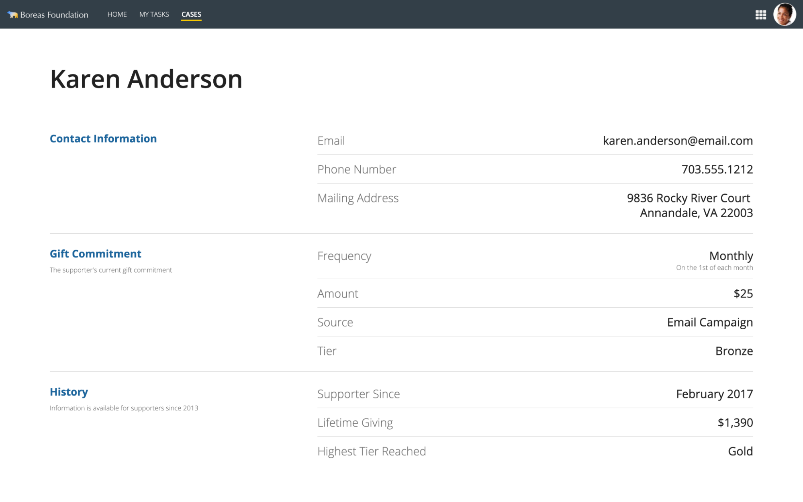
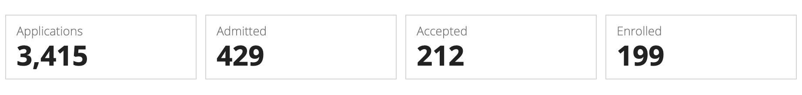
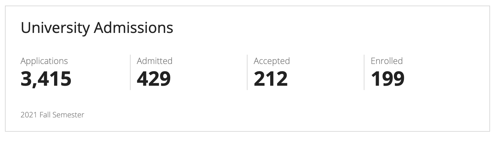
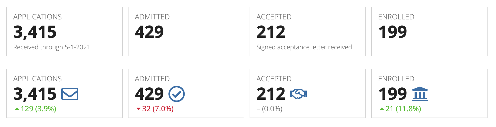
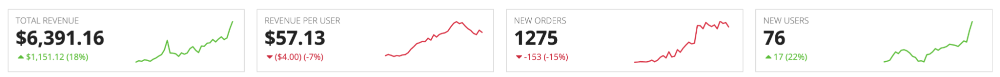
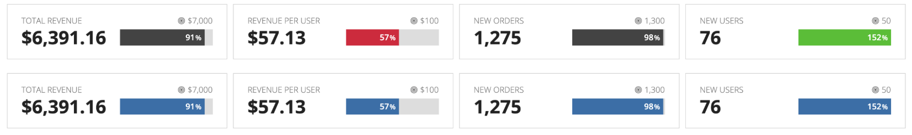
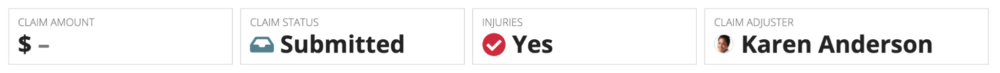
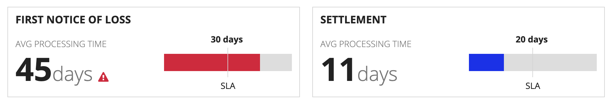

# Data Value Display [SAIL Design System: Patterns]

*Section: patterns | source: https://docs.appian.com/suite/help/26.7/sail/data-value-display.html | images referenced live in corpus/images/*

# Data Value Display

Use appropriate techniques to show different types of data field values to users.

## Easy-to-scan field summary

Use this pattern to show a small number of concise field values.

The generous whitespace, large font size, and section groupings fill up the page while also allowing easy scanning.

** This pattern doesn't use standard field labels, but it is still accessible because the label-value pairs would be read in the right sequence by a screen reader. Avoid using this pattern with editable forms.



```sail
{
  a!columnsLayout(
    columns: {
      a!columnLayout(
        contents: {},
        width: "EXTRA_NARROW"
      ),
      a!columnLayout(
        contents: {
          a!sectionLayout(
            label: "Karen Anderson",
            labelSize: "LARGE_PLUS",
            labelColor: "STANDARD",
            contents: {},
            marginAbove: "EVEN_MORE",
            marginBelow: "EVEN_MORE"
          ),
          a!sectionLayout(
            label: "",
            contents: {
              a!columnsLayout(
                columns: {
                  a!columnLayout(
                    contents: {
                      a!sectionLayout(
                        label: "Contact Information",
                        labelSize: "MEDIUM",
                        labelHeadingTag: "H2",
                        labelColor: "ACCENT",
                        contents: {}
                      )
                    },
                    width: "MEDIUM_PLUS"
                  ),
                  a!columnLayout(
                    contents: {
                      a!sectionLayout(
                        label: "",
                        contents: {
                          a!columnsLayout(
                            columns: {
                              a!columnLayout(
                                contents: {
                                  a!richTextDisplayField(
                                    labelPosition: "COLLAPSED",
                                    value: {
                                      a!richTextItem(
                                        text: {
                                          "Email"
                                        },
                                        color: "SECONDARY",
                                        size: "MEDIUM_PLUS"
                                      )
                                    }
                                  )
                                },
                                width: "MEDIUM"
                              ),
                              a!columnLayout(
                                contents: {
                                  a!richTextDisplayField(
                                    labelPosition: "COLLAPSED",
                                    value: {
                                      a!richTextItem(
                                        text: {
                                          "karen.anderson@email.com"
                                        },
                                        size: "MEDIUM_PLUS"
                                      )
                                    },
                                    align: "RIGHT"
                                  )
                                }
                              )
                            },
                            marginBelow: "NONE"
                          )
                        },
                        divider: "BELOW",
                        marginBelow: "STANDARD"
                      ),
                      a!sectionLayout(
                        label: "",
                        contents: {
                          a!columnsLayout(
                            columns: {
                              a!columnLayout(
                                contents: {
                                  a!richTextDisplayField(
                                    labelPosition: "COLLAPSED",
                                    value: {
                                      a!richTextItem(
                                        text: {
                                          "Phone Number"
                                        },
                                        color: "SECONDARY",
                                        size: "MEDIUM_PLUS"
                                      )
                                    }
                                  )
                                },
                                width: "MEDIUM"
                              ),
                              a!columnLayout(
                                contents: {
                                  a!richTextDisplayField(
                                    labelPosition: "COLLAPSED",
                                    value: {
                                      a!richTextItem(
                                        text: {
                                          "703.555.1212"
                                        },
                                        size: "MEDIUM_PLUS"
                                      )
                                    },
                                    align: "RIGHT"
                                  )
                                }
                              )
                            },
                            marginBelow: "NONE"
                          )
                        },
                        divider: "BELOW"
                      ),
                      a!sectionLayout(
                        label: "",
                        contents: {
                          a!columnsLayout(
                            columns: {
                              a!columnLayout(
                                contents: {
                                  a!richTextDisplayField(
                                    labelPosition: "COLLAPSED",
                                    value: {
                                      a!richTextItem(
                                        text: {
                                          "Mailing Address"
                                        },
                                        color: "SECONDARY",
                                        size: "MEDIUM_PLUS"
                                      )
                                    }
                                  )
                                },
                                width: "MEDIUM"
                              ),
                              a!columnLayout(
                                contents: {
                                  a!richTextDisplayField(
                                    labelPosition: "COLLAPSED",
                                    value: {
                                      a!richTextItem(
                                        text: {
                                          "9836 Rocky River Court "
                                        },
                                        size: "MEDIUM_PLUS"
                                      ),
                                      char(10),
                                      a!richTextItem(
                                        text: {
                                          "Annandale, VA 22003"
                                        },
                                        size: "MEDIUM_PLUS"
                                      )
                                    },
                                    align: "RIGHT"
                                  )
                                }
                              )
                            },
                            marginBelow: "NONE"
                          )
                        },
                        divider: "NONE"
                      )
                    }
                  )
                }
              )
            },
            divider: "BELOW",
            marginBelow: "MORE"
          ),
          a!sectionLayout(
            label: "",
            contents: {
              a!columnsLayout(
                columns: {
                  a!columnLayout(
                    contents: {
                      a!sectionLayout(
                        label: "Gift Commitment",
                        labelSize: "MEDIUM",
                        labelHeadingTag: "H2",
                        labelColor: "ACCENT",
                        contents: {
                          a!richTextDisplayField(
                            labelPosition: "COLLAPSED",
                            value: {
                              a!richTextItem(
                                text: {
                                  "The supporter's current gift commitment"
                                },
                                color: "SECONDARY"
                              )
                            }
                          )
                        }
                      )
                    },
                    width: "MEDIUM_PLUS"
                  ),
                  a!columnLayout(
                    contents: {
                      a!sectionLayout(
                        label: "",
                        contents: {
                          a!columnsLayout(
                            columns: {
                              a!columnLayout(
                                contents: {
                                  a!richTextDisplayField(
                                    labelPosition: "COLLAPSED",
                                    value: {
                                      a!richTextItem(
                                        text: {
                                          "Frequency"
                                        },
                                        color: "SECONDARY",
                                        size: "MEDIUM_PLUS"
                                      )
                                    }
                                  )
                                },
                                width: "MEDIUM"
                              ),
                              a!columnLayout(
                                contents: {
                                  a!richTextDisplayField(
                                    labelPosition: "COLLAPSED",
                                    value: {
                                      a!richTextItem(
                                        text: {
                                          "Monthly"
                                        },
                                        size: "MEDIUM_PLUS"
                                      ),
                                      char(10),
                                      a!richTextItem(
                                        text: {
                                          "On the 1st of each month"
                                        },
                                        color: "SECONDARY",
                                        size: "STANDARD"
                                      )
                                    },
                                    align: "RIGHT"
                                  )
                                }
                              )
                            },
                            marginBelow: "NONE"
                          )
                        },
                        divider: "BELOW",
                        marginBelow: "STANDARD"
                      ),
                      a!sectionLayout(
                        label: "",
                        contents: {
                          a!columnsLayout(
                            columns: {
                              a!columnLayout(
                                contents: {
                                  a!richTextDisplayField(
                                    labelPosition: "COLLAPSED",
                                    value: {
                                      a!richTextItem(
                                        text: {
                                          "Amount"
                                        },
                                        color: "SECONDARY",
                                        size: "MEDIUM_PLUS"
                                      )
                                    }
                                  )
                                },
                                width: "MEDIUM"
                              ),
                              a!columnLayout(
                                contents: {
                                  a!richTextDisplayField(
                                    labelPosition: "COLLAPSED",
                                    value: {
                                      a!richTextItem(
                                        text: {
                                          "$25"
                                        },
                                        size: "MEDIUM_PLUS"
                                      )
                                    },
                                    align: "RIGHT"
                                  )
                                }
                              )
                            },
                            marginBelow: "NONE"
                          )
                        },
                        divider: "BELOW"
                      ),
                      a!sectionLayout(
                        label: "",
                        contents: {
                          a!columnsLayout(
                            columns: {
                              a!columnLayout(
                                contents: {
                                  a!richTextDisplayField(
                                    labelPosition: "COLLAPSED",
                                    value: {
                                      a!richTextItem(
                                        text: {
                                          "Source"
                                        },
                                        color: "SECONDARY",
                                        size: "MEDIUM_PLUS"
                                      )
                                    }
                                  )
                                },
                                width: "MEDIUM"
                              ),
                              a!columnLayout(
                                contents: {
                                  a!richTextDisplayField(
                                    labelPosition: "COLLAPSED",
                                    value: {
                                      a!richTextItem(
                                        text: {
                                          "Email Campaign"
                                        },
                                        size: "MEDIUM_PLUS"
                                      )
                                    },
                                    align: "RIGHT"
                                  )
                                }
                              )
                            },
                            marginBelow: "NONE"
                          )
                        },
                        divider: "BELOW"
                      ),
                      a!sectionLayout(
                        label: "",
                        contents: {
                          a!columnsLayout(
                            columns: {
                              a!columnLayout(
                                contents: {
                                  a!richTextDisplayField(
                                    labelPosition: "COLLAPSED",
                                    value: {
                                      a!richTextItem(
                                        text: {
                                          "Tier"
                                        },
                                        color: "SECONDARY",
                                        size: "MEDIUM_PLUS"
                                      )
                                    }
                                  )
                                },
                                width: "MEDIUM"
                              ),
                              a!columnLayout(
                                contents: {
                                  a!richTextDisplayField(
                                    labelPosition: "COLLAPSED",
                                    value: {
                                      a!richTextItem(
                                        text: {
                                          "Bronze"
                                        },
                                        size: "MEDIUM_PLUS"
                                      )
                                    },
                                    align: "RIGHT"
                                  )
                                }
                              )
                            },
                            marginBelow: "NONE"
                          )
                        },
                        divider: "NONE"
                      )
                    }
                  )
                }
              )
            },
            divider: "BELOW",
            marginBelow: "MORE"
          ),
          a!sectionLayout(
            label: "",
            contents: {
              a!columnsLayout(
                columns: {
                  a!columnLayout(
                    contents: {
                      a!sectionLayout(
                        label: "History",
                        labelSize: "MEDIUM",
                        labelHeadingTag: "H2",
                        labelColor: "ACCENT",
                        contents: {
                          a!richTextDisplayField(
                            labelPosition: "COLLAPSED",
                            value: {
                              a!richTextItem(
                                text: {
                                  "Information is available for supporters since 2013"
                                },
                                color: "SECONDARY"
                              )
                            }
                          )
                        }
                      )
                    },
                    width: "MEDIUM_PLUS"
                  ),
                  a!columnLayout(
                    contents: {
                      a!sectionLayout(
                        label: "",
                        contents: {
                          a!columnsLayout(
                            columns: {
                              a!columnLayout(
                                contents: {
                                  a!richTextDisplayField(
                                    labelPosition: "COLLAPSED",
                                    value: {
                                      a!richTextItem(
                                        text: {
                                          "Supporter Since"
                                        },
                                        color: "SECONDARY",
                                        size: "MEDIUM_PLUS"
                                      )
                                    }
                                  )
                                },
                                width: "MEDIUM"
                              ),
                              a!columnLayout(
                                contents: {
                                  a!richTextDisplayField(
                                    labelPosition: "COLLAPSED",
                                    value: {
                                      a!richTextItem(
                                        text: {
                                          "February 2017"
                                        },
                                        size: "MEDIUM_PLUS"
                                      )
                                    },
                                    align: "RIGHT"
                                  )
                                }
                              )
                            },
                            marginBelow: "NONE"
                          )
                        },
                        divider: "BELOW",
                        marginBelow: "STANDARD"
                      ),
                      a!sectionLayout(
                        label: "",
                        contents: {
                          a!columnsLayout(
                            columns: {
                              a!columnLayout(
                                contents: {
                                  a!richTextDisplayField(
                                    labelPosition: "COLLAPSED",
                                    value: {
                                      a!richTextItem(
                                        text: {
                                          "Lifetime Giving"
                                        },
                                        color: "SECONDARY",
                                        size: "MEDIUM_PLUS"
                                      )
                                    }
                                  )
                                },
                                width: "MEDIUM"
                              ),
                              a!columnLayout(
                                contents: {
                                  a!richTextDisplayField(
                                    labelPosition: "COLLAPSED",
                                    value: {
                                      a!richTextItem(
                                        text: {
                                          "$1,390"
                                        },
                                        size: "MEDIUM_PLUS"
                                      )
                                    },
                                    align: "RIGHT"
                                  )
                                }
                              )
                            },
                            marginBelow: "NONE"
                          )
                        },
                        divider: "BELOW"
                      ),
                      a!sectionLayout(
                        label: "",
                        contents: {
                          a!columnsLayout(
                            columns: {
                              a!columnLayout(
                                contents: {
                                  a!richTextDisplayField(
                                    labelPosition: "COLLAPSED",
                                    value: {
                                      a!richTextItem(
                                        text: {
                                          "Highest Tier Reached"
                                        },
                                        color: "SECONDARY",
                                        size: "MEDIUM_PLUS"
                                      )
                                    }
                                  )
                                },
                                width: "MEDIUM"
                              ),
                              a!columnLayout(
                                contents: {
                                  a!richTextDisplayField(
                                    labelPosition: "COLLAPSED",
                                    value: {
                                      a!richTextItem(
                                        text: {
                                          "Gold"
                                        },
                                        size: "MEDIUM_PLUS"
                                      )
                                    },
                                    align: "RIGHT"
                                  )
                                }
                              )
                            },
                            marginBelow: "NONE"
                          )
                        },
                        divider: "NONE"
                      )
                    }
                  )
                }
              )
            },
            divider: "NONE"
          )
        },
        width: "AUTO"
      ),
      a!columnLayout(
        contents: {},
        width: "EXTRA_NARROW"
      )
    }
  )
}
```

## Simple performance indicators

Use this pattern to show simple label-value pairs.

To reduce clutter, consider showing groups of performance indicators in a single, shared card, separated by column divider lines.





```sail
{
  a!columnsLayout(
    columns: {
      a!columnLayout(
        contents: {
          a!cardLayout(
            contents: {
              a!richTextDisplayField(
                labelPosition: "COLLAPSED",
                value: {
                  a!richTextItem(
                    text: "University Admissions",
                    size: "MEDIUM_PLUS"
                  ),
                  char(10),
                  char(10)
                }
              ),
              a!columnsLayout(
                columns: {
                  a!columnLayout(
                    contents: {
                      a!richTextDisplayField(
                        labelPosition: "COLLAPSED",
                        value: {
                          a!richTextItem(
                            text: { "Applications" },
                            color: "SECONDARY"
                          ),
                          char(10),
                          a!richTextItem(
                            text: { "3,415" },
                            size: "LARGE",
                            style: { "STRONG" }
                          )
                        }
                      )
                    }
                  ),
                  a!columnLayout(
                    contents: {
                      a!richTextDisplayField(
                        labelPosition: "COLLAPSED",
                        value: {
                          a!richTextItem(text: { "Admitted" }, color: "SECONDARY"),
                          char(10),
                          a!richTextItem(
                            text: { "429" },
                            size: "LARGE",
                            style: { "STRONG" }
                          )
                        }
                      )
                    }
                  ),
                  a!columnLayout(
                    contents: {
                      a!richTextDisplayField(
                        labelPosition: "COLLAPSED",
                        value: {
                          a!richTextItem(text: { "Accepted" }, color: "SECONDARY"),
                          char(10),
                          a!richTextItem(
                            text: { "212" },
                            size: "LARGE",
                            style: { "STRONG" }
                          )
                        }
                      )
                    }
                  ),
                  a!columnLayout(
                    contents: {
                      a!richTextDisplayField(
                        labelPosition: "COLLAPSED",
                        value: {
                          a!richTextItem(text: { "Enrolled" }, color: "SECONDARY"),
                          char(10),
                          a!richTextItem(
                            text: { "199" },
                            size: "LARGE",
                            style: { "STRONG" }
                          )
                        }
                      )
                    }
                  )
                },
                showDividers: true
              ),
              a!richTextDisplayField(
                labelPosition: "COLLAPSED",
                value: {
                  char(10),
                  a!richTextItem(
                    text: { "2021 Fall Semester" },
                    color: "SECONDARY",
                    size: "SMALL"
                  )
                }
              )
            },
            padding: "STANDARD",
            marginBelow: "STANDARD"
          )
        },
        width: "WIDE"
      ),
      a!columnLayout()
    }
  ),
  a!columnsLayout(
    columns: {
      a!columnLayout(
        contents: {
          a!cardLayout(
            contents: {
              a!richTextDisplayField(
                labelPosition: "COLLAPSED",
                value: {
                  a!richTextItem(
                    text: { "Applications" },
                    color: "SECONDARY"
                  ),
                  char(10),
                  a!richTextItem(
                    text: { "3,415" },
                    size: "LARGE",
                    style: { "STRONG" }
                  )
                }
              )
            },
            height: "AUTO",
            style: "NONE",
            marginBelow: "STANDARD"
          )
        },
        width: "NARROW"
      ),
      a!columnLayout(
        contents: {
          a!cardLayout(
            contents: {
              a!richTextDisplayField(
                labelPosition: "COLLAPSED",
                value: {
                  a!richTextItem(text: { "Admitted" }, color: "SECONDARY"),
                  char(10),
                  a!richTextItem(
                    text: { "429" },
                    size: "LARGE",
                    style: { "STRONG" }
                  )
                }
              )
            },
            height: "AUTO",
            style: "NONE",
            marginBelow: "STANDARD"
          )
        },
        width: "NARROW"
      ),
      a!columnLayout(
        contents: {
          a!cardLayout(
            contents: {
              a!richTextDisplayField(
                labelPosition: "COLLAPSED",
                value: {
                  a!richTextItem(text: { "Accepted" }, color: "SECONDARY"),
                  char(10),
                  a!richTextItem(
                    text: { "212" },
                    size: "LARGE",
                    style: { "STRONG" }
                  )
                }
              )
            },
            height: "AUTO",
            style: "NONE",
            marginBelow: "STANDARD"
          )
        },
        width: "NARROW"
      ),
      a!columnLayout(
        contents: {
          a!cardLayout(
            contents: {
              a!richTextDisplayField(
                labelPosition: "COLLAPSED",
                value: {
                  a!richTextItem(text: { "Enrolled" }, color: "SECONDARY"),
                  char(10),
                  a!richTextItem(
                    text: { "199" },
                    size: "LARGE",
                    style: { "STRONG" }
                  )
                }
              )
            },
            height: "AUTO",
            style: "NONE",
            marginBelow: "STANDARD"
          )
        },
        width: "NARROW"
      ),
      a!columnLayout(contents: {})
    },
    spacing: "DENSE"
  ),
  a!columnsLayout(
    columns: {
      a!columnLayout(
        contents: {
          a!cardLayout(
            contents: {
              a!sideBySideLayout(
                items: {
                  a!sideBySideItem(
                    item: a!richTextDisplayField(
                      labelPosition: "COLLAPSED",
                      value: {
                        a!richTextItem(
                          text: { "CLAIM AMOUNT" },
                          color: "SECONDARY"
                        )
                      }
                    )
                  )
                },
                marginBelow: "NONE"
              ),
              a!richTextDisplayField(
                labelPosition: "COLLAPSED",
                value: {
                  a!richTextItem(
                    text: { "$ " },
                    size: "LARGE",
                    style: { "STRONG" }
                  ),
                  a!richTextItem(
                    text: { "–" },
                    color: "SECONDARY",
                    size: "LARGE",
                    style: { "STRONG" }
                  )
                }
              )
            },
            height: "AUTO",
            style: "NONE",
            marginBelow: "STANDARD"
          )
        },
        width: "NARROW_PLUS"
      ),
      a!columnLayout(
        contents: {
          a!cardLayout(
            contents: {
              a!sideBySideLayout(
                items: {
                  a!sideBySideItem(
                    item: a!richTextDisplayField(
                      labelPosition: "COLLAPSED",
                      value: {
                        a!richTextItem(
                          text: { "CLAIM STATUS" },
                          color: "SECONDARY"
                        )
                      }
                    )
                  )
                },
                marginBelow: "NONE"
              ),
              a!richTextDisplayField(
                labelPosition: "COLLAPSED",
                value: {
                  a!richTextItem(
                    text: { a!richTextIcon(icon: "inbox") },
                    color: "#45818e",
                    size: "LARGE",
                    style: { "STRONG" }
                  ),
                  a!richTextItem(
                    text: { " Submitted" },
                    size: "LARGE",
                    style: { "STRONG" }
                  )
                }
              )
            },
            height: "AUTO",
            style: "NONE",
            marginBelow: "STANDARD"
          )
        },
        width: "NARROW_PLUS"
      ),
      a!columnLayout(
        contents: {
          a!cardLayout(
            contents: {
              a!sideBySideLayout(
                items: {
                  a!sideBySideItem(
                    item: a!richTextDisplayField(
                      labelPosition: "COLLAPSED",
                      value: {
                        a!richTextItem(text: { "INJURIES" }, color: "SECONDARY")
                      }
                    )
                  )
                },
                marginBelow: "NONE"
              ),
              a!richTextDisplayField(
                labelPosition: "COLLAPSED",
                value: {
                  a!richTextItem(
                    text: { a!richTextIcon(icon: "check-circle") },
                    color: "NEGATIVE",
                    size: "LARGE",
                    style: { "STRONG" }
                  ),
                  a!richTextItem(
                    text: { " Yes" },
                    size: "LARGE",
                    style: { "STRONG" }
                  )
                }
              )
            },
            height: "AUTO",
            style: "NONE",
            marginBelow: "STANDARD"
          )
        },
        width: "NARROW_PLUS"
      ),
      a!columnLayout(
        contents: {
          a!cardLayout(
            contents: {
              a!sideBySideLayout(
                items: {
                  a!sideBySideItem(
                    item: a!richTextDisplayField(
                      labelPosition: "COLLAPSED",
                      value: {
                        a!richTextItem(
                          text: { "CLAIM ADJUSTER" },
                          color: "SECONDARY"
                        )
                      }
                    )
                  )
                },
                marginBelow: "NONE"
              ),
              a!sideBySideLayout(
                items: {
                  a!sideBySideItem(
                    item: a!imageField(
                      label: "",
                      labelPosition: "COLLAPSED",
                      images: { a!userImage(user: null) },
                      size: "ICON",
                      isThumbnail: false,
                      style: "AVATAR"
                    ),
                    width: "MINIMIZE"
                  ),
                  a!sideBySideItem(
                    item: a!richTextDisplayField(
                      labelPosition: "COLLAPSED",
                      value: {
                        a!richTextItem(
                          text: { "Karen Anderson" },
                          size: "LARGE",
                          style: { "STRONG" }
                        )
                      }
                    )
                  )
                },
                alignVertical: "MIDDLE"
              )
            },
            height: "AUTO",
            style: "NONE",
            marginBelow: "STANDARD"
          )
        },
        width: "MEDIUM"
      ),
      a!columnLayout(contents: {})
    },
    spacing: "DENSE"
  ),
  a!columnsLayout(
    columns: {
      a!columnLayout(
        contents: {
          a!cardLayout(
            contents: {
              a!richTextDisplayField(
                labelPosition: "COLLAPSED",
                value: {
                  a!richTextItem(
                    text: { "APPLICATIONS" },
                    color: "SECONDARY"
                  ),
                  char(10),
                  a!richTextItem(
                    text: { "3,415" },
                    size: "LARGE",
                    style: { "STRONG" }
                  ),
                  char(10),
                  a!richTextItem(
                    text: { "Received through 5-1-2021" },
                    color: "SECONDARY",
                    size: "SMALL"
                  )
                }
              )
            },
            height: "AUTO",
            style: "NONE",
            marginBelow: "STANDARD"
          )
        },
        width: "NARROW"
      ),
      a!columnLayout(
        contents: {
          a!cardLayout(
            contents: {
              a!richTextDisplayField(
                labelPosition: "COLLAPSED",
                value: {
                  a!richTextItem(text: { "ADMITTED" }, color: "SECONDARY"),
                  char(10),
                  a!richTextItem(
                    text: { "429" },
                    size: "LARGE",
                    style: { "STRONG" }
                  ),
                  char(10),
                  ""
                }
              )
            },
            height: "AUTO",
            style: "NONE",
            marginBelow: "STANDARD"
          )
        },
        width: "NARROW"
      ),
      a!columnLayout(
        contents: {
          a!cardLayout(
            contents: {
              a!richTextDisplayField(
                labelPosition: "COLLAPSED",
                value: {
                  a!richTextItem(text: { "ACCEPTED" }, color: "SECONDARY"),
                  char(10),
                  a!richTextItem(
                    text: { "212" },
                    size: "LARGE",
                    style: { "STRONG" }
                  ),
                  char(10),
                  a!richTextItem(
                    text: { "Signed acceptance letter received" },
                    color: "SECONDARY",
                    size: "SMALL"
                  )
                }
              )
            },
            height: "AUTO",
            style: "NONE",
            marginBelow: "STANDARD"
          )
        },
        width: "NARROW"
      ),
      a!columnLayout(
        contents: {
          a!cardLayout(
            contents: {
              a!richTextDisplayField(
                labelPosition: "COLLAPSED",
                value: {
                  a!richTextItem(text: { "ENROLLED" }, color: "SECONDARY"),
                  char(10),
                  a!richTextItem(
                    text: { "199" },
                    size: "LARGE",
                    style: { "STRONG" }
                  ),
                  char(10),
                  ""
                }
              )
            },
            height: "AUTO",
            style: "NONE",
            marginBelow: "STANDARD"
          )
        },
        width: "NARROW"
      ),
      a!columnLayout(contents: {})
    },
    spacing: "DENSE"
  ),
  a!columnsLayout(
    columns: {
      a!columnLayout(
        contents: {
          a!cardLayout(
            contents: {
              a!richTextDisplayField(
                labelPosition: "COLLAPSED",
                value: {
                  a!richTextItem(
                    text: { "APPLICATIONS" },
                    color: "SECONDARY"
                  ),
                  char(10),
                  a!richTextItem(
                    text: { "3,415 " },
                    size: "LARGE",
                    style: { "STRONG" }
                  ),
                  a!richTextItem(
                    text: { a!richTextIcon(icon: "envelope-o") },
                    color: "ACCENT",
                    size: "LARGE",
                    style: { "STRONG" }
                  ),
                  char(10),
                  a!richTextItem(
                    text: {
                      a!richTextIcon(icon: "caret-up"),
                      "129 (3.9%)"
                    },
                    color: "POSITIVE",
                    size: "STANDARD"
                  )
                }
              )
            },
            height: "AUTO",
            style: "NONE",
            marginBelow: "STANDARD"
          )
        },
        width: "NARROW"
      ),
      a!columnLayout(
        contents: {
          a!cardLayout(
            contents: {
              a!richTextDisplayField(
                labelPosition: "COLLAPSED",
                value: {
                  a!richTextItem(text: { "ADMITTED" }, color: "SECONDARY"),
                  char(10),
                  a!richTextItem(
                    text: { "429 " },
                    size: "LARGE",
                    style: { "STRONG" }
                  ),
                  a!richTextItem(
                    text: { a!richTextIcon(icon: "check-circle-o") },
                    color: "ACCENT",
                    size: "LARGE",
                    style: { "STRONG" }
                  ),
                  char(10),
                  a!richTextItem(
                    text: {
                      a!richTextIcon(icon: "caret-down"),
                      "32 (7.0%)"
                    },
                    color: "NEGATIVE",
                    size: "STANDARD"
                  )
                }
              )
            },
            height: "AUTO",
            style: "NONE",
            padding: "LESS",
            marginBelow: "STANDARD"
          )
        },
        width: "NARROW"
      ),
      a!columnLayout(
        contents: {
          a!cardLayout(
            contents: {
              a!richTextDisplayField(
                labelPosition: "COLLAPSED",
                value: {
                  a!richTextItem(text: { "ACCEPTED" }, color: "SECONDARY"),
                  char(10),
                  a!richTextItem(
                    text: { "212 " },
                    size: "LARGE",
                    style: { "STRONG" }
                  ),
                  a!richTextItem(
                    text: { a!richTextIcon(icon: "handshake-o") },
                    color: "ACCENT",
                    size: "LARGE",
                    style: { "STRONG" }
                  ),
                  char(10),
                  a!richTextItem(
                    text: { "– (0.0%)" },
                    color: "SECONDARY",
                    size: "STANDARD"
                  )
                }
              )
            },
            height: "AUTO",
            style: "NONE",
            marginBelow: "STANDARD"
          )
        },
        width: "NARROW"
      ),
      a!columnLayout(
        contents: {
          a!cardLayout(
            contents: {
              a!richTextDisplayField(
                labelPosition: "COLLAPSED",
                value: {
                  a!richTextItem(text: { "ENROLLED" }, color: "SECONDARY"),
                  char(10),
                  a!richTextItem(
                    text: { "199 " },
                    size: "LARGE",
                    style: { "STRONG" }
                  ),
                  a!richTextItem(
                    text: { a!richTextIcon(icon: "university") },
                    color: "ACCENT",
                    size: "LARGE",
                    style: { "STRONG" }
                  ),
                  char(10),
                  a!richTextItem(
                    text: {
                      a!richTextIcon(icon: "caret-up"),
                      "21 (11.8%)"
                    },
                    color: "POSITIVE"
                  )
                }
              )
            },
            height: "AUTO",
            style: "NONE",
            marginBelow: "STANDARD"
          )
        },
        width: "NARROW"
      ),
      a!columnLayout(contents: {})
    },
    spacing: "DENSE"
  ),
  a!columnsLayout(
    columns: {
      a!columnLayout(
        contents: {
          a!cardLayout(
            contents: {
              a!sideBySideLayout(
                items: {
                  a!sideBySideItem(
                    item: a!richTextDisplayField(
                      labelPosition: "COLLAPSED",
                      value: {
                        a!richTextItem(
                          text: { "APPLICATIONS" },
                          color: "SECONDARY",
                          size: "MEDIUM"
                        )
                      }
                    )
                  ),
                  a!sideBySideItem(
                    item: a!richTextDisplayField(
                      labelPosition: "COLLAPSED",
                      value: {
                        a!richTextItem(
                          text: { "EOD 5-1-2021" },
                          color: "SECONDARY",
                          size: "STANDARD"
                        )
                      }
                    ),
                    width: "MINIMIZE"
                  )
                },
                alignVertical: "MIDDLE",
                marginBelow: "NONE"
              ),
              a!richTextDisplayField(
                labelPosition: "COLLAPSED",
                value: {
                  a!richTextItem(
                    text: {
                      "3,415",
                      a!richTextItem(text: { " " }, style: { "STRONG" })
                    },
                    size: "LARGE_PLUS"
                  ),
                  a!richTextIcon(
                    icon: "envelope-o",
                    color: "ACCENT",
                    size: "LARGE_PLUS"
                  )
                }
              )
            },
            height: "AUTO",
            style: "NONE",
            marginBelow: "STANDARD"
          )
        },
        width: "MEDIUM"
      ),
      a!columnLayout(
        contents: {
          a!cardLayout(
            contents: {
              a!sideBySideLayout(
                items: {
                  a!sideBySideItem(
                    item: a!richTextDisplayField(
                      labelPosition: "COLLAPSED",
                      value: {
                        a!richTextItem(
                          text: { "ADMITTED" },
                          color: "SECONDARY",
                          size: "MEDIUM"
                        )
                      }
                    )
                  ),
                  a!sideBySideItem(
                    item: a!richTextDisplayField(
                      labelPosition: "COLLAPSED",
                      value: {
                        a!richTextItem(
                          text: { "Fall 2021" },
                          color: "SECONDARY",
                          size: "STANDARD"
                        )
                      }
                    ),
                    width: "MINIMIZE"
                  )
                },
                alignVertical: "MIDDLE",
                marginBelow: "NONE"
              ),
              a!richTextDisplayField(
                labelPosition: "COLLAPSED",
                value: {
                  a!richTextItem(
                    text: {
                      "429",
                      a!richTextItem(text: { " " }, style: { "STRONG" })
                    },
                    size: "LARGE_PLUS"
                  ),
                  a!richTextIcon(
                    icon: "check-circle-o",
                    color: "ACCENT",
                    size: "LARGE_PLUS"
                  )
                }
              )
            },
            height: "AUTO",
            style: "NONE",
            marginBelow: "STANDARD"
          )
        },
        width: "MEDIUM"
      ),
      a!columnLayout(
        contents: {
          a!cardLayout(
            contents: {
              a!sideBySideLayout(
                items: {
                  a!sideBySideItem(
                    item: a!richTextDisplayField(
                      labelPosition: "COLLAPSED",
                      value: {
                        a!richTextItem(
                          text: { "ACCEPTED" },
                          color: "SECONDARY",
                          size: "MEDIUM"
                        )
                      }
                    )
                  )
                },
                alignVertical: "MIDDLE",
                marginBelow: "NONE"
              ),
              a!richTextDisplayField(
                labelPosition: "COLLAPSED",
                value: {
                  a!richTextItem(
                    text: {
                      "212",
                      a!richTextItem(text: { " " }, style: { "STRONG" })
                    },
                    size: "LARGE_PLUS"
                  ),
                  a!richTextIcon(
                    icon: "handshake-o",
                    color: "ACCENT",
                    size: "LARGE_PLUS"
                  )
                }
              )
            },
            height: "AUTO",
            style: "NONE",
            marginBelow: "STANDARD"
          )
        },
        width: "MEDIUM"
      ),
      a!columnLayout(
        contents: {
          a!cardLayout(
            contents: {
              a!sideBySideLayout(
                items: {
                  a!sideBySideItem(
                    item: a!richTextDisplayField(
                      labelPosition: "COLLAPSED",
                      value: {
                        a!richTextItem(
                          text: { "ENROLLED" },
                          color: "SECONDARY",
                          size: "MEDIUM"
                        )
                      }
                    )
                  )
                },
                alignVertical: "MIDDLE",
                marginBelow: "NONE"
              ),
              a!richTextDisplayField(
                labelPosition: "COLLAPSED",
                value: {
                  a!richTextItem(
                    text: {
                      "199",
                      a!richTextItem(text: { " " }, style: { "STRONG" })
                    },
                    size: "LARGE_PLUS"
                  ),
                  a!richTextIcon(
                    icon: "university",
                    color: "ACCENT",
                    size: "LARGE_PLUS"
                  )
                }
              )
            },
            height: "AUTO",
            style: "NONE",
            marginBelow: "STANDARD"
          )
        },
        width: "MEDIUM"
      ),
      a!columnLayout(contents: {})
    },
    spacing: "DENSE"
  ),
  {
    a!localVariables(
      /* An array that contains change in values for revenue, orders and users */
      /* This would typically be returned with a query */
      local!values: {
        a!map(
          name: "Total Revenue",
          currentValue: 6391.16,
          valueChange: 1151.12,
          valueType: "dollar",
          percentChange: 18,
          data: {
            124.12,
            336.80,
            245.43,
            478.34,
            399.01,
            246.22,
            551.49,
            749.23,
            1042.90,
            1282.23,
            2002.33,
            3453.23,
            1521.34,
            1494.03,
            1389.48,
            1002.77,
            1539.23,
            1334.89,
            1512.33,
            2200.31,
            2489.89,
            1938.34,
            1589.30,
            2588.23,
            2549.20,
            3012.33,
            3089.34,
            3590.43,
            3221.34,
            3657.78,
            3999.54,
            3578.90,
            3834.76,
            5246.82,
            6398.56
          }
        ),
        a!map(
          name: "Revenue Per User",
          currentValue: 57.13,
          valueChange: - 4.0,
          valueType: "dollar",
          percentChange: - 7,
          data: {
            13.50,
            15.75,
            14.23,
            12.13,
            13.76,
            12.99,
            14.89,
            15.55,
            18.99,
            25.68,
            30.43,
            35.90,
            37.75,
            40.12,
            39.89,
            46.10,
            42.56,
            52.45,
            48.45,
            53.23,
            55.23,
            56.32,
            59.60,
            67.34,
            73.99,
            77.10,
            73.46,
            75.20,
            69.25,
            64.11,
            60.78,
            55.22,
            52.89,
            61.13,
            57.13
          }
        ),
        a!map(
          name: "New Orders",
          currentValue: 1275,
          valueChange: - 153,
          valueType: "integer",
          percentChange: - 15,
          data: {
            22,
            30,
            45,
            41,
            35,
            54,
            98,
            43,
            95,
            201,
            258,
            178,
            395,
            213,
            234,
            469,
            378,
            520,
            634,
            734,
            674,
            700,
            1323,
            1320,
            1211,
            1432,
            1343,
            1289,
            1345,
            1209,
            1478,
            1398,
            1428,
            1275
          }
        ),
        a!map(
          name: "New Users",
          currentValue: 76,
          valueChange: 17,
          valueType: "integer",
          percentChange: 22,
          data: {
            2,
            3,
            5,
            13,
            20,
            17,
            23,
            24,
            22,
            18,
            12,
            10,
            3,
            4,
            2,
            15,
            16,
            20,
            26,
            23,
            27,
            28,
            30,
            34,
            33,
            32,
            30,
            35,
            40,
            38,
            59,
            76
          }
        )
      },
      a!columnsLayout(
        columns: {
          a!columnLayout(
            contents: {
              a!columnsLayout(
                columns: a!forEach(
                  /* Update indices based on local!values array length */
                  items: index(local!values, { 1, 2 }, {}),
                  expression: a!columnLayout(
                    contents: {
                      a!cardLayout(
                        contents: {
                          a!columnsLayout(
                            columns: {
                              a!columnLayout(
                                contents: {
                                  a!richTextDisplayField(
                                    labelPosition: "COLLAPSED",
                                    value: {
                                      a!richTextItem(
                                        text: upper(fv!item.name),
                                        color: "SECONDARY",
                                        size: "STANDARD"
                                      ),
                                      char(10),
                                      a!richTextItem(
                                        /* This IF statement displays the revenue in dollars for revenue */
                                        text: if(
                                          fv!item.valueType = "dollar",
                                          a!currency(
                                            isoCode: "USD",
                                            value: fv!item.currentValue
                                          ),
                                          fv!item.currentValue
                                        ),
                                        size: "LARGE",
                                        style: "STRONG"
                                      ),
                                      char(10),
                                      a!richTextIcon(
                                        /* This IF statement sets the icon and color for the percent change value */
                                        /* If the price went up, the icon is a caret-up; if it went down it is a caret-down */
                                        /* If the price went up, the color is POSITIVE; if it went down it is NEGATIVE */
                                        icon: if(
                                          fv!item.percentChange < 0,
                                          "caret-down",
                                          "caret-up"
                                        ),
                                        color: if(
                                          fv!item.percentChange < 0,
                                          "NEGATIVE",
                                          "POSITIVE"
                                        ),
                                        size: "MEDIUM"
                                      ),
                                      a!richTextItem(
                                        /* This IF statement displays the value change in dollars for revenue */
                                        text: {
                                          if(
                                            fv!item.valueType = "dollar",
                                            a!currency(
                                              isoCode: "USD",
                                              value: fv!item.valueChange
                                            ),
                                            fv!item.valueChange
                                          ),
                                          " (" & fv!item.percentChange & "%)"
                                        },
                                        /* This IF statement sets the color for the percent change value */
                                        /* If the price went up, the color is POSITIVE; if it went down it is NEGATIVE */
                                        color: if(
                                          fv!item.percentChange < 0,
                                          "NEGATIVE",
                                          "POSITIVE"
                                        ),
                                        size: "STANDARD"
                                      )
                                    }
                                  )
                                }
                              ),
                              a!columnLayout(
                                contents: a!lineChartField(
                                  labelPosition: "ABOVE",
                                  /* This includes the math for displaying the dates for the line chart's x-axis */
                                  categories: a!forEach(
                                    items: reverse(enumerate(35) + 1),
                                    expression: today() - fv!item
                                  ),
                                  series: {
                                    a!chartSeries(
                                      label: fv!item.name,
                                      data: fv!item.data,
                                      /* This IF statement sets the color for the line chart */
                                      /* If the price went up, the color is #1cc101 (green); if it went down it is #eb113f (red) */
                                      color: if(
                                        fv!item.percentChange < 0,
                                        "#eb113f",
                                        "#1cc101"
                                      )
                                    )
                                  },
                                  yAxisMax: max(fv!item.data),
                                  showLegend: false,
                                  height: "MICRO",
                                  xAxisStyle: "NONE",
                                  yAxisStyle: "NONE"
                                )
                              )
                            },
                            stackWhen: { "DESKTOP_NARROW" }
                          )
                        },
                        style: "NONE"
                      )
                    }
                  )
                ),
                stackWhen: { "TABLET_PORTRAIT", "PHONE" }
              )
            }
          ),
          a!columnLayout(
            contents: {
              a!columnsLayout(
                columns: a!forEach(
                  /* Update indices based on local!values array length */
                  items: index(local!values, { 3, 4 }, {}),
                  expression: a!columnLayout(
                    contents: {
                      a!cardLayout(
                        contents: {
                          a!columnsLayout(
                            columns: {
                              a!columnLayout(
                                contents: {
                                  a!richTextDisplayField(
                                    labelPosition: "COLLAPSED",
                                    value: {
                                      a!richTextItem(
                                        text: upper(fv!item.name),
                                        color: "SECONDARY",
                                        size: "STANDARD"
                                      ),
                                      char(10),
                                      a!richTextItem(
                                        /* This IF statement displays the revenue in dollars for revenue */
                                        text: if(
                                          fv!item.valueType = "dollar",
                                          a!currency(
                                            isoCode: "USD",
                                            value: fv!item.currentValue
                                          ),
                                          fv!item.currentValue
                                        ),
                                        size: "LARGE",
                                        style: "STRONG"
                                      ),
                                      char(10),
                                      a!richTextIcon(
                                        /* This IF statement sets the icon and color for the percent change value */
                                        /* If the price went up, the icon is a caret-up; if it went down it is a caret-down */
                                        /* If the price went up, the color is POSITIVE; if it went down it is NEGATIVE */
                                        icon: if(
                                          fv!item.percentChange < 0,
                                          "caret-down",
                                          "caret-up"
                                        ),
                                        color: if(
                                          fv!item.percentChange < 0,
                                          "NEGATIVE",
                                          "POSITIVE"
                                        ),
                                        size: "MEDIUM"
                                      ),
                                      a!richTextItem(
                                        /* This IF statement displays the value change in dollars for revenue */
                                        text: {
                                          if(
                                            fv!item.valueType = "dollar",
                                            a!currency(
                                              isoCode: "USD",
                                              value: fv!item.valueChange
                                            ),
                                            fv!item.valueChange
                                          ),
                                          " (" & fv!item.percentChange & "%)"
                                        },
                                        /* This IF statement sets the color for the percent change value */
                                        /* If the price went up, the color is POSITIVE; if it went down it is NEGATIVE */
                                        color: if(
                                          fv!item.percentChange < 0,
                                          "NEGATIVE",
                                          "POSITIVE"
                                        ),
                                        size: "STANDARD"
                                      )
                                    }
                                  )
                                }
                              ),
                              a!columnLayout(
                                contents: a!lineChartField(
                                  labelPosition: "ABOVE",
                                  /* This includes the math for displaying the dates for the line chart's x-axis */
                                  categories: a!forEach(
                                    items: reverse(enumerate(35) + 1),
                                    expression: today() - fv!item
                                  ),
                                  series: {
                                    a!chartSeries(
                                      label: fv!item.name,
                                      data: fv!item.data,
                                      /* This IF statement sets the color for the line chart */
                                      /* If the price went up, the color is #1cc101 (green); if it went down it is #eb113f (red) */
                                      color: if(
                                        fv!item.percentChange < 0,
                                        "#eb113f",
                                        "#1cc101"
                                      )
                                    )
                                  },
                                  yAxisMax: max(fv!item.data),
                                  showLegend: false,
                                  height: "MICRO",
                                  xAxisStyle: "NONE",
                                  yAxisStyle: "NONE"
                                )
                              )
                            },
                            stackWhen: { "DESKTOP_NARROW" }
                          )
                        },
                        style: "NONE"
                      )
                    }
                  )
                ),
                stackWhen: { "TABLET_PORTRAIT", "PHONE" }
              )
            }
          )
        },
        stackWhen: { "TABLET_LANDSCAPE", "PHONE" }
      )
    ),
    a!columnsLayout(
      columns: {
        a!columnLayout(
          contents: {
            a!cardLayout(
              contents: {
                a!sideBySideLayout(
                  items: {
                    a!sideBySideItem(
                      item: a!richTextDisplayField(
                        labelPosition: "COLLAPSED",
                        value: {
                          a!richTextItem(
                            text: { "TOTAL REVENUE" },
                            color: "SECONDARY"
                          )
                        }
                      )
                    ),
                    a!sideBySideItem(
                      item: a!richTextDisplayField(
                        labelPosition: "COLLAPSED",
                        value: {
                          a!richTextItem(
                            text: {
                              a!richTextIcon(icon: "bullseye"),
                              " $7,000"
                            },
                            color: "SECONDARY"
                          )
                        }
                      ),
                      width: "MINIMIZE"
                    )
                  },
                  alignVertical: "MIDDLE",
                  marginBelow: "NONE"
                ),
                a!sideBySideLayout(
                  items: {
                    a!sideBySideItem(
                      item: a!richTextDisplayField(
                        labelPosition: "COLLAPSED",
                        value: {
                          a!richTextItem(
                            text: { "$6,391.16" },
                            size: "LARGE",
                            style: { "STRONG" }
                          )
                        }
                      )
                    ),
                    a!sideBySideItem(
                      item: a!progressBarField(
                        label: "",
                        labelPosition: "COLLAPSED",
                        percentage: 91,
                        color: "#434343",
                        style: "THICK"
                      )
                    )
                  },
                  alignVertical: "MIDDLE"
                )
              },
              height: "AUTO",
              style: "NONE",
              padding: "STANDARD",
              marginBelow: "STANDARD"
            )
          },
          width: "MEDIUM"
        ),
        a!columnLayout(
          contents: {
            a!cardLayout(
              contents: {
                a!sideBySideLayout(
                  items: {
                    a!sideBySideItem(
                      item: a!richTextDisplayField(
                        labelPosition: "COLLAPSED",
                        value: {
                          a!richTextItem(
                            text: { "REVENUE PER USER" },
                            color: "SECONDARY"
                          )
                        }
                      )
                    ),
                    a!sideBySideItem(
                      item: a!richTextDisplayField(
                        labelPosition: "COLLAPSED",
                        value: {
                          a!richTextItem(
                            text: {
                              a!richTextIcon(icon: "bullseye"),
                              " $100"
                            },
                            color: "SECONDARY"
                          )
                        }
                      ),
                      width: "MINIMIZE"
                    )
                  },
                  alignVertical: "MIDDLE",
                  marginBelow: "NONE"
                ),
                a!sideBySideLayout(
                  items: {
                    a!sideBySideItem(
                      item: a!richTextDisplayField(
                        labelPosition: "COLLAPSED",
                        value: {
                          a!richTextItem(
                            text: { "$57.13" },
                            color: "STANDARD",
                            size: "LARGE",
                            style: { "STRONG" }
                          )
                        }
                      )
                    ),
                    a!sideBySideItem(
                      item: a!progressBarField(
                        label: "",
                        labelPosition: "COLLAPSED",
                        percentage: 57,
                        color: "NEGATIVE",
                        style: "THICK"
                      )
                    )
                  },
                  alignVertical: "MIDDLE"
                )
              },
              height: "AUTO",
              style: "NONE",
              padding: "STANDARD",
              marginBelow: "STANDARD"
            )
          },
          width: "MEDIUM"
        ),
        a!columnLayout(
          contents: {
            a!cardLayout(
              contents: {
                a!sideBySideLayout(
                  items: {
                    a!sideBySideItem(
                      item: a!richTextDisplayField(
                        labelPosition: "COLLAPSED",
                        value: {
                          a!richTextItem(text: { "NEW ORDERS" }, color: "SECONDARY")
                        }
                      )
                    ),
                    a!sideBySideItem(
                      item: a!richTextDisplayField(
                        labelPosition: "COLLAPSED",
                        value: {
                          a!richTextItem(
                            text: {
                              a!richTextIcon(icon: "bullseye"),
                              " 1,300"
                            },
                            color: "SECONDARY"
                          )
                        }
                      ),
                      width: "MINIMIZE"
                    )
                  },
                  alignVertical: "MIDDLE",
                  marginBelow: "NONE"
                ),
                a!sideBySideLayout(
                  items: {
                    a!sideBySideItem(
                      item: a!richTextDisplayField(
                        labelPosition: "COLLAPSED",
                        value: {
                          a!richTextItem(
                            text: { "1,275" },
                            size: "LARGE",
                            style: { "STRONG" }
                          )
                        }
                      )
                    ),
                    a!sideBySideItem(
                      item: a!progressBarField(
                        label: "",
                        labelPosition: "COLLAPSED",
                        percentage: 98,
                        color: "#434343",
                        style: "THICK"
                      )
                    )
                  },
                  alignVertical: "MIDDLE"
                )
              },
              height: "AUTO",
              style: "NONE",
              padding: "STANDARD",
              marginBelow: "STANDARD"
            )
          },
          width: "MEDIUM"
        ),
        a!columnLayout(
          contents: {
            a!cardLayout(
              contents: {
                a!sideBySideLayout(
                  items: {
                    a!sideBySideItem(
                      item: a!richTextDisplayField(
                        labelPosition: "COLLAPSED",
                        value: {
                          a!richTextItem(text: { "NEW USERS" }, color: "SECONDARY")
                        }
                      )
                    ),
                    a!sideBySideItem(
                      item: a!richTextDisplayField(
                        labelPosition: "COLLAPSED",
                        value: {
                          a!richTextItem(
                            text: { a!richTextIcon(icon: "bullseye"), " 50" },
                            color: "SECONDARY"
                          )
                        }
                      ),
                      width: "MINIMIZE"
                    )
                  },
                  alignVertical: "MIDDLE",
                  marginBelow: "NONE"
                ),
                a!sideBySideLayout(
                  items: {
                    a!sideBySideItem(
                      item: a!richTextDisplayField(
                        labelPosition: "COLLAPSED",
                        value: {
                          a!richTextItem(
                            text: { "76" },
                            size: "LARGE",
                            style: { "STRONG" }
                          )
                        }
                      )
                    ),
                    a!sideBySideItem(
                      item: a!progressBarField(
                        label: "",
                        labelPosition: "COLLAPSED",
                        percentage: 152,
                        color: "POSITIVE",
                        style: "THICK"
                      )
                    )
                  },
                  alignVertical: "MIDDLE"
                )
              },
              height: "AUTO",
              style: "NONE",
              padding: "STANDARD",
              marginBelow: "STANDARD"
            )
          },
          width: "MEDIUM"
        ),
        a!columnLayout(contents: {})
      },
      spacing: "DENSE"
    ),
    a!columnsLayout(
      columns: {
        a!columnLayout(
          contents: {
            a!cardLayout(
              contents: {
                a!sideBySideLayout(
                  items: {
                    a!sideBySideItem(
                      item: a!richTextDisplayField(
                        labelPosition: "COLLAPSED",
                        value: {
                          a!richTextItem(
                            text: { "TOTAL REVENUE" },
                            color: "SECONDARY"
                          )
                        }
                      )
                    ),
                    a!sideBySideItem(
                      item: a!richTextDisplayField(
                        labelPosition: "COLLAPSED",
                        value: {
                          a!richTextItem(
                            text: {
                              a!richTextIcon(icon: "bullseye"),
                              " $7,000"
                            },
                            color: "SECONDARY"
                          )
                        }
                      ),
                      width: "MINIMIZE"
                    )
                  },
                  alignVertical: "MIDDLE",
                  marginBelow: "NONE"
                ),
                a!sideBySideLayout(
                  items: {
                    a!sideBySideItem(
                      item: a!richTextDisplayField(
                        labelPosition: "COLLAPSED",
                        value: {
                          a!richTextItem(
                            text: { "$6,391.16" },
                            size: "LARGE",
                            style: { "STRONG" }
                          )
                        }
                      )
                    ),
                    a!sideBySideItem(
                      item: a!progressBarField(
                        label: "",
                        labelPosition: "COLLAPSED",
                        percentage: 91,
                        style: "THICK"
                      )
                    )
                  },
                  alignVertical: "MIDDLE"
                )
              },
              height: "AUTO",
              style: "NONE",
              padding: "STANDARD",
              marginBelow: "STANDARD"
            )
          },
          width: "MEDIUM"
        ),
        a!columnLayout(
          contents: {
            a!cardLayout(
              contents: {
                a!sideBySideLayout(
                  items: {
                    a!sideBySideItem(
                      item: a!richTextDisplayField(
                        labelPosition: "COLLAPSED",
                        value: {
                          a!richTextItem(
                            text: { "REVENUE PER USER" },
                            color: "SECONDARY"
                          )
                        }
                      )
                    ),
                    a!sideBySideItem(
                      item: a!richTextDisplayField(
                        labelPosition: "COLLAPSED",
                        value: {
                          a!richTextItem(
                            text: {
                              a!richTextIcon(icon: "bullseye"),
                              " $100"
                            },
                            color: "SECONDARY"
                          )
                        }
                      ),
                      width: "MINIMIZE"
                    )
                  },
                  alignVertical: "MIDDLE",
                  marginBelow: "NONE"
                ),
                a!sideBySideLayout(
                  items: {
                    a!sideBySideItem(
                      item: a!richTextDisplayField(
                        labelPosition: "COLLAPSED",
                        value: {
                          a!richTextItem(
                            text: { "$57.13" },
                            color: "STANDARD",
                            size: "LARGE",
                            style: { "STRONG" }
                          )
                        }
                      )
                    ),
                    a!sideBySideItem(
                      item: a!progressBarField(
                        label: "",
                        labelPosition: "COLLAPSED",
                        percentage: 57,
                        color: "ACCENT",
                        style: "THICK"
                      )
                    )
                  },
                  alignVertical: "MIDDLE"
                )
              },
              height: "AUTO",
              style: "NONE",
              padding: "STANDARD",
              marginBelow: "STANDARD"
            )
          },
          width: "MEDIUM"
        ),
        a!columnLayout(
          contents: {
            a!cardLayout(
              contents: {
                a!sideBySideLayout(
                  items: {
                    a!sideBySideItem(
                      item: a!richTextDisplayField(
                        labelPosition: "COLLAPSED",
                        value: {
                          a!richTextItem(text: { "NEW ORDERS" }, color: "SECONDARY")
                        }
                      )
                    ),
                    a!sideBySideItem(
                      item: a!richTextDisplayField(
                        labelPosition: "COLLAPSED",
                        value: {
                          a!richTextItem(
                            text: {
                              a!richTextIcon(icon: "bullseye"),
                              " 1,300"
                            },
                            color: "SECONDARY"
                          )
                        }
                      ),
                      width: "MINIMIZE"
                    )
                  },
                  alignVertical: "MIDDLE",
                  marginBelow: "NONE"
                ),
                a!sideBySideLayout(
                  items: {
                    a!sideBySideItem(
                      item: a!richTextDisplayField(
                        labelPosition: "COLLAPSED",
                        value: {
                          a!richTextItem(
                            text: { "1,275" },
                            size: "LARGE",
                            style: { "STRONG" }
                          )
                        }
                      )
                    ),
                    a!sideBySideItem(
                      item: a!progressBarField(
                        label: "",
                        labelPosition: "COLLAPSED",
                        percentage: 98,
                        style: "THICK"
                      )
                    )
                  },
                  alignVertical: "MIDDLE"
                )
              },
              height: "AUTO",
              style: "NONE",
              padding: "STANDARD",
              marginBelow: "STANDARD"
            )
          },
          width: "MEDIUM"
        ),
        a!columnLayout(
          contents: {
            a!cardLayout(
              contents: {
                a!sideBySideLayout(
                  items: {
                    a!sideBySideItem(
                      item: a!richTextDisplayField(
                        labelPosition: "COLLAPSED",
                        value: {
                          a!richTextItem(text: { "NEW USERS" }, color: "SECONDARY")
                        }
                      )
                    ),
                    a!sideBySideItem(
                      item: a!richTextDisplayField(
                        labelPosition: "COLLAPSED",
                        value: {
                          a!richTextItem(
                            text: { a!richTextIcon(icon: "bullseye"), " 50" },
                            color: "SECONDARY"
                          )
                        }
                      ),
                      width: "MINIMIZE"
                    )
                  },
                  alignVertical: "MIDDLE",
                  marginBelow: "NONE"
                ),
                a!sideBySideLayout(
                  items: {
                    a!sideBySideItem(
                      item: a!richTextDisplayField(
                        labelPosition: "COLLAPSED",
                        value: {
                          a!richTextItem(
                            text: { "76" },
                            size: "LARGE",
                            style: { "STRONG" }
                          )
                        }
                      )
                    ),
                    a!sideBySideItem(
                      item: a!progressBarField(
                        label: "",
                        labelPosition: "COLLAPSED",
                        percentage: 152,
                        color: "ACCENT",
                        style: "THICK"
                      )
                    )
                  },
                  alignVertical: "MIDDLE"
                )
              },
              height: "AUTO",
              style: "NONE",
              padding: "STANDARD",
              marginBelow: "STANDARD"
            )
          },
          width: "MEDIUM"
        ),
        a!columnLayout(contents: {})
      },
      spacing: "DENSE"
    )
  }
}
```

## Supplemental information for performance indicators

Show supplemental information, such as a brief explanation or a value change trend summary, below the primary value.

When showing supplemental information:

- Show labels in all-caps to differentiate them from supplemental information.

- Use a smaller font size for the supplemental information. If some items in a group do not include the supplemental information, use a empty space character to match card heights.

- Consider displaying an icon after each indicator value for added visual interest and to aid recognition.



```sail
{
  a!columnsLayout(
    columns: {
      a!columnLayout(
        contents: {
          a!cardLayout(
            contents: {
              a!richTextDisplayField(
                labelPosition: "COLLAPSED",
                value: {
                  a!richTextItem(
                    text: "University Admissions",
                    size: "MEDIUM_PLUS"
                  ),
                  char(10),
                  char(10)
                }
              ),
              a!columnsLayout(
                columns: {
                  a!columnLayout(
                    contents: {
                      a!richTextDisplayField(
                        labelPosition: "COLLAPSED",
                        value: {
                          a!richTextItem(
                            text: { "Applications" },
                            color: "SECONDARY"
                          ),
                          char(10),
                          a!richTextItem(
                            text: { "3,415" },
                            size: "LARGE",
                            style: { "STRONG" }
                          )
                        }
                      )
                    }
                  ),
                  a!columnLayout(
                    contents: {
                      a!richTextDisplayField(
                        labelPosition: "COLLAPSED",
                        value: {
                          a!richTextItem(text: { "Admitted" }, color: "SECONDARY"),
                          char(10),
                          a!richTextItem(
                            text: { "429" },
                            size: "LARGE",
                            style: { "STRONG" }
                          )
                        }
                      )
                    }
                  ),
                  a!columnLayout(
                    contents: {
                      a!richTextDisplayField(
                        labelPosition: "COLLAPSED",
                        value: {
                          a!richTextItem(text: { "Accepted" }, color: "SECONDARY"),
                          char(10),
                          a!richTextItem(
                            text: { "212" },
                            size: "LARGE",
                            style: { "STRONG" }
                          )
                        }
                      )
                    }
                  ),
                  a!columnLayout(
                    contents: {
                      a!richTextDisplayField(
                        labelPosition: "COLLAPSED",
                        value: {
                          a!richTextItem(text: { "Enrolled" }, color: "SECONDARY"),
                          char(10),
                          a!richTextItem(
                            text: { "199" },
                            size: "LARGE",
                            style: { "STRONG" }
                          )
                        }
                      )
                    }
                  )
                },
                showDividers: true
              ),
              a!richTextDisplayField(
                labelPosition: "COLLAPSED",
                value: {
                  char(10),
                  a!richTextItem(
                    text: { "2021 Fall Semester" },
                    color: "SECONDARY",
                    size: "SMALL"
                  )
                }
              )
            },
            padding: "STANDARD",
            marginBelow: "STANDARD"
          )
        },
        width: "WIDE"
      ),
      a!columnLayout()
    }
  ),
  a!columnsLayout(
    columns: {
      a!columnLayout(
        contents: {
          a!cardLayout(
            contents: {
              a!richTextDisplayField(
                labelPosition: "COLLAPSED",
                value: {
                  a!richTextItem(
                    text: { "Applications" },
                    color: "SECONDARY"
                  ),
                  char(10),
                  a!richTextItem(
                    text: { "3,415" },
                    size: "LARGE",
                    style: { "STRONG" }
                  )
                }
              )
            },
            height: "AUTO",
            style: "NONE",
            marginBelow: "STANDARD"
          )
        },
        width: "NARROW"
      ),
      a!columnLayout(
        contents: {
          a!cardLayout(
            contents: {
              a!richTextDisplayField(
                labelPosition: "COLLAPSED",
                value: {
                  a!richTextItem(text: { "Admitted" }, color: "SECONDARY"),
                  char(10),
                  a!richTextItem(
                    text: { "429" },
                    size: "LARGE",
                    style: { "STRONG" }
                  )
                }
              )
            },
            height: "AUTO",
            style: "NONE",
            marginBelow: "STANDARD"
          )
        },
        width: "NARROW"
      ),
      a!columnLayout(
        contents: {
          a!cardLayout(
            contents: {
              a!richTextDisplayField(
                labelPosition: "COLLAPSED",
                value: {
                  a!richTextItem(text: { "Accepted" }, color: "SECONDARY"),
                  char(10),
                  a!richTextItem(
                    text: { "212" },
                    size: "LARGE",
                    style: { "STRONG" }
                  )
                }
              )
            },
            height: "AUTO",
            style: "NONE",
            marginBelow: "STANDARD"
          )
        },
        width: "NARROW"
      ),
      a!columnLayout(
        contents: {
          a!cardLayout(
            contents: {
              a!richTextDisplayField(
                labelPosition: "COLLAPSED",
                value: {
                  a!richTextItem(text: { "Enrolled" }, color: "SECONDARY"),
                  char(10),
                  a!richTextItem(
                    text: { "199" },
                    size: "LARGE",
                    style: { "STRONG" }
                  )
                }
              )
            },
            height: "AUTO",
            style: "NONE",
            marginBelow: "STANDARD"
          )
        },
        width: "NARROW"
      ),
      a!columnLayout(contents: {})
    },
    spacing: "DENSE"
  ),
  a!columnsLayout(
    columns: {
      a!columnLayout(
        contents: {
          a!cardLayout(
            contents: {
              a!sideBySideLayout(
                items: {
                  a!sideBySideItem(
                    item: a!richTextDisplayField(
                      labelPosition: "COLLAPSED",
                      value: {
                        a!richTextItem(
                          text: { "CLAIM AMOUNT" },
                          color: "SECONDARY"
                        )
                      }
                    )
                  )
                },
                marginBelow: "NONE"
              ),
              a!richTextDisplayField(
                labelPosition: "COLLAPSED",
                value: {
                  a!richTextItem(
                    text: { "$ " },
                    size: "LARGE",
                    style: { "STRONG" }
                  ),
                  a!richTextItem(
                    text: { "–" },
                    color: "SECONDARY",
                    size: "LARGE",
                    style: { "STRONG" }
                  )
                }
              )
            },
            height: "AUTO",
            style: "NONE",
            marginBelow: "STANDARD"
          )
        },
        width: "NARROW_PLUS"
      ),
      a!columnLayout(
        contents: {
          a!cardLayout(
            contents: {
              a!sideBySideLayout(
                items: {
                  a!sideBySideItem(
                    item: a!richTextDisplayField(
                      labelPosition: "COLLAPSED",
                      value: {
                        a!richTextItem(
                          text: { "CLAIM STATUS" },
                          color: "SECONDARY"
                        )
                      }
                    )
                  )
                },
                marginBelow: "NONE"
              ),
              a!richTextDisplayField(
                labelPosition: "COLLAPSED",
                value: {
                  a!richTextItem(
                    text: { a!richTextIcon(icon: "inbox") },
                    color: "#45818e",
                    size: "LARGE",
                    style: { "STRONG" }
                  ),
                  a!richTextItem(
                    text: { " Submitted" },
                    size: "LARGE",
                    style: { "STRONG" }
                  )
                }
              )
            },
            height: "AUTO",
            style: "NONE",
            marginBelow: "STANDARD"
          )
        },
        width: "NARROW_PLUS"
      ),
      a!columnLayout(
        contents: {
          a!cardLayout(
            contents: {
              a!sideBySideLayout(
                items: {
                  a!sideBySideItem(
                    item: a!richTextDisplayField(
                      labelPosition: "COLLAPSED",
                      value: {
                        a!richTextItem(text: { "INJURIES" }, color: "SECONDARY")
                      }
                    )
                  )
                },
                marginBelow: "NONE"
              ),
              a!richTextDisplayField(
                labelPosition: "COLLAPSED",
                value: {
                  a!richTextItem(
                    text: { a!richTextIcon(icon: "check-circle") },
                    color: "NEGATIVE",
                    size: "LARGE",
                    style: { "STRONG" }
                  ),
                  a!richTextItem(
                    text: { " Yes" },
                    size: "LARGE",
                    style: { "STRONG" }
                  )
                }
              )
            },
            height: "AUTO",
            style: "NONE",
            marginBelow: "STANDARD"
          )
        },
        width: "NARROW_PLUS"
      ),
      a!columnLayout(
        contents: {
          a!cardLayout(
            contents: {
              a!sideBySideLayout(
                items: {
                  a!sideBySideItem(
                    item: a!richTextDisplayField(
                      labelPosition: "COLLAPSED",
                      value: {
                        a!richTextItem(
                          text: { "CLAIM ADJUSTER" },
                          color: "SECONDARY"
                        )
                      }
                    )
                  )
                },
                marginBelow: "NONE"
              ),
              a!sideBySideLayout(
                items: {
                  a!sideBySideItem(
                    item: a!imageField(
                      label: "",
                      labelPosition: "COLLAPSED",
                      images: { a!userImage(user: null) },
                      size: "ICON",
                      isThumbnail: false,
                      style: "AVATAR"
                    ),
                    width: "MINIMIZE"
                  ),
                  a!sideBySideItem(
                    item: a!richTextDisplayField(
                      labelPosition: "COLLAPSED",
                      value: {
                        a!richTextItem(
                          text: { "Karen Anderson" },
                          size: "LARGE",
                          style: { "STRONG" }
                        )
                      }
                    )
                  )
                },
                alignVertical: "MIDDLE"
              )
            },
            height: "AUTO",
            style: "NONE",
            marginBelow: "STANDARD"
          )
        },
        width: "MEDIUM"
      ),
      a!columnLayout(contents: {})
    },
    spacing: "DENSE"
  ),
  a!columnsLayout(
    columns: {
      a!columnLayout(
        contents: {
          a!cardLayout(
            contents: {
              a!richTextDisplayField(
                labelPosition: "COLLAPSED",
                value: {
                  a!richTextItem(
                    text: { "APPLICATIONS" },
                    color: "SECONDARY"
                  ),
                  char(10),
                  a!richTextItem(
                    text: { "3,415" },
                    size: "LARGE",
                    style: { "STRONG" }
                  ),
                  char(10),
                  a!richTextItem(
                    text: { "Received through 5-1-2021" },
                    color: "SECONDARY",
                    size: "SMALL"
                  )
                }
              )
            },
            height: "AUTO",
            style: "NONE",
            marginBelow: "STANDARD"
          )
        },
        width: "NARROW"
      ),
      a!columnLayout(
        contents: {
          a!cardLayout(
            contents: {
              a!richTextDisplayField(
                labelPosition: "COLLAPSED",
                value: {
                  a!richTextItem(text: { "ADMITTED" }, color: "SECONDARY"),
                  char(10),
                  a!richTextItem(
                    text: { "429" },
                    size: "LARGE",
                    style: { "STRONG" }
                  ),
                  char(10),
                  ""
                }
              )
            },
            height: "AUTO",
            style: "NONE",
            marginBelow: "STANDARD"
          )
        },
        width: "NARROW"
      ),
      a!columnLayout(
        contents: {
          a!cardLayout(
            contents: {
              a!richTextDisplayField(
                labelPosition: "COLLAPSED",
                value: {
                  a!richTextItem(text: { "ACCEPTED" }, color: "SECONDARY"),
                  char(10),
                  a!richTextItem(
                    text: { "212" },
                    size: "LARGE",
                    style: { "STRONG" }
                  ),
                  char(10),
                  a!richTextItem(
                    text: { "Signed acceptance letter received" },
                    color: "SECONDARY",
                    size: "SMALL"
                  )
                }
              )
            },
            height: "AUTO",
            style: "NONE",
            marginBelow: "STANDARD"
          )
        },
        width: "NARROW"
      ),
      a!columnLayout(
        contents: {
          a!cardLayout(
            contents: {
              a!richTextDisplayField(
                labelPosition: "COLLAPSED",
                value: {
                  a!richTextItem(text: { "ENROLLED" }, color: "SECONDARY"),
                  char(10),
                  a!richTextItem(
                    text: { "199" },
                    size: "LARGE",
                    style: { "STRONG" }
                  ),
                  char(10),
                  ""
                }
              )
            },
            height: "AUTO",
            style: "NONE",
            marginBelow: "STANDARD"
          )
        },
        width: "NARROW"
      ),
      a!columnLayout(contents: {})
    },
    spacing: "DENSE"
  ),
  a!columnsLayout(
    columns: {
      a!columnLayout(
        contents: {
          a!cardLayout(
            contents: {
              a!richTextDisplayField(
                labelPosition: "COLLAPSED",
                value: {
                  a!richTextItem(
                    text: { "APPLICATIONS" },
                    color: "SECONDARY"
                  ),
                  char(10),
                  a!richTextItem(
                    text: { "3,415 " },
                    size: "LARGE",
                    style: { "STRONG" }
                  ),
                  a!richTextItem(
                    text: { a!richTextIcon(icon: "envelope-o") },
                    color: "ACCENT",
                    size: "LARGE",
                    style: { "STRONG" }
                  ),
                  char(10),
                  a!richTextItem(
                    text: {
                      a!richTextIcon(icon: "caret-up"),
                      "129 (3.9%)"
                    },
                    color: "POSITIVE",
                    size: "STANDARD"
                  )
                }
              )
            },
            height: "AUTO",
            style: "NONE",
            marginBelow: "STANDARD"
          )
        },
        width: "NARROW"
      ),
      a!columnLayout(
        contents: {
          a!cardLayout(
            contents: {
              a!richTextDisplayField(
                labelPosition: "COLLAPSED",
                value: {
                  a!richTextItem(text: { "ADMITTED" }, color: "SECONDARY"),
                  char(10),
                  a!richTextItem(
                    text: { "429 " },
                    size: "LARGE",
                    style: { "STRONG" }
                  ),
                  a!richTextItem(
                    text: { a!richTextIcon(icon: "check-circle-o") },
                    color: "ACCENT",
                    size: "LARGE",
                    style: { "STRONG" }
                  ),
                  char(10),
                  a!richTextItem(
                    text: {
                      a!richTextIcon(icon: "caret-down"),
                      "32 (7.0%)"
                    },
                    color: "NEGATIVE",
                    size: "STANDARD"
                  )
                }
              )
            },
            height: "AUTO",
            style: "NONE",
            padding: "LESS",
            marginBelow: "STANDARD"
          )
        },
        width: "NARROW"
      ),
      a!columnLayout(
        contents: {
          a!cardLayout(
            contents: {
              a!richTextDisplayField(
                labelPosition: "COLLAPSED",
                value: {
                  a!richTextItem(text: { "ACCEPTED" }, color: "SECONDARY"),
                  char(10),
                  a!richTextItem(
                    text: { "212 " },
                    size: "LARGE",
                    style: { "STRONG" }
                  ),
                  a!richTextItem(
                    text: { a!richTextIcon(icon: "handshake-o") },
                    color: "ACCENT",
                    size: "LARGE",
                    style: { "STRONG" }
                  ),
                  char(10),
                  a!richTextItem(
                    text: { "– (0.0%)" },
                    color: "SECONDARY",
                    size: "STANDARD"
                  )
                }
              )
            },
            height: "AUTO",
            style: "NONE",
            marginBelow: "STANDARD"
          )
        },
        width: "NARROW"
      ),
      a!columnLayout(
        contents: {
          a!cardLayout(
            contents: {
              a!richTextDisplayField(
                labelPosition: "COLLAPSED",
                value: {
                  a!richTextItem(text: { "ENROLLED" }, color: "SECONDARY"),
                  char(10),
                  a!richTextItem(
                    text: { "199 " },
                    size: "LARGE",
                    style: { "STRONG" }
                  ),
                  a!richTextItem(
                    text: { a!richTextIcon(icon: "university") },
                    color: "ACCENT",
                    size: "LARGE",
                    style: { "STRONG" }
                  ),
                  char(10),
                  a!richTextItem(
                    text: {
                      a!richTextIcon(icon: "caret-up"),
                      "21 (11.8%)"
                    },
                    color: "POSITIVE"
                  )
                }
              )
            },
            height: "AUTO",
            style: "NONE",
            marginBelow: "STANDARD"
          )
        },
        width: "NARROW"
      ),
      a!columnLayout(contents: {})
    },
    spacing: "DENSE"
  ),
  a!columnsLayout(
    columns: {
      a!columnLayout(
        contents: {
          a!cardLayout(
            contents: {
              a!sideBySideLayout(
                items: {
                  a!sideBySideItem(
                    item: a!richTextDisplayField(
                      labelPosition: "COLLAPSED",
                      value: {
                        a!richTextItem(
                          text: { "APPLICATIONS" },
                          color: "SECONDARY",
                          size: "MEDIUM"
                        )
                      }
                    )
                  ),
                  a!sideBySideItem(
                    item: a!richTextDisplayField(
                      labelPosition: "COLLAPSED",
                      value: {
                        a!richTextItem(
                          text: { "EOD 5-1-2021" },
                          color: "SECONDARY",
                          size: "STANDARD"
                        )
                      }
                    ),
                    width: "MINIMIZE"
                  )
                },
                alignVertical: "MIDDLE",
                marginBelow: "NONE"
              ),
              a!richTextDisplayField(
                labelPosition: "COLLAPSED",
                value: {
                  a!richTextItem(
                    text: {
                      "3,415",
                      a!richTextItem(text: { " " }, style: { "STRONG" })
                    },
                    size: "LARGE_PLUS"
                  ),
                  a!richTextIcon(
                    icon: "envelope-o",
                    color: "ACCENT",
                    size: "LARGE_PLUS"
                  )
                }
              )
            },
            height: "AUTO",
            style: "NONE",
            marginBelow: "STANDARD"
          )
        },
        width: "MEDIUM"
      ),
      a!columnLayout(
        contents: {
          a!cardLayout(
            contents: {
              a!sideBySideLayout(
                items: {
                  a!sideBySideItem(
                    item: a!richTextDisplayField(
                      labelPosition: "COLLAPSED",
                      value: {
                        a!richTextItem(
                          text: { "ADMITTED" },
                          color: "SECONDARY",
                          size: "MEDIUM"
                        )
                      }
                    )
                  ),
                  a!sideBySideItem(
                    item: a!richTextDisplayField(
                      labelPosition: "COLLAPSED",
                      value: {
                        a!richTextItem(
                          text: { "Fall 2021" },
                          color: "SECONDARY",
                          size: "STANDARD"
                        )
                      }
                    ),
                    width: "MINIMIZE"
                  )
                },
                alignVertical: "MIDDLE",
                marginBelow: "NONE"
              ),
              a!richTextDisplayField(
                labelPosition: "COLLAPSED",
                value: {
                  a!richTextItem(
                    text: {
                      "429",
                      a!richTextItem(text: { " " }, style: { "STRONG" })
                    },
                    size: "LARGE_PLUS"
                  ),
                  a!richTextIcon(
                    icon: "check-circle-o",
                    color: "ACCENT",
                    size: "LARGE_PLUS"
                  )
                }
              )
            },
            height: "AUTO",
            style: "NONE",
            marginBelow: "STANDARD"
          )
        },
        width: "MEDIUM"
      ),
      a!columnLayout(
        contents: {
          a!cardLayout(
            contents: {
              a!sideBySideLayout(
                items: {
                  a!sideBySideItem(
                    item: a!richTextDisplayField(
                      labelPosition: "COLLAPSED",
                      value: {
                        a!richTextItem(
                          text: { "ACCEPTED" },
                          color: "SECONDARY",
                          size: "MEDIUM"
                        )
                      }
                    )
                  )
                },
                alignVertical: "MIDDLE",
                marginBelow: "NONE"
              ),
              a!richTextDisplayField(
                labelPosition: "COLLAPSED",
                value: {
                  a!richTextItem(
                    text: {
                      "212",
                      a!richTextItem(text: { " " }, style: { "STRONG" })
                    },
                    size: "LARGE_PLUS"
                  ),
                  a!richTextIcon(
                    icon: "handshake-o",
                    color: "ACCENT",
                    size: "LARGE_PLUS"
                  )
                }
              )
            },
            height: "AUTO",
            style: "NONE",
            marginBelow: "STANDARD"
          )
        },
        width: "MEDIUM"
      ),
      a!columnLayout(
        contents: {
          a!cardLayout(
            contents: {
              a!sideBySideLayout(
                items: {
                  a!sideBySideItem(
                    item: a!richTextDisplayField(
                      labelPosition: "COLLAPSED",
                      value: {
                        a!richTextItem(
                          text: { "ENROLLED" },
                          color: "SECONDARY",
                          size: "MEDIUM"
                        )
                      }
                    )
                  )
                },
                alignVertical: "MIDDLE",
                marginBelow: "NONE"
              ),
              a!richTextDisplayField(
                labelPosition: "COLLAPSED",
                value: {
                  a!richTextItem(
                    text: {
                      "199",
                      a!richTextItem(text: { " " }, style: { "STRONG" })
                    },
                    size: "LARGE_PLUS"
                  ),
                  a!richTextIcon(
                    icon: "university",
                    color: "ACCENT",
                    size: "LARGE_PLUS"
                  )
                }
              )
            },
            height: "AUTO",
            style: "NONE",
            marginBelow: "STANDARD"
          )
        },
        width: "MEDIUM"
      ),
      a!columnLayout(contents: {})
    },
    spacing: "DENSE"
  ),
  {
    a!localVariables(
      /* An array that contains change in values for revenue, orders and users */
      /* This would typically be returned with a query */
      local!values: {
        a!map(
          name: "Total Revenue",
          currentValue: 6391.16,
          valueChange: 1151.12,
          valueType: "dollar",
          percentChange: 18,
          data: {
            124.12,
            336.80,
            245.43,
            478.34,
            399.01,
            246.22,
            551.49,
            749.23,
            1042.90,
            1282.23,
            2002.33,
            3453.23,
            1521.34,
            1494.03,
            1389.48,
            1002.77,
            1539.23,
            1334.89,
            1512.33,
            2200.31,
            2489.89,
            1938.34,
            1589.30,
            2588.23,
            2549.20,
            3012.33,
            3089.34,
            3590.43,
            3221.34,
            3657.78,
            3999.54,
            3578.90,
            3834.76,
            5246.82,
            6398.56
          }
        ),
        a!map(
          name: "Revenue Per User",
          currentValue: 57.13,
          valueChange: - 4.0,
          valueType: "dollar",
          percentChange: - 7,
          data: {
            13.50,
            15.75,
            14.23,
            12.13,
            13.76,
            12.99,
            14.89,
            15.55,
            18.99,
            25.68,
            30.43,
            35.90,
            37.75,
            40.12,
            39.89,
            46.10,
            42.56,
            52.45,
            48.45,
            53.23,
            55.23,
            56.32,
            59.60,
            67.34,
            73.99,
            77.10,
            73.46,
            75.20,
            69.25,
            64.11,
            60.78,
            55.22,
            52.89,
            61.13,
            57.13
          }
        ),
        a!map(
          name: "New Orders",
          currentValue: 1275,
          valueChange: - 153,
          valueType: "integer",
          percentChange: - 15,
          data: {
            22,
            30,
            45,
            41,
            35,
            54,
            98,
            43,
            95,
            201,
            258,
            178,
            395,
            213,
            234,
            469,
            378,
            520,
            634,
            734,
            674,
            700,
            1323,
            1320,
            1211,
            1432,
            1343,
            1289,
            1345,
            1209,
            1478,
            1398,
            1428,
            1275
          }
        ),
        a!map(
          name: "New Users",
          currentValue: 76,
          valueChange: 17,
          valueType: "integer",
          percentChange: 22,
          data: {
            2,
            3,
            5,
            13,
            20,
            17,
            23,
            24,
            22,
            18,
            12,
            10,
            3,
            4,
            2,
            15,
            16,
            20,
            26,
            23,
            27,
            28,
            30,
            34,
            33,
            32,
            30,
            35,
            40,
            38,
            59,
            76
          }
        )
      },
      a!columnsLayout(
        columns: {
          a!columnLayout(
            contents: {
              a!columnsLayout(
                columns: a!forEach(
                  /* Update indices based on local!values array length */
                  items: index(local!values, { 1, 2 }, {}),
                  expression: a!columnLayout(
                    contents: {
                      a!cardLayout(
                        contents: {
                          a!columnsLayout(
                            columns: {
                              a!columnLayout(
                                contents: {
                                  a!richTextDisplayField(
                                    labelPosition: "COLLAPSED",
                                    value: {
                                      a!richTextItem(
                                        text: upper(fv!item.name),
                                        color: "SECONDARY",
                                        size: "STANDARD"
                                      ),
                                      char(10),
                                      a!richTextItem(
                                        /* This IF statement displays the revenue in dollars for revenue */
                                        text: if(
                                          fv!item.valueType = "dollar",
                                          a!currency(
                                            isoCode: "USD",
                                            value: fv!item.currentValue
                                          ),
                                          fv!item.currentValue
                                        ),
                                        size: "LARGE",
                                        style: "STRONG"
                                      ),
                                      char(10),
                                      a!richTextIcon(
                                        /* This IF statement sets the icon and color for the percent change value */
                                        /* If the price went up, the icon is a caret-up; if it went down it is a caret-down */
                                        /* If the price went up, the color is POSITIVE; if it went down it is NEGATIVE */
                                        icon: if(
                                          fv!item.percentChange < 0,
                                          "caret-down",
                                          "caret-up"
                                        ),
                                        color: if(
                                          fv!item.percentChange < 0,
                                          "NEGATIVE",
                                          "POSITIVE"
                                        ),
                                        size: "MEDIUM"
                                      ),
                                      a!richTextItem(
                                        /* This IF statement displays the value change in dollars for revenue */
                                        text: {
                                          if(
                                            fv!item.valueType = "dollar",
                                            a!currency(
                                              isoCode: "USD",
                                              value: fv!item.valueChange
                                            ),
                                            fv!item.valueChange
                                          ),
                                          " (" & fv!item.percentChange & "%)"
                                        },
                                        /* This IF statement sets the color for the percent change value */
                                        /* If the price went up, the color is POSITIVE; if it went down it is NEGATIVE */
                                        color: if(
                                          fv!item.percentChange < 0,
                                          "NEGATIVE",
                                          "POSITIVE"
                                        ),
                                        size: "STANDARD"
                                      )
                                    }
                                  )
                                }
                              ),
                              a!columnLayout(
                                contents: a!lineChartField(
                                  labelPosition: "ABOVE",
                                  /* This includes the math for displaying the dates for the line chart's x-axis */
                                  categories: a!forEach(
                                    items: reverse(enumerate(35) + 1),
                                    expression: today() - fv!item
                                  ),
                                  series: {
                                    a!chartSeries(
                                      label: fv!item.name,
                                      data: fv!item.data,
                                      /* This IF statement sets the color for the line chart */
                                      /* If the price went up, the color is #1cc101 (green); if it went down it is #eb113f (red) */
                                      color: if(
                                        fv!item.percentChange < 0,
                                        "#eb113f",
                                        "#1cc101"
                                      )
                                    )
                                  },
                                  yAxisMax: max(fv!item.data),
                                  showLegend: false,
                                  height: "MICRO",
                                  xAxisStyle: "NONE",
                                  yAxisStyle: "NONE"
                                )
                              )
                            },
                            stackWhen: { "DESKTOP_NARROW" }
                          )
                        },
                        style: "NONE"
                      )
                    }
                  )
                ),
                stackWhen: { "TABLET_PORTRAIT", "PHONE" }
              )
            }
          ),
          a!columnLayout(
            contents: {
              a!columnsLayout(
                columns: a!forEach(
                  /* Update indices based on local!values array length */
                  items: index(local!values, { 3, 4 }, {}),
                  expression: a!columnLayout(
                    contents: {
                      a!cardLayout(
                        contents: {
                          a!columnsLayout(
                            columns: {
                              a!columnLayout(
                                contents: {
                                  a!richTextDisplayField(
                                    labelPosition: "COLLAPSED",
                                    value: {
                                      a!richTextItem(
                                        text: upper(fv!item.name),
                                        color: "SECONDARY",
                                        size: "STANDARD"
                                      ),
                                      char(10),
                                      a!richTextItem(
                                        /* This IF statement displays the revenue in dollars for revenue */
                                        text: if(
                                          fv!item.valueType = "dollar",
                                          a!currency(
                                            isoCode: "USD",
                                            value: fv!item.currentValue
                                          ),
                                          fv!item.currentValue
                                        ),
                                        size: "LARGE",
                                        style: "STRONG"
                                      ),
                                      char(10),
                                      a!richTextIcon(
                                        /* This IF statement sets the icon and color for the percent change value */
                                        /* If the price went up, the icon is a caret-up; if it went down it is a caret-down */
                                        /* If the price went up, the color is POSITIVE; if it went down it is NEGATIVE */
                                        icon: if(
                                          fv!item.percentChange < 0,
                                          "caret-down",
                                          "caret-up"
                                        ),
                                        color: if(
                                          fv!item.percentChange < 0,
                                          "NEGATIVE",
                                          "POSITIVE"
                                        ),
                                        size: "MEDIUM"
                                      ),
                                      a!richTextItem(
                                        /* This IF statement displays the value change in dollars for revenue */
                                        text: {
                                          if(
                                            fv!item.valueType = "dollar",
                                            a!currency(
                                              isoCode: "USD",
                                              value: fv!item.valueChange
                                            ),
                                            fv!item.valueChange
                                          ),
                                          " (" & fv!item.percentChange & "%)"
                                        },
                                        /* This IF statement sets the color for the percent change value */
                                        /* If the price went up, the color is POSITIVE; if it went down it is NEGATIVE */
                                        color: if(
                                          fv!item.percentChange < 0,
                                          "NEGATIVE",
                                          "POSITIVE"
                                        ),
                                        size: "STANDARD"
                                      )
                                    }
                                  )
                                }
                              ),
                              a!columnLayout(
                                contents: a!lineChartField(
                                  labelPosition: "ABOVE",
                                  /* This includes the math for displaying the dates for the line chart's x-axis */
                                  categories: a!forEach(
                                    items: reverse(enumerate(35) + 1),
                                    expression: today() - fv!item
                                  ),
                                  series: {
                                    a!chartSeries(
                                      label: fv!item.name,
                                      data: fv!item.data,
                                      /* This IF statement sets the color for the line chart */
                                      /* If the price went up, the color is #1cc101 (green); if it went down it is #eb113f (red) */
                                      color: if(
                                        fv!item.percentChange < 0,
                                        "#eb113f",
                                        "#1cc101"
                                      )
                                    )
                                  },
                                  yAxisMax: max(fv!item.data),
                                  showLegend: false,
                                  height: "MICRO",
                                  xAxisStyle: "NONE",
                                  yAxisStyle: "NONE"
                                )
                              )
                            },
                            stackWhen: { "DESKTOP_NARROW" }
                          )
                        },
                        style: "NONE"
                      )
                    }
                  )
                ),
                stackWhen: { "TABLET_PORTRAIT", "PHONE" }
              )
            }
          )
        },
        stackWhen: { "TABLET_LANDSCAPE", "PHONE" }
      )
    ),
    a!columnsLayout(
      columns: {
        a!columnLayout(
          contents: {
            a!cardLayout(
              contents: {
                a!sideBySideLayout(
                  items: {
                    a!sideBySideItem(
                      item: a!richTextDisplayField(
                        labelPosition: "COLLAPSED",
                        value: {
                          a!richTextItem(
                            text: { "TOTAL REVENUE" },
                            color: "SECONDARY"
                          )
                        }
                      )
                    ),
                    a!sideBySideItem(
                      item: a!richTextDisplayField(
                        labelPosition: "COLLAPSED",
                        value: {
                          a!richTextItem(
                            text: {
                              a!richTextIcon(icon: "bullseye"),
                              " $7,000"
                            },
                            color: "SECONDARY"
                          )
                        }
                      ),
                      width: "MINIMIZE"
                    )
                  },
                  alignVertical: "MIDDLE",
                  marginBelow: "NONE"
                ),
                a!sideBySideLayout(
                  items: {
                    a!sideBySideItem(
                      item: a!richTextDisplayField(
                        labelPosition: "COLLAPSED",
                        value: {
                          a!richTextItem(
                            text: { "$6,391.16" },
                            size: "LARGE",
                            style: { "STRONG" }
                          )
                        }
                      )
                    ),
                    a!sideBySideItem(
                      item: a!progressBarField(
                        label: "",
                        labelPosition: "COLLAPSED",
                        percentage: 91,
                        color: "#434343",
                        style: "THICK"
                      )
                    )
                  },
                  alignVertical: "MIDDLE"
                )
              },
              height: "AUTO",
              style: "NONE",
              padding: "STANDARD",
              marginBelow: "STANDARD"
            )
          },
          width: "MEDIUM"
        ),
        a!columnLayout(
          contents: {
            a!cardLayout(
              contents: {
                a!sideBySideLayout(
                  items: {
                    a!sideBySideItem(
                      item: a!richTextDisplayField(
                        labelPosition: "COLLAPSED",
                        value: {
                          a!richTextItem(
                            text: { "REVENUE PER USER" },
                            color: "SECONDARY"
                          )
                        }
                      )
                    ),
                    a!sideBySideItem(
                      item: a!richTextDisplayField(
                        labelPosition: "COLLAPSED",
                        value: {
                          a!richTextItem(
                            text: {
                              a!richTextIcon(icon: "bullseye"),
                              " $100"
                            },
                            color: "SECONDARY"
                          )
                        }
                      ),
                      width: "MINIMIZE"
                    )
                  },
                  alignVertical: "MIDDLE",
                  marginBelow: "NONE"
                ),
                a!sideBySideLayout(
                  items: {
                    a!sideBySideItem(
                      item: a!richTextDisplayField(
                        labelPosition: "COLLAPSED",
                        value: {
                          a!richTextItem(
                            text: { "$57.13" },
                            color: "STANDARD",
                            size: "LARGE",
                            style: { "STRONG" }
                          )
                        }
                      )
                    ),
                    a!sideBySideItem(
                      item: a!progressBarField(
                        label: "",
                        labelPosition: "COLLAPSED",
                        percentage: 57,
                        color: "NEGATIVE",
                        style: "THICK"
                      )
                    )
                  },
                  alignVertical: "MIDDLE"
                )
              },
              height: "AUTO",
              style: "NONE",
              padding: "STANDARD",
              marginBelow: "STANDARD"
            )
          },
          width: "MEDIUM"
        ),
        a!columnLayout(
          contents: {
            a!cardLayout(
              contents: {
                a!sideBySideLayout(
                  items: {
                    a!sideBySideItem(
                      item: a!richTextDisplayField(
                        labelPosition: "COLLAPSED",
                        value: {
                          a!richTextItem(text: { "NEW ORDERS" }, color: "SECONDARY")
                        }
                      )
                    ),
                    a!sideBySideItem(
                      item: a!richTextDisplayField(
                        labelPosition: "COLLAPSED",
                        value: {
                          a!richTextItem(
                            text: {
                              a!richTextIcon(icon: "bullseye"),
                              " 1,300"
                            },
                            color: "SECONDARY"
                          )
                        }
                      ),
                      width: "MINIMIZE"
                    )
                  },
                  alignVertical: "MIDDLE",
                  marginBelow: "NONE"
                ),
                a!sideBySideLayout(
                  items: {
                    a!sideBySideItem(
                      item: a!richTextDisplayField(
                        labelPosition: "COLLAPSED",
                        value: {
                          a!richTextItem(
                            text: { "1,275" },
                            size: "LARGE",
                            style: { "STRONG" }
                          )
                        }
                      )
                    ),
                    a!sideBySideItem(
                      item: a!progressBarField(
                        label: "",
                        labelPosition: "COLLAPSED",
                        percentage: 98,
                        color: "#434343",
                        style: "THICK"
                      )
                    )
                  },
                  alignVertical: "MIDDLE"
                )
              },
              height: "AUTO",
              style: "NONE",
              padding: "STANDARD",
              marginBelow: "STANDARD"
            )
          },
          width: "MEDIUM"
        ),
        a!columnLayout(
          contents: {
            a!cardLayout(
              contents: {
                a!sideBySideLayout(
                  items: {
                    a!sideBySideItem(
                      item: a!richTextDisplayField(
                        labelPosition: "COLLAPSED",
                        value: {
                          a!richTextItem(text: { "NEW USERS" }, color: "SECONDARY")
                        }
                      )
                    ),
                    a!sideBySideItem(
                      item: a!richTextDisplayField(
                        labelPosition: "COLLAPSED",
                        value: {
                          a!richTextItem(
                            text: { a!richTextIcon(icon: "bullseye"), " 50" },
                            color: "SECONDARY"
                          )
                        }
                      ),
                      width: "MINIMIZE"
                    )
                  },
                  alignVertical: "MIDDLE",
                  marginBelow: "NONE"
                ),
                a!sideBySideLayout(
                  items: {
                    a!sideBySideItem(
                      item: a!richTextDisplayField(
                        labelPosition: "COLLAPSED",
                        value: {
                          a!richTextItem(
                            text: { "76" },
                            size: "LARGE",
                            style: { "STRONG" }
                          )
                        }
                      )
                    ),
                    a!sideBySideItem(
                      item: a!progressBarField(
                        label: "",
                        labelPosition: "COLLAPSED",
                        percentage: 152,
                        color: "POSITIVE",
                        style: "THICK"
                      )
                    )
                  },
                  alignVertical: "MIDDLE"
                )
              },
              height: "AUTO",
              style: "NONE",
              padding: "STANDARD",
              marginBelow: "STANDARD"
            )
          },
          width: "MEDIUM"
        ),
        a!columnLayout(contents: {})
      },
      spacing: "DENSE"
    ),
    a!columnsLayout(
      columns: {
        a!columnLayout(
          contents: {
            a!cardLayout(
              contents: {
                a!sideBySideLayout(
                  items: {
                    a!sideBySideItem(
                      item: a!richTextDisplayField(
                        labelPosition: "COLLAPSED",
                        value: {
                          a!richTextItem(
                            text: { "TOTAL REVENUE" },
                            color: "SECONDARY"
                          )
                        }
                      )
                    ),
                    a!sideBySideItem(
                      item: a!richTextDisplayField(
                        labelPosition: "COLLAPSED",
                        value: {
                          a!richTextItem(
                            text: {
                              a!richTextIcon(icon: "bullseye"),
                              " $7,000"
                            },
                            color: "SECONDARY"
                          )
                        }
                      ),
                      width: "MINIMIZE"
                    )
                  },
                  alignVertical: "MIDDLE",
                  marginBelow: "NONE"
                ),
                a!sideBySideLayout(
                  items: {
                    a!sideBySideItem(
                      item: a!richTextDisplayField(
                        labelPosition: "COLLAPSED",
                        value: {
                          a!richTextItem(
                            text: { "$6,391.16" },
                            size: "LARGE",
                            style: { "STRONG" }
                          )
                        }
                      )
                    ),
                    a!sideBySideItem(
                      item: a!progressBarField(
                        label: "",
                        labelPosition: "COLLAPSED",
                        percentage: 91,
                        style: "THICK"
                      )
                    )
                  },
                  alignVertical: "MIDDLE"
                )
              },
              height: "AUTO",
              style: "NONE",
              padding: "STANDARD",
              marginBelow: "STANDARD"
            )
          },
          width: "MEDIUM"
        ),
        a!columnLayout(
          contents: {
            a!cardLayout(
              contents: {
                a!sideBySideLayout(
                  items: {
                    a!sideBySideItem(
                      item: a!richTextDisplayField(
                        labelPosition: "COLLAPSED",
                        value: {
                          a!richTextItem(
                            text: { "REVENUE PER USER" },
                            color: "SECONDARY"
                          )
                        }
                      )
                    ),
                    a!sideBySideItem(
                      item: a!richTextDisplayField(
                        labelPosition: "COLLAPSED",
                        value: {
                          a!richTextItem(
                            text: {
                              a!richTextIcon(icon: "bullseye"),
                              " $100"
                            },
                            color: "SECONDARY"
                          )
                        }
                      ),
                      width: "MINIMIZE"
                    )
                  },
                  alignVertical: "MIDDLE",
                  marginBelow: "NONE"
                ),
                a!sideBySideLayout(
                  items: {
                    a!sideBySideItem(
                      item: a!richTextDisplayField(
                        labelPosition: "COLLAPSED",
                        value: {
                          a!richTextItem(
                            text: { "$57.13" },
                            color: "STANDARD",
                            size: "LARGE",
                            style: { "STRONG" }
                          )
                        }
                      )
                    ),
                    a!sideBySideItem(
                      item: a!progressBarField(
                        label: "",
                        labelPosition: "COLLAPSED",
                        percentage: 57,
                        color: "ACCENT",
                        style: "THICK"
                      )
                    )
                  },
                  alignVertical: "MIDDLE"
                )
              },
              height: "AUTO",
              style: "NONE",
              padding: "STANDARD",
              marginBelow: "STANDARD"
            )
          },
          width: "MEDIUM"
        ),
        a!columnLayout(
          contents: {
            a!cardLayout(
              contents: {
                a!sideBySideLayout(
                  items: {
                    a!sideBySideItem(
                      item: a!richTextDisplayField(
                        labelPosition: "COLLAPSED",
                        value: {
                          a!richTextItem(text: { "NEW ORDERS" }, color: "SECONDARY")
                        }
                      )
                    ),
                    a!sideBySideItem(
                      item: a!richTextDisplayField(
                        labelPosition: "COLLAPSED",
                        value: {
                          a!richTextItem(
                            text: {
                              a!richTextIcon(icon: "bullseye"),
                              " 1,300"
                            },
                            color: "SECONDARY"
                          )
                        }
                      ),
                      width: "MINIMIZE"
                    )
                  },
                  alignVertical: "MIDDLE",
                  marginBelow: "NONE"
                ),
                a!sideBySideLayout(
                  items: {
                    a!sideBySideItem(
                      item: a!richTextDisplayField(
                        labelPosition: "COLLAPSED",
                        value: {
                          a!richTextItem(
                            text: { "1,275" },
                            size: "LARGE",
                            style: { "STRONG" }
                          )
                        }
                      )
                    ),
                    a!sideBySideItem(
                      item: a!progressBarField(
                        label: "",
                        labelPosition: "COLLAPSED",
                        percentage: 98,
                        style: "THICK"
                      )
                    )
                  },
                  alignVertical: "MIDDLE"
                )
              },
              height: "AUTO",
              style: "NONE",
              padding: "STANDARD",
              marginBelow: "STANDARD"
            )
          },
          width: "MEDIUM"
        ),
        a!columnLayout(
          contents: {
            a!cardLayout(
              contents: {
                a!sideBySideLayout(
                  items: {
                    a!sideBySideItem(
                      item: a!richTextDisplayField(
                        labelPosition: "COLLAPSED",
                        value: {
                          a!richTextItem(text: { "NEW USERS" }, color: "SECONDARY")
                        }
                      )
                    ),
                    a!sideBySideItem(
                      item: a!richTextDisplayField(
                        labelPosition: "COLLAPSED",
                        value: {
                          a!richTextItem(
                            text: { a!richTextIcon(icon: "bullseye"), " 50" },
                            color: "SECONDARY"
                          )
                        }
                      ),
                      width: "MINIMIZE"
                    )
                  },
                  alignVertical: "MIDDLE",
                  marginBelow: "NONE"
                ),
                a!sideBySideLayout(
                  items: {
                    a!sideBySideItem(
                      item: a!richTextDisplayField(
                        labelPosition: "COLLAPSED",
                        value: {
                          a!richTextItem(
                            text: { "76" },
                            size: "LARGE",
                            style: { "STRONG" }
                          )
                        }
                      )
                    ),
                    a!sideBySideItem(
                      item: a!progressBarField(
                        label: "",
                        labelPosition: "COLLAPSED",
                        percentage: 152,
                        color: "ACCENT",
                        style: "THICK"
                      )
                    )
                  },
                  alignVertical: "MIDDLE"
                )
              },
              height: "AUTO",
              style: "NONE",
              padding: "STANDARD",
              marginBelow: "STANDARD"
            )
          },
          width: "MEDIUM"
        ),
        a!columnLayout(contents: {})
      },
      spacing: "DENSE"
    )
  }
}
```

## Performance indicators with trend microcharts

Use this pattern to pair a key performance indicator (KPI) with a micro line chart to show value trends.



```sail
{
  a!columnsLayout(
    columns: {
      a!columnLayout(
        contents: {
          a!cardLayout(
            contents: {
              a!richTextDisplayField(
                labelPosition: "COLLAPSED",
                value: {
                  a!richTextItem(
                    text: "University Admissions",
                    size: "MEDIUM_PLUS"
                  ),
                  char(10),
                  char(10)
                }
              ),
              a!columnsLayout(
                columns: {
                  a!columnLayout(
                    contents: {
                      a!richTextDisplayField(
                        labelPosition: "COLLAPSED",
                        value: {
                          a!richTextItem(
                            text: { "Applications" },
                            color: "SECONDARY"
                          ),
                          char(10),
                          a!richTextItem(
                            text: { "3,415" },
                            size: "LARGE",
                            style: { "STRONG" }
                          )
                        }
                      )
                    }
                  ),
                  a!columnLayout(
                    contents: {
                      a!richTextDisplayField(
                        labelPosition: "COLLAPSED",
                        value: {
                          a!richTextItem(text: { "Admitted" }, color: "SECONDARY"),
                          char(10),
                          a!richTextItem(
                            text: { "429" },
                            size: "LARGE",
                            style: { "STRONG" }
                          )
                        }
                      )
                    }
                  ),
                  a!columnLayout(
                    contents: {
                      a!richTextDisplayField(
                        labelPosition: "COLLAPSED",
                        value: {
                          a!richTextItem(text: { "Accepted" }, color: "SECONDARY"),
                          char(10),
                          a!richTextItem(
                            text: { "212" },
                            size: "LARGE",
                            style: { "STRONG" }
                          )
                        }
                      )
                    }
                  ),
                  a!columnLayout(
                    contents: {
                      a!richTextDisplayField(
                        labelPosition: "COLLAPSED",
                        value: {
                          a!richTextItem(text: { "Enrolled" }, color: "SECONDARY"),
                          char(10),
                          a!richTextItem(
                            text: { "199" },
                            size: "LARGE",
                            style: { "STRONG" }
                          )
                        }
                      )
                    }
                  )
                },
                showDividers: true
              ),
              a!richTextDisplayField(
                labelPosition: "COLLAPSED",
                value: {
                  char(10),
                  a!richTextItem(
                    text: { "2021 Fall Semester" },
                    color: "SECONDARY",
                    size: "SMALL"
                  )
                }
              )
            },
            padding: "STANDARD",
            marginBelow: "STANDARD"
          )
        },
        width: "WIDE"
      ),
      a!columnLayout()
    }
  ),
  a!columnsLayout(
    columns: {
      a!columnLayout(
        contents: {
          a!cardLayout(
            contents: {
              a!richTextDisplayField(
                labelPosition: "COLLAPSED",
                value: {
                  a!richTextItem(
                    text: { "Applications" },
                    color: "SECONDARY"
                  ),
                  char(10),
                  a!richTextItem(
                    text: { "3,415" },
                    size: "LARGE",
                    style: { "STRONG" }
                  )
                }
              )
            },
            height: "AUTO",
            style: "NONE",
            marginBelow: "STANDARD"
          )
        },
        width: "NARROW"
      ),
      a!columnLayout(
        contents: {
          a!cardLayout(
            contents: {
              a!richTextDisplayField(
                labelPosition: "COLLAPSED",
                value: {
                  a!richTextItem(text: { "Admitted" }, color: "SECONDARY"),
                  char(10),
                  a!richTextItem(
                    text: { "429" },
                    size: "LARGE",
                    style: { "STRONG" }
                  )
                }
              )
            },
            height: "AUTO",
            style: "NONE",
            marginBelow: "STANDARD"
          )
        },
        width: "NARROW"
      ),
      a!columnLayout(
        contents: {
          a!cardLayout(
            contents: {
              a!richTextDisplayField(
                labelPosition: "COLLAPSED",
                value: {
                  a!richTextItem(text: { "Accepted" }, color: "SECONDARY"),
                  char(10),
                  a!richTextItem(
                    text: { "212" },
                    size: "LARGE",
                    style: { "STRONG" }
                  )
                }
              )
            },
            height: "AUTO",
            style: "NONE",
            marginBelow: "STANDARD"
          )
        },
        width: "NARROW"
      ),
      a!columnLayout(
        contents: {
          a!cardLayout(
            contents: {
              a!richTextDisplayField(
                labelPosition: "COLLAPSED",
                value: {
                  a!richTextItem(text: { "Enrolled" }, color: "SECONDARY"),
                  char(10),
                  a!richTextItem(
                    text: { "199" },
                    size: "LARGE",
                    style: { "STRONG" }
                  )
                }
              )
            },
            height: "AUTO",
            style: "NONE",
            marginBelow: "STANDARD"
          )
        },
        width: "NARROW"
      ),
      a!columnLayout(contents: {})
    },
    spacing: "DENSE"
  ),
  a!columnsLayout(
    columns: {
      a!columnLayout(
        contents: {
          a!cardLayout(
            contents: {
              a!sideBySideLayout(
                items: {
                  a!sideBySideItem(
                    item: a!richTextDisplayField(
                      labelPosition: "COLLAPSED",
                      value: {
                        a!richTextItem(
                          text: { "CLAIM AMOUNT" },
                          color: "SECONDARY"
                        )
                      }
                    )
                  )
                },
                marginBelow: "NONE"
              ),
              a!richTextDisplayField(
                labelPosition: "COLLAPSED",
                value: {
                  a!richTextItem(
                    text: { "$ " },
                    size: "LARGE",
                    style: { "STRONG" }
                  ),
                  a!richTextItem(
                    text: { "–" },
                    color: "SECONDARY",
                    size: "LARGE",
                    style: { "STRONG" }
                  )
                }
              )
            },
            height: "AUTO",
            style: "NONE",
            marginBelow: "STANDARD"
          )
        },
        width: "NARROW_PLUS"
      ),
      a!columnLayout(
        contents: {
          a!cardLayout(
            contents: {
              a!sideBySideLayout(
                items: {
                  a!sideBySideItem(
                    item: a!richTextDisplayField(
                      labelPosition: "COLLAPSED",
                      value: {
                        a!richTextItem(
                          text: { "CLAIM STATUS" },
                          color: "SECONDARY"
                        )
                      }
                    )
                  )
                },
                marginBelow: "NONE"
              ),
              a!richTextDisplayField(
                labelPosition: "COLLAPSED",
                value: {
                  a!richTextItem(
                    text: { a!richTextIcon(icon: "inbox") },
                    color: "#45818e",
                    size: "LARGE",
                    style: { "STRONG" }
                  ),
                  a!richTextItem(
                    text: { " Submitted" },
                    size: "LARGE",
                    style: { "STRONG" }
                  )
                }
              )
            },
            height: "AUTO",
            style: "NONE",
            marginBelow: "STANDARD"
          )
        },
        width: "NARROW_PLUS"
      ),
      a!columnLayout(
        contents: {
          a!cardLayout(
            contents: {
              a!sideBySideLayout(
                items: {
                  a!sideBySideItem(
                    item: a!richTextDisplayField(
                      labelPosition: "COLLAPSED",
                      value: {
                        a!richTextItem(text: { "INJURIES" }, color: "SECONDARY")
                      }
                    )
                  )
                },
                marginBelow: "NONE"
              ),
              a!richTextDisplayField(
                labelPosition: "COLLAPSED",
                value: {
                  a!richTextItem(
                    text: { a!richTextIcon(icon: "check-circle") },
                    color: "NEGATIVE",
                    size: "LARGE",
                    style: { "STRONG" }
                  ),
                  a!richTextItem(
                    text: { " Yes" },
                    size: "LARGE",
                    style: { "STRONG" }
                  )
                }
              )
            },
            height: "AUTO",
            style: "NONE",
            marginBelow: "STANDARD"
          )
        },
        width: "NARROW_PLUS"
      ),
      a!columnLayout(
        contents: {
          a!cardLayout(
            contents: {
              a!sideBySideLayout(
                items: {
                  a!sideBySideItem(
                    item: a!richTextDisplayField(
                      labelPosition: "COLLAPSED",
                      value: {
                        a!richTextItem(
                          text: { "CLAIM ADJUSTER" },
                          color: "SECONDARY"
                        )
                      }
                    )
                  )
                },
                marginBelow: "NONE"
              ),
              a!sideBySideLayout(
                items: {
                  a!sideBySideItem(
                    item: a!imageField(
                      label: "",
                      labelPosition: "COLLAPSED",
                      images: { a!userImage(user: null) },
                      size: "ICON",
                      isThumbnail: false,
                      style: "AVATAR"
                    ),
                    width: "MINIMIZE"
                  ),
                  a!sideBySideItem(
                    item: a!richTextDisplayField(
                      labelPosition: "COLLAPSED",
                      value: {
                        a!richTextItem(
                          text: { "Karen Anderson" },
                          size: "LARGE",
                          style: { "STRONG" }
                        )
                      }
                    )
                  )
                },
                alignVertical: "MIDDLE"
              )
            },
            height: "AUTO",
            style: "NONE",
            marginBelow: "STANDARD"
          )
        },
        width: "MEDIUM"
      ),
      a!columnLayout(contents: {})
    },
    spacing: "DENSE"
  ),
  a!columnsLayout(
    columns: {
      a!columnLayout(
        contents: {
          a!cardLayout(
            contents: {
              a!richTextDisplayField(
                labelPosition: "COLLAPSED",
                value: {
                  a!richTextItem(
                    text: { "APPLICATIONS" },
                    color: "SECONDARY"
                  ),
                  char(10),
                  a!richTextItem(
                    text: { "3,415" },
                    size: "LARGE",
                    style: { "STRONG" }
                  ),
                  char(10),
                  a!richTextItem(
                    text: { "Received through 5-1-2021" },
                    color: "SECONDARY",
                    size: "SMALL"
                  )
                }
              )
            },
            height: "AUTO",
            style: "NONE",
            marginBelow: "STANDARD"
          )
        },
        width: "NARROW"
      ),
      a!columnLayout(
        contents: {
          a!cardLayout(
            contents: {
              a!richTextDisplayField(
                labelPosition: "COLLAPSED",
                value: {
                  a!richTextItem(text: { "ADMITTED" }, color: "SECONDARY"),
                  char(10),
                  a!richTextItem(
                    text: { "429" },
                    size: "LARGE",
                    style: { "STRONG" }
                  ),
                  char(10),
                  ""
                }
              )
            },
            height: "AUTO",
            style: "NONE",
            marginBelow: "STANDARD"
          )
        },
        width: "NARROW"
      ),
      a!columnLayout(
        contents: {
          a!cardLayout(
            contents: {
              a!richTextDisplayField(
                labelPosition: "COLLAPSED",
                value: {
                  a!richTextItem(text: { "ACCEPTED" }, color: "SECONDARY"),
                  char(10),
                  a!richTextItem(
                    text: { "212" },
                    size: "LARGE",
                    style: { "STRONG" }
                  ),
                  char(10),
                  a!richTextItem(
                    text: { "Signed acceptance letter received" },
                    color: "SECONDARY",
                    size: "SMALL"
                  )
                }
              )
            },
            height: "AUTO",
            style: "NONE",
            marginBelow: "STANDARD"
          )
        },
        width: "NARROW"
      ),
      a!columnLayout(
        contents: {
          a!cardLayout(
            contents: {
              a!richTextDisplayField(
                labelPosition: "COLLAPSED",
                value: {
                  a!richTextItem(text: { "ENROLLED" }, color: "SECONDARY"),
                  char(10),
                  a!richTextItem(
                    text: { "199" },
                    size: "LARGE",
                    style: { "STRONG" }
                  ),
                  char(10),
                  ""
                }
              )
            },
            height: "AUTO",
            style: "NONE",
            marginBelow: "STANDARD"
          )
        },
        width: "NARROW"
      ),
      a!columnLayout(contents: {})
    },
    spacing: "DENSE"
  ),
  a!columnsLayout(
    columns: {
      a!columnLayout(
        contents: {
          a!cardLayout(
            contents: {
              a!richTextDisplayField(
                labelPosition: "COLLAPSED",
                value: {
                  a!richTextItem(
                    text: { "APPLICATIONS" },
                    color: "SECONDARY"
                  ),
                  char(10),
                  a!richTextItem(
                    text: { "3,415 " },
                    size: "LARGE",
                    style: { "STRONG" }
                  ),
                  a!richTextItem(
                    text: { a!richTextIcon(icon: "envelope-o") },
                    color: "ACCENT",
                    size: "LARGE",
                    style: { "STRONG" }
                  ),
                  char(10),
                  a!richTextItem(
                    text: {
                      a!richTextIcon(icon: "caret-up"),
                      "129 (3.9%)"
                    },
                    color: "POSITIVE",
                    size: "STANDARD"
                  )
                }
              )
            },
            height: "AUTO",
            style: "NONE",
            marginBelow: "STANDARD"
          )
        },
        width: "NARROW"
      ),
      a!columnLayout(
        contents: {
          a!cardLayout(
            contents: {
              a!richTextDisplayField(
                labelPosition: "COLLAPSED",
                value: {
                  a!richTextItem(text: { "ADMITTED" }, color: "SECONDARY"),
                  char(10),
                  a!richTextItem(
                    text: { "429 " },
                    size: "LARGE",
                    style: { "STRONG" }
                  ),
                  a!richTextItem(
                    text: { a!richTextIcon(icon: "check-circle-o") },
                    color: "ACCENT",
                    size: "LARGE",
                    style: { "STRONG" }
                  ),
                  char(10),
                  a!richTextItem(
                    text: {
                      a!richTextIcon(icon: "caret-down"),
                      "32 (7.0%)"
                    },
                    color: "NEGATIVE",
                    size: "STANDARD"
                  )
                }
              )
            },
            height: "AUTO",
            style: "NONE",
            padding: "LESS",
            marginBelow: "STANDARD"
          )
        },
        width: "NARROW"
      ),
      a!columnLayout(
        contents: {
          a!cardLayout(
            contents: {
              a!richTextDisplayField(
                labelPosition: "COLLAPSED",
                value: {
                  a!richTextItem(text: { "ACCEPTED" }, color: "SECONDARY"),
                  char(10),
                  a!richTextItem(
                    text: { "212 " },
                    size: "LARGE",
                    style: { "STRONG" }
                  ),
                  a!richTextItem(
                    text: { a!richTextIcon(icon: "handshake-o") },
                    color: "ACCENT",
                    size: "LARGE",
                    style: { "STRONG" }
                  ),
                  char(10),
                  a!richTextItem(
                    text: { "– (0.0%)" },
                    color: "SECONDARY",
                    size: "STANDARD"
                  )
                }
              )
            },
            height: "AUTO",
            style: "NONE",
            marginBelow: "STANDARD"
          )
        },
        width: "NARROW"
      ),
      a!columnLayout(
        contents: {
          a!cardLayout(
            contents: {
              a!richTextDisplayField(
                labelPosition: "COLLAPSED",
                value: {
                  a!richTextItem(text: { "ENROLLED" }, color: "SECONDARY"),
                  char(10),
                  a!richTextItem(
                    text: { "199 " },
                    size: "LARGE",
                    style: { "STRONG" }
                  ),
                  a!richTextItem(
                    text: { a!richTextIcon(icon: "university") },
                    color: "ACCENT",
                    size: "LARGE",
                    style: { "STRONG" }
                  ),
                  char(10),
                  a!richTextItem(
                    text: {
                      a!richTextIcon(icon: "caret-up"),
                      "21 (11.8%)"
                    },
                    color: "POSITIVE"
                  )
                }
              )
            },
            height: "AUTO",
            style: "NONE",
            marginBelow: "STANDARD"
          )
        },
        width: "NARROW"
      ),
      a!columnLayout(contents: {})
    },
    spacing: "DENSE"
  ),
  a!columnsLayout(
    columns: {
      a!columnLayout(
        contents: {
          a!cardLayout(
            contents: {
              a!sideBySideLayout(
                items: {
                  a!sideBySideItem(
                    item: a!richTextDisplayField(
                      labelPosition: "COLLAPSED",
                      value: {
                        a!richTextItem(
                          text: { "APPLICATIONS" },
                          color: "SECONDARY",
                          size: "MEDIUM"
                        )
                      }
                    )
                  ),
                  a!sideBySideItem(
                    item: a!richTextDisplayField(
                      labelPosition: "COLLAPSED",
                      value: {
                        a!richTextItem(
                          text: { "EOD 5-1-2021" },
                          color: "SECONDARY",
                          size: "STANDARD"
                        )
                      }
                    ),
                    width: "MINIMIZE"
                  )
                },
                alignVertical: "MIDDLE",
                marginBelow: "NONE"
              ),
              a!richTextDisplayField(
                labelPosition: "COLLAPSED",
                value: {
                  a!richTextItem(
                    text: {
                      "3,415",
                      a!richTextItem(text: { " " }, style: { "STRONG" })
                    },
                    size: "LARGE_PLUS"
                  ),
                  a!richTextIcon(
                    icon: "envelope-o",
                    color: "ACCENT",
                    size: "LARGE_PLUS"
                  )
                }
              )
            },
            height: "AUTO",
            style: "NONE",
            marginBelow: "STANDARD"
          )
        },
        width: "MEDIUM"
      ),
      a!columnLayout(
        contents: {
          a!cardLayout(
            contents: {
              a!sideBySideLayout(
                items: {
                  a!sideBySideItem(
                    item: a!richTextDisplayField(
                      labelPosition: "COLLAPSED",
                      value: {
                        a!richTextItem(
                          text: { "ADMITTED" },
                          color: "SECONDARY",
                          size: "MEDIUM"
                        )
                      }
                    )
                  ),
                  a!sideBySideItem(
                    item: a!richTextDisplayField(
                      labelPosition: "COLLAPSED",
                      value: {
                        a!richTextItem(
                          text: { "Fall 2021" },
                          color: "SECONDARY",
                          size: "STANDARD"
                        )
                      }
                    ),
                    width: "MINIMIZE"
                  )
                },
                alignVertical: "MIDDLE",
                marginBelow: "NONE"
              ),
              a!richTextDisplayField(
                labelPosition: "COLLAPSED",
                value: {
                  a!richTextItem(
                    text: {
                      "429",
                      a!richTextItem(text: { " " }, style: { "STRONG" })
                    },
                    size: "LARGE_PLUS"
                  ),
                  a!richTextIcon(
                    icon: "check-circle-o",
                    color: "ACCENT",
                    size: "LARGE_PLUS"
                  )
                }
              )
            },
            height: "AUTO",
            style: "NONE",
            marginBelow: "STANDARD"
          )
        },
        width: "MEDIUM"
      ),
      a!columnLayout(
        contents: {
          a!cardLayout(
            contents: {
              a!sideBySideLayout(
                items: {
                  a!sideBySideItem(
                    item: a!richTextDisplayField(
                      labelPosition: "COLLAPSED",
                      value: {
                        a!richTextItem(
                          text: { "ACCEPTED" },
                          color: "SECONDARY",
                          size: "MEDIUM"
                        )
                      }
                    )
                  )
                },
                alignVertical: "MIDDLE",
                marginBelow: "NONE"
              ),
              a!richTextDisplayField(
                labelPosition: "COLLAPSED",
                value: {
                  a!richTextItem(
                    text: {
                      "212",
                      a!richTextItem(text: { " " }, style: { "STRONG" })
                    },
                    size: "LARGE_PLUS"
                  ),
                  a!richTextIcon(
                    icon: "handshake-o",
                    color: "ACCENT",
                    size: "LARGE_PLUS"
                  )
                }
              )
            },
            height: "AUTO",
            style: "NONE",
            marginBelow: "STANDARD"
          )
        },
        width: "MEDIUM"
      ),
      a!columnLayout(
        contents: {
          a!cardLayout(
            contents: {
              a!sideBySideLayout(
                items: {
                  a!sideBySideItem(
                    item: a!richTextDisplayField(
                      labelPosition: "COLLAPSED",
                      value: {
                        a!richTextItem(
                          text: { "ENROLLED" },
                          color: "SECONDARY",
                          size: "MEDIUM"
                        )
                      }
                    )
                  )
                },
                alignVertical: "MIDDLE",
                marginBelow: "NONE"
              ),
              a!richTextDisplayField(
                labelPosition: "COLLAPSED",
                value: {
                  a!richTextItem(
                    text: {
                      "199",
                      a!richTextItem(text: { " " }, style: { "STRONG" })
                    },
                    size: "LARGE_PLUS"
                  ),
                  a!richTextIcon(
                    icon: "university",
                    color: "ACCENT",
                    size: "LARGE_PLUS"
                  )
                }
              )
            },
            height: "AUTO",
            style: "NONE",
            marginBelow: "STANDARD"
          )
        },
        width: "MEDIUM"
      ),
      a!columnLayout(contents: {})
    },
    spacing: "DENSE"
  ),
  {
    a!localVariables(
      /* An array that contains change in values for revenue, orders and users */
      /* This would typically be returned with a query */
      local!values: {
        a!map(
          name: "Total Revenue",
          currentValue: 6391.16,
          valueChange: 1151.12,
          valueType: "dollar",
          percentChange: 18,
          data: {
            124.12,
            336.80,
            245.43,
            478.34,
            399.01,
            246.22,
            551.49,
            749.23,
            1042.90,
            1282.23,
            2002.33,
            3453.23,
            1521.34,
            1494.03,
            1389.48,
            1002.77,
            1539.23,
            1334.89,
            1512.33,
            2200.31,
            2489.89,
            1938.34,
            1589.30,
            2588.23,
            2549.20,
            3012.33,
            3089.34,
            3590.43,
            3221.34,
            3657.78,
            3999.54,
            3578.90,
            3834.76,
            5246.82,
            6398.56
          }
        ),
        a!map(
          name: "Revenue Per User",
          currentValue: 57.13,
          valueChange: - 4.0,
          valueType: "dollar",
          percentChange: - 7,
          data: {
            13.50,
            15.75,
            14.23,
            12.13,
            13.76,
            12.99,
            14.89,
            15.55,
            18.99,
            25.68,
            30.43,
            35.90,
            37.75,
            40.12,
            39.89,
            46.10,
            42.56,
            52.45,
            48.45,
            53.23,
            55.23,
            56.32,
            59.60,
            67.34,
            73.99,
            77.10,
            73.46,
            75.20,
            69.25,
            64.11,
            60.78,
            55.22,
            52.89,
            61.13,
            57.13
          }
        ),
        a!map(
          name: "New Orders",
          currentValue: 1275,
          valueChange: - 153,
          valueType: "integer",
          percentChange: - 15,
          data: {
            22,
            30,
            45,
            41,
            35,
            54,
            98,
            43,
            95,
            201,
            258,
            178,
            395,
            213,
            234,
            469,
            378,
            520,
            634,
            734,
            674,
            700,
            1323,
            1320,
            1211,
            1432,
            1343,
            1289,
            1345,
            1209,
            1478,
            1398,
            1428,
            1275
          }
        ),
        a!map(
          name: "New Users",
          currentValue: 76,
          valueChange: 17,
          valueType: "integer",
          percentChange: 22,
          data: {
            2,
            3,
            5,
            13,
            20,
            17,
            23,
            24,
            22,
            18,
            12,
            10,
            3,
            4,
            2,
            15,
            16,
            20,
            26,
            23,
            27,
            28,
            30,
            34,
            33,
            32,
            30,
            35,
            40,
            38,
            59,
            76
          }
        )
      },
      a!columnsLayout(
        columns: {
          a!columnLayout(
            contents: {
              a!columnsLayout(
                columns: a!forEach(
                  /* Update indices based on local!values array length */
                  items: index(local!values, { 1, 2 }, {}),
                  expression: a!columnLayout(
                    contents: {
                      a!cardLayout(
                        contents: {
                          a!columnsLayout(
                            columns: {
                              a!columnLayout(
                                contents: {
                                  a!richTextDisplayField(
                                    labelPosition: "COLLAPSED",
                                    value: {
                                      a!richTextItem(
                                        text: upper(fv!item.name),
                                        color: "SECONDARY",
                                        size: "STANDARD"
                                      ),
                                      char(10),
                                      a!richTextItem(
                                        /* This IF statement displays the revenue in dollars for revenue */
                                        text: if(
                                          fv!item.valueType = "dollar",
                                          a!currency(
                                            isoCode: "USD",
                                            value: fv!item.currentValue
                                          ),
                                          fv!item.currentValue
                                        ),
                                        size: "LARGE",
                                        style: "STRONG"
                                      ),
                                      char(10),
                                      a!richTextIcon(
                                        /* This IF statement sets the icon and color for the percent change value */
                                        /* If the price went up, the icon is a caret-up; if it went down it is a caret-down */
                                        /* If the price went up, the color is POSITIVE; if it went down it is NEGATIVE */
                                        icon: if(
                                          fv!item.percentChange < 0,
                                          "caret-down",
                                          "caret-up"
                                        ),
                                        color: if(
                                          fv!item.percentChange < 0,
                                          "NEGATIVE",
                                          "POSITIVE"
                                        ),
                                        size: "MEDIUM"
                                      ),
                                      a!richTextItem(
                                        /* This IF statement displays the value change in dollars for revenue */
                                        text: {
                                          if(
                                            fv!item.valueType = "dollar",
                                            a!currency(
                                              isoCode: "USD",
                                              value: fv!item.valueChange
                                            ),
                                            fv!item.valueChange
                                          ),
                                          " (" & fv!item.percentChange & "%)"
                                        },
                                        /* This IF statement sets the color for the percent change value */
                                        /* If the price went up, the color is POSITIVE; if it went down it is NEGATIVE */
                                        color: if(
                                          fv!item.percentChange < 0,
                                          "NEGATIVE",
                                          "POSITIVE"
                                        ),
                                        size: "STANDARD"
                                      )
                                    }
                                  )
                                }
                              ),
                              a!columnLayout(
                                contents: a!lineChartField(
                                  labelPosition: "ABOVE",
                                  /* This includes the math for displaying the dates for the line chart's x-axis */
                                  categories: a!forEach(
                                    items: reverse(enumerate(35) + 1),
                                    expression: today() - fv!item
                                  ),
                                  series: {
                                    a!chartSeries(
                                      label: fv!item.name,
                                      data: fv!item.data,
                                      /* This IF statement sets the color for the line chart */
                                      /* If the price went up, the color is #1cc101 (green); if it went down it is #eb113f (red) */
                                      color: if(
                                        fv!item.percentChange < 0,
                                        "#eb113f",
                                        "#1cc101"
                                      )
                                    )
                                  },
                                  yAxisMax: max(fv!item.data),
                                  showLegend: false,
                                  height: "MICRO",
                                  xAxisStyle: "NONE",
                                  yAxisStyle: "NONE"
                                )
                              )
                            },
                            stackWhen: { "DESKTOP_NARROW" }
                          )
                        },
                        style: "NONE"
                      )
                    }
                  )
                ),
                stackWhen: { "TABLET_PORTRAIT", "PHONE" }
              )
            }
          ),
          a!columnLayout(
            contents: {
              a!columnsLayout(
                columns: a!forEach(
                  /* Update indices based on local!values array length */
                  items: index(local!values, { 3, 4 }, {}),
                  expression: a!columnLayout(
                    contents: {
                      a!cardLayout(
                        contents: {
                          a!columnsLayout(
                            columns: {
                              a!columnLayout(
                                contents: {
                                  a!richTextDisplayField(
                                    labelPosition: "COLLAPSED",
                                    value: {
                                      a!richTextItem(
                                        text: upper(fv!item.name),
                                        color: "SECONDARY",
                                        size: "STANDARD"
                                      ),
                                      char(10),
                                      a!richTextItem(
                                        /* This IF statement displays the revenue in dollars for revenue */
                                        text: if(
                                          fv!item.valueType = "dollar",
                                          a!currency(
                                            isoCode: "USD",
                                            value: fv!item.currentValue
                                          ),
                                          fv!item.currentValue
                                        ),
                                        size: "LARGE",
                                        style: "STRONG"
                                      ),
                                      char(10),
                                      a!richTextIcon(
                                        /* This IF statement sets the icon and color for the percent change value */
                                        /* If the price went up, the icon is a caret-up; if it went down it is a caret-down */
                                        /* If the price went up, the color is POSITIVE; if it went down it is NEGATIVE */
                                        icon: if(
                                          fv!item.percentChange < 0,
                                          "caret-down",
                                          "caret-up"
                                        ),
                                        color: if(
                                          fv!item.percentChange < 0,
                                          "NEGATIVE",
                                          "POSITIVE"
                                        ),
                                        size: "MEDIUM"
                                      ),
                                      a!richTextItem(
                                        /* This IF statement displays the value change in dollars for revenue */
                                        text: {
                                          if(
                                            fv!item.valueType = "dollar",
                                            a!currency(
                                              isoCode: "USD",
                                              value: fv!item.valueChange
                                            ),
                                            fv!item.valueChange
                                          ),
                                          " (" & fv!item.percentChange & "%)"
                                        },
                                        /* This IF statement sets the color for the percent change value */
                                        /* If the price went up, the color is POSITIVE; if it went down it is NEGATIVE */
                                        color: if(
                                          fv!item.percentChange < 0,
                                          "NEGATIVE",
                                          "POSITIVE"
                                        ),
                                        size: "STANDARD"
                                      )
                                    }
                                  )
                                }
                              ),
                              a!columnLayout(
                                contents: a!lineChartField(
                                  labelPosition: "ABOVE",
                                  /* This includes the math for displaying the dates for the line chart's x-axis */
                                  categories: a!forEach(
                                    items: reverse(enumerate(35) + 1),
                                    expression: today() - fv!item
                                  ),
                                  series: {
                                    a!chartSeries(
                                      label: fv!item.name,
                                      data: fv!item.data,
                                      /* This IF statement sets the color for the line chart */
                                      /* If the price went up, the color is #1cc101 (green); if it went down it is #eb113f (red) */
                                      color: if(
                                        fv!item.percentChange < 0,
                                        "#eb113f",
                                        "#1cc101"
                                      )
                                    )
                                  },
                                  yAxisMax: max(fv!item.data),
                                  showLegend: false,
                                  height: "MICRO",
                                  xAxisStyle: "NONE",
                                  yAxisStyle: "NONE"
                                )
                              )
                            },
                            stackWhen: { "DESKTOP_NARROW" }
                          )
                        },
                        style: "NONE"
                      )
                    }
                  )
                ),
                stackWhen: { "TABLET_PORTRAIT", "PHONE" }
              )
            }
          )
        },
        stackWhen: { "TABLET_LANDSCAPE", "PHONE" }
      )
    ),
    a!columnsLayout(
      columns: {
        a!columnLayout(
          contents: {
            a!cardLayout(
              contents: {
                a!sideBySideLayout(
                  items: {
                    a!sideBySideItem(
                      item: a!richTextDisplayField(
                        labelPosition: "COLLAPSED",
                        value: {
                          a!richTextItem(
                            text: { "TOTAL REVENUE" },
                            color: "SECONDARY"
                          )
                        }
                      )
                    ),
                    a!sideBySideItem(
                      item: a!richTextDisplayField(
                        labelPosition: "COLLAPSED",
                        value: {
                          a!richTextItem(
                            text: {
                              a!richTextIcon(icon: "bullseye"),
                              " $7,000"
                            },
                            color: "SECONDARY"
                          )
                        }
                      ),
                      width: "MINIMIZE"
                    )
                  },
                  alignVertical: "MIDDLE",
                  marginBelow: "NONE"
                ),
                a!sideBySideLayout(
                  items: {
                    a!sideBySideItem(
                      item: a!richTextDisplayField(
                        labelPosition: "COLLAPSED",
                        value: {
                          a!richTextItem(
                            text: { "$6,391.16" },
                            size: "LARGE",
                            style: { "STRONG" }
                          )
                        }
                      )
                    ),
                    a!sideBySideItem(
                      item: a!progressBarField(
                        label: "",
                        labelPosition: "COLLAPSED",
                        percentage: 91,
                        color: "#434343",
                        style: "THICK"
                      )
                    )
                  },
                  alignVertical: "MIDDLE"
                )
              },
              height: "AUTO",
              style: "NONE",
              padding: "STANDARD",
              marginBelow: "STANDARD"
            )
          },
          width: "MEDIUM"
        ),
        a!columnLayout(
          contents: {
            a!cardLayout(
              contents: {
                a!sideBySideLayout(
                  items: {
                    a!sideBySideItem(
                      item: a!richTextDisplayField(
                        labelPosition: "COLLAPSED",
                        value: {
                          a!richTextItem(
                            text: { "REVENUE PER USER" },
                            color: "SECONDARY"
                          )
                        }
                      )
                    ),
                    a!sideBySideItem(
                      item: a!richTextDisplayField(
                        labelPosition: "COLLAPSED",
                        value: {
                          a!richTextItem(
                            text: {
                              a!richTextIcon(icon: "bullseye"),
                              " $100"
                            },
                            color: "SECONDARY"
                          )
                        }
                      ),
                      width: "MINIMIZE"
                    )
                  },
                  alignVertical: "MIDDLE",
                  marginBelow: "NONE"
                ),
                a!sideBySideLayout(
                  items: {
                    a!sideBySideItem(
                      item: a!richTextDisplayField(
                        labelPosition: "COLLAPSED",
                        value: {
                          a!richTextItem(
                            text: { "$57.13" },
                            color: "STANDARD",
                            size: "LARGE",
                            style: { "STRONG" }
                          )
                        }
                      )
                    ),
                    a!sideBySideItem(
                      item: a!progressBarField(
                        label: "",
                        labelPosition: "COLLAPSED",
                        percentage: 57,
                        color: "NEGATIVE",
                        style: "THICK"
                      )
                    )
                  },
                  alignVertical: "MIDDLE"
                )
              },
              height: "AUTO",
              style: "NONE",
              padding: "STANDARD",
              marginBelow: "STANDARD"
            )
          },
          width: "MEDIUM"
        ),
        a!columnLayout(
          contents: {
            a!cardLayout(
              contents: {
                a!sideBySideLayout(
                  items: {
                    a!sideBySideItem(
                      item: a!richTextDisplayField(
                        labelPosition: "COLLAPSED",
                        value: {
                          a!richTextItem(text: { "NEW ORDERS" }, color: "SECONDARY")
                        }
                      )
                    ),
                    a!sideBySideItem(
                      item: a!richTextDisplayField(
                        labelPosition: "COLLAPSED",
                        value: {
                          a!richTextItem(
                            text: {
                              a!richTextIcon(icon: "bullseye"),
                              " 1,300"
                            },
                            color: "SECONDARY"
                          )
                        }
                      ),
                      width: "MINIMIZE"
                    )
                  },
                  alignVertical: "MIDDLE",
                  marginBelow: "NONE"
                ),
                a!sideBySideLayout(
                  items: {
                    a!sideBySideItem(
                      item: a!richTextDisplayField(
                        labelPosition: "COLLAPSED",
                        value: {
                          a!richTextItem(
                            text: { "1,275" },
                            size: "LARGE",
                            style: { "STRONG" }
                          )
                        }
                      )
                    ),
                    a!sideBySideItem(
                      item: a!progressBarField(
                        label: "",
                        labelPosition: "COLLAPSED",
                        percentage: 98,
                        color: "#434343",
                        style: "THICK"
                      )
                    )
                  },
                  alignVertical: "MIDDLE"
                )
              },
              height: "AUTO",
              style: "NONE",
              padding: "STANDARD",
              marginBelow: "STANDARD"
            )
          },
          width: "MEDIUM"
        ),
        a!columnLayout(
          contents: {
            a!cardLayout(
              contents: {
                a!sideBySideLayout(
                  items: {
                    a!sideBySideItem(
                      item: a!richTextDisplayField(
                        labelPosition: "COLLAPSED",
                        value: {
                          a!richTextItem(text: { "NEW USERS" }, color: "SECONDARY")
                        }
                      )
                    ),
                    a!sideBySideItem(
                      item: a!richTextDisplayField(
                        labelPosition: "COLLAPSED",
                        value: {
                          a!richTextItem(
                            text: { a!richTextIcon(icon: "bullseye"), " 50" },
                            color: "SECONDARY"
                          )
                        }
                      ),
                      width: "MINIMIZE"
                    )
                  },
                  alignVertical: "MIDDLE",
                  marginBelow: "NONE"
                ),
                a!sideBySideLayout(
                  items: {
                    a!sideBySideItem(
                      item: a!richTextDisplayField(
                        labelPosition: "COLLAPSED",
                        value: {
                          a!richTextItem(
                            text: { "76" },
                            size: "LARGE",
                            style: { "STRONG" }
                          )
                        }
                      )
                    ),
                    a!sideBySideItem(
                      item: a!progressBarField(
                        label: "",
                        labelPosition: "COLLAPSED",
                        percentage: 152,
                        color: "POSITIVE",
                        style: "THICK"
                      )
                    )
                  },
                  alignVertical: "MIDDLE"
                )
              },
              height: "AUTO",
              style: "NONE",
              padding: "STANDARD",
              marginBelow: "STANDARD"
            )
          },
          width: "MEDIUM"
        ),
        a!columnLayout(contents: {})
      },
      spacing: "DENSE"
    ),
    a!columnsLayout(
      columns: {
        a!columnLayout(
          contents: {
            a!cardLayout(
              contents: {
                a!sideBySideLayout(
                  items: {
                    a!sideBySideItem(
                      item: a!richTextDisplayField(
                        labelPosition: "COLLAPSED",
                        value: {
                          a!richTextItem(
                            text: { "TOTAL REVENUE" },
                            color: "SECONDARY"
                          )
                        }
                      )
                    ),
                    a!sideBySideItem(
                      item: a!richTextDisplayField(
                        labelPosition: "COLLAPSED",
                        value: {
                          a!richTextItem(
                            text: {
                              a!richTextIcon(icon: "bullseye"),
                              " $7,000"
                            },
                            color: "SECONDARY"
                          )
                        }
                      ),
                      width: "MINIMIZE"
                    )
                  },
                  alignVertical: "MIDDLE",
                  marginBelow: "NONE"
                ),
                a!sideBySideLayout(
                  items: {
                    a!sideBySideItem(
                      item: a!richTextDisplayField(
                        labelPosition: "COLLAPSED",
                        value: {
                          a!richTextItem(
                            text: { "$6,391.16" },
                            size: "LARGE",
                            style: { "STRONG" }
                          )
                        }
                      )
                    ),
                    a!sideBySideItem(
                      item: a!progressBarField(
                        label: "",
                        labelPosition: "COLLAPSED",
                        percentage: 91,
                        style: "THICK"
                      )
                    )
                  },
                  alignVertical: "MIDDLE"
                )
              },
              height: "AUTO",
              style: "NONE",
              padding: "STANDARD",
              marginBelow: "STANDARD"
            )
          },
          width: "MEDIUM"
        ),
        a!columnLayout(
          contents: {
            a!cardLayout(
              contents: {
                a!sideBySideLayout(
                  items: {
                    a!sideBySideItem(
                      item: a!richTextDisplayField(
                        labelPosition: "COLLAPSED",
                        value: {
                          a!richTextItem(
                            text: { "REVENUE PER USER" },
                            color: "SECONDARY"
                          )
                        }
                      )
                    ),
                    a!sideBySideItem(
                      item: a!richTextDisplayField(
                        labelPosition: "COLLAPSED",
                        value: {
                          a!richTextItem(
                            text: {
                              a!richTextIcon(icon: "bullseye"),
                              " $100"
                            },
                            color: "SECONDARY"
                          )
                        }
                      ),
                      width: "MINIMIZE"
                    )
                  },
                  alignVertical: "MIDDLE",
                  marginBelow: "NONE"
                ),
                a!sideBySideLayout(
                  items: {
                    a!sideBySideItem(
                      item: a!richTextDisplayField(
                        labelPosition: "COLLAPSED",
                        value: {
                          a!richTextItem(
                            text: { "$57.13" },
                            color: "STANDARD",
                            size: "LARGE",
                            style: { "STRONG" }
                          )
                        }
                      )
                    ),
                    a!sideBySideItem(
                      item: a!progressBarField(
                        label: "",
                        labelPosition: "COLLAPSED",
                        percentage: 57,
                        color: "ACCENT",
                        style: "THICK"
                      )
                    )
                  },
                  alignVertical: "MIDDLE"
                )
              },
              height: "AUTO",
              style: "NONE",
              padding: "STANDARD",
              marginBelow: "STANDARD"
            )
          },
          width: "MEDIUM"
        ),
        a!columnLayout(
          contents: {
            a!cardLayout(
              contents: {
                a!sideBySideLayout(
                  items: {
                    a!sideBySideItem(
                      item: a!richTextDisplayField(
                        labelPosition: "COLLAPSED",
                        value: {
                          a!richTextItem(text: { "NEW ORDERS" }, color: "SECONDARY")
                        }
                      )
                    ),
                    a!sideBySideItem(
                      item: a!richTextDisplayField(
                        labelPosition: "COLLAPSED",
                        value: {
                          a!richTextItem(
                            text: {
                              a!richTextIcon(icon: "bullseye"),
                              " 1,300"
                            },
                            color: "SECONDARY"
                          )
                        }
                      ),
                      width: "MINIMIZE"
                    )
                  },
                  alignVertical: "MIDDLE",
                  marginBelow: "NONE"
                ),
                a!sideBySideLayout(
                  items: {
                    a!sideBySideItem(
                      item: a!richTextDisplayField(
                        labelPosition: "COLLAPSED",
                        value: {
                          a!richTextItem(
                            text: { "1,275" },
                            size: "LARGE",
                            style: { "STRONG" }
                          )
                        }
                      )
                    ),
                    a!sideBySideItem(
                      item: a!progressBarField(
                        label: "",
                        labelPosition: "COLLAPSED",
                        percentage: 98,
                        style: "THICK"
                      )
                    )
                  },
                  alignVertical: "MIDDLE"
                )
              },
              height: "AUTO",
              style: "NONE",
              padding: "STANDARD",
              marginBelow: "STANDARD"
            )
          },
          width: "MEDIUM"
        ),
        a!columnLayout(
          contents: {
            a!cardLayout(
              contents: {
                a!sideBySideLayout(
                  items: {
                    a!sideBySideItem(
                      item: a!richTextDisplayField(
                        labelPosition: "COLLAPSED",
                        value: {
                          a!richTextItem(text: { "NEW USERS" }, color: "SECONDARY")
                        }
                      )
                    ),
                    a!sideBySideItem(
                      item: a!richTextDisplayField(
                        labelPosition: "COLLAPSED",
                        value: {
                          a!richTextItem(
                            text: { a!richTextIcon(icon: "bullseye"), " 50" },
                            color: "SECONDARY"
                          )
                        }
                      ),
                      width: "MINIMIZE"
                    )
                  },
                  alignVertical: "MIDDLE",
                  marginBelow: "NONE"
                ),
                a!sideBySideLayout(
                  items: {
                    a!sideBySideItem(
                      item: a!richTextDisplayField(
                        labelPosition: "COLLAPSED",
                        value: {
                          a!richTextItem(
                            text: { "76" },
                            size: "LARGE",
                            style: { "STRONG" }
                          )
                        }
                      )
                    ),
                    a!sideBySideItem(
                      item: a!progressBarField(
                        label: "",
                        labelPosition: "COLLAPSED",
                        percentage: 152,
                        color: "ACCENT",
                        style: "THICK"
                      )
                    )
                  },
                  alignVertical: "MIDDLE"
                )
              },
              height: "AUTO",
              style: "NONE",
              padding: "STANDARD",
              marginBelow: "STANDARD"
            )
          },
          width: "MEDIUM"
        ),
        a!columnLayout(contents: {})
      },
      spacing: "DENSE"
    )
  }
}
```

## Performance indicators with goal progress bars

Use this pattern to pair a KPI with a progress bar showing percentage achievement of a numeric goal.

Consider using positive/negative color coding on progress bars to emphasize goal performance. If doing so, assign a neutral color to other progress bars (top example).

When not using selective color coding, progress bars may use the accent color. See bottom example.



```sail
{
  a!columnsLayout(
    columns: {
      a!columnLayout(
        contents: {
          a!cardLayout(
            contents: {
              a!richTextDisplayField(
                labelPosition: "COLLAPSED",
                value: {
                  a!richTextItem(
                    text: "University Admissions",
                    size: "MEDIUM_PLUS"
                  ),
                  char(10),
                  char(10)
                }
              ),
              a!columnsLayout(
                columns: {
                  a!columnLayout(
                    contents: {
                      a!richTextDisplayField(
                        labelPosition: "COLLAPSED",
                        value: {
                          a!richTextItem(
                            text: { "Applications" },
                            color: "SECONDARY"
                          ),
                          char(10),
                          a!richTextItem(
                            text: { "3,415" },
                            size: "LARGE",
                            style: { "STRONG" }
                          )
                        }
                      )
                    }
                  ),
                  a!columnLayout(
                    contents: {
                      a!richTextDisplayField(
                        labelPosition: "COLLAPSED",
                        value: {
                          a!richTextItem(text: { "Admitted" }, color: "SECONDARY"),
                          char(10),
                          a!richTextItem(
                            text: { "429" },
                            size: "LARGE",
                            style: { "STRONG" }
                          )
                        }
                      )
                    }
                  ),
                  a!columnLayout(
                    contents: {
                      a!richTextDisplayField(
                        labelPosition: "COLLAPSED",
                        value: {
                          a!richTextItem(text: { "Accepted" }, color: "SECONDARY"),
                          char(10),
                          a!richTextItem(
                            text: { "212" },
                            size: "LARGE",
                            style: { "STRONG" }
                          )
                        }
                      )
                    }
                  ),
                  a!columnLayout(
                    contents: {
                      a!richTextDisplayField(
                        labelPosition: "COLLAPSED",
                        value: {
                          a!richTextItem(text: { "Enrolled" }, color: "SECONDARY"),
                          char(10),
                          a!richTextItem(
                            text: { "199" },
                            size: "LARGE",
                            style: { "STRONG" }
                          )
                        }
                      )
                    }
                  )
                },
                showDividers: true
              ),
              a!richTextDisplayField(
                labelPosition: "COLLAPSED",
                value: {
                  char(10),
                  a!richTextItem(
                    text: { "2021 Fall Semester" },
                    color: "SECONDARY",
                    size: "SMALL"
                  )
                }
              )
            },
            padding: "STANDARD",
            marginBelow: "STANDARD"
          )
        },
        width: "WIDE"
      ),
      a!columnLayout()
    }
  ),
  a!columnsLayout(
    columns: {
      a!columnLayout(
        contents: {
          a!cardLayout(
            contents: {
              a!richTextDisplayField(
                labelPosition: "COLLAPSED",
                value: {
                  a!richTextItem(
                    text: { "Applications" },
                    color: "SECONDARY"
                  ),
                  char(10),
                  a!richTextItem(
                    text: { "3,415" },
                    size: "LARGE",
                    style: { "STRONG" }
                  )
                }
              )
            },
            height: "AUTO",
            style: "NONE",
            marginBelow: "STANDARD"
          )
        },
        width: "NARROW"
      ),
      a!columnLayout(
        contents: {
          a!cardLayout(
            contents: {
              a!richTextDisplayField(
                labelPosition: "COLLAPSED",
                value: {
                  a!richTextItem(text: { "Admitted" }, color: "SECONDARY"),
                  char(10),
                  a!richTextItem(
                    text: { "429" },
                    size: "LARGE",
                    style: { "STRONG" }
                  )
                }
              )
            },
            height: "AUTO",
            style: "NONE",
            marginBelow: "STANDARD"
          )
        },
        width: "NARROW"
      ),
      a!columnLayout(
        contents: {
          a!cardLayout(
            contents: {
              a!richTextDisplayField(
                labelPosition: "COLLAPSED",
                value: {
                  a!richTextItem(text: { "Accepted" }, color: "SECONDARY"),
                  char(10),
                  a!richTextItem(
                    text: { "212" },
                    size: "LARGE",
                    style: { "STRONG" }
                  )
                }
              )
            },
            height: "AUTO",
            style: "NONE",
            marginBelow: "STANDARD"
          )
        },
        width: "NARROW"
      ),
      a!columnLayout(
        contents: {
          a!cardLayout(
            contents: {
              a!richTextDisplayField(
                labelPosition: "COLLAPSED",
                value: {
                  a!richTextItem(text: { "Enrolled" }, color: "SECONDARY"),
                  char(10),
                  a!richTextItem(
                    text: { "199" },
                    size: "LARGE",
                    style: { "STRONG" }
                  )
                }
              )
            },
            height: "AUTO",
            style: "NONE",
            marginBelow: "STANDARD"
          )
        },
        width: "NARROW"
      ),
      a!columnLayout(contents: {})
    },
    spacing: "DENSE"
  ),
  a!columnsLayout(
    columns: {
      a!columnLayout(
        contents: {
          a!cardLayout(
            contents: {
              a!sideBySideLayout(
                items: {
                  a!sideBySideItem(
                    item: a!richTextDisplayField(
                      labelPosition: "COLLAPSED",
                      value: {
                        a!richTextItem(
                          text: { "CLAIM AMOUNT" },
                          color: "SECONDARY"
                        )
                      }
                    )
                  )
                },
                marginBelow: "NONE"
              ),
              a!richTextDisplayField(
                labelPosition: "COLLAPSED",
                value: {
                  a!richTextItem(
                    text: { "$ " },
                    size: "LARGE",
                    style: { "STRONG" }
                  ),
                  a!richTextItem(
                    text: { "–" },
                    color: "SECONDARY",
                    size: "LARGE",
                    style: { "STRONG" }
                  )
                }
              )
            },
            height: "AUTO",
            style: "NONE",
            marginBelow: "STANDARD"
          )
        },
        width: "NARROW_PLUS"
      ),
      a!columnLayout(
        contents: {
          a!cardLayout(
            contents: {
              a!sideBySideLayout(
                items: {
                  a!sideBySideItem(
                    item: a!richTextDisplayField(
                      labelPosition: "COLLAPSED",
                      value: {
                        a!richTextItem(
                          text: { "CLAIM STATUS" },
                          color: "SECONDARY"
                        )
                      }
                    )
                  )
                },
                marginBelow: "NONE"
              ),
              a!richTextDisplayField(
                labelPosition: "COLLAPSED",
                value: {
                  a!richTextItem(
                    text: { a!richTextIcon(icon: "inbox") },
                    color: "#45818e",
                    size: "LARGE",
                    style: { "STRONG" }
                  ),
                  a!richTextItem(
                    text: { " Submitted" },
                    size: "LARGE",
                    style: { "STRONG" }
                  )
                }
              )
            },
            height: "AUTO",
            style: "NONE",
            marginBelow: "STANDARD"
          )
        },
        width: "NARROW_PLUS"
      ),
      a!columnLayout(
        contents: {
          a!cardLayout(
            contents: {
              a!sideBySideLayout(
                items: {
                  a!sideBySideItem(
                    item: a!richTextDisplayField(
                      labelPosition: "COLLAPSED",
                      value: {
                        a!richTextItem(text: { "INJURIES" }, color: "SECONDARY")
                      }
                    )
                  )
                },
                marginBelow: "NONE"
              ),
              a!richTextDisplayField(
                labelPosition: "COLLAPSED",
                value: {
                  a!richTextItem(
                    text: { a!richTextIcon(icon: "check-circle") },
                    color: "NEGATIVE",
                    size: "LARGE",
                    style: { "STRONG" }
                  ),
                  a!richTextItem(
                    text: { " Yes" },
                    size: "LARGE",
                    style: { "STRONG" }
                  )
                }
              )
            },
            height: "AUTO",
            style: "NONE",
            marginBelow: "STANDARD"
          )
        },
        width: "NARROW_PLUS"
      ),
      a!columnLayout(
        contents: {
          a!cardLayout(
            contents: {
              a!sideBySideLayout(
                items: {
                  a!sideBySideItem(
                    item: a!richTextDisplayField(
                      labelPosition: "COLLAPSED",
                      value: {
                        a!richTextItem(
                          text: { "CLAIM ADJUSTER" },
                          color: "SECONDARY"
                        )
                      }
                    )
                  )
                },
                marginBelow: "NONE"
              ),
              a!sideBySideLayout(
                items: {
                  a!sideBySideItem(
                    item: a!imageField(
                      label: "",
                      labelPosition: "COLLAPSED",
                      images: { a!userImage(user: null) },
                      size: "ICON",
                      isThumbnail: false,
                      style: "AVATAR"
                    ),
                    width: "MINIMIZE"
                  ),
                  a!sideBySideItem(
                    item: a!richTextDisplayField(
                      labelPosition: "COLLAPSED",
                      value: {
                        a!richTextItem(
                          text: { "Karen Anderson" },
                          size: "LARGE",
                          style: { "STRONG" }
                        )
                      }
                    )
                  )
                },
                alignVertical: "MIDDLE"
              )
            },
            height: "AUTO",
            style: "NONE",
            marginBelow: "STANDARD"
          )
        },
        width: "MEDIUM"
      ),
      a!columnLayout(contents: {})
    },
    spacing: "DENSE"
  ),
  a!columnsLayout(
    columns: {
      a!columnLayout(
        contents: {
          a!cardLayout(
            contents: {
              a!richTextDisplayField(
                labelPosition: "COLLAPSED",
                value: {
                  a!richTextItem(
                    text: { "APPLICATIONS" },
                    color: "SECONDARY"
                  ),
                  char(10),
                  a!richTextItem(
                    text: { "3,415" },
                    size: "LARGE",
                    style: { "STRONG" }
                  ),
                  char(10),
                  a!richTextItem(
                    text: { "Received through 5-1-2021" },
                    color: "SECONDARY",
                    size: "SMALL"
                  )
                }
              )
            },
            height: "AUTO",
            style: "NONE",
            marginBelow: "STANDARD"
          )
        },
        width: "NARROW"
      ),
      a!columnLayout(
        contents: {
          a!cardLayout(
            contents: {
              a!richTextDisplayField(
                labelPosition: "COLLAPSED",
                value: {
                  a!richTextItem(text: { "ADMITTED" }, color: "SECONDARY"),
                  char(10),
                  a!richTextItem(
                    text: { "429" },
                    size: "LARGE",
                    style: { "STRONG" }
                  ),
                  char(10),
                  ""
                }
              )
            },
            height: "AUTO",
            style: "NONE",
            marginBelow: "STANDARD"
          )
        },
        width: "NARROW"
      ),
      a!columnLayout(
        contents: {
          a!cardLayout(
            contents: {
              a!richTextDisplayField(
                labelPosition: "COLLAPSED",
                value: {
                  a!richTextItem(text: { "ACCEPTED" }, color: "SECONDARY"),
                  char(10),
                  a!richTextItem(
                    text: { "212" },
                    size: "LARGE",
                    style: { "STRONG" }
                  ),
                  char(10),
                  a!richTextItem(
                    text: { "Signed acceptance letter received" },
                    color: "SECONDARY",
                    size: "SMALL"
                  )
                }
              )
            },
            height: "AUTO",
            style: "NONE",
            marginBelow: "STANDARD"
          )
        },
        width: "NARROW"
      ),
      a!columnLayout(
        contents: {
          a!cardLayout(
            contents: {
              a!richTextDisplayField(
                labelPosition: "COLLAPSED",
                value: {
                  a!richTextItem(text: { "ENROLLED" }, color: "SECONDARY"),
                  char(10),
                  a!richTextItem(
                    text: { "199" },
                    size: "LARGE",
                    style: { "STRONG" }
                  ),
                  char(10),
                  ""
                }
              )
            },
            height: "AUTO",
            style: "NONE",
            marginBelow: "STANDARD"
          )
        },
        width: "NARROW"
      ),
      a!columnLayout(contents: {})
    },
    spacing: "DENSE"
  ),
  a!columnsLayout(
    columns: {
      a!columnLayout(
        contents: {
          a!cardLayout(
            contents: {
              a!richTextDisplayField(
                labelPosition: "COLLAPSED",
                value: {
                  a!richTextItem(
                    text: { "APPLICATIONS" },
                    color: "SECONDARY"
                  ),
                  char(10),
                  a!richTextItem(
                    text: { "3,415 " },
                    size: "LARGE",
                    style: { "STRONG" }
                  ),
                  a!richTextItem(
                    text: { a!richTextIcon(icon: "envelope-o") },
                    color: "ACCENT",
                    size: "LARGE",
                    style: { "STRONG" }
                  ),
                  char(10),
                  a!richTextItem(
                    text: {
                      a!richTextIcon(icon: "caret-up"),
                      "129 (3.9%)"
                    },
                    color: "POSITIVE",
                    size: "STANDARD"
                  )
                }
              )
            },
            height: "AUTO",
            style: "NONE",
            marginBelow: "STANDARD"
          )
        },
        width: "NARROW"
      ),
      a!columnLayout(
        contents: {
          a!cardLayout(
            contents: {
              a!richTextDisplayField(
                labelPosition: "COLLAPSED",
                value: {
                  a!richTextItem(text: { "ADMITTED" }, color: "SECONDARY"),
                  char(10),
                  a!richTextItem(
                    text: { "429 " },
                    size: "LARGE",
                    style: { "STRONG" }
                  ),
                  a!richTextItem(
                    text: { a!richTextIcon(icon: "check-circle-o") },
                    color: "ACCENT",
                    size: "LARGE",
                    style: { "STRONG" }
                  ),
                  char(10),
                  a!richTextItem(
                    text: {
                      a!richTextIcon(icon: "caret-down"),
                      "32 (7.0%)"
                    },
                    color: "NEGATIVE",
                    size: "STANDARD"
                  )
                }
              )
            },
            height: "AUTO",
            style: "NONE",
            padding: "LESS",
            marginBelow: "STANDARD"
          )
        },
        width: "NARROW"
      ),
      a!columnLayout(
        contents: {
          a!cardLayout(
            contents: {
              a!richTextDisplayField(
                labelPosition: "COLLAPSED",
                value: {
                  a!richTextItem(text: { "ACCEPTED" }, color: "SECONDARY"),
                  char(10),
                  a!richTextItem(
                    text: { "212 " },
                    size: "LARGE",
                    style: { "STRONG" }
                  ),
                  a!richTextItem(
                    text: { a!richTextIcon(icon: "handshake-o") },
                    color: "ACCENT",
                    size: "LARGE",
                    style: { "STRONG" }
                  ),
                  char(10),
                  a!richTextItem(
                    text: { "– (0.0%)" },
                    color: "SECONDARY",
                    size: "STANDARD"
                  )
                }
              )
            },
            height: "AUTO",
            style: "NONE",
            marginBelow: "STANDARD"
          )
        },
        width: "NARROW"
      ),
      a!columnLayout(
        contents: {
          a!cardLayout(
            contents: {
              a!richTextDisplayField(
                labelPosition: "COLLAPSED",
                value: {
                  a!richTextItem(text: { "ENROLLED" }, color: "SECONDARY"),
                  char(10),
                  a!richTextItem(
                    text: { "199 " },
                    size: "LARGE",
                    style: { "STRONG" }
                  ),
                  a!richTextItem(
                    text: { a!richTextIcon(icon: "university") },
                    color: "ACCENT",
                    size: "LARGE",
                    style: { "STRONG" }
                  ),
                  char(10),
                  a!richTextItem(
                    text: {
                      a!richTextIcon(icon: "caret-up"),
                      "21 (11.8%)"
                    },
                    color: "POSITIVE"
                  )
                }
              )
            },
            height: "AUTO",
            style: "NONE",
            marginBelow: "STANDARD"
          )
        },
        width: "NARROW"
      ),
      a!columnLayout(contents: {})
    },
    spacing: "DENSE"
  ),
  a!columnsLayout(
    columns: {
      a!columnLayout(
        contents: {
          a!cardLayout(
            contents: {
              a!sideBySideLayout(
                items: {
                  a!sideBySideItem(
                    item: a!richTextDisplayField(
                      labelPosition: "COLLAPSED",
                      value: {
                        a!richTextItem(
                          text: { "APPLICATIONS" },
                          color: "SECONDARY",
                          size: "MEDIUM"
                        )
                      }
                    )
                  ),
                  a!sideBySideItem(
                    item: a!richTextDisplayField(
                      labelPosition: "COLLAPSED",
                      value: {
                        a!richTextItem(
                          text: { "EOD 5-1-2021" },
                          color: "SECONDARY",
                          size: "STANDARD"
                        )
                      }
                    ),
                    width: "MINIMIZE"
                  )
                },
                alignVertical: "MIDDLE",
                marginBelow: "NONE"
              ),
              a!richTextDisplayField(
                labelPosition: "COLLAPSED",
                value: {
                  a!richTextItem(
                    text: {
                      "3,415",
                      a!richTextItem(text: { " " }, style: { "STRONG" })
                    },
                    size: "LARGE_PLUS"
                  ),
                  a!richTextIcon(
                    icon: "envelope-o",
                    color: "ACCENT",
                    size: "LARGE_PLUS"
                  )
                }
              )
            },
            height: "AUTO",
            style: "NONE",
            marginBelow: "STANDARD"
          )
        },
        width: "MEDIUM"
      ),
      a!columnLayout(
        contents: {
          a!cardLayout(
            contents: {
              a!sideBySideLayout(
                items: {
                  a!sideBySideItem(
                    item: a!richTextDisplayField(
                      labelPosition: "COLLAPSED",
                      value: {
                        a!richTextItem(
                          text: { "ADMITTED" },
                          color: "SECONDARY",
                          size: "MEDIUM"
                        )
                      }
                    )
                  ),
                  a!sideBySideItem(
                    item: a!richTextDisplayField(
                      labelPosition: "COLLAPSED",
                      value: {
                        a!richTextItem(
                          text: { "Fall 2021" },
                          color: "SECONDARY",
                          size: "STANDARD"
                        )
                      }
                    ),
                    width: "MINIMIZE"
                  )
                },
                alignVertical: "MIDDLE",
                marginBelow: "NONE"
              ),
              a!richTextDisplayField(
                labelPosition: "COLLAPSED",
                value: {
                  a!richTextItem(
                    text: {
                      "429",
                      a!richTextItem(text: { " " }, style: { "STRONG" })
                    },
                    size: "LARGE_PLUS"
                  ),
                  a!richTextIcon(
                    icon: "check-circle-o",
                    color: "ACCENT",
                    size: "LARGE_PLUS"
                  )
                }
              )
            },
            height: "AUTO",
            style: "NONE",
            marginBelow: "STANDARD"
          )
        },
        width: "MEDIUM"
      ),
      a!columnLayout(
        contents: {
          a!cardLayout(
            contents: {
              a!sideBySideLayout(
                items: {
                  a!sideBySideItem(
                    item: a!richTextDisplayField(
                      labelPosition: "COLLAPSED",
                      value: {
                        a!richTextItem(
                          text: { "ACCEPTED" },
                          color: "SECONDARY",
                          size: "MEDIUM"
                        )
                      }
                    )
                  )
                },
                alignVertical: "MIDDLE",
                marginBelow: "NONE"
              ),
              a!richTextDisplayField(
                labelPosition: "COLLAPSED",
                value: {
                  a!richTextItem(
                    text: {
                      "212",
                      a!richTextItem(text: { " " }, style: { "STRONG" })
                    },
                    size: "LARGE_PLUS"
                  ),
                  a!richTextIcon(
                    icon: "handshake-o",
                    color: "ACCENT",
                    size: "LARGE_PLUS"
                  )
                }
              )
            },
            height: "AUTO",
            style: "NONE",
            marginBelow: "STANDARD"
          )
        },
        width: "MEDIUM"
      ),
      a!columnLayout(
        contents: {
          a!cardLayout(
            contents: {
              a!sideBySideLayout(
                items: {
                  a!sideBySideItem(
                    item: a!richTextDisplayField(
                      labelPosition: "COLLAPSED",
                      value: {
                        a!richTextItem(
                          text: { "ENROLLED" },
                          color: "SECONDARY",
                          size: "MEDIUM"
                        )
                      }
                    )
                  )
                },
                alignVertical: "MIDDLE",
                marginBelow: "NONE"
              ),
              a!richTextDisplayField(
                labelPosition: "COLLAPSED",
                value: {
                  a!richTextItem(
                    text: {
                      "199",
                      a!richTextItem(text: { " " }, style: { "STRONG" })
                    },
                    size: "LARGE_PLUS"
                  ),
                  a!richTextIcon(
                    icon: "university",
                    color: "ACCENT",
                    size: "LARGE_PLUS"
                  )
                }
              )
            },
            height: "AUTO",
            style: "NONE",
            marginBelow: "STANDARD"
          )
        },
        width: "MEDIUM"
      ),
      a!columnLayout(contents: {})
    },
    spacing: "DENSE"
  ),
  {
    a!localVariables(
      /* An array that contains change in values for revenue, orders and users */
      /* This would typically be returned with a query */
      local!values: {
        a!map(
          name: "Total Revenue",
          currentValue: 6391.16,
          valueChange: 1151.12,
          valueType: "dollar",
          percentChange: 18,
          data: {
            124.12,
            336.80,
            245.43,
            478.34,
            399.01,
            246.22,
            551.49,
            749.23,
            1042.90,
            1282.23,
            2002.33,
            3453.23,
            1521.34,
            1494.03,
            1389.48,
            1002.77,
            1539.23,
            1334.89,
            1512.33,
            2200.31,
            2489.89,
            1938.34,
            1589.30,
            2588.23,
            2549.20,
            3012.33,
            3089.34,
            3590.43,
            3221.34,
            3657.78,
            3999.54,
            3578.90,
            3834.76,
            5246.82,
            6398.56
          }
        ),
        a!map(
          name: "Revenue Per User",
          currentValue: 57.13,
          valueChange: - 4.0,
          valueType: "dollar",
          percentChange: - 7,
          data: {
            13.50,
            15.75,
            14.23,
            12.13,
            13.76,
            12.99,
            14.89,
            15.55,
            18.99,
            25.68,
            30.43,
            35.90,
            37.75,
            40.12,
            39.89,
            46.10,
            42.56,
            52.45,
            48.45,
            53.23,
            55.23,
            56.32,
            59.60,
            67.34,
            73.99,
            77.10,
            73.46,
            75.20,
            69.25,
            64.11,
            60.78,
            55.22,
            52.89,
            61.13,
            57.13
          }
        ),
        a!map(
          name: "New Orders",
          currentValue: 1275,
          valueChange: - 153,
          valueType: "integer",
          percentChange: - 15,
          data: {
            22,
            30,
            45,
            41,
            35,
            54,
            98,
            43,
            95,
            201,
            258,
            178,
            395,
            213,
            234,
            469,
            378,
            520,
            634,
            734,
            674,
            700,
            1323,
            1320,
            1211,
            1432,
            1343,
            1289,
            1345,
            1209,
            1478,
            1398,
            1428,
            1275
          }
        ),
        a!map(
          name: "New Users",
          currentValue: 76,
          valueChange: 17,
          valueType: "integer",
          percentChange: 22,
          data: {
            2,
            3,
            5,
            13,
            20,
            17,
            23,
            24,
            22,
            18,
            12,
            10,
            3,
            4,
            2,
            15,
            16,
            20,
            26,
            23,
            27,
            28,
            30,
            34,
            33,
            32,
            30,
            35,
            40,
            38,
            59,
            76
          }
        )
      },
      a!columnsLayout(
        columns: {
          a!columnLayout(
            contents: {
              a!columnsLayout(
                columns: a!forEach(
                  /* Update indices based on local!values array length */
                  items: index(local!values, { 1, 2 }, {}),
                  expression: a!columnLayout(
                    contents: {
                      a!cardLayout(
                        contents: {
                          a!columnsLayout(
                            columns: {
                              a!columnLayout(
                                contents: {
                                  a!richTextDisplayField(
                                    labelPosition: "COLLAPSED",
                                    value: {
                                      a!richTextItem(
                                        text: upper(fv!item.name),
                                        color: "SECONDARY",
                                        size: "STANDARD"
                                      ),
                                      char(10),
                                      a!richTextItem(
                                        /* This IF statement displays the revenue in dollars for revenue */
                                        text: if(
                                          fv!item.valueType = "dollar",
                                          a!currency(
                                            isoCode: "USD",
                                            value: fv!item.currentValue
                                          ),
                                          fv!item.currentValue
                                        ),
                                        size: "LARGE",
                                        style: "STRONG"
                                      ),
                                      char(10),
                                      a!richTextIcon(
                                        /* This IF statement sets the icon and color for the percent change value */
                                        /* If the price went up, the icon is a caret-up; if it went down it is a caret-down */
                                        /* If the price went up, the color is POSITIVE; if it went down it is NEGATIVE */
                                        icon: if(
                                          fv!item.percentChange < 0,
                                          "caret-down",
                                          "caret-up"
                                        ),
                                        color: if(
                                          fv!item.percentChange < 0,
                                          "NEGATIVE",
                                          "POSITIVE"
                                        ),
                                        size: "MEDIUM"
                                      ),
                                      a!richTextItem(
                                        /* This IF statement displays the value change in dollars for revenue */
                                        text: {
                                          if(
                                            fv!item.valueType = "dollar",
                                            a!currency(
                                              isoCode: "USD",
                                              value: fv!item.valueChange
                                            ),
                                            fv!item.valueChange
                                          ),
                                          " (" & fv!item.percentChange & "%)"
                                        },
                                        /* This IF statement sets the color for the percent change value */
                                        /* If the price went up, the color is POSITIVE; if it went down it is NEGATIVE */
                                        color: if(
                                          fv!item.percentChange < 0,
                                          "NEGATIVE",
                                          "POSITIVE"
                                        ),
                                        size: "STANDARD"
                                      )
                                    }
                                  )
                                }
                              ),
                              a!columnLayout(
                                contents: a!lineChartField(
                                  labelPosition: "ABOVE",
                                  /* This includes the math for displaying the dates for the line chart's x-axis */
                                  categories: a!forEach(
                                    items: reverse(enumerate(35) + 1),
                                    expression: today() - fv!item
                                  ),
                                  series: {
                                    a!chartSeries(
                                      label: fv!item.name,
                                      data: fv!item.data,
                                      /* This IF statement sets the color for the line chart */
                                      /* If the price went up, the color is #1cc101 (green); if it went down it is #eb113f (red) */
                                      color: if(
                                        fv!item.percentChange < 0,
                                        "#eb113f",
                                        "#1cc101"
                                      )
                                    )
                                  },
                                  yAxisMax: max(fv!item.data),
                                  showLegend: false,
                                  height: "MICRO",
                                  xAxisStyle: "NONE",
                                  yAxisStyle: "NONE"
                                )
                              )
                            },
                            stackWhen: { "DESKTOP_NARROW" }
                          )
                        },
                        style: "NONE"
                      )
                    }
                  )
                ),
                stackWhen: { "TABLET_PORTRAIT", "PHONE" }
              )
            }
          ),
          a!columnLayout(
            contents: {
              a!columnsLayout(
                columns: a!forEach(
                  /* Update indices based on local!values array length */
                  items: index(local!values, { 3, 4 }, {}),
                  expression: a!columnLayout(
                    contents: {
                      a!cardLayout(
                        contents: {
                          a!columnsLayout(
                            columns: {
                              a!columnLayout(
                                contents: {
                                  a!richTextDisplayField(
                                    labelPosition: "COLLAPSED",
                                    value: {
                                      a!richTextItem(
                                        text: upper(fv!item.name),
                                        color: "SECONDARY",
                                        size: "STANDARD"
                                      ),
                                      char(10),
                                      a!richTextItem(
                                        /* This IF statement displays the revenue in dollars for revenue */
                                        text: if(
                                          fv!item.valueType = "dollar",
                                          a!currency(
                                            isoCode: "USD",
                                            value: fv!item.currentValue
                                          ),
                                          fv!item.currentValue
                                        ),
                                        size: "LARGE",
                                        style: "STRONG"
                                      ),
                                      char(10),
                                      a!richTextIcon(
                                        /* This IF statement sets the icon and color for the percent change value */
                                        /* If the price went up, the icon is a caret-up; if it went down it is a caret-down */
                                        /* If the price went up, the color is POSITIVE; if it went down it is NEGATIVE */
                                        icon: if(
                                          fv!item.percentChange < 0,
                                          "caret-down",
                                          "caret-up"
                                        ),
                                        color: if(
                                          fv!item.percentChange < 0,
                                          "NEGATIVE",
                                          "POSITIVE"
                                        ),
                                        size: "MEDIUM"
                                      ),
                                      a!richTextItem(
                                        /* This IF statement displays the value change in dollars for revenue */
                                        text: {
                                          if(
                                            fv!item.valueType = "dollar",
                                            a!currency(
                                              isoCode: "USD",
                                              value: fv!item.valueChange
                                            ),
                                            fv!item.valueChange
                                          ),
                                          " (" & fv!item.percentChange & "%)"
                                        },
                                        /* This IF statement sets the color for the percent change value */
                                        /* If the price went up, the color is POSITIVE; if it went down it is NEGATIVE */
                                        color: if(
                                          fv!item.percentChange < 0,
                                          "NEGATIVE",
                                          "POSITIVE"
                                        ),
                                        size: "STANDARD"
                                      )
                                    }
                                  )
                                }
                              ),
                              a!columnLayout(
                                contents: a!lineChartField(
                                  labelPosition: "ABOVE",
                                  /* This includes the math for displaying the dates for the line chart's x-axis */
                                  categories: a!forEach(
                                    items: reverse(enumerate(35) + 1),
                                    expression: today() - fv!item
                                  ),
                                  series: {
                                    a!chartSeries(
                                      label: fv!item.name,
                                      data: fv!item.data,
                                      /* This IF statement sets the color for the line chart */
                                      /* If the price went up, the color is #1cc101 (green); if it went down it is #eb113f (red) */
                                      color: if(
                                        fv!item.percentChange < 0,
                                        "#eb113f",
                                        "#1cc101"
                                      )
                                    )
                                  },
                                  yAxisMax: max(fv!item.data),
                                  showLegend: false,
                                  height: "MICRO",
                                  xAxisStyle: "NONE",
                                  yAxisStyle: "NONE"
                                )
                              )
                            },
                            stackWhen: { "DESKTOP_NARROW" }
                          )
                        },
                        style: "NONE"
                      )
                    }
                  )
                ),
                stackWhen: { "TABLET_PORTRAIT", "PHONE" }
              )
            }
          )
        },
        stackWhen: { "TABLET_LANDSCAPE", "PHONE" }
      )
    ),
    a!columnsLayout(
      columns: {
        a!columnLayout(
          contents: {
            a!cardLayout(
              contents: {
                a!sideBySideLayout(
                  items: {
                    a!sideBySideItem(
                      item: a!richTextDisplayField(
                        labelPosition: "COLLAPSED",
                        value: {
                          a!richTextItem(
                            text: { "TOTAL REVENUE" },
                            color: "SECONDARY"
                          )
                        }
                      )
                    ),
                    a!sideBySideItem(
                      item: a!richTextDisplayField(
                        labelPosition: "COLLAPSED",
                        value: {
                          a!richTextItem(
                            text: {
                              a!richTextIcon(icon: "bullseye"),
                              " $7,000"
                            },
                            color: "SECONDARY"
                          )
                        }
                      ),
                      width: "MINIMIZE"
                    )
                  },
                  alignVertical: "MIDDLE",
                  marginBelow: "NONE"
                ),
                a!sideBySideLayout(
                  items: {
                    a!sideBySideItem(
                      item: a!richTextDisplayField(
                        labelPosition: "COLLAPSED",
                        value: {
                          a!richTextItem(
                            text: { "$6,391.16" },
                            size: "LARGE",
                            style: { "STRONG" }
                          )
                        }
                      )
                    ),
                    a!sideBySideItem(
                      item: a!progressBarField(
                        label: "",
                        labelPosition: "COLLAPSED",
                        percentage: 91,
                        color: "#434343",
                        style: "THICK"
                      )
                    )
                  },
                  alignVertical: "MIDDLE"
                )
              },
              height: "AUTO",
              style: "NONE",
              padding: "STANDARD",
              marginBelow: "STANDARD"
            )
          },
          width: "MEDIUM"
        ),
        a!columnLayout(
          contents: {
            a!cardLayout(
              contents: {
                a!sideBySideLayout(
                  items: {
                    a!sideBySideItem(
                      item: a!richTextDisplayField(
                        labelPosition: "COLLAPSED",
                        value: {
                          a!richTextItem(
                            text: { "REVENUE PER USER" },
                            color: "SECONDARY"
                          )
                        }
                      )
                    ),
                    a!sideBySideItem(
                      item: a!richTextDisplayField(
                        labelPosition: "COLLAPSED",
                        value: {
                          a!richTextItem(
                            text: {
                              a!richTextIcon(icon: "bullseye"),
                              " $100"
                            },
                            color: "SECONDARY"
                          )
                        }
                      ),
                      width: "MINIMIZE"
                    )
                  },
                  alignVertical: "MIDDLE",
                  marginBelow: "NONE"
                ),
                a!sideBySideLayout(
                  items: {
                    a!sideBySideItem(
                      item: a!richTextDisplayField(
                        labelPosition: "COLLAPSED",
                        value: {
                          a!richTextItem(
                            text: { "$57.13" },
                            color: "STANDARD",
                            size: "LARGE",
                            style: { "STRONG" }
                          )
                        }
                      )
                    ),
                    a!sideBySideItem(
                      item: a!progressBarField(
                        label: "",
                        labelPosition: "COLLAPSED",
                        percentage: 57,
                        color: "NEGATIVE",
                        style: "THICK"
                      )
                    )
                  },
                  alignVertical: "MIDDLE"
                )
              },
              height: "AUTO",
              style: "NONE",
              padding: "STANDARD",
              marginBelow: "STANDARD"
            )
          },
          width: "MEDIUM"
        ),
        a!columnLayout(
          contents: {
            a!cardLayout(
              contents: {
                a!sideBySideLayout(
                  items: {
                    a!sideBySideItem(
                      item: a!richTextDisplayField(
                        labelPosition: "COLLAPSED",
                        value: {
                          a!richTextItem(text: { "NEW ORDERS" }, color: "SECONDARY")
                        }
                      )
                    ),
                    a!sideBySideItem(
                      item: a!richTextDisplayField(
                        labelPosition: "COLLAPSED",
                        value: {
                          a!richTextItem(
                            text: {
                              a!richTextIcon(icon: "bullseye"),
                              " 1,300"
                            },
                            color: "SECONDARY"
                          )
                        }
                      ),
                      width: "MINIMIZE"
                    )
                  },
                  alignVertical: "MIDDLE",
                  marginBelow: "NONE"
                ),
                a!sideBySideLayout(
                  items: {
                    a!sideBySideItem(
                      item: a!richTextDisplayField(
                        labelPosition: "COLLAPSED",
                        value: {
                          a!richTextItem(
                            text: { "1,275" },
                            size: "LARGE",
                            style: { "STRONG" }
                          )
                        }
                      )
                    ),
                    a!sideBySideItem(
                      item: a!progressBarField(
                        label: "",
                        labelPosition: "COLLAPSED",
                        percentage: 98,
                        color: "#434343",
                        style: "THICK"
                      )
                    )
                  },
                  alignVertical: "MIDDLE"
                )
              },
              height: "AUTO",
              style: "NONE",
              padding: "STANDARD",
              marginBelow: "STANDARD"
            )
          },
          width: "MEDIUM"
        ),
        a!columnLayout(
          contents: {
            a!cardLayout(
              contents: {
                a!sideBySideLayout(
                  items: {
                    a!sideBySideItem(
                      item: a!richTextDisplayField(
                        labelPosition: "COLLAPSED",
                        value: {
                          a!richTextItem(text: { "NEW USERS" }, color: "SECONDARY")
                        }
                      )
                    ),
                    a!sideBySideItem(
                      item: a!richTextDisplayField(
                        labelPosition: "COLLAPSED",
                        value: {
                          a!richTextItem(
                            text: { a!richTextIcon(icon: "bullseye"), " 50" },
                            color: "SECONDARY"
                          )
                        }
                      ),
                      width: "MINIMIZE"
                    )
                  },
                  alignVertical: "MIDDLE",
                  marginBelow: "NONE"
                ),
                a!sideBySideLayout(
                  items: {
                    a!sideBySideItem(
                      item: a!richTextDisplayField(
                        labelPosition: "COLLAPSED",
                        value: {
                          a!richTextItem(
                            text: { "76" },
                            size: "LARGE",
                            style: { "STRONG" }
                          )
                        }
                      )
                    ),
                    a!sideBySideItem(
                      item: a!progressBarField(
                        label: "",
                        labelPosition: "COLLAPSED",
                        percentage: 152,
                        color: "POSITIVE",
                        style: "THICK"
                      )
                    )
                  },
                  alignVertical: "MIDDLE"
                )
              },
              height: "AUTO",
              style: "NONE",
              padding: "STANDARD",
              marginBelow: "STANDARD"
            )
          },
          width: "MEDIUM"
        ),
        a!columnLayout(contents: {})
      },
      spacing: "DENSE"
    ),
    a!columnsLayout(
      columns: {
        a!columnLayout(
          contents: {
            a!cardLayout(
              contents: {
                a!sideBySideLayout(
                  items: {
                    a!sideBySideItem(
                      item: a!richTextDisplayField(
                        labelPosition: "COLLAPSED",
                        value: {
                          a!richTextItem(
                            text: { "TOTAL REVENUE" },
                            color: "SECONDARY"
                          )
                        }
                      )
                    ),
                    a!sideBySideItem(
                      item: a!richTextDisplayField(
                        labelPosition: "COLLAPSED",
                        value: {
                          a!richTextItem(
                            text: {
                              a!richTextIcon(icon: "bullseye"),
                              " $7,000"
                            },
                            color: "SECONDARY"
                          )
                        }
                      ),
                      width: "MINIMIZE"
                    )
                  },
                  alignVertical: "MIDDLE",
                  marginBelow: "NONE"
                ),
                a!sideBySideLayout(
                  items: {
                    a!sideBySideItem(
                      item: a!richTextDisplayField(
                        labelPosition: "COLLAPSED",
                        value: {
                          a!richTextItem(
                            text: { "$6,391.16" },
                            size: "LARGE",
                            style: { "STRONG" }
                          )
                        }
                      )
                    ),
                    a!sideBySideItem(
                      item: a!progressBarField(
                        label: "",
                        labelPosition: "COLLAPSED",
                        percentage: 91,
                        style: "THICK"
                      )
                    )
                  },
                  alignVertical: "MIDDLE"
                )
              },
              height: "AUTO",
              style: "NONE",
              padding: "STANDARD",
              marginBelow: "STANDARD"
            )
          },
          width: "MEDIUM"
        ),
        a!columnLayout(
          contents: {
            a!cardLayout(
              contents: {
                a!sideBySideLayout(
                  items: {
                    a!sideBySideItem(
                      item: a!richTextDisplayField(
                        labelPosition: "COLLAPSED",
                        value: {
                          a!richTextItem(
                            text: { "REVENUE PER USER" },
                            color: "SECONDARY"
                          )
                        }
                      )
                    ),
                    a!sideBySideItem(
                      item: a!richTextDisplayField(
                        labelPosition: "COLLAPSED",
                        value: {
                          a!richTextItem(
                            text: {
                              a!richTextIcon(icon: "bullseye"),
                              " $100"
                            },
                            color: "SECONDARY"
                          )
                        }
                      ),
                      width: "MINIMIZE"
                    )
                  },
                  alignVertical: "MIDDLE",
                  marginBelow: "NONE"
                ),
                a!sideBySideLayout(
                  items: {
                    a!sideBySideItem(
                      item: a!richTextDisplayField(
                        labelPosition: "COLLAPSED",
                        value: {
                          a!richTextItem(
                            text: { "$57.13" },
                            color: "STANDARD",
                            size: "LARGE",
                            style: { "STRONG" }
                          )
                        }
                      )
                    ),
                    a!sideBySideItem(
                      item: a!progressBarField(
                        label: "",
                        labelPosition: "COLLAPSED",
                        percentage: 57,
                        color: "ACCENT",
                        style: "THICK"
                      )
                    )
                  },
                  alignVertical: "MIDDLE"
                )
              },
              height: "AUTO",
              style: "NONE",
              padding: "STANDARD",
              marginBelow: "STANDARD"
            )
          },
          width: "MEDIUM"
        ),
        a!columnLayout(
          contents: {
            a!cardLayout(
              contents: {
                a!sideBySideLayout(
                  items: {
                    a!sideBySideItem(
                      item: a!richTextDisplayField(
                        labelPosition: "COLLAPSED",
                        value: {
                          a!richTextItem(text: { "NEW ORDERS" }, color: "SECONDARY")
                        }
                      )
                    ),
                    a!sideBySideItem(
                      item: a!richTextDisplayField(
                        labelPosition: "COLLAPSED",
                        value: {
                          a!richTextItem(
                            text: {
                              a!richTextIcon(icon: "bullseye"),
                              " 1,300"
                            },
                            color: "SECONDARY"
                          )
                        }
                      ),
                      width: "MINIMIZE"
                    )
                  },
                  alignVertical: "MIDDLE",
                  marginBelow: "NONE"
                ),
                a!sideBySideLayout(
                  items: {
                    a!sideBySideItem(
                      item: a!richTextDisplayField(
                        labelPosition: "COLLAPSED",
                        value: {
                          a!richTextItem(
                            text: { "1,275" },
                            size: "LARGE",
                            style: { "STRONG" }
                          )
                        }
                      )
                    ),
                    a!sideBySideItem(
                      item: a!progressBarField(
                        label: "",
                        labelPosition: "COLLAPSED",
                        percentage: 98,
                        style: "THICK"
                      )
                    )
                  },
                  alignVertical: "MIDDLE"
                )
              },
              height: "AUTO",
              style: "NONE",
              padding: "STANDARD",
              marginBelow: "STANDARD"
            )
          },
          width: "MEDIUM"
        ),
        a!columnLayout(
          contents: {
            a!cardLayout(
              contents: {
                a!sideBySideLayout(
                  items: {
                    a!sideBySideItem(
                      item: a!richTextDisplayField(
                        labelPosition: "COLLAPSED",
                        value: {
                          a!richTextItem(text: { "NEW USERS" }, color: "SECONDARY")
                        }
                      )
                    ),
                    a!sideBySideItem(
                      item: a!richTextDisplayField(
                        labelPosition: "COLLAPSED",
                        value: {
                          a!richTextItem(
                            text: { a!richTextIcon(icon: "bullseye"), " 50" },
                            color: "SECONDARY"
                          )
                        }
                      ),
                      width: "MINIMIZE"
                    )
                  },
                  alignVertical: "MIDDLE",
                  marginBelow: "NONE"
                ),
                a!sideBySideLayout(
                  items: {
                    a!sideBySideItem(
                      item: a!richTextDisplayField(
                        labelPosition: "COLLAPSED",
                        value: {
                          a!richTextItem(
                            text: { "76" },
                            size: "LARGE",
                            style: { "STRONG" }
                          )
                        }
                      )
                    ),
                    a!sideBySideItem(
                      item: a!progressBarField(
                        label: "",
                        labelPosition: "COLLAPSED",
                        percentage: 152,
                        color: "ACCENT",
                        style: "THICK"
                      )
                    )
                  },
                  alignVertical: "MIDDLE"
                )
              },
              height: "AUTO",
              style: "NONE",
              padding: "STANDARD",
              marginBelow: "STANDARD"
            )
          },
          width: "MEDIUM"
        ),
        a!columnLayout(contents: {})
      },
      spacing: "DENSE"
    )
  }
}
```

## Key attribute values

Similar to KPIs, this pattern may be used to highlight key attributes of a record.

Consider using supplemental icons or images to allow easier scanning of values like statuses and users.



```sail
{
  a!columnsLayout(
    columns: {
      a!columnLayout(
        contents: {
          a!cardLayout(
            contents: {
              a!richTextDisplayField(
                labelPosition: "COLLAPSED",
                value: {
                  a!richTextItem(
                    text: "University Admissions",
                    size: "MEDIUM_PLUS"
                  ),
                  char(10),
                  char(10)
                }
              ),
              a!columnsLayout(
                columns: {
                  a!columnLayout(
                    contents: {
                      a!richTextDisplayField(
                        labelPosition: "COLLAPSED",
                        value: {
                          a!richTextItem(
                            text: { "Applications" },
                            color: "SECONDARY"
                          ),
                          char(10),
                          a!richTextItem(
                            text: { "3,415" },
                            size: "LARGE",
                            style: { "STRONG" }
                          )
                        }
                      )
                    }
                  ),
                  a!columnLayout(
                    contents: {
                      a!richTextDisplayField(
                        labelPosition: "COLLAPSED",
                        value: {
                          a!richTextItem(text: { "Admitted" }, color: "SECONDARY"),
                          char(10),
                          a!richTextItem(
                            text: { "429" },
                            size: "LARGE",
                            style: { "STRONG" }
                          )
                        }
                      )
                    }
                  ),
                  a!columnLayout(
                    contents: {
                      a!richTextDisplayField(
                        labelPosition: "COLLAPSED",
                        value: {
                          a!richTextItem(text: { "Accepted" }, color: "SECONDARY"),
                          char(10),
                          a!richTextItem(
                            text: { "212" },
                            size: "LARGE",
                            style: { "STRONG" }
                          )
                        }
                      )
                    }
                  ),
                  a!columnLayout(
                    contents: {
                      a!richTextDisplayField(
                        labelPosition: "COLLAPSED",
                        value: {
                          a!richTextItem(text: { "Enrolled" }, color: "SECONDARY"),
                          char(10),
                          a!richTextItem(
                            text: { "199" },
                            size: "LARGE",
                            style: { "STRONG" }
                          )
                        }
                      )
                    }
                  )
                },
                showDividers: true
              ),
              a!richTextDisplayField(
                labelPosition: "COLLAPSED",
                value: {
                  char(10),
                  a!richTextItem(
                    text: { "2021 Fall Semester" },
                    color: "SECONDARY",
                    size: "SMALL"
                  )
                }
              )
            },
            padding: "STANDARD",
            marginBelow: "STANDARD"
          )
        },
        width: "WIDE"
      ),
      a!columnLayout()
    }
  ),
  a!columnsLayout(
    columns: {
      a!columnLayout(
        contents: {
          a!cardLayout(
            contents: {
              a!richTextDisplayField(
                labelPosition: "COLLAPSED",
                value: {
                  a!richTextItem(
                    text: { "Applications" },
                    color: "SECONDARY"
                  ),
                  char(10),
                  a!richTextItem(
                    text: { "3,415" },
                    size: "LARGE",
                    style: { "STRONG" }
                  )
                }
              )
            },
            height: "AUTO",
            style: "NONE",
            marginBelow: "STANDARD"
          )
        },
        width: "NARROW"
      ),
      a!columnLayout(
        contents: {
          a!cardLayout(
            contents: {
              a!richTextDisplayField(
                labelPosition: "COLLAPSED",
                value: {
                  a!richTextItem(text: { "Admitted" }, color: "SECONDARY"),
                  char(10),
                  a!richTextItem(
                    text: { "429" },
                    size: "LARGE",
                    style: { "STRONG" }
                  )
                }
              )
            },
            height: "AUTO",
            style: "NONE",
            marginBelow: "STANDARD"
          )
        },
        width: "NARROW"
      ),
      a!columnLayout(
        contents: {
          a!cardLayout(
            contents: {
              a!richTextDisplayField(
                labelPosition: "COLLAPSED",
                value: {
                  a!richTextItem(text: { "Accepted" }, color: "SECONDARY"),
                  char(10),
                  a!richTextItem(
                    text: { "212" },
                    size: "LARGE",
                    style: { "STRONG" }
                  )
                }
              )
            },
            height: "AUTO",
            style: "NONE",
            marginBelow: "STANDARD"
          )
        },
        width: "NARROW"
      ),
      a!columnLayout(
        contents: {
          a!cardLayout(
            contents: {
              a!richTextDisplayField(
                labelPosition: "COLLAPSED",
                value: {
                  a!richTextItem(text: { "Enrolled" }, color: "SECONDARY"),
                  char(10),
                  a!richTextItem(
                    text: { "199" },
                    size: "LARGE",
                    style: { "STRONG" }
                  )
                }
              )
            },
            height: "AUTO",
            style: "NONE",
            marginBelow: "STANDARD"
          )
        },
        width: "NARROW"
      ),
      a!columnLayout(contents: {})
    },
    spacing: "DENSE"
  ),
  a!columnsLayout(
    columns: {
      a!columnLayout(
        contents: {
          a!cardLayout(
            contents: {
              a!sideBySideLayout(
                items: {
                  a!sideBySideItem(
                    item: a!richTextDisplayField(
                      labelPosition: "COLLAPSED",
                      value: {
                        a!richTextItem(
                          text: { "CLAIM AMOUNT" },
                          color: "SECONDARY"
                        )
                      }
                    )
                  )
                },
                marginBelow: "NONE"
              ),
              a!richTextDisplayField(
                labelPosition: "COLLAPSED",
                value: {
                  a!richTextItem(
                    text: { "$ " },
                    size: "LARGE",
                    style: { "STRONG" }
                  ),
                  a!richTextItem(
                    text: { "–" },
                    color: "SECONDARY",
                    size: "LARGE",
                    style: { "STRONG" }
                  )
                }
              )
            },
            height: "AUTO",
            style: "NONE",
            marginBelow: "STANDARD"
          )
        },
        width: "NARROW_PLUS"
      ),
      a!columnLayout(
        contents: {
          a!cardLayout(
            contents: {
              a!sideBySideLayout(
                items: {
                  a!sideBySideItem(
                    item: a!richTextDisplayField(
                      labelPosition: "COLLAPSED",
                      value: {
                        a!richTextItem(
                          text: { "CLAIM STATUS" },
                          color: "SECONDARY"
                        )
                      }
                    )
                  )
                },
                marginBelow: "NONE"
              ),
              a!richTextDisplayField(
                labelPosition: "COLLAPSED",
                value: {
                  a!richTextItem(
                    text: { a!richTextIcon(icon: "inbox") },
                    color: "#45818e",
                    size: "LARGE",
                    style: { "STRONG" }
                  ),
                  a!richTextItem(
                    text: { " Submitted" },
                    size: "LARGE",
                    style: { "STRONG" }
                  )
                }
              )
            },
            height: "AUTO",
            style: "NONE",
            marginBelow: "STANDARD"
          )
        },
        width: "NARROW_PLUS"
      ),
      a!columnLayout(
        contents: {
          a!cardLayout(
            contents: {
              a!sideBySideLayout(
                items: {
                  a!sideBySideItem(
                    item: a!richTextDisplayField(
                      labelPosition: "COLLAPSED",
                      value: {
                        a!richTextItem(text: { "INJURIES" }, color: "SECONDARY")
                      }
                    )
                  )
                },
                marginBelow: "NONE"
              ),
              a!richTextDisplayField(
                labelPosition: "COLLAPSED",
                value: {
                  a!richTextItem(
                    text: { a!richTextIcon(icon: "check-circle") },
                    color: "NEGATIVE",
                    size: "LARGE",
                    style: { "STRONG" }
                  ),
                  a!richTextItem(
                    text: { " Yes" },
                    size: "LARGE",
                    style: { "STRONG" }
                  )
                }
              )
            },
            height: "AUTO",
            style: "NONE",
            marginBelow: "STANDARD"
          )
        },
        width: "NARROW_PLUS"
      ),
      a!columnLayout(
        contents: {
          a!cardLayout(
            contents: {
              a!sideBySideLayout(
                items: {
                  a!sideBySideItem(
                    item: a!richTextDisplayField(
                      labelPosition: "COLLAPSED",
                      value: {
                        a!richTextItem(
                          text: { "CLAIM ADJUSTER" },
                          color: "SECONDARY"
                        )
                      }
                    )
                  )
                },
                marginBelow: "NONE"
              ),
              a!sideBySideLayout(
                items: {
                  a!sideBySideItem(
                    item: a!imageField(
                      label: "",
                      labelPosition: "COLLAPSED",
                      images: { a!userImage(user: null) },
                      size: "ICON",
                      isThumbnail: false,
                      style: "AVATAR"
                    ),
                    width: "MINIMIZE"
                  ),
                  a!sideBySideItem(
                    item: a!richTextDisplayField(
                      labelPosition: "COLLAPSED",
                      value: {
                        a!richTextItem(
                          text: { "Karen Anderson" },
                          size: "LARGE",
                          style: { "STRONG" }
                        )
                      }
                    )
                  )
                },
                alignVertical: "MIDDLE"
              )
            },
            height: "AUTO",
            style: "NONE",
            marginBelow: "STANDARD"
          )
        },
        width: "MEDIUM"
      ),
      a!columnLayout(contents: {})
    },
    spacing: "DENSE"
  ),
  a!columnsLayout(
    columns: {
      a!columnLayout(
        contents: {
          a!cardLayout(
            contents: {
              a!richTextDisplayField(
                labelPosition: "COLLAPSED",
                value: {
                  a!richTextItem(
                    text: { "APPLICATIONS" },
                    color: "SECONDARY"
                  ),
                  char(10),
                  a!richTextItem(
                    text: { "3,415" },
                    size: "LARGE",
                    style: { "STRONG" }
                  ),
                  char(10),
                  a!richTextItem(
                    text: { "Received through 5-1-2021" },
                    color: "SECONDARY",
                    size: "SMALL"
                  )
                }
              )
            },
            height: "AUTO",
            style: "NONE",
            marginBelow: "STANDARD"
          )
        },
        width: "NARROW"
      ),
      a!columnLayout(
        contents: {
          a!cardLayout(
            contents: {
              a!richTextDisplayField(
                labelPosition: "COLLAPSED",
                value: {
                  a!richTextItem(text: { "ADMITTED" }, color: "SECONDARY"),
                  char(10),
                  a!richTextItem(
                    text: { "429" },
                    size: "LARGE",
                    style: { "STRONG" }
                  ),
                  char(10),
                  ""
                }
              )
            },
            height: "AUTO",
            style: "NONE",
            marginBelow: "STANDARD"
          )
        },
        width: "NARROW"
      ),
      a!columnLayout(
        contents: {
          a!cardLayout(
            contents: {
              a!richTextDisplayField(
                labelPosition: "COLLAPSED",
                value: {
                  a!richTextItem(text: { "ACCEPTED" }, color: "SECONDARY"),
                  char(10),
                  a!richTextItem(
                    text: { "212" },
                    size: "LARGE",
                    style: { "STRONG" }
                  ),
                  char(10),
                  a!richTextItem(
                    text: { "Signed acceptance letter received" },
                    color: "SECONDARY",
                    size: "SMALL"
                  )
                }
              )
            },
            height: "AUTO",
            style: "NONE",
            marginBelow: "STANDARD"
          )
        },
        width: "NARROW"
      ),
      a!columnLayout(
        contents: {
          a!cardLayout(
            contents: {
              a!richTextDisplayField(
                labelPosition: "COLLAPSED",
                value: {
                  a!richTextItem(text: { "ENROLLED" }, color: "SECONDARY"),
                  char(10),
                  a!richTextItem(
                    text: { "199" },
                    size: "LARGE",
                    style: { "STRONG" }
                  ),
                  char(10),
                  ""
                }
              )
            },
            height: "AUTO",
            style: "NONE",
            marginBelow: "STANDARD"
          )
        },
        width: "NARROW"
      ),
      a!columnLayout(contents: {})
    },
    spacing: "DENSE"
  ),
  a!columnsLayout(
    columns: {
      a!columnLayout(
        contents: {
          a!cardLayout(
            contents: {
              a!richTextDisplayField(
                labelPosition: "COLLAPSED",
                value: {
                  a!richTextItem(
                    text: { "APPLICATIONS" },
                    color: "SECONDARY"
                  ),
                  char(10),
                  a!richTextItem(
                    text: { "3,415 " },
                    size: "LARGE",
                    style: { "STRONG" }
                  ),
                  a!richTextItem(
                    text: { a!richTextIcon(icon: "envelope-o") },
                    color: "ACCENT",
                    size: "LARGE",
                    style: { "STRONG" }
                  ),
                  char(10),
                  a!richTextItem(
                    text: {
                      a!richTextIcon(icon: "caret-up"),
                      "129 (3.9%)"
                    },
                    color: "POSITIVE",
                    size: "STANDARD"
                  )
                }
              )
            },
            height: "AUTO",
            style: "NONE",
            marginBelow: "STANDARD"
          )
        },
        width: "NARROW"
      ),
      a!columnLayout(
        contents: {
          a!cardLayout(
            contents: {
              a!richTextDisplayField(
                labelPosition: "COLLAPSED",
                value: {
                  a!richTextItem(text: { "ADMITTED" }, color: "SECONDARY"),
                  char(10),
                  a!richTextItem(
                    text: { "429 " },
                    size: "LARGE",
                    style: { "STRONG" }
                  ),
                  a!richTextItem(
                    text: { a!richTextIcon(icon: "check-circle-o") },
                    color: "ACCENT",
                    size: "LARGE",
                    style: { "STRONG" }
                  ),
                  char(10),
                  a!richTextItem(
                    text: {
                      a!richTextIcon(icon: "caret-down"),
                      "32 (7.0%)"
                    },
                    color: "NEGATIVE",
                    size: "STANDARD"
                  )
                }
              )
            },
            height: "AUTO",
            style: "NONE",
            padding: "LESS",
            marginBelow: "STANDARD"
          )
        },
        width: "NARROW"
      ),
      a!columnLayout(
        contents: {
          a!cardLayout(
            contents: {
              a!richTextDisplayField(
                labelPosition: "COLLAPSED",
                value: {
                  a!richTextItem(text: { "ACCEPTED" }, color: "SECONDARY"),
                  char(10),
                  a!richTextItem(
                    text: { "212 " },
                    size: "LARGE",
                    style: { "STRONG" }
                  ),
                  a!richTextItem(
                    text: { a!richTextIcon(icon: "handshake-o") },
                    color: "ACCENT",
                    size: "LARGE",
                    style: { "STRONG" }
                  ),
                  char(10),
                  a!richTextItem(
                    text: { "– (0.0%)" },
                    color: "SECONDARY",
                    size: "STANDARD"
                  )
                }
              )
            },
            height: "AUTO",
            style: "NONE",
            marginBelow: "STANDARD"
          )
        },
        width: "NARROW"
      ),
      a!columnLayout(
        contents: {
          a!cardLayout(
            contents: {
              a!richTextDisplayField(
                labelPosition: "COLLAPSED",
                value: {
                  a!richTextItem(text: { "ENROLLED" }, color: "SECONDARY"),
                  char(10),
                  a!richTextItem(
                    text: { "199 " },
                    size: "LARGE",
                    style: { "STRONG" }
                  ),
                  a!richTextItem(
                    text: { a!richTextIcon(icon: "university") },
                    color: "ACCENT",
                    size: "LARGE",
                    style: { "STRONG" }
                  ),
                  char(10),
                  a!richTextItem(
                    text: {
                      a!richTextIcon(icon: "caret-up"),
                      "21 (11.8%)"
                    },
                    color: "POSITIVE"
                  )
                }
              )
            },
            height: "AUTO",
            style: "NONE",
            marginBelow: "STANDARD"
          )
        },
        width: "NARROW"
      ),
      a!columnLayout(contents: {})
    },
    spacing: "DENSE"
  ),
  a!columnsLayout(
    columns: {
      a!columnLayout(
        contents: {
          a!cardLayout(
            contents: {
              a!sideBySideLayout(
                items: {
                  a!sideBySideItem(
                    item: a!richTextDisplayField(
                      labelPosition: "COLLAPSED",
                      value: {
                        a!richTextItem(
                          text: { "APPLICATIONS" },
                          color: "SECONDARY",
                          size: "MEDIUM"
                        )
                      }
                    )
                  ),
                  a!sideBySideItem(
                    item: a!richTextDisplayField(
                      labelPosition: "COLLAPSED",
                      value: {
                        a!richTextItem(
                          text: { "EOD 5-1-2021" },
                          color: "SECONDARY",
                          size: "STANDARD"
                        )
                      }
                    ),
                    width: "MINIMIZE"
                  )
                },
                alignVertical: "MIDDLE",
                marginBelow: "NONE"
              ),
              a!richTextDisplayField(
                labelPosition: "COLLAPSED",
                value: {
                  a!richTextItem(
                    text: {
                      "3,415",
                      a!richTextItem(text: { " " }, style: { "STRONG" })
                    },
                    size: "LARGE_PLUS"
                  ),
                  a!richTextIcon(
                    icon: "envelope-o",
                    color: "ACCENT",
                    size: "LARGE_PLUS"
                  )
                }
              )
            },
            height: "AUTO",
            style: "NONE",
            marginBelow: "STANDARD"
          )
        },
        width: "MEDIUM"
      ),
      a!columnLayout(
        contents: {
          a!cardLayout(
            contents: {
              a!sideBySideLayout(
                items: {
                  a!sideBySideItem(
                    item: a!richTextDisplayField(
                      labelPosition: "COLLAPSED",
                      value: {
                        a!richTextItem(
                          text: { "ADMITTED" },
                          color: "SECONDARY",
                          size: "MEDIUM"
                        )
                      }
                    )
                  ),
                  a!sideBySideItem(
                    item: a!richTextDisplayField(
                      labelPosition: "COLLAPSED",
                      value: {
                        a!richTextItem(
                          text: { "Fall 2021" },
                          color: "SECONDARY",
                          size: "STANDARD"
                        )
                      }
                    ),
                    width: "MINIMIZE"
                  )
                },
                alignVertical: "MIDDLE",
                marginBelow: "NONE"
              ),
              a!richTextDisplayField(
                labelPosition: "COLLAPSED",
                value: {
                  a!richTextItem(
                    text: {
                      "429",
                      a!richTextItem(text: { " " }, style: { "STRONG" })
                    },
                    size: "LARGE_PLUS"
                  ),
                  a!richTextIcon(
                    icon: "check-circle-o",
                    color: "ACCENT",
                    size: "LARGE_PLUS"
                  )
                }
              )
            },
            height: "AUTO",
            style: "NONE",
            marginBelow: "STANDARD"
          )
        },
        width: "MEDIUM"
      ),
      a!columnLayout(
        contents: {
          a!cardLayout(
            contents: {
              a!sideBySideLayout(
                items: {
                  a!sideBySideItem(
                    item: a!richTextDisplayField(
                      labelPosition: "COLLAPSED",
                      value: {
                        a!richTextItem(
                          text: { "ACCEPTED" },
                          color: "SECONDARY",
                          size: "MEDIUM"
                        )
                      }
                    )
                  )
                },
                alignVertical: "MIDDLE",
                marginBelow: "NONE"
              ),
              a!richTextDisplayField(
                labelPosition: "COLLAPSED",
                value: {
                  a!richTextItem(
                    text: {
                      "212",
                      a!richTextItem(text: { " " }, style: { "STRONG" })
                    },
                    size: "LARGE_PLUS"
                  ),
                  a!richTextIcon(
                    icon: "handshake-o",
                    color: "ACCENT",
                    size: "LARGE_PLUS"
                  )
                }
              )
            },
            height: "AUTO",
            style: "NONE",
            marginBelow: "STANDARD"
          )
        },
        width: "MEDIUM"
      ),
      a!columnLayout(
        contents: {
          a!cardLayout(
            contents: {
              a!sideBySideLayout(
                items: {
                  a!sideBySideItem(
                    item: a!richTextDisplayField(
                      labelPosition: "COLLAPSED",
                      value: {
                        a!richTextItem(
                          text: { "ENROLLED" },
                          color: "SECONDARY",
                          size: "MEDIUM"
                        )
                      }
                    )
                  )
                },
                alignVertical: "MIDDLE",
                marginBelow: "NONE"
              ),
              a!richTextDisplayField(
                labelPosition: "COLLAPSED",
                value: {
                  a!richTextItem(
                    text: {
                      "199",
                      a!richTextItem(text: { " " }, style: { "STRONG" })
                    },
                    size: "LARGE_PLUS"
                  ),
                  a!richTextIcon(
                    icon: "university",
                    color: "ACCENT",
                    size: "LARGE_PLUS"
                  )
                }
              )
            },
            height: "AUTO",
            style: "NONE",
            marginBelow: "STANDARD"
          )
        },
        width: "MEDIUM"
      ),
      a!columnLayout(contents: {})
    },
    spacing: "DENSE"
  ),
  {
    a!localVariables(
      /* An array that contains change in values for revenue, orders and users */
      /* This would typically be returned with a query */
      local!values: {
        a!map(
          name: "Total Revenue",
          currentValue: 6391.16,
          valueChange: 1151.12,
          valueType: "dollar",
          percentChange: 18,
          data: {
            124.12,
            336.80,
            245.43,
            478.34,
            399.01,
            246.22,
            551.49,
            749.23,
            1042.90,
            1282.23,
            2002.33,
            3453.23,
            1521.34,
            1494.03,
            1389.48,
            1002.77,
            1539.23,
            1334.89,
            1512.33,
            2200.31,
            2489.89,
            1938.34,
            1589.30,
            2588.23,
            2549.20,
            3012.33,
            3089.34,
            3590.43,
            3221.34,
            3657.78,
            3999.54,
            3578.90,
            3834.76,
            5246.82,
            6398.56
          }
        ),
        a!map(
          name: "Revenue Per User",
          currentValue: 57.13,
          valueChange: - 4.0,
          valueType: "dollar",
          percentChange: - 7,
          data: {
            13.50,
            15.75,
            14.23,
            12.13,
            13.76,
            12.99,
            14.89,
            15.55,
            18.99,
            25.68,
            30.43,
            35.90,
            37.75,
            40.12,
            39.89,
            46.10,
            42.56,
            52.45,
            48.45,
            53.23,
            55.23,
            56.32,
            59.60,
            67.34,
            73.99,
            77.10,
            73.46,
            75.20,
            69.25,
            64.11,
            60.78,
            55.22,
            52.89,
            61.13,
            57.13
          }
        ),
        a!map(
          name: "New Orders",
          currentValue: 1275,
          valueChange: - 153,
          valueType: "integer",
          percentChange: - 15,
          data: {
            22,
            30,
            45,
            41,
            35,
            54,
            98,
            43,
            95,
            201,
            258,
            178,
            395,
            213,
            234,
            469,
            378,
            520,
            634,
            734,
            674,
            700,
            1323,
            1320,
            1211,
            1432,
            1343,
            1289,
            1345,
            1209,
            1478,
            1398,
            1428,
            1275
          }
        ),
        a!map(
          name: "New Users",
          currentValue: 76,
          valueChange: 17,
          valueType: "integer",
          percentChange: 22,
          data: {
            2,
            3,
            5,
            13,
            20,
            17,
            23,
            24,
            22,
            18,
            12,
            10,
            3,
            4,
            2,
            15,
            16,
            20,
            26,
            23,
            27,
            28,
            30,
            34,
            33,
            32,
            30,
            35,
            40,
            38,
            59,
            76
          }
        )
      },
      a!columnsLayout(
        columns: {
          a!columnLayout(
            contents: {
              a!columnsLayout(
                columns: a!forEach(
                  /* Update indices based on local!values array length */
                  items: index(local!values, { 1, 2 }, {}),
                  expression: a!columnLayout(
                    contents: {
                      a!cardLayout(
                        contents: {
                          a!columnsLayout(
                            columns: {
                              a!columnLayout(
                                contents: {
                                  a!richTextDisplayField(
                                    labelPosition: "COLLAPSED",
                                    value: {
                                      a!richTextItem(
                                        text: upper(fv!item.name),
                                        color: "SECONDARY",
                                        size: "STANDARD"
                                      ),
                                      char(10),
                                      a!richTextItem(
                                        /* This IF statement displays the revenue in dollars for revenue */
                                        text: if(
                                          fv!item.valueType = "dollar",
                                          a!currency(
                                            isoCode: "USD",
                                            value: fv!item.currentValue
                                          ),
                                          fv!item.currentValue
                                        ),
                                        size: "LARGE",
                                        style: "STRONG"
                                      ),
                                      char(10),
                                      a!richTextIcon(
                                        /* This IF statement sets the icon and color for the percent change value */
                                        /* If the price went up, the icon is a caret-up; if it went down it is a caret-down */
                                        /* If the price went up, the color is POSITIVE; if it went down it is NEGATIVE */
                                        icon: if(
                                          fv!item.percentChange < 0,
                                          "caret-down",
                                          "caret-up"
                                        ),
                                        color: if(
                                          fv!item.percentChange < 0,
                                          "NEGATIVE",
                                          "POSITIVE"
                                        ),
                                        size: "MEDIUM"
                                      ),
                                      a!richTextItem(
                                        /* This IF statement displays the value change in dollars for revenue */
                                        text: {
                                          if(
                                            fv!item.valueType = "dollar",
                                            a!currency(
                                              isoCode: "USD",
                                              value: fv!item.valueChange
                                            ),
                                            fv!item.valueChange
                                          ),
                                          " (" & fv!item.percentChange & "%)"
                                        },
                                        /* This IF statement sets the color for the percent change value */
                                        /* If the price went up, the color is POSITIVE; if it went down it is NEGATIVE */
                                        color: if(
                                          fv!item.percentChange < 0,
                                          "NEGATIVE",
                                          "POSITIVE"
                                        ),
                                        size: "STANDARD"
                                      )
                                    }
                                  )
                                }
                              ),
                              a!columnLayout(
                                contents: a!lineChartField(
                                  labelPosition: "ABOVE",
                                  /* This includes the math for displaying the dates for the line chart's x-axis */
                                  categories: a!forEach(
                                    items: reverse(enumerate(35) + 1),
                                    expression: today() - fv!item
                                  ),
                                  series: {
                                    a!chartSeries(
                                      label: fv!item.name,
                                      data: fv!item.data,
                                      /* This IF statement sets the color for the line chart */
                                      /* If the price went up, the color is #1cc101 (green); if it went down it is #eb113f (red) */
                                      color: if(
                                        fv!item.percentChange < 0,
                                        "#eb113f",
                                        "#1cc101"
                                      )
                                    )
                                  },
                                  yAxisMax: max(fv!item.data),
                                  showLegend: false,
                                  height: "MICRO",
                                  xAxisStyle: "NONE",
                                  yAxisStyle: "NONE"
                                )
                              )
                            },
                            stackWhen: { "DESKTOP_NARROW" }
                          )
                        },
                        style: "NONE"
                      )
                    }
                  )
                ),
                stackWhen: { "TABLET_PORTRAIT", "PHONE" }
              )
            }
          ),
          a!columnLayout(
            contents: {
              a!columnsLayout(
                columns: a!forEach(
                  /* Update indices based on local!values array length */
                  items: index(local!values, { 3, 4 }, {}),
                  expression: a!columnLayout(
                    contents: {
                      a!cardLayout(
                        contents: {
                          a!columnsLayout(
                            columns: {
                              a!columnLayout(
                                contents: {
                                  a!richTextDisplayField(
                                    labelPosition: "COLLAPSED",
                                    value: {
                                      a!richTextItem(
                                        text: upper(fv!item.name),
                                        color: "SECONDARY",
                                        size: "STANDARD"
                                      ),
                                      char(10),
                                      a!richTextItem(
                                        /* This IF statement displays the revenue in dollars for revenue */
                                        text: if(
                                          fv!item.valueType = "dollar",
                                          a!currency(
                                            isoCode: "USD",
                                            value: fv!item.currentValue
                                          ),
                                          fv!item.currentValue
                                        ),
                                        size: "LARGE",
                                        style: "STRONG"
                                      ),
                                      char(10),
                                      a!richTextIcon(
                                        /* This IF statement sets the icon and color for the percent change value */
                                        /* If the price went up, the icon is a caret-up; if it went down it is a caret-down */
                                        /* If the price went up, the color is POSITIVE; if it went down it is NEGATIVE */
                                        icon: if(
                                          fv!item.percentChange < 0,
                                          "caret-down",
                                          "caret-up"
                                        ),
                                        color: if(
                                          fv!item.percentChange < 0,
                                          "NEGATIVE",
                                          "POSITIVE"
                                        ),
                                        size: "MEDIUM"
                                      ),
                                      a!richTextItem(
                                        /* This IF statement displays the value change in dollars for revenue */
                                        text: {
                                          if(
                                            fv!item.valueType = "dollar",
                                            a!currency(
                                              isoCode: "USD",
                                              value: fv!item.valueChange
                                            ),
                                            fv!item.valueChange
                                          ),
                                          " (" & fv!item.percentChange & "%)"
                                        },
                                        /* This IF statement sets the color for the percent change value */
                                        /* If the price went up, the color is POSITIVE; if it went down it is NEGATIVE */
                                        color: if(
                                          fv!item.percentChange < 0,
                                          "NEGATIVE",
                                          "POSITIVE"
                                        ),
                                        size: "STANDARD"
                                      )
                                    }
                                  )
                                }
                              ),
                              a!columnLayout(
                                contents: a!lineChartField(
                                  labelPosition: "ABOVE",
                                  /* This includes the math for displaying the dates for the line chart's x-axis */
                                  categories: a!forEach(
                                    items: reverse(enumerate(35) + 1),
                                    expression: today() - fv!item
                                  ),
                                  series: {
                                    a!chartSeries(
                                      label: fv!item.name,
                                      data: fv!item.data,
                                      /* This IF statement sets the color for the line chart */
                                      /* If the price went up, the color is #1cc101 (green); if it went down it is #eb113f (red) */
                                      color: if(
                                        fv!item.percentChange < 0,
                                        "#eb113f",
                                        "#1cc101"
                                      )
                                    )
                                  },
                                  yAxisMax: max(fv!item.data),
                                  showLegend: false,
                                  height: "MICRO",
                                  xAxisStyle: "NONE",
                                  yAxisStyle: "NONE"
                                )
                              )
                            },
                            stackWhen: { "DESKTOP_NARROW" }
                          )
                        },
                        style: "NONE"
                      )
                    }
                  )
                ),
                stackWhen: { "TABLET_PORTRAIT", "PHONE" }
              )
            }
          )
        },
        stackWhen: { "TABLET_LANDSCAPE", "PHONE" }
      )
    ),
    a!columnsLayout(
      columns: {
        a!columnLayout(
          contents: {
            a!cardLayout(
              contents: {
                a!sideBySideLayout(
                  items: {
                    a!sideBySideItem(
                      item: a!richTextDisplayField(
                        labelPosition: "COLLAPSED",
                        value: {
                          a!richTextItem(
                            text: { "TOTAL REVENUE" },
                            color: "SECONDARY"
                          )
                        }
                      )
                    ),
                    a!sideBySideItem(
                      item: a!richTextDisplayField(
                        labelPosition: "COLLAPSED",
                        value: {
                          a!richTextItem(
                            text: {
                              a!richTextIcon(icon: "bullseye"),
                              " $7,000"
                            },
                            color: "SECONDARY"
                          )
                        }
                      ),
                      width: "MINIMIZE"
                    )
                  },
                  alignVertical: "MIDDLE",
                  marginBelow: "NONE"
                ),
                a!sideBySideLayout(
                  items: {
                    a!sideBySideItem(
                      item: a!richTextDisplayField(
                        labelPosition: "COLLAPSED",
                        value: {
                          a!richTextItem(
                            text: { "$6,391.16" },
                            size: "LARGE",
                            style: { "STRONG" }
                          )
                        }
                      )
                    ),
                    a!sideBySideItem(
                      item: a!progressBarField(
                        label: "",
                        labelPosition: "COLLAPSED",
                        percentage: 91,
                        color: "#434343",
                        style: "THICK"
                      )
                    )
                  },
                  alignVertical: "MIDDLE"
                )
              },
              height: "AUTO",
              style: "NONE",
              padding: "STANDARD",
              marginBelow: "STANDARD"
            )
          },
          width: "MEDIUM"
        ),
        a!columnLayout(
          contents: {
            a!cardLayout(
              contents: {
                a!sideBySideLayout(
                  items: {
                    a!sideBySideItem(
                      item: a!richTextDisplayField(
                        labelPosition: "COLLAPSED",
                        value: {
                          a!richTextItem(
                            text: { "REVENUE PER USER" },
                            color: "SECONDARY"
                          )
                        }
                      )
                    ),
                    a!sideBySideItem(
                      item: a!richTextDisplayField(
                        labelPosition: "COLLAPSED",
                        value: {
                          a!richTextItem(
                            text: {
                              a!richTextIcon(icon: "bullseye"),
                              " $100"
                            },
                            color: "SECONDARY"
                          )
                        }
                      ),
                      width: "MINIMIZE"
                    )
                  },
                  alignVertical: "MIDDLE",
                  marginBelow: "NONE"
                ),
                a!sideBySideLayout(
                  items: {
                    a!sideBySideItem(
                      item: a!richTextDisplayField(
                        labelPosition: "COLLAPSED",
                        value: {
                          a!richTextItem(
                            text: { "$57.13" },
                            color: "STANDARD",
                            size: "LARGE",
                            style: { "STRONG" }
                          )
                        }
                      )
                    ),
                    a!sideBySideItem(
                      item: a!progressBarField(
                        label: "",
                        labelPosition: "COLLAPSED",
                        percentage: 57,
                        color: "NEGATIVE",
                        style: "THICK"
                      )
                    )
                  },
                  alignVertical: "MIDDLE"
                )
              },
              height: "AUTO",
              style: "NONE",
              padding: "STANDARD",
              marginBelow: "STANDARD"
            )
          },
          width: "MEDIUM"
        ),
        a!columnLayout(
          contents: {
            a!cardLayout(
              contents: {
                a!sideBySideLayout(
                  items: {
                    a!sideBySideItem(
                      item: a!richTextDisplayField(
                        labelPosition: "COLLAPSED",
                        value: {
                          a!richTextItem(text: { "NEW ORDERS" }, color: "SECONDARY")
                        }
                      )
                    ),
                    a!sideBySideItem(
                      item: a!richTextDisplayField(
                        labelPosition: "COLLAPSED",
                        value: {
                          a!richTextItem(
                            text: {
                              a!richTextIcon(icon: "bullseye"),
                              " 1,300"
                            },
                            color: "SECONDARY"
                          )
                        }
                      ),
                      width: "MINIMIZE"
                    )
                  },
                  alignVertical: "MIDDLE",
                  marginBelow: "NONE"
                ),
                a!sideBySideLayout(
                  items: {
                    a!sideBySideItem(
                      item: a!richTextDisplayField(
                        labelPosition: "COLLAPSED",
                        value: {
                          a!richTextItem(
                            text: { "1,275" },
                            size: "LARGE",
                            style: { "STRONG" }
                          )
                        }
                      )
                    ),
                    a!sideBySideItem(
                      item: a!progressBarField(
                        label: "",
                        labelPosition: "COLLAPSED",
                        percentage: 98,
                        color: "#434343",
                        style: "THICK"
                      )
                    )
                  },
                  alignVertical: "MIDDLE"
                )
              },
              height: "AUTO",
              style: "NONE",
              padding: "STANDARD",
              marginBelow: "STANDARD"
            )
          },
          width: "MEDIUM"
        ),
        a!columnLayout(
          contents: {
            a!cardLayout(
              contents: {
                a!sideBySideLayout(
                  items: {
                    a!sideBySideItem(
                      item: a!richTextDisplayField(
                        labelPosition: "COLLAPSED",
                        value: {
                          a!richTextItem(text: { "NEW USERS" }, color: "SECONDARY")
                        }
                      )
                    ),
                    a!sideBySideItem(
                      item: a!richTextDisplayField(
                        labelPosition: "COLLAPSED",
                        value: {
                          a!richTextItem(
                            text: { a!richTextIcon(icon: "bullseye"), " 50" },
                            color: "SECONDARY"
                          )
                        }
                      ),
                      width: "MINIMIZE"
                    )
                  },
                  alignVertical: "MIDDLE",
                  marginBelow: "NONE"
                ),
                a!sideBySideLayout(
                  items: {
                    a!sideBySideItem(
                      item: a!richTextDisplayField(
                        labelPosition: "COLLAPSED",
                        value: {
                          a!richTextItem(
                            text: { "76" },
                            size: "LARGE",
                            style: { "STRONG" }
                          )
                        }
                      )
                    ),
                    a!sideBySideItem(
                      item: a!progressBarField(
                        label: "",
                        labelPosition: "COLLAPSED",
                        percentage: 152,
                        color: "POSITIVE",
                        style: "THICK"
                      )
                    )
                  },
                  alignVertical: "MIDDLE"
                )
              },
              height: "AUTO",
              style: "NONE",
              padding: "STANDARD",
              marginBelow: "STANDARD"
            )
          },
          width: "MEDIUM"
        ),
        a!columnLayout(contents: {})
      },
      spacing: "DENSE"
    ),
    a!columnsLayout(
      columns: {
        a!columnLayout(
          contents: {
            a!cardLayout(
              contents: {
                a!sideBySideLayout(
                  items: {
                    a!sideBySideItem(
                      item: a!richTextDisplayField(
                        labelPosition: "COLLAPSED",
                        value: {
                          a!richTextItem(
                            text: { "TOTAL REVENUE" },
                            color: "SECONDARY"
                          )
                        }
                      )
                    ),
                    a!sideBySideItem(
                      item: a!richTextDisplayField(
                        labelPosition: "COLLAPSED",
                        value: {
                          a!richTextItem(
                            text: {
                              a!richTextIcon(icon: "bullseye"),
                              " $7,000"
                            },
                            color: "SECONDARY"
                          )
                        }
                      ),
                      width: "MINIMIZE"
                    )
                  },
                  alignVertical: "MIDDLE",
                  marginBelow: "NONE"
                ),
                a!sideBySideLayout(
                  items: {
                    a!sideBySideItem(
                      item: a!richTextDisplayField(
                        labelPosition: "COLLAPSED",
                        value: {
                          a!richTextItem(
                            text: { "$6,391.16" },
                            size: "LARGE",
                            style: { "STRONG" }
                          )
                        }
                      )
                    ),
                    a!sideBySideItem(
                      item: a!progressBarField(
                        label: "",
                        labelPosition: "COLLAPSED",
                        percentage: 91,
                        style: "THICK"
                      )
                    )
                  },
                  alignVertical: "MIDDLE"
                )
              },
              height: "AUTO",
              style: "NONE",
              padding: "STANDARD",
              marginBelow: "STANDARD"
            )
          },
          width: "MEDIUM"
        ),
        a!columnLayout(
          contents: {
            a!cardLayout(
              contents: {
                a!sideBySideLayout(
                  items: {
                    a!sideBySideItem(
                      item: a!richTextDisplayField(
                        labelPosition: "COLLAPSED",
                        value: {
                          a!richTextItem(
                            text: { "REVENUE PER USER" },
                            color: "SECONDARY"
                          )
                        }
                      )
                    ),
                    a!sideBySideItem(
                      item: a!richTextDisplayField(
                        labelPosition: "COLLAPSED",
                        value: {
                          a!richTextItem(
                            text: {
                              a!richTextIcon(icon: "bullseye"),
                              " $100"
                            },
                            color: "SECONDARY"
                          )
                        }
                      ),
                      width: "MINIMIZE"
                    )
                  },
                  alignVertical: "MIDDLE",
                  marginBelow: "NONE"
                ),
                a!sideBySideLayout(
                  items: {
                    a!sideBySideItem(
                      item: a!richTextDisplayField(
                        labelPosition: "COLLAPSED",
                        value: {
                          a!richTextItem(
                            text: { "$57.13" },
                            color: "STANDARD",
                            size: "LARGE",
                            style: { "STRONG" }
                          )
                        }
                      )
                    ),
                    a!sideBySideItem(
                      item: a!progressBarField(
                        label: "",
                        labelPosition: "COLLAPSED",
                        percentage: 57,
                        color: "ACCENT",
                        style: "THICK"
                      )
                    )
                  },
                  alignVertical: "MIDDLE"
                )
              },
              height: "AUTO",
              style: "NONE",
              padding: "STANDARD",
              marginBelow: "STANDARD"
            )
          },
          width: "MEDIUM"
        ),
        a!columnLayout(
          contents: {
            a!cardLayout(
              contents: {
                a!sideBySideLayout(
                  items: {
                    a!sideBySideItem(
                      item: a!richTextDisplayField(
                        labelPosition: "COLLAPSED",
                        value: {
                          a!richTextItem(text: { "NEW ORDERS" }, color: "SECONDARY")
                        }
                      )
                    ),
                    a!sideBySideItem(
                      item: a!richTextDisplayField(
                        labelPosition: "COLLAPSED",
                        value: {
                          a!richTextItem(
                            text: {
                              a!richTextIcon(icon: "bullseye"),
                              " 1,300"
                            },
                            color: "SECONDARY"
                          )
                        }
                      ),
                      width: "MINIMIZE"
                    )
                  },
                  alignVertical: "MIDDLE",
                  marginBelow: "NONE"
                ),
                a!sideBySideLayout(
                  items: {
                    a!sideBySideItem(
                      item: a!richTextDisplayField(
                        labelPosition: "COLLAPSED",
                        value: {
                          a!richTextItem(
                            text: { "1,275" },
                            size: "LARGE",
                            style: { "STRONG" }
                          )
                        }
                      )
                    ),
                    a!sideBySideItem(
                      item: a!progressBarField(
                        label: "",
                        labelPosition: "COLLAPSED",
                        percentage: 98,
                        style: "THICK"
                      )
                    )
                  },
                  alignVertical: "MIDDLE"
                )
              },
              height: "AUTO",
              style: "NONE",
              padding: "STANDARD",
              marginBelow: "STANDARD"
            )
          },
          width: "MEDIUM"
        ),
        a!columnLayout(
          contents: {
            a!cardLayout(
              contents: {
                a!sideBySideLayout(
                  items: {
                    a!sideBySideItem(
                      item: a!richTextDisplayField(
                        labelPosition: "COLLAPSED",
                        value: {
                          a!richTextItem(text: { "NEW USERS" }, color: "SECONDARY")
                        }
                      )
                    ),
                    a!sideBySideItem(
                      item: a!richTextDisplayField(
                        labelPosition: "COLLAPSED",
                        value: {
                          a!richTextItem(
                            text: { a!richTextIcon(icon: "bullseye"), " 50" },
                            color: "SECONDARY"
                          )
                        }
                      ),
                      width: "MINIMIZE"
                    )
                  },
                  alignVertical: "MIDDLE",
                  marginBelow: "NONE"
                ),
                a!sideBySideLayout(
                  items: {
                    a!sideBySideItem(
                      item: a!richTextDisplayField(
                        labelPosition: "COLLAPSED",
                        value: {
                          a!richTextItem(
                            text: { "76" },
                            size: "LARGE",
                            style: { "STRONG" }
                          )
                        }
                      )
                    ),
                    a!sideBySideItem(
                      item: a!progressBarField(
                        label: "",
                        labelPosition: "COLLAPSED",
                        percentage: 152,
                        color: "ACCENT",
                        style: "THICK"
                      )
                    )
                  },
                  alignVertical: "MIDDLE"
                )
              },
              height: "AUTO",
              style: "NONE",
              padding: "STANDARD",
              marginBelow: "STANDARD"
            )
          },
          width: "MEDIUM"
        ),
        a!columnLayout(contents: {})
      },
      spacing: "DENSE"
    )
  }
}
```

## Performance against targets

Use this pattern to visualize quantitative metric performance versus a target value. In this example, the midpoint bar represents the target value for service level agreements and the progress bars represent the actual value, which could be above or below the target.



```sail
{
  a!columnsLayout(
    columns: {
      a!columnLayout(
        contents: {
          a!cardLayout(
            contents: {
              a!richTextDisplayField(
                labelPosition: "COLLAPSED",
                value: {
                  a!richTextItem(
                    text: { "FIRST NOTICE OF LOSS" },
                    size: "MEDIUM",
                    style: { "STRONG" }
                  )
                }
              ),
              a!columnsLayout(
                columns: {
                  a!columnLayout(
                    contents: {
                      a!sideBySideLayout(
                        items: {
                          a!sideBySideItem(
                            item: a!richTextDisplayField(
                              labelPosition: "COLLAPSED",
                              value: {
                                a!richTextItem(
                                  text: { "AVG PROCESSING TIME " },
                                  color: "SECONDARY"
                                )
                              }
                            )
                          )
                        },
                        marginBelow: "NONE"
                      ),
                      a!sideBySideLayout(
                        items: {
                          a!sideBySideItem(
                            item: a!richTextDisplayField(
                              labelPosition: "COLLAPSED",
                              value: {
                                a!richTextItem(
                                  text: { "45" },
                                  size: "LARGE_PLUS",
                                  style: { "STRONG" }
                                ),
                                a!richTextItem(
                                  text: { "days " },
                                  color: "SECONDARY",
                                  size: "LARGE"
                                ),
                                a!richTextIcon(
                                  icon: "exclamation-triangle",
                                  color: "NEGATIVE",
                                  size: "MEDIUM"
                                )
                              }
                            ),
                            width: "MINIMIZE"
                          )
                        },
                        alignVertical: "MIDDLE"
                      )
                    },
                    width: "NARROW"
                  ),
                  a!columnLayout(
                    contents: {
                      a!richTextDisplayField(
                        labelPosition: "COLLAPSED",
                        value: {
                          a!richTextItem(
                            text: { "30 days" },
                            size: "STANDARD",
                            style: { "STRONG" }
                          ),
                          " "
                        },
                        align: "CENTER",
                        marginBelow: "EVEN_LESS"
                      ),
                      a!columnsLayout(
                        columns: {
                          a!columnLayout(
                            contents: {
                              a!progressBarField(
                                label: "",
                                labelPosition: "COLLAPSED",
                                percentage: 100,
                                color: "NEGATIVE",
                                style: "THICK",
                                marginAbove: "STANDARD",
                                marginBelow: "STANDARD",
                                showPercentage: false
                              )
                            },
                            width: "AUTO"
                          ),
                          a!columnLayout(
                            contents: {
                              a!progressBarField(
                                label: "",
                                labelPosition: "COLLAPSED",
                                percentage: 50,
                                color: "NEGATIVE",
                                style: "THICK",
                                marginAbove: "STANDARD",
                                marginBelow: "STANDARD",
                                showPercentage: false
                              )
                            }
                          )
                        },
                        alignVertical: "MIDDLE",
                        marginAbove: "NONE",
                        marginBelow: "EVEN_LESS",
                        spacing: "NONE",
                        showDividers: true
                      ),
                      a!richTextDisplayField(
                        labelPosition: "COLLAPSED",
                        value: {
                          a!richTextItem(text: { "S" }, size: "STANDARD"),
                          "LA"
                        },
                        align: "CENTER"
                      )
                    },
                    width: "AUTO"
                  )
                },
                alignVertical: "MIDDLE"
              )
            },
            height: "AUTO",
            style: "NONE",
            marginBelow: "NONE"
          )
        }
      ),
      a!columnLayout(
        contents: {
          a!cardLayout(
            contents: {
              a!richTextDisplayField(
                labelPosition: "COLLAPSED",
                value: {
                  a!richTextItem(
                    text: { "SETTLEMENT" },
                    size: "MEDIUM",
                    style: { "STRONG" }
                  )
                }
              ),
              a!columnsLayout(
                columns: {
                  a!columnLayout(
                    contents: {
                      a!sideBySideLayout(
                        items: {
                          a!sideBySideItem(
                            item: a!richTextDisplayField(
                              labelPosition: "COLLAPSED",
                              value: {
                                a!richTextItem(
                                  text: { "AVG PROCESSING TIME " },
                                  color: "SECONDARY"
                                )
                              }
                            )
                          )
                        },
                        marginBelow: "NONE"
                      ),
                      a!sideBySideLayout(
                        items: {
                          a!sideBySideItem(
                            item: a!richTextDisplayField(
                              labelPosition: "COLLAPSED",
                              value: {
                                a!richTextItem(
                                  text: { "11" },
                                  size: "LARGE_PLUS",
                                  style: { "STRONG" }
                                ),
                                a!richTextItem(
                                  text: { "days " },
                                  color: "SECONDARY",
                                  size: "LARGE"
                                )
                              }
                            ),
                            width: "MINIMIZE"
                          )
                        },
                        alignVertical: "MIDDLE"
                      )
                    },
                    width: "NARROW"
                  ),
                  a!columnLayout(
                    contents: {
                      a!richTextDisplayField(
                        labelPosition: "COLLAPSED",
                        value: {
                          a!richTextItem(
                            text: { "20 days" },
                            size: "STANDARD",
                            style: { "STRONG" }
                          ),
                          " "
                        },
                        align: "CENTER",
                        marginBelow: "EVEN_LESS"
                      ),
                      a!columnsLayout(
                        columns: {
                          a!columnLayout(
                            contents: {
                              a!progressBarField(
                                label: "",
                                labelPosition: "COLLAPSED",
                                percentage: 55,
                                color: "ACCENT",
                                style: "THICK",
                                marginAbove: "STANDARD",
                                marginBelow: "STANDARD",
                                showPercentage: false
                              )
                            },
                            width: "AUTO"
                          ),
                          a!columnLayout(
                            contents: {
                              a!progressBarField(
                                label: "",
                                labelPosition: "COLLAPSED",
                                percentage: - 1,
                                color: "ACCENT",
                                style: "THICK",
                                marginAbove: "STANDARD",
                                marginBelow: "STANDARD",
                                showPercentage: false
                              )
                            }
                          )
                        },
                        alignVertical: "MIDDLE",
                        marginAbove: "NONE",
                        marginBelow: "EVEN_LESS",
                        spacing: "NONE",
                        showDividers: true
                      ),
                      a!richTextDisplayField(
                        labelPosition: "COLLAPSED",
                        value: {
                          a!richTextItem(text: { "S" }, size: "STANDARD"),
                          "LA"
                        },
                        align: "CENTER"
                      )
                    },
                    width: "AUTO"
                  )
                },
                alignVertical: "MIDDLE"
              )
            },
            height: "AUTO",
            style: "NONE",
            marginBelow: "NONE"
          )
        }
      ),
      a!columnLayout(contents: {}),
      a!columnLayout(contents: {})
    }
  )
}
```
