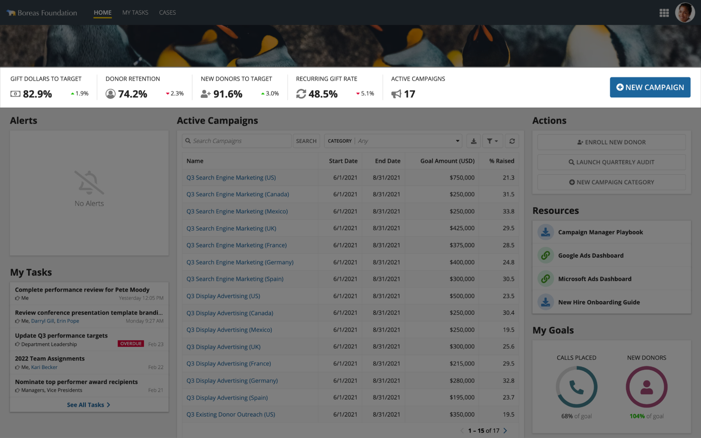
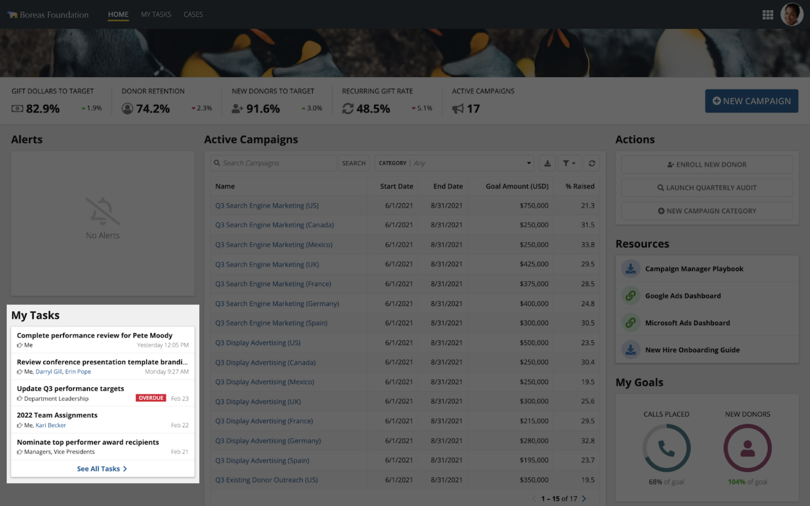
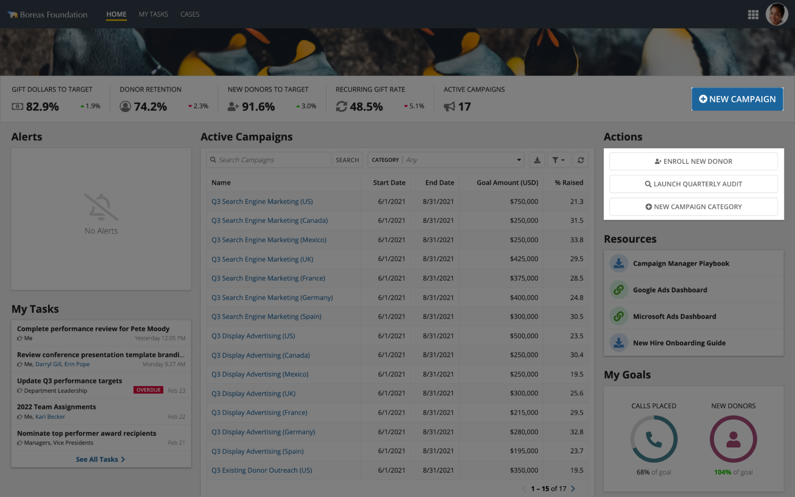
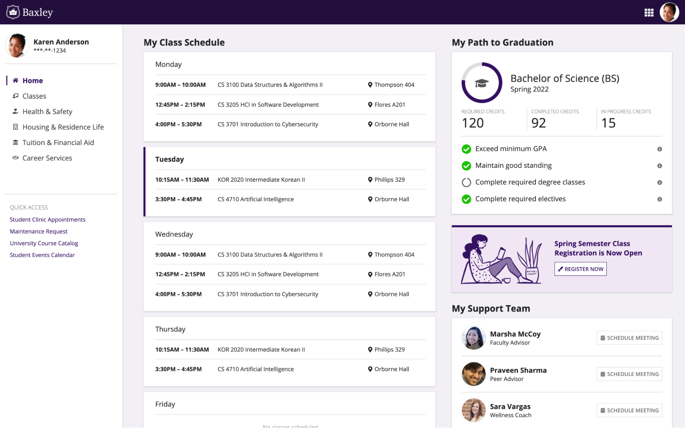
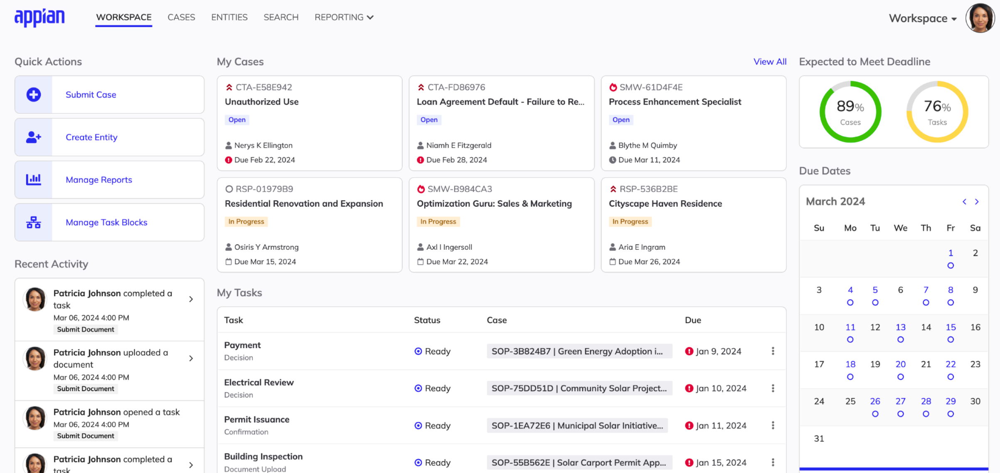
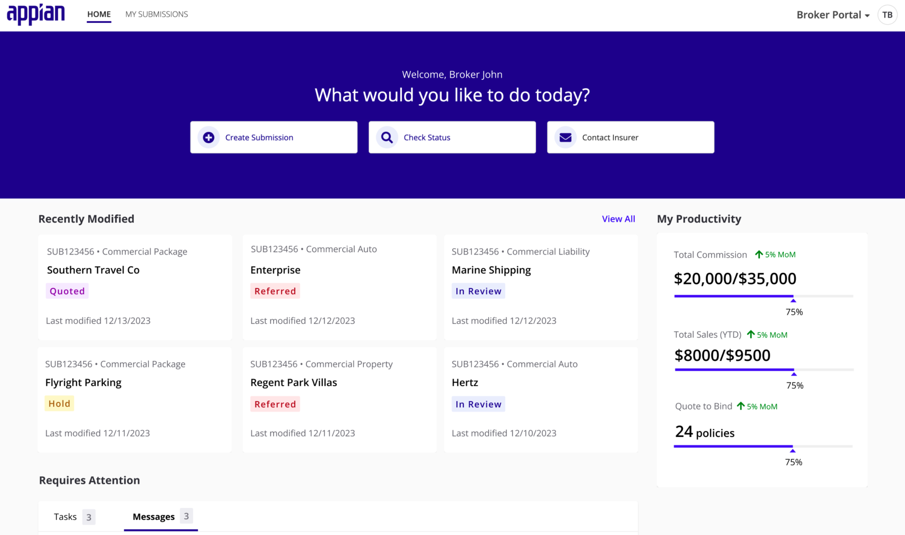
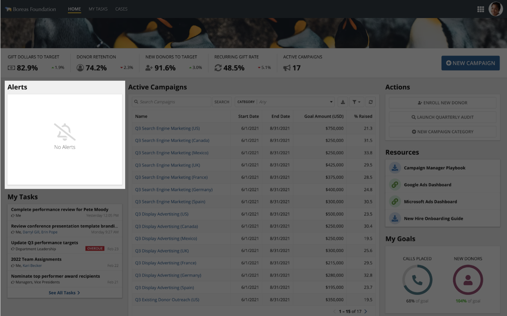

# Employee Home Pages [SAIL Design System: Patterns]

*Section: patterns | source: https://docs.appian.com/suite/help/26.7/sail/employee-home-pages.html | images referenced live in corpus/images/*

# Employee Home Pages

Design personalized employee home pages to show the most important content and actions for users.

## What is an employee home page?

Employee home pages provide users who frequently use an app with a tailored summary of tasks, actions, and relevant information. These pages are designed with content selected for a target audience and are typically the first page a user views on a site.

This pattern for an employee home page displays primary tasks, a calendar, common actions, and relevant conversations.


When deciding how to design an employee home page, keep the following questions and considerations in mind:

- **Content curation**: What different user personas will view the page? What information do they need and which actions will they take?

- **Information quantity**: How much information is valuable to the user? What should be prioritized?

Ultimately, you'll want to tailor the page content to the needs of your target users.

## Choosing the right type of header

You'll want to use different headers depending on the focus of your employee home page. For this page, a key performance indicator header is used because it's important for users to actively monitor business performance.



```sail
a!headerContentLayout(
  header: {
    a!billboardLayout(
      backgroundMedia: a!webImage(
        source: "https://images.unsplash.com/photo-1574950333594-f3e9a9446d0f?ixid=MXwxMjA3fDB8MHxwaG90by1wYWdlfHx8fGVufDB8fHw%3D&ixlib=rb-1.2.1&auto=format&fit=crop&w=2250&q=80"
      ),
      height: "EXTRA_SHORT",
      marginBelow: "NONE"
    ),
    a!cardLayout(
      contents: {
        a!columnsLayout(
          columns: {
            a!columnLayout(
              contents: {
                a!columnsLayout(
                  columns: {
                    a!columnLayout(
                      contents: {
                        a!richTextDisplayField(
                          labelPosition: "COLLAPSED",
                          value: { "GIFT DOLLARS TO TARGET" }
                        ),
                        a!sideBySideLayout(
                          items: {
                            a!sideBySideItem(
                              item: a!richTextDisplayField(
                                labelPosition: "COLLAPSED",
                                value: {
                                  a!richTextIcon(
                                    icon: "money",
                                    color: "SECONDARY",
                                    size: "MEDIUM_PLUS"
                                  ),
                                  a!richTextItem(
                                    text: { " 82.9%" },
                                    size: "MEDIUM_PLUS",
                                    style: { "STRONG" }
                                  )
                                }
                              )
                            ),
                            a!sideBySideItem(
                              item: a!richTextDisplayField(
                                labelPosition: "COLLAPSED",
                                value: {
                                  a!richTextIcon(
                                    icon: "caret-up",
                                    color: "POSITIVE",
                                    size: "STANDARD"
                                  ),
                                  a!richTextItem(
                                    text: { "1.9%" },
                                    color: "STANDARD",
                                    size: "STANDARD"
                                  )
                                }
                              ),
                              width: "MINIMIZE"
                            )
                          },
                          alignVertical: "MIDDLE"
                        )
                      }
                    ),
                    a!columnLayout(
                      contents: {
                        a!richTextDisplayField(
                          labelPosition: "COLLAPSED",
                          value: { "DONOR RETENTION" }
                        ),
                        a!sideBySideLayout(
                          items: {
                            a!sideBySideItem(
                              item: a!richTextDisplayField(
                                labelPosition: "COLLAPSED",
                                value: {
                                  a!richTextIcon(
                                    icon: "user-circle-o",
                                    color: "SECONDARY",
                                    size: "MEDIUM_PLUS"
                                  ),
                                  a!richTextItem(
                                    text: { " 74.2%" },
                                    size: "MEDIUM_PLUS",
                                    style: { "STRONG" }
                                  )
                                }
                              )
                            ),
                            a!sideBySideItem(
                              item: a!richTextDisplayField(
                                labelPosition: "COLLAPSED",
                                value: {
                                  a!richTextIcon(
                                    icon: "caret-down",
                                    color: "NEGATIVE",
                                    size: "STANDARD"
                                  ),
                                  a!richTextItem(
                                    text: { "2.3%" },
                                    color: "STANDARD",
                                    size: "STANDARD"
                                  )
                                }
                              ),
                              width: "MINIMIZE"
                            )
                          },
                          alignVertical: "MIDDLE"
                        )
                      }
                    ),
                    a!columnLayout(
                      contents: {
                        a!richTextDisplayField(
                          labelPosition: "COLLAPSED",
                          value: { "NEW DONORS TO TARGET" }
                        ),
                        a!sideBySideLayout(
                          items: {
                            a!sideBySideItem(
                              item: a!richTextDisplayField(
                                labelPosition: "COLLAPSED",
                                value: {
                                  a!richTextIcon(
                                    icon: "user-plus",
                                    color: "SECONDARY",
                                    size: "MEDIUM_PLUS"
                                  ),
                                  a!richTextItem(
                                    text: { " 91.6%" },
                                    size: "MEDIUM_PLUS",
                                    style: { "STRONG" }
                                  )
                                }
                              )
                            ),
                            a!sideBySideItem(
                              item: a!richTextDisplayField(
                                labelPosition: "COLLAPSED",
                                value: {
                                  a!richTextIcon(
                                    icon: "caret-up",
                                    color: "POSITIVE",
                                    size: "STANDARD"
                                  ),
                                  a!richTextItem(
                                    text: { "3.0%" },
                                    color: "STANDARD",
                                    size: "STANDARD"
                                  )
                                }
                              ),
                              width: "MINIMIZE"
                            )
                          },
                          alignVertical: "MIDDLE"
                        )
                      }
                    ),
                    a!columnLayout(
                      contents: {
                        a!richTextDisplayField(
                          labelPosition: "COLLAPSED",
                          value: { "RECURRING GIFT RATE" }
                        ),
                        a!sideBySideLayout(
                          items: {
                            a!sideBySideItem(
                              item: a!richTextDisplayField(
                                labelPosition: "COLLAPSED",
                                value: {
                                  a!richTextIcon(
                                    icon: "refresh",
                                    color: "SECONDARY",
                                    size: "MEDIUM_PLUS"
                                  ),
                                  a!richTextItem(
                                    text: { " 48.5%" },
                                    size: "MEDIUM_PLUS",
                                    style: { "STRONG" }
                                  )
                                }
                              )
                            ),
                            a!sideBySideItem(
                              item: a!richTextDisplayField(
                                labelPosition: "COLLAPSED",
                                value: {
                                  a!richTextIcon(
                                    icon: "caret-down",
                                    color: "NEGATIVE",
                                    size: "STANDARD"
                                  ),
                                  a!richTextItem(
                                    text: { "5.1%" },
                                    color: "STANDARD",
                                    size: "STANDARD"
                                  )
                                }
                              ),
                              width: "MINIMIZE"
                            )
                          },
                          alignVertical: "MIDDLE"
                        )
                      }
                    ),
                    a!columnLayout(
                      contents: {
                        a!richTextDisplayField(
                          labelPosition: "COLLAPSED",
                          value: { "ACTIVE CAMPAIGNS" }
                        ),
                        a!sideBySideLayout(
                          items: {
                            a!sideBySideItem(
                              item: a!richTextDisplayField(
                                labelPosition: "COLLAPSED",
                                value: {
                                  a!richTextIcon(
                                    icon: "bullhorn",
                                    color: "SECONDARY",
                                    size: "MEDIUM_PLUS"
                                  ),
                                  a!richTextItem(
                                    text: { " 17" },
                                    size: "MEDIUM_PLUS",
                                    style: { "STRONG" }
                                  )
                                }
                              )
                            )
                          },
                          alignVertical: "MIDDLE"
                        )
                      }
                    )
                  },
                  spacing: "SPARSE",
                  showDividers: true
                )
              },
              width: "WIDE_PLUS"
            ),
            a!columnLayout(contents: {}, width: "AUTO"),
            a!columnLayout(
              contents: {
                a!buttonArrayLayout(
                  buttons: {
                    a!buttonWidget(
                      label: "NEW CAMPAIGN",
                      icon: "plus-circle",
                      size: "LARGE",
                      style: "SOLID"
                    )
                  },
                  align: "END",
                  marginBelow: "NONE"
                )
              },
              width: "NARROW"
            )
          },
          alignVertical: "MIDDLE"
        )
      },
      height: "AUTO",
      padding: "STANDARD",
      marginBelow: "NONE"
    )
  },
  contents: {
    a!columnsLayout(
      columns: {
        a!columnLayout(
          contents: {
            a!sectionLayout(
              label: "Alerts",
              labelSize: "MEDIUM",
              labelHeadingTag: "H2",
              labelColor: "STANDARD",
              contents: {
                a!cardLayout(
                  contents: {
                    a!richTextDisplayField(
                      labelPosition: "COLLAPSED",
                      value: {
                        char(10),
                        char(10),
                        char(10),
                        char(10),
                        a!richTextIcon(
                          icon: "bell-slash-o",
                          color: "#d9d9d9",
                          size: "EXTRA_LARGE"
                        ),
                        char(10),
                        a!richTextItem(
                          text: { "No Alerts" },
                          color: "SECONDARY",
                          size: "MEDIUM"
                        )
                      },
                      align: "CENTER"
                    )
                  },
                  height: "MEDIUM_PLUS",
                  style: "NONE",
                  marginBelow: "STANDARD",
                  showBorder: false,
                  showShadow: true
                )
              }
            ),
            a!sectionLayout(
              label: "My Tasks",
              labelSize: "MEDIUM",
              labelHeadingTag: "H2",
              labelColor: "STANDARD",
              contents: {
                a!cardLayout(
                  contents: {
                    a!cardLayout(
                      contents: {
                        a!sideBySideLayout(
                          items: {
                            a!sideBySideItem(
                              item: a!richTextDisplayField(
                                labelPosition: "COLLAPSED",
                                value: {
                                  a!richTextItem(
                                    text: {
                                      "Complete performance review for Pete Moody"
                                    },
                                    style: { "STRONG" }
                                  )
                                },
                                preventWrapping: true
                              )
                            )
                          },
                          marginBelow: "NONE"
                        ),
                        a!sideBySideLayout(
                          items: {
                            a!sideBySideItem(
                              item: a!richTextDisplayField(
                                labelPosition: "COLLAPSED",
                                value: {
                                  a!richTextIcon(
                                    icon: "hand-o-right",
                                    color: "SECONDARY",
                                    size: "SMALL"
                                  ),
                                  a!richTextItem(text: { " Me" }, size: "SMALL")
                                },
                                preventWrapping: true
                              )
                            ),
                            a!sideBySideItem(
                              item: a!richTextDisplayField(
                                labelPosition: "COLLAPSED",
                                value: {
                                  a!richTextItem(
                                    text: { "Yesterday 12:05 PM" },
                                    color: "SECONDARY",
                                    size: "SMALL"
                                  )
                                }
                              ),
                              width: "MINIMIZE"
                            )
                          },
                          alignVertical: "MIDDLE"
                        )
                      },
                      link: a!dynamicLink(label: "Dynamic Link", saveInto: {}),
                      height: "AUTO",
                      style: "NONE",
                      marginBelow: "NONE",
                      showBorder: false,
                      showShadow: true
                    ),
                    a!cardLayout(
                      contents: {
                        a!sideBySideLayout(
                          items: {
                            a!sideBySideItem(
                              item: a!richTextDisplayField(
                                labelPosition: "COLLAPSED",
                                value: {
                                  a!richTextItem(
                                    text: {
                                      "Review conference presentation template branding updates"
                                    },
                                    style: { "STRONG" }
                                  )
                                },
                                preventWrapping: true
                              )
                            )
                          },
                          marginBelow: "NONE"
                        ),
                        a!sideBySideLayout(
                          items: {
                            a!sideBySideItem(
                              item: a!richTextDisplayField(
                                labelPosition: "COLLAPSED",
                                value: {
                                  a!richTextIcon(
                                    icon: "hand-o-right",
                                    color: "SECONDARY",
                                    size: "SMALL"
                                  ),
                                  a!richTextItem(text: { " Me, " }, size: "SMALL"),
                                  a!richTextItem(
                                    text: { "Darryl Gill" },
                                    color: "ACCENT",
                                    size: "SMALL"
                                  ),
                                  a!richTextItem(text: { ", " }, size: "SMALL"),
                                  a!richTextItem(
                                    text: { "Erin Pope" },
                                    color: "ACCENT",
                                    size: "SMALL"
                                  )
                                },
                                preventWrapping: true
                              )
                            ),
                            a!sideBySideItem(
                              item: a!richTextDisplayField(
                                labelPosition: "COLLAPSED",
                                value: {
                                  a!richTextItem(
                                    text: { "Monday 9:27 AM" },
                                    color: "SECONDARY",
                                    size: "SMALL"
                                  )
                                }
                              ),
                              width: "MINIMIZE"
                            )
                          },
                          alignVertical: "MIDDLE"
                        )
                      },
                      link: a!dynamicLink(label: "Dynamic Link", saveInto: {}),
                      height: "AUTO",
                      style: "NONE",
                      marginBelow: "NONE",
                      showBorder: false,
                      showShadow: true
                    ),
                    a!cardLayout(
                      contents: {
                        a!sideBySideLayout(
                          items: {
                            a!sideBySideItem(
                              item: a!richTextDisplayField(
                                labelPosition: "COLLAPSED",
                                value: {
                                  a!richTextItem(
                                    text: { "Update Q3 performance targets" },
                                    style: { "STRONG" }
                                  )
                                },
                                preventWrapping: true
                              )
                            )
                          },
                          marginBelow: "NONE"
                        ),
                        a!sideBySideLayout(
                          items: {
                            a!sideBySideItem(
                              item: a!richTextDisplayField(
                                labelPosition: "COLLAPSED",
                                value: {
                                  a!richTextIcon(
                                    icon: "hand-o-right",
                                    color: "SECONDARY",
                                    size: "SMALL"
                                  ),
                                  a!richTextItem(
                                    text: { " Department Leadership" },
                                    size: "SMALL"
                                  )
                                },
                                preventWrapping: true
                              )
                            ),
                            a!sideBySideItem(
                              item: a!tagField(
                                labelPosition: "COLLAPSED",
                                tags: {
                                  a!tagItem(
                                    text: "OVERDUE",
                                    backgroundColor: "NEGATIVE"
                                  )
                                },
                                size: "SMALL"
                              ),
                              width: "MINIMIZE"
                            ),
                            a!sideBySideItem(
                              item: a!richTextDisplayField(
                                labelPosition: "COLLAPSED",
                                value: {
                                  a!richTextItem(
                                    text: { "Feb 23" },
                                    color: "SECONDARY",
                                    size: "SMALL"
                                  )
                                }
                              ),
                              width: "MINIMIZE"
                            )
                          },
                          alignVertical: "MIDDLE"
                        )
                      },
                      link: a!dynamicLink(label: "Dynamic Link", saveInto: {}),
                      height: "AUTO",
                      style: "NONE",
                      marginBelow: "NONE",
                      showBorder: false,
                      showShadow: true
                    ),
                    a!cardLayout(
                      contents: {
                        a!sideBySideLayout(
                          items: {
                            a!sideBySideItem(
                              item: a!richTextDisplayField(
                                labelPosition: "COLLAPSED",
                                value: {
                                  a!richTextItem(
                                    text: { "2022 Team Assignments" },
                                    style: { "STRONG" }
                                  )
                                },
                                preventWrapping: true
                              )
                            )
                          },
                          marginBelow: "NONE"
                        ),
                        a!sideBySideLayout(
                          items: {
                            a!sideBySideItem(
                              item: a!richTextDisplayField(
                                labelPosition: "COLLAPSED",
                                value: {
                                  a!richTextIcon(
                                    icon: "hand-o-right",
                                    color: "SECONDARY",
                                    size: "SMALL"
                                  ),
                                  a!richTextItem(text: { " Me, " }, size: "SMALL"),
                                  a!richTextItem(
                                    text: { "Kari Becker" },
                                    color: "ACCENT",
                                    size: "SMALL"
                                  )
                                },
                                preventWrapping: true
                              )
                            ),
                            a!sideBySideItem(
                              item: a!richTextDisplayField(
                                labelPosition: "COLLAPSED",
                                value: {
                                  a!richTextItem(
                                    text: { "Feb 22" },
                                    color: "SECONDARY",
                                    size: "SMALL"
                                  )
                                }
                              ),
                              width: "MINIMIZE"
                            )
                          },
                          alignVertical: "MIDDLE"
                        )
                      },
                      link: a!dynamicLink(label: "Dynamic Link", saveInto: {}),
                      height: "AUTO",
                      style: "NONE",
                      marginBelow: "NONE",
                      showBorder: false,
                      showShadow: true
                    ),
                    a!cardLayout(
                      contents: {
                        a!sideBySideLayout(
                          items: {
                            a!sideBySideItem(
                              item: a!richTextDisplayField(
                                labelPosition: "COLLAPSED",
                                value: {
                                  a!richTextItem(
                                    text: {
                                      "Nominate top performer award recipients"
                                    },
                                    style: { "STRONG" }
                                  )
                                },
                                preventWrapping: true
                              )
                            )
                          },
                          marginBelow: "NONE"
                        ),
                        a!sideBySideLayout(
                          items: {
                            a!sideBySideItem(
                              item: a!richTextDisplayField(
                                labelPosition: "COLLAPSED",
                                value: {
                                  a!richTextIcon(
                                    icon: "hand-o-right",
                                    color: "SECONDARY",
                                    size: "SMALL"
                                  ),
                                  a!richTextItem(
                                    text: { " Managers, Vice Presidents" },
                                    size: "SMALL"
                                  )
                                },
                                preventWrapping: true
                              )
                            ),
                            a!sideBySideItem(
                              item: a!richTextDisplayField(
                                labelPosition: "COLLAPSED",
                                value: {
                                  a!richTextItem(
                                    text: { "Feb 21" },
                                    color: "SECONDARY",
                                    size: "SMALL"
                                  )
                                }
                              ),
                              width: "MINIMIZE"
                            )
                          },
                          alignVertical: "MIDDLE"
                        )
                      },
                      link: a!dynamicLink(label: "Dynamic Link", saveInto: {}),
                      height: "AUTO",
                      style: "NONE",
                      marginBelow: "NONE",
                      showBorder: false,
                      showShadow: true
                    ),
                    a!cardLayout(
                      contents: {
                        a!richTextDisplayField(
                          labelPosition: "COLLAPSED",
                          value: {
                            a!richTextItem(
                              text: {
                                "See All Tasks ",
                                a!richTextIcon(icon: "chevron-right")
                              },
                              color: "ACCENT",
                              style: { "STRONG" }
                            )
                          },
                          align: "CENTER"
                        )
                      },
                      link: a!dynamicLink(label: "Dynamic Link", saveInto: {}),
                      height: "AUTO",
                      style: "NONE",
                      marginBelow: "NONE",
                      showBorder: false,
                      showShadow: true
                    )
                  },
                  height: "AUTO",
                  style: "NONE",
                  padding: "NONE",
                  marginBelow: "STANDARD",
                  showBorder: false,
                  showShadow: true
                )
              }
            )
          },
          width: "MEDIUM"
        ),
        a!columnLayout(
          contents: {
            a!sectionLayout(
              label: "Active Campaigns",
              labelSize: "MEDIUM",
              labelHeadingTag: "H2",
              labelColor: "STANDARD",
              contents: {
                a!cardLayout(
                  contents: {
                    a!gridField(
                      label: "Campaigns List",
                      labelPosition: "COLLAPSED",
                      height: "AUTO"
                    )
                  }
                )
              },

            )
          },
          width: "AUTO"
        ),
        a!columnLayout(
          contents: {
            a!sectionLayout(
              label: "Actions",
              labelSize: "MEDIUM",
              labelHeadingTag: "H2",
              labelColor: "STANDARD",
              contents: {
                a!cardLayout(
                  contents: {
                    a!buttonArrayLayout(
                      buttons: {
                        a!buttonWidget(
                          label: "Enroll New Donor",
                          icon: "user-plus",
                          width: "FILL",
                          style: "OUTLINE",
                          color: "SECONDARY"
                        ),
                        a!buttonWidget(
                          label: "Launch Quarterly Audit",
                          icon: "search",
                          width: "FILL",
                          style: "OUTLINE",
                          color: "SECONDARY"
                        ),
                        a!buttonWidget(
                          label: "New Campaign Category",
                          icon: "plus-circle",
                          width: "FILL",
                          style: "OUTLINE",
                          color: "SECONDARY"
                        )
                      },
                      align: "START",
                      marginBelow: "NONE"
                    )
                  },
                  height: "AUTO",
                  style: "NONE",
                  marginBelow: "STANDARD",
                  showBorder: false,
                  showShadow: true
                )
              }
            ),
            a!sectionLayout(
              label: "Resources",
              labelSize: "MEDIUM",
              labelHeadingTag: "H2",
              labelColor: "STANDARD",
              contents: {
                a!cardLayout(
                  contents: {
                    a!cardLayout(
                      contents: {
                        a!sideBySideLayout(
                          items: {
                            a!sideBySideItem(
                              item: a!stampField(
                                labelPosition: "COLLAPSED",
                                icon: "download",
                                backgroundColor: "#d7e5f3",
                                contentColor: "#3d85c6",
                                size: "TINY"
                              ),
                              width: "MINIMIZE"
                            ),
                            a!sideBySideItem(
                              item: a!richTextDisplayField(
                                labelPosition: "COLLAPSED",
                                value: {
                                  a!richTextItem(
                                    text: { "Campaign Manager Playbook" },
                                    style: { "STRONG" }
                                  )
                                },
                                preventWrapping: true
                              )
                            )
                          },
                          alignVertical: "MIDDLE"
                        )
                      },
                      link: a!dynamicLink(label: "Dynamic Link", saveInto: {}),
                      height: "AUTO",
                      style: "NONE",
                      padding: "",
                      marginBelow: "NONE",
                      showBorder: false,
                      showShadow: true
                    ),
                    a!cardLayout(
                      contents: {
                        a!sideBySideLayout(
                          items: {
                            a!sideBySideItem(
                              item: a!stampField(
                                labelPosition: "COLLAPSED",
                                icon: "link",
                                backgroundColor: "#d7f3e0",
                                contentColor: "#459b20",
                                size: "TINY"
                              ),
                              width: "MINIMIZE"
                            ),
                            a!sideBySideItem(
                              item: a!richTextDisplayField(
                                labelPosition: "COLLAPSED",
                                value: {
                                  a!richTextItem(
                                    text: { "Google Ads Dashboard" },
                                    style: { "STRONG" }
                                  )
                                }
                              )
                            )
                          },
                          alignVertical: "MIDDLE"
                        )
                      },
                      link: a!dynamicLink(label: "Dynamic Link", saveInto: {}),
                      height: "AUTO",
                      style: "NONE",
                      marginBelow: "NONE",
                      showBorder: false,
                      showShadow: true
                    ),
                    a!cardLayout(
                      contents: {
                        a!sideBySideLayout(
                          items: {
                            a!sideBySideItem(
                              item: a!stampField(
                                labelPosition: "COLLAPSED",
                                icon: "link",
                                backgroundColor: "#d7f3e0",
                                contentColor: "#459b20",
                                size: "TINY"
                              ),
                              width: "MINIMIZE"
                            ),
                            a!sideBySideItem(
                              item: a!richTextDisplayField(
                                labelPosition: "COLLAPSED",
                                value: {
                                  a!richTextItem(
                                    text: { "Microsoft Ads Dashboard" },
                                    style: { "STRONG" }
                                  )
                                }
                              )
                            )
                          },
                          alignVertical: "MIDDLE"
                        )
                      },
                      link: a!dynamicLink(label: "Dynamic Link", saveInto: {}),
                      height: "AUTO",
                      style: "NONE",
                      marginBelow: "NONE",
                      showBorder: false,
                      showShadow: true
                    ),
                    a!cardLayout(
                      contents: {
                        a!sideBySideLayout(
                          items: {
                            a!sideBySideItem(
                              item: a!stampField(
                                labelPosition: "COLLAPSED",
                                icon: "download",
                                backgroundColor: "#d7e5f3",
                                contentColor: "#3d85c6",
                                size: "TINY"
                              ),
                              width: "MINIMIZE"
                            ),
                            a!sideBySideItem(
                              item: a!richTextDisplayField(
                                labelPosition: "COLLAPSED",
                                value: {
                                  a!richTextItem(
                                    text: { "New Hire Onboarding Guide" },
                                    style: { "STRONG" }
                                  )
                                },
                                preventWrapping: true
                              )
                            )
                          },
                          alignVertical: "MIDDLE"
                        )
                      },
                      link: a!dynamicLink(label: "Dynamic Link", saveInto: {}),
                      height: "AUTO",
                      style: "NONE",
                      marginBelow: "NONE",
                      showBorder: false,
                      showShadow: true
                    )
                  },
                  height: "AUTO",
                  style: "NONE",
                  padding: "NONE",
                  marginBelow: "STANDARD",
                  showBorder: false,
                  showShadow: true
                )
              }
            ),
            a!sectionLayout(
              label: "My Goals",
              labelSize: "MEDIUM",
              labelHeadingTag: "H2",
              labelColor: "STANDARD",
              contents: {
                a!cardLayout(
                  contents: {
                    a!columnsLayout(
                      columns: {
                        a!columnLayout(
                          contents: {
                            a!richTextDisplayField(
                              labelPosition: "COLLAPSED",
                              value: {
                                a!richTextItem(text: { "CALLS PLACED" }, color: "STANDARD")
                              },
                              align: "CENTER"
                            ),
                            a!gaugeField(
                              labelPosition: "COLLAPSED",
                              percentage: 68.0,
                              primaryText: a!gaugeIcon(icon: "phone"),
                              color: "#45818e",
                              size: "SMALL",
                              align: "CENTER"
                            ),
                            a!richTextDisplayField(
                              labelPosition: "COLLAPSED",
                              value: {
                                "68% ",
                                a!richTextItem(text: { "of goal" }, color: "SECONDARY")
                              },
                              align: "CENTER"
                            )
                          }
                        ),
                        a!columnLayout(
                          contents: {
                            a!richTextDisplayField(
                              labelPosition: "COLLAPSED",
                              value: {
                                a!richTextItem(text: { "NEW DONORS" }, color: "STANDARD")
                              },
                              align: "CENTER"
                            ),
                            a!gaugeField(
                              labelPosition: "COLLAPSED",
                              percentage: 100.0,
                              primaryText: a!gaugeIcon(icon: "user"),
                              color: "#a64d79",
                              size: "SMALL",
                              align: "CENTER"
                            ),
                            a!richTextDisplayField(
                              labelPosition: "COLLAPSED",
                              value: {
                                a!richTextItem(
                                  text: { "104%" },
                                  color: "POSITIVE",
                                  style: { "STRONG" }
                                ),
                                " ",
                                a!richTextItem(text: { "of goal" }, color: "SECONDARY")
                              },
                              align: "CENTER"
                            )
                          }
                        )
                      }
                    )
                  },
                  height: "AUTO",
                  style: "NONE",
                  padding: "MORE",
                  marginBelow: "STANDARD",
                  showBorder: false,
                  showShadow: true
                )
              }
            )
          },
          width: "MEDIUM"
        )
      },
      stackWhen: {
        "PHONE",
        "TABLET_PORTRAIT",
        "TABLET_LANDSCAPE",
        "DESKTOP_NARROW"
      }
    )
  },
  showWhen: true,
  backgroundColor: "TRANSPARENT"
)
```

Refer to Page Headers for more examples of possible header types.

## Displaying the appropriate content

Use different components and page layouts based on the type of information most relevant to your users.

### Highlights list

A highlights list is a concise summary of the most relevant items in a category, such as latest alerts and expiring deadlines. In this example, a highlights list is used to display relevant user tasks.

To use a highlight list effectively:

- Show a limited number of items sorted and filtered by relevance to the user. Typically this number is between 5 and 10 at most.

- Avoid showing paging controls. Provide a link to navigate to the full list of items on a separate page. Home pages serve as jumping off points to others parts of a site.

- Only display critical pieces of information for each item. To access other pieces of data associated with an item, users should click on a link to navigate to the corresponding item on a separate page.



### Record actions

The easiest way to present actions to users is with the record action component.

In this example, the "call to action" style action button is shown on the page header. The "sidebar" style is used to show a set of buttons in the "Actions" card.



## Focusing attention on the main information

You'll often want to center the main, most important information on a page.

This pattern uses a two-column layout with side navigation. The class schedule, the main information on the page, is sorted according to date and time and takes up the most visual space.



```sail
a!headerContentLayout(
  header: {},
  contents: {
    a!columnsLayout(
      columns: {
        a!columnLayout(
          contents: {
            a!cardLayout(
              contents: {
                a!sectionLayout(
                  label: "",
                  contents: {
                    a!sideBySideLayout(
                      items: {
                        a!sideBySideItem(
                          item: a!imageField(
                            label: "Profile Photo",
                            labelPosition: "COLLAPSED",
                            images: {
                              a!userImage(
                                user: fn!loggedInUser()
                              )
                            },
                            size: "SMALL",
                            isThumbnail: false,
                            style: "AVATAR"
                          ),
                          width: "MINIMIZE"
                        ),
                        a!sideBySideItem(
                          item: a!richTextDisplayField(
                            labelPosition: "COLLAPSED",
                            value: {
                              a!richTextItem(
                                text: {
                                  "Karen Anderson"
                                },
                                size: "MEDIUM",
                                style: {
                                  "STRONG"
                                }
                              ),
                              char(10),
                              a!richTextItem(
                                text: {
                                  "***-**-1234"
                                },
                                size: "STANDARD"
                              )
                            }
                          )
                        )
                      },
                      alignVertical: "MIDDLE"
                    )
                  },
                  divider: "BELOW",
                  marginAbove: "STANDARD"
                ),
                a!cardLayout(
                  contents: {
                    a!sideBySideLayout(
                      items: {
                        a!sideBySideItem(
                          item: a!richTextDisplayField(
                            labelPosition: "COLLAPSED",
                            value: {
                              a!richTextItem(
                                text: {
                                  "❘"
                                },
                                color: "ACCENT",
                                size: "LARGE"
                              )
                            }
                          ),
                          width: "MINIMIZE"
                        ),
                        a!sideBySideItem(
                          item: a!richTextDisplayField(
                            labelPosition: "COLLAPSED",
                            value: {
                              a!richTextIcon(
                                icon: "home",
                                color: "ACCENT",
                                size: "STANDARD"
                              )
                            }
                          ),
                          width: "MINIMIZE"
                        ),
                        a!sideBySideItem(
                          item: a!richTextDisplayField(
                            labelPosition: "COLLAPSED",
                            value: {
                              a!richTextItem(
                                text: {
                                  "Home"
                                },
                                color: "ACCENT",
                                size: "MEDIUM",
                                style: {
                                  "STRONG"
                                }
                              )
                            },
                            preventWrapping: true
                          )
                        )
                      },
                      alignVertical: "MIDDLE")
                  },
                  link: a!dynamicLink(
                    label: "Dynamic Link",
                    saveInto: {}
                  ),
                  tooltip: "",
                  height: "AUTO",
                  padding: "NONE",
                  marginAbove: "LESS",
                  marginBelow: "NONE",
                  showBorder: false
                ),
                a!cardLayout(
                  contents: {
                    a!sideBySideLayout(
                      items: {
                        a!sideBySideItem(
                          item: a!richTextDisplayField(
                            labelPosition: "COLLAPSED",
                            value: {
                              a!richTextItem(
                                text: {
                                  "❘"
                                },
                                color: "#ffffff",
                                size: "LARGE"
                              )
                            }
                          ),
                          width: "MINIMIZE"
                        ),
                        a!sideBySideItem(
                          item: a!richTextDisplayField(
                            labelPosition: "COLLAPSED",
                            value: {
                              a!richTextIcon(
                                icon: "chalkboard-teacher",
                                color: "#444",
                                size: "STANDARD"
                              )
                            }
                          ),
                          width: "MINIMIZE"
                        ),
                        a!sideBySideItem(
                          item: a!richTextDisplayField(
                            labelPosition: "COLLAPSED",
                            value: {
                              a!richTextItem(
                                text: {
                                  "Classes"
                                },
                                color: "#444",
                                size: "MEDIUM"
                              )
                            },
                            preventWrapping: true
                          )
                        )
                      },
                      alignVertical: "MIDDLE")
                  },
                  link: a!dynamicLink(
                    label: "Dynamic Link",
                    saveInto: {}
                  ),
                  tooltip: "",
                  height: "AUTO",
                  padding: "NONE",
                  marginBelow: "NONE",
                  showBorder: false
                ),
                a!cardLayout(
                  contents: {
                    a!sideBySideLayout(
                      items: {
                        a!sideBySideItem(
                          item: a!richTextDisplayField(
                            labelPosition: "COLLAPSED",
                            value: {
                              a!richTextItem(
                                text: {
                                  "❘"
                                },
                                color: "#ffffff",
                                size: "LARGE"
                              )
                            }
                          ),
                          width: "MINIMIZE"
                        ),
                        a!sideBySideItem(
                          item: a!richTextDisplayField(
                            labelPosition: "COLLAPSED",
                            value: {
                              a!richTextIcon(
                                icon: "hand-holding-heart",
                                color: "#444",
                                size: "STANDARD"
                              )
                            }
                          ),
                          width: "MINIMIZE"
                        ),
                        a!sideBySideItem(
                          item: a!richTextDisplayField(
                            labelPosition: "COLLAPSED",
                            value: {
                              a!richTextItem(
                                text: {
                                  "Health & Safety"
                                },
                                color: "#444",
                                size: "MEDIUM"
                              )
                            },
                            preventWrapping: true
                          )
                        )
                      },
                      alignVertical: "MIDDLE")
                  },
                  link: a!dynamicLink(
                    label: "Dynamic Link",
                    saveInto: {}
                  ),
                  tooltip: "",
                  height: "AUTO",
                  padding: "NONE",
                  marginBelow: "NONE",
                  showBorder: false
                ),
                a!cardLayout(
                  contents: {
                    a!sideBySideLayout(
                      items: {
                        a!sideBySideItem(
                          item: a!richTextDisplayField(
                            labelPosition: "COLLAPSED",
                            value: {
                              a!richTextItem(
                                text: {
                                  "❘"
                                },
                                color: "#ffffff",
                                size: "LARGE"
                              )
                            }
                          ),
                          width: "MINIMIZE"
                        ),
                        a!sideBySideItem(
                          item: a!richTextDisplayField(
                            labelPosition: "COLLAPSED",
                            value: {
                              a!richTextIcon(
                                icon: "building-o",
                                color: "#444",
                                size: "STANDARD"
                              )
                            }
                          ),
                          width: "MINIMIZE"
                        ),
                        a!sideBySideItem(
                          item: a!richTextDisplayField(
                            labelPosition: "COLLAPSED",
                            value: {
                              a!richTextItem(
                                text: {
                                  "Housing & Residence Life"
                                },
                                color: "#444",
                                size: "MEDIUM"
                              )
                            },
                            preventWrapping: true
                          )
                        )
                      },
                      alignVertical: "MIDDLE")
                  },
                  link: a!dynamicLink(
                    label: "Dynamic Link",
                    saveInto: {}
                  ),
                  tooltip: "",
                  height: "AUTO",
                  padding: "NONE",
                  marginBelow: "NONE",
                  showBorder: false
                ),
                a!cardLayout(
                  contents: {
                    a!sideBySideLayout(
                      items: {
                        a!sideBySideItem(
                          item: a!richTextDisplayField(
                            labelPosition: "COLLAPSED",
                            value: {
                              a!richTextItem(
                                text: {
                                  "❘"
                                },
                                color: "#ffffff",
                                size: "LARGE"
                              )
                            }
                          ),
                          width: "MINIMIZE"
                        ),
                        a!sideBySideItem(
                          item: a!richTextDisplayField(
                            labelPosition: "COLLAPSED",
                            value: {
                              a!richTextIcon(
                                icon: "university",
                                color: "#444",
                                size: "STANDARD"
                              )
                            }
                          ),
                          width: "MINIMIZE"
                        ),
                        a!sideBySideItem(
                          item: a!richTextDisplayField(
                            labelPosition: "COLLAPSED",
                            value: {
                              a!richTextItem(
                                text: {
                                  "Tuition & Financial Aid"
                                },
                                color: "#444",
                                size: "MEDIUM"
                              )
                            },
                            preventWrapping: true
                          )
                        )
                      },
                      alignVertical: "MIDDLE")
                  },
                  link: a!dynamicLink(
                    label: "Dynamic Link",
                    saveInto: {}
                  ),
                  tooltip: "",
                  height: "AUTO",
                  padding: "NONE",
                  marginBelow: "NONE",
                  showBorder: false
                ),
                a!cardLayout(
                  contents: {
                    a!sideBySideLayout(
                      items: {
                        a!sideBySideItem(
                          item: a!richTextDisplayField(
                            labelPosition: "COLLAPSED",
                            value: {
                              a!richTextItem(
                                text: {
                                  "❘"
                                },
                                color: "#ffffff",
                                size: "LARGE"
                              )
                            }
                          ),
                          width: "MINIMIZE"
                        ),
                        a!sideBySideItem(
                          item: a!richTextDisplayField(
                            labelPosition: "COLLAPSED",
                            value: {
                              a!richTextIcon(
                                icon: "handshake-o",
                                color: "#444",
                                size: "STANDARD"
                              )
                            }
                          ),
                          width: "MINIMIZE"
                        ),
                        a!sideBySideItem(
                          item: a!richTextDisplayField(
                            labelPosition: "COLLAPSED",
                            value: {
                              a!richTextItem(
                                text: {
                                  "Career Services"
                                },
                                color: "#444",
                                size: "MEDIUM"
                              )
                            },
                            preventWrapping: true
                          )
                        )
                      },
                      alignVertical: "MIDDLE")
                  },
                  link: a!dynamicLink(
                    label: "Dynamic Link",
                    saveInto: {}
                  ),
                  tooltip: "",
                  height: "AUTO",
                  padding: "NONE",
                  marginBelow: "NONE",
                  showBorder: false
                ),
                a!sectionLayout(
                  label: "",
                  contents: {
                    a!cardLayout(
                      contents: {
                        a!richTextDisplayField(
                          labelPosition: "COLLAPSED",
                          value: {
                            a!richTextItem(
                              text: {
                                "QUICK ACCESS"
                              },
                              color: "SECONDARY"
                            )
                          }
                        ),
                        a!linkField(
                          label: "",
                          labelPosition: "COLLAPSED",
                          links: {
                            a!safeLink(
                              label: "Student Clinic Appointments",
                              uri: "www.appian.com",
                              openLinkIn: "NEW_TAB"
                            )
                          }
                        ),
                        a!linkField(
                          label: "",
                          labelPosition: "COLLAPSED",
                          links: {
                            a!safeLink(
                              label: "Maintenance Request",
                              uri: "www.appian.com",
                              openLinkIn: "NEW_TAB"
                            )
                          }
                        ),
                        a!linkField(
                          label: "",
                          labelPosition: "COLLAPSED",
                          links: {
                            a!safeLink(
                              label: "University Course Catalog",
                              uri: "www.appian.com",
                              openLinkIn: "NEW_TAB"
                            )
                          }
                        ),
                        a!linkField(
                          label: "",
                          labelPosition: "COLLAPSED",
                          links: {
                            a!safeLink(
                              label: "Student Events Calendar",
                              uri: "www.appian.com",
                              openLinkIn: "NEW_TAB"
                            )
                          }
                        )
                      },
                      height: "AUTO",
                      style: "NONE",
                      marginBelow: "NONE",
                      showBorder: false
                    )
                  },
                  divider: "ABOVE",
                  marginAbove: "EVEN_MORE"
                ),
                a!cardLayout(
                  contents: {},
                  height: "EXTRA_TALL",
                  style: "NONE",
                  marginBelow: "STANDARD",
                  showBorder: false
                ),
                a!cardLayout(
                  contents: {},
                  height: "EXTRA_TALL",
                  style: "NONE",
                  marginBelow: "STANDARD",
                  showBorder: false
                )

              },
              height: "AUTO",
              style: "NONE",
              padding: "LESS",
              marginBelow: "NONE",
              showBorder: false,
              showShadow: true
            )
          },
          width: "NARROW_PLUS"
        ),
        a!columnLayout(
          contents: {
            a!cardLayout(
              contents: {
                a!columnsLayout(
                  columns: {
                    a!columnLayout(
                      contents: {
                        a!sectionLayout(
                          label: "My Class Schedule",
                          labelSize: "MEDIUM",
                          labelColor: "STANDARD",
                          contents: {
                            a!cardLayout(
                              contents: {
                                a!sectionLayout(
                                  label: "",
                                  contents: {
                                    a!sideBySideLayout(
                                      items: {
                                        a!sideBySideItem(
                                          item: a!richTextDisplayField(
                                            labelPosition: "COLLAPSED",
                                            value: {
                                              a!richTextItem(
                                                text: {
                                                  "Monday"
                                                },
                                                size: "MEDIUM"
                                              )
                                            }
                                          )
                                        )
                                      },
                                      alignVertical: "MIDDLE"
                                    )
                                  },
                                  marginBelow: "NONE"
                                ),
                                a!sectionLayout(
                                  label: "",
                                  contents: {
                                    a!sideBySideLayout(
                                      items: {
                                        a!sideBySideItem(
                                          item: a!richTextDisplayField(
                                            labelPosition: "COLLAPSED",
                                            value: {
                                              a!richTextItem(
                                                text: {
                                                  "9:00AM – 10:00AM"
                                                },
                                                style: {
                                                  "STRONG"
                                                }
                                              )
                                            }
                                          ),
                                          width: "2X"
                                        ),
                                        a!sideBySideItem(
                                          item: a!richTextDisplayField(
                                            labelPosition: "COLLAPSED",
                                            value: {
                                              "CS 3100 Data Structures & Algorithms II"
                                            }
                                          ),
                                          width: "5X"
                                        ),
                                        a!sideBySideItem(
                                          item: a!richTextDisplayField(
                                            labelPosition: "COLLAPSED",
                                            value: {
                                              a!richTextIcon(
                                                icon: "map-marker"
                                              ),
                                              " Thompson 404"
                                            }
                                          ),
                                          width: "2X"
                                        )
                                      },
                                      alignVertical: "TOP"
                                    )
                                  },
                                  divider: "ABOVE",
                                  marginBelow: "NONE"
                                ),
                                a!sectionLayout(
                                  label: "",
                                  contents: {
                                    a!sideBySideLayout(
                                      items: {
                                        a!sideBySideItem(
                                          item: a!richTextDisplayField(
                                            labelPosition: "COLLAPSED",
                                            value: {
                                              a!richTextItem(
                                                text: {
                                                  "12:45PM – 2:15PM"
                                                },
                                                style: {
                                                  "STRONG"
                                                }
                                              )
                                            }
                                          ),
                                          width: "2X"
                                        ),
                                        a!sideBySideItem(
                                          item: a!richTextDisplayField(
                                            labelPosition: "COLLAPSED",
                                            value: {
                                              "CS 3205 HCI in Software Development"
                                            }
                                          ),
                                          width: "5X"
                                        ),
                                        a!sideBySideItem(
                                          item: a!richTextDisplayField(
                                            labelPosition: "COLLAPSED",
                                            value: {
                                              a!richTextIcon(
                                                icon: "map-marker"
                                              ),
                                              " Flores A201"
                                            }
                                          ),
                                          width: "2X"
                                        )
                                      },
                                      alignVertical: "TOP"
                                    )
                                  },
                                  divider: "ABOVE",
                                  marginBelow: "NONE"
                                ),
                                a!sectionLayout(
                                  label: "",
                                  contents: {
                                    a!sideBySideLayout(
                                      items: {
                                        a!sideBySideItem(
                                          item: a!richTextDisplayField(
                                            labelPosition: "COLLAPSED",
                                            value: {
                                              a!richTextItem(
                                                text: {
                                                  "4:00PM – 5:30PM"
                                                },
                                                style: {
                                                  "STRONG"
                                                }
                                              )
                                            }
                                          ),
                                          width: "2X"
                                        ),
                                        a!sideBySideItem(
                                          item: a!richTextDisplayField(
                                            labelPosition: "COLLAPSED",
                                            value: {
                                              "CS 3701 Introduction to Cybersecurity"
                                            }
                                          ),
                                          width: "5X"
                                        ),
                                        a!sideBySideItem(
                                          item: a!richTextDisplayField(
                                            labelPosition: "COLLAPSED",
                                            value: {
                                              a!richTextIcon(
                                                icon: "map-marker"
                                              ),
                                              " Orborne Hall"
                                            }
                                          ),
                                          width: "2X"
                                        )
                                      },
                                      alignVertical: "TOP"
                                    )
                                  },
                                  divider: "ABOVE"
                                )
                              },
                              height: "AUTO",
                              style: "NONE",
                              padding: "STANDARD",
                              marginBelow: "STANDARD",
                              showBorder: false,
                              showShadow: true,
                              decorativeBarPosition: "START",
                              decorativeBarColor: "#fff"
                            ),
                            a!cardLayout(
                              contents: {
                                a!sectionLayout(
                                  label: "",
                                  contents: {
                                    a!sideBySideLayout(
                                      items: {
                                        a!sideBySideItem(
                                          item: a!richTextDisplayField(
                                            labelPosition: "COLLAPSED",
                                            value: {
                                              a!richTextItem(
                                                text: {
                                                  "Tuesday"
                                                },
                                                size: "MEDIUM",
                                                style: {
                                                  "STRONG"
                                                }
                                              )
                                            }
                                          )
                                        )
                                      },
                                      alignVertical: "MIDDLE"
                                    )
                                  },
                                  marginBelow: "NONE"
                                ),
                                a!sectionLayout(
                                  label: "",
                                  contents: {
                                    a!sideBySideLayout(
                                      items: {
                                        a!sideBySideItem(
                                          item: a!richTextDisplayField(
                                            labelPosition: "COLLAPSED",
                                            value: {
                                              a!richTextItem(
                                                text: {
                                                  "10:15AM – 11:30AM"
                                                },
                                                style: {
                                                  "STRONG"
                                                }
                                              )
                                            }
                                          ),
                                          width: "2X"
                                        ),
                                        a!sideBySideItem(
                                          item: a!richTextDisplayField(
                                            labelPosition: "COLLAPSED",
                                            value: {
                                              "KOR 2020 Intermediate Korean II"
                                            }
                                          ),
                                          width: "5X"
                                        ),
                                        a!sideBySideItem(
                                          item: a!richTextDisplayField(
                                            labelPosition: "COLLAPSED",
                                            value: {
                                              a!richTextIcon(
                                                icon: "map-marker"
                                              ),
                                              " Phillips 329"
                                            }
                                          ),
                                          width: "2X"
                                        )
                                      },
                                      alignVertical: "TOP"
                                    )
                                  },
                                  divider: "ABOVE",
                                  marginBelow: "NONE"
                                ),
                                a!sectionLayout(
                                  label: "",
                                  contents: {
                                    a!sideBySideLayout(
                                      items: {
                                        a!sideBySideItem(
                                          item: a!richTextDisplayField(
                                            labelPosition: "COLLAPSED",
                                            value: {
                                              a!richTextItem(
                                                text: {
                                                  "3:30PM – 4:45PM"
                                                },
                                                style: {
                                                  "STRONG"
                                                }
                                              )
                                            }
                                          ),
                                          width: "2X"
                                        ),
                                        a!sideBySideItem(
                                          item: a!richTextDisplayField(
                                            labelPosition: "COLLAPSED",
                                            value: {
                                              "CS 4710 Artificial Intelligence"
                                            }
                                          ),
                                          width: "5X"
                                        ),
                                        a!sideBySideItem(
                                          item: a!richTextDisplayField(
                                            labelPosition: "COLLAPSED",
                                            value: {
                                              a!richTextIcon(
                                                icon: "map-marker"
                                              ),
                                              " Orborne Hall"
                                            }
                                          ),
                                          width: "2X"
                                        )
                                      },
                                      alignVertical: "TOP"
                                    )
                                  },
                                  divider: "ABOVE"
                                )
                              },
                              height: "AUTO",
                              style: "NONE",
                              padding: "STANDARD",
                              marginBelow: "STANDARD",
                              showBorder: false,
                              showShadow: true,
                              decorativeBarPosition: "START",
                              decorativeBarColor: "ACCENT"
                            ),
                            a!cardLayout(
                              contents: {
                                a!sectionLayout(
                                  label: "",
                                  contents: {
                                    a!sideBySideLayout(
                                      items: {
                                        a!sideBySideItem(
                                          item: a!richTextDisplayField(
                                            labelPosition: "COLLAPSED",
                                            value: {
                                              a!richTextItem(
                                                text: {
                                                  "Wednesday"
                                                },
                                                size: "MEDIUM"
                                              )
                                            }
                                          )
                                        )
                                      },
                                      alignVertical: "MIDDLE"
                                    )
                                  },
                                  marginBelow: "NONE"
                                ),
                                a!sectionLayout(
                                  label: "",
                                  contents: {
                                    a!sideBySideLayout(
                                      items: {
                                        a!sideBySideItem(
                                          item: a!richTextDisplayField(
                                            labelPosition: "COLLAPSED",
                                            value: {
                                              a!richTextItem(
                                                text: {
                                                  "9:00AM – 10:00AM"
                                                },
                                                style: {
                                                  "STRONG"
                                                }
                                              )
                                            }
                                          ),
                                          width: "2X"
                                        ),
                                        a!sideBySideItem(
                                          item: a!richTextDisplayField(
                                            labelPosition: "COLLAPSED",
                                            value: {
                                              "CS 3100 Data Structures & Algorithms II"
                                            }
                                          ),
                                          width: "5X"
                                        ),
                                        a!sideBySideItem(
                                          item: a!richTextDisplayField(
                                            labelPosition: "COLLAPSED",
                                            value: {
                                              a!richTextIcon(
                                                icon: "map-marker"
                                              ),
                                              " Thompson 404"
                                            }
                                          ),
                                          width: "2X"
                                        )
                                      },
                                      alignVertical: "TOP"
                                    )
                                  },
                                  divider: "ABOVE",
                                  marginBelow: "NONE"
                                ),
                                a!sectionLayout(
                                  label: "",
                                  contents: {
                                    a!sideBySideLayout(
                                      items: {
                                        a!sideBySideItem(
                                          item: a!richTextDisplayField(
                                            labelPosition: "COLLAPSED",
                                            value: {
                                              a!richTextItem(
                                                text: {
                                                  "12:45PM – 2:15PM"
                                                },
                                                style: {
                                                  "STRONG"
                                                }
                                              )
                                            }
                                          ),
                                          width: "2X"
                                        ),
                                        a!sideBySideItem(
                                          item: a!richTextDisplayField(
                                            labelPosition: "COLLAPSED",
                                            value: {
                                              "CS 3205 HCI in Software Development"
                                            }
                                          ),
                                          width: "5X"
                                        ),
                                        a!sideBySideItem(
                                          item: a!richTextDisplayField(
                                            labelPosition: "COLLAPSED",
                                            value: {
                                              a!richTextIcon(
                                                icon: "map-marker"
                                              ),
                                              " Flores A201"
                                            }
                                          ),
                                          width: "2X"
                                        )
                                      },
                                      alignVertical: "TOP"
                                    )
                                  },
                                  divider: "ABOVE",
                                  marginBelow: "NONE"
                                ),
                                a!sectionLayout(
                                  label: "",
                                  contents: {
                                    a!sideBySideLayout(
                                      items: {
                                        a!sideBySideItem(
                                          item: a!richTextDisplayField(
                                            labelPosition: "COLLAPSED",
                                            value: {
                                              a!richTextItem(
                                                text: {
                                                  "4:00PM – 5:30PM"
                                                },
                                                style: {
                                                  "STRONG"
                                                }
                                              )
                                            }
                                          ),
                                          width: "2X"
                                        ),
                                        a!sideBySideItem(
                                          item: a!richTextDisplayField(
                                            labelPosition: "COLLAPSED",
                                            value: {
                                              "CS 3701 Introduction to Cybersecurity"
                                            }
                                          ),
                                          width: "5X"
                                        ),
                                        a!sideBySideItem(
                                          item: a!richTextDisplayField(
                                            labelPosition: "COLLAPSED",
                                            value: {
                                              a!richTextIcon(
                                                icon: "map-marker"
                                              ),
                                              " Orborne Hall"
                                            }
                                          ),
                                          width: "2X"
                                        )
                                      },
                                      alignVertical: "TOP"
                                    )
                                  },
                                  divider: "ABOVE"
                                )
                              },
                              height: "AUTO",
                              style: "NONE",
                              padding: "STANDARD",
                              marginBelow: "STANDARD",
                              showBorder: false,
                              showShadow: true,
                              decorativeBarPosition: "START",
                              decorativeBarColor: "#fff"
                            ),
                            a!cardLayout(
                              contents: {
                                a!sectionLayout(
                                  label: "",
                                  contents: {
                                    a!sideBySideLayout(
                                      items: {
                                        a!sideBySideItem(
                                          item: a!richTextDisplayField(
                                            labelPosition: "COLLAPSED",
                                            value: {
                                              a!richTextItem(
                                                text: {
                                                  "Thursday"
                                                },
                                                size: "MEDIUM"
                                              )
                                            }
                                          )
                                        )
                                      },
                                      alignVertical: "MIDDLE"
                                    )
                                  },
                                  marginBelow: "NONE"
                                ),
                                a!sectionLayout(
                                  label: "",
                                  contents: {
                                    a!sideBySideLayout(
                                      items: {
                                        a!sideBySideItem(
                                          item: a!richTextDisplayField(
                                            labelPosition: "COLLAPSED",
                                            value: {
                                              a!richTextItem(
                                                text: {
                                                  "10:15AM – 11:30AM"
                                                },
                                                style: {
                                                  "STRONG"
                                                }
                                              )
                                            }
                                          ),
                                          width: "2X"
                                        ),
                                        a!sideBySideItem(
                                          item: a!richTextDisplayField(
                                            labelPosition: "COLLAPSED",
                                            value: {
                                              "KOR 2020 Intermediate Korean II"
                                            }
                                          ),
                                          width: "5X"
                                        ),
                                        a!sideBySideItem(
                                          item: a!richTextDisplayField(
                                            labelPosition: "COLLAPSED",
                                            value: {
                                              a!richTextIcon(
                                                icon: "map-marker"
                                              ),
                                              " Phillips 329"
                                            }
                                          ),
                                          width: "2X"
                                        )
                                      },
                                      alignVertical: "TOP"
                                    )
                                  },
                                  divider: "ABOVE",
                                  marginBelow: "NONE"
                                ),
                                a!sectionLayout(
                                  label: "",
                                  contents: {
                                    a!sideBySideLayout(
                                      items: {
                                        a!sideBySideItem(
                                          item: a!richTextDisplayField(
                                            labelPosition: "COLLAPSED",
                                            value: {
                                              a!richTextItem(
                                                text: {
                                                  "3:30PM – 4:45PM"
                                                },
                                                style: {
                                                  "STRONG"
                                                }
                                              )
                                            }
                                          ),
                                          width: "2X"
                                        ),
                                        a!sideBySideItem(
                                          item: a!richTextDisplayField(
                                            labelPosition: "COLLAPSED",
                                            value: {
                                              "CS 4710 Artificial Intelligence"
                                            }
                                          ),
                                          width: "5X"
                                        ),
                                        a!sideBySideItem(
                                          item: a!richTextDisplayField(
                                            labelPosition: "COLLAPSED",
                                            value: {
                                              a!richTextIcon(
                                                icon: "map-marker"
                                              ),
                                              " Orborne Hall"
                                            }
                                          ),
                                          width: "2X"
                                        )
                                      },
                                      alignVertical: "TOP"
                                    )
                                  },
                                  divider: "ABOVE"
                                )
                              },
                              height: "AUTO",
                              style: "NONE",
                              padding: "STANDARD",
                              marginBelow: "STANDARD",
                              showBorder: false,
                              showShadow: true,
                              decorativeBarPosition: "START",
                              decorativeBarColor: "#fff"
                            ),
                            a!cardLayout(
                              contents: {
                                a!sectionLayout(
                                  label: "",
                                  contents: {
                                    a!sideBySideLayout(
                                      items: {
                                        a!sideBySideItem(
                                          item: a!richTextDisplayField(
                                            labelPosition: "COLLAPSED",
                                            value: {
                                              a!richTextItem(
                                                text: {
                                                  "Friday"
                                                },
                                                size: "MEDIUM"
                                              )
                                            }
                                          )
                                        )
                                      },
                                      alignVertical: "MIDDLE"
                                    )
                                  },
                                  marginBelow: "NONE"
                                ),
                                a!sectionLayout(
                                  label: "",
                                  contents: {
                                    a!richTextDisplayField(
                                      labelPosition: "COLLAPSED",
                                      value: {
                                        a!richTextItem(
                                          text: {
                                            "No classes scheduled"
                                          },
                                          color: "SECONDARY"
                                        )
                                      },
                                      align: "CENTER",
                                      marginAbove: "LESS"
                                    )
                                  },
                                  divider: "ABOVE",
                                  marginAbove: "NONE",
                                  marginBelow: "STANDARD"
                                )
                              },
                              height: "AUTO",
                              style: "NONE",
                              padding: "STANDARD",
                              marginBelow: "STANDARD",
                              showBorder: false,
                              showShadow: true,
                              decorativeBarPosition: "START",
                              decorativeBarColor: "#fff"
                            )
                          }
                        )
                      }
                    ),
                    a!columnLayout(
                      contents: {
                        a!sectionLayout(
                          label: "My Path to Graduation",
                          labelSize: "MEDIUM",
                          labelColor: "STANDARD",
                          contents: {
                            a!cardLayout(
                              contents: {
                                a!sideBySideLayout(
                                  items: {
                                    a!sideBySideItem(
                                      item: a!gaugeField(
                                        labelPosition: "COLLAPSED",
                                        percentage: 77.0,
                                        primaryText: a!gaugeIcon(
                                          icon: "graduation-cap",
                                          color: "#555"
                                        ),
                                        size: "SMALL"
                                      ),
                                      width: "MINIMIZE"
                                    ),
                                    a!sideBySideItem(
                                      item: a!richTextDisplayField(
                                        labelPosition: "COLLAPSED",
                                        value: {
                                          a!richTextItem(
                                            text: {
                                              "Bachelor of Science (BS)"
                                            },
                                            size: "MEDIUM_PLUS"
                                          ),
                                          char(10),
                                          a!richTextItem(
                                            text: {
                                              "Spring 2022"
                                            },
                                            size: "MEDIUM"
                                          )
                                        }
                                      )
                                    )
                                  },
                                  alignVertical: "MIDDLE",
                                  spacing: "SPARSE",
                                  marginAbove: "LESS",
                                  marginBelow: "STANDARD"
                                ),
                                a!columnsLayout(
                                  columns: {
                                    a!columnLayout(
                                      contents: {
                                        a!richTextDisplayField(
                                          labelPosition: "COLLAPSED",
                                          value: {
                                            a!richTextItem(
                                              text: {
                                                "REQUIRED CREDITS"
                                              },
                                              color: "SECONDARY",
                                              size: "SMALL"
                                            ),
                                            char(10),
                                            a!richTextItem(
                                              text: {
                                                "120"
                                              },
                                              size: "LARGE"
                                            )
                                          }
                                        )
                                      }
                                    ),
                                    a!columnLayout(
                                      contents: {
                                        a!richTextDisplayField(
                                          labelPosition: "COLLAPSED",
                                          value: {
                                            a!richTextItem(
                                              text: {
                                                "COMPLETED CREDITS"
                                              },
                                              color: "SECONDARY",
                                              size: "SMALL"
                                            ),
                                            char(10),
                                            a!richTextItem(
                                              text: {
                                                "92"
                                              },
                                              size: "LARGE"
                                            )
                                          }
                                        )
                                      }
                                    ),
                                    a!columnLayout(
                                      contents: {
                                        a!richTextDisplayField(
                                          labelPosition: "COLLAPSED",
                                          value: {
                                            a!richTextItem(
                                              text: {
                                                "IN-PROGRESS CREDITS"
                                              },
                                              color: "SECONDARY",
                                              size: "SMALL"
                                            ),
                                            char(10),
                                            a!richTextItem(
                                              text: {
                                                "15"
                                              },
                                              size: "LARGE"
                                            )
                                          }
                                        )
                                      }
                                    )
                                  },
                                  alignVertical: "MIDDLE",
                                  showDividers: true
                                ),
                                a!sectionLayout(
                                  label: "",
                                  contents: {
                                    a!sideBySideLayout(
                                      items: {
                                        a!sideBySideItem(
                                          item: a!richTextDisplayField(
                                            labelPosition: "COLLAPSED",
                                            value: {
                                              a!richTextIcon(
                                                icon: "check-circle",
                                                color: "POSITIVE",
                                                size: "MEDIUM_PLUS"
                                              )
                                            }
                                          ),
                                          width: "MINIMIZE"
                                        ),
                                        a!sideBySideItem(
                                          item: a!richTextDisplayField(
                                            labelPosition: "COLLAPSED",
                                            value: {
                                              a!richTextItem(
                                                text: {
                                                  "Exceed minimum GPA"
                                                },
                                                size: "MEDIUM"
                                              )
                                            }
                                          )
                                        ),
                                        a!sideBySideItem(
                                          item: a!richTextDisplayField(
                                            labelPosition: "COLLAPSED",
                                            value: {
                                              a!richTextIcon(
                                                icon: "info-circle",
                                                color: "SECONDARY",
                                                size: "SMALL"
                                              )
                                            }
                                          ),
                                          width: "MINIMIZE"
                                        )
                                      },
                                      alignVertical: "MIDDLE"
                                    ),
                                    a!sideBySideLayout(
                                      items: {
                                        a!sideBySideItem(
                                          item: a!richTextDisplayField(
                                            labelPosition: "COLLAPSED",
                                            value: {
                                              a!richTextIcon(
                                                icon: "check-circle",
                                                color: "POSITIVE",
                                                size: "MEDIUM_PLUS"
                                              )
                                            }
                                          ),
                                          width: "MINIMIZE"
                                        ),
                                        a!sideBySideItem(
                                          item: a!richTextDisplayField(
                                            labelPosition: "COLLAPSED",
                                            value: {
                                              a!richTextItem(
                                                text: {
                                                  "Maintain good standing"
                                                },
                                                size: "MEDIUM"
                                              )
                                            }
                                          )
                                        ),
                                        a!sideBySideItem(
                                          item: a!richTextDisplayField(
                                            labelPosition: "COLLAPSED",
                                            value: {
                                              a!richTextIcon(
                                                icon: "info-circle",
                                                color: "SECONDARY",
                                                size: "SMALL"
                                              )
                                            }
                                          ),
                                          width: "MINIMIZE"
                                        )
                                      },
                                      alignVertical: "MIDDLE"
                                    ),
                                    a!sideBySideLayout(
                                      items: {
                                        a!sideBySideItem(
                                          item: a!richTextDisplayField(
                                            labelPosition: "COLLAPSED",
                                            value: {
                                              a!richTextIcon(
                                                icon: "circle-o-notch",
                                                color: "SECONDARY",
                                                size: "MEDIUM_PLUS"
                                              )
                                            }
                                          ),
                                          width: "MINIMIZE"
                                        ),
                                        a!sideBySideItem(
                                          item: a!richTextDisplayField(
                                            labelPosition: "COLLAPSED",
                                            value: {
                                              a!richTextItem(
                                                text: {
                                                  "Complete required degree classes"
                                                },
                                                size: "MEDIUM"
                                              )
                                            }
                                          )
                                        ),
                                        a!sideBySideItem(
                                          item: a!richTextDisplayField(
                                            labelPosition: "COLLAPSED",
                                            value: {
                                              a!richTextIcon(
                                                icon: "info-circle",
                                                color: "SECONDARY",
                                                size: "SMALL"
                                              )
                                            }
                                          ),
                                          width: "MINIMIZE"
                                        )
                                      },
                                      alignVertical: "MIDDLE"
                                    ),
                                    a!sideBySideLayout(
                                      items: {
                                        a!sideBySideItem(
                                          item: a!richTextDisplayField(
                                            labelPosition: "COLLAPSED",
                                            value: {
                                              a!richTextIcon(
                                                icon: "check-circle",
                                                color: "POSITIVE",
                                                size: "MEDIUM_PLUS"
                                              )
                                            }
                                          ),
                                          width: "MINIMIZE"
                                        ),
                                        a!sideBySideItem(
                                          item: a!richTextDisplayField(
                                            labelPosition: "COLLAPSED",
                                            value: {
                                              a!richTextItem(
                                                text: {
                                                  "Complete required electives"
                                                },
                                                size: "MEDIUM"
                                              )
                                            }
                                          )
                                        ),
                                        a!sideBySideItem(
                                          item: a!richTextDisplayField(
                                            labelPosition: "COLLAPSED",
                                            value: {
                                              a!richTextIcon(
                                                icon: "info-circle",
                                                color: "SECONDARY",
                                                size: "SMALL"
                                              )
                                            }
                                          ),
                                          width: "MINIMIZE"
                                        )
                                      },
                                      alignVertical: "MIDDLE"
                                    )
                                  },
                                  divider: "ABOVE",
                                  marginBelow: "EVEN_LESS"
                                )
                              },
                              height: "AUTO",
                              style: "NONE",
                              padding: "STANDARD",
                              marginBelow: "STANDARD",
                              showBorder: false,
                              showShadow: true
                            )
                          }
                        ),
                        a!cardLayout(
                          contents: {
                            a!columnsLayout(
                              columns: {
                                a!columnLayout(
                                  contents: {
                                    a!imageField(
                                      label: "",
                                      labelPosition: "COLLAPSED",
                                      images: {
                                        a!documentImage(
                                          document: cons!READING_ILLUSTRATION
                                        )
                                      },
                                      size: "FIT",
                                      isThumbnail: false,
                                      style: "STANDARD"
                                    )
                                  },
                                  width: "NARROW"
                                ),
                                a!columnLayout(
                                  contents: {
                                    a!richTextDisplayField(
                                      labelPosition: "COLLAPSED",
                                      value: {
                                        a!richTextItem(
                                          text: {
                                            "Spring Semester Class Registration is Now Open"
                                          },
                                          color: "ACCENT",
                                          size: "MEDIUM",
                                          style: {
                                            "STRONG"
                                          }
                                        )
                                      }
                                    ),
                                    a!buttonArrayLayout(
                                      buttons: {
                                        a!buttonWidget(
                                          label: "Register Now",
                                          icon: "pen-fancy",
                                          size: "SMALL",
                                          style: "OUTLINE"
                                        )
                                      },
                                      align: "START"
                                    )
                                  }
                                )
                              },
                              alignVertical: "MIDDLE"
                            )
                          },
                          height: "AUTO",
                          style: "#f1e8f4",
                          marginBelow: "MORE",
                          showBorder: false,
                          showShadow: true,
                          decorativeBarPosition: "TOP",
                          decorativeBarColor: "ACCENT"
                        ),
                        a!sectionLayout(
                          label: "My Support Team",
                          labelSize: "MEDIUM",
                          labelColor: "STANDARD",
                          contents: {
                            a!cardLayout(
                              contents: {
                                a!sectionLayout(
                                  label: "",
                                  contents: {
                                    a!sideBySideLayout(
                                      items: {
                                        a!sideBySideItem(
                                          item: a!imageField(
                                            label: "",
                                            labelPosition: "COLLAPSED",
                                            images: {
                                              a!webImage(
                                                source: "https://randomuser.me/api/portraits/women/27.jpg"
                                              )
                                            },
                                            size: "SMALL",
                                            isThumbnail: false,
                                            style: "AVATAR"
                                          ),
                                          width: "MINIMIZE"
                                        ),
                                        a!sideBySideItem(
                                          item: a!richTextDisplayField(
                                            labelPosition: "COLLAPSED",
                                            value: {
                                              a!richTextItem(
                                                text: {
                                                  "Marsha McCoy"
                                                },
                                                size: "MEDIUM",
                                                style: {
                                                  "STRONG"
                                                }
                                              ),
                                              char(10),
                                              "Faculty Advisor"
                                            }
                                          )
                                        ),
                                        a!sideBySideItem(
                                          item: a!buttonArrayLayout(
                                            buttons: {
                                              a!buttonWidget(
                                                label: "Schedule Meeting",
                                                icon: "calendar",
                                                size: "SMALL",
                                                style: "OUTLINE",
                                                color: "SECONDARY"
                                              )
                                            },
                                            align: "START",
                                            marginBelow: "NONE"
                                          ),
                                          width: "MINIMIZE"
                                        )
                                      },
                                      alignVertical: "MIDDLE"
                                    )
                                  },
                                  divider: "BELOW"
                                ),
                                a!sectionLayout(
                                  label: "",
                                  contents: {
                                    a!sideBySideLayout(
                                      items: {
                                        a!sideBySideItem(
                                          item: a!imageField(
                                            label: "",
                                            labelPosition: "COLLAPSED",
                                            images: {
                                              a!webImage(
                                                source: "https://randomuser.me/api/portraits/men/39.jpg"
                                              )
                                            },
                                            size: "SMALL",
                                            isThumbnail: false,
                                            style: "AVATAR"
                                          ),
                                          width: "MINIMIZE"
                                        ),
                                        a!sideBySideItem(
                                          item: a!richTextDisplayField(
                                            labelPosition: "COLLAPSED",
                                            value: {
                                              a!richTextItem(
                                                text: {
                                                  "Praveen Sharma"
                                                },
                                                size: "MEDIUM",
                                                style: {
                                                  "STRONG"
                                                }
                                              ),
                                              char(10),
                                              "Peer Advisor"
                                            }
                                          )
                                        ),
                                        a!sideBySideItem(
                                          item: a!buttonArrayLayout(
                                            buttons: {
                                              a!buttonWidget(
                                                label: "Schedule Meeting",
                                                icon: "calendar",
                                                size: "SMALL",
                                                style: "OUTLINE",
                                                color: "SECONDARY"
                                              )
                                            },
                                            align: "START",
                                            marginBelow: "NONE"
                                          ),
                                          width: "MINIMIZE"
                                        )
                                      },
                                      alignVertical: "MIDDLE"
                                    )
                                  },
                                  divider: "BELOW"
                                ),
                                a!sectionLayout(
                                  label: "",
                                  contents: {
                                    a!sideBySideLayout(
                                      items: {
                                        a!sideBySideItem(
                                          item: a!imageField(
                                            label: "",
                                            labelPosition: "COLLAPSED",
                                            images: {
                                              a!webImage(
                                                source: "https://randomuser.me/api/portraits/women/59.jpg"
                                              )
                                            },
                                            size: "SMALL",
                                            isThumbnail: false,
                                            style: "AVATAR"
                                          ),
                                          width: "MINIMIZE"
                                        ),
                                        a!sideBySideItem(
                                          item: a!richTextDisplayField(
                                            labelPosition: "COLLAPSED",
                                            value: {
                                              a!richTextItem(
                                                text: {
                                                  "Sara Vargas"
                                                },
                                                size: "MEDIUM",
                                                style: {
                                                  "STRONG"
                                                }
                                              ),
                                              char(10),
                                              "Wellness Coach"
                                            }
                                          )
                                        ),
                                        a!sideBySideItem(
                                          item: a!buttonArrayLayout(
                                            buttons: {
                                              a!buttonWidget(
                                                label: "Schedule Meeting",
                                                icon: "calendar",
                                                size: "SMALL",
                                                style: "OUTLINE",
                                                color: "SECONDARY"
                                              )
                                            },
                                            align: "START",
                                            marginBelow: "NONE"
                                          ),
                                          width: "MINIMIZE"
                                        )
                                      },
                                      alignVertical: "MIDDLE"
                                    )
                                  },
                                  divider: "NONE",
                                  marginBelow: "EVEN_LESS"
                                )
                              },
                              height: "AUTO",
                              style: "NONE",
                              padding: "STANDARD",
                              marginBelow: "STANDARD",
                              showBorder: false,
                              showShadow: true
                            )
                          }
                        )
                      },
                      width: "MEDIUM_PLUS"
                    )
                  },
                  spacing: "SPARSE",
                  stackWhen: {
                    "PHONE",
                    "TABLET_PORTRAIT",
                    "TABLET_LANDSCAPE",
                    "DESKTOP_NARROW"
                  }
                )
              },
              height: "AUTO",
              style: "#f3f0f6",
              padding: "MORE",
              marginBelow: "NONE",
              showBorder: false
            )
          }
        )
      }
    )
  },
  backgroundColor: "#f3f0f6",
  contentsPadding: "NONE"
)
```

## Balancing information quantity

The amount of information included on a page should be determined by the requirements for the use case. Before adding more information to a page, make sure it will significantly benefit users. While some users legitimately benefit from seeing very dense employee home pages, think about whether a more focused design would be best for your audience.

### High information density

For cases in which a user requires a high-volume of content, consider a three-column layout. This pattern's three columns are as follows:

- **Column 1**: Quick Actions and Recent Activity

- **Column 2**: My Cases and My Tasks

- **Column 3**: Expected to Meet Deadline KPIs and Due Dates

To help balance the high information density, we have used diverse styles for the content such as cards, grids, charts, and a calendar. When using a three-column layout, consider responsiveness and the space needed for each section on a page.

In this example, the left and right columns have a fixed width while the middle column has a variable width. This works well with the "My Tasks" grid because the grid can stretch and shrink to fill the space as the device width varies. "My Tasks" is also in the center because it's high priority and the main focus of the page.



### Low information density

In this pattern, the relevant high-priority actions are called out at the top of the page. Other timely items and key metrics are below, since they are the next level of priority for a user to see. This is less information dense and easier to digest.



## Best practices for employee home pages

### Don't overcrowd the page

Employee home pages with larger text, more white space, and fewer elements tend to look more approachable and modern. Before adding more content to a page, make sure that the added visual load is worthwhile and will provide significant benefit to end users.

### Preserve layout consistency when data changes

Avoid designs that lead to jarring changes in page layout when available data changes. For example, a card whose height fluctuates dramatically depending on the number of items shown.

To preserve layout consistency:

- Set an upper limit on the number of items shown in each section.

- Set a fixed, minimum height on cards when they aren't showing the typical number of items.

- When there are no items available, don't just display an empty list. Instead, show an empty-list message and maintain an appropriate minimum height to keep the page layout balanced.


