# Forms [SAIL Design System: Patterns]

*Section: patterns | source: https://docs.appian.com/suite/help/26.7/sail/forms.html | images referenced live in corpus/images/*

# Forms

Facilitate user input by using the right form style and input types for each scenario.

## Which form type is best for your use case?

When deciding how to design a form, keep the following questions and considerations in mind:

- **Form complexity and length**: How many steps will a user need to complete? How complex are they?

- **User experience**: Will progress indicators be helpful for the user? Are read-only details necessary for successful form completion?

- **Submission and feedback**: How will users know their data has been received? What input types best fit the data that's being collected? What are the next steps after form completion?

Ultimately, the form's content determines the form type you should use.

Consider the following when deciding which layouts to use for form content.

| Use | When |
| --- | --- |
| A form layout | The form is simple and doesn't need to be divided into separate sections |
| A wizard layout | The form is complex and the form sections are best organized into sequential steps |
| A tab layout inside a form layout | The form is complex and the form sections are independent and can be completed in any order |
| Section layouts inside a form layout | The form is complex and all the form sections should be viewed at once |

**Tip:  **See Form Layout (SAIL Design System: Components) for form and wizard layout style guidelines.

### Single-step form

Use this pattern as a starting point for basic forms. The form layout component makes it easy to automate some of these best practices, which include:

- Showing the form title in the header.

- Adding submit and cancel buttons, with the recommended styling for both, at the bottom of the form. If you have a record action that is configured to open in a dialog, the buttons are automatically fixed to the bottom of the dialog and will stay in view as the user scrolls.

In this pattern, the form title "Create Event" is in the header. The form collects information through simple inputs like text fields, dropdowns, and date selectors.

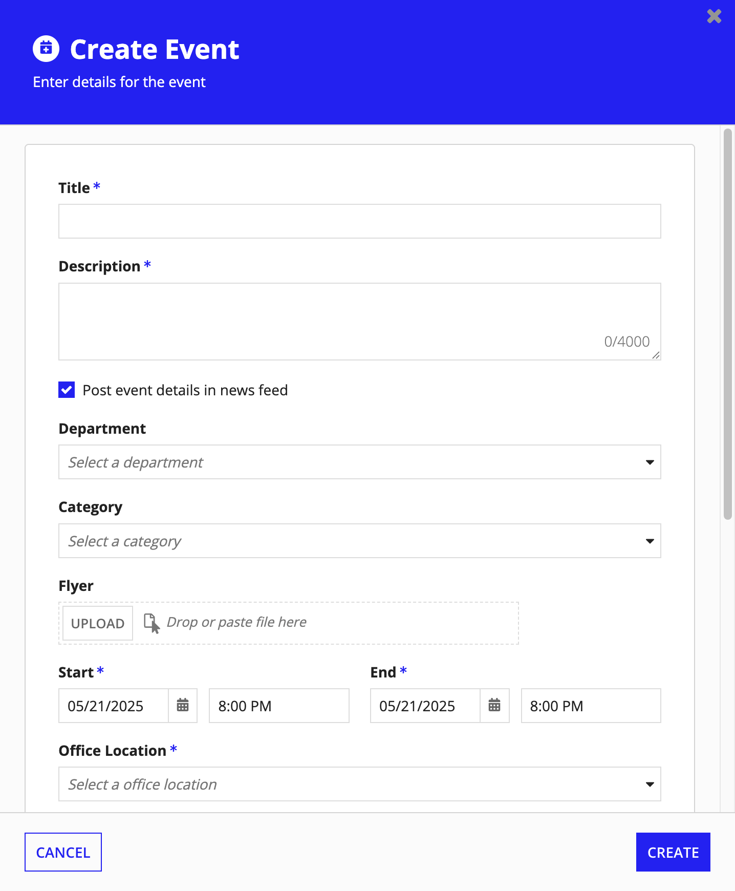

### Multi-step form: Single page

If your form requires multiple steps, you can decide between using a wizard or a multi-step single page form. For less complex forms with smaller sets of inputs that can be grouped into sections, a multi-step single page form might be more effective than a wizard.

In this pattern, displaying section names and instructions in a column alongside its respective inputs reduces vertical scrolling and horizontal whitespace.

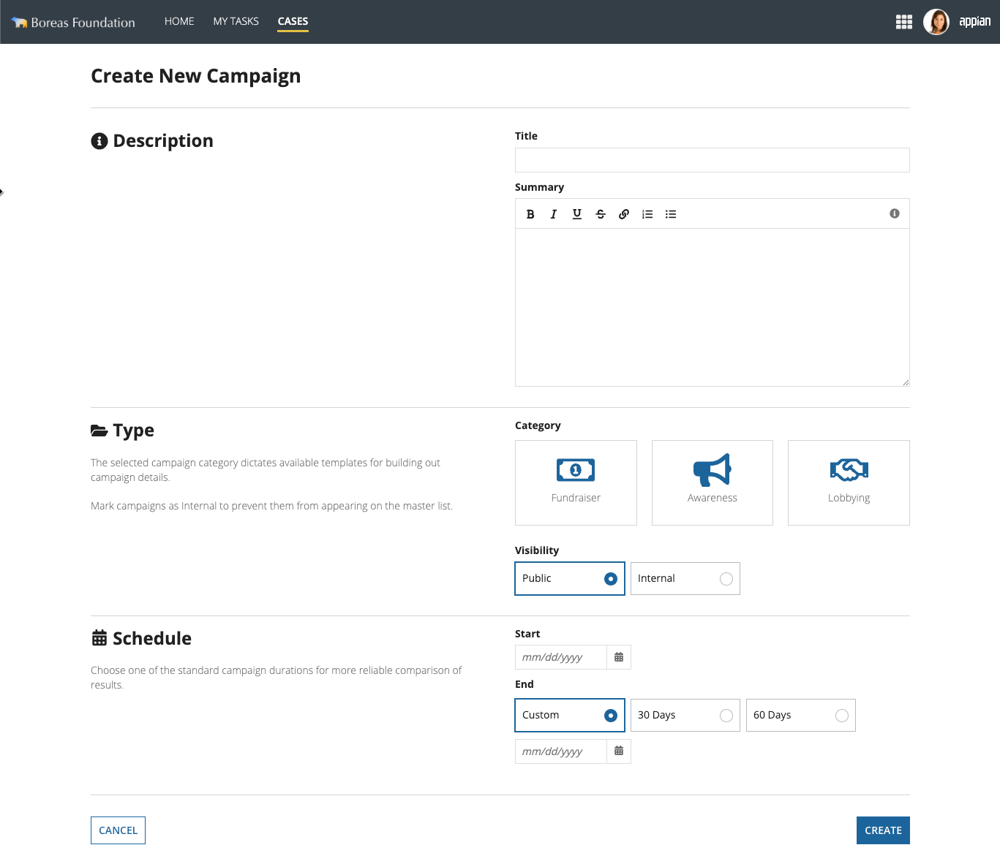

```sail
a!formLayout(
  titleBar: a!headerTemplateSimple(
    title: "Create New Campaign",
  ),
  contents: {
    a!sectionLayout(
      label: "",
      contents: {
        a!columnsLayout(
          columns: {
            a!columnLayout(
              contents: {
                a!richTextDisplayField(
                  labelPosition: "COLLAPSED",
                  value: {
                    a!richTextItem(
                      text: {
                        a!richTextIcon(icon: "info-circle"),
                        " Description"
                      },
                      size: "MEDIUM_PLUS",
                      style: { "STRONG" }
                    ),
                    char(10)
                  }
                )
              },
              width: "AUTO"
            ),
            a!columnLayout(
              contents: {
                a!textField(
                  label: "Title",
                  labelPosition: "ABOVE",
                  saveInto: {},
                  refreshAfter: "UNFOCUS",
                  validations: {}
                ),
                a!styledTextEditorField(
                  label: "Summary",
                  labelPosition: "ABOVE",
                  saveInto: {},
                  sizeLimit: 4000,
                  height: "MEDIUM",
                  validations: {}
                )
              }
            )
          },
          spacing: "SPARSE"
        )
      }
    ),
    a!sectionLayout(
      label: "",
      contents: {
        a!columnsLayout(
          columns: {
            a!columnLayout(
              contents: {
                a!richTextDisplayField(
                  labelPosition: "COLLAPSED",
                  value: {
                    a!richTextItem(
                      text: {
                        a!richTextIcon(icon: "folder-open"),
                        " Type"
                      },
                      size: "MEDIUM_PLUS",
                      style: { "STRONG" }
                    ),
                    char(10),
                    char(10),
                    a!richTextItem(
                      text: {
                        "The selected campaign category dictates available templates for building out campaign details."
                      },
                      color: "SECONDARY",
                      size: "STANDARD"
                    ),
                    char(10),
                    char(10),
                    a!richTextItem(
                      text: {
                        "Mark campaigns as Internal to prevent them from appearing on the master list."
                      },
                      color: "SECONDARY",
                      size: "STANDARD"
                    )
                  }
                )
              },
              width: "AUTO"
            ),
            a!columnLayout(
              contents: {
                a!richTextDisplayField(
                  labelPosition: "COLLAPSED",
                  value: {
                    a!richTextItem(
                      text: { "Category" }, 
                      style: { "STRONG" }
                    )
                  }
                ),
                a!columnsLayout(
                  columns: {
                    a!columnLayout(
                      contents: {
                        a!cardLayout(
                          contents: {
                            a!richTextDisplayField(
                              labelPosition: "COLLAPSED",
                              value: {
                                a!richTextIcon(
                                  icon: "money",
                                  color: "ACCENT",
                                  size: "LARGE_PLUS"
                                ),
                                char(10),
                                a!richTextItem(
                                  text: { "Fundraiser" },
                                  color: "SECONDARY",
                                  size: "STANDARD"
                                ),
                                char(10),
                                char(10)
                              },
                              align: "CENTER"
                            )
                          },
                          link: a!dynamicLink(
                            label: "Dynamic Link", 
                            saveInto: {}
                          ),
                          height: "AUTO",
                          style: "NONE",
                          padding: "LESS",
                          marginBelow: "STANDARD"
                        )
                      }
                    ),
                    a!columnLayout(
                      contents: {
                        a!cardLayout(
                          contents: {
                            a!richTextDisplayField(
                              labelPosition: "COLLAPSED",
                              value: {
                                a!richTextIcon(
                                  icon: "bullhorn",
                                  color: "ACCENT",
                                  size: "LARGE_PLUS"
                                ),
                                char(10),
                                a!richTextItem(
                                  text: { "Awareness" },
                                  color: "SECONDARY",
                                  size: "STANDARD"
                                ),
                                char(10),
                                char(10)
                              },
                              align: "CENTER"
                            )
                          },
                          link: a!dynamicLink(
                            label: "Dynamic Link", 
                            saveInto: {}
                          ),
                          height: "AUTO",
                          style: "NONE",
                          padding: "LESS",
                          marginBelow: "STANDARD"
                        )
                      }
                    ),
                    a!columnLayout(
                      contents: {
                        a!cardLayout(
                          contents: {
                            a!richTextDisplayField(
                              labelPosition: "COLLAPSED",
                              value: {
                                a!richTextIcon(
                                  icon: "handshake-o",
                                  color: "ACCENT",
                                  size: "LARGE_PLUS"
                                ),
                                char(10),
                                a!richTextItem(
                                  text: { "Lobbying" },
                                  color: "SECONDARY",
                                  size: "STANDARD"
                                ),
                                char(10),
                                char(10)
                              },
                              align: "CENTER"
                            )
                          },
                          link: a!dynamicLink(label: "Dynamic Link", saveInto: {}),
                          height: "AUTO",
                          style: "NONE",
                          padding: "LESS",
                          marginBelow: "STANDARD"
                        )
                      }
                    )
                  }
                ),
                a!radioButtonField(
                  choiceLabels: { "Public", "Internal" },
                  choiceValues: { 1, 2 },
                  label: "Visibility",
                  labelPosition: "ABOVE",
                  value: 1,
                  saveInto: {},
                  choiceLayout: "COMPACT",
                  choiceStyle: "CARDS",
                  validations: {}
                )
              }
            )
          },
          spacing: "SPARSE"
        )
      },
      divider: "ABOVE"
    ),
    a!sectionLayout(
      label: "",
      contents: {
        a!columnsLayout(
          columns: {
            a!columnLayout(
              contents: {
                a!richTextDisplayField(
                  labelPosition: "COLLAPSED",
                  value: {
                    a!richTextItem(
                      text: {
                        a!richTextIcon(icon: "calendar"),
                        " Schedule"
                      },
                      size: "MEDIUM_PLUS",
                      style: { "STRONG" }
                    ),
                    char(10),
                    char(10),
                    a!richTextItem(
                      text: {
                        "Choose one of the standard campaign durations for more reliable comparison of results."
                      },
                      color: "SECONDARY",
                      size: "STANDARD"
                    ),
                    char(10)
                  }
                )
              },
              width: "AUTO"
            ),
            a!columnLayout(
              contents: {
                a!dateField(
                  label: "Start",
                  labelPosition: "ABOVE",
                  saveInto: {},
                  validations: {}
                ),
                a!richTextDisplayField(
                  labelPosition: "COLLAPSED",
                  value: {
                    a!richTextItem(text: { "End" }, style: { "STRONG" })
                  }
                ),
                a!radioButtonField(
                  choiceLabels: { "Custom", "30 Days", "60 Days" },
                  choiceValues: { 1, 2, 3 },
                  label: "Schedule Type",
                  labelPosition: "COLLAPSED",
                  value: 1,
                  saveInto: {},
                  choiceLayout: "COMPACT",
                  choiceStyle: "CARDS",
                  validations: {}
                ),
                a!dateField(
                  label: "End",
                  labelPosition: "COLLAPSED",
                  saveInto: {},
                  validations: {}
                )
              }
            )
          },
          spacing: "SPARSE"
        )
      },
      divider: "ABOVE"
    )
  },
  showButtonDivider: true(),
  contentsWidth: "WIDE",
  buttons: a!buttonLayout(
    primaryButtons: {
      a!buttonWidget(label: "Create", style: "SOLID")
    },
    secondaryButtons: {
      a!buttonWidget(label: "Cancel", style: "OUTLINE")
    }
  ),
  isButtonFooterFixed: false(),
  showTitleBarDivider: true
)
```

### Multi-step form: Tab layout

When your form has multiple sections that are independent and can be completed in any order, use a tab layout inside a form layout. This is different from a wizard, where steps are sequential and guide users through a specific flow.

Tab layouts work well for:

- Forms where sections don't depend on each other and can be filled out in any order.

- Organizing related information into logical groups without implying a required sequence.

- Allowing users to quickly switch between sections to review or update information.

In this pattern, a tax and compliance form uses tabs to organize information by jurisdiction. Users can complete the tabs in any order based on which jurisdictions apply to their business.


```sail
a!localVariables(
  a!formLayout(
    titleBar: a!headerTemplateFull(
      title: "Tax & Compliance Multi-Jurisdiction Form",
      secondaryText: "Manage tax IDs and withholding settings for all active jurisdictions",
      titleColor: "STANDARD",
      backgroundColor: "ACCENT",
      stampIcon: ""
    ),
    isTitleBarFixed: true,
    showTitleBarDivider: false,
    contents: {
      a!headingField(
        text: "Business Identification",
        size: "MEDIUM",
        color: "#1E2530",
        fontWeight: "SEMI_BOLD"
      ),
      a!columnsLayout(
        columns: {
          a!columnLayout(
            contents: {
              a!textField(
                label: "Legal Business Name",
                required: true,
                requiredMessage: "Enter the business name",
                marginAbove: "NONE",
                marginBelow: "STANDARD"
              )
            }
          ),
          a!columnLayout(
            contents: {
              a!textField(
                label: "Federal EIN",
                placeholder: "XX-XXXXXXX",
                required: true,
                requiredMessage: "Enter a Federal EIN",
                validations: {},
                marginAbove: "NONE",
                marginBelow: "STANDARD"
              )
            }
          )
        }
      ),
      a!radioButtonField(
        label: "Business Type",
        choiceLabels: {
          "C-Corp",   
          "S-Corp",
          "LLC",
          "Partnership",
          "Sole Proprietorship",
          "Non-Profit"
        },
        choiceValues: {1, 2, 3, 4, 5, 6},
        required: true,
        marginAbove: "LESS",
        spacing: "MORE",
        choiceLayout: "COMPACT"
      ),
      a!textField(
        label: "Registered Address Line 1",
        placeholder: "123 Main Street",
        required: true,
        requiredMessage: "Enter an address",
        marginAbove: "LESS"
      ),
      a!textField(
        label: "Registered Address Line 2",
        placeholder: "Suite 123",
        instructions: "No P.O. Boxes",
        marginAbove: "LESS"
      ),
      a!sideBySideLayout(
        items: {
          a!sideBySideItem(
            item: {
              a!textField(
                label: "City",
                required: true,
                requiredMessage: "Enter a city",
              )
            },
            width: "3X"
          ),
          a!sideBySideItem(
            item: {
              a!dropdownField(
                label: "State",
                placeholder: "Select state",
                choiceLabels: {"Option 1", "Option 2", "Option 3"},
                choiceValues: {1, 2, 3},
                required: true,
                requiredMessage: "Select a state"
              )
            },
            width: "3X"
          ),
          a!sideBySideItem(
            item: {
              a!textField(
                label: "Zipcode",
                required: true,
                requiredMessage: "Enter a zipcode",
              )
            },
            width: "2X"
          )
        },
        marginAbove: "LESS"
      ),
      a!paragraphField(
        label: "Description of Business",
        required: true,
        requiredMessage: "Enter a description",
        marginAbove: "LESS",
        height: "SHORT"
      ),
      a!horizontalLine(
        marginAbove: "MORE"
      ),
      a!headingField(
        text: "Tax Profiles",
        marginAbove: "STANDARD",
        marginBelow: "EVEN_LESS",
        size: "MEDIUM",
        color: "#1E2530",
        fontWeight: "SEMI_BOLD"
      ),
      a!tabLayout(
        tabs: {
          a!tabItem(
            label: "California",
            contents: {
              a!textField(
                label: "CA Secretary of State (SOS) Number",
                required: true,
                requiredMessage: "Enter a CA SOS number"
              ),
              a!textField(
                label: "CDTFA Account Number",
                required: true,
                requiredMessage: "Enter a CDTFA account number",
                marginAbove: "LESS"
              ),
              a!booleanCheckboxField(
                choiceLabel: "Entity is actively engaging in any transaction for the purpose of financial or pecuniary gain or profit within California",
                marginAbove: "LESS",
                marginBelow: "STANDARD"
              ),
              a!booleanCheckboxField(
                choiceLabel: "Entity elects to file on a water’s edge basis pursuant to R&TC Sections 25110 and 25113. (Required: Attach Form FTB 100-WE)",
                marginAbove: "LESS",
                marginBelow: "STANDARD"
              )
            }
          ),
          a!tabItem(
            label: "Maryland",
            contents: {
              a!textField(
                label: "SDAT Department ID",
                required: true,
                requiredMessage: "Enter an SDAT department ID"
              ),
              a!radioButtonField(
                label: "Does the business own, lease, or use personal property located in Maryland?",
                choiceLabels: {"Yes", "No"},
                choiceValues: {1,2},
                required: true,
                marginAbove: "LESS",
                spacing: "MORE",
                choiceLayout: "COMPACT"
              ),
              a!dropdownField(
                label: "County/City Jurisdiction",
                placeholder: "Select jurisdiction",
                required: true,
                requiredMessage: "Enter a jurisdiction",
                marginAbove: "LESS"
              ),
              a!textField(
                label: "Trader's License Number",
                marginAbove: "LESS"
              )
            }
          ),
          a!tabItem(
            label: "New York",
          ),
          a!tabItem(
            label: "Virginia"
          ),
          a!tabItem(
            label: "Washington D.C."
          )
        }
      )
    },
    buttons: a!buttonLayout(
      primaryButtons: {
        a!buttonWidget(
          label: "Submit",
          submit: true,
          loadingIndicator: true,
          style: "SOLID"
        )
      },
      secondaryButtons: {
        a!buttonWidget(
          label: "Cancel",
          value: true,
          validate: false,
          submit: true,
          style: "OUTLINE"
        )
      }
    ),
    contentsWidth: "MEDIUM"
  )
)
```

### Multi-step form: Wizard

Wizards are useful when a form is complex or has conditional field logic. Wizard step indicators are helpful for:

- Breaking form fields into categories, making it easier to understand and complete each section.

- Structuring form fields and steps in a logical flow to reduce the chance of missing or incorrectly filling out important information.

- Improving navigation with visual cues that show users their progress and remaining steps.

Depending on the complexity of your form, you can decide between single level sidebar step indicators or multi-level sidebars that further break steps down into sub-steps.

**Tip:  **In wizards, Appian automatically handles the page scrolling between each step of the wizard. This means that whenever a user navigates to the next step, the page will automatically scroll to the top of the page.

If you are using the form layout in a wizard, make sure that the buttons or dynamic links that control form navigation are placed in the *buttons* parameter. If they are placed in the *contents* parameter, auto scrolling will not work.

#### Using the wizard layout

Use the Wizard Layout to easily create great-looking wizards. If you want to build more complex milestones, you can follow the other patterns in Creating a custom wizard.

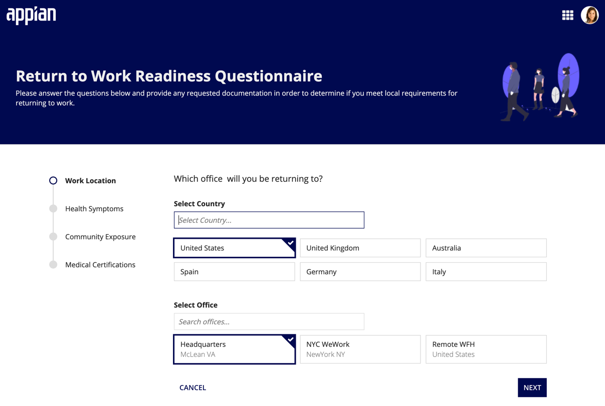

```sail
a!localVariables(
local!country: 1,
local!office: 1,
a!wizardLayout(
  titleBar: a!headerTemplateImage(
    title: "Return to Work Readiness Questionnaire",
    secondaryText: "Please answer the questions below and provide any requested documentation in order to determine if you meet local requirements for returning to work.",
    backgroundColor: "#020A51",
    image: a!documentImage(
      document: a!EXAMPLE_DOCUMENT_IMAGE()
    ),
    imageSize: "MEDIUM"
  ),
  style: "DOT_VERTICAL",
  steps: {
    a!wizardStep(
      label: "Work Location",
      contents: {
        a!richTextDisplayField(
          label: "Rich Text",
          labelPosition: "COLLAPSED",
          value: {
            a!richTextItem(
              text: {
                "Which office  will you be returning to?"
              },
              size: "MEDIUM",
              style: "PLAIN"
            )
          },
          marginAbove: "STANDARD",
          marginBelow: "MORE"
        ),
        a!columnsLayout(
          columns: {
            a!columnLayout(
              contents: {
                a!textField(
                  label: "Select Country",
                  labelPosition: "ABOVE",
                  placeholder: "Select Country...",
                  saveInto: {},
                  refreshAfter: "UNFOCUS",
                  validations: {},
                  marginBelow: "STANDARD"
                )
              },
              width: "MEDIUM"
            ),
            a!columnLayout(
              contents: {}
            )
          }
        ),
        a!cardChoiceField(
          label: "",
          labelPosition: "COLLAPSED",
          data: {
            a!map(id:1 , primaryText: "United States"),
            a!map(id:2 , primaryText: "United Kingdom"),
            a!map(id:3 , primaryText: "Australia"),
            a!map(id:4 , primaryText: "Spain"),
            a!map(id:5 , primaryText: "Germany"),
            a!map(id:6 , primaryText: "Italy")
          },
          cardTemplate: a!cardTemplateBarTextStacked(
            id: fv!data.id,
            primaryText: fv!data.primaryText
          ),
          value: local!country,
          saveInto: local!country,
          maxSelections: 1,
          validations: {}
        ),
        a!columnsLayout(
          columns: {
            a!columnLayout(
              contents: {
                a!textField(
                  label: "Select Office",
                  labelPosition: "ABOVE",
                  placeholder: "Search offices...",
                  saveInto: {},
                  refreshAfter: "UNFOCUS",
                  validations: {}
                )
              },
              width: "MEDIUM"
            ),
            a!columnLayout(
              contents: {}
            )
          },
          marginAbove: "MORE"
        ),
        a!cardChoiceField(
          label: "",
          labelPosition: "COLLAPSED",
          data: {
            a!map(id:1 , primaryText: "Headquarters", secondaryText: "McLean VA"),
            a!map(id:2 , primaryText: "NYC WeWork", secondaryText: "NewYork NY"),
            a!map(id:3 , primaryText: "Remote WFH", secondaryText: "United States")
          },
          cardTemplate: a!cardTemplateBarTextStacked(
            id: fv!data.id,
            primaryText: fv!data.primaryText,
            secondaryText: fv!data.secondaryText,
          ),
          value: local!office,
          saveInto: local!office,
          maxSelections: 1,
          validations: {}
        )
      }
    ),
    a!wizardStep(
      label: "Health Symptoms",
      contents: {}
    ),
    a!wizardStep(
      label: "Community Exposure",
      contents: {}
    ),
    a!wizardStep(
      label: "Medical Certifications",
      contents: {}
    )
  },
  contentsWidth: "MEDIUM",
  showStepHeadings: false(),
  primaryButtons: {
    a!buttonWidget(
      label: "Submit",
      submit: true,
      style: "SOLID",
      loadingIndicator: true,
      showWhen: fv!isLastStep
    )
  },
  secondaryButtons: {
    a!buttonWidget(
      label: "Cancel",
      value: true,
      saveInto: {},
      submit: true,
      style: "LINK",
      validate: false
    )
  }
)
)
```

#### Creating a custom wizard

##### Sidebar step indicator

Use this pattern to indicate step progress in a wizard. The vertical arrangement of wizard steps works well for longer lists of steps and helps balance whitespace in simpler forms.

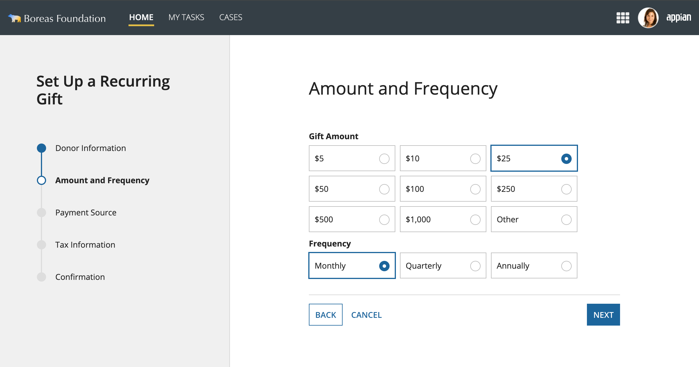

Functional pattern SAIL

Use this pattern for a quick, functional sidebar with wizard steps. In your interface, switch to expression mode to update the data with contents that are unique to your app.

```sail
a!localVariables(
  local!formSteps: {
    "Donor Information",
    "Amount and Frequency",
    "Payment Source",
    "Tax Information",
    "Confirmation"
  },
  local!currentFormStep: 2,
  a!headerContentLayout(
    contents: {
      a!paneLayout(
        panes: {
          a!pane(
            contents: {
              a!headingField(
                text: "Set Up a Recurring Gift",
                size: "MEDIUM_PLUS",
                headingTag: "H2",
                fontWeight: "SEMI_BOLD",
                marginBelow: "EVEN_MORE"
              ),
              a!milestoneField(
                steps: local!formSteps,
                active: local!currentFormStep,
                stepStyle: "DOT",
                orientation: "VERTICAL"
              )
            },
            width: "MEDIUM",
            backgroundColor: "#f0f0f0",
            padding: "EVEN_MORE"
          ),
          a!pane(
            contents: {
              a!columnsLayout(
                columns: {
                  a!columnLayout(contents: {}),
                  a!columnLayout(
                    contents: {
                      a!headingField(
                        text: local!formSteps[local!currentFormStep],
                        size: "LARGE",
                        marginAbove: "EVEN_MORE",
                        marginBelow: "EVEN_MORE",
                        headingTag: "H3"
                      ),
                      a!match(
                        value: local!currentFormStep,
                        equals: 1,
                        then: a!sectionLayout(),
                        equals: 2,
                        then: a!sectionLayout(
                          contents: {
                            a!radioButtonField(
                              label: "Gift Amount",
                              labelPosition: "ABOVE",
                              choiceLabels: {
                                "$5",
                                "$10",
                                "$25",
                                "$50",
                                "$100",
                                "$250",
                                "$500",
                                "$1,000",
                                "Other"
                              },
                              choiceValues: { 1, 2, 3, 4, 5, 6, 7, 8, 9 },
                              value: 3,
                              saveInto: {},
                              choiceLayout: "COMPACT",
                              choiceStyle: "CARDS",
                              validations: {}
                            ),
                            a!radioButtonField(
                              label: "Frequency",
                              labelPosition: "ABOVE",
                              choiceLabels: { "Monthly", "Quarterly", "Annually" },
                              choiceValues: { 1, 2, 3 },
                              value: 1,
                              saveInto: {},
                              choiceLayout: "COMPACT",
                              choiceStyle: "CARDS",
                              validations: {}
                            ),
                            
                          }
                        ),
                        equals: 3,
                        then: a!sectionLayout(),
                        equals: 4,
                        then: a!sectionLayout(),
                        equals: 5,
                        then: a!sectionLayout(),
                        default: {}
                      ),
                      a!sectionLayout(
                        label: "",
                        contents: {
                          a!columnsLayout(
                            columns: {
                              a!columnLayout(
                                contents: {
                                  a!buttonArrayLayout(
                                    buttons: {
                                      a!buttonWidget(
                                        label: "Back",
                                        style: "OUTLINE",
                                        showWhen: local!currentFormStep > 1,
                                        value: local!currentFormStep - 1,
                                        saveInto: local!currentFormStep
                                      ),
                                      a!buttonWidget(label: "Cancel", style: "LINK")
                                    },
                                    align: "START",
                                    marginBelow: "NONE"
                                  )
                                }
                              ),
                              a!columnLayout(
                                contents: {
                                  a!buttonArrayLayout(
                                    buttons: {
                                      a!buttonWidget(
                                        label: "Next",
                                        style: "SOLID",
                                        showWhen: local!currentFormStep < length(local!formSteps),
                                        value: local!currentFormStep + 1,
                                        saveInto: local!currentFormStep
                                      )
                                    },
                                    align: "END",
                                    marginBelow: "NONE"
                                  )
                                }
                              )
                            }
                          )
                        },
                        divider: "ABOVE"
                      )
                    },
                    width: "MEDIUM_PLUS"
                  ),
                  a!columnLayout(contents: {})
                }
              )
            }
          )
        }
      )
    }
  )
)
```

Base pattern SAIL

Use this pattern as a starting point for designing your own sidebar with wizard steps. You can use design mode to drag and drop components as you see fit. Once you're ready to plug in your own data, consult the Functional pattern.

```sail
a!headerContentLayout(
  contents: {
    a!paneLayout(
      panes: {
        a!pane(
          contents: {
            a!headingField(
              text: "Set Up a Recurring Gift",
              size: "MEDIUM_PLUS",
              headingTag: "H2",
              fontWeight: "BOLD",
              marginBelow: "EVEN_MORE"
            ),
            a!milestoneField(
              steps: {
                "Donor Information",
                "Amount and Frequency",
                "Payment Source",
                "Tax Information",
                "Confirmation"
              },
              active: 1,
              stepStyle: "DOT",
              orientation: "VERTICAL"
            )
          },
          width: "MEDIUM",
          backgroundColor: "#f0f0f0",
          padding: "EVEN_MORE"
        ),
        a!pane(
          contents: {
            a!columnsLayout(
              columns: {
                a!columnLayout(contents: {}),
                a!columnLayout(
                  contents: {
                    a!headingField(
                      text: "Amount and Frequency",
                      size: "LARGE",
                      marginAbove: "EVEN_MORE",
                      marginBelow: "EVEN_MORE",
                      headingTag: "H3"
                    ),
                    a!radioButtonField(
                      label: "Gift Amount",
                      labelPosition: "ABOVE",
                      choiceLabels: {
                        "$5",
                        "$10",
                        "$25",
                        "$50",
                        "$100",
                        "$250",
                        "$500",
                        "$1,000",
                        "Other"
                      },
                      choiceValues: { 1, 2, 3, 4, 5, 6, 7, 8, 9 },
                      value: 3,
                      saveInto: {},
                      choiceLayout: "COMPACT",
                      choiceStyle: "CARDS",
                      validations: {}
                    ),
                    a!radioButtonField(
                      label: "Frequency",
                      labelPosition: "ABOVE",
                      choiceLabels: { "Monthly", "Quarterly", "Annually" },
                      choiceValues: { 1, 2, 3 },
                      value: 1,
                      saveInto: {},
                      choiceLayout: "COMPACT",
                      choiceStyle: "CARDS",
                      validations: {}
                    ),
                    a!sectionLayout(
                      label: "",
                      contents: {
                        a!columnsLayout(
                          columns: {
                            a!columnLayout(
                              contents: {
                                a!buttonArrayLayout(
                                  buttons: {
                                    a!buttonWidget(label: "Back", style: "OUTLINE"),
                                    a!buttonWidget(label: "Cancel", style: "LINK")
                                  },
                                  align: "START",
                                  marginBelow: "NONE"
                                )
                              }
                            ),
                            a!columnLayout(
                              contents: {
                                a!buttonArrayLayout(
                                  buttons: {
                                    a!buttonWidget(label: "Next", style: "SOLID")
                                  },
                                  align: "END",
                                  marginBelow: "NONE"
                                )
                              }
                            )
                          }
                        )
                      },
                      divider: "ABOVE"
                    )
                  },
                  width: "MEDIUM_PLUS"
                ),
                a!columnLayout(contents: {})
              }
            )
          }
        )
      }
    )
  }
)
```

##### Sidebar step indicator (simple)

If you want a less prominent sidebar, like in the example below where the page already has a bold header, use this pattern for a simpler display of wizard steps.

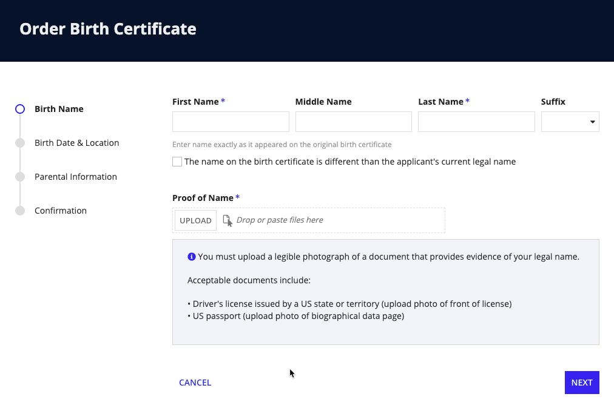

```sail
a!wizardLayout(
  titleBar: a!headerTemplateFull(
    title: "Order Birth Certificate",
    backgroundColor: "#03122a"
  ),
  steps: {
    a!wizardStep(
      label: "Birth Name",
      contents: {
        a!sideBySideLayout(
          items: {
            a!sideBySideItem(
              item: a!textField(
                label: "First Name",
                labelPosition: "ABOVE",
                saveInto: {},
                refreshAfter: "UNFOCUS",
                required: true,
                validations: {}
              ),
              width: "2X"
            ),
            a!sideBySideItem(
              item: a!textField(
                label: "Middle Name",
                labelPosition: "ABOVE",
                saveInto: {},
                refreshAfter: "UNFOCUS",
                validations: {}
              ),
              width: "2X"
            ),
            a!sideBySideItem(
              item: a!textField(
                label: "Last Name",
                labelPosition: "ABOVE",
                saveInto: {},
                refreshAfter: "UNFOCUS",
                required: true,
                validations: {}
              ),
              width: "2X"
            ),
            a!sideBySideItem(
              item: a!dropdownField(
                choiceLabels: {
                  "Option 1",
                  "Option 2",
                  "Option 3",
                  "Option 4",
                  "Option 5",
                  "Option 6",
                  "Option 7",
                  "Option 8",
                  "Option 9",
                  "Option 10",
                  "Option 11",
                  "Option 12"
                },
                choiceValues: {
                  1,
                  2,
                  3,
                  4,
                  5,
                  6,
                  7,
                  8,
                  9,
                  10,
                  11,
                  12
                },
                label: "Suffix",
                labelPosition: "ABOVE",
                placeholder: " ",
                saveInto: {},
                searchDisplay: "AUTO",
                validations: {}
              ),
              width: "AUTO"
            )
          }
        ),
        a!richTextDisplayField(
          labelPosition: "COLLAPSED",
          value: {
            a!richTextItem(
              text: {
                "Enter name exactly as it appeared on the original birth certificate"
              },
              color: "#999999",
              size: "SMALL"
            )
          }
        ),
        a!checkboxField(
          choiceLabels: {"The name on the birth certificate is different than the applicant's current legal name"},
          choiceValues: {1},
          label: "",
          labelPosition: "COLLAPSED",
          saveInto: {},
          validations: {},
          marginBelow: "EVEN_MORE"
        ),
        a!fileUploadField(
          label: "Proof of Name",
          labelPosition: "ABOVE",
          saveInto: {},
          required: true,
          validations: {}
        ),
        a!cardLayout(
          contents: {
            a!richTextDisplayField(
              labelPosition: "COLLAPSED",
              value: {
                a!richTextIcon(
                  icon: "info-circle",
                  color: "ACCENT"
                ),
                " You must upload a legible photograph of a document that provides evidence of your legal name.",
                char(10),
                char(10),
                "Acceptable documents include:",
                char(10),
                char(10),
                "• Driver's license issued by a US state or territory (upload photo of front of license)",
                char(10),
                "• US passport (upload photo of biographical data page)",
                char(10),
                char(10)
              }
            )
          },
          height: "AUTO",
          style: "#f3f5f9",
          padding: "STANDARD",
          marginBelow: "STANDARD"
        )
      }
    ),
    a!wizardStep(
      label: "Birth Date & Location",
      contents: {}
    ),
    a!wizardStep(
      label: "Parental Information",
      contents: {}
    ),
    a!wizardStep(
      label: "Confirmation",
      contents: {}
    )
  },
  showStepHeadings: false,
  primaryButtons: {
    a!buttonWidget(
      label: "Submit",
      submit: true,
      style: "SOLID",
      loadingIndicator: true,
      showWhen: fv!isLastStep
    )
  },
  secondaryButtons: {
    a!buttonWidget(
      label: "Cancel",
      value: true,
      saveInto: {},
      submit: true,
      style: "LINK",
      validate: false
    )
  },
  showButtonDivider: false
)
```

##### Sidebar step indicator with icons

You can also use icons to help visually differentiate steps, as long as each step has a clear and obvious icon to represent it. Icons are useful for adding visual appeal to simple forms.

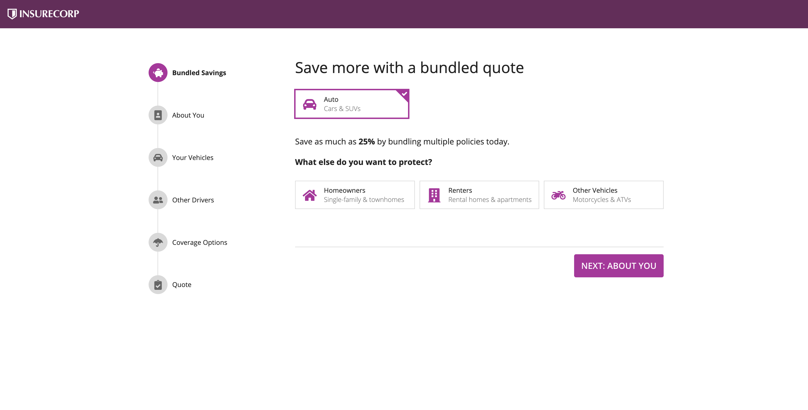

```sail
a!localVariables(
  local!zipCode: null(),
  local!stepNumber: 1,
  local!bundleSelections: {},
  local!showSaveForLater: false,
  choose(
    local!stepNumber,
    a!headerContentLayout(
      header: {
        a!cardLayout(
          contents: {
            a!columnsLayout(
              columns: {
                a!columnLayout(contents: {}),
                a!columnLayout(
                  contents: {
                    a!cardLayout(
                      contents: {
                        a!richTextDisplayField(
                          labelPosition: "COLLAPSED",
                          value: {
                            a!richTextItem(
                              text: {
                                "Great rates, great service, and great protection."
                              },
                              color: "#434343",
                              size: "LARGE",
                              style: { "STRONG" }
                            ),
                            " "
                          },
                          marginAbove: "NONE",
                          marginBelow: "MORE"
                        ),
                        a!cardLayout(
                          contents: {
                            a!richTextDisplayField(
                              labelPosition: "COLLAPSED",
                              value: {
                                a!richTextItem(
                                  text: { "Get your no-obligation quote now" },
                                  color: "#434343",
                                  size: "MEDIUM",
                                  style: { "STRONG" }
                                )
                              },
                              align: "CENTER",
                              marginBelow: "STANDARD"
                            ),
                            a!columnsLayout(
                              columns: {
                                a!columnLayout(contents: {}),
                                a!columnLayout(
                                  contents: {
                                    a!sideBySideLayout(
                                      items: {
                                        a!sideBySideItem(
                                          item: a!textField(
                                            label: "Your ZIP Code",
                                            labelPosition: "COLLAPSED",
                                            placeholder: "Enter your 5-digit ZIP code",
                                            saveInto: local!zipCode,
                                            refreshAfter: "UNFOCUS",
                                            validations: {}
                                          )
                                        ),
                                        a!sideBySideItem(
                                          item: a!buttonArrayLayout(
                                            buttons: {
                                              a!buttonWidget(
                                                label: "Get Started",
                                                value: 2,
                                                saveInto: local!stepNumber,
                                                size: "STANDARD",
                                                style: "OUTLINE"
                                              )
                                            },
                                            align: "START",
                                            marginBelow: "NONE"
                                          ),
                                          width: "MINIMIZE"
                                        )
                                      },
                                      alignVertical: "MIDDLE"
                                    )
                                  },
                                  width: "MEDIUM"
                                ),
                                a!columnLayout(contents: {})
                              },
                              alignVertical: "MIDDLE"
                            )
                          },
                          height: "AUTO",
                          style: "NONE",
                          padding: "MORE",
                          marginBelow: "STANDARD",
                          showBorder: false,
                          decorativeBarPosition: "TOP",
                          decorativeBarColor: "#BF04A0"
                        ),
                        a!richTextDisplayField(
                          labelPosition: "COLLAPSED",
                          value: {
                            a!richTextItem(
                              text: {
                                "We may use information from public sources or third parties, such as driving records, claim history, vehicle driving data, and credit reports to provide you with the best quote. "
                              },
                              color: "#666666",
                              size: "SMALL"
                            ),
                            char(10),
                            char(10),
                            a!richTextItem(
                              text: {
                                "Some discounts, coverages, payment plans, and features are not available in all states."
                              },
                              color: "#666666",
                              size: "SMALL"
                            )
                          }
                        )
                      },
                      height: "AUTO",
                      style: "#efefef",
                      padding: "EVEN_MORE",
                      marginBelow: "NONE",
                      showBorder: false
                    )
                  },
                  width: "WIDE"
                ),
                a!columnLayout(contents: {}),
                a!columnLayout(
                  contents: {
                    a!imageField(
                      label: "",
                      labelPosition: "COLLAPSED",
                      images: {
                        a!webImage(
                          source: "https://images.pexels.com/photos/3785391/pexels-photo-3785391.jpeg?auto=compress&cs=tinysrgb&dpr=2&h=750&w=1260"
                        )
                      },
                      size: "FIT",
                      isThumbnail: false,
                      style: "STANDARD"
                    )
                  },
                  width: "WIDE"
                )
              },
              alignVertical: "MIDDLE",
              marginBelow: "NONE",
              stackWhen: {
                "PHONE",
                "TABLET_PORTRAIT",
                "TABLET_LANDSCAPE"
              }
            )
          },
          height: "AUTO",
          style: "#efefef",
          padding: "NONE",
          marginBelow: "NONE",
          showBorder: false
        ),
        a!cardLayout(
          contents: {
            a!columnsLayout(
              columns: {
                a!columnLayout(
                  contents: {
                    a!imageField(
                      label: "",
                      labelPosition: "COLLAPSED",
                      images: {
                        a!webImage(
                          source: "https://images.pexels.com/photos/9518015/pexels-photo-9518015.jpeg?auto=compress&cs=tinysrgb&dpr=2&w=500"
                        )
                      },
                      size: "FIT",
                      isThumbnail: false,
                      style: "STANDARD"
                    )
                  },
                  width: "WIDE"
                ),
                a!columnLayout(contents: {}),
                a!columnLayout(
                  contents: {
                    a!cardLayout(
                      contents: {
                        a!richTextDisplayField(
                          labelPosition: "COLLAPSED",
                          value: {
                            a!richTextItem(
                              text: {
                                "Get just the right amount of coverage for your needs"
                              },
                              color: "STANDARD",
                              size: "MEDIUM_PLUS",
                              style: { "STRONG" }
                            )
                          },
                          marginAbove: "NONE",
                          marginBelow: "MORE"
                        ),
                        a!richTextDisplayField(
                          labelPosition: "COLLAPSED",
                          value: {
                            a!richTextItem(
                              text: { a!richTextIcon(icon: "check-circle") },
                              color: "STANDARD",
                              size: "MEDIUM_PLUS",
                              style: { "STRONG" }
                            ),
                            a!richTextItem(
                              text: {
                                a!richTextItem(text: { " " }, style: { "STRONG" }),
                                "Liability Coverage"
                              },
                              size: "MEDIUM_PLUS"
                            )
                          }
                        ),
                        a!richTextDisplayField(
                          labelPosition: "COLLAPSED",
                          value: {
                            a!richTextItem(
                              text: { a!richTextIcon(icon: "check-circle") },
                              color: "STANDARD",
                              size: "MEDIUM_PLUS",
                              style: { "STRONG" }
                            ),
                            a!richTextItem(
                              text: {
                                a!richTextItem(text: { " " }, style: { "STRONG" }),
                                "Uninsured and Underinsured Motorist Coverage"
                              },
                              size: "MEDIUM_PLUS"
                            )
                          }
                        ),
                        a!richTextDisplayField(
                          labelPosition: "COLLAPSED",
                          value: {
                            a!richTextItem(
                              text: { a!richTextIcon(icon: "check-circle") },
                              color: "STANDARD",
                              size: "MEDIUM_PLUS",
                              style: { "STRONG" }
                            ),
                            a!richTextItem(
                              text: {
                                a!richTextItem(text: { " " }, style: { "STRONG" }),
                                "Comprehensive Coverage"
                              },
                              size: "MEDIUM_PLUS"
                            )
                          }
                        ),
                        a!richTextDisplayField(
                          labelPosition: "COLLAPSED",
                          value: {
                            a!richTextItem(
                              text: { a!richTextIcon(icon: "check-circle") },
                              color: "STANDARD",
                              size: "MEDIUM_PLUS",
                              style: { "STRONG" }
                            ),
                            a!richTextItem(
                              text: {
                                a!richTextItem(text: { " " }, style: { "STRONG" }),
                                "Collision Coverage"
                              },
                              size: "MEDIUM_PLUS"
                            )
                          }
                        ),
                        a!richTextDisplayField(
                          labelPosition: "COLLAPSED",
                          value: {
                            a!richTextItem(
                              text: { a!richTextIcon(icon: "check-circle") },
                              color: "STANDARD",
                              size: "MEDIUM_PLUS",
                              style: { "STRONG" }
                            ),
                            a!richTextItem(
                              text: {
                                a!richTextItem(text: { " " }, style: { "STRONG" }),
                                "Medical Payments Coverage"
                              },
                              size: "MEDIUM_PLUS"
                            )
                          }
                        ),
                        a!richTextDisplayField(
                          labelPosition: "COLLAPSED",
                          value: {
                            a!richTextItem(
                              text: { a!richTextIcon(icon: "check-circle") },
                              color: "STANDARD",
                              size: "MEDIUM_PLUS",
                              style: { "STRONG" }
                            ),
                            a!richTextItem(
                              text: {
                                a!richTextItem(text: { " " }, style: { "STRONG" }),
                                "Personal Injury Protection"
                              },
                              size: "MEDIUM_PLUS"
                            )
                          }
                        )
                      },
                      height: "AUTO",
                      style: "#73245d",
                      padding: "MORE",
                      marginBelow: "NONE",
                      showBorder: false
                    )
                  },
                  width: "WIDE"
                ),
                a!columnLayout(contents: {})
              },
              alignVertical: "MIDDLE",
              marginBelow: "NONE",
              stackWhen: {
                "PHONE",
                "TABLET_PORTRAIT",
                "TABLET_LANDSCAPE"
              }
            )
          },
          height: "AUTO",
          style: "#73245d",
          padding: "NONE",
          marginBelow: "NONE",
          showBorder: false
        ),
        a!cardLayout(
          contents: {
            a!columnsLayout(
              columns: {
                a!columnLayout(
                  contents: {
                    a!imageField(
                      label: "",
                      labelPosition: "COLLAPSED",
                      images: {
                        a!documentImage(
                          document: a!EXAMPLE_DOCUMENT_IMAGE()
                        )
                      },
                      size: "MEDIUM",
                      isThumbnail: false,
                      style: "STANDARD"
                    )
                  },
                  width: "MEDIUM"
                ),
                a!columnLayout(
                  contents: {
                    a!richTextDisplayField(
                      labelPosition: "COLLAPSED",
                      value: {
                        "We may use information from public sources or third parties, such as driving records, claim history, vehicle driving data, and credit reports to provide you with the best quote.",
                        char(10),
                        char(10),
                        "Some discounts, coverages, payment plans, and features are not available in all states.",
                        char(10),
                        char(10),
                        "This site exists for demonstration purposes only. We can't actually sell you auto insurance."
                      }
                    )
                  }
                )
              },
              stackWhen: { "PHONE", "TABLET_PORTRAIT" }
            )
          },
          height: "TALL",
          style: "#333",
          padding: "EVEN_MORE",
          marginBelow: "STANDARD",
          showBorder: false,
          decorativeBarPosition: "NONE",
          decorativeBarColor: "#056CF2"
        )
      },
      contents: {},
      backgroundColor: "#333",
      contentsPadding: "NONE"
    ),
    a!headerContentLayout(
      header: {
        a!cardLayout(
          contents: {
            a!columnsLayout(
              columns: {
                a!columnLayout(contents: {}),
                a!columnLayout(
                  contents: {
                    a!sectionLayout(
                      label: "",
                      labelSize: "MEDIUM",
                      labelColor: "STANDARD",
                      contents: {
                        a!columnsLayout(
                          columns: {
                            a!columnLayout(
                              contents: {
                                a!stampField(
                                  labelPosition: "COLLAPSED",
                                  icon: "piggy-bank",
                                  backgroundColor: "ACCENT",
                                  contentColor: "STANDARD",
                                  size: "TINY",
                                  align: "CENTER",
                                  marginBelow: "NONE",
                                  accessibilityText: "Completed Step"
                                )
                              },
                              width: "EXTRA_NARROW"
                            ),
                            a!columnLayout(
                              contents: {
                                a!richTextDisplayField(
                                  labelPosition: "COLLAPSED",
                                  value: {
                                    a!richTextItem(
                                      text: { "Bundled Savings" },
                                      size: "STANDARD",
                                      style: { "STRONG" }
                                    )
                                  },
                                  preventWrapping: true,
                                  align: "LEFT",
                                  marginAbove: "NONE",
                                  marginBelow: "NONE",
                                  accessibilityText: "Current Step (1 of 6)"
                                )
                              }
                            )
                          },
                          alignVertical: "MIDDLE",
                          marginAbove: "STANDARD",
                          marginBelow: "NONE",
                          spacing: "NONE"
                        ),
                        a!columnsLayout(
                          columns: {
                            a!columnLayout(
                              contents: {
                                a!imageField(
                                  label: "",
                                  labelPosition: "COLLAPSED",
                                  images: {
                                    a!documentImage(
                                      document: a!EXAMPLE_VERTICAL_CONNECTOR_IMAGE()
                                    )
                                  },
                                  size: "TINY",
                                  isThumbnail: false,
                                  style: "STANDARD",
                                  align: "CENTER"
                                )
                              },
                              width: "EXTRA_NARROW"
                            ),
                            a!columnLayout(contents: {})
                          },
                          alignVertical: "MIDDLE",
                          marginBelow: "NONE",
                          spacing: "NONE"
                        ),
                        a!columnsLayout(
                          columns: {
                            a!columnLayout(
                              contents: {
                                a!stampField(
                                  labelPosition: "COLLAPSED",
                                  icon: "portrait",
                                  backgroundColor: "#d9d9d9",
                                  contentColor: "#666666",
                                  size: "TINY",
                                  align: "CENTER",
                                  marginBelow: "NONE",
                                  accessibilityText: "Future Step"
                                )
                              },
                              width: "EXTRA_NARROW"
                            ),
                            a!columnLayout(
                              contents: {
                                a!richTextDisplayField(
                                  labelPosition: "COLLAPSED",
                                  value: {
                                    a!richTextItem(text: { "About You" }, size: "STANDARD")
                                  },
                                  preventWrapping: true,
                                  align: "LEFT",
                                  marginAbove: "NONE",
                                  marginBelow: "NONE",
                                  accessibilityText: "Future Step (2 of 6)"
                                )
                              }
                            )
                          },
                          alignVertical: "MIDDLE",
                          marginBelow: "NONE",
                          spacing: "NONE"
                        ),
                        a!columnsLayout(
                          columns: {
                            a!columnLayout(
                              contents: {
                                a!imageField(
                                  label: "",
                                  labelPosition: "COLLAPSED",
                                  images: {
                                    a!documentImage(
                                      document: a!EXAMPLE_VERTICAL_CONNECTOR_IMAGE()
                                    )
                                  },
                                  size: "TINY",
                                  isThumbnail: false,
                                  style: "STANDARD",
                                  align: "CENTER"
                                )
                              },
                              width: "EXTRA_NARROW"
                            ),
                            a!columnLayout(contents: {})
                          },
                          alignVertical: "MIDDLE",
                          marginBelow: "NONE",
                          spacing: "NONE"
                        ),
                        a!columnsLayout(
                          columns: {
                            a!columnLayout(
                              contents: {
                                a!stampField(
                                  labelPosition: "COLLAPSED",
                                  icon: "car",
                                  backgroundColor: "#d9d9d9",
                                  contentColor: "#666666",
                                  size: "TINY",
                                  align: "CENTER",
                                  marginBelow: "NONE",
                                  accessibilityText: "Future Step"
                                )
                              },
                              width: "EXTRA_NARROW"
                            ),
                            a!columnLayout(
                              contents: {
                                a!richTextDisplayField(
                                  labelPosition: "COLLAPSED",
                                  value: {
                                    a!richTextItem(text: { "Your Vehicles" }, size: "STANDARD")
                                  },
                                  preventWrapping: true,
                                  align: "LEFT",
                                  marginAbove: "NONE",
                                  marginBelow: "NONE",
                                  accessibilityText: "Future Step (3 of 6)"
                                )
                              }
                            )
                          },
                          alignVertical: "MIDDLE",
                          marginBelow: "NONE",
                          spacing: "NONE"
                        ),
                        a!columnsLayout(
                          columns: {
                            a!columnLayout(
                              contents: {
                                a!imageField(
                                  label: "",
                                  labelPosition: "COLLAPSED",
                                  images: {
                                    a!documentImage(
                                      document: a!EXAMPLE_VERTICAL_CONNECTOR_IMAGE()
                                    )
                                  },
                                  size: "TINY",
                                  isThumbnail: false,
                                  style: "STANDARD",
                                  align: "CENTER"
                                )
                              },
                              width: "EXTRA_NARROW"
                            ),
                            a!columnLayout(contents: {})
                          },
                          alignVertical: "MIDDLE",
                          marginBelow: "NONE",
                          spacing: "NONE"
                        ),
                        a!columnsLayout(
                          columns: {
                            a!columnLayout(
                              contents: {
                                a!stampField(
                                  labelPosition: "COLLAPSED",
                                  icon: "user-friends",
                                  backgroundColor: "#d9d9d9",
                                  contentColor: "#666666",
                                  size: "TINY",
                                  align: "CENTER",
                                  marginBelow: "NONE",
                                  accessibilityText: "Future Step"
                                )
                              },
                              width: "EXTRA_NARROW"
                            ),
                            a!columnLayout(
                              contents: {
                                a!richTextDisplayField(
                                  labelPosition: "COLLAPSED",
                                  value: {
                                    a!richTextItem(text: { "Other Drivers" }, size: "STANDARD")
                                  },
                                  preventWrapping: true,
                                  align: "LEFT",
                                  marginAbove: "NONE",
                                  marginBelow: "NONE",
                                  accessibilityText: "Future Step (4 of 6)"
                                )
                              }
                            )
                          },
                          alignVertical: "MIDDLE",
                          marginBelow: "NONE",
                          spacing: "NONE"
                        ),
                        a!columnsLayout(
                          columns: {
                            a!columnLayout(
                              contents: {
                                a!imageField(
                                  label: "",
                                  labelPosition: "COLLAPSED",
                                  images: {
                                    a!documentImage(
                                      document: a!EXAMPLE_VERTICAL_CONNECTOR_IMAGE()
                                    )
                                  },
                                  size: "TINY",
                                  isThumbnail: false,
                                  style: "STANDARD",
                                  align: "CENTER"
                                )
                              },
                              width: "EXTRA_NARROW"
                            ),
                            a!columnLayout(contents: {})
                          },
                          alignVertical: "MIDDLE",
                          marginBelow: "NONE",
                          spacing: "NONE"
                        ),
                        a!columnsLayout(
                          columns: {
                            a!columnLayout(
                              contents: {
                                a!stampField(
                                  labelPosition: "COLLAPSED",
                                  icon: "umbrella",
                                  backgroundColor: "#d9d9d9",
                                  contentColor: "#666666",
                                  size: "TINY",
                                  align: "CENTER",
                                  marginBelow: "NONE",
                                  accessibilityText: "Future Step"
                                )
                              },
                              width: "EXTRA_NARROW"
                            ),
                            a!columnLayout(
                              contents: {
                                a!richTextDisplayField(
                                  labelPosition: "COLLAPSED",
                                  value: {
                                    a!richTextItem(
                                      text: { "Coverage Options" },
                                      size: "STANDARD"
                                    )
                                  },
                                  preventWrapping: true,
                                  align: "LEFT",
                                  marginAbove: "NONE",
                                  marginBelow: "NONE",
                                  accessibilityText: "Future Step (5 of 6)"
                                )
                              }
                            )
                          },
                          alignVertical: "MIDDLE",
                          marginBelow: "NONE",
                          spacing: "NONE"
                        ),
                        a!columnsLayout(
                          columns: {
                            a!columnLayout(
                              contents: {
                                a!imageField(
                                  label: "",
                                  labelPosition: "COLLAPSED",
                                  images: {
                                    a!documentImage(
                                      document: a!EXAMPLE_VERTICAL_CONNECTOR_IMAGE()
                                    )
                                  },
                                  size: "TINY",
                                  isThumbnail: false,
                                  style: "STANDARD",
                                  align: "CENTER"
                                )
                              },
                              width: "EXTRA_NARROW"
                            ),
                            a!columnLayout(contents: {})
                          },
                          alignVertical: "MIDDLE",
                          marginBelow: "NONE",
                          spacing: "NONE"
                        ),
                        a!columnsLayout(
                          columns: {
                            a!columnLayout(
                              contents: {
                                a!stampField(
                                  labelPosition: "COLLAPSED",
                                  icon: "clipboard-check",
                                  backgroundColor: "#d9d9d9",
                                  contentColor: "#666666",
                                  size: "TINY",
                                  align: "CENTER",
                                  marginBelow: "NONE",
                                  accessibilityText: "Future Step"
                                )
                              },
                              width: "EXTRA_NARROW"
                            ),
                            a!columnLayout(
                              contents: {
                                a!richTextDisplayField(
                                  labelPosition: "COLLAPSED",
                                  value: {
                                    a!richTextItem(text: { "Quote" }, size: "STANDARD")
                                  },
                                  preventWrapping: true,
                                  align: "LEFT",
                                  marginAbove: "NONE",
                                  marginBelow: "NONE",
                                  accessibilityText: "Future Step (6 of 6)"
                                )
                              }
                            )
                          },
                          alignVertical: "MIDDLE",
                          marginBelow: "NONE",
                          spacing: "NONE"
                        )
                      },
                      showWhen: a!isPageWidth(pageWidths: { "DESKTOP", "DESKTOP_WIDE" })
                    )
                  },
                  width: "NARROW_PLUS"
                ),
                a!columnLayout(
                  contents: {
                    a!richTextDisplayField(
                      labelPosition: "COLLAPSED",
                      value: {
                        a!richTextItem(
                          text: { "Save more with a bundled quote" },
                          size: "LARGE"
                        )
                      },
                      marginBelow: "MORE"
                    ),
                    a!cardChoiceField(
                      label: "Insurance Options 1",
                      labelPosition: "COLLAPSED",
                      data: {
                        a!map(
                          id: 1,
                          icon: "car",
                          primaryText: "Auto",
                          secondaryText: "Cars & SUVs"
                        )
                      },
                      cardTemplate: a!cardTemplateBarTextStacked(
                        id: fv!data.id,
                        primaryText: fv!data.primaryText,
                        secondaryText: fv!data.secondaryText,
                        icon: fv!data.icon
                      ),
                      value: 1,
                      saveInto: {},
                      maxSelections: 1,
                      validations: {}
                    ),
                    a!richTextDisplayField(
                      labelPosition: "COLLAPSED",
                      value: {
                        a!richTextItem(
                          text: {
                            "Save as much as ",
                            a!richTextItem(text: { "25%" }, style: { "STRONG" }),
                            " by bundling multiple policies today."
                          },
                          size: "MEDIUM"
                        ),
                        char(10),
                        char(10),
                        a!richTextItem(
                          text: { "What else do you want to protect?" },
                          size: "MEDIUM",
                          style: { "STRONG" }
                        )
                      },
                      marginAbove: "MORE",
                      marginBelow: "MORE"
                    ),
                    a!cardChoiceField(
                      label: "Insurance Options 1",
                      labelPosition: "COLLAPSED",
                      data: {
                        a!map(
                          id: 1,
                          icon: "home",
                          primaryText: "Homeowners",
                          secondaryText: "Single-family & townhomes"
                        ),
                        a!map(
                          id: 2,
                          icon: "building",
                          primaryText: "Renters",
                          secondaryText: "Rental homes & apartments"
                        ),
                        a!map(
                          id: 3,
                          icon: "motorcycle",
                          primaryText: "Other Vehicles",
                          secondaryText: "Motorcycles & ATVs"
                        )
                      },
                      cardTemplate: a!cardTemplateBarTextStacked(
                        id: fv!data.id,
                        primaryText: fv!data.primaryText,
                        secondaryText: fv!data.secondaryText,
                        icon: fv!data.icon
                      ),
                      value: local!bundleSelections,
                      saveInto: local!bundleSelections,
                      maxSelections: 3,
                      validations: {}
                    ),
                    a!sectionLayout(
                      label: "",
                      contents: {
                        a!columnsLayout(
                          columns: {
                            a!columnLayout(contents: {}),
                            a!columnLayout(
                              contents: {
                                a!buttonArrayLayout(
                                  buttons: {
                                    a!buttonWidget(
                                      label: "Next: About You",
                                      value: 3,
                                      saveInto: local!stepNumber,
                                      size: "LARGE",
                                      style: "SOLID"
                                    )
                                  },
                                  align: "END"
                                )
                              }
                            )
                          }
                        )
                      },
                      divider: "ABOVE",
                      marginAbove: "EVEN_MORE"
                    )
                  },
                  width: "WIDE"
                ),
                a!columnLayout(contents: {})
              },
              marginAbove: "EVEN_MORE",
              marginBelow: "EVEN_MORE",
              stackWhen: {
                "PHONE",
                "TABLET_PORTRAIT",
                "TABLET_LANDSCAPE",
                "DESKTOP_NARROW"
              }
            ),
            a!cardLayout(
              contents: {},
              height: "SHORT_PLUS",
              style: "NONE",
              marginBelow: "STANDARD",
              showBorder: false
            )
          },
          height: "AUTO",
          style: "NONE",
          marginBelow: "NONE",
          showBorder: false
        ),
        a!cardLayout(
          contents: {
            a!columnsLayout(
              columns: {
                a!columnLayout(
                  contents: {
                    a!imageField(
                      label: "",
                      labelPosition: "COLLAPSED",
                      images: {
                        a!documentImage(
                          document: a!EXAMPLE_DOCUMENT_IMAGE()
                        )
                      },
                      size: "MEDIUM",
                      isThumbnail: false,
                      style: "STANDARD"
                    )
                  },
                  width: "MEDIUM"
                ),
                a!columnLayout(
                  contents: {
                    a!richTextDisplayField(
                      labelPosition: "COLLAPSED",
                      value: {
                        "We may use information from public sources or third parties, such as driving records, claim history, vehicle driving data, and credit reports to provide you with the best quote.",
                        char(10),
                        char(10),
                        "Some discounts, coverages, payment plans, and features are not available in all states.",
                        char(10),
                        char(10),
                        "This site exists for demonstration purposes only. We can't actually sell you auto insurance."
                      }
                    )
                  }
                )
              },
              stackWhen: { "PHONE", "TABLET_PORTRAIT" }
            )
          },
          height: "TALL",
          style: "#333",
          padding: "EVEN_MORE",
          marginBelow: "STANDARD",
          showBorder: false,
          decorativeBarPosition: "NONE",
          decorativeBarColor: "#056CF2"
        )
      },
      contents: {},
      backgroundColor: "#333",
      contentsPadding: "NONE"
    ),
    a!headerContentLayout(
      header: {
        a!cardLayout(
          contents: {
            a!columnsLayout(
              columns: {
                a!columnLayout(contents: {}),
                a!columnLayout(
                  contents: {
                    a!sectionLayout(
                      label: "",
                      labelSize: "MEDIUM",
                      labelColor: "STANDARD",
                      contents: {
                        a!columnsLayout(
                          columns: {
                            a!columnLayout(
                              contents: {
                                a!stampField(
                                  labelPosition: "COLLAPSED",
                                  icon: "piggy-bank",
                                  backgroundColor: "ACCENT",
                                  contentColor: "STANDARD",
                                  size: "TINY",
                                  align: "CENTER",
                                  marginBelow: "NONE",
                                  accessibilityText: "Completed Step"
                                )
                              },
                              width: "EXTRA_NARROW"
                            ),
                            a!columnLayout(
                              contents: {
                                a!richTextDisplayField(
                                  labelPosition: "COLLAPSED",
                                  value: {
                                    a!richTextItem(
                                      text: { "Bundled Savings" },
                                      size: "STANDARD"
                                    )
                                  },
                                  preventWrapping: true,
                                  align: "LEFT",
                                  marginAbove: "NONE",
                                  marginBelow: "NONE",
                                  accessibilityText: "Completed Step (1 of 6)"
                                )
                              }
                            )
                          },
                          alignVertical: "MIDDLE",
                          marginAbove: "STANDARD",
                          marginBelow: "NONE",
                          spacing: "NONE"
                        ),
                        a!columnsLayout(
                          columns: {
                            a!columnLayout(
                              contents: {
                                a!imageField(
                                  label: "",
                                  labelPosition: "COLLAPSED",
                                  images: {
                                    a!documentImage(
                                      document: a!EXAMPLE_VERTICAL_CONNECTOR_IMAGE()
                                    )
                                  },
                                  size: "TINY",
                                  isThumbnail: false,
                                  style: "STANDARD",
                                  align: "CENTER"
                                )
                              },
                              width: "EXTRA_NARROW"
                            ),
                            a!columnLayout(contents: {})
                          },
                          alignVertical: "MIDDLE",
                          marginBelow: "NONE",
                          spacing: "NONE"
                        ),
                        a!columnsLayout(
                          columns: {
                            a!columnLayout(
                              contents: {
                                a!stampField(
                                  labelPosition: "COLLAPSED",
                                  icon: "portrait",
                                  backgroundColor: "ACCENT",
                                  contentColor: "STANDARD",
                                  size: "TINY",
                                  align: "CENTER",
                                  marginBelow: "NONE",
                                  accessibilityText: "Current Step"
                                )
                              },
                              width: "EXTRA_NARROW"
                            ),
                            a!columnLayout(
                              contents: {
                                a!richTextDisplayField(
                                  labelPosition: "COLLAPSED",
                                  value: {
                                    a!richTextItem(
                                      text: { "About You" },
                                      size: "STANDARD",
                                      style: { "STRONG" }
                                    )
                                  },
                                  preventWrapping: true,
                                  align: "LEFT",
                                  marginAbove: "NONE",
                                  marginBelow: "NONE",
                                  accessibilityText: "Current Step (2 of 6)"
                                )
                              }
                            )
                          },
                          alignVertical: "MIDDLE",
                          marginBelow: "NONE",
                          spacing: "NONE"
                        ),
                        a!columnsLayout(
                          columns: {
                            a!columnLayout(
                              contents: {
                                a!imageField(
                                  label: "",
                                  labelPosition: "COLLAPSED",
                                  images: {
                                    a!documentImage(
                                      document: a!EXAMPLE_VERTICAL_CONNECTOR_IMAGE()
                                    )
                                  },
                                  size: "TINY",
                                  isThumbnail: false,
                                  style: "STANDARD",
                                  align: "CENTER"
                                )
                              },
                              width: "EXTRA_NARROW"
                            ),
                            a!columnLayout(contents: {})
                          },
                          alignVertical: "MIDDLE",
                          marginBelow: "NONE",
                          spacing: "NONE"
                        ),
                        a!columnsLayout(
                          columns: {
                            a!columnLayout(
                              contents: {
                                a!stampField(
                                  labelPosition: "COLLAPSED",
                                  icon: "car",
                                  backgroundColor: "#d9d9d9",
                                  contentColor: "#666666",
                                  size: "TINY",
                                  align: "CENTER",
                                  marginBelow: "NONE",
                                  accessibilityText: "Future Step"
                                )
                              },
                              width: "EXTRA_NARROW"
                            ),
                            a!columnLayout(
                              contents: {
                                a!richTextDisplayField(
                                  labelPosition: "COLLAPSED",
                                  value: {
                                    a!richTextItem(text: { "Your Vehicles" }, size: "STANDARD")
                                  },
                                  preventWrapping: true,
                                  align: "LEFT",
                                  marginAbove: "NONE",
                                  marginBelow: "NONE",
                                  accessibilityText: "Future Step (3 of 6)"
                                )
                              }
                            )
                          },
                          alignVertical: "MIDDLE",
                          marginBelow: "NONE",
                          spacing: "NONE"
                        ),
                        a!columnsLayout(
                          columns: {
                            a!columnLayout(
                              contents: {
                                a!imageField(
                                  label: "",
                                  labelPosition: "COLLAPSED",
                                  images: {
                                    a!documentImage(
                                      document: a!EXAMPLE_VERTICAL_CONNECTOR_IMAGE()
                                    )
                                  },
                                  size: "TINY",
                                  isThumbnail: false,
                                  style: "STANDARD",
                                  align: "CENTER"
                                )
                              },
                              width: "EXTRA_NARROW"
                            ),
                            a!columnLayout(contents: {})
                          },
                          alignVertical: "MIDDLE",
                          marginBelow: "NONE",
                          spacing: "NONE"
                        ),
                        a!columnsLayout(
                          columns: {
                            a!columnLayout(
                              contents: {
                                a!stampField(
                                  labelPosition: "COLLAPSED",
                                  icon: "user-friends",
                                  backgroundColor: "#d9d9d9",
                                  contentColor: "#666666",
                                  size: "TINY",
                                  align: "CENTER",
                                  marginBelow: "NONE",
                                  accessibilityText: "Future Step"
                                )
                              },
                              width: "EXTRA_NARROW"
                            ),
                            a!columnLayout(
                              contents: {
                                a!richTextDisplayField(
                                  labelPosition: "COLLAPSED",
                                  value: {
                                    a!richTextItem(text: { "Other Drivers" }, size: "STANDARD")
                                  },
                                  preventWrapping: true,
                                  align: "LEFT",
                                  marginAbove: "NONE",
                                  marginBelow: "NONE",
                                  accessibilityText: "Future Step (4 of 6)"
                                )
                              }
                            )
                          },
                          alignVertical: "MIDDLE",
                          marginBelow: "NONE",
                          spacing: "NONE"
                        ),
                        a!columnsLayout(
                          columns: {
                            a!columnLayout(
                              contents: {
                                a!imageField(
                                  label: "",
                                  labelPosition: "COLLAPSED",
                                  images: {
                                    a!documentImage(
                                      document: a!EXAMPLE_VERTICAL_CONNECTOR_IMAGE()
                                    )
                                  },
                                  size: "TINY",
                                  isThumbnail: false,
                                  style: "STANDARD",
                                  align: "CENTER"
                                )
                              },
                              width: "EXTRA_NARROW"
                            ),
                            a!columnLayout(contents: {})
                          },
                          alignVertical: "MIDDLE",
                          marginBelow: "NONE",
                          spacing: "NONE"
                        ),
                        a!columnsLayout(
                          columns: {
                            a!columnLayout(
                              contents: {
                                a!stampField(
                                  labelPosition: "COLLAPSED",
                                  icon: "umbrella",
                                  backgroundColor: "#d9d9d9",
                                  contentColor: "#666666",
                                  size: "TINY",
                                  align: "CENTER",
                                  marginBelow: "NONE",
                                  accessibilityText: "Future Step"
                                )
                              },
                              width: "EXTRA_NARROW"
                            ),
                            a!columnLayout(
                              contents: {
                                a!richTextDisplayField(
                                  labelPosition: "COLLAPSED",
                                  value: {
                                    a!richTextItem(
                                      text: { "Coverage Options" },
                                      size: "STANDARD"
                                    )
                                  },
                                  preventWrapping: true,
                                  align: "LEFT",
                                  marginAbove: "NONE",
                                  marginBelow: "NONE",
                                  accessibilityText: "Future Step (5 of 6)"
                                )
                              }
                            )
                          },
                          alignVertical: "MIDDLE",
                          marginBelow: "NONE",
                          spacing: "NONE"
                        ),
                        a!columnsLayout(
                          columns: {
                            a!columnLayout(
                              contents: {
                                a!imageField(
                                  label: "",
                                  labelPosition: "COLLAPSED",
                                  images: {
                                    a!documentImage(
                                      document: a!EXAMPLE_VERTICAL_CONNECTOR_IMAGE()
                                    )
                                  },
                                  size: "TINY",
                                  isThumbnail: false,
                                  style: "STANDARD",
                                  align: "CENTER"
                                )
                              },
                              width: "EXTRA_NARROW"
                            ),
                            a!columnLayout(contents: {})
                          },
                          alignVertical: "MIDDLE",
                          marginBelow: "NONE",
                          spacing: "NONE"
                        ),
                        a!columnsLayout(
                          columns: {
                            a!columnLayout(
                              contents: {
                                a!stampField(
                                  labelPosition: "COLLAPSED",
                                  icon: "clipboard-check",
                                  backgroundColor: "#d9d9d9",
                                  contentColor: "#666666",
                                  size: "TINY",
                                  align: "CENTER",
                                  marginBelow: "NONE",
                                  accessibilityText: "Future Step"
                                )
                              },
                              width: "EXTRA_NARROW"
                            ),
                            a!columnLayout(
                              contents: {
                                a!richTextDisplayField(
                                  labelPosition: "COLLAPSED",
                                  value: {
                                    a!richTextItem(text: { "Quote" }, size: "STANDARD")
                                  },
                                  preventWrapping: true,
                                  align: "LEFT",
                                  marginAbove: "NONE",
                                  marginBelow: "NONE",
                                  accessibilityText: "Future Step (6 of 6)"
                                )
                              }
                            )
                          },
                          alignVertical: "MIDDLE",
                          marginBelow: "NONE",
                          spacing: "NONE"
                        )
                      },
                      showWhen: a!isPageWidth(pageWidths: { "DESKTOP", "DESKTOP_WIDE" })
                    )
                  },
                  width: "NARROW_PLUS"
                ),
                a!columnLayout(
                  contents: {
                    a!richTextDisplayField(
                      labelPosition: "COLLAPSED",
                      value: {
                        a!richTextItem(
                          text: { "Please tell us a bit about you" },
                          size: "LARGE"
                        )
                      },
                      marginBelow: "MORE"
                    ),
                    a!sideBySideLayout(
                      items: {
                        a!sideBySideItem(
                          item: a!textField(
                            label: "First Name",
                            labelPosition: "ABOVE",
                            saveInto: {},
                            refreshAfter: "UNFOCUS",
                            validations: {}
                          ),
                          width: "4X"
                        ),
                        a!sideBySideItem(
                          item: a!textField(
                            label: "M.I.",
                            labelPosition: "ABOVE",
                            saveInto: {},
                            refreshAfter: "UNFOCUS",
                            validations: {}
                          )
                        ),
                        a!sideBySideItem(
                          item: a!textField(
                            label: "Last Name",
                            labelPosition: "ABOVE",
                            saveInto: {},
                            refreshAfter: "UNFOCUS",
                            validations: {}
                          ),
                          width: "4X"
                        ),
                        a!sideBySideItem(
                          item: a!dropdownField(
                            label: "Suffix",
                            labelPosition: "ABOVE",
                            placeholder: "",
                            choiceLabels: {
                              "None",
                              "Sr.",
                              "Jr.",
                              "II",
                              "III",
                              "IV",
                              "V",
                              "VI",
                              "VII"
                            },
                            choiceValues: { 1, 2, 3, 4, 5, 6, 7, 8, 9 },
                            value: 1,
                            saveInto: {},
                            searchDisplay: "AUTO",
                            validations: {}
                          ),
                          width: "2X"
                        )
                      },
                      marginBelow: "MORE"
                    ),
                    a!sideBySideLayout(
                      items: {
                        a!sideBySideItem(
                          item: a!textField(
                            label: "Street Address",
                            labelPosition: "ABOVE",
                            saveInto: {},
                            refreshAfter: "UNFOCUS",
                            validations: {}
                          ),
                          width: "3X"
                        ),
                        a!sideBySideItem(
                          item: a!textField(
                            label: "Apt / Unit No.",
                            labelPosition: "ABOVE",
                            saveInto: {},
                            refreshAfter: "UNFOCUS",
                            validations: {}
                          )
                        )
                      }
                    ),
                    a!sideBySideLayout(
                      items: {
                        a!sideBySideItem(
                          item: a!textField(
                            label: "City",
                            labelPosition: "ABOVE",
                            saveInto: {},
                            refreshAfter: "UNFOCUS",
                            validations: {}
                          ),
                          width: "4X"
                        ),
                        a!sideBySideItem(
                          item: a!textField(
                            label: "State",
                            labelPosition: "ABOVE",
                            value: "VA",
                            saveInto: {},
                            refreshAfter: "UNFOCUS",
                            readOnly: true,
                            validations: {}
                          )
                        ),
                        a!sideBySideItem(
                          item: a!textField(
                            label: "ZIP Code",
                            labelPosition: "ABOVE",
                            value: "22102",
                            saveInto: {},
                            refreshAfter: "UNFOCUS",
                            readOnly: true,
                            validations: {}
                          )
                        ),
                        a!sideBySideItem(width: "2X")
                      },
                      marginBelow: "MORE"
                    ),
                    a!sideBySideLayout(
                      items: {
                        a!sideBySideItem(
                          item: a!dateField(
                            label: "Date of Birth",
                            labelPosition: "ABOVE",
                            saveInto: {},
                            validations: {}
                          )
                        ),
                        a!sideBySideItem(width: "2X")
                      },
                      marginBelow: "MORE"
                    ),
                    a!cardLayout(
                      contents: {
                        a!sideBySideLayout(
                          items: {
                            a!sideBySideItem(
                              item: a!richTextDisplayField(
                                labelPosition: "COLLAPSED",
                                value: {
                                  a!richTextIcon(
                                    icon: "shield",
                                    color: "ACCENT",
                                    size: "LARGE"
                                  )
                                }
                              ),
                              width: "MINIMIZE"
                            ),
                            a!sideBySideItem(
                              item: a!richTextDisplayField(
                                labelPosition: "COLLAPSED",
                                value: {
                                  a!richTextItem(
                                    text: { "Your information is safe with us." },
                                    style: { "STRONG" }
                                  ),
                                  " We will never share it with other parties. This information will be used to provide the best quote for your insurance needs."
                                }
                              )
                            )
                          },
                          alignVertical: "MIDDLE"
                        )
                      },
                      height: "AUTO",
                      style: "#f8eff3",
                      padding: "STANDARD",
                      marginBelow: "NONE",
                      decorativeBarPosition: "START"
                    ),
                    a!sectionLayout(
                      label: "",
                      contents: {
                        a!columnsLayout(
                          columns: {
                            a!columnLayout(contents: {}),
                            a!columnLayout(
                              contents: {
                                a!buttonArrayLayout(
                                  buttons: {
                                    a!buttonWidget(
                                      label: "Next: Your Vehicles",
                                      value: 4,
                                      saveInto: local!stepNumber,
                                      size: "LARGE",
                                      style: "SOLID"
                                    )
                                  },
                                  align: "END"
                                )
                              }
                            )
                          }
                        )
                      },
                      divider: "ABOVE",
                      marginAbove: "EVEN_MORE"
                    )
                  },
                  width: "WIDE"
                ),
                a!columnLayout(contents: {})
              },
              marginAbove: "EVEN_MORE",
              marginBelow: "EVEN_MORE",
              stackWhen: {
                "PHONE",
                "TABLET_PORTRAIT",
                "TABLET_LANDSCAPE",
                "DESKTOP_NARROW"
              }
            ),
            a!cardLayout(
              contents: {},
              height: "SHORT_PLUS",
              style: "NONE",
              marginBelow: "STANDARD",
              showBorder: false
            )
          },
          height: "AUTO",
          style: "NONE",
          marginBelow: "NONE",
          showBorder: false
        ),
        a!cardLayout(
          contents: {
            a!columnsLayout(
              columns: {
                a!columnLayout(
                  contents: {
                    a!imageField(
                      label: "",
                      labelPosition: "COLLAPSED",
                      images: {
                        a!documentImage(
                          document: a!EXAMPLE_DOCUMENT_IMAGE()
                        )
                      },
                      size: "MEDIUM",
                      isThumbnail: false,
                      style: "STANDARD"
                    )
                  },
                  width: "MEDIUM"
                ),
                a!columnLayout(
                  contents: {
                    a!richTextDisplayField(
                      labelPosition: "COLLAPSED",
                      value: {
                        "We may use information from public sources or third parties, such as driving records, claim history, vehicle driving data, and credit reports to provide you with the best quote.",
                        char(10),
                        char(10),
                        "Some discounts, coverages, payment plans, and features are not available in all states.",
                        char(10),
                        char(10),
                        "This site exists for demonstration purposes only. We can't actually sell you auto insurance."
                      }
                    )
                  }
                )
              },
              stackWhen: { "PHONE", "TABLET_PORTRAIT" }
            )
          },
          height: "TALL",
          style: "#333",
          padding: "EVEN_MORE",
          marginBelow: "STANDARD",
          showBorder: false,
          decorativeBarPosition: "NONE",
          decorativeBarColor: "#056CF2"
        )
      },
      contents: {},
      backgroundColor: "#333",
      contentsPadding: "NONE"
    ),
    a!headerContentLayout(
      header: {
        a!cardLayout(
          contents: {
            a!columnsLayout(
              columns: {
                a!columnLayout(contents: {}),
                a!columnLayout(
                  contents: {
                    a!sectionLayout(
                      label: "",
                      labelSize: "MEDIUM",
                      labelColor: "STANDARD",
                      contents: {
                        a!columnsLayout(
                          columns: {
                            a!columnLayout(
                              contents: {
                                a!stampField(
                                  labelPosition: "COLLAPSED",
                                  icon: "piggy-bank",
                                  backgroundColor: "ACCENT",
                                  contentColor: "STANDARD",
                                  size: "TINY",
                                  align: "CENTER",
                                  marginBelow: "NONE",
                                  accessibilityText: "Completed Step"
                                )
                              },
                              width: "EXTRA_NARROW"
                            ),
                            a!columnLayout(
                              contents: {
                                a!richTextDisplayField(
                                  labelPosition: "COLLAPSED",
                                  value: {
                                    a!richTextItem(
                                      text: { "Bundled Savings" },
                                      color: "STANDARD",
                                      size: "STANDARD"
                                    )
                                  },
                                  preventWrapping: true,
                                  align: "LEFT",
                                  marginAbove: "NONE",
                                  marginBelow: "NONE",
                                  accessibilityText: "Completed Step (1 of 6)"
                                )
                              }
                            )
                          },
                          alignVertical: "MIDDLE",
                          marginAbove: "STANDARD",
                          marginBelow: "NONE",
                          spacing: "NONE"
                        ),
                        a!columnsLayout(
                          columns: {
                            a!columnLayout(
                              contents: {
                                a!imageField(
                                  label: "",
                                  labelPosition: "COLLAPSED",
                                  images: {
                                    a!documentImage(
                                      document: a!EXAMPLE_VERTICAL_CONNECTOR_IMAGE()
                                    )
                                  },
                                  size: "TINY",
                                  isThumbnail: false,
                                  style: "STANDARD",
                                  align: "CENTER"
                                )
                              },
                              width: "EXTRA_NARROW"
                            ),
                            a!columnLayout(contents: {})
                          },
                          alignVertical: "MIDDLE",
                          marginBelow: "NONE",
                          spacing: "NONE"
                        ),
                        a!columnsLayout(
                          columns: {
                            a!columnLayout(
                              contents: {
                                a!stampField(
                                  labelPosition: "COLLAPSED",
                                  icon: "portrait",
                                  backgroundColor: "ACCENT",
                                  size: "TINY",
                                  align: "CENTER",
                                  marginBelow: "NONE",
                                  accessibilityText: "Future Step"
                                )
                              },
                              width: "EXTRA_NARROW"
                            ),
                            a!columnLayout(
                              contents: {
                                a!richTextDisplayField(
                                  labelPosition: "COLLAPSED",
                                  value: {
                                    a!richTextItem(text: { "About You" }, size: "STANDARD")
                                  },
                                  preventWrapping: true,
                                  align: "LEFT",
                                  marginAbove: "NONE",
                                  marginBelow: "NONE",
                                  accessibilityText: "Completed Step (2 of 6)"
                                )
                              }
                            )
                          },
                          alignVertical: "MIDDLE",
                          marginBelow: "NONE",
                          spacing: "NONE"
                        ),
                        a!columnsLayout(
                          columns: {
                            a!columnLayout(
                              contents: {
                                a!imageField(
                                  label: "",
                                  labelPosition: "COLLAPSED",
                                  images: {
                                    a!documentImage(
                                      document: a!EXAMPLE_VERTICAL_CONNECTOR_IMAGE()
                                    )
                                  },
                                  size: "TINY",
                                  isThumbnail: false,
                                  style: "STANDARD",
                                  align: "CENTER"
                                )
                              },
                              width: "EXTRA_NARROW"
                            ),
                            a!columnLayout(contents: {})
                          },
                          alignVertical: "MIDDLE",
                          marginBelow: "NONE",
                          spacing: "NONE"
                        ),
                        a!columnsLayout(
                          columns: {
                            a!columnLayout(
                              contents: {
                                a!stampField(
                                  labelPosition: "COLLAPSED",
                                  icon: "car",
                                  backgroundColor: "ACCENT",
                                  size: "TINY",
                                  align: "CENTER",
                                  marginBelow: "NONE",
                                  accessibilityText: "Future Step"
                                )
                              },
                              width: "EXTRA_NARROW"
                            ),
                            a!columnLayout(
                              contents: {
                                a!richTextDisplayField(
                                  labelPosition: "COLLAPSED",
                                  value: {
                                    a!richTextItem(text: { "Your Vehicles" }, size: "STANDARD")
                                  },
                                  preventWrapping: true,
                                  align: "LEFT",
                                  marginAbove: "NONE",
                                  marginBelow: "NONE",
                                  accessibilityText: "Completed Step (3 of 6)"
                                )
                              }
                            )
                          },
                          alignVertical: "MIDDLE",
                          marginBelow: "NONE",
                          spacing: "NONE"
                        ),
                        a!columnsLayout(
                          columns: {
                            a!columnLayout(
                              contents: {
                                a!imageField(
                                  label: "",
                                  labelPosition: "COLLAPSED",
                                  images: {
                                    a!documentImage(
                                      document: a!EXAMPLE_VERTICAL_CONNECTOR_IMAGE()
                                    )
                                  },
                                  size: "TINY",
                                  isThumbnail: false,
                                  style: "STANDARD",
                                  align: "CENTER"
                                )
                              },
                              width: "EXTRA_NARROW"
                            ),
                            a!columnLayout(contents: {})
                          },
                          alignVertical: "MIDDLE",
                          marginBelow: "NONE",
                          spacing: "NONE"
                        ),
                        a!columnsLayout(
                          columns: {
                            a!columnLayout(
                              contents: {
                                a!stampField(
                                  labelPosition: "COLLAPSED",
                                  icon: "user-friends",
                                  backgroundColor: "ACCENT",
                                  size: "TINY",
                                  align: "CENTER",
                                  marginBelow: "NONE",
                                  accessibilityText: "Future Step"
                                )
                              },
                              width: "EXTRA_NARROW"
                            ),
                            a!columnLayout(
                              contents: {
                                a!richTextDisplayField(
                                  labelPosition: "COLLAPSED",
                                  value: {
                                    a!richTextItem(text: { "Other Drivers" }, size: "STANDARD")
                                  },
                                  preventWrapping: true,
                                  align: "LEFT",
                                  marginAbove: "NONE",
                                  marginBelow: "NONE",
                                  accessibilityText: "Completed Step (4 of 6)"
                                )
                              }
                            )
                          },
                          alignVertical: "MIDDLE",
                          marginBelow: "NONE",
                          spacing: "NONE"
                        ),
                        a!columnsLayout(
                          columns: {
                            a!columnLayout(
                              contents: {
                                a!imageField(
                                  label: "",
                                  labelPosition: "COLLAPSED",
                                  images: {
                                    a!documentImage(
                                      document: a!EXAMPLE_VERTICAL_CONNECTOR_IMAGE()
                                    )
                                  },
                                  size: "TINY",
                                  isThumbnail: false,
                                  style: "STANDARD",
                                  align: "CENTER"
                                )
                              },
                              width: "EXTRA_NARROW"
                            ),
                            a!columnLayout(contents: {})
                          },
                          alignVertical: "MIDDLE",
                          marginBelow: "NONE",
                          spacing: "NONE"
                        ),
                        a!columnsLayout(
                          columns: {
                            a!columnLayout(
                              contents: {
                                a!stampField(
                                  labelPosition: "COLLAPSED",
                                  icon: "umbrella",
                                  backgroundColor: "ACCENT",
                                  size: "TINY",
                                  align: "CENTER",
                                  marginBelow: "NONE",
                                  accessibilityText: "Future Step"
                                )
                              },
                              width: "EXTRA_NARROW"
                            ),
                            a!columnLayout(
                              contents: {
                                a!richTextDisplayField(
                                  labelPosition: "COLLAPSED",
                                  value: {
                                    a!richTextItem(
                                      text: { "Coverage Options" },
                                      size: "STANDARD"
                                    )
                                  },
                                  preventWrapping: true,
                                  align: "LEFT",
                                  marginAbove: "NONE",
                                  marginBelow: "NONE",
                                  accessibilityText: "Completed Step (5 of 6)"
                                )
                              }
                            )
                          },
                          alignVertical: "MIDDLE",
                          marginBelow: "NONE",
                          spacing: "NONE"
                        ),
                        a!columnsLayout(
                          columns: {
                            a!columnLayout(
                              contents: {
                                a!imageField(
                                  label: "",
                                  labelPosition: "COLLAPSED",
                                  images: {
                                    a!documentImage(
                                      document: a!EXAMPLE_VERTICAL_CONNECTOR_IMAGE()
                                    )
                                  },
                                  size: "TINY",
                                  isThumbnail: false,
                                  style: "STANDARD",
                                  align: "CENTER"
                                )
                              },
                              width: "EXTRA_NARROW"
                            ),
                            a!columnLayout(contents: {})
                          },
                          alignVertical: "MIDDLE",
                          marginBelow: "NONE",
                          spacing: "NONE"
                        ),
                        a!columnsLayout(
                          columns: {
                            a!columnLayout(
                              contents: {
                                a!stampField(
                                  labelPosition: "COLLAPSED",
                                  icon: "clipboard-check",
                                  backgroundColor: "ACCENT",
                                  contentColor: "STANDARD",
                                  size: "TINY",
                                  align: "CENTER",
                                  marginBelow: "NONE",
                                  accessibilityText: "Future Step"
                                )
                              },
                              width: "EXTRA_NARROW"
                            ),
                            a!columnLayout(
                              contents: {
                                a!richTextDisplayField(
                                  labelPosition: "COLLAPSED",
                                  value: {
                                    a!richTextItem(
                                      text: { "Quote" },
                                      size: "STANDARD",
                                      style: { "STRONG" }
                                    )
                                  },
                                  preventWrapping: true,
                                  align: "LEFT",
                                  marginAbove: "NONE",
                                  marginBelow: "NONE",
                                  accessibilityText: "Current Step (6 of 6)"
                                )
                              }
                            )
                          },
                          alignVertical: "MIDDLE",
                          marginBelow: "NONE",
                          spacing: "NONE"
                        )
                      },
                      showWhen: a!isPageWidth(pageWidths: { "DESKTOP", "DESKTOP_WIDE" })
                    )
                  },
                  width: "NARROW_PLUS"
                ),
                a!columnLayout(
                  contents: {
                    a!richTextDisplayField(
                      labelPosition: "COLLAPSED",
                      value: {
                        a!richTextItem(
                          text: { "Here's your personalized quote" },
                          size: "LARGE"
                        )
                      },
                      marginBelow: "MORE"
                    ),
                    a!cardLayout(
                      contents: {
                        a!sideBySideLayout(
                          items: {
                            a!sideBySideItem(
                              item: a!richTextDisplayField(
                                labelPosition: "COLLAPSED",
                                value: {
                                  a!richTextItem(
                                    text: {
                                      a!richTextItem(text: { "$113.50" }, style: { "STRONG" }),
                                      " "
                                    },
                                    size: "LARGE"
                                  ),
                                  a!richTextItem(text: { "/ Month" }, size: "MEDIUM")
                                }
                              )
                            ),
                            a!sideBySideItem(
                              item: a!buttonArrayLayout(
                                buttons: {
                                  a!buttonWidget(
                                    label: "Purchase Now",
                                    size: "LARGE",
                                    style: "SOLID"
                                  )
                                },
                                align: "START",
                                marginBelow: "NONE"
                              ),
                              width: "MINIMIZE"
                            ),
                            a!sideBySideItem(
                              item: a!richTextDisplayField(
                                labelPosition: "COLLAPSED",
                                value: {
                                  a!richTextItem(text: { "– or –" }, size: "MEDIUM")
                                }
                              ),
                              width: "MINIMIZE"
                            ),
                            a!sideBySideItem(
                              item: a!buttonArrayLayout(
                                buttons: {
                                  a!buttonWidget(
                                    label: "Save for Later",
                                    value: true,
                                    saveInto: local!showSaveForLater,
                                    size: "LARGE",
                                    style: "OUTLINE"
                                  )
                                },
                                align: "START",
                                marginBelow: "NONE"
                              ),
                              width: "MINIMIZE"
                            )
                          },
                          alignVertical: "MIDDLE",
                          showWhen: not(local!showSaveForLater)
                        ),
                        a!sideBySideLayout(
                          items: {
                            a!sideBySideItem(
                              item: a!richTextDisplayField(
                                labelPosition: "COLLAPSED",
                                value: {
                                  a!richTextItem(
                                    text: {
                                      a!richTextItem(text: { "$113.50" }, style: { "STRONG" }),
                                      " "
                                    },
                                    size: "LARGE"
                                  ),
                                  a!richTextItem(text: { "/ Month" }, size: "MEDIUM")
                                }
                              )
                            ),
                            a!sideBySideItem(
                              item: a!textField(
                                label: "Your email address",
                                labelPosition: "COLLAPSED",
                                placeholder: "Your email address",
                                saveInto: {},
                                refreshAfter: "UNFOCUS",
                                validations: {}
                              )
                            ),
                            a!sideBySideItem(
                              item: a!buttonArrayLayout(
                                buttons: {
                                  a!buttonWidget(
                                    label: "Send Quote",
                                    icon: "envelope-o",
                                    size: "LARGE",
                                    style: "OUTLINE"
                                  )
                                },
                                align: "START",
                                marginBelow: "NONE"
                              ),
                              width: "MINIMIZE"
                            ),
                            a!sideBySideItem(
                              item: a!richTextDisplayField(
                                labelPosition: "COLLAPSED",
                                helpTooltip: "",
                                value: {
                                  a!richTextIcon(
                                    icon: "times-circle",
                                    link: a!dynamicLink(
                                      value: false,
                                      saveInto: local!showSaveForLater
                                    ),
                                    linkStyle: "STANDALONE"
                                  )
                                },
                                tooltip: "Cancel"
                              ),
                              width: "MINIMIZE"
                            )
                          },
                          alignVertical: "MIDDLE",
                          showWhen: local!showSaveForLater
                        )
                      },
                      height: "AUTO",
                      style: "NONE",
                      padding: "STANDARD",
                      marginBelow: "STANDARD",
                      showBorder: true,
                      showShadow: false,
                      decorativeBarPosition: "TOP",
                      decorativeBarColor: "ACCENT"
                    ),
                    a!richTextDisplayField(
                      labelPosition: "COLLAPSED",
                      value: {
                        a!richTextItem(text: { "Auto Insurance" }, size: "MEDIUM")
                      }
                    ),
                    a!cardLayout(
                      contents: {
                        a!sectionLayout(
                          label: "",
                          contents: {
                            a!sideBySideLayout(
                              items: {
                                a!sideBySideItem(
                                  item: a!richTextDisplayField(
                                    labelPosition: "COLLAPSED",
                                    value: {
                                      a!richTextIcon(
                                        icon: "hand-holding-usd",
                                        size: "MEDIUM_PLUS"
                                      )
                                    }
                                  ),
                                  width: "MINIMIZE"
                                ),
                                a!sideBySideItem(
                                  item: a!richTextDisplayField(
                                    labelPosition: "COLLAPSED",
                                    value: {
                                      a!richTextItem(text: { "3 discounts" }, size: "MEDIUM")
                                    }
                                  ),
                                  width: "AUTO"
                                ),
                                a!sideBySideItem(
                                  item: a!richTextDisplayField(
                                    labelPosition: "COLLAPSED",
                                    value: {
                                      a!richTextItem(
                                        text: { "$42.90/mo" },
                                        color: "#38761d",
                                        size: "MEDIUM",
                                        style: { "STRONG" }
                                      )
                                    }
                                  ),
                                  width: "MINIMIZE"
                                ),
                                a!sideBySideItem(
                                  item: a!richTextDisplayField(
                                    labelPosition: "COLLAPSED",
                                    value: {
                                      a!richTextItem(
                                        text: {
                                          a!richTextIcon(icon: "angle-right-bold")
                                        },
                                        color: "STANDARD",
                                        size: "MEDIUM",
                                        style: { "STRONG" }
                                      )
                                    }
                                  ),
                                  width: "MINIMIZE"
                                )
                              },
                              alignVertical: "MIDDLE"
                            )
                          },
                          marginBelow: "NONE"
                        )
                      },
                      link: a!dynamicLink(label: "Dynamic Link", saveInto: {}),
                      height: "AUTO",
                      style: "NONE",
                      marginBelow: "STANDARD"
                    ),
                    a!cardLayout(
                      contents: {
                        a!sectionLayout(
                          label: "",
                          contents: {
                            a!sideBySideLayout(
                              items: {
                                a!sideBySideItem(
                                  item: a!richTextDisplayField(
                                    labelPosition: "COLLAPSED",
                                    value: {
                                      a!richTextIcon(icon: "car", size: "MEDIUM_PLUS")
                                    }
                                  ),
                                  width: "MINIMIZE"
                                ),
                                a!sideBySideItem(
                                  item: a!richTextDisplayField(
                                    labelPosition: "COLLAPSED",
                                    value: {
                                      a!richTextItem(text: { "1 vehicle" }, size: "MEDIUM")
                                    }
                                  ),
                                  width: "AUTO"
                                ),
                                a!sideBySideItem(
                                  item: a!richTextDisplayField(
                                    labelPosition: "COLLAPSED",
                                    value: {
                                      a!richTextItem(
                                        text: {
                                          a!richTextIcon(icon: "angle-right-bold")
                                        },
                                        color: "STANDARD",
                                        size: "MEDIUM",
                                        style: { "STRONG" }
                                      )
                                    }
                                  ),
                                  width: "MINIMIZE"
                                )
                              },
                              alignVertical: "MIDDLE"
                            )
                          },
                          marginBelow: "NONE"
                        )
                      },
                      link: a!dynamicLink(label: "Dynamic Link", saveInto: {}),
                      height: "AUTO",
                      style: "NONE",
                      marginBelow: "STANDARD"
                    ),
                    a!cardLayout(
                      contents: {
                        a!sectionLayout(
                          label: "",
                          contents: {
                            a!sideBySideLayout(
                              items: {
                                a!sideBySideItem(
                                  item: a!richTextDisplayField(
                                    labelPosition: "COLLAPSED",
                                    value: {
                                      a!richTextIcon(icon: "user-friends", size: "MEDIUM_PLUS")
                                    }
                                  ),
                                  width: "MINIMIZE"
                                ),
                                a!sideBySideItem(
                                  item: a!richTextDisplayField(
                                    labelPosition: "COLLAPSED",
                                    value: {
                                      a!richTextItem(text: { "1 driver" }, size: "MEDIUM")
                                    }
                                  ),
                                  width: "AUTO"
                                ),
                                a!sideBySideItem(
                                  item: a!richTextDisplayField(
                                    labelPosition: "COLLAPSED",
                                    value: {
                                      a!richTextItem(
                                        text: {
                                          a!richTextIcon(icon: "angle-right-bold")
                                        },
                                        color: "STANDARD",
                                        size: "MEDIUM",
                                        style: { "STRONG" }
                                      )
                                    }
                                  ),
                                  width: "MINIMIZE"
                                )
                              },
                              alignVertical: "MIDDLE"
                            )
                          },
                          marginBelow: "NONE"
                        )
                      },
                      link: a!dynamicLink(label: "Dynamic Link", saveInto: {}),
                      height: "AUTO",
                      style: "NONE",
                      marginBelow: "STANDARD"
                    ),
                    a!cardLayout(
                      contents: {
                        a!sectionLayout(
                          label: "",
                          contents: {
                            a!sideBySideLayout(
                              items: {
                                a!sideBySideItem(
                                  item: a!richTextDisplayField(
                                    labelPosition: "COLLAPSED",
                                    value: {
                                      a!richTextIcon(icon: "umbrella", size: "MEDIUM_PLUS")
                                    }
                                  ),
                                  width: "MINIMIZE"
                                ),
                                a!sideBySideItem(
                                  item: a!richTextDisplayField(
                                    labelPosition: "COLLAPSED",
                                    value: {
                                      a!richTextItem(text: { "Coverage" }, size: "MEDIUM")
                                    }
                                  ),
                                  width: "AUTO"
                                ),
                                a!sideBySideItem(
                                  item: a!richTextDisplayField(
                                    labelPosition: "COLLAPSED",
                                    value: {
                                      a!richTextItem(
                                        text: { a!richTextIcon(icon: "angle-down-bold") },
                                        color: "STANDARD",
                                        size: "MEDIUM",
                                        style: { "STRONG" }
                                      )
                                    }
                                  ),
                                  width: "MINIMIZE"
                                )
                              },
                              alignVertical: "MIDDLE"
                            )
                          },
                          divider: "NONE",
                          marginBelow: "NONE"
                        )
                      },
                      link: a!dynamicLink(label: "Dynamic Link", saveInto: {}),
                      height: "AUTO",
                      style: "NONE",
                      marginBelow: "NONE",
                      showShadow: false
                    ),
                    a!cardLayout(
                      contents: {
                        a!sectionLayout(
                          label: "",
                          contents: {
                            a!sideBySideLayout(
                              items: {
                                a!sideBySideItem(
                                  item: a!richTextDisplayField(
                                    labelPosition: "COLLAPSED",
                                    value: {
                                      a!richTextItem(
                                        text: { "Bodily Injury Liability" },
                                        style: { "STRONG" }
                                      ),
                                      char(10),
                                      "$50,000/person",
                                      char(10),
                                      "$100,000/accident"
                                    }
                                  )
                                ),
                                a!sideBySideItem(
                                  item: a!buttonArrayLayout(
                                    buttons: {
                                      a!buttonWidget(label: "Edit", style: "OUTLINE", color: "SECONDARY")
                                    },
                                    align: "START",
                                    marginBelow: "NONE"
                                  ),
                                  width: "MINIMIZE"
                                )
                              },
                              alignVertical: "TOP"
                            )
                          },
                          divider: "BELOW"
                        ),
                        a!sectionLayout(
                          label: "",
                          contents: {
                            a!sideBySideLayout(
                              items: {
                                a!sideBySideItem(
                                  item: a!richTextDisplayField(
                                    labelPosition: "COLLAPSED",
                                    value: {
                                      a!richTextItem(
                                        text: {
                                          "Uninsured/Underinsured Motorist Bodily Injury Liability"
                                        },
                                        style: { "STRONG" }
                                      ),
                                      char(10),
                                      "$50,000/person",
                                      char(10),
                                      "$100,000/accident"
                                    }
                                  )
                                ),
                                a!sideBySideItem(
                                  item: a!buttonArrayLayout(
                                    buttons: {
                                      a!buttonWidget(label: "Edit", style: "OUTLINE", color: "SECONDARY")
                                    },
                                    align: "START",
                                    marginBelow: "NONE"
                                  ),
                                  width: "MINIMIZE"
                                )
                              },
                              alignVertical: "TOP"
                            )
                          },
                          divider: "BELOW"
                        ),
                        a!sectionLayout(
                          label: "",
                          contents: {
                            a!sideBySideLayout(
                              items: {
                                a!sideBySideItem(
                                  item: a!richTextDisplayField(
                                    labelPosition: "COLLAPSED",
                                    value: {
                                      a!richTextItem(
                                        text: { "Property Damage Liability" },
                                        style: { "STRONG" }
                                      ),
                                      char(10),
                                      "$75,000/accident"
                                    }
                                  )
                                ),
                                a!sideBySideItem(
                                  item: a!buttonArrayLayout(
                                    buttons: {
                                      a!buttonWidget(label: "Edit", style: "OUTLINE", color: "SECONDARY")
                                    },
                                    align: "START",
                                    marginBelow: "NONE"
                                  ),
                                  width: "MINIMIZE"
                                )
                              },
                              alignVertical: "TOP"
                            )
                          },
                          divider: "BELOW"
                        ),
                        a!sectionLayout(
                          label: "",
                          contents: {
                            a!sideBySideLayout(
                              items: {
                                a!sideBySideItem(
                                  item: a!richTextDisplayField(
                                    labelPosition: "COLLAPSED",
                                    value: {
                                      a!richTextItem(
                                        text: { "Medical Payments" },
                                        style: { "STRONG" }
                                      ),
                                      char(10),
                                      "$25,000/person",
                                      char(10),
                                      "$50,000/accident"
                                    }
                                  )
                                ),
                                a!sideBySideItem(
                                  item: a!buttonArrayLayout(
                                    buttons: {
                                      a!buttonWidget(label: "Edit", style: "OUTLINE", color: "SECONDARY")
                                    },
                                    align: "START",
                                    marginBelow: "NONE"
                                  ),
                                  width: "MINIMIZE"
                                )
                              },
                              alignVertical: "TOP"
                            )
                          },
                          divider: "NONE"
                        )
                      },
                      height: "AUTO",
                      style: "NONE",
                      marginBelow: "STANDARD"
                    )
                  },
                  width: "WIDE"
                ),
                a!columnLayout(contents: {})
              },
              marginAbove: "EVEN_MORE",
              marginBelow: "EVEN_MORE",
              stackWhen: {
                "PHONE",
                "TABLET_PORTRAIT",
                "TABLET_LANDSCAPE",
                "DESKTOP_NARROW"
              }
            ),
            a!cardLayout(
              contents: {},
              height: "SHORT_PLUS",
              style: "NONE",
              marginBelow: "STANDARD",
              showBorder: false
            )
          },
          height: "AUTO",
          style: "NONE",
          marginBelow: "NONE",
          showBorder: false
        ),
        a!cardLayout(
          contents: {
            a!columnsLayout(
              columns: {
                a!columnLayout(
                  contents: {
                    a!imageField(
                      label: "",
                      labelPosition: "COLLAPSED",
                      images: {
                        a!documentImage(
                          document: a!EXAMPLE_DOCUMENT_IMAGE()
                        )
                      },
                      size: "MEDIUM",
                      isThumbnail: false,
                      style: "STANDARD"
                    )
                  },
                  width: "MEDIUM"
                ),
                a!columnLayout(
                  contents: {
                    a!richTextDisplayField(
                      labelPosition: "COLLAPSED",
                      value: {
                        "We may use information from public sources or third parties, such as driving records, claim history, vehicle driving data, and credit reports to provide you with the best quote.",
                        char(10),
                        char(10),
                        "Some discounts, coverages, payment plans, and features are not available in all states.",
                        char(10),
                        char(10),
                        "This site exists for demonstration purposes only. We can't actually sell you auto insurance."
                      }
                    )
                  }
                )
              },
              stackWhen: { "PHONE", "TABLET_PORTRAIT" }
            )
          },
          height: "TALL",
          style: "#333",
          padding: "EVEN_MORE",
          marginBelow: "STANDARD",
          showBorder: false,
          decorativeBarPosition: "NONE",
          decorativeBarColor: "#056CF2"
        )
      },
      contents: {},
      backgroundColor: "#333",
      contentsPadding: "NONE"
    )
  )
)
```

The following pattern shows another step in this wizard. Note how the colored in icons help orient the user in where they are in the process.

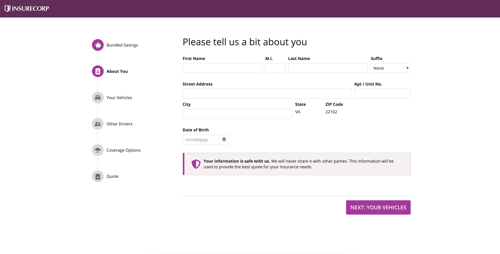

##### Multi-level sidebar step indicator

For wizards with many steps, use this pattern to break steps up into sub-steps. Only showing the sub-steps for the current step reduces clutter and makes it easier for users to navigate the form.

For forms that can't easily be completed in one session, consider providing a button for users to save their progress and return later. In this pattern, a "Save my progress" button is placed underneath the wizard.

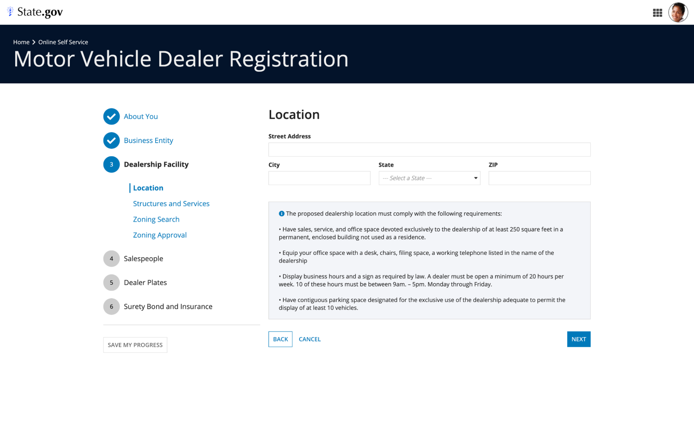

```sail
a!headerContentLayout(
  header: {
    a!cardLayout(
      contents: {
        a!sideBySideLayout(
          items: {
            a!sideBySideItem(
              item: a!richTextDisplayField(
                labelPosition: "COLLAPSED",
                value: {
                  "Home ",
                  a!richTextIcon(
                    icon: "chevron-right"
                  ),
                  " Online Self Service",
                  char(10),
                  a!richTextItem(
                    text: {
                      "Motor Vehicle Dealer Registration"
                    },
                    size: "LARGE_PLUS"
                  )
                }
              )
            )
          },
          alignVertical: "MIDDLE"
        )
      },
      height: "AUTO",
      style: "#03122a",
      padding: "MORE",
      marginBelow: "NONE",
      showBorder: false
    )
  },
  contents: {
    a!cardLayout(
      contents: {},
      height: "EXTRA_SHORT",
      style: "NONE",
      marginBelow: "NONE",
      showBorder: false
    ),
    a!columnsLayout(
      columns: {
        a!columnLayout(
          contents: {}
        ),
        a!columnLayout(
          contents: {
            a!sectionLayout(
              label: "",
              contents: {
                a!cardLayout(
                  contents: {
                    a!sideBySideLayout(
                      items: {
                        a!sideBySideItem(
                          item: a!stampField(
                            labelPosition: "COLLAPSED",
                            icon: "check",
                            text: "",
                            backgroundColor: "ACCENT",
                            contentColor: "STANDARD",
                            size: "TINY"
                          ),
                          width: "MINIMIZE"
                        ),
                        a!sideBySideItem(
                          item: a!richTextDisplayField(
                            labelPosition: "COLLAPSED",
                            value: {
                              a!richTextItem(
                                text: { "About You" },
                                color: "ACCENT",
                                size: "MEDIUM"
                              )
                            }
                          )
                        )
                      },
                      alignVertical: "MIDDLE",
                      marginBelow: "STANDARD"
                    )
                  },
                  link: a!dynamicLink(label: "Dynamic Link", saveInto: {}),
                  height: "AUTO",
                  style: "NONE",
                  padding: "NONE",
                  marginBelow: "NONE",
                  showBorder: false,
                  accessibilityText: "Completed section"
                ),
                a!cardLayout(
                  contents: {},
                  height: "AUTO",
                  padding: "EVEN_LESS",
                  marginBelow: "NONE",
                  showBorder: false
                ),
                a!cardLayout(
                  contents: {
                    a!sideBySideLayout(
                      items: {
                        a!sideBySideItem(
                          item: a!stampField(
                            labelPosition: "COLLAPSED",
                            icon: "check",
                            text: "",
                            backgroundColor: "ACCENT",
                            contentColor: "STANDARD",
                            size: "TINY"
                          ),
                          width: "MINIMIZE"
                        ),
                        a!sideBySideItem(
                          item: a!richTextDisplayField(
                            labelPosition: "COLLAPSED",
                            value: {
                              a!richTextItem(
                                text: { "Business Entity" },
                                color: "ACCENT",
                                size: "MEDIUM"
                              )
                            }
                          )
                        )
                      },
                      alignVertical: "MIDDLE",
                      marginBelow: "STANDARD"
                    )
                  },
                  link: a!dynamicLink(label: "Dynamic Link", saveInto: {}),
                  height: "AUTO",
                  style: "NONE",
                  padding: "NONE",
                  marginBelow: "NONE",
                  showBorder: false,
                  accessibilityText: "Completed section"
                ),
                a!cardLayout(
                  contents: {},
                  height: "AUTO",
                  padding: "EVEN_LESS",
                  marginBelow: "NONE",
                  showBorder: false
                ),
                a!cardLayout(
                  contents: {
                    a!sideBySideLayout(
                      items: {
                        a!sideBySideItem(
                          item: a!stampField(
                            labelPosition: "COLLAPSED",
                            text: "3",
                            backgroundColor: "ACCENT",
                            contentColor: "STANDARD",
                            size: "TINY"
                          ),
                          width: "MINIMIZE"
                        ),
                        a!sideBySideItem(
                          item: a!richTextDisplayField(
                            labelPosition: "COLLAPSED",
                            value: {
                              a!richTextItem(
                                text: { "Dealership Facility" },
                                color: "STANDARD",
                                size: "MEDIUM",
                                style: { "STRONG" }
                              )
                            }
                          )
                        )
                      },
                      alignVertical: "MIDDLE",
                      marginBelow: "STANDARD"
                    )
                  },
                  link: a!dynamicLink(label: "Dynamic Link", saveInto: {}),
                  height: "AUTO",
                  style: "NONE",
                  padding: "NONE",
                  marginBelow: "NONE",
                  showBorder: false,
                  accessibilityText: "Current section"
                ),
                a!cardLayout(
                  contents: {},
                  height: "AUTO",
                  padding: "EVEN_LESS",
                  marginBelow: "NONE",
                  showBorder: false
                ),
                a!columnsLayout(
                  columns: {
                    a!columnLayout(contents: {}, width: "EXTRA_NARROW"),
                    a!columnLayout(
                      contents: {
                        a!cardLayout(
                          contents: {
                            a!sideBySideLayout(
                              items: {
                                a!sideBySideItem(
                                  item: a!richTextDisplayField(
                                    labelPosition: "COLLAPSED",
                                    value: {
                                      a!richTextItem(text: { "❘" }, color: "ACCENT", size: "LARGE")
                                    }
                                  ),
                                  width: "MINIMIZE"
                                ),
                                a!sideBySideItem(
                                  item: a!richTextDisplayField(
                                    labelPosition: "COLLAPSED",
                                    value: {
                                      a!richTextItem(
                                        text: { "Location" },
                                        color: "ACCENT",
                                        size: "MEDIUM",
                                        style: { "STRONG" }
                                      )
                                    },
                                    preventWrapping: true
                                  )
                                )
                              },
                              alignVertical: "MIDDLE",
                              spacing: "DENSE"
                            )
                          },
                          link: a!dynamicLink(saveInto: {}),
                          height: "AUTO",
                          padding: "NONE",
                          marginBelow: "NONE",
                          showBorder: false,
                          accessibilityText: "Current step"
                        ),
                        a!cardLayout(
                          contents: {
                            a!sideBySideLayout(
                              items: {
                                a!sideBySideItem(
                                  item: a!richTextDisplayField(
                                    label: "Rich Text",
                                    labelPosition: "COLLAPSED",
                                    value: {
                                      a!richTextItem(
                                        text: { "❘" },
                                        color: "#ffffff",
                                        size: "LARGE"
                                      )
                                    }
                                  ),
                                  width: "MINIMIZE"
                                ),
                                a!sideBySideItem(
                                  item: a!richTextDisplayField(
                                    label: "Rich Text",
                                    labelPosition: "COLLAPSED",
                                    value: {
                                      a!richTextItem(
                                        text: { "Structures and Services" },
                                        color: "ACCENT",
                                        size: "MEDIUM"
                                      )
                                    },
                                    preventWrapping: true
                                  )
                                )
                              },
                              alignVertical: "MIDDLE",
                              spacing: "DENSE"
                            )
                          },
                          link: a!dynamicLink(label: "Dynamic Link", saveInto: {}),
                          height: "AUTO",
                          padding: "NONE",
                          marginBelow: "NONE",
                          showBorder: false
                        ),
                        a!cardLayout(
                          contents: {
                            a!sideBySideLayout(
                              items: {
                                a!sideBySideItem(
                                  item: a!richTextDisplayField(
                                    label: "Rich Text",
                                    labelPosition: "COLLAPSED",
                                    value: {
                                      a!richTextItem(
                                        text: { "❘" },
                                        color: "#ffffff",
                                        size: "LARGE"
                                      )
                                    }
                                  ),
                                  width: "MINIMIZE"
                                ),
                                a!sideBySideItem(
                                  item: a!richTextDisplayField(
                                    label: "Rich Text",
                                    labelPosition: "COLLAPSED",
                                    value: {
                                      a!richTextItem(
                                        text: { "Zoning Search" },
                                        color: "ACCENT",
                                        size: "MEDIUM"
                                      )
                                    },
                                    preventWrapping: true
                                  )
                                )
                              },
                              alignVertical: "MIDDLE",
                              spacing: "DENSE"
                            )
                          },
                          link: a!dynamicLink(label: "Dynamic Link", saveInto: {}),
                          height: "AUTO",
                          padding: "NONE",
                          marginBelow: "NONE",
                          showBorder: false
                        ),
                        a!cardLayout(
                          contents: {
                            a!sideBySideLayout(
                              items: {
                                a!sideBySideItem(
                                  item: a!richTextDisplayField(
                                    label: "Rich Text",
                                    labelPosition: "COLLAPSED",
                                    value: {
                                      a!richTextItem(
                                        text: { "❘" },
                                        color: "#ffffff",
                                        size: "LARGE"
                                      )
                                    }
                                  ),
                                  width: "MINIMIZE"
                                ),
                                a!sideBySideItem(
                                  item: a!richTextDisplayField(
                                    label: "Rich Text",
                                    labelPosition: "COLLAPSED",
                                    value: {
                                      a!richTextItem(
                                        text: { "Zoning Approval" },
                                        color: "ACCENT",
                                        size: "MEDIUM"
                                      )
                                    },
                                    preventWrapping: true
                                  )
                                )
                              },
                              alignVertical: "MIDDLE",
                              spacing: "DENSE"
                            )
                          },
                          link: a!dynamicLink(label: "Dynamic Link", saveInto: {}),
                          height: "AUTO",
                          padding: "NONE",
                          marginBelow: "NONE",
                          showBorder: false
                        )
                      }
                    )
                  },
                  spacing: "NONE"
                ),
                a!cardLayout(
                  contents: {},
                  height: "AUTO",
                  padding: "EVEN_LESS",
                  marginBelow: "NONE",
                  showBorder: false
                ),
                a!cardLayout(
                  contents: {
                    a!sideBySideLayout(
                      items: {
                        a!sideBySideItem(
                          item: a!stampField(
                            labelPosition: "COLLAPSED",
                            text: "4",
                            backgroundColor: "#cccccc",
                            contentColor: "STANDARD",
                            size: "TINY"
                          ),
                          width: "MINIMIZE"
                        ),
                        a!sideBySideItem(
                          item: a!richTextDisplayField(
                            labelPosition: "COLLAPSED",
                            value: {
                              a!richTextItem(
                                text: { "Salespeople" },
                                color: "STANDARD",
                                size: "MEDIUM"
                              )
                            }
                          )
                        )
                      },
                      alignVertical: "MIDDLE",
                      marginBelow: "STANDARD"
                    )
                  },
                  link: a!dynamicLink(label: "Dynamic Link", saveInto: {}),
                  height: "AUTO",
                  style: "NONE",
                  padding: "NONE",
                  marginBelow: "NONE",
                  showBorder: false,
                  accessibilityText: "Not yet started section"
                ),
                a!cardLayout(
                  contents: {},
                  height: "AUTO",
                  padding: "EVEN_LESS",
                  marginBelow: "NONE",
                  showBorder: false
                ),
                a!cardLayout(
                  contents: {
                    a!sideBySideLayout(
                      items: {
                        a!sideBySideItem(
                          item: a!stampField(
                            labelPosition: "COLLAPSED",
                            text: "5",
                            backgroundColor: "#cccccc",
                            contentColor: "STANDARD",
                            size: "TINY"
                          ),
                          width: "MINIMIZE"
                        ),
                        a!sideBySideItem(
                          item: a!richTextDisplayField(
                            labelPosition: "COLLAPSED",
                            value: {
                              a!richTextItem(
                                text: { "Dealer Plates" },
                                color: "STANDARD",
                                size: "MEDIUM"
                              )
                            }
                          )
                        )
                      },
                      alignVertical: "MIDDLE",
                      marginBelow: "STANDARD"
                    )
                  },
                  link: a!dynamicLink(label: "Dynamic Link", saveInto: {}),
                  height: "AUTO",
                  style: "NONE",
                  padding: "NONE",
                  marginBelow: "NONE",
                  showBorder: false,
                  accessibilityText: "Not yet started section"
                ),
                a!cardLayout(
                  contents: {},
                  height: "AUTO",
                  padding: "EVEN_LESS",
                  marginBelow: "NONE",
                  showBorder: false
                ),
                a!cardLayout(
                  contents: {
                    a!sideBySideLayout(
                      items: {
                        a!sideBySideItem(
                          item: a!stampField(
                            labelPosition: "COLLAPSED",
                            text: "6",
                            backgroundColor: "#cccccc",
                            contentColor: "STANDARD",
                            size: "TINY"
                          ),
                          width: "MINIMIZE"
                        ),
                        a!sideBySideItem(
                          item: a!richTextDisplayField(
                            labelPosition: "COLLAPSED",
                            value: {
                              a!richTextItem(
                                text: { "Surety Bond and Insurance" },
                                color: "STANDARD",
                                size: "MEDIUM"
                              )
                            }
                          )
                        )
                      },
                      alignVertical: "MIDDLE",
                      marginBelow: "STANDARD"
                    )
                  },
                  link: a!dynamicLink(label: "Dynamic Link", saveInto: {}),
                  height: "AUTO",
                  style: "NONE",
                  padding: "NONE",
                  marginBelow: "NONE",
                  showBorder: false,
                  accessibilityText: "Not yet started section"
                )
              },
              divider: "BELOW",
              marginBelow: "MORE"
            ),
            a!buttonArrayLayout(
              buttons: {
                a!buttonWidget(
                  label: "Save My Progress",
                  style: "OUTLINE",
                  color: "SECONDARY"
                )
              },
              align: "START"
            )
          },
          width: "MEDIUM"
        ),
        a!columnLayout(
          contents: {
            a!sectionLayout(
              label: "Location",
              labelSize: "LARGE",
              labelHeadingTag: "H2",
              labelColor: "STANDARD",
              contents: {},
              marginBelow: "STANDARD"
            ),
            a!textField(
              label: "Street Address",
              labelPosition: "ABOVE",
              saveInto: {},
              refreshAfter: "UNFOCUS",
              validations: {}
            ),
            a!columnsLayout(
              columns: {
                a!columnLayout(
                  contents: {
                    a!textField(
                      label: "City",
                      labelPosition: "ABOVE",
                      saveInto: {},
                      refreshAfter: "UNFOCUS",
                      validations: {}
                    )
                  }
                ),
                a!columnLayout(
                  contents: {
                    a!dropdownField(
                      label: "State",
                      labelPosition: "ABOVE",
                      placeholder: "--- Select a State ---",
                      choiceLabels: {"Option 1", "Option 2", "Option 3", "Option 4",
                      "Option 5", "Option 6", "Option 7", "Option 8",
                      "Option 9", "Option 10", "Option 11", "Option 12"},
                      choiceValues: {1, 2, 3, 4, 5, 6, 7, 8, 9, 10, 11, 12},
                      saveInto: {},
                      searchDisplay: "AUTO",
                      validations: {}
                    )
                  }
                ),
                a!columnLayout(
                  contents: {
                    a!textField(
                      label: "ZIP",
                      labelPosition: "ABOVE",
                      saveInto: {},
                      refreshAfter: "UNFOCUS",
                      validations: {}
                    )
                  }
                )
              }
            ),
            a!cardLayout(
              contents: {},
              height: "AUTO",
              style: "NONE",
              marginBelow: "STANDARD",
              showBorder: false
            ),
            a!cardLayout(
              contents: {
                a!richTextDisplayField(
                  labelPosition: "COLLAPSED",
                  value: {
                    a!richTextIcon(
                      icon: "info-circle",
                      color: "ACCENT"
                    ),
                    " The proposed dealership location must comply with the following requirements:",
                    char(10),
                    char(10),
                    "• Have sales, service, and office space devoted exclusively to the dealership of at least 250 square feet in a permanent, enclosed building not used as a residence.",
                    char(10),
                    char(10),
                    "• Equip your office space with a desk, chairs, filing space, a working telephone listed in the name of the dealership",
                    char(10),
                    char(10),
                    "• Display business hours and a sign as required by law. A dealer must be open a minimum of 20 hours per week. 10 of these hours must be between 9am. – 5pm. Monday through Friday.",
                    char(10),
                    char(10),
                    "• Have contiguous parking space designated for the exclusive use of the dealership adequate to permit the display of at least 10 vehicles."
                  }
                )
              },
              height: "AUTO",
              style: "#f3f5f9",
              padding: "STANDARD",
              marginBelow: "MORE"
            ),
            a!columnsLayout(
              columns: {
                a!columnLayout(
                  contents: {
                    a!buttonArrayLayout(
                      buttons: {
                        a!buttonWidget(
                          label: "Back",
                          style: "OUTLINE"
                        ),
                        a!buttonWidget(
                          label: "Cancel",
                          style: "LINK"
                        )
                      },
                      align: "START",
                      marginBelow: "NONE"
                    )
                  }
                ),
                a!columnLayout(
                  contents: {
                    a!buttonArrayLayout(
                      buttons: {
                        a!buttonWidget(
                          label: "Next",
                          style: "SOLID"
                        )
                      },
                      align: "END",
                      marginBelow: "NONE"
                    )
                  }
                )
              }
            )
          },
          width: "WIDE"
        ),
        a!columnLayout(
          contents: {}
        )
      },
      stackWhen: {
        "PHONE",
        "TABLET_PORTRAIT"
      }
    )
  },
  backgroundColor: "WHITE",
  contentsPadding: "NONE"

)
```

### Custom wizard navigation guidelines

When creating a custom wizard, keep the following in mind to make wizards easy to navigate:

- Include back and next buttons on wizards to allow users to easily navigate between steps, so they can either review a previous input or move smoothly onto the next step. You can alternatively add links to step indicators for quick navigation between steps.

- To keep users aware of where they are in a wizard, use visual cues like color changing or bolded text to show a user's current step.

### Taking advantage of automatic scrolling in wizards

In both custom wizards and wizard layouts, Appian automatically handles the page scrolling between each step of the wizard. This means that whenever a user navigates to the next step, the page will automatically scroll to the top of the page.

To take advantage of this, make sure that you don't have multiple read-only components—elements that the user does not interact with—that affects the automatic page scrolling.

Additionally, if you are using a form layout in a custom wizard, make sure that the buttons or dynamic links that control form navigation are placed in the *buttons* parameter. If they are placed in the *contents* parameter, auto scrolling will not work.

## Providing confirmation and review pages

Confirmation and review pages reassure users of the successful completion of a form and can set expectations for what to do next.

### Confirmation page

Use a confirmation page as the last step in a form to confirm that it was submitted successfully. The post-submission confirmation step can be helpful when you need to explain next steps to a user that are only relevant after the form is submitted or to guide a user to a new screen.

In this pattern, the confirmation page displays relevant information about the submitted form, like the case number that was created and what to expect next, and includes a button to guide the user back to their previous screen.

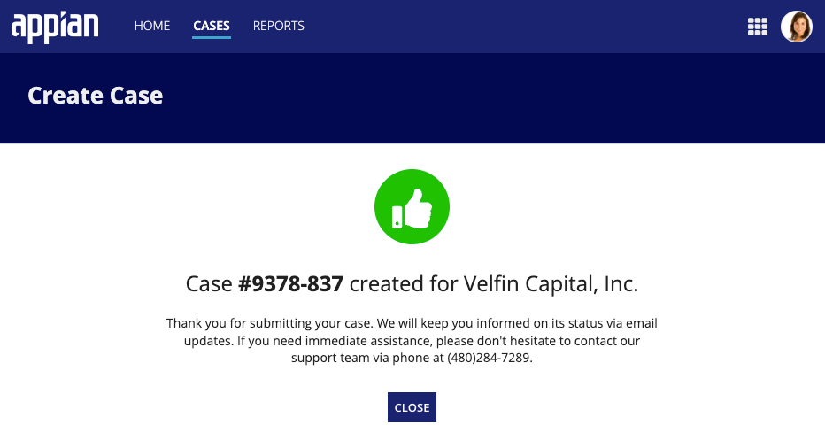

```sail
a!formLayout(
  titleBar: a!headerTemplateFull(
    title: "Create Case",
    backgroundColor: "#020A51"
  ),
  contents: {
    a!stampField(
      labelPosition: "COLLAPSED",
      icon: "thumbs-up",
      backgroundColor: "POSITIVE",
      contentColor: "STANDARD",
      align: "CENTER",
      marginBelow: "MORE"
    ),
    a!richTextDisplayField(
      labelPosition: "COLLAPSED",
      value: {
        /*color: "SECONDARY",*/
        a!richTextItem(
          text: {
            "Case ",
            a!richTextItem(
              text: {
                "#9378-837"
              },
              style: {
                "STRONG"
              }
            ),
            " created for Velfin Capital, Inc."
          },
          size: "MEDIUM_PLUS"
        ),
        char(10),
        char(10),
        a!richTextItem(
          text: {
            "Thank you for submitting your case. We will keep you informed on its status via email updates. If you need immediate assistance, please don't hesitate to contact our support team via phone at (480)284-7289."
          },
          size: "STANDARD"
        )
      },
      align: "CENTER",
      marginBelow: "NONE"
    ),
    a!buttonArrayLayout(
      buttons: {
        a!buttonWidget(
          label: "Close",
          size: "SMALL",
          style: "SOLID"
        )
      },
      align: "CENTER",
      marginAbove: "MORE",
      marginBelow: "NONE"
    )
  },
  contentsWidth: "NARROW"
)
```

### Review page

Use these patterns to provide summaries of form inputs. For forms that are long or where the input data is very important, a review step can help a user feel confident that they are submitting the right information, and allow them to quickly change any mistakes.

Note that a review step probably isn't necessary if it's not an issue for a user to fix any possible mistakes later.

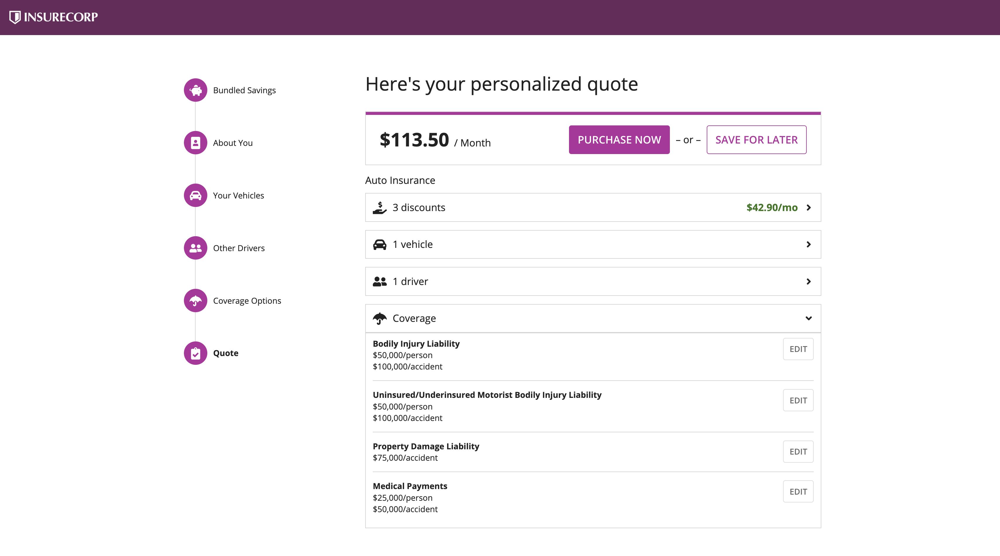

```sail
a!localVariables(
  local!zipCode: null(),
  local!stepNumber: 1,
  local!bundleSelections: {},
  local!showSaveForLater: false,
  choose(
    local!stepNumber,
    a!headerContentLayout(
      header: {
        a!cardLayout(
          contents: {
            a!columnsLayout(
              columns: {
                a!columnLayout(contents: {}),
                a!columnLayout(
                  contents: {
                    a!cardLayout(
                      contents: {
                        a!richTextDisplayField(
                          labelPosition: "COLLAPSED",
                          value: {
                            a!richTextItem(
                              text: {
                                "Great rates, great service, and great protection."
                              },
                              color: "#434343",
                              size: "LARGE",
                              style: { "STRONG" }
                            ),
                            " "
                          },
                          marginAbove: "NONE",
                          marginBelow: "MORE"
                        ),
                        a!cardLayout(
                          contents: {
                            a!richTextDisplayField(
                              labelPosition: "COLLAPSED",
                              value: {
                                a!richTextItem(
                                  text: { "Get your no-obligation quote now" },
                                  color: "#434343",
                                  size: "MEDIUM",
                                  style: { "STRONG" }
                                )
                              },
                              align: "CENTER",
                              marginBelow: "STANDARD"
                            ),
                            a!columnsLayout(
                              columns: {
                                a!columnLayout(contents: {}),
                                a!columnLayout(
                                  contents: {
                                    a!sideBySideLayout(
                                      items: {
                                        a!sideBySideItem(
                                          item: a!textField(
                                            label: "Your ZIP Code",
                                            labelPosition: "COLLAPSED",
                                            placeholder: "Enter your 5-digit ZIP code",
                                            saveInto: local!zipCode,
                                            refreshAfter: "UNFOCUS",
                                            validations: {}
                                          )
                                        ),
                                        a!sideBySideItem(
                                          item: a!buttonArrayLayout(
                                            buttons: {
                                              a!buttonWidget(
                                                label: "Get Started",
                                                value: 2,
                                                saveInto: local!stepNumber,
                                                size: "STANDARD",
                                                style: "OUTLINE"
                                              )
                                            },
                                            align: "START",
                                            marginBelow: "NONE"
                                          ),
                                          width: "MINIMIZE"
                                        )
                                      },
                                      alignVertical: "MIDDLE"
                                    )
                                  },
                                  width: "MEDIUM"
                                ),
                                a!columnLayout(contents: {})
                              },
                              alignVertical: "MIDDLE"
                            )
                          },
                          height: "AUTO",
                          style: "NONE",
                          padding: "MORE",
                          marginBelow: "STANDARD",
                          showBorder: false,
                          decorativeBarPosition: "TOP",
                          decorativeBarColor: "#BF04A0"
                        ),
                        a!richTextDisplayField(
                          labelPosition: "COLLAPSED",
                          value: {
                            a!richTextItem(
                              text: {
                                "We may use information from public sources or third parties, such as driving records, claim history, vehicle driving data, and credit reports to provide you with the best quote. "
                              },
                              color: "#666666",
                              size: "SMALL"
                            ),
                            char(10),
                            char(10),
                            a!richTextItem(
                              text: {
                                "Some discounts, coverages, payment plans, and features are not available in all states."
                              },
                              color: "#666666",
                              size: "SMALL"
                            )
                          }
                        )
                      },
                      height: "AUTO",
                      style: "#efefef",
                      padding: "EVEN_MORE",
                      marginBelow: "NONE",
                      showBorder: false
                    )
                  },
                  width: "WIDE"
                ),
                a!columnLayout(contents: {}),
                a!columnLayout(
                  contents: {
                    a!imageField(
                      label: "",
                      labelPosition: "COLLAPSED",
                      images: {
                        a!webImage(
                          source: "https://images.pexels.com/photos/3785391/pexels-photo-3785391.jpeg?auto=compress&cs=tinysrgb&dpr=2&h=750&w=1260"
                        )
                      },
                      size: "FIT",
                      isThumbnail: false,
                      style: "STANDARD"
                    )
                  },
                  width: "WIDE"
                )
              },
              alignVertical: "MIDDLE",
              marginBelow: "NONE",
              stackWhen: {
                "PHONE",
                "TABLET_PORTRAIT",
                "TABLET_LANDSCAPE"
              }
            )
          },
          height: "AUTO",
          style: "#efefef",
          padding: "NONE",
          marginBelow: "NONE",
          showBorder: false
        ),
        a!cardLayout(
          contents: {
            a!columnsLayout(
              columns: {
                a!columnLayout(
                  contents: {
                    a!imageField(
                      label: "",
                      labelPosition: "COLLAPSED",
                      images: {
                        a!webImage(
                          source: "https://images.pexels.com/photos/9518015/pexels-photo-9518015.jpeg?auto=compress&cs=tinysrgb&dpr=2&w=500"
                        )
                      },
                      size: "FIT",
                      isThumbnail: false,
                      style: "STANDARD"
                    )
                  },
                  width: "WIDE"
                ),
                a!columnLayout(contents: {}),
                a!columnLayout(
                  contents: {
                    a!cardLayout(
                      contents: {
                        a!richTextDisplayField(
                          labelPosition: "COLLAPSED",
                          value: {
                            a!richTextItem(
                              text: {
                                "Get just the right amount of coverage for your needs"
                              },
                              color: "STANDARD",
                              size: "MEDIUM_PLUS",
                              style: { "STRONG" }
                            )
                          },
                          marginAbove: "NONE",
                          marginBelow: "MORE"
                        ),
                        a!richTextDisplayField(
                          labelPosition: "COLLAPSED",
                          value: {
                            a!richTextItem(
                              text: { a!richTextIcon(icon: "check-circle") },
                              color: "STANDARD",
                              size: "MEDIUM_PLUS",
                              style: { "STRONG" }
                            ),
                            a!richTextItem(
                              text: {
                                a!richTextItem(text: { " " }, style: { "STRONG" }),
                                "Liability Coverage"
                              },
                              size: "MEDIUM_PLUS"
                            )
                          }
                        ),
                        a!richTextDisplayField(
                          labelPosition: "COLLAPSED",
                          value: {
                            a!richTextItem(
                              text: { a!richTextIcon(icon: "check-circle") },
                              color: "STANDARD",
                              size: "MEDIUM_PLUS",
                              style: { "STRONG" }
                            ),
                            a!richTextItem(
                              text: {
                                a!richTextItem(text: { " " }, style: { "STRONG" }),
                                "Uninsured and Underinsured Motorist Coverage"
                              },
                              size: "MEDIUM_PLUS"
                            )
                          }
                        ),
                        a!richTextDisplayField(
                          labelPosition: "COLLAPSED",
                          value: {
                            a!richTextItem(
                              text: { a!richTextIcon(icon: "check-circle") },
                              color: "STANDARD",
                              size: "MEDIUM_PLUS",
                              style: { "STRONG" }
                            ),
                            a!richTextItem(
                              text: {
                                a!richTextItem(text: { " " }, style: { "STRONG" }),
                                "Comprehensive Coverage"
                              },
                              size: "MEDIUM_PLUS"
                            )
                          }
                        ),
                        a!richTextDisplayField(
                          labelPosition: "COLLAPSED",
                          value: {
                            a!richTextItem(
                              text: { a!richTextIcon(icon: "check-circle") },
                              color: "STANDARD",
                              size: "MEDIUM_PLUS",
                              style: { "STRONG" }
                            ),
                            a!richTextItem(
                              text: {
                                a!richTextItem(text: { " " }, style: { "STRONG" }),
                                "Collision Coverage"
                              },
                              size: "MEDIUM_PLUS"
                            )
                          }
                        ),
                        a!richTextDisplayField(
                          labelPosition: "COLLAPSED",
                          value: {
                            a!richTextItem(
                              text: { a!richTextIcon(icon: "check-circle") },
                              color: "STANDARD",
                              size: "MEDIUM_PLUS",
                              style: { "STRONG" }
                            ),
                            a!richTextItem(
                              text: {
                                a!richTextItem(text: { " " }, style: { "STRONG" }),
                                "Medical Payments Coverage"
                              },
                              size: "MEDIUM_PLUS"
                            )
                          }
                        ),
                        a!richTextDisplayField(
                          labelPosition: "COLLAPSED",
                          value: {
                            a!richTextItem(
                              text: { a!richTextIcon(icon: "check-circle") },
                              color: "STANDARD",
                              size: "MEDIUM_PLUS",
                              style: { "STRONG" }
                            ),
                            a!richTextItem(
                              text: {
                                a!richTextItem(text: { " " }, style: { "STRONG" }),
                                "Personal Injury Protection"
                              },
                              size: "MEDIUM_PLUS"
                            )
                          }
                        )
                      },
                      height: "AUTO",
                      style: "#73245d",
                      padding: "MORE",
                      marginBelow: "NONE",
                      showBorder: false
                    )
                  },
                  width: "WIDE"
                ),
                a!columnLayout(contents: {})
              },
              alignVertical: "MIDDLE",
              marginBelow: "NONE",
              stackWhen: {
                "PHONE",
                "TABLET_PORTRAIT",
                "TABLET_LANDSCAPE"
              }
            )
          },
          height: "AUTO",
          style: "#73245d",
          padding: "NONE",
          marginBelow: "NONE",
          showBorder: false
        ),
        a!cardLayout(
          contents: {
            a!columnsLayout(
              columns: {
                a!columnLayout(
                  contents: {
                    a!imageField(
                      label: "",
                      labelPosition: "COLLAPSED",
                      images: {
                        a!documentImage(
                          document: a!EXAMPLE_DOCUMENT_IMAGE()
                        )
                      },
                      size: "MEDIUM",
                      isThumbnail: false,
                      style: "STANDARD"
                    )
                  },
                  width: "MEDIUM"
                ),
                a!columnLayout(
                  contents: {
                    a!richTextDisplayField(
                      labelPosition: "COLLAPSED",
                      value: {
                        "We may use information from public sources or third parties, such as driving records, claim history, vehicle driving data, and credit reports to provide you with the best quote.",
                        char(10),
                        char(10),
                        "Some discounts, coverages, payment plans, and features are not available in all states.",
                        char(10),
                        char(10),
                        "This site exists for demonstration purposes only. We can't actually sell you auto insurance."
                      }
                    )
                  }
                )
              },
              stackWhen: { "PHONE", "TABLET_PORTRAIT" }
            )
          },
          height: "TALL",
          style: "#333",
          padding: "EVEN_MORE",
          marginBelow: "STANDARD",
          showBorder: false,
          decorativeBarPosition: "NONE",
          decorativeBarColor: "#056CF2"
        )
      },
      contents: {},
      backgroundColor: "#333",
      contentsPadding: "NONE"
    ),
    a!headerContentLayout(
      header: {
        a!cardLayout(
          contents: {
            a!columnsLayout(
              columns: {
                a!columnLayout(contents: {}),
                a!columnLayout(
                  contents: {
                    a!sectionLayout(
                      label: "",
                      labelSize: "MEDIUM",
                      labelColor: "STANDARD",
                      contents: {
                        a!columnsLayout(
                          columns: {
                            a!columnLayout(
                              contents: {
                                a!stampField(
                                  labelPosition: "COLLAPSED",
                                  icon: "piggy-bank",
                                  backgroundColor: "ACCENT",
                                  contentColor: "STANDARD",
                                  size: "TINY",
                                  align: "CENTER",
                                  marginBelow: "NONE",
                                  accessibilityText: "Completed Step"
                                )
                              },
                              width: "EXTRA_NARROW"
                            ),
                            a!columnLayout(
                              contents: {
                                a!richTextDisplayField(
                                  labelPosition: "COLLAPSED",
                                  value: {
                                    a!richTextItem(
                                      text: { "Bundled Savings" },
                                      size: "STANDARD",
                                      style: { "STRONG" }
                                    )
                                  },
                                  preventWrapping: true,
                                  align: "LEFT",
                                  marginAbove: "NONE",
                                  marginBelow: "NONE",
                                  accessibilityText: "Current Step (1 of 6)"
                                )
                              }
                            )
                          },
                          alignVertical: "MIDDLE",
                          marginAbove: "STANDARD",
                          marginBelow: "NONE",
                          spacing: "NONE"
                        ),
                        a!columnsLayout(
                          columns: {
                            a!columnLayout(
                              contents: {
                                a!imageField(
                                  label: "",
                                  labelPosition: "COLLAPSED",
                                  images: {
                                    a!documentImage(
                                      document: a!EXAMPLE_VERTICAL_CONNECTOR_IMAGE()
                                    )
                                  },
                                  size: "TINY",
                                  isThumbnail: false,
                                  style: "STANDARD",
                                  align: "CENTER"
                                )
                              },
                              width: "EXTRA_NARROW"
                            ),
                            a!columnLayout(contents: {})
                          },
                          alignVertical: "MIDDLE",
                          marginBelow: "NONE",
                          spacing: "NONE"
                        ),
                        a!columnsLayout(
                          columns: {
                            a!columnLayout(
                              contents: {
                                a!stampField(
                                  labelPosition: "COLLAPSED",
                                  icon: "portrait",
                                  backgroundColor: "#d9d9d9",
                                  contentColor: "#666666",
                                  size: "TINY",
                                  align: "CENTER",
                                  marginBelow: "NONE",
                                  accessibilityText: "Future Step"
                                )
                              },
                              width: "EXTRA_NARROW"
                            ),
                            a!columnLayout(
                              contents: {
                                a!richTextDisplayField(
                                  labelPosition: "COLLAPSED",
                                  value: {
                                    a!richTextItem(text: { "About You" }, size: "STANDARD")
                                  },
                                  preventWrapping: true,
                                  align: "LEFT",
                                  marginAbove: "NONE",
                                  marginBelow: "NONE",
                                  accessibilityText: "Future Step (2 of 6)"
                                )
                              }
                            )
                          },
                          alignVertical: "MIDDLE",
                          marginBelow: "NONE",
                          spacing: "NONE"
                        ),
                        a!columnsLayout(
                          columns: {
                            a!columnLayout(
                              contents: {
                                a!imageField(
                                  label: "",
                                  labelPosition: "COLLAPSED",
                                  images: {
                                    a!documentImage(
                                      document: a!EXAMPLE_VERTICAL_CONNECTOR_IMAGE()
                                    )
                                  },
                                  size: "TINY",
                                  isThumbnail: false,
                                  style: "STANDARD",
                                  align: "CENTER"
                                )
                              },
                              width: "EXTRA_NARROW"
                            ),
                            a!columnLayout(contents: {})
                          },
                          alignVertical: "MIDDLE",
                          marginBelow: "NONE",
                          spacing: "NONE"
                        ),
                        a!columnsLayout(
                          columns: {
                            a!columnLayout(
                              contents: {
                                a!stampField(
                                  labelPosition: "COLLAPSED",
                                  icon: "car",
                                  backgroundColor: "#d9d9d9",
                                  contentColor: "#666666",
                                  size: "TINY",
                                  align: "CENTER",
                                  marginBelow: "NONE",
                                  accessibilityText: "Future Step"
                                )
                              },
                              width: "EXTRA_NARROW"
                            ),
                            a!columnLayout(
                              contents: {
                                a!richTextDisplayField(
                                  labelPosition: "COLLAPSED",
                                  value: {
                                    a!richTextItem(text: { "Your Vehicles" }, size: "STANDARD")
                                  },
                                  preventWrapping: true,
                                  align: "LEFT",
                                  marginAbove: "NONE",
                                  marginBelow: "NONE",
                                  accessibilityText: "Future Step (3 of 6)"
                                )
                              }
                            )
                          },
                          alignVertical: "MIDDLE",
                          marginBelow: "NONE",
                          spacing: "NONE"
                        ),
                        a!columnsLayout(
                          columns: {
                            a!columnLayout(
                              contents: {
                                a!imageField(
                                  label: "",
                                  labelPosition: "COLLAPSED",
                                  images: {
                                    a!documentImage(
                                      document: a!EXAMPLE_VERTICAL_CONNECTOR_IMAGE()
                                    )
                                  },
                                  size: "TINY",
                                  isThumbnail: false,
                                  style: "STANDARD",
                                  align: "CENTER"
                                )
                              },
                              width: "EXTRA_NARROW"
                            ),
                            a!columnLayout(contents: {})
                          },
                          alignVertical: "MIDDLE",
                          marginBelow: "NONE",
                          spacing: "NONE"
                        ),
                        a!columnsLayout(
                          columns: {
                            a!columnLayout(
                              contents: {
                                a!stampField(
                                  labelPosition: "COLLAPSED",
                                  icon: "user-friends",
                                  backgroundColor: "#d9d9d9",
                                  contentColor: "#666666",
                                  size: "TINY",
                                  align: "CENTER",
                                  marginBelow: "NONE",
                                  accessibilityText: "Future Step"
                                )
                              },
                              width: "EXTRA_NARROW"
                            ),
                            a!columnLayout(
                              contents: {
                                a!richTextDisplayField(
                                  labelPosition: "COLLAPSED",
                                  value: {
                                    a!richTextItem(text: { "Other Drivers" }, size: "STANDARD")
                                  },
                                  preventWrapping: true,
                                  align: "LEFT",
                                  marginAbove: "NONE",
                                  marginBelow: "NONE",
                                  accessibilityText: "Future Step (4 of 6)"
                                )
                              }
                            )
                          },
                          alignVertical: "MIDDLE",
                          marginBelow: "NONE",
                          spacing: "NONE"
                        ),
                        a!columnsLayout(
                          columns: {
                            a!columnLayout(
                              contents: {
                                a!imageField(
                                  label: "",
                                  labelPosition: "COLLAPSED",
                                  images: {
                                    a!documentImage(
                                      document: a!EXAMPLE_VERTICAL_CONNECTOR_IMAGE()
                                    )
                                  },
                                  size: "TINY",
                                  isThumbnail: false,
                                  style: "STANDARD",
                                  align: "CENTER"
                                )
                              },
                              width: "EXTRA_NARROW"
                            ),
                            a!columnLayout(contents: {})
                          },
                          alignVertical: "MIDDLE",
                          marginBelow: "NONE",
                          spacing: "NONE"
                        ),
                        a!columnsLayout(
                          columns: {
                            a!columnLayout(
                              contents: {
                                a!stampField(
                                  labelPosition: "COLLAPSED",
                                  icon: "umbrella",
                                  backgroundColor: "#d9d9d9",
                                  contentColor: "#666666",
                                  size: "TINY",
                                  align: "CENTER",
                                  marginBelow: "NONE",
                                  accessibilityText: "Future Step"
                                )
                              },
                              width: "EXTRA_NARROW"
                            ),
                            a!columnLayout(
                              contents: {
                                a!richTextDisplayField(
                                  labelPosition: "COLLAPSED",
                                  value: {
                                    a!richTextItem(
                                      text: { "Coverage Options" },
                                      size: "STANDARD"
                                    )
                                  },
                                  preventWrapping: true,
                                  align: "LEFT",
                                  marginAbove: "NONE",
                                  marginBelow: "NONE",
                                  accessibilityText: "Future Step (5 of 6)"
                                )
                              }
                            )
                          },
                          alignVertical: "MIDDLE",
                          marginBelow: "NONE",
                          spacing: "NONE"
                        ),
                        a!columnsLayout(
                          columns: {
                            a!columnLayout(
                              contents: {
                                a!imageField(
                                  label: "",
                                  labelPosition: "COLLAPSED",
                                  images: {
                                    a!documentImage(
                                      document: a!EXAMPLE_VERTICAL_CONNECTOR_IMAGE()
                                    )
                                  },
                                  size: "TINY",
                                  isThumbnail: false,
                                  style: "STANDARD",
                                  align: "CENTER"
                                )
                              },
                              width: "EXTRA_NARROW"
                            ),
                            a!columnLayout(contents: {})
                          },
                          alignVertical: "MIDDLE",
                          marginBelow: "NONE",
                          spacing: "NONE"
                        ),
                        a!columnsLayout(
                          columns: {
                            a!columnLayout(
                              contents: {
                                a!stampField(
                                  labelPosition: "COLLAPSED",
                                  icon: "clipboard-check",
                                  backgroundColor: "#d9d9d9",
                                  contentColor: "#666666",
                                  size: "TINY",
                                  align: "CENTER",
                                  marginBelow: "NONE",
                                  accessibilityText: "Future Step"
                                )
                              },
                              width: "EXTRA_NARROW"
                            ),
                            a!columnLayout(
                              contents: {
                                a!richTextDisplayField(
                                  labelPosition: "COLLAPSED",
                                  value: {
                                    a!richTextItem(text: { "Quote" }, size: "STANDARD")
                                  },
                                  preventWrapping: true,
                                  align: "LEFT",
                                  marginAbove: "NONE",
                                  marginBelow: "NONE",
                                  accessibilityText: "Future Step (6 of 6)"
                                )
                              }
                            )
                          },
                          alignVertical: "MIDDLE",
                          marginBelow: "NONE",
                          spacing: "NONE"
                        )
                      },
                      showWhen: a!isPageWidth(pageWidths: { "DESKTOP", "DESKTOP_WIDE" })
                    )
                  },
                  width: "NARROW_PLUS"
                ),
                a!columnLayout(
                  contents: {
                    a!richTextDisplayField(
                      labelPosition: "COLLAPSED",
                      value: {
                        a!richTextItem(
                          text: { "Save more with a bundled quote" },
                          size: "LARGE"
                        )
                      },
                      marginBelow: "MORE"
                    ),
                    a!cardChoiceField(
                      label: "Insurance Options 1",
                      labelPosition: "COLLAPSED",
                      data: {
                        a!map(
                          id: 1,
                          icon: "car",
                          primaryText: "Auto",
                          secondaryText: "Cars & SUVs"
                        )
                      },
                      cardTemplate: a!cardTemplateBarTextStacked(
                        id: fv!data.id,
                        primaryText: fv!data.primaryText,
                        secondaryText: fv!data.secondaryText,
                        icon: fv!data.icon
                      ),
                      value: 1,
                      saveInto: {},
                      maxSelections: 1,
                      validations: {}
                    ),
                    a!richTextDisplayField(
                      labelPosition: "COLLAPSED",
                      value: {
                        a!richTextItem(
                          text: {
                            "Save as much as ",
                            a!richTextItem(text: { "25%" }, style: { "STRONG" }),
                            " by bundling multiple policies today."
                          },
                          size: "MEDIUM"
                        ),
                        char(10),
                        char(10),
                        a!richTextItem(
                          text: { "What else do you want to protect?" },
                          size: "MEDIUM",
                          style: { "STRONG" }
                        )
                      },
                      marginAbove: "MORE",
                      marginBelow: "MORE"
                    ),
                    a!cardChoiceField(
                      label: "Insurance Options 1",
                      labelPosition: "COLLAPSED",
                      data: {
                        a!map(
                          id: 1,
                          icon: "home",
                          primaryText: "Homeowners",
                          secondaryText: "Single-family & townhomes"
                        ),
                        a!map(
                          id: 2,
                          icon: "building",
                          primaryText: "Renters",
                          secondaryText: "Rental homes & apartments"
                        ),
                        a!map(
                          id: 3,
                          icon: "motorcycle",
                          primaryText: "Other Vehicles",
                          secondaryText: "Motorcycles & ATVs"
                        )
                      },
                      cardTemplate: a!cardTemplateBarTextStacked(
                        id: fv!data.id,
                        primaryText: fv!data.primaryText,
                        secondaryText: fv!data.secondaryText,
                        icon: fv!data.icon
                      ),
                      value: local!bundleSelections,
                      saveInto: local!bundleSelections,
                      maxSelections: 3,
                      validations: {}
                    ),
                    a!sectionLayout(
                      label: "",
                      contents: {
                        a!columnsLayout(
                          columns: {
                            a!columnLayout(contents: {}),
                            a!columnLayout(
                              contents: {
                                a!buttonArrayLayout(
                                  buttons: {
                                    a!buttonWidget(
                                      label: "Next: About You",
                                      value: 3,
                                      saveInto: local!stepNumber,
                                      size: "LARGE",
                                      style: "SOLID"
                                    )
                                  },
                                  align: "END"
                                )
                              }
                            )
                          }
                        )
                      },
                      divider: "ABOVE",
                      marginAbove: "EVEN_MORE"
                    )
                  },
                  width: "WIDE"
                ),
                a!columnLayout(contents: {})
              },
              marginAbove: "EVEN_MORE",
              marginBelow: "EVEN_MORE",
              stackWhen: {
                "PHONE",
                "TABLET_PORTRAIT",
                "TABLET_LANDSCAPE",
                "DESKTOP_NARROW"
              }
            ),
            a!cardLayout(
              contents: {},
              height: "SHORT_PLUS",
              style: "NONE",
              marginBelow: "STANDARD",
              showBorder: false
            )
          },
          height: "AUTO",
          style: "NONE",
          marginBelow: "NONE",
          showBorder: false
        ),
        a!cardLayout(
          contents: {
            a!columnsLayout(
              columns: {
                a!columnLayout(
                  contents: {
                    a!imageField(
                      label: "",
                      labelPosition: "COLLAPSED",
                      images: {
                        a!documentImage(
                          document: a!EXAMPLE_DOCUMENT_IMAGE()
                        )
                      },
                      size: "MEDIUM",
                      isThumbnail: false,
                      style: "STANDARD"
                    )
                  },
                  width: "MEDIUM"
                ),
                a!columnLayout(
                  contents: {
                    a!richTextDisplayField(
                      labelPosition: "COLLAPSED",
                      value: {
                        "We may use information from public sources or third parties, such as driving records, claim history, vehicle driving data, and credit reports to provide you with the best quote.",
                        char(10),
                        char(10),
                        "Some discounts, coverages, payment plans, and features are not available in all states.",
                        char(10),
                        char(10),
                        "This site exists for demonstration purposes only. We can't actually sell you auto insurance."
                      }
                    )
                  }
                )
              },
              stackWhen: { "PHONE", "TABLET_PORTRAIT" }
            )
          },
          height: "TALL",
          style: "#333",
          padding: "EVEN_MORE",
          marginBelow: "STANDARD",
          showBorder: false,
          decorativeBarPosition: "NONE",
          decorativeBarColor: "#056CF2"
        )
      },
      contents: {},
      backgroundColor: "#333",
      contentsPadding: "NONE"
    ),
    a!headerContentLayout(
      header: {
        a!cardLayout(
          contents: {
            a!columnsLayout(
              columns: {
                a!columnLayout(contents: {}),
                a!columnLayout(
                  contents: {
                    a!sectionLayout(
                      label: "",
                      labelSize: "MEDIUM",
                      labelColor: "STANDARD",
                      contents: {
                        a!columnsLayout(
                          columns: {
                            a!columnLayout(
                              contents: {
                                a!stampField(
                                  labelPosition: "COLLAPSED",
                                  icon: "piggy-bank",
                                  backgroundColor: "ACCENT",
                                  contentColor: "STANDARD",
                                  size: "TINY",
                                  align: "CENTER",
                                  marginBelow: "NONE",
                                  accessibilityText: "Completed Step"
                                )
                              },
                              width: "EXTRA_NARROW"
                            ),
                            a!columnLayout(
                              contents: {
                                a!richTextDisplayField(
                                  labelPosition: "COLLAPSED",
                                  value: {
                                    a!richTextItem(
                                      text: { "Bundled Savings" },
                                      size: "STANDARD"
                                    )
                                  },
                                  preventWrapping: true,
                                  align: "LEFT",
                                  marginAbove: "NONE",
                                  marginBelow: "NONE",
                                  accessibilityText: "Completed Step (1 of 6)"
                                )
                              }
                            )
                          },
                          alignVertical: "MIDDLE",
                          marginAbove: "STANDARD",
                          marginBelow: "NONE",
                          spacing: "NONE"
                        ),
                        a!columnsLayout(
                          columns: {
                            a!columnLayout(
                              contents: {
                                a!imageField(
                                  label: "",
                                  labelPosition: "COLLAPSED",
                                  images: {
                                    a!documentImage(
                                      document: a!EXAMPLE_VERTICAL_CONNECTOR_IMAGE()
                                    )
                                  },
                                  size: "TINY",
                                  isThumbnail: false,
                                  style: "STANDARD",
                                  align: "CENTER"
                                )
                              },
                              width: "EXTRA_NARROW"
                            ),
                            a!columnLayout(contents: {})
                          },
                          alignVertical: "MIDDLE",
                          marginBelow: "NONE",
                          spacing: "NONE"
                        ),
                        a!columnsLayout(
                          columns: {
                            a!columnLayout(
                              contents: {
                                a!stampField(
                                  labelPosition: "COLLAPSED",
                                  icon: "portrait",
                                  backgroundColor: "ACCENT",
                                  contentColor: "STANDARD",
                                  size: "TINY",
                                  align: "CENTER",
                                  marginBelow: "NONE",
                                  accessibilityText: "Current Step"
                                )
                              },
                              width: "EXTRA_NARROW"
                            ),
                            a!columnLayout(
                              contents: {
                                a!richTextDisplayField(
                                  labelPosition: "COLLAPSED",
                                  value: {
                                    a!richTextItem(
                                      text: { "About You" },
                                      size: "STANDARD",
                                      style: { "STRONG" }
                                    )
                                  },
                                  preventWrapping: true,
                                  align: "LEFT",
                                  marginAbove: "NONE",
                                  marginBelow: "NONE",
                                  accessibilityText: "Current Step (2 of 6)"
                                )
                              }
                            )
                          },
                          alignVertical: "MIDDLE",
                          marginBelow: "NONE",
                          spacing: "NONE"
                        ),
                        a!columnsLayout(
                          columns: {
                            a!columnLayout(
                              contents: {
                                a!imageField(
                                  label: "",
                                  labelPosition: "COLLAPSED",
                                  images: {
                                    a!documentImage(
                                      document: a!EXAMPLE_VERTICAL_CONNECTOR_IMAGE()
                                    )
                                  },
                                  size: "TINY",
                                  isThumbnail: false,
                                  style: "STANDARD",
                                  align: "CENTER"
                                )
                              },
                              width: "EXTRA_NARROW"
                            ),
                            a!columnLayout(contents: {})
                          },
                          alignVertical: "MIDDLE",
                          marginBelow: "NONE",
                          spacing: "NONE"
                        ),
                        a!columnsLayout(
                          columns: {
                            a!columnLayout(
                              contents: {
                                a!stampField(
                                  labelPosition: "COLLAPSED",
                                  icon: "car",
                                  backgroundColor: "#d9d9d9",
                                  contentColor: "#666666",
                                  size: "TINY",
                                  align: "CENTER",
                                  marginBelow: "NONE",
                                  accessibilityText: "Future Step"
                                )
                              },
                              width: "EXTRA_NARROW"
                            ),
                            a!columnLayout(
                              contents: {
                                a!richTextDisplayField(
                                  labelPosition: "COLLAPSED",
                                  value: {
                                    a!richTextItem(text: { "Your Vehicles" }, size: "STANDARD")
                                  },
                                  preventWrapping: true,
                                  align: "LEFT",
                                  marginAbove: "NONE",
                                  marginBelow: "NONE",
                                  accessibilityText: "Future Step (3 of 6)"
                                )
                              }
                            )
                          },
                          alignVertical: "MIDDLE",
                          marginBelow: "NONE",
                          spacing: "NONE"
                        ),
                        a!columnsLayout(
                          columns: {
                            a!columnLayout(
                              contents: {
                                a!imageField(
                                  label: "",
                                  labelPosition: "COLLAPSED",
                                  images: {
                                    a!documentImage(
                                      document: a!EXAMPLE_VERTICAL_CONNECTOR_IMAGE()
                                    )
                                  },
                                  size: "TINY",
                                  isThumbnail: false,
                                  style: "STANDARD",
                                  align: "CENTER"
                                )
                              },
                              width: "EXTRA_NARROW"
                            ),
                            a!columnLayout(contents: {})
                          },
                          alignVertical: "MIDDLE",
                          marginBelow: "NONE",
                          spacing: "NONE"
                        ),
                        a!columnsLayout(
                          columns: {
                            a!columnLayout(
                              contents: {
                                a!stampField(
                                  labelPosition: "COLLAPSED",
                                  icon: "user-friends",
                                  backgroundColor: "#d9d9d9",
                                  contentColor: "#666666",
                                  size: "TINY",
                                  align: "CENTER",
                                  marginBelow: "NONE",
                                  accessibilityText: "Future Step"
                                )
                              },
                              width: "EXTRA_NARROW"
                            ),
                            a!columnLayout(
                              contents: {
                                a!richTextDisplayField(
                                  labelPosition: "COLLAPSED",
                                  value: {
                                    a!richTextItem(text: { "Other Drivers" }, size: "STANDARD")
                                  },
                                  preventWrapping: true,
                                  align: "LEFT",
                                  marginAbove: "NONE",
                                  marginBelow: "NONE",
                                  accessibilityText: "Future Step (4 of 6)"
                                )
                              }
                            )
                          },
                          alignVertical: "MIDDLE",
                          marginBelow: "NONE",
                          spacing: "NONE"
                        ),
                        a!columnsLayout(
                          columns: {
                            a!columnLayout(
                              contents: {
                                a!imageField(
                                  label: "",
                                  labelPosition: "COLLAPSED",
                                  images: {
                                    a!documentImage(
                                      document: a!EXAMPLE_VERTICAL_CONNECTOR_IMAGE()
                                    )
                                  },
                                  size: "TINY",
                                  isThumbnail: false,
                                  style: "STANDARD",
                                  align: "CENTER"
                                )
                              },
                              width: "EXTRA_NARROW"
                            ),
                            a!columnLayout(contents: {})
                          },
                          alignVertical: "MIDDLE",
                          marginBelow: "NONE",
                          spacing: "NONE"
                        ),
                        a!columnsLayout(
                          columns: {
                            a!columnLayout(
                              contents: {
                                a!stampField(
                                  labelPosition: "COLLAPSED",
                                  icon: "umbrella",
                                  backgroundColor: "#d9d9d9",
                                  contentColor: "#666666",
                                  size: "TINY",
                                  align: "CENTER",
                                  marginBelow: "NONE",
                                  accessibilityText: "Future Step"
                                )
                              },
                              width: "EXTRA_NARROW"
                            ),
                            a!columnLayout(
                              contents: {
                                a!richTextDisplayField(
                                  labelPosition: "COLLAPSED",
                                  value: {
                                    a!richTextItem(
                                      text: { "Coverage Options" },
                                      size: "STANDARD"
                                    )
                                  },
                                  preventWrapping: true,
                                  align: "LEFT",
                                  marginAbove: "NONE",
                                  marginBelow: "NONE",
                                  accessibilityText: "Future Step (5 of 6)"
                                )
                              }
                            )
                          },
                          alignVertical: "MIDDLE",
                          marginBelow: "NONE",
                          spacing: "NONE"
                        ),
                        a!columnsLayout(
                          columns: {
                            a!columnLayout(
                              contents: {
                                a!imageField(
                                  label: "",
                                  labelPosition: "COLLAPSED",
                                  images: {
                                    a!documentImage(
                                      document: a!EXAMPLE_VERTICAL_CONNECTOR_IMAGE()
                                    )
                                  },
                                  size: "TINY",
                                  isThumbnail: false,
                                  style: "STANDARD",
                                  align: "CENTER"
                                )
                              },
                              width: "EXTRA_NARROW"
                            ),
                            a!columnLayout(contents: {})
                          },
                          alignVertical: "MIDDLE",
                          marginBelow: "NONE",
                          spacing: "NONE"
                        ),
                        a!columnsLayout(
                          columns: {
                            a!columnLayout(
                              contents: {
                                a!stampField(
                                  labelPosition: "COLLAPSED",
                                  icon: "clipboard-check",
                                  backgroundColor: "#d9d9d9",
                                  contentColor: "#666666",
                                  size: "TINY",
                                  align: "CENTER",
                                  marginBelow: "NONE",
                                  accessibilityText: "Future Step"
                                )
                              },
                              width: "EXTRA_NARROW"
                            ),
                            a!columnLayout(
                              contents: {
                                a!richTextDisplayField(
                                  labelPosition: "COLLAPSED",
                                  value: {
                                    a!richTextItem(text: { "Quote" }, size: "STANDARD")
                                  },
                                  preventWrapping: true,
                                  align: "LEFT",
                                  marginAbove: "NONE",
                                  marginBelow: "NONE",
                                  accessibilityText: "Future Step (6 of 6)"
                                )
                              }
                            )
                          },
                          alignVertical: "MIDDLE",
                          marginBelow: "NONE",
                          spacing: "NONE"
                        )
                      },
                      showWhen: a!isPageWidth(pageWidths: { "DESKTOP", "DESKTOP_WIDE" })
                    )
                  },
                  width: "NARROW_PLUS"
                ),
                a!columnLayout(
                  contents: {
                    a!richTextDisplayField(
                      labelPosition: "COLLAPSED",
                      value: {
                        a!richTextItem(
                          text: { "Please tell us a bit about you" },
                          size: "LARGE"
                        )
                      },
                      marginBelow: "MORE"
                    ),
                    a!sideBySideLayout(
                      items: {
                        a!sideBySideItem(
                          item: a!textField(
                            label: "First Name",
                            labelPosition: "ABOVE",
                            saveInto: {},
                            refreshAfter: "UNFOCUS",
                            validations: {}
                          ),
                          width: "4X"
                        ),
                        a!sideBySideItem(
                          item: a!textField(
                            label: "M.I.",
                            labelPosition: "ABOVE",
                            saveInto: {},
                            refreshAfter: "UNFOCUS",
                            validations: {}
                          )
                        ),
                        a!sideBySideItem(
                          item: a!textField(
                            label: "Last Name",
                            labelPosition: "ABOVE",
                            saveInto: {},
                            refreshAfter: "UNFOCUS",
                            validations: {}
                          ),
                          width: "4X"
                        ),
                        a!sideBySideItem(
                          item: a!dropdownField(
                            label: "Suffix",
                            labelPosition: "ABOVE",
                            placeholder: "",
                            choiceLabels: {
                              "None",
                              "Sr.",
                              "Jr.",
                              "II",
                              "III",
                              "IV",
                              "V",
                              "VI",
                              "VII"
                            },
                            choiceValues: { 1, 2, 3, 4, 5, 6, 7, 8, 9 },
                            value: 1,
                            saveInto: {},
                            searchDisplay: "AUTO",
                            validations: {}
                          ),
                          width: "2X"
                        )
                      },
                      marginBelow: "MORE"
                    ),
                    a!sideBySideLayout(
                      items: {
                        a!sideBySideItem(
                          item: a!textField(
                            label: "Street Address",
                            labelPosition: "ABOVE",
                            saveInto: {},
                            refreshAfter: "UNFOCUS",
                            validations: {}
                          ),
                          width: "3X"
                        ),
                        a!sideBySideItem(
                          item: a!textField(
                            label: "Apt / Unit No.",
                            labelPosition: "ABOVE",
                            saveInto: {},
                            refreshAfter: "UNFOCUS",
                            validations: {}
                          )
                        )
                      }
                    ),
                    a!sideBySideLayout(
                      items: {
                        a!sideBySideItem(
                          item: a!textField(
                            label: "City",
                            labelPosition: "ABOVE",
                            saveInto: {},
                            refreshAfter: "UNFOCUS",
                            validations: {}
                          ),
                          width: "4X"
                        ),
                        a!sideBySideItem(
                          item: a!textField(
                            label: "State",
                            labelPosition: "ABOVE",
                            value: "VA",
                            saveInto: {},
                            refreshAfter: "UNFOCUS",
                            readOnly: true,
                            validations: {}
                          )
                        ),
                        a!sideBySideItem(
                          item: a!textField(
                            label: "ZIP Code",
                            labelPosition: "ABOVE",
                            value: "22102",
                            saveInto: {},
                            refreshAfter: "UNFOCUS",
                            readOnly: true,
                            validations: {}
                          )
                        ),
                        a!sideBySideItem(width: "2X")
                      },
                      marginBelow: "MORE"
                    ),
                    a!sideBySideLayout(
                      items: {
                        a!sideBySideItem(
                          item: a!dateField(
                            label: "Date of Birth",
                            labelPosition: "ABOVE",
                            saveInto: {},
                            validations: {}
                          )
                        ),
                        a!sideBySideItem(width: "2X")
                      },
                      marginBelow: "MORE"
                    ),
                    a!cardLayout(
                      contents: {
                        a!sideBySideLayout(
                          items: {
                            a!sideBySideItem(
                              item: a!richTextDisplayField(
                                labelPosition: "COLLAPSED",
                                value: {
                                  a!richTextIcon(
                                    icon: "shield",
                                    color: "ACCENT",
                                    size: "LARGE"
                                  )
                                }
                              ),
                              width: "MINIMIZE"
                            ),
                            a!sideBySideItem(
                              item: a!richTextDisplayField(
                                labelPosition: "COLLAPSED",
                                value: {
                                  a!richTextItem(
                                    text: { "Your information is safe with us." },
                                    style: { "STRONG" }
                                  ),
                                  " We will never share it with other parties. This information will be used to provide the best quote for your insurance needs."
                                }
                              )
                            )
                          },
                          alignVertical: "MIDDLE"
                        )
                      },
                      height: "AUTO",
                      style: "#f8eff3",
                      padding: "STANDARD",
                      marginBelow: "NONE",
                      decorativeBarPosition: "START"
                    ),
                    a!sectionLayout(
                      label: "",
                      contents: {
                        a!columnsLayout(
                          columns: {
                            a!columnLayout(contents: {}),
                            a!columnLayout(
                              contents: {
                                a!buttonArrayLayout(
                                  buttons: {
                                    a!buttonWidget(
                                      label: "Next: Your Vehicles",
                                      value: 4,
                                      saveInto: local!stepNumber,
                                      size: "LARGE",
                                      style: "SOLID"
                                    )
                                  },
                                  align: "END"
                                )
                              }
                            )
                          }
                        )
                      },
                      divider: "ABOVE",
                      marginAbove: "EVEN_MORE"
                    )
                  },
                  width: "WIDE"
                ),
                a!columnLayout(contents: {})
              },
              marginAbove: "EVEN_MORE",
              marginBelow: "EVEN_MORE",
              stackWhen: {
                "PHONE",
                "TABLET_PORTRAIT",
                "TABLET_LANDSCAPE",
                "DESKTOP_NARROW"
              }
            ),
            a!cardLayout(
              contents: {},
              height: "SHORT_PLUS",
              style: "NONE",
              marginBelow: "STANDARD",
              showBorder: false
            )
          },
          height: "AUTO",
          style: "NONE",
          marginBelow: "NONE",
          showBorder: false
        ),
        a!cardLayout(
          contents: {
            a!columnsLayout(
              columns: {
                a!columnLayout(
                  contents: {
                    a!imageField(
                      label: "",
                      labelPosition: "COLLAPSED",
                      images: {
                        a!documentImage(
                          document: a!EXAMPLE_DOCUMENT_IMAGE()
                        )
                      },
                      size: "MEDIUM",
                      isThumbnail: false,
                      style: "STANDARD"
                    )
                  },
                  width: "MEDIUM"
                ),
                a!columnLayout(
                  contents: {
                    a!richTextDisplayField(
                      labelPosition: "COLLAPSED",
                      value: {
                        "We may use information from public sources or third parties, such as driving records, claim history, vehicle driving data, and credit reports to provide you with the best quote.",
                        char(10),
                        char(10),
                        "Some discounts, coverages, payment plans, and features are not available in all states.",
                        char(10),
                        char(10),
                        "This site exists for demonstration purposes only. We can't actually sell you auto insurance."
                      }
                    )
                  }
                )
              },
              stackWhen: { "PHONE", "TABLET_PORTRAIT" }
            )
          },
          height: "TALL",
          style: "#333",
          padding: "EVEN_MORE",
          marginBelow: "STANDARD",
          showBorder: false,
          decorativeBarPosition: "NONE",
          decorativeBarColor: "#056CF2"
        )
      },
      contents: {},
      backgroundColor: "#333",
      contentsPadding: "NONE"
    ),
    a!headerContentLayout(
      header: {
        a!cardLayout(
          contents: {
            a!columnsLayout(
              columns: {
                a!columnLayout(contents: {}),
                a!columnLayout(
                  contents: {
                    a!sectionLayout(
                      label: "",
                      labelSize: "MEDIUM",
                      labelColor: "STANDARD",
                      contents: {
                        a!columnsLayout(
                          columns: {
                            a!columnLayout(
                              contents: {
                                a!stampField(
                                  labelPosition: "COLLAPSED",
                                  icon: "piggy-bank",
                                  backgroundColor: "ACCENT",
                                  contentColor: "STANDARD",
                                  size: "TINY",
                                  align: "CENTER",
                                  marginBelow: "NONE",
                                  accessibilityText: "Completed Step"
                                )
                              },
                              width: "EXTRA_NARROW"
                            ),
                            a!columnLayout(
                              contents: {
                                a!richTextDisplayField(
                                  labelPosition: "COLLAPSED",
                                  value: {
                                    a!richTextItem(
                                      text: { "Bundled Savings" },
                                      color: "STANDARD",
                                      size: "STANDARD"
                                    )
                                  },
                                  preventWrapping: true,
                                  align: "LEFT",
                                  marginAbove: "NONE",
                                  marginBelow: "NONE",
                                  accessibilityText: "Completed Step (1 of 6)"
                                )
                              }
                            )
                          },
                          alignVertical: "MIDDLE",
                          marginAbove: "STANDARD",
                          marginBelow: "NONE",
                          spacing: "NONE"
                        ),
                        a!columnsLayout(
                          columns: {
                            a!columnLayout(
                              contents: {
                                a!imageField(
                                  label: "",
                                  labelPosition: "COLLAPSED",
                                  images: {
                                    a!documentImage(
                                      document: a!EXAMPLE_VERTICAL_CONNECTOR_IMAGE()
                                    )
                                  },
                                  size: "TINY",
                                  isThumbnail: false,
                                  style: "STANDARD",
                                  align: "CENTER"
                                )
                              },
                              width: "EXTRA_NARROW"
                            ),
                            a!columnLayout(contents: {})
                          },
                          alignVertical: "MIDDLE",
                          marginBelow: "NONE",
                          spacing: "NONE"
                        ),
                        a!columnsLayout(
                          columns: {
                            a!columnLayout(
                              contents: {
                                a!stampField(
                                  labelPosition: "COLLAPSED",
                                  icon: "portrait",
                                  backgroundColor: "ACCENT",
                                  size: "TINY",
                                  align: "CENTER",
                                  marginBelow: "NONE",
                                  accessibilityText: "Future Step"
                                )
                              },
                              width: "EXTRA_NARROW"
                            ),
                            a!columnLayout(
                              contents: {
                                a!richTextDisplayField(
                                  labelPosition: "COLLAPSED",
                                  value: {
                                    a!richTextItem(text: { "About You" }, size: "STANDARD")
                                  },
                                  preventWrapping: true,
                                  align: "LEFT",
                                  marginAbove: "NONE",
                                  marginBelow: "NONE",
                                  accessibilityText: "Completed Step (2 of 6)"
                                )
                              }
                            )
                          },
                          alignVertical: "MIDDLE",
                          marginBelow: "NONE",
                          spacing: "NONE"
                        ),
                        a!columnsLayout(
                          columns: {
                            a!columnLayout(
                              contents: {
                                a!imageField(
                                  label: "",
                                  labelPosition: "COLLAPSED",
                                  images: {
                                    a!documentImage(
                                      document: a!EXAMPLE_VERTICAL_CONNECTOR_IMAGE()
                                    )
                                  },
                                  size: "TINY",
                                  isThumbnail: false,
                                  style: "STANDARD",
                                  align: "CENTER"
                                )
                              },
                              width: "EXTRA_NARROW"
                            ),
                            a!columnLayout(contents: {})
                          },
                          alignVertical: "MIDDLE",
                          marginBelow: "NONE",
                          spacing: "NONE"
                        ),
                        a!columnsLayout(
                          columns: {
                            a!columnLayout(
                              contents: {
                                a!stampField(
                                  labelPosition: "COLLAPSED",
                                  icon: "car",
                                  backgroundColor: "ACCENT",
                                  size: "TINY",
                                  align: "CENTER",
                                  marginBelow: "NONE",
                                  accessibilityText: "Future Step"
                                )
                              },
                              width: "EXTRA_NARROW"
                            ),
                            a!columnLayout(
                              contents: {
                                a!richTextDisplayField(
                                  labelPosition: "COLLAPSED",
                                  value: {
                                    a!richTextItem(text: { "Your Vehicles" }, size: "STANDARD")
                                  },
                                  preventWrapping: true,
                                  align: "LEFT",
                                  marginAbove: "NONE",
                                  marginBelow: "NONE",
                                  accessibilityText: "Completed Step (3 of 6)"
                                )
                              }
                            )
                          },
                          alignVertical: "MIDDLE",
                          marginBelow: "NONE",
                          spacing: "NONE"
                        ),
                        a!columnsLayout(
                          columns: {
                            a!columnLayout(
                              contents: {
                                a!imageField(
                                  label: "",
                                  labelPosition: "COLLAPSED",
                                  images: {
                                    a!documentImage(
                                      document: a!EXAMPLE_VERTICAL_CONNECTOR_IMAGE()
                                    )
                                  },
                                  size: "TINY",
                                  isThumbnail: false,
                                  style: "STANDARD",
                                  align: "CENTER"
                                )
                              },
                              width: "EXTRA_NARROW"
                            ),
                            a!columnLayout(contents: {})
                          },
                          alignVertical: "MIDDLE",
                          marginBelow: "NONE",
                          spacing: "NONE"
                        ),
                        a!columnsLayout(
                          columns: {
                            a!columnLayout(
                              contents: {
                                a!stampField(
                                  labelPosition: "COLLAPSED",
                                  icon: "user-friends",
                                  backgroundColor: "ACCENT",
                                  size: "TINY",
                                  align: "CENTER",
                                  marginBelow: "NONE",
                                  accessibilityText: "Future Step"
                                )
                              },
                              width: "EXTRA_NARROW"
                            ),
                            a!columnLayout(
                              contents: {
                                a!richTextDisplayField(
                                  labelPosition: "COLLAPSED",
                                  value: {
                                    a!richTextItem(text: { "Other Drivers" }, size: "STANDARD")
                                  },
                                  preventWrapping: true,
                                  align: "LEFT",
                                  marginAbove: "NONE",
                                  marginBelow: "NONE",
                                  accessibilityText: "Completed Step (4 of 6)"
                                )
                              }
                            )
                          },
                          alignVertical: "MIDDLE",
                          marginBelow: "NONE",
                          spacing: "NONE"
                        ),
                        a!columnsLayout(
                          columns: {
                            a!columnLayout(
                              contents: {
                                a!imageField(
                                  label: "",
                                  labelPosition: "COLLAPSED",
                                  images: {
                                    a!documentImage(
                                      document: a!EXAMPLE_VERTICAL_CONNECTOR_IMAGE()
                                    )
                                  },
                                  size: "TINY",
                                  isThumbnail: false,
                                  style: "STANDARD",
                                  align: "CENTER"
                                )
                              },
                              width: "EXTRA_NARROW"
                            ),
                            a!columnLayout(contents: {})
                          },
                          alignVertical: "MIDDLE",
                          marginBelow: "NONE",
                          spacing: "NONE"
                        ),
                        a!columnsLayout(
                          columns: {
                            a!columnLayout(
                              contents: {
                                a!stampField(
                                  labelPosition: "COLLAPSED",
                                  icon: "umbrella",
                                  backgroundColor: "ACCENT",
                                  size: "TINY",
                                  align: "CENTER",
                                  marginBelow: "NONE",
                                  accessibilityText: "Future Step"
                                )
                              },
                              width: "EXTRA_NARROW"
                            ),
                            a!columnLayout(
                              contents: {
                                a!richTextDisplayField(
                                  labelPosition: "COLLAPSED",
                                  value: {
                                    a!richTextItem(
                                      text: { "Coverage Options" },
                                      size: "STANDARD"
                                    )
                                  },
                                  preventWrapping: true,
                                  align: "LEFT",
                                  marginAbove: "NONE",
                                  marginBelow: "NONE",
                                  accessibilityText: "Completed Step (5 of 6)"
                                )
                              }
                            )
                          },
                          alignVertical: "MIDDLE",
                          marginBelow: "NONE",
                          spacing: "NONE"
                        ),
                        a!columnsLayout(
                          columns: {
                            a!columnLayout(
                              contents: {
                                a!imageField(
                                  label: "",
                                  labelPosition: "COLLAPSED",
                                  images: {
                                    a!documentImage(
                                      document: a!EXAMPLE_VERTICAL_CONNECTOR_IMAGE()
                                    )
                                  },
                                  size: "TINY",
                                  isThumbnail: false,
                                  style: "STANDARD",
                                  align: "CENTER"
                                )
                              },
                              width: "EXTRA_NARROW"
                            ),
                            a!columnLayout(contents: {})
                          },
                          alignVertical: "MIDDLE",
                          marginBelow: "NONE",
                          spacing: "NONE"
                        ),
                        a!columnsLayout(
                          columns: {
                            a!columnLayout(
                              contents: {
                                a!stampField(
                                  labelPosition: "COLLAPSED",
                                  icon: "clipboard-check",
                                  backgroundColor: "ACCENT",
                                  contentColor: "STANDARD",
                                  size: "TINY",
                                  align: "CENTER",
                                  marginBelow: "NONE",
                                  accessibilityText: "Future Step"
                                )
                              },
                              width: "EXTRA_NARROW"
                            ),
                            a!columnLayout(
                              contents: {
                                a!richTextDisplayField(
                                  labelPosition: "COLLAPSED",
                                  value: {
                                    a!richTextItem(
                                      text: { "Quote" },
                                      size: "STANDARD",
                                      style: { "STRONG" }
                                    )
                                  },
                                  preventWrapping: true,
                                  align: "LEFT",
                                  marginAbove: "NONE",
                                  marginBelow: "NONE",
                                  accessibilityText: "Current Step (6 of 6)"
                                )
                              }
                            )
                          },
                          alignVertical: "MIDDLE",
                          marginBelow: "NONE",
                          spacing: "NONE"
                        )
                      },
                      showWhen: a!isPageWidth(pageWidths: { "DESKTOP", "DESKTOP_WIDE" })
                    )
                  },
                  width: "NARROW_PLUS"
                ),
                a!columnLayout(
                  contents: {
                    a!richTextDisplayField(
                      labelPosition: "COLLAPSED",
                      value: {
                        a!richTextItem(
                          text: { "Here's your personalized quote" },
                          size: "LARGE"
                        )
                      },
                      marginBelow: "MORE"
                    ),
                    a!cardLayout(
                      contents: {
                        a!sideBySideLayout(
                          items: {
                            a!sideBySideItem(
                              item: a!richTextDisplayField(
                                labelPosition: "COLLAPSED",
                                value: {
                                  a!richTextItem(
                                    text: {
                                      a!richTextItem(text: { "$113.50" }, style: { "STRONG" }),
                                      " "
                                    },
                                    size: "LARGE"
                                  ),
                                  a!richTextItem(text: { "/ Month" }, size: "MEDIUM")
                                }
                              )
                            ),
                            a!sideBySideItem(
                              item: a!buttonArrayLayout(
                                buttons: {
                                  a!buttonWidget(
                                    label: "Purchase Now",
                                    size: "LARGE",
                                    style: "SOLID"
                                  )
                                },
                                align: "START",
                                marginBelow: "NONE"
                              ),
                              width: "MINIMIZE"
                            ),
                            a!sideBySideItem(
                              item: a!richTextDisplayField(
                                labelPosition: "COLLAPSED",
                                value: {
                                  a!richTextItem(text: { "– or –" }, size: "MEDIUM")
                                }
                              ),
                              width: "MINIMIZE"
                            ),
                            a!sideBySideItem(
                              item: a!buttonArrayLayout(
                                buttons: {
                                  a!buttonWidget(
                                    label: "Save for Later",
                                    value: true,
                                    saveInto: local!showSaveForLater,
                                    size: "LARGE",
                                    style: "OUTLINE"
                                  )
                                },
                                align: "START",
                                marginBelow: "NONE"
                              ),
                              width: "MINIMIZE"
                            )
                          },
                          alignVertical: "MIDDLE",
                          showWhen: not(local!showSaveForLater)
                        ),
                        a!sideBySideLayout(
                          items: {
                            a!sideBySideItem(
                              item: a!richTextDisplayField(
                                labelPosition: "COLLAPSED",
                                value: {
                                  a!richTextItem(
                                    text: {
                                      a!richTextItem(text: { "$113.50" }, style: { "STRONG" }),
                                      " "
                                    },
                                    size: "LARGE"
                                  ),
                                  a!richTextItem(text: { "/ Month" }, size: "MEDIUM")
                                }
                              )
                            ),
                            a!sideBySideItem(
                              item: a!textField(
                                label: "Your email address",
                                labelPosition: "COLLAPSED",
                                placeholder: "Your email address",
                                saveInto: {},
                                refreshAfter: "UNFOCUS",
                                validations: {}
                              )
                            ),
                            a!sideBySideItem(
                              item: a!buttonArrayLayout(
                                buttons: {
                                  a!buttonWidget(
                                    label: "Send Quote",
                                    icon: "envelope-o",
                                    size: "LARGE",
                                    style: "OUTLINE"
                                  )
                                },
                                align: "START",
                                marginBelow: "NONE"
                              ),
                              width: "MINIMIZE"
                            ),
                            a!sideBySideItem(
                              item: a!richTextDisplayField(
                                labelPosition: "COLLAPSED",
                                helpTooltip: "",
                                value: {
                                  a!richTextIcon(
                                    icon: "times-circle",
                                    link: a!dynamicLink(
                                      value: false,
                                      saveInto: local!showSaveForLater
                                    ),
                                    linkStyle: "STANDALONE"
                                  )
                                },
                                tooltip: "Cancel"
                              ),
                              width: "MINIMIZE"
                            )
                          },
                          alignVertical: "MIDDLE",
                          showWhen: local!showSaveForLater
                        )
                      },
                      height: "AUTO",
                      style: "NONE",
                      padding: "STANDARD",
                      marginBelow: "STANDARD",
                      showBorder: true,
                      showShadow: false,
                      decorativeBarPosition: "TOP",
                      decorativeBarColor: "ACCENT"
                    ),
                    a!richTextDisplayField(
                      labelPosition: "COLLAPSED",
                      value: {
                        a!richTextItem(text: { "Auto Insurance" }, size: "MEDIUM")
                      }
                    ),
                    a!cardLayout(
                      contents: {
                        a!sectionLayout(
                          label: "",
                          contents: {
                            a!sideBySideLayout(
                              items: {
                                a!sideBySideItem(
                                  item: a!richTextDisplayField(
                                    labelPosition: "COLLAPSED",
                                    value: {
                                      a!richTextIcon(
                                        icon: "hand-holding-usd",
                                        size: "MEDIUM_PLUS"
                                      )
                                    }
                                  ),
                                  width: "MINIMIZE"
                                ),
                                a!sideBySideItem(
                                  item: a!richTextDisplayField(
                                    labelPosition: "COLLAPSED",
                                    value: {
                                      a!richTextItem(text: { "3 discounts" }, size: "MEDIUM")
                                    }
                                  ),
                                  width: "AUTO"
                                ),
                                a!sideBySideItem(
                                  item: a!richTextDisplayField(
                                    labelPosition: "COLLAPSED",
                                    value: {
                                      a!richTextItem(
                                        text: { "$42.90/mo" },
                                        color: "#38761d",
                                        size: "MEDIUM",
                                        style: { "STRONG" }
                                      )
                                    }
                                  ),
                                  width: "MINIMIZE"
                                ),
                                a!sideBySideItem(
                                  item: a!richTextDisplayField(
                                    labelPosition: "COLLAPSED",
                                    value: {
                                      a!richTextItem(
                                        text: {
                                          a!richTextIcon(icon: "angle-right-bold")
                                        },
                                        color: "STANDARD",
                                        size: "MEDIUM",
                                        style: { "STRONG" }
                                      )
                                    }
                                  ),
                                  width: "MINIMIZE"
                                )
                              },
                              alignVertical: "MIDDLE"
                            )
                          },
                          marginBelow: "NONE"
                        )
                      },
                      link: a!dynamicLink(label: "Dynamic Link", saveInto: {}),
                      height: "AUTO",
                      style: "NONE",
                      marginBelow: "STANDARD"
                    ),
                    a!cardLayout(
                      contents: {
                        a!sectionLayout(
                          label: "",
                          contents: {
                            a!sideBySideLayout(
                              items: {
                                a!sideBySideItem(
                                  item: a!richTextDisplayField(
                                    labelPosition: "COLLAPSED",
                                    value: {
                                      a!richTextIcon(icon: "car", size: "MEDIUM_PLUS")
                                    }
                                  ),
                                  width: "MINIMIZE"
                                ),
                                a!sideBySideItem(
                                  item: a!richTextDisplayField(
                                    labelPosition: "COLLAPSED",
                                    value: {
                                      a!richTextItem(text: { "1 vehicle" }, size: "MEDIUM")
                                    }
                                  ),
                                  width: "AUTO"
                                ),
                                a!sideBySideItem(
                                  item: a!richTextDisplayField(
                                    labelPosition: "COLLAPSED",
                                    value: {
                                      a!richTextItem(
                                        text: {
                                          a!richTextIcon(icon: "angle-right-bold")
                                        },
                                        color: "STANDARD",
                                        size: "MEDIUM",
                                        style: { "STRONG" }
                                      )
                                    }
                                  ),
                                  width: "MINIMIZE"
                                )
                              },
                              alignVertical: "MIDDLE"
                            )
                          },
                          marginBelow: "NONE"
                        )
                      },
                      link: a!dynamicLink(label: "Dynamic Link", saveInto: {}),
                      height: "AUTO",
                      style: "NONE",
                      marginBelow: "STANDARD"
                    ),
                    a!cardLayout(
                      contents: {
                        a!sectionLayout(
                          label: "",
                          contents: {
                            a!sideBySideLayout(
                              items: {
                                a!sideBySideItem(
                                  item: a!richTextDisplayField(
                                    labelPosition: "COLLAPSED",
                                    value: {
                                      a!richTextIcon(icon: "user-friends", size: "MEDIUM_PLUS")
                                    }
                                  ),
                                  width: "MINIMIZE"
                                ),
                                a!sideBySideItem(
                                  item: a!richTextDisplayField(
                                    labelPosition: "COLLAPSED",
                                    value: {
                                      a!richTextItem(text: { "1 driver" }, size: "MEDIUM")
                                    }
                                  ),
                                  width: "AUTO"
                                ),
                                a!sideBySideItem(
                                  item: a!richTextDisplayField(
                                    labelPosition: "COLLAPSED",
                                    value: {
                                      a!richTextItem(
                                        text: {
                                          a!richTextIcon(icon: "angle-right-bold")
                                        },
                                        color: "STANDARD",
                                        size: "MEDIUM",
                                        style: { "STRONG" }
                                      )
                                    }
                                  ),
                                  width: "MINIMIZE"
                                )
                              },
                              alignVertical: "MIDDLE"
                            )
                          },
                          marginBelow: "NONE"
                        )
                      },
                      link: a!dynamicLink(label: "Dynamic Link", saveInto: {}),
                      height: "AUTO",
                      style: "NONE",
                      marginBelow: "STANDARD"
                    ),
                    a!cardLayout(
                      contents: {
                        a!sectionLayout(
                          label: "",
                          contents: {
                            a!sideBySideLayout(
                              items: {
                                a!sideBySideItem(
                                  item: a!richTextDisplayField(
                                    labelPosition: "COLLAPSED",
                                    value: {
                                      a!richTextIcon(icon: "umbrella", size: "MEDIUM_PLUS")
                                    }
                                  ),
                                  width: "MINIMIZE"
                                ),
                                a!sideBySideItem(
                                  item: a!richTextDisplayField(
                                    labelPosition: "COLLAPSED",
                                    value: {
                                      a!richTextItem(text: { "Coverage" }, size: "MEDIUM")
                                    }
                                  ),
                                  width: "AUTO"
                                ),
                                a!sideBySideItem(
                                  item: a!richTextDisplayField(
                                    labelPosition: "COLLAPSED",
                                    value: {
                                      a!richTextItem(
                                        text: { a!richTextIcon(icon: "angle-down-bold") },
                                        color: "STANDARD",
                                        size: "MEDIUM",
                                        style: { "STRONG" }
                                      )
                                    }
                                  ),
                                  width: "MINIMIZE"
                                )
                              },
                              alignVertical: "MIDDLE"
                            )
                          },
                          divider: "NONE",
                          marginBelow: "NONE"
                        )
                      },
                      link: a!dynamicLink(label: "Dynamic Link", saveInto: {}),
                      height: "AUTO",
                      style: "NONE",
                      marginBelow: "NONE",
                      showShadow: false
                    ),
                    a!cardLayout(
                      contents: {
                        a!sectionLayout(
                          label: "",
                          contents: {
                            a!sideBySideLayout(
                              items: {
                                a!sideBySideItem(
                                  item: a!richTextDisplayField(
                                    labelPosition: "COLLAPSED",
                                    value: {
                                      a!richTextItem(
                                        text: { "Bodily Injury Liability" },
                                        style: { "STRONG" }
                                      ),
                                      char(10),
                                      "$50,000/person",
                                      char(10),
                                      "$100,000/accident"
                                    }
                                  )
                                ),
                                a!sideBySideItem(
                                  item: a!buttonArrayLayout(
                                    buttons: {
                                      a!buttonWidget(label: "Edit", style: "OUTLINE", color: "SECONDARY")
                                    },
                                    align: "START",
                                    marginBelow: "NONE"
                                  ),
                                  width: "MINIMIZE"
                                )
                              },
                              alignVertical: "TOP"
                            )
                          },
                          divider: "BELOW"
                        ),
                        a!sectionLayout(
                          label: "",
                          contents: {
                            a!sideBySideLayout(
                              items: {
                                a!sideBySideItem(
                                  item: a!richTextDisplayField(
                                    labelPosition: "COLLAPSED",
                                    value: {
                                      a!richTextItem(
                                        text: {
                                          "Uninsured/Underinsured Motorist Bodily Injury Liability"
                                        },
                                        style: { "STRONG" }
                                      ),
                                      char(10),
                                      "$50,000/person",
                                      char(10),
                                      "$100,000/accident"
                                    }
                                  )
                                ),
                                a!sideBySideItem(
                                  item: a!buttonArrayLayout(
                                    buttons: {
                                      a!buttonWidget(label: "Edit", style: "OUTLINE", color: "SECONDARY")
                                    },
                                    align: "START",
                                    marginBelow: "NONE"
                                  ),
                                  width: "MINIMIZE"
                                )
                              },
                              alignVertical: "TOP"
                            )
                          },
                          divider: "BELOW"
                        ),
                        a!sectionLayout(
                          label: "",
                          contents: {
                            a!sideBySideLayout(
                              items: {
                                a!sideBySideItem(
                                  item: a!richTextDisplayField(
                                    labelPosition: "COLLAPSED",
                                    value: {
                                      a!richTextItem(
                                        text: { "Property Damage Liability" },
                                        style: { "STRONG" }
                                      ),
                                      char(10),
                                      "$75,000/accident"
                                    }
                                  )
                                ),
                                a!sideBySideItem(
                                  item: a!buttonArrayLayout(
                                    buttons: {
                                      a!buttonWidget(label: "Edit", style: "OUTLINE", color: "SECONDARY")
                                    },
                                    align: "START",
                                    marginBelow: "NONE"
                                  ),
                                  width: "MINIMIZE"
                                )
                              },
                              alignVertical: "TOP"
                            )
                          },
                          divider: "BELOW"
                        ),
                        a!sectionLayout(
                          label: "",
                          contents: {
                            a!sideBySideLayout(
                              items: {
                                a!sideBySideItem(
                                  item: a!richTextDisplayField(
                                    labelPosition: "COLLAPSED",
                                    value: {
                                      a!richTextItem(
                                        text: { "Medical Payments" },
                                        style: { "STRONG" }
                                      ),
                                      char(10),
                                      "$25,000/person",
                                      char(10),
                                      "$50,000/accident"
                                    }
                                  )
                                ),
                                a!sideBySideItem(
                                  item: a!buttonArrayLayout(
                                    buttons: {
                                      a!buttonWidget(label: "Edit", style: "OUTLINE", color: "SECONDARY")
                                    },
                                    align: "START",
                                    marginBelow: "NONE"
                                  ),
                                  width: "MINIMIZE"
                                )
                              },
                              alignVertical: "TOP"
                            )
                          },
                          divider: "NONE"
                        )
                      },
                      height: "AUTO",
                      style: "NONE",
                      marginBelow: "STANDARD"
                    )
                  },
                  width: "WIDE"
                ),
                a!columnLayout(contents: {})
              },
              marginAbove: "EVEN_MORE",
              marginBelow: "EVEN_MORE",
              stackWhen: {
                "PHONE",
                "TABLET_PORTRAIT",
                "TABLET_LANDSCAPE",
                "DESKTOP_NARROW"
              }
            ),
            a!cardLayout(
              contents: {},
              height: "SHORT_PLUS",
              style: "NONE",
              marginBelow: "STANDARD",
              showBorder: false
            )
          },
          height: "AUTO",
          style: "NONE",
          marginBelow: "NONE",
          showBorder: false
        ),
        a!cardLayout(
          contents: {
            a!columnsLayout(
              columns: {
                a!columnLayout(
                  contents: {
                    a!imageField(
                      label: "",
                      labelPosition: "COLLAPSED",
                      images: {
                        a!documentImage(
                          document: a!EXAMPLE_DOCUMENT_IMAGE()
                        )
                      },
                      size: "MEDIUM",
                      isThumbnail: false,
                      style: "STANDARD"
                    )
                  },
                  width: "MEDIUM"
                ),
                a!columnLayout(
                  contents: {
                    a!richTextDisplayField(
                      labelPosition: "COLLAPSED",
                      value: {
                        "We may use information from public sources or third parties, such as driving records, claim history, vehicle driving data, and credit reports to provide you with the best quote.",
                        char(10),
                        char(10),
                        "Some discounts, coverages, payment plans, and features are not available in all states.",
                        char(10),
                        char(10),
                        "This site exists for demonstration purposes only. We can't actually sell you auto insurance."
                      }
                    )
                  }
                )
              },
              stackWhen: { "PHONE", "TABLET_PORTRAIT" }
            )
          },
          height: "TALL",
          style: "#333",
          padding: "EVEN_MORE",
          marginBelow: "STANDARD",
          showBorder: false,
          decorativeBarPosition: "NONE",
          decorativeBarColor: "#056CF2"
        )
      },
      contents: {},
      backgroundColor: "#333",
      contentsPadding: "NONE"
    )
  )
)
```

### Review and approve form

Use this pattern for tasks that require a user to approve or reject a claim, request, or task. The form can include a summary of read-only record data alongside the decision inputs, or just the approve and reject options if no additional context is needed. Adjust the **Contents Width** to fit the amount of data on the page.

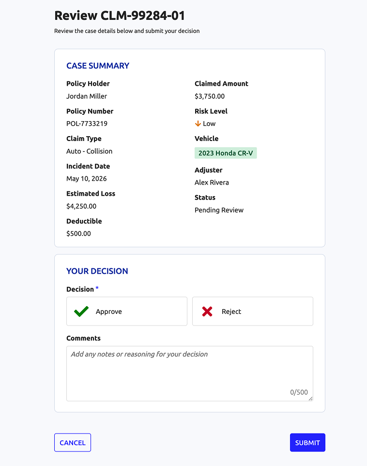

```sail
a!localVariables(
  local!caseSummary: {
    policyHolder: "Jordan Miller",
    policyNumber: "POL-7733219",
    claimType: "Auto - Collision",
    incidentDate: date(2026, 5, 10),
    estimatedLoss: a!currency("USD", 4250),
    deductible: a!currency("USD", 500),
    claimedAmount: a!currency("USD", 3750),
    riskLevel: "Low",
    vehicle: "2023 Honda CR-V",
    adjuster: "Alex Rivera",
    status: "Pending Review"
  },
  local!decision,
  local!comments: null,
  a!formLayout(
    contents: {
      a!cardLayout(
        contents: {
          a!headingField(
            text: upper("Case Summary"),
            headingTag: "H2",
            marginAbove: "EVEN_LESS",
            size: "SMALL",
            color: "#152B99",
            fontWeight: "SEMI_BOLD"
          ),
          a!columnsLayout(
            columns: {
              a!columnLayout(
                contents: {
                  a!textField(
                    label: "Policy Holder",
                    labelPosition: "ABOVE",
                    value: local!caseSummary.policyHolder,
                    readOnly: true
                  ),
                  a!textField(
                    label: "Policy Number",
                    labelPosition: "ABOVE",
                    value: local!caseSummary.policyNumber,
                    readOnly: true
                  ),
                  a!textField(
                    label: "Claim Type",
                    labelPosition: "ABOVE",
                    value: local!caseSummary.claimType,
                    readOnly: true
                  ),
                  a!dateField(
                    label: "Incident Date",
                    labelPosition: "ABOVE",
                    value: local!caseSummary.incidentDate,
                    readOnly: true
                  ),
                  a!textField(
                    label: "Estimated Loss",
                    labelPosition: "ABOVE",
                    value: local!caseSummary.estimatedLoss,
                    readOnly: true
                  ),
                  a!textField(
                    label: "Deductible",
                    labelPosition: "ABOVE",
                    value: local!caseSummary.deductible,
                    readOnly: true
                  ),

                }
              ),
              a!columnLayout(
                contents: {
                  a!textField(
                    label: "Claimed Amount",
                    labelPosition: "ABOVE",
                    value: local!caseSummary.claimedAmount,
                    readOnly: true
                  ),
                  a!richTextDisplayField(
                    label: "Risk Level",
                    labelPosition: "ABOVE",
                    value: {
                      a!richTextIcon(icon: "arrow-down", color: "#CC7600"),
                      " ",
                      a!richTextItem(text: local!caseSummary.riskLevel, )
                    }
                  ),
                  a!tagField(
                    size: "STANDARD",
                    label: "Vehicle",
                    labelPosition: "ABOVE",
                    tags: {
                      a!tagItem(
                        text: local!caseSummary.vehicle,
                        backgroundColor: "#D4EDDA",
                        textColor: "#0F5132"
                      )
                    }
                  ),
                  a!textField(
                    label: "Adjuster",
                    labelPosition: "ABOVE",
                    value: local!caseSummary.adjuster,
                    readOnly: true
                  ),
                  a!textField(
                    label: "Status",
                    labelPosition: "ABOVE",
                    value: local!caseSummary.status,
                    readOnly: true
                  ),

                }
              )
            }
          ),

        },
        marginBelow: "STANDARD",
        height: "AUTO",
        style: "NONE",
        borderColor: "#D6DCE8",
        padding: "STANDARD",
        shape: "ROUNDED"
      ),
      a!cardLayout(
        contents: {
          a!headingField(
            text: upper("your decision"),
            headingTag: "H2",
            marginAbove: "EVEN_LESS",
            size: "SMALL",
            color: "#152B99",
            fontWeight: "SEMI_BOLD"
          ),
          a!cardChoiceField(
            label: "Decision",
            data: {
              a!map(
                id: 1,
                icon: "check",
                primaryText: "Approve",
                color: "POSITIVE"
              ),
              a!map(
                id: 2,
                icon: "times",
                primaryText: "Reject",
                color: "NEGATIVE"
              )
            },
            value: local!decision,
            saveInto: { local!decision },
            cardTemplate: a!cardTemplateBarTextStacked(
              id: fv!data.id,
              primaryText: fv!data.primaryText,
              secondaryText: fv!data.secondaryText,
              icon: fv!data.icon,
              iconColor: fv!data.color
            ),
            required: true,
            validations: {},
            maxSelections: 1,
            marginBelow: "LESS"
          ),
          a!paragraphField(
            label: "Comments",
            labelPosition: "ABOVE",
            placeholder: "Add any notes or reasoning for your decision",
            value: local!comments,
            saveInto: local!comments,
            required: tointeger(local!decision) = 2,
            characterLimit: 500,
            showCharacterCount: true,
            marginAbove: "LESS",
            marginBelow: "EVEN_LESS"
          )
        },
        marginBelow: "STANDARD",
        height: "AUTO",
        style: "NONE",
        borderColor: "#D6DCE8",
        padding: "STANDARD",
        shape: "ROUNDED"
      )
    },
    buttons: a!buttonLayout(
      primaryButtons: {
        a!buttonWidget(
          label: "Submit",
          submit: true,
          loadingIndicator: true,
          style: "SOLID"
        )
      },
      secondaryButtons: {
        a!buttonWidget(
          label: "Cancel",
          value: true,
          saveInto: {},
          validate: false,
          submit: true,
          style: "OUTLINE"
        )
      }
    ),
    titleBar: a!headerTemplateSimple(
      title: "Review CLM-99284-01",
      secondaryText: "Review the case details below and submit your decision",
      titleColor: "STANDARD"
    ),
    backgroundColor: "#F8F9FC",
    showTitleBarDivider: false
  )
)
```

## Displaying read-only details

Use these patterns when read-only information is important for successful completion of a form.

### Sidebar for decoration

Use this pattern to add visual interest to simple forms. Show decorative images and supplemental information in the sidebar.

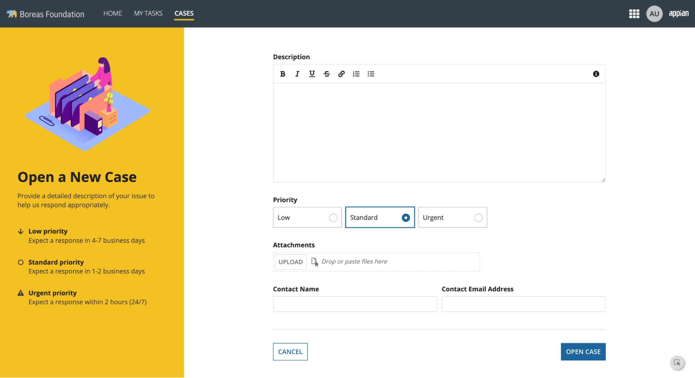

```sail
a!localVariables(
  local!additionalContents: {
    a!map(
      icon: "arrow-down",
      primaryText: "Low priority",
      secondaryText: "Expect a response in 4-7 business days"
    ),
    a!map(
      icon: "circle-o",
      primaryText: "Standard priority",
      secondaryText: "Expect a response in 1-2 business days"
    ),
    a!map(
      icon: "exclamation-triangle",
      primaryText: "Urgent priority",
      secondaryText: "Expect a response within 2 hours (24/7)"
    )
  },
  a!formLayout(
    titleBar: a!sidebarTemplate(
      title: "Open a New Case",
      secondaryText: "Provide a detailed description of your issue to help us respond appropriately.",
      secondaryTextColor: "#3B3B3B",
      backgroundColor: "#f5c024",
      image: a!documentImage(
        document: a!EXAMPLE_TITLE_BAR_IMAGE()
      ),
      imageSize: "MEDIUM_PLUS",
      additionalContents: {
        a!forEach(
          items: local!additionalContents,
          expression: {
            a!sideBySideLayout(
              items: {
                a!sideBySideItem(
                  item: a!richTextDisplayField(
                    labelPosition: "COLLAPSED",
                    value: a!richTextIcon(icon: fv!item.icon, color: "#3B3B3B")
                  ),
                  width: "MINIMIZE"
                ),
                a!sideBySideItem(
                  item: a!richTextDisplayField(
                    labelPosition: "COLLAPSED",
                    value: {
                      a!richTextItem(
                        text: fv!item.primaryText,
                        style: "STRONG"
                      ),
                      char(10),
                      a!richTextItem(
                        text: fv!item.secondaryText,
                        color: "#3B3B3B"
                      )
                    }
                  ),
                  width: "MINIMIZE"
                )
              },
              marginAbove: if(fv!isFirst, "STANDARD", ""),
              marginBelow: "MORE"
            )
          }
        )
      }
    ),
    contents: {
      a!styledTextEditorField(
        label: "Description",
        sizeLimit: 4000,
        marginBelow: "MORE"
      ),
      a!radioButtonField(
        label: "Priority",
        choiceLabels: { "Low", "Standard", "Urgent" },
        choiceValues: { 1, 2, 3 },
        value: 2,
        choiceLayout: "COMPACT",
        choiceStyle: "CARDS",
        marginBelow: "MORE"
      ),
      a!fileUploadField(label: "Attachments", marginBelow: "MORE"),
      a!sideBySideLayout(
        items: {
          a!sideBySideItem(
            item: a!textField(label: "Contact Name", )
          ),
          a!sideBySideItem(
            item: a!textField(
              label: "Contact Email Address",
              inputPurpose: "EMAIL"
            )
          )
        },
        marginBelow: "STANDARD"
      )
    },
    contentsWidth: "MEDIUM",
    focusOnFirstInput: false,
    showButtonDivider: true,
    buttons: a!buttonLayout(
      primaryButtons: {
        a!buttonWidget(label: "Open Case", style: "SOLID")
      },
      secondaryButtons: {
        a!buttonWidget(label: "Cancel", style: "OUTLINE")
      }
    )
  )
)
```

### Sidebar for contextual information (simple)

Use this pattern to show useful context for task completion. Even with a simpler layout without images or cards, you can still have a visually appealing form. Note that when a sidebar is used for reference information, you should often position it on the right side of the page for languages read left-to-right. This preserves the main focus on the actionable part of the form.

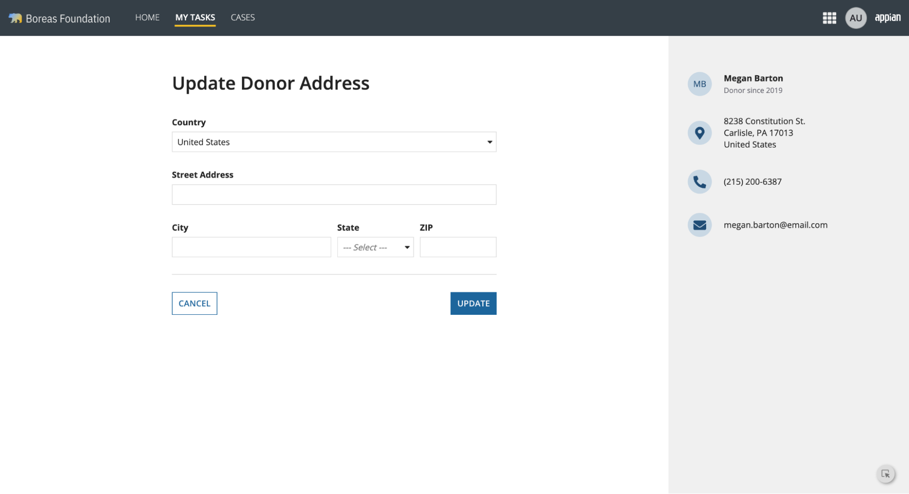

```sail
a!localVariables(
  local!donorInfo: a!map(
    name: "Megan Barton",
    role: "Donor since 2019",
    streetAddress: "8238 Constitution St.",
    city: "Carlisle",
    state: "PA",
    zipCode: "17013",
    country: "United States",
    phone: "(215) 200-6387",
    email: "megan.barton@email.com"
  ),
  a!paneLayout(
    panes: {
      a!pane(
        contents: {
          a!columnsLayout(
            columns: {
              a!columnLayout(),
              a!columnLayout(
                contents: {
                  a!headingField(
                    text: "Update Donor Address",
                    size: "LARGE",
                    headingTag: "H1",
                    fontWeight: "SEMI_BOLD",
                    marginBelow: "MORE"
                  ),
                  a!dropdownField(
                    choiceLabels: { "United States" },
                    choiceValues: { 1 },
                    label: "Country",
                    placeholder: "--- " & "Select" & " ---",
                    value: 1,
                    marginBelow: "MORE",
                    marginAbove: "STANDARD"
                  ),
                  a!textField(
                    label: "Street Address",
                    marginBelow: "MORE",
                    inputPurpose: "STREET_ADDRESS"
                  ),
                  a!columnsLayout(
                    columns: {
                      a!columnLayout(contents: { a!textField(label: "City") }),
                      a!columnLayout(
                        contents: {
                          a!columnsLayout(
                            columns: {
                              a!columnLayout(
                                contents: {
                                  a!dropdownField(
                                    choiceLabels: { "Option 1", "Option 2", "Option 3" },
                                    choiceValues: { 1, 2, 3 },
                                    label: "State",
                                    placeholder: "--- " & "Select" & " ---"
                                  )
                                }
                              ),
                              a!columnLayout(contents: { a!textField(label: "ZIP") })
                            },
                            spacing: "DENSE",
                            stackWhen: "NEVER"
                          )
                        }
                      )
                    },
                    marginBelow: "MORE",
                    spacing: "DENSE",
                    stackWhen: { "TABLET_PORTRAIT", "PHONE" }
                  ),
                  a!horizontalLine(marginBelow: "MORE"),
                  a!buttonLayout(
                    primaryButtons: a!buttonWidget(label: "Update", style: "SOLID"),
                    secondaryButtons: a!buttonWidget(label: "Cancel")
                  )
                },
                width: "MEDIUM_PLUS"
              ),
              a!columnLayout()
            },
            spacing: "NONE",
            marginAbove: "MORE"
          )
        },
        padding: "MORE"
      ),
      a!pane(
        contents: {
          a!sectionLayout(
            contents: {
              a!sideBySideLayout(
                items: {
                  a!sideBySideItem(
                    item: a!stampField(
                      labelPosition: "COLLAPSED",
                      text: initials(local!donorInfo.name),
                      backgroundColor: "#C9D8E4",
                      contentColor: "#1F4C75",
                      size: "TINY",
                      
                    ),
                    width: "MINIMIZE"
                  ),
                  a!sideBySideItem(
                    item: a!richTextDisplayField(
                      labelPosition: "COLLAPSED",
                      value: {
                        a!richTextItem(
                          text: local!donorInfo.name,
                          style: "STRONG"
                        ),
                        char(10),
                        a!richTextItem(
                          text: local!donorInfo.role,
                          color: "#6C6C75",
                          size: "SMALL"
                        )
                      }
                    ),
                    width: ""
                  )
                },
                alignVertical: "MIDDLE",
                spacing: "SPARSE",
                marginBelow: "MORE"
              ),
              a!sideBySideLayout(
                items: {
                  a!sideBySideItem(
                    item: a!stampField(
                      labelPosition: "COLLAPSED",
                      icon: "map-marker",
                      backgroundColor: "#C9D8E4",
                      contentColor: "#1F4C75",
                      size: "TINY",
                      accessibilityText: "Current Address"
                    ),
                    width: "MINIMIZE"
                  ),
                  a!sideBySideItem(
                    item: a!richTextDisplayField(
                      labelPosition: "COLLAPSED",
                      value: {
                        local!donorInfo.streetAddress,
                        char(10),
                        local!donorInfo.city,
                        ", ",
                        local!donorInfo.state,
                        " ",
                        local!donorInfo.zipCode,
                        char(10),
                        local!donorInfo.country
                      },
                      marginBelow: "NONE"
                    )
                  )
                },
                alignVertical: "MIDDLE",
                spacing: "SPARSE",
                marginAbove: "EVEN_LESS",
                marginBelow: "MORE"
              ),
              a!sideBySideLayout(
                items: {
                  a!sideBySideItem(
                    item: a!stampField(
                      labelPosition: "COLLAPSED",
                      icon: "phone",
                      backgroundColor: "#C9D8E4",
                      contentColor: "#1F4C75",
                      size: "TINY",
                      accessibilityText: "Phone"
                    ),
                    width: "MINIMIZE"
                  ),
                  a!sideBySideItem(
                    item: a!richTextDisplayField(
                      labelPosition: "COLLAPSED",
                      value: local!donorInfo.phone,
                      marginBelow: "NONE"
                    )
                  )
                },
                alignVertical: "MIDDLE",
                spacing: "SPARSE",
                marginAbove: "EVEN_LESS",
                marginBelow: "MORE"
              ),
              a!sideBySideLayout(
                items: {
                  a!sideBySideItem(
                    item: a!stampField(
                      labelPosition: "COLLAPSED",
                      icon: "envelope",
                      backgroundColor: "#C9D8E4",
                      contentColor: "#1F4C75",
                      size: "TINY",
                      marginBelow: "NONE",
                      accessibilityText: "Email"
                    ),
                    width: "MINIMIZE"
                  ),
                  a!sideBySideItem(
                    item: a!richTextDisplayField(
                      labelPosition: "COLLAPSED",
                      value: local!donorInfo.email,
                      marginBelow: "NONE"
                    )
                  )
                },
                alignVertical: "MIDDLE",
                spacing: "SPARSE",
                marginAbove: "EVEN_LESS",
                marginBelow: "NONE"
              )
            },
            marginAbove: "MORE"
          )
        },
        width: "MEDIUM",
        backgroundColor: "#f0f0f0",
        padding: "MORE"
      )
    },
    showPaneDividers: false
  )
)
```

### Sidebar for contact information and FAQs

The following pattern uses a sidebar to display contact information and links to some FAQs.

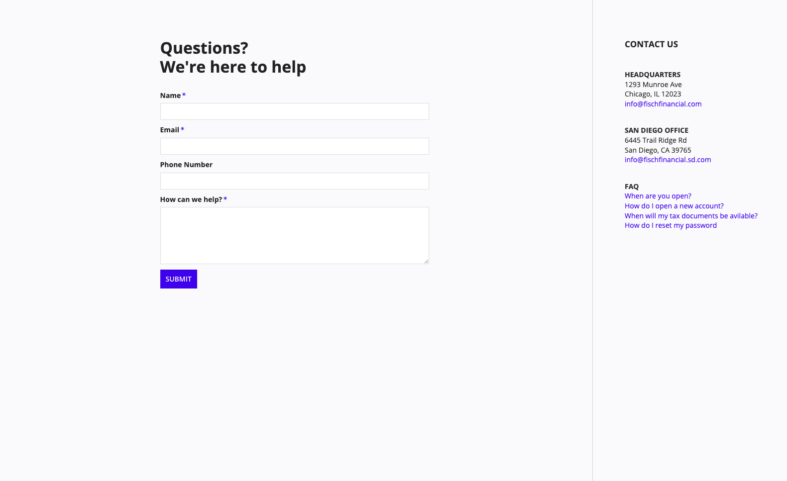

```sail
a!paneLayout(
  panes: {
    a!pane(
      contents: {
        {
          a!columnsLayout(
            columns: {
              a!columnLayout(width: "AUTO"),
              a!columnLayout(
                contents: {
                  a!richTextDisplayField(
                    value: {
                      a!richTextItem(
                        text: "Questions?",
                        style: "STRONG",
                        size: "LARGE"
                      ),
                      char(10),
                      a!richTextItem(
                        text: "We're here to help",
                        style: "STRONG",
                        size: "LARGE"
                      )
                    },
                    marginBelow: "MORE",

                  ),
                  /* Replace these inputs with the component or rule that should populate this step */
                  a!textField(
                    label: "Name",
                    inputPurpose: "NAME",
                    required: true
                  ),
                  a!textField(
                    label: "Email",
                    inputPurpose: "EMAIL",
                    required: true
                  ),
                  a!textField(
                    label: "Phone Number",
                    inputPurpose: "PHONE_NUMBER"
                  ),
                  a!paragraphField(label: "How can we help?", required: true),
                  a!buttonArrayLayout(
                    buttons: a!buttonWidget(label: "SUBMIT", style: "SOLID"),
                    align: "START",
                    marginBelow: "NONE"
                  )
                },
                width: "MEDIUM_PLUS"
              ),
              a!columnLayout(width: "AUTO"),

            },
            alignVertical: "TOP",
            spacing: "NONE",
            marginAbove: "EVEN_MORE"
          )
        }
      },
      width: "AUTO",
      backgroundColor: "#fafafc"
    ),
    a!pane(
      contents: {
        a!columnsLayout(
          marginAbove: "EVEN_MORE",
          columns: {
            a!columnLayout(
              width: "AUTO"
            ),
            a!columnLayout(
              contents: {
                a!richTextDisplayField(
                  value: {
                    a!richTextItem(text: "CONTACT US", style: "STRONG", size:"MEDIUM"),
                    char(10), char(10), char(10),
                    a!richTextItem(text: "HEADQUARTERS", style: "STRONG"),
                    char(10),
                    a!richTextItem(
                      text: {
                        "1293 Munroe Ave",
                        char(10),
                        "Chicago, IL 12023"
                      }
                    ),
                    char(10),
                    a!richTextItem(
                      text: "info@fischfinancial.com",
                      color: "ACCENT"
                    )
                  },
                  marginBelow: "MORE"
                ),
                a!richTextDisplayField(
                  value: {
                    a!richTextItem(text: "SAN DIEGO OFFICE", style: "STRONG"),
                    char(10),
                    a!richTextItem(
                      text: {
                        "6445 Trail Ridge Rd",
                        char(10),
                        "San Diego, CA 39765"
                      }
                    ),
                    char(10),
                    a!richTextItem(
                      text: "info@fischfinancial.sd.com",
                      color: "ACCENT"
                    )
                  },
                  marginBelow: "MORE"
                ),
                a!richTextDisplayField(
                  value: {
                    a!richTextItem(text: "FAQ", style: "STRONG"),
                    char(10),
                    a!richTextItem(
                      text: "When are you open?",
                      color: "ACCENT"
                    ),
                    char(10),
                    a!richTextItem(
                      text: "How do I open a new account?",
                      color: "ACCENT"
                    ),
                    char(10),
                    a!richTextItem(
                      text: "When will my tax documents be avilable?",
                      color: "ACCENT"
                    ),
                    char(10),
                    a!richTextItem(
                      text: "How do I reset my password",
                      color: "ACCENT"
                    )
                  },
                  marginBelow: "MORE"
                )
              },
              width: "NARROW_PLUS"
            ),
            a!columnLayout(
              width: "AUTO"
            ),
          }
        )
      },
      width: "MEDIUM",
      backgroundColor: "#fafafc"
    ),

  }
)
```

### Sidebar for eligibility information

The following pattern uses a sidebar to explain who is eligible to order fishing licenses.

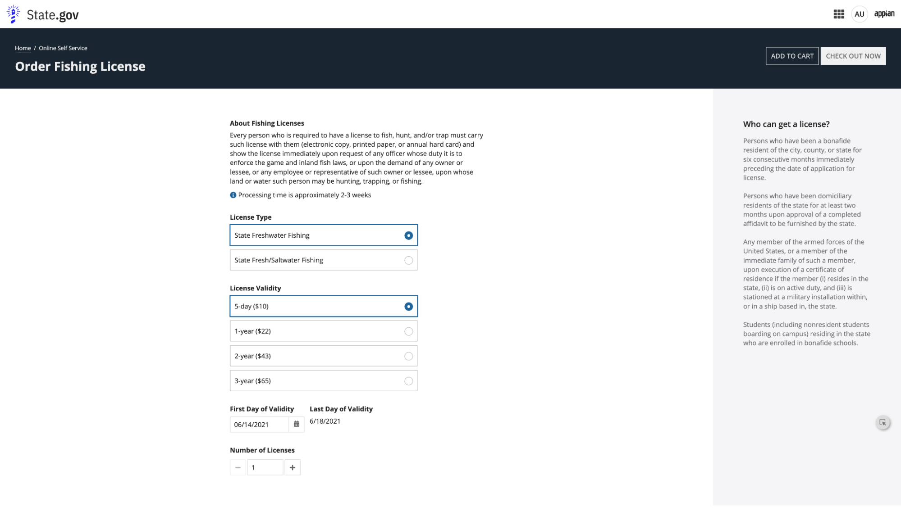

```sail
a!localVariables(
  local!currentNodeId: 2,
  local!nodes: a!forEach(
    items: enumerate(local!currentNodeId) + 1,
    expression: choose(
      fv!item,
      a!map(name: "Home", identifier: 1),
      a!map(
        name: "Online Self Service",
        identifier: 2
      )
    )
  ),
  a!formLayout(
    titleBar: {
      a!cardLayout(
        contents: {
          a!columnsLayout(
            columns: {
              a!columnLayout(
                contents: {
                  a!richTextDisplayField(
                    labelPosition: "COLLAPSED",
                    value: {
                      a!forEach(
                        items: local!nodes,
                        expression: if(
                          fv!isLast,
                          a!richTextItem(text: fv!item.name, size: "SMALL"),
                          {
                            a!richTextItem(
                              text: fv!item.name,
                              link: a!dynamicLink(
                                value: fv!item.identifier,
                                saveInto: local!currentNodeId
                              ),
                              color: "#FFF",
                              size: "SMALL"
                            ),
                            a!richTextItem(text: "  /  ", color: "", size: "SMALL")
                          }
                        )
                      )
                    }
                  ),
                  a!headingField(
                    text: "Order Fishing License",
                    size: "MEDIUM_PLUS",
                    headingTag: "H1",
                    fontWeight: "BOLD",
                    marginAbove: "EVEN_LESS",
                    marginBelow: "NONE"
                  )
                }
              ),
              a!columnLayout(
                contents: {
                  a!buttonArrayLayout(
                    buttons: {
                      a!buttonWidget(
                        label: "Add to Cart",
                        style: "OUTLINE",
                        color: "SECONDARY"
                      ),
                      a!buttonWidget(
                        label: "Check Out Now",
                        style: "SOLID",
                        color: "SECONDARY"
                      )
                    },
                    align: "END"
                  )
                }
              )
            },
            alignVertical: "MIDDLE"
          )
        },
        style: "#1A2530",
        padding: "MORE",
        marginAbove: "NONE",
        marginBelow: "NONE",
        showBorder: false()
      )
    },
    contents: {
      if(
        a!isPageWidth({ "PHONE", "TABLET_PORTRAIT" }),
        /* Optimized for mobile and small screens */
        a!columnsLayout(
          columns: {
            a!columnLayout(
              contents: a!cardLayout(
                contents: {
                  a!headingField(
                    text: "Who can get a license?",
                    size: "SMALL",
                    headingTag: "H2",
                    fontWeight: "SEMI_BOLD"
                  ),
                  a!richTextDisplayField(
                    labelPosition: "COLLAPSED",
                    value: {
                      a!richTextItem(
                        text: {
                          "Persons who have been a bonafide resident of the city, county, or state for six consecutive months immediately preceding the date of application for license.",
                          repeat(2, char(10)),
                          "Persons who have been domiciliary residents of the state for at least two months upon approval of a completed affidavit to be furnished by the state.",
                          repeat(2, char(10)),
                          "Any member of the armed forces of the United States, or a member of the immediate family of such a member, upon execution of a certificate of residence if the member (i) resides in the state, (ii) is on active duty, and (iii) is stationed at a military installation within, or in a ship based in, the state.",
                          repeat(2, char(10)),
                          "Students (including nonresident students boarding on campus) residing in the state who are enrolled in bonafide schools."
                        },
                        color: "#6C6C75"
                      )
                    }
                  )
                },
                style: "#F5F5F7",
                padding: "STANDARD",
                showBorder: false(),
                marginBelow: "MORE"
              )
            ),
            a!columnLayout(
              contents: {
                a!richTextDisplayField(
                  label: "About Fishing Licenses",
                  labelPosition: "ABOVE",
                  value: {
                    "Every person who is required to have a license to fish, hunt, and/or trap must carry such license with them (electronic copy, printed paper, or annual hard card) and show the license immediately upon request of any officer whose duty it is to enforce the game and inland fish laws, or upon the demand of any owner or lessee, or any employee or representative of such owner or lessee, upon whose land or water such person may be hunting, trapping, or fishing."
                  }
                ),
                a!richTextDisplayField(
                  labelPosition: "COLLAPSED",
                  value: {
                    a!richTextIcon(icon: "info-circle", color: "ACCENT"),
                    " Processing time is approximately 2-3 weeks"
                  },
                  marginBelow: "MORE"
                ),
                a!radioButtonField(
                  choiceLabels: {
                    "State Freshwater Fishing",
                    "State Fresh/Saltwater Fishing"
                  },
                  choiceValues: { 1, 2 },
                  label: "License Type",
                  labelPosition: "ABOVE",
                  value: 1,
                  saveInto: {},
                  choiceLayout: "STACKED",
                  choiceStyle: "CARDS",
                  validations: {},
                  marginBelow: "MORE"
                ),
                a!radioButtonField(
                  choiceLabels: {
                    "5-day ($10)",
                    "1-year ($22)",
                    "2-year ($43)",
                    "3-year ($65)"
                  },
                  choiceValues: { 1, 2, 3, 4 },
                  label: "License Validity",
                  labelPosition: "ABOVE",
                  value: 1,
                  saveInto: {},
                  choiceLayout: "STACKED",
                  choiceStyle: "CARDS",
                  validations: {},
                  marginBelow: "MORE"
                ),
                a!sideBySideLayout(
                  items: {
                    a!sideBySideItem(
                      item: a!dateField(
                        label: "First Day of Validity",
                        labelPosition: "ABOVE",
                        value: todate("6/14/2021"),
                        saveInto: {},
                        validations: {}
                      ),
                      width: "MINIMIZE"
                    ),
                    a!sideBySideItem(
                      item: a!richTextDisplayField(
                        label: "Last Day of Validity",
                        labelPosition: "ABOVE",
                        value: { "6/18/2021" }
                      )
                    )
                  },
                  marginBelow: "MORE"
                ),
                a!richTextDisplayField(
                  labelPosition: "COLLAPSED",
                  value: {
                    a!richTextItem(
                      text: { "Number of Licenses" },
                      style: { "STRONG" }
                    )
                  }
                ),
                a!sideBySideLayout(
                  items: {
                    a!sideBySideItem(
                      item: a!buttonArrayLayout(
                        buttons: {
                          a!buttonWidget(
                            label: "",
                            icon: "minus",
                            size: "SMALL",
                            style: "OUTLINE",
                            color: "SECONDARY",
                            disabled: true
                          )
                        },
                        align: "START"
                      ),
                      width: "MINIMIZE"
                    ),
                    a!sideBySideItem(
                      item: a!integerField(
                        label: "Quantity",
                        labelPosition: "COLLAPSED",
                        value: 1,
                        saveInto: {},
                        refreshAfter: "UNFOCUS",
                        validations: {},
                        marginBelow: "STANDARD"
                      ),
                      width: "MINIMIZE"
                    ),
                    a!sideBySideItem(
                      item: a!buttonArrayLayout(
                        buttons: {
                          a!buttonWidget(
                            label: "",
                            icon: "plus",
                            size: "SMALL",
                            style: "OUTLINE",
                            color: "SECONDARY",
                            disabled: false
                          )
                        },
                        align: "START"
                      ),
                      width: "MINIMIZE"
                    )
                  },
                  alignVertical: "MIDDLE",
                  spacing: "DENSE"
                )
              },
              width: "MEDIUM_PLUS"
            )
          },
          stackWhen: { "PHONE", "TABLET_PORTRAIT" }
        ),
        /* Pane layout for non-mobile interfaces */
        a!paneLayout(
          panes: {
            a!pane(
              contents: {
                a!columnsLayout(
                  columns: {
                    a!columnLayout(),
                    a!columnLayout(
                      contents: {
                        a!richTextDisplayField(
                          label: "About Fishing Licenses",
                          labelPosition: "ABOVE",
                          value: {
                            "Every person who is required to have a license to fish, hunt, and/or trap must carry such license with them (electronic copy, printed paper, or annual hard card) and show the license immediately upon request of any officer whose duty it is to enforce the game and inland fish laws, or upon the demand of any owner or lessee, or any employee or representative of such owner or lessee, upon whose land or water such person may be hunting, trapping, or fishing."
                          }
                        ),
                        a!richTextDisplayField(
                          labelPosition: "COLLAPSED",
                          value: {
                            a!richTextIcon(icon: "info-circle", color: "ACCENT"),
                            " Processing time is approximately 2-3 weeks"
                          },
                          marginBelow: "MORE"
                        ),
                        a!radioButtonField(
                          choiceLabels: {
                            "State Freshwater Fishing",
                            "State Fresh/Saltwater Fishing"
                          },
                          choiceValues: { 1, 2 },
                          label: "License Type",
                          labelPosition: "ABOVE",
                          value: 1,
                          saveInto: {},
                          choiceLayout: "STACKED",
                          choiceStyle: "CARDS",
                          validations: {},
                          marginBelow: "MORE"
                        ),
                        a!radioButtonField(
                          choiceLabels: {
                            "5-day ($10)",
                            "1-year ($22)",
                            "2-year ($43)",
                            "3-year ($65)"
                          },
                          choiceValues: { 1, 2, 3, 4 },
                          label: "License Validity",
                          labelPosition: "ABOVE",
                          value: 1,
                          saveInto: {},
                          choiceLayout: "STACKED",
                          choiceStyle: "CARDS",
                          validations: {},
                          marginBelow: "MORE"
                        ),
                        a!sideBySideLayout(
                          items: {
                            a!sideBySideItem(
                              item: a!dateField(
                                label: "First Day of Validity",
                                labelPosition: "ABOVE",
                                value: todate("6/14/2021"),
                                saveInto: {},
                                validations: {}
                              ),
                              width: "MINIMIZE"
                            ),
                            a!sideBySideItem(
                              item: a!richTextDisplayField(
                                label: "Last Day of Validity",
                                labelPosition: "ABOVE",
                                value: { "6/18/2021" }
                              )
                            )
                          },
                          marginBelow: "MORE"
                        ),
                        a!richTextDisplayField(
                          labelPosition: "COLLAPSED",
                          value: {
                            a!richTextItem(
                              text: { "Number of Licenses" },
                              style: { "STRONG" }
                            )
                          }
                        ),
                        a!columnsLayout(
                          columns: {
                            a!columnLayout(
                              contents: {
                                a!sideBySideLayout(
                                  items: {
                                    a!sideBySideItem(
                                      item: a!buttonArrayLayout(
                                        buttons: {
                                          a!buttonWidget(
                                            label: "",
                                            icon: "minus",
                                            size: "SMALL",
                                            style: "OUTLINE",
                                            color: "SECONDARY",
                                            disabled: true
                                          )
                                        },
                                        align: "START",
                                        marginBelow: "NONE"
                                      ),
                                      width: "MINIMIZE"
                                    ),
                                    a!sideBySideItem(
                                      item: a!integerField(
                                        label: "Quantity",
                                        labelPosition: "COLLAPSED",
                                        value: 1,
                                        saveInto: {},
                                        refreshAfter: "UNFOCUS",
                                        validations: {}
                                      )
                                    ),
                                    a!sideBySideItem(
                                      item: a!buttonArrayLayout(
                                        buttons: {
                                          a!buttonWidget(
                                            label: "",
                                            icon: "plus",
                                            size: "SMALL",
                                            style: "OUTLINE",
                                            color: "SECONDARY",
                                            disabled: false
                                          )
                                        },
                                        align: "START",
                                        marginBelow: "NONE"
                                      ),
                                      width: "MINIMIZE"
                                    )
                                  },
                                  alignVertical: "MIDDLE",
                                  spacing: "DENSE"
                                )
                              },
                              width: "NARROW"
                            ),
                            a!columnLayout(width: "MEDIUM_PLUS")
                          }
                        )
                      },
                      width: "MEDIUM_PLUS"
                    ),
                    a!columnLayout()
                  }
                )
              },
              padding: "EVEN_MORE"
            ),
            a!pane(
              contents: {
                a!headingField(
                  text: "Who can get a license?",
                  size: "SMALL",
                  headingTag: "H2",
                  fontWeight: "SEMI_BOLD"
                ),
                a!richTextDisplayField(
                  labelPosition: "COLLAPSED",
                  value: {
                    a!richTextItem(
                      text: {
                        "Persons who have been a bonafide resident of the city, county, or state for six consecutive months immediately preceding the date of application for license.",
                        repeat(2, char(10)),
                        "Persons who have been domiciliary residents of the state for at least two months upon approval of a completed affidavit to be furnished by the state.",
                        repeat(2, char(10)),
                        "Any member of the armed forces of the United States, or a member of the immediate family of such a member, upon execution of a certificate of residence if the member (i) resides in the state, (ii) is on active duty, and (iii) is stationed at a military installation within, or in a ship based in, the state.",
                        repeat(2, char(10)),
                        "Students (including nonresident students boarding on campus) residing in the state who are enrolled in bonafide schools."
                      },
                      color: "#6C6C75"
                    )
                  }
                )
              },
              width: "MEDIUM",
              backgroundColor: "#F5F5F7",
              padding: "EVEN_MORE"
            )
          },
          showPaneDividers: false
        )
      )
    },
    focusOnFirstInput: false()
  )
)
```

### Sidebar for whole-form, contextual information

For sidebars with contextual information that contain actionable options that affect the whole form, place them on the left.


```sail
a!headerContentLayout(
  header: {
    a!cardLayout(
      contents: {},
      height: "AUTO",
      showWhen: a!isPageWidth(
        {
          "DESKTOP_NARROW",
          "DESKTOP",
          "DESKTOP_WIDE"
        }
      ),
      style: "#f8f6f0",
      padding: "STANDARD",
      marginBelow: "NONE",
      showBorder: false
    )
  },
  contents: {
    a!columnsLayout(
      columns: {
        a!columnLayout(contents: {}),
        a!columnLayout(
          contents: {
            a!imageField(
              label: "",
              labelPosition: "COLLAPSED",
              /* This is a placeholder image; replace as needed */
              images: {
                a!documentImage(
                  document: a!EXAMPLE_DOCUMENT_IMAGE(),
                  altText: "ESG World 2023 Logo"
                )
              },
              size: if(
                a!isPageWidth(
                  {
                    "TABLET_LANDSCAPE",
                    "TABLET_PORTRAIT",
                    "PHONE"
                  }
                ),
                "MEDIUM",
                "FIT"
              ),
              isThumbnail: false,
              style: "STANDARD",
              align: if(
                a!isPageWidth(
                  {
                    "TABLET_LANDSCAPE",
                    "TABLET_PORTRAIT",
                    "PHONE"
                  }
                ),
                "START",
                "CENTER"
              ),
              marginAbove: "LESS",
              marginBelow: "MORE"
            ),
            a!dropdownField(
              label: "Select Language",
              labelPosition: "COLLAPSED",
              placeholder: "",
              choiceLabels: {
                "ENGLISH",
                "简体中文",
                "हिन्दी",
                "ESPAÑOL",
                "FRANÇAIS",
                "العربية",
                "DEUTSCHE",
                "日本語"
              },
              choiceValues: { 1, 2, 3, 4, 5, 6, 7, 8 },
              value: 1,
              saveInto: {},
              searchDisplay: "AUTO",
              showWhen: a!isPageWidth({ "PHONE", "TABLET_PORTRAIT" }),
              validations: {}
            ),
            a!richTextDisplayField(
              labelPosition: "COLLAPSED",
              value: {
                "ESG World 2023 is the most important global gathering of advocates and thought leaders on ",
                a!richTextItem(
                  text: { "Environmental" },
                  style: { "STRONG" }
                ),
                ", ",
                a!richTextItem(text: { "Social" }, style: { "STRONG" }),
                ", and ",
                a!richTextItem(text: { "Governance" }, style: { "STRONG" }),
                " topics."
              },
              marginAbove: "STANDARD",
              marginBelow: "EVEN_MORE"
            ),
            a!sideBySideLayout(
              items: {
                a!sideBySideItem(
                  item: a!richTextDisplayField(
                    labelPosition: "COLLAPSED",
                    value: {
                      a!richTextItem(
                        text: { "ENGLISH" },
                        link: a!dynamicLink(),
                        linkStyle: "STANDALONE",
                        color: "#111111",
                        style: { "STRONG", "UNDERLINE" }
                      )
                    }
                  ),
                  width: "MINIMIZE"
                ),
                a!sideBySideItem(
                  item: a!richTextDisplayField(
                    labelPosition: "COLLAPSED",
                    value: {
                      a!richTextItem(
                        text: { "简体中文" },
                        link: a!dynamicLink(),
                        linkStyle: "STANDALONE",
                        color: "#111111"
                      )
                    }
                  ),
                  width: "MINIMIZE"
                ),
                a!sideBySideItem(
                  item: a!richTextDisplayField(
                    labelPosition: "COLLAPSED",
                    value: {
                      a!richTextItem(
                        text: { "हिन्दी" },
                        link: a!dynamicLink(),
                        linkStyle: "STANDALONE",
                        color: "#111111"
                      )
                    }
                  ),
                  width: "MINIMIZE"
                ),
                a!sideBySideItem(
                  item: a!richTextDisplayField(
                    labelPosition: "COLLAPSED",
                    value: {
                      a!richTextItem(
                        text: { "ESPAÑOL" },
                        link: a!dynamicLink(),
                        linkStyle: "STANDALONE",
                        color: "#111111"
                      )
                    }
                  ),
                  width: "MINIMIZE"
                ),
                a!sideBySideItem(
                  item: a!richTextDisplayField(
                    labelPosition: "COLLAPSED",
                    value: {
                      a!richTextItem(
                        text: { "FRANÇAIS" },
                        link: a!dynamicLink(),
                        linkStyle: "STANDALONE",
                        color: "#111111"
                      )
                    }
                  ),
                  width: "MINIMIZE"
                ),
                a!sideBySideItem(
                  item: a!richTextDisplayField(
                    labelPosition: "COLLAPSED",
                    value: {
                      a!richTextItem(
                        text: { "العربية" },
                        link: a!dynamicLink(),
                        linkStyle: "STANDALONE",
                        color: "#111111"
                      )
                    }
                  ),
                  width: "MINIMIZE"
                ),
                a!sideBySideItem(
                  item: a!richTextDisplayField(
                    labelPosition: "COLLAPSED",
                    value: {
                      a!richTextItem(
                        text: { "DEUTSCHE" },
                        link: a!dynamicLink(),
                        linkStyle: "STANDALONE",
                        color: "#111111"
                      )
                    }
                  ),
                  width: "MINIMIZE"
                ),
                a!sideBySideItem(
                  item: a!richTextDisplayField(
                    labelPosition: "COLLAPSED",
                    value: {
                      a!richTextItem(
                        text: { "日本語" },
                        link: a!dynamicLink(),
                        linkStyle: "STANDALONE",
                        color: "#111111"
                      )
                    }
                  ),
                  width: "MINIMIZE"
                ),
                a!sideBySideItem()
              },
              showWhen: not(
                a!isPageWidth({ "PHONE", "TABLET_PORTRAIT" })
              ),
              spacing: "SPARSE",
              stackWhen: {
                "DESKTOP_WIDE",
                "DESKTOP",
                "DESKTOP_NARROW"
              }
            )
          },
          width: "NARROW_PLUS"
        ),
        a!columnLayout(contents: {}, width: "EXTRA_NARROW"),
        a!columnLayout(
          contents: {
            a!sectionLayout(
              label: "REGISTER NOW",
              labelSize: "LARGE",
              labelHeadingTag: "H1",
              labelColor: "STANDARD",
              contents: {
                a!richTextDisplayField(
                  labelPosition: "COLLAPSED",
                  value: {
                    "Registration is free of charge for this year's virtual conference"
                  },
                  marginBelow: "STANDARD"
                )
              },
              divider: "BELOW",
              marginAbove: "STANDARD",
              marginBelow: "MORE"
            ),
            a!sectionLayout(
              label: "YOUR DETAILS",
              labelSize: "SMALL",
              labelHeadingTag: "H2",
              labelColor: "STANDARD",
              contents: {
                a!columnsLayout(
                  columns: {
                    a!columnLayout(
                      contents: {
                        a!textField(
                          label: "First Name",
                          labelPosition: "ABOVE",
                          saveInto: {},
                          refreshAfter: "UNFOCUS",
                          validations: {}
                        )
                      }
                    ),
                    a!columnLayout(
                      contents: {
                        a!textField(
                          label: "Last Name",
                          labelPosition: "ABOVE",
                          saveInto: {},
                          refreshAfter: "UNFOCUS",
                          validations: {}
                        )
                      }
                    )
                  },
                  marginAbove: "STANDARD",
                  marginBelow: "STANDARD",
                  stackWhen: { "PHONE" }
                ),
                a!columnsLayout(
                  columns: {
                    a!columnLayout(
                      contents: {
                        a!textField(
                          label: "Email Address",
                          labelPosition: "ABOVE",
                          saveInto: {},
                          refreshAfter: "UNFOCUS",
                          validations: {}
                        )
                      }
                    ),
                    a!columnLayout(
                      contents: {
                        a!dropdownField(
                          label: "Country",
                          labelPosition: "ABOVE",
                          placeholder: "--- Select country of residence ---",
                          choiceLabels: {
                            "Afghanistan",
                            "Åland Islands",
                            "Albania",
                            "Algeria",
                            "American Samoa",
                            "Andorra",
                            "Angola",
                            "Anguilla",
                            "Antarctica",
                            "Antigua and Barbuda",
                            "Argentina",
                            "Armenia",
                            "Aruba",
                            "Australia",
                            "Austria",
                            "Azerbaijan",
                            "Bahamas",
                            "Bahrain",
                            "Bangladesh",
                            "Barbados",
                            "Belarus",
                            "Belgium",
                            "Belize",
                            "Benin",
                            "Bermuda",
                            "Bhutan",
                            "Bolivia",
                            "Bosnia and Herzegovina",
                            "Botswana",
                            "Bouvet Island",
                            "Brazil",
                            "British Indian Ocean Territory",
                            "Brunei Darussalam",
                            "Bulgaria",
                            "Burkina Faso",
                            "Burundi",
                            "Cambodia",
                            "Cameroon",
                            "Canada",
                            "Cape Verde",
                            "Cayman Islands",
                            "Central African Republic",
                            "Chad",
                            "Chile",
                            "China",
                            "Christmas Island",
                            "Cocos (Keeling) Islands",
                            "Colombia",
                            "Comoros",
                            "Congo",
                            "Congo, The Democratic Republic of The",
                            "Cook Islands",
                            "Costa Rica",
                            "Cote D'ivoire",
                            "Croatia",
                            "Cuba",
                            "Cyprus",
                            "Czech Republic",
                            "Denmark",
                            "Djibouti",
                            "Dominica",
                            "Dominican Republic",
                            "Ecuador",
                            "Egypt",
                            "El Salvador",
                            "Equatorial Guinea",
                            "Eritrea",
                            "Estonia",
                            "Ethiopia",
                            "Falkland Islands (Malvinas)",
                            "Faroe Islands",
                            "Fiji",
                            "Finland",
                            "France",
                            "French Guiana",
                            "French Polynesia",
                            "French Southern Territories",
                            "Gabon",
                            "Gambia",
                            "Georgia",
                            "Germany",
                            "Ghana",
                            "Gibraltar",
                            "Greece",
                            "Greenland",
                            "Grenada",
                            "Guadeloupe",
                            "Guam",
                            "Guatemala",
                            "Guernsey",
                            "Guinea",
                            "Guinea-bissau",
                            "Guyana",
                            "Haiti",
                            "Heard Island and Mcdonald Islands",
                            "Holy See (Vatican City State)",
                            "Honduras",
                            "Hong Kong",
                            "Hungary",
                            "Iceland",
                            "India",
                            "Indonesia",
                            "Iran, Islamic Republic of",
                            "Iraq",
                            "Ireland",
                            "Isle of Man",
                            "Israel",
                            "Italy",
                            "Jamaica",
                            "Japan",
                            "Jersey",
                            "Jordan",
                            "Kazakhstan",
                            "Kenya",
                            "Kiribati",
                            "Korea, Democratic People's Republic of",
                            "Korea, Republic of",
                            "Kuwait",
                            "Kyrgyzstan",
                            "Lao People's Democratic Republic",
                            "Latvia",
                            "Lebanon",
                            "Lesotho",
                            "Liberia",
                            "Libyan Arab Jamahiriya",
                            "Liechtenstein",
                            "Lithuania",
                            "Luxembourg",
                            "Macao",
                            "Macedonia, The Former Yugoslav Republic of",
                            "Madagascar",
                            "Malawi",
                            "Malaysia",
                            "Maldives",
                            "Mali",
                            "Malta",
                            "Marshall Islands",
                            "Martinique",
                            "Mauritania",
                            "Mauritius",
                            "Mayotte",
                            "Mexico",
                            "Micronesia, Federated States of",
                            "Moldova, Republic of",
                            "Monaco",
                            "Mongolia",
                            "Montenegro",
                            "Montserrat",
                            "Morocco",
                            "Mozambique",
                            "Myanmar",
                            "Namibia",
                            "Nauru",
                            "Nepal",
                            "Netherlands",
                            "Netherlands Antilles",
                            "New Caledonia",
                            "New Zealand",
                            "Nicaragua",
                            "Niger",
                            "Nigeria",
                            "Niue",
                            "Norfolk Island",
                            "Northern Mariana Islands",
                            "Norway",
                            "Oman",
                            "Pakistan",
                            "Palau",
                            "Palestinian Territory, Occupied",
                            "Panama",
                            "Papua New Guinea",
                            "Paraguay",
                            "Peru",
                            "Philippines",
                            "Pitcairn",
                            "Poland",
                            "Portugal",
                            "Puerto Rico",
                            "Qatar",
                            "Reunion",
                            "Romania",
                            "Russia",
                            "Rwanda",
                            "Saint Helena",
                            "Saint Kitts and Nevis",
                            "Saint Lucia",
                            "Saint Pierre and Miquelon",
                            "Saint Vincent and The Grenadines",
                            "Samoa",
                            "San Marino",
                            "Sao Tome and Principe",
                            "Saudi Arabia",
                            "Senegal",
                            "Serbia",
                            "Seychelles",
                            "Sierra Leone",
                            "Singapore",
                            "Slovakia",
                            "Slovenia",
                            "Solomon Islands",
                            "Somalia",
                            "South Africa",
                            "South Georgia and The South Sandwich Islands",
                            "Spain",
                            "Sri Lanka",
                            "Sudan",
                            "Suriname",
                            "Svalbard and Jan Mayen",
                            "Eswatini",
                            "Sweden",
                            "Switzerland",
                            "Syrian Arab Republic",
                            "Taiwan (ROC)",
                            "Tajikistan",
                            "Tanzania, United Republic of",
                            "Thailand",
                            "Timor-leste",
                            "Togo",
                            "Tokelau",
                            "Tonga",
                            "Trinidad and Tobago",
                            "Tunisia",
                            "Turkey",
                            "Turkmenistan",
                            "Turks and Caicos Islands",
                            "Tuvalu",
                            "Uganda",
                            "Ukraine",
                            "United Arab Emirates",
                            "United Kingdom",
                            "United States",
                            "United States Minor Outlying Islands",
                            "Uruguay",
                            "Uzbekistan",
                            "Vanuatu",
                            "Venezuela",
                            "Vietnam",
                            "Virgin Islands, British",
                            "Virgin Islands, U.S.",
                            "Wallis and Futuna",
                            "Western Sahara",
                            "Yemen",
                            "Zambia",
                            "Zimbabwe"
                          },
                          choiceValues: {
                            "Afghanistan",
                            "Åland Islands",
                            "Albania",
                            "Algeria",
                            "American Samoa",
                            "Andorra",
                            "Angola",
                            "Anguilla",
                            "Antarctica",
                            "Antigua and Barbuda",
                            "Argentina",
                            "Armenia",
                            "Aruba",
                            "Australia",
                            "Austria",
                            "Azerbaijan",
                            "Bahamas",
                            "Bahrain",
                            "Bangladesh",
                            "Barbados",
                            "Belarus",
                            "Belgium",
                            "Belize",
                            "Benin",
                            "Bermuda",
                            "Bhutan",
                            "Bolivia",
                            "Bosnia and Herzegovina",
                            "Botswana",
                            "Bouvet Island",
                            "Brazil",
                            "British Indian Ocean Territory",
                            "Brunei Darussalam",
                            "Bulgaria",
                            "Burkina Faso",
                            "Burundi",
                            "Cambodia",
                            "Cameroon",
                            "Canada",
                            "Cape Verde",
                            "Cayman Islands",
                            "Central African Republic",
                            "Chad",
                            "Chile",
                            "China",
                            "Christmas Island",
                            "Cocos (Keeling) Islands",
                            "Colombia",
                            "Comoros",
                            "Congo",
                            "Congo, The Democratic Republic of The",
                            "Cook Islands",
                            "Costa Rica",
                            "Cote D'ivoire",
                            "Croatia",
                            "Cuba",
                            "Cyprus",
                            "Czech Republic",
                            "Denmark",
                            "Djibouti",
                            "Dominica",
                            "Dominican Republic",
                            "Ecuador",
                            "Egypt",
                            "El Salvador",
                            "Equatorial Guinea",
                            "Eritrea",
                            "Estonia",
                            "Ethiopia",
                            "Falkland Islands (Malvinas)",
                            "Faroe Islands",
                            "Fiji",
                            "Finland",
                            "France",
                            "French Guiana",
                            "French Polynesia",
                            "French Southern Territories",
                            "Gabon",
                            "Gambia",
                            "Georgia",
                            "Germany",
                            "Ghana",
                            "Gibraltar",
                            "Greece",
                            "Greenland",
                            "Grenada",
                            "Guadeloupe",
                            "Guam",
                            "Guatemala",
                            "Guernsey",
                            "Guinea",
                            "Guinea-bissau",
                            "Guyana",
                            "Haiti",
                            "Heard Island and Mcdonald Islands",
                            "Holy See (Vatican City State)",
                            "Honduras",
                            "Hong Kong",
                            "Hungary",
                            "Iceland",
                            "India",
                            "Indonesia",
                            "Iran, Islamic Republic of",
                            "Iraq",
                            "Ireland",
                            "Isle of Man",
                            "Israel",
                            "Italy",
                            "Jamaica",
                            "Japan",
                            "Jersey",
                            "Jordan",
                            "Kazakhstan",
                            "Kenya",
                            "Kiribati",
                            "Korea, Democratic People's Republic of",
                            "Korea, Republic of",
                            "Kuwait",
                            "Kyrgyzstan",
                            "Lao People's Democratic Republic",
                            "Latvia",
                            "Lebanon",
                            "Lesotho",
                            "Liberia",
                            "Libyan Arab Jamahiriya",
                            "Liechtenstein",
                            "Lithuania",
                            "Luxembourg",
                            "Macao",
                            "Macedonia, The Former Yugoslav Republic of",
                            "Madagascar",
                            "Malawi",
                            "Malaysia",
                            "Maldives",
                            "Mali",
                            "Malta",
                            "Marshall Islands",
                            "Martinique",
                            "Mauritania",
                            "Mauritius",
                            "Mayotte",
                            "Mexico",
                            "Micronesia, Federated States of",
                            "Moldova, Republic of",
                            "Monaco",
                            "Mongolia",
                            "Montenegro",
                            "Montserrat",
                            "Morocco",
                            "Mozambique",
                            "Myanmar",
                            "Namibia",
                            "Nauru",
                            "Nepal",
                            "Netherlands",
                            "Netherlands Antilles",
                            "New Caledonia",
                            "New Zealand",
                            "Nicaragua",
                            "Niger",
                            "Nigeria",
                            "Niue",
                            "Norfolk Island",
                            "Northern Mariana Islands",
                            "Norway",
                            "Oman",
                            "Pakistan",
                            "Palau",
                            "Palestinian Territory, Occupied",
                            "Panama",
                            "Papua New Guinea",
                            "Paraguay",
                            "Peru",
                            "Philippines",
                            "Pitcairn",
                            "Poland",
                            "Portugal",
                            "Puerto Rico",
                            "Qatar",
                            "Reunion",
                            "Romania",
                            "Russia",
                            "Rwanda",
                            "Saint Helena",
                            "Saint Kitts and Nevis",
                            "Saint Lucia",
                            "Saint Pierre and Miquelon",
                            "Saint Vincent and The Grenadines",
                            "Samoa",
                            "San Marino",
                            "Sao Tome and Principe",
                            "Saudi Arabia",
                            "Senegal",
                            "Serbia",
                            "Seychelles",
                            "Sierra Leone",
                            "Singapore",
                            "Slovakia",
                            "Slovenia",
                            "Solomon Islands",
                            "Somalia",
                            "South Africa",
                            "South Georgia and The South Sandwich Islands",
                            "Spain",
                            "Sri Lanka",
                            "Sudan",
                            "Suriname",
                            "Svalbard and Jan Mayen",
                            "Eswatini",
                            "Sweden",
                            "Switzerland",
                            "Syrian Arab Republic",
                            "Taiwan (ROC)",
                            "Tajikistan",
                            "Tanzania, United Republic of",
                            "Thailand",
                            "Timor-leste",
                            "Togo",
                            "Tokelau",
                            "Tonga",
                            "Trinidad and Tobago",
                            "Tunisia",
                            "Turkey",
                            "Turkmenistan",
                            "Turks and Caicos Islands",
                            "Tuvalu",
                            "Uganda",
                            "Ukraine",
                            "United Arab Emirates",
                            "United Kingdom",
                            "United States",
                            "United States Minor Outlying Islands",
                            "Uruguay",
                            "Uzbekistan",
                            "Vanuatu",
                            "Venezuela",
                            "Vietnam",
                            "Virgin Islands, British",
                            "Virgin Islands, U.S.",
                            "Wallis and Futuna",
                            "Western Sahara",
                            "Yemen",
                            "Zambia",
                            "Zimbabwe"
                          },
                          saveInto: {},
                          searchDisplay: "AUTO",
                          validations: {}
                        )
                      }
                    )
                  },
                  marginAbove: "STANDARD",
                  marginBelow: "STANDARD",
                  stackWhen: { "PHONE" }
                ),
                a!columnsLayout(
                  columns: {
                    a!columnLayout(
                      contents: {
                        a!textField(
                          label: "Organization Name",
                          labelPosition: "ABOVE",
                          saveInto: {},
                          refreshAfter: "UNFOCUS",
                          validations: {}
                        )
                      }
                    ),
                    a!columnLayout(
                      contents: {
                        a!textField(
                          label: "Job Title",
                          labelPosition: "ABOVE",
                          saveInto: {},
                          refreshAfter: "UNFOCUS",
                          validations: {}
                        )
                      }
                    )
                  },
                  marginAbove: "STANDARD",
                  marginBelow: "STANDARD",
                  stackWhen: { "PHONE" }
                )
              }
            ),
            a!cardLayout(
              contents: {
                a!sectionLayout(
                  label: "YOUR INTERESTS",
                  labelSize: "SMALL",
                  labelHeadingTag: "H3",
                  labelColor: "STANDARD",
                  contents: {
                    a!columnsLayout(
                      columns: {
                        a!columnLayout(
                          contents: {
                            a!checkboxField(
                              label: "",
                              labelPosition: "COLLAPSED",
                              choiceLabels: { "Climate change and carbon emissions" },
                              choiceValues: { 1 },
                              saveInto: {},
                              validations: {}
                            )
                          }
                        ),
                        a!columnLayout(
                          contents: {
                            a!checkboxField(
                              label: "",
                              labelPosition: "COLLAPSED",
                              choiceLabels: { "Air and water pollution" },
                              choiceValues: { 1 },
                              saveInto: {},
                              validations: {}
                            )
                          }
                        )
                      },
                      marginAbove: "STANDARD",
                      marginBelow: "STANDARD",
                      stackWhen: { "PHONE" }
                    ),
                    a!columnsLayout(
                      columns: {
                        a!columnLayout(
                          contents: {
                            a!checkboxField(
                              label: "",
                              labelPosition: "COLLAPSED",
                              choiceLabels: { "Biodiversity" },
                              choiceValues: { 1 },
                              saveInto: {},
                              validations: {}
                            )
                          }
                        ),
                        a!columnLayout(
                          contents: {
                            a!checkboxField(
                              label: "",
                              labelPosition: "COLLAPSED",
                              choiceLabels: { "Deforestation" },
                              choiceValues: { 1 },
                              saveInto: {},
                              validations: {}
                            )
                          }
                        )
                      },
                      marginAbove: "STANDARD",
                      marginBelow: "STANDARD",
                      stackWhen: { "PHONE" }
                    ),
                    a!columnsLayout(
                      columns: {
                        a!columnLayout(
                          contents: {
                            a!checkboxField(
                              label: "",
                              labelPosition: "COLLAPSED",
                              choiceLabels: { "Energy efficiency" },
                              choiceValues: { 1 },
                              saveInto: {},
                              validations: {}
                            )
                          }
                        ),
                        a!columnLayout(
                          contents: {
                            a!checkboxField(
                              label: "",
                              labelPosition: "COLLAPSED",
                              choiceLabels: { "Water scarcity" },
                              choiceValues: { 1 },
                              saveInto: {},
                              validations: {}
                            )
                          }
                        )
                      },
                      marginAbove: "STANDARD",
                      marginBelow: "STANDARD",
                      stackWhen: { "PHONE" }
                    ),
                    a!columnsLayout(
                      columns: {
                        a!columnLayout(
                          contents: {
                            a!checkboxField(
                              label: "",
                              labelPosition: "COLLAPSED",
                              choiceLabels: { "Community relations" },
                              choiceValues: { 1 },
                              saveInto: {},
                              validations: {}
                            )
                          }
                        ),
                        a!columnLayout(
                          contents: {
                            a!checkboxField(
                              label: "",
                              labelPosition: "COLLAPSED",
                              choiceLabels: { "Gender and diversity" },
                              choiceValues: { 1 },
                              saveInto: {},
                              validations: {}
                            )
                          }
                        )
                      },
                      marginAbove: "STANDARD",
                      marginBelow: "STANDARD",
                      stackWhen: { "PHONE" }
                    ),
                    a!columnsLayout(
                      columns: {
                        a!columnLayout(
                          contents: {
                            a!checkboxField(
                              label: "",
                              labelPosition: "COLLAPSED",
                              choiceLabels: { "Data protection and privacy" },
                              choiceValues: { 1 },
                              saveInto: {},
                              validations: {}
                            )
                          }
                        ),
                        a!columnLayout(
                          contents: {
                            a!checkboxField(
                              label: "",
                              labelPosition: "COLLAPSED",
                              choiceLabels: { "Labor standards" },
                              choiceValues: { 1 },
                              saveInto: {},
                              validations: {}
                            )
                          }
                        )
                      },
                      marginAbove: "STANDARD",
                      marginBelow: "STANDARD",
                      stackWhen: { "PHONE" }
                    )
                  }
                )
              },
              height: "AUTO",
              style: "#f2ede1",
              padding: "STANDARD",
              marginAbove: "STANDARD",
              marginBelow: "STANDARD",
              showBorder: false,
              decorativeBarColor: "#1d659c"
            ),
            a!buttonArrayLayout(
              buttons: {
                a!buttonWidget(
                  label: "Register",
                  icon: "arrow-right",
                  style: "SOLID"
                )
              },
              align: "END",
              marginAbove: "STANDARD"
            )
          },
          width: "WIDE"
        ),
        a!columnLayout(contents: {})
      },
      stackWhen: {
        "PHONE",
        "TABLET_PORTRAIT",
        "TABLET_LANDSCAPE"
      }
    )
  },
  backgroundColor: "#f8f6f0"
)
```

### Sidebar with contextual form pane

The following pattern uses a sidebar header template with a pane layout. This can work well if you know your users will be working on relatively wide monitors, but you will want to adjust the design for smaller screen sizes.

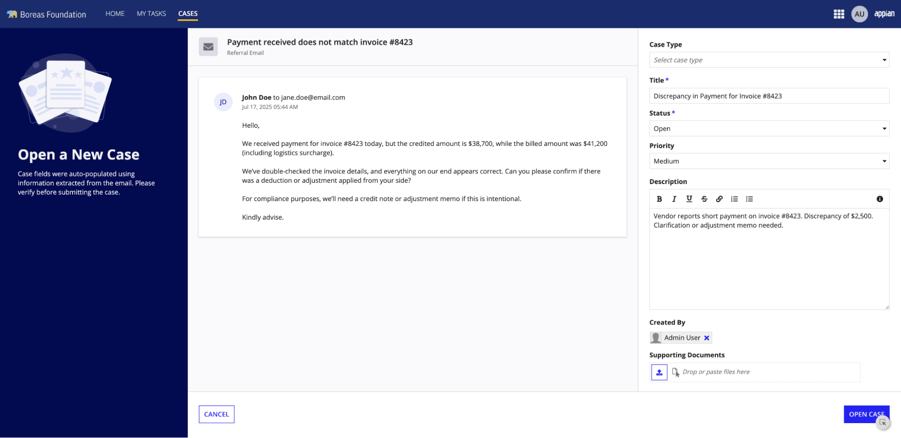

```sail
a!formLayout(
  titleBar: a!sidebarTemplate(
    title: "Open a New Case",
    secondaryText: "Case fields were auto-populated using information extracted from the email. Please verify before submitting the case.
",
    backgroundColor: "#020A50",
    image: a!documentImage(document: a!EXAMPLE_TITLE_BAR_IMAGE())
  ),
  showTitleBarDivider: false,
  contents: {
    a!paneLayout(
      panes: {
        a!pane(
          contents: {
            a!cardLayout(
              contents: {
                a!columnsLayout(
                  columns: {
                    a!columnLayout(
                      contents: {
                        a!stampField(
                          labelPosition: "COLLAPSED",
                          size: "TINY",
                          icon: "ENVELOPE",
                          shape: "SEMI_ROUNDED",
                          backgroundColor: "#DCDCE5",
                          contentColor: "#6C6C75"
                        )
                      },
                      width: "EXTRA_NARROW"
                    ),
                    a!columnLayout(
                      contents: {
                        a!headingField(
                          text: "Payment received does not match invoice #8423",
                          size: "SMALL",
                          fontWeight: "SEMI_BOLD",
                          marginBelow: "NONE"
                        ),
                        a!richTextDisplayField(
                          labelPosition: "COLLAPSED",
                          value: a!richTextItem(
                            text: "Referral Email",
                            size: "SMALL",
                            color: "#6C6C75"
                          )
                        )
                      }
                    )
                  },
                  alignVertical: "MIDDLE",
                  spacing: "NONE"
                )
              },
              style: "TRANSPARENT",
              showBorder: false,
              padding: "STANDARD"
            ),
            a!horizontalLine(marginBelow: "LESS"),
            a!cardLayout(
              contents: {
                a!cardLayout(
                  contents: {
                    a!columnsLayout(
                      columns: {
                        a!columnLayout(
                          contents: a!stampField(
                            labelPosition: "COLLAPSED",
                            size: "TINY",
                            text: "JD",
                            backgroundColor: "#E9EDFC",
                            contentColor: "#08088D"
                          ),
                          width: "EXTRA_NARROW"
                        ),
                        a!columnLayout(
                          contents: a!richTextDisplayField(
                            labelPosition: "COLLAPSED",
                            value: {
                              a!richTextItem(text: "John Doe", style: "STRONG"),
                              " ",
                              a!richTextItem(text: "to jane.doe@email.com"),
                              char(10),
                              a!richTextItem(
                                text: concat(
                                  text(today(), "mmm dd, yyyy"),
                                  " ",
                                  text(now(), "hh:mm AM/PM")
                                ),
                                color: "#6C6C75",
                                size: "SMALL"
                              )
                            }
                          )
                        )
                      },
                      alignVertical: "MIDDLE",
                      spacing: "NONE"
                    ),
                    a!columnsLayout(
                      columns: {
                        a!columnLayout(width: "EXTRA_NARROW"),
                        a!columnLayout(
                          contents: a!richTextDisplayField(
                            labelPosition: "COLLAPSED",
                            value: a!richTextItem(
                              text: {
                                "Hello,",
                                repeat(2, char(10)),
                                "We received payment for invoice #8423 today, but the credited amount is $38,700, while the billed amount was $41,200 (including logistics surcharge).",
                                repeat(2, char(10)),
                                "We’ve double-checked the invoice details, and everything on our end appears correct. Can you please confirm if there was a deduction or adjustment applied from your side?",
                                repeat(2, char(10)),
                                "For compliance purposes, we’ll need a credit note or adjustment memo if this is intentional.",
                                repeat(2, char(10)),
                                "Kindly advise."
                              }
                            )
                          )
                        )
                      },
                      spacing: "NONE",
                      marginAbove: "STANDARD"
                    )
                  },
                  padding: "MORE",
                  showBorder: false,
                  showShadow: true
                )
              },
              style: "TRANSPARENT",
              showBorder: false,
              padding: "STANDARD"
            )
          },
          backgroundColor: "#FAFAFC",
          padding: "NONE"
        ),
        a!pane(
          contents: {
            a!dropdownField(
              choiceLabels: {
                "Question",
                "Incident",
                "Problem",
                "Feature Request",
                "Refund"
              },
              choiceValues: { 1, 2, 3, 4, 5 },
              label: "Case Type",
              placeholder: "Select case type",
              marginAbove: "LESS"
            ),
            a!textField(
              label: "Title",
              required: true(),
              value: "Discrepancy in Payment for Invoice #8423",
              marginAbove: "LESS"
            ),
            a!dropdownField(
              label: "Status",
              choiceLabels: { "Open", "Pending", "Resolved", "Closed" },
              choiceValues: { 1, 2, 3, 4 },
              value: 1,
              placeholder: "Select Status",
              required: true
            ),
            a!dropdownField(
              label: "Priority",
              choiceLabels: { "Critical", "High", "Medium", "Low" },
              choiceValues: { 1, 2, 3, 4 },
              value: 3,
              placeholder: "Select Priority"
            ),
            a!styledTextEditorField(
              label: "Description",
              sizeLimit: 4000,
              value: "Vendor reports short payment on invoice #8423. Discrepancy of $2,500. Clarification or adjustment memo needed.",
              marginAbove: "LESS"
            ),
            a!pickerFieldUsers(
              label: "Created By",
              maxSelections: 1,
              value: loggedInUser(),
              marginAbove: "LESS"
            ),
            a!fileUploadField(
              label: "Supporting Documents",
              buttonDisplay: "ICON",
              buttonStyle: "STANDARD"
            )
          },
          padding: "STANDARD",
          width: "MEDIUM_PLUS"
        )
      }
    )
  },
  focusOnFirstInput: false,
  buttons: a!buttonLayout(
    primaryButtons: {
      a!buttonWidget(label: "Open Case", style: "SOLID")
    },
    secondaryButtons: {
      a!buttonWidget(label: "Cancel", style: "OUTLINE")
    }
  ),
  showButtonDivider: true()
)
```
