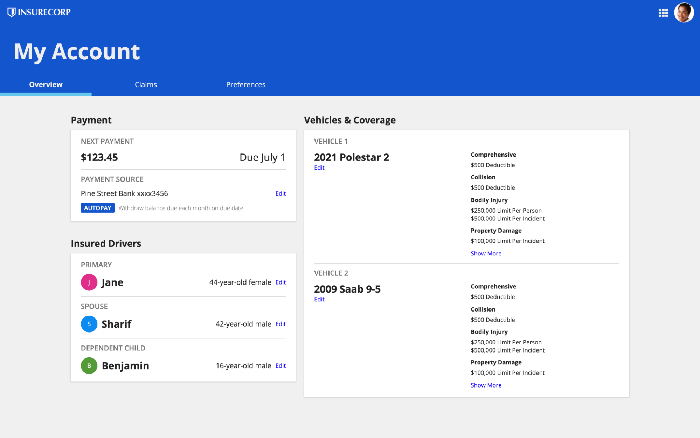
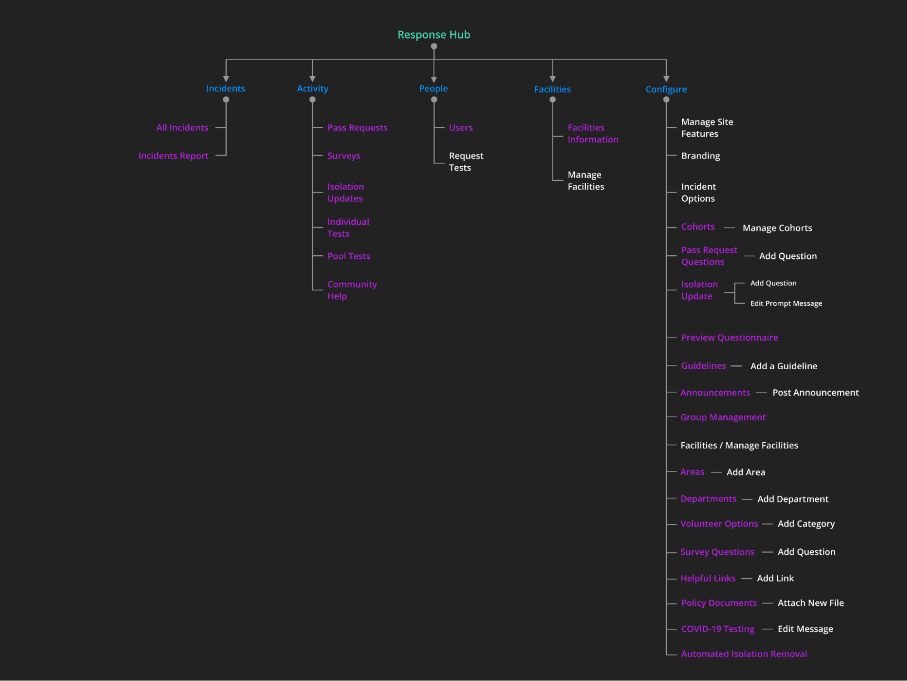
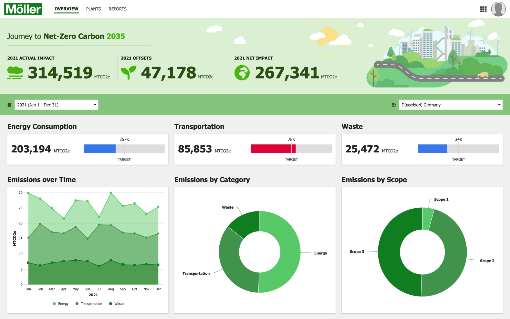
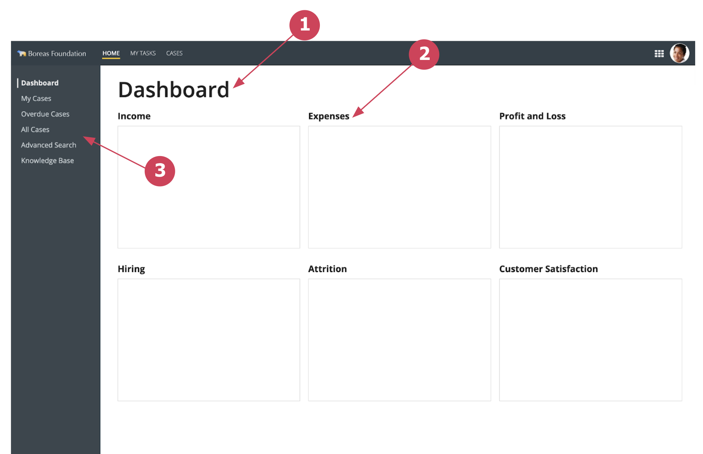
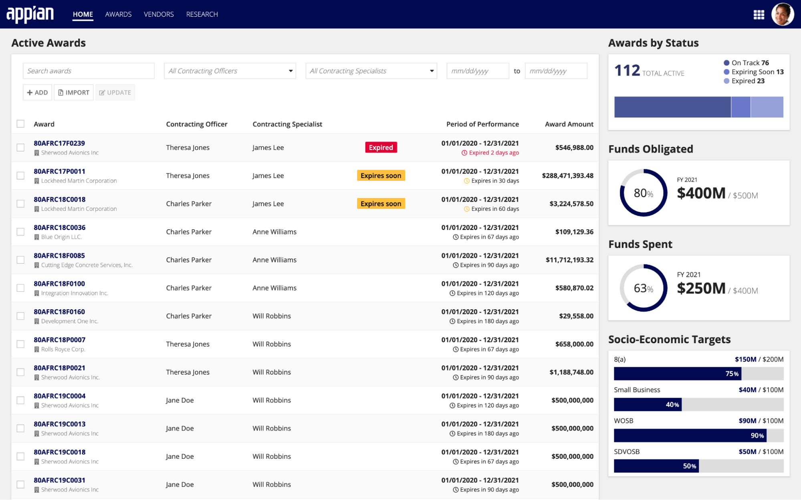

# How to Use Patterns [SAIL Design System: Patterns]

*Section: patterns | source: https://docs.appian.com/suite/help/26.7/sail/introduction.html | images referenced live in corpus/images/*

# How to Use Patterns

## Overview

Patterns are designed to streamline the process of creating interfaces in Appian. They are made up of components and expressions and can include:

- SAIL code that can be copy, pasted, then edited to fit your use cases.

- Interface screenshots that can be recreated and used as templates.

- Component combinations that are readily available for drag-and-drop from the palette in design mode.

The patterns in the SAIL Design System are meant to be copied and pasted or used as templates for reference. Using patterns can make development faster, more consistent, and improve the overall quality of your applications.

## Start all of your designs by browsing for ideas and best practices

Consult this collection whenever you start a new project or begin work on a new UI design.

Look for patterns that correspond to your application needs. Even if you don't find an exact match, you may discover a useful starting point for part or all of your design.

## Use a top-down site map to facilitate project planning

Prior to starting development, sketch out a rough site map to understand the key UIs in your application.

Some questions to consider:

- Which sites will different user groups visit?

- Which top-level tabs will appear on each site?

- Which pages will feature secondary navigation?

- What will be the main content sections on each page?

- What types of information or actions will be shown in each page section?

Your detailed designs can, of course, evolve over time as you receive user feedback. Starting with a draft blueprint allows you to answer key questions up-front and that will positively impact the quality of your application.

## Choose the best design pattern for each page or component type

Identify the type of page that you're designing, such as a dashboard or form, and browse the relevant patterns to select the best one to use.

Do the same for each type of component, such as user list or activity timeline, on the page.

## Clearly express information hierarchy

Use clear and consistent techniques to show users where they are within a site and how content is organized on a page.

For example:

1. Display a descriptive page title. See Page Titles.

2. Select an appropriate style for identifying page content sections. See Content Structure.

3. Implement secondary navigation controls as needed. See Secondary Navigation.

## Aim for consistency across UIs

Consistency reduces user confusion while also streamlining development work.

Once you select a visual pattern for a given intent, use consistently across all pages in the application. For example, keep the title style for page content sections uniform throughout your application.

For even greater efficiency, enforce this standard across all applications in your organization.

## Create and maintain a patterns library for your project

Plan and standardize the categories of pages in your application. Instead of designing each UI independently, aim to reuse a consistent set of templates.

Find and copy relevant UI patterns in to serve as the starting point for your project templates.

Create and share reusable templates to be used as the foundation for all project UI development. Combine and extend the patterns that you find here to match your needs. Add data, logic, and functionality to turn each template into an easy-to-use UI building block.
