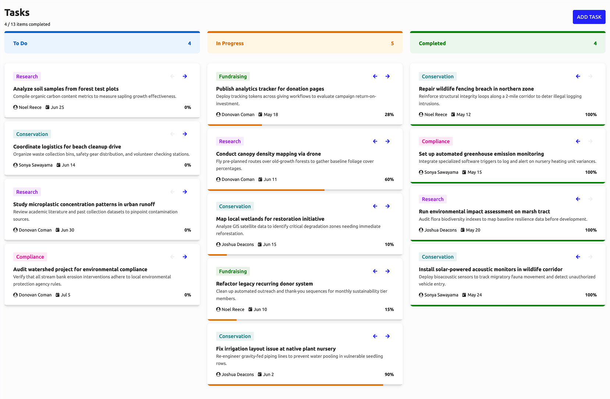
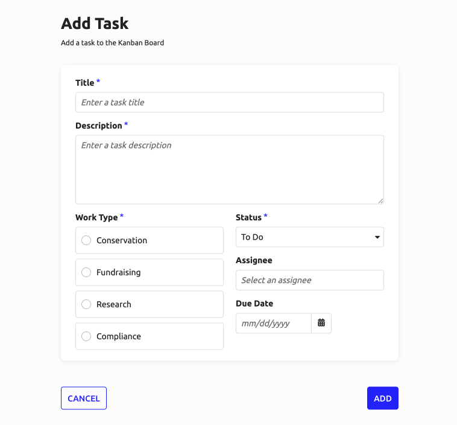

# Kanban Board [SAIL Design System: Patterns]

*Section: patterns | source: https://docs.appian.com/suite/help/26.7/sail/kanban.html | images referenced live in corpus/images/*

# Kanban Board

Use kanban patterns to give users a visual, column-based layout for tracking tasks across workflow stages.

## Kanban board

This pattern provides a visually engaging layout for tracking tasks across workflow stages. The board can be implemented as a standalone page or embedded as a tab within a larger dashboard. Each task card displays the work type, assignee, due date, and completion percentage, with arrow controls to move tasks between columns.



```sail
a!localVariables(
  /* work type references */
  local!workTypes: {
    a!map(id: 1, label: "Conservation", color: "#31808B"),
    a!map(id: 2, label: "Fundraising", color: "#117c00"),
    a!map(id: 3, label: "Research", color: "#962FEA"),
    a!map(id: 4, label: "Compliance", color: "#e21496")
  },
  local!items: {
    /* Todo Tasks */
    a!map(
      id: 1,
      workType: local!workTypes[3],
      statusId: 1,
      dueDate: date(2026, 6, 25),
      percentComplete: 0,
      assignee: "Noel Reece",
      title: "Analyze soil samples from forest test plots",
      description: "Compile organic carbon content metrics to measure sapling growth effectiveness."
    ),
    a!map(
      id: 2,
      workType: local!workTypes[1],
      statusId: 1,
      dueDate: date(2026, 6, 14),
      percentComplete: 0,
      assignee: "Sonya Sawayama",
      title: "Coordinate logistics for beach cleanup drive",
      description: "Organize waste collection bins, safety gear distribution, and volunteer checking stations."
    ),
    a!map(
      id: 3,
      workType: local!workTypes[3],
      statusId: 1,
      dueDate: date(2026, 6, 30),
      percentComplete: 0,
      assignee: "Donovan Coman",
      title: "Study microplastic concentration patterns in urban runoff",
      description: "Review academic literature and past collection datasets to pinpoint contamination sources."
    ),
    a!map(
      id: 4,
      workType: local!workTypes[4],
      statusId: 1,
      dueDate: date(2026, 7, 5),
      percentComplete: 0,
      assignee: "Donovan Coman",
      title: "Audit watershed project for environmental compliance",
      description: "Verify that all stream bank erosion interventions adhere to local environmental protection agency rules."
    ),
    /* In Progress Tasks */
    a!map(
      id: 5,
      workType: local!workTypes[2],
      statusId: 2,
      dueDate: date(2026, 5, 18),
      percentComplete: 28,
      assignee: "Donovan Coman",
      title: "Publish analytics tracker for donation pages",
      description: "Deploy tracking tokens across giving workflows to evaluate campaign return-on-investment."
    ),
    a!map(
      id: 6,
      workType: local!workTypes[3],
      statusId: 2,
      dueDate: date(2026, 6, 11),
      percentComplete: 60,
      assignee: "Donovan Coman",
      title: "Conduct canopy density mapping via drone",
      description: "Fly pre-planned routes over old-growth forests to gather baseline foliage cover percentages."
    ),
    a!map(
      id: 7,
      workType: local!workTypes[1],
      statusId: 2,
      dueDate: date(2026, 6, 15),
      percentComplete: 10,
      assignee: "Joshua Deacons",
      title: "Map local wetlands for restoration initiative",
      description: "Analyze GIS satellite data to identify critical degradation zones needing immediate reforestation."
    ),
    a!map(
      id: 8,
      workType: local!workTypes[2],
      statusId: 2,
      dueDate: date(2026, 6, 10),
      percentComplete: 15,
      assignee: "Noel Reece",
      title: "Refactor legacy recurring donor system",
      description: "Clean up automated outreach and thank-you sequences for monthly sustainability tier members."
    ),
    a!map(
      id: 9,
      workType: local!workTypes[1],
      statusId: 2,
      dueDate: date(2026, 6, 2),
      percentComplete: 90,
      assignee: "Joshua Deacons",
      title: "Fix irrigation layout issue at native plant nursery",
      description: "Re-engineer gravity-fed piping lines to prevent water pooling in vulnerable seedling rows."
    ),
    /* Completed Tasks */
    a!map(
      id: 10,
      workType: local!workTypes[1],
      statusId: 3,
      dueDate: date(2026, 5, 12),
      percentComplete: 100,
      assignee: "Noel Reece",
      title: "Repair wildlife fencing breach in northern zone",
      description: "Reinforce structural integrity loops along a 2-mile corridor to deter illegal logging intrusions."
    ),
    a!map(
      id: 11,
      workType: local!workTypes[4],
      statusId: 3,
      dueDate: date(2026, 5, 15),
      percentComplete: 100,
      assignee: "Sonya Sawayama",
      title: "Set up automated greenhouse emission monitoring",
      description: "Integrate specialized software triggers to log and alert on nursery heating unit variances."
    ),
    a!map(
      id: 12,
      workType: local!workTypes[3],
      statusId: 3,
      dueDate: date(2026, 5, 20),
      percentComplete: 100,
      assignee: "Joshua Deacons",
      title: "Run environmental impact assessment on marsh tract",
      description: "Audit flora biodiversity indexes to map baseline resilience data before development."
    ),
    a!map(
      id: 13,
      workType: local!workTypes[1],
      statusId: 3,
      dueDate: date(2026, 5, 24),
      percentComplete: 100,
      assignee: "Sonya Sawayama",
      title: "Install solar-powered acoustic monitors in wildlife corridor",
      description: "Deploy bioacoustic sensors to track migratory fauna movement and detect unauthorized vehicle entry."
    )
  },
  /* items grouped by status */
  local!todoItems: index(local!items, wherecontains(1, local!items.statusId), null),
  local!inProgressItems: index(local!items, wherecontains(2, local!items.statusId), null),
  local!completedItems: index(local!items, wherecontains(3, local!items.statusId), null),
  /* status references */
  local!statuses: {
    a!map(id: 1, label: "To Do", primaryColor: "#115EBB", secondaryColor: "#EBF4FF", items: local!todoItems),
    a!map(id: 2, label: "In Progress", primaryColor: "#CC7600", secondaryColor: "#FFF5E6", items: local!inProgressItems),
    a!map(id: 3, label: "Completed", primaryColor: "#117c00", secondaryColor: "#EDF7EE", items: local!completedItems)
  },
  a!headerContentLayout(
    isHeaderFixed: true,
    contentsPadding: "LESS",
    backgroundColor: "#FCFCFD",
    header: {
      /* FIXED KANBAN HEADERS */
      a!cardLayout(
        style: "#FCFCFD",
        showBorder: false,
        padding: "LESS",
        contents: {
          /* TITLE & ACTIONS */
          a!sideBySideLayout(
            alignVertical: "MIDDLE",
            marginAbove: "STANDARD",
            marginBelow: "STANDARD",
            items: {
              a!sideBySideItem(
                item: {
                  a!headingField(
                    text: "Tasks",
                    headingTag: "H1",
                    marginAbove: "NONE",
                    marginBelow: "NONE",
                    fontWeight: "BOLD"
                  ),
                  a!richTextDisplayField(
                    labelPosition: "COLLAPSED",
                    marginAbove: "EVEN_LESS",
                    marginBelow: "NONE",
                    value: {
                      a!richTextItem(
                        text: { count(local!completedItems), " / ", count(local!items), " items completed" },
                        size: "SMALL"
                      )
                    }
                  )
                }
              ),
              a!sideBySideItem(
                width: "MINIMIZE",
                item: a!buttonArrayLayout(
                  marginAbove: "NONE",
                  marginBelow: "NONE",
                  align: "END",
                  buttons: {
                    a!buttonWidget(label: "ADD TASK", style: "SOLID")
                  }
                )
              )
            }
          ),
          /* COLUMN TITLE CARD */
          a!columnsLayout(
            marginBelow: "NONE",
            columns: {
              a!forEach(
                items: local!statuses,
                expression: {
                  a!columnLayout(
                    contents: {
                      a!cardLayout(
                        showBorder: false,
                        shape: "ROUNDED",
                        padding: "STANDARD",
                        style: fv!item.secondaryColor,
                        decorativeBarPosition: "TOP",
                        decorativeBarColor: fv!item.primaryColor,
                        marginBelow: "LESS",
                        contents: {
                          a!sideBySideLayout(
                            alignVertical: "MIDDLE",
                            marginAbove: "NONE",
                            marginBelow: "NONE",
                            items: {
                              a!sideBySideItem(
                                item: a!richTextDisplayField(
                                  labelPosition: "COLLAPSED",
                                  marginAbove: "NONE",
                                  marginBelow: "NONE",
                                  value: a!richTextItem(
                                    text: fv!item.label,
                                    color: fv!item.primaryColor,
                                    style: "STRONG"
                                  )
                                )
                              ),
                              a!sideBySideItem(
                                width: "MINIMIZE",
                                item: a!richTextDisplayField(
                                  align: "RIGHT",
                                  labelPosition: "COLLAPSED",
                                  marginAbove: "NONE",
                                  marginBelow: "NONE",
                                  value: a!richTextItem(
                                    text: count(fv!item.items),
                                    color: fv!item.primaryColor,
                                    style: "STRONG"
                                  )
                                )
                              )
                            }
                          )
                        }
                      )
                    }
                  )
                }
              )
            }
          )
        }
      )
    },
    contents: {
      /* KANBAN COLUMNS */
      a!columnLayout(
        width: "EXTRA_WIDE",
        contents: {
          a!columnsLayout(
            marginAbove: "EVEN_LESS",
            columns: {
              a!forEach(
                items: local!statuses,
                expression: a!localVariables(
                  local!status: fv!item,
                  local!itemsPerStatus: fv!item.items,
                  {
                    a!columnLayout(
                      contents: {
                        /* KANBAN ITEMS */
                        a!forEach(
                          items: local!itemsPerStatus,
                          expression: a!localVariables(
                            local!itemIndex: index(local!items.id, fv!item.id),
                            {
                              a!cardLayout(
                                padding: "NONE",
                                showBorder: false,
                                showShadow: true,
                                shape: "ROUNDED",
                                marginBelow: "LESS",
                                contents: {
                                  a!cardLayout(
                                    shape: "ROUNDED",
                                    padding: "STANDARD",
                                    showBorder: false,
                                    contents: {
                                      a!sideBySideLayout(
                                        marginBelow: "LESS",
                                        alignVertical: "MIDDLE",
                                        spacing: "NONE",
                                        items: {
                                          a!sideBySideItem(
                                            item: a!tagField(
                                              labelPosition: "COLLAPSED",
                                              tags: {
                                                a!tagItem(
                                                  text: fv!item.workType.label,
                                                  textColor: fv!item.workType.color,
                                                  backgroundColor: concat(fv!item.workType.color, "1a")
                                                )
                                              }
                                            )
                                          ),
                                          a!sideBySideItem(
                                            width: "MINIMIZE",
                                            item: a!buttonArrayLayout(
                                              marginBelow: "NONE",
                                              buttons: {
                                                if(
                                                  fv!item.statusId = 1,
                                                  a!buttonWidget(
                                                    icon: "arrow-left",
                                                    size: "SMALL",
                                                    style: "LINK",
                                                    color: "#ddd",
                                                    disabled: true
                                                  ),
                                                  a!buttonWidget(
                                                    icon: "arrow-left",
                                                    size: "SMALL",
                                                    style: "LINK",
                                                    value: fv!item.statusId - 1,
                                                    saveInto: a!save(
                                                      local!items[local!itemIndex],
                                                      a!update(local!items[local!itemIndex], "statusId", save!value)
                                                    ),
                                                    tooltip: if(fv!item.statusId = 2, "Move to To Do", "Move to In Progress")
                                                  )
                                                )
                                              }
                                            )
                                          ),
                                          a!sideBySideItem(
                                            width: "MINIMIZE",
                                            item: a!buttonArrayLayout(
                                              marginBelow: "NONE",
                                              buttons: {
                                                if(
                                                  fv!item.statusId = 3,
                                                  a!buttonWidget(
                                                    icon: "arrow-right",
                                                    size: "SMALL",
                                                    style: "LINK",
                                                    color: "#ddd",
                                                    disabled: true
                                                  ),
                                                  a!buttonWidget(
                                                    icon: "arrow-right",
                                                    size: "SMALL",
                                                    style: "LINK",
                                                    value: fv!item.statusId + 1,
                                                    saveInto: a!save(
                                                      local!items[local!itemIndex],
                                                      a!update(local!items[local!itemIndex], "statusId", save!value)
                                                    ),
                                                    tooltip: if(fv!item.statusId = 1, "Move to In Progress", "Move to Completed")
                                                  )
                                                )
                                              }
                                            )
                                          )
                                        }
                                      ),
                                      a!richTextDisplayField(
                                        labelPosition: "COLLAPSED",
                                        value: {
                                          a!richTextItem(text: fv!item.title, style: "STRONG"),
                                          char(10),
                                          a!richTextItem(text: fv!item.description, size: "SMALL", color: "#636363")
                                        }
                                      ),
                                      a!sideBySideLayout(
                                        alignVertical: "MIDDLE",
                                        items: {
                                          a!sideBySideItem(
                                            width: "MINIMIZE",
                                            item: a!richTextDisplayField(
                                              label: "Assignee",
                                              labelPosition: "COLLAPSED",
                                              value: {
                                                a!richTextIcon(icon: "user-circle", size: "SMALL"),
                                                " ",
                                                a!richTextItem(text: fv!item.assignee, size: "SMALL")
                                              }
                                            )
                                          ),
                                          a!sideBySideItem(
                                            item: {
                                              a!richTextDisplayField(
                                                label: "Due Date",
                                                labelPosition: "COLLAPSED",
                                                value: {
                                                  a!richTextIcon(icon: "calendar-day", size: "SMALL"),
                                                  " ",
                                                  a!richTextItem(text: text(fv!item.dueDate, "mmm d"), size: "SMALL")
                                                }
                                              )
                                            }
                                          ),
                                          a!sideBySideItem(
                                            width: "MINIMIZE",
                                            item: {
                                              a!richTextDisplayField(
                                                labelPosition: "COLLAPSED",
                                                value: {
                                                  a!richTextItem(
                                                    text: { fv!item.percentComplete, "%" },
                                                    size: "SMALL",
                                                    style: "STRONG"
                                                  )
                                                }
                                              )
                                            }
                                          )
                                        }
                                      )
                                    }
                                  ),
                                  a!progressBarField(
                                    label: "Task Progress",
                                    labelPosition: "COLLAPSED",
                                    showPercentage: false,
                                    marginAbove: "NONE",
                                    marginBelow: "NONE",
                                    percentage: fv!item.percentComplete,
                                    color: local!status.primaryColor
                                  )
                                }
                              )
                            }
                          )
                        )
                      }
                    )
                  }
                )
              )
            }
          )
        }
      )
    }
  )
)
```

## Add task form

Use this form as a record action paired with the kanban board to let users add new tasks directly from the board.



```sail
a!localVariables(
  /* work type references */
  local!workTypes: {
    a!map(id: 1, label: "Conservation", color: "#31808B"),
    a!map(id: 2, label: "Fundraising", color: "#117c00"),
    a!map(id: 3, label: "Research", color: "#962FEA"),
    a!map(id: 4, label: "Compliance", color: "#e21496")
  },
  /* new task item */
  local!item: a!map(
    workType: null,
    statusId: 1,
    dueDate: null,
    percentComplete: 0,
    assignee: null,
    title: null,
    description: null
  ),
  a!formLayout(
    contents: {
      a!cardLayout(
        contents: {
          a!textField(
            label: "Title",
            labelPosition: "ABOVE",
            placeholder: "Enter a task title",
            value: local!item.title,
            saveInto: local!item.title,
            refreshAfter: "UNFOCUS",
            required: true,
            requiredMessage: "A task title is required",
            validations: {}
          ),
          a!paragraphField(
            label: "Description",
            labelPosition: "ABOVE",
            placeholder: "Enter a task description",
            value: local!item.description,
            saveInto: local!item.description,
            required: true,
            requiredMessage: "A task description is required",
            showCharacterCount: true,
            marginAbove: "NONE",
            marginBelow: "STANDARD"
          ),
          a!columnsLayout(
            columns: {
              a!columnLayout(
                contents: {
                  a!radioButtonField(
                    label: "Work Type",
                    value: local!item.workType,
                    saveInto: local!item.workType,
                    choiceLabels: local!workTypes.label,
                    choiceValues: local!workTypes,
                    required: true,
                    requiredMessage: "A work type category is required",
                    choiceLayout: "STACKED",
                    choiceStyle: "CARDS",
                    choicePosition: "START"
                  )
                }
              ),
              a!columnLayout(
                contents: {
                  a!dropdownField(
                    label: "Status",
                    labelPosition: "ABOVE",
                    placeholder: "Select a status",
                    value: local!item.statusId,
                    saveInto: local!item.statusId,
                    choiceLabels: { "To Do", "In Progress", "Completed" },
                    choiceValues: { 1, 2, 3 },
                    required: true,
                    requiredMessage: "A status is required",
                    validations: {},
                    searchDisplay: "AUTO"
                  ),
                  a!pickerFieldUsers(
                    label: "Assignee",
                    labelPosition: "ABOVE",
                    placeholder: "Select an assignee",
                    value: local!item.assignee,
                    saveInto: local!item.assignee,
                    validations: {},
                    maxSelections: 1
                  ),
                  a!dateField(
                    label: "Due Date",
                    labelPosition: "ABOVE",
                    value: local!item.dueDate,
                    saveInto: local!item.dueDate,
                    validations: {}
                  )
                }
              )
            }
          )
        },
        marginBelow: "STANDARD",
        height: "AUTO",
        style: "NONE",
        showBorder: false,
        showShadow: true,
        padding: "STANDARD",
        shape: "ROUNDED"
      )
    },
    buttons: a!buttonLayout(
      primaryButtons: {
        a!buttonWidget(label: "Add", submit: true, loadingIndicator: true, style: "SOLID")
      },
      secondaryButtons: {
        a!buttonWidget(label: "Cancel", value: true, saveInto: {}, validate: false, submit: true, style: "OUTLINE")
      }
    ),
    titleBar: a!headerTemplateSimple(
      title: "Add Task",
      secondaryText: "Add a task to the Kanban Board",
      titleColor: "STANDARD"
    ),
    contentsWidth: "NARROW",
    showTitleBarDivider: false,
    backgroundColor: "#FCFCFD"
  )
)
```
