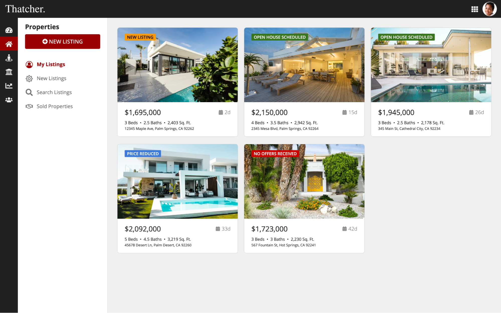
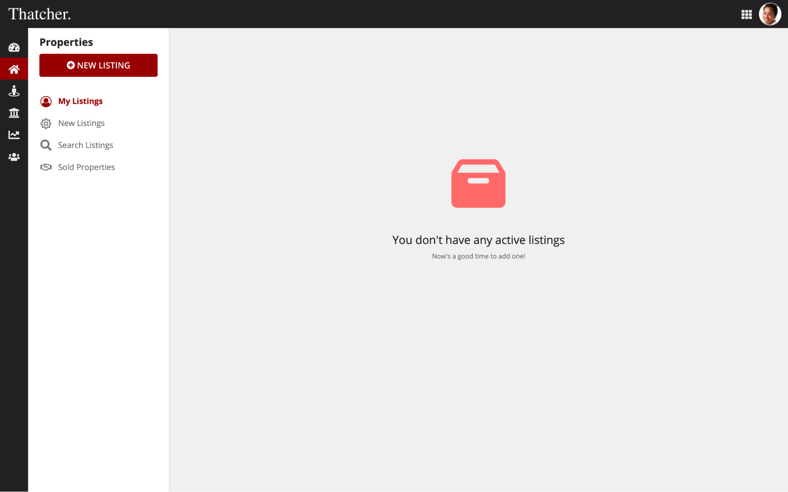
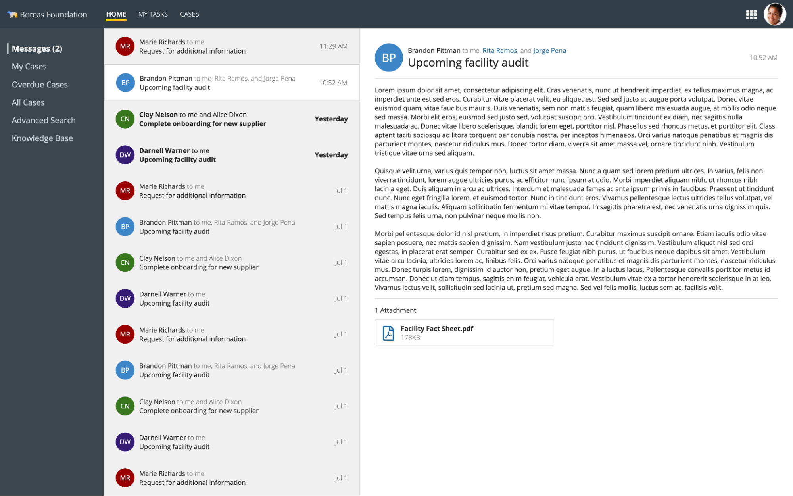
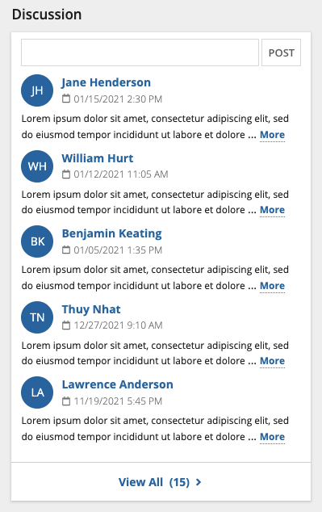
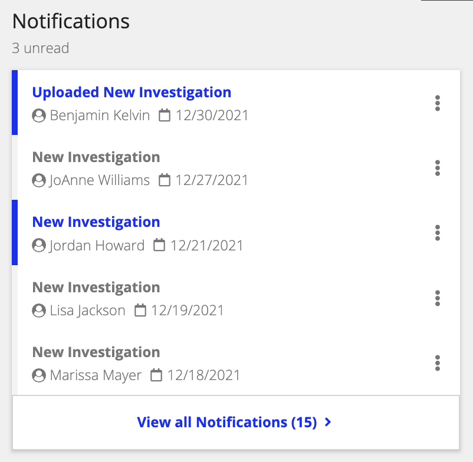
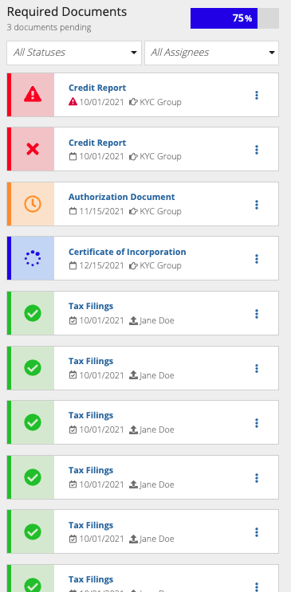
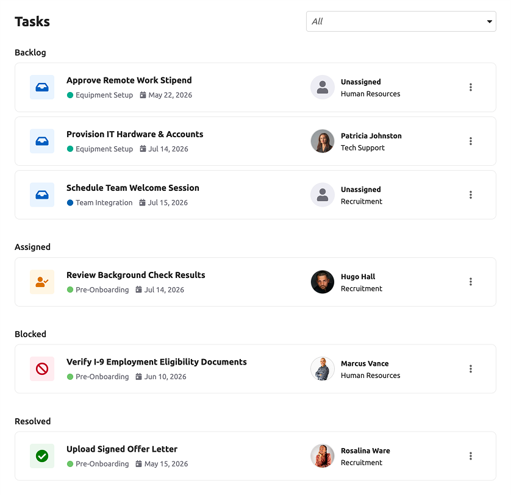
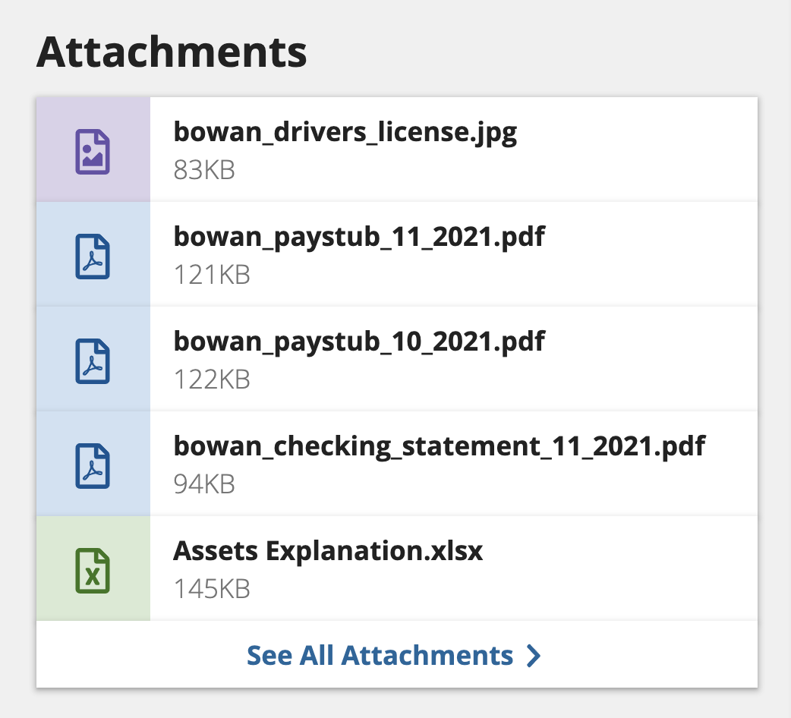
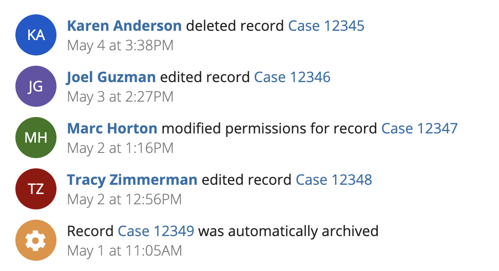
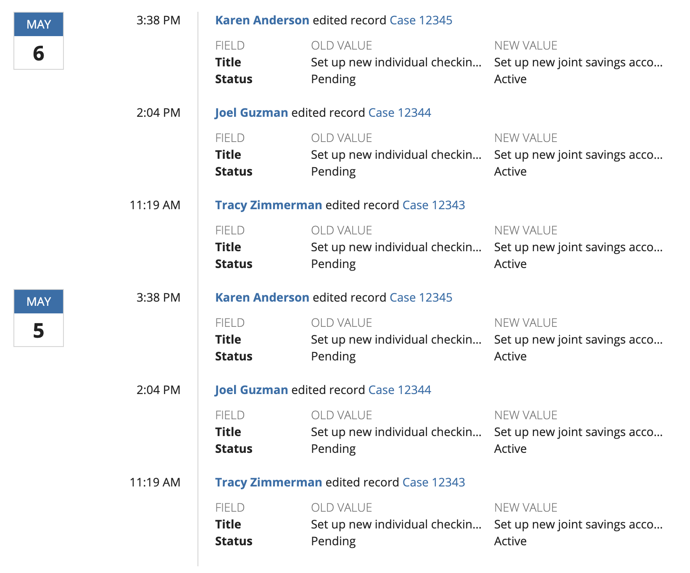

# Lists [SAIL Design System: Patterns]

*Section: patterns | source: https://docs.appian.com/suite/help/26.7/sail/lists.html | images referenced live in corpus/images/*

# Lists

Choose the right style of list to show different types of data.

## Photo gallery card record list

Use this pattern to list records that are associated with an identifying photo.



```sail
a!headerContentLayout(
  header: {
  },
  contents: {
    a!columnsLayout(
      columns: {
        a!columnLayout(
          contents: {
            a!cardLayout(
              height: "AUTO",
              style: "#232020",
              marginBelow: "NONE",
              showBorder: false
            ),
            a!cardLayout(
              contents: {
                a!richTextDisplayField(
                  labelPosition: "COLLAPSED",
                  value: {
                    a!richTextIcon(
                      icon: "tachometer",
                      size: "MEDIUM_PLUS"
                    )
                  },
                  align: "CENTER"
                )
              },
              link: a!dynamicLink(
                label: "Dynamic Link",
                saveInto: {}
              ),
              tooltip: "My Dashboard",
              height: "AUTO",
              style: "#232020",
              marginBelow: "NONE",
              showBorder: false
            ),
            a!cardLayout(
              contents: {
                a!richTextDisplayField(
                  labelPosition: "COLLAPSED",
                  value: {
                    a!richTextIcon(
                      icon: "home",
                      size: "MEDIUM_PLUS"
                    )
                  },
                  align: "CENTER"
                )
              },
              link: a!dynamicLink(
                label: "Dynamic Link",
                saveInto: {}
              ),
              tooltip: "Properties",
              height: "AUTO",
              style: "#990000",
              marginBelow: "NONE",
              showBorder: false
            ),
            a!cardLayout(
              contents: {
                a!richTextDisplayField(
                  labelPosition: "COLLAPSED",
                  value: {
                    a!richTextIcon(
                      icon: "street-view",
                      size: "MEDIUM_PLUS"
                    )
                  },
                  align: "CENTER"
                )
              },
              link: a!dynamicLink(
                label: "Dynamic Link",
                saveInto: {}
              ),
              tooltip: "Customers",
              height: "AUTO",
              style: "#232020",
              marginBelow: "NONE",
              showBorder: false
            ),
            a!cardLayout(
              contents: {
                a!richTextDisplayField(
                  labelPosition: "COLLAPSED",
                  value: {
                    a!richTextIcon(
                      icon: "university",
                      size: "MEDIUM_PLUS"
                    )
                  },
                  align: "CENTER"
                )
              },
              link: a!dynamicLink(
                label: "Dynamic Link",
                saveInto: {}
              ),
              tooltip: "Lending",
              height: "AUTO",
              style: "#232020",
              marginBelow: "NONE",
              showBorder: false
            ),
            a!cardLayout(
              contents: {
                a!richTextDisplayField(
                  labelPosition: "COLLAPSED",
                  value: {
                    a!richTextIcon(
                      icon: "line-chart",
                      size: "MEDIUM_PLUS"
                    )
                  },
                  align: "CENTER"
                )
              },
              link: a!dynamicLink(
                label: "Dynamic Link",
                saveInto: {}
              ),
              tooltip: "Performance",
              height: "AUTO",
              style: "#232020",
              marginBelow: "NONE",
              showBorder: false
            ),
            a!cardLayout(
              contents: {
                a!richTextDisplayField(
                  labelPosition: "COLLAPSED",
                  value: {
                    a!richTextIcon(
                      icon: "users",
                      size: "MEDIUM_PLUS"
                    )
                  },
                  align: "CENTER"
                )
              },
              link: a!dynamicLink(
                label: "Dynamic Link",
                saveInto: {}
              ),
              tooltip: "Team",
              height: "AUTO",
              style: "#232020",
              marginBelow: "NONE",
              showBorder: false
            ),
            a!cardLayout(
              height: "EXTRA_TALL",
              style: "#232020",
              marginBelow: "NONE",
              showBorder: false
            ),
            a!cardLayout(
              height: "EXTRA_TALL",
              style: "#232020",
              marginBelow: "NONE",
              showBorder: false
            )
          },
          width: "EXTRA_NARROW"
        ),
        a!columnLayout(
          contents: {
            a!columnsLayout(
              columns: {
                a!columnLayout(
                  contents: {
                    a!cardLayout(
                      contents: {
                        a!cardLayout(
                          contents: {
                            a!sectionLayout(
                              label: "Properties",
                              labelSize: "MEDIUM",
                              labelColor: "STANDARD",
                              contents: {
                                a!buttonArrayLayout(
                                  buttons: {
                                    a!buttonWidget(
                                      label: "New Listing",
                                      icon: "plus-circle",
                                      size: "LARGE",
                                      width: "FILL",
                                      style: "SOLID"
                                    )
                                  },
                                  align: "START"
                                )
                              },
                              divider: "NONE",
                              marginBelow: "NONE"
                            )
                          },
                          height: "AUTO",
                          style: "NONE",
                          padding: "STANDARD",
                          marginBelow: "NONE",
                          showBorder: false
                        ),
                        a!cardLayout(
                          contents: {
                            a!sideBySideLayout(
                              items: {
                                a!sideBySideItem(
                                  item: a!richTextDisplayField(
                                    labelPosition: "COLLAPSED",
                                    value: {
                                      "   "
                                    },
                                    align: "CENTER"
                                  ),
                                  width: "MINIMIZE"
                                ),
                                a!sideBySideItem(
                                  item: a!richTextDisplayField(
                                    labelPosition: "COLLAPSED",
                                    value: {
                                      a!richTextIcon(
                                        icon: "user-circle-o",
                                        color: "ACCENT",
                                        size: "MEDIUM_PLUS"
                                      )
                                    },
                                    align: "CENTER"
                                  ),
                                  width: "MINIMIZE"
                                ),
                                a!sideBySideItem(
                                  item: a!richTextDisplayField(
                                    labelPosition: "COLLAPSED",
                                    value: {
                                      "  "
                                    },
                                    align: "CENTER"
                                  ),
                                  width: "MINIMIZE"
                                ),
                                a!sideBySideItem(
                                  item: a!richTextDisplayField(
                                    labelPosition: "COLLAPSED",
                                    value: {
                                      a!richTextItem(
                                        text: {
                                          "My Listings"
                                        },
                                        color: "ACCENT",
                                        size: "MEDIUM",
                                        style: {
                                          "STRONG"
                                        }
                                      )
                                    },
                                    preventWrapping: true
                                  ),
                                  width: "AUTO"
                                )
                              },
                              alignVertical: "MIDDLE",
                              spacing: "DENSE",
                              marginBelow: "NONE"
                            )
                          },
                          link: a!dynamicLink(
                            label: "Dynamic Link",
                            saveInto: {}
                          ),
                          height: "AUTO",
                          style: "NONE",
                          padding: "LESS",
                          marginBelow: "NONE",
                          showBorder: false
                        ),
                        a!cardLayout(
                          contents: {
                            a!sideBySideLayout(
                              items: {
                                a!sideBySideItem(
                                  item: a!richTextDisplayField(
                                    labelPosition: "COLLAPSED",
                                    value: {
                                      "   "
                                    },
                                    align: "CENTER"
                                  ),
                                  width: "MINIMIZE"
                                ),
                                a!sideBySideItem(
                                  item: a!richTextDisplayField(
                                    labelPosition: "COLLAPSED",
                                    value: {
                                      a!richTextIcon(
                                        icon: "sun-o",
                                        color: "SECONDARY",
                                        size: "MEDIUM_PLUS"
                                      )
                                    },
                                    align: "CENTER"
                                  ),
                                  width: "MINIMIZE"
                                ),
                                a!sideBySideItem(
                                  item: a!richTextDisplayField(
                                    labelPosition: "COLLAPSED",
                                    value: {
                                      "  "
                                    },
                                    align: "CENTER"
                                  ),
                                  width: "MINIMIZE"
                                ),
                                a!sideBySideItem(
                                  item: a!richTextDisplayField(
                                    labelPosition: "COLLAPSED",
                                    value: {
                                      a!richTextItem(
                                        text: {
                                          "New Listings"
                                        },
                                        color: "#666666",
                                        size: "MEDIUM"
                                      )
                                    },
                                    preventWrapping: true
                                  ),
                                  width: "AUTO"
                                )
                              },
                              alignVertical: "MIDDLE",
                              spacing: "DENSE",
                              marginBelow: "NONE"
                            )
                          },
                          link: a!dynamicLink(
                            label: "Dynamic Link",
                            saveInto: {}
                          ),
                          height: "AUTO",
                          style: "NONE",
                          padding: "LESS",
                          marginBelow: "NONE",
                          showBorder: false
                        ),
                        a!cardLayout(
                          contents: {
                            a!sideBySideLayout(
                              items: {
                                a!sideBySideItem(
                                  item: a!richTextDisplayField(
                                    labelPosition: "COLLAPSED",
                                    value: {
                                      "   "
                                    },
                                    align: "CENTER"
                                  ),
                                  width: "MINIMIZE"
                                ),
                                a!sideBySideItem(
                                  item: a!richTextDisplayField(
                                    labelPosition: "COLLAPSED",
                                    value: {
                                      a!richTextIcon(
                                        icon: "search",
                                        color: "SECONDARY",
                                        size: "MEDIUM_PLUS"
                                      )
                                    },
                                    align: "CENTER"
                                  ),
                                  width: "MINIMIZE"
                                ),
                                a!sideBySideItem(
                                  item: a!richTextDisplayField(
                                    labelPosition: "COLLAPSED",
                                    value: {
                                      "  "
                                    },
                                    align: "CENTER"
                                  ),
                                  width: "MINIMIZE"
                                ),
                                a!sideBySideItem(
                                  item: a!richTextDisplayField(
                                    labelPosition: "COLLAPSED",
                                    value: {
                                      a!richTextItem(
                                        text: {
                                          "Search Listings"
                                        },
                                        color: "#666666",
                                        size: "MEDIUM"
                                      )
                                    },
                                    preventWrapping: true
                                  ),
                                  width: "AUTO"
                                )
                              },
                              alignVertical: "MIDDLE",
                              spacing: "DENSE",
                              marginBelow: "NONE"
                            )
                          },
                          link: a!dynamicLink(
                            label: "Dynamic Link",
                            saveInto: {}
                          ),
                          height: "AUTO",
                          style: "NONE",
                          padding: "LESS",
                          marginBelow: "NONE",
                          showBorder: false
                        ),
                        a!cardLayout(
                          contents: {
                            a!sideBySideLayout(
                              items: {
                                a!sideBySideItem(
                                  item: a!richTextDisplayField(
                                    labelPosition: "COLLAPSED",
                                    value: {
                                      "   "
                                    },
                                    align: "CENTER"
                                  ),
                                  width: "MINIMIZE"
                                ),
                                a!sideBySideItem(
                                  item: a!richTextDisplayField(
                                    labelPosition: "COLLAPSED",
                                    value: {
                                      a!richTextIcon(
                                        icon: "handshake-o",
                                        color: "SECONDARY",
                                        size: "MEDIUM_PLUS"
                                      )
                                    },
                                    align: "CENTER"
                                  ),
                                  width: "MINIMIZE"
                                ),
                                a!sideBySideItem(
                                  item: a!richTextDisplayField(
                                    labelPosition: "COLLAPSED",
                                    value: {
                                      "  "
                                    },
                                    align: "CENTER"
                                  ),
                                  width: "MINIMIZE"
                                ),
                                a!sideBySideItem(
                                  item: a!richTextDisplayField(
                                    labelPosition: "COLLAPSED",
                                    value: {
                                      a!richTextItem(
                                        text: {
                                          "Sold Properties"
                                        },
                                        color: "#666666",
                                        size: "MEDIUM"
                                      )
                                    },
                                    preventWrapping: true
                                  ),
                                  width: "AUTO"
                                )
                              },
                              alignVertical: "MIDDLE",
                              spacing: "DENSE",
                              marginBelow: "NONE"
                            )
                          },
                          link: a!dynamicLink(
                            label: "Dynamic Link",
                            saveInto: {}
                          ),
                          height: "AUTO",
                          style: "NONE",
                          padding: "LESS",
                          marginBelow: "NONE",
                          showBorder: false
                        ),
                        a!cardLayout(
                          contents: {},
                          height: "EXTRA_TALL",
                          style: "NONE",
                          marginBelow: "NONE",
                          showBorder: false
                        ),
                        a!cardLayout(
                          contents: {},
                          height: "EXTRA_TALL",
                          style: "NONE",
                          marginBelow: "NONE",
                          showBorder: false
                        )
                      },
                      height: "AUTO",
                      style: "NONE",
                      padding: "NONE",
                      marginBelow: "NONE",
                      showBorder: false
                    )
                  },
                  width: "NARROW_PLUS"
                ),
                a!columnLayout(
                  contents: {
                    a!cardLayout(
                      contents: {
                        a!columnsLayout(
                          columns: {
                            a!columnLayout(
                              contents: {
                                a!cardLayout(
                                  contents: {
                                    a!billboardLayout(
                                      backgroundMedia: a!webImage(source:"https://images.unsplash.com/photo-1512917774080-9991f1c4c750?ixid=MnwxMjA3fDB8MHxwaG90by1wYWdlfHx8fGVufDB8fHx8&ixlib=rb-1.2.1&auto=format&fit=crop&w=2550&q=80"),
                                      backgroundColor: "#f0f0f0",
                                      height: "SHORT_PLUS",
                                      marginBelow: "NONE",
                                      overlay: a!fullOverlay(
                                        alignVertical: "TOP",
                                        contents: {
                                          a!tagField(
                                            labelPosition: "COLLAPSED",
                                            tags: {
                                              a!tagItem(
                                                text: "NEW LISTING",
                                                backgroundColor: "#ff9900"
                                              )
                                            }
                                          )
                                        },
                                        style: "NONE"
                                      )
                                    ),
                                    a!cardLayout(
                                      contents: {
                                        a!sideBySideLayout(
                                          items: {
                                            a!sideBySideItem(
                                              item: a!richTextDisplayField(
                                                labelPosition: "COLLAPSED",
                                                value: {
                                                  a!richTextItem(
                                                    text: {
                                                      "$1,695,000"
                                                    },
                                                    size: "MEDIUM_PLUS"
                                                  )
                                                }
                                              )
                                            ),
                                            a!sideBySideItem(
                                              item: a!richTextDisplayField(
                                                labelPosition: "COLLAPSED",
                                                value: {
                                                  a!richTextItem(
                                                    text: {
                                                      a!richTextIcon(
                                                        icon: "calendar"
                                                      ),
                                                      " 2d"
                                                    },
                                                    color: "SECONDARY",
                                                    size: "MEDIUM"
                                                  )
                                                }
                                              ),
                                              width: "MINIMIZE"
                                            )
                                          },
                                          alignVertical: "MIDDLE",
                                          marginBelow: "STANDARD"
                                        ),
                                        a!richTextDisplayField(
                                          labelPosition: "COLLAPSED",
                                          value: {
                                            a!richTextItem(
                                              text: {
                                                "3 Beds  "
                                              },
                                              size: "STANDARD"
                                            ),
                                            "•  2.5 Baths  •  2,403 Sq. Ft.",
                                            char(10),
                                            a!richTextItem(
                                              text: {
                                                "12345 Maple Ave, Palm Springs, CA 92262"
                                              },
                                              size: "SMALL"
                                            )
                                          },
                                          preventWrapping: false
                                        )
                                      },
                                      height: "AUTO",
                                      style: "NONE",
                                      padding: "STANDARD",
                                      marginBelow: "NONE",
                                      showBorder: false
                                    )
                                  },
                                  link: a!dynamicLink(
                                    label: "Dynamic Link",
                                    saveInto: {}
                                  ),
                                  height: "AUTO",
                                  style: "NONE",
                                  shape: "SEMI_ROUNDED",
                                  padding: "NONE",
                                  marginBelow: "STANDARD"
                                )
                              }
                            ),
                            a!columnLayout(
                              contents: {
                                a!cardLayout(
                                  contents: {
                                    a!billboardLayout(
                                      backgroundMedia: a!webImage(source:"https://images.unsplash.com/photo-1575517111478-7f6afd0973db?ixid=MnwxMjA3fDB8MHxwaG90by1wYWdlfHx8fGVufDB8fHx8&ixlib=rb-1.2.1&auto=format&fit=crop&w=2550&q=80"),
                                      backgroundColor: "#f0f0f0",
                                      height: "SHORT_PLUS",
                                      marginBelow: "NONE",
                                      overlay: a!fullOverlay(
                                        alignVertical: "TOP",
                                        contents: {
                                          a!tagField(
                                            labelPosition: "COLLAPSED",
                                            tags: {
                                              a!tagItem(
                                                text: "OPEN HOUSE SCHEDULED",
                                                backgroundColor: "#38761d"
                                              )
                                            }
                                          )
                                        },
                                        style: "NONE"
                                      )
                                    ),
                                    a!cardLayout(
                                      contents: {
                                        a!sideBySideLayout(
                                          items: {
                                            a!sideBySideItem(
                                              item: a!richTextDisplayField(
                                                labelPosition: "COLLAPSED",
                                                value: {
                                                  a!richTextItem(
                                                    text: {
                                                      "$2,150,000"
                                                    },
                                                    size: "MEDIUM_PLUS"
                                                  )
                                                }
                                              )
                                            ),
                                            a!sideBySideItem(
                                              item: a!richTextDisplayField(
                                                labelPosition: "COLLAPSED",
                                                value: {
                                                  a!richTextItem(
                                                    text: {
                                                      a!richTextIcon(
                                                        icon: "calendar"
                                                      ),
                                                      " 15d"
                                                    },
                                                    color: "SECONDARY",
                                                    size: "MEDIUM"
                                                  )
                                                }
                                              ),
                                              width: "MINIMIZE"
                                            )
                                          },
                                          alignVertical: "MIDDLE",
                                          marginBelow: "STANDARD"
                                        ),
                                        a!richTextDisplayField(
                                          labelPosition: "COLLAPSED",
                                          value: {
                                            a!richTextItem(
                                              text: {
                                                "4 Beds  "
                                              },
                                              size: "STANDARD"
                                            ),
                                            "•  3.5 Baths  •  2,942 Sq. Ft.",
                                            char(10),
                                            a!richTextItem(
                                              text: {
                                                "2345 Mesa Blvd, Palm Springs, CA 92264"
                                              },
                                              size: "SMALL"
                                            )
                                          },
                                          preventWrapping: false
                                        )
                                      },
                                      height: "AUTO",
                                      style: "NONE",
                                      padding: "STANDARD",
                                      marginBelow: "NONE",
                                      showBorder: false
                                    )
                                  },
                                  link: a!dynamicLink(
                                    label: "Dynamic Link",
                                    saveInto: {}
                                  ),
                                  height: "AUTO",
                                  style: "NONE",
                                  shape: "SEMI_ROUNDED",
                                  padding: "NONE",
                                  marginBelow: "STANDARD"
                                )
                              }
                            ),
                            a!columnLayout(
                              contents: {
                                a!cardLayout(
                                  contents: {
                                    a!billboardLayout(
                                      backgroundMedia: a!webImage(source:"https://images.unsplash.com/photo-1582268611958-ebfd161ef9cf?ixid=MnwxMjA3fDB8MHxwaG90by1wYWdlfHx8fGVufDB8fHx8&ixlib=rb-1.2.1&auto=format&fit=crop&w=2550&q=80"),
                                      backgroundColor: "#f0f0f0",
                                      height: "SHORT_PLUS",
                                      marginBelow: "NONE",
                                      overlay: a!fullOverlay(
                                        alignVertical: "TOP",
                                        contents: {
                                          a!tagField(
                                            labelPosition: "COLLAPSED",
                                            tags: {
                                              a!tagItem(
                                                text: "OPEN HOUSE SCHEDULED",
                                                backgroundColor: "#38761d"
                                              )
                                            }
                                          )
                                        },
                                        style: "NONE"
                                      )
                                    ),
                                    a!cardLayout(
                                      contents: {
                                        a!sideBySideLayout(
                                          items: {
                                            a!sideBySideItem(
                                              item: a!richTextDisplayField(
                                                labelPosition: "COLLAPSED",
                                                value: {
                                                  a!richTextItem(
                                                    text: {
                                                      "$1,945,000"
                                                    },
                                                    size: "MEDIUM_PLUS"
                                                  )
                                                }
                                              )
                                            ),
                                            a!sideBySideItem(
                                              item: a!richTextDisplayField(
                                                labelPosition: "COLLAPSED",
                                                value: {
                                                  a!richTextItem(
                                                    text: {
                                                      a!richTextIcon(
                                                        icon: "calendar"
                                                      ),
                                                      " 26d"
                                                    },
                                                    color: "SECONDARY",
                                                    size: "MEDIUM"
                                                  )
                                                }
                                              ),
                                              width: "MINIMIZE"
                                            )
                                          },
                                          alignVertical: "MIDDLE",
                                          marginBelow: "STANDARD"
                                        ),
                                        a!richTextDisplayField(
                                          labelPosition: "COLLAPSED",
                                          value: {
                                            a!richTextItem(
                                              text: {
                                                "3 Beds  "
                                              },
                                              size: "STANDARD"
                                            ),
                                            "•  2.5 Baths  •  2,178 Sq. Ft.",
                                            char(10),
                                            a!richTextItem(
                                              text: {
                                                "345 Main St, Cathedral City, CA 92234"
                                              },
                                              size: "SMALL"
                                            )
                                          },
                                          preventWrapping: false
                                        )
                                      },
                                      height: "AUTO",
                                      style: "NONE",
                                      padding: "STANDARD",
                                      marginBelow: "NONE",
                                      showBorder: false
                                    )
                                  },
                                  link: a!dynamicLink(
                                    label: "Dynamic Link",
                                    saveInto: {}
                                  ),
                                  height: "AUTO",
                                  style: "NONE",
                                  shape: "SEMI_ROUNDED",
                                  padding: "NONE",
                                  marginBelow: "STANDARD"
                                )
                              }
                            )
                          },
                          stackWhen: {
                            "PHONE",
                            "TABLET_PORTRAIT",
                            "TABLET_LANDSCAPE",
                            "DESKTOP_NARROW"
                          }
                        ),
                        a!columnsLayout(
                          columns: {
                            a!columnLayout(
                              contents: {
                                a!cardLayout(
                                  contents: {
                                    a!billboardLayout(
                                      backgroundMedia: a!webImage(source:"https://images.unsplash.com/photo-1613977257592-4871e5fcd7c4?ixid=MnwxMjA3fDB8MHxzZWFyY2h8NzR8fGhvdXNlfGVufDB8fDB8fA%3D%3D&ixlib=rb-1.2.1&auto=format&fit=crop&w=900&q=60"),
                                      backgroundColor: "#f0f0f0",
                                      height: "SHORT_PLUS",
                                      marginBelow: "NONE",
                                      overlay: a!fullOverlay(
                                        alignVertical: "TOP",
                                        contents: {
                                          a!tagField(
                                            labelPosition: "COLLAPSED",
                                            tags: {
                                              a!tagItem(
                                                text: "PRICE REDUCED",
                                                backgroundColor: "#3c78d8"
                                              )
                                            }
                                          )
                                        },
                                        style: "NONE"
                                      )
                                    ),
                                    a!cardLayout(
                                      contents: {
                                        a!sideBySideLayout(
                                          items: {
                                            a!sideBySideItem(
                                              item: a!richTextDisplayField(
                                                labelPosition: "COLLAPSED",
                                                value: {
                                                  a!richTextItem(
                                                    text: {
                                                      "$2,092,000"
                                                    },
                                                    size: "MEDIUM_PLUS"
                                                  )
                                                }
                                              )
                                            ),
                                            a!sideBySideItem(
                                              item: a!richTextDisplayField(
                                                labelPosition: "COLLAPSED",
                                                value: {
                                                  a!richTextItem(
                                                    text: {
                                                      a!richTextIcon(
                                                        icon: "calendar"
                                                      ),
                                                      " 33d"
                                                    },
                                                    color: "SECONDARY",
                                                    size: "MEDIUM"
                                                  )
                                                }
                                              ),
                                              width: "MINIMIZE"
                                            )
                                          },
                                          alignVertical: "MIDDLE",
                                          marginBelow: "STANDARD"
                                        ),
                                        a!richTextDisplayField(
                                          labelPosition: "COLLAPSED",
                                          value: {
                                            a!richTextItem(
                                              text: {
                                                "5 Beds  "
                                              },
                                              size: "STANDARD"
                                            ),
                                            "•  4.5 Baths  •  3,219 Sq. Ft.",
                                            char(10),
                                            a!richTextItem(
                                              text: {
                                                "45678 Desert Ln, Palm Desert, CA 92260"
                                              },
                                              size: "SMALL"
                                            )
                                          },
                                          preventWrapping: false
                                        )
                                      },
                                      height: "AUTO",
                                      style: "NONE",
                                      padding: "STANDARD",
                                      marginBelow: "NONE",
                                      showBorder: false
                                    )
                                  },
                                  link: a!dynamicLink(
                                    label: "Dynamic Link",
                                    saveInto: {}
                                  ),
                                  height: "AUTO",
                                  style: "NONE",
                                  shape: "SEMI_ROUNDED",
                                  padding: "NONE",
                                  marginBelow: "STANDARD"
                                )
                              }
                            ),
                            a!columnLayout(
                              contents: {
                                a!cardLayout(
                                  contents: {
                                    a!billboardLayout(
                                      backgroundMedia: a!webImage(source:"https://images.unsplash.com/photo-1538963732282-4b2b48c7a4b8?ixid=MnwxMjA3fDB8MHxwaG90by1wYWdlfHx8fGVufDB8fHx8&ixlib=rb-1.2.1&auto=format&fit=crop&w=2555&q=80"),
                                      backgroundColor: "#f0f0f0",
                                      height: "SHORT_PLUS",
                                      marginBelow: "NONE",
                                      overlay: a!fullOverlay(
                                        alignVertical: "TOP",
                                        contents: {
                                          a!tagField(
                                            labelPosition: "COLLAPSED",
                                            tags: {
                                              a!tagItem(
                                                text: "NO OFFERS RECEIVED",
                                                backgroundColor: "#cc0000"
                                              )
                                            }
                                          )
                                        },
                                        style: "NONE"
                                      )
                                    ),
                                    a!cardLayout(
                                      contents: {
                                        a!sideBySideLayout(
                                          items: {
                                            a!sideBySideItem(
                                              item: a!richTextDisplayField(
                                                labelPosition: "COLLAPSED",
                                                value: {
                                                  a!richTextItem(
                                                    text: {
                                                      "$1,723,000"
                                                    },
                                                    size: "MEDIUM_PLUS"
                                                  )
                                                }
                                              )
                                            ),
                                            a!sideBySideItem(
                                              item: a!richTextDisplayField(
                                                labelPosition: "COLLAPSED",
                                                value: {
                                                  a!richTextItem(
                                                    text: {
                                                      a!richTextIcon(
                                                        icon: "calendar"
                                                      ),
                                                      " 42d"
                                                    },
                                                    color: "SECONDARY",
                                                    size: "MEDIUM"
                                                  )
                                                }
                                              ),
                                              width: "MINIMIZE"
                                            )
                                          },
                                          alignVertical: "MIDDLE",
                                          marginBelow: "STANDARD"
                                        ),
                                        a!richTextDisplayField(
                                          labelPosition: "COLLAPSED",
                                          value: {
                                            a!richTextItem(
                                              text: {
                                                "3 Beds  "
                                              },
                                              size: "STANDARD"
                                            ),
                                            "•  3 Baths  •  2,230 Sq. Ft.",
                                            char(10),
                                            a!richTextItem(
                                              text: {
                                                "567 Fountain St, Hot Springs, CA 92241"
                                              },
                                              size: "SMALL"
                                            )
                                          },
                                          preventWrapping: false
                                        )
                                      },
                                      height: "AUTO",
                                      style: "NONE",
                                      padding: "STANDARD",
                                      marginBelow: "NONE",
                                      showBorder: false
                                    )
                                  },
                                  link: a!dynamicLink(
                                    label: "Dynamic Link",
                                    saveInto: {}
                                  ),
                                  height: "AUTO",
                                  style: "NONE",
                                  shape: "SEMI_ROUNDED",
                                  padding: "NONE",
                                  marginBelow: "STANDARD"
                                )
                              }
                            ),
                            a!columnLayout(
                              contents: {}
                            )
                          },
                          stackWhen: {
                            "PHONE",
                            "TABLET_PORTRAIT",
                            "TABLET_LANDSCAPE",
                            "DESKTOP_NARROW"
                          }
                        )
                      },
                      height: "AUTO",
                      style: "#f0f0f0",
                      padding: "MORE",
                      marginBelow: "STANDARD",
                      showBorder: false
                    )
                  }
                )
              },
              spacing: "NONE",
              stackWhen: {
                "NEVER"
              },
              showDividers: true
            )
          }
        )
      },
      spacing: "NONE",
      stackWhen: {
        "NEVER"
      }
    )
  },
  showWhen: true,
  backgroundColor: "TRANSPARENT",
  contentsPadding: "NONE"
)
```

## Full page empty state message

Use this pattern to announce the absence of items in a list. This UI design is more appealing than a blank page or empty grid and provides an opportunity suggest next steps to the user.



```sail
a!headerContentLayout(
  header: {
  },
  contents: {
    a!columnsLayout(
      columns: {
        a!columnLayout(
          contents: {
            a!cardLayout(
              height: "AUTO",
              style: "#232020",
              marginBelow: "NONE",
              showBorder: false
            ),
            a!cardLayout(
              contents: {
                a!richTextDisplayField(
                  labelPosition: "COLLAPSED",
                  value: {
                    a!richTextIcon(
                      icon: "tachometer",
                      size: "MEDIUM_PLUS"
                    )
                  },
                  align: "CENTER"
                )
              },
              link: a!dynamicLink(
                label: "Dynamic Link",
                saveInto: {}
              ),
              tooltip: "My Dashboard",
              height: "AUTO",
              style: "#232020",
              marginBelow: "NONE",
              showBorder: false
            ),
            a!cardLayout(
              contents: {
                a!richTextDisplayField(
                  labelPosition: "COLLAPSED",
                  value: {
                    a!richTextIcon(
                      icon: "home",
                      size: "MEDIUM_PLUS"
                    )
                  },
                  align: "CENTER"
                )
              },
              link: a!dynamicLink(
                label: "Dynamic Link",
                saveInto: {}
              ),
              tooltip: "Properties",
              height: "AUTO",
              style: "#990000",
              marginBelow: "NONE",
              showBorder: false
            ),
            a!cardLayout(
              contents: {
                a!richTextDisplayField(
                  labelPosition: "COLLAPSED",
                  value: {
                    a!richTextIcon(
                      icon: "street-view",
                      size: "MEDIUM_PLUS"
                    )
                  },
                  align: "CENTER"
                )
              },
              link: a!dynamicLink(
                label: "Dynamic Link",
                saveInto: {}
              ),
              tooltip: "Customers",
              height: "AUTO",
              style: "#232020",
              marginBelow: "NONE",
              showBorder: false
            ),
            a!cardLayout(
              contents: {
                a!richTextDisplayField(
                  labelPosition: "COLLAPSED",
                  value: {
                    a!richTextIcon(
                      icon: "university",
                      size: "MEDIUM_PLUS"
                    )
                  },
                  align: "CENTER"
                )
              },
              link: a!dynamicLink(
                label: "Dynamic Link",
                saveInto: {}
              ),
              tooltip: "Lending",
              height: "AUTO",
              style: "#232020",
              marginBelow: "NONE",
              showBorder: false
            ),
            a!cardLayout(
              contents: {
                a!richTextDisplayField(
                  labelPosition: "COLLAPSED",
                  value: {
                    a!richTextIcon(
                      icon: "line-chart",
                      size: "MEDIUM_PLUS"
                    )
                  },
                  align: "CENTER"
                )
              },
              link: a!dynamicLink(
                label: "Dynamic Link",
                saveInto: {}
              ),
              tooltip: "Performance",
              height: "AUTO",
              style: "#232020",
              marginBelow: "NONE",
              showBorder: false
            ),
            a!cardLayout(
              contents: {
                a!richTextDisplayField(
                  labelPosition: "COLLAPSED",
                  value: {
                    a!richTextIcon(
                      icon: "users",
                      size: "MEDIUM_PLUS"
                    )
                  },
                  align: "CENTER"
                )
              },
              link: a!dynamicLink(
                label: "Dynamic Link",
                saveInto: {}
              ),
              tooltip: "Team",
              height: "AUTO",
              style: "#232020",
              marginBelow: "NONE",
              showBorder: false
            ),
            a!cardLayout(
              height: "EXTRA_TALL",
              style: "#232020",
              marginBelow: "NONE",
              showBorder: false
            ),
            a!cardLayout(
              height: "EXTRA_TALL",
              style: "#232020",
              marginBelow: "NONE",
              showBorder: false
            )
          },
          width: "EXTRA_NARROW"
        ),
        a!columnLayout(
          contents: {
            a!columnsLayout(
              columns: {
                a!columnLayout(
                  contents: {
                    a!cardLayout(
                      contents: {
                        a!cardLayout(
                          contents: {
                            a!sectionLayout(
                              label: "Properties",
                              labelSize: "MEDIUM",
                              labelColor: "STANDARD",
                              contents: {
                                a!buttonArrayLayout(
                                  buttons: {
                                    a!buttonWidget(
                                      label: "New Listing",
                                      icon: "plus-circle",
                                      size: "LARGE",
                                      width: "FILL",
                                      style: "SOLID"
                                    )
                                  },
                                  align: "START"
                                )
                              },
                              divider: "NONE",
                              marginBelow: "NONE"
                            )
                          },
                          height: "AUTO",
                          style: "NONE",
                          padding: "STANDARD",
                          marginBelow: "NONE",
                          showBorder: false
                        ),
                        a!cardLayout(
                          contents: {
                            a!sideBySideLayout(
                              items: {
                                a!sideBySideItem(
                                  item: a!richTextDisplayField(
                                    labelPosition: "COLLAPSED",
                                    value: {
                                      "   "
                                    },
                                    align: "CENTER"
                                  ),
                                  width: "MINIMIZE"
                                ),
                                a!sideBySideItem(
                                  item: a!richTextDisplayField(
                                    labelPosition: "COLLAPSED",
                                    value: {
                                      a!richTextIcon(
                                        icon: "user-circle-o",
                                        color: "ACCENT",
                                        size: "MEDIUM_PLUS"
                                      )
                                    },
                                    align: "CENTER"
                                  ),
                                  width: "MINIMIZE"
                                ),
                                a!sideBySideItem(
                                  item: a!richTextDisplayField(
                                    labelPosition: "COLLAPSED",
                                    value: {
                                      "  "
                                    },
                                    align: "CENTER"
                                  ),
                                  width: "MINIMIZE"
                                ),
                                a!sideBySideItem(
                                  item: a!richTextDisplayField(
                                    labelPosition: "COLLAPSED",
                                    value: {
                                      a!richTextItem(
                                        text: {
                                          "My Listings"
                                        },
                                        color: "ACCENT",
                                        size: "MEDIUM",
                                        style: {
                                          "STRONG"
                                        }
                                      )
                                    },
                                    preventWrapping: true
                                  ),
                                  width: "AUTO"
                                )
                              },
                              alignVertical: "MIDDLE",
                              spacing: "DENSE",
                              marginBelow: "NONE"
                            )
                          },
                          link: a!dynamicLink(
                            label: "Dynamic Link",
                            saveInto: {}
                          ),
                          height: "AUTO",
                          style: "NONE",
                          padding: "LESS",
                          marginBelow: "NONE",
                          showBorder: false
                        ),
                        a!cardLayout(
                          contents: {
                            a!sideBySideLayout(
                              items: {
                                a!sideBySideItem(
                                  item: a!richTextDisplayField(
                                    labelPosition: "COLLAPSED",
                                    value: {
                                      "   "
                                    },
                                    align: "CENTER"
                                  ),
                                  width: "MINIMIZE"
                                ),
                                a!sideBySideItem(
                                  item: a!richTextDisplayField(
                                    labelPosition: "COLLAPSED",
                                    value: {
                                      a!richTextIcon(
                                        icon: "sun-o",
                                        color: "SECONDARY",
                                        size: "MEDIUM_PLUS"
                                      )
                                    },
                                    align: "CENTER"
                                  ),
                                  width: "MINIMIZE"
                                ),
                                a!sideBySideItem(
                                  item: a!richTextDisplayField(
                                    labelPosition: "COLLAPSED",
                                    value: {
                                      "  "
                                    },
                                    align: "CENTER"
                                  ),
                                  width: "MINIMIZE"
                                ),
                                a!sideBySideItem(
                                  item: a!richTextDisplayField(
                                    labelPosition: "COLLAPSED",
                                    value: {
                                      a!richTextItem(
                                        text: {
                                          "New Listings"
                                        },
                                        color: "#666666",
                                        size: "MEDIUM"
                                      )
                                    },
                                    preventWrapping: true
                                  ),
                                  width: "AUTO"
                                )
                              },
                              alignVertical: "MIDDLE",
                              spacing: "DENSE",
                              marginBelow: "NONE"
                            )
                          },
                          link: a!dynamicLink(
                            label: "Dynamic Link",
                            saveInto: {}
                          ),
                          height: "AUTO",
                          style: "NONE",
                          padding: "LESS",
                          marginBelow: "NONE",
                          showBorder: false
                        ),
                        a!cardLayout(
                          contents: {
                            a!sideBySideLayout(
                              items: {
                                a!sideBySideItem(
                                  item: a!richTextDisplayField(
                                    labelPosition: "COLLAPSED",
                                    value: {
                                      "   "
                                    },
                                    align: "CENTER"
                                  ),
                                  width: "MINIMIZE"
                                ),
                                a!sideBySideItem(
                                  item: a!richTextDisplayField(
                                    labelPosition: "COLLAPSED",
                                    value: {
                                      a!richTextIcon(
                                        icon: "search",
                                        color: "SECONDARY",
                                        size: "MEDIUM_PLUS"
                                      )
                                    },
                                    align: "CENTER"
                                  ),
                                  width: "MINIMIZE"
                                ),
                                a!sideBySideItem(
                                  item: a!richTextDisplayField(
                                    labelPosition: "COLLAPSED",
                                    value: {
                                      "  "
                                    },
                                    align: "CENTER"
                                  ),
                                  width: "MINIMIZE"
                                ),
                                a!sideBySideItem(
                                  item: a!richTextDisplayField(
                                    labelPosition: "COLLAPSED",
                                    value: {
                                      a!richTextItem(
                                        text: {
                                          "Search Listings"
                                        },
                                        color: "#666666",
                                        size: "MEDIUM"
                                      )
                                    },
                                    preventWrapping: true
                                  ),
                                  width: "AUTO"
                                )
                              },
                              alignVertical: "MIDDLE",
                              spacing: "DENSE",
                              marginBelow: "NONE"
                            )
                          },
                          link: a!dynamicLink(
                            label: "Dynamic Link",
                            saveInto: {}
                          ),
                          height: "AUTO",
                          style: "NONE",
                          padding: "LESS",
                          marginBelow: "NONE",
                          showBorder: false
                        ),
                        a!cardLayout(
                          contents: {
                            a!sideBySideLayout(
                              items: {
                                a!sideBySideItem(
                                  item: a!richTextDisplayField(
                                    labelPosition: "COLLAPSED",
                                    value: {
                                      "   "
                                    },
                                    align: "CENTER"
                                  ),
                                  width: "MINIMIZE"
                                ),
                                a!sideBySideItem(
                                  item: a!richTextDisplayField(
                                    labelPosition: "COLLAPSED",
                                    value: {
                                      a!richTextIcon(
                                        icon: "handshake-o",
                                        color: "SECONDARY",
                                        size: "MEDIUM_PLUS"
                                      )
                                    },
                                    align: "CENTER"
                                  ),
                                  width: "MINIMIZE"
                                ),
                                a!sideBySideItem(
                                  item: a!richTextDisplayField(
                                    labelPosition: "COLLAPSED",
                                    value: {
                                      "  "
                                    },
                                    align: "CENTER"
                                  ),
                                  width: "MINIMIZE"
                                ),
                                a!sideBySideItem(
                                  item: a!richTextDisplayField(
                                    labelPosition: "COLLAPSED",
                                    value: {
                                      a!richTextItem(
                                        text: {
                                          "Sold Properties"
                                        },
                                        color: "#666666",
                                        size: "MEDIUM"
                                      )
                                    },
                                    preventWrapping: true
                                  ),
                                  width: "AUTO"
                                )
                              },
                              alignVertical: "MIDDLE",
                              spacing: "DENSE",
                              marginBelow: "NONE"
                            )
                          },
                          link: a!dynamicLink(
                            label: "Dynamic Link",
                            saveInto: {}
                          ),
                          height: "AUTO",
                          style: "NONE",
                          padding: "LESS",
                          marginBelow: "NONE",
                          showBorder: false
                        ),
                        a!cardLayout(
                          contents: {},
                          height: "EXTRA_TALL",
                          style: "NONE",
                          marginBelow: "NONE",
                          showBorder: false
                        ),
                        a!cardLayout(
                          contents: {},
                          height: "EXTRA_TALL",
                          style: "NONE",
                          marginBelow: "NONE",
                          showBorder: false
                        )
                      },
                      height: "AUTO",
                      style: "NONE",
                      padding: "NONE",
                      marginBelow: "NONE",
                      showBorder: false
                    )
                  },
                  width: "NARROW_PLUS"
                ),
                a!columnLayout(
                  contents: {
                    a!cardLayout(
                      contents: {
                        a!cardLayout(
                          contents: {},
                          height: "SHORT_PLUS",
                          style: "#f0f0f0",
                          marginBelow: "STANDARD",
                          showBorder: false
                        ),
                        a!imageField(
                          label: "",
                          labelPosition: "COLLAPSED",
                          images: {
                            a!documentImage(
                              document: cons!EMPTY_BOX
                            )
                          },
                          size: "MEDIUM",
                          isThumbnail: false,
                          style: "STANDARD",
                          align: "CENTER"
                        ),
                        a!richTextDisplayField(
                          labelPosition: "COLLAPSED",
                          value: {
                            a!richTextItem(
                              text: {
                                "You don't have any active listings"
                              },
                              size: "MEDIUM_PLUS"
                            )
                          },
                          align: "CENTER"
                        ),
                        a!richTextDisplayField(
                          labelPosition: "COLLAPSED",
                          value: {
                            a!richTextItem(
                              text: {
                                "Now's a good time to add one!"
                              },
                              color: "#6a6a6a",
                              size: "STANDARD"
                            )
                          },
                          align: "CENTER"
                        )
                      },
                      height: "AUTO",
                      style: "#f0f0f0",
                      padding: "MORE",
                      marginBelow: "STANDARD",
                      showBorder: false
                    )
                  }
                )
              },
              spacing: "NONE",
              stackWhen: {
                "NEVER"
              },
              showDividers: true
            )
          }
        )
      },
      spacing: "NONE",
      stackWhen: {
        "NEVER"
      }
    )
  },
  showWhen: true,
  backgroundColor: "TRANSPARENT",
  contentsPadding: "NONE"
)
```

## Message inbox

Displays a list of messages in one column. Selecting a message shows its details in the adjacent column.

This pattern can be adapted to show other types of list-detail contents.



```sail
a!localVariables(
  local!messages: {
    a!map(from: "Marie Richards",  stampColor: "#990000", to: "me",                             subject: "Request for additional information",   time: "11:29 AM",  isRead: true),
    a!map(from: "Brandon Pittman", stampColor: "#3d85c6", to: "me, Rita Ramos, and Jorge Pena", subject: "Upcoming facility audit",              time: "10:52 AM",  isRead: true),
    a!map(from: "Clay Nelson",     stampColor: "#38761d", to: "me and Alice Dixon",             subject: "Complete onboarding for new supplier", time: "Yesterday", isRead: false),
    a!map(from: "Darnell Warner",  stampColor: "#351c75", to: "me",                             subject: "Upcoming facility audit",              time: "Yesterday", isRead: false),
    a!map(from: "Marie Richards",  stampColor: "#990000", to: "me",                             subject: "Request for additional information",   time: "Jul 1",     isRead: true),
    a!map(from: "Brandon Pittman", stampColor: "#3d85c6", to: "me, Rita Ramos, and Jorge Pena", subject: "Upcoming facility audit",              time: "Jul 1",     isRead: true),
    a!map(from: "Clay Nelson",     stampColor: "#38761d", to: "me and Alice Dixon",             subject: "Complete onboarding for new supplier", time: "Jul 1",     isRead: true),
    a!map(from: "Darnell Warner",  stampColor: "#351c75", to: "me",                             subject: "Upcoming facility audit",              time: "Jul 1",     isRead: true),
    a!map(from: "Marie Richards",  stampColor: "#990000", to: "me",                             subject: "Request for additional information",   time: "Jul 1",     isRead: true),
    a!map(from: "Brandon Pittman", stampColor: "#3d85c6", to: "me, Rita Ramos, and Jorge Pena", subject: "Upcoming facility audit",              time: "Jul 1",     isRead: true),
    a!map(from: "Clay Nelson",     stampColor: "#38761d", to: "me and Alice Dixon",             subject: "Complete onboarding for new supplier", time: "Jul 1",     isRead: true),
    a!map(from: "Darnell Warner",  stampColor: "#351c75", to: "me",                             subject: "Upcoming facility audit",              time: "Jul 1",     isRead: true),
    a!map(from: "Marie Richards",  stampColor: "#990000", to: "me",                             subject: "Request for additional information",   time: "Jul 1",     isRead: true),
    a!map(from: "Brandon Pittman", stampColor: "#3d85c6", to: "me, Rita Ramos, and Jorge Pena", subject: "Upcoming facility audit",              time: "Jul 1",     isRead: true),
    a!map(from: "Clay Nelson",     stampColor: "#38761d", to: "me and Alice Dixon",             subject: "Complete onboarding for new supplier", time: "Jul 1",     isRead: true),
    a!map(from: "Darnell Warner",  stampColor: "#351c75", to: "me",                             subject: "Upcoming facility audit",              time: "Jul 1",     isRead: true),
    a!map(from: "Marie Richards",  stampColor: "#990000", to: "me",                             subject: "Request for additional information",   time: "Jul 1",     isRead: true),
    a!map(from: "Brandon Pittman", stampColor: "#3d85c6", to: "me, Rita Ramos, and Jorge Pena", subject: "Upcoming facility audit",              time: "Jul 1",     isRead: true),
    a!map(from: "Clay Nelson",     stampColor: "#38761d", to: "me and Alice Dixon",             subject: "Complete onboarding for new supplier", time: "Jul 1",     isRead: true),
    a!map(from: "Darnell Warner",  stampColor: "#351c75", to: "me",                             subject: "Upcoming facility audit",              time: "Jul 1",     isRead: true)
  },
  local!sideNavPages: {
    a!map(icon: "envelope",             name: "Messages" & " (" & length(where(not(local!messages.isRead))) & ")"),
    a!map(icon: "user-tag",             name: "My Cases"),
    a!map(icon: "exclamation-triangle", name: "Overdue Cases"),
    a!map(icon: "tasks",                name: "All Cases"),
    a!map(icon: "files-solid",          name: "Knowledge Base"),
    a!map(icon: "search",               name: "Advanced Search")
  },
  local!selectedPage: 1,
  local!selectedMessageIndex: 2,
  local!showMessage: true,
  if(not(a!isPageWidth({"TABLET_PORTRAIT", "PHONE"})),
  /* Pane layout for non-mobile interfaces */
  a!paneLayout(
    panes: {
      /* Side navigation column for other device widths */
      a!pane(
        contents: {
          a!cardLayout(
            contents: {
              a!forEach(
                items: local!sideNavPages,
                expression: a!cardLayout(
                  contents: {
                    a!sideBySideLayout(
                      items: {
                        a!sideBySideItem(
                          item: a!richTextDisplayField(
                            labelPosition: "COLLAPSED",
                            value: {
                              a!richTextItem(
                                text: char(448),
                                color: if(
                                  local!selectedPage = fv!index,
                                  "STANDARD",
                                  "#3B464E"
                                ),
                                size: "LARGE"
                              )
                            }
                          ),
                          width: "MINIMIZE"
                        ),
                        a!sideBySideItem(
                          item: a!richTextDisplayField(
                            labelPosition: "COLLAPSED",
                            value: {
                              a!richTextItem(
                                text: fv!item.name,
                                size: "MEDIUM",
                                style: if(
                                  local!selectedPage = fv!index,
                                  "STRONG",
                                  "PLAIN"
                                )
                              )
                            }
                          )
                        )
                      },
                      alignVertical: "MIDDLE",
                      spacing: "DENSE"
                    )
                  },
                  /* Link to update selected page */
                  link: a!dynamicLink(),
                  style: "#3B464E",
                  padding: "NONE",
                  showBorder: false,
                  accessibilityText: if(
                    local!selectedPage = fv!index,
                    "Selected tab.",
                    "Unselected tab. Press enter to select tab."
                  )
                )
              )
            },
            style: "#3B464E",
            showBorder: false
          )
        },
        width: "NARROW",
        backgroundColor: "#3B464E",
        padding: "EVEN_LESS",
        showWhen: not(a!isPageWidth({"TABLET_PORTRAIT", "PHONE"}))
      ),
      /* Message list pane */
      a!pane(
        contents: {
          /* Page name on phone */
          a!cardLayout(
            contents: {
              a!richTextDisplayField(
                labelPosition: "COLLAPSED",
                value: a!richTextItem(
                  text: index(
                    local!sideNavPages.name,
                    local!selectedPage,
                    {}
                  ),
                  size: "MEDIUM",
                  style: "STRONG"
                )
              )
            },
            showWhen: a!isPageWidth("PHONE"),
            showBorder: false
          ),
          /* Message cards */
          a!forEach(
            items: local!messages,
            expression: a!cardLayout(
              contents: {
                a!sideBySideLayout(
                  items: {
                    a!sideBySideItem(
                      item: a!stampField(
                        labelPosition: "COLLAPSED",
                        text: initials(fv!item.from),
                        backgroundColor: fv!item.stampColor,
                        contentColor: "STANDARD",
                        size: "TINY"
                      ),
                      width: "MINIMIZE"
                    ),
                    a!sideBySideItem(
                      item: a!richTextDisplayField(
                        labelPosition: "COLLAPSED",
                        value: {
                          a!richTextItem(
                            text: fv!item.from,
                            style: if(
                              fv!item.isRead,
                              "PLAIN",
                              "STRONG"
                            )
                          ),
                          " ",
                          a!richTextItem(
                            text: "to" & " " & fv!item.to,
                            color: "SECONDARY"
                          ),
                          char(10),
                          a!richTextItem(
                            text: fv!item.subject,
                            color: "STANDARD",
                            style: if(
                              fv!item.isRead,
                              "PLAIN",
                              "STRONG"
                            )
                          )
                        }
                      )
                    ),
                    a!sideBySideItem(
                      item: a!richTextDisplayField(
                        labelPosition: "COLLAPSED",
                        value: {
                          a!richTextItem(
                            text: fv!item.time,
                            color: if(
                              fv!item.isRead,
                              "SECONDARY",
                              "STANDARD"
                            ),
                            style: if(
                              fv!item.isRead,
                              "PLAIN",
                              "STRONG"
                            )
                          )
                        }
                      ),
                      width: "MINIMIZE"
                    )
                  },
                  alignVertical: "MIDDLE"
                )
              },
              /* Link to update selected message and mark message as read */
              link: a!dynamicLink(
                saveInto: {
                  if(
                    a!isPageWidth("PHONE"),
                    a!save(local!showMessage, true),
                    {}
                  )
                }
              ),
              style: if(
                and(
                  not(a!isPageWidth("PHONE")),
                  local!selectedMessageIndex = fv!index
                ),
                "NONE",
                "#f0f0f0"
              ),
              padding: if(
                not(a!isPageWidth("TABLET_LANDSCAPE")),
                "STANDARD",
                "LESS"
              ),
              showBorder: false
            )
          )
        },
        width: if(
          a!isPageWidth({"DESKTOP_NARROW", "TABLET_LANDSCAPE", "TABLET_PORTRAIT"}),
          "NARROW_PLUS",
          "MEDIUM_PLUS"
        ),
        backgroundColor: "#f0f0f0",
        padding: "EVEN_LESS",
        showWhen: if(
          a!isPageWidth("PHONE"),
          not(local!showMessage),
          true
        )
      ),
      /* Selected message pane */
      a!pane(
        contents: {
          a!cardLayout(
            contents: {
              /* Back button to messages list on phone */
              a!sectionLayout(
                contents: {
                  a!richTextDisplayField(
                    labelPosition: "COLLAPSED",
                    value: a!richTextItem(
                      text: {
                        a!richTextIcon(
                          icon: "chevron-left",
                          altText: "Back arrow"
                        ),
                        " ",
                        "All messages"
                      },
                      link: a!dynamicLink(value: false, saveInto: local!showMessage),
                      linkStyle: "STANDALONE"
                    )
                  )
                },
                showWhen: a!isPageWidth("PHONE"),
                divider: "BELOW"
              ),
              a!localVariables(
                local!selectedMessage: index(
                  local!messages,
                  local!selectedMessageIndex,
                  {}
                ),
                local!selectedMessageAttachments: {
                  a!map(id: 1, name: "Facility Fact Sheet.pdf", size: "178KB", type: "pdf")
                },
                local!numOfAttachments: length(local!selectedMessageAttachments),
                /* Number of columns for attachments */
                local!numOfCols: 2,
                {
                  /* Selected message header */
                  a!sectionLayout(
                    contents: {
                      a!columnsLayout(
                        columns: {
                          a!columnLayout(
                            contents: {
                              a!stampField(
                                labelPosition: "COLLAPSED",
                                text: initials(local!selectedMessage.from),
                                backgroundColor: local!selectedMessage.stampColor,
                                contentColor: "STANDARD",
                                size: if(a!isPageWidth("PHONE"), "TINY", "SMALL")
                              )
                            },
                            width: "EXTRA_NARROW"
                          ),
                          a!columnLayout(
                            contents: {
                              a!sideBySideLayout(
                                items: {
                                  a!sideBySideItem(
                                    item: a!stampField(
                                      labelPosition: "COLLAPSED",
                                      text: initials(local!selectedMessage.from),
                                      backgroundColor: local!selectedMessage.stampColor,
                                      contentColor: "STANDARD",
                                      size: if(
                                        a!isPageWidth({ "TABLET_PORTRAIT", "PHONE" }),
                                        "TINY",
                                        "SMALL"
                                      )
                                    ),
                                    width: "MINIMIZE",
                                    showWhen: false
                                  ),
                                  a!sideBySideItem(
                                    item: a!richTextDisplayField(
                                      labelPosition: "COLLAPSED",
                                      value: {
                                        local!selectedMessage.from,
                                        " ",
                                        a!richTextItem(text: "to me" & ", ", color: "SECONDARY"),
                                        a!richTextItem(text: "Rita Ramos", color: "ACCENT"),
                                        a!richTextItem(text: ", " & "and" & " ", color: "SECONDARY"),
                                        a!richTextItem(text: "Jorge Pena", color: "ACCENT")
                                      },
                                      preventWrapping: true
                                    )
                                  ),
                                  a!sideBySideItem(
                                    item: a!richTextDisplayField(
                                      labelPosition: "COLLAPSED",
                                      value: {
                                        a!richTextItem(
                                          text: local!selectedMessage.time,
                                          color: "SECONDARY",
                                          size: if(
                                            a!isPageWidth({ "TABLET_PORTRAIT", "PHONE" }),
                                            "SMALL",
                                            "STANDARD"
                                          )
                                        )
                                      },
                                      align: "RIGHT"
                                    ),
                                    width: "MINIMIZE"
                                  )
                                },
                                alignVertical: "MIDDLE",
                                marginBelow: "NONE"
                              ),
                              a!richTextDisplayField(
                                labelPosition: "COLLAPSED",
                                value: a!richTextItem(
                                  text: local!selectedMessage.subject,
                                  size: if(
                                    a!isPageWidth({"TABLET_LANDSCAPE", "TABLET_PORTRAIT", "PHONE"}),
                                    "MEDIUM",
                                    "MEDIUM_PLUS"
                                  )
                                ),
                                preventWrapping: true
                              )
                            },
                            width: if(
                              a!isPageWidth("PHONE"),
                              "MEDIUM_PLUS",
                              "AUTO"
                            )
                          )
                        },
                        alignVertical: "MIDDLE",
                        stackWhen: "NEVER"
                      )
                    },
                    divider: "BELOW"
                  ),
                  /* Selected message text */
                  a!richTextDisplayField(
                    labelPosition: "COLLAPSED",
                    value: {
                      "Lorem ipsum dolor sit amet, consectetur adipiscing elit. Cras venenatis, nunc ut hendrerit imperdiet, ex tellus maximus magna, ac imperdiet ante est sed eros. Curabitur vitae placerat velit, eu aliquet est. Sed sed justo ac augue porta volutpat. Donec vitae euismod quam, vitae faucibus mauris. Duis venenatis, sem non mattis feugiat, quam libero malesuada augue, at mollis odio neque sed massa. Morbi elit eros, euismod sed justo sed, volutpat suscipit orci. Vestibulum tincidunt ex diam, nec sagittis nulla malesuada ac. Donec vitae libero scelerisque, blandit lorem eget, porttitor nisl. Phasellus sed rhoncus metus, et porttitor elit. Class aptent taciti sociosqu ad litora torquent per conubia nostra, per inceptos himenaeos. Orci varius natoque penatibus et magnis dis parturient montes, nascetur ridiculus mus. Donec tortor diam, viverra sit amet massa vel, ornare tincidunt nibh. Vestibulum tristique vitae urna sed aliquam.",
                      char(10),
                      char(10),
                      "Quisque velit urna, varius quis tempor non, luctus sit amet massa. Nunc a quam sed lorem pretium ultrices. In varius, felis non viverra tincidunt, lorem augue ultricies purus, ac efficitur nunc ipsum at odio. Morbi imperdiet aliquam nibh, ut rhoncus nibh lacinia eget. Duis aliquam in arcu ac ultrices. Interdum et malesuada fames ac ante ipsum primis in faucibus. Praesent ut tincidunt nunc. Nunc eget fringilla lorem, et euismod tortor. Nunc in tincidunt eros. Vivamus pellentesque lectus ultricies tellus volutpat, vel mattis magna iaculis. Aliquam sollicitudin fermentum mi vitae tempor. In sagittis pharetra est, nec venenatis urna dignissim quis. Sed tempus felis urna, non pulvinar neque mollis non.",
                      char(10),
                      char(10),
                      "Morbi pellentesque dolor id nisl pretium, in imperdiet risus pretium. Curabitur maximus suscipit ornare. Etiam iaculis odio vitae sapien posuere, nec mattis sapien dignissim. Nam vestibulum justo nec tincidunt dignissim. Vestibulum aliquet nisl sed orci egestas, in placerat erat semper. Curabitur sed ex ex. Fusce feugiat nibh purus, ut faucibus neque dapibus sit amet. Vestibulum vitae arcu lacinia, ultricies lorem ac, finibus felis. Orci varius natoque penatibus et magnis dis parturient montes, nascetur ridiculus mus. Donec turpis lorem, dignissim id auctor non, pretium eget augue. In a luctus lacus. Pellentesque convallis porttitor metus id accumsan. Donec ut diam tempus, sagittis enim feugiat, vehicula erat. Vestibulum vitae ex a tortor hendrerit scelerisque in at leo. Vivamus lectus velit, sollicitudin sed lacinia ut, pretium sed magna. Sed vel felis mollis, luctus sem ac, facilisis velit."
                    }
                  ),
                  /* Selected message attachments */
                  a!sectionLayout(
                    contents: {
                      a!richTextDisplayField(
                        labelPosition: "COLLAPSED",
                        value: local!numOfAttachments & " " & if(local!numOfAttachments > 1, "Attachments", "Attachment")
                      ),
                      a!columnsLayout(
                        columns: a!forEach(
                          items: enumerate(local!numOfCols) + 1,
                          expression: a!localVariables(
                            local!colIndex: fv!index,
                            a!columnLayout(
                              contents: {
                                a!forEach(
                                  items: local!selectedMessageAttachments,
                                  expression: a!cardLayout(
                                    contents: {
                                      a!sideBySideLayout(
                                        items: {
                                          a!sideBySideItem(
                                            item: a!richTextDisplayField(
                                              labelPosition: "COLLAPSED",
                                              value: {
                                                a!richTextIcon(
                                                  icon: "file-" & fv!item.type & "-o",
                                                  altText: fv!item.type,
                                                  color: "ACCENT",
                                                  size: "LARGE"
                                                )
                                              }
                                            ),
                                            width: "MINIMIZE"
                                          ),
                                          a!sideBySideItem(
                                            item: a!richTextDisplayField(
                                              labelPosition: "COLLAPSED",
                                              value: {
                                                a!richTextItem(
                                                  text: fv!item.name,
                                                  style: "STRONG"
                                                ),
                                                char(10),
                                                a!richTextItem(text: fv!item.size, color: "SECONDARY")
                                              }
                                            )
                                          )
                                        },
                                        alignVertical: "MIDDLE"
                                      )
                                    },
                                    link: a!dynamicLink(),
                                    /* This logic assigns each card to the right column */
                                    showWhen: or(mod(fv!index, local!numOfCols) = local!colIndex, and(mod(fv!index, local!numOfCols) = 0, local!colIndex = local!numOfCols)),
                                    marginBelow: "LESS"
                                  )
                                )
                              },
                              width: "MEDIUM"
                            )
                          )
                        ),
                        marginAbove: "NONE",
                        marginBelow: "NONE",
                        spacing: "DENSE",
                        stackWhen: {"TABLET_LANDSCAPE", "TABLET_PORTRAIT", "PHONE"}
                      )
                    },
                    showWhen: local!numOfAttachments > 0,
                    divider: "ABOVE"
                  )
                }
              )
            },
            padding: "MORE",
            marginBelow: "STANDARD",
            showBorder: false
          )
        },
        padding: "EVEN_LESS",
        showWhen: if(
          a!isPageWidth("PHONE"),
          local!showMessage,
          true
        )
      )
    }
  ),
  /* Navigation optimized for mobile and small screens */
  a!headerContentLayout(
    header: {
      a!cardLayout(
        contents: {
          a!cardLayout(
            contents: {
              /* Top navigation for tablet portrait */
              a!columnsLayout(
                columns: {
                  a!forEach(
                    local!sideNavPages,
                    a!columnLayout(
                      contents: {
                        a!cardLayout(
                          contents: {
                            a!richTextDisplayField(
                              value: {
                                a!richTextItem(
                                  text: fv!item.name,
                                  color: "STANDARD",
                                  size: "SMALL",
                                  style: if(
                                    local!selectedPage = fv!index,
                                    "STRONG",
                                    "PLAIN"
                                  )
                                )
                              },
                              preventWrapping: true,
                              align: "CENTER"
                            )
                          },
                          /* Link to update selected page */
                          link: a!dynamicLink(),
                          style: "#3B464E",
                          padding: "LESS",
                          showBorder: false,
                          decorativeBarPosition: "BOTTOM",
                          decorativeBarColor: if(
                            local!selectedPage = fv!index,
                            "#ffffff",
                            "#3B464E"
                          ),
                          accessibilityText: if(
                            local!selectedPage = fv!index,
                            "Selected tab.",
                            "Unselected tab. Press enter to select tab."
                          )
                        )
                      },
                      width: "NARROW"
                    )
                  )
                },
                showWhen: a!isPageWidth("TABLET_PORTRAIT"),
                marginBelow: "NONE",
                spacing: "NONE"
              ),
              /* Top navigation for phone */
              a!columnsLayout(
                columns: {
                  a!forEach(
                    items: local!sideNavPages,
                    expression: a!columnLayout(
                      contents: {
                        a!stampField(
                          icon: fv!item.icon,
                          backgroundColor: if(
                            local!selectedPage = fv!index,
                            "#ffffff",
                            "#3B464E"
                          ),
                          contentColor: if(
                            local!selectedPage = fv!index,
                            "ACCENT",
                            "STANDARD"
                          ),
                          /* Link to update selected page */
                          link: a!dynamicLink(),
                          size: "SMALL",
                          align: "CENTER",
                          tooltip: fv!item.name,
                          marginBelow: "NONE",
                          accessibilityText: if(
                            local!selectedPage = fv!index,
                            "Selected tab.",
                            "Unselected tab. Press enter to select tab."
                          )
                        ),
                        a!richTextDisplayField(
                          labelPosition: "COLLAPSED",
                          value: a!richTextItem(
                            text: fv!item.name,
                            size: "SMALL",
                            style: if(
                              local!selectedPage = fv!index,
                              "STRONG",
                              "PLAIN"
                            )
                          ),
                          showWhen: not(a!isPageWidth("PHONE")),
                          align: "CENTER"
                        )
                      }
                    )
                  )
                },
                showWhen: a!isPageWidth("PHONE"),
                spacing: if(a!isPageWidth("PHONE"), "NONE", "SPARSE"),
                stackWhen: "NEVER"
              )
            },
            showWhen: a!isPageWidth({"TABLET_PORTRAIT", "PHONE"}),
            style: "#3B464E",
            showBorder: false
          ),
          a!columnsLayout(
            columns: {
              /* Side navigation column for other device widths */
              a!columnLayout(
                contents: {
                  a!cardLayout(
                    contents: {
                      a!forEach(
                        items: local!sideNavPages,
                        expression: a!cardLayout(
                          contents: {
                            a!sideBySideLayout(
                              items: {
                                a!sideBySideItem(
                                  item: a!richTextDisplayField(
                                    labelPosition: "COLLAPSED",
                                    value: {
                                      a!richTextItem(
                                        text: char(448),
                                        color: if(
                                          local!selectedPage = fv!index,
                                          "STANDARD",
                                          "#3B464E"
                                        ),
                                        size: "LARGE"
                                      )
                                    }
                                  ),
                                  width: "MINIMIZE"
                                ),
                                a!sideBySideItem(
                                  item: a!richTextDisplayField(
                                    labelPosition: "COLLAPSED",
                                    value: {
                                      a!richTextItem(
                                        text: fv!item.name,
                                        size: "MEDIUM",
                                        style: if(
                                          local!selectedPage = fv!index,
                                          "STRONG",
                                          "PLAIN"
                                        )
                                      )
                                    }
                                  )
                                )
                              },
                              alignVertical: "MIDDLE",
                              spacing: "DENSE"
                            )
                          },
                          /* Link to update selected page */
                          link: a!dynamicLink(),
                          style: "#3B464E",
                          padding: "NONE",
                          showBorder: false,
                          accessibilityText: if(
                            local!selectedPage = fv!index,
                            "Selected tab.",
                            "Unselected tab. Press enter to select tab."
                          )
                        )
                      )
                    },
                    style: "#3B464E",
                    showBorder: false
                  ),
                  a!cardLayout(
                    height: "EXTRA_TALL",
                    showWhen: not(a!isPageWidth("PHONE")),
                    style: "#3B464E",
                    showBorder: false
                  ),
                  a!cardLayout(
                    height: "EXTRA_TALL",
                    showWhen: not(a!isPageWidth("PHONE")),
                    style: "#3B464E",
                    showBorder: false
                  ),
                  a!cardLayout(
                    height: "EXTRA_SHORT",
                    showWhen: not(a!isPageWidth("PHONE")),
                    style: "#3B464E",
                    showBorder: false
                  )
                },
                width: "NARROW",
                showWhen: not(a!isPageWidth({"TABLET_PORTRAIT", "PHONE"}))
              ),
              /* Message list column */
              a!columnLayout(
                contents: {
                  /* Page name on phone */
                  a!cardLayout(
                    contents: {
                      a!richTextDisplayField(
                        labelPosition: "COLLAPSED",
                        value: a!richTextItem(
                          text: index(
                            local!sideNavPages.name,
                            local!selectedPage,
                            {}
                          ),
                          size: "MEDIUM",
                          style: "STRONG"
                        )
                      )
                    },
                    showWhen: a!isPageWidth("PHONE"),
                    showBorder: false
                  ),
                  /* Message cards */
                  a!forEach(
                    items: local!messages,
                    expression: a!cardLayout(
                      contents: {
                        a!sideBySideLayout(
                          items: {
                            a!sideBySideItem(
                              item: a!stampField(
                                labelPosition: "COLLAPSED",
                                text: initials(fv!item.from),
                                backgroundColor: fv!item.stampColor,
                                contentColor: "STANDARD",
                                size: "TINY"
                              ),
                              width: "MINIMIZE"
                            ),
                            a!sideBySideItem(
                              item: a!richTextDisplayField(
                                labelPosition: "COLLAPSED",
                                value: {
                                  a!richTextItem(
                                    text: fv!item.from,
                                    style: if(
                                      fv!item.isRead,
                                      "PLAIN",
                                      "STRONG"
                                    )
                                  ),
                                  " ",
                                  a!richTextItem(
                                    text: "to" & " " & fv!item.to,
                                    color: "SECONDARY"
                                  ),
                                  char(10),
                                  a!richTextItem(
                                    text: fv!item.subject,
                                    color: "STANDARD",
                                    style: if(
                                      fv!item.isRead,
                                      "PLAIN",
                                      "STRONG"
                                    )
                                  )
                                }
                              )
                            ),
                            a!sideBySideItem(
                              item: a!richTextDisplayField(
                                labelPosition: "COLLAPSED",
                                value: {
                                  a!richTextItem(
                                    text: fv!item.time,
                                    color: if(
                                      fv!item.isRead,
                                      "SECONDARY",
                                      "STANDARD"
                                    ),
                                    style: if(
                                      fv!item.isRead,
                                      "PLAIN",
                                      "STRONG"
                                    )
                                  )
                                }
                              ),
                              width: "MINIMIZE"
                            )
                          },
                          alignVertical: "MIDDLE"
                        )
                      },
                      /* Link to update selected message and mark message as read */
                      link: a!dynamicLink(
                        saveInto: {
                          if(
                            a!isPageWidth("PHONE"),
                            a!save(local!showMessage, true),
                            {}
                          )
                        }
                      ),
                      style: if(
                        and(
                          not(a!isPageWidth("PHONE")),
                          local!selectedMessageIndex = fv!index
                        ),
                        "NONE",
                        "#f0f0f0"
                      ),
                      padding: if(
                        not(a!isPageWidth("TABLET_LANDSCAPE")),
                        "STANDARD",
                        "LESS"
                      ),
                      showBorder: false
                    )
                  )
                },
                width: if(
                  a!isPageWidth({"DESKTOP_NARROW", "TABLET_LANDSCAPE", "TABLET_PORTRAIT"}),
                  "NARROW_PLUS",
                  "MEDIUM_PLUS"
                ),
                showWhen: if(
                  a!isPageWidth("PHONE"),
                  not(local!showMessage),
                  true
                )
              ),
              /* Selected message column */
              a!columnLayout(
                contents: {
                  a!cardLayout(
                    contents: {
                      /* Back button to messages list on phone */
                      a!sectionLayout(
                        contents: {
                          a!richTextDisplayField(
                            labelPosition: "COLLAPSED",
                            value: a!richTextItem(
                              text: {
                                a!richTextIcon(
                                  icon: "chevron-left",
                                  altText: "Back arrow"
                                ),
                                " ",
                                "All messages"
                              },
                              link: a!dynamicLink(value: false, saveInto: local!showMessage),
                              linkStyle: "STANDALONE"
                            )
                          )
                        },
                        showWhen: a!isPageWidth("PHONE"),
                        divider: "BELOW"
                      ),
                      a!localVariables(
                        local!selectedMessage: index(
                          local!messages,
                          local!selectedMessageIndex,
                          {}
                        ),
                        local!selectedMessageAttachments: {
                          a!map(id: 1, name: "Facility Fact Sheet.pdf", size: "178KB", type: "pdf")
                        },
                        local!numOfAttachments: length(local!selectedMessageAttachments),
                        /* Number of columns for attachments */
                        local!numOfCols: 2,
                        {
                          /* Selected message header */
                          a!sectionLayout(
                            contents: {
                              a!columnsLayout(
                                columns: {
                                  a!columnLayout(
                                    contents: {
                                      a!stampField(
                                        labelPosition: "COLLAPSED",
                                        text: initials(local!selectedMessage.from),
                                        backgroundColor: local!selectedMessage.stampColor,
                                        contentColor: "STANDARD",
                                        size: if(a!isPageWidth("PHONE"), "TINY", "SMALL")
                                      )
                                    },
                                    width: "EXTRA_NARROW"
                                  ),
                                  a!columnLayout(
                                    contents: {
                                      a!sideBySideLayout(
                                        items: {
                                          a!sideBySideItem(
                                            item: a!stampField(
                                              labelPosition: "COLLAPSED",
                                              text: initials(local!selectedMessage.from),
                                              backgroundColor: local!selectedMessage.stampColor,
                                              contentColor: "STANDARD",
                                              size: if(
                                                a!isPageWidth({ "TABLET_PORTRAIT", "PHONE" }),
                                                "TINY",
                                                "SMALL"
                                              )
                                            ),
                                            width: "MINIMIZE",
                                            showWhen: false
                                          ),
                                          a!sideBySideItem(
                                            item: a!richTextDisplayField(
                                              labelPosition: "COLLAPSED",
                                              value: {
                                                local!selectedMessage.from,
                                                " ",
                                                a!richTextItem(text: "to me" & ", ", color: "SECONDARY"),
                                                a!richTextItem(text: "Rita Ramos", color: "ACCENT"),
                                                a!richTextItem(text: ", " & "and" & " ", color: "SECONDARY"),
                                                a!richTextItem(text: "Jorge Pena", color: "ACCENT")
                                              },
                                              preventWrapping: true
                                            )
                                          ),
                                          a!sideBySideItem(
                                            item: a!richTextDisplayField(
                                              labelPosition: "COLLAPSED",
                                              value: {
                                                a!richTextItem(
                                                  text: local!selectedMessage.time,
                                                  color: "SECONDARY",
                                                  size: if(
                                                    a!isPageWidth({ "TABLET_PORTRAIT", "PHONE" }),
                                                    "SMALL",
                                                    "STANDARD"
                                                  )
                                                )
                                              },
                                              align: "RIGHT"
                                            ),
                                            width: "MINIMIZE"
                                          )
                                        },
                                        alignVertical: "MIDDLE",
                                        marginBelow: "NONE"
                                      ),
                                      a!richTextDisplayField(
                                        labelPosition: "COLLAPSED",
                                        value: a!richTextItem(
                                          text: local!selectedMessage.subject,
                                          size: if(
                                            a!isPageWidth({"TABLET_LANDSCAPE", "TABLET_PORTRAIT", "PHONE"}),
                                            "MEDIUM",
                                            "MEDIUM_PLUS"
                                          )
                                        ),
                                        preventWrapping: true
                                      )
                                    },
                                    width: if(
                                      a!isPageWidth("PHONE"),
                                      "MEDIUM_PLUS",
                                      "AUTO"
                                    )
                                  )
                                },
                                alignVertical: "MIDDLE",
                                stackWhen: "NEVER"
                              )
                            },
                            divider: "BELOW"
                          ),
                          /* Selected message text */
                          a!richTextDisplayField(
                            labelPosition: "COLLAPSED",
                            value: {
                              "Lorem ipsum dolor sit amet, consectetur adipiscing elit. Cras venenatis, nunc ut hendrerit imperdiet, ex tellus maximus magna, ac imperdiet ante est sed eros. Curabitur vitae placerat velit, eu aliquet est. Sed sed justo ac augue porta volutpat. Donec vitae euismod quam, vitae faucibus mauris. Duis venenatis, sem non mattis feugiat, quam libero malesuada augue, at mollis odio neque sed massa. Morbi elit eros, euismod sed justo sed, volutpat suscipit orci. Vestibulum tincidunt ex diam, nec sagittis nulla malesuada ac. Donec vitae libero scelerisque, blandit lorem eget, porttitor nisl. Phasellus sed rhoncus metus, et porttitor elit. Class aptent taciti sociosqu ad litora torquent per conubia nostra, per inceptos himenaeos. Orci varius natoque penatibus et magnis dis parturient montes, nascetur ridiculus mus. Donec tortor diam, viverra sit amet massa vel, ornare tincidunt nibh. Vestibulum tristique vitae urna sed aliquam.",
                              char(10),
                              char(10),
                              "Quisque velit urna, varius quis tempor non, luctus sit amet massa. Nunc a quam sed lorem pretium ultrices. In varius, felis non viverra tincidunt, lorem augue ultricies purus, ac efficitur nunc ipsum at odio. Morbi imperdiet aliquam nibh, ut rhoncus nibh lacinia eget. Duis aliquam in arcu ac ultrices. Interdum et malesuada fames ac ante ipsum primis in faucibus. Praesent ut tincidunt nunc. Nunc eget fringilla lorem, et euismod tortor. Nunc in tincidunt eros. Vivamus pellentesque lectus ultricies tellus volutpat, vel mattis magna iaculis. Aliquam sollicitudin fermentum mi vitae tempor. In sagittis pharetra est, nec venenatis urna dignissim quis. Sed tempus felis urna, non pulvinar neque mollis non.",
                              char(10),
                              char(10),
                              "Morbi pellentesque dolor id nisl pretium, in imperdiet risus pretium. Curabitur maximus suscipit ornare. Etiam iaculis odio vitae sapien posuere, nec mattis sapien dignissim. Nam vestibulum justo nec tincidunt dignissim. Vestibulum aliquet nisl sed orci egestas, in placerat erat semper. Curabitur sed ex ex. Fusce feugiat nibh purus, ut faucibus neque dapibus sit amet. Vestibulum vitae arcu lacinia, ultricies lorem ac, finibus felis. Orci varius natoque penatibus et magnis dis parturient montes, nascetur ridiculus mus. Donec turpis lorem, dignissim id auctor non, pretium eget augue. In a luctus lacus. Pellentesque convallis porttitor metus id accumsan. Donec ut diam tempus, sagittis enim feugiat, vehicula erat. Vestibulum vitae ex a tortor hendrerit scelerisque in at leo. Vivamus lectus velit, sollicitudin sed lacinia ut, pretium sed magna. Sed vel felis mollis, luctus sem ac, facilisis velit."
                            }
                          ),
                          /* Selected message attachments */
                          a!sectionLayout(
                            contents: {
                              a!richTextDisplayField(
                                labelPosition: "COLLAPSED",
                                value: local!numOfAttachments & " " & if(local!numOfAttachments > 1, "Attachments", "Attachment")
                              ),
                              a!columnsLayout(
                                columns: a!forEach(
                                  items: enumerate(local!numOfCols) + 1,
                                  expression: a!localVariables(
                                    local!colIndex: fv!index,
                                    a!columnLayout(
                                      contents: {
                                        a!forEach(
                                          items: local!selectedMessageAttachments,
                                          expression: a!cardLayout(
                                            contents: {
                                              a!sideBySideLayout(
                                                items: {
                                                  a!sideBySideItem(
                                                    item: a!richTextDisplayField(
                                                      labelPosition: "COLLAPSED",
                                                      value: {
                                                        a!richTextIcon(
                                                          icon: "file-" & fv!item.type & "-o",
                                                          altText: fv!item.type,
                                                          color: "ACCENT",
                                                          size: "LARGE"
                                                        )
                                                      }
                                                    ),
                                                    width: "MINIMIZE"
                                                  ),
                                                  a!sideBySideItem(
                                                    item: a!richTextDisplayField(
                                                      labelPosition: "COLLAPSED",
                                                      value: {
                                                        a!richTextItem(
                                                          text: fv!item.name,
                                                          style: "STRONG"
                                                        ),
                                                        char(10),
                                                        a!richTextItem(text: fv!item.size, color: "SECONDARY")
                                                      }
                                                    )
                                                  )
                                                },
                                                alignVertical: "MIDDLE"
                                              )
                                            },
                                            link: a!dynamicLink(),
                                            /* This logic assigns each card to the right column */
                                            showWhen: or(mod(fv!index, local!numOfCols) = local!colIndex, and(mod(fv!index, local!numOfCols) = 0, local!colIndex = local!numOfCols)),
                                            marginBelow: "LESS"
                                          )
                                        )
                                      },
                                      width: "MEDIUM"
                                    )
                                  )
                                ),
                                marginAbove: "NONE",
                                marginBelow: "NONE",
                                spacing: "DENSE",
                                stackWhen: {"TABLET_LANDSCAPE", "TABLET_PORTRAIT", "PHONE"}
                              )
                            },
                            showWhen: local!numOfAttachments > 0,
                            divider: "ABOVE"
                          )
                        }
                      )
                    },
                    padding: "MORE",
                    marginBelow: "STANDARD",
                    showBorder: false
                  )
                },
                showWhen: if(
                  a!isPageWidth("PHONE"),
                  local!showMessage,
                  true
                )
              )
            },
            alignVertical: "TOP",
            spacing: "NONE",
            showDividers: not(a!isPageWidth("PHONE"))
          )
        },
        style: "#fff",
        padding: "NONE",
        showBorder: false
      )
    },
    backgroundColor: "WHITE"
  )
  )
)
```

## Discussion thread highlights

Displays the most recent posts from a discussion thread.

Follow the Highlights List pattern by showing only a small number of posts in this widget. Users should navigate to the full-page view of the discussion thread to see additional posts.



```sail
a!headerContentLayout(
  header: {},
  contents: {
    a!columnsLayout(
      columns: {
        a!columnLayout(
          contents: {
            a!localVariables(
              local!desc: "Lorem ipsum dolor sit amet, consectetur adipiscing elit, sed do eiusmod tempor incididunt ut labore et dolore magna aliqua. Ut enim ad minim veniam, quis nostrud exercitation ullamco laboris nisi ut aliquip ex ea commodo consequat. Duis aute irure dolor in reprehenderit in voluptate velit esse cillum dolore eu fugiat nulla pariatur. Excepteur sint occaecat cupidatat non proident, sunt in culpa qui officia deserunt mollit anim id est laborum.",
              local!show: true,
              a!sectionLayout(
                label: "Discussion",
                labelSize: "SMALL",
                labelColor: "STANDARD",
                contents: {
                  a!cardLayout(
                    contents: {
                      a!cardLayout(
                        contents: {
                          a!sideBySideLayout(
                            items: {
                              a!sideBySideItem(
                                item: a!textField(
                                  label: "Text",
                                  labelPosition: "COLLAPSED",
                                  saveInto: {},
                                  refreshAfter: "UNFOCUS",
                                  validations: {}
                                )
                              ),
                              a!sideBySideItem(
                                item: a!buttonArrayLayout(
                                  buttons: {
                                    a!buttonWidget(
                                      label: "Post",
                                      size: "SMALL",
                                      style: "OUTLINE",
                                      color: "SECONDARY"
                                    )
                                  },
                                  align: "END",
                                  marginBelow: "NONE"
                                ),
                                width: "MINIMIZE"
                              )
                            },
                            spacing: "DENSE"
                          ),
                          a!sideBySideLayout(
                            items: {
                              a!sideBySideItem(
                                item: a!stampField(
                                  labelPosition: "COLLAPSED",
                                  text: "JH",
                                  backgroundColor: "ACCENT",
                                  contentColor: "STANDARD",
                                  size: "TINY"
                                ),
                                width: "MINIMIZE"
                              ),
                              a!sideBySideItem(
                                item: a!richTextDisplayField(
                                  labelPosition: "COLLAPSED",
                                  value: {
                                    a!richTextItem(
                                      text: { "Jane Henderson" },
                                      color: "ACCENT",
                                      style: { "STRONG" }
                                    ),
                                    char(10),
                                    a!richTextItem(
                                      text: {
                                        a!richTextIcon(icon: "calendar-o"),
                                        " 01/15/2021 2:30 PM"
                                      },
                                      color: "SECONDARY",
                                      size: "SMALL"
                                    )
                                  }
                                )
                              )
                            },
                            marginBelow: "EVEN_LESS"
                          ),
                          if(
                            local!show,
                            a!richTextDisplayField(
                              labelPosition: "COLLAPSED",
                              value: {
                                a!richTextItem(text: left(local!desc, 110), size: "SMALL"),
                                "... ",
                                a!richTextItem(
                                  text: "More",
                                  link: a!dynamicLink(
                                    saveInto: a!save(local!show, not(local!show))
                                  ),
                                  color: "ACCENT",
                                  size: "SMALL",
                                  style: "STRONG"
                                )
                              }
                            ),
                            a!richTextDisplayField(
                              labelPosition: "COLLAPSED",
                              value: {
                                a!richTextItem(text: local!desc, size: "SMALL"),
                                "... ",
                                a!richTextItem(
                                  text: "Less",
                                  link: a!dynamicLink(
                                    saveInto: a!save(local!show, not(local!show))
                                  ),
                                  color: "ACCENT",
                                  size: "SMALL",
                                  style: "STRONG"
                                )
                              }
                            )
                          ),
                        },
                        height: "AUTO",
                        style: "NONE",
                        marginBelow: "EVEN_LESS",
                        showBorder: false
                      ),
                      /*a!dividerLine(*/
                        /*marginBelow: "NONE"*/
                      /*),*/
                      a!cardLayout(
                        contents: {
                          a!sideBySideLayout(
                            items: {
                              a!sideBySideItem(
                                item: a!stampField(
                                  labelPosition: "COLLAPSED",
                                  text: "WH",
                                  backgroundColor: "ACCENT",
                                  contentColor: "STANDARD",
                                  size: "TINY"
                                ),
                                width: "MINIMIZE"
                              ),
                              a!sideBySideItem(
                                item: a!richTextDisplayField(
                                  labelPosition: "COLLAPSED",
                                  value: {
                                    a!richTextItem(
                                      text: { "William Hurt" },
                                      color: "ACCENT",
                                      style: { "STRONG" }
                                    ),
                                    char(10),
                                    a!richTextItem(
                                      text: {
                                        a!richTextIcon(icon: "calendar-o"),
                                        " 01/12/2021 11:05 AM"
                                      },
                                      color: "SECONDARY",
                                      size: "SMALL"
                                    )
                                  }
                                )
                              )
                            },
                            alignVertical: "MIDDLE",
                            marginBelow: "EVEN_LESS"
                          ),
                          if(
                            local!show,
                            a!richTextDisplayField(
                              labelPosition: "COLLAPSED",
                              value: {
                                a!richTextItem(text: left(local!desc, 110), size: "SMALL"),
                                "... ",
                                a!richTextItem(
                                  text: "More",
                                  link: a!dynamicLink(
                                    saveInto: a!save(local!show, not(local!show))
                                  ),
                                  color: "ACCENT",
                                  size: "SMALL",
                                  style: "STRONG"
                                )
                              }
                            ),
                            a!richTextDisplayField(
                              labelPosition: "COLLAPSED",
                              value: {
                                a!richTextItem(text: local!desc, size: "SMALL"),
                                "... ",
                                a!richTextItem(
                                  text: "Less",
                                  link: a!dynamicLink(
                                    saveInto: a!save(local!show, not(local!show))
                                  ),
                                  color: "ACCENT",
                                  size: "SMALL",
                                  style: "STRONG"
                                )
                              }
                            )
                          ),
                        },
                        height: "AUTO",
                        style: "NONE",
                        marginBelow: "EVEN_LESS",
                        showBorder: false
                      ),
                      /*a!dividerLine(*/
                        /*marginBelow: "NONE"*/
                      /*),*/
                      a!cardLayout(
                        contents: {
                          a!sideBySideLayout(
                            items: {
                              a!sideBySideItem(
                                item: a!stampField(
                                  labelPosition: "COLLAPSED",
                                  text: "BK",
                                  backgroundColor: "ACCENT",
                                  contentColor: "STANDARD",
                                  size: "TINY"
                                ),
                                width: "MINIMIZE"
                              ),
                              a!sideBySideItem(
                                item: a!richTextDisplayField(
                                  labelPosition: "COLLAPSED",
                                  value: {
                                    a!richTextItem(
                                      text: { "Benjamin Keating" },
                                      color: "ACCENT",
                                      style: { "STRONG" }
                                    ),
                                    char(10),
                                    a!richTextItem(
                                      text: {
                                        a!richTextIcon(icon: "calendar-o"),
                                        " 01/05/2021 1:35 PM"
                                      },
                                      color: "SECONDARY",
                                      size: "SMALL"
                                    )
                                  }
                                )
                              )
                            },
                            marginBelow: "EVEN_LESS"
                          ),
                          if(
                            local!show,
                            a!richTextDisplayField(
                              labelPosition: "COLLAPSED",
                              value: {
                                a!richTextItem(text: left(local!desc, 110), size: "SMALL"),
                                "... ",
                                a!richTextItem(
                                  text: "More",
                                  link: a!dynamicLink(
                                    saveInto: a!save(local!show, not(local!show))
                                  ),
                                  color: "ACCENT",
                                  size: "SMALL",
                                  style: "STRONG"
                                )
                              }
                            ),
                            a!richTextDisplayField(
                              labelPosition: "COLLAPSED",
                              value: {
                                a!richTextItem(text: local!desc, size: "SMALL"),
                                "... ",
                                a!richTextItem(
                                  text: "Less",
                                  link: a!dynamicLink(
                                    saveInto: a!save(local!show, not(local!show))
                                  ),
                                  color: "ACCENT",
                                  size: "SMALL",
                                  style: "STRONG"
                                )
                              }
                            )
                          ),
                        },
                        height: "AUTO",
                        style: "NONE",
                        marginBelow: "EVEN_LESS",
                        showBorder: false
                      ),
                      /*a!dividerLine(*/
                        /*marginBelow: "NONE"*/
                      /*),*/
                      a!cardLayout(
                        contents: {
                          a!sideBySideLayout(
                            items: {
                              a!sideBySideItem(
                                item: a!stampField(
                                  labelPosition: "COLLAPSED",
                                  text: "TN",
                                  backgroundColor: "ACCENT",
                                  contentColor: "STANDARD",
                                  size: "TINY"
                                ),
                                width: "MINIMIZE"
                              ),
                              a!sideBySideItem(
                                item: a!richTextDisplayField(
                                  labelPosition: "COLLAPSED",
                                  value: {
                                    a!richTextItem(
                                      text: { "Thuy Nhat " },
                                      color: "ACCENT",
                                      style: { "STRONG" }
                                    ),
                                    char(10),
                                    a!richTextItem(
                                      text: {
                                        a!richTextIcon(icon: "calendar-o"),
                                        " 12/27/2021 9:10 AM"
                                      },
                                      color: "SECONDARY",
                                      size: "SMALL"
                                    )
                                  }
                                )
                              )
                            },
                            marginBelow: "EVEN_LESS"
                          ),
                          if(
                            local!show,
                            a!richTextDisplayField(
                              labelPosition: "COLLAPSED",
                              value: {
                                a!richTextItem(text: left(local!desc, 110), size: "SMALL"),
                                "... ",
                                a!richTextItem(
                                  text: "More",
                                  link: a!dynamicLink(
                                    saveInto: a!save(local!show, not(local!show))
                                  ),
                                  color: "ACCENT",
                                  size: "SMALL",
                                  style: "STRONG"
                                )
                              }
                            ),
                            a!richTextDisplayField(
                              labelPosition: "COLLAPSED",
                              value: {
                                a!richTextItem(text: local!desc, size: "SMALL"),
                                "... ",
                                a!richTextItem(
                                  text: "Less",
                                  link: a!dynamicLink(
                                    saveInto: a!save(local!show, not(local!show))
                                  ),
                                  color: "ACCENT",
                                  size: "SMALL",
                                  style: "STRONG"
                                )
                              }
                            )
                          ),
                        },
                        height: "AUTO",
                        style: "NONE",
                        marginBelow: "EVEN_LESS",
                        showBorder: false
                      ),
                      /*a!dividerLine(*/
                        /*marginBelow: "NONE"*/
                      /*),*/
                      a!cardLayout(
                        contents: {
                          a!sideBySideLayout(
                            items: {
                              a!sideBySideItem(
                                item: a!stampField(
                                  labelPosition: "COLLAPSED",
                                  text: "LA",
                                  backgroundColor: "ACCENT",
                                  contentColor: "STANDARD",
                                  size: "TINY"
                                ),
                                width: "MINIMIZE"
                              ),
                              a!sideBySideItem(
                                item: a!richTextDisplayField(
                                  labelPosition: "COLLAPSED",
                                  value: {
                                    a!richTextItem(
                                      text: { "Lawrence Anderson" },
                                      color: "ACCENT",
                                      style: { "STRONG" }
                                    ),
                                    char(10),
                                    a!richTextItem(
                                      text: {
                                        a!richTextIcon(icon: "calendar-o"),
                                        " 11/19/2021 5:45 PM"
                                      },
                                      color: "SECONDARY",
                                      size: "SMALL"
                                    )
                                  }
                                )
                              )
                            },
                            marginBelow: "EVEN_LESS"
                          ),
                          if(
                            local!show,
                            a!richTextDisplayField(
                              labelPosition: "COLLAPSED",
                              value: {
                                a!richTextItem(text: left(local!desc, 110), size: "SMALL"),
                                "... ",
                                a!richTextItem(
                                  text: "More",
                                  link: a!dynamicLink(
                                    saveInto: a!save(local!show, not(local!show))
                                  ),
                                  color: "ACCENT",
                                  size: "SMALL",
                                  style: "STRONG"
                                )
                              }
                            ),
                            a!richTextDisplayField(
                              labelPosition: "COLLAPSED",
                              value: {
                                a!richTextItem(text: local!desc, size: "SMALL"),
                                "... ",
                                a!richTextItem(
                                  text: "Less",
                                  link: a!dynamicLink(
                                    saveInto: a!save(local!show, not(local!show))
                                  ),
                                  color: "ACCENT",
                                  size: "SMALL",
                                  style: "STRONG"
                                )
                              }
                            )
                          ),
                        },
                        height: "AUTO",
                        style: "NONE",
                        marginBelow: "EVEN_LESS",
                        showBorder: false
                      ),
                      a!horizontalLine(
                        marginBelow: "STANDARD"
                      ),
                      a!sectionLayout(
                        label: "",
                        contents: {
                          a!richTextDisplayField(
                            labelPosition: "COLLAPSED",
                            value: {
                              a!richTextItem(
                                text: {
                                  "View All  (15) ",
                                  a!richTextIcon(icon: "angle-right-bold")
                                },
                                color: "ACCENT",
                                style: { "STRONG" }
                              )
                            },
                            align: "CENTER"
                          )
                        },
                        divider: "NONE",
                        marginAbove: "NONE"
                      )
                    },
                    height: "AUTO",
                    style: "NONE",
                    padding: "NONE",
                    marginBelow: "STANDARD",
                    showBorder: false,
                    showShadow: true
                  )
                }
              )
            )
          },
          width: "MEDIUM"
        ),
      }
    )
  },
  backgroundColor: "TRANSPARENT"
)
```

## Notifications highlights

Displays the most recent notifications sent to the user. Unread items are visually highlighted.

Follow the Highlights List pattern by showing only a small number of posts in this widget. Users should navigate to the full-page view of the discussion thread to see additional posts.



```sail
a!headerContentLayout(
  header: {},
  contents: {
    a!columnsLayout(
      columns: {
        a!columnLayout(
          contents: {
            a!sideBySideLayout(
              items: {
                a!sideBySideItem(
                  item: a!richTextDisplayField(
                    labelPosition: "COLLAPSED",
                    value: {
                      a!richTextItem(text: { "Notifications" }, size: "MEDIUM"),
                      char(10),
                      a!richTextItem(
                        text: { "3 unread" },
                        color: "SECONDARY",
                        size: "SMALL"
                      )
                    }
                  )
                )
              },
              alignVertical: "MIDDLE",
              spacing: "DENSE"
            ),
            a!cardLayout(
              contents: {
                a!cardLayout(
                  contents: {
                    a!sideBySideLayout(
                      items: {
                        a!sideBySideItem(
                          item: a!richTextDisplayField(
                            labelPosition: "COLLAPSED",
                            value: {
                              a!richTextItem(
                                text: { "Uploaded New Investigation" },
                                color: "#2322f0",
                                size: "SMALL",
                                style: { "STRONG" }
                              ),
                              char(10),
                              a!richTextItem(
                                text: {
                                  a!richTextIcon(icon: "user-circle"),
                                  " Benjamin Kelvin  ",
                                  a!richTextIcon(icon: "calendar-o"),
                                  " 12/30/2021"
                                },
                                color: "SECONDARY",
                                size: "SMALL"
                              )
                            }
                          )
                        ),
                        a!sideBySideItem(
                          item: a!richTextDisplayField(
                            labelPosition: "COLLAPSED",
                            value: {
                              a!richTextIcon(
                                icon: "ellipsis-v",
                                color: "SECONDARY",
                                size: "STANDARD"
                              )
                            }
                          ),
                          width: "MINIMIZE"
                        )
                      },
                      alignVertical: "MIDDLE",
                      spacing: "STANDARD",
                      marginAbove: "NONE",
                      marginBelow: "NONE"
                    )
                  },
                  height: "AUTO",
                  style: "NONE",
                  padding: "LESS",
                  marginAbove: "NONE",
                  marginBelow: "NONE",
                  showBorder: false,
                  decorativeBarPosition: "START",
                  decorativeBarColor: "#2322f0"
                ),
                a!cardLayout(
                  contents: {
                    a!sideBySideLayout(
                      items: {
                        a!sideBySideItem(
                          item: a!richTextDisplayField(
                            labelPosition: "COLLAPSED",
                            value: {
                              a!richTextItem(
                                text: { "New Investigation" },
                                color: "SECONDARY",
                                size: "SMALL",
                                style: { "STRONG" }
                              ),
                              char(10),
                              a!richTextItem(
                                text: {
                                  a!richTextIcon(icon: "user-circle"),
                                  " JoAnne Williams  ",
                                  a!richTextIcon(icon: "calendar-o"),
                                  " 12/27/2021"
                                },
                                color: "SECONDARY",
                                size: "SMALL"
                              )
                            }
                          )
                        ),
                        a!sideBySideItem(
                          item: a!richTextDisplayField(
                            labelPosition: "COLLAPSED",
                            value: {
                              a!richTextIcon(
                                icon: "ellipsis-v",
                                color: "SECONDARY",
                                size: "STANDARD"
                              )
                            }
                          ),
                          width: "MINIMIZE"
                        )
                      },
                      alignVertical: "MIDDLE",
                      spacing: "STANDARD",
                      marginAbove: "NONE",
                      marginBelow: "NONE"
                    )
                  },
                  height: "AUTO",
                  style: "NONE",
                  padding: "LESS",
                  marginAbove: "NONE",
                  marginBelow: "NONE",
                  showBorder: false,
                  decorativeBarPosition: "START",
                  decorativeBarColor: "#f3f3f3"
                ),
                a!cardLayout(
                  contents: {
                    a!sideBySideLayout(
                      items: {
                        a!sideBySideItem(
                          item: a!richTextDisplayField(
                            labelPosition: "COLLAPSED",
                            value: {
                              a!richTextItem(
                                text: { "New Investigation" },
                                color: "#2322f0",
                                size: "SMALL",
                                style: { "STRONG" }
                              ),
                              char(10),
                              a!richTextItem(
                                text: {
                                  a!richTextIcon(icon: "user-circle"),
                                  " Jordan Howard  ",
                                  a!richTextIcon(icon: "calendar-o"),
                                  " 12/21/2021"
                                },
                                color: "SECONDARY",
                                size: "SMALL"
                              )
                            }
                          )
                        ),
                        a!sideBySideItem(
                          item: a!richTextDisplayField(
                            labelPosition: "COLLAPSED",
                            value: {
                              a!richTextIcon(
                                icon: "ellipsis-v",
                                color: "SECONDARY",
                                size: "STANDARD"
                              )
                            }
                          ),
                          width: "MINIMIZE"
                        )
                      },
                      alignVertical: "MIDDLE",
                      spacing: "STANDARD",
                      marginAbove: "NONE",
                      marginBelow: "NONE"
                    )
                  },
                  height: "AUTO",
                  style: "NONE",
                  padding: "LESS",
                  marginAbove: "NONE",
                  marginBelow: "NONE",
                  showBorder: false,
                  decorativeBarPosition: "START",
                  decorativeBarColor: "#2322f0"
                ),
                a!cardLayout(
                  contents: {
                    a!sideBySideLayout(
                      items: {
                        a!sideBySideItem(
                          item: a!richTextDisplayField(
                            labelPosition: "COLLAPSED",
                            value: {
                              a!richTextItem(
                                text: { "New Investigation" },
                                color: "SECONDARY",
                                size: "SMALL",
                                style: { "STRONG" }
                              ),
                              char(10),
                              a!richTextItem(
                                text: {
                                  a!richTextIcon(icon: "user-circle"),
                                  " Lisa Jackson  ",
                                  a!richTextIcon(icon: "calendar-o"),
                                  " 12/19/2021"
                                },
                                color: "SECONDARY",
                                size: "SMALL"
                              )
                            }
                          )
                        ),
                        a!sideBySideItem(
                          item: a!richTextDisplayField(
                            labelPosition: "COLLAPSED",
                            value: {
                              a!richTextIcon(
                                icon: "ellipsis-v",
                                color: "SECONDARY",
                                size: "STANDARD"
                              )
                            }
                          ),
                          width: "MINIMIZE"
                        )
                      },
                      alignVertical: "MIDDLE",
                      spacing: "STANDARD",
                      marginAbove: "NONE",
                      marginBelow: "NONE"
                    )
                  },
                  height: "AUTO",
                  style: "NONE",
                  padding: "LESS",
                  marginAbove: "NONE",
                  marginBelow: "NONE",
                  showBorder: false,
                  decorativeBarPosition: "START",
                  decorativeBarColor: "#f3f3f3"
                ),
                a!cardLayout(
                  contents: {
                    a!sideBySideLayout(
                      items: {
                        a!sideBySideItem(
                          item: a!richTextDisplayField(
                            labelPosition: "COLLAPSED",
                            value: {
                              a!richTextItem(
                                text: { "New Investigation" },
                                color: "SECONDARY",
                                size: "SMALL",
                                style: { "STRONG" }
                              ),
                              char(10),
                              a!richTextItem(
                                text: {
                                  a!richTextIcon(icon: "user-circle"),
                                  " Marissa Mayer  ",
                                  a!richTextIcon(icon: "calendar-o"),
                                  " 12/18/2021"
                                },
                                color: "SECONDARY",
                                size: "SMALL"
                              )
                            }
                          )
                        ),
                        a!sideBySideItem(
                          item: a!richTextDisplayField(
                            labelPosition: "COLLAPSED",
                            value: {
                              a!richTextIcon(
                                icon: "ellipsis-v",
                                color: "SECONDARY",
                                size: "STANDARD"
                              )
                            }
                          ),
                          width: "MINIMIZE"
                        )
                      },
                      alignVertical: "MIDDLE",
                      spacing: "STANDARD",
                      marginAbove: "NONE",
                      marginBelow: "NONE"
                    )
                  },
                  height: "AUTO",
                  style: "NONE",
                  padding: "LESS",
                  marginAbove: "NONE",
                  marginBelow: "NONE",
                  showBorder: false,
                  decorativeBarPosition: "START",
                  decorativeBarColor: "#f3f3f3"
                ),
               a!horizontalLine(),
                a!cardLayout(
                  contents: {
                    a!richTextDisplayField(
                      labelPosition: "COLLAPSED",
                      value: {
                        a!richTextItem(
                          text: {
                            "View all Notifications (15) ",
                            a!richTextIcon(icon: "angle-right-bold")
                          },
                          color: "#2322f0",
                          size: "SMALL",
                          style: { "STRONG" }
                        )
                      },
                      align: "CENTER",
                      marginAbove: "LESS",
                      marginBelow: "STANDARD"
                    )
                  },
                  height: "AUTO",
                  style: "NONE",
                  padding: "EVEN_LESS",
                  marginBelow: "STANDARD",
                  showBorder: false
                )
              },
              height: "AUTO",
              style: "NONE",
              padding: "NONE",
              marginAbove: "NONE",
              marginBelow: "NONE",
              showBorder: false,
              showShadow: true
            )
          },
          width: "MEDIUM"
        )
      }
    )
  },
  backgroundColor: "TRANSPARENT"
)
```

## Checklist

Use this pattern to show a checklist of items for the user to complete.



```sail
a!localVariables(
  local!files: {
    {
      name: "Credit Report",
      tag: "Expired",
      upload_icon: "hand-o-right",
      uploaded_by: "KYC Group",
      icon: "exclamation-triangle",
      calendar_icon: "exclamation-triangle",
      calendar_icon_color: "NEGATIVE",
      type: 1,
      due: "10/01/2021",
      status: "expired",
      content: 7107,
      card_color: "#F4CCCC",
      decorative_bar: "#FC0000"
    },
    {
      name: "Credit Report",
      tag: "Expired",
      upload_icon: "hand-o-right",
      uploaded_by: "KYC Group",
      icon: "close",
      calendar_icon: "calendar-o",
      type: 1,
      due: "10/01/2021",
      status: "expired",
      content: 7107,
      card_color: "#F4CCCC",
      decorative_bar: "#FC0000"
    },
    {
      name: "Authorization Document",
      upload_icon: "hand-o-right",
      uploaded_by: "KYC Group",
      icon: "clock-o",
      status: "due soon",
      calendar_icon: "calendar-o",
      due: "11/15/2021",
      type: 2,
      content: "www.url.com",
      card_color: "#FCE5CD",
      decorative_bar: "#FF9900"
    },
    {
      name: "Certificate of Incorporation",
      upload_icon: "hand-o-right",
      uploaded_by: "KYC Group",
      icon: "spinner",
      status: "complete",
      calendar_icon: "calendar-o",
      due: "12/15/2021",
      type: 2,
      content: "www.url.com",
      card_color: "#C9DAF8",
      decorative_bar: "#2322F0"
    },
    {
      name: "Tax Filings",
      type: 1,
      upload_icon: "upload",
      uploaded_by: "Jane Doe",
      content: 7107,
      icon: "circle-o",
      calendar_icon: "calendar-check-o",
      status: "complete",
      due: "10/01/2021",
      card_color: "#D9D9D9",
      decorative_bar: "#666666"
    },
    {
      name: "Tax Filings",
      type: 1,
      upload_icon: "upload",
      uploaded_by: "Jane Doe",
      content: 7107,
      icon: "robot",
      calendar_icon: "calendar-check-o",
      status: "complete",
      due: "10/01/2021",
      card_color: "#D9D9D9",
      decorative_bar: "#666666"
    },
    {
      name: "Tax Filings",
      type: 1,
      upload_icon: "upload",
      uploaded_by: "Jane Doe",
      content: 7107,
      icon: "list-alt",
      calendar_icon: "calendar-check-o",
      status: "complete",
      due: "10/01/2021",
      card_color: "#D9D9D9",
      decorative_bar: "#666666"
    },
    {
      name: "Address Proof",
      type: 1,
      upload_icon: "upload",
      uploaded_by: "Jane Doe",
      content: 7107,
      icon: "check-circle",
      calendar_icon: "calendar-check-o",
      status: "complete",
      due: "10/01/2021",
      card_color: "#D9EAD3",
      decorative_bar: "#1CC101"
    },
    {
      name: "Tax Filings",
      type: 1,
      upload_icon: "upload",
      uploaded_by: "Jane Doe",
      content: 7107,
      icon: "check-circle",
      calendar_icon: "calendar-check-o",
      status: "complete",
      due: "10/01/2021",
      card_color: "#D9EAD3",
      decorative_bar: "#1CC101"
    },
    {
      name: "Tax Filings",
      type: 1,
      upload_icon: "upload",
      uploaded_by: "Jane Doe",
      content: 7107,
      icon: "check-circle",
      calendar_icon: "calendar-check-o",
      status: "complete",
      due: "10/01/2021",
      card_color: "#D9EAD3",
      decorative_bar: "#1CC101"
    },
    {
      name: "Tax Filings",
      type: 1,
      upload_icon: "upload",
      uploaded_by: "Jane Doe",
      content: 7107,
      icon: "check-circle",
      calendar_icon: "calendar-check-o",
      status: "complete",
      due: "10/01/2021",
      card_color: "#D9EAD3",
      decorative_bar: "#1CC101"
    },
    {
      name: "Tax Filings",
      type: 1,
      upload_icon: "upload",
      uploaded_by: "Jane Doe",
      content: 7107,
      icon: "check-circle",
      calendar_icon: "calendar-check-o",
      status: "complete",
      due: "10/01/2021",
      card_color: "#D9EAD3",
      decorative_bar: "#1CC101"
    },
    {
      name: "Tax Filings",
      type: 1,
      upload_icon: "upload",
      uploaded_by: "Jane Doe",
      content: 7107,
      icon: "check-circle",
      calendar_icon: "calendar-check-o",
      status: "complete",
      due: "10/01/2021",
      card_color: "#D9EAD3",
      decorative_bar: "#1CC101"
    }
  },
  a!headerContentLayout(
    header: {},
    contents: {
      a!columnsLayout(
        columns: {
          a!columnLayout(
            contents: {
              a!sideBySideLayout(
                items: {
                  a!sideBySideItem(
                    item: a!richTextDisplayField(
                      labelPosition: "COLLAPSED",
                      value: {
                        a!richTextItem(
                          text: { "Required Documents" },
                          size: "MEDIUM"
                        ),
                        char(10),
                        a!richTextItem(
                          text: { "3 documents pending" },
                          color: "SECONDARY",
                          size: "SMALL"
                        )
                      }
                    ),
                    width: "2X"
                  ),
                  a!sideBySideItem(
                    item: a!progressBarField(
                      label: "Progress Bar",
                      labelPosition: "COLLAPSED",
                      percentage: 75,
                      color: "#2322f0",
                      style: "THICK",
                      marginAbove: "NONE",
                      marginBelow: "NONE",
                      showPercentage: true
                    ),
                    width: "1X"
                  )
                },
                alignVertical: "MIDDLE"
              ),
              a!sideBySideLayout(
                items: {
                  a!sideBySideItem(
                    item: a!dropdownField(
                      label: "Dropdown",
                      labelPosition: "COLLAPSED",
                      placeholder: "All Statuses",
                      choiceLabels: {
                        "Option 1",
                        "Option 2",
                        "Option 3",
                        "Option 4",
                        "Option 5",
                        "Option 6",
                        "Option 7",
                        "Option 8",
                        "Option 9",
                        "Option 10",
                        "Option 11",
                        "Option 12"
                      },
                      choiceValues: { 1, 2, 3, 4, 5, 6, 7, 8, 9, 10, 11, 12 },
                      saveInto: {},
                      searchDisplay: "AUTO",
                      validations: {}
                    ),
                    width: "AUTO"
                  ),
                  a!sideBySideItem(
                    item: a!dropdownField(
                      label: "Dropdown",
                      labelPosition: "COLLAPSED",
                      placeholder: "All Assignees",
                      choiceLabels: {
                        "Option 1",
                        "Option 2",
                        "Option 3",
                        "Option 4",
                        "Option 5",
                        "Option 6",
                        "Option 7",
                        "Option 8",
                        "Option 9",
                        "Option 10",
                        "Option 11",
                        "Option 12"
                      },
                      choiceValues: { 1, 2, 3, 4, 5, 6, 7, 8, 9, 10, 11, 12 },
                      saveInto: {},
                      searchDisplay: "AUTO",
                      validations: {}
                    ),
                    width: "AUTO"
                  )
                },
                spacing: "DENSE"
              ),
              a!cardLayout(
                contents: a!forEach(
                  items: local!files,
                  expression: a!cardLayout(
                    contents: {
                      a!columnsLayout(
                        columns: {
                          a!columnLayout(
                            contents: {
                              a!cardLayout(
                                contents: {
                                  a!richTextDisplayField(
                                    labelPosition: "ABOVE",
                                    value: {
                                      a!richTextIcon(
                                        icon: fv!item.icon,
                                        color: fv!item.decorative_bar,
                                        size: "MEDIUM_PLUS"
                                      )
                                    },
                                    align: "CENTER"
                                  )
                                },
                                height: "EXTRA_SHORT",
                                style: fv!item.card_color,
                                /*shape: "SEMI_ROUNDED",*/
                                padding: "LESS",
                                marginBelow: "NONE",
                                showBorder: false
                              )
                            },
                            width: "EXTRA_NARROW"
                          ),
                          a!columnLayout(
                            contents: {
                              a!sideBySideLayout(
                                items: {
                                  a!sideBySideItem(
                                    item: a!richTextDisplayField(
                                      labelPosition: "COLLAPSED",
                                      value: {
                                        a!richTextItem(
                                          text: { fv!item.name },
                                          link: a!dynamicLink(),
                                          linkStyle: "STANDALONE",
                                          color: "STANDARD",
                                          size: "SMALL",
                                          style: "STRONG"
                                        )/*char(10),*/
                                        /*char(10),*/

                                      },
                                      preventWrapping: true
                                    )
                                  )
                                },
                                marginBelow: "NONE"
                              ),
                              a!richTextDisplayField(
                                labelPosition: "COLLAPSED",
                                value: a!richTextItem(
                                  text: {
                                    a!richTextIcon(
                                      icon: fv!item.calendar_icon,
                                      color: fv!item.calendar_icon_color
                                    ),
                                    " ",
                                    fv!item.due,
                                    "  ",
                                    a!richTextIcon(fv!item.upload_icon),
                                    " ",
                                    fv!item.uploaded_by
                                  },
                                  color: "SECONDARY",
                                  size: "SMALL"
                                )
                              )
                            }
                          ),
                          a!columnLayout(
                            contents: a!sideBySideLayout(
                              items: {
                                a!sideBySideItem(
                                  item: a!buttonArrayLayout(
                                    buttons: {
                                      a!buttonWidget(
                                        icon: "ellipsis-v",
                                        saveInto: if(
                                          fv!index = 1,
                                          {},
                                          {
                                            a!save(
                                              local!files,
                                              insert(local!files, fv!item, fv!index - 1)
                                            ),
                                            a!save(
                                              local!files,
                                              remove(local!files, fv!index + 1)
                                            )
                                          }
                                        ),
                                        size: "SMALL",
                                        style: "LINK",
                                        disabled: false
                                      )
                                    },
                                    align: "END",
                                    marginBelow: "NONE"
                                  )
                                ),
                                a!sideBySideItem(
                                  item: a!richTextDisplayField(
                                    labelPosition: "COLLAPSED",
                                    value: a!richTextItem(text: " ")
                                  ),
                                  width: "MINIMIZE"
                                )
                              }
                            ),
                            width: "EXTRA_NARROW"
                          )
                        },
                        alignVertical: "MIDDLE",
                        stackWhen: "NEVER"
                      )
                    },
                    height: "AUTO",
                    style: "NONE",
                    /*shape: "SEMI_ROUNDED",*/
                    padding: "NONE",
                    marginBelow: "STANDARD",
                    showBorder: true,
                    decorativeBarPosition: "START",
                    decorativeBarColor: fv!item.decorative_bar
                  )
                ),
                height: "AUTO",
                style: "STANDARD",
                padding: "NONE",
                showBorder: false
              ),
              a!richTextDisplayField(
                labelPosition: "COLLAPSED",
                value: {
                  a!richTextItem(text: { "Paging" }, color: "ACCENT")
                },
                align: "RIGHT"
              )
            },
            width: "MEDIUM"
          ),
          a!columnLayout(contents: {})
        }
      )
    },
    backgroundColor: "TRANSPARENT"
  )
)
```

## Task list

Use this pattern to display tasks grouped by status within a larger page. The status filter lets users focus on a specific group without navigating away.



```sail
a!localVariables(
  /* Task milestone reference list */
  local!milestones: {
    a!map(id: 1, label: "Pre-Onboarding", color: "#82C272"),
    a!map(id: 2, label: "Equipment Setup", color: "#00A88F"),
    a!map(id: 3, label: "Team Integration", color: "#005FAA")
  },
  /* List of Backlog tasks */
  local!backlogTasks: {
    a!map(
      title: "Approve Remote Work Stipend",
      group: "Human Resources",
      milestone: local!milestones[2],
      due: date(2026, 5, 22),
      username: null,
      userImage: null
    ),
    a!map(
      title: "Provision IT Hardware & Accounts",
      group: "Tech Support",
      milestone: local!milestones[2],
      due: date(2026, 7, 14),
      username: "Patricia Johnston",
      userImage: "https://plus.unsplash.com/premium_photo-1762364164183-72d25bd285e0?q=80&w=880&auto=format&fit=crop&ixlib=rb-4.1.0&ixid=M3wxMjA3fDB8MHxwaG90by1wYWdlfHx8fGVufDB8fHx8fA%3D%3D"
    ),
    a!map(
      title: "Schedule Team Welcome Session",
      group: "Recruitment",
      milestone: local!milestones[3],
      due: date(2026, 7, 15),
      username: null,
      userImage: null
    )
  },
  /* List of Assigned tasks */
  local!assignedTasks: {
    a!map(
      title: "Review Background Check Results",
      group: "Recruitment",
      milestone: local!milestones[1],
      due: date(2026, 7, 14),
      username: "Hugo Hall",
      userImage: "https://images.unsplash.com/photo-1633625576932-348e73c45e82?q=80&w=871&auto=format&fit=crop&ixlib=rb-4.1.0&ixid=M3wxMjA3fDB8MHxwaG90by1wYWdlfHx8fGVufDB8fHx8fA%3D%3D"
    )
  },
  /* List of Blocked tasks */
  local!blockedTasks: {
    a!map(
      title: "Verify I-9 Employment Eligibility Documents",
      group: "Human Resources",
      milestone: local!milestones[1],
      due: date(2026, 6, 10),
      username: "Marcus Vance",
      userImage: "https://plus.unsplash.com/premium_photo-1722859326392-f9f7120bf430?q=80&w=831&auto=format&fit=crop&ixlib=rb-4.1.0&ixid=M3wxMjA3fDB8MHxwaG90by1wYWdlfHx8fGVufDB8fHx8fA%3D%3D"
    )
  },
  /* List of Resolved tasks */
  local!resolvedTasks: {
    a!map(
      title: "Upload Signed Offer Letter",
      group: "Recruitment",
      milestone: local!milestones[1],
      due: date(2026, 5, 15),
      username: "Rosalina Ware",
      userImage: "https://images.unsplash.com/photo-1764103372936-a2c6aceb4233?q=80&w=898&auto=format&fit=crop&ixlib=rb-4.1.0&ixid=M3wxMjA3fDB8MHxwaG90by1wYWdlfHx8fGVufDB8fHx8fA%3D%3D"
    )
  },
  /* Task status reference list */
  local!status: {
    a!map(id: 1, label: "Backlog", color: "#115EBB", backColor: "#EBF4FF", icon: "inbox", tasks: local!backlogTasks),
    a!map(id: 2, label: "Assigned", color: "#CC7600", backColor: "#FFF5E6", icon: "user-check", tasks: local!assignedTasks),
    a!map(id: 3, label: "Blocked", color: "#B2002C", backColor: "#FDEDF0", icon: "ban", tasks: local!blockedTasks),
    a!map(id: 4, label: "Resolved", color: "#117c00", backColor: "#EDF7EE", icon: "check-circle", tasks: local!resolvedTasks)
  },
  /* variable to store status filter values */
  local!seletectedStatus,
  {
    a!sideBySideLayout(
      alignVertical: "MIDDLE",
      marginAbove: "NONE",
      marginBelow: "STANDARD",
      items: {
        a!sideBySideItem(
          width: "3X",
          item: a!headingField(
            text: "Tasks",
            size: "MEDIUM",
            fontWeight: "BOLD",
            headingTag: "H2",
            marginAbove: "NONE",
            marginBelow: "NONE"
          )
        ),
        a!sideBySideItem(
          width: "2X",
          item: {
            /* dropdown to filter tasks by status */
            a!multipleDropdownField(
              label: "Status",
              labelPosition: "COLLAPSED",
              choiceValues: { local!status.id },
              choiceLabels: { local!status.label },
              placeholder: "All",
              value: local!seletectedStatus,
              saveInto: local!seletectedStatus
            )
          }
        )
      }
    ),
    /* Loop to group tasks by status */
    a!forEach(
      items: local!status,
      expression: a!localVariables(
        local!status: fv!item,
        local!tasks: fv!item.tasks,
        {
          a!sectionLayout(
            showWhen: or(
              a!isNullOrEmpty(local!seletectedStatus),
              contains(local!seletectedStatus, fv!item.id)
            ),
            contents: {
              a!headingField(
                text: fv!item.label,
                size: "EXTRA_SMALL",
                fontWeight: "SEMI_BOLD",
                headingTag: "H4",
                marginAbove: "STANDARD",
                marginBelow: "LESS"
              ),
              a!forEach(
                items: local!tasks,
                expression: {
                  a!cardLayout(
                    marginBelow: "LESS",
                    borderColor: "#eee",
                    shape: "ROUNDED",
                    padding: "STANDARD",
                    contents: {
                      a!columnsLayout(
                        spacing: "NONE",
                        alignVertical: "MIDDLE",
                        columns: {
                          /* STATUS */
                          a!columnLayout(
                            width: "EXTRA_NARROW",
                            contents: {
                              a!stampField(
                                size: "TINY",
                                labelPosition: "COLLAPSED",
                                backgroundColor: local!status.backColor,
                                contentColor: local!status.color,
                                shape: "SEMI_ROUNDED",
                                marginAbove: "NONE",
                                marginBelow: "NONE",
                                icon: local!status.icon
                              )
                            }
                          ),
                          /* TASK DETAILS */
                          a!columnLayout(
                            contents: {
                              a!richTextDisplayField(
                                labelPosition: "COLLAPSED",
                                marginBelow: "EVEN_LESS",
                                value: {
                                  a!richTextItem(text: fv!item.title, style: "STRONG")
                                }
                              ),
                              a!sideBySideLayout(
                                alignVertical: "MIDDLE",
                                items: {
                                  a!sideBySideItem(
                                    width: "MINIMIZE",
                                    item: {
                                      a!richTextDisplayField(
                                        preventWrapping: true,
                                        labelPosition: "COLLAPSED",
                                        tooltip: "Due Date",
                                        value: {
                                          a!richTextIcon(icon: "circle", color: fv!item.milestone.color, size: "SMALL"),
                                          " ",
                                          a!richTextItem(text: fv!item.milestone.label, color: "#6C6C75", size: "SMALL")
                                        }
                                      )
                                    }
                                  ),
                                  a!sideBySideItem(
                                    width: "MINIMIZE",
                                    item: {
                                      a!richTextDisplayField(
                                        preventWrapping: true,
                                        labelPosition: "COLLAPSED",
                                        value: {
                                          a!richTextIcon(icon: "calendar-day", color: "#6C6C75", size: "SMALL"),
                                          " ",
                                          a!richTextItem(text: text(fv!item.due, "mmm d, yyyy"), color: "#6C6C75", size: "SMALL")
                                        }
                                      )
                                    }
                                  )
                                }
                              )
                            }
                          ),
                          /* ASSIGNMENT */
                          a!columnLayout(
                            width: "NARROW",
                            contents: {
                              a!sideBySideLayout(
                                alignVertical: "MIDDLE",
                                items: {
                                  a!sideBySideItem(
                                    width: "MINIMIZE",
                                    item: if(
                                      a!isNullOrEmpty(fv!item.username),
                                      a!stampField(
                                        labelPosition: "COLLAPSED",
                                        size: "TINY",
                                        icon: "user",
                                        backgroundColor: "#EDEDF2",
                                        contentColor: "#6C6C75"
                                      ),
                                      a!imageField(
                                        labelPosition: "COLLAPSED",
                                        marginAbove: "NONE",
                                        marginBelow: "NONE",
                                        size: "TINY",
                                        style: "AVATAR",
                                        images: { a!webImage(source: fv!item.userImage) }
                                      )
                                    )
                                  ),
                                  a!sideBySideItem(
                                    width: "MINIMIZE",
                                    item: a!richTextDisplayField(
                                      labelPosition: "COLLAPSED",
                                      marginBelow: "NONE",
                                      value: {
                                        a!richTextItem(text: a!defaultValue(fv!item.username, "Unassigned"), style: "STRONG", size: "SMALL"),
                                        char(10),
                                        a!richTextItem(text: fv!item.group, size: "SMALL")
                                      }
                                    )
                                  )
                                }
                              )
                            }
                          ),
                          /* ACTIONS */
                          a!columnLayout(
                            width: "EXTRA_NARROW",
                            contents: {
                              a!recordActionField(
                                align: "END",
                                actions: {
                                  a!recordActionItem(action: null /* <add record action reference here> */)
                                },
                                style: "MENU_ICON",
                                display: "LABEL_AND_ICON"
                              )
                            }
                          )
                        }
                      )
                    }
                  )
                }
              )
            }
          )
        }
      )
    )
  }
)
```

## Document list

Displays a list of documents along with file metadata.



```sail
a!sectionLayout(
  label: "Attachments",
  labelSize: "MEDIUM",
  labelHeadingTag: "H2",
  labelColor: "STANDARD",
  contents: {
    a!cardLayout(
      contents: {
        a!cardLayout(
          contents: {
            a!columnsLayout(
              columns: {
                a!columnLayout(
                  contents: {
                    a!cardLayout(
                      contents: {
                        a!richTextDisplayField(
                          labelPosition: "COLLAPSED",
                          value: {
                            a!richTextIcon(
                              icon: "file-image-o",
                              color: "#674ea7",
                              size: "MEDIUM_PLUS"
                            )
                          },
                          align: "CENTER",
                          marginAbove: "EVEN_LESS",
                          marginBelow: "EVEN_LESS"
                        )
                      },
                      height: "AUTO",
                      style: "#d9d2e9",
                      marginBelow: "NONE",
                      showBorder: false
                    )
                  },
                  width: "EXTRA_NARROW"
                ),
                a!columnLayout(
                  contents: {
                    a!cardLayout(
                      contents: {
                        a!richTextDisplayField(
                          labelPosition: "COLLAPSED",
                          value: {
                            a!richTextItem(
                              text: { "bowan_drivers_license.jpg" },
                              style: { "STRONG" }
                            )
                          },
                          preventWrapping: true,
                          marginBelow: "NONE"
                        ),
                        a!richTextDisplayField(
                          labelPosition: "COLLAPSED",
                          value: {
                            a!richTextItem(text: { "83KB" }, color: "SECONDARY")
                          },
                          preventWrapping: true,
                          marginBelow: "NONE"
                        )
                      },
                      height: "AUTO",
                      style: "NONE",
                      marginBelow: "NONE",
                      showBorder: false
                    )
                  }
                )
              },
              alignVertical: "MIDDLE",
              spacing: "NONE"
            )
          },
          link: a!dynamicLink(label: "Dynamic Link", saveInto: {}),
          height: "AUTO",
          style: "NONE",
          padding: "NONE",
          marginBelow: "NONE",
          showBorder: false,
          showShadow: false
        ),
        a!horizontalLine(
          color: "#eee"
        ),
        a!cardLayout(
          contents: {
            a!columnsLayout(
              columns: {
                a!columnLayout(
                  contents: {
                    a!cardLayout(
                      contents: {
                        a!richTextDisplayField(
                          labelPosition: "COLLAPSED",
                          value: {
                            a!richTextIcon(
                              icon: "file-pdf-o",
                              color: "#0b5394",
                              size: "MEDIUM_PLUS"
                            )
                          },
                          align: "CENTER",
                          marginAbove: "EVEN_LESS",
                          marginBelow: "EVEN_LESS"
                        )
                      },
                      height: "AUTO",
                      style: "#cfe2f3",
                      marginBelow: "NONE",
                      showBorder: false
                    )
                  },
                  width: "EXTRA_NARROW"
                ),
                a!columnLayout(
                  contents: {
                    a!cardLayout(
                      contents: {
                        a!richTextDisplayField(
                          labelPosition: "COLLAPSED",
                          value: {
                            a!richTextItem(
                              text: { "bowan_paystub_11_2021.pdf" },
                              style: { "STRONG" }
                            )
                          },
                          preventWrapping: true,
                          marginBelow: "NONE"
                        ),
                        a!richTextDisplayField(
                          labelPosition: "COLLAPSED",
                          value: {
                            a!richTextItem(text: { "121KB" }, color: "SECONDARY")
                          },
                          preventWrapping: true,
                          marginBelow: "NONE"
                        )
                      },
                      height: "AUTO",
                      style: "NONE",
                      marginBelow: "NONE",
                      showBorder: false
                    )
                  }
                )
              },
              alignVertical: "MIDDLE",
              spacing: "NONE"
            )
          },
          link: a!dynamicLink(label: "Dynamic Link", saveInto: {}),
          height: "AUTO",
          style: "NONE",
          padding: "NONE",
          marginBelow: "NONE",
          showBorder: false,
          showShadow: false
        ),
        a!horizontalLine(
          color: "#eee"
        ),
        a!cardLayout(
          contents: {
            a!columnsLayout(
              columns: {
                a!columnLayout(
                  contents: {
                    a!cardLayout(
                      contents: {
                        a!richTextDisplayField(
                          labelPosition: "COLLAPSED",
                          value: {
                            a!richTextIcon(
                              icon: "file-pdf-o",
                              color: "#0b5394",
                              size: "MEDIUM_PLUS"
                            )
                          },
                          align: "CENTER",
                          marginAbove: "EVEN_LESS",
                          marginBelow: "EVEN_LESS"
                        )
                      },
                      height: "AUTO",
                      style: "#cfe2f3",
                      marginBelow: "NONE",
                      showBorder: false
                    )
                  },
                  width: "EXTRA_NARROW"
                ),
                a!columnLayout(
                  contents: {
                    a!cardLayout(
                      contents: {
                        a!richTextDisplayField(
                          labelPosition: "COLLAPSED",
                          value: {
                            a!richTextItem(
                              text: { "bowan_paystub_10_2021.pdf" },
                              style: { "STRONG" }
                            )
                          },
                          preventWrapping: true,
                          marginBelow: "NONE"
                        ),
                        a!richTextDisplayField(
                          labelPosition: "COLLAPSED",
                          value: {
                            a!richTextItem(text: { "122KB" }, color: "SECONDARY")
                          },
                          preventWrapping: true,
                          marginBelow: "NONE"
                        )
                      },
                      height: "AUTO",
                      style: "NONE",
                      marginBelow: "NONE",
                      showBorder: false
                    )
                  }
                )
              },
              alignVertical: "MIDDLE",
              spacing: "NONE"
            )
          },
          link: a!dynamicLink(label: "Dynamic Link", saveInto: {}),
          height: "AUTO",
          style: "NONE",
          padding: "NONE",
          marginBelow: "NONE",
          showBorder: false,
          showShadow: false
        ),
       a!horizontalLine(
          color: "#eee"
        ),
        a!cardLayout(
          contents: {
            a!columnsLayout(
              columns: {
                a!columnLayout(
                  contents: {
                    a!cardLayout(
                      contents: {
                        a!richTextDisplayField(
                          labelPosition: "COLLAPSED",
                          value: {
                            a!richTextIcon(
                              icon: "file-pdf-o",
                              color: "#0b5394",
                              size: "MEDIUM_PLUS"
                            )
                          },
                          align: "CENTER",
                          marginAbove: "EVEN_LESS",
                          marginBelow: "EVEN_LESS"
                        )
                      },
                      height: "AUTO",
                      style: "#cfe2f3",
                      marginBelow: "NONE",
                      showBorder: false
                    )
                  },
                  width: "EXTRA_NARROW"
                ),
                a!columnLayout(
                  contents: {
                    a!cardLayout(
                      contents: {
                        a!richTextDisplayField(
                          labelPosition: "COLLAPSED",
                          value: {
                            a!richTextItem(
                              text: { "bowan_checking_statement_11_2021.pdf" },
                              style: { "STRONG" }
                            )
                          },
                          preventWrapping: true,
                          marginBelow: "NONE"
                        ),
                        a!richTextDisplayField(
                          labelPosition: "COLLAPSED",
                          value: {
                            a!richTextItem(text: { "94KB" }, color: "SECONDARY")
                          },
                          preventWrapping: true,
                          marginBelow: "NONE"
                        )
                      },
                      height: "AUTO",
                      style: "NONE",
                      marginBelow: "NONE",
                      showBorder: false
                    )
                  }
                )
              },
              alignVertical: "MIDDLE",
              spacing: "NONE"
            )
          },
          link: a!dynamicLink(label: "Dynamic Link", saveInto: {}),
          height: "AUTO",
          style: "NONE",
          padding: "NONE",
          marginBelow: "NONE",
          showBorder: false,
          showShadow: false
        ),
        a!horizontalLine(
          color: "#eee"
        ),
        a!cardLayout(
          contents: {
            a!columnsLayout(
              columns: {
                a!columnLayout(
                  contents: {
                    a!cardLayout(
                      contents: {
                        a!richTextDisplayField(
                          labelPosition: "COLLAPSED",
                          value: {
                            a!richTextIcon(
                              icon: "file-excel-o",
                              color: "#38761d",
                              size: "MEDIUM_PLUS"
                            )
                          },
                          align: "CENTER",
                          marginAbove: "EVEN_LESS",
                          marginBelow: "EVEN_LESS"
                        )
                      },
                      height: "AUTO",
                      style: "#d9ead3",
                      marginBelow: "NONE",
                      showBorder: false
                    )
                  },
                  width: "EXTRA_NARROW"
                ),
                a!columnLayout(
                  contents: {
                    a!cardLayout(
                      contents: {
                        a!richTextDisplayField(
                          labelPosition: "COLLAPSED",
                          value: {
                            a!richTextItem(
                              text: { "Assets Explanation.xlsx" },
                              style: { "STRONG" }
                            )
                          },
                          preventWrapping: true,
                          marginBelow: "NONE"
                        ),
                        a!richTextDisplayField(
                          labelPosition: "COLLAPSED",
                          value: {
                            a!richTextItem(text: { "145KB" }, color: "SECONDARY")
                          },
                          preventWrapping: true,
                          marginBelow: "NONE"
                        )
                      },
                      height: "AUTO",
                      style: "NONE",
                      marginBelow: "NONE",
                      showBorder: false
                    )
                  }
                )
              },
              alignVertical: "MIDDLE",
              spacing: "NONE"
            )
          },
          link: a!dynamicLink(label: "Dynamic Link", saveInto: {}),
          height: "AUTO",
          style: "NONE",
          padding: "NONE",
          marginBelow: "NONE",
          showBorder: false,
          showShadow: false
        ),
        a!horizontalLine(
          /*color: "#C4C4C4"*/
        ),
        a!cardLayout(
          contents: {
            a!richTextDisplayField(
              labelPosition: "COLLAPSED",
              value: {
                a!richTextItem(
                  text: {
                    "See All Attachments ",
                    a!richTextIcon(icon: "chevron-right")
                  },
                  color: "ACCENT",
                  style: { "STRONG" }
                )
              },
              align: "CENTER"
            )
          },
          link: a!dynamicLink(label: "Dynamic Link", saveInto: {}),
          height: "AUTO",
          style: "NONE",
          marginBelow: "NONE",
          showBorder: false,
          showShadow: false
        )
      },
      height: "AUTO",
      style: "NONE",
      padding: "NONE",
      marginBelow: "STANDARD",
      showBorder: true,
      showShadow: false
    )
  }
)
```

## Link list

Displays a list of links to resources


```sail
a!sectionLayout(
    label: "Resources",
    labelSize: "MEDIUM",
    labelHeadingTag: "H2",
    labelColor: "STANDARD",
    contents: {
      a!cardLayout(
        contents: {
          a!cardLayout(
            contents: {
              a!sideBySideLayout(
                items: {
                  a!sideBySideItem(
                    item: a!stampField(
                      labelPosition: "COLLAPSED",
                      icon: "download",
                      backgroundColor: "#d7e5f3",
                      contentColor: "#3d85c6",
                      size: "TINY"
                    ),
                    width: "MINIMIZE"
                  ),
                  a!sideBySideItem(
                    item: a!richTextDisplayField(
                      labelPosition: "COLLAPSED",
                      value: {
                        a!richTextItem(
                          text: {
                            "Campaign Manager Playbook"
                          },
                          style: {
                            "STRONG"
                          }
                        )
                      },
                      preventWrapping: true
                    )
                  )
                },
                alignVertical: "MIDDLE"
              )
            },
            link: a!dynamicLink(
              label: "Dynamic Link",
              saveInto: {}
            ),
            height: "AUTO",
            style: "NONE",
            padding: "",
            marginBelow: "NONE",
            showBorder: false,
            showShadow: false
          ),
          a!horizontalLine(
            color: "#eee"
          ),
          a!cardLayout(
            contents: {
              a!sideBySideLayout(
                items: {
                  a!sideBySideItem(
                    item: a!stampField(
                      labelPosition: "COLLAPSED",
                      icon: "link",
                      backgroundColor: "#d7f3e0",
                      contentColor: "#459b20",
                      size: "TINY"
                    ),
                    width: "MINIMIZE"
                  ),
                  a!sideBySideItem(
                    item: a!richTextDisplayField(
                      labelPosition: "COLLAPSED",
                      value: {
                        a!richTextItem(
                          text: {
                            "Google Ads Dashboard"
                          },
                          style: {
                            "STRONG"
                          }
                        )
                      }
                    )
                  )
                },
                alignVertical: "MIDDLE"
              )
            },
            link: a!dynamicLink(
              label: "Dynamic Link",
              saveInto: {}
            ),
            height: "AUTO",
            style: "NONE",
            marginBelow: "NONE",
            showBorder: false,
            showShadow: false
          ),
          a!horizontalLine(
            color: "#eee"
          ),
          a!cardLayout(
            contents: {
              a!sideBySideLayout(
                items: {
                  a!sideBySideItem(
                    item: a!stampField(
                      labelPosition: "COLLAPSED",
                      icon: "link",
                      backgroundColor: "#d7f3e0",
                      contentColor: "#459b20",
                      size: "TINY"
                    ),
                    width: "MINIMIZE"
                  ),
                  a!sideBySideItem(
                    item: a!richTextDisplayField(
                      labelPosition: "COLLAPSED",
                      value: {
                        a!richTextItem(
                          text: {
                            "Microsoft Ads Dashboard"
                          },
                          style: {
                            "STRONG"
                          }
                        )
                      }
                    )
                  )
                },
                alignVertical: "MIDDLE"
              )
            },
            link: a!dynamicLink(
              label: "Dynamic Link",
              saveInto: {}
            ),
            height: "AUTO",
            style: "NONE",
            marginBelow: "NONE",
            showBorder: false,
            showShadow: false
          ),
          a!horizontalLine(
            color: "#eee"
          ),
          a!cardLayout(
            contents: {
              a!sideBySideLayout(
                items: {
                  a!sideBySideItem(
                    item: a!stampField(
                      labelPosition: "COLLAPSED",
                      icon: "download",
                      backgroundColor: "#d7e5f3",
                      contentColor: "#3d85c6",
                      size: "TINY"
                    ),
                    width: "MINIMIZE"
                  ),
                  a!sideBySideItem(
                    item: a!richTextDisplayField(
                      labelPosition: "COLLAPSED",
                      value: {
                        a!richTextItem(
                          text: {
                            "New Hire Onboarding Guide"
                          },
                          style: {
                            "STRONG"
                          }
                        )
                      },
                      preventWrapping: true
                    )
                  )
                },
                alignVertical: "MIDDLE"
              )
            },
            link: a!dynamicLink(
              label: "Dynamic Link",
              saveInto: {}
            ),
            height: "AUTO",
            style: "NONE",
            marginBelow: "NONE",
            showBorder: false,
            showShadow: false
          )
        },
        height: "AUTO",
        style: "NONE",
        padding: "NONE",
        marginBelow: "STANDARD",
        showBorder: true,
        showShadow: false
      )
    }
  )
```

## Document thumbnail browser

Displays a list of document pages as thumbnail images. Includes controls for reordering pages. Select a page to view its details and take additional actions in an adjacent pane.


```sail
a!headerContentLayout(
  contents: {
    a!columnsLayout(
      columns: {
        a!columnLayout(
          contents: {}
        ),
        a!columnLayout(
          contents: {
            a!columnsLayout(
              columns: {
                a!columnLayout(
                  contents: {
                    a!cardLayout(
                      contents: {
                        a!cardLayout(
                          contents: {
                            a!imageField(
                              label: "",
                              labelPosition: "COLLAPSED",
                              images: {
                                a!webImage(
                                  source: "http://www.ifr-magazine.com/wp-content/uploads/2019/10/p18u4e85i21tq71c4rb5d6eb7r06.jpg"
                                )
                              },
                              size: "FIT",
                              isThumbnail: false,
                              style: "STANDARD"
                            )
                          },
                          height: "AUTO",
                          style: "NONE",
                          padding: "NONE",
                          marginBelow: "NONE"
                        ),
                        a!richTextDisplayField(
                          labelPosition: "COLLAPSED",
                          value: { "1" },
                          align: "CENTER"
                        )
                      },
                      link: a!dynamicLink(label: "Dynamic Link", saveInto: {}),
                      height: "AUTO",
                      style: "CHARCOAL_SCHEME",
                      padding: "EVEN_LESS",
                      marginBelow: "STANDARD"
                    )
                  }
                ),
                a!columnLayout(
                  contents: {
                    a!richTextDisplayField(
                      labelPosition: "COLLAPSED",
                      value: {
                        a!richTextIcon(
                          icon: "arrow-up",
                          color: "#666666",
                          size: "MEDIUM"
                        ),
                        char(10),
                        char(10),
                        char(10),
                        a!richTextIcon(
                          icon: "arrow-down",
                          color: "STANDARD",
                          size: "MEDIUM"
                        )
                      },
                      align: "CENTER"
                    )
                  },
                  width: "EXTRA_NARROW"
                )
              },
              alignVertical: "MIDDLE",
              marginBelow: "NONE",
              spacing: "NONE"
            ),
            a!columnsLayout(
              columns: {
                a!columnLayout(
                  contents: {
                    a!cardLayout(
                      contents: {
                        a!cardLayout(
                          contents: {
                            a!imageField(
                              label: "",
                              labelPosition: "COLLAPSED",
                              images: {
                                a!webImage(
                                  source: "http://www.ifr-magazine.com/wp-content/uploads/2019/10/p18u4e85i21tq71c4rb5d6eb7r06.jpg"
                                )
                              },
                              size: "FIT",
                              isThumbnail: false,
                              style: "STANDARD"
                            )
                          },
                          height: "AUTO",
                          style: "NONE",
                          padding: "NONE",
                          marginBelow: "NONE"
                        ),
                        a!richTextDisplayField(
                          labelPosition: "COLLAPSED",
                          value: { "2" },
                          align: "CENTER"
                        )
                      },
                      link: a!dynamicLink(label: "Dynamic Link", saveInto: {}),
                      height: "AUTO",
                      style: "ACCENT",
                      padding: "EVEN_LESS",
                      marginBelow: "STANDARD",
                      showBorder: false
                    )
                  }
                ),
                a!columnLayout(
                  contents: {
                    a!richTextDisplayField(
                      labelPosition: "COLLAPSED",
                      value: {
                        a!richTextIcon(
                          icon: "arrow-up",
                          color: "STANDARD",
                          size: "MEDIUM"
                        ),
                        char(10),
                        char(10),
                        char(10),
                        a!richTextIcon(
                          icon: "arrow-down",
                          color: "STANDARD",
                          size: "MEDIUM"
                        )
                      },
                      align: "CENTER"
                    )
                  },
                  width: "EXTRA_NARROW"
                )
              },
              alignVertical: "MIDDLE",
              marginBelow: "NONE",
              spacing: "NONE"
            ),
            a!columnsLayout(
              columns: {
                a!columnLayout(
                  contents: {
                    a!cardLayout(
                      contents: {
                        a!cardLayout(
                          contents: {
                            a!imageField(
                              label: "",
                              labelPosition: "COLLAPSED",
                              images: {
                                a!webImage(
                                  source: "http://www.ifr-magazine.com/wp-content/uploads/2019/10/p18u4e85i21tq71c4rb5d6eb7r06.jpg"
                                )
                              },
                              size: "FIT",
                              isThumbnail: false,
                              style: "STANDARD"
                            )
                          },
                          height: "AUTO",
                          style: "NONE",
                          padding: "NONE",
                          marginBelow: "NONE"
                        ),
                        a!richTextDisplayField(
                          labelPosition: "COLLAPSED",
                          value: { "3" },
                          align: "CENTER"
                        )
                      },
                      link: a!dynamicLink(label: "Dynamic Link", saveInto: {}),
                      height: "AUTO",
                      style: "CHARCOAL_SCHEME",
                      padding: "EVEN_LESS",
                      marginBelow: "STANDARD"
                    )
                  }
                ),
                a!columnLayout(
                  contents: {
                    a!richTextDisplayField(
                      labelPosition: "COLLAPSED",
                      value: {
                        a!richTextIcon(
                          icon: "arrow-up",
                          color: "STANDARD",
                          size: "MEDIUM"
                        ),
                        char(10),
                        char(10),
                        char(10),
                        a!richTextIcon(
                          icon: "arrow-down",
                          color: "STANDARD",
                          size: "MEDIUM"
                        )
                      },
                      align: "CENTER"
                    )
                  },
                  width: "EXTRA_NARROW"
                )
              },
              alignVertical: "MIDDLE",
              marginBelow: "NONE",
              spacing: "NONE"
            ),
            a!columnsLayout(
              columns: {
                a!columnLayout(
                  contents: {
                    a!cardLayout(
                      contents: {
                        a!cardLayout(
                          contents: {
                            a!imageField(
                              label: "",
                              labelPosition: "COLLAPSED",
                              images: {
                                a!webImage(
                                  source: "http://www.ifr-magazine.com/wp-content/uploads/2019/10/p18u4e85i21tq71c4rb5d6eb7r06.jpg"
                                )
                              },
                              size: "FIT",
                              isThumbnail: false,
                              style: "STANDARD"
                            )
                          },
                          height: "AUTO",
                          style: "NONE",
                          padding: "NONE",
                          marginBelow: "NONE"
                        ),
                        a!richTextDisplayField(
                          labelPosition: "COLLAPSED",
                          value: { "4" },
                          align: "CENTER"
                        )
                      },
                      link: a!dynamicLink(label: "Dynamic Link", saveInto: {}),
                      height: "AUTO",
                      style: "CHARCOAL_SCHEME",
                      padding: "EVEN_LESS",
                      marginBelow: "STANDARD"
                    )
                  }
                ),
                a!columnLayout(
                  contents: {
                    a!richTextDisplayField(
                      labelPosition: "COLLAPSED",
                      value: {
                        a!richTextIcon(
                          icon: "arrow-up",
                          color: "STANDARD",
                          size: "MEDIUM"
                        ),
                        char(10),
                        char(10),
                        char(10),
                        a!richTextIcon(
                          icon: "arrow-down",
                          color: "#666666",
                          size: "MEDIUM"
                        )
                      },
                      align: "CENTER"
                    )
                  },
                  width: "EXTRA_NARROW"
                )
              },
              alignVertical: "MIDDLE",
              marginBelow: "NONE",
              spacing: "NONE"
            )
          },
          width: "NARROW"
        ),
        a!columnLayout(contents: {
  a!buttonArrayLayout(
    buttons: {
      a!buttonWidget(
        label: "Duplicate Page",
        icon: "window-restore",
        style: "OUTLINE",
        color: "SECONDARY"
      ),
      a!buttonWidget(
        label: "Delete Page",
        icon: "trash-o",
        style: "OUTLINE",
        color: "SECONDARY"
      ),
      a!buttonWidget(
        label: "Move Up",
        icon: "arrow-up",
        style: "OUTLINE",
        labelColor: "SECONDARY"
      ),
      a!buttonWidget(
        label: "Move Down",
        icon: "arrow-down",
        style: "OUTLINE",
        color: "SECONDARY"
      )
    },
    align: "START"
  ),
  a!imageField(
    label: "",
    labelPosition: "COLLAPSED",
    images: {
      a!webImage(
        source: "http://www.ifr-magazine.com/wp-content/uploads/2019/10/p18u4e85i21tq71c4rb5d6eb7r06.jpg"
      )
    },
    size: "FIT",
    isThumbnail: false,
    style: "STANDARD"
  )
},
          width: "WIDE"),
        a!columnLayout(
          contents: {}
        )
      }
    )
  },
  backgroundColor: "CHARCOAL_SCHEME"
)
```

## Contact list

Displays a list of people along with secondary information like contact information or title.


```sail
a!localVariables(
  local!contactData: {
    a!map(name: "Marcus Smith", phone: "555-101-2020", email: "stacy.smith@email.com", photo: "https://plus.unsplash.com/premium_photo-1682096252599-e8536cd97d2b?q=80&w=2340&auto=format&fit=crop&ixlib=rb-4.1.0&ixid=M3wxMjA3fDB8MHxwaG90by1wYWdlfHx8fGVufDB8fHx8fA%3D%3D"),
    a!map(name: "Mary Johnson", phone: "555-303-4040", email: "mary.j@email.com", photo: "https://images.unsplash.com/photo-1534528741775-53994a69daeb?q=80&w=1364&auto=format&fit=crop&ixlib=rb-4.1.0&ixid=M3wxMjA3fDB8MHxwaG90by1wYWdlfHx8fGVufDB8fHx8fA%3D%3D"),
    a!map(name: "Robert Williams", phone: "555-505-6060", email: "robertw@email.com", photo: "https://plus.unsplash.com/premium_photo-1671656349322-41de944d259b?q=80&w=687&auto=format&fit=crop&ixlib=rb-4.1.0&ixid=M3wxMjA3fDB8MHxwaG90by1wYWdlfHx8fGVufDB8fHx8fA%3D%3D"),
    a!map(name: "Jennifer Brown", phone: "555-707-8080", email: "jennifer.b@email.com", photo: "https://plus.unsplash.com/premium_photo-1688350808212-4e6908a03925?q=80&w=2338&auto=format&fit=crop&ixlib=rb-4.1.0&ixid=M3wxMjA3fDB8MHxwaG90by1wYWdlfHx8fGVufDB8fHx8fA%3D%3D"),
    a!map(name: "Michael Davis", phone: "555-909-1111", email: "michael.d@email.com", photo: "https://images.unsplash.com/photo-1528892952291-009c663ce843?q=80&w=944&auto=format&fit=crop&ixlib=rb-4.1.0&ixid=M3wxMjA3fDB8MHxwaG90by1wYWdlfHx8fGVufDB8fHx8fA%3D%3D"),
    a!map(name: "Sarah Miller", phone: "555-222-3333", email: "s.miller@email.com", photo: "https://plus.unsplash.com/premium_photo-1683140820086-0dc208d23ab2?q=80&w=987&auto=format&fit=crop&ixlib=rb-4.1.0&ixid=M3wxMjA3fDB8MHxwaG90by1wYWdlfHx8fGVufDB8fHx8fA%3D%3D"),
    a!map(name: "Daisy Wilson", phone: "555-532-6222", email: "dwilson@email.com", photo: "https://images.unsplash.com/photo-1557053910-d9eadeed1c58?q=80&w=987&auto=format&fit=crop&ixlib=rb-4.1.0&ixid=M3wxMjA3fDB8MHxwaG90by1wYWdlfHx8fGVufDB8fHx8fA%3D%3D"),
    a!map(name: "Sky Jones", phone: "555-291-4201", email: "sky_jones@email.com", photo: "https://plus.unsplash.com/premium_photo-1664541336896-b3d5f7dec9a3?q=80&w=987&auto=format&fit=crop&ixlib=rb-4.1.0&ixid=M3wxMjA3fDB8MHxwaG90by1wYWdlfHx8fGVufDB8fHx8fA%3D%3D"),
    a!map(name: "Herb Fletcher", phone: "555-392-2293", email: "fletcher.herb@email.com", photo: "https://plus.unsplash.com/premium_photo-1722859288966-b00ef70df64b?q=80&w=2003&auto=format&fit=crop&ixlib=rb-4.1.0&ixid=M3wxMjA3fDB8MHxwaG90by1wYWdlfHx8fGVufDB8fHx8fA%3D%3D"),
  },
  a!headerContentLayout(
    backgroundColor: "#252326",
    contents: {
      a!headingField(
        text: "Contacts",
        headingTag: "H1",
        marginBelow: "STANDARD",
        size: "MEDIUM"
      ),
      a!forEach(
        items: local!contactData,
        expression: {
          a!cardLayout(
            showBorder: false,
            showShadow: false,
            padding: "STANDARD",
            style: "#373438",
            marginBelow: "STANDARD",
            shape: "SEMI_ROUNDED",
            contents: {
              a!sideBySideLayout(
                spacing: "SPARSE",
                alignVertical: "MIDDLE",
                items: {
                  a!sideBySideItem(
                    width: "MINIMIZE",
                    item: a!imageField(
                      style: "AVATAR",
                      size: "SMALL_PLUS",
                      labelPosition: "COLLAPSED",
                      images: a!webImage(
                        source: fv!item.photo
                      )
                    )
                  ),
                  a!sideBySideItem(
                    item: {
                      a!headingField(
                        marginAbove: "NONE",
                        text: fv!item.name,
                        marginBelow: "EVEN_LESS",
                        size: "SMALL",
                        fontWeight: "REGULAR",
                        headingTag: "H2"
                      ),
                      a!sideBySideLayout(
                        spacing: "STANDARD",
                        alignVertical: "MIDDLE",
                        items: {
                          a!sideBySideItem(
                            width: "MINIMIZE",
                            item: a!richTextDisplayField(
                              labelPosition: "COLLAPSED",
                              value: {
                                a!richTextIcon(
                                  icon: "mobile-alt",
                                  size: "STANDARD",
                                  color: "STANDARD"
                                )
                              }
                            )
                          ),
                          a!sideBySideItem(
                            item: a!richTextDisplayField(
                              labelPosition: "COLLAPSED",
                              value: {
                                a!richTextItem(
                                  text: fv!item.phone,
                                )
                              }
                            )
                          )
                        }
                      ),
                      a!sideBySideLayout(
                        spacing: "STANDARD",
                        alignVertical: "MIDDLE",
                        items: {
                          a!sideBySideItem(
                            width: "MINIMIZE",
                            item: a!richTextDisplayField(
                              labelPosition: "COLLAPSED",
                              value: {
                                a!richTextIcon(
                                  icon: "envelope-o",
                                  size: "STANDARD",
                                  color: "STANDARD"
                                )
                              }
                            )
                          ),
                          a!sideBySideItem(
                            item: a!richTextDisplayField(
                              labelPosition: "COLLAPSED",
                              value: {
                                a!richTextItem(
                                  text: fv!item.email
                                )
                              }
                            )
                          )
                        }
                      )
                    }
                  )
                }
              )
            }
          )
        }
      )
    }
  )
)
```

## Simple event history

Displays an audit log of events associated with the actors who triggered the events.



## Detailed event history

Displays an audit history of events with change details.



```sail
{
  a!columnsLayout(
    columns: {
      a!columnLayout(
        contents: {
          a!columnsLayout(
            columns: {
              a!columnLayout(
                contents: {
                  a!cardLayout(
                    contents: {
                      a!cardLayout(
                        contents: {
                          a!richTextDisplayField(
                            labelPosition: "COLLAPSED",
                            value: {
                              "MAY"
                            },
                            align: "CENTER"
                          )
                        },
                        height: "AUTO",
                        style: "ACCENT",
                        padding: "EVEN_LESS",
                        marginBelow: "NONE",
                        showBorder: false
                      ),
                      a!cardLayout(
                        contents: {
                          a!richTextDisplayField(
                            labelPosition: "COLLAPSED",
                            value: {
                              a!richTextItem(
                                text: {
                                  "6"
                                },
                                size: "MEDIUM_PLUS",
                                style: {
                                  "STRONG"
                                }
                              )
                            },
                            align: "CENTER"
                          )
                        },
                        height: "AUTO",
                        style: "NONE",
                        padding: "EVEN_LESS",
                        marginBelow: "NONE",
                        showBorder: false
                      )
                    },
                    height: "AUTO",
                    style: "NONE",
                    padding: "NONE",
                    marginBelow: "STANDARD"
                  )
                },
                width: "EXTRA_NARROW"
              ),
              a!columnLayout(
                contents: {
                  a!columnsLayout(
                    columns: {
                      a!columnLayout(
                        contents: {
                          a!richTextDisplayField(
                            labelPosition: "COLLAPSED",
                            value: { "3:38 PM" },
                            align: "RIGHT"
                          ),
                          a!richTextDisplayField(labelPosition: "COLLAPSED", value: { " " })
                        },
                        width: "AUTO"
                      ),
                      a!columnLayout(
                        contents: {
                          a!richTextDisplayField(
                            labelPosition: "COLLAPSED",
                            value: {
                              a!richTextItem(
                                text: { "Karen Anderson" },
                                color: "ACCENT",
                                style: { "STRONG" }
                              ),
                              " edited record ",
                              a!richTextItem(text: { "Case 12345" }, color: "ACCENT")
                            }
                          ),
                          a!sideBySideLayout(
                            items: {
                              a!sideBySideItem(
                                item: a!richTextDisplayField(
                                  labelPosition: "COLLAPSED",
                                  value: {
                                    a!richTextItem(text: { "FIELD" }, color: "SECONDARY")
                                  }
                                )
                              ),
                              a!sideBySideItem(
                                item: a!richTextDisplayField(
                                  labelPosition: "COLLAPSED",
                                  value: {
                                    a!richTextItem(text: { "OLD VALUE" }, color: "SECONDARY")
                                  }
                                ),
                                width: "2X"
                              ),
                              a!sideBySideItem(
                                item: a!richTextDisplayField(
                                  labelPosition: "COLLAPSED",
                                  value: {
                                    a!richTextItem(text: { "NEW VALUE" }, color: "SECONDARY")
                                  }
                                ),
                                width: "2X"
                              )
                            },
                            marginBelow: "NONE"
                          ),
                          a!sideBySideLayout(
                            items: {
                              a!sideBySideItem(
                                item: a!richTextDisplayField(
                                  labelPosition: "COLLAPSED",
                                  value: {
                                    a!richTextItem(
                                      text: { "Title" },
                                      color: "STANDARD",
                                      style: { "STRONG" }
                                    )
                                  },
                                  preventWrapping: true
                                )
                              ),
                              a!sideBySideItem(
                                item: a!richTextDisplayField(
                                  labelPosition: "COLLAPSED",
                                  value: {
                                    a!richTextItem(
                                      text: {
                                        "Set up new individual checking account"
                                      },
                                      color: "STANDARD"
                                    )
                                  },
                                  preventWrapping: true
                                ),
                                width: "2X"
                              ),
                              a!sideBySideItem(
                                item: a!richTextDisplayField(
                                  labelPosition: "COLLAPSED",
                                  value: {
                                    a!richTextItem(
                                      text: { "Set up new joint savings account" },
                                      color: "STANDARD"
                                    )
                                  },
                                  preventWrapping: true
                                ),
                                width: "2X"
                              )
                            },
                            marginBelow: "NONE"
                          ),
                          a!sideBySideLayout(
                            items: {
                              a!sideBySideItem(
                                item: a!richTextDisplayField(
                                  labelPosition: "COLLAPSED",
                                  value: {
                                    a!richTextItem(
                                      text: { "Status" },
                                      color: "STANDARD",
                                      style: { "STRONG" }
                                    )
                                  },
                                  preventWrapping: true
                                )
                              ),
                              a!sideBySideItem(
                                item: a!richTextDisplayField(
                                  labelPosition: "COLLAPSED",
                                  value: {
                                    a!richTextItem(text: { "Pending" }, color: "STANDARD")
                                  },
                                  preventWrapping: true
                                ),
                                width: "2X"
                              ),
                              a!sideBySideItem(
                                item: a!richTextDisplayField(
                                  labelPosition: "COLLAPSED",
                                  value: {
                                    a!richTextItem(text: { "Active" }, color: "STANDARD")
                                  },
                                  preventWrapping: true
                                ),
                                width: "2X"
                              )
                            },
                            marginBelow: "NONE"
                          ),
                          a!richTextDisplayField(labelPosition: "COLLAPSED", value: { " " })
                        },
                        width: "MEDIUM_PLUS"
                      )
                    },
                    alignVertical: "TOP",
                    marginBelow: "NONE",
                    spacing: "SPARSE",
                    showDividers: true
                  ),
                  a!columnsLayout(
                    columns: {
                      a!columnLayout(
                        contents: {
                          a!richTextDisplayField(
                            labelPosition: "COLLAPSED",
                            value: { "2:04 PM" },
                            align: "RIGHT"
                          ),
                          a!richTextDisplayField(labelPosition: "COLLAPSED", value: { " " })
                        },
                        width: "AUTO"
                      ),
                      a!columnLayout(
                        contents: {
                          a!richTextDisplayField(
                            labelPosition: "COLLAPSED",
                            value: {
                              a!richTextItem(
                                text: { "Joel Guzman" },
                                color: "ACCENT",
                                style: { "STRONG" }
                              ),
                              " edited record ",
                              a!richTextItem(text: { "Case 12344" }, color: "ACCENT")
                            }
                          ),
                          a!sideBySideLayout(
                            items: {
                              a!sideBySideItem(
                                item: a!richTextDisplayField(
                                  labelPosition: "COLLAPSED",
                                  value: {
                                    a!richTextItem(text: { "FIELD" }, color: "SECONDARY")
                                  }
                                )
                              ),
                              a!sideBySideItem(
                                item: a!richTextDisplayField(
                                  labelPosition: "COLLAPSED",
                                  value: {
                                    a!richTextItem(text: { "OLD VALUE" }, color: "SECONDARY")
                                  }
                                ),
                                width: "2X"
                              ),
                              a!sideBySideItem(
                                item: a!richTextDisplayField(
                                  labelPosition: "COLLAPSED",
                                  value: {
                                    a!richTextItem(text: { "NEW VALUE" }, color: "SECONDARY")
                                  }
                                ),
                                width: "2X"
                              )
                            },
                            marginBelow: "NONE"
                          ),
                          a!sideBySideLayout(
                            items: {
                              a!sideBySideItem(
                                item: a!richTextDisplayField(
                                  labelPosition: "COLLAPSED",
                                  value: {
                                    a!richTextItem(
                                      text: { "Title" },
                                      color: "STANDARD",
                                      style: { "STRONG" }
                                    )
                                  },
                                  preventWrapping: true
                                )
                              ),
                              a!sideBySideItem(
                                item: a!richTextDisplayField(
                                  labelPosition: "COLLAPSED",
                                  value: {
                                    a!richTextItem(
                                      text: {
                                        "Set up new individual checking account"
                                      },
                                      color: "STANDARD"
                                    )
                                  },
                                  preventWrapping: true
                                ),
                                width: "2X"
                              ),
                              a!sideBySideItem(
                                item: a!richTextDisplayField(
                                  labelPosition: "COLLAPSED",
                                  value: {
                                    a!richTextItem(
                                      text: { "Set up new joint savings account" },
                                      color: "STANDARD"
                                    )
                                  },
                                  preventWrapping: true
                                ),
                                width: "2X"
                              )
                            },
                            marginBelow: "NONE"
                          ),
                          a!sideBySideLayout(
                            items: {
                              a!sideBySideItem(
                                item: a!richTextDisplayField(
                                  labelPosition: "COLLAPSED",
                                  value: {
                                    a!richTextItem(
                                      text: { "Status" },
                                      color: "STANDARD",
                                      style: { "STRONG" }
                                    )
                                  },
                                  preventWrapping: true
                                )
                              ),
                              a!sideBySideItem(
                                item: a!richTextDisplayField(
                                  labelPosition: "COLLAPSED",
                                  value: {
                                    a!richTextItem(text: { "Pending" }, color: "STANDARD")
                                  },
                                  preventWrapping: true
                                ),
                                width: "2X"
                              ),
                              a!sideBySideItem(
                                item: a!richTextDisplayField(
                                  labelPosition: "COLLAPSED",
                                  value: {
                                    a!richTextItem(text: { "Active" }, color: "STANDARD")
                                  },
                                  preventWrapping: true
                                ),
                                width: "2X"
                              )
                            },
                            marginBelow: "NONE"
                          ),
                          a!richTextDisplayField(labelPosition: "COLLAPSED", value: { " " })
                        },
                        width: "MEDIUM_PLUS"
                      )
                    },
                    alignVertical: "TOP",
                    marginBelow: "NONE",
                    spacing: "SPARSE",
                    showDividers: true
                  ),
                  a!columnsLayout(
                    columns: {
                      a!columnLayout(
                        contents: {
                          a!richTextDisplayField(
                            labelPosition: "COLLAPSED",
                            value: { "11:19 AM" },
                            align: "RIGHT"
                          ),
                          a!richTextDisplayField(labelPosition: "COLLAPSED", value: { " " })
                        },
                        width: "AUTO"
                      ),
                      a!columnLayout(
                        contents: {
                          a!richTextDisplayField(
                            labelPosition: "COLLAPSED",
                            value: {
                              a!richTextItem(
                                text: { "Tracy Zimmerman" },
                                color: "ACCENT",
                                style: { "STRONG" }
                              ),
                              " edited record ",
                              a!richTextItem(text: { "Case 12343" }, color: "ACCENT")
                            }
                          ),
                          a!sideBySideLayout(
                            items: {
                              a!sideBySideItem(
                                item: a!richTextDisplayField(
                                  labelPosition: "COLLAPSED",
                                  value: {
                                    a!richTextItem(text: { "FIELD" }, color: "SECONDARY")
                                  }
                                )
                              ),
                              a!sideBySideItem(
                                item: a!richTextDisplayField(
                                  labelPosition: "COLLAPSED",
                                  value: {
                                    a!richTextItem(text: { "OLD VALUE" }, color: "SECONDARY")
                                  }
                                ),
                                width: "2X"
                              ),
                              a!sideBySideItem(
                                item: a!richTextDisplayField(
                                  labelPosition: "COLLAPSED",
                                  value: {
                                    a!richTextItem(text: { "NEW VALUE" }, color: "SECONDARY")
                                  }
                                ),
                                width: "2X"
                              )
                            },
                            marginBelow: "NONE"
                          ),
                          a!sideBySideLayout(
                            items: {
                              a!sideBySideItem(
                                item: a!richTextDisplayField(
                                  labelPosition: "COLLAPSED",
                                  value: {
                                    a!richTextItem(
                                      text: { "Title" },
                                      color: "STANDARD",
                                      style: { "STRONG" }
                                    )
                                  },
                                  preventWrapping: true
                                )
                              ),
                              a!sideBySideItem(
                                item: a!richTextDisplayField(
                                  labelPosition: "COLLAPSED",
                                  value: {
                                    a!richTextItem(
                                      text: {
                                        "Set up new individual checking account"
                                      },
                                      color: "STANDARD"
                                    )
                                  },
                                  preventWrapping: true
                                ),
                                width: "2X"
                              ),
                              a!sideBySideItem(
                                item: a!richTextDisplayField(
                                  labelPosition: "COLLAPSED",
                                  value: {
                                    a!richTextItem(
                                      text: { "Set up new joint savings account" },
                                      color: "STANDARD"
                                    )
                                  },
                                  preventWrapping: true
                                ),
                                width: "2X"
                              )
                            },
                            marginBelow: "NONE"
                          ),
                          a!sideBySideLayout(
                            items: {
                              a!sideBySideItem(
                                item: a!richTextDisplayField(
                                  labelPosition: "COLLAPSED",
                                  value: {
                                    a!richTextItem(
                                      text: { "Status" },
                                      color: "STANDARD",
                                      style: { "STRONG" }
                                    )
                                  },
                                  preventWrapping: true
                                )
                              ),
                              a!sideBySideItem(
                                item: a!richTextDisplayField(
                                  labelPosition: "COLLAPSED",
                                  value: {
                                    a!richTextItem(text: { "Pending" }, color: "STANDARD")
                                  },
                                  preventWrapping: true
                                ),
                                width: "2X"
                              ),
                              a!sideBySideItem(
                                item: a!richTextDisplayField(
                                  labelPosition: "COLLAPSED",
                                  value: {
                                    a!richTextItem(text: { "Active" }, color: "STANDARD")
                                  },
                                  preventWrapping: true
                                ),
                                width: "2X"
                              )
                            },
                            marginBelow: "NONE"
                          ),
                          a!richTextDisplayField(labelPosition: "COLLAPSED", value: { " " })
                        },
                        width: "MEDIUM_PLUS"
                      )
                    },
                    alignVertical: "TOP",
                    marginBelow: "NONE",
                    spacing: "SPARSE",
                    showDividers: true
                  )
                }
              )
            },
            marginBelow: "NONE"
          ),
          a!columnsLayout(
            columns: {
              a!columnLayout(
                contents: {
                  a!cardLayout(
                    contents: {
                      a!cardLayout(
                        contents: {
                          a!richTextDisplayField(
                            labelPosition: "COLLAPSED",
                            value: {
                              "MAY"
                            },
                            align: "CENTER"
                          )
                        },
                        height: "AUTO",
                        style: "ACCENT",
                        padding: "EVEN_LESS",
                        marginBelow: "NONE",
                        showBorder: false
                      ),
                      a!cardLayout(
                        contents: {
                          a!richTextDisplayField(
                            labelPosition: "COLLAPSED",
                            value: {
                              a!richTextItem(
                                text: {
                                  "5"
                                },
                                size: "MEDIUM_PLUS",
                                style: {
                                  "STRONG"
                                }
                              )
                            },
                            align: "CENTER"
                          )
                        },
                        height: "AUTO",
                        style: "NONE",
                        padding: "EVEN_LESS",
                        marginBelow: "NONE",
                        showBorder: false
                      )
                    },
                    height: "AUTO",
                    style: "NONE",
                    padding: "NONE",
                    marginBelow: "STANDARD"
                  )
                },
                width: "EXTRA_NARROW"
              ),
              a!columnLayout(
                contents: {
                  a!columnsLayout(
                    columns: {
                      a!columnLayout(
                        contents: {
                          a!richTextDisplayField(
                            labelPosition: "COLLAPSED",
                            value: { "3:38 PM" },
                            align: "RIGHT"
                          ),
                          a!richTextDisplayField(labelPosition: "COLLAPSED", value: { " " })
                        },
                        width: "AUTO"
                      ),
                      a!columnLayout(
                        contents: {
                          a!richTextDisplayField(
                            labelPosition: "COLLAPSED",
                            value: {
                              a!richTextItem(
                                text: { "Karen Anderson" },
                                color: "ACCENT",
                                style: { "STRONG" }
                              ),
                              " edited record ",
                              a!richTextItem(text: { "Case 12345" }, color: "ACCENT")
                            }
                          ),
                          a!sideBySideLayout(
                            items: {
                              a!sideBySideItem(
                                item: a!richTextDisplayField(
                                  labelPosition: "COLLAPSED",
                                  value: {
                                    a!richTextItem(text: { "FIELD" }, color: "SECONDARY")
                                  }
                                )
                              ),
                              a!sideBySideItem(
                                item: a!richTextDisplayField(
                                  labelPosition: "COLLAPSED",
                                  value: {
                                    a!richTextItem(text: { "OLD VALUE" }, color: "SECONDARY")
                                  }
                                ),
                                width: "2X"
                              ),
                              a!sideBySideItem(
                                item: a!richTextDisplayField(
                                  labelPosition: "COLLAPSED",
                                  value: {
                                    a!richTextItem(text: { "NEW VALUE" }, color: "SECONDARY")
                                  }
                                ),
                                width: "2X"
                              )
                            },
                            marginBelow: "NONE"
                          ),
                          a!sideBySideLayout(
                            items: {
                              a!sideBySideItem(
                                item: a!richTextDisplayField(
                                  labelPosition: "COLLAPSED",
                                  value: {
                                    a!richTextItem(
                                      text: { "Title" },
                                      color: "STANDARD",
                                      style: { "STRONG" }
                                    )
                                  },
                                  preventWrapping: true
                                )
                              ),
                              a!sideBySideItem(
                                item: a!richTextDisplayField(
                                  labelPosition: "COLLAPSED",
                                  value: {
                                    a!richTextItem(
                                      text: {
                                        "Set up new individual checking account"
                                      },
                                      color: "STANDARD"
                                    )
                                  },
                                  preventWrapping: true
                                ),
                                width: "2X"
                              ),
                              a!sideBySideItem(
                                item: a!richTextDisplayField(
                                  labelPosition: "COLLAPSED",
                                  value: {
                                    a!richTextItem(
                                      text: { "Set up new joint savings account" },
                                      color: "STANDARD"
                                    )
                                  },
                                  preventWrapping: true
                                ),
                                width: "2X"
                              )
                            },
                            marginBelow: "NONE"
                          ),
                          a!sideBySideLayout(
                            items: {
                              a!sideBySideItem(
                                item: a!richTextDisplayField(
                                  labelPosition: "COLLAPSED",
                                  value: {
                                    a!richTextItem(
                                      text: { "Status" },
                                      color: "STANDARD",
                                      style: { "STRONG" }
                                    )
                                  },
                                  preventWrapping: true
                                )
                              ),
                              a!sideBySideItem(
                                item: a!richTextDisplayField(
                                  labelPosition: "COLLAPSED",
                                  value: {
                                    a!richTextItem(text: { "Pending" }, color: "STANDARD")
                                  },
                                  preventWrapping: true
                                ),
                                width: "2X"
                              ),
                              a!sideBySideItem(
                                item: a!richTextDisplayField(
                                  labelPosition: "COLLAPSED",
                                  value: {
                                    a!richTextItem(text: { "Active" }, color: "STANDARD")
                                  },
                                  preventWrapping: true
                                ),
                                width: "2X"
                              )
                            },
                            marginBelow: "NONE"
                          ),
                          a!richTextDisplayField(labelPosition: "COLLAPSED", value: { " " })
                        },
                        width: "MEDIUM_PLUS"
                      )
                    },
                    alignVertical: "TOP",
                    marginBelow: "NONE",
                    spacing: "SPARSE",
                    showDividers: true
                  ),
                  a!columnsLayout(
                    columns: {
                      a!columnLayout(
                        contents: {
                          a!richTextDisplayField(
                            labelPosition: "COLLAPSED",
                            value: { "2:04 PM" },
                            align: "RIGHT"
                          ),
                          a!richTextDisplayField(labelPosition: "COLLAPSED", value: { " " })
                        },
                        width: "AUTO"
                      ),
                      a!columnLayout(
                        contents: {
                          a!richTextDisplayField(
                            labelPosition: "COLLAPSED",
                            value: {
                              a!richTextItem(
                                text: { "Joel Guzman" },
                                color: "ACCENT",
                                style: { "STRONG" }
                              ),
                              " edited record ",
                              a!richTextItem(text: { "Case 12344" }, color: "ACCENT")
                            }
                          ),
                          a!sideBySideLayout(
                            items: {
                              a!sideBySideItem(
                                item: a!richTextDisplayField(
                                  labelPosition: "COLLAPSED",
                                  value: {
                                    a!richTextItem(text: { "FIELD" }, color: "SECONDARY")
                                  }
                                )
                              ),
                              a!sideBySideItem(
                                item: a!richTextDisplayField(
                                  labelPosition: "COLLAPSED",
                                  value: {
                                    a!richTextItem(text: { "OLD VALUE" }, color: "SECONDARY")
                                  }
                                ),
                                width: "2X"
                              ),
                              a!sideBySideItem(
                                item: a!richTextDisplayField(
                                  labelPosition: "COLLAPSED",
                                  value: {
                                    a!richTextItem(text: { "NEW VALUE" }, color: "SECONDARY")
                                  }
                                ),
                                width: "2X"
                              )
                            },
                            marginBelow: "NONE"
                          ),
                          a!sideBySideLayout(
                            items: {
                              a!sideBySideItem(
                                item: a!richTextDisplayField(
                                  labelPosition: "COLLAPSED",
                                  value: {
                                    a!richTextItem(
                                      text: { "Title" },
                                      color: "STANDARD",
                                      style: { "STRONG" }
                                    )
                                  },
                                  preventWrapping: true
                                )
                              ),
                              a!sideBySideItem(
                                item: a!richTextDisplayField(
                                  labelPosition: "COLLAPSED",
                                  value: {
                                    a!richTextItem(
                                      text: {
                                        "Set up new individual checking account"
                                      },
                                      color: "STANDARD"
                                    )
                                  },
                                  preventWrapping: true
                                ),
                                width: "2X"
                              ),
                              a!sideBySideItem(
                                item: a!richTextDisplayField(
                                  labelPosition: "COLLAPSED",
                                  value: {
                                    a!richTextItem(
                                      text: { "Set up new joint savings account" },
                                      color: "STANDARD"
                                    )
                                  },
                                  preventWrapping: true
                                ),
                                width: "2X"
                              )
                            },
                            marginBelow: "NONE"
                          ),
                          a!sideBySideLayout(
                            items: {
                              a!sideBySideItem(
                                item: a!richTextDisplayField(
                                  labelPosition: "COLLAPSED",
                                  value: {
                                    a!richTextItem(
                                      text: { "Status" },
                                      color: "STANDARD",
                                      style: { "STRONG" }
                                    )
                                  },
                                  preventWrapping: true
                                )
                              ),
                              a!sideBySideItem(
                                item: a!richTextDisplayField(
                                  labelPosition: "COLLAPSED",
                                  value: {
                                    a!richTextItem(text: { "Pending" }, color: "STANDARD")
                                  },
                                  preventWrapping: true
                                ),
                                width: "2X"
                              ),
                              a!sideBySideItem(
                                item: a!richTextDisplayField(
                                  labelPosition: "COLLAPSED",
                                  value: {
                                    a!richTextItem(text: { "Active" }, color: "STANDARD")
                                  },
                                  preventWrapping: true
                                ),
                                width: "2X"
                              )
                            },
                            marginBelow: "NONE"
                          ),
                          a!richTextDisplayField(labelPosition: "COLLAPSED", value: { " " })
                        },
                        width: "MEDIUM_PLUS"
                      )
                    },
                    alignVertical: "TOP",
                    marginBelow: "NONE",
                    spacing: "SPARSE",
                    showDividers: true
                  ),
                  a!columnsLayout(
                    columns: {
                      a!columnLayout(
                        contents: {
                          a!richTextDisplayField(
                            labelPosition: "COLLAPSED",
                            value: { "11:19 AM" },
                            align: "RIGHT"
                          ),
                          a!richTextDisplayField(labelPosition: "COLLAPSED", value: { " " })
                        },
                        width: "AUTO"
                      ),
                      a!columnLayout(
                        contents: {
                          a!richTextDisplayField(
                            labelPosition: "COLLAPSED",
                            value: {
                              a!richTextItem(
                                text: { "Tracy Zimmerman" },
                                color: "ACCENT",
                                style: { "STRONG" }
                              ),
                              " edited record ",
                              a!richTextItem(text: { "Case 12343" }, color: "ACCENT")
                            }
                          ),
                          a!sideBySideLayout(
                            items: {
                              a!sideBySideItem(
                                item: a!richTextDisplayField(
                                  labelPosition: "COLLAPSED",
                                  value: {
                                    a!richTextItem(text: { "FIELD" }, color: "SECONDARY")
                                  }
                                )
                              ),
                              a!sideBySideItem(
                                item: a!richTextDisplayField(
                                  labelPosition: "COLLAPSED",
                                  value: {
                                    a!richTextItem(text: { "OLD VALUE" }, color: "SECONDARY")
                                  }
                                ),
                                width: "2X"
                              ),
                              a!sideBySideItem(
                                item: a!richTextDisplayField(
                                  labelPosition: "COLLAPSED",
                                  value: {
                                    a!richTextItem(text: { "NEW VALUE" }, color: "SECONDARY")
                                  }
                                ),
                                width: "2X"
                              )
                            },
                            marginBelow: "NONE"
                          ),
                          a!sideBySideLayout(
                            items: {
                              a!sideBySideItem(
                                item: a!richTextDisplayField(
                                  labelPosition: "COLLAPSED",
                                  value: {
                                    a!richTextItem(
                                      text: { "Title" },
                                      color: "STANDARD",
                                      style: { "STRONG" }
                                    )
                                  },
                                  preventWrapping: true
                                )
                              ),
                              a!sideBySideItem(
                                item: a!richTextDisplayField(
                                  labelPosition: "COLLAPSED",
                                  value: {
                                    a!richTextItem(
                                      text: {
                                        "Set up new individual checking account"
                                      },
                                      color: "STANDARD"
                                    )
                                  },
                                  preventWrapping: true
                                ),
                                width: "2X"
                              ),
                              a!sideBySideItem(
                                item: a!richTextDisplayField(
                                  labelPosition: "COLLAPSED",
                                  value: {
                                    a!richTextItem(
                                      text: { "Set up new joint savings account" },
                                      color: "STANDARD"
                                    )
                                  },
                                  preventWrapping: true
                                ),
                                width: "2X"
                              )
                            },
                            marginBelow: "NONE"
                          ),
                          a!sideBySideLayout(
                            items: {
                              a!sideBySideItem(
                                item: a!richTextDisplayField(
                                  labelPosition: "COLLAPSED",
                                  value: {
                                    a!richTextItem(
                                      text: { "Status" },
                                      color: "STANDARD",
                                      style: { "STRONG" }
                                    )
                                  },
                                  preventWrapping: true
                                )
                              ),
                              a!sideBySideItem(
                                item: a!richTextDisplayField(
                                  labelPosition: "COLLAPSED",
                                  value: {
                                    a!richTextItem(text: { "Pending" }, color: "STANDARD")
                                  },
                                  preventWrapping: true
                                ),
                                width: "2X"
                              ),
                              a!sideBySideItem(
                                item: a!richTextDisplayField(
                                  labelPosition: "COLLAPSED",
                                  value: {
                                    a!richTextItem(text: { "Active" }, color: "STANDARD")
                                  },
                                  preventWrapping: true
                                ),
                                width: "2X"
                              )
                            },
                            marginBelow: "NONE"
                          ),
                          a!richTextDisplayField(labelPosition: "COLLAPSED", value: { " " })
                        },
                        width: "MEDIUM_PLUS"
                      )
                    },
                    alignVertical: "TOP",
                    marginBelow: "NONE",
                    spacing: "SPARSE",
                    showDividers: true
                  )
                }
              )
            },
            marginBelow: "NONE"
          )
        },
        width: "WIDE"
      ),
      a!columnLayout(contents: {})
    }
  )
}
```
