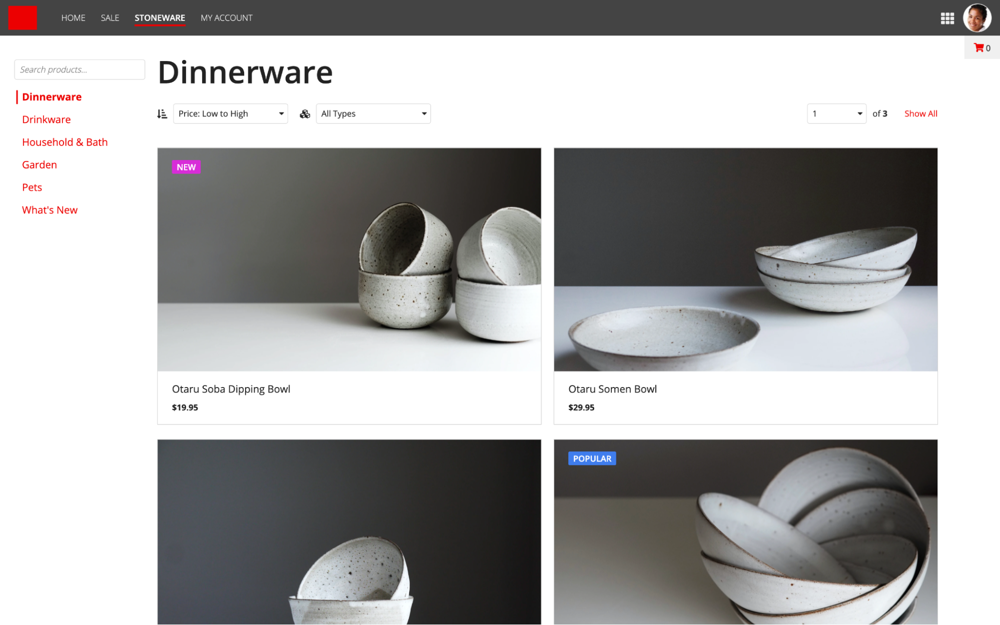
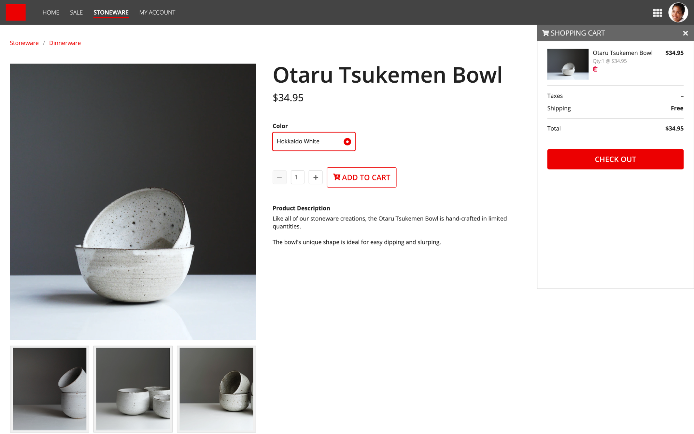
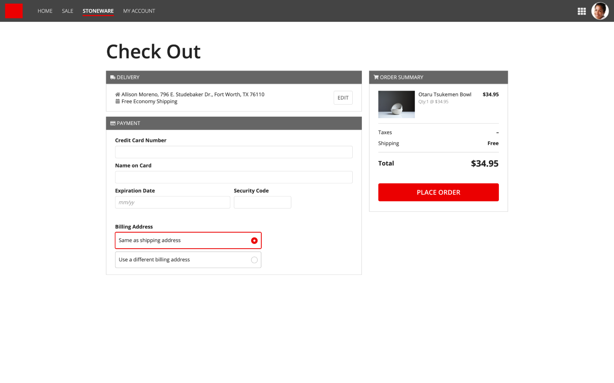
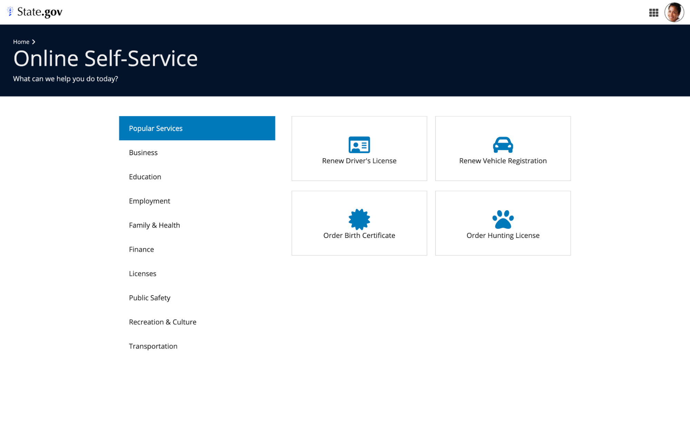
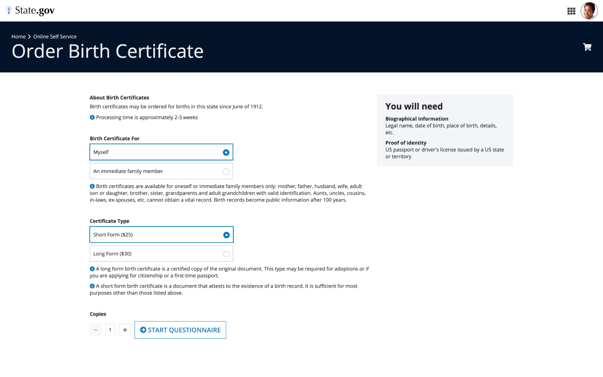

# Online Shopping Journey [SAIL Design System: Patterns]

*Section: patterns | source: https://docs.appian.com/suite/help/26.7/sail/online-shopping-journey.html | images referenced live in corpus/images/*

# Online Shopping Journey

Use familiar eCommerce patterns for apps where users browse, select, and check out items.

## Item category listing

Use this pattern to list items within a product category. Click on a card to navigate to the corresponding item details page.

Note the minimized shopping cart shortcut in the upper right corner.



```sail
a!headerContentLayout(
  header: {},
  contents: {
    a!columnsLayout(
      columns: {
        a!columnLayout(
          contents: {
            a!cardLayout(
              contents: {
                a!cardLayout(
                  height: "AUTO",
                  showWhen: true,
                  padding: "LESS",
                  showBorder: false
                ),
                a!columnsLayout(
                  columns: {
                    a!columnLayout(
                      contents: {
                        a!textField(
                          label: "",
                          labelPosition: "ABOVE",
                          placeholder: "Search products...",
                          saveInto: {},
                          refreshAfter: "UNFOCUS",
                          validations: {},
                          accessibilityText: "Search products"
                        ),
                        a!cardLayout(
                          contents: {
                            a!sideBySideLayout(
                              items: {
                                a!sideBySideItem(
                                  item: a!richTextDisplayField(
                                    labelPosition: "COLLAPSED",
                                    value: {
                                      a!richTextItem(text: { "❘" }, color: "ACCENT", size: "LARGE")
                                    }
                                  ),
                                  width: "MINIMIZE"
                                ),
                                a!sideBySideItem(
                                  item: a!richTextDisplayField(
                                    labelPosition: "COLLAPSED",
                                    value: {
                                      a!richTextItem(
                                        text: { "Dinnerware" },
                                        color: "ACCENT",
                                        size: "MEDIUM",
                                        style: { "STRONG" }
                                      )
                                    }
                                  )
                                )
                              },
                              alignVertical: "MIDDLE",
                              spacing: "DENSE"
                            )
                          },
                          link: a!dynamicLink(saveInto: {}),
                          height: "AUTO",
                          style: "#ffffff",
                          padding: "NONE",
                          marginBelow: "NONE",
                          showBorder: false
                        ),
                        a!cardLayout(
                          contents: {
                            a!sideBySideLayout(
                              items: {
                                a!sideBySideItem(
                                  item: a!richTextDisplayField(
                                    label: "Rich Text",
                                    labelPosition: "COLLAPSED",
                                    value: {
                                      a!richTextItem(
                                        text: { "❘" },
                                        color: "#ffffff",
                                        size: "LARGE"
                                      )
                                    }
                                  ),
                                  width: "MINIMIZE"
                                ),
                                a!sideBySideItem(
                                  item: a!richTextDisplayField(
                                    label: "Rich Text",
                                    labelPosition: "COLLAPSED",
                                    value: {
                                      a!richTextItem(
                                        text: { "Drinkware" },
                                        color: "ACCENT",
                                        size: "MEDIUM"
                                      )
                                    }
                                  )
                                )
                              },
                              alignVertical: "MIDDLE",
                              spacing: "DENSE"
                            )
                          },
                          link: a!dynamicLink(label: "Dynamic Link", saveInto: {}),
                          height: "AUTO",
                          style: "#ffffff",
                          padding: "NONE",
                          marginBelow: "NONE",
                          showBorder: false
                        ),
                        a!cardLayout(
                          contents: {
                            a!sideBySideLayout(
                              items: {
                                a!sideBySideItem(
                                  item: a!richTextDisplayField(
                                    label: "Rich Text",
                                    labelPosition: "COLLAPSED",
                                    value: {
                                      a!richTextItem(
                                        text: { "❘" },
                                        color: "#ffffff",
                                        size: "LARGE"
                                      )
                                    }
                                  ),
                                  width: "MINIMIZE"
                                ),
                                a!sideBySideItem(
                                  item: a!richTextDisplayField(
                                    label: "Rich Text",
                                    labelPosition: "COLLAPSED",
                                    value: {
                                      a!richTextItem(
                                        text: { "Household & Bath" },
                                        color: "ACCENT",
                                        size: "MEDIUM"
                                      )
                                    }
                                  )
                                )
                              },
                              alignVertical: "MIDDLE",
                              spacing: "DENSE"
                            )
                          },
                          link: a!dynamicLink(label: "Dynamic Link", saveInto: {}),
                          height: "AUTO",
                          style: "#ffffff",
                          padding: "NONE",
                          marginBelow: "NONE",
                          showBorder: false
                        ),
                        a!cardLayout(
                          contents: {
                            a!sideBySideLayout(
                              items: {
                                a!sideBySideItem(
                                  item: a!richTextDisplayField(
                                    label: "Rich Text",
                                    labelPosition: "COLLAPSED",
                                    value: {
                                      a!richTextItem(
                                        text: { "❘" },
                                        color: "#ffffff",
                                        size: "LARGE"
                                      )
                                    }
                                  ),
                                  width: "MINIMIZE"
                                ),
                                a!sideBySideItem(
                                  item: a!richTextDisplayField(
                                    label: "Rich Text",
                                    labelPosition: "COLLAPSED",
                                    value: {
                                      a!richTextItem(
                                        text: { "Garden" },
                                        color: "ACCENT",
                                        size: "MEDIUM"
                                      )
                                    }
                                  )
                                )
                              },
                              alignVertical: "MIDDLE",
                              spacing: "DENSE"
                            )
                          },
                          link: a!dynamicLink(label: "Dynamic Link", saveInto: {}),
                          height: "AUTO",
                          style: "#ffffff",
                          padding: "NONE",
                          marginBelow: "NONE",
                          showBorder: false
                        ),
                        a!cardLayout(
                          contents: {
                            a!sideBySideLayout(
                              items: {
                                a!sideBySideItem(
                                  item: a!richTextDisplayField(
                                    label: "Rich Text",
                                    labelPosition: "COLLAPSED",
                                    value: {
                                      a!richTextItem(
                                        text: { "❘" },
                                        color: "#ffffff",
                                        size: "LARGE"
                                      )
                                    }
                                  ),
                                  width: "MINIMIZE"
                                ),
                                a!sideBySideItem(
                                  item: a!richTextDisplayField(
                                    label: "Rich Text",
                                    labelPosition: "COLLAPSED",
                                    value: {
                                      a!richTextItem(
                                        text: { "Pets" },
                                        color: "ACCENT",
                                        size: "MEDIUM"
                                      )
                                    }
                                  )
                                )
                              },
                              alignVertical: "MIDDLE",
                              spacing: "DENSE"
                            )
                          },
                          link: a!dynamicLink(label: "Dynamic Link", saveInto: {}),
                          height: "AUTO",
                          style: "#ffffff",
                          padding: "NONE",
                          marginBelow: "NONE",
                          showBorder: false
                        ),
                        a!cardLayout(
                          contents: {
                            a!sideBySideLayout(
                              items: {
                                a!sideBySideItem(
                                  item: a!richTextDisplayField(
                                    label: "Rich Text",
                                    labelPosition: "COLLAPSED",
                                    value: {
                                      a!richTextItem(
                                        text: { "❘" },
                                        color: "#ffffff",
                                        size: "LARGE"
                                      )
                                    }
                                  ),
                                  width: "MINIMIZE"
                                ),
                                a!sideBySideItem(
                                  item: a!richTextDisplayField(
                                    label: "Rich Text",
                                    labelPosition: "COLLAPSED",
                                    value: {
                                      a!richTextItem(
                                        text: { "What's New" },
                                        color: "ACCENT",
                                        size: "MEDIUM"
                                      )
                                    }
                                  )
                                )
                              },
                              alignVertical: "MIDDLE",
                              spacing: "DENSE"
                            )
                          },
                          link: a!dynamicLink(label: "Dynamic Link", saveInto: {}),
                          height: "AUTO",
                          padding: "NONE",
                          marginBelow: "NONE",
                          showBorder: false
                        )
                      },
                      width: "NARROW"
                    ),
                    a!columnLayout(
                      contents: {
                        a!sectionLayout(
                          label: "Dinnerware",
                          labelSize: "LARGE_PLUS",
                          labelHeadingTag: "H1",
                          labelColor: "STANDARD",
                          contents: {}
                        ),
                        a!columnsLayout(
                          columns: {
                            a!columnLayout(
                              contents: {
                                a!sideBySideLayout(
                                  items: {
                                    a!sideBySideItem(
                                      item: a!richTextDisplayField(
                                        labelPosition: "COLLAPSED",
                                        value: {
                                          a!richTextIcon(
                                            icon: "sort-amount-asc",
                                            size: "MEDIUM"
                                          )
                                        }
                                      ),
                                      width: "MINIMIZE"
                                    ),
                                    a!sideBySideItem(
                                      item: a!dropdownField(
                                        label: "Sort Order",
                                        labelPosition: "COLLAPSED",
                                        placeholder: "--- Select a Value ---",
                                        choiceLabels: {
                                          "Price: Low to High",
                                          "Price: High to Low",
                                          "Most Popular",
                                          "Featured"
                                        },
                                        choiceValues: {
                                          1,
                                          2,
                                          3,
                                          4
                                        },
                                        value: 1,
                                        saveInto: {},
                                        searchDisplay: "AUTO",
                                        validations: {}
                                      )
                                    )
                                  },
                                  alignVertical: "MIDDLE"
                                )
                              },
                              width: "NARROW"
                            ),
                            a!columnLayout(
                              contents: {
                                a!sideBySideLayout(
                                  items: {
                                    a!sideBySideItem(
                                      item: a!richTextDisplayField(
                                        labelPosition: "COLLAPSED",
                                        value: {
                                          a!richTextIcon(
                                            icon: "cubes",
                                            size: "MEDIUM"
                                          )
                                        }
                                      ),
                                      width: "MINIMIZE"
                                    ),
                                    a!sideBySideItem(
                                      item: a!dropdownField(
                                        label: "Sort Order",
                                        labelPosition: "COLLAPSED",
                                        placeholder: "",
                                        choiceLabels: {
                                          "All Types",
                                          "Plates",
                                          "Bowls",
                                          "Serviceware"
                                        },
                                        choiceValues: {
                                          1,
                                          2,
                                          3,
                                          4
                                        },
                                        value: 1,
                                        saveInto: {},
                                        searchDisplay: "AUTO",
                                        validations: {}
                                      )
                                    )
                                  },
                                  alignVertical: "MIDDLE"
                                )
                              },
                              width: "NARROW"
                            ),
                            a!columnLayout(
                              contents: {}
                            ),
                            a!columnLayout(
                              contents: {
                                a!sideBySideLayout(
                                  items: {
                                    a!sideBySideItem(
                                      item: a!dropdownField(
                                        label: "Page",
                                        labelPosition: "COLLAPSED",
                                        choiceLabels: {
                                          "1",
                                          "2",
                                          "3"
                                        },
                                        choiceValues: {
                                          1,
                                          2,
                                          3
                                        },
                                        value: 1,
                                        saveInto: {},
                                        searchDisplay: "AUTO",
                                        validations: {}
                                      )
                                    ),
                                    a!sideBySideItem(
                                      item: a!richTextDisplayField(
                                        labelPosition: "COLLAPSED",
                                        value: {
                                          "of ",
                                          a!richTextItem(
                                            text: {
                                              "3"
                                            },
                                            style: {
                                              "STRONG"
                                            }
                                          ),
                                          "        ",
                                          a!richTextItem(
                                            text: {
                                              "Show All"
                                            },
                                            link: a!safeLink(
                                              uri: "www.appian.com",
                                              openLinkIn: "SAME_TAB"
                                            ),
                                            linkStyle: "STANDALONE"
                                          )
                                        }
                                      ),
                                      width: "MINIMIZE"
                                    )
                                  },
                                  alignVertical: "MIDDLE"
                                )
                              },
                              width: "NARROW"
                            )
                          }
                        ),
                        a!cardLayout(
                          contents: {},
                          height: "AUTO",
                          style: "NONE",
                          marginBelow: "STANDARD",
                          showBorder: false
                        ),
                        a!columnsLayout(
                          columns: {
                            a!columnLayout(
                              contents: {
                                a!cardLayout(
                                  contents: {
                                    a!billboardLayout(
                                      backgroundMedia: a!webImage(source:"https://images.unsplash.com/photo-1556872801-14f7230b307f?ixid=MnwxMjA3fDB8MHxwaG90by1wYWdlfHx8fGVufDB8fHx8&ixlib=rb-1.2.1&auto=format&fit=crop&w=2100&q=80"),
                                      backgroundColor: "#f0f0f0",
                                      height: "MEDIUM_PLUS",
                                      marginBelow: "NONE",
                                      overlay: a!fullOverlay(
                                        alignVertical: "TOP",
                                        contents: {
                                          a!tagField(
                                            labelPosition: "COLLAPSED",
                                            tags: {
                                              a!tagItem(
                                                text: "NEW",
                                                backgroundColor: "#d82bd8"
                                              )
                                            }
                                          )
                                        },
                                        style: "NONE"
                                      )
                                    ),
                                    a!cardLayout(
                                      contents: {
                                        a!richTextDisplayField(
                                          labelPosition: "COLLAPSED",
                                          value: {
                                            a!richTextItem(
                                              text: {
                                                "Otaru Soba Dipping Bowl"
                                              },
                                              size: "MEDIUM"
                                            )
                                          }
                                        ),
                                        a!richTextDisplayField(
                                          labelPosition: "COLLAPSED",
                                          value: {
                                            a!richTextItem(
                                              text: {
                                                "$19.95"
                                              },
                                              size: "STANDARD",
                                              style: {
                                                "STRONG"
                                              }
                                            )
                                          }
                                        )
                                      },
                                      height: "AUTO",
                                      style: "NONE",
                                      padding: "STANDARD",
                                      marginBelow: "NONE",
                                      showBorder: false
                                    )
                                  },
                                  link: a!dynamicLink(
                                    label: "Dynamic Link",
                                    saveInto: {}
                                  ),
                                  height: "AUTO",
                                  style: "NONE",
                                  padding: "NONE",
                                  marginBelow: "STANDARD"
                                )
                              }
                            ),
                            a!columnLayout(
                              contents: {
                                a!cardLayout(
                                  contents: {
                                    a!billboardLayout(
                                      backgroundMedia: a!webImage(source:"https://images.unsplash.com/photo-1525973779373-015bdf68e579?ixid=MnwxMjA3fDB8MHxwaG90by1wYWdlfHx8fGVufDB8fHx8&ixlib=rb-1.2.1&auto=format&fit=crop&w=1867&q=80"),
                                      backgroundColor: "#f0f0f0",
                                      height: "MEDIUM_PLUS",
                                      marginBelow: "NONE"
                                    ),
                                    a!cardLayout(
                                      contents: {
                                        a!richTextDisplayField(
                                          labelPosition: "COLLAPSED",
                                          value: {
                                            a!richTextItem(
                                              text: {
                                                "Otaru Somen Bowl"
                                              },
                                              size: "MEDIUM"
                                            )
                                          }
                                        ),
                                        a!richTextDisplayField(
                                          labelPosition: "COLLAPSED",
                                          value: {
                                            a!richTextItem(
                                              text: {
                                                "$29.95"
                                              },
                                              size: "STANDARD",
                                              style: {
                                                "STRONG"
                                              }
                                            )
                                          }
                                        )
                                      },
                                      height: "AUTO",
                                      style: "NONE",
                                      padding: "STANDARD",
                                      marginBelow: "NONE",
                                      showBorder: false
                                    )
                                  },
                                  link: a!dynamicLink(
                                    label: "Dynamic Link",
                                    saveInto: {}
                                  ),
                                  height: "AUTO",
                                  style: "NONE",
                                  padding: "NONE",
                                  marginBelow: "STANDARD"
                                )
                              }
                            )
                          }
                        ),
                        a!columnsLayout(
                          columns: {
                            a!columnLayout(
                              contents: {
                                a!cardLayout(
                                  contents: {
                                    a!billboardLayout(
                                      backgroundMedia: a!webImage(source:"https://images.unsplash.com/photo-1530006498959-b7884e829a04?ixlib=rb-1.2.1&ixid=MnwxMjA3fDB8MHxwaG90by1wYWdlfHx8fGVufDB8fHx8&auto=format&fit=crop&w=1866&q=80"),
                                      backgroundColor: "#f0f0f0",
                                      height: "MEDIUM_PLUS",
                                      marginBelow: "NONE"
                                    ),
                                    a!cardLayout(
                                      contents: {
                                        a!richTextDisplayField(
                                          labelPosition: "COLLAPSED",
                                          value: {
                                            a!richTextItem(
                                              text: {
                                                "Otaru Tsukemen Bowl"
                                              },
                                              size: "MEDIUM"
                                            )
                                          }
                                        ),
                                        a!richTextDisplayField(
                                          labelPosition: "COLLAPSED",
                                          value: {
                                            a!richTextItem(
                                              text: {
                                                "$34.95"
                                              },
                                              size: "STANDARD",
                                              style: {
                                                "STRONG"
                                              }
                                            )
                                          }
                                        )
                                      },
                                      height: "AUTO",
                                      style: "NONE",
                                      padding: "STANDARD",
                                      marginBelow: "NONE",
                                      showBorder: false
                                    )
                                  },
                                  link: a!dynamicLink(
                                    label: "Dynamic Link",
                                    saveInto: {}
                                  ),
                                  height: "AUTO",
                                  style: "NONE",
                                  padding: "NONE",
                                  marginBelow: "STANDARD"
                                )
                              }
                            ),
                            a!columnLayout(
                              contents: {
                                a!cardLayout(
                                  contents: {
                                    a!billboardLayout(
                                      backgroundMedia: a!webImage(source:"https://images.unsplash.com/photo-1572003414130-d1b4632a0d73?ixid=MnwxMjA3fDB8MHxwaG90by1wYWdlfHx8fGVufDB8fHx8&ixlib=rb-1.2.1&auto=format&fit=crop&w=2100&q=80"),
                                      backgroundColor: "#f0f0f0",
                                      height: "MEDIUM_PLUS",
                                      marginBelow: "NONE",
                                      overlay: a!fullOverlay(
                                        alignVertical: "TOP",
                                        contents: {
                                          a!tagField(
                                            labelPosition: "COLLAPSED",
                                            tags: {
                                              a!tagItem(
                                                text: "POPULAR",
                                                backgroundColor: "#3f7eed"
                                              )
                                            }
                                          )
                                        },
                                        style: "NONE"
                                      )
                                    ),
                                    a!cardLayout(
                                      contents: {
                                        a!richTextDisplayField(
                                          labelPosition: "COLLAPSED",
                                          value: {
                                            a!richTextItem(
                                              text: {
                                                "Otaru Ramen Bowl"
                                              },
                                              size: "MEDIUM"
                                            )
                                          }
                                        ),
                                        a!richTextDisplayField(
                                          labelPosition: "COLLAPSED",
                                          value: {
                                            a!richTextItem(
                                              text: {
                                                "$39.95"
                                              },
                                              size: "STANDARD",
                                              style: {
                                                "STRONG"
                                              }
                                            )
                                          }
                                        )
                                      },
                                      height: "AUTO",
                                      style: "NONE",
                                      padding: "STANDARD",
                                      marginBelow: "NONE",
                                      showBorder: false
                                    )
                                  },
                                  link: a!dynamicLink(
                                    label: "Dynamic Link",
                                    saveInto: {}
                                  ),
                                  height: "AUTO",
                                  style: "NONE",
                                  padding: "NONE",
                                  marginBelow: "STANDARD"
                                )
                              }
                            )
                          }
                        )
                      }
                    )
                  },
                  stackWhen: {
                    "PHONE",
                    "TABLET_PORTRAIT",
                    "TABLET_LANDSCAPE",
                    "DESKTOP_NARROW"
                  }
                )
              },
              height: "AUTO",
              padding: "STANDARD",
              showBorder: false
            )
          }
        ),
        a!columnLayout(
          contents: {
            a!cardLayout(
              contents: {
                a!richTextDisplayField(
                  labelPosition: "COLLAPSED",
                  value: {
                    a!richTextIcon(
                      icon: "shopping-cart",
                      color: "ACCENT",
                      size: "MEDIUM"
                    ),
                    " 0"
                  },
                  align: "CENTER"
                )
              },
              link: a!dynamicLink(
                label: "Dynamic Link",
                saveInto: {}
              ),
              height: "AUTO",
              style: "STANDARD",
              padding: "LESS",
              marginBelow: "NONE",
              showBorder: false,
              accessibilityText: "Shopping Cart (Zero Items)"
            )
          },
          width: "EXTRA_NARROW"
        )
      },
      showDividers: false
    )
  },
  backgroundColor: "WHITE",
  contentsPadding: "NONE"
)
```

## Item details page and cart

Use this pattern to show details of a selected item. Users can choose item options and add the item to their shopping cart.

Take note of:

- Breadcrumbs for returning to the item listing page

- The expanded view of the shopping cart (clicking the "x" will restore the minimized state)



```sail
a!headerContentLayout(
  header: {},
  contents: {
    a!columnsLayout(
      columns: {
        a!columnLayout(
          contents: {
            a!cardLayout(
              contents: {
                a!cardLayout(
                  height: "AUTO",
                  showWhen: true,
                  padding: "LESS",
                  showBorder: false
                ),
                a!sideBySideLayout(
                  items: {
                    a!sideBySideItem(
                      item: a!richTextDisplayField(
                        labelPosition: "COLLAPSED",
                        value: {
                          a!richTextItem(
                            text: {
                              "Stoneware"
                            },
                            link: a!safeLink(
                              uri: "www.appian.com",
                              openLinkIn: "NEW_TAB"
                            ),
                            linkStyle: "STANDALONE"
                          )
                        }
                      ),
                      width: "MINIMIZE"
                    ),
                    a!sideBySideItem(
                      item: a!richTextDisplayField(
                        labelPosition: "COLLAPSED",
                        value: {
                          a!richTextItem(
                            text: {
                              "/"
                            },
                            color: "SECONDARY"
                          )
                        }
                      ),
                      width: "MINIMIZE"
                    ),
                    a!sideBySideItem(
                      item: a!richTextDisplayField(
                        labelPosition: "COLLAPSED",
                        value: {
                          a!richTextItem(
                            text: {
                              "Dinnerware"
                            },
                            link: a!safeLink(
                              uri: "www.appian.com",
                              openLinkIn: "NEW_TAB"
                            ),
                            linkStyle: "STANDALONE"
                          )
                        }
                      ),
                      width: "MINIMIZE"
                    )
                  },
                  alignVertical: "MIDDLE"
                ),
                a!cardLayout(
                  contents: {},
                  height: "AUTO",
                  style: "NONE",
                  marginBelow: "STANDARD",
                  showBorder: false
                ),
                a!columnsLayout(
                  columns: {
                    a!columnLayout(
                      contents: {
                        a!billboardLayout(
                          backgroundMedia: a!webImage(source:"https://images.unsplash.com/photo-1530006498959-b7884e829a04?ixlib=rb-1.2.1&ixid=MnwxMjA3fDB8MHxwaG90by1wYWdlfHx8fGVufDB8fHx8&auto=format&fit=crop&w=1866&q=80"),
                          backgroundColor: "#f0f0f0",
                          height: "EXTRA_TALL",
                          marginBelow: "STANDARD"
                        ),
                        a!columnsLayout(
                          columns: {
                            a!columnLayout(
                              contents: {
                                a!cardLayout(
                                  contents: {
                                    a!billboardLayout(
                                      backgroundMedia: a!webImage(source:"https://images.unsplash.com/photo-1580485978320-cc2bc7dcf569?ixid=MnwxMjA3fDB8MHxwaG90by1wYWdlfHx8fGVufDB8fHx8&ixlib=rb-1.2.1&auto=format&fit=crop&w=2100&q=80"),
                                      backgroundColor: "#f0f0f0",
                                      height: "SHORT",
                                      marginBelow: "NONE"
                                    )
                                  },
                                  link: a!dynamicLink(
                                    label: "Dynamic Link",
                                    saveInto: {}
                                  ),
                                  height: "AUTO",
                                  style: "STANDARD",
                                  padding: "EVEN_LESS",
                                  marginBelow: "STANDARD"
                                )
                              }
                            ),
                            a!columnLayout(
                              contents: {
                                a!cardLayout(
                                  contents: {
                                    a!billboardLayout(
                                      backgroundMedia: a!webImage(source:"https://images.unsplash.com/photo-1556205801-a0bf81cdc90d?ixid=MnwxMjA3fDB8MHxwaG90by1wYWdlfHx8fGVufDB8fHx8&ixlib=rb-1.2.1&auto=format&fit=crop&w=2100&q=80"),
                                      backgroundColor: "#f0f0f0",
                                      height: "SHORT",
                                      marginBelow: "NONE"
                                    )
                                  },
                                  link: a!dynamicLink(
                                    label: "Dynamic Link",
                                    saveInto: {}
                                  ),
                                  height: "AUTO",
                                  style: "STANDARD",
                                  padding: "EVEN_LESS",
                                  marginBelow: "STANDARD"
                                )
                              }
                            ),
                            a!columnLayout(
                              contents: {
                                a!cardLayout(
                                  contents: {
                                    a!billboardLayout(
                                      backgroundMedia: a!webImage(source:"https://images.unsplash.com/photo-1556872801-14f7230b307f?ixid=MnwxMjA3fDB8MHxwaG90by1wYWdlfHx8fGVufDB8fHx8&ixlib=rb-1.2.1&auto=format&fit=crop&w=2100&q=80"),
                                      backgroundColor: "#f0f0f0",
                                      height: "SHORT",
                                      marginBelow: "NONE"
                                    )
                                  },
                                  link: a!dynamicLink(
                                    label: "Dynamic Link",
                                    saveInto: {}
                                  ),
                                  height: "AUTO",
                                  style: "STANDARD",
                                  padding: "EVEN_LESS",
                                  marginBelow: "STANDARD"
                                )
                              }
                            )
                          },
                          spacing: "DENSE"
                        )
                      }
                    ),
                    a!columnLayout(
                      contents: {
                        a!sectionLayout(
                          label: "Otaru Tsukemen Bowl",
                          labelSize: "LARGE_PLUS",
                          labelHeadingTag: "H1",
                          labelColor: "STANDARD",
                          contents: {
                            a!richTextDisplayField(
                              labelPosition: "COLLAPSED",
                              value: {
                                a!richTextItem(
                                  text: {
                                    "$34.95"
                                  },
                                  size: "MEDIUM_PLUS"
                                )
                              }
                            )
                          }
                        ),
                        a!cardLayout(
                          contents: {},
                          height: "AUTO",
                          style: "NONE",
                          marginBelow: "STANDARD",
                          showBorder: false
                        ),
                        a!radioButtonField(
                          label: "Color",
                          labelPosition: "ABOVE",
                          choiceLabels: {"Hokkaido White"},
                          choiceValues: {1},
                          value: 1,
                          saveInto: {},
                          choiceLayout: "COMPACT",
                          choiceStyle: "CARDS",
                          validations: {}
                        ),
                        a!cardLayout(
                          contents: {},
                          height: "AUTO",
                          style: "NONE",
                          marginBelow: "STANDARD",
                          showBorder: false
                        ),
                        a!columnsLayout(
                          columns: {
                            a!columnLayout(
                              contents: {
                                a!sideBySideLayout(
                                  items: {
                                    a!sideBySideItem(
                                      item: a!buttonArrayLayout(
                                        buttons: {
                                          a!buttonWidget(
                                            label: "",
                                            icon: "minus",
                                            size: "SMALL",
                                            style: "OUTLINE",
                                            color: "SECONDARY",
                                            disabled: true
                                          )
                                        },
                                        align: "START",
                                        marginBelow: "NONE"
                                      ),
                                      width: "MINIMIZE"
                                    ),
                                    a!sideBySideItem(
                                      item: a!integerField(
                                        label: "Quantity",
                                        labelPosition: "COLLAPSED",
                                        value: 1,
                                        saveInto: {},
                                        refreshAfter: "UNFOCUS",
                                        validations: {}
                                      )
                                    ),
                                    a!sideBySideItem(
                                      item: a!buttonArrayLayout(
                                        buttons: {
                                          a!buttonWidget(
                                            label: "",
                                            icon: "plus",
                                            size: "SMALL",
                                            style: "OUTLINE",
                                            color: "SECONDARY",
                                            disabled: false
                                          )
                                        },
                                        align: "START",
                                        marginBelow: "NONE"
                                      ),
                                      width: "MINIMIZE"
                                    ),
                                    a!sideBySideItem(
                                      item: a!buttonArrayLayout(
                                        buttons: {
                                          a!buttonWidget(
                                            label: "Add to Cart",
                                            icon: "cart-plus",
                                            size: "LARGE",
                                            style: "OUTLINE"
                                          )
                                        },
                                        align: "START",
                                        marginBelow: "NONE"
                                      ),
                                      width: "MINIMIZE"
                                    )
                                  },
                                  alignVertical: "MIDDLE"
                                )
                              },
                              width: "NARROW_PLUS"
                            ),
                            a!columnLayout(
                              contents: {}
                            )
                          }
                        ),
                        a!cardLayout(
                          contents: {},
                          height: "AUTO",
                          style: "NONE",
                          marginBelow: "STANDARD",
                          showBorder: false
                        ),
                        a!richTextDisplayField(
                          label: "Product Description",
                          labelPosition: "ABOVE",
                          value: {
                            "Like all of our stoneware creations, the Otaru Tsukemen Bowl is hand-crafted in limited quantities.",
                            char(10),
                            char(10),
                            "The bowl's unique shape is ideal for easy dipping and slurping."
                          }
                        )
                      }
                    )
                  },
                  spacing: "SPARSE",
                  stackWhen: {
                    "PHONE",
                    "TABLET_PORTRAIT",
                    "TABLET_LANDSCAPE",
                    "DESKTOP_NARROW"
                  }
                )
              },
              height: "AUTO",
              padding: "STANDARD",
              showBorder: false
            )
          }
        ),
        a!columnLayout(
          contents: {
            a!cardLayout(
              contents: {
                a!sideBySideLayout(
                  items: {
                    a!sideBySideItem(
                      item: a!richTextDisplayField(
                        labelPosition: "COLLAPSED",
                        value: {
                          a!richTextItem(
                            text: {
                              a!richTextIcon(
                                icon: "shopping-cart"
                              ),
                              " SHOPPING CART"
                            },
                            size: "MEDIUM"
                          )
                        }
                      )
                    ),
                    a!sideBySideItem(
                      item: a!richTextDisplayField(
                        labelPosition: "COLLAPSED",
                        value: {
                          a!richTextIcon(
                            icon: "times",
                            link: a!safeLink(
                              uri: "www.appian.com",
                              openLinkIn: "NEW_TAB"
                            ),
                            linkStyle: "STANDALONE",
                            size: "MEDIUM"
                          )
                        }
                      ),
                      width: "MINIMIZE"
                    )
                  },
                  alignVertical: "MIDDLE"
                )
              },
              height: "AUTO",
              style: "#666666",
              marginBelow: "NONE",
              showBorder: false
            ),
            a!cardLayout(
              contents: {
                a!sectionLayout(
                  label: "",
                  contents: {
                    a!sideBySideLayout(
                      items: {
                        a!sideBySideItem(
                          item: a!imageField(
                            label: "Product Image",
                            labelPosition: "COLLAPSED",
                            images: {
                              a!webImage(
                                source: "https://images.unsplash.com/photo-1530006498959-b7884e829a04?ixlib=rb-1.2.1&ixid=MnwxMjA3fDB8MHxwaG90by1wYWdlfHx8fGVufDB8fHx8&auto=format&fit=crop&w=1866&q=80"
                              )
                            },
                            size: "SMALL",
                            isThumbnail: false,
                            style: "STANDARD"
                          ),
                          width: "MINIMIZE"
                        ),
                        a!sideBySideItem(
                          item: a!richTextDisplayField(
                            labelPosition: "COLLAPSED",
                            value: {
                              "Otaru Tsukemen Bowl",
                              char(10),
                              a!richTextItem(
                                text: {
                                  "Qty:1 @ $34.95 "
                                },
                                color: "SECONDARY",
                                size: "SMALL"
                              ),
                              char(10),
                              a!richTextIcon(
                                icon: "trash-o",
                                color: "NEGATIVE",
                                size: "SMALL"
                              )
                            }
                          )
                        ),
                        a!sideBySideItem(
                          item: a!richTextDisplayField(
                            labelPosition: "COLLAPSED",
                            value: {
                              a!richTextItem(
                                text: {
                                  "$34.95"
                                },
                                style: {
                                  "STRONG"
                                }
                              )
                            }
                          ),
                          width: "MINIMIZE"
                        )
                      }
                    )
                  },
                  divider: "BELOW"
                ),
                a!sectionLayout(
                  label: "",
                  contents: {
                    a!sideBySideLayout(
                      items: {
                        a!sideBySideItem(
                          item: a!richTextDisplayField(
                            labelPosition: "COLLAPSED",
                            value: {
                              "Taxes"
                            }
                          )
                        ),
                        a!sideBySideItem(
                          item: a!richTextDisplayField(
                            labelPosition: "COLLAPSED",
                            value: {
                              a!richTextItem(
                                text: {
                                  "–"
                                },
                                style: {
                                  "STRONG"
                                }
                              )
                            }
                          ),
                          width: "MINIMIZE"
                        )
                      }
                    ),
                    a!sideBySideLayout(
                      items: {
                        a!sideBySideItem(
                          item: a!richTextDisplayField(
                            labelPosition: "COLLAPSED",
                            value: {
                              "Shipping"
                            }
                          )
                        ),
                        a!sideBySideItem(
                          item: a!richTextDisplayField(
                            labelPosition: "COLLAPSED",
                            value: {
                              a!richTextItem(
                                text: {
                                  "Free"
                                },
                                style: {
                                  "STRONG"
                                }
                              )
                            }
                          ),
                          width: "MINIMIZE"
                        )
                      }
                    )
                  },
                  divider: "BELOW"
                ),
                a!sideBySideLayout(
                  items: {
                    a!sideBySideItem(
                      item: a!richTextDisplayField(
                        labelPosition: "COLLAPSED",
                        value: {
                          "Total"
                        }
                      )
                    ),
                    a!sideBySideItem(
                      item: a!richTextDisplayField(
                        labelPosition: "COLLAPSED",
                        value: {
                          a!richTextItem(
                            text: {
                              "$34.95"
                            },
                            style: {
                              "STRONG"
                            }
                          )
                        }
                      ),
                      width: "MINIMIZE"
                    )
                  }
                ),
                a!cardLayout(
                  contents: {},
                  height: "AUTO",
                  style: "NONE",
                  marginBelow: "STANDARD",
                  showBorder: false
                ),
                a!buttonArrayLayout(
                  buttons: {
                    a!buttonWidget(
                      label: "Check Out",
                      size: "LARGE",
                      width: "FILL",
                      style: "SOLID"
                    )
                  },
                  align: "START"
                )
              },
              link: a!dynamicLink(
                label: "Dynamic Link",
                saveInto: {}
              ),
              height: "EXTRA_TALL",
              style: "NONE",
              padding: "STANDARD",
              marginBelow: "NONE",
              showBorder: true,
              accessibilityText: "Shopping Cart (Zero Items)"
            )
          },
          width: "MEDIUM"
        )
      },
      showDividers: false
    )
  },
  backgroundColor: "WHITE",
  contentsPadding: "NONE"
)
```

## Checkout page

This pattern incorporates multiple steps into one page. After the user completes the "Delivery" section, a concise summary of their inputs is displayed, and the "Payment" section is automatically expanded.

** Use the noun form, "Checkout page," or the verb form, "Check out now," in label text as appropriate.



```sail
a!headerContentLayout(
  header: {
    a!cardLayout(
      contents: {},
      height: "AUTO",
      style: "NONE",
      padding: "STANDARD",
      marginBelow: "NONE",
      showBorder: false
    )
  },
  contents: {
    a!columnsLayout(
      columns: {
        a!columnLayout(
          contents: {}
        ),
        a!columnLayout(
          contents: {
            a!sectionLayout(
              label: "Check Out",
              labelSize: "LARGE_PLUS",
              labelHeadingTag: "H1",
              labelColor: "STANDARD",
              contents: {}
            ),
            a!columnsLayout(
              columns: {
                a!columnLayout(
                  contents: {
                    a!cardLayout(
                      contents: {
                        a!richTextDisplayField(
                          labelPosition: "COLLAPSED",
                          value: {
                            a!richTextIcon(
                              icon: "truck"
                            ),
                            " DELIVERY"
                          }
                        )
                      },
                      link: a!dynamicLink(
                        label: "Dynamic Link",
                        saveInto: {}
                      ),
                      height: "AUTO",
                      style: "#666666",
                      marginBelow: "NONE",
                      showBorder: false
                    ),
                    a!cardLayout(
                      contents: {
                        a!sideBySideLayout(
                          items: {
                            a!sideBySideItem(
                              item: a!richTextDisplayField(
                                label: "Ship To",
                                labelPosition: "COLLAPSED",
                                value: {
                                  a!richTextIcon(
                                    icon: "home",
                                    color: "SECONDARY"
                                  ),
                                  " Allison Moreno, 796 E. Studebaker Dr., Fort Worth, TX 76110",
                                  char(10),
                                  a!richTextIcon(
                                    icon: "calendar",
                                    color: "SECONDARY"
                                  ),
                                  " Free Economy Shipping"
                                }
                              )
                            ),
                            a!sideBySideItem(
                              item: a!buttonArrayLayout(
                                buttons: {
                                  a!buttonWidget(
                                    label: "Edit",
                                    style: "OUTLINE",
                                    color: "SECONDARY"
                                  )
                                },
                                align: "START",
                                marginBelow: "NONE"
                              ),
                              width: "MINIMIZE"
                            )
                          },
                          alignVertical: "MIDDLE"
                        )
                      },
                      height: "AUTO",
                      style: "NONE",
                      padding: "STANDARD",
                      marginBelow: "STANDARD"
                    ),
                    a!cardLayout(
                      contents: {
                        a!richTextDisplayField(
                          labelPosition: "COLLAPSED",
                          value: {
                            a!richTextIcon(
                              icon: "credit-card"
                            ),
                            " PAYMENT"
                          }
                        )
                      },
                      height: "AUTO",
                      style: "#666666",
                      marginBelow: "NONE",
                      showBorder: false
                    ),
                    a!cardLayout(
                      contents: {
                        a!integerField(
                          label: "Credit Card Number",
                          labelPosition: "ABOVE",
                          saveInto: {},
                          refreshAfter: "UNFOCUS",
                          validations: {}
                        ),
                        a!textField(
                          label: "Name on Card",
                          labelPosition: "ABOVE",
                          saveInto: {},
                          refreshAfter: "UNFOCUS",
                          validations: {}
                        ),
                        a!sideBySideLayout(
                          items: {
                            a!sideBySideItem(
                              item: a!textField(
                                label: "Expiration Date",
                                labelPosition: "ABOVE",
                                placeholder: "mm/yy",
                                saveInto: {},
                                refreshAfter: "UNFOCUS",
                                validations: {}
                              ),
                              width: "2X"
                            ),
                            a!sideBySideItem(
                              item: a!integerField(
                                label: "Security Code",
                                labelPosition: "ABOVE",
                                saveInto: {},
                                refreshAfter: "UNFOCUS",
                                validations: {}
                              )
                            ),
                            a!sideBySideItem()
                          }
                        ),
                        a!cardLayout(
                          contents: {},
                          height: "AUTO",
                          style: "NONE",
                          marginBelow: "STANDARD",
                          showBorder: false
                        ),
                        a!radioButtonField(
                          label: "Billing Address",
                          labelPosition: "ABOVE",
                          choiceLabels: {"Same as shipping address", "Use a different billing address"},
                          choiceValues: {1, 2},
                          value: 1,
                          saveInto: {},
                          choiceLayout: "STACKED",
                          choiceStyle: "CARDS",
                          validations: {}
                        )
                      },
                      height: "AUTO",
                      style: "NONE",
                      padding: "STANDARD",
                      marginBelow: "STANDARD"
                    )
                  }
                ),
                a!columnLayout(
                  contents: {
                    a!cardLayout(
                      contents: {
                        a!richTextDisplayField(
                          labelPosition: "COLLAPSED",
                          value: {
                            a!richTextItem(
                              text: {
                                a!richTextIcon(
                                  icon: "shopping-cart"
                                ),
                                " ORDER SUMMARY"
                              },
                              size: "STANDARD"
                            )
                          }
                        )
                      },
                      height: "AUTO",
                      style: "#666666",
                      marginBelow: "NONE",
                      showBorder: false
                    ),
                    a!cardLayout(
                      contents: {
                        a!sectionLayout(
                          label: "",
                          contents: {
                            a!sideBySideLayout(
                              items: {
                                a!sideBySideItem(
                                  item: a!imageField(
                                    label: "Product Image",
                                    labelPosition: "COLLAPSED",
                                    images: {
                                      a!webImage(
                                        source: "https://images.unsplash.com/photo-1530006498959-b7884e829a04?ixlib=rb-1.2.1&ixid=MnwxMjA3fDB8MHxwaG90by1wYWdlfHx8fGVufDB8fHx8&auto=format&fit=crop&w=1866&q=80"
                                      )
                                    },
                                    size: "SMALL",
                                    isThumbnail: false,
                                    style: "STANDARD"
                                  ),
                                  width: "MINIMIZE"
                                ),
                                a!sideBySideItem(
                                  item: a!richTextDisplayField(
                                    labelPosition: "COLLAPSED",
                                    value: {
                                      "Otaru Tsukemen Bowl",
                                      char(10),
                                      a!richTextItem(
                                        text: {
                                          "Qty:1 @ $34.95"
                                        },
                                        color: "SECONDARY",
                                        size: "SMALL"
                                      )
                                    }
                                  )
                                ),
                                a!sideBySideItem(
                                  item: a!richTextDisplayField(
                                    labelPosition: "COLLAPSED",
                                    value: {
                                      a!richTextItem(
                                        text: {
                                          "$34.95"
                                        },
                                        style: {
                                          "STRONG"
                                        }
                                      )
                                    }
                                  ),
                                  width: "MINIMIZE"
                                )
                              }
                            )
                          },
                          divider: "BELOW"
                        ),
                        a!sectionLayout(
                          label: "",
                          contents: {
                            a!sideBySideLayout(
                              items: {
                                a!sideBySideItem(
                                  item: a!richTextDisplayField(
                                    labelPosition: "COLLAPSED",
                                    value: {
                                      "Taxes"
                                    }
                                  )
                                ),
                                a!sideBySideItem(
                                  item: a!richTextDisplayField(
                                    labelPosition: "COLLAPSED",
                                    value: {
                                      a!richTextItem(
                                        text: {
                                          "–"
                                        },
                                        style: {
                                          "STRONG"
                                        }
                                      )
                                    }
                                  ),
                                  width: "MINIMIZE"
                                )
                              }
                            ),
                            a!sideBySideLayout(
                              items: {
                                a!sideBySideItem(
                                  item: a!richTextDisplayField(
                                    labelPosition: "COLLAPSED",
                                    value: {
                                      "Shipping"
                                    }
                                  )
                                ),
                                a!sideBySideItem(
                                  item: a!richTextDisplayField(
                                    labelPosition: "COLLAPSED",
                                    value: {
                                      a!richTextItem(
                                        text: {
                                          "Free"
                                        },
                                        style: {
                                          "STRONG"
                                        }
                                      )
                                    }
                                  ),
                                  width: "MINIMIZE"
                                )
                              }
                            )
                          },
                          divider: "BELOW"
                        ),
                        a!sideBySideLayout(
                          items: {
                            a!sideBySideItem(
                              item: a!richTextDisplayField(
                                labelPosition: "COLLAPSED",
                                value: {
                                  a!richTextItem(
                                    text: {
                                      "Total"
                                    },
                                    size: "MEDIUM",
                                    style: {
                                      "STRONG"
                                    }
                                  )
                                }
                              )
                            ),
                            a!sideBySideItem(
                              item: a!richTextDisplayField(
                                labelPosition: "COLLAPSED",
                                value: {
                                  a!richTextItem(
                                    text: {
                                      "$34.95"
                                    },
                                    size: "MEDIUM_PLUS",
                                    style: {
                                      "STRONG"
                                    }
                                  )
                                }
                              ),
                              width: "MINIMIZE"
                            )
                          },
                          alignVertical: "MIDDLE"
                        ),
                        a!cardLayout(
                          contents: {},
                          height: "AUTO",
                          style: "NONE",
                          marginBelow: "STANDARD",
                          showBorder: false
                        ),
                        a!buttonArrayLayout(
                          buttons: {
                            a!buttonWidget(
                              label: "Place Order",
                              size: "LARGE",
                              width: "FILL",
                              style: "SOLID"
                            )
                          },
                          align: "START"
                        )
                      },
                      link: a!dynamicLink(
                        label: "Dynamic Link",
                        saveInto: {}
                      ),
                      height: "AUTO",
                      style: "NONE",
                      padding: "STANDARD",
                      marginBelow: "NONE",
                      showBorder: true,
                      accessibilityText: "Shopping Cart (Zero Items)"
                    )
                  },
                  width: "MEDIUM"
                )
              }
            )
          },
          width: "WIDE_PLUS"
        ),
        a!columnLayout(
          contents: {}
        )
      },
      showDividers: false
    )
  },
  backgroundColor: "WHITE",
  contentsPadding: "STANDARD"
)
```

## Non-retail item directory

Allows users to browse to products or services by category. Use for citizen or employee portals where retail-style features, such as product photos and filtering, are not appropriate.



```sail
a!headerContentLayout(
  header: {
    a!cardLayout(
      contents: {
        a!richTextDisplayField(
          marginBelow: "EVEN_LESS",
          labelPosition: "COLLAPSED",
          value: {
            "Home ",
            a!richTextIcon(
              icon: "chevron-right"
            )
          }
        ),
        a!headingField(
          text: "Online Self-Service",
          size: "LARGE_PLUS",
          marginBelow: "LESS",
          headingTag: "H1",
          fontWeight: "LIGHT"
        ),
        a!richTextDisplayField(
          labelPosition: "COLLAPSED",
          value: {
            a!richTextItem(
              text: {
                "What can we help you do today?"
              },
              size: "MEDIUM"
            )
          }
        )
      },
      height: "AUTO",
      style: "#03122a",
      padding: "MORE",
      marginBelow: "NONE",
      showBorder: false
    )
  },
  contents: {
    a!cardLayout(
      contents: {},
      height: "AUTO",
      style: "NONE",
      marginBelow: "STANDARD",
      showBorder: false
    ),
    a!columnsLayout(
      columns: {
        a!columnLayout(
          contents: {}
        ),
        a!columnLayout(
          contents: {
            a!columnsLayout(
              columns: {
                a!columnLayout(
                  contents: {
                    a!cardLayout(
                      contents: {
                        a!richTextDisplayField(
                          labelPosition: "COLLAPSED",
                          value: {
                            a!richTextItem(
                              text: {
                                "Popular Services"
                              },
                              size: "MEDIUM"
                            )
                          }
                        )
                      },
                      link: a!dynamicLink(
                        label: "Dynamic Link",
                        saveInto: {}
                      ),
                      height: "AUTO",
                      style: "ACCENT",
                      padding: "STANDARD",
                      marginBelow: "NONE",
                      showBorder: false
                    ),
                    a!cardLayout(
                      contents: {
                        a!richTextDisplayField(
                          labelPosition: "COLLAPSED",
                          value: {
                            a!richTextItem(
                              text: {
                                "Business"
                              },
                              size: "MEDIUM"
                            )
                          }
                        )
                      },
                      link: a!dynamicLink(
                        label: "Dynamic Link",
                        saveInto: {}
                      ),
                      height: "AUTO",
                      style: "NONE",
                      padding: "STANDARD",
                      marginBelow: "NONE",
                      showBorder: false
                    ),
                    a!cardLayout(
                      contents: {
                        a!richTextDisplayField(
                          labelPosition: "COLLAPSED",
                          value: {
                            a!richTextItem(
                              text: {
                                "Education"
                              },
                              size: "MEDIUM"
                            )
                          }
                        )
                      },
                      link: a!dynamicLink(
                        label: "Dynamic Link",
                        saveInto: {}
                      ),
                      height: "AUTO",
                      style: "NONE",
                      padding: "STANDARD",
                      marginBelow: "NONE",
                      showBorder: false
                    ),
                    a!cardLayout(
                      contents: {
                        a!richTextDisplayField(
                          labelPosition: "COLLAPSED",
                          value: {
                            a!richTextItem(
                              text: {
                                "Employment"
                              },
                              size: "MEDIUM"
                            )
                          }
                        )
                      },
                      link: a!dynamicLink(
                        label: "Dynamic Link",
                        saveInto: {}
                      ),
                      height: "AUTO",
                      style: "NONE",
                      padding: "STANDARD",
                      marginBelow: "NONE",
                      showBorder: false
                    ),
                    a!cardLayout(
                      contents: {
                        a!richTextDisplayField(
                          labelPosition: "COLLAPSED",
                          value: {
                            a!richTextItem(
                              text: {
                                "Family & Health"
                              },
                              size: "MEDIUM"
                            )
                          }
                        )
                      },
                      link: a!dynamicLink(
                        label: "Dynamic Link",
                        saveInto: {}
                      ),
                      height: "AUTO",
                      style: "NONE",
                      padding: "STANDARD",
                      marginBelow: "NONE",
                      showBorder: false
                    ),
                    a!cardLayout(
                      contents: {
                        a!richTextDisplayField(
                          labelPosition: "COLLAPSED",
                          value: {
                            a!richTextItem(
                              text: {
                                "Finance"
                              },
                              size: "MEDIUM"
                            )
                          }
                        )
                      },
                      link: a!dynamicLink(
                        label: "Dynamic Link",
                        saveInto: {}
                      ),
                      height: "AUTO",
                      style: "NONE",
                      padding: "STANDARD",
                      marginBelow: "NONE",
                      showBorder: false
                    ),
                    a!cardLayout(
                      contents: {
                        a!richTextDisplayField(
                          labelPosition: "COLLAPSED",
                          value: {
                            a!richTextItem(
                              text: {
                                "Licenses"
                              },
                              size: "MEDIUM"
                            )
                          }
                        )
                      },
                      link: a!dynamicLink(
                        label: "Dynamic Link",
                        saveInto: {}
                      ),
                      height: "AUTO",
                      style: "NONE",
                      padding: "STANDARD",
                      marginBelow: "NONE",
                      showBorder: false
                    ),
                    a!cardLayout(
                      contents: {
                        a!richTextDisplayField(
                          labelPosition: "COLLAPSED",
                          value: {
                            a!richTextItem(
                              text: {
                                "Public Safety"
                              },
                              size: "MEDIUM"
                            )
                          }
                        )
                      },
                      link: a!dynamicLink(
                        label: "Dynamic Link",
                        saveInto: {}
                      ),
                      height: "AUTO",
                      style: "NONE",
                      padding: "STANDARD",
                      marginBelow: "NONE",
                      showBorder: false
                    ),
                    a!cardLayout(
                      contents: {
                        a!richTextDisplayField(
                          labelPosition: "COLLAPSED",
                          value: {
                            a!richTextItem(
                              text: {
                                "Recreation & Culture"
                              },
                              size: "MEDIUM"
                            )
                          }
                        )
                      },
                      link: a!dynamicLink(
                        label: "Dynamic Link",
                        saveInto: {}
                      ),
                      height: "AUTO",
                      style: "NONE",
                      padding: "STANDARD",
                      marginBelow: "NONE",
                      showBorder: false
                    ),
                    a!cardLayout(
                      contents: {
                        a!richTextDisplayField(
                          labelPosition: "COLLAPSED",
                          value: {
                            a!richTextItem(
                              text: {
                                "Transportation"
                              },
                              size: "MEDIUM"
                            )
                          }
                        )
                      },
                      link: a!dynamicLink(
                        label: "Dynamic Link",
                        saveInto: {}
                      ),
                      height: "AUTO",
                      style: "NONE",
                      padding: "STANDARD",
                      marginBelow: "NONE",
                      showBorder: false
                    )
                  },
                  width: "MEDIUM"
                ),
                a!columnLayout(
                  contents: {
                    a!columnsLayout(
                      columns: {
                        a!columnLayout(
                          contents: {
                            a!cardLayout(
                              contents: {
                                a!richTextDisplayField(
                                  labelPosition: "COLLAPSED",
                                  value: {
                                    char(10),
                                    a!richTextIcon(
                                      icon: "id-card-o",
                                      color: "ACCENT",
                                      size: "LARGE_PLUS"
                                    ),
                                    char(10),
                                    a!richTextItem(
                                      text: {
                                        "Renew Driver's License"
                                      },
                                      color: "STANDARD",
                                      size: "MEDIUM"
                                    ),
                                    char(10),
                                    char(10)
                                  },
                                  align: "CENTER"
                                )
                              },
                              link: a!dynamicLink(
                                label: "Dynamic Link",
                                saveInto: {}
                              ),
                              height: "AUTO",
                              style: "NONE",
                              padding: "STANDARD",
                              marginBelow: "STANDARD"
                            )
                          }
                        ),
                        a!columnLayout(
                          contents: {
                            a!cardLayout(
                              contents: {
                                a!richTextDisplayField(
                                  labelPosition: "COLLAPSED",
                                  value: {
                                    char(10),
                                    a!richTextIcon(
                                      icon: "car",
                                      color: "ACCENT",
                                      size: "LARGE_PLUS"
                                    ),
                                    char(10),
                                    a!richTextItem(
                                      text: {
                                        "Renew Vehicle Registration"
                                      },
                                      color: "STANDARD",
                                      size: "MEDIUM"
                                    ),
                                    char(10),
                                    char(10)
                                  },
                                  align: "CENTER"
                                )
                              },
                              link: a!dynamicLink(
                                label: "Dynamic Link",
                                saveInto: {}
                              ),
                              height: "AUTO",
                              style: "NONE",
                              padding: "STANDARD",
                              marginBelow: "STANDARD"
                            )
                          }
                        )
                      },
                      stackWhen: {
                        "PHONE",
                        "TABLET_PORTRAIT",
                        "TABLET_LANDSCAPE"
                      }
                    ),
                    a!columnsLayout(
                      columns: {
                        a!columnLayout(
                          contents: {
                            a!cardLayout(
                              contents: {
                                a!richTextDisplayField(
                                  labelPosition: "COLLAPSED",
                                  value: {
                                    char(10),
                                    a!richTextIcon(
                                      icon: "certificate",
                                      color: "ACCENT",
                                      size: "LARGE_PLUS"
                                    ),
                                    char(10),
                                    a!richTextItem(
                                      text: {
                                        "Order Birth Certificate"
                                      },
                                      color: "STANDARD",
                                      size: "MEDIUM"
                                    ),
                                    char(10),
                                    char(10)
                                  },
                                  align: "CENTER"
                                )
                              },
                              link: a!dynamicLink(
                                label: "Dynamic Link",
                                saveInto: {}
                              ),
                              height: "AUTO",
                              style: "NONE",
                              padding: "STANDARD",
                              marginBelow: "STANDARD"
                            )
                          }
                        ),
                        a!columnLayout(
                          contents: {
                            a!cardLayout(
                              contents: {
                                a!richTextDisplayField(
                                  labelPosition: "COLLAPSED",
                                  value: {
                                    char(10),
                                    a!richTextIcon(
                                      icon: "paw",
                                      color: "ACCENT",
                                      size: "LARGE_PLUS"
                                    ),
                                    char(10),
                                    a!richTextItem(
                                      text: {
                                        "Order Hunting License"
                                      },
                                      color: "STANDARD",
                                      size: "MEDIUM"
                                    ),
                                    char(10),
                                    char(10)
                                  },
                                  align: "CENTER"
                                )
                              },
                              link: a!dynamicLink(
                                label: "Dynamic Link",
                                saveInto: {}
                              ),
                              height: "AUTO",
                              style: "NONE",
                              padding: "STANDARD",
                              marginBelow: "STANDARD"
                            )
                          }
                        )
                      },
                      stackWhen: {
                        "PHONE",
                        "TABLET_PORTRAIT",
                        "TABLET_LANDSCAPE"
                      }
                    )
                  }
                )
              },
              spacing: "SPARSE",
              stackWhen: {
                "PHONE",
                "TABLET_PORTRAIT"
              }
            )
          },
          width: "WIDE_PLUS"
        ),
        a!columnLayout(
          contents: {}
        )
      }
    )
  }
)
```

## Non-retail item details page

Shows details of items for purchase that lack the typical retail focus on product photos. Instead, use this page to explain details and to allow users to make selections before adding items to their cart with the option to go straight to the checkout flow.


```sail
a!localVariables(
  local!currentNodeId: 2,
  local!nodes: a!forEach(
    items: enumerate(local!currentNodeId) + 1,
    expression: choose(
      fv!item,
      a!map(name: "Home", identifier: 1),
      a!map(
        name: "Online Self Service",
        identifier: 2
      )
    )
  ),
  a!formLayout(
    titleBar: {
      a!cardLayout(
        contents: {
          a!columnsLayout(
            columns: {
              a!columnLayout(
                contents: {
                  a!richTextDisplayField(
                    labelPosition: "COLLAPSED",
                    value: {
                      a!forEach(
                        items: local!nodes,
                        expression: if(
                          fv!isLast,
                          a!richTextItem(text: fv!item.name, size: "SMALL"),
                          {
                            a!richTextItem(
                              text: fv!item.name,
                              link: a!dynamicLink(
                                value: fv!item.identifier,
                                saveInto: local!currentNodeId
                              ),
                              color: "#FFF",
                              size: "SMALL"
                            ),
                            a!richTextItem(text: "  /  ", color: "", size: "SMALL")
                          }
                        )
                      )
                    }
                  ),
                  a!headingField(
                    text: "Order Fishing License",
                    size: "MEDIUM_PLUS",
                    headingTag: "H1",
                    fontWeight: "BOLD",
                    marginAbove: "EVEN_LESS",
                    marginBelow: "NONE"
                  )
                }
              ),
              a!columnLayout(
                contents: {
                  a!buttonArrayLayout(
                    buttons: {
                      a!buttonWidget(
                        label: "Add to Cart",
                        style: "OUTLINE",
                        color: "SECONDARY"
                      ),
                      a!buttonWidget(
                        label: "Check Out Now",
                        style: "SOLID",
                        color: "SECONDARY"
                      )
                    },
                    align: "END"
                  )
                }
              )
            },
            alignVertical: "MIDDLE"
          )
        },
        style: "#1A2530",
        padding: "MORE",
        marginAbove: "NONE",
        marginBelow: "NONE",
        showBorder: false()
      )
    },
    contents: {
      if(
        a!isPageWidth({ "PHONE", "TABLET_PORTRAIT" }),
        /* Optimized for mobile and small screens */
        a!columnsLayout(
          columns: {
            a!columnLayout(
              contents: a!cardLayout(
                contents: {
                  a!headingField(
                    text: "Who can get a license?",
                    size: "SMALL",
                    headingTag: "H2",
                    fontWeight: "SEMI_BOLD"
                  ),
                  a!richTextDisplayField(
                    labelPosition: "COLLAPSED",
                    value: {
                      a!richTextItem(
                        text: {
                          "Persons who have been a bonafide resident of the city, county, or state for six consecutive months immediately preceding the date of application for license.",
                          repeat(2, char(10)),
                          "Persons who have been domiciliary residents of the state for at least two months upon approval of a completed affidavit to be furnished by the state.",
                          repeat(2, char(10)),
                          "Any member of the armed forces of the United States, or a member of the immediate family of such a member, upon execution of a certificate of residence if the member (i) resides in the state, (ii) is on active duty, and (iii) is stationed at a military installation within, or in a ship based in, the state.",
                          repeat(2, char(10)),
                          "Students (including nonresident students boarding on campus) residing in the state who are enrolled in bonafide schools."
                        },
                        color: "#6C6C75"
                      )
                    }
                  )
                },
                style: "#F5F5F7",
                padding: "STANDARD",
                showBorder: false(),
                marginBelow: "MORE"
              )
            ),
            a!columnLayout(
              contents: {
                a!richTextDisplayField(
                  label: "About Fishing Licenses",
                  labelPosition: "ABOVE",
                  value: {
                    "Every person who is required to have a license to fish, hunt, and/or trap must carry such license with them (electronic copy, printed paper, or annual hard card) and show the license immediately upon request of any officer whose duty it is to enforce the game and inland fish laws, or upon the demand of any owner or lessee, or any employee or representative of such owner or lessee, upon whose land or water such person may be hunting, trapping, or fishing."
                  }
                ),
                a!richTextDisplayField(
                  labelPosition: "COLLAPSED",
                  value: {
                    a!richTextIcon(icon: "info-circle", color: "ACCENT"),
                    " Processing time is approximately 2-3 weeks"
                  },
                  marginBelow: "MORE"
                ),
                a!radioButtonField(
                  choiceLabels: {
                    "State Freshwater Fishing",
                    "State Fresh/Saltwater Fishing"
                  },
                  choiceValues: { 1, 2 },
                  label: "License Type",
                  labelPosition: "ABOVE",
                  value: 1,
                  saveInto: {},
                  choiceLayout: "STACKED",
                  choiceStyle: "CARDS",
                  validations: {},
                  marginBelow: "MORE"
                ),
                a!radioButtonField(
                  choiceLabels: {
                    "5-day ($10)",
                    "1-year ($22)",
                    "2-year ($43)",
                    "3-year ($65)"
                  },
                  choiceValues: { 1, 2, 3, 4 },
                  label: "License Validity",
                  labelPosition: "ABOVE",
                  value: 1,
                  saveInto: {},
                  choiceLayout: "STACKED",
                  choiceStyle: "CARDS",
                  validations: {},
                  marginBelow: "MORE"
                ),
                a!sideBySideLayout(
                  items: {
                    a!sideBySideItem(
                      item: a!dateField(
                        label: "First Day of Validity",
                        labelPosition: "ABOVE",
                        value: todate("6/14/2021"),
                        saveInto: {},
                        validations: {}
                      ),
                      width: "MINIMIZE"
                    ),
                    a!sideBySideItem(
                      item: a!richTextDisplayField(
                        label: "Last Day of Validity",
                        labelPosition: "ABOVE",
                        value: { "6/18/2021" }
                      )
                    )
                  },
                  marginBelow: "MORE"
                ),
                a!richTextDisplayField(
                  labelPosition: "COLLAPSED",
                  value: {
                    a!richTextItem(
                      text: { "Number of Licenses" },
                      style: { "STRONG" }
                    )
                  }
                ),
                a!sideBySideLayout(
                  items: {
                    a!sideBySideItem(
                      item: a!buttonArrayLayout(
                        buttons: {
                          a!buttonWidget(
                            label: "",
                            icon: "minus",
                            size: "SMALL",
                            style: "OUTLINE",
                            color: "SECONDARY",
                            disabled: true
                          )
                        },
                        align: "START"
                      ),
                      width: "MINIMIZE"
                    ),
                    a!sideBySideItem(
                      item: a!integerField(
                        label: "Quantity",
                        labelPosition: "COLLAPSED",
                        value: 1,
                        saveInto: {},
                        refreshAfter: "UNFOCUS",
                        validations: {},
                        marginBelow: "STANDARD"
                      ),
                      width: "MINIMIZE"
                    ),
                    a!sideBySideItem(
                      item: a!buttonArrayLayout(
                        buttons: {
                          a!buttonWidget(
                            label: "",
                            icon: "plus",
                            size: "SMALL",
                            style: "OUTLINE",
                            color: "SECONDARY",
                            disabled: false
                          )
                        },
                        align: "START"
                      ),
                      width: "MINIMIZE"
                    )
                  },
                  alignVertical: "MIDDLE",
                  spacing: "DENSE"
                )
              },
              width: "MEDIUM_PLUS"
            )
          },
          stackWhen: { "PHONE", "TABLET_PORTRAIT" }
        ),
        /* Pane layout for non-mobile interfaces */
        a!paneLayout(
          panes: {
            a!pane(
              contents: {
                a!columnsLayout(
                  columns: {
                    a!columnLayout(),
                    a!columnLayout(
                      contents: {
                        a!richTextDisplayField(
                          label: "About Fishing Licenses",
                          labelPosition: "ABOVE",
                          value: {
                            "Every person who is required to have a license to fish, hunt, and/or trap must carry such license with them (electronic copy, printed paper, or annual hard card) and show the license immediately upon request of any officer whose duty it is to enforce the game and inland fish laws, or upon the demand of any owner or lessee, or any employee or representative of such owner or lessee, upon whose land or water such person may be hunting, trapping, or fishing."
                          }
                        ),
                        a!richTextDisplayField(
                          labelPosition: "COLLAPSED",
                          value: {
                            a!richTextIcon(icon: "info-circle", color: "ACCENT"),
                            " Processing time is approximately 2-3 weeks"
                          },
                          marginBelow: "MORE"
                        ),
                        a!radioButtonField(
                          choiceLabels: {
                            "State Freshwater Fishing",
                            "State Fresh/Saltwater Fishing"
                          },
                          choiceValues: { 1, 2 },
                          label: "License Type",
                          labelPosition: "ABOVE",
                          value: 1,
                          saveInto: {},
                          choiceLayout: "STACKED",
                          choiceStyle: "CARDS",
                          validations: {},
                          marginBelow: "MORE"
                        ),
                        a!radioButtonField(
                          choiceLabels: {
                            "5-day ($10)",
                            "1-year ($22)",
                            "2-year ($43)",
                            "3-year ($65)"
                          },
                          choiceValues: { 1, 2, 3, 4 },
                          label: "License Validity",
                          labelPosition: "ABOVE",
                          value: 1,
                          saveInto: {},
                          choiceLayout: "STACKED",
                          choiceStyle: "CARDS",
                          validations: {},
                          marginBelow: "MORE"
                        ),
                        a!sideBySideLayout(
                          items: {
                            a!sideBySideItem(
                              item: a!dateField(
                                label: "First Day of Validity",
                                labelPosition: "ABOVE",
                                value: todate("6/14/2021"),
                                saveInto: {},
                                validations: {}
                              ),
                              width: "MINIMIZE"
                            ),
                            a!sideBySideItem(
                              item: a!richTextDisplayField(
                                label: "Last Day of Validity",
                                labelPosition: "ABOVE",
                                value: { "6/18/2021" }
                              )
                            )
                          },
                          marginBelow: "MORE"
                        ),
                        a!richTextDisplayField(
                          labelPosition: "COLLAPSED",
                          value: {
                            a!richTextItem(
                              text: { "Number of Licenses" },
                              style: { "STRONG" }
                            )
                          }
                        ),
                        a!columnsLayout(
                          columns: {
                            a!columnLayout(
                              contents: {
                                a!sideBySideLayout(
                                  items: {
                                    a!sideBySideItem(
                                      item: a!buttonArrayLayout(
                                        buttons: {
                                          a!buttonWidget(
                                            label: "",
                                            icon: "minus",
                                            size: "SMALL",
                                            style: "OUTLINE",
                                            color: "SECONDARY",
                                            disabled: true
                                          )
                                        },
                                        align: "START",
                                        marginBelow: "NONE"
                                      ),
                                      width: "MINIMIZE"
                                    ),
                                    a!sideBySideItem(
                                      item: a!integerField(
                                        label: "Quantity",
                                        labelPosition: "COLLAPSED",
                                        value: 1,
                                        saveInto: {},
                                        refreshAfter: "UNFOCUS",
                                        validations: {}
                                      )
                                    ),
                                    a!sideBySideItem(
                                      item: a!buttonArrayLayout(
                                        buttons: {
                                          a!buttonWidget(
                                            label: "",
                                            icon: "plus",
                                            size: "SMALL",
                                            style: "OUTLINE",
                                            color: "SECONDARY",
                                            disabled: false
                                          )
                                        },
                                        align: "START",
                                        marginBelow: "NONE"
                                      ),
                                      width: "MINIMIZE"
                                    )
                                  },
                                  alignVertical: "MIDDLE",
                                  spacing: "DENSE"
                                )
                              },
                              width: "NARROW"
                            ),
                            a!columnLayout(width: "MEDIUM_PLUS")
                          }
                        )
                      },
                      width: "MEDIUM_PLUS"
                    ),
                    a!columnLayout()
                  }
                )
              },
              padding: "EVEN_MORE"
            ),
            a!pane(
              contents: {
                a!headingField(
                  text: "Who can get a license?",
                  size: "SMALL",
                  headingTag: "H2",
                  fontWeight: "SEMI_BOLD"
                ),
                a!richTextDisplayField(
                  labelPosition: "COLLAPSED",
                  value: {
                    a!richTextItem(
                      text: {
                        "Persons who have been a bonafide resident of the city, county, or state for six consecutive months immediately preceding the date of application for license.",
                        repeat(2, char(10)),
                        "Persons who have been domiciliary residents of the state for at least two months upon approval of a completed affidavit to be furnished by the state.",
                        repeat(2, char(10)),
                        "Any member of the armed forces of the United States, or a member of the immediate family of such a member, upon execution of a certificate of residence if the member (i) resides in the state, (ii) is on active duty, and (iii) is stationed at a military installation within, or in a ship based in, the state.",
                        repeat(2, char(10)),
                        "Students (including nonresident students boarding on campus) residing in the state who are enrolled in bonafide schools."
                      },
                      color: "#6C6C75"
                    )
                  }
                )
              },
              width: "MEDIUM",
              backgroundColor: "#F5F5F7",
              padding: "EVEN_MORE"
            )
          },
          showPaneDividers: false
        )
      )
    },
    focusOnFirstInput: false()
  )
)
```

## Non-retail item details with required questionnaire

Use this pattern when an item cannot simply be added to the shopping cart after the user makes a few simple selections. When a lengthier questionnaire, such as one for applying for a copy of a birth certificate, is required, it can be launched in place of adding selected items directly to the cart.

See the Sidebar step indicator (simple) pattern for how such a questionnaire might look in this layout.


