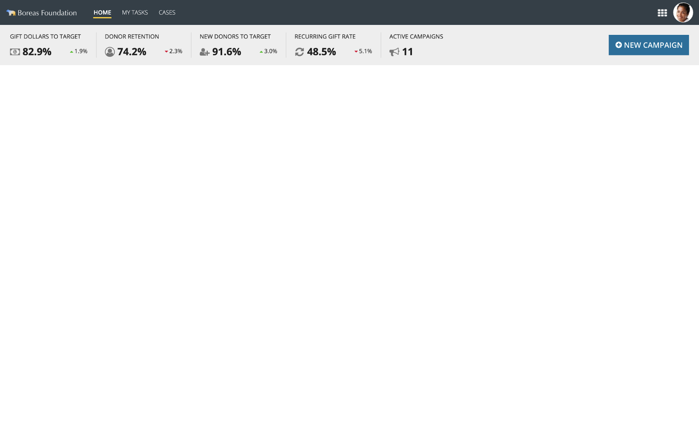
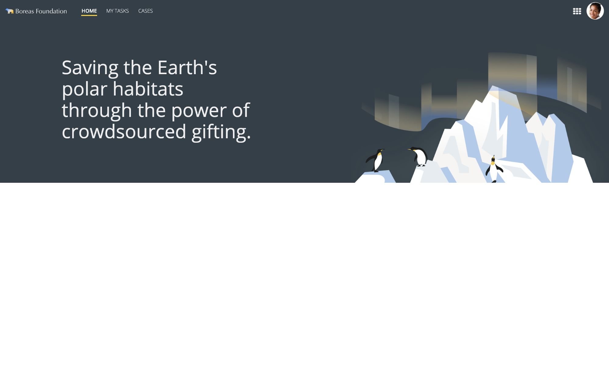
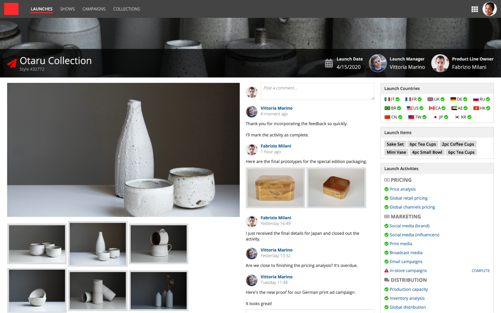
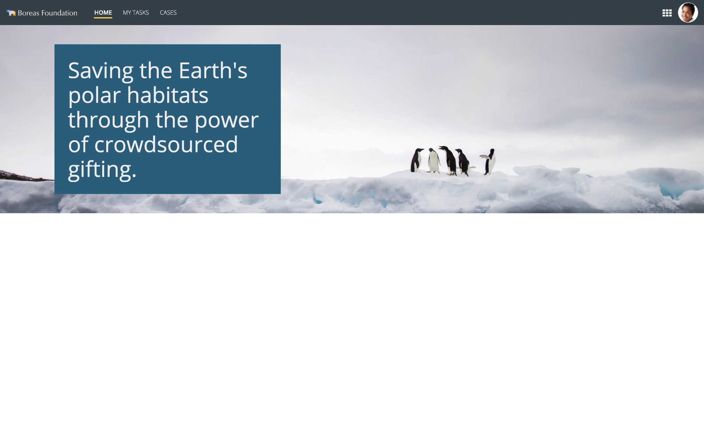
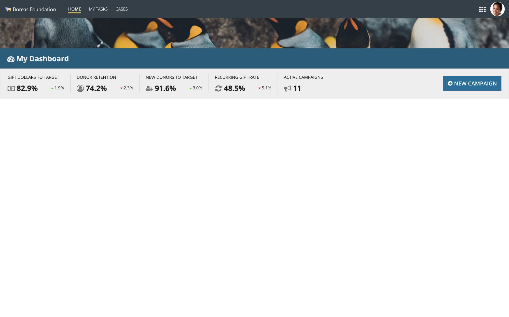

# Page Headers [SAIL Design System: Patterns]

*Section: patterns | source: https://docs.appian.com/suite/help/26.7/sail/page-headers.html | images referenced live in corpus/images/*

# Page Headers

Optionally use one or more headers to highlight content at the top of a page.

## Title bar header

A title bar header draws attention to the page title by showing it on a dedicated header bar with a contrasting background color.

Rich Text Title Size: **Medium Plus**
Rich Text Title Style: **Strong**


```sail
a!headerContentLayout(
  header: {
    a!cardLayout(
      contents: {
        a!sideBySideLayout(
          alignVertical: "MIDDLE",
          items: {
            a!sideBySideItem(
              width: "MINIMIZE",
              item: a!richTextDisplayField(
                marginBelow: "EVEN_LESS",
                labelPosition: "COLLAPSED",
                value: {
                  a!richTextIcon(
                    icon: "home",
                    size: "MEDIUM_PLUS"
                  ),
                }
              )
            ),
            a!sideBySideItem(
              item: a!headingField(
                marginBelow: "NONE",
                text: "Home",
                fontWeight: "SEMI_BOLD",
                size: "MEDIUM",
                headingTag: "H1"
              )
            )
          }
        )
      },
      height: "AUTO",
      style: "#F0B323",
      padding: "STANDARD",
      marginBelow: "NONE",
      showBorder: false
    )
  },
  contents: {},
  showWhen: true,
  backgroundColor: "WHITE"
)
```

## Title bar header (alternative)

Use this bold title bar style on pages where content is likely to be sparse. This approach is also effective for orienting occasional users by making the purpose of the page very clear.

A tall title bar also easily makes room for additional controls like breadcrumbs or a link to a shopping cart page.

Rich Text Size (Title): **Large Plus**
Rich Text Style (Title): **Plain**
Rich Text Size (Subtitle): **Medium**
Rich Text Style (Subtitle): **Plain**


```sail
a!localVariables(
  local!currentNodeId: 2,
  local!nodes: a!forEach(
    items: enumerate(local!currentNodeId) + 1,
    expression: choose(
      fv!item,
      a!map(name: "Home", identifier: 1),
      a!map(
        name: "Online Self Service",
        identifier: 2
      )
    )
  ),
  a!formLayout(
    titleBar: {
      a!cardLayout(
        contents: {
          a!columnsLayout(
            columns: {
              a!columnLayout(
                contents: {
                  a!richTextDisplayField(
                    labelPosition: "COLLAPSED",
                    value: {
                      a!forEach(
                        items: local!nodes,
                        expression: if(
                          fv!isLast,
                          a!richTextItem(text: fv!item.name, size: "SMALL"),
                          {
                            a!richTextItem(
                              text: fv!item.name,
                              link: a!dynamicLink(
                                value: fv!item.identifier,
                                saveInto: local!currentNodeId
                              ),
                              color: "#FFF",
                              size: "SMALL"
                            ),
                            a!richTextItem(text: "  /  ", color: "", size: "SMALL")
                          }
                        )
                      )
                    }
                  ),
                  a!headingField(
                    text: "Order Fishing License",
                    size: "MEDIUM_PLUS",
                    headingTag: "H1",
                    fontWeight: "BOLD",
                    marginAbove: "EVEN_LESS",
                    marginBelow: "NONE"
                  )
                }
              ),
              a!columnLayout(
                contents: {
                  a!buttonArrayLayout(
                    buttons: {
                      a!buttonWidget(
                        label: "Add to Cart",
                        style: "OUTLINE",
                        color: "SECONDARY"
                      ),
                      a!buttonWidget(
                        label: "Check Out Now",
                        style: "SOLID",
                        color: "SECONDARY"
                      )
                    },
                    align: "END"
                  )
                }
              )
            },
            alignVertical: "MIDDLE"
          )
        },
        style: "#1A2530",
        padding: "MORE",
        marginAbove: "NONE",
        marginBelow: "NONE",
        showBorder: false()
      )
    },
    contents: {
      if(
        a!isPageWidth({ "PHONE", "TABLET_PORTRAIT" }),
        /* Optimized for mobile and small screens */
        a!columnsLayout(
          columns: {
            a!columnLayout(
              contents: a!cardLayout(
                contents: {
                  a!headingField(
                    text: "Who can get a license?",
                    size: "SMALL",
                    headingTag: "H2",
                    fontWeight: "SEMI_BOLD"
                  ),
                  a!richTextDisplayField(
                    labelPosition: "COLLAPSED",
                    value: {
                      a!richTextItem(
                        text: {
                          "Persons who have been a bonafide resident of the city, county, or state for six consecutive months immediately preceding the date of application for license.",
                          repeat(2, char(10)),
                          "Persons who have been domiciliary residents of the state for at least two months upon approval of a completed affidavit to be furnished by the state.",
                          repeat(2, char(10)),
                          "Any member of the armed forces of the United States, or a member of the immediate family of such a member, upon execution of a certificate of residence if the member (i) resides in the state, (ii) is on active duty, and (iii) is stationed at a military installation within, or in a ship based in, the state.",
                          repeat(2, char(10)),
                          "Students (including nonresident students boarding on campus) residing in the state who are enrolled in bonafide schools."
                        },
                        color: "#6C6C75"
                      )
                    }
                  )
                },
                style: "#F5F5F7",
                padding: "STANDARD",
                showBorder: false(),
                marginBelow: "MORE"
              )
            ),
            a!columnLayout(
              contents: {
                a!richTextDisplayField(
                  label: "About Fishing Licenses",
                  labelPosition: "ABOVE",
                  value: {
                    "Every person who is required to have a license to fish, hunt, and/or trap must carry such license with them (electronic copy, printed paper, or annual hard card) and show the license immediately upon request of any officer whose duty it is to enforce the game and inland fish laws, or upon the demand of any owner or lessee, or any employee or representative of such owner or lessee, upon whose land or water such person may be hunting, trapping, or fishing."
                  }
                ),
                a!richTextDisplayField(
                  labelPosition: "COLLAPSED",
                  value: {
                    a!richTextIcon(icon: "info-circle", color: "ACCENT"),
                    " Processing time is approximately 2-3 weeks"
                  },
                  marginBelow: "MORE"
                ),
                a!radioButtonField(
                  choiceLabels: {
                    "State Freshwater Fishing",
                    "State Fresh/Saltwater Fishing"
                  },
                  choiceValues: { 1, 2 },
                  label: "License Type",
                  labelPosition: "ABOVE",
                  value: 1,
                  saveInto: {},
                  choiceLayout: "STACKED",
                  choiceStyle: "CARDS",
                  validations: {},
                  marginBelow: "MORE"
                ),
                a!radioButtonField(
                  choiceLabels: {
                    "5-day ($10)",
                    "1-year ($22)",
                    "2-year ($43)",
                    "3-year ($65)"
                  },
                  choiceValues: { 1, 2, 3, 4 },
                  label: "License Validity",
                  labelPosition: "ABOVE",
                  value: 1,
                  saveInto: {},
                  choiceLayout: "STACKED",
                  choiceStyle: "CARDS",
                  validations: {},
                  marginBelow: "MORE"
                ),
                a!sideBySideLayout(
                  items: {
                    a!sideBySideItem(
                      item: a!dateField(
                        label: "First Day of Validity",
                        labelPosition: "ABOVE",
                        value: todate("6/14/2021"),
                        saveInto: {},
                        validations: {}
                      ),
                      width: "MINIMIZE"
                    ),
                    a!sideBySideItem(
                      item: a!richTextDisplayField(
                        label: "Last Day of Validity",
                        labelPosition: "ABOVE",
                        value: { "6/18/2021" }
                      )
                    )
                  },
                  marginBelow: "MORE"
                ),
                a!richTextDisplayField(
                  labelPosition: "COLLAPSED",
                  value: {
                    a!richTextItem(
                      text: { "Number of Licenses" },
                      style: { "STRONG" }
                    )
                  }
                ),
                a!sideBySideLayout(
                  items: {
                    a!sideBySideItem(
                      item: a!buttonArrayLayout(
                        buttons: {
                          a!buttonWidget(
                            label: "",
                            icon: "minus",
                            size: "SMALL",
                            style: "OUTLINE",
                            color: "SECONDARY",
                            disabled: true
                          )
                        },
                        align: "START"
                      ),
                      width: "MINIMIZE"
                    ),
                    a!sideBySideItem(
                      item: a!integerField(
                        label: "Quantity",
                        labelPosition: "COLLAPSED",
                        value: 1,
                        saveInto: {},
                        refreshAfter: "UNFOCUS",
                        validations: {},
                        marginBelow: "STANDARD"
                      ),
                      width: "MINIMIZE"
                    ),
                    a!sideBySideItem(
                      item: a!buttonArrayLayout(
                        buttons: {
                          a!buttonWidget(
                            label: "",
                            icon: "plus",
                            size: "SMALL",
                            style: "OUTLINE",
                            color: "SECONDARY",
                            disabled: false
                          )
                        },
                        align: "START"
                      ),
                      width: "MINIMIZE"
                    )
                  },
                  alignVertical: "MIDDLE",
                  spacing: "DENSE"
                )
              },
              width: "MEDIUM_PLUS"
            )
          },
          stackWhen: { "PHONE", "TABLET_PORTRAIT" }
        ),
        /* Pane layout for non-mobile interfaces */
        a!paneLayout(
          panes: {
            a!pane(
              contents: {
                a!columnsLayout(
                  columns: {
                    a!columnLayout(),
                    a!columnLayout(
                      contents: {
                        a!richTextDisplayField(
                          label: "About Fishing Licenses",
                          labelPosition: "ABOVE",
                          value: {
                            "Every person who is required to have a license to fish, hunt, and/or trap must carry such license with them (electronic copy, printed paper, or annual hard card) and show the license immediately upon request of any officer whose duty it is to enforce the game and inland fish laws, or upon the demand of any owner or lessee, or any employee or representative of such owner or lessee, upon whose land or water such person may be hunting, trapping, or fishing."
                          }
                        ),
                        a!richTextDisplayField(
                          labelPosition: "COLLAPSED",
                          value: {
                            a!richTextIcon(icon: "info-circle", color: "ACCENT"),
                            " Processing time is approximately 2-3 weeks"
                          },
                          marginBelow: "MORE"
                        ),
                        a!radioButtonField(
                          choiceLabels: {
                            "State Freshwater Fishing",
                            "State Fresh/Saltwater Fishing"
                          },
                          choiceValues: { 1, 2 },
                          label: "License Type",
                          labelPosition: "ABOVE",
                          value: 1,
                          saveInto: {},
                          choiceLayout: "STACKED",
                          choiceStyle: "CARDS",
                          validations: {},
                          marginBelow: "MORE"
                        ),
                        a!radioButtonField(
                          choiceLabels: {
                            "5-day ($10)",
                            "1-year ($22)",
                            "2-year ($43)",
                            "3-year ($65)"
                          },
                          choiceValues: { 1, 2, 3, 4 },
                          label: "License Validity",
                          labelPosition: "ABOVE",
                          value: 1,
                          saveInto: {},
                          choiceLayout: "STACKED",
                          choiceStyle: "CARDS",
                          validations: {},
                          marginBelow: "MORE"
                        ),
                        a!sideBySideLayout(
                          items: {
                            a!sideBySideItem(
                              item: a!dateField(
                                label: "First Day of Validity",
                                labelPosition: "ABOVE",
                                value: todate("6/14/2021"),
                                saveInto: {},
                                validations: {}
                              ),
                              width: "MINIMIZE"
                            ),
                            a!sideBySideItem(
                              item: a!richTextDisplayField(
                                label: "Last Day of Validity",
                                labelPosition: "ABOVE",
                                value: { "6/18/2021" }
                              )
                            )
                          },
                          marginBelow: "MORE"
                        ),
                        a!richTextDisplayField(
                          labelPosition: "COLLAPSED",
                          value: {
                            a!richTextItem(
                              text: { "Number of Licenses" },
                              style: { "STRONG" }
                            )
                          }
                        ),
                        a!columnsLayout(
                          columns: {
                            a!columnLayout(
                              contents: {
                                a!sideBySideLayout(
                                  items: {
                                    a!sideBySideItem(
                                      item: a!buttonArrayLayout(
                                        buttons: {
                                          a!buttonWidget(
                                            label: "",
                                            icon: "minus",
                                            size: "SMALL",
                                            style: "OUTLINE",
                                            color: "SECONDARY",
                                            disabled: true
                                          )
                                        },
                                        align: "START",
                                        marginBelow: "NONE"
                                      ),
                                      width: "MINIMIZE"
                                    ),
                                    a!sideBySideItem(
                                      item: a!integerField(
                                        label: "Quantity",
                                        labelPosition: "COLLAPSED",
                                        value: 1,
                                        saveInto: {},
                                        refreshAfter: "UNFOCUS",
                                        validations: {}
                                      )
                                    ),
                                    a!sideBySideItem(
                                      item: a!buttonArrayLayout(
                                        buttons: {
                                          a!buttonWidget(
                                            label: "",
                                            icon: "plus",
                                            size: "SMALL",
                                            style: "OUTLINE",
                                            color: "SECONDARY",
                                            disabled: false
                                          )
                                        },
                                        align: "START",
                                        marginBelow: "NONE"
                                      ),
                                      width: "MINIMIZE"
                                    )
                                  },
                                  alignVertical: "MIDDLE",
                                  spacing: "DENSE"
                                )
                              },
                              width: "NARROW"
                            ),
                            a!columnLayout(width: "MEDIUM_PLUS")
                          }
                        )
                      },
                      width: "MEDIUM_PLUS"
                    ),
                    a!columnLayout()
                  }
                )
              },
              padding: "EVEN_MORE"
            ),
            a!pane(
              contents: {
                a!headingField(
                  text: "Who can get a license?",
                  size: "SMALL",
                  headingTag: "H2",
                  fontWeight: "SEMI_BOLD"
                ),
                a!richTextDisplayField(
                  labelPosition: "COLLAPSED",
                  value: {
                    a!richTextItem(
                      text: {
                        "Persons who have been a bonafide resident of the city, county, or state for six consecutive months immediately preceding the date of application for license.",
                        repeat(2, char(10)),
                        "Persons who have been domiciliary residents of the state for at least two months upon approval of a completed affidavit to be furnished by the state.",
                        repeat(2, char(10)),
                        "Any member of the armed forces of the United States, or a member of the immediate family of such a member, upon execution of a certificate of residence if the member (i) resides in the state, (ii) is on active duty, and (iii) is stationed at a military installation within, or in a ship based in, the state.",
                        repeat(2, char(10)),
                        "Students (including nonresident students boarding on campus) residing in the state who are enrolled in bonafide schools."
                      },
                      color: "#6C6C75"
                    )
                  }
                )
              },
              width: "MEDIUM",
              backgroundColor: "#F5F5F7",
              padding: "EVEN_MORE"
            )
          },
          showPaneDividers: false
        )
      )
    },
    focusOnFirstInput: false()
  )
)
```

## Key performance indicators header

Highlights multiple key performance indicators (KPIs) at the top of the page. Optionally preserves space for other content, such as a primary action button.

See Data Value Display.



## Hero card header

This pattern combines a card header with a site header bar that shares the same background color, producing a hero element that immediately draws a viewer's attention.

This style works best with the "Mercury" header bar style.



## Filter bar header

This pattern displays filter controls at the top of the page that impact all page contents.

You can configure these filters to work with URL parameters, which will allow you to:

- Set default values for the filters.

- Create a link to a page with certain filter values automatically selected.

- Allow users to share links with their selected filters.

- Remember filter selections when users return to a previously filtered page.

**See also**:

- For an example of an interface expression that uses URL parameters with filters, see Example: Setting up a filter to work with URL parameters.

- For instructions on how to configure URL parameters to work in a site or portal page, see Set up URL parameters.


```sail
a!localVariables(
  local!transactionData: {
    a!map(date: date(2025, 12, 19), vendor: "Wegmans", category: "Groceries", amount: 53.12,account: "Discover"),
    a!map(date: date(2025, 12, 18), vendor: "Wegmans", category: "Groceries", amount: 53.19, account: "Chase"),
    a!map(date: date(2025, 12, 17), vendor: "Airbnb", category: "Travel", amount: 231.34, account: "Wells Fargo"),
    a!map(date: date(2025, 12, 2), vendor: "H-Mart", category: "Groceries", amount: 53.19, account: "Chase"),
    a!map(date: date(2025, 12, 2), vendor: "Super Chicken", category: "Food & Drink", amount: 23.16, account: "American Express"),
    a!map(date: date(2025, 12, 1), vendor: "Whole Foods", category: "Groceries", amount: 53.12, account: "Discover"),
    a!map(date: date(2025, 12, 1), vendor: "Netflix", category: "Entertainment", amount: 7.99, account: "American Express")
  },
  local!openAccounts: {
    a!map(accountName: "American Express", accountType: "Credit", creditLimit: 2500, total: 687, accountNumber: 3294),
    a!map(accountName: "Chase", accountType: "Credit", creditLimit: 25000, total: 3346, accountNumber: 2352),
    a!map(accountName: "Discover", accountType: "Credit", creditLimit: 5000, total: 2006, accountNumber: 0368),
    a!map(accountName: "Wells Fargo", accountType: "Credit", creditLimit: 2143, total: 1309, accountNumber: 4058),
  },
  local!spendingByCategory: {
    a!map(category: "Travel", total: 2027.01),
    a!map(category: "Groceries", total: 1677.07),
    a!map(category: "Shopping", total: 1154.53),
    a!map(category: "Food & Drink", total: 1134.86),
    a!map(category: "Entertainment", total: 700.09),
    a!map(category: "Other", total: 655.85)
  },
  local!categoryBranding: {
    a!map(category: "Travel", icon: "plane", color: "#0D47A1"),
    a!map(category: "Groceries", icon: "shopping-cart", color: "#8036E6"),
    a!map(category: "Shopping", icon: "shopping-bag", color: "#00BCD4"),
    a!map(category: "Food & Drink", icon: "cutlery", color: "#07987C"),
    a!map(category: "Entertainment", icon: "music", color: "#E4356C"),
    a!map(category: "Other", icon: "asterisk", color: "#810172")
  },
  a!headerContentLayout(
    header: {
      /* These filters aren't set up to filter data; 
      they are intended to illustrate how a filter bar header might look */
      a!cardLayout(
        contents: {
          a!sideBySideLayout(
            items: {
              a!sideBySideItem(
                item: a!dateField(
                  label: "Start Date",
                ),
                width: "MINIMIZE"
              ),
              a!sideBySideItem(
                item: a!dateField(
                  label: "End Date",
                ),
                width: "MINIMIZE"
              ),
              a!sideBySideItem(
                width: "2X",
                item: a!dropdownField(
                  label: "Account",
                  choiceLabels: {
                    "Chase",
                    "Discover",
                    "Wells Fargo",
                    "American Express",
                    "Goldman Sachs"
                  },
                  choiceValues: {
                    "Chase",
                    "Discover",
                    "Wells Fargo",
                    "American Express",
                    "Goldman Sachs"
                  },
                  placeholder: "All accounts",
                )
              ),
              a!sideBySideItem(
                width: "2X",
                item: a!dropdownField(
                  label: "Expense Category",
                  placeholder: "All categories",
                  choiceLabels: {
                    "Food & Drink",
                    "Groceries",
                    "Shopping",
                    "Entertainment",
                    "Travel",
                    "Other"
                  },
                  choiceValues: {
                    "Food & Drink",
                    "Groceries",
                    "Shopping",
                    "Entertainment",
                    "Travel",
                    "Other"
                  },
                )
              )
            },
            alignVertical: "MIDDLE",
            spacing: "SPARSE"
          )
        },
        style:"NONE",
        padding: "STANDARD",
        marginBelow: "NONE",
        showBorder: false,
        showShadow: true
      )
    },
    contents: {
      a!headingField(
        text: upper("Open Accounts"),
        size: "SMALL",
        headingTag: "H2",
        color: "SECONDARY",
        fontWeight: "BOLD",
        marginBelow: "LESS"
      ),
      a!cardGroupLayout(
        labelPosition: "COLLAPSED",
        cards: a!forEach(
          items: local!openAccounts,
          expression: a!cardLayout(
            contents: {
              a!sideBySideLayout(
                items: {
                  a!sideBySideItem(
                    item: a!gaugeField(
                      percentage: fv!item.total / fv!item.creditLimit * 100,
                      primaryText: a!gaugePercentage(),
                      color: a!match(
                        value: fv!item.total / fv!item.creditLimit * 100,
                        whenTrue: fv!value > 49,
                        then: "NEGATIVE",
                        whenTrue: fv!value > 30,
                        then: "WARN",
                        default: "POSITIVE"
                      ),
                      size: "SMALL"
                    ),
                    width: "MINIMIZE"
                  ),
                  a!sideBySideItem(
                    item: a!richTextDisplayField(
                      labelPosition: "COLLAPSED",
                      value: {
                        a!richTextItem(
                          text: index(fv!item, "accountName", {}),
                          size: "MEDIUM",
                          style: "STRONG"
                        ),
                        char(10),
                        a!richTextItem(
                          text: {
                            "****",
                            index(fv!item, "accountNumber", {})
                          },
                          color: "SECONDARY",
                          size: "SMALL"
                        ),
                        char(10),
                        char(10),
                        a!richTextItem(
                          text: {
                            text(index(fv!item, "total", {}), "$###,###,###")
                          },
                          size: "MEDIUM_PLUS",
                          style: "STRONG"
                        ),
                        a!richTextItem(
                          text: {
                            " / ",
                            dollar(index(fv!item, "creditLimit", {}), 0)
                          },
                          color: "SECONDARY"
                        )
                      }
                    )
                  )
                },
                alignVertical: "MIDDLE",
                spacing: "SPARSE"
              )
            },
            shape: "SEMI_ROUNDED",
            padding: "STANDARD",
            marginBelow: "STANDARD",
            showBorder: false,
            showShadow: true
          )
        ),
        spacing: "STANDARD",
        cardWidth: "NARROW",
        cardHeight: "AUTO",
        marginBelow: "MORE"
      ),
      a!columnsLayout(
        columns: {
          a!columnLayout(
            contents: {
              a!headingField(
                text: upper("Transactions"),
                size: "SMALL",
                headingTag: "H2",
                color: "SECONDARY",
                fontWeight: "BOLD",
                marginBelow: "LESS"
              ),
              a!cardLayout(
                contents: {
                  /*Use record data to populate your grid and add search, filter, and export capabilities*/
                  a!gridField(
                    labelPosition: "COLLAPSED",
                    data: local!transactionData,
                    columns: {
                      a!gridColumn(
                        label: "Date",
                        sortField: "date",
                        value: datetext(fv!row.date, "MMM dd, YYYY"),
                        align: "START",
                        width: "AUTO"
                      ),
                      a!gridColumn(
                        label: "Vendor",
                        sortField: "vendor",
                        value: a!richTextDisplayField(
                          labelPosition: "COLLAPSED",
                          value: a!richTextItem(
                            text: {
                              fv!row.vendor,
                              char(10),
                              a!richTextItem(
                                text: fv!row.category,
                                color: "SECONDARY",
                                size: "SMALL"
                              )
                            }
                          )
                        ),
                        width: "AUTO"
                      ),
                      a!gridColumn(
                        label: "Amount",
                        sortField: "amount",
                        value: a!richTextDisplayField(
                          value: {
                            a!richTextItem(
                              text: dollar(fv!row.amount),
                              style: "STRONG"
                            ),
                            char(10),
                            a!richTextItem(
                              text: fv!row.account,
                              color: "SECONDARY",
                              size: "SMALL"
                            )
                          }
                        ),
                        align: "END",
                        width: "AUTO"
                      ),
                      a!gridColumn(
                        value: a!buttonArrayLayout(
                          buttons: {
                            a!buttonWidget(
                              icon: "ellipsis-v",
                              style: "LINK",
                              size: "SMALL"
                            )
                          }
                        ),
                        width: "ICON"
                      )
                    },
                    pageSize: 7,
                    initialSorts: { a!sortInfo(field: "date") },
                    validations: {},
                    borderStyle: "LIGHT",
                    shadeAlternateRows: false
                  )
                },
                height: "AUTO",
                style: "NONE",
                shape: "SEMI_ROUNDED",
                padding: "STANDARD",
                marginBelow: "STANDARD",
                showBorder: false,
                showShadow: true
              )
            },
            width: "AUTO"
          ),
          a!columnLayout(
            contents: {
              a!headingField(
                text: upper("Spending by Category"),
                size: "SMALL",
                headingTag: "H2",
                color: "SECONDARY",
                fontWeight: "BOLD",
                marginBelow: "LESS"
              ),
              a!cardLayout(
                contents: {
                  a!columnsLayout(
                    columns: {
                      a!forEach(
                        items: local!spendingByCategory,
                        expression: {
                          a!localVariables(
                            local!thisCategoryBranding: index(local!categoryBranding, 
                              wherecontains(
                                index(fv!item,"category",{}), 
                                index(local!categoryBranding, "category",{})
                              ),
                              {}
                            ),
                            a!columnLayout(
                              contents:  {
                                a!richTextDisplayField(
                                  labelPosition: "COLLAPSED",
                                  value: {
                                    a!richTextIcon(
                                      icon: local!thisCategoryBranding.icon,
                                      color: local!thisCategoryBranding.color,
                                      size: "LARGE"
                                    ),
                                    char(10),
                                    char(10),
                                    a!richTextItem(
                                      text: fv!item.category,
                                      color: "SECONDARY",
                                      size: "SMALL"
                                    ),
                                    char(10),
                                    a!richTextItem(
                                      text: dollar(fv!item.total),
                                      style: "STRONG"
                                    )
                                  }
                                )
                              }
                            )
                          )
                        }
                      )
                    },
                    spacing: "SPARSE",
                    showDividers: true
                  )
                },
                height: "AUTO",
                style: "NONE",
                shape: "SEMI_ROUNDED",
                padding: "STANDARD",
                marginBelow: "MORE",
                showBorder: false,
                showShadow: true
              ),
              a!headingField(
                text: upper("Top Expenses"),
                size: "SMALL",
                headingTag: "H2",
                color: "SECONDARY",
                fontWeight: "BOLD",
                marginBelow: "NONE"
              ),
              a!richTextDisplayField(
                labelPosition: "COLLAPSED",
                value: a!richTextItem(
                  text: "Select a slice to view the top expenses for that category",
                  color: "#666666",
                  size: "SMALL"
                )
              ),
              a!columnsLayout(
                columns: {
                  a!columnLayout(
                    contents: {
                      a!cardLayout(
                        contents: {
                          /*Consider configuring a drilldown to filter your transaction data*/
                          a!pieChartField(
                            labelPosition: "COLLAPSED",
                            series: a!forEach(
                              items: local!spendingByCategory,
                              expression: a!chartSeries(
                                label: fv!item.category,
                                data: fv!item.total
                              )
                            ),
                            showDataLabels: false,
                            showTooltips: true,
                            showAsPercentage: true,
                            colorScheme: a!colorSchemeCustom(local!categoryBranding.color),
                            style: "DONUT",
                            seriesLabelStyle: "LEGEND",
                            height: "TALL"
                          )
                        },
                        height: "TALL",
                        style: "NONE",
                        shape: "SEMI_ROUNDED",
                        padding: "STANDARD",
                        marginBelow: "NONE",
                        showBorder: false,
                        showShadow: true
                      )
                    },
                    width: "MEDIUM"
                  ),
                  a!columnLayout(
                    contents: {
                      a!cardGroupLayout(
                        labelPosition: "COLLAPSED",
                        cards: {
                          a!cardLayout(
                            contents: {
                              a!sideBySideLayout(
                                items: {
                                  a!sideBySideItem(
                                    item: a!stampField(
                                      labelPosition: "COLLAPSED",
                                      icon: "plane",
                                      backgroundColor: "#0D47A1",
                                      contentColor: "#ffffff",
                                      size: "TINY"
                                    ),
                                    width: "MINIMIZE"
                                  ),
                                  a!sideBySideItem(
                                    item: a!richTextDisplayField(
                                      labelPosition: "COLLAPSED",
                                      value: {
                                        a!richTextItem(text: "Airbnb", style: "STRONG"),
                                        char(10),
                                        a!richTextItem(
                                          text: "Dec 21, 2020",
                                          color: "SECONDARY",
                                          size: "SMALL"
                                        )
                                      }
                                    ),
                                    width: "MINIMIZE"
                                  ),
                                  a!sideBySideItem(
                                    item: a!richTextDisplayField(
                                      labelPosition: "COLLAPSED",
                                      value: {
                                        a!richTextItem(text: "$1,025.34", size: "MEDIUM_PLUS")
                                      },
                                      align: "RIGHT"
                                    )
                                  )
                                },
                                alignVertical: "MIDDLE",
                                stackWhen: {"PHONE", "TABLET_PORTRAIT", "TABLET_LANDSCAPE", "DESKTOP_NARROW"}
                              )
                            },
                            shape: "SEMI_ROUNDED",
                            padding: "STANDARD",
                            marginBelow: "STANDARD",
                            showBorder: false,
                            showShadow: true
                          ),
                          a!cardLayout(
                            contents: {
                              a!sideBySideLayout(
                                items: {
                                  a!sideBySideItem(
                                    item: a!stampField(
                                      labelPosition: "COLLAPSED",
                                      icon: "music",
                                      backgroundColor: "#E4356C",
                                      contentColor: "#ffffff",
                                      size: "TINY"
                                    ),
                                    width: "MINIMIZE"
                                  ),
                                  a!sideBySideItem(
                                    item: a!richTextDisplayField(
                                      labelPosition: "COLLAPSED",
                                      value: {
                                        a!richTextItem(text: "Ticketmaster", style: "STRONG"),
                                        char(10),
                                        a!richTextItem(
                                          text: "Jan 31, 2021",
                                          color: "SECONDARY",
                                          size: "SMALL"
                                        )
                                      }
                                    ),
                                    width: "MINIMIZE"
                                  ),
                                  a!sideBySideItem(
                                    item: a!richTextDisplayField(
                                      labelPosition: "COLLAPSED",
                                      value: {
                                        a!richTextItem(text: "$473.78", size: "MEDIUM_PLUS")
                                      },
                                      align: "RIGHT"
                                    )
                                  )
                                },
                                alignVertical: "MIDDLE",
                                stackWhen: {"PHONE", "TABLET_PORTRAIT", "TABLET_LANDSCAPE", "DESKTOP_NARROW"}
                              )
                            },
                            shape: "SEMI_ROUNDED",
                            padding: "STANDARD",
                            marginBelow: "STANDARD",
                            showBorder: false,
                            showShadow: true
                          ),
                          a!cardLayout(
                            contents: {
                              a!sideBySideLayout(
                                items: {
                                  a!sideBySideItem(
                                    item: a!stampField(
                                      labelPosition: "COLLAPSED",
                                      icon: "plane",
                                      backgroundColor: "#0D47A1",
                                      contentColor: "#ffffff",
                                      size: "TINY"
                                    ),
                                    width: "MINIMIZE"
                                  ),
                                  a!sideBySideItem(
                                    item: a!richTextDisplayField(
                                      labelPosition: "COLLAPSED",
                                      value: {
                                        a!richTextItem(text: "Delta Airlines", style: "STRONG"),
                                        char(10),
                                        a!richTextItem(
                                          text: "Dec 14, 2020",
                                          color: "SECONDARY",
                                          size: "SMALL"
                                        )
                                      }
                                    ),
                                    width: "MINIMIZE"
                                  ),
                                  a!sideBySideItem(
                                    item: a!richTextDisplayField(
                                      labelPosition: "COLLAPSED",
                                      value: {
                                        a!richTextItem(text: "$323.18", size: "MEDIUM_PLUS")
                                      },
                                      align: "RIGHT"
                                    )
                                  )
                                },
                                alignVertical: "MIDDLE",
                                stackWhen: {"PHONE", "TABLET_PORTRAIT", "TABLET_LANDSCAPE", "DESKTOP_NARROW"}
                              )
                            },
                            shape: "SEMI_ROUNDED",
                            padding: "STANDARD",
                            marginBelow: "STANDARD",
                            showBorder: false,
                            showShadow: true
                          ),
                          a!cardLayout(
                            contents: {
                              a!sideBySideLayout(
                                items: {
                                  a!sideBySideItem(
                                    item: a!stampField(
                                      labelPosition: "COLLAPSED",
                                      icon: "shopping-cart",
                                      backgroundColor: "#8036E6",
                                      contentColor: "#ffffff",
                                      size: "TINY"
                                    ),
                                    width: "MINIMIZE"
                                  ),
                                  a!sideBySideItem(
                                    item: a!richTextDisplayField(
                                      labelPosition: "COLLAPSED",
                                      value: {
                                        a!richTextItem(text: "Giant Food", style: "STRONG"),
                                        char(10),
                                        a!richTextItem(
                                          text: "Dec 2, 2020",
                                          color: "SECONDARY",
                                          size: "SMALL"
                                        )
                                      }
                                    ),
                                    width: "MINIMIZE"
                                  ),
                                  a!sideBySideItem(
                                    item: a!richTextDisplayField(
                                      labelPosition: "COLLAPSED",
                                      value: {
                                        a!richTextItem(text: "$253.09", size: "MEDIUM_PLUS")
                                      },
                                      align: "RIGHT"
                                    )
                                  )
                                },
                                alignVertical: "MIDDLE",
                                stackWhen: {"PHONE", "TABLET_PORTRAIT", "TABLET_LANDSCAPE", "DESKTOP_NARROW"}
                              )
                            },
                            shape: "SEMI_ROUNDED",
                            padding: "STANDARD",
                            marginBelow: "NONE",
                            showBorder: false,
                            showShadow: true
                          )
                        },
                        spacing: "STANDARD",
                        cardWidth: "MEDIUM",
                        cardHeight: "AUTO"
                      )
                    }
                  )
                }
              )
            },
            width: "AUTO"
          )
        },
        stackWhen: {"PHONE", "TABLET_PORTRAIT", "TABLET_LANDSCAPE"}
      )
    },
    backgroundColor: "TRANSPARENT"
  )
)
```

## Decorative billboard header

Billboard headers allow content to be displayed as an overlay on top of decorative photos.

Choose the appropriate shade and transparency for the overlay to allow content to easily be read.



## Use a card to create high contrast for overlay contents

Optionally include a card as the background for billboard overlay contents to ensure sufficient contrast against the photo.



## Mix and match header types

Combine multiple types of headers as needed.

This example uses:

- Decorative billboard

- Title bar card

- KPI bar card



```sail
a!headerContentLayout(
  header: {
    a!billboardLayout(
      backgroundMedia: a!webImage(
        source: "https://images.unsplash.com/photo-1574950333594-f3e9a9446d0f?ixid=MXwxMjA3fDB8MHxwaG90by1wYWdlfHx8fGVufDB8fHw%3D&ixlib=rb-1.2.1&auto=format&fit=crop&w=2250&q=80"
        /* https://unsplash.com/photos/12R_znWtJHQ */
      ),
      height: "EXTRA_SHORT",
      marginBelow: "NONE"
    ),
    a!cardLayout(
      contents: {
        a!sideBySideLayout(
          alignVertical: "MIDDLE",
          items: {
            a!sideBySideItem(
              width: "MINIMIZE",
              item: a!richTextDisplayField(
                marginBelow: "EVEN_LESS",
                labelPosition: "COLLAPSED",
                value: {
                  a!richTextItem(
                    text: {
                      a!richTextIcon(
                        icon: "tachometer"
                      )
                    },
                    size: "MEDIUM_PLUS",
                  )
                }
              ),
            ),
            a!sideBySideItem(
              item: a!headingField(
                marginBelow: "NONE",
                text: "My Dashboard",
                size: "MEDIUM",
                fontWeight: "SEMI_BOLD",
                headingTag: "H1"
              )
            )
          }
        ),
      },
      height: "AUTO",
      style: "#165C7D",
      padding: "STANDARD",
      marginBelow: "NONE",
      showBorder: false
    ),
    a!cardLayout(
      contents: {
        a!columnsLayout(
          columns: {
            a!columnLayout(
              contents: {
                a!columnsLayout(
                  columns: {
                    a!columnLayout(
                      contents: {
                        a!richTextDisplayField(
                          labelPosition: "COLLAPSED",
                          value: { "GIFT DOLLARS TO TARGET" }
                        ),
                        a!sideBySideLayout(
                          items: {
                            a!sideBySideItem(
                              item: a!richTextDisplayField(
                                labelPosition: "COLLAPSED",
                                value: {
                                  a!richTextIcon(
                                    icon: "money",
                                    color: "SECONDARY",
                                    size: "MEDIUM_PLUS"
                                  ),
                                  a!richTextItem(
                                    text: { " 82.9%" },
                                    size: "MEDIUM_PLUS",
                                    style: { "STRONG" }
                                  )
                                }
                              )
                            ),
                            a!sideBySideItem(
                              item: a!richTextDisplayField(
                                labelPosition: "COLLAPSED",
                                value: {
                                  a!richTextIcon(
                                    icon: "caret-up",
                                    color: "POSITIVE",
                                    size: "STANDARD"
                                  ),
                                  a!richTextItem(
                                    text: { "1.9%" },
                                    color: "STANDARD",
                                    size: "STANDARD"
                                  )
                                }
                              ),
                              width: "MINIMIZE"
                            )
                          },
                          alignVertical: "MIDDLE"
                        )
                      }
                    ),
                    a!columnLayout(
                      contents: {
                        a!richTextDisplayField(
                          labelPosition: "COLLAPSED",
                          value: { "DONOR RETENTION" }
                        ),
                        a!sideBySideLayout(
                          items: {
                            a!sideBySideItem(
                              item: a!richTextDisplayField(
                                labelPosition: "COLLAPSED",
                                value: {
                                  a!richTextIcon(
                                    icon: "user-circle-o",
                                    color: "SECONDARY",
                                    size: "MEDIUM_PLUS"
                                  ),
                                  a!richTextItem(
                                    text: { " 74.2%" },
                                    size: "MEDIUM_PLUS",
                                    style: { "STRONG" }
                                  )
                                }
                              )
                            ),
                            a!sideBySideItem(
                              item: a!richTextDisplayField(
                                labelPosition: "COLLAPSED",
                                value: {
                                  a!richTextIcon(
                                    icon: "caret-down",
                                    color: "NEGATIVE",
                                    size: "STANDARD"
                                  ),
                                  a!richTextItem(
                                    text: { "2.3%" },
                                    color: "STANDARD",
                                    size: "STANDARD"
                                  )
                                }
                              ),
                              width: "MINIMIZE"
                            )
                          },
                          alignVertical: "MIDDLE"
                        )
                      }
                    ),
                    a!columnLayout(
                      contents: {
                        a!richTextDisplayField(
                          labelPosition: "COLLAPSED",
                          value: { "NEW DONORS TO TARGET" }
                        ),
                        a!sideBySideLayout(
                          items: {
                            a!sideBySideItem(
                              item: a!richTextDisplayField(
                                labelPosition: "COLLAPSED",
                                value: {
                                  a!richTextIcon(
                                    icon: "user-plus",
                                    color: "SECONDARY",
                                    size: "MEDIUM_PLUS"
                                  ),
                                  a!richTextItem(
                                    text: { " 91.6%" },
                                    size: "MEDIUM_PLUS",
                                    style: { "STRONG" }
                                  )
                                }
                              )
                            ),
                            a!sideBySideItem(
                              item: a!richTextDisplayField(
                                labelPosition: "COLLAPSED",
                                value: {
                                  a!richTextIcon(
                                    icon: "caret-up",
                                    color: "POSITIVE",
                                    size: "STANDARD"
                                  ),
                                  a!richTextItem(
                                    text: { "3.0%" },
                                    color: "STANDARD",
                                    size: "STANDARD"
                                  )
                                }
                              ),
                              width: "MINIMIZE"
                            )
                          },
                          alignVertical: "MIDDLE"
                        )
                      }
                    ),
                    a!columnLayout(
                      contents: {
                        a!richTextDisplayField(
                          labelPosition: "COLLAPSED",
                          value: { "RECURRING GIFT RATE" }
                        ),
                        a!sideBySideLayout(
                          items: {
                            a!sideBySideItem(
                              item: a!richTextDisplayField(
                                labelPosition: "COLLAPSED",
                                value: {
                                  a!richTextIcon(
                                    icon: "refresh",
                                    color: "SECONDARY",
                                    size: "MEDIUM_PLUS"
                                  ),
                                  a!richTextItem(
                                    text: { " 48.5%" },
                                    size: "MEDIUM_PLUS",
                                    style: { "STRONG" }
                                  )
                                }
                              )
                            ),
                            a!sideBySideItem(
                              item: a!richTextDisplayField(
                                labelPosition: "COLLAPSED",
                                value: {
                                  a!richTextIcon(
                                    icon: "caret-down",
                                    color: "NEGATIVE",
                                    size: "STANDARD"
                                  ),
                                  a!richTextItem(
                                    text: { "5.1%" },
                                    color: "STANDARD",
                                    size: "STANDARD"
                                  )
                                }
                              ),
                              width: "MINIMIZE"
                            )
                          },
                          alignVertical: "MIDDLE"
                        )
                      }
                    ),
                    a!columnLayout(
                      contents: {
                        a!richTextDisplayField(
                          labelPosition: "COLLAPSED",
                          value: { "ACTIVE CAMPAIGNS" }
                        ),
                        a!sideBySideLayout(
                          items: {
                            a!sideBySideItem(
                              item: a!richTextDisplayField(
                                labelPosition: "COLLAPSED",
                                value: {
                                  a!richTextIcon(
                                    icon: "bullhorn",
                                    color: "SECONDARY",
                                    size: "MEDIUM_PLUS"
                                  ),
                                  a!richTextItem(
                                    text: { " 11" },
                                    size: "MEDIUM_PLUS",
                                    style: { "STRONG" }
                                  )
                                }
                              )
                            )
                          },
                          alignVertical: "MIDDLE"
                        )
                      }
                    )
                  },
                  spacing: "SPARSE",
                  showDividers: true
                )
              },
              width: "WIDE_PLUS"
            ),
            a!columnLayout(contents: {}, width: "AUTO"),
            a!columnLayout(
              contents: {
                a!buttonArrayLayout(
                  buttons: {
                    a!buttonWidget(
                      label: "NEW CAMPAIGN",
                      icon: "plus-circle",
                      size: "LARGE",
                      style: "SOLID"
                    )
                  },
                  align: "END",
                  marginBelow: "NONE"
                )
              },
              width: "NARROW"
            )
          },
          alignVertical: "MIDDLE"
        )
      },
      height: "AUTO",
      style: "#eee",
      padding: "STANDARD",
      marginBelow: "NONE"
    )
  },
  contents: {},
  backgroundColor: "WHITE"
)
```
