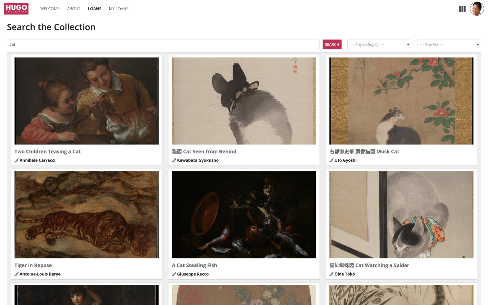
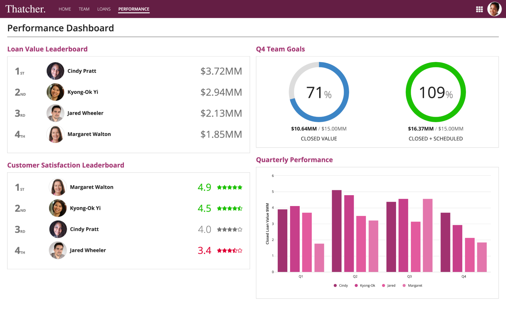
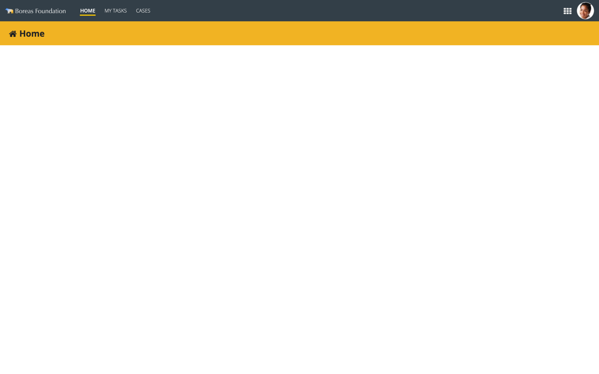
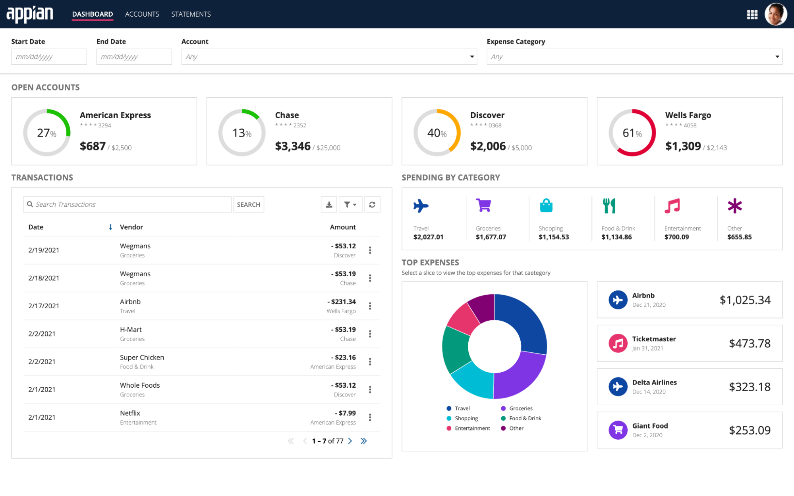

# Page Titles [SAIL Design System: Patterns]

*Section: patterns | source: https://docs.appian.com/suite/help/26.7/sail/page-titles.html | images referenced live in corpus/images/*

# Page Titles

Display a title to clearly identify the purpose of each page.

## Standard page title

Use this style to show a title that describes the contents and purpose of the page.

Section Label Size: **Large**
Heading Tag: **H1**
Section Label Color: **Standard**



## Prominent page title

Use this style to show a highly visible title at the top of a page. Works best on relatively sparse layouts with plentiful whitespace.

Section label size: **Large plus**
Heading tag: **H1**
Section label color: **Standard**
Section divider line: **None**
Margin above: **Even More**
Margin below: **Even More**


```sail
{
  a!columnsLayout(
    columns: {
      a!columnLayout(
        contents: {},
        width: "EXTRA_NARROW"
      ),
      a!columnLayout(
        contents: {
          a!sectionLayout(
            label: "Karen Anderson",
            labelSize: "LARGE_PLUS",
            labelColor: "STANDARD",
            contents: {},
            marginAbove: "EVEN_MORE",
            marginBelow: "EVEN_MORE"
          ),
          a!sectionLayout(
            label: "",
            contents: {
              a!columnsLayout(
                columns: {
                  a!columnLayout(
                    contents: {
                      a!sectionLayout(
                        label: "Contact Information",
                        labelSize: "MEDIUM",
                        labelHeadingTag: "H2",
                        labelColor: "ACCENT",
                        contents: {}
                      )
                    },
                    width: "MEDIUM_PLUS"
                  ),
                  a!columnLayout(
                    contents: {
                      a!sectionLayout(
                        label: "",
                        contents: {
                          a!columnsLayout(
                            columns: {
                              a!columnLayout(
                                contents: {
                                  a!richTextDisplayField(
                                    labelPosition: "COLLAPSED",
                                    value: {
                                      a!richTextItem(
                                        text: {
                                          "Email"
                                        },
                                        color: "SECONDARY",
                                        size: "MEDIUM_PLUS"
                                      )
                                    }
                                  )
                                },
                                width: "MEDIUM"
                              ),
                              a!columnLayout(
                                contents: {
                                  a!richTextDisplayField(
                                    labelPosition: "COLLAPSED",
                                    value: {
                                      a!richTextItem(
                                        text: {
                                          "karen.anderson@email.com"
                                        },
                                        size: "MEDIUM_PLUS"
                                      )
                                    },
                                    align: "RIGHT"
                                  )
                                }
                              )
                            },
                            marginBelow: "NONE"
                          )
                        },
                        divider: "BELOW",
                        marginBelow: "STANDARD"
                      ),
                      a!sectionLayout(
                        label: "",
                        contents: {
                          a!columnsLayout(
                            columns: {
                              a!columnLayout(
                                contents: {
                                  a!richTextDisplayField(
                                    labelPosition: "COLLAPSED",
                                    value: {
                                      a!richTextItem(
                                        text: {
                                          "Phone Number"
                                        },
                                        color: "SECONDARY",
                                        size: "MEDIUM_PLUS"
                                      )
                                    }
                                  )
                                },
                                width: "MEDIUM"
                              ),
                              a!columnLayout(
                                contents: {
                                  a!richTextDisplayField(
                                    labelPosition: "COLLAPSED",
                                    value: {
                                      a!richTextItem(
                                        text: {
                                          "703.555.1212"
                                        },
                                        size: "MEDIUM_PLUS"
                                      )
                                    },
                                    align: "RIGHT"
                                  )
                                }
                              )
                            },
                            marginBelow: "NONE"
                          )
                        },
                        divider: "BELOW"
                      ),
                      a!sectionLayout(
                        label: "",
                        contents: {
                          a!columnsLayout(
                            columns: {
                              a!columnLayout(
                                contents: {
                                  a!richTextDisplayField(
                                    labelPosition: "COLLAPSED",
                                    value: {
                                      a!richTextItem(
                                        text: {
                                          "Mailing Address"
                                        },
                                        color: "SECONDARY",
                                        size: "MEDIUM_PLUS"
                                      )
                                    }
                                  )
                                },
                                width: "MEDIUM"
                              ),
                              a!columnLayout(
                                contents: {
                                  a!richTextDisplayField(
                                    labelPosition: "COLLAPSED",
                                    value: {
                                      a!richTextItem(
                                        text: {
                                          "9836 Rocky River Court "
                                        },
                                        size: "MEDIUM_PLUS"
                                      ),
                                      char(10),
                                      a!richTextItem(
                                        text: {
                                          "Annandale, VA 22003"
                                        },
                                        size: "MEDIUM_PLUS"
                                      )
                                    },
                                    align: "RIGHT"
                                  )
                                }
                              )
                            },
                            marginBelow: "NONE"
                          )
                        },
                        divider: "NONE"
                      )
                    }
                  )
                }
              )
            },
            divider: "BELOW",
            marginBelow: "MORE"
          ),
          a!sectionLayout(
            label: "",
            contents: {
              a!columnsLayout(
                columns: {
                  a!columnLayout(
                    contents: {
                      a!sectionLayout(
                        label: "Gift Commitment",
                        labelSize: "MEDIUM",
                        labelHeadingTag: "H2",
                        labelColor: "ACCENT",
                        contents: {
                          a!richTextDisplayField(
                            labelPosition: "COLLAPSED",
                            value: {
                              a!richTextItem(
                                text: {
                                  "The supporter's current gift commitment"
                                },
                                color: "SECONDARY"
                              )
                            }
                          )
                        }
                      )
                    },
                    width: "MEDIUM_PLUS"
                  ),
                  a!columnLayout(
                    contents: {
                      a!sectionLayout(
                        label: "",
                        contents: {
                          a!columnsLayout(
                            columns: {
                              a!columnLayout(
                                contents: {
                                  a!richTextDisplayField(
                                    labelPosition: "COLLAPSED",
                                    value: {
                                      a!richTextItem(
                                        text: {
                                          "Frequency"
                                        },
                                        color: "SECONDARY",
                                        size: "MEDIUM_PLUS"
                                      )
                                    }
                                  )
                                },
                                width: "MEDIUM"
                              ),
                              a!columnLayout(
                                contents: {
                                  a!richTextDisplayField(
                                    labelPosition: "COLLAPSED",
                                    value: {
                                      a!richTextItem(
                                        text: {
                                          "Monthly"
                                        },
                                        size: "MEDIUM_PLUS"
                                      ),
                                      char(10),
                                      a!richTextItem(
                                        text: {
                                          "On the 1st of each month"
                                        },
                                        color: "SECONDARY",
                                        size: "STANDARD"
                                      )
                                    },
                                    align: "RIGHT"
                                  )
                                }
                              )
                            },
                            marginBelow: "NONE"
                          )
                        },
                        divider: "BELOW",
                        marginBelow: "STANDARD"
                      ),
                      a!sectionLayout(
                        label: "",
                        contents: {
                          a!columnsLayout(
                            columns: {
                              a!columnLayout(
                                contents: {
                                  a!richTextDisplayField(
                                    labelPosition: "COLLAPSED",
                                    value: {
                                      a!richTextItem(
                                        text: {
                                          "Amount"
                                        },
                                        color: "SECONDARY",
                                        size: "MEDIUM_PLUS"
                                      )
                                    }
                                  )
                                },
                                width: "MEDIUM"
                              ),
                              a!columnLayout(
                                contents: {
                                  a!richTextDisplayField(
                                    labelPosition: "COLLAPSED",
                                    value: {
                                      a!richTextItem(
                                        text: {
                                          "$25"
                                        },
                                        size: "MEDIUM_PLUS"
                                      )
                                    },
                                    align: "RIGHT"
                                  )
                                }
                              )
                            },
                            marginBelow: "NONE"
                          )
                        },
                        divider: "BELOW"
                      ),
                      a!sectionLayout(
                        label: "",
                        contents: {
                          a!columnsLayout(
                            columns: {
                              a!columnLayout(
                                contents: {
                                  a!richTextDisplayField(
                                    labelPosition: "COLLAPSED",
                                    value: {
                                      a!richTextItem(
                                        text: {
                                          "Source"
                                        },
                                        color: "SECONDARY",
                                        size: "MEDIUM_PLUS"
                                      )
                                    }
                                  )
                                },
                                width: "MEDIUM"
                              ),
                              a!columnLayout(
                                contents: {
                                  a!richTextDisplayField(
                                    labelPosition: "COLLAPSED",
                                    value: {
                                      a!richTextItem(
                                        text: {
                                          "Email Campaign"
                                        },
                                        size: "MEDIUM_PLUS"
                                      )
                                    },
                                    align: "RIGHT"
                                  )
                                }
                              )
                            },
                            marginBelow: "NONE"
                          )
                        },
                        divider: "BELOW"
                      ),
                      a!sectionLayout(
                        label: "",
                        contents: {
                          a!columnsLayout(
                            columns: {
                              a!columnLayout(
                                contents: {
                                  a!richTextDisplayField(
                                    labelPosition: "COLLAPSED",
                                    value: {
                                      a!richTextItem(
                                        text: {
                                          "Tier"
                                        },
                                        color: "SECONDARY",
                                        size: "MEDIUM_PLUS"
                                      )
                                    }
                                  )
                                },
                                width: "MEDIUM"
                              ),
                              a!columnLayout(
                                contents: {
                                  a!richTextDisplayField(
                                    labelPosition: "COLLAPSED",
                                    value: {
                                      a!richTextItem(
                                        text: {
                                          "Bronze"
                                        },
                                        size: "MEDIUM_PLUS"
                                      )
                                    },
                                    align: "RIGHT"
                                  )
                                }
                              )
                            },
                            marginBelow: "NONE"
                          )
                        },
                        divider: "NONE"
                      )
                    }
                  )
                }
              )
            },
            divider: "BELOW",
            marginBelow: "MORE"
          ),
          a!sectionLayout(
            label: "",
            contents: {
              a!columnsLayout(
                columns: {
                  a!columnLayout(
                    contents: {
                      a!sectionLayout(
                        label: "History",
                        labelSize: "MEDIUM",
                        labelHeadingTag: "H2",
                        labelColor: "ACCENT",
                        contents: {
                          a!richTextDisplayField(
                            labelPosition: "COLLAPSED",
                            value: {
                              a!richTextItem(
                                text: {
                                  "Information is available for supporters since 2013"
                                },
                                color: "SECONDARY"
                              )
                            }
                          )
                        }
                      )
                    },
                    width: "MEDIUM_PLUS"
                  ),
                  a!columnLayout(
                    contents: {
                      a!sectionLayout(
                        label: "",
                        contents: {
                          a!columnsLayout(
                            columns: {
                              a!columnLayout(
                                contents: {
                                  a!richTextDisplayField(
                                    labelPosition: "COLLAPSED",
                                    value: {
                                      a!richTextItem(
                                        text: {
                                          "Supporter Since"
                                        },
                                        color: "SECONDARY",
                                        size: "MEDIUM_PLUS"
                                      )
                                    }
                                  )
                                },
                                width: "MEDIUM"
                              ),
                              a!columnLayout(
                                contents: {
                                  a!richTextDisplayField(
                                    labelPosition: "COLLAPSED",
                                    value: {
                                      a!richTextItem(
                                        text: {
                                          "February 2017"
                                        },
                                        size: "MEDIUM_PLUS"
                                      )
                                    },
                                    align: "RIGHT"
                                  )
                                }
                              )
                            },
                            marginBelow: "NONE"
                          )
                        },
                        divider: "BELOW",
                        marginBelow: "STANDARD"
                      ),
                      a!sectionLayout(
                        label: "",
                        contents: {
                          a!columnsLayout(
                            columns: {
                              a!columnLayout(
                                contents: {
                                  a!richTextDisplayField(
                                    labelPosition: "COLLAPSED",
                                    value: {
                                      a!richTextItem(
                                        text: {
                                          "Lifetime Giving"
                                        },
                                        color: "SECONDARY",
                                        size: "MEDIUM_PLUS"
                                      )
                                    }
                                  )
                                },
                                width: "MEDIUM"
                              ),
                              a!columnLayout(
                                contents: {
                                  a!richTextDisplayField(
                                    labelPosition: "COLLAPSED",
                                    value: {
                                      a!richTextItem(
                                        text: {
                                          "$1,390"
                                        },
                                        size: "MEDIUM_PLUS"
                                      )
                                    },
                                    align: "RIGHT"
                                  )
                                }
                              )
                            },
                            marginBelow: "NONE"
                          )
                        },
                        divider: "BELOW"
                      ),
                      a!sectionLayout(
                        label: "",
                        contents: {
                          a!columnsLayout(
                            columns: {
                              a!columnLayout(
                                contents: {
                                  a!richTextDisplayField(
                                    labelPosition: "COLLAPSED",
                                    value: {
                                      a!richTextItem(
                                        text: {
                                          "Highest Tier Reached"
                                        },
                                        color: "SECONDARY",
                                        size: "MEDIUM_PLUS"
                                      )
                                    }
                                  )
                                },
                                width: "MEDIUM"
                              ),
                              a!columnLayout(
                                contents: {
                                  a!richTextDisplayField(
                                    labelPosition: "COLLAPSED",
                                    value: {
                                      a!richTextItem(
                                        text: {
                                          "Gold"
                                        },
                                        size: "MEDIUM_PLUS"
                                      )
                                    },
                                    align: "RIGHT"
                                  )
                                }
                              )
                            },
                            marginBelow: "NONE"
                          )
                        },
                        divider: "NONE"
                      )
                    }
                  )
                }
              )
            },
            divider: "NONE"
          )
        },
        width: "AUTO"
      ),
      a!columnLayout(
        contents: {},
        width: "EXTRA_NARROW"
      )
    }
  )
}
```

## Standard page title with divider line

Use this style to highlight the title on pages with contents competing for attention, such as section headings that appear immediately below the page title. The divider line keeps the title visually distinct from other page contents.

Section label size: **Large**
Heading tag: **H1**
Section label color: **Standard**
Section divider line: **Above Content**
Divider line weight: **Thin**
Divider line color: **Standard**



## Title bar header

Draws attention to the page title by showing it on a dedicated header bar with contrasting background color.

Heading text size: **Medium**
Heading text font weight: **Semi-Bold**
Heading Margin Below

See Page Headers.



```sail
a!headerContentLayout(
  header: {
    a!cardLayout(
      contents: {
        a!sideBySideLayout(
          alignVertical: "MIDDLE",
          items: {
            a!sideBySideItem(
              width: "MINIMIZE",
              item: a!richTextDisplayField(
                marginBelow: "EVEN_LESS",
                labelPosition: "COLLAPSED",
                value: {
                  a!richTextIcon(
                    icon: "home",
                    size: "MEDIUM_PLUS"
                  ),
                }
              )
            ),
            a!sideBySideItem(
              item: a!headingField(
                marginBelow: "NONE",
                text: "Home",
                fontWeight: "SEMI_BOLD",
                size: "MEDIUM",
                headingTag: "H1"
              )
            )
          }
        )
      },
      height: "AUTO",
      style: "#F0B323",
      padding: "STANDARD",
      marginBelow: "NONE",
      showBorder: false
    )
  },
  contents: {},
  showWhen: true,
  backgroundColor: "WHITE"
)
```

## Title bar header (alternative)

On pages where content is likely to be sparse, use this bold title bar style to add visual weight to the page. This approach is also effective for orienting occasional users by making the purpose of the page very clear.

Heading size: **Large Plus**
Heading tag: **H1**
Heading Margin Below: **Less**

See Page Headers.


```sail
a!headerContentLayout(
  header: {
    a!cardLayout(
      contents: {
        a!richTextDisplayField(
          marginBelow: "EVEN_LESS",
          labelPosition: "COLLAPSED",
          value: {
            "Home ",
            a!richTextIcon(
              icon: "chevron-right"
            )
          }
        ),
        a!headingField(
          text: "Online Self-Service",
          size: "LARGE_PLUS",
          marginBelow: "LESS",
          headingTag: "H1",
          fontWeight: "LIGHT"
        ),
        a!richTextDisplayField(
          labelPosition: "COLLAPSED",
          value: {
            a!richTextItem(
              text: {
                "What can we help you do today?"
              },
              size: "MEDIUM"
            )
          }
        )
      },
      height: "AUTO",
      style: "#03122a",
      padding: "MORE",
      marginBelow: "NONE",
      showBorder: false
    )
  },
  contents: {
    a!cardLayout(
      contents: {},
      height: "AUTO",
      style: "NONE",
      marginBelow: "STANDARD",
      showBorder: false
    ),
    a!columnsLayout(
      columns: {
        a!columnLayout(
          contents: {}
        ),
        a!columnLayout(
          contents: {
            a!columnsLayout(
              columns: {
                a!columnLayout(
                  contents: {
                    a!cardLayout(
                      contents: {
                        a!richTextDisplayField(
                          labelPosition: "COLLAPSED",
                          value: {
                            a!richTextItem(
                              text: {
                                "Popular Services"
                              },
                              size: "MEDIUM"
                            )
                          }
                        )
                      },
                      link: a!dynamicLink(
                        label: "Dynamic Link",
                        saveInto: {}
                      ),
                      height: "AUTO",
                      style: "ACCENT",
                      padding: "STANDARD",
                      marginBelow: "NONE",
                      showBorder: false
                    ),
                    a!cardLayout(
                      contents: {
                        a!richTextDisplayField(
                          labelPosition: "COLLAPSED",
                          value: {
                            a!richTextItem(
                              text: {
                                "Business"
                              },
                              size: "MEDIUM"
                            )
                          }
                        )
                      },
                      link: a!dynamicLink(
                        label: "Dynamic Link",
                        saveInto: {}
                      ),
                      height: "AUTO",
                      style: "NONE",
                      padding: "STANDARD",
                      marginBelow: "NONE",
                      showBorder: false
                    ),
                    a!cardLayout(
                      contents: {
                        a!richTextDisplayField(
                          labelPosition: "COLLAPSED",
                          value: {
                            a!richTextItem(
                              text: {
                                "Education"
                              },
                              size: "MEDIUM"
                            )
                          }
                        )
                      },
                      link: a!dynamicLink(
                        label: "Dynamic Link",
                        saveInto: {}
                      ),
                      height: "AUTO",
                      style: "NONE",
                      padding: "STANDARD",
                      marginBelow: "NONE",
                      showBorder: false
                    ),
                    a!cardLayout(
                      contents: {
                        a!richTextDisplayField(
                          labelPosition: "COLLAPSED",
                          value: {
                            a!richTextItem(
                              text: {
                                "Employment"
                              },
                              size: "MEDIUM"
                            )
                          }
                        )
                      },
                      link: a!dynamicLink(
                        label: "Dynamic Link",
                        saveInto: {}
                      ),
                      height: "AUTO",
                      style: "NONE",
                      padding: "STANDARD",
                      marginBelow: "NONE",
                      showBorder: false
                    ),
                    a!cardLayout(
                      contents: {
                        a!richTextDisplayField(
                          labelPosition: "COLLAPSED",
                          value: {
                            a!richTextItem(
                              text: {
                                "Family & Health"
                              },
                              size: "MEDIUM"
                            )
                          }
                        )
                      },
                      link: a!dynamicLink(
                        label: "Dynamic Link",
                        saveInto: {}
                      ),
                      height: "AUTO",
                      style: "NONE",
                      padding: "STANDARD",
                      marginBelow: "NONE",
                      showBorder: false
                    ),
                    a!cardLayout(
                      contents: {
                        a!richTextDisplayField(
                          labelPosition: "COLLAPSED",
                          value: {
                            a!richTextItem(
                              text: {
                                "Finance"
                              },
                              size: "MEDIUM"
                            )
                          }
                        )
                      },
                      link: a!dynamicLink(
                        label: "Dynamic Link",
                        saveInto: {}
                      ),
                      height: "AUTO",
                      style: "NONE",
                      padding: "STANDARD",
                      marginBelow: "NONE",
                      showBorder: false
                    ),
                    a!cardLayout(
                      contents: {
                        a!richTextDisplayField(
                          labelPosition: "COLLAPSED",
                          value: {
                            a!richTextItem(
                              text: {
                                "Licenses"
                              },
                              size: "MEDIUM"
                            )
                          }
                        )
                      },
                      link: a!dynamicLink(
                        label: "Dynamic Link",
                        saveInto: {}
                      ),
                      height: "AUTO",
                      style: "NONE",
                      padding: "STANDARD",
                      marginBelow: "NONE",
                      showBorder: false
                    ),
                    a!cardLayout(
                      contents: {
                        a!richTextDisplayField(
                          labelPosition: "COLLAPSED",
                          value: {
                            a!richTextItem(
                              text: {
                                "Public Safety"
                              },
                              size: "MEDIUM"
                            )
                          }
                        )
                      },
                      link: a!dynamicLink(
                        label: "Dynamic Link",
                        saveInto: {}
                      ),
                      height: "AUTO",
                      style: "NONE",
                      padding: "STANDARD",
                      marginBelow: "NONE",
                      showBorder: false
                    ),
                    a!cardLayout(
                      contents: {
                        a!richTextDisplayField(
                          labelPosition: "COLLAPSED",
                          value: {
                            a!richTextItem(
                              text: {
                                "Recreation & Culture"
                              },
                              size: "MEDIUM"
                            )
                          }
                        )
                      },
                      link: a!dynamicLink(
                        label: "Dynamic Link",
                        saveInto: {}
                      ),
                      height: "AUTO",
                      style: "NONE",
                      padding: "STANDARD",
                      marginBelow: "NONE",
                      showBorder: false
                    ),
                    a!cardLayout(
                      contents: {
                        a!richTextDisplayField(
                          labelPosition: "COLLAPSED",
                          value: {
                            a!richTextItem(
                              text: {
                                "Transportation"
                              },
                              size: "MEDIUM"
                            )
                          }
                        )
                      },
                      link: a!dynamicLink(
                        label: "Dynamic Link",
                        saveInto: {}
                      ),
                      height: "AUTO",
                      style: "NONE",
                      padding: "STANDARD",
                      marginBelow: "NONE",
                      showBorder: false
                    )
                  },
                  width: "MEDIUM"
                ),
                a!columnLayout(
                  contents: {
                    a!columnsLayout(
                      columns: {
                        a!columnLayout(
                          contents: {
                            a!cardLayout(
                              contents: {
                                a!richTextDisplayField(
                                  labelPosition: "COLLAPSED",
                                  value: {
                                    char(10),
                                    a!richTextIcon(
                                      icon: "id-card-o",
                                      color: "ACCENT",
                                      size: "LARGE_PLUS"
                                    ),
                                    char(10),
                                    a!richTextItem(
                                      text: {
                                        "Renew Driver's License"
                                      },
                                      color: "STANDARD",
                                      size: "MEDIUM"
                                    ),
                                    char(10),
                                    char(10)
                                  },
                                  align: "CENTER"
                                )
                              },
                              link: a!dynamicLink(
                                label: "Dynamic Link",
                                saveInto: {}
                              ),
                              height: "AUTO",
                              style: "NONE",
                              padding: "STANDARD",
                              marginBelow: "STANDARD"
                            )
                          }
                        ),
                        a!columnLayout(
                          contents: {
                            a!cardLayout(
                              contents: {
                                a!richTextDisplayField(
                                  labelPosition: "COLLAPSED",
                                  value: {
                                    char(10),
                                    a!richTextIcon(
                                      icon: "car",
                                      color: "ACCENT",
                                      size: "LARGE_PLUS"
                                    ),
                                    char(10),
                                    a!richTextItem(
                                      text: {
                                        "Renew Vehicle Registration"
                                      },
                                      color: "STANDARD",
                                      size: "MEDIUM"
                                    ),
                                    char(10),
                                    char(10)
                                  },
                                  align: "CENTER"
                                )
                              },
                              link: a!dynamicLink(
                                label: "Dynamic Link",
                                saveInto: {}
                              ),
                              height: "AUTO",
                              style: "NONE",
                              padding: "STANDARD",
                              marginBelow: "STANDARD"
                            )
                          }
                        )
                      },
                      stackWhen: {
                        "PHONE",
                        "TABLET_PORTRAIT",
                        "TABLET_LANDSCAPE"
                      }
                    ),
                    a!columnsLayout(
                      columns: {
                        a!columnLayout(
                          contents: {
                            a!cardLayout(
                              contents: {
                                a!richTextDisplayField(
                                  labelPosition: "COLLAPSED",
                                  value: {
                                    char(10),
                                    a!richTextIcon(
                                      icon: "certificate",
                                      color: "ACCENT",
                                      size: "LARGE_PLUS"
                                    ),
                                    char(10),
                                    a!richTextItem(
                                      text: {
                                        "Order Birth Certificate"
                                      },
                                      color: "STANDARD",
                                      size: "MEDIUM"
                                    ),
                                    char(10),
                                    char(10)
                                  },
                                  align: "CENTER"
                                )
                              },
                              link: a!dynamicLink(
                                label: "Dynamic Link",
                                saveInto: {}
                              ),
                              height: "AUTO",
                              style: "NONE",
                              padding: "STANDARD",
                              marginBelow: "STANDARD"
                            )
                          }
                        ),
                        a!columnLayout(
                          contents: {
                            a!cardLayout(
                              contents: {
                                a!richTextDisplayField(
                                  labelPosition: "COLLAPSED",
                                  value: {
                                    char(10),
                                    a!richTextIcon(
                                      icon: "paw",
                                      color: "ACCENT",
                                      size: "LARGE_PLUS"
                                    ),
                                    char(10),
                                    a!richTextItem(
                                      text: {
                                        "Order Hunting License"
                                      },
                                      color: "STANDARD",
                                      size: "MEDIUM"
                                    ),
                                    char(10),
                                    char(10)
                                  },
                                  align: "CENTER"
                                )
                              },
                              link: a!dynamicLink(
                                label: "Dynamic Link",
                                saveInto: {}
                              ),
                              height: "AUTO",
                              style: "NONE",
                              padding: "STANDARD",
                              marginBelow: "STANDARD"
                            )
                          }
                        )
                      },
                      stackWhen: {
                        "PHONE",
                        "TABLET_PORTRAIT",
                        "TABLET_LANDSCAPE"
                      }
                    )
                  }
                )
              },
              spacing: "SPARSE",
              stackWhen: {
                "PHONE",
                "TABLET_PORTRAIT"
              }
            )
          },
          width: "WIDE_PLUS"
        ),
        a!columnLayout(
          contents: {}
        )
      }
    )
  }
)
```

## No page title

When a page is sufficiently described by the highlighted site navigation tab, there is no need to display a page title.

This approach is appropriate for pages with densely-packed content where a title bar would create additional clutter.



```sail
a!localVariables(
  local!transactionData: {
    a!map(date: date(2025, 12, 19), vendor: "Wegmans", category: "Groceries", amount: 53.12,account: "Discover"),
    a!map(date: date(2025, 12, 18), vendor: "Wegmans", category: "Groceries", amount: 53.19, account: "Chase"),
    a!map(date: date(2025, 12, 17), vendor: "Airbnb", category: "Travel", amount: 231.34, account: "Wells Fargo"),
    a!map(date: date(2025, 12, 2), vendor: "H-Mart", category: "Groceries", amount: 53.19, account: "Chase"),
    a!map(date: date(2025, 12, 2), vendor: "Super Chicken", category: "Food & Drink", amount: 23.16, account: "American Express"),
    a!map(date: date(2025, 12, 1), vendor: "Whole Foods", category: "Groceries", amount: 53.12, account: "Discover"),
    a!map(date: date(2025, 12, 1), vendor: "Netflix", category: "Entertainment", amount: 7.99, account: "American Express")
  },
  local!openAccounts: {
    a!map(accountName: "American Express", accountType: "Credit", creditLimit: 2500, total: 687, accountNumber: 3294),
    a!map(accountName: "Chase", accountType: "Credit", creditLimit: 25000, total: 3346, accountNumber: 2352),
    a!map(accountName: "Discover", accountType: "Credit", creditLimit: 5000, total: 2006, accountNumber: 0368),
    a!map(accountName: "Wells Fargo", accountType: "Credit", creditLimit: 2143, total: 1309, accountNumber: 4058),
  },
  local!spendingByCategory: {
    a!map(category: "Travel", total: 2027.01),
    a!map(category: "Groceries", total: 1677.07),
    a!map(category: "Shopping", total: 1154.53),
    a!map(category: "Food & Drink", total: 1134.86),
    a!map(category: "Entertainment", total: 700.09),
    a!map(category: "Other", total: 655.85)
  },
  local!categoryBranding: {
    a!map(category: "Travel", icon: "plane", color: "#0D47A1"),
    a!map(category: "Groceries", icon: "shopping-cart", color: "#8036E6"),
    a!map(category: "Shopping", icon: "shopping-bag", color: "#00BCD4"),
    a!map(category: "Food & Drink", icon: "cutlery", color: "#07987C"),
    a!map(category: "Entertainment", icon: "music", color: "#E4356C"),
    a!map(category: "Other", icon: "asterisk", color: "#810172")
  },
  a!headerContentLayout(
    header: {
      /* These filters aren't set up to filter data; 
      they are intended to illustrate how a filter bar header might look */
      a!cardLayout(
        contents: {
          a!sideBySideLayout(
            items: {
              a!sideBySideItem(
                item: a!dateField(
                  label: "Start Date",
                ),
                width: "MINIMIZE"
              ),
              a!sideBySideItem(
                item: a!dateField(
                  label: "End Date",
                ),
                width: "MINIMIZE"
              ),
              a!sideBySideItem(
                width: "2X",
                item: a!dropdownField(
                  label: "Account",
                  choiceLabels: {
                    "Chase",
                    "Discover",
                    "Wells Fargo",
                    "American Express",
                    "Goldman Sachs"
                  },
                  choiceValues: {
                    "Chase",
                    "Discover",
                    "Wells Fargo",
                    "American Express",
                    "Goldman Sachs"
                  },
                  placeholder: "All accounts",
                )
              ),
              a!sideBySideItem(
                width: "2X",
                item: a!dropdownField(
                  label: "Expense Category",
                  placeholder: "All categories",
                  choiceLabels: {
                    "Food & Drink",
                    "Groceries",
                    "Shopping",
                    "Entertainment",
                    "Travel",
                    "Other"
                  },
                  choiceValues: {
                    "Food & Drink",
                    "Groceries",
                    "Shopping",
                    "Entertainment",
                    "Travel",
                    "Other"
                  },
                )
              )
            },
            alignVertical: "MIDDLE",
            spacing: "SPARSE"
          )
        },
        style:"NONE",
        padding: "STANDARD",
        marginBelow: "NONE",
        showBorder: false,
        showShadow: true
      )
    },
    contents: {
      a!headingField(
        text: upper("Open Accounts"),
        size: "SMALL",
        headingTag: "H2",
        color: "SECONDARY",
        fontWeight: "BOLD",
        marginBelow: "LESS"
      ),
      a!cardGroupLayout(
        labelPosition: "COLLAPSED",
        cards: a!forEach(
          items: local!openAccounts,
          expression: a!cardLayout(
            contents: {
              a!sideBySideLayout(
                items: {
                  a!sideBySideItem(
                    item: a!gaugeField(
                      percentage: fv!item.total / fv!item.creditLimit * 100,
                      primaryText: a!gaugePercentage(),
                      color: a!match(
                        value: fv!item.total / fv!item.creditLimit * 100,
                        whenTrue: fv!value > 49,
                        then: "NEGATIVE",
                        whenTrue: fv!value > 30,
                        then: "WARN",
                        default: "POSITIVE"
                      ),
                      size: "SMALL"
                    ),
                    width: "MINIMIZE"
                  ),
                  a!sideBySideItem(
                    item: a!richTextDisplayField(
                      labelPosition: "COLLAPSED",
                      value: {
                        a!richTextItem(
                          text: index(fv!item, "accountName", {}),
                          size: "MEDIUM",
                          style: "STRONG"
                        ),
                        char(10),
                        a!richTextItem(
                          text: {
                            "****",
                            index(fv!item, "accountNumber", {})
                          },
                          color: "SECONDARY",
                          size: "SMALL"
                        ),
                        char(10),
                        char(10),
                        a!richTextItem(
                          text: {
                            text(index(fv!item, "total", {}), "$###,###,###")
                          },
                          size: "MEDIUM_PLUS",
                          style: "STRONG"
                        ),
                        a!richTextItem(
                          text: {
                            " / ",
                            dollar(index(fv!item, "creditLimit", {}), 0)
                          },
                          color: "SECONDARY"
                        )
                      }
                    )
                  )
                },
                alignVertical: "MIDDLE",
                spacing: "SPARSE"
              )
            },
            shape: "SEMI_ROUNDED",
            padding: "STANDARD",
            marginBelow: "STANDARD",
            showBorder: false,
            showShadow: true
          )
        ),
        spacing: "STANDARD",
        cardWidth: "NARROW",
        cardHeight: "AUTO",
        marginBelow: "MORE"
      ),
      a!columnsLayout(
        columns: {
          a!columnLayout(
            contents: {
              a!headingField(
                text: upper("Transactions"),
                size: "SMALL",
                headingTag: "H2",
                color: "SECONDARY",
                fontWeight: "BOLD",
                marginBelow: "LESS"
              ),
              a!cardLayout(
                contents: {
                  /*Use record data to populate your grid and add search, filter, and export capabilities*/
                  a!gridField(
                    labelPosition: "COLLAPSED",
                    data: local!transactionData,
                    columns: {
                      a!gridColumn(
                        label: "Date",
                        sortField: "date",
                        value: datetext(fv!row.date, "MMM dd, YYYY"),
                        align: "START",
                        width: "AUTO"
                      ),
                      a!gridColumn(
                        label: "Vendor",
                        sortField: "vendor",
                        value: a!richTextDisplayField(
                          labelPosition: "COLLAPSED",
                          value: a!richTextItem(
                            text: {
                              fv!row.vendor,
                              char(10),
                              a!richTextItem(
                                text: fv!row.category,
                                color: "SECONDARY",
                                size: "SMALL"
                              )
                            }
                          )
                        ),
                        width: "AUTO"
                      ),
                      a!gridColumn(
                        label: "Amount",
                        sortField: "amount",
                        value: a!richTextDisplayField(
                          value: {
                            a!richTextItem(
                              text: dollar(fv!row.amount),
                              style: "STRONG"
                            ),
                            char(10),
                            a!richTextItem(
                              text: fv!row.account,
                              color: "SECONDARY",
                              size: "SMALL"
                            )
                          }
                        ),
                        align: "END",
                        width: "AUTO"
                      ),
                      a!gridColumn(
                        value: a!buttonArrayLayout(
                          buttons: {
                            a!buttonWidget(
                              icon: "ellipsis-v",
                              style: "LINK",
                              size: "SMALL"
                            )
                          }
                        ),
                        width: "ICON"
                      )
                    },
                    pageSize: 7,
                    initialSorts: { a!sortInfo(field: "date") },
                    validations: {},
                    borderStyle: "LIGHT",
                    shadeAlternateRows: false
                  )
                },
                height: "AUTO",
                style: "NONE",
                shape: "SEMI_ROUNDED",
                padding: "STANDARD",
                marginBelow: "STANDARD",
                showBorder: false,
                showShadow: true
              )
            },
            width: "AUTO"
          ),
          a!columnLayout(
            contents: {
              a!headingField(
                text: upper("Spending by Category"),
                size: "SMALL",
                headingTag: "H2",
                color: "SECONDARY",
                fontWeight: "BOLD",
                marginBelow: "LESS"
              ),
              a!cardLayout(
                contents: {
                  a!columnsLayout(
                    columns: {
                      a!forEach(
                        items: local!spendingByCategory,
                        expression: {
                          a!localVariables(
                            local!thisCategoryBranding: index(local!categoryBranding, 
                              wherecontains(
                                index(fv!item,"category",{}), 
                                index(local!categoryBranding, "category",{})
                              ),
                              {}
                            ),
                            a!columnLayout(
                              contents:  {
                                a!richTextDisplayField(
                                  labelPosition: "COLLAPSED",
                                  value: {
                                    a!richTextIcon(
                                      icon: local!thisCategoryBranding.icon,
                                      color: local!thisCategoryBranding.color,
                                      size: "LARGE"
                                    ),
                                    char(10),
                                    char(10),
                                    a!richTextItem(
                                      text: fv!item.category,
                                      color: "SECONDARY",
                                      size: "SMALL"
                                    ),
                                    char(10),
                                    a!richTextItem(
                                      text: dollar(fv!item.total),
                                      style: "STRONG"
                                    )
                                  }
                                )
                              }
                            )
                          )
                        }
                      )
                    },
                    spacing: "SPARSE",
                    showDividers: true
                  )
                },
                height: "AUTO",
                style: "NONE",
                shape: "SEMI_ROUNDED",
                padding: "STANDARD",
                marginBelow: "MORE",
                showBorder: false,
                showShadow: true
              ),
              a!headingField(
                text: upper("Top Expenses"),
                size: "SMALL",
                headingTag: "H2",
                color: "SECONDARY",
                fontWeight: "BOLD",
                marginBelow: "NONE"
              ),
              a!richTextDisplayField(
                labelPosition: "COLLAPSED",
                value: a!richTextItem(
                  text: "Select a slice to view the top expenses for that category",
                  color: "#666666",
                  size: "SMALL"
                )
              ),
              a!columnsLayout(
                columns: {
                  a!columnLayout(
                    contents: {
                      a!cardLayout(
                        contents: {
                          /*Consider configuring a drilldown to filter your transaction data*/
                          a!pieChartField(
                            labelPosition: "COLLAPSED",
                            series: a!forEach(
                              items: local!spendingByCategory,
                              expression: a!chartSeries(
                                label: fv!item.category,
                                data: fv!item.total
                              )
                            ),
                            showDataLabels: false,
                            showTooltips: true,
                            showAsPercentage: true,
                            colorScheme: a!colorSchemeCustom(local!categoryBranding.color),
                            style: "DONUT",
                            seriesLabelStyle: "LEGEND",
                            height: "TALL"
                          )
                        },
                        height: "TALL",
                        style: "NONE",
                        shape: "SEMI_ROUNDED",
                        padding: "STANDARD",
                        marginBelow: "NONE",
                        showBorder: false,
                        showShadow: true
                      )
                    },
                    width: "MEDIUM"
                  ),
                  a!columnLayout(
                    contents: {
                      a!cardGroupLayout(
                        labelPosition: "COLLAPSED",
                        cards: {
                          a!cardLayout(
                            contents: {
                              a!sideBySideLayout(
                                items: {
                                  a!sideBySideItem(
                                    item: a!stampField(
                                      labelPosition: "COLLAPSED",
                                      icon: "plane",
                                      backgroundColor: "#0D47A1",
                                      contentColor: "#ffffff",
                                      size: "TINY"
                                    ),
                                    width: "MINIMIZE"
                                  ),
                                  a!sideBySideItem(
                                    item: a!richTextDisplayField(
                                      labelPosition: "COLLAPSED",
                                      value: {
                                        a!richTextItem(text: "Airbnb", style: "STRONG"),
                                        char(10),
                                        a!richTextItem(
                                          text: "Dec 21, 2020",
                                          color: "SECONDARY",
                                          size: "SMALL"
                                        )
                                      }
                                    ),
                                    width: "MINIMIZE"
                                  ),
                                  a!sideBySideItem(
                                    item: a!richTextDisplayField(
                                      labelPosition: "COLLAPSED",
                                      value: {
                                        a!richTextItem(text: "$1,025.34", size: "MEDIUM_PLUS")
                                      },
                                      align: "RIGHT"
                                    )
                                  )
                                },
                                alignVertical: "MIDDLE",
                                stackWhen: {"PHONE", "TABLET_PORTRAIT", "TABLET_LANDSCAPE", "DESKTOP_NARROW"}
                              )
                            },
                            shape: "SEMI_ROUNDED",
                            padding: "STANDARD",
                            marginBelow: "STANDARD",
                            showBorder: false,
                            showShadow: true
                          ),
                          a!cardLayout(
                            contents: {
                              a!sideBySideLayout(
                                items: {
                                  a!sideBySideItem(
                                    item: a!stampField(
                                      labelPosition: "COLLAPSED",
                                      icon: "music",
                                      backgroundColor: "#E4356C",
                                      contentColor: "#ffffff",
                                      size: "TINY"
                                    ),
                                    width: "MINIMIZE"
                                  ),
                                  a!sideBySideItem(
                                    item: a!richTextDisplayField(
                                      labelPosition: "COLLAPSED",
                                      value: {
                                        a!richTextItem(text: "Ticketmaster", style: "STRONG"),
                                        char(10),
                                        a!richTextItem(
                                          text: "Jan 31, 2021",
                                          color: "SECONDARY",
                                          size: "SMALL"
                                        )
                                      }
                                    ),
                                    width: "MINIMIZE"
                                  ),
                                  a!sideBySideItem(
                                    item: a!richTextDisplayField(
                                      labelPosition: "COLLAPSED",
                                      value: {
                                        a!richTextItem(text: "$473.78", size: "MEDIUM_PLUS")
                                      },
                                      align: "RIGHT"
                                    )
                                  )
                                },
                                alignVertical: "MIDDLE",
                                stackWhen: {"PHONE", "TABLET_PORTRAIT", "TABLET_LANDSCAPE", "DESKTOP_NARROW"}
                              )
                            },
                            shape: "SEMI_ROUNDED",
                            padding: "STANDARD",
                            marginBelow: "STANDARD",
                            showBorder: false,
                            showShadow: true
                          ),
                          a!cardLayout(
                            contents: {
                              a!sideBySideLayout(
                                items: {
                                  a!sideBySideItem(
                                    item: a!stampField(
                                      labelPosition: "COLLAPSED",
                                      icon: "plane",
                                      backgroundColor: "#0D47A1",
                                      contentColor: "#ffffff",
                                      size: "TINY"
                                    ),
                                    width: "MINIMIZE"
                                  ),
                                  a!sideBySideItem(
                                    item: a!richTextDisplayField(
                                      labelPosition: "COLLAPSED",
                                      value: {
                                        a!richTextItem(text: "Delta Airlines", style: "STRONG"),
                                        char(10),
                                        a!richTextItem(
                                          text: "Dec 14, 2020",
                                          color: "SECONDARY",
                                          size: "SMALL"
                                        )
                                      }
                                    ),
                                    width: "MINIMIZE"
                                  ),
                                  a!sideBySideItem(
                                    item: a!richTextDisplayField(
                                      labelPosition: "COLLAPSED",
                                      value: {
                                        a!richTextItem(text: "$323.18", size: "MEDIUM_PLUS")
                                      },
                                      align: "RIGHT"
                                    )
                                  )
                                },
                                alignVertical: "MIDDLE",
                                stackWhen: {"PHONE", "TABLET_PORTRAIT", "TABLET_LANDSCAPE", "DESKTOP_NARROW"}
                              )
                            },
                            shape: "SEMI_ROUNDED",
                            padding: "STANDARD",
                            marginBelow: "STANDARD",
                            showBorder: false,
                            showShadow: true
                          ),
                          a!cardLayout(
                            contents: {
                              a!sideBySideLayout(
                                items: {
                                  a!sideBySideItem(
                                    item: a!stampField(
                                      labelPosition: "COLLAPSED",
                                      icon: "shopping-cart",
                                      backgroundColor: "#8036E6",
                                      contentColor: "#ffffff",
                                      size: "TINY"
                                    ),
                                    width: "MINIMIZE"
                                  ),
                                  a!sideBySideItem(
                                    item: a!richTextDisplayField(
                                      labelPosition: "COLLAPSED",
                                      value: {
                                        a!richTextItem(text: "Giant Food", style: "STRONG"),
                                        char(10),
                                        a!richTextItem(
                                          text: "Dec 2, 2020",
                                          color: "SECONDARY",
                                          size: "SMALL"
                                        )
                                      }
                                    ),
                                    width: "MINIMIZE"
                                  ),
                                  a!sideBySideItem(
                                    item: a!richTextDisplayField(
                                      labelPosition: "COLLAPSED",
                                      value: {
                                        a!richTextItem(text: "$253.09", size: "MEDIUM_PLUS")
                                      },
                                      align: "RIGHT"
                                    )
                                  )
                                },
                                alignVertical: "MIDDLE",
                                stackWhen: {"PHONE", "TABLET_PORTRAIT", "TABLET_LANDSCAPE", "DESKTOP_NARROW"}
                              )
                            },
                            shape: "SEMI_ROUNDED",
                            padding: "STANDARD",
                            marginBelow: "NONE",
                            showBorder: false,
                            showShadow: true
                          )
                        },
                        spacing: "STANDARD",
                        cardWidth: "MEDIUM",
                        cardHeight: "AUTO"
                      )
                    }
                  )
                }
              )
            },
            width: "AUTO"
          )
        },
        stackWhen: {"PHONE", "TABLET_PORTRAIT", "TABLET_LANDSCAPE"}
      )
    },
    backgroundColor: "TRANSPARENT"
  )
)
```
