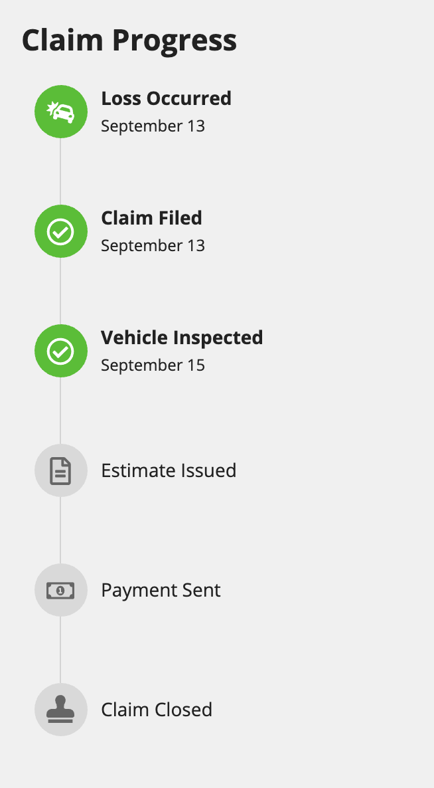
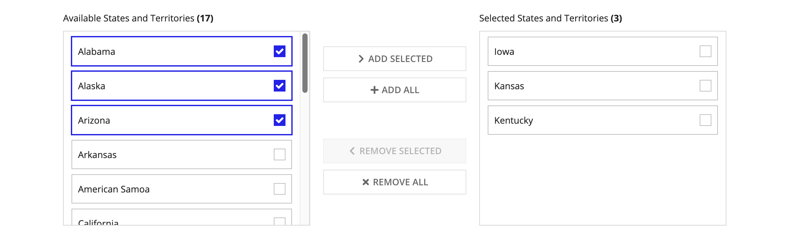
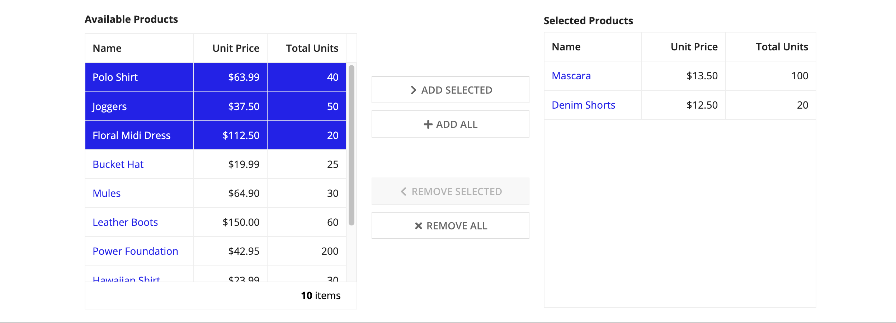

# Popular Patterns [SAIL Design System: Patterns]

*Section: patterns | source: https://docs.appian.com/suite/help/26.7/sail/popular-patterns.html | images referenced live in corpus/images/*

# Popular Patterns

Save time and achieve better results by using these patterns for common features in Appian applications.

## Vertical timeline

Shows process milestones, including future events. This pattern scales better than horizontal timelines for varied numbers of milestones.

See a usage example on the Record Views page.



```sail
a!localVariables(
  local!processTitle: "Claim Progress",
  local!listOfMilestones: {
    "Loss Occurred",
    "Claim Filed",
    "Vehicle Inspected",
    "Estimate Issued",
    "Payment Sent",
    "Claim Closed"
  },
  local!listOfIconsForMilestones: {
    "car-crash",
    "file-o",
    "search",
    "file-text-o",
    "money",
    "stamp"
  },
  local!listOfDatesOfStepCompletions: { now() - 3, now() - 2, now() - 1 },
  local!currentMilestone: count(local!listOfDatesOfStepCompletions),
  a!sectionLayout(
    label: local!processTitle,
    labelSize: "MEDIUM",
    labelColor: "STANDARD",
    contents: {
      a!forEach(
        items: local!listOfMilestones,
        expression: {
          a!columnsLayout(
            columns: {
              a!columnLayout(
                contents: {
                  a!stampField(
                    labelPosition: "COLLAPSED",
                    icon: if(
                      and(
                        not(fv!isFirst),
                        fv!index <= local!currentMilestone
                      ),
                      "check-circle-o",
                      index(
                        local!listOfIconsForMilestones,
                        fv!index,
                        "star"
                      )
                    ),
                    backgroundColor: if(
                      fv!index <= local!currentMilestone,
                      "POSITIVE",
                      "#d9d9d9"
                    ),
                    contentColor: if(
                      fv!index <= local!currentMilestone,
                      "STANDARD",
                      "#666666"
                    ),
                    size: "TINY",
                    align: "CENTER",
                    marginAbove: "NONE",
                    marginBelow: "NONE",
                    accessibilityText: "Completed Step"
                  )
                },
                width: "EXTRA_NARROW"
              ),
              a!columnLayout(
                contents: {
                  a!richTextDisplayField(
                    labelPosition: "COLLAPSED",
                    value: {
                      a!richTextItem(
                        text: { fv!item },
                        size: "STANDARD",
                        style: {
                          if(
                            fv!index <= local!currentMilestone,
                            "STRONG",
                            null
                          )
                        }
                      )
                    },
                    preventWrapping: true,
                    align: "LEFT",
                    marginAbove: "NONE",
                    marginBelow: "NONE"
                  ),
                  a!richTextDisplayField(
                    labelPosition: "COLLAPSED",
                    value: {
                      a!richTextItem(
                        text: {
                          text(
                            index(
                              local!listOfDatesOfStepCompletions,
                              fv!index
                            ),
                            "MMMM dd"
                          )
                        },
                        size: "SMALL"
                      )
                    },
                    preventWrapping: true,
                    showWhen: a!isNotNullOrEmpty(
                      index(
                        local!listOfDatesOfStepCompletions,
                        fv!index,
                        null
                      )
                    ),
                    align: "LEFT",
                    marginAbove: "NONE",
                    marginBelow: "NONE"
                  )
                }
              )
            },
            alignVertical: "MIDDLE",
            marginAbove: if(fv!isFirst, "STANDARD", "NONE"),
            marginBelow: "NONE",
            spacing: "NONE"
          ),
          a!columnsLayout(
            columns: {
              a!columnLayout(
                contents: {
                  a!imageField(
                    label: "",
                    labelPosition: "COLLAPSED",
                    images: {
                      a!documentImage(
                        document: a!EXAMPLE_VERTICAL_CONNECTOR_IMAGE()
                      )
                    },
                    size: "TINY",
                    isThumbnail: false,
                    style: "STANDARD",
                    align: "CENTER"
                  )
                },
                width: "EXTRA_NARROW"
              ),
              a!columnLayout(contents: {})
            },
            alignVertical: "MIDDLE",
            showWhen: not(fv!isLast),
            marginBelow: "NONE",
            spacing: "NONE"
          )
        }
      )
    }
  )
)
```

## Dual picklist (simple)

Use this pattern on a form to allow users to select one or more items from a moderately long list of available choices.

Use standard checkboxes instead for short lists of available choices.

Use pickers instead for very long lists of available choices that cannot easily be browsed by scrolling.



```sail
a!localVariables(
  /*All available items that have not been selected  */
  local!availableList: {
    a!map(id: "AL", name: "Alabama"),
    a!map(id: "AK", name: "Alaska"),
    a!map(id: "AZ", name: "Arizona"),
    a!map(id: "AR", name: "Arkansas"),
    a!map(id: "AS", name: "American Samoa"),
    a!map(id: "CA", name: "California"),
    a!map(id: "CO", name: "Colorado"),
    a!map(id: "CT", name: "Connecticut"),
    a!map(id: "DE", name: "Delaware"),
    a!map(id: "DC", name: "District of Columbia"),
    a!map(id: "FL", name: "Florida"),
    a!map(id: "GA", name: "Georgia"),
    a!map(id: "GU", name: "Guam"),
    a!map(id: "HI", name: "Hawaii"),
    a!map(id: "ID", name: "Idaho"),
    a!map(id: "IL", name: "Illinois"),
    a!map(id: "IN", name: "Indiana"),
    
  },
  /*All items that have been selected  */
  local!selectedList: {
    a!map(id: "IA", name: "Iowa"),
    a!map(id: "KS", name: "Kansas"),
    a!map(id: "KY", name: "Kentucky"),
    
  },
  /*Checked items in available list  */
  local!availableListChoices: { "AL" },
  /*Checked items in selected list  */
  local!selectedListChoices,
  {
    a!columnsLayout(
      columns: {
        a!columnLayout(contents: {}),
        a!columnLayout(
          contents: {
            a!richTextDisplayField(
              labelPosition: "COLLAPSED",
              value: {
                "Available States and Territories",
                " ",
                a!richTextItem(
                  text: "(" & length(local!availableList) & ")",
                  style: "STRONG"
                )
              }
            ),
            a!cardLayout(
              contents: {
                a!checkboxField(
                  label: "Available Items",
                  labelPosition: "COLLAPSED",
                  choiceLabels: local!availableList.name,
                  choiceValues: local!availableList.id,
                  value: local!availableListChoices,
                  saveInto: local!availableListChoices,
                  showWhen: length(local!availableList) > 0,
                  choiceLayout: "STACKED",
                  choiceStyle: "CARDS"
                )
              },
              height: "MEDIUM_PLUS",
              marginBelow: "STANDARD"
            )
          },
          width: "MEDIUM"
        ),
        a!columnLayout(
          contents: {
            a!buttonArrayLayout(
              buttons: {
                a!buttonWidget(
                  label: "Add Selected",
                  icon: if(
                    a!isPageWidth("PHONE"),
                    "chevron-down",
                    "chevron-right"
                  ),
                  saveInto: {
                    /* Add chosen available items to selected list */
                    a!save(
                      local!selectedList,
                      cast(
                        typeof(local!selectedList),
                        todatasubset(
                          arrayToPage: append(
                            local!selectedList,
                            index(
                              local!availableList,
                              wherecontains(
                                local!availableListChoices,
                                local!availableList.id
                              ),
                              {}
                            )
                          ),
                          pagingConfiguration: a!pagingInfo(
                            startIndex: 1,
                            batchSize: - 1,
                            sort: a!sortInfo(field: "id", ascending: true)
                          )
                        ).data
                      )
                    ),
                    /* Remove from available list */
                    a!save(
                      local!availableList,
                      remove(
                        local!availableList,
                        wherecontains(
                          local!availableListChoices,
                          local!availableList.id
                        )
                      )
                    ),
                    /* Clear out choices */
                    a!save(local!availableListChoices, null)
                  },
                  width: "FILL",
                  style: "OUTLINE",
                  color: "SECONDARY",
                  disabled: or(
                    a!isNullOrEmpty(local!availableListChoices),
                    length(local!availableList) = 0
                  )
                ),
                a!buttonWidget(
                  label: "Add All",
                  icon: "plus",
                  saveInto: {
                    /* Add all available items to selected list */
                    a!save(
                      local!selectedList,
                      cast(
                        typeof(local!selectedList),
                        todatasubset(
                          arrayToPage: append(local!selectedList, local!availableList),
                          pagingConfiguration: a!pagingInfo(
                            startIndex: 1,
                            batchSize: - 1,
                            sort: a!sortInfo(field: "id", ascending: true)
                          )
                        ).data
                      )
                    ),
                    /* Clear available list */
                    a!save(local!availableList, {}),
                    /* Clear out choices */
                    a!save(local!availableListChoices, null)
                  },
                  width: "FILL",
                  style: "OUTLINE",
                  color: "SECONDARY",
                  disabled: length(local!availableList) = 0
                )
              },
              align: "START",
              marginBelow: "EVEN_MORE"
            ),
            a!buttonArrayLayout(
              buttons: {
                a!buttonWidget(
                  label: "Remove Selected",
                  icon: if(
                    a!isPageWidth("PHONE"),
                    "chevron-up",
                    "chevron-left"
                  ),
                  saveInto: {
                    /* Add chosen selected items to available list */
                    a!save(
                      local!availableList,
                      cast(
                        typeof(local!availableList),
                        todatasubset(
                          arrayToPage: append(
                            local!availableList,
                            index(
                              local!selectedList,
                              wherecontains(
                                local!selectedListChoices,
                                local!selectedList.id
                              ),
                              {}
                            )
                          ),
                          pagingConfiguration: a!pagingInfo(
                            startIndex: 1,
                            batchSize: - 1,
                            sort: a!sortInfo(field: "id", ascending: true)
                          )
                        ).data
                      )
                    ),
                    /* Remove from selected list */
                    a!save(
                      local!selectedList,
                      remove(
                        local!selectedList,
                        wherecontains(
                          local!selectedListChoices,
                          local!selectedList.id
                        )
                      )
                    ),
                    /* Clear out choices */
                    a!save(local!selectedListChoices, null)
                  },
                  width: "FILL",
                  style: "OUTLINE",
                  color: "SECONDARY",
                  disabled: or(
                    a!isNullOrEmpty(local!selectedListChoices),
                    length(local!selectedList) = 0
                  )
                ),
                a!buttonWidget(
                  label: "Remove All",
                  icon: "times",
                  saveInto: {
                    /* Add all selected items to available list */
                    a!save(
                      local!availableList,
                      cast(
                        typeof(local!availableList),
                        todatasubset(
                          arrayToPage: append(local!availableList, local!selectedList),
                          pagingConfiguration: a!pagingInfo(
                            startIndex: 1,
                            batchSize: - 1,
                            sort: a!sortInfo(field: "id", ascending: true)
                          )
                        ).data
                      )
                    ),
                    /* Clear selected list */
                    a!save(local!selectedList, {}),
                    /* Clear out choices */
                    a!save(local!selectedListChoices, null)
                  },
                  width: "FILL",
                  style: "OUTLINE",
                  color: "SECONDARY",
                  disabled: length(local!selectedList) = 0
                )
              },
              align: "START"
            )
          },
          width: "NARROW"
        ),
        a!columnLayout(
          contents: {
            a!richTextDisplayField(
              labelPosition: "COLLAPSED",
              value: {
                "Selected States and Territories",
                " ",
                a!richTextItem(
                  text: "(" & length(local!selectedList) & ")",
                  style: "STRONG"
                )
              }
            ),
            a!cardLayout(
              contents: {
                a!checkboxField(
                  label: "Selected Items",
                  labelPosition: "COLLAPSED",
                  choiceLabels: local!selectedList.name,
                  choiceValues: local!selectedList.id,
                  value: local!selectedListChoices,
                  saveInto: local!selectedListChoices,
                  showWhen: length(local!selectedList) > 0,
                  choiceLayout: "STACKED",
                  choiceStyle: "CARDS"
                )
              },
              height: "MEDIUM_PLUS",
              marginBelow: "STANDARD"
            )
          },
          width: "MEDIUM"
        ),
        a!columnLayout(contents: {})
      },
      alignVertical: "MIDDLE"
    )
  }
)
```

## Dual picklist (grids)

Use this pattern on a form to allow users to select one or more items from a large set of possible values.

Displaying available and selected items in grids allows additional attributes to be shown.



```sail
a!localVariables(
  /*All items in the Available Products grid */
  local!availableItems: {
    a!map(
      id: 1,
      name: "Polo Shirt",
      price: 63.99,
      totalUnits: 40
    ),
    a!map(
      id: 2,
      name: "Joggers",
      price: 37.50,
      totalUnits: 50
    ),
    a!map(
      id: 3,
      name: "Floral Midi Dress",
      price: 112.50,
      totalUnits: 20
    ),
    a!map(
      id: 4,
      name: "Bucket Hat",
      price: 19.99,
      totalUnits: 25
    ),
    a!map(
      id: 5,
      name: "Mules",
      price: 64.90,
      totalUnits: 30
    ),
    a!map(
      id: 6,
      name: "Leather Boots",
      price: 150.00,
      totalUnits: 60
    ),
    a!map(
      id: 7,
      name: "Power Foundation",
      price: 42.95,
      totalUnits: 200
    ),
    a!map(
      id: 3,
      name: "Hawaiian Shirt",
      price: 23.99,
      totalUnits: 30
    ),
    a!map(
      id: 4,
      name: "Jeans",
      price: 80.00,
      totalUnits: 45
    ),
    a!map(
      id: 5,
      name: "Cocktail Dress",
      price: 80,
      totalUnits: 20
    )
  },
  /*All items in the Selected Products grid*/
  local!selectedItems: {
    a!map(
      id: 1,
      name: "Mascara",
      price: 13.50,
      totalUnits: 100
    ),
    a!map(
      id: 2,
      name: "Denim Shorts",
      price: 12.50,
      totalUnits: 20
    )
  },
  /*Chosen rows in the Available Products grid */
  local!availableListChoices,
  /*Chosen rows in the Selected Products grid */
  local!selectedListChoices,
  /*Grid selection for the Available Products grid */
  local!availableGridSelection,
  /*Grid selection for Selected Products grid*/
  local!selectedGridSelection,
  {
    a!columnsLayout(
      columns: {
        a!columnLayout(contents: {}),
        a!columnLayout(
          contents: {
            a!gridField(
              label: "Available Products",
              data: local!availableItems,
              columns: {
                a!gridColumn(
                  label: "Name",
                  sortField: "name",
                  value: a!linkField(
                    links: {
                      a!safeLink(
                        label: fv!row.name,
                        uri: "https://www.appian.com/"
                      )
                    }
                  )
                ),
                a!gridColumn(
                  label: "Unit Price",
                  sortField: "price",
                  value: dollar(fv!row.price),
                  align: "END"
                ),
                a!gridColumn(
                  label: "Total Units",
                  sortField: "totalUnits",
                  value: fv!row.totalUnits,
                  align: "END"
                )
              },
              pageSize: 50,
              selectable: true,
              selectionStyle: "ROW_HIGHLIGHT",
              selectionValue: local!availableGridSelection,
              selectionSaveInto: {
                local!availableGridSelection,
                a!save(
                  local!availableListChoices,
                  append(
                    local!availableListChoices,
                    fv!selectedRows
                  )
                ),
                a!save(
                  local!availableListChoices,
                  difference(
                    local!availableListChoices,
                    cast(
                      typeof(local!availableListChoices),
                      fv!deselectedRows
                    )
                  )
                )
              },
              validations: {},
              height: "MEDIUM",
              shadeAlternateRows: false,
              refreshAfter: "RECORD_ACTION"
            )
          },
          width: "MEDIUM"
        ),
        a!columnLayout(
          contents: {
            a!buttonArrayLayout(
              buttons: {
                a!buttonWidget(
                  label: "Add Selected",
                  icon: "chevron-right",
                  saveInto: {
                    /*Add the chosen available items to the selected items*/
                    a!save(
                      local!selectedItems,
                      append(
                        local!selectedItems,
                        local!availableListChoices
                      )
                    ),
                    /*Clear out the grid selection and remove selected items from available list*/
                    a!save(
                      local!availableItems,
                      difference(
                        local!availableItems,
                        local!availableListChoices
                      )
                    ),
                    a!save(local!availableListChoices, null),
                    a!save(local!availableGridSelection, null)
                  },
                  width: "FILL",
                  style: "OUTLINE",
                  color: "SECONDARY",
                  disabled: a!isNullOrEmpty(local!availableListChoices)
                ),
                a!buttonWidget(
                  label: "Add All",
                  icon: "plus",
                  saveInto: {
                    /*Add all remaining available items to the selected list*/
                    a!save(
                      local!selectedItems,
                      append(
                        local!selectedItems,
                        local!availableItems
                      )
                    ),
                    /*Remove everything from the available list*/
                    a!save(local!availableItems, null),
                    a!save(local!availableGridSelection, null)
                  },
                  width: "FILL",
                  style: "OUTLINE",
                  color: "SECONDARY",
                  disabled: a!isNullOrEmpty(local!availableItems)
                )
              },
              align: "START",
              marginBelow: "EVEN_MORE"
            ),
            a!buttonArrayLayout(
              buttons: {
                a!buttonWidget(
                  label: "Remove Selected",
                  icon: "chevron-left",
                  saveInto: {
                    /* Move the selected items to the available list                    */
                    a!save(
                      local!availableItems,
                      append(
                        local!availableItems,
                        local!selectedListChoices
                      )
                    ),
                    /*Remove the moved items from the selected list*/
                    a!save(
                      local!selectedItems,
                      difference(
                        local!selectedItems,
                        local!selectedListChoices
                      )
                    ),
                    a!save(local!selectedListChoices, null),
                    a!save(local!selectedGridSelection, null)
                  },
                  width: "FILL",
                  style: "OUTLINE",
                  color: "SECONDARY",
                  disabled: a!isNullOrEmpty(local!selectedListChoices)
                ),
                a!buttonWidget(
                  label: "Remove All",
                  icon: "times",
                  saveInto: {
                    /*Add all selected items back in the available list                    */
                    a!save(
                      local!availableItems,
                      append(
                        local!availableItems,
                        local!selectedItems
                      )
                    ),
                    /*Clear out selected items and grid selection*/
                    a!save(local!selectedItems, null),
                    a!save(local!selectedListChoices, null),
                    a!save(local!selectedGridSelection, null)
                  },
                  width: "FILL",
                  style: "OUTLINE",
                  color: "SECONDARY",
                  disabled: a!isNullOrEmpty(local!selectedItems)
                )
              },
              align: "START"
            )
          },
          width: "NARROW"
        ),
        a!columnLayout(
          contents: {
            a!gridField(
              label: "Selected Products",
              data: local!selectedItems,
              columns: {
                a!gridColumn(
                  label: "Name",
                  sortField: "name",
                  value: a!linkField(
                    links: {
                      a!safeLink(
                        label: fv!row.name,
                        uri: "https://www.appian.com/"
                      )
                    }
                  )
                ),
                a!gridColumn(
                  label: "Unit Price",
                  sortField: "price",
                  value: dollar(fv!row.price),
                  align: "END"
                ),
                a!gridColumn(
                  label: "Total Units",
                  sortField: "totalUnits",
                  value: fv!row.totalUnits,
                  align: "END"
                )
              },
              pageSize: 50,
              selectable: true,
              selectionStyle: "ROW_HIGHLIGHT",
              selectionValue: local!selectedGridSelection,
              selectionSaveInto: {
                local!selectedGridSelection,
                a!save(
                  local!selectedListChoices,
                  append(
                    local!selectedListChoices,
                    fv!selectedRows
                  )
                ),
                a!save(
                  local!selectedListChoices,
                  difference(
                    local!selectedListChoices,
                    cast(
                      typeof(local!selectedListChoices),
                      fv!deselectedRows
                    )
                  )
                )
              },
              validations: {},
              height: "MEDIUM",
              shadeAlternateRows: false,
              refreshAfter: "RECORD_ACTION"
            )
          },
          width: "MEDIUM"
        ),
        a!columnLayout(contents: {})
      },
      alignVertical: "MIDDLE"
    )
  }
)
```
