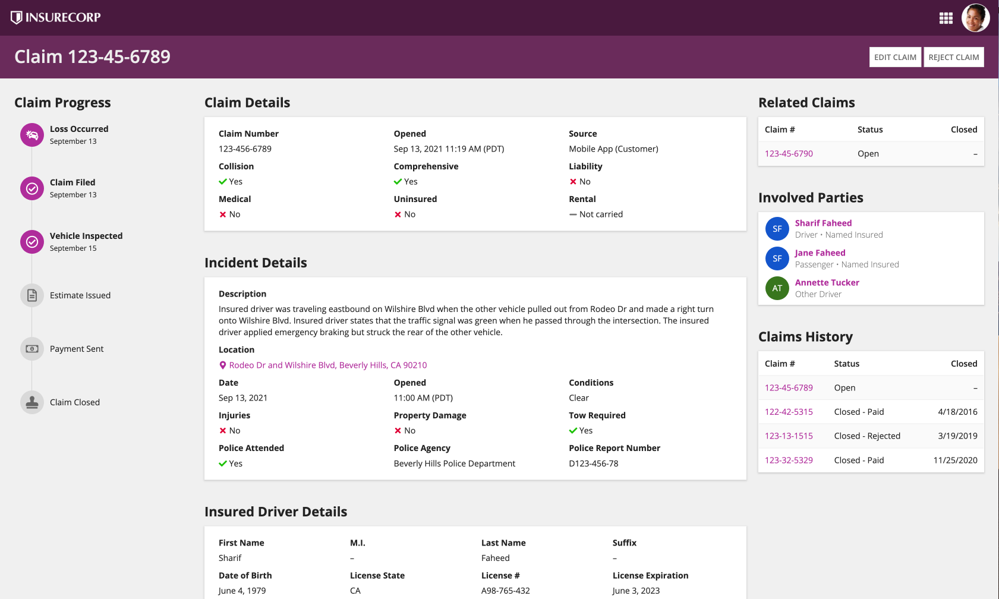
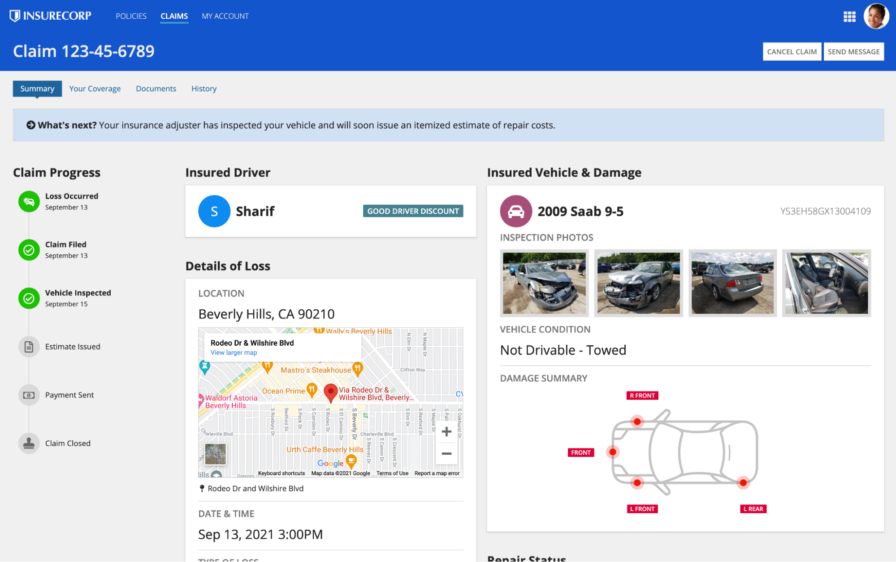
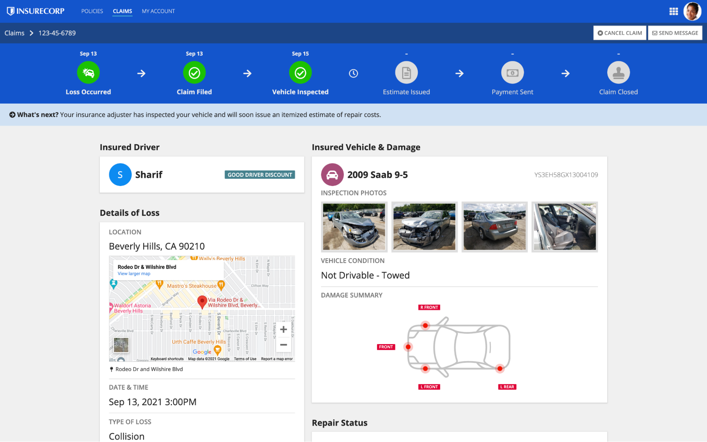
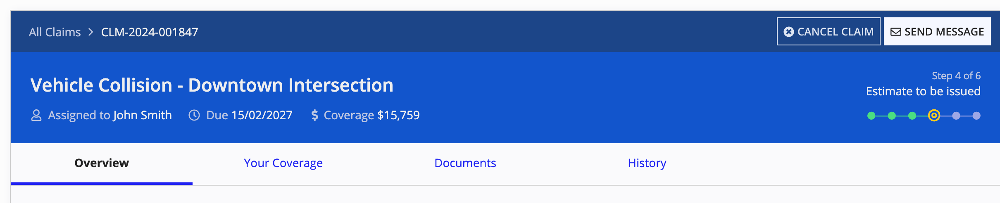

# Record Views [SAIL Design System: Patterns]

*Section: patterns | source: https://docs.appian.com/suite/help/26.7/sail/record-views.html | images referenced live in corpus/images/*

# Record Views

Help users to easily scan for relevant record details and actions.

## Basic record view with cards

This pattern uses the following techniques to create an easy-to-scan record view design:

- Flush header to differentiate it from page contents.

- Content cards contrasted against a transparent background.

- Clear section headers.

- Large label and value text for easy reading and to fill up the page.

** To establish a bolder header style that stands out more from the view contents, set a header background color. You can also hide the record header and build custom navigation for complete design control over headers and navigation.


## Basic record view (alternative)

This record view design focuses on showing data from a record and its related records.

The cards in the middle column show record field values from the subject record and some of its one-to-one related records.

The cards in the right column show lists of one-to-many related records.

** Try not to mix different column counts or field label positions within one card as this could create visual misalignment. However, lengthier values, such as the "Description" field in the "Incidents Details" card, may look best when they span the full width of the card alongside shorter values that are arranged into multiple columns.



```sail
a!localVariables(
  local!claimsHistory: {
    a!map(
      claimNumber: "123-45-6793",
      status: "Open",
      closedDate: null
    ),
    a!map(
      claimNumber: "123-42-5315",
      status: "Closed - Paid",
      closedDate: date(2016, 4, 18)
    ),
    a!map(
      claimNumber: "123-13-1515",
      status: "Closed - Rejected",
      closedDate: date(2019, 3, 19)
    ),
    a!map(
      claimNumber: "123-13-1515",
      status: "Closed - Paid",
      closedDate: date(2020, 11, 25)
    )
  },
  a!headerContentLayout(
    header: {},
    contents: {
      a!columnsLayout(
        columns: {
          a!columnLayout(
            contents: {
              a!sectionLayout(
                label: "Claim Progress",
                labelSize: "MEDIUM",
                labelColor: "STANDARD",
                contents: {
                  a!columnsLayout(
                    columns: {
                      a!columnLayout(
                        contents: {
                          a!stampField(
                            labelPosition: "COLLAPSED",
                            icon: "car-crash",
                            backgroundColor: "ACCENT",
                            contentColor: "STANDARD",
                            size: "TINY",
                            align: "CENTER",
                            marginBelow: "NONE"
                          )
                        },
                        width: "EXTRA_NARROW"
                      ),
                      a!columnLayout(
                        contents: {
                          a!richTextDisplayField(
                            labelPosition: "COLLAPSED",
                            value: {
                              a!richTextItem(
                                text: { "Loss Occurred" },
                                size: "STANDARD",
                                style: { "STRONG" }
                              )
                            },
                            preventWrapping: true,
                            align: "LEFT",
                            marginAbove: "NONE",
                            marginBelow: "NONE"
                          ),
                          a!richTextDisplayField(
                            labelPosition: "COLLAPSED",
                            value: {
                              a!richTextItem(text: { "September 13" }, size: "SMALL")
                            },
                            preventWrapping: true,
                            align: "LEFT",
                            marginAbove: "NONE",
                            marginBelow: "NONE"
                          )
                        }
                      )
                    },
                    alignVertical: "MIDDLE",
                    marginAbove: "STANDARD",
                    marginBelow: "NONE",
                    spacing: "NONE"
                  ),
                  a!columnsLayout(
                    columns: {
                      a!columnLayout(
                        contents: {
                          a!imageField(
                            label: "",
                            labelPosition: "COLLAPSED",
                            images: {
                              a!documentImage(
                                document: a!EXAMPLE_VERTICAL_CONNECTOR_IMAGE()
                              )
                            },
                            size: "TINY",
                            isThumbnail: false,
                            style: "STANDARD",
                            align: "CENTER"
                          )
                        },
                        width: "EXTRA_NARROW"
                      ),
                      a!columnLayout(contents: {})
                    },
                    alignVertical: "MIDDLE",
                    marginBelow: "NONE",
                    spacing: "NONE"
                  ),
                  a!columnsLayout(
                    columns: {
                      a!columnLayout(
                        contents: {
                          a!stampField(
                            labelPosition: "COLLAPSED",
                            icon: "check-circle-o",
                            backgroundColor: "ACCENT",
                            contentColor: "STANDARD",
                            size: "TINY",
                            align: "CENTER",
                            marginBelow: "NONE"
                          )
                        },
                        width: "EXTRA_NARROW"
                      ),
                      a!columnLayout(
                        contents: {
                          a!richTextDisplayField(
                            labelPosition: "COLLAPSED",
                            value: {
                              a!richTextItem(
                                text: { "Claim Filed" },
                                size: "STANDARD",
                                style: { "STRONG" }
                              )
                            },
                            preventWrapping: true,
                            align: "LEFT",
                            marginAbove: "NONE",
                            marginBelow: "NONE"
                          ),
                          a!richTextDisplayField(
                            labelPosition: "COLLAPSED",
                            value: {
                              a!richTextItem(text: { "September 13" }, size: "SMALL")
                            },
                            preventWrapping: true,
                            align: "LEFT",
                            marginAbove: "NONE",
                            marginBelow: "NONE"
                          )
                        }
                      )
                    },
                    alignVertical: "MIDDLE",
                    marginBelow: "NONE",
                    spacing: "NONE"
                  ),
                  a!columnsLayout(
                    columns: {
                      a!columnLayout(
                        contents: {
                          a!imageField(
                            label: "",
                            labelPosition: "COLLAPSED",
                            images: {
                              a!documentImage(
                                document: a!EXAMPLE_VERTICAL_CONNECTOR_IMAGE()
                              )
                            },
                            size: "TINY",
                            isThumbnail: false,
                            style: "STANDARD",
                            align: "CENTER"
                          )
                        },
                        width: "EXTRA_NARROW"
                      ),
                      a!columnLayout(contents: {})
                    },
                    alignVertical: "MIDDLE",
                    marginBelow: "NONE",
                    spacing: "NONE"
                  ),
                  a!columnsLayout(
                    columns: {
                      a!columnLayout(
                        contents: {
                          a!stampField(
                            labelPosition: "COLLAPSED",
                            icon: "check-circle-o",
                            backgroundColor: "ACCENT",
                            contentColor: "STANDARD",
                            size: "TINY",
                            align: "CENTER",
                            marginBelow: "NONE"
                          )
                        },
                        width: "EXTRA_NARROW"
                      ),
                      a!columnLayout(
                        contents: {
                          a!richTextDisplayField(
                            labelPosition: "COLLAPSED",
                            value: {
                              a!richTextItem(
                                text: { "Vehicle Inspected" },
                                size: "STANDARD",
                                style: { "STRONG" }
                              )
                            },
                            preventWrapping: true,
                            align: "LEFT",
                            marginAbove: "NONE",
                            marginBelow: "NONE"
                          ),
                          a!richTextDisplayField(
                            labelPosition: "COLLAPSED",
                            value: {
                              a!richTextItem(text: { "September 15" }, size: "SMALL")
                            },
                            preventWrapping: true,
                            align: "LEFT",
                            marginAbove: "NONE",
                            marginBelow: "NONE"
                          )
                        }
                      )
                    },
                    alignVertical: "MIDDLE",
                    marginBelow: "NONE",
                    spacing: "NONE"
                  ),
                  a!columnsLayout(
                    columns: {
                      a!columnLayout(
                        contents: {
                          a!imageField(
                            label: "",
                            labelPosition: "COLLAPSED",
                            images: {
                              a!documentImage(
                                document: a!EXAMPLE_VERTICAL_CONNECTOR_IMAGE()
                              )
                            },
                            size: "TINY",
                            isThumbnail: false,
                            style: "STANDARD",
                            align: "CENTER"
                          )
                        },
                        width: "EXTRA_NARROW"
                      ),
                      a!columnLayout(contents: {})
                    },
                    alignVertical: "MIDDLE",
                    marginBelow: "NONE",
                    spacing: "NONE"
                  ),
                  a!columnsLayout(
                    columns: {
                      a!columnLayout(
                        contents: {
                          a!stampField(
                            labelPosition: "COLLAPSED",
                            icon: "file-text-o",
                            backgroundColor: "#d9d9d9",
                            contentColor: "#666666",
                            size: "TINY",
                            align: "CENTER",
                            marginBelow: "NONE"
                          )
                        },
                        width: "EXTRA_NARROW"
                      ),
                      a!columnLayout(
                        contents: {
                          a!richTextDisplayField(
                            labelPosition: "COLLAPSED",
                            value: {
                              a!richTextItem(
                                text: { "Estimate Issued" },
                                size: "STANDARD"
                              )
                            },
                            preventWrapping: true,
                            align: "LEFT",
                            marginAbove: "NONE",
                            marginBelow: "NONE"
                          )
                        }
                      )
                    },
                    alignVertical: "MIDDLE",
                    marginBelow: "NONE",
                    spacing: "NONE"
                  ),
                  a!columnsLayout(
                    columns: {
                      a!columnLayout(
                        contents: {
                          a!imageField(
                            label: "",
                            labelPosition: "COLLAPSED",
                            images: {
                              a!documentImage(
                                document: a!EXAMPLE_VERTICAL_CONNECTOR_IMAGE()
                              )
                            },
                            size: "TINY",
                            isThumbnail: false,
                            style: "STANDARD",
                            align: "CENTER"
                          )
                        },
                        width: "EXTRA_NARROW"
                      ),
                      a!columnLayout(contents: {})
                    },
                    alignVertical: "MIDDLE",
                    marginBelow: "NONE",
                    spacing: "NONE"
                  ),
                  a!columnsLayout(
                    columns: {
                      a!columnLayout(
                        contents: {
                          a!stampField(
                            labelPosition: "COLLAPSED",
                            icon: "money",
                            backgroundColor: "#d9d9d9",
                            contentColor: "#666666",
                            size: "TINY",
                            align: "CENTER",
                            marginBelow: "NONE"
                          )
                        },
                        width: "EXTRA_NARROW"
                      ),
                      a!columnLayout(
                        contents: {
                          a!richTextDisplayField(
                            labelPosition: "COLLAPSED",
                            value: {
                              a!richTextItem(text: { "Payment Sent" }, size: "STANDARD")
                            },
                            preventWrapping: true,
                            align: "LEFT",
                            marginAbove: "NONE",
                            marginBelow: "NONE"
                          )
                        }
                      )
                    },
                    alignVertical: "MIDDLE",
                    marginBelow: "NONE",
                    spacing: "NONE"
                  ),
                  a!columnsLayout(
                    columns: {
                      a!columnLayout(
                        contents: {
                          a!imageField(
                            label: "",
                            labelPosition: "COLLAPSED",
                            images: {
                              a!documentImage(
                                document: a!EXAMPLE_VERTICAL_CONNECTOR_IMAGE()
                              )
                            },
                            size: "TINY",
                            isThumbnail: false,
                            style: "STANDARD",
                            align: "CENTER"
                          )
                        },
                        width: "EXTRA_NARROW"
                      ),
                      a!columnLayout(contents: {})
                    },
                    alignVertical: "MIDDLE",
                    marginBelow: "NONE",
                    spacing: "NONE"
                  ),
                  a!columnsLayout(
                    columns: {
                      a!columnLayout(
                        contents: {
                          a!stampField(
                            labelPosition: "COLLAPSED",
                            icon: "stamp",
                            backgroundColor: "#d9d9d9",
                            contentColor: "#666666",
                            size: "TINY",
                            align: "CENTER",
                            marginBelow: "NONE"
                          )
                        },
                        width: "EXTRA_NARROW"
                      ),
                      a!columnLayout(
                        contents: {
                          a!richTextDisplayField(
                            labelPosition: "COLLAPSED",
                            value: {
                              a!richTextItem(text: { "Claim Closed" }, size: "STANDARD")
                            },
                            preventWrapping: true,
                            align: "LEFT",
                            marginAbove: "NONE",
                            marginBelow: "NONE"
                          )
                        }
                      )
                    },
                    alignVertical: "MIDDLE",
                    marginBelow: "NONE",
                    spacing: "NONE"
                  )
                }
              )
            },
            width: "NARROW_PLUS"
          ),
          a!columnLayout(
            contents: {
              a!sectionLayout(
                label: "Claim Details",
                labelSize: "MEDIUM",
                labelHeadingTag: "H2",
                labelColor: "STANDARD",
                contents: {
                  a!cardLayout(
                    contents: {
                      a!columnsLayout(
                        columns: {
                          a!columnLayout(
                            contents: {
                              a!richTextDisplayField(
                                label: "Claim Number",
                                labelPosition: "ABOVE",
                                value: { "123-456-6789" }
                              )
                            }
                          ),
                          a!columnLayout(
                            contents: {
                              a!richTextDisplayField(
                                label: "Opened",
                                labelPosition: "ABOVE",
                                value: { "Sep 13, 2021 11:19 AM (PDT)" }
                              )
                            }
                          ),
                          a!columnLayout(
                            contents: {
                              a!richTextDisplayField(
                                label: "Source",
                                labelPosition: "ABOVE",
                                value: { "Mobile App (Customer)" }
                              )
                            }
                          )
                        }
                      ),
                      a!columnsLayout(
                        columns: {
                          a!columnLayout(
                            contents: {
                              a!richTextDisplayField(
                                label: "Collision",
                                labelPosition: "ABOVE",
                                value: {
                                  a!richTextIcon(icon: "check", color: "POSITIVE"),
                                  " Yes"
                                }
                              )
                            }
                          ),
                          a!columnLayout(
                            contents: {
                              a!richTextDisplayField(
                                label: "Comprehensive",
                                labelPosition: "ABOVE",
                                value: {
                                  a!richTextIcon(icon: "check", color: "POSITIVE"),
                                  " Yes"
                                }
                              )
                            }
                          ),
                          a!columnLayout(
                            contents: {
                              a!richTextDisplayField(
                                label: "Liability",
                                labelPosition: "ABOVE",
                                value: {
                                  a!richTextIcon(icon: "times", color: "NEGATIVE"),
                                  " No"
                                }
                              )
                            }
                          )
                        }
                      ),
                      a!columnsLayout(
                        columns: {
                          a!columnLayout(
                            contents: {
                              a!richTextDisplayField(
                                label: "Medical",
                                labelPosition: "ABOVE",
                                value: {
                                  a!richTextIcon(icon: "times", color: "NEGATIVE"),
                                  " No"
                                }
                              )
                            }
                          ),
                          a!columnLayout(
                            contents: {
                              a!richTextDisplayField(
                                label: "Uninsured",
                                labelPosition: "ABOVE",
                                value: {
                                  a!richTextIcon(icon: "times", color: "NEGATIVE"),
                                  " No"
                                }
                              )
                            }
                          ),
                          a!columnLayout(
                            contents: {
                              a!richTextDisplayField(
                                label: "Rental",
                                labelPosition: "ABOVE",
                                value: {
                                  a!richTextIcon(icon: "minus", color: "SECONDARY"),
                                  " Not carried"
                                }
                              )
                            }
                          )
                        }
                      )
                    },
                    height: "AUTO",
                    style: "NONE",
                    padding: "STANDARD",
                    marginBelow: "STANDARD",
                    showBorder: false,
                    showShadow: true
                  )
                },
                marginBelow: "MORE"
              ),
              a!sectionLayout(
                label: "Incident Details",
                labelSize: "MEDIUM",
                labelHeadingTag: "H2",
                labelColor: "STANDARD",
                contents: {
                  a!cardLayout(
                    contents: {
                      a!sectionLayout(
                        label: "",
                        labelSize: "SMALL",
                        labelHeadingTag: "H3",
                        labelColor: "SECONDARY",
                        contents: {
                          a!richTextDisplayField(
                            label: "Description",
                            labelPosition: "ABOVE",
                            value: {
                              "Insured driver was traveling eastbound on Wilshire Blvd when the other vehicle pulled out from Rodeo Dr and made a right turn onto Wilshire Blvd. Insured driver states that the traffic signal was green when he passed through the intersection. The insured driver applied emergency braking but struck the rear of the other vehicle."
                            },
                            marginBelow: "STANDARD"
                          )
                        },
                        divider: "NONE",
                        marginBelow: "NONE"
                      ),
                      a!richTextDisplayField(
                        label: "Location",
                        labelPosition: "ABOVE",
                        value: {
                          a!richTextItem(
                            text: {
                              a!richTextIcon(icon: "map-marker"),
                              " Rodeo Dr and Wilshire Blvd, Beverly Hills, CA 90210"
                            },
                            color: "ACCENT"
                          )
                        }
                      ),
                      a!columnsLayout(
                        columns: {
                          a!columnLayout(
                            contents: {
                              a!richTextDisplayField(
                                label: "Date",
                                labelPosition: "ABOVE",
                                value: { "Sep 13, 2021" }
                              )
                            }
                          ),
                          a!columnLayout(
                            contents: {
                              a!richTextDisplayField(
                                label: "Opened",
                                labelPosition: "ABOVE",
                                value: { "11:00 AM (PDT)" }
                              )
                            }
                          ),
                          a!columnLayout(
                            contents: {
                              a!richTextDisplayField(
                                label: "Conditions",
                                labelPosition: "ABOVE",
                                value: { "Clear" }
                              )
                            }
                          )
                        }
                      ),
                      a!columnsLayout(
                        columns: {
                          a!columnLayout(
                            contents: {
                              a!richTextDisplayField(
                                label: "Injuries",
                                labelPosition: "ABOVE",
                                value: {
                                  a!richTextIcon(icon: "times", color: "NEGATIVE"),
                                  " No"
                                }
                              )
                            }
                          ),
                          a!columnLayout(
                            contents: {
                              a!richTextDisplayField(
                                label: "Property Damage",
                                labelPosition: "ABOVE",
                                value: {
                                  a!richTextIcon(icon: "times", color: "NEGATIVE"),
                                  " No"
                                }
                              )
                            }
                          ),
                          a!columnLayout(
                            contents: {
                              a!richTextDisplayField(
                                label: "Tow Required",
                                labelPosition: "ABOVE",
                                value: {
                                  a!richTextIcon(icon: "check", color: "POSITIVE"),
                                  " Yes"
                                }
                              )
                            }
                          )
                        }
                      ),
                      a!columnsLayout(
                        columns: {
                          a!columnLayout(
                            contents: {
                              a!richTextDisplayField(
                                label: "Police Attended",
                                labelPosition: "ABOVE",
                                value: {
                                  a!richTextIcon(icon: "check", color: "POSITIVE"),
                                  " Yes"
                                }
                              )
                            }
                          ),
                          a!columnLayout(
                            contents: {
                              a!richTextDisplayField(
                                label: "Police Agency",
                                labelPosition: "ABOVE",
                                value: { "Beverly Hills Police Department" }
                              )
                            }
                          ),
                          a!columnLayout(
                            contents: {
                              a!richTextDisplayField(
                                label: "Police Report Number",
                                labelPosition: "ABOVE",
                                value: { "D123-456-78" }
                              )
                            }
                          )
                        }
                      )
                    },
                    height: "AUTO",
                    style: "NONE",
                    padding: "STANDARD",
                    marginBelow: "STANDARD",
                    showBorder: false,
                    showShadow: true
                  )
                },
                marginBelow: "MORE"
              ),
              a!sectionLayout(
                label: "Insured Driver Details",
                labelSize: "MEDIUM",
                labelHeadingTag: "H2",
                labelColor: "STANDARD",
                contents: {
                  a!cardLayout(
                    contents: {
                      a!columnsLayout(
                        columns: {
                          a!columnLayout(
                            contents: {
                              a!richTextDisplayField(
                                label: "First Name",
                                labelPosition: "ABOVE",
                                value: { "Sharif" }
                              )
                            }
                          ),
                          a!columnLayout(
                            contents: {
                              a!richTextDisplayField(
                                label: "M.I.",
                                labelPosition: "ABOVE",
                                value: { "–" }
                              )
                            }
                          ),
                          a!columnLayout(
                            contents: {
                              a!richTextDisplayField(
                                label: "Last Name",
                                labelPosition: "ABOVE",
                                value: { "Faheed" }
                              )
                            }
                          ),
                          a!columnLayout(
                            contents: {
                              a!richTextDisplayField(
                                label: "Suffix",
                                labelPosition: "ABOVE",
                                value: { "–" }
                              )
                            }
                          )
                        }
                      ),
                      a!columnsLayout(
                        columns: {
                          a!columnLayout(
                            contents: {
                              a!richTextDisplayField(
                                label: "Date of Birth",
                                labelPosition: "ABOVE",
                                value: { "June 4, 1979" }
                              )
                            }
                          ),
                          a!columnLayout(
                            contents: {
                              a!richTextDisplayField(
                                label: "License State",
                                labelPosition: "ABOVE",
                                value: { "CA" }
                              )
                            }
                          ),
                          a!columnLayout(
                            contents: {
                              a!richTextDisplayField(
                                label: "License #",
                                labelPosition: "ABOVE",
                                value: { "A98-765-432" }
                              )
                            }
                          ),
                          a!columnLayout(
                            contents: {
                              a!richTextDisplayField(
                                label: "License Expiration",
                                labelPosition: "ABOVE",
                                value: { "June 3, 2023" }
                              )
                            }
                          )
                        }
                      )
                    },
                    height: "AUTO",
                    style: "NONE",
                    padding: "STANDARD",
                    marginBelow: "STANDARD",
                    showBorder: false,
                    showShadow: true
                  )
                },
                marginBelow: "MORE"
              )
            },
            width: "AUTO"
          ),
          a!columnLayout(
            contents: {
              a!sectionLayout(
                label: "Related Claims",
                labelSize: "MEDIUM",
                labelColor: "STANDARD",
                contents: {
                  a!cardLayout(
                    contents: {
                      a!gridField(
                        label: "Claims History",
                        labelPosition: "COLLAPSED",
                        data: local!claimsHistory[1],
                        columns: {
                          a!gridColumn(
                            label: "Claim #",
                            value: fv!row.claimNumber
                          ),
                          a!gridColumn(label: "Status", value: fv!row.status),
                          a!gridColumn(
                            label: "Closed",
                            value: if(
                              isnull(fv!row.closedDate),
                              "–",
                              datetext(fv!row.closedDate, "M/d/yyyy")
                            ),
                            align: "END"
                          )
                        },
                        borderStyle: "LIGHT"
                      )
                    },
                    height: "AUTO",
                    style: "NONE",
                    padding: "NONE",
                    marginBelow: "STANDARD",
                    showBorder: false,
                    showShadow: true
                  )
                },
                marginBelow: "MORE"
              ),
              a!sectionLayout(
                label: "Involved Parties",
                labelSize: "MEDIUM",
                labelHeadingTag: "H2",
                labelColor: "STANDARD",
                contents: {
                  a!cardLayout(
                    contents: {
                      a!sideBySideLayout(
                        items: {
                          a!sideBySideItem(
                            item: a!stampField(
                              labelPosition: "COLLAPSED",
                              text: "SF",
                              backgroundColor: "#1155cc",
                              contentColor: "STANDARD",
                              size: "TINY"
                            ),
                            width: "MINIMIZE"
                          ),
                          a!sideBySideItem(
                            item: a!richTextDisplayField(
                              labelPosition: "COLLAPSED",
                              value: {
                                a!richTextItem(
                                  text: { "Sharif Faheed" },
                                  color: "ACCENT",
                                  style: { "STRONG" }
                                ),
                                char(10),
                                a!richTextItem(
                                  text: { "Driver • Named Insured" },
                                  color: "SECONDARY"
                                )
                              }
                            )
                          )
                        },
                        alignVertical: "MIDDLE"
                      ),
                      a!sideBySideLayout(
                        items: {
                          a!sideBySideItem(
                            item: a!stampField(
                              labelPosition: "COLLAPSED",
                              text: "SF",
                              backgroundColor: "#1155cc",
                              contentColor: "STANDARD",
                              size: "TINY"
                            ),
                            width: "MINIMIZE"
                          ),
                          a!sideBySideItem(
                            item: a!richTextDisplayField(
                              labelPosition: "COLLAPSED",
                              value: {
                                a!richTextItem(
                                  text: { "Jane Faheed" },
                                  color: "ACCENT",
                                  style: { "STRONG" }
                                ),
                                char(10),
                                a!richTextItem(
                                  text: { "Passenger • Named Insured" },
                                  color: "SECONDARY"
                                )
                              }
                            )
                          )
                        },
                        alignVertical: "MIDDLE"
                      ),
                      a!sideBySideLayout(
                        items: {
                          a!sideBySideItem(
                            item: a!stampField(
                              labelPosition: "COLLAPSED",
                              text: "AT",
                              backgroundColor: "#38761d",
                              contentColor: "STANDARD",
                              size: "TINY"
                            ),
                            width: "MINIMIZE"
                          ),
                          a!sideBySideItem(
                            item: a!richTextDisplayField(
                              labelPosition: "COLLAPSED",
                              value: {
                                a!richTextItem(
                                  text: { "Annette Tucker" },
                                  color: "ACCENT",
                                  style: { "STRONG" }
                                ),
                                char(10),
                                a!richTextItem(
                                  text: { "Other Driver" },
                                  color: "SECONDARY"
                                )
                              }
                            )
                          )
                        },
                        alignVertical: "MIDDLE"
                      )
                    },
                    height: "AUTO",
                    style: "NONE",
                    padding: "LESS",
                    marginBelow: "STANDARD",
                    showBorder: false,
                    showShadow: true
                  )
                },
                marginBelow: "MORE"
              ),
              a!sectionLayout(
                label: "Claims History",
                labelSize: "MEDIUM",
                labelColor: "STANDARD",
                contents: {
                  a!cardLayout(
                    contents: {
                      a!gridField(
                        label: "Claims History",
                        labelPosition: "COLLAPSED",
                        data: local!claimsHistory,
                        columns: {
                          a!gridColumn(
                            label: "Claim #",
                            value: fv!row.claimNumber
                          ),
                          a!gridColumn(
                            label: "Status", 
                            value: fv!row.status
                          ),
                          a!gridColumn(
                            label: "Closed",
                            value: if(
                              isnull(fv!row.closedDate),
                              "–",
                              datetext(fv!row.closedDate, "M/d/yyyy")
                            ),
                            align: "END"
                          )
                        },
                        borderStyle: "LIGHT"
                      )
                    },
                    height: "AUTO",
                    style: "NONE",
                    padding: "NONE",
                    marginBelow: "STANDARD",
                    showBorder: false,
                    showShadow: true
                  )
                },
                marginBelow: "MORE"
              )
            },
            width: "MEDIUM"
          )
        },
        stackWhen: {
          "PHONE",
          "TABLET_PORTRAIT",
          "TABLET_LANDSCAPE"
        }
      )
    },
    backgroundColor: "TRANSPARENT"
  )
)
```

## Case summary record view

Maximize relevant use of visual information display techniques, such as the case milestone timeline and map, to make it easy for users to recognize and understand the topic of this record view at a glance.



```sail
a!headerContentLayout(
  header: {
    a!cardLayout(
      contents: {
        a!cardLayout(
          contents: {
            a!richTextDisplayField(
              labelPosition: "COLLAPSED",
              value: {
                a!richTextItem(
                  text: {
                    a!richTextItem(
                      text: {
                        a!richTextIcon(
                          icon: "arrow-circle-right"
                        ),
                        " What's next? "
                      },
                      style: {
                        "STRONG"
                      }
                    ),
                    "Your insurance adjuster has inspected your vehicle and will soon issue an itemized estimate of repair costs. "
                  },
                  size: "MEDIUM"
                )
              }
            )
          },
          height: "AUTO",
          style: "#cfe2f3",
          padding: "STANDARD",
          marginBelow: "NONE",
          showBorder: false
        )
      },
      height: "AUTO",
      style: "NONE",
      padding: "NONE",
      marginBelow: "STANDARD"
    ),
    a!cardLayout(
      contents: {},
      height: "AUTO",
      style: "#fff",
      padding: "NONE",
      marginBelow: "MORE",
      showBorder: false
    )
  },
  contents: {
    a!columnsLayout(
      columns: {
        a!columnLayout(
          contents: {
            a!sectionLayout(
              label: "Claim Progress",
              labelSize: "MEDIUM",
              labelColor: "STANDARD",
              contents: {
                a!columnsLayout(
                  columns: {
                    a!columnLayout(
                      contents: {
                        a!stampField(
                          labelPosition: "COLLAPSED",
                          icon: "car-crash",
                          backgroundColor: "POSITIVE",
                          contentColor: "STANDARD",
                          size: "TINY",
                          align: "CENTER",
                          marginBelow: "NONE"
                        )
                      },
                      width: "EXTRA_NARROW"
                    ),
                    a!columnLayout(
                      contents: {
                        a!richTextDisplayField(
                          labelPosition: "COLLAPSED",
                          value: {
                            a!richTextItem(
                              text: {
                                "Loss Occurred"
                              },
                              size: "STANDARD",
                              style: {
                                "STRONG"
                              }
                            )
                          },
                          preventWrapping: true,
                          align: "LEFT",
                          marginAbove: "NONE",
                          marginBelow: "NONE"
                        ),
                        a!richTextDisplayField(
                          labelPosition: "COLLAPSED",
                          value: {
                            a!richTextItem(
                              text: {
                                "September 13"
                              },
                              size: "SMALL"
                            )
                          },
                          preventWrapping: true,
                          align: "LEFT",
                          marginAbove: "NONE",
                          marginBelow: "NONE"
                        )
                      }
                    )
                  },
                  alignVertical: "MIDDLE",
                  marginAbove: "STANDARD",
                  marginBelow: "NONE",
                  spacing: "NONE"
                ),
                a!columnsLayout(
                  columns: {
                    a!columnLayout(
                      contents: {
                        a!imageField(
                          label: "",
                          labelPosition: "COLLAPSED",
                          images: {
                            a!documentImage(
                              document: a!EXAMPLE_VERTICAL_CONNECTOR_IMAGE()
                            )
                          },
                          size: "TINY",
                          isThumbnail: false,
                          style: "STANDARD",
                          align: "CENTER"
                        )
                      },
                      width: "EXTRA_NARROW"
                    ),
                    a!columnLayout(
                      contents: {}
                    )
                  },
                  alignVertical: "MIDDLE",
                  marginBelow: "NONE",
                  spacing: "NONE"
                ),
                a!columnsLayout(
                  columns: {
                    a!columnLayout(
                      contents: {
                        a!stampField(
                          labelPosition: "COLLAPSED",
                          icon: "check-circle-o",
                          backgroundColor: "POSITIVE",
                          contentColor: "STANDARD",
                          size: "TINY",
                          align: "CENTER",
                          marginBelow: "NONE"
                        )
                      },
                      width: "EXTRA_NARROW"
                    ),
                    a!columnLayout(
                      contents: {
                        a!richTextDisplayField(
                          labelPosition: "COLLAPSED",
                          value: {
                            a!richTextItem(
                              text: {
                                "Claim Filed"
                              },
                              size: "STANDARD",
                              style: {
                                "STRONG"
                              }
                            )
                          },
                          preventWrapping: true,
                          align: "LEFT",
                          marginAbove: "NONE",
                          marginBelow: "NONE"
                        ),
                        a!richTextDisplayField(
                          labelPosition: "COLLAPSED",
                          value: {
                            a!richTextItem(
                              text: {
                                "September 13"
                              },
                              size: "SMALL"
                            )
                          },
                          preventWrapping: true,
                          align: "LEFT",
                          marginAbove: "NONE",
                          marginBelow: "NONE"
                        )
                      }
                    )
                  },
                  alignVertical: "MIDDLE",
                  marginBelow: "NONE",
                  spacing: "NONE"
                ),
                a!columnsLayout(
                  columns: {
                    a!columnLayout(
                      contents: {
                        a!imageField(
                          label: "",
                          labelPosition: "COLLAPSED",
                          images: {
                            a!documentImage(
                              document: a!EXAMPLE_VERTICAL_CONNECTOR_IMAGE()
                            )
                          },
                          size: "TINY",
                          isThumbnail: false,
                          style: "STANDARD",
                          align: "CENTER"
                        )
                      },
                      width: "EXTRA_NARROW"
                    ),
                    a!columnLayout(
                      contents: {}
                    )
                  },
                  alignVertical: "MIDDLE",
                  marginBelow: "NONE",
                  spacing: "NONE"
                ),
                a!columnsLayout(
                  columns: {
                    a!columnLayout(
                      contents: {
                        a!stampField(
                          labelPosition: "COLLAPSED",
                          icon: "check-circle-o",
                          backgroundColor: "POSITIVE",
                          contentColor: "STANDARD",
                          size: "TINY",
                          align: "CENTER",
                          marginBelow: "NONE"
                        )
                      },
                      width: "EXTRA_NARROW"
                    ),
                    a!columnLayout(
                      contents: {
                        a!richTextDisplayField(
                          labelPosition: "COLLAPSED",
                          value: {
                            a!richTextItem(
                              text: {
                                "Vehicle Inspected"
                              },
                              size: "STANDARD",
                              style: {
                                "STRONG"
                              }
                            )
                          },
                          preventWrapping: true,
                          align: "LEFT",
                          marginAbove: "NONE",
                          marginBelow: "NONE"
                        ),
                        a!richTextDisplayField(
                          labelPosition: "COLLAPSED",
                          value: {
                            a!richTextItem(
                              text: {
                                "September 15"
                              },
                              size: "SMALL"
                            )
                          },
                          preventWrapping: true,
                          align: "LEFT",
                          marginAbove: "NONE",
                          marginBelow: "NONE"
                        )
                      }
                    )
                  },
                  alignVertical: "MIDDLE",
                  marginBelow: "NONE",
                  spacing: "NONE"
                ),
                a!columnsLayout(
                  columns: {
                    a!columnLayout(
                      contents: {
                        a!imageField(
                          label: "",
                          labelPosition: "COLLAPSED",
                          images: {
                            a!documentImage(
                              document: a!EXAMPLE_VERTICAL_CONNECTOR_IMAGE()
                            )
                          },
                          size: "TINY",
                          isThumbnail: false,
                          style: "STANDARD",
                          align: "CENTER"
                        )
                      },
                      width: "EXTRA_NARROW"
                    ),
                    a!columnLayout(
                      contents: {}
                    )
                  },
                  alignVertical: "MIDDLE",
                  marginBelow: "NONE",
                  spacing: "NONE"
                ),
                a!columnsLayout(
                  columns: {
                    a!columnLayout(
                      contents: {
                        a!stampField(
                          labelPosition: "COLLAPSED",
                          icon: "file-text-o",
                          backgroundColor: "#d9d9d9",
                          contentColor: "#666666",
                          size: "TINY",
                          align: "CENTER",
                          marginBelow: "NONE"
                        )
                      },
                      width: "EXTRA_NARROW"
                    ),
                    a!columnLayout(
                      contents: {
                        a!richTextDisplayField(
                          labelPosition: "COLLAPSED",
                          value: {
                            a!richTextItem(
                              text: {
                                "Estimate Issued"
                              },
                              size: "STANDARD"
                            )
                          },
                          preventWrapping: true,
                          align: "LEFT",
                          marginAbove: "NONE",
                          marginBelow: "NONE"
                        )
                      }
                    )
                  },
                  alignVertical: "MIDDLE",
                  marginBelow: "NONE",
                  spacing: "NONE"
                ),
                a!columnsLayout(
                  columns: {
                    a!columnLayout(
                      contents: {
                        a!imageField(
                          label: "",
                          labelPosition: "COLLAPSED",
                          images: {
                            a!documentImage(
                              document: a!EXAMPLE_VERTICAL_CONNECTOR_IMAGE()
                            )
                          },
                          size: "TINY",
                          isThumbnail: false,
                          style: "STANDARD",
                          align: "CENTER"
                        )
                      },
                      width: "EXTRA_NARROW"
                    ),
                    a!columnLayout(
                      contents: {}
                    )
                  },
                  alignVertical: "MIDDLE",
                  marginBelow: "NONE",
                  spacing: "NONE"
                ),
                a!columnsLayout(
                  columns: {
                    a!columnLayout(
                      contents: {
                        a!stampField(
                          labelPosition: "COLLAPSED",
                          icon: "money",
                          backgroundColor: "#d9d9d9",
                          contentColor: "#666666",
                          size: "TINY",
                          align: "CENTER",
                          marginBelow: "NONE"
                        )
                      },
                      width: "EXTRA_NARROW"
                    ),
                    a!columnLayout(
                      contents: {
                        a!richTextDisplayField(
                          labelPosition: "COLLAPSED",
                          value: {
                            a!richTextItem(
                              text: {
                                "Payment Sent"
                              },
                              size: "STANDARD"
                            )
                          },
                          preventWrapping: true,
                          align: "LEFT",
                          marginAbove: "NONE",
                          marginBelow: "NONE"
                        )
                      }
                    )
                  },
                  alignVertical: "MIDDLE",
                  marginBelow: "NONE",
                  spacing: "NONE"
                ),
                a!columnsLayout(
                  columns: {
                    a!columnLayout(
                      contents: {
                        a!imageField(
                          label: "",
                          labelPosition: "COLLAPSED",
                          images: {
                            a!documentImage(
                              document: a!EXAMPLE_VERTICAL_CONNECTOR_IMAGE()
                            )
                          },
                          size: "TINY",
                          isThumbnail: false,
                          style: "STANDARD",
                          align: "CENTER"
                        )
                      },
                      width: "EXTRA_NARROW"
                    ),
                    a!columnLayout(
                      contents: {}
                    )
                  },
                  alignVertical: "MIDDLE",
                  marginBelow: "NONE",
                  spacing: "NONE"
                ),
                a!columnsLayout(
                  columns: {
                    a!columnLayout(
                      contents: {
                        a!stampField(
                          labelPosition: "COLLAPSED",
                          icon: "stamp",
                          backgroundColor: "#d9d9d9",
                          contentColor: "#666666",
                          size: "TINY",
                          align: "CENTER",
                          marginBelow: "NONE"
                        )
                      },
                      width: "EXTRA_NARROW"
                    ),
                    a!columnLayout(
                      contents: {
                        a!richTextDisplayField(
                          labelPosition: "COLLAPSED",
                          value: {
                            a!richTextItem(
                              text: {
                                "Claim Closed"
                              },
                              size: "STANDARD"
                            )
                          },
                          preventWrapping: true,
                          align: "LEFT",
                          marginAbove: "NONE",
                          marginBelow: "NONE"
                        )
                      }
                    )
                  },
                  alignVertical: "MIDDLE",
                  marginBelow: "NONE",
                  spacing: "NONE"
                )
              }
            )
          },
          width: "NARROW_PLUS"
        ),
        a!columnLayout(
          contents: {
            a!sectionLayout(
              label: "Insured Driver",
              labelSize: "MEDIUM",
              labelHeadingTag: "H2",
              labelColor: "STANDARD",
              contents: {
                a!cardLayout(
                  contents: {
                    a!sectionLayout(
                      label: "",
                      labelSize: "SMALL",
                      labelHeadingTag: "H3",
                      labelColor: "SECONDARY",
                      contents: {
                        a!sideBySideLayout(
                          items: {
                            a!sideBySideItem(
                              item: a!stampField(
                                labelPosition: "COLLAPSED",
                                text: "S",
                                backgroundColor: "#118bf1",
                                contentColor: "STANDARD",
                                size: "SMALL"
                              ),
                              width: "MINIMIZE"
                            ),
                            a!sideBySideItem(
                              item: a!richTextDisplayField(
                                labelPosition: "COLLAPSED",
                                value: {
                                  a!richTextItem(
                                    text: {
                                      "Sharif"
                                    },
                                    size: "MEDIUM_PLUS",
                                    style: {
                                      "STRONG"
                                    }
                                  )
                                }
                              )
                            ),
                            a!sideBySideItem(
                              item: a!tagField(
                                labelPosition: "COLLAPSED",
                                tags: {
                                  a!tagItem(
                                    text: "GOOD DRIVER DISCOUNT",
                                    backgroundColor: "#45818e"
                                  )
                                }
                              ),
                              width: "MINIMIZE"
                            )
                          },
                          alignVertical: "MIDDLE"
                        )
                      },
                      divider: "NONE",
                      marginBelow: "NONE"
                    )
                  },
                  height: "AUTO",
                  style: "NONE",
                  padding: "STANDARD",
                  marginBelow: "STANDARD",
                  showBorder: false,
                  showShadow: true
                )
              },
              marginBelow: "MORE"
            ),
            a!sectionLayout(
              label: "Details of Loss",
              labelSize: "MEDIUM",
              labelHeadingTag: "H2",
              labelColor: "STANDARD",
              contents: {
                a!cardLayout(
                  contents: {
                    a!sectionLayout(
                      label: "LOCATION",
                      labelSize: "SMALL",
                      labelHeadingTag: "H3",
                      labelColor: "SECONDARY",
                      contents: {
                        a!richTextDisplayField(
                          labelPosition: "COLLAPSED",
                          value: {
                            a!richTextItem(
                              text: {
                                "Beverly Hills, CA 90210"
                              },
                              size: "MEDIUM_PLUS"
                            )
                          }
                        ),
                        a!webContentField(
                          label: "Map",
                          labelPosition: "COLLAPSED",
                          source: "https://maps.google.com/maps?q=rodeo%20drive%20and%20wilshire&t=&z=15&ie=UTF8&iwloc=&output=embed",
                          height: "SHORT",
                          showBorder: true
                        ),
                        a!richTextDisplayField(
                          labelPosition: "COLLAPSED",
                          value: {
                            a!richTextItem(
                              text: {
                                a!richTextIcon(
                                  icon: "map-pin"
                                ),
                                " Rodeo Dr and Wilshire Blvd"
                              },
                              size: "STANDARD"
                            )
                          }
                        )
                      },
                      divider: "BELOW",
                      marginBelow: "STANDARD"
                    ),
                    a!sectionLayout(
                      label: "DATE & TIME",
                      labelSize: "SMALL",
                      labelHeadingTag: "H3",
                      labelColor: "SECONDARY",
                      contents: {
                        a!richTextDisplayField(
                          labelPosition: "COLLAPSED",
                          value: {
                            a!richTextItem(
                              text: {
                                "Sep 13, 2021 3:00PM"
                              },
                              size: "MEDIUM_PLUS"
                            )
                          }
                        )
                      },
                      divider: "BELOW"
                    ),
                    a!sectionLayout(
                      label: "TYPE OF LOSS",
                      labelSize: "SMALL",
                      labelHeadingTag: "H3",
                      labelColor: "SECONDARY",
                      contents: {
                        a!richTextDisplayField(
                          labelPosition: "COLLAPSED",
                          value: {
                            a!richTextItem(
                              text: {
                                "Collision"
                              },
                              size: "MEDIUM_PLUS"
                            )
                          }
                        )
                      }
                    )
                  },
                  height: "AUTO",
                  style: "NONE",
                  padding: "STANDARD",
                  marginBelow: "STANDARD",
                  showBorder: false,
                  showShadow: true
                )
              },
              marginBelow: "MORE"
            )
          },
          width: "MEDIUM_PLUS"
        ),
        a!columnLayout(
          contents: {
            a!sectionLayout(
              label: "Insured Vehicle & Damage",
              labelSize: "MEDIUM",
              labelHeadingTag: "H2",
              labelColor: "STANDARD",
              contents: {
                a!cardLayout(
                  contents: {
                    a!sideBySideLayout(
                      items: {
                        a!sideBySideItem(
                          item: a!stampField(
                            labelPosition: "COLLAPSED",
                            icon: "car",
                            text: "",
                            backgroundColor: "#a64d79",
                            contentColor: "STANDARD",
                            size: "SMALL"
                          ),
                          width: "MINIMIZE"
                        ),
                        a!sideBySideItem(
                          item: a!richTextDisplayField(
                            labelPosition: "COLLAPSED",
                            value: {
                              a!richTextItem(
                                text: {
                                  "2009 Saab 9-5"
                                },
                                size: "MEDIUM_PLUS",
                                style: {
                                  "STRONG"
                                }
                              )
                            }
                          )
                        ),
                        a!sideBySideItem(
                          item: a!richTextDisplayField(
                            labelPosition: "COLLAPSED",
                            value: {
                              a!richTextItem(
                                text: {
                                  "YS3EH58GX13004109"
                                },
                                color: "SECONDARY",
                                size: "MEDIUM"
                              )
                            }
                          ),
                          width: "MINIMIZE"
                        )
                      },
                      alignVertical: "MIDDLE"
                    ),
                    a!sectionLayout(
                      label: "INSPECTION PHOTOS",
                      labelSize: "SMALL",
                      labelHeadingTag: "H3",
                      labelColor: "SECONDARY",
                      contents: {
                        a!columnsLayout(
                          columns: {
                            a!columnLayout(
                              contents: {
                                a!imageField(
                                  label: "Image Gallery",
                                  labelPosition: "COLLAPSED",
                                  images: {
                                    a!webImage(
                                      source: "https://cs.copart.com/v1/AUTH_svc.pdoc00001/PIX460/a7bf9f26-952f-4fc2-b3e7-8b18f6f20877.JPG"
                                    )
                                    },
                                  size: "FIT",
                                  isThumbnail: true,
                                  style: "STANDARD"
                                )
                              }
                            ),
                            a!columnLayout(
                              contents: {
                                a!imageField(
                                  label: "Image Gallery",
                                  labelPosition: "COLLAPSED",
                                  images: {
                                    a!webImage(
                                      source: "https://cs.copart.com/v1/AUTH_svc.pdoc00001/PIX460/b38b3f5c-77c8-4e9b-9792-3b0e96cdda04.JPG"
                                    )
                                    },
                                  size: "FIT",
                                  isThumbnail: true,
                                  style: "STANDARD"
                                )
                              }
                            ),
                            a!columnLayout(
                              contents: {
                                a!imageField(
                                  label: "Image Gallery",
                                  labelPosition: "COLLAPSED",
                                  images: {
                                    a!webImage(
                                      source: "https://cs.copart.com/v1/AUTH_svc.pdoc00001/LPP155/64339ad91645455498e8331bba6afbf2_ful.jpg"
                                    )
                                    },
                                  size: "FIT",
                                  isThumbnail: true,
                                  style: "STANDARD"
                                )
                              }
                            ),
                            a!columnLayout(
                              contents: {
                                a!imageField(
                                  label: "Image Gallery",
                                  labelPosition: "COLLAPSED",
                                  images: {
                                    a!webImage(
                                      source: "https://cs.copart.com/v1/AUTH_svc.pdoc00001/PIX460/327e47ce-9044-4d56-8242-e26f053e49be.JPG"
                                    )
                                    },
                                  size: "FIT",
                                  isThumbnail: true,
                                  style: "STANDARD"
                                )
                              }
                            )
                          },
                          spacing: "DENSE"
                        )
                      }
                    ),
                    a!sectionLayout(
                      label: "VEHICLE CONDITION",
                      labelSize: "SMALL",
                      labelHeadingTag: "H3",
                      labelColor: "SECONDARY",
                      contents: {
                        a!richTextDisplayField(
                          labelPosition: "COLLAPSED",
                          value: {
                            a!richTextItem(
                              text: {
                                "Not Drivable - Towed"
                              },
                              size: "MEDIUM_PLUS"
                            )
                          }
                        )
                      },
                      divider: "BELOW"
                    ),
                    a!sectionLayout(
                      label: "DAMAGE SUMMARY",
                      labelSize: "SMALL",
                      labelHeadingTag: "H3",
                      labelColor: "SECONDARY",
                      contents: {
                        a!columnsLayout(
                          columns: {
                            a!columnLayout(
                              contents: {}
                            ),
                            a!columnLayout(
                              contents: {
                                a!columnsLayout(
                                  columns: {
                                    a!columnLayout(
                                      contents: {
                                        a!tagField(
                                          labelPosition: "COLLAPSED",
                                          tags: {
                                            a!tagItem(
                                              text: "R FRONT",
                                              backgroundColor: "NEGATIVE"
                                            )
                                          },
                                          size: "SMALL",
                                          align: "CENTER"
                                        )
                                      }
                                    ),
                                    a!columnLayout(
                                      contents: {}
                                    )
                                  },
                                  alignVertical: "BOTTOM"
                                )
                              },
                              width: "NARROW_PLUS"
                            ),
                            a!columnLayout(
                              contents: {}
                            )
                          },
                          alignVertical: "MIDDLE"
                        ),
                        a!columnsLayout(
                          columns: {
                            a!columnLayout(
                              contents: {
                                a!tagField(
                                  labelPosition: "COLLAPSED",
                                  tags: {
                                    a!tagItem(
                                      text: "FRONT",
                                      backgroundColor: "NEGATIVE"
                                    )
                                  },
                                  size: "SMALL",
                                  align: "END"
                                )
                              }
                            ),
                            a!columnLayout(
                              contents: {
                                a!imageField(
                                  label: "",
                                  labelPosition: "COLLAPSED",
                                  images: {
                                    a!documentImage(
                                      document: cons!CAR_DAMAGE_OUTLINE
                                    )
                                  },
                                  size: "FIT",
                                  isThumbnail: false,
                                  style: "STANDARD"
                                )
                              },
                              width: "NARROW_PLUS"
                            ),
                            a!columnLayout(
                              contents: {}
                            )
                          },
                          alignVertical: "MIDDLE"
                        ),
                        a!columnsLayout(
                          columns: {
                            a!columnLayout(
                              contents: {}
                            ),
                            a!columnLayout(
                              contents: {
                                a!columnsLayout(
                                  columns: {
                                    a!columnLayout(
                                      contents: {
                                        a!tagField(
                                          labelPosition: "COLLAPSED",
                                          tags: {
                                            a!tagItem(
                                              text: "L FRONT",
                                              backgroundColor: "NEGATIVE"
                                            )
                                          },
                                          size: "SMALL",
                                          align: "CENTER"
                                        )
                                      }
                                    ),
                                    a!columnLayout(
                                      contents: {
                                        a!tagField(
                                          labelPosition: "COLLAPSED",
                                          tags: {
                                            a!tagItem(
                                              text: "L REAR",
                                              backgroundColor: "NEGATIVE"
                                            )
                                          },
                                          size: "SMALL",
                                          align: "END"
                                        )
                                      }
                                    )
                                  }
                                )
                              },
                              width: "NARROW_PLUS"
                            ),
                            a!columnLayout(
                              contents: {}
                            )
                          },
                          alignVertical: "MIDDLE"
                        )
                      }
                    )
                  },
                  height: "AUTO",
                  style: "NONE",
                  padding: "STANDARD",
                  marginBelow: "STANDARD",
                  showBorder: false,
                  showShadow: true
                )
              },
              marginBelow: "MORE"
            ),
            a!sectionLayout(
              label: "Repair Status",
              labelSize: "MEDIUM",
              labelHeadingTag: "H2",
              labelColor: "STANDARD",
              contents: {
                a!cardLayout(
                  contents: {
                    a!richTextDisplayField(
                      labelPosition: "COLLAPSED",
                      value: {
                        a!richTextIcon(
                          icon: "clock-o",
                          color: "#a4c2f4",
                          size: "EXTRA_LARGE"
                        ),
                        char(10),
                        char(10),
                        a!richTextItem(
                          text: {
                            "Waiting for Estimate"
                          },
                          color: "SECONDARY",
                          size: "MEDIUM_PLUS"
                        )
                      },
                      align: "CENTER"
                    )
                  },
                  height: "AUTO",
                  style: "NONE",
                  padding: "EVEN_MORE",
                  marginBelow: "STANDARD",
                  showBorder: false,
                  showShadow: true
                )
              },
              marginBelow: "MORE"
            )
          },
          width: "AUTO"
        )
      },
      stackWhen: {
        "PHONE",
        "TABLET_PORTRAIT",
        "TABLET_LANDSCAPE"
      }
    )
  },
  backgroundColor: "TRANSPARENT"
)
```

## Case summary page (alternative)

This version uses a freeform interface (not a record view) for greater flexibility in the design of header contents.

** Use record views to maximize development velocity.



```sail
a!headerContentLayout(
  header: {
    a!cardLayout(
      contents: {
        a!cardLayout(
          contents: {
            a!sideBySideLayout(
              items: {
                a!sideBySideItem(
                  item: a!richTextDisplayField(
                    labelPosition: "COLLAPSED",
                    value: {
                      a!richTextItem(
                        text: {
                          a!richTextItem(
                            text: {
                              "Claims"
                            },
                            size: "MEDIUM"
                          )
                        },
                        link: a!safeLink(
                          uri: "www.appian.com",
                          openLinkIn: "SAME_TAB"
                        ),
                        linkStyle: "STANDALONE"
                      )
                    }
                  ),
                  width: "MINIMIZE"
                ),
                a!sideBySideItem(
                  item: a!richTextDisplayField(
                    labelPosition: "COLLAPSED",
                    value: {
                      a!richTextIcon(
                        icon: "chevron-right",
                        size: "MEDIUM"
                      )
                    }
                  ),
                  width: "MINIMIZE"
                ),
                a!sideBySideItem(
                  item: a!richTextDisplayField(
                    labelPosition: "COLLAPSED",
                    value: {
                      a!richTextItem(
                        text: {
                          "123-45-6789"
                        },
                        size: "MEDIUM"
                      )
                    }
                  ),
                  width: "MINIMIZE"
                ),
                a!sideBySideItem(
                  item: a!buttonArrayLayout(
                    buttons: {
                      a!buttonWidget(
                        label: "Cancel Claim",
                        icon: "times-circle",
                        style: "OUTLINE",
                        color: "SECONDARY"
                      ),
                      a!buttonWidget(
                        label: "Send Message",
                        icon: "envelope-o",
                        style: "OUTLINE",
                        color: "SECONDARY"
                      )
                    },
                    align: "END",
                    marginBelow: "NONE"
                  )
                )
              },
              alignVertical: "MIDDLE"
            )
          },
          height: "AUTO",
          style: "#1c4587",
          padding: "LESS",
          marginBelow: "NONE",
          showBorder: false
        ),
        a!cardLayout(
          contents: {
            a!columnsLayout(
              columns: {
                if(a!isPageWidth({"DESKTOP","DESKTOP_WIDE"}),
                a!columnLayout(
                  contents: {}
                ),
                null
                ),
                a!columnLayout(
                  contents: {
                    a!richTextDisplayField(
                      labelPosition: "COLLAPSED",
                      value: {
                        a!richTextItem(
                          text: {
                            "Sep 13"
                          },
                          style: {
                            "STRONG"
                          }
                        )
                      },
                      preventWrapping: true,
                      align: "CENTER"
                    ),
                    a!stampField(
                      labelPosition: "COLLAPSED",
                      icon: "car-crash",
                      backgroundColor: "POSITIVE",
                      contentColor: "STANDARD",
                      size: "SMALL",
                      align: "CENTER"
                    ),
                    a!richTextDisplayField(
                      labelPosition: "COLLAPSED",
                      value: {
                        a!richTextItem(
                          text: {
                            "Loss Occurred"
                          },
                          size: "MEDIUM",
                          style: {
                            "STRONG"
                          }
                        )
                      },
                      preventWrapping: true,
                      align: "CENTER"
                    )
                  },
                  width: "NARROW"
                ),
                a!columnLayout(
                  contents: {
                    a!richTextDisplayField(
                      labelPosition: "COLLAPSED",
                      value: {
                        a!richTextIcon(
                          icon: "arrow-right",
                          size: "MEDIUM_PLUS"
                        )
                      },
                      align: "CENTER"
                    )
                  },
                  width: "EXTRA_NARROW"
                ),
                a!columnLayout(
                  contents: {
                    a!richTextDisplayField(
                      labelPosition: "COLLAPSED",
                      value: {
                        a!richTextItem(
                          text: {
                            "Sep 13"
                          },
                          style: {
                            "STRONG"
                          }
                        )
                      },
                      preventWrapping: true,
                      align: "CENTER"
                    ),
                    a!stampField(
                      labelPosition: "COLLAPSED",
                      icon: "check-circle-o",
                      backgroundColor: "POSITIVE",
                      contentColor: "STANDARD",
                      size: "SMALL",
                      align: "CENTER"
                    ),
                    a!richTextDisplayField(
                      labelPosition: "COLLAPSED",
                      value: {
                        a!richTextItem(
                          text: {
                            "Claim Filed"
                          },
                          size: "MEDIUM",
                          style: {
                            "STRONG"
                          }
                        )
                      },
                      preventWrapping: true,
                      align: "CENTER"
                    )
                  },
                  width: "NARROW"
                ),
                a!columnLayout(
                  contents: {
                    a!richTextDisplayField(
                      labelPosition: "COLLAPSED",
                      value: {
                        a!richTextIcon(
                          icon: "arrow-right",
                          size: "MEDIUM_PLUS"
                        )
                      },
                      align: "CENTER"
                    )
                  },
                  width: "EXTRA_NARROW"
                ),
                a!columnLayout(
                  contents: {
                    a!richTextDisplayField(
                      labelPosition: "COLLAPSED",
                      value: {
                        a!richTextItem(
                          text: {
                            "Sep 15"
                          },
                          style: {
                            "STRONG"
                          }
                        )
                      },
                      preventWrapping: true,
                      align: "CENTER"
                    ),
                    a!stampField(
                      labelPosition: "COLLAPSED",
                      icon: "check-circle-o",
                      backgroundColor: "POSITIVE",
                      contentColor: "STANDARD",
                      size: "SMALL",
                      align: "CENTER"
                    ),
                    a!richTextDisplayField(
                      labelPosition: "COLLAPSED",
                      value: {
                        a!richTextItem(
                          text: {
                            "Vehicle Inspected"
                          },
                          size: "MEDIUM",
                          style: {
                            "STRONG"
                          }
                        )
                      },
                      preventWrapping: true,
                      align: "CENTER"
                    )
                  },
                  width: "NARROW"
                ),
                a!columnLayout(
                  contents: {
                    a!richTextDisplayField(
                      labelPosition: "COLLAPSED",
                      value: {
                        a!richTextIcon(
                          icon: "clock-o",
                          size: "MEDIUM_PLUS"
                        )
                      },
                      align: "CENTER"
                    )
                  },
                  width: "EXTRA_NARROW"
                ),
                a!columnLayout(
                  contents: {
                    a!richTextDisplayField(
                      labelPosition: "COLLAPSED",
                      value: {
                        a!richTextItem(
                          text: {
                            "–"
                          },
                          style: {
                            "STRONG"
                          }
                        )
                      },
                      preventWrapping: true,
                      align: "CENTER"
                    ),
                    a!stampField(
                      labelPosition: "COLLAPSED",
                      icon: "file-text-o",
                      backgroundColor: "SECONDARY",
                      contentColor: "#999999",
                      size: "SMALL",
                      align: "CENTER"
                    ),
                    a!richTextDisplayField(
                      labelPosition: "COLLAPSED",
                      value: {
                        a!richTextItem(
                          text: {
                            "Estimate Issued"
                          },
                          color: "#d9d9d9",
                          size: "MEDIUM"
                        )
                      },
                      preventWrapping: true,
                      align: "CENTER"
                    )
                  },
                  width: "NARROW"
                ),
                a!columnLayout(
                  contents: {
                    a!richTextDisplayField(
                      labelPosition: "COLLAPSED",
                      value: {
                        a!richTextIcon(
                          icon: "arrow-right",
                          size: "MEDIUM_PLUS"
                        )
                      },
                      align: "CENTER"
                    )
                  },
                  width: "EXTRA_NARROW"
                ),
                a!columnLayout(
                  contents: {
                    a!richTextDisplayField(
                      labelPosition: "COLLAPSED",
                      value: {
                        a!richTextItem(
                          text: {
                            "–"
                          },
                          style: {
                            "STRONG"
                          }
                        )
                      },
                      preventWrapping: true,
                      align: "CENTER"
                    ),
                    a!stampField(
                      labelPosition: "COLLAPSED",
                      icon: "money",
                      backgroundColor: "SECONDARY",
                      contentColor: "#999999",
                      size: "SMALL",
                      align: "CENTER"
                    ),
                    a!richTextDisplayField(
                      labelPosition: "COLLAPSED",
                      value: {
                        a!richTextItem(
                          text: {
                            "Payment Sent"
                          },
                          color: "#d9d9d9",
                          size: "MEDIUM"
                        )
                      },
                      preventWrapping: true,
                      align: "CENTER"
                    )
                  },
                  width: "NARROW"
                ),
                a!columnLayout(
                  contents: {
                    a!richTextDisplayField(
                      labelPosition: "COLLAPSED",
                      value: {
                        a!richTextIcon(
                          icon: "arrow-right",
                          size: "MEDIUM_PLUS"
                        )
                      },
                      align: "CENTER"
                    )
                  },
                  width: "EXTRA_NARROW"
                ),
                a!columnLayout(
                  contents: {
                    a!richTextDisplayField(
                      labelPosition: "COLLAPSED",
                      value: {
                        a!richTextItem(
                          text: {
                            "–"
                          },
                          style: {
                            "STRONG"
                          }
                        )
                      },
                      preventWrapping: true,
                      align: "CENTER"
                    ),
                    a!stampField(
                      labelPosition: "COLLAPSED",
                      icon: "stamp",
                      backgroundColor: "SECONDARY",
                      contentColor: "#999999",
                      size: "SMALL",
                      align: "CENTER"
                    ),
                    a!richTextDisplayField(
                      labelPosition: "COLLAPSED",
                      value: {
                        a!richTextItem(
                          text: {
                            "Claim Closed"
                          },
                          color: "#d9d9d9",
                          size: "MEDIUM"
                        )
                      },
                      preventWrapping: true,
                      align: "CENTER"
                    )
                  },
                  width: "NARROW"
                ),
                if(a!isPageWidth({"DESKTOP","DESKTOP_WIDE"}),
                a!columnLayout(
                  contents: {}
                ),
                null
                )
              },
              alignVertical: "MIDDLE",
              spacing: "NONE"
            )
          },
          tooltip: "",
          height: "AUTO",
          style: "#1155cc",
          padding: "STANDARD",
          marginBelow: "NONE",
          showBorder: false
        ),
        a!cardLayout(
          contents: {
            a!richTextDisplayField(
              labelPosition: "COLLAPSED",
              value: {
                a!richTextItem(
                  text: {
                    a!richTextItem(
                      text: {
                        a!richTextIcon(
                          icon: "arrow-circle-right"
                        ),
                        " What's next? "
                      },
                      style: {
                        "STRONG"
                      }
                    ),
                    "Your insurance adjuster has inspected your vehicle and will soon issue an itemized estimate of repair costs. "
                  },
                  size: "MEDIUM"
                )
              }
            )
          },
          height: "AUTO",
          style: "#cfe2f3",
          padding: "STANDARD",
          marginBelow: "STANDARD",
          showBorder: false
        )
      },
      height: "AUTO",
      style: "#fff",
      padding: "NONE",
      marginBelow: "MORE",
      showBorder: false
    )
  },
  contents: {
    a!columnsLayout(
      columns: {
        a!columnLayout(
          contents: {}
        ),
        a!columnLayout(
          contents: {
            a!sectionLayout(
              label: "Insured Driver",
              labelSize: "MEDIUM",
              labelHeadingTag: "H2",
              labelColor: "STANDARD",
              contents: {
                a!cardLayout(
                  contents: {
                    a!sectionLayout(
                      label: "",
                      labelSize: "SMALL",
                      labelHeadingTag: "H3",
                      labelColor: "SECONDARY",
                      contents: {
                        a!sideBySideLayout(
                          items: {
                            a!sideBySideItem(
                              item: a!stampField(
                                labelPosition: "COLLAPSED",
                                text: "S",
                                backgroundColor: "#118bf1",
                                contentColor: "STANDARD",
                                size: "SMALL"
                              ),
                              width: "MINIMIZE"
                            ),
                            a!sideBySideItem(
                              item: a!richTextDisplayField(
                                labelPosition: "COLLAPSED",
                                value: {
                                  a!richTextItem(
                                    text: {
                                      "Sharif"
                                    },
                                    size: "MEDIUM_PLUS",
                                    style: {
                                      "STRONG"
                                    }
                                  )
                                }
                              )
                            ),
                            a!sideBySideItem(
                              item: a!tagField(
                                labelPosition: "COLLAPSED",
                                tags: {
                                  a!tagItem(
                                    text: "GOOD DRIVER DISCOUNT",
                                    backgroundColor: "#45818e"
                                  )
                                }
                              ),
                              width: "MINIMIZE"
                            )
                          },
                          alignVertical: "MIDDLE"
                        )
                      },
                      divider: "NONE",
                      marginBelow: "NONE"
                    )
                  },
                  height: "AUTO",
                  style: "NONE",
                  padding: "STANDARD",
                  marginBelow: "STANDARD",
                  showBorder: false,
                  showShadow: true
                )
              },
              marginBelow: "MORE"
            ),
            a!sectionLayout(
              label: "Details of Loss",
              labelSize: "MEDIUM",
              labelHeadingTag: "H2",
              labelColor: "STANDARD",
              contents: {
                a!cardLayout(
                  contents: {
                    a!sectionLayout(
                      label: "LOCATION",
                      labelSize: "SMALL",
                      labelHeadingTag: "H3",
                      labelColor: "SECONDARY",
                      contents: {
                        a!richTextDisplayField(
                          labelPosition: "COLLAPSED",
                          value: {
                            a!richTextItem(
                              text: {
                                "Beverly Hills, CA 90210"
                              },
                              size: "MEDIUM_PLUS"
                            )
                          }
                        ),
                        a!webContentField(
                          label: "Map",
                          labelPosition: "COLLAPSED",
                          source: "https://maps.google.com/maps?q=rodeo%20drive%20and%20wilshire&t=&z=15&ie=UTF8&iwloc=&output=embed",
                          height: "SHORT",
                          showBorder: true
                        ),
                        a!richTextDisplayField(
                          labelPosition: "COLLAPSED",
                          value: {
                            a!richTextItem(
                              text: {
                                a!richTextIcon(
                                  icon: "map-pin"
                                ),
                                " Rodeo Dr and Wilshire Blvd"
                              },
                              size: "STANDARD"
                            )
                          }
                        )
                      },
                      divider: "BELOW",
                      marginBelow: "STANDARD"
                    ),
                    a!sectionLayout(
                      label: "DATE & TIME",
                      labelSize: "SMALL",
                      labelHeadingTag: "H3",
                      labelColor: "SECONDARY",
                      contents: {
                        a!richTextDisplayField(
                          labelPosition: "COLLAPSED",
                          value: {
                            a!richTextItem(
                              text: {
                                "Sep 13, 2021 3:00PM"
                              },
                              size: "MEDIUM_PLUS"
                            )
                          }
                        )
                      },
                      divider: "BELOW"
                    ),
                    a!sectionLayout(
                      label: "TYPE OF LOSS",
                      labelSize: "SMALL",
                      labelHeadingTag: "H3",
                      labelColor: "SECONDARY",
                      contents: {
                        a!richTextDisplayField(
                          labelPosition: "COLLAPSED",
                          value: {
                            a!richTextItem(
                              text: {
                                "Collision"
                              },
                              size: "MEDIUM_PLUS"
                            )
                          }
                        )
                      }
                    )
                  },
                  height: "AUTO",
                  style: "NONE",
                  padding: "STANDARD",
                  marginBelow: "STANDARD",
                  showBorder: false,
                  showShadow: true
                )
              },
              marginBelow: "MORE"
            )
          },
          width: "MEDIUM_PLUS"
        ),
        a!columnLayout(
          contents: {
            a!sectionLayout(
              label: "Insured Vehicle & Damage",
              labelSize: "MEDIUM",
              labelHeadingTag: "H2",
              labelColor: "STANDARD",
              contents: {
                a!cardLayout(
                  contents: {
                    a!sideBySideLayout(
                      items: {
                        a!sideBySideItem(
                          item: a!stampField(
                            labelPosition: "COLLAPSED",
                            icon: "car",
                            text: "",
                            backgroundColor: "#a64d79",
                            contentColor: "STANDARD",
                            size: "SMALL"
                          ),
                          width: "MINIMIZE"
                        ),
                        a!sideBySideItem(
                          item: a!richTextDisplayField(
                            labelPosition: "COLLAPSED",
                            value: {
                              a!richTextItem(
                                text: {
                                  "2009 Saab 9-5"
                                },
                                size: "MEDIUM_PLUS",
                                style: {
                                  "STRONG"
                                }
                              )
                            }
                          )
                        ),
                        a!sideBySideItem(
                          item: a!richTextDisplayField(
                            labelPosition: "COLLAPSED",
                            value: {
                              a!richTextItem(
                                text: {
                                  "YS3EH58GX13004109"
                                },
                                color: "SECONDARY",
                                size: "MEDIUM"
                              )
                            }
                          ),
                          width: "MINIMIZE"
                        )
                      },
                      alignVertical: "MIDDLE"
                    ),
                    a!sectionLayout(
                      label: "INSPECTION PHOTOS",
                      labelSize: "SMALL",
                      labelHeadingTag: "H3",
                      labelColor: "SECONDARY",
                      contents: {
                        a!columnsLayout(
                          columns: {
                            a!columnLayout(
                              contents: {
                                a!imageField(
                                  label: "Image Gallery",
                                  labelPosition: "COLLAPSED",
                                  images: {
                                    a!webImage(
                                      source: "https://cs.copart.com/v1/AUTH_svc.pdoc00001/PIX460/a7bf9f26-952f-4fc2-b3e7-8b18f6f20877.JPG"
                                    )
                                    },
                                  size: "FIT",
                                  isThumbnail: true,
                                  style: "STANDARD"
                                )
                              }
                            ),
                            a!columnLayout(
                              contents: {
                                a!imageField(
                                  label: "Image Gallery",
                                  labelPosition: "COLLAPSED",
                                  images: {
                                    a!webImage(
                                      source: "https://cs.copart.com/v1/AUTH_svc.pdoc00001/PIX460/b38b3f5c-77c8-4e9b-9792-3b0e96cdda04.JPG"
                                    )
                                    },
                                  size: "FIT",
                                  isThumbnail: true,
                                  style: "STANDARD"
                                )
                              }
                            ),
                            a!columnLayout(
                              contents: {
                                a!imageField(
                                  label: "Image Gallery",
                                  labelPosition: "COLLAPSED",
                                  images: {
                                    a!webImage(
                                      source: "https://cs.copart.com/v1/AUTH_svc.pdoc00001/LPP155/64339ad91645455498e8331bba6afbf2_ful.jpg"
                                    )
                                    },
                                  size: "FIT",
                                  isThumbnail: true,
                                  style: "STANDARD"
                                )
                              }
                            ),
                            a!columnLayout(
                              contents: {
                                a!imageField(
                                  label: "Image Gallery",
                                  labelPosition: "COLLAPSED",
                                  images: {
                                    a!webImage(
                                      source: "https://cs.copart.com/v1/AUTH_svc.pdoc00001/PIX460/327e47ce-9044-4d56-8242-e26f053e49be.JPG"
                                    )
                                    },
                                  size: "FIT",
                                  isThumbnail: true,
                                  style: "STANDARD"
                                )
                              }
                            )
                          },
                          spacing: "DENSE"
                        )
                      }
                    ),
                    a!sectionLayout(
                      label: "VEHICLE CONDITION",
                      labelSize: "SMALL",
                      labelHeadingTag: "H3",
                      labelColor: "SECONDARY",
                      contents: {
                        a!richTextDisplayField(
                          labelPosition: "COLLAPSED",
                          value: {
                            a!richTextItem(
                              text: {
                                "Not Drivable - Towed"
                              },
                              size: "MEDIUM_PLUS"
                            )
                          }
                        )
                      },
                      divider: "BELOW"
                    ),
                    a!sectionLayout(
                      label: "DAMAGE SUMMARY",
                      labelSize: "SMALL",
                      labelHeadingTag: "H3",
                      labelColor: "SECONDARY",
                      contents: {
                        a!columnsLayout(
                          columns: {
                            a!columnLayout(
                              contents: {}
                            ),
                            a!columnLayout(
                              contents: {
                                a!columnsLayout(
                                  columns: {
                                    a!columnLayout(
                                      contents: {
                                        a!tagField(
                                          labelPosition: "COLLAPSED",
                                          tags: {
                                            a!tagItem(
                                              text: "R FRONT",
                                              backgroundColor: "NEGATIVE"
                                            )
                                          },
                                          size: "SMALL",
                                          align: "CENTER"
                                        )
                                      }
                                    ),
                                    a!columnLayout(
                                      contents: {}
                                    )
                                  },
                                  alignVertical: "BOTTOM"
                                )
                              },
                              width: "NARROW_PLUS"
                            ),
                            a!columnLayout(
                              contents: {}
                            )
                          },
                          alignVertical: "MIDDLE"
                        ),
                        a!columnsLayout(
                          columns: {
                            a!columnLayout(
                              contents: {
                                a!tagField(
                                  labelPosition: "COLLAPSED",
                                  tags: {
                                    a!tagItem(
                                      text: "FRONT",
                                      backgroundColor: "NEGATIVE"
                                    )
                                  },
                                  size: "SMALL",
                                  align: "END"
                                )
                              }
                            ),
                            a!columnLayout(
                              contents: {
                                a!imageField(
                                  label: "",
                                  labelPosition: "COLLAPSED",
                                  images: {
                                    a!documentImage(
                                      document: cons!CAR_DAMAGE_OUTLINE
                                    )
                                  },
                                  size: "FIT",
                                  isThumbnail: false,
                                  style: "STANDARD"
                                )
                              },
                              width: "NARROW_PLUS"
                            ),
                            a!columnLayout(
                              contents: {}
                            )
                          },
                          alignVertical: "MIDDLE"
                        ),
                        a!columnsLayout(
                          columns: {
                            a!columnLayout(
                              contents: {}
                            ),
                            a!columnLayout(
                              contents: {
                                a!columnsLayout(
                                  columns: {
                                    a!columnLayout(
                                      contents: {
                                        a!tagField(
                                          labelPosition: "COLLAPSED",
                                          tags: {
                                            a!tagItem(
                                              text: "L FRONT",
                                              backgroundColor: "NEGATIVE"
                                            )
                                          },
                                          size: "SMALL",
                                          align: "CENTER"
                                        )
                                      }
                                    ),
                                    a!columnLayout(
                                      contents: {
                                        a!tagField(
                                          labelPosition: "COLLAPSED",
                                          tags: {
                                            a!tagItem(
                                              text: "L REAR",
                                              backgroundColor: "NEGATIVE"
                                            )
                                          },
                                          size: "SMALL",
                                          align: "END"
                                        )
                                      }
                                    )
                                  }
                                )
                              },
                              width: "NARROW_PLUS"
                            ),
                            a!columnLayout(
                              contents: {}
                            )
                          },
                          alignVertical: "MIDDLE"
                        )
                      }
                    )
                  },
                  height: "AUTO",
                  style: "NONE",
                  padding: "STANDARD",
                  marginBelow: "STANDARD",
                  showBorder: false,
                  showShadow: true
                )
              },
              marginBelow: "MORE"
            ),
            a!sectionLayout(
              label: "Repair Status",
              labelSize: "MEDIUM",
              labelHeadingTag: "H2",
              labelColor: "STANDARD",
              contents: {
                a!cardLayout(
                  contents: {
                    a!richTextDisplayField(
                      labelPosition: "COLLAPSED",
                      value: {
                        a!richTextIcon(
                          icon: "clock-o",
                          color: "#a4c2f4",
                          size: "EXTRA_LARGE"
                        ),
                        char(10),
                        char(10),
                        a!richTextItem(
                          text: {
                            "Waiting for Estimate"
                          },
                          color: "SECONDARY",
                          size: "MEDIUM_PLUS"
                        )
                      },
                      align: "CENTER"
                    )
                  },
                  height: "AUTO",
                  style: "NONE",
                  padding: "EVEN_MORE",
                  marginBelow: "STANDARD",
                  showBorder: false,
                  showShadow: true
                )
              },
              marginBelow: "MORE"
            )
          },
          width: "WIDE"
        ),
        a!columnLayout(
          contents: {}
        )
      },
      stackWhen: {
        "PHONE",
        "TABLET_PORTRAIT",
        "TABLET_LANDSCAPE"
      }
    )
  },
  backgroundColor: "TRANSPARENT"
)
```

## Custom record header

You can hide the record header on your record views to create a custom header. This allows you to display specific information and links or to match your application's style. Hiding the record header also removes the default record title, tabs, and actions.

Record type references are specific to each environment. If you copy and paste this pattern into your interface, it will not evaluate. Use it as a reference only.



```sail
a!localVariables(
  local!tabs: {
    "Overview",
    "Your Coverage",
    "Documents",
    "History"
  },
  a!headerContentLayout(
    header: {
      a!cardLayout(
        /* Breadcrumb + actions bar background */
        contents: {
          a!cardLayout(
            /* Breadcrumb row */
            contents: {
              a!sideBySideLayout(
                items: {
                  a!sideBySideItem(width: "MINIMIZE"),
                  /* Left spacer */
                  a!sideBySideItem(
                    item: a!richTextDisplayField(
                      labelPosition: "COLLAPSED",
                      value: {
                        a!richTextItem(
                          text: {
                            a!richTextItem(text: { "All Claims" }, color: "#BFC8E2")
                          },
                          link: a!safeLink(
                            uri: "www.appian.com",
                            openLinkIn: "SAME_TAB"
                          ),
                          linkStyle: "STANDALONE"
                        ),
                        a!richTextItem(
                          text: {
                            " ",
                            a!richTextIcon(icon: "angle-right", size: "MEDIUM"),
                            " "
                          },
                          color: "#BFC8E2"
                        ),
                        a!richTextItem(text: "CLM-2024-001847")/* Claim ID breadcrumb */
                        
                      }
                    ),
                    width: "MINIMIZE"
                  ),
                  a!sideBySideItem(
                    item: a!buttonArrayLayout(
                      /* Header actions */
                      buttons: {
                        a!buttonWidget(
                          label: "Cancel Claim",
                          size: "SMALL",
                          color: "#F4F7FFE6",
                          icon: "times-circle"
                        ),
                        a!buttonWidget(
                          label: "Send Message",
                          size: "SMALL",
                          color: "#F4F7FF",
                          icon: "envelope-o",
                          style: "SOLID"
                        )
                      },
                      marginBelow: "NONE",
                      align: "END"
                    )
                  )
                },
                alignVertical: "MIDDLE"
              )
            },
            marginBelow: "NONE",
            style: "#1c4587",
            showBorder: false
          ),
          a!cardLayout(
            /* Claim title + meta + stepper */
            contents: {
              a!columnsLayout(
                columns: {
                  a!columnLayout(
                    contents: {
                      a!headingField(
                        text: "Vehicle Collision - Downtown Intersection",
                        marginBelow: "LESS",
                        size: "MEDIUM",
                        fontWeight: "SEMI_BOLD",
                        headingTag: "H1",
                        preventWrapping: true
                      ),
                      a!sideBySideLayout(
                        /* Assigned/Due/Coverage chips */
                        items: {
                          a!sideBySideItem(
                            item: a!richTextDisplayField(
                              labelPosition: "COLLAPSED",
                              value: {
                                a!richTextItem(
                                  text: {
                                    a!richTextIcon(icon: "user-o"),
                                    "  Assigned to "
                                  },
                                  color: "#BFC8E2"
                                ),
                                a!richTextItem(text: { "John Smith" })
                              }
                            ),
                            width: "MINIMIZE"
                          ),
                          a!sideBySideItem(
                            item: a!richTextDisplayField(
                              labelPosition: "COLLAPSED",
                              value: {
                                a!richTextItem(
                                  text: {
                                    a!richTextIcon(icon: "clock-o"),
                                    "  Due "
                                  },
                                  color: "#BFC8E2"
                                ),
                                a!richTextItem(text: { "15/02/2027" })
                              }
                            ),
                            width: "MINIMIZE"
                          ),
                          a!sideBySideItem(
                            item: a!richTextDisplayField(
                              labelPosition: "COLLAPSED",
                              value: {
                                a!richTextItem(
                                  text: {
                                    a!richTextIcon(icon: "usd"),
                                    " Coverage "
                                  },
                                  color: "#BFC8E2"
                                ),
                                a!richTextItem(text: { "$15,759" })
                              }
                            ),
                            width: "MINIMIZE"
                          )
                        },
                        stackWhen: { "PHONE" },
                        marginAbove: "EVEN_LESS",
                        spacing: "SPARSE"
                      )
                    }
                  ),
                  a!columnLayout(
                    /* Stepper: step 4 of 6 */
                    contents: {
                      a!richTextDisplayField(
                        labelPosition: "COLLAPSED",
                        value: a!richTextItem(
                          text: "Step 4 of 6",
                          size: "SMALL",
                          color: "#BFC8E2"
                        ),
                        marginBelow: "NONE",
                        align: "RIGHT"
                      ),
                      a!richTextDisplayField(
                        labelPosition: "COLLAPSED",
                        value: a!richTextItem("Estimate to be issued"),
                        marginBelow: "EVEN_LESS",
                        align: "RIGHT"
                      ),
                      a!sideBySideLayout(
                        /* Stepper pills */
                        items: {
                          a!sideBySideItem(
                            item: a!richTextDisplayField(
                              labelPosition: "COLLAPSED",
                              value: {
                                a!richTextItem(
                                  text: { char(9210) },
                                  size: "MEDIUM",
                                  color: "#4ade80"
                                )
                              },
                              align: "RIGHT"
                            )
                          ),
                          a!sideBySideItem(
                            item: a!richTextDisplayField(
                              labelPosition: "COLLAPSED",
                              value: {
                                a!richTextItem(text: { char(9135) }, color: "#4ade80")
                              }
                            ),
                            width: "MINIMIZE"
                          ),
                          a!sideBySideItem(
                            item: a!richTextDisplayField(
                              labelPosition: "COLLAPSED",
                              value: {
                                a!richTextItem(
                                  text: { char(9210) },
                                  size: "MEDIUM",
                                  color: "#4ade80"
                                )
                              }
                            ),
                            width: "MINIMIZE"
                          ),
                          a!sideBySideItem(
                            item: a!richTextDisplayField(
                              labelPosition: "COLLAPSED",
                              value: {
                                a!richTextItem(text: { char(9135) }, color: "#4ade80")
                              }
                            ),
                            width: "MINIMIZE"
                          ),
                          a!sideBySideItem(
                            item: a!richTextDisplayField(
                              labelPosition: "COLLAPSED",
                              value: {
                                a!richTextItem(
                                  text: { char(9210) },
                                  size: "MEDIUM",
                                  color: "#4ade80"
                                )
                              }
                            ),
                            width: "MINIMIZE"
                          ),
                          a!sideBySideItem(
                            item: a!richTextDisplayField(
                              labelPosition: "COLLAPSED",
                              value: {
                                a!richTextItem(text: { char(9135) }, color: "#4ade80")
                              }
                            ),
                            width: "MINIMIZE"
                          ),
                          a!sideBySideItem(
                            item: a!richTextDisplayField(
                              labelPosition: "COLLAPSED",
                              value: {
                                a!richTextItem(
                                  text: { char(9022) },
                                  size: "MEDIUM_PLUS",
                                  color: "#facc15"
                                )
                              }
                            ),
                            width: "MINIMIZE"
                          ),
                          a!sideBySideItem(
                            item: a!richTextDisplayField(
                              labelPosition: "COLLAPSED",
                              value: {
                                a!richTextItem(text: { char(9135) }, color: "#9CA7E6")
                              }
                            ),
                            width: "MINIMIZE"
                          ),
                          a!sideBySideItem(
                            item: a!richTextDisplayField(
                              labelPosition: "COLLAPSED",
                              value: {
                                a!richTextItem(
                                  text: { char(9210) },
                                  size: "MEDIUM",
                                  color: "#9CA7E6"
                                )
                              }
                            ),
                            width: "MINIMIZE"
                          ),
                          a!sideBySideItem(
                            item: a!richTextDisplayField(
                              labelPosition: "COLLAPSED",
                              value: {
                                a!richTextItem(text: { char(9135) }, color: "#9CA7E6")
                              }
                            ),
                            width: "MINIMIZE"
                          ),
                          a!sideBySideItem(
                            item: a!richTextDisplayField(
                              labelPosition: "COLLAPSED",
                              value: {
                                a!richTextItem(
                                  text: { char(9210) },
                                  size: "MEDIUM",
                                  color: "#9CA7E6"
                                )
                              }
                            ),
                            width: "MINIMIZE"
                          )
                        },
                        alignVertical: "MIDDLE",
                        spacing: "NONE"
                      )
                    },
                    width: "NARROW"
                  )
                },
                alignVertical: "MIDDLE"
              )
            },
            marginBelow: "NONE",
            style: "#1155cc",
            showBorder: false,
            padding: "STANDARD"
          ),
          a!cardLayout(
            /* Tabs row */
            contents: {
              a!columnsLayout(
                columns: {
                  a!forEach(
                    items: local!tabs,
                    expression: a!columnLayout(
                      contents: {
                        a!cardLayout(
                          contents: {
                            a!richTextDisplayField(
                              labelPosition: "COLLAPSED",
                              value: {
                                a!richTextItem(
                                  text: { fv!item },
                                  style: if(fv!index = ri!activeTab, "STRONG", ""),
                                  color: if(
                                    fv!index = ri!activeTab,
                                    "STANDARD",
                                    "ACCENT"
                                  )
                                )
                              },
                              marginAbove: "STANDARD",
                              marginBelow: "STANDARD",
                              align: "CENTER"
                            ),
                            a!horizontalLine(
                              marginAbove: "EVEN_LESS",
                              marginBelow: "NONE",
                              color: if(fv!index = ri!activeTab, "ACCENT", "#fff0"),
                              weight: "MEDIUM"
                            )
                          },
                          link: a!recordLink(
                            /* Tab navigation via record dashboards */
                            recordType: 'recordType!{83554c57-913f-4eb9-9fb6-da7d41afcd93}CE Claims',
                            identifier: "1",
                            dashboard: a!match(
                              value: fv!index,
                              equals: 1,
                              then: "summary",
                              equals: 2,
                              then: "_yE4Lhg",
                              equals: 3,
                              then: "_riCxcw",
                              equals: 4,
                              then: "_mB1Y9Q",
                              default: ""
                            ),
                            openLinkIn: "SAME_TAB",
                            targetLocation: "SAME_PAGE"
                          ),
                          marginBelow: "NONE",
                          style: "TRANSPARENT",
                          showBorder: false,
                          padding: "NONE"
                        )
                      },
                      width: "NARROW"
                    )
                  )
                },
                marginAbove: "EVEN_LESS",
                spacing: "NONE"
              )
            },
            marginBelow: "NONE",
            style: "#FAFAFC",
            showBorder: false,
            padding: "NONE"
          ),
          a!horizontalLine(marginBelow: "NONE")
        },
        showBorder: false,
        padding: "NONE"
      )
    },
    backgroundColor: "#FAFAFC",
    contentsPadding: "MORE"
  )
)
```
