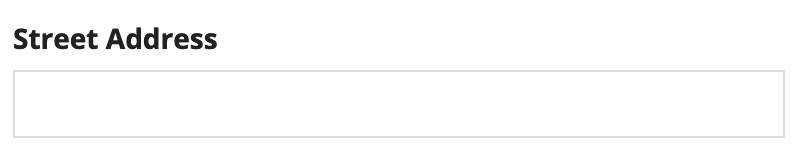
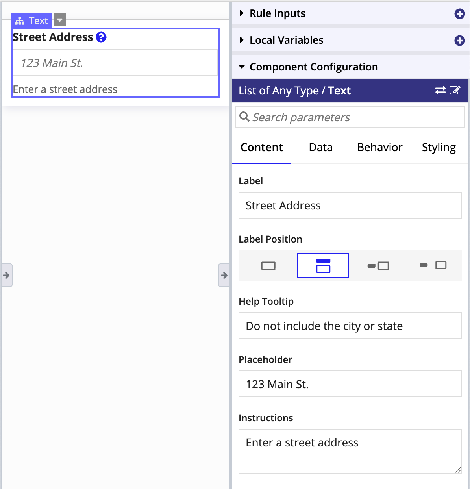

# How to Design with SAIL [SAIL Design System: Getting Started]

*Section: overview | source: https://docs.appian.com/suite/help/26.7/sail/sail-design.html | images referenced live in corpus/images/*

# How to Design with SAIL

## Overview

All components are backed by expressions. This means you have two ways of working with components to design interfaces.

- **Design mode** - Simply drag and drop components onto a canvas, then configure them in the configuration pane.

- **Expression mode** - Switch over to expression mode to add more advanced functionality, such as data integrations and conditional logic.

This page provides a short summary of what this looks like in practice.

**Tip:  ****Using Figma to mock up your interface designs?** While mocking up SAIL UIs directly in Appian will always be the most efficient way to iterate on your designs, teams already using Figma can also leverage the Appian SAIL Component Library.

## Working with components and expressions

Here is a simple text field.



The expression to create this field looks like this:

```sail
a!textField(
    label: "Street Address"
  )
```

If you want to make changes to the text field, simply update the available parameters in the **Component Configuration** pane.



The expression automatically updates with the new parameters.

```sail
a!textField(
  label: "Street Address",
  instructions: "Enter a street address",
  helpTooltip: "Do not include the city or state",
  placeholder: "123 Main St."
)
```

## Working with data

It isn't very useful to just hard code data into a user input field. That's why SAIL allows you to easily associate the value of a field with application data. For example, you can use local variables to map application data to the text field.

```sail
a!textField(
  label: "Street Address",
  instructions: "Enter a street address",
  helpTooltip: "Do not include the city or state",
  placeholder: "123 Main St.",
!  value: local!streetAddress,
!  saveInto: local!streetAddress
)
```

## Working with logic

You can also add dynamic logic to your interfaces. For example, you can use the *showWhen* parameter to only show the address field when a certain condition is true.

```sail
a!textField(
  label: "Street Address",
  instructions: "Enter a street address",
  helpTooltip: "Do not include the city or state",
  placeholder: "123 Main St.",
  value: local!streetAddress,
  saveInto: local!streetAddress,
!  showWhen: local!showAddressField=true
)
```
