# Secondary Navigation [SAIL Design System: Patterns]

*Section: patterns | source: https://docs.appian.com/suite/help/26.7/sail/secondary-navigation.html | images referenced live in corpus/images/*

# Secondary Navigation

Use secondary navigation controls to provide access to sub-tabs within a site or portal page.

## About secondary navigation

The site and portal navigation bar allows you to organize your pages using two different layouts: a header bar for horizontal navigation and a sidebar for vertical navigation. But what if you need to split up a page into further categories of content? That's where secondary navigation comes in.

Secondary navigation helps users navigate between related sections within a page. For basic navigation, we highly encourage you to use the tab layout, which allows you to quickly add secondary navigation anywhere on a page. This can be used for a page's main navigation, or for smaller sections on a page.

If you need additional functionality, like using URL parameters to link directly to a tab, you may want to consider manually creating secondary navigation. This page provides custom patterns to use when you need additional functionality not provided by the built-in options.

**Tip:  **The site and portal navigation bar has a lot of great functionality, like being able to easily create page groups. However, you could use the patterns on this page as a starting point to manually create a navigation bar if you need more customization.

## When to use vertical vs. horizontal navigation

Horizontal navigation is great for simple navigation. Vertical navigation scales better to support a large number of pages and more complex navigation, but leaves more unused space.

Use vertical navigation when:

- You need to show more than 6 tabs.

- You have multiple levels of sub-navigation.

- Navigation items have longer labels that don't fit well horizontally.

Use horizontal navigation when:

- You need to show fewer than 7 tabs.

- It's important to reserve as much horizontal space as possible for page contents.

## Vertical navigation patterns

Use these patterns when you need functionality beyond what the sidebar layout provides in sites and portals, such as combining a header bar with a sidebar for multi-level navigation.

**Tip:  **You can use the heading field throughout these patterns instead of rich text items or section layouts to leverage heading tags and additional formatting options.

### Basic vertical navigation

Use this pattern to add an additional level of vertical navigation to a page.

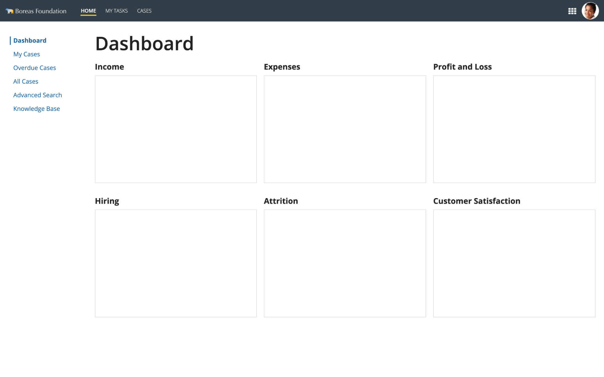

```sail
a!headerContentLayout(
  header: {
    a!cardLayout(
      height: "AUTO",
      showWhen: true,
      padding: "LESS",
      showBorder: false
    )
  },
  contents: {
    a!columnsLayout(
      columns: {
        a!columnLayout(
          contents: {
            a!cardLayout(
              contents: {
                a!sideBySideLayout(
                  items: {
                    a!sideBySideItem(
                      item: a!richTextDisplayField(
                        labelPosition: "COLLAPSED",
                        value: {
                          a!richTextItem(
                            text: {
                              "❘"
                            },
                            color: "ACCENT",
                            size: "LARGE"
                          )
                        }
                      ),
                      width: "MINIMIZE"
                    ),
                    a!sideBySideItem(
                      item: a!richTextDisplayField(
                        labelPosition: "COLLAPSED",
                        value: {
                          a!richTextItem(
                            text: {
                              "Dashboard"
                            },
                            color: "ACCENT",
                            size: "MEDIUM",
                            style: {
                              "STRONG"
                            }
                          )
                        }
                      )
                    )
                  },
                  alignVertical: "MIDDLE",
                  spacing: "DENSE"
                )
              },
              link: a!dynamicLink(
                saveInto: {}
              ),
              height: "AUTO",
              style: "#ffffff",
              padding: "NONE",
              marginBelow: "NONE",
              showBorder: false
            ),
            a!cardLayout(
              contents: {
                a!sideBySideLayout(
                  items: {
                    a!sideBySideItem(
                      item: a!richTextDisplayField(
                        label: "Rich Text",
                        labelPosition: "COLLAPSED",
                        value: {
                          a!richTextItem(
                            text: {
                              "❘"
                            },
                            color: "#ffffff",
                            size: "LARGE"
                          )
                        }
                      ),
                      width: "MINIMIZE"
                    ),
                    a!sideBySideItem(
                      item: a!richTextDisplayField(
                        label: "Rich Text",
                        labelPosition: "COLLAPSED",
                        value: {
                          a!richTextItem(
                            text: {
                              "My Cases"
                            },
                            color: "ACCENT",
                            size: "MEDIUM"
                          )
                        }
                      )
                    )
                  },
                  alignVertical: "MIDDLE",
                  spacing: "DENSE"
                )
              },
              link: a!dynamicLink(
                label: "Dynamic Link",
                saveInto: {}
              ),
              height: "AUTO",
              style: "#ffffff",
              padding: "NONE",
              marginBelow: "NONE",
              showBorder: false
            ),
            a!cardLayout(
              contents: {
                a!sideBySideLayout(
                  items: {
                    a!sideBySideItem(
                      item: a!richTextDisplayField(
                        label: "Rich Text",
                        labelPosition: "COLLAPSED",
                        value: {
                          a!richTextItem(
                            text: {
                              "❘"
                            },
                            color: "#ffffff",
                            size: "LARGE"
                          )
                        }
                      ),
                      width: "MINIMIZE"
                    ),
                    a!sideBySideItem(
                      item: a!richTextDisplayField(
                        label: "Rich Text",
                        labelPosition: "COLLAPSED",
                        value: {
                          a!richTextItem(
                            text: {
                              "Overdue Cases"
                            },
                            color: "ACCENT",
                            size: "MEDIUM"
                          )
                        }
                      )
                    )
                  },
                  alignVertical: "MIDDLE",
                  spacing: "DENSE"
                )
              },
              link: a!dynamicLink(
                label: "Dynamic Link",
                saveInto: {}
              ),
              height: "AUTO",
              style: "#ffffff",
              padding: "NONE",
              marginBelow: "NONE",
              showBorder: false
            ),
            a!cardLayout(
              contents: {
                a!sideBySideLayout(
                  items: {
                    a!sideBySideItem(
                      item: a!richTextDisplayField(
                        label: "Rich Text",
                        labelPosition: "COLLAPSED",
                        value: {
                          a!richTextItem(
                            text: {
                              "❘"
                            },
                            color: "#ffffff",
                            size: "LARGE"
                          )
                        }
                      ),
                      width: "MINIMIZE"
                    ),
                    a!sideBySideItem(
                      item: a!richTextDisplayField(
                        label: "Rich Text",
                        labelPosition: "COLLAPSED",
                        value: {
                          a!richTextItem(
                            text: {
                              "All Cases"
                            },
                            color: "ACCENT",
                            size: "MEDIUM"
                          )
                        }
                      )
                    )
                  },
                  alignVertical: "MIDDLE",
                  spacing: "DENSE"
                )
              },
              link: a!dynamicLink(
                label: "Dynamic Link",
                saveInto: {}
              ),
              height: "AUTO",
              style: "#ffffff",
              padding: "NONE",
              marginBelow: "NONE",
              showBorder: false
            ),
            a!cardLayout(
              contents: {
                a!sideBySideLayout(
                  items: {
                    a!sideBySideItem(
                      item: a!richTextDisplayField(
                        label: "Rich Text",
                        labelPosition: "COLLAPSED",
                        value: {
                          a!richTextItem(
                            text: {
                              "❘"
                            },
                            color: "#ffffff",
                            size: "LARGE"
                          )
                        }
                      ),
                      width: "MINIMIZE"
                    ),
                    a!sideBySideItem(
                      item: a!richTextDisplayField(
                        label: "Rich Text",
                        labelPosition: "COLLAPSED",
                        value: {
                          a!richTextItem(
                            text: {
                              "Advanced Search"
                            },
                            color: "ACCENT",
                            size: "MEDIUM"
                          )
                        }
                      )
                    )
                  },
                  alignVertical: "MIDDLE",
                  spacing: "DENSE"
                )
              },
              link: a!dynamicLink(
                label: "Dynamic Link",
                saveInto: {}
              ),
              height: "AUTO",
              style: "#ffffff",
              padding: "NONE",
              marginBelow: "NONE",
              showBorder: false
            ),
            a!cardLayout(
              contents: {
                a!sideBySideLayout(
                  items: {
                    a!sideBySideItem(
                      item: a!richTextDisplayField(
                        label: "Rich Text",
                        labelPosition: "COLLAPSED",
                        value: {
                          a!richTextItem(
                            text: {
                              "❘"
                            },
                            color: "#ffffff",
                            size: "LARGE"
                          )
                        }
                      ),
                      width: "MINIMIZE"
                    ),
                    a!sideBySideItem(
                      item: a!richTextDisplayField(
                        label: "Rich Text",
                        labelPosition: "COLLAPSED",
                        value: {
                          a!richTextItem(
                            text: {
                              "Knowledge Base"
                            },
                            color: "ACCENT",
                            size: "MEDIUM"
                          )
                        }
                      )
                    )
                  },
                  alignVertical: "MIDDLE",
                  spacing: "DENSE"
                )
              },
              link: a!dynamicLink(
                label: "Dynamic Link",
                saveInto: {}
              ),
              height: "AUTO",
              padding: "NONE",
              marginBelow: "NONE",
              showBorder: false
            )
          },
          width: "NARROW"
        ),
        a!columnLayout(
          contents: {
            a!sectionLayout(
              label: "Dashboard",
              labelSize: "LARGE_PLUS",
              labelHeadingTag: "H1",
              labelColor: "STANDARD",
              contents: {}
            ),
            a!columnsLayout(
              columns: {
                a!columnLayout(
                  contents: {
                    a!sectionLayout(
                      label: "Income",
                      labelSize: "MEDIUM",
                      labelColor: "STANDARD",
                      contents: {
                        a!cardLayout(
                          contents: {},
                          height: "MEDIUM_PLUS",
                          style: "NONE",
                          padding: "STANDARD",
                          marginBelow: "STANDARD",
                          showBorder: true,
                          showShadow: false
                        )
                      }
                    )
                  },
                  width: "AUTO"
                ),
                a!columnLayout(
                  contents: {
                    a!sectionLayout(
                      label: "Expenses",
                      labelSize: "MEDIUM",
                      labelColor: "STANDARD",
                      contents: {
                        a!cardLayout(
                          contents: {},
                          height: "MEDIUM_PLUS",
                          style: "NONE",
                          padding: "STANDARD",
                          marginBelow: "STANDARD",
                          showBorder: true,
                          showShadow: false
                        )
                      }
                    )
                  },
                  width: "AUTO"
                ),
                a!columnLayout(
                  contents: {
                    a!sectionLayout(
                      label: "Profit and Loss",
                      labelSize: "MEDIUM",
                      labelColor: "STANDARD",
                      contents: {
                        a!cardLayout(
                          contents: {},
                          height: "MEDIUM_PLUS",
                          style: "NONE",
                          padding: "STANDARD",
                          marginBelow: "STANDARD",
                          showBorder: true,
                          showShadow: false
                        )
                      }
                    )
                  },
                  width: "AUTO"
                )
              },
              stackWhen: {
                "PHONE",
                "TABLET_PORTRAIT",
                "TABLET_LANDSCAPE",
                "DESKTOP_NARROW"
              }
            ),
            a!columnsLayout(
              columns: {
                a!columnLayout(
                  contents: {
                    a!sectionLayout(
                      label: "Hiring",
                      labelSize: "MEDIUM",
                      labelColor: "STANDARD",
                      contents: {
                        a!cardLayout(
                          contents: {},
                          height: "MEDIUM_PLUS",
                          style: "NONE",
                          padding: "STANDARD",
                          marginBelow: "STANDARD",
                          showBorder: true,
                          showShadow: false
                        )
                      }
                    )
                  },
                  width: "AUTO"
                ),
                a!columnLayout(
                  contents: {
                    a!sectionLayout(
                      label: "Attrition",
                      labelSize: "MEDIUM",
                      labelColor: "STANDARD",
                      contents: {
                        a!cardLayout(
                          contents: {},
                          height: "MEDIUM_PLUS",
                          style: "NONE",
                          padding: "STANDARD",
                          marginBelow: "STANDARD",
                          showBorder: true,
                          showShadow: false
                        )
                      }
                    )
                  },
                  width: "AUTO"
                ),
                a!columnLayout(
                  contents: {
                    a!sectionLayout(
                      label: "Customer Satisfaction",
                      labelSize: "MEDIUM",
                      labelColor: "STANDARD",
                      contents: {
                        a!cardLayout(
                          contents: {},
                          height: "MEDIUM_PLUS",
                          style: "NONE",
                          padding: "STANDARD",
                          marginBelow: "STANDARD",
                          showBorder: true,
                          showShadow: false
                        )
                      }
                    )
                  },
                  width: "AUTO"
                )
              },
              stackWhen: {
                "PHONE",
                "TABLET_PORTRAIT",
                "TABLET_LANDSCAPE",
                "DESKTOP_NARROW"
              }
            )
          }
        )
      },
      stackWhen: {
        "PHONE",
        "TABLET_PORTRAIT",
        "TABLET_LANDSCAPE",
        "DESKTOP_NARROW"
      }
    )
  },
  showWhen: true,
  backgroundColor: "WHITE"
)
```

### Vertical navigation with sections

Use this style to group tabs into sections.

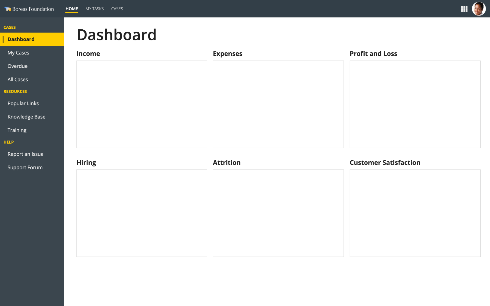

**Functional pattern**

Use this pattern to quickly get up and running with a functional vertical navigation with sections. Just go to expression mode to switch out the data and contents that are unique to your app, and you're good to go.

```sail
a!localVariables(

  /* When user clicks on a tab, its index is persisted to this variable */
  local!selectedTab: 1,

  /* Determines content background color. Set to "WHITE", "TRANSPARENT", "CHARCOAL_SCHEME", "NAVY_SCHEME", "PLUM_SCHEME", or any valid hex code */
  local!headerContentBackgroundColor:"WHITE",

  /* Determines navigation background color */
  local!navBackgroundColor: "#020A51",

  /* Determines top-level navigation text color */
  local!topLevelTextColor: "#FCB858",

  /* Determines selected tab background color */
  local!selectedTabColor: "#2322F0",

  /* Array of text that defines the top-level tabs. Replace with your desired values */
  local!topLevelTabs: { "Cases", "Resources", "Help" },

  /* Array of sub-tab data. Replace with your desired values.
       topLevel: Set to the index of the top-level tab the subtab falls under. This value should not be more than the number of items in the "topLevelTab" array.
       name: Desired name of the tab
  */
  local!subTabs: {
    a!map(topLevel: 1, name: "Dashboard"),
    a!map(topLevel: 1, name: "My Cases"),
    a!map(topLevel: 1, name: "Overdue"),
    a!map(topLevel: 1, name: "All Cases"),
    a!map(topLevel: 2, name: "Popular Links"),
    a!map(topLevel: 2, name: "Knowledge Base"),
    a!map(topLevel: 2, name: "Training"),
    a!map(topLevel: 3, name: "Report an Issue"),
    a!map(topLevel: 3, name: "Support Forum")
  },

  a!headerContentLayout(
    header: {},
    contents: {
      a!columnsLayout(
        columns: {
          a!columnLayout(
            contents: {
              a!cardLayout(
                height: "AUTO",
                style: local!navBackgroundColor,
                marginBelow: "NONE",
                showBorder: false
              ),
              a!forEach(
                items: local!topLevelTabs,
                expression: {
                  a!localVariables(
                    local!topLevel: fv!index,
                    {
                      a!cardLayout(
                        contents: {
                          a!richTextDisplayField(
                            labelPosition: "COLLAPSED",
                            value: {
                              a!richTextItem(
                                text: { upper(fv!item) },
                                color: local!topLevelTextColor,
                                style: { "STRONG" }
                              )
                            }
                          )
                        },
                        height: "AUTO",
                        style: local!navBackgroundColor,
                        padding: "LESS",
                        marginBelow: "NONE",
                        showBorder: false
                      ),
                      a!forEach(
                        items: local!subTabs,
                        expression: {
                          a!cardLayout(
                            contents: {
                              a!sideBySideLayout(
                                items: {
                                  a!sideBySideItem(
                                    item: a!richTextDisplayField(
                                      labelPosition: "COLLAPSED",
                                      value: {
                                        a!richTextItem(
                                          text: { "❘" },
                                          color: if(
                                            fv!index = local!selectedTab,
                                            "STANDARD",
                                            local!navBackgroundColor
                                          ),
                                          size: "LARGE"
                                        )
                                      }
                                    ),
                                    width: "MINIMIZE"
                                  ),
                                  a!sideBySideItem(
                                    item: a!richTextDisplayField(
                                      labelPosition: "COLLAPSED",
                                      value: {
                                        a!richTextItem(
                                          text: { fv!item.name },
                                          color: "STANDARD",
                                          size: "MEDIUM",
                                          style: if(
                                            fv!index = local!selectedTab,
                                            { "STRONG" },
                                            { "PLAIN" }
                                          )
                                        )
                                      },
                                      preventWrapping: true
                                    )
                                  )
                                },
                                alignVertical: "MIDDLE"
                              )
                            },
                            link: a!dynamicLink(
                              label: "Dynamic Link",
                              value: fv!index,
                              saveInto: { local!selectedTab }
                            ),
                            tooltip: "",
                            height: "AUTO",
                            showWhen: fv!item.topLevel = local!topLevel,
                            style: if(
                              fv!index = local!selectedTab,
                              local!selectedTabColor,
                              local!navBackgroundColor
                            ),
                            padding: "EVEN_LESS",
                            marginBelow: "NONE",
                            showBorder: false
                          )
                        }
                      )
                    }
                  )
                }
              ),
              a!cardLayout(
                height: "EXTRA_TALL",
                style: local!navBackgroundColor,
                marginBelow: "NONE",
                showBorder: false
              )
            },
            width: "NARROW"
          ),
          a!columnLayout(
            contents: {
              a!cardLayout(
                contents: {
                  /* Conditionally display selected navigation section.       *
               * Sections are created individually here because they will *
               * have varying contents, so if you change the list in      *
               * local!subtabs, you will need to make sure *
               * the list of sections here is the correct length.         */
                  a!sectionLayout(
                    label: local!subTabs[local!selectedTab].name,
                    labelSize: "LARGE_PLUS",
                    labelHeadingTag: "H1",
                    labelColor: "STANDARD",
                    contents: {

                      choose(
                        local!selectedTab,
                        {},
                        {},
                        {},
                        {},
                        {},
                        {},
                        {},
                        {},
                        {}

                      )
                    }
                  )
                },
                height: "AUTO",
                style: "NONE",
                padding: "MORE",
                marginBelow: "STANDARD",
                showBorder: false
              )
            }
          )
        },
        spacing: "DENSE",
        stackWhen: {
          "PHONE",
          "TABLET_PORTRAIT",
          "TABLET_LANDSCAPE",
          "DESKTOP_NARROW"
        }
      )
    },
    showWhen: true,
    backgroundColor: local!headerContentBackgroundColor,
    contentsPadding: "NONE"
  )
)
```

**Base pattern**

Use this pattern as a starting point for designing your own vertical navigation with sections. You can use design mode to drag and drop components as you see fit. Once you're ready to plug in your own data, consult the Functional pattern.

```sail
a!headerContentLayout(
  header: {
  },
  contents: {
    a!columnsLayout(
      columns: {
        a!columnLayout(
          contents: {
            a!cardLayout(
              height: "AUTO",
              style: "#3B464E",
              marginBelow: "NONE",
              showBorder: false
            ),
            a!cardLayout(
              contents: {
                a!richTextDisplayField(
                  labelPosition: "COLLAPSED",
                  value: {
                    a!richTextItem(
                      text: {
                        "CASES"
                      },
                      color: "#FFCD00",
                      style: {
                        "STRONG"
                      }
                    )
                  }
                )
              },
              height: "AUTO",
              style: "#3B464E",
              padding: "LESS",
              marginBelow: "NONE",
              showBorder: false
            ),
            a!cardLayout(
              contents: {
                a!sideBySideLayout(
                  items: {
                    a!sideBySideItem(
                      item: a!richTextDisplayField(
                        labelPosition: "COLLAPSED",
                        value: {
                          a!richTextItem(
                            text: {
                              "❘"
                            },
                            color: "STANDARD",
                            size: "LARGE"
                          )
                        }
                      ),
                      width: "MINIMIZE"
                    ),
                    a!sideBySideItem(
                      item: a!richTextDisplayField(
                        labelPosition: "COLLAPSED",
                        value: {
                          a!richTextItem(
                            text: {
                              "Dashboard"
                            },
                            color: "STANDARD",
                            size: "MEDIUM",
                            style: {
                              "STRONG"
                            }
                          )
                        },
                        preventWrapping: true
                      )
                    )
                  },
                  alignVertical: "MIDDLE")
              },
              link: a!dynamicLink(
                label: "Dynamic Link",
                saveInto: {}
              ),
              tooltip: "",
              height: "AUTO",
              style: "#FFCD00",
              padding: "EVEN_LESS",
              marginBelow: "NONE",
              showBorder: false
            ),
            a!cardLayout(
              contents: {
                a!sideBySideLayout(
                  items: {
                    a!sideBySideItem(
                      item: a!richTextDisplayField(
                        labelPosition: "COLLAPSED",
                        value: {
                          a!richTextItem(
                            text: {
                              "❘"
                            },
                            color: "#3b464e",
                            size: "LARGE"
                          )
                        }
                      ),
                      width: "MINIMIZE"
                    ),
                    a!sideBySideItem(
                      item: a!richTextDisplayField(
                        labelPosition: "COLLAPSED",
                        value: {
                          a!richTextItem(
                            text: {
                              "My Cases"
                            },
                            color: "STANDARD",
                            size: "MEDIUM"
                          )
                        },
                        preventWrapping: true
                      )
                    )
                  },
                  alignVertical: "MIDDLE")
              },
              link: a!dynamicLink(
                label: "Dynamic Link",
                saveInto: {}
              ),
              tooltip: "",
              height: "AUTO",
              style: "#3b464e",
              padding: "EVEN_LESS",
              marginBelow: "NONE",
              showBorder: false
            ),
            a!cardLayout(
              contents: {
                a!sideBySideLayout(
                  items: {
                    a!sideBySideItem(
                      item: a!richTextDisplayField(
                        labelPosition: "COLLAPSED",
                        value: {
                          a!richTextItem(
                            text: {
                              "❘"
                            },
                            color: "#3b464e",
                            size: "LARGE"
                          )
                        }
                      ),
                      width: "MINIMIZE"
                    ),
                    a!sideBySideItem(
                      item: a!richTextDisplayField(
                        labelPosition: "COLLAPSED",
                        value: {
                          a!richTextItem(
                            text: {
                              "Overdue"
                            },
                            color: "STANDARD",
                            size: "MEDIUM"
                          )
                        },
                        preventWrapping: true
                      )
                    )
                  },
                  alignVertical: "MIDDLE")
              },
              link: a!dynamicLink(
                label: "Dynamic Link",
                saveInto: {}
              ),
              tooltip: "",
              height: "AUTO",
              style: "#3b464e",
              padding: "EVEN_LESS",
              marginBelow: "NONE",
              showBorder: false
            ),
            a!cardLayout(
              contents: {
                a!sideBySideLayout(
                  items: {
                    a!sideBySideItem(
                      item: a!richTextDisplayField(
                        labelPosition: "COLLAPSED",
                        value: {
                          a!richTextItem(
                            text: {
                              "❘"
                            },
                            color: "#3b464e",
                            size: "LARGE"
                          )
                        }
                      ),
                      width: "MINIMIZE"
                    ),
                    a!sideBySideItem(
                      item: a!richTextDisplayField(
                        labelPosition: "COLLAPSED",
                        value: {
                          a!richTextItem(
                            text: {
                              "All Cases"
                            },
                            color: "STANDARD",
                            size: "MEDIUM"
                          )
                        },
                        preventWrapping: true
                      )
                    )
                  },
                  alignVertical: "MIDDLE")
              },
              link: a!dynamicLink(
                label: "Dynamic Link",
                saveInto: {}
              ),
              tooltip: "",
              height: "AUTO",
              style: "#3b464e",
              padding: "EVEN_LESS",
              marginBelow: "NONE",
              showBorder: false
            ),
            a!cardLayout(
              contents: {
                a!richTextDisplayField(
                  labelPosition: "COLLAPSED",
                  value: {
                    a!richTextItem(
                      text: {
                        "RESOURCES"
                      },
                      color: "#FFCD00",
                      style: {
                        "STRONG"
                      }
                    )
                  }
                )
              },
              height: "AUTO",
              style: "#3B464E",
              padding: "LESS",
              marginBelow: "NONE",
              showBorder: false
            ),
            a!cardLayout(
              contents: {
                a!sideBySideLayout(
                  items: {
                    a!sideBySideItem(
                      item: a!richTextDisplayField(
                        labelPosition: "COLLAPSED",
                        value: {
                          a!richTextItem(
                            text: {
                              "❘"
                            },
                            color: "#3b464e",
                            size: "LARGE"
                          )
                        }
                      ),
                      width: "MINIMIZE"
                    ),
                    a!sideBySideItem(
                      item: a!richTextDisplayField(
                        labelPosition: "COLLAPSED",
                        value: {
                          a!richTextItem(
                            text: {
                              "Popular Links"
                            },
                            color: "STANDARD",
                            size: "MEDIUM"
                          )
                        },
                        preventWrapping: true
                      )
                    )
                  },
                  alignVertical: "MIDDLE")
              },
              link: a!dynamicLink(
                label: "Dynamic Link",
                saveInto: {}
              ),
              tooltip: "",
              height: "AUTO",
              style: "#3b464e",
              padding: "EVEN_LESS",
              marginBelow: "NONE",
              showBorder: false
            ),
            a!cardLayout(
              contents: {
                a!sideBySideLayout(
                  items: {
                    a!sideBySideItem(
                      item: a!richTextDisplayField(
                        labelPosition: "COLLAPSED",
                        value: {
                          a!richTextItem(
                            text: {
                              "❘"
                            },
                            color: "#3b464e",
                            size: "LARGE"
                          )
                        }
                      ),
                      width: "MINIMIZE"
                    ),
                    a!sideBySideItem(
                      item: a!richTextDisplayField(
                        labelPosition: "COLLAPSED",
                        value: {
                          a!richTextItem(
                            text: {
                              "Knowledge Base"
                            },
                            color: "STANDARD",
                            size: "MEDIUM"
                          )
                        },
                        preventWrapping: true
                      )
                    )
                  },
                  alignVertical: "MIDDLE")
              },
              link: a!dynamicLink(
                label: "Dynamic Link",
                saveInto: {}
              ),
              tooltip: "",
              height: "AUTO",
              style: "#3b464e",
              padding: "EVEN_LESS",
              marginBelow: "NONE",
              showBorder: false
            ),
            a!cardLayout(
              contents: {
                a!sideBySideLayout(
                  items: {
                    a!sideBySideItem(
                      item: a!richTextDisplayField(
                        labelPosition: "COLLAPSED",
                        value: {
                          a!richTextItem(
                            text: {
                              "❘"
                            },
                            color: "#3b464e",
                            size: "LARGE"
                          )
                        }
                      ),
                      width: "MINIMIZE"
                    ),
                    a!sideBySideItem(
                      item: a!richTextDisplayField(
                        labelPosition: "COLLAPSED",
                        value: {
                          a!richTextItem(
                            text: {
                              "Training"
                            },
                            color: "STANDARD",
                            size: "MEDIUM"
                          )
                        },
                        preventWrapping: true
                      )
                    )
                  },
                  alignVertical: "MIDDLE")
              },
              link: a!dynamicLink(
                label: "Dynamic Link",
                saveInto: {}
              ),
              tooltip: "",
              height: "AUTO",
              style: "#3b464e",
              padding: "EVEN_LESS",
              marginBelow: "NONE",
              showBorder: false
            ),
            a!cardLayout(
              contents: {
                a!richTextDisplayField(
                  labelPosition: "COLLAPSED",
                  value: {
                    a!richTextItem(
                      text: {
                        "HELP"
                      },
                      color: "#FFCD00",
                      style: {
                        "STRONG"
                      }
                    )
                  }
                )
              },
              height: "AUTO",
              style: "#3B464E",
              padding: "LESS",
              marginBelow: "NONE",
              showBorder: false
            ),
            a!cardLayout(
              contents: {
                a!sideBySideLayout(
                  items: {
                    a!sideBySideItem(
                      item: a!richTextDisplayField(
                        labelPosition: "COLLAPSED",
                        value: {
                          a!richTextItem(
                            text: {
                              "❘"
                            },
                            color: "#3b464e",
                            size: "LARGE"
                          )
                        }
                      ),
                      width: "MINIMIZE"
                    ),
                    a!sideBySideItem(
                      item: a!richTextDisplayField(
                        labelPosition: "COLLAPSED",
                        value: {
                          a!richTextItem(
                            text: {
                              "Report an Issue"
                            },
                            color: "STANDARD",
                            size: "MEDIUM"
                          )
                        },
                        preventWrapping: true
                      )
                    )
                  },
                  alignVertical: "MIDDLE")
              },
              link: a!dynamicLink(
                label: "Dynamic Link",
                saveInto: {}
              ),
              tooltip: "",
              height: "AUTO",
              style: "#3b464e",
              padding: "EVEN_LESS",
              marginBelow: "NONE",
              showBorder: false
            ),
            a!cardLayout(
              contents: {
                a!sideBySideLayout(
                  items: {
                    a!sideBySideItem(
                      item: a!richTextDisplayField(
                        labelPosition: "COLLAPSED",
                        value: {
                          a!richTextItem(
                            text: {
                              "❘"
                            },
                            color: "#3b464e",
                            size: "LARGE"
                          )
                        }
                      ),
                      width: "MINIMIZE"
                    ),
                    a!sideBySideItem(
                      item: a!richTextDisplayField(
                        labelPosition: "COLLAPSED",
                        value: {
                          a!richTextItem(
                            text: {
                              "Support Forum"
                            },
                            color: "STANDARD",
                            size: "MEDIUM"
                          )
                        },
                        preventWrapping: true
                      )
                    )
                  },
                  alignVertical: "MIDDLE")
              },
              link: a!dynamicLink(
                label: "Dynamic Link",
                saveInto: {}
              ),
              tooltip: "",
              height: "AUTO",
              style: "#3b464e",
              padding: "EVEN_LESS",
              marginBelow: "NONE",
              showBorder: false
            ),
            a!cardLayout(
              height: "EXTRA_TALL",
              style: "#3B464E",
              marginBelow: "NONE",
              showBorder: false
            ),
            a!cardLayout(
              height: "EXTRA_TALL",
              style: "#3B464E",
              marginBelow: "NONE",
              showBorder: false
            )
          },
          width: "NARROW"
        ),
        a!columnLayout(
          contents: {
            a!cardLayout(
              contents: {
                a!sectionLayout(
                  label: "Dashboard",
                  labelSize: "LARGE_PLUS",
                  labelHeadingTag: "H1",
                  labelColor: "STANDARD",
                  contents: {}
                ),
                a!columnsLayout(
                  columns: {
                    a!columnLayout(
                      contents: {
                        a!sectionLayout(
                          label: "Income",
                          labelSize: "MEDIUM",
                          labelColor: "STANDARD",
                          contents: {
                            a!cardLayout(
                              contents: {},
                              height: "MEDIUM_PLUS",
                              style: "NONE",
                              padding: "STANDARD",
                              marginBelow: "STANDARD",
                              showBorder: true,
                              showShadow: false
                            )
                          }
                        )
                      },
                      width: "AUTO"
                    ),
                    a!columnLayout(
                      contents: {
                        a!sectionLayout(
                          label: "Expenses",
                          labelSize: "MEDIUM",
                          labelColor: "STANDARD",
                          contents: {
                            a!cardLayout(
                              contents: {},
                              height: "MEDIUM_PLUS",
                              style: "NONE",
                              padding: "STANDARD",
                              marginBelow: "STANDARD",
                              showBorder: true,
                              showShadow: false
                            )
                          }
                        )
                      },
                      width: "AUTO"
                    ),
                    a!columnLayout(
                      contents: {
                        a!sectionLayout(
                          label: "Profit and Loss",
                          labelSize: "MEDIUM",
                          labelColor: "STANDARD",
                          contents: {
                            a!cardLayout(
                              contents: {},
                              height: "MEDIUM_PLUS",
                              style: "NONE",
                              padding: "STANDARD",
                              marginBelow: "STANDARD",
                              showBorder: true,
                              showShadow: false
                            )
                          }
                        )
                      },
                      width: "AUTO"
                    )
                  },
                  stackWhen: {
                    "PHONE",
                    "TABLET_PORTRAIT",
                    "TABLET_LANDSCAPE",
                    "DESKTOP_NARROW"
                  }
                ),
                a!columnsLayout(
                  columns: {
                    a!columnLayout(
                      contents: {
                        a!sectionLayout(
                          label: "Hiring",
                          labelSize: "MEDIUM",
                          labelColor: "STANDARD",
                          contents: {
                            a!cardLayout(
                              contents: {},
                              height: "MEDIUM_PLUS",
                              style: "NONE",
                              padding: "STANDARD",
                              marginBelow: "STANDARD",
                              showBorder: true,
                              showShadow: false
                            )
                          }
                        )
                      },
                      width: "AUTO"
                    ),
                    a!columnLayout(
                      contents: {
                        a!sectionLayout(
                          label: "Attrition",
                          labelSize: "MEDIUM",
                          labelColor: "STANDARD",
                          contents: {
                            a!cardLayout(
                              contents: {},
                              height: "MEDIUM_PLUS",
                              style: "NONE",
                              padding: "STANDARD",
                              marginBelow: "STANDARD",
                              showBorder: true,
                              showShadow: false
                            )
                          }
                        )
                      },
                      width: "AUTO"
                    ),
                    a!columnLayout(
                      contents: {
                        a!sectionLayout(
                          label: "Customer Satisfaction",
                          labelSize: "MEDIUM",
                          labelColor: "STANDARD",
                          contents: {
                            a!cardLayout(
                              contents: {},
                              height: "MEDIUM_PLUS",
                              style: "NONE",
                              padding: "STANDARD",
                              marginBelow: "STANDARD",
                              showBorder: true,
                              showShadow: false
                            )
                          }
                        )
                      },
                      width: "AUTO"
                    )
                  },
                  stackWhen: {
                    "PHONE",
                    "TABLET_PORTRAIT",
                    "TABLET_LANDSCAPE",
                    "DESKTOP_NARROW"
                  }
                )
              },
              height: "AUTO",
              style: "NONE",
              padding: "MORE",
              marginBelow: "STANDARD",
              showBorder: false
            )
          }
        )
      },
      spacing: "DENSE",
      stackWhen: {
        "PHONE",
        "TABLET_PORTRAIT",
        "TABLET_LANDSCAPE",
        "DESKTOP_NARROW"
      }
    )
  },
  showWhen: true,
  backgroundColor: "WHITE",
  contentsPadding: "NONE"
)
```

### Vertical navigation with custom header

#### Vertical navigation under custom header

Use this style of vertical navigation when the secondary navigation pages all fall within the context of a custom header.

In this example, the secondary navigation pages are all sub-views of "Cases".

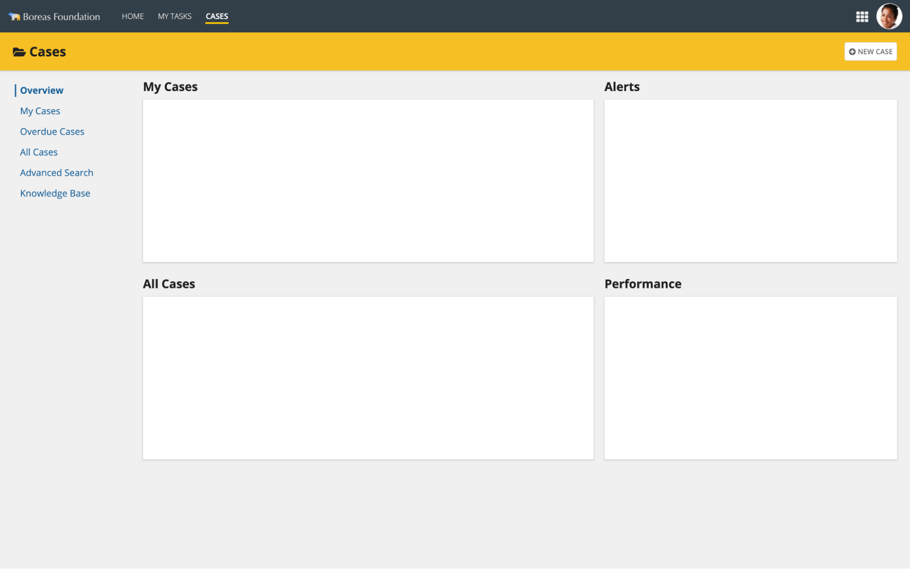

#### Vertical navigation next to custom header

Use the contrasting background color vertical navigation style when secondary pages contain one or more custom headers.

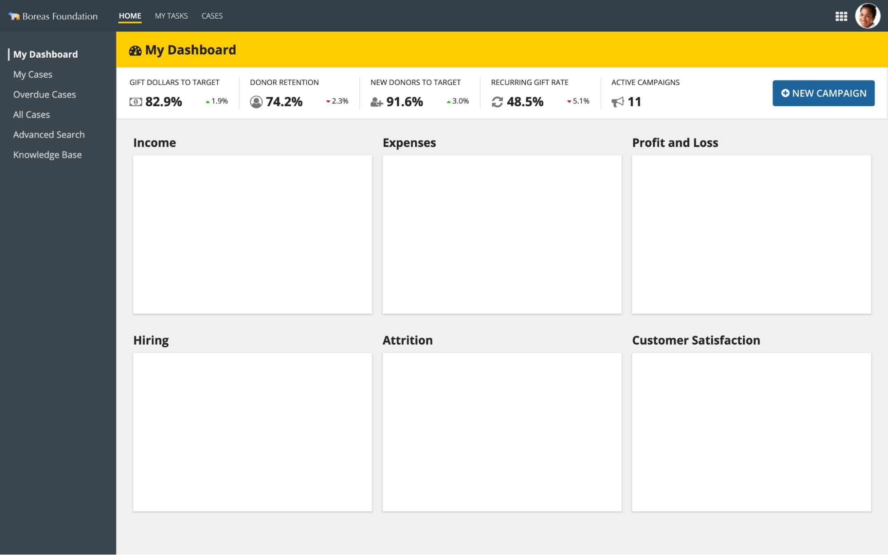

### Vertical navigation with icons

#### Icon-only vertical navigation

Use this style to minimize the footprint of the vertical navigation, leaving more horizontal space for content.

Although users can hover over an icon to see its label in a tooltip, this impedes initial usability. Avoid using this pattern for interfaces targeted at occasional users.

See the article on vertical navigation from the Nielsen Norman Group which advises minimal use of icon-only navigation.

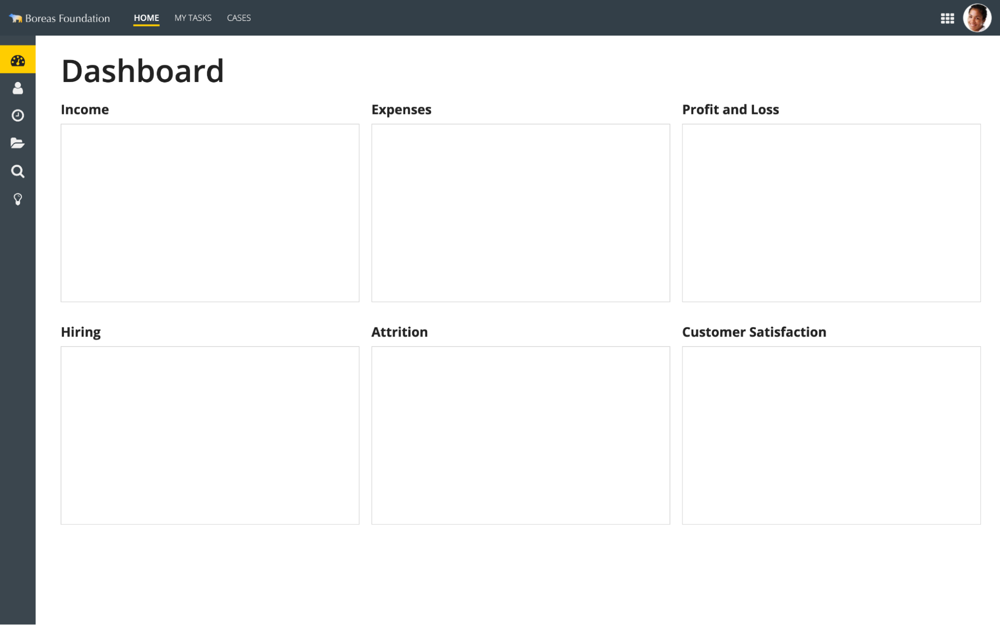

```sail
a!headerContentLayout(
  header: {
  },
  contents: {
    a!columnsLayout(
      columns: {
        a!columnLayout(
          contents: {
            a!cardLayout(
              height: "AUTO",
              style: "#3B464E",
              marginBelow: "NONE",
              showBorder: false
            ),
            a!cardLayout(
              contents: {
                a!richTextDisplayField(
                  labelPosition: "COLLAPSED",
                  value: {
                    a!richTextIcon(
                      icon: "tachometer",
                      size: "MEDIUM_PLUS"
                    )
                  },
                  align: "CENTER"
                )
              },
              link: a!dynamicLink(
                label: "Dynamic Link",
                saveInto: {}
              ),
              tooltip: "Dashboard",
              height: "AUTO",
              style: "#FFCD00",
              marginBelow: "NONE",
              showBorder: false
            ),
            a!cardLayout(
              contents: {
                a!richTextDisplayField(
                  labelPosition: "COLLAPSED",
                  value: {
                    a!richTextIcon(
                      icon: "user",
                      size: "MEDIUM_PLUS"
                    )
                  },
                  align: "CENTER"
                )
              },
              link: a!dynamicLink(
                label: "Dynamic Link",
                saveInto: {}
              ),
              tooltip: "My Cases",
              height: "AUTO",
              style: "#3b464e",
              marginBelow: "NONE",
              showBorder: false
            ),
            a!cardLayout(
              contents: {
                a!richTextDisplayField(
                  labelPosition: "COLLAPSED",
                  value: {
                    a!richTextIcon(
                      icon: "clock-o",
                      size: "MEDIUM_PLUS"
                    )
                  },
                  align: "CENTER"
                )
              },
              link: a!dynamicLink(
                label: "Dynamic Link",
                saveInto: {}
              ),
              tooltip: "Overdue Cases",
              height: "AUTO",
              style: "#3b464e",
              marginBelow: "NONE",
              showBorder: false
            ),
            a!cardLayout(
              contents: {
                a!richTextDisplayField(
                  labelPosition: "COLLAPSED",
                  value: {
                    a!richTextIcon(
                      icon: "folder-open",
                      size: "MEDIUM_PLUS"
                    )
                  },
                  align: "CENTER"
                )
              },
              link: a!dynamicLink(
                label: "Dynamic Link",
                saveInto: {}
              ),
              tooltip: "All Cases",
              height: "AUTO",
              style: "#3b464e",
              marginBelow: "NONE",
              showBorder: false
            ),
            a!cardLayout(
              contents: {
                a!richTextDisplayField(
                  labelPosition: "COLLAPSED",
                  value: {
                    a!richTextIcon(
                      icon: "search",
                      size: "MEDIUM_PLUS"
                    )
                  },
                  align: "CENTER"
                )
              },
              link: a!dynamicLink(
                label: "Dynamic Link",
                saveInto: {}
              ),
              tooltip: "Advanced Search",
              height: "AUTO",
              style: "#3b464e",
              marginBelow: "NONE",
              showBorder: false
            ),
            a!cardLayout(
              contents: {
                a!richTextDisplayField(
                  labelPosition: "COLLAPSED",
                  value: {
                    a!richTextIcon(
                      icon: "lightbulb-o",
                      size: "MEDIUM_PLUS"
                    )
                  },
                  align: "CENTER"
                )
              },
              link: a!dynamicLink(
                label: "Dynamic Link",
                saveInto: {}
              ),
              tooltip: "Knowledge Base",
              height: "AUTO",
              style: "#3b464e",
              marginBelow: "NONE",
              showBorder: false
            ),
            a!cardLayout(
              height: "EXTRA_TALL",
              style: "#3B464E",
              marginBelow: "NONE",
              showBorder: false
            ),
            a!cardLayout(
              height: "EXTRA_TALL",
              style: "#3B464E",
              marginBelow: "NONE",
              showBorder: false
            )
          },
          width: "EXTRA_NARROW"
        ),
        a!columnLayout(
          contents: {
            a!cardLayout(
              contents: {
                a!sectionLayout(
                  label: "Dashboard",
                  labelSize: "LARGE_PLUS",
                  labelHeadingTag: "H1",
                  labelColor: "STANDARD",
                  contents: {}
                ),
                a!columnsLayout(
                  columns: {
                    a!columnLayout(
                      contents: {
                        a!sectionLayout(
                          label: "Income",
                          labelSize: "MEDIUM",
                          labelColor: "STANDARD",
                          contents: {
                            a!cardLayout(
                              contents: {},
                              height: "MEDIUM_PLUS",
                              style: "NONE",
                              padding: "STANDARD",
                              marginBelow: "STANDARD",
                              showBorder: true,
                              showShadow: false
                            )
                          }
                        )
                      },
                      width: "AUTO"
                    ),
                    a!columnLayout(
                      contents: {
                        a!sectionLayout(
                          label: "Expenses",
                          labelSize: "MEDIUM",
                          labelColor: "STANDARD",
                          contents: {
                            a!cardLayout(
                              contents: {},
                              height: "MEDIUM_PLUS",
                              style: "NONE",
                              padding: "STANDARD",
                              marginBelow: "STANDARD",
                              showBorder: true,
                              showShadow: false
                            )
                          }
                        )
                      },
                      width: "AUTO"
                    ),
                    a!columnLayout(
                      contents: {
                        a!sectionLayout(
                          label: "Profit and Loss",
                          labelSize: "MEDIUM",
                          labelColor: "STANDARD",
                          contents: {
                            a!cardLayout(
                              contents: {},
                              height: "MEDIUM_PLUS",
                              style: "NONE",
                              padding: "STANDARD",
                              marginBelow: "STANDARD",
                              showBorder: true,
                              showShadow: false
                            )
                          }
                        )
                      },
                      width: "AUTO"
                    )
                  },
                  stackWhen: {
                    "PHONE",
                    "TABLET_PORTRAIT",
                    "TABLET_LANDSCAPE",
                    "DESKTOP_NARROW"
                  }
                ),
                a!columnsLayout(
                  columns: {
                    a!columnLayout(
                      contents: {
                        a!sectionLayout(
                          label: "Hiring",
                          labelSize: "MEDIUM",
                          labelColor: "STANDARD",
                          contents: {
                            a!cardLayout(
                              contents: {},
                              height: "MEDIUM_PLUS",
                              style: "NONE",
                              padding: "STANDARD",
                              marginBelow: "STANDARD",
                              showBorder: true,
                              showShadow: false
                            )
                          }
                        )
                      },
                      width: "AUTO"
                    ),
                    a!columnLayout(
                      contents: {
                        a!sectionLayout(
                          label: "Attrition",
                          labelSize: "MEDIUM",
                          labelColor: "STANDARD",
                          contents: {
                            a!cardLayout(
                              contents: {},
                              height: "MEDIUM_PLUS",
                              style: "NONE",
                              padding: "STANDARD",
                              marginBelow: "STANDARD",
                              showBorder: true,
                              showShadow: false
                            )
                          }
                        )
                      },
                      width: "AUTO"
                    ),
                    a!columnLayout(
                      contents: {
                        a!sectionLayout(
                          label: "Customer Satisfaction",
                          labelSize: "MEDIUM",
                          labelColor: "STANDARD",
                          contents: {
                            a!cardLayout(
                              contents: {},
                              height: "MEDIUM_PLUS",
                              style: "NONE",
                              padding: "STANDARD",
                              marginBelow: "STANDARD",
                              showBorder: true,
                              showShadow: false
                            )
                          }
                        )
                      },
                      width: "AUTO"
                    )
                  },
                  stackWhen: {
                    "PHONE",
                    "TABLET_PORTRAIT",
                    "TABLET_LANDSCAPE",
                    "DESKTOP_NARROW"
                  }
                )
              },
              height: "AUTO",
              style: "NONE",
              padding: "MORE",
              marginBelow: "STANDARD",
              showBorder: false
            )
          }
        )
      },
      spacing: "DENSE",
      stackWhen: {
        "PHONE",
        "TABLET_PORTRAIT",
        "TABLET_LANDSCAPE",
        "DESKTOP_NARROW"
      }
    )
  },
  showWhen: true,
  backgroundColor: "WHITE",
  contentsPadding: "NONE"
)
```

#### Collapsible vertical navigation

Use this style to allow users to toggle between expanded and collapsed states of the vertical navigation.

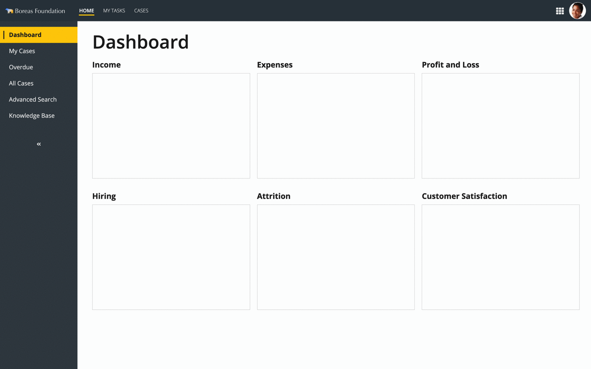 *(animated GIF)*

```sail
a!headerContentLayout(
  header: {},
  contents: {
    a!localVariables(
      local!navExpanded: true,
      {
        a!columnsLayout(
          columns: {
            a!columnLayout(
              contents: {
                a!cardLayout(
                  height: "AUTO",
                  style: "#3B464E",
                  marginBelow: "NONE",
                  showBorder: false
                ),
                a!cardLayout(
                  contents: {
                    a!sideBySideLayout(
                      items: {
                        a!sideBySideItem(
                          item: a!richTextDisplayField(
                            labelPosition: "COLLAPSED",
                            value: {
                              a!richTextItem(
                                text: { "❘" },
                                color: "STANDARD",
                                size: "LARGE"
                              )
                            }
                          ),
                          width: "MINIMIZE"
                        ),
                        a!sideBySideItem(
                          item: a!richTextDisplayField(
                            labelPosition: "COLLAPSED",
                            value: {
                              a!richTextItem(
                                text: { "Dashboard" },
                                color: "STANDARD",
                                size: "MEDIUM",
                                style: { "STRONG" }
                              )
                            },
                            preventWrapping: true
                          )
                        )
                      },
                      alignVertical: "MIDDLE"
                    )
                  },
                  link: a!dynamicLink(label: "Dynamic Link", saveInto: {}),
                  tooltip: "",
                  height: "AUTO",
                  style: "#FFCD00",
                  padding: "EVEN_LESS",
                  marginBelow: "NONE",
                  showBorder: false
                ),
                a!cardLayout(
                  contents: {
                    a!sideBySideLayout(
                      items: {
                        a!sideBySideItem(
                          item: a!richTextDisplayField(
                            labelPosition: "COLLAPSED",
                            value: {
                              a!richTextItem(
                                text: { "❘" },
                                color: "#3b464e",
                                size: "LARGE"
                              )
                            }
                          ),
                          width: "MINIMIZE"
                        ),
                        a!sideBySideItem(
                          item: a!richTextDisplayField(
                            labelPosition: "COLLAPSED",
                            value: {
                              a!richTextItem(
                                text: { "My Cases" },
                                color: "STANDARD",
                                size: "MEDIUM"
                              )
                            },
                            preventWrapping: true
                          )
                        )
                      },
                      alignVertical: "MIDDLE"
                    )
                  },
                  link: a!dynamicLink(label: "Dynamic Link", saveInto: {}),
                  tooltip: "",
                  height: "AUTO",
                  style: "#3b464e",
                  padding: "EVEN_LESS",
                  marginBelow: "NONE",
                  showBorder: false
                ),
                a!cardLayout(
                  contents: {
                    a!sideBySideLayout(
                      items: {
                        a!sideBySideItem(
                          item: a!richTextDisplayField(
                            labelPosition: "COLLAPSED",
                            value: {
                              a!richTextItem(
                                text: { "❘" },
                                color: "#3b464e",
                                size: "LARGE"
                              )
                            }
                          ),
                          width: "MINIMIZE"
                        ),
                        a!sideBySideItem(
                          item: a!richTextDisplayField(
                            labelPosition: "COLLAPSED",
                            value: {
                              a!richTextItem(
                                text: { "Overdue" },
                                color: "STANDARD",
                                size: "MEDIUM"
                              )
                            },
                            preventWrapping: true
                          )
                        )
                      },
                      alignVertical: "MIDDLE"
                    )
                  },
                  link: a!dynamicLink(label: "Dynamic Link", saveInto: {}),
                  tooltip: "",
                  height: "AUTO",
                  style: "#3b464e",
                  padding: "EVEN_LESS",
                  marginBelow: "NONE",
                  showBorder: false
                ),
                a!cardLayout(
                  contents: {
                    a!sideBySideLayout(
                      items: {
                        a!sideBySideItem(
                          item: a!richTextDisplayField(
                            labelPosition: "COLLAPSED",
                            value: {
                              a!richTextItem(
                                text: { "❘" },
                                color: "#3b464e",
                                size: "LARGE"
                              )
                            }
                          ),
                          width: "MINIMIZE"
                        ),
                        a!sideBySideItem(
                          item: a!richTextDisplayField(
                            labelPosition: "COLLAPSED",
                            value: {
                              a!richTextItem(
                                text: { "All Cases" },
                                color: "STANDARD",
                                size: "MEDIUM"
                              )
                            },
                            preventWrapping: true
                          )
                        )
                      },
                      alignVertical: "MIDDLE"
                    )
                  },
                  link: a!dynamicLink(label: "Dynamic Link", saveInto: {}),
                  tooltip: "",
                  height: "AUTO",
                  style: "#3b464e",
                  padding: "EVEN_LESS",
                  marginBelow: "NONE",
                  showBorder: false
                ),
                a!cardLayout(
                  contents: {
                    a!sideBySideLayout(
                      items: {
                        a!sideBySideItem(
                          item: a!richTextDisplayField(
                            labelPosition: "COLLAPSED",
                            value: {
                              a!richTextItem(
                                text: { "❘" },
                                color: "#3b464e",
                                size: "LARGE"
                              )
                            }
                          ),
                          width: "MINIMIZE"
                        ),
                        a!sideBySideItem(
                          item: a!richTextDisplayField(
                            labelPosition: "COLLAPSED",
                            value: {
                              a!richTextItem(
                                text: { "Advanced Search" },
                                color: "STANDARD",
                                size: "MEDIUM"
                              )
                            },
                            preventWrapping: true
                          )
                        )
                      },
                      alignVertical: "MIDDLE"
                    )
                  },
                  link: a!dynamicLink(label: "Dynamic Link", saveInto: {}),
                  tooltip: "",
                  height: "AUTO",
                  style: "#3b464e",
                  padding: "EVEN_LESS",
                  marginBelow: "NONE",
                  showBorder: false
                ),
                a!cardLayout(
                  contents: {
                    a!sideBySideLayout(
                      items: {
                        a!sideBySideItem(
                          item: a!richTextDisplayField(
                            labelPosition: "COLLAPSED",
                            value: {
                              a!richTextItem(
                                text: { "❘" },
                                color: "#3b464e",
                                size: "LARGE"
                              )
                            }
                          ),
                          width: "MINIMIZE"
                        ),
                        a!sideBySideItem(
                          item: a!richTextDisplayField(
                            labelPosition: "COLLAPSED",
                            value: {
                              a!richTextItem(
                                text: { "Knowledge Base" },
                                color: "STANDARD",
                                size: "MEDIUM"
                              )
                            },
                            preventWrapping: true
                          )
                        )
                      },
                      alignVertical: "MIDDLE"
                    )
                  },
                  link: a!dynamicLink(label: "Dynamic Link", saveInto: {}),
                  tooltip: "",
                  height: "AUTO",
                  style: "#3b464e",
                  padding: "EVEN_LESS",
                  marginBelow: "NONE",
                  showBorder: false
                ),
                a!cardLayout(
                  contents: {
                    a!cardLayout(
                      contents: {},
                      height: "AUTO",
                      style: "#3b464e",
                      padding: "LESS",
                      marginBelow: "NONE",
                      showBorder: false
                    )
                  },
                  tooltip: "",
                  height: "AUTO",
                  style: "#3b464e",
                  padding: "LESS",
                  marginBelow: "NONE",
                  showBorder: false
                ),
                a!cardLayout(
                  contents: {
                    a!cardLayout(
                      contents: {
                        a!richTextDisplayField(
                          labelPosition: "COLLAPSED",
                          value: {
                            a!richTextIcon(
                              icon: "angle-double-left-bold",
                              color: "STANDARD",
                              size: "STANDARD"
                            )
                          },
                          preventWrapping: true,
                          align: "CENTER"
                        )
                      },
                      link: a!dynamicLink(value: false, saveInto: local!navExpanded),
                      tooltip: "Collapse navigation bar",
                      height: "AUTO",
                      style: "#3b464e",
                      padding: "LESS",
                      marginBelow: "NONE",
                      showBorder: false
                    )
                  },
                  tooltip: "",
                  height: "AUTO",
                  style: "#3b464e",
                  padding: "LESS",
                  marginBelow: "NONE",
                  showBorder: false
                ),
                a!cardLayout(
                  height: "EXTRA_TALL",
                  style: "#3B464E",
                  marginBelow: "NONE",
                  showBorder: false
                ),
                a!cardLayout(
                  height: "EXTRA_TALL",
                  style: "#3B464E",
                  marginBelow: "NONE",
                  showBorder: false
                )
              },
              width: "NARROW",
              showWhen: local!navExpanded
            ),
            a!columnLayout(
              contents: {
                a!cardLayout(
                  height: "AUTO",
                  style: "#3B464E",
                  marginBelow: "NONE",
                  showBorder: false
                ),
                a!cardLayout(
                  contents: {
                    a!richTextDisplayField(
                      labelPosition: "COLLAPSED",
                      value: {
                        a!richTextIcon(icon: "tachometer", size: "MEDIUM_PLUS")
                      },
                      align: "CENTER"
                    )
                  },
                  link: a!dynamicLink(label: "Dynamic Link", saveInto: {}),
                  tooltip: "Dashboard",
                  height: "AUTO",
                  style: "#FFCD00",
                  marginBelow: "NONE",
                  showBorder: false
                ),
                a!cardLayout(
                  contents: {
                    a!richTextDisplayField(
                      labelPosition: "COLLAPSED",
                      value: {
                        a!richTextIcon(icon: "user", size: "MEDIUM_PLUS")
                      },
                      align: "CENTER"
                    )
                  },
                  link: a!dynamicLink(label: "Dynamic Link", saveInto: {}),
                  tooltip: "My Cases",
                  height: "AUTO",
                  style: "#3b464e",
                  marginBelow: "NONE",
                  showBorder: false
                ),
                a!cardLayout(
                  contents: {
                    a!richTextDisplayField(
                      labelPosition: "COLLAPSED",
                      value: {
                        a!richTextIcon(icon: "clock-o", size: "MEDIUM_PLUS")
                      },
                      align: "CENTER"
                    )
                  },
                  link: a!dynamicLink(label: "Dynamic Link", saveInto: {}),
                  tooltip: "Overdue Cases",
                  height: "AUTO",
                  style: "#3b464e",
                  marginBelow: "NONE",
                  showBorder: false
                ),
                a!cardLayout(
                  contents: {
                    a!richTextDisplayField(
                      labelPosition: "COLLAPSED",
                      value: {
                        a!richTextIcon(icon: "folder-open", size: "MEDIUM_PLUS")
                      },
                      align: "CENTER"
                    )
                  },
                  link: a!dynamicLink(label: "Dynamic Link", saveInto: {}),
                  tooltip: "All Cases",
                  height: "AUTO",
                  style: "#3b464e",
                  marginBelow: "NONE",
                  showBorder: false
                ),
                a!cardLayout(
                  contents: {
                    a!richTextDisplayField(
                      labelPosition: "COLLAPSED",
                      value: {
                        a!richTextIcon(icon: "search", size: "MEDIUM_PLUS")
                      },
                      align: "CENTER"
                    )
                  },
                  link: a!dynamicLink(label: "Dynamic Link", saveInto: {}),
                  tooltip: "Advanced Search",
                  height: "AUTO",
                  style: "#3b464e",
                  marginBelow: "NONE",
                  showBorder: false
                ),
                a!cardLayout(
                  contents: {
                    a!richTextDisplayField(
                      labelPosition: "COLLAPSED",
                      value: {
                        a!richTextIcon(icon: "lightbulb-o", size: "MEDIUM_PLUS")
                      },
                      align: "CENTER"
                    )
                  },
                  link: a!dynamicLink(label: "Dynamic Link", saveInto: {}),
                  tooltip: "Knowledge Base",
                  height: "AUTO",
                  style: "#3b464e",
                  marginBelow: "NONE",
                  showBorder: false
                ),
                a!cardLayout(
                  contents: {},
                  height: "AUTO",
                  style: "#3b464e",
                  padding: "LESS",
                  marginBelow: "NONE",
                  showBorder: false
                ),
                a!cardLayout(
                  contents: {
                    a!cardLayout(
                      contents: {
                        a!richTextDisplayField(
                          labelPosition: "COLLAPSED",
                          value: {
                            a!richTextIcon(
                              icon: "angle-double-right-bold",
                              color: "STANDARD",
                              size: "STANDARD"
                            )
                          },
                          preventWrapping: true,
                          align: "CENTER"
                        )
                      },
                      link: a!dynamicLink(value: true, saveInto: local!navExpanded),
                      tooltip: "Expand navigation bar",
                      height: "AUTO",
                      style: "#3b464e",
                      padding: "LESS",
                      marginBelow: "NONE",
                      showBorder: false
                    )
                  },
                  tooltip: "",
                  height: "AUTO",
                  style: "#3b464e",
                  padding: "LESS",
                  marginBelow: "NONE",
                  showBorder: false
                ),
                a!cardLayout(
                  height: "EXTRA_TALL",
                  style: "#3B464E",
                  marginBelow: "NONE",
                  showBorder: false
                ),
                a!cardLayout(
                  height: "EXTRA_TALL",
                  style: "#3B464E",
                  marginBelow: "NONE",
                  showBorder: false
                )
              },
              width: "EXTRA_NARROW",
              showWhen: not(local!navExpanded)
            ),
            a!columnLayout(
              contents: {
                a!cardLayout(
                  contents: {
                    a!sectionLayout(
                      label: "Dashboard",
                      labelSize: "LARGE_PLUS",
                      labelHeadingTag: "H1",
                      labelColor: "STANDARD",
                      contents: {}
                    ),
                    a!columnsLayout(
                      columns: {
                        a!columnLayout(
                          contents: {
                            a!sectionLayout(
                              label: "Income",
                              labelSize: "MEDIUM",
                              labelColor: "STANDARD",
                              contents: {
                                a!cardLayout(
                                  contents: {},
                                  height: "MEDIUM_PLUS",
                                  style: "NONE",
                                  padding: "STANDARD",
                                  marginBelow: "STANDARD",
                                  showBorder: true,
                                  showShadow: false
                                )
                              }
                            )
                          },
                          width: "AUTO"
                        ),
                        a!columnLayout(
                          contents: {
                            a!sectionLayout(
                              label: "Expenses",
                              labelSize: "MEDIUM",
                              labelColor: "STANDARD",
                              contents: {
                                a!cardLayout(
                                  contents: {},
                                  height: "MEDIUM_PLUS",
                                  style: "NONE",
                                  padding: "STANDARD",
                                  marginBelow: "STANDARD",
                                  showBorder: true,
                                  showShadow: false
                                )
                              }
                            )
                          },
                          width: "AUTO"
                        ),
                        a!columnLayout(
                          contents: {
                            a!sectionLayout(
                              label: "Profit and Loss",
                              labelSize: "MEDIUM",
                              labelColor: "STANDARD",
                              contents: {
                                a!cardLayout(
                                  contents: {},
                                  height: "MEDIUM_PLUS",
                                  style: "NONE",
                                  padding: "STANDARD",
                                  marginBelow: "STANDARD",
                                  showBorder: true,
                                  showShadow: false
                                )
                              }
                            )
                          },
                          width: "AUTO"
                        )
                      },
                      stackWhen: {
                        "PHONE",
                        "TABLET_PORTRAIT",
                        "TABLET_LANDSCAPE",
                        "DESKTOP_NARROW"
                      }
                    ),
                    a!columnsLayout(
                      columns: {
                        a!columnLayout(
                          contents: {
                            a!sectionLayout(
                              label: "Hiring",
                              labelSize: "MEDIUM",
                              labelColor: "STANDARD",
                              contents: {
                                a!cardLayout(
                                  contents: {},
                                  height: "MEDIUM_PLUS",
                                  style: "NONE",
                                  padding: "STANDARD",
                                  marginBelow: "STANDARD",
                                  showBorder: true,
                                  showShadow: false
                                )
                              }
                            )
                          },
                          width: "AUTO"
                        ),
                        a!columnLayout(
                          contents: {
                            a!sectionLayout(
                              label: "Attrition",
                              labelSize: "MEDIUM",
                              labelColor: "STANDARD",
                              contents: {
                                a!cardLayout(
                                  contents: {},
                                  height: "MEDIUM_PLUS",
                                  style: "NONE",
                                  padding: "STANDARD",
                                  marginBelow: "STANDARD",
                                  showBorder: true,
                                  showShadow: false
                                )
                              }
                            )
                          },
                          width: "AUTO"
                        ),
                        a!columnLayout(
                          contents: {
                            a!sectionLayout(
                              label: "Customer Satisfaction",
                              labelSize: "MEDIUM",
                              labelColor: "STANDARD",
                              contents: {
                                a!cardLayout(
                                  contents: {},
                                  height: "MEDIUM_PLUS",
                                  style: "NONE",
                                  padding: "STANDARD",
                                  marginBelow: "STANDARD",
                                  showBorder: true,
                                  showShadow: false
                                )
                              }
                            )
                          },
                          width: "AUTO"
                        )
                      },
                      stackWhen: {
                        "PHONE",
                        "TABLET_PORTRAIT",
                        "TABLET_LANDSCAPE",
                        "DESKTOP_NARROW"
                      }
                    )
                  },
                  height: "AUTO",
                  style: "NONE",
                  padding: "MORE",
                  marginBelow: "STANDARD",
                  showBorder: false
                )
              }
            )
          },
          spacing: "DENSE",
          stackWhen: {
            "PHONE",
            "TABLET_PORTRAIT",
            "TABLET_LANDSCAPE",
            "DESKTOP_NARROW"
          }
        )
      }
    )
  },
  backgroundColor: "WHITE",
  contentsPadding: "NONE"
)
```

#### Icon-only vertical navigation with secondary vertical navigation

This design combines an icon-only primary vertical navigation with a contrasting secondary vertical navigation.

Used with site tabs, this pattern can represent secondary and tertiary navigation levels.

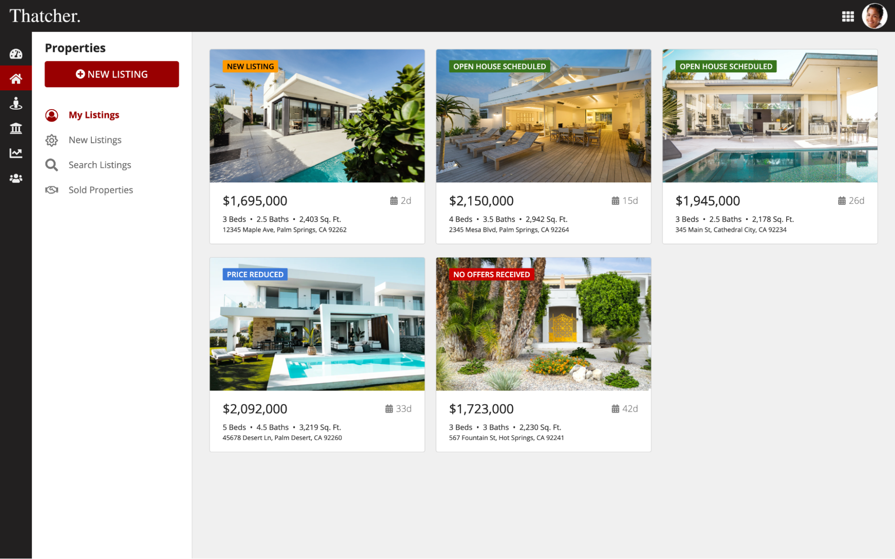

```sail
a!headerContentLayout(
  header: {
  },
  contents: {
    a!columnsLayout(
      columns: {
        a!columnLayout(
          contents: {
            a!cardLayout(
              height: "AUTO",
              style: "#232020",
              marginBelow: "NONE",
              showBorder: false
            ),
            a!cardLayout(
              contents: {
                a!richTextDisplayField(
                  labelPosition: "COLLAPSED",
                  value: {
                    a!richTextIcon(
                      icon: "tachometer",
                      size: "MEDIUM_PLUS"
                    )
                  },
                  align: "CENTER"
                )
              },
              link: a!dynamicLink(
                label: "Dynamic Link",
                saveInto: {}
              ),
              tooltip: "My Dashboard",
              height: "AUTO",
              style: "#232020",
              marginBelow: "NONE",
              showBorder: false
            ),
            a!cardLayout(
              contents: {
                a!richTextDisplayField(
                  labelPosition: "COLLAPSED",
                  value: {
                    a!richTextIcon(
                      icon: "home",
                      size: "MEDIUM_PLUS"
                    )
                  },
                  align: "CENTER"
                )
              },
              link: a!dynamicLink(
                label: "Dynamic Link",
                saveInto: {}
              ),
              tooltip: "Properties",
              height: "AUTO",
              style: "#990000",
              marginBelow: "NONE",
              showBorder: false
            ),
            a!cardLayout(
              contents: {
                a!richTextDisplayField(
                  labelPosition: "COLLAPSED",
                  value: {
                    a!richTextIcon(
                      icon: "street-view",
                      size: "MEDIUM_PLUS"
                    )
                  },
                  align: "CENTER"
                )
              },
              link: a!dynamicLink(
                label: "Dynamic Link",
                saveInto: {}
              ),
              tooltip: "Customers",
              height: "AUTO",
              style: "#232020",
              marginBelow: "NONE",
              showBorder: false
            ),
            a!cardLayout(
              contents: {
                a!richTextDisplayField(
                  labelPosition: "COLLAPSED",
                  value: {
                    a!richTextIcon(
                      icon: "university",
                      size: "MEDIUM_PLUS"
                    )
                  },
                  align: "CENTER"
                )
              },
              link: a!dynamicLink(
                label: "Dynamic Link",
                saveInto: {}
              ),
              tooltip: "Lending",
              height: "AUTO",
              style: "#232020",
              marginBelow: "NONE",
              showBorder: false
            ),
            a!cardLayout(
              contents: {
                a!richTextDisplayField(
                  labelPosition: "COLLAPSED",
                  value: {
                    a!richTextIcon(
                      icon: "line-chart",
                      size: "MEDIUM_PLUS"
                    )
                  },
                  align: "CENTER"
                )
              },
              link: a!dynamicLink(
                label: "Dynamic Link",
                saveInto: {}
              ),
              tooltip: "Performance",
              height: "AUTO",
              style: "#232020",
              marginBelow: "NONE",
              showBorder: false
            ),
            a!cardLayout(
              contents: {
                a!richTextDisplayField(
                  labelPosition: "COLLAPSED",
                  value: {
                    a!richTextIcon(
                      icon: "users",
                      size: "MEDIUM_PLUS"
                    )
                  },
                  align: "CENTER"
                )
              },
              link: a!dynamicLink(
                label: "Dynamic Link",
                saveInto: {}
              ),
              tooltip: "Team",
              height: "AUTO",
              style: "#232020",
              marginBelow: "NONE",
              showBorder: false
            ),
            a!cardLayout(
              height: "EXTRA_TALL",
              style: "#232020",
              marginBelow: "NONE",
              showBorder: false
            ),
            a!cardLayout(
              height: "EXTRA_TALL",
              style: "#232020",
              marginBelow: "NONE",
              showBorder: false
            )
          },
          width: "EXTRA_NARROW"
        ),
        a!columnLayout(
          contents: {
            a!columnsLayout(
              columns: {
                a!columnLayout(
                  contents: {
                    a!cardLayout(
                      contents: {
                        a!cardLayout(
                          contents: {
                            a!sectionLayout(
                              label: "Properties",
                              labelSize: "MEDIUM",
                              labelColor: "STANDARD",
                              contents: {
                                a!buttonArrayLayout(
                                  buttons: {
                                    a!buttonWidget(
                                      label: "New Listing",
                                      icon: "plus-circle",
                                      size: "LARGE",
                                      width: "FILL",
                                      style: "SOLID"
                                    )
                                  },
                                  align: "START"
                                )
                              },
                              divider: "NONE",
                              marginBelow: "NONE"
                            )
                          },
                          height: "AUTO",
                          style: "NONE",
                          padding: "STANDARD",
                          marginBelow: "NONE",
                          showBorder: false
                        ),
                        a!cardLayout(
                          contents: {
                            a!sideBySideLayout(
                              items: {
                                a!sideBySideItem(
                                  item: a!richTextDisplayField(
                                    labelPosition: "COLLAPSED",
                                    value: {
                                      "   "
                                    },
                                    align: "CENTER"
                                  ),
                                  width: "MINIMIZE"
                                ),
                                a!sideBySideItem(
                                  item: a!richTextDisplayField(
                                    labelPosition: "COLLAPSED",
                                    value: {
                                      a!richTextIcon(
                                        icon: "user-circle-o",
                                        color: "ACCENT",
                                        size: "MEDIUM_PLUS"
                                      )
                                    },
                                    align: "CENTER"
                                  ),
                                  width: "MINIMIZE"
                                ),
                                a!sideBySideItem(
                                  item: a!richTextDisplayField(
                                    labelPosition: "COLLAPSED",
                                    value: {
                                      "  "
                                    },
                                    align: "CENTER"
                                  ),
                                  width: "MINIMIZE"
                                ),
                                a!sideBySideItem(
                                  item: a!richTextDisplayField(
                                    labelPosition: "COLLAPSED",
                                    value: {
                                      a!richTextItem(
                                        text: {
                                          "My Listings"
                                        },
                                        color: "ACCENT",
                                        size: "MEDIUM",
                                        style: {
                                          "STRONG"
                                        }
                                      )
                                    },
                                    preventWrapping: true
                                  ),
                                  width: "AUTO"
                                )
                              },
                              alignVertical: "MIDDLE",
                              spacing: "DENSE",
                              marginBelow: "NONE"
                            )
                          },
                          link: a!dynamicLink(
                            label: "Dynamic Link",
                            saveInto: {}
                          ),
                          height: "AUTO",
                          style: "NONE",
                          padding: "LESS",
                          marginBelow: "NONE",
                          showBorder: false
                        ),
                        a!cardLayout(
                          contents: {
                            a!sideBySideLayout(
                              items: {
                                a!sideBySideItem(
                                  item: a!richTextDisplayField(
                                    labelPosition: "COLLAPSED",
                                    value: {
                                      "   "
                                    },
                                    align: "CENTER"
                                  ),
                                  width: "MINIMIZE"
                                ),
                                a!sideBySideItem(
                                  item: a!richTextDisplayField(
                                    labelPosition: "COLLAPSED",
                                    value: {
                                      a!richTextIcon(
                                        icon: "sun-o",
                                        color: "SECONDARY",
                                        size: "MEDIUM_PLUS"
                                      )
                                    },
                                    align: "CENTER"
                                  ),
                                  width: "MINIMIZE"
                                ),
                                a!sideBySideItem(
                                  item: a!richTextDisplayField(
                                    labelPosition: "COLLAPSED",
                                    value: {
                                      "  "
                                    },
                                    align: "CENTER"
                                  ),
                                  width: "MINIMIZE"
                                ),
                                a!sideBySideItem(
                                  item: a!richTextDisplayField(
                                    labelPosition: "COLLAPSED",
                                    value: {
                                      a!richTextItem(
                                        text: {
                                          "New Listings"
                                        },
                                        color: "#666666",
                                        size: "MEDIUM"
                                      )
                                    },
                                    preventWrapping: true
                                  ),
                                  width: "AUTO"
                                )
                              },
                              alignVertical: "MIDDLE",
                              spacing: "DENSE",
                              marginBelow: "NONE"
                            )
                          },
                          link: a!dynamicLink(
                            label: "Dynamic Link",
                            saveInto: {}
                          ),
                          height: "AUTO",
                          style: "NONE",
                          padding: "LESS",
                          marginBelow: "NONE",
                          showBorder: false
                        ),
                        a!cardLayout(
                          contents: {
                            a!sideBySideLayout(
                              items: {
                                a!sideBySideItem(
                                  item: a!richTextDisplayField(
                                    labelPosition: "COLLAPSED",
                                    value: {
                                      "   "
                                    },
                                    align: "CENTER"
                                  ),
                                  width: "MINIMIZE"
                                ),
                                a!sideBySideItem(
                                  item: a!richTextDisplayField(
                                    labelPosition: "COLLAPSED",
                                    value: {
                                      a!richTextIcon(
                                        icon: "search",
                                        color: "SECONDARY",
                                        size: "MEDIUM_PLUS"
                                      )
                                    },
                                    align: "CENTER"
                                  ),
                                  width: "MINIMIZE"
                                ),
                                a!sideBySideItem(
                                  item: a!richTextDisplayField(
                                    labelPosition: "COLLAPSED",
                                    value: {
                                      "  "
                                    },
                                    align: "CENTER"
                                  ),
                                  width: "MINIMIZE"
                                ),
                                a!sideBySideItem(
                                  item: a!richTextDisplayField(
                                    labelPosition: "COLLAPSED",
                                    value: {
                                      a!richTextItem(
                                        text: {
                                          "Search Listings"
                                        },
                                        color: "#666666",
                                        size: "MEDIUM"
                                      )
                                    },
                                    preventWrapping: true
                                  ),
                                  width: "AUTO"
                                )
                              },
                              alignVertical: "MIDDLE",
                              spacing: "DENSE",
                              marginBelow: "NONE"
                            )
                          },
                          link: a!dynamicLink(
                            label: "Dynamic Link",
                            saveInto: {}
                          ),
                          height: "AUTO",
                          style: "NONE",
                          padding: "LESS",
                          marginBelow: "NONE",
                          showBorder: false
                        ),
                        a!cardLayout(
                          contents: {
                            a!sideBySideLayout(
                              items: {
                                a!sideBySideItem(
                                  item: a!richTextDisplayField(
                                    labelPosition: "COLLAPSED",
                                    value: {
                                      "   "
                                    },
                                    align: "CENTER"
                                  ),
                                  width: "MINIMIZE"
                                ),
                                a!sideBySideItem(
                                  item: a!richTextDisplayField(
                                    labelPosition: "COLLAPSED",
                                    value: {
                                      a!richTextIcon(
                                        icon: "handshake-o",
                                        color: "SECONDARY",
                                        size: "MEDIUM_PLUS"
                                      )
                                    },
                                    align: "CENTER"
                                  ),
                                  width: "MINIMIZE"
                                ),
                                a!sideBySideItem(
                                  item: a!richTextDisplayField(
                                    labelPosition: "COLLAPSED",
                                    value: {
                                      "  "
                                    },
                                    align: "CENTER"
                                  ),
                                  width: "MINIMIZE"
                                ),
                                a!sideBySideItem(
                                  item: a!richTextDisplayField(
                                    labelPosition: "COLLAPSED",
                                    value: {
                                      a!richTextItem(
                                        text: {
                                          "Sold Properties"
                                        },
                                        color: "#666666",
                                        size: "MEDIUM"
                                      )
                                    },
                                    preventWrapping: true
                                  ),
                                  width: "AUTO"
                                )
                              },
                              alignVertical: "MIDDLE",
                              spacing: "DENSE",
                              marginBelow: "NONE"
                            )
                          },
                          link: a!dynamicLink(
                            label: "Dynamic Link",
                            saveInto: {}
                          ),
                          height: "AUTO",
                          style: "NONE",
                          padding: "LESS",
                          marginBelow: "NONE",
                          showBorder: false
                        ),
                        a!cardLayout(
                          contents: {},
                          height: "EXTRA_TALL",
                          style: "NONE",
                          marginBelow: "NONE",
                          showBorder: false
                        ),
                        a!cardLayout(
                          contents: {},
                          height: "EXTRA_TALL",
                          style: "NONE",
                          marginBelow: "NONE",
                          showBorder: false
                        )
                      },
                      height: "AUTO",
                      style: "NONE",
                      padding: "NONE",
                      marginBelow: "NONE",
                      showBorder: false
                    )
                  },
                  width: "NARROW_PLUS"
                ),
                a!columnLayout(
                  contents: {
                    a!cardLayout(
                      contents: {
                        a!columnsLayout(
                          columns: {
                            a!columnLayout(
                              contents: {
                                a!cardLayout(
                                  contents: {
                                    a!billboardLayout(
                                      backgroundMedia: a!webImage(source:"https://images.unsplash.com/photo-1512917774080-9991f1c4c750?ixid=MnwxMjA3fDB8MHxwaG90by1wYWdlfHx8fGVufDB8fHx8&ixlib=rb-1.2.1&auto=format&fit=crop&w=2550&q=80"),
                                      backgroundColor: "#f0f0f0",
                                      height: "SHORT_PLUS",
                                      marginBelow: "NONE",
                                      overlay: a!fullOverlay(
                                        alignVertical: "TOP",
                                        contents: {
                                          a!tagField(
                                            labelPosition: "COLLAPSED",
                                            tags: {
                                              a!tagItem(
                                                text: "NEW LISTING",
                                                backgroundColor: "#ff9900"
                                              )
                                            }
                                          )
                                        },
                                        style: "NONE"
                                      )
                                    ),
                                    a!cardLayout(
                                      contents: {
                                        a!sideBySideLayout(
                                          items: {
                                            a!sideBySideItem(
                                              item: a!richTextDisplayField(
                                                labelPosition: "COLLAPSED",
                                                value: {
                                                  a!richTextItem(
                                                    text: {
                                                      "$1,695,000"
                                                    },
                                                    size: "MEDIUM_PLUS"
                                                  )
                                                }
                                              )
                                            ),
                                            a!sideBySideItem(
                                              item: a!richTextDisplayField(
                                                labelPosition: "COLLAPSED",
                                                value: {
                                                  a!richTextItem(
                                                    text: {
                                                      a!richTextIcon(
                                                        icon: "calendar"
                                                      ),
                                                      " 2d"
                                                    },
                                                    color: "SECONDARY",
                                                    size: "MEDIUM"
                                                  )
                                                }
                                              ),
                                              width: "MINIMIZE"
                                            )
                                          },
                                          alignVertical: "MIDDLE",
                                          marginBelow: "STANDARD"
                                        ),
                                        a!richTextDisplayField(
                                          labelPosition: "COLLAPSED",
                                          value: {
                                            a!richTextItem(
                                              text: {
                                                "3 Beds  "
                                              },
                                              size: "STANDARD"
                                            ),
                                            "•  2.5 Baths  •  2,403 Sq. Ft.",
                                            char(10),
                                            a!richTextItem(
                                              text: {
                                                "12345 Maple Ave, Palm Springs, CA 92262"
                                              },
                                              size: "SMALL"
                                            )
                                          },
                                          preventWrapping: false
                                        )
                                      },
                                      height: "AUTO",
                                      style: "NONE",
                                      padding: "STANDARD",
                                      marginBelow: "NONE",
                                      showBorder: false
                                    )
                                  },
                                  link: a!dynamicLink(
                                    label: "Dynamic Link",
                                    saveInto: {}
                                  ),
                                  height: "AUTO",
                                  style: "NONE",
                                  shape: "SEMI_ROUNDED",
                                  padding: "NONE",
                                  marginBelow: "STANDARD"
                                )
                              }
                            ),
                            a!columnLayout(
                              contents: {
                                a!cardLayout(
                                  contents: {
                                    a!billboardLayout(
                                      backgroundMedia: a!webImage(source:"https://images.unsplash.com/photo-1575517111478-7f6afd0973db?ixid=MnwxMjA3fDB8MHxwaG90by1wYWdlfHx8fGVufDB8fHx8&ixlib=rb-1.2.1&auto=format&fit=crop&w=2550&q=80"),
                                      backgroundColor: "#f0f0f0",
                                      height: "SHORT_PLUS",
                                      marginBelow: "NONE",
                                      overlay: a!fullOverlay(
                                        alignVertical: "TOP",
                                        contents: {
                                          a!tagField(
                                            labelPosition: "COLLAPSED",
                                            tags: {
                                              a!tagItem(
                                                text: "OPEN HOUSE SCHEDULED",
                                                backgroundColor: "#38761d"
                                              )
                                            }
                                          )
                                        },
                                        style: "NONE"
                                      )
                                    ),
                                    a!cardLayout(
                                      contents: {
                                        a!sideBySideLayout(
                                          items: {
                                            a!sideBySideItem(
                                              item: a!richTextDisplayField(
                                                labelPosition: "COLLAPSED",
                                                value: {
                                                  a!richTextItem(
                                                    text: {
                                                      "$2,150,000"
                                                    },
                                                    size: "MEDIUM_PLUS"
                                                  )
                                                }
                                              )
                                            ),
                                            a!sideBySideItem(
                                              item: a!richTextDisplayField(
                                                labelPosition: "COLLAPSED",
                                                value: {
                                                  a!richTextItem(
                                                    text: {
                                                      a!richTextIcon(
                                                        icon: "calendar"
                                                      ),
                                                      " 15d"
                                                    },
                                                    color: "SECONDARY",
                                                    size: "MEDIUM"
                                                  )
                                                }
                                              ),
                                              width: "MINIMIZE"
                                            )
                                          },
                                          alignVertical: "MIDDLE",
                                          marginBelow: "STANDARD"
                                        ),
                                        a!richTextDisplayField(
                                          labelPosition: "COLLAPSED",
                                          value: {
                                            a!richTextItem(
                                              text: {
                                                "4 Beds  "
                                              },
                                              size: "STANDARD"
                                            ),
                                            "•  3.5 Baths  •  2,942 Sq. Ft.",
                                            char(10),
                                            a!richTextItem(
                                              text: {
                                                "2345 Mesa Blvd, Palm Springs, CA 92264"
                                              },
                                              size: "SMALL"
                                            )
                                          },
                                          preventWrapping: false
                                        )
                                      },
                                      height: "AUTO",
                                      style: "NONE",
                                      padding: "STANDARD",
                                      marginBelow: "NONE",
                                      showBorder: false
                                    )
                                  },
                                  link: a!dynamicLink(
                                    label: "Dynamic Link",
                                    saveInto: {}
                                  ),
                                  height: "AUTO",
                                  style: "NONE",
                                  shape: "SEMI_ROUNDED",
                                  padding: "NONE",
                                  marginBelow: "STANDARD"
                                )
                              }
                            ),
                            a!columnLayout(
                              contents: {
                                a!cardLayout(
                                  contents: {
                                    a!billboardLayout(
                                      backgroundMedia: a!webImage(source:"https://images.unsplash.com/photo-1582268611958-ebfd161ef9cf?ixid=MnwxMjA3fDB8MHxwaG90by1wYWdlfHx8fGVufDB8fHx8&ixlib=rb-1.2.1&auto=format&fit=crop&w=2550&q=80"),
                                      backgroundColor: "#f0f0f0",
                                      height: "SHORT_PLUS",
                                      marginBelow: "NONE",
                                      overlay: a!fullOverlay(
                                        alignVertical: "TOP",
                                        contents: {
                                          a!tagField(
                                            labelPosition: "COLLAPSED",
                                            tags: {
                                              a!tagItem(
                                                text: "OPEN HOUSE SCHEDULED",
                                                backgroundColor: "#38761d"
                                              )
                                            }
                                          )
                                        },
                                        style: "NONE"
                                      )
                                    ),
                                    a!cardLayout(
                                      contents: {
                                        a!sideBySideLayout(
                                          items: {
                                            a!sideBySideItem(
                                              item: a!richTextDisplayField(
                                                labelPosition: "COLLAPSED",
                                                value: {
                                                  a!richTextItem(
                                                    text: {
                                                      "$1,945,000"
                                                    },
                                                    size: "MEDIUM_PLUS"
                                                  )
                                                }
                                              )
                                            ),
                                            a!sideBySideItem(
                                              item: a!richTextDisplayField(
                                                labelPosition: "COLLAPSED",
                                                value: {
                                                  a!richTextItem(
                                                    text: {
                                                      a!richTextIcon(
                                                        icon: "calendar"
                                                      ),
                                                      " 26d"
                                                    },
                                                    color: "SECONDARY",
                                                    size: "MEDIUM"
                                                  )
                                                }
                                              ),
                                              width: "MINIMIZE"
                                            )
                                          },
                                          alignVertical: "MIDDLE",
                                          marginBelow: "STANDARD"
                                        ),
                                        a!richTextDisplayField(
                                          labelPosition: "COLLAPSED",
                                          value: {
                                            a!richTextItem(
                                              text: {
                                                "3 Beds  "
                                              },
                                              size: "STANDARD"
                                            ),
                                            "•  2.5 Baths  •  2,178 Sq. Ft.",
                                            char(10),
                                            a!richTextItem(
                                              text: {
                                                "345 Main St, Cathedral City, CA 92234"
                                              },
                                              size: "SMALL"
                                            )
                                          },
                                          preventWrapping: false
                                        )
                                      },
                                      height: "AUTO",
                                      style: "NONE",
                                      padding: "STANDARD",
                                      marginBelow: "NONE",
                                      showBorder: false
                                    )
                                  },
                                  link: a!dynamicLink(
                                    label: "Dynamic Link",
                                    saveInto: {}
                                  ),
                                  height: "AUTO",
                                  style: "NONE",
                                  shape: "SEMI_ROUNDED",
                                  padding: "NONE",
                                  marginBelow: "STANDARD"
                                )
                              }
                            )
                          },
                          stackWhen: {
                            "PHONE",
                            "TABLET_PORTRAIT",
                            "TABLET_LANDSCAPE",
                            "DESKTOP_NARROW"
                          }
                        ),
                        a!columnsLayout(
                          columns: {
                            a!columnLayout(
                              contents: {
                                a!cardLayout(
                                  contents: {
                                    a!billboardLayout(
                                      backgroundMedia: a!webImage(source:"https://images.unsplash.com/photo-1613977257592-4871e5fcd7c4?ixid=MnwxMjA3fDB8MHxzZWFyY2h8NzR8fGhvdXNlfGVufDB8fDB8fA%3D%3D&ixlib=rb-1.2.1&auto=format&fit=crop&w=900&q=60"),
                                      backgroundColor: "#f0f0f0",
                                      height: "SHORT_PLUS",
                                      marginBelow: "NONE",
                                      overlay: a!fullOverlay(
                                        alignVertical: "TOP",
                                        contents: {
                                          a!tagField(
                                            labelPosition: "COLLAPSED",
                                            tags: {
                                              a!tagItem(
                                                text: "PRICE REDUCED",
                                                backgroundColor: "#3c78d8"
                                              )
                                            }
                                          )
                                        },
                                        style: "NONE"
                                      )
                                    ),
                                    a!cardLayout(
                                      contents: {
                                        a!sideBySideLayout(
                                          items: {
                                            a!sideBySideItem(
                                              item: a!richTextDisplayField(
                                                labelPosition: "COLLAPSED",
                                                value: {
                                                  a!richTextItem(
                                                    text: {
                                                      "$2,092,000"
                                                    },
                                                    size: "MEDIUM_PLUS"
                                                  )
                                                }
                                              )
                                            ),
                                            a!sideBySideItem(
                                              item: a!richTextDisplayField(
                                                labelPosition: "COLLAPSED",
                                                value: {
                                                  a!richTextItem(
                                                    text: {
                                                      a!richTextIcon(
                                                        icon: "calendar"
                                                      ),
                                                      " 33d"
                                                    },
                                                    color: "SECONDARY",
                                                    size: "MEDIUM"
                                                  )
                                                }
                                              ),
                                              width: "MINIMIZE"
                                            )
                                          },
                                          alignVertical: "MIDDLE",
                                          marginBelow: "STANDARD"
                                        ),
                                        a!richTextDisplayField(
                                          labelPosition: "COLLAPSED",
                                          value: {
                                            a!richTextItem(
                                              text: {
                                                "5 Beds  "
                                              },
                                              size: "STANDARD"
                                            ),
                                            "•  4.5 Baths  •  3,219 Sq. Ft.",
                                            char(10),
                                            a!richTextItem(
                                              text: {
                                                "45678 Desert Ln, Palm Desert, CA 92260"
                                              },
                                              size: "SMALL"
                                            )
                                          },
                                          preventWrapping: false
                                        )
                                      },
                                      height: "AUTO",
                                      style: "NONE",
                                      padding: "STANDARD",
                                      marginBelow: "NONE",
                                      showBorder: false
                                    )
                                  },
                                  link: a!dynamicLink(
                                    label: "Dynamic Link",
                                    saveInto: {}
                                  ),
                                  height: "AUTO",
                                  style: "NONE",
                                  shape: "SEMI_ROUNDED",
                                  padding: "NONE",
                                  marginBelow: "STANDARD"
                                )
                              }
                            ),
                            a!columnLayout(
                              contents: {
                                a!cardLayout(
                                  contents: {
                                    a!billboardLayout(
                                      backgroundMedia: a!webImage(source:"https://images.unsplash.com/photo-1538963732282-4b2b48c7a4b8?ixid=MnwxMjA3fDB8MHxwaG90by1wYWdlfHx8fGVufDB8fHx8&ixlib=rb-1.2.1&auto=format&fit=crop&w=2555&q=80"),
                                      backgroundColor: "#f0f0f0",
                                      height: "SHORT_PLUS",
                                      marginBelow: "NONE",
                                      overlay: a!fullOverlay(
                                        alignVertical: "TOP",
                                        contents: {
                                          a!tagField(
                                            labelPosition: "COLLAPSED",
                                            tags: {
                                              a!tagItem(
                                                text: "NO OFFERS RECEIVED",
                                                backgroundColor: "#cc0000"
                                              )
                                            }
                                          )
                                        },
                                        style: "NONE"
                                      )
                                    ),
                                    a!cardLayout(
                                      contents: {
                                        a!sideBySideLayout(
                                          items: {
                                            a!sideBySideItem(
                                              item: a!richTextDisplayField(
                                                labelPosition: "COLLAPSED",
                                                value: {
                                                  a!richTextItem(
                                                    text: {
                                                      "$1,723,000"
                                                    },
                                                    size: "MEDIUM_PLUS"
                                                  )
                                                }
                                              )
                                            ),
                                            a!sideBySideItem(
                                              item: a!richTextDisplayField(
                                                labelPosition: "COLLAPSED",
                                                value: {
                                                  a!richTextItem(
                                                    text: {
                                                      a!richTextIcon(
                                                        icon: "calendar"
                                                      ),
                                                      " 42d"
                                                    },
                                                    color: "SECONDARY",
                                                    size: "MEDIUM"
                                                  )
                                                }
                                              ),
                                              width: "MINIMIZE"
                                            )
                                          },
                                          alignVertical: "MIDDLE",
                                          marginBelow: "STANDARD"
                                        ),
                                        a!richTextDisplayField(
                                          labelPosition: "COLLAPSED",
                                          value: {
                                            a!richTextItem(
                                              text: {
                                                "3 Beds  "
                                              },
                                              size: "STANDARD"
                                            ),
                                            "•  3 Baths  •  2,230 Sq. Ft.",
                                            char(10),
                                            a!richTextItem(
                                              text: {
                                                "567 Fountain St, Hot Springs, CA 92241"
                                              },
                                              size: "SMALL"
                                            )
                                          },
                                          preventWrapping: false
                                        )
                                      },
                                      height: "AUTO",
                                      style: "NONE",
                                      padding: "STANDARD",
                                      marginBelow: "NONE",
                                      showBorder: false
                                    )
                                  },
                                  link: a!dynamicLink(
                                    label: "Dynamic Link",
                                    saveInto: {}
                                  ),
                                  height: "AUTO",
                                  style: "NONE",
                                  shape: "SEMI_ROUNDED",
                                  padding: "NONE",
                                  marginBelow: "STANDARD"
                                )
                              }
                            ),
                            a!columnLayout(
                              contents: {}
                            )
                          },
                          stackWhen: {
                            "PHONE",
                            "TABLET_PORTRAIT",
                            "TABLET_LANDSCAPE",
                            "DESKTOP_NARROW"
                          }
                        )
                      },
                      height: "AUTO",
                      style: "#f0f0f0",
                      padding: "MORE",
                      marginBelow: "STANDARD",
                      showBorder: false
                    )
                  }
                )
              },
              spacing: "NONE",
              stackWhen: {
                "NEVER"
              },
              showDividers: true
            )
          }
        )
      },
      spacing: "NONE",
      stackWhen: {
        "NEVER"
      }
    )
  },
  showWhen: true,
  backgroundColor: "TRANSPARENT",
  contentsPadding: "NONE"
)
```

### Vertical navigation color guidance

#### Vertical navigation with transparent page background

On pages with content displayed within cards, the vertical navigation should be rendered directly on the transparent page background. No divider line or bounding card is necessary.

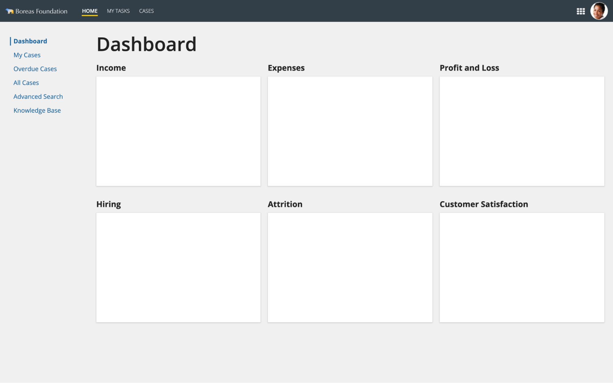

#### Vertical navigation with contrasting background color

Use a background color for the vertical navigation that contrasts with the page background color to create a more prominent navigation control.

To maximize visual consistency, only use this pattern if all or most pages on the site will feature this vertical navigation.

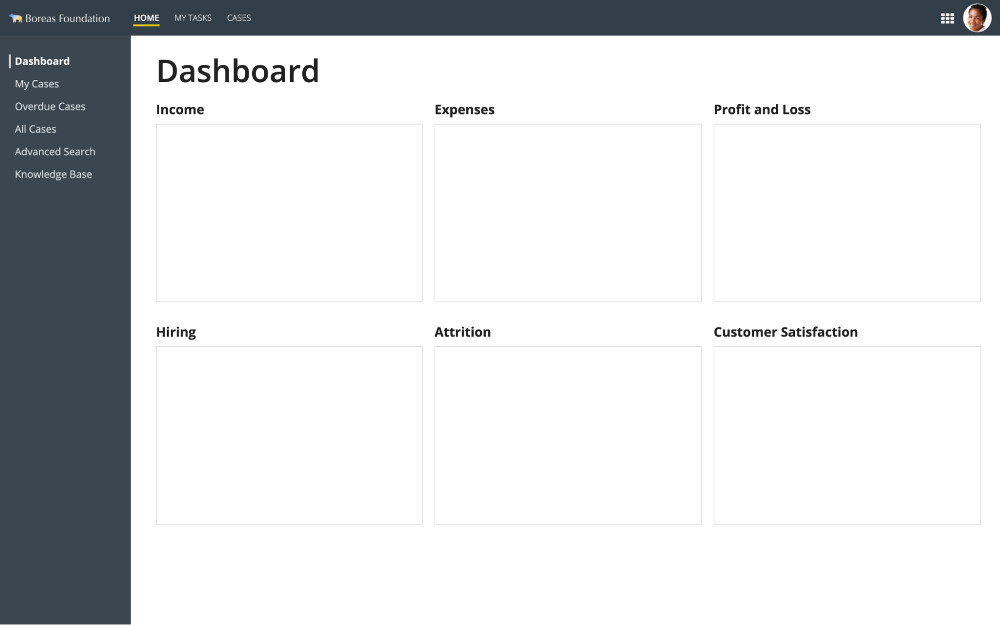

```sail
a!headerContentLayout(
  header: {
  },
  contents: {
    a!columnsLayout(
      columns: {
        a!columnLayout(
          contents: {
            a!cardLayout(
              height: "AUTO",
              style: "#3B464E",
              marginBelow: "NONE",
              showBorder: false
            ),
            a!cardLayout(
              contents: {  a!cardLayout(
                contents: {
                  a!sideBySideLayout(
                    items: {
                      a!sideBySideItem(
                        item: a!richTextDisplayField(
                          labelPosition: "COLLAPSED",
                          value: {
                            a!richTextItem(
                              text: {
                                "❘"
                              },
                              color: "STANDARD",
                              size: "LARGE"
                            )
                          }
                        ),
                        width: "MINIMIZE"
                      ),
                      a!sideBySideItem(
                        item: a!richTextDisplayField(
                          labelPosition: "COLLAPSED",
                          value: {
                            a!richTextItem(
                              text: {
                                "Dashboard"
                              },
                              color: "STANDARD",
                              size: "MEDIUM",
                              style: {
                                "STRONG"
                              }
                            )
                          }
                        )
                      )
                    },
                    alignVertical: "MIDDLE",
                    spacing: "DENSE"
                  )
                },
                link: a!dynamicLink(
                  saveInto: {}
                ),
                height: "AUTO",
                style: "#3B464E",
                padding: "NONE",
                marginBelow: "NONE",
                showBorder: false
  ),
              a!cardLayout(
                contents: {
                  a!sideBySideLayout(
                    items: {
                      a!sideBySideItem(
                        item: a!richTextDisplayField(
                          label: "Rich Text",
                          labelPosition: "COLLAPSED",
                          value: {
                            a!richTextItem(
                              text: {
                                "❘"
                              },
                              color: "#3B464E",
                              size: "LARGE"
                            )
                          }
                        ),
                        width: "MINIMIZE"
                      ),
                      a!sideBySideItem(
                        item: a!richTextDisplayField(
                          label: "Rich Text",
                          labelPosition: "COLLAPSED",
                          value: {
                            a!richTextItem(
                              text: {
                                "My Cases"
                              },
                              color: "#D0D7DC",
                              size: "MEDIUM"
                            )
                          }
                        )
                      )
                    },
                    alignVertical: "MIDDLE",
                    spacing: "DENSE"
                  )
                },
                link: a!dynamicLink(
                  label: "Dynamic Link",
                  saveInto: {}
                ),
                height: "AUTO",
                style: "#3B464E",
                padding: "NONE",
                marginBelow: "NONE",
                showBorder: false
              ),
              a!cardLayout(
                contents: {
                  a!sideBySideLayout(
                    items: {
                      a!sideBySideItem(
                        item: a!richTextDisplayField(
                          label: "Rich Text",
                          labelPosition: "COLLAPSED",
                          value: {
                            a!richTextItem(
                              text: {
                                "❘"
                              },
                              color: "#3B464E",
                              size: "LARGE"
                            )
                          }
                        ),
                        width: "MINIMIZE"
                      ),
                      a!sideBySideItem(
                        item: a!richTextDisplayField(
                          label: "Rich Text",
                          labelPosition: "COLLAPSED",
                          value: {
                            a!richTextItem(
                              text: {
                                "Overdue Cases"
                              },
                              color: "#D0D7DC",
                              size: "MEDIUM"
                            )
                          }
                        )
                      )
                    },
                    alignVertical: "MIDDLE",
                    spacing: "DENSE"
                  )
                },
                link: a!dynamicLink(
                  label: "Dynamic Link",
                  saveInto: {}
                ),
                height: "AUTO",
                style: "#3B464E",
                padding: "NONE",
                marginBelow: "NONE",
                showBorder: false
              ),
              a!cardLayout(
                contents: {
                  a!sideBySideLayout(
                    items: {
                      a!sideBySideItem(
                        item: a!richTextDisplayField(
                          label: "Rich Text",
                          labelPosition: "COLLAPSED",
                          value: {
                            a!richTextItem(
                              text: {
                                "❘"
                              },
                              color: "#3B464E",
                              size: "LARGE"
                            )
                          }
                        ),
                        width: "MINIMIZE"
                      ),
                      a!sideBySideItem(
                        item: a!richTextDisplayField(
                          label: "Rich Text",
                          labelPosition: "COLLAPSED",
                          value: {
                            a!richTextItem(
                              text: {
                                "All Cases"
                              },
                              color: "#D0D7DC",
                              size: "MEDIUM"
                            )
                          }
                        )
                      )
                    },
                    alignVertical: "MIDDLE",
                    spacing: "DENSE"
                  )
                },
                link: a!dynamicLink(
                  label: "Dynamic Link",
                  saveInto: {}
                ),
                height: "AUTO",
                style: "#3B464E",
                padding: "NONE",
                marginBelow: "NONE",
                showBorder: false
              ),
              a!cardLayout(
                contents: {
                  a!sideBySideLayout(
                    items: {
                      a!sideBySideItem(
                        item: a!richTextDisplayField(
                          label: "Rich Text",
                          labelPosition: "COLLAPSED",
                          value: {
                            a!richTextItem(
                              text: {
                                "❘"
                              },
                              color: "#3B464E",
                              size: "LARGE"
                            )
                          }
                        ),
                        width: "MINIMIZE"
                      ),
                      a!sideBySideItem(
                        item: a!richTextDisplayField(
                          label: "Rich Text",
                          labelPosition: "COLLAPSED",
                          value: {
                            a!richTextItem(
                              text: {
                                "Advanced Search"
                              },
                              color: "#D0D7DC",
                              size: "MEDIUM"
                            )
                          }
                        )
                      )
                    },
                    alignVertical: "MIDDLE",
                    spacing: "DENSE"
                  )
                },
                link: a!dynamicLink(
                  label: "Dynamic Link",
                  saveInto: {}
                ),
                height: "AUTO",
                style: "#3B464E",
                padding: "NONE",
                marginBelow: "NONE",
                showBorder: false
              ),
              a!cardLayout(
                contents: {
                  a!sideBySideLayout(
                    items: {
                      a!sideBySideItem(
                        item: a!richTextDisplayField(
                          label: "Rich Text",
                          labelPosition: "COLLAPSED",
                          value: {
                            a!richTextItem(
                              text: {
                                "❘"
                              },
                              color: "#3B464E",
                              size: "LARGE"
                            )
                          }
                        ),
                        width: "MINIMIZE"
                      ),
                      a!sideBySideItem(
                        item: a!richTextDisplayField(
                          label: "Rich Text",
                          labelPosition: "COLLAPSED",
                          value: {
                            a!richTextItem(
                              text: {
                                "Knowledge Base"
                              },
                              color: "#D0D7DC",
                              size: "MEDIUM"
                            )
                          }
                        )
                      )
                    },
                    alignVertical: "MIDDLE",
                    spacing: "DENSE"
                  )
                },
                link: a!dynamicLink(
                  label: "Dynamic Link",
                  saveInto: {}
                ),
                height: "AUTO",
                style: "#3B464E",
                padding: "NONE",
                marginBelow: "NONE",
                showBorder: false
              )},
              height: "AUTO",
              style: "#3B464E",
              marginBelow: "NONE",
              showBorder: false
            ),
            a!cardLayout(
              height: "EXTRA_TALL",
              style: "#3B464E",
              marginBelow: "NONE",
              showBorder: false
            ),
            a!cardLayout(
              height: "EXTRA_TALL",
              style: "#3B464E",
              marginBelow: "NONE",
              showBorder: false
            )
          },
          width: "NARROW"
        ),
        a!columnLayout(
          contents: {
            a!cardLayout(
              contents: {
                a!sectionLayout(
                  label: "Dashboard",
                  labelSize: "LARGE_PLUS",
                  labelHeadingTag: "H1",
                  labelColor: "STANDARD",
                  contents: {}
                ),
                a!columnsLayout(
                  columns: {
                    a!columnLayout(
                      contents: {
                        a!sectionLayout(
                          label: "Income",
                          labelSize: "MEDIUM",
                          labelColor: "STANDARD",
                          contents: {
                            a!cardLayout(
                              contents: {},
                              height: "MEDIUM_PLUS",
                              style: "NONE",
                              padding: "STANDARD",
                              marginBelow: "STANDARD",
                              showBorder: true,
                              showShadow: false
                            )
                          }
                        )
                      },
                      width: "AUTO"
                    ),
                    a!columnLayout(
                      contents: {
                        a!sectionLayout(
                          label: "Expenses",
                          labelSize: "MEDIUM",
                          labelColor: "STANDARD",
                          contents: {
                            a!cardLayout(
                              contents: {},
                              height: "MEDIUM_PLUS",
                              style: "NONE",
                              padding: "STANDARD",
                              marginBelow: "STANDARD",
                              showBorder: true,
                              showShadow: false
                            )
                          }
                        )
                      },
                      width: "AUTO"
                    ),
                    a!columnLayout(
                      contents: {
                        a!sectionLayout(
                          label: "Profit and Loss",
                          labelSize: "MEDIUM",
                          labelColor: "STANDARD",
                          contents: {
                            a!cardLayout(
                              contents: {},
                              height: "MEDIUM_PLUS",
                              style: "NONE",
                              padding: "STANDARD",
                              marginBelow: "STANDARD",
                              showBorder: true,
                              showShadow: false
                            )
                          }
                        )
                      },
                      width: "AUTO"
                    )
                  },
                  stackWhen: {
                    "PHONE",
                    "TABLET_PORTRAIT",
                    "TABLET_LANDSCAPE",
                    "DESKTOP_NARROW"
                  }
                ),
                a!columnsLayout(
                  columns: {
                    a!columnLayout(
                      contents: {
                        a!sectionLayout(
                          label: "Hiring",
                          labelSize: "MEDIUM",
                          labelColor: "STANDARD",
                          contents: {
                            a!cardLayout(
                              contents: {},
                              height: "MEDIUM_PLUS",
                              style: "NONE",
                              padding: "STANDARD",
                              marginBelow: "STANDARD",
                              showBorder: true,
                              showShadow: false
                            )
                          }
                        )
                      },
                      width: "AUTO"
                    ),
                    a!columnLayout(
                      contents: {
                        a!sectionLayout(
                          label: "Attrition",
                          labelSize: "MEDIUM",
                          labelColor: "STANDARD",
                          contents: {
                            a!cardLayout(
                              contents: {},
                              height: "MEDIUM_PLUS",
                              style: "NONE",
                              padding: "STANDARD",
                              marginBelow: "STANDARD",
                              showBorder: true,
                              showShadow: false
                            )
                          }
                        )
                      },
                      width: "AUTO"
                    ),
                    a!columnLayout(
                      contents: {
                        a!sectionLayout(
                          label: "Customer Satisfaction",
                          labelSize: "MEDIUM",
                          labelColor: "STANDARD",
                          contents: {
                            a!cardLayout(
                              contents: {},
                              height: "MEDIUM_PLUS",
                              style: "NONE",
                              padding: "STANDARD",
                              marginBelow: "STANDARD",
                              showBorder: true,
                              showShadow: false
                            )
                          }
                        )
                      },
                      width: "AUTO"
                    )
                  },
                  stackWhen: {
                    "PHONE",
                    "TABLET_PORTRAIT",
                    "TABLET_LANDSCAPE",
                    "DESKTOP_NARROW"
                  }
                )
              },
              height: "AUTO",
              style: "NONE",
              padding: "MORE",
              marginBelow: "STANDARD",
              showBorder: false
            )
          }
        )
      },
      spacing: "DENSE",
      stackWhen: {
        "PHONE",
        "TABLET_PORTRAIT",
        "TABLET_LANDSCAPE",
        "DESKTOP_NARROW"
      }
    )
  },
  showWhen: true,
  backgroundColor: "WHITE",
  contentsPadding: "NONE"
)
```

#### More prominent selected page style for vertical navigation

This style gives greater visual emphasis to the selected secondary navigation page.

Consider using this style if:

- The selected page is of greater significance than the selected site tab.

- The page content is visually dense and users may have trouble seeing the highlighted page on the vertical navigation.

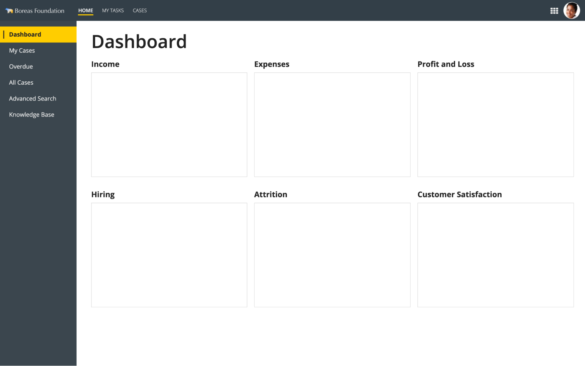

```sail
a!headerContentLayout(
  header: {
  },
  contents: {
    a!columnsLayout(
      columns: {
        a!columnLayout(
          contents: {
            a!cardLayout(
              height: "AUTO",
              style: "#3B464E",
              marginBelow: "NONE",
              showBorder: false
            ),
            a!cardLayout(
              contents: {
                a!sideBySideLayout(
                  items: {
                    a!sideBySideItem(
                      item: a!richTextDisplayField(
                        labelPosition: "COLLAPSED",
                        value: {
                          a!richTextItem(
                            text: {
                              "❘"
                            },
                            color: "STANDARD",
                            size: "LARGE"
                          )
                        }
                      ),
                      width: "MINIMIZE"
                    ),
                    a!sideBySideItem(
                      item: a!richTextDisplayField(
                        labelPosition: "COLLAPSED",
                        value: {
                          a!richTextItem(
                            text: {
                              "Dashboard"
                            },
                            color: "STANDARD",
                            size: "MEDIUM",
                            style: {
                              "STRONG"
                            }
                          )
                        },
                        preventWrapping: true
                      )
                    )
                  },
                  alignVertical: "MIDDLE")
              },
              link: a!dynamicLink(
                label: "Dynamic Link",
                saveInto: {}
              ),
              tooltip: "",
              height: "AUTO",
              style: "#FFCD00",
              padding: "EVEN_LESS",
              marginBelow: "NONE",
              showBorder: false
            ),
            a!cardLayout(
              contents: {
                a!sideBySideLayout(
                  items: {
                    a!sideBySideItem(
                      item: a!richTextDisplayField(
                        labelPosition: "COLLAPSED",
                        value: {
                          a!richTextItem(
                            text: {
                              "❘"
                            },
                            color: "#3b464e",
                            size: "LARGE"
                          )
                        }
                      ),
                      width: "MINIMIZE"
                    ),
                    a!sideBySideItem(
                      item: a!richTextDisplayField(
                        labelPosition: "COLLAPSED",
                        value: {
                          a!richTextItem(
                            text: {
                              "My Cases"
                            },
                            color: "STANDARD",
                            size: "MEDIUM"
                          )
                        },
                        preventWrapping: true
                      )
                    )
                  },
                  alignVertical: "MIDDLE")
              },
              link: a!dynamicLink(
                label: "Dynamic Link",
                saveInto: {}
              ),
              tooltip: "",
              height: "AUTO",
              style: "#3b464e",
              padding: "EVEN_LESS",
              marginBelow: "NONE",
              showBorder: false
            ),
            a!cardLayout(
              contents: {
                a!sideBySideLayout(
                  items: {
                    a!sideBySideItem(
                      item: a!richTextDisplayField(
                        labelPosition: "COLLAPSED",
                        value: {
                          a!richTextItem(
                            text: {
                              "❘"
                            },
                            color: "#3b464e",
                            size: "LARGE"
                          )
                        }
                      ),
                      width: "MINIMIZE"
                    ),
                    a!sideBySideItem(
                      item: a!richTextDisplayField(
                        labelPosition: "COLLAPSED",
                        value: {
                          a!richTextItem(
                            text: {
                              "Overdue"
                            },
                            color: "STANDARD",
                            size: "MEDIUM"
                          )
                        },
                        preventWrapping: true
                      )
                    )
                  },
                  alignVertical: "MIDDLE")
              },
              link: a!dynamicLink(
                label: "Dynamic Link",
                saveInto: {}
              ),
              tooltip: "",
              height: "AUTO",
              style: "#3b464e",
              padding: "EVEN_LESS",
              marginBelow: "NONE",
              showBorder: false
            ),
            a!cardLayout(
              contents: {
                a!sideBySideLayout(
                  items: {
                    a!sideBySideItem(
                      item: a!richTextDisplayField(
                        labelPosition: "COLLAPSED",
                        value: {
                          a!richTextItem(
                            text: {
                              "❘"
                            },
                            color: "#3b464e",
                            size: "LARGE"
                          )
                        }
                      ),
                      width: "MINIMIZE"
                    ),
                    a!sideBySideItem(
                      item: a!richTextDisplayField(
                        labelPosition: "COLLAPSED",
                        value: {
                          a!richTextItem(
                            text: {
                              "All Cases"
                            },
                            color: "STANDARD",
                            size: "MEDIUM"
                          )
                        },
                        preventWrapping: true
                      )
                    )
                  },
                  alignVertical: "MIDDLE")
              },
              link: a!dynamicLink(
                label: "Dynamic Link",
                saveInto: {}
              ),
              tooltip: "",
              height: "AUTO",
              style: "#3b464e",
              padding: "EVEN_LESS",
              marginBelow: "NONE",
              showBorder: false
            ),
            a!cardLayout(
              contents: {
                a!sideBySideLayout(
                  items: {
                    a!sideBySideItem(
                      item: a!richTextDisplayField(
                        labelPosition: "COLLAPSED",
                        value: {
                          a!richTextItem(
                            text: {
                              "❘"
                            },
                            color: "#3b464e",
                            size: "LARGE"
                          )
                        }
                      ),
                      width: "MINIMIZE"
                    ),
                    a!sideBySideItem(
                      item: a!richTextDisplayField(
                        labelPosition: "COLLAPSED",
                        value: {
                          a!richTextItem(
                            text: {
                              "Advanced Search"
                            },
                            color: "STANDARD",
                            size: "MEDIUM"
                          )
                        },
                        preventWrapping: true
                      )
                    )
                  },
                  alignVertical: "MIDDLE")
              },
              link: a!dynamicLink(
                label: "Dynamic Link",
                saveInto: {}
              ),
              tooltip: "",
              height: "AUTO",
              style: "#3b464e",
              padding: "EVEN_LESS",
              marginBelow: "NONE",
              showBorder: false
            ),
            a!cardLayout(
              contents: {
                a!sideBySideLayout(
                  items: {
                    a!sideBySideItem(
                      item: a!richTextDisplayField(
                        labelPosition: "COLLAPSED",
                        value: {
                          a!richTextItem(
                            text: {
                              "❘"
                            },
                            color: "#3b464e",
                            size: "LARGE"
                          )
                        }
                      ),
                      width: "MINIMIZE"
                    ),
                    a!sideBySideItem(
                      item: a!richTextDisplayField(
                        labelPosition: "COLLAPSED",
                        value: {
                          a!richTextItem(
                            text: {
                              "Knowledge Base"
                            },
                            color: "STANDARD",
                            size: "MEDIUM"
                          )
                        },
                        preventWrapping: true
                      )
                    )
                  },
                  alignVertical: "MIDDLE")
              },
              link: a!dynamicLink(
                label: "Dynamic Link",
                saveInto: {}
              ),
              tooltip: "",
              height: "AUTO",
              style: "#3b464e",
              padding: "EVEN_LESS",
              marginBelow: "NONE",
              showBorder: false
            ),
            a!cardLayout(
              height: "EXTRA_TALL",
              style: "#3B464E",
              marginBelow: "NONE",
              showBorder: false
            ),
            a!cardLayout(
              height: "EXTRA_TALL",
              style: "#3B464E",
              marginBelow: "NONE",
              showBorder: false
            )
          },
          width: "NARROW"
        ),
        a!columnLayout(
          contents: {
            a!cardLayout(
              contents: {
                a!sectionLayout(
                  label: "Dashboard",
                  labelSize: "LARGE_PLUS",
                  labelHeadingTag: "H1",
                  labelColor: "STANDARD",
                  contents: {}
                ),
                a!columnsLayout(
                  columns: {
                    a!columnLayout(
                      contents: {
                        a!sectionLayout(
                          label: "Income",
                          labelSize: "MEDIUM",
                          labelColor: "STANDARD",
                          contents: {
                            a!cardLayout(
                              contents: {},
                              height: "MEDIUM_PLUS",
                              style: "NONE",
                              padding: "STANDARD",
                              marginBelow: "STANDARD",
                              showBorder: true,
                              showShadow: false
                            )
                          }
                        )
                      },
                      width: "AUTO"
                    ),
                    a!columnLayout(
                      contents: {
                        a!sectionLayout(
                          label: "Expenses",
                          labelSize: "MEDIUM",
                          labelColor: "STANDARD",
                          contents: {
                            a!cardLayout(
                              contents: {},
                              height: "MEDIUM_PLUS",
                              style: "NONE",
                              padding: "STANDARD",
                              marginBelow: "STANDARD",
                              showBorder: true,
                              showShadow: false
                            )
                          }
                        )
                      },
                      width: "AUTO"
                    ),
                    a!columnLayout(
                      contents: {
                        a!sectionLayout(
                          label: "Profit and Loss",
                          labelSize: "MEDIUM",
                          labelColor: "STANDARD",
                          contents: {
                            a!cardLayout(
                              contents: {},
                              height: "MEDIUM_PLUS",
                              style: "NONE",
                              padding: "STANDARD",
                              marginBelow: "STANDARD",
                              showBorder: true,
                              showShadow: false
                            )
                          }
                        )
                      },
                      width: "AUTO"
                    )
                  },
                  stackWhen: {
                    "PHONE",
                    "TABLET_PORTRAIT",
                    "TABLET_LANDSCAPE",
                    "DESKTOP_NARROW"
                  }
                ),
                a!columnsLayout(
                  columns: {
                    a!columnLayout(
                      contents: {
                        a!sectionLayout(
                          label: "Hiring",
                          labelSize: "MEDIUM",
                          labelColor: "STANDARD",
                          contents: {
                            a!cardLayout(
                              contents: {},
                              height: "MEDIUM_PLUS",
                              style: "NONE",
                              padding: "STANDARD",
                              marginBelow: "STANDARD",
                              showBorder: true,
                              showShadow: false
                            )
                          }
                        )
                      },
                      width: "AUTO"
                    ),
                    a!columnLayout(
                      contents: {
                        a!sectionLayout(
                          label: "Attrition",
                          labelSize: "MEDIUM",
                          labelColor: "STANDARD",
                          contents: {
                            a!cardLayout(
                              contents: {},
                              height: "MEDIUM_PLUS",
                              style: "NONE",
                              padding: "STANDARD",
                              marginBelow: "STANDARD",
                              showBorder: true,
                              showShadow: false
                            )
                          }
                        )
                      },
                      width: "AUTO"
                    ),
                    a!columnLayout(
                      contents: {
                        a!sectionLayout(
                          label: "Customer Satisfaction",
                          labelSize: "MEDIUM",
                          labelColor: "STANDARD",
                          contents: {
                            a!cardLayout(
                              contents: {},
                              height: "MEDIUM_PLUS",
                              style: "NONE",
                              padding: "STANDARD",
                              marginBelow: "STANDARD",
                              showBorder: true,
                              showShadow: false
                            )
                          }
                        )
                      },
                      width: "AUTO"
                    )
                  },
                  stackWhen: {
                    "PHONE",
                    "TABLET_PORTRAIT",
                    "TABLET_LANDSCAPE",
                    "DESKTOP_NARROW"
                  }
                )
              },
              height: "AUTO",
              style: "NONE",
              padding: "MORE",
              marginBelow: "STANDARD",
              showBorder: false
            )
          }
        )
      },
      spacing: "DENSE",
      stackWhen: {
        "PHONE",
        "TABLET_PORTRAIT",
        "TABLET_LANDSCAPE",
        "DESKTOP_NARROW"
      }
    )
  },
  showWhen: true,
  backgroundColor: "WHITE",
  contentsPadding: "NONE"
)
```

## Horizontal navigation patterns

Use these patterns when you need functionality beyond what the tab layout component provides.

For examples of great-looking patterns that use the tab layout, see the following inspiration gallery patterns:

- Restaurant Order

- Customer Account Management Page

- My Health Site

### Basic horizontal navigation

This pattern manually creates tabs using card layouts.

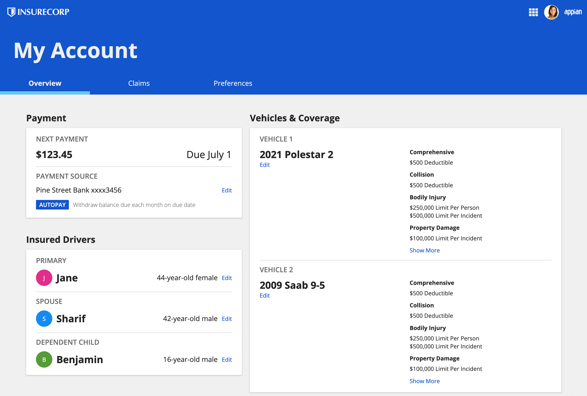

```sail
a!headerContentLayout(
  header: {
    a!cardLayout(
      contents: {
        a!cardLayout(
          contents: {
            a!richTextDisplayField(
              labelPosition: "COLLAPSED",
              value: {
                a!richTextItem(
                  text: { "My Account" },
                  size: "LARGE_PLUS",
                  style: { "STRONG" }
                )
              }
            )
          },
          height: "AUTO",
          style: "#1155cc",
          padding: "MORE",
          marginBelow: "NONE",
          showBorder: false
        ),
        a!cardLayout(
          contents: {
            a!columnsLayout(
              columns: {
                a!columnLayout(
                  contents: {
                    a!cardLayout(
                      contents: {
                        a!cardLayout(
                          contents: {
                            a!richTextDisplayField(
                              labelPosition: "COLLAPSED",
                              value: {
                                a!richTextItem(
                                  text: { "Overview" },
                                  size: "MEDIUM",
                                  style: { "STRONG" }
                                )
                              },
                              align: "CENTER"
                            )
                          },
                          height: "AUTO",
                          style: "#1155cc",
                          marginBelow: "NONE",
                          showBorder: false,
                          accessibilityText: "Navigation tab selected"
                        ),
                        a!cardLayout(
                          contents: {},
                          height: "AUTO",
                          style: "#65c7ee",
                          padding: "EVEN_LESS",
                          marginBelow: "NONE",
                          showBorder: false
                        )
                      },
                      link: a!dynamicLink(label: "Dynamic Link", saveInto: {}),
                      height: "AUTO",
                      style: "NONE",
                      padding: "NONE",
                      marginBelow: "NONE",
                      showBorder: false
                    )
                  },
                  width: "NARROW"
                ),
                a!columnLayout(
                  contents: {
                    a!cardLayout(
                      contents: {
                        a!cardLayout(
                          contents: {
                            a!richTextDisplayField(
                              labelPosition: "COLLAPSED",
                              value: {
                                a!richTextItem(text: { "Claims" }, size: "MEDIUM")
                              },
                              align: "CENTER"
                            )
                          },
                          height: "AUTO",
                          style: "#1155cc",
                          marginBelow: "NONE",
                          showBorder: false
                        ),
                        a!cardLayout(
                          contents: {},
                          height: "AUTO",
                          style: "#1155cc",
                          padding: "EVEN_LESS",
                          marginBelow: "NONE",
                          showBorder: false
                        )
                      },
                      link: a!dynamicLink(label: "Dynamic Link", saveInto: {}),
                      height: "AUTO",
                      style: "NONE",
                      padding: "NONE",
                      marginBelow: "NONE",
                      showBorder: false,
                      accessibilityText: "Navigation tab not selected"
                    )
                  },
                  width: "NARROW"
                ),
                a!columnLayout(
                  contents: {
                    a!cardLayout(
                      contents: {
                        a!cardLayout(
                          contents: {
                            a!richTextDisplayField(
                              labelPosition: "COLLAPSED",
                              value: {
                                a!richTextItem(text: { "Preferences" }, size: "MEDIUM")
                              },
                              align: "CENTER"
                            )
                          },
                          height: "AUTO",
                          style: "#1155cc",
                          marginBelow: "NONE",
                          showBorder: false
                        ),
                        a!cardLayout(
                          contents: {},
                          height: "AUTO",
                          style: "#1155cc",
                          padding: "EVEN_LESS",
                          marginBelow: "NONE",
                          showBorder: false
                        )
                      },
                      link: a!dynamicLink(label: "Dynamic Link", saveInto: {}),
                      height: "AUTO",
                      style: "NONE",
                      padding: "NONE",
                      marginBelow: "NONE",
                      showBorder: false,
                      accessibilityText: "Navigation tab not selected"
                    )
                  },
                  width: "NARROW"
                ),
                if(
                  a!isPageWidth("PHONE"),
                  {},
                  { a!columnLayout(contents: {}) }
                )
              },
              spacing: "DENSE",
              stackWhen: { "NEVER" }
            )
          },
          height: "AUTO",
          style: "#1155cc",
          padding: "NONE",
          marginBelow: "NONE",
          showBorder: false
        )
      },
      height: "AUTO",
      style: "#fff",
      padding: "NONE",
      marginBelow: "MORE",
      showBorder: false
    )
  },
  contents: {
    a!columnsLayout(
      columns: {
        a!columnLayout(contents: {}),
        a!columnLayout(
          contents: {
            a!sectionLayout(
              label: "Payment",
              labelSize: "MEDIUM",
              labelHeadingTag: "H2",
              labelColor: "STANDARD",
              contents: {
                a!cardLayout(
                  contents: {
                    a!sectionLayout(
                      label: "NEXT PAYMENT",
                      labelSize: "SMALL",
                      labelHeadingTag: "H3",
                      labelColor: "SECONDARY",
                      contents: {
                        a!sideBySideLayout(
                          items: {
                            a!sideBySideItem(
                              item: a!richTextDisplayField(
                                labelPosition: "COLLAPSED",
                                value: {
                                  a!richTextItem(
                                    text: { "$123.45" },
                                    size: "MEDIUM_PLUS",
                                    style: { "STRONG" }
                                  )
                                }
                              )
                            ),
                            a!sideBySideItem(
                              item: a!richTextDisplayField(
                                labelPosition: "COLLAPSED",
                                value: {
                                  a!richTextItem(text: { "Due July 1" }, size: "MEDIUM_PLUS")
                                }
                              ),
                              width: "MINIMIZE"
                            )
                          },
                          alignVertical: "MIDDLE"
                        )
                      },
                      divider: "BELOW"
                    ),
                    a!sectionLayout(
                      label: "PAYMENT SOURCE",
                      labelSize: "SMALL",
                      labelHeadingTag: "H3",
                      labelColor: "SECONDARY",
                      contents: {
                        a!sideBySideLayout(
                          items: {
                            a!sideBySideItem(
                              item: a!richTextDisplayField(
                                labelPosition: "COLLAPSED",
                                value: {
                                  a!richTextItem(
                                    text: { "Pine Street Bank xxxx3456" },
                                    size: "MEDIUM"
                                  )
                                }
                              ),
                              width: "AUTO"
                            ),
                            a!sideBySideItem(
                              item: a!richTextDisplayField(
                                labelPosition: "COLLAPSED",
                                value: {
                                  a!richTextItem(
                                    text: { "Edit" },
                                    link: a!safeLink(
                                      uri: "www.appian.com",
                                      openLinkIn: "NEW_TAB"
                                    ),
                                    linkStyle: "STANDALONE"
                                  )
                                }
                              ),
                              width: "MINIMIZE"
                            )
                          },
                          alignVertical: "MIDDLE"
                        ),
                        a!sideBySideLayout(
                          items: {
                            a!sideBySideItem(
                              item: a!tagField(
                                label: "Tag Field",
                                labelPosition: "COLLAPSED",
                                tags: {
                                  a!tagItem(
                                    text: "AUTOPAY",
                                    backgroundColor: "#1155cc"
                                  )
                                }
                              ),
                              width: "MINIMIZE"
                            ),
                            a!sideBySideItem(
                              item: a!richTextDisplayField(
                                labelPosition: "COLLAPSED",
                                value: {
                                  a!richTextItem(
                                    text: {
                                      "Withdraw balance due each month on due date"
                                    },
                                    color: "SECONDARY"
                                  )
                                }
                              )
                            )
                          },
                          alignVertical: "MIDDLE"
                        )
                      },
                      divider: "NONE",
                      marginBelow: "NONE"
                    )
                  },
                  height: "AUTO",
                  style: "NONE",
                  padding: "STANDARD",
                  marginBelow: "STANDARD",
                  showBorder: false,
                  showShadow: true
                )
              },
              isCollapsible: false,
              marginBelow: "MORE"
            ),
            a!sectionLayout(
              label: "Insured Drivers",
              labelSize: "MEDIUM",
              labelHeadingTag: "H2",
              labelColor: "STANDARD",
              contents: {
                a!cardLayout(
                  contents: {
                    a!sectionLayout(
                      label: "PRIMARY",
                      labelSize: "SMALL",
                      labelHeadingTag: "H3",
                      labelColor: "SECONDARY",
                      contents: {
                        a!sideBySideLayout(
                          items: {
                            a!sideBySideItem(
                              item: a!stampField(
                                labelPosition: "COLLAPSED",
                                text: "J",
                                backgroundColor: "#e12e8b",
                                contentColor: "STANDARD",
                                size: "TINY"
                              ),
                              width: "MINIMIZE"
                            ),
                            a!sideBySideItem(
                              item: a!richTextDisplayField(
                                labelPosition: "COLLAPSED",
                                value: {
                                  a!richTextItem(
                                    text: { "Jane" },
                                    size: "MEDIUM_PLUS",
                                    style: { "STRONG" }
                                  )
                                }
                              )
                            ),
                            a!sideBySideItem(
                              item: a!richTextDisplayField(
                                labelPosition: "COLLAPSED",
                                value: {
                                  a!richTextItem(
                                    text: { "44-year-old female" },
                                    size: "MEDIUM"
                                  )
                                }
                              ),
                              width: "MINIMIZE"
                            ),
                            a!sideBySideItem(
                              item: a!richTextDisplayField(
                                labelPosition: "COLLAPSED",
                                value: {
                                  a!richTextItem(
                                    text: { "Edit" },
                                    link: a!safeLink(
                                      uri: "www.appian.com",
                                      openLinkIn: "NEW_TAB"
                                    ),
                                    linkStyle: "STANDALONE"
                                  )
                                }
                              ),
                              width: "MINIMIZE"
                            )
                          },
                          alignVertical: "MIDDLE"
                        )
                      },
                      divider: "BELOW"
                    ),
                    a!sectionLayout(
                      label: "SPOUSE",
                      labelSize: "SMALL",
                      labelHeadingTag: "H3",
                      labelColor: "SECONDARY",
                      contents: {
                        a!sideBySideLayout(
                          items: {
                            a!sideBySideItem(
                              item: a!stampField(
                                labelPosition: "COLLAPSED",
                                text: "S",
                                backgroundColor: "#118bf1",
                                contentColor: "STANDARD",
                                size: "TINY"
                              ),
                              width: "MINIMIZE"
                            ),
                            a!sideBySideItem(
                              item: a!richTextDisplayField(
                                labelPosition: "COLLAPSED",
                                value: {
                                  a!richTextItem(
                                    text: { "Sharif" },
                                    size: "MEDIUM_PLUS",
                                    style: { "STRONG" }
                                  )
                                }
                              )
                            ),
                            a!sideBySideItem(
                              item: a!richTextDisplayField(
                                labelPosition: "COLLAPSED",
                                value: {
                                  a!richTextItem(
                                    text: { "42-year-old male" },
                                    size: "MEDIUM"
                                  )
                                }
                              ),
                              width: "MINIMIZE"
                            ),
                            a!sideBySideItem(
                              item: a!richTextDisplayField(
                                labelPosition: "COLLAPSED",
                                value: {
                                  a!richTextItem(
                                    text: { "Edit" },
                                    link: a!safeLink(
                                      uri: "www.appian.com",
                                      openLinkIn: "NEW_TAB"
                                    ),
                                    linkStyle: "STANDALONE"
                                  )
                                }
                              ),
                              width: "MINIMIZE"
                            )
                          },
                          alignVertical: "MIDDLE"
                        )
                      },
                      divider: "BELOW"
                    ),
                    a!sectionLayout(
                      label: "DEPENDENT CHILD",
                      labelSize: "SMALL",
                      labelHeadingTag: "H3",
                      labelColor: "SECONDARY",
                      contents: {
                        a!sideBySideLayout(
                          items: {
                            a!sideBySideItem(
                              item: a!stampField(
                                labelPosition: "COLLAPSED",
                                text: "B",
                                backgroundColor: "#569a38",
                                contentColor: "STANDARD",
                                size: "TINY"
                              ),
                              width: "MINIMIZE"
                            ),
                            a!sideBySideItem(
                              item: a!richTextDisplayField(
                                labelPosition: "COLLAPSED",
                                value: {
                                  a!richTextItem(
                                    text: { "Benjamin" },
                                    size: "MEDIUM_PLUS",
                                    style: { "STRONG" }
                                  )
                                }
                              )
                            ),
                            a!sideBySideItem(
                              item: a!richTextDisplayField(
                                labelPosition: "COLLAPSED",
                                value: {
                                  a!richTextItem(
                                    text: { "16-year-old male" },
                                    size: "MEDIUM"
                                  )
                                }
                              ),
                              width: "MINIMIZE"
                            ),
                            a!sideBySideItem(
                              item: a!richTextDisplayField(
                                labelPosition: "COLLAPSED",
                                value: {
                                  a!richTextItem(
                                    text: { "Edit" },
                                    link: a!safeLink(
                                      uri: "www.appian.com",
                                      openLinkIn: "NEW_TAB"
                                    ),
                                    linkStyle: "STANDALONE"
                                  )
                                }
                              ),
                              width: "MINIMIZE"
                            )
                          },
                          alignVertical: "MIDDLE"
                        )
                      },
                      divider: "NONE",
                      marginBelow: "NONE"
                    )
                  },
                  height: "AUTO",
                  style: "NONE",
                  padding: "STANDARD",
                  marginBelow: "STANDARD",
                  showBorder: false,
                  showShadow: true
                )
              },
              marginBelow: "MORE"
            )
          },
          width: "MEDIUM_PLUS"
        ),
        a!columnLayout(
          contents: {
            a!sectionLayout(
              label: "Vehicles & Coverage",
              labelSize: "MEDIUM",
              labelHeadingTag: "H2",
              labelColor: "STANDARD",
              contents: {
                a!cardLayout(
                  contents: {
                    a!sectionLayout(
                      label: "VEHICLE 1",
                      labelSize: "SMALL",
                      labelHeadingTag: "H3",
                      labelColor: "SECONDARY",
                      contents: {
                        a!columnsLayout(
                          columns: {
                            a!columnLayout(
                              contents: {
                                a!richTextDisplayField(
                                  labelPosition: "COLLAPSED",
                                  value: {
                                    a!richTextItem(
                                      text: { "2021 Polestar 2" },
                                      size: "MEDIUM_PLUS",
                                      style: { "STRONG" }
                                    ),
                                    char(10),
                                    a!richTextItem(
                                      text: {
                                        a!richTextItem(text: { "Edit" }, size: "STANDARD")
                                      },
                                      link: a!safeLink(
                                        uri: "www.appian.com",
                                        openLinkIn: "NEW_TAB"
                                      ),
                                      linkStyle: "STANDALONE"
                                    )
                                  }
                                )
                              }
                            ),
                            a!columnLayout(
                              contents: {
                                a!richTextDisplayField(
                                  label: "Comprehensive",
                                  labelPosition: "ABOVE",
                                  value: { "$500 Deductible" }
                                ),
                                a!richTextDisplayField(
                                  label: "Collision",
                                  labelPosition: "ABOVE",
                                  value: { "$500 Deductible" }
                                ),
                                a!richTextDisplayField(
                                  label: "Bodily Injury",
                                  labelPosition: "ABOVE",
                                  value: {
                                    "$250,000 Limit Per Person",
                                    char(10),
                                    "$500,000 Limit Per Incident"
                                  }
                                ),
                                a!richTextDisplayField(
                                  label: "Property Damage",
                                  labelPosition: "ABOVE",
                                  value: { "$100,000 Limit Per Incident" }
                                ),
                                a!richTextDisplayField(
                                  labelPosition: "COLLAPSED",
                                  value: {
                                    a!richTextItem(
                                      text: { "Show More" },
                                      link: a!safeLink(
                                        uri: "www.appian.com",
                                        openLinkIn: "NEW_TAB"
                                      ),
                                      linkStyle: "STANDALONE"
                                    )
                                  }
                                )
                              }
                            )
                          }
                        )
                      },
                      divider: "BELOW"
                    ),
                    a!sectionLayout(
                      label: "VEHICLE 2",
                      labelSize: "SMALL",
                      labelHeadingTag: "H3",
                      labelColor: "SECONDARY",
                      contents: {
                        a!columnsLayout(
                          columns: {
                            a!columnLayout(
                              contents: {
                                a!richTextDisplayField(
                                  labelPosition: "COLLAPSED",
                                  value: {
                                    a!richTextItem(
                                      text: { "2009 Saab 9-5" },
                                      size: "MEDIUM_PLUS",
                                      style: { "STRONG" }
                                    ),
                                    char(10),
                                    a!richTextItem(
                                      text: {
                                        a!richTextItem(text: { "Edit" }, size: "STANDARD")
                                      },
                                      link: a!safeLink(
                                        uri: "www.appian.com",
                                        openLinkIn: "NEW_TAB"
                                      ),
                                      linkStyle: "STANDALONE"
                                    )
                                  }
                                )
                              }
                            ),
                            a!columnLayout(
                              contents: {
                                a!richTextDisplayField(
                                  label: "Comprehensive",
                                  labelPosition: "ABOVE",
                                  value: { "$500 Deductible" }
                                ),
                                a!richTextDisplayField(
                                  label: "Collision",
                                  labelPosition: "ABOVE",
                                  value: { "$500 Deductible" }
                                ),
                                a!richTextDisplayField(
                                  label: "Bodily Injury",
                                  labelPosition: "ABOVE",
                                  value: {
                                    "$250,000 Limit Per Person",
                                    char(10),
                                    "$500,000 Limit Per Incident"
                                  }
                                ),
                                a!richTextDisplayField(
                                  label: "Property Damage",
                                  labelPosition: "ABOVE",
                                  value: { "$100,000 Limit Per Incident" }
                                ),
                                a!richTextDisplayField(
                                  labelPosition: "COLLAPSED",
                                  value: {
                                    a!richTextItem(
                                      text: { "Show More" },
                                      link: a!safeLink(
                                        uri: "www.appian.com",
                                        openLinkIn: "NEW_TAB"
                                      ),
                                      linkStyle: "STANDALONE"
                                    )
                                  }
                                )
                              }
                            )
                          }
                        )
                      },
                      divider: "NONE",
                      marginBelow: "NONE"
                    )
                  },
                  height: "AUTO",
                  style: "NONE",
                  padding: "STANDARD",
                  marginBelow: "STANDARD",
                  showBorder: false,
                  showShadow: true
                )
              },
              marginBelow: "MORE"
            )
          },
          width: "WIDE"
        ),
        a!columnLayout(contents: {})
      },
      stackWhen: { "PHONE", "TABLET_PORTRAIT" }
    )
  },
  backgroundColor: "TRANSPARENT"
)
```

### Framed horizontal navigation

This pattern features horizontal tabs that blend in with framed page contents.

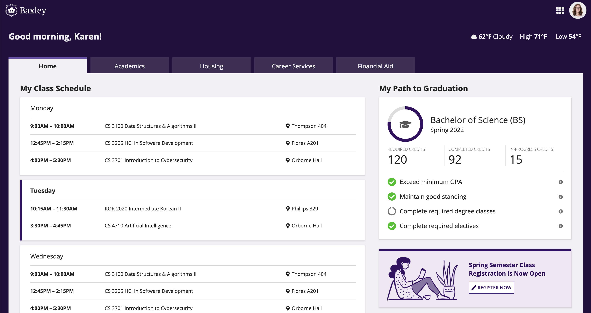

#### Functional pattern

Use this pattern to quickly get up and running with a functional horizontal tab layout. Just go to expression mode to switch out the data and contents that are unique to your app, and you're good to go.

```sail
a!localVariables(
  local!tabs: {
    a!map(name: "Home", id: 1),
    a!map(name: "Academics", id: 2),
    a!map(name: "Housing", id: 3),
    a!map(name: "Career Services", id: 4),
    a!map(name: "Financial Aid", id: 5)
  },
  local!selectedTab: 1,
  a!headerContentLayout(
    header: {
      a!cardLayout(
        contents: {
          a!columnsLayout(
            columns: {
              a!columnLayout(
                contents: {
                  a!richTextDisplayField(
                    labelPosition: "COLLAPSED",
                    value: {
                      a!richTextItem(
                        text: { "Good morning, Karen!" },
                        size: "MEDIUM_PLUS",
                        style: { "STRONG" }
                      )
                    }
                  )
                }
              ),
              a!columnLayout(
                contents: {
                  a!sideBySideLayout(
                    items: {
                      a!sideBySideItem(
                        item: a!richTextDisplayField(
                          labelPosition: "COLLAPSED",
                          value: {
                            a!richTextItem(
                              text: {
                                a!richTextIcon(icon: "cloud"),
                                " ",
                                a!richTextItem(text: { "62°F" }, style: { "STRONG" }),
                                " Cloudy"
                              },
                              size: "MEDIUM"
                            )
                          },
                          align: "RIGHT"
                        ),
                        width: if(
                          a!isPageWidth({ "PHONE", "TABLET_PORTRAIT" }),
                          "MINIMIZE",
                          "AUTO"
                        )
                      ),
                      a!sideBySideItem(
                        item: a!richTextDisplayField(
                          labelPosition: "COLLAPSED",
                          value: {
                            a!richTextItem(
                              text: {
                                "High ",
                                a!richTextItem(text: { "71°" }, style: { "STRONG" }),
                                "F "
                              },
                              size: "MEDIUM"
                            )
                          },
                          align: "RIGHT"
                        ),
                        width: "MINIMIZE"
                      ),
                      a!sideBySideItem(
                        item: a!richTextDisplayField(
                          labelPosition: "COLLAPSED",
                          value: {
                            a!richTextItem(
                              text: {
                                "Low ",
                                a!richTextItem(text: { "54°" }, style: { "STRONG" }),
                                "F "
                              },
                              size: "MEDIUM"
                            )
                          },
                          align: "RIGHT"
                        ),
                        width: "MINIMIZE"
                      )
                    },
                    alignVertical: "MIDDLE",
                    spacing: "SPARSE"
                  )
                }
              )
            },
            alignVertical: "MIDDLE",
            marginAbove: "STANDARD",
            marginBelow: "LESS",
            stackWhen: { "PHONE", "TABLET_PORTRAIT" }
          )
        },
        height: "AUTO",
        style: "#230f3d",
        padding: "STANDARD",
        marginBelow: "NONE",
        showBorder: false
      )
    },
    contents: {
      a!columnsLayout(
        columns: {
          a!forEach(
            local!tabs,
            a!columnLayout(
              contents: {
                a!cardLayout(
                  contents: {
                    a!richTextDisplayField(
                      labelPosition: "COLLAPSED",
                      value: {
                        a!richTextItem(
                          text: { fv!item.name },
                          size: "MEDIUM",
                          style: if(
                            local!selectedTab = fv!item.id,
                            { "STRONG" },
                            "PLAIN"
                          )
                        )
                      },
                      preventWrapping: true,
                      align: "CENTER"
                    )
                  },
                  link: a!dynamicLink(
                    label: fv!item.name & " Tab" & if(
                      local!selectedTab = fv!item.id,
                      " (Selected)",
                      " Not Selected"
                    ),
                    saveInto: { a!save(local!selectedTab, fv!item.id) }
                  ),
                  height: "AUTO",
                  style: if(
                    local!selectedTab = fv!item.id,
                    "#f3f0f6",
                    "#402e57"
                  ),
                  marginBelow: "NONE",
                  showBorder: false,
                  decorativeBarPosition: "TOP",
                  decorativeBarColor: if(
                    local!selectedTab = fv!item.id,
                    "#674ea7",
                    "#402e57"
                  ),
                  accessibilityText: "Selected tab"
                )
              },
              width: "NARROW"
            )
          ),
          a!columnLayout(
            contents: {},
            showWhen: a!isPageWidth(
              {
                "TABLET_LANDSCAPE",
                "DESKTOP_NARROW",
                "DESKTOP",
                "DESKTOP_WIDE"
              }
            )
          )
        },
        marginBelow: "NONE",
        spacing: "DENSE"
      ),
      a!cardLayout(
        contents: {
          choose(
            local!selectedTab,
            /*First tab contents        */
            a!columnsLayout(
              columns: {
                a!columnLayout(
                  contents: {
                    a!sectionLayout(
                      label: "My Class Schedule",
                      labelSize: "MEDIUM",
                      labelColor: "STANDARD",
                      contents: {
                        a!cardLayout(
                          contents: {
                            a!sectionLayout(
                              label: "",
                              contents: {
                                a!sideBySideLayout(
                                  items: {
                                    a!sideBySideItem(
                                      item: a!richTextDisplayField(
                                        labelPosition: "COLLAPSED",
                                        value: {
                                          a!richTextItem(text: { "Monday" }, size: "MEDIUM")
                                        }
                                      )
                                    )
                                  },
                                  alignVertical: "MIDDLE"
                                )
                              },
                              marginBelow: "NONE"
                            ),
                            a!sectionLayout(
                              label: "",
                              contents: {
                                a!sideBySideLayout(
                                  items: {
                                    a!sideBySideItem(
                                      item: a!richTextDisplayField(
                                        labelPosition: "COLLAPSED",
                                        value: {
                                          a!richTextItem(
                                            text: { "9:00AM – 10:00AM" },
                                            style: { "STRONG" }
                                          )
                                        }
                                      ),
                                      width: "2X"
                                    ),
                                    a!sideBySideItem(
                                      item: a!richTextDisplayField(
                                        labelPosition: "COLLAPSED",
                                        value: {
                                          "CS 3100 Data Structures & Algorithms II"
                                        }
                                      ),
                                      width: "5X"
                                    ),
                                    a!sideBySideItem(
                                      item: a!richTextDisplayField(
                                        labelPosition: "COLLAPSED",
                                        value: {
                                          a!richTextIcon(icon: "map-marker"),
                                          " Thompson 404"
                                        }
                                      ),
                                      width: "2X"
                                    )
                                  },
                                  alignVertical: "TOP"
                                )
                              },
                              divider: "ABOVE",
                              marginBelow: "NONE"
                            ),
                            a!sectionLayout(
                              label: "",
                              contents: {
                                a!sideBySideLayout(
                                  items: {
                                    a!sideBySideItem(
                                      item: a!richTextDisplayField(
                                        labelPosition: "COLLAPSED",
                                        value: {
                                          a!richTextItem(
                                            text: { "12:45PM – 2:15PM" },
                                            style: { "STRONG" }
                                          )
                                        }
                                      ),
                                      width: "2X"
                                    ),
                                    a!sideBySideItem(
                                      item: a!richTextDisplayField(
                                        labelPosition: "COLLAPSED",
                                        value: { "CS 3205 HCI in Software Development" }
                                      ),
                                      width: "5X"
                                    ),
                                    a!sideBySideItem(
                                      item: a!richTextDisplayField(
                                        labelPosition: "COLLAPSED",
                                        value: {
                                          a!richTextIcon(icon: "map-marker"),
                                          " Flores A201"
                                        }
                                      ),
                                      width: "2X"
                                    )
                                  },
                                  alignVertical: "TOP"
                                )
                              },
                              divider: "ABOVE",
                              marginBelow: "NONE"
                            ),
                            a!sectionLayout(
                              label: "",
                              contents: {
                                a!sideBySideLayout(
                                  items: {
                                    a!sideBySideItem(
                                      item: a!richTextDisplayField(
                                        labelPosition: "COLLAPSED",
                                        value: {
                                          a!richTextItem(
                                            text: { "4:00PM – 5:30PM" },
                                            style: { "STRONG" }
                                          )
                                        }
                                      ),
                                      width: "2X"
                                    ),
                                    a!sideBySideItem(
                                      item: a!richTextDisplayField(
                                        labelPosition: "COLLAPSED",
                                        value: {
                                          "CS 3701 Introduction to Cybersecurity"
                                        }
                                      ),
                                      width: "5X"
                                    ),
                                    a!sideBySideItem(
                                      item: a!richTextDisplayField(
                                        labelPosition: "COLLAPSED",
                                        value: {
                                          a!richTextIcon(icon: "map-marker"),
                                          " Orborne Hall"
                                        }
                                      ),
                                      width: "2X"
                                    )
                                  },
                                  alignVertical: "TOP"
                                )
                              },
                              divider: "ABOVE"
                            )
                          },
                          height: "AUTO",
                          style: "NONE",
                          padding: "STANDARD",
                          marginBelow: "STANDARD",
                          showBorder: false,
                          showShadow: true,
                          decorativeBarPosition: "START",
                          decorativeBarColor: "#fff"
                        ),
                        a!cardLayout(
                          contents: {
                            a!sectionLayout(
                              label: "",
                              contents: {
                                a!sideBySideLayout(
                                  items: {
                                    a!sideBySideItem(
                                      item: a!richTextDisplayField(
                                        labelPosition: "COLLAPSED",
                                        value: {
                                          a!richTextItem(
                                            text: { "Tuesday" },
                                            size: "MEDIUM",
                                            style: { "STRONG" }
                                          )
                                        }
                                      )
                                    )
                                  },
                                  alignVertical: "MIDDLE"
                                )
                              },
                              marginBelow: "NONE"
                            ),
                            a!sectionLayout(
                              label: "",
                              contents: {
                                a!sideBySideLayout(
                                  items: {
                                    a!sideBySideItem(
                                      item: a!richTextDisplayField(
                                        labelPosition: "COLLAPSED",
                                        value: {
                                          a!richTextItem(
                                            text: { "10:15AM – 11:30AM" },
                                            style: { "STRONG" }
                                          )
                                        }
                                      ),
                                      width: "2X"
                                    ),
                                    a!sideBySideItem(
                                      item: a!richTextDisplayField(
                                        labelPosition: "COLLAPSED",
                                        value: { "KOR 2020 Intermediate Korean II" }
                                      ),
                                      width: "5X"
                                    ),
                                    a!sideBySideItem(
                                      item: a!richTextDisplayField(
                                        labelPosition: "COLLAPSED",
                                        value: {
                                          a!richTextIcon(icon: "map-marker"),
                                          " Phillips 329"
                                        }
                                      ),
                                      width: "2X"
                                    )
                                  },
                                  alignVertical: "TOP"
                                )
                              },
                              divider: "ABOVE",
                              marginBelow: "NONE"
                            ),
                            a!sectionLayout(
                              label: "",
                              contents: {
                                a!sideBySideLayout(
                                  items: {
                                    a!sideBySideItem(
                                      item: a!richTextDisplayField(
                                        labelPosition: "COLLAPSED",
                                        value: {
                                          a!richTextItem(
                                            text: { "3:30PM – 4:45PM" },
                                            style: { "STRONG" }
                                          )
                                        }
                                      ),
                                      width: "2X"
                                    ),
                                    a!sideBySideItem(
                                      item: a!richTextDisplayField(
                                        labelPosition: "COLLAPSED",
                                        value: { "CS 4710 Artificial Intelligence" }
                                      ),
                                      width: "5X"
                                    ),
                                    a!sideBySideItem(
                                      item: a!richTextDisplayField(
                                        labelPosition: "COLLAPSED",
                                        value: {
                                          a!richTextIcon(icon: "map-marker"),
                                          " Orborne Hall"
                                        }
                                      ),
                                      width: "2X"
                                    )
                                  },
                                  alignVertical: "TOP"
                                )
                              },
                              divider: "ABOVE"
                            )
                          },
                          height: "AUTO",
                          style: "NONE",
                          padding: "STANDARD",
                          marginBelow: "STANDARD",
                          showBorder: false,
                          showShadow: true,
                          decorativeBarPosition: "START",
                          decorativeBarColor: "ACCENT"
                        ),
                        a!cardLayout(
                          contents: {
                            a!sectionLayout(
                              label: "",
                              contents: {
                                a!sideBySideLayout(
                                  items: {
                                    a!sideBySideItem(
                                      item: a!richTextDisplayField(
                                        labelPosition: "COLLAPSED",
                                        value: {
                                          a!richTextItem(text: { "Wednesday" }, size: "MEDIUM")
                                        }
                                      )
                                    )
                                  },
                                  alignVertical: "MIDDLE"
                                )
                              },
                              marginBelow: "NONE"
                            ),
                            a!sectionLayout(
                              label: "",
                              contents: {
                                a!sideBySideLayout(
                                  items: {
                                    a!sideBySideItem(
                                      item: a!richTextDisplayField(
                                        labelPosition: "COLLAPSED",
                                        value: {
                                          a!richTextItem(
                                            text: { "9:00AM – 10:00AM" },
                                            style: { "STRONG" }
                                          )
                                        }
                                      ),
                                      width: "2X"
                                    ),
                                    a!sideBySideItem(
                                      item: a!richTextDisplayField(
                                        labelPosition: "COLLAPSED",
                                        value: {
                                          "CS 3100 Data Structures & Algorithms II"
                                        }
                                      ),
                                      width: "5X"
                                    ),
                                    a!sideBySideItem(
                                      item: a!richTextDisplayField(
                                        labelPosition: "COLLAPSED",
                                        value: {
                                          a!richTextIcon(icon: "map-marker"),
                                          " Thompson 404"
                                        }
                                      ),
                                      width: "2X"
                                    )
                                  },
                                  alignVertical: "TOP"
                                )
                              },
                              divider: "ABOVE",
                              marginBelow: "NONE"
                            ),
                            a!sectionLayout(
                              label: "",
                              contents: {
                                a!sideBySideLayout(
                                  items: {
                                    a!sideBySideItem(
                                      item: a!richTextDisplayField(
                                        labelPosition: "COLLAPSED",
                                        value: {
                                          a!richTextItem(
                                            text: { "12:45PM – 2:15PM" },
                                            style: { "STRONG" }
                                          )
                                        }
                                      ),
                                      width: "2X"
                                    ),
                                    a!sideBySideItem(
                                      item: a!richTextDisplayField(
                                        labelPosition: "COLLAPSED",
                                        value: { "CS 3205 HCI in Software Development" }
                                      ),
                                      width: "5X"
                                    ),
                                    a!sideBySideItem(
                                      item: a!richTextDisplayField(
                                        labelPosition: "COLLAPSED",
                                        value: {
                                          a!richTextIcon(icon: "map-marker"),
                                          " Flores A201"
                                        }
                                      ),
                                      width: "2X"
                                    )
                                  },
                                  alignVertical: "TOP"
                                )
                              },
                              divider: "ABOVE",
                              marginBelow: "NONE"
                            ),
                            a!sectionLayout(
                              label: "",
                              contents: {
                                a!sideBySideLayout(
                                  items: {
                                    a!sideBySideItem(
                                      item: a!richTextDisplayField(
                                        labelPosition: "COLLAPSED",
                                        value: {
                                          a!richTextItem(
                                            text: { "4:00PM – 5:30PM" },
                                            style: { "STRONG" }
                                          )
                                        }
                                      ),
                                      width: "2X"
                                    ),
                                    a!sideBySideItem(
                                      item: a!richTextDisplayField(
                                        labelPosition: "COLLAPSED",
                                        value: {
                                          "CS 3701 Introduction to Cybersecurity"
                                        }
                                      ),
                                      width: "5X"
                                    ),
                                    a!sideBySideItem(
                                      item: a!richTextDisplayField(
                                        labelPosition: "COLLAPSED",
                                        value: {
                                          a!richTextIcon(icon: "map-marker"),
                                          " Orborne Hall"
                                        }
                                      ),
                                      width: "2X"
                                    )
                                  },
                                  alignVertical: "TOP"
                                )
                              },
                              divider: "ABOVE"
                            )
                          },
                          height: "AUTO",
                          style: "NONE",
                          padding: "STANDARD",
                          marginBelow: "STANDARD",
                          showBorder: false,
                          showShadow: true,
                          decorativeBarPosition: "START",
                          decorativeBarColor: "#fff"
                        ),
                        a!cardLayout(
                          contents: {
                            a!sectionLayout(
                              label: "",
                              contents: {
                                a!sideBySideLayout(
                                  items: {
                                    a!sideBySideItem(
                                      item: a!richTextDisplayField(
                                        labelPosition: "COLLAPSED",
                                        value: {
                                          a!richTextItem(text: { "Thursday" }, size: "MEDIUM")
                                        }
                                      )
                                    )
                                  },
                                  alignVertical: "MIDDLE"
                                )
                              },
                              marginBelow: "NONE"
                            ),
                            a!sectionLayout(
                              label: "",
                              contents: {
                                a!sideBySideLayout(
                                  items: {
                                    a!sideBySideItem(
                                      item: a!richTextDisplayField(
                                        labelPosition: "COLLAPSED",
                                        value: {
                                          a!richTextItem(
                                            text: { "10:15AM – 11:30AM" },
                                            style: { "STRONG" }
                                          )
                                        }
                                      ),
                                      width: "2X"
                                    ),
                                    a!sideBySideItem(
                                      item: a!richTextDisplayField(
                                        labelPosition: "COLLAPSED",
                                        value: { "KOR 2020 Intermediate Korean II" }
                                      ),
                                      width: "5X"
                                    ),
                                    a!sideBySideItem(
                                      item: a!richTextDisplayField(
                                        labelPosition: "COLLAPSED",
                                        value: {
                                          a!richTextIcon(icon: "map-marker"),
                                          " Phillips 329"
                                        }
                                      ),
                                      width: "2X"
                                    )
                                  },
                                  alignVertical: "TOP"
                                )
                              },
                              divider: "ABOVE",
                              marginBelow: "NONE"
                            ),
                            a!sectionLayout(
                              label: "",
                              contents: {
                                a!sideBySideLayout(
                                  items: {
                                    a!sideBySideItem(
                                      item: a!richTextDisplayField(
                                        labelPosition: "COLLAPSED",
                                        value: {
                                          a!richTextItem(
                                            text: { "3:30PM – 4:45PM" },
                                            style: { "STRONG" }
                                          )
                                        }
                                      ),
                                      width: "2X"
                                    ),
                                    a!sideBySideItem(
                                      item: a!richTextDisplayField(
                                        labelPosition: "COLLAPSED",
                                        value: { "CS 4710 Artificial Intelligence" }
                                      ),
                                      width: "5X"
                                    ),
                                    a!sideBySideItem(
                                      item: a!richTextDisplayField(
                                        labelPosition: "COLLAPSED",
                                        value: {
                                          a!richTextIcon(icon: "map-marker"),
                                          " Orborne Hall"
                                        }
                                      ),
                                      width: "2X"
                                    )
                                  },
                                  alignVertical: "TOP"
                                )
                              },
                              divider: "ABOVE"
                            )
                          },
                          height: "AUTO",
                          style: "NONE",
                          padding: "STANDARD",
                          marginBelow: "STANDARD",
                          showBorder: false,
                          showShadow: true,
                          decorativeBarPosition: "START",
                          decorativeBarColor: "#fff"
                        ),
                        a!cardLayout(
                          contents: {
                            a!sectionLayout(
                              label: "",
                              contents: {
                                a!sideBySideLayout(
                                  items: {
                                    a!sideBySideItem(
                                      item: a!richTextDisplayField(
                                        labelPosition: "COLLAPSED",
                                        value: {
                                          a!richTextItem(text: { "Friday" }, size: "MEDIUM")
                                        }
                                      )
                                    )
                                  },
                                  alignVertical: "MIDDLE"
                                )
                              },
                              marginBelow: "NONE"
                            ),
                            a!sectionLayout(
                              label: "",
                              contents: {
                                a!richTextDisplayField(
                                  labelPosition: "COLLAPSED",
                                  value: {
                                    a!richTextItem(
                                      text: { "No classes scheduled" },
                                      color: "SECONDARY"
                                    )
                                  },
                                  align: "CENTER",
                                  marginAbove: "LESS"
                                )
                              },
                              divider: "ABOVE",
                              marginAbove: "NONE",
                              marginBelow: "STANDARD"
                            )
                          },
                          height: "AUTO",
                          style: "NONE",
                          padding: "STANDARD",
                          marginBelow: "STANDARD",
                          showBorder: false,
                          showShadow: true,
                          decorativeBarPosition: "START",
                          decorativeBarColor: "#fff"
                        )
                      }
                    )
                  }
                ),
                a!columnLayout(
                  contents: {
                    a!sectionLayout(
                      label: "My Path to Graduation",
                      labelSize: "MEDIUM",
                      labelColor: "STANDARD",
                      contents: {
                        a!cardLayout(
                          contents: {
                            a!sideBySideLayout(
                              items: {
                                a!sideBySideItem(
                                  item: a!gaugeField(
                                    labelPosition: "COLLAPSED",
                                    percentage: 77.0,
                                    primaryText: a!gaugeIcon(icon: "graduation-cap", color: "#555"),
                                    size: "SMALL"
                                  ),
                                  width: "MINIMIZE"
                                ),
                                a!sideBySideItem(
                                  item: a!richTextDisplayField(
                                    labelPosition: "COLLAPSED",
                                    value: {
                                      a!richTextItem(
                                        text: { "Bachelor of Science (BS)" },
                                        size: "MEDIUM_PLUS"
                                      ),
                                      char(10),
                                      a!richTextItem(text: { "Spring 2022" }, size: "MEDIUM")
                                    }
                                  )
                                )
                              },
                              alignVertical: "MIDDLE",
                              spacing: "SPARSE",
                              marginAbove: "LESS",
                              marginBelow: "STANDARD"
                            ),
                            a!columnsLayout(
                              columns: {
                                a!columnLayout(
                                  contents: {
                                    a!richTextDisplayField(
                                      labelPosition: "COLLAPSED",
                                      value: {
                                        a!richTextItem(
                                          text: { "REQUIRED CREDITS" },
                                          color: "SECONDARY",
                                          size: "SMALL"
                                        ),
                                        char(10),
                                        a!richTextItem(text: { "120" }, size: "LARGE")
                                      }
                                    )
                                  }
                                ),
                                a!columnLayout(
                                  contents: {
                                    a!richTextDisplayField(
                                      labelPosition: "COLLAPSED",
                                      value: {
                                        a!richTextItem(
                                          text: { "COMPLETED CREDITS" },
                                          color: "SECONDARY",
                                          size: "SMALL"
                                        ),
                                        char(10),
                                        a!richTextItem(text: { "92" }, size: "LARGE")
                                      }
                                    )
                                  }
                                ),
                                a!columnLayout(
                                  contents: {
                                    a!richTextDisplayField(
                                      labelPosition: "COLLAPSED",
                                      value: {
                                        a!richTextItem(
                                          text: { "IN-PROGRESS CREDITS" },
                                          color: "SECONDARY",
                                          size: "SMALL"
                                        ),
                                        char(10),
                                        a!richTextItem(text: { "15" }, size: "LARGE")
                                      }
                                    )
                                  }
                                )
                              },
                              alignVertical: "MIDDLE",
                              showDividers: true
                            ),
                            a!sectionLayout(
                              label: "",
                              contents: {
                                a!sideBySideLayout(
                                  items: {
                                    a!sideBySideItem(
                                      item: a!richTextDisplayField(
                                        labelPosition: "COLLAPSED",
                                        value: {
                                          a!richTextIcon(
                                            icon: "check-circle",
                                            color: "POSITIVE",
                                            size: "MEDIUM_PLUS"
                                          )
                                        }
                                      ),
                                      width: "MINIMIZE"
                                    ),
                                    a!sideBySideItem(
                                      item: a!richTextDisplayField(
                                        labelPosition: "COLLAPSED",
                                        value: {
                                          a!richTextItem(
                                            text: { "Exceed minimum GPA" },
                                            size: "MEDIUM"
                                          )
                                        }
                                      )
                                    ),
                                    a!sideBySideItem(
                                      item: a!richTextDisplayField(
                                        labelPosition: "COLLAPSED",
                                        value: {
                                          a!richTextIcon(
                                            icon: "info-circle",
                                            color: "SECONDARY",
                                            size: "SMALL"
                                          )
                                        }
                                      ),
                                      width: "MINIMIZE"
                                    )
                                  },
                                  alignVertical: "MIDDLE"
                                ),
                                a!sideBySideLayout(
                                  items: {
                                    a!sideBySideItem(
                                      item: a!richTextDisplayField(
                                        labelPosition: "COLLAPSED",
                                        value: {
                                          a!richTextIcon(
                                            icon: "check-circle",
                                            color: "POSITIVE",
                                            size: "MEDIUM_PLUS"
                                          )
                                        }
                                      ),
                                      width: "MINIMIZE"
                                    ),
                                    a!sideBySideItem(
                                      item: a!richTextDisplayField(
                                        labelPosition: "COLLAPSED",
                                        value: {
                                          a!richTextItem(
                                            text: { "Maintain good standing" },
                                            size: "MEDIUM"
                                          )
                                        }
                                      )
                                    ),
                                    a!sideBySideItem(
                                      item: a!richTextDisplayField(
                                        labelPosition: "COLLAPSED",
                                        value: {
                                          a!richTextIcon(
                                            icon: "info-circle",
                                            color: "SECONDARY",
                                            size: "SMALL"
                                          )
                                        }
                                      ),
                                      width: "MINIMIZE"
                                    )
                                  },
                                  alignVertical: "MIDDLE"
                                ),
                                a!sideBySideLayout(
                                  items: {
                                    a!sideBySideItem(
                                      item: a!richTextDisplayField(
                                        labelPosition: "COLLAPSED",
                                        value: {
                                          a!richTextIcon(
                                            icon: "circle-o-notch",
                                            color: "SECONDARY",
                                            size: "MEDIUM_PLUS"
                                          )
                                        }
                                      ),
                                      width: "MINIMIZE"
                                    ),
                                    a!sideBySideItem(
                                      item: a!richTextDisplayField(
                                        labelPosition: "COLLAPSED",
                                        value: {
                                          a!richTextItem(
                                            text: { "Complete required degree classes" },
                                            size: "MEDIUM"
                                          )
                                        }
                                      )
                                    ),
                                    a!sideBySideItem(
                                      item: a!richTextDisplayField(
                                        labelPosition: "COLLAPSED",
                                        value: {
                                          a!richTextIcon(
                                            icon: "info-circle",
                                            color: "SECONDARY",
                                            size: "SMALL"
                                          )
                                        }
                                      ),
                                      width: "MINIMIZE"
                                    )
                                  },
                                  alignVertical: "MIDDLE"
                                ),
                                a!sideBySideLayout(
                                  items: {
                                    a!sideBySideItem(
                                      item: a!richTextDisplayField(
                                        labelPosition: "COLLAPSED",
                                        value: {
                                          a!richTextIcon(
                                            icon: "check-circle",
                                            color: "POSITIVE",
                                            size: "MEDIUM_PLUS"
                                          )
                                        }
                                      ),
                                      width: "MINIMIZE"
                                    ),
                                    a!sideBySideItem(
                                      item: a!richTextDisplayField(
                                        labelPosition: "COLLAPSED",
                                        value: {
                                          a!richTextItem(
                                            text: { "Complete required electives" },
                                            size: "MEDIUM"
                                          )
                                        }
                                      )
                                    ),
                                    a!sideBySideItem(
                                      item: a!richTextDisplayField(
                                        labelPosition: "COLLAPSED",
                                        value: {
                                          a!richTextIcon(
                                            icon: "info-circle",
                                            color: "SECONDARY",
                                            size: "SMALL"
                                          )
                                        }
                                      ),
                                      width: "MINIMIZE"
                                    )
                                  },
                                  alignVertical: "MIDDLE"
                                )
                              },
                              divider: "ABOVE",
                              marginBelow: "EVEN_LESS"
                            )
                          },
                          height: "AUTO",
                          style: "NONE",
                          padding: "STANDARD",
                          marginBelow: "STANDARD",
                          showBorder: false,
                          showShadow: true
                        )
                      }
                    ),
                    a!cardLayout(
                      contents: {
                        a!columnsLayout(
                          columns: {
                            a!columnLayout(
                              contents: {
                                a!imageField(
                                  label: "",
                                  labelPosition: "COLLAPSED",
                                  images: {
                                    /*a!documentImage(*/
                                    /*document: cons!READING_ILLUSTRATION*/
                                    /*)*/
                                    
                                  },
                                  size: "FIT",
                                  isThumbnail: false,
                                  style: "STANDARD"
                                )
                              },
                              width: "NARROW"
                            ),
                            a!columnLayout(
                              contents: {
                                a!richTextDisplayField(
                                  labelPosition: "COLLAPSED",
                                  value: {
                                    a!richTextItem(
                                      text: {
                                        "Spring Semester Class Registration is Now Open"
                                      },
                                      color: "ACCENT",
                                      size: "MEDIUM",
                                      style: { "STRONG" }
                                    )
                                  }
                                ),
                                a!buttonArrayLayout(
                                  buttons: {
                                    a!buttonWidget(
                                      label: "Register Now",
                                      icon: "pen-fancy",
                                      size: "SMALL",
                                      style: "OUTLINE"
                                    )
                                  },
                                  align: "START"
                                )
                              }
                            )
                          },
                          alignVertical: "MIDDLE"
                        )
                      },
                      height: "AUTO",
                      style: "#f1e8f4",
                      marginBelow: "MORE",
                      showBorder: false,
                      showShadow: true,
                      decorativeBarPosition: "TOP",
                      decorativeBarColor: "ACCENT"
                    ),
                    a!sectionLayout(
                      label: "My Support Team",
                      labelSize: "MEDIUM",
                      labelColor: "STANDARD",
                      contents: {
                        a!cardLayout(
                          contents: {
                            a!sectionLayout(
                              label: "",
                              contents: {
                                a!sideBySideLayout(
                                  items: {
                                    a!sideBySideItem(
                                      item: a!imageField(
                                        label: "",
                                        labelPosition: "COLLAPSED",
                                        images: {
                                          a!webImage(
                                            source: "https://randomuser.me/api/portraits/women/27.jpg"
                                          )
                                        },
                                        size: "SMALL",
                                        isThumbnail: false,
                                        style: "AVATAR"
                                      ),
                                      width: "MINIMIZE"
                                    ),
                                    a!sideBySideItem(
                                      item: a!richTextDisplayField(
                                        labelPosition: "COLLAPSED",
                                        value: {
                                          a!richTextItem(
                                            text: { "Marsha McCoy" },
                                            size: "MEDIUM",
                                            style: { "STRONG" }
                                          ),
                                          char(10),
                                          "Faculty Advisor"
                                        }
                                      )
                                    ),
                                    a!sideBySideItem(
                                      item: a!buttonArrayLayout(
                                        buttons: {
                                          a!buttonWidget(
                                            label: "Schedule Meeting",
                                            icon: "calendar",
                                            size: "SMALL",
                                            style: "OUTLINE",
                                            color: "SECONDARY"
                                          )
                                        },
                                        align: "START",
                                        marginBelow: "NONE"
                                      ),
                                      width: "MINIMIZE"
                                    )
                                  },
                                  alignVertical: "MIDDLE"
                                )
                              },
                              divider: "BELOW"
                            ),
                            a!sectionLayout(
                              label: "",
                              contents: {
                                a!sideBySideLayout(
                                  items: {
                                    a!sideBySideItem(
                                      item: a!imageField(
                                        label: "",
                                        labelPosition: "COLLAPSED",
                                        images: {
                                          a!webImage(
                                            source: "https://randomuser.me/api/portraits/men/39.jpg"
                                          )
                                        },
                                        size: "SMALL",
                                        isThumbnail: false,
                                        style: "AVATAR"
                                      ),
                                      width: "MINIMIZE"
                                    ),
                                    a!sideBySideItem(
                                      item: a!richTextDisplayField(
                                        labelPosition: "COLLAPSED",
                                        value: {
                                          a!richTextItem(
                                            text: { "Praveen Sharma" },
                                            size: "MEDIUM",
                                            style: { "STRONG" }
                                          ),
                                          char(10),
                                          "Peer Advisor"
                                        }
                                      )
                                    ),
                                    a!sideBySideItem(
                                      item: a!buttonArrayLayout(
                                        buttons: {
                                          a!buttonWidget(
                                            label: "Schedule Meeting",
                                            icon: "calendar",
                                            size: "SMALL",
                                            style: "OUTLINE",
                                            color: "SECONDARY"
                                          )
                                        },
                                        align: "START",
                                        marginBelow: "NONE"
                                      ),
                                      width: "MINIMIZE"
                                    )
                                  },
                                  alignVertical: "MIDDLE"
                                )
                              },
                              divider: "BELOW"
                            ),
                            a!sectionLayout(
                              label: "",
                              contents: {
                                a!sideBySideLayout(
                                  items: {
                                    a!sideBySideItem(
                                      item: a!imageField(
                                        label: "",
                                        labelPosition: "COLLAPSED",
                                        images: {
                                          a!webImage(
                                            source: "https://randomuser.me/api/portraits/women/59.jpg"
                                          )
                                        },
                                        size: "SMALL",
                                        isThumbnail: false,
                                        style: "AVATAR"
                                      ),
                                      width: "MINIMIZE"
                                    ),
                                    a!sideBySideItem(
                                      item: a!richTextDisplayField(
                                        labelPosition: "COLLAPSED",
                                        value: {
                                          a!richTextItem(
                                            text: { "Sara Vargas" },
                                            size: "MEDIUM",
                                            style: { "STRONG" }
                                          ),
                                          char(10),
                                          "Wellness Coach"
                                        }
                                      )
                                    ),
                                    a!sideBySideItem(
                                      item: a!buttonArrayLayout(
                                        buttons: {
                                          a!buttonWidget(
                                            label: "Schedule Meeting",
                                            icon: "calendar",
                                            size: "SMALL",
                                            style: "OUTLINE",
                                            color: "SECONDARY"
                                          )
                                        },
                                        align: "START",
                                        marginBelow: "NONE"
                                      ),
                                      width: "MINIMIZE"
                                    )
                                  },
                                  alignVertical: "MIDDLE"
                                )
                              },
                              divider: "NONE",
                              marginBelow: "EVEN_LESS"
                            )
                          },
                          height: "AUTO",
                          style: "NONE",
                          padding: "STANDARD",
                          marginBelow: "STANDARD",
                          showBorder: false,
                          showShadow: true
                        )
                      }
                    )
                  },
                  width: "MEDIUM_PLUS"
                )
              },
              spacing: "SPARSE",
              stackWhen: {
                "PHONE",
                "TABLET_PORTRAIT",
                "TABLET_LANDSCAPE",
                "DESKTOP_NARROW"
              }
            ),
            /*Second tab contents        */
            {},
            /*Third tab contents        */
            {},
            /*Fourth tab contents        */
            {},
            /*Fifth tab contents        */
            {}
          )
        },
        height: "AUTO",
        style: "#f3f0f6",
        padding: "MORE",
        marginBelow: "NONE",
        showBorder: false
      )
      
    },
    backgroundColor: "#230f3d",
    contentsPadding: "STANDARD"
  )
)
```

#### Base pattern

Use this pattern as a starting point for designing your own horizontal tab layout. You can use design mode to drag and drop components as you see fit. Once you're ready to plug in your own data, consult the Functional pattern.

```sail
a!headerContentLayout(
  header: {
    a!cardLayout(
      contents: {
        a!columnsLayout(
          columns: {
            a!columnLayout(
              contents: {
                a!richTextDisplayField(
                  labelPosition: "COLLAPSED",
                  value: {
                    a!richTextItem(
                      text: {
                        "Good morning, Karen!"
                      },
                      size: "MEDIUM_PLUS",
                      style: {
                        "STRONG"
                      }
                    )
                  }
                )
              }
            ),
            a!columnLayout(
              contents: {
                a!sideBySideLayout(
                  items: {
                    a!sideBySideItem(
                      item: a!richTextDisplayField(
                        labelPosition: "COLLAPSED",
                        value: {
                          a!richTextItem(
                            text: {
                              a!richTextIcon(
                                icon: "cloud"
                              ),
                              " ",
                              a!richTextItem(
                                text: {
                                  "62°F"
                                },
                                style: {
                                  "STRONG"
                                }
                              ),
                              " Cloudy"
                            },
                            size: "MEDIUM"
                          )
                        },
                        align: "RIGHT"
                      ),
                      width: if(a!isPageWidth({"PHONE","TABLET_PORTRAIT"}),"MINIMIZE","AUTO")
                    ),
                    a!sideBySideItem(
                      item: a!richTextDisplayField(
                        labelPosition: "COLLAPSED",
                        value: {
                          a!richTextItem(
                            text: {
                              "High ",
                              a!richTextItem(
                                text: {
                                  "71°"
                                },
                                style: {
                                  "STRONG"
                                }
                              ),
                              "F "
                            },
                            size: "MEDIUM"
                          )
                        },
                        align: "RIGHT"
                      ),
                      width: "MINIMIZE"
                    ),
                    a!sideBySideItem(
                      item: a!richTextDisplayField(
                        labelPosition: "COLLAPSED",
                        value: {
                          a!richTextItem(
                            text: {
                              "Low ",
                              a!richTextItem(
                                text: {
                                  "54°"
                                },
                                style: {
                                  "STRONG"
                                }
                              ),
                              "F "
                            },
                            size: "MEDIUM"
                          )
                        },
                        align: "RIGHT"
                      ),
                      width: "MINIMIZE"
                    )
                  },
                  alignVertical: "MIDDLE",
                  spacing: "SPARSE"
                )
              }
            )
          },
          alignVertical: "MIDDLE",
          marginAbove: "STANDARD",
          marginBelow: "LESS",
          stackWhen: {
            "PHONE",
            "TABLET_PORTRAIT"
          }
        )
      },
      height: "AUTO",
      style: "#230f3d",
      padding: "STANDARD",
      marginBelow: "NONE",
      showBorder: false
    )
  },
  contents: {
    a!columnsLayout(
      columns: {
        a!columnLayout(
          contents: {
            a!cardLayout(
              contents: {
                a!richTextDisplayField(
                  labelPosition: "COLLAPSED",
                  value: {
                    a!richTextItem(
                      text: {
                        "Home"
                      },
                      size: "MEDIUM",
                      style: {
                        "STRONG"
                      }
                    )
                  },
                  preventWrapping: true,
                  align: "CENTER"
                )
              },
              link: a!dynamicLink(
                label: "Home Tab (Selected)",
                saveInto: {}
              ),
              height: "AUTO",
              style: "#f3f0f6",
              marginBelow: "NONE",
              showBorder: false,
              decorativeBarPosition: "TOP",
              decorativeBarColor: "#674ea7",
              accessibilityText: "Selected tab"
            )
          },
          width: "NARROW"
        ),
        a!columnLayout(
          contents: {
            a!cardLayout(
              contents: {
                a!richTextDisplayField(
                  labelPosition: "COLLAPSED",
                  value: {
                    a!richTextItem(
                      text: {
                        "Academics"
                      },
                      size: "MEDIUM"
                    )
                  },
                  preventWrapping: true,
                  align: "CENTER"
                )
              },
              link: a!dynamicLink(
                label: "Academics Tab Not Selected",
                saveInto: {}
              ),
              height: "AUTO",
              style: "#402e57",
              marginBelow: "NONE",
              showBorder: false,
              decorativeBarPosition: "TOP",
              decorativeBarColor: "#402e57",
              accessibilityText: "Tab"
            )
          },
          width: "NARROW"
        ),
        a!columnLayout(
          contents: {
            a!cardLayout(
              contents: {
                a!richTextDisplayField(
                  labelPosition: "COLLAPSED",
                  value: {
                    a!richTextItem(
                      text: {
                        "Housing"
                      },
                      size: "MEDIUM"
                    )
                  },
                  preventWrapping: true,
                  align: "CENTER"
                )
              },
              link: a!dynamicLink(
                label: "Housing Tab Not Selected",
                saveInto: {}
              ),
              height: "AUTO",
              style: "#402e57",
              marginBelow: "NONE",
              showBorder: false,
              decorativeBarPosition: "TOP",
              decorativeBarColor: "#402e57",
              accessibilityText: "Tab"
            )
          },
          width: "NARROW"
        ),
        a!columnLayout(
          contents: {
            a!cardLayout(
              contents: {
                a!richTextDisplayField(
                  labelPosition: "COLLAPSED",
                  value: {
                    a!richTextItem(
                      text: {
                        "Career Services"
                      },
                      size: "MEDIUM"
                    )
                  },
                  preventWrapping: true,
                  align: "CENTER"
                )
              },
              link: a!dynamicLink(
                label: "Career Services Tab Not Selected",
                saveInto: {}
              ),
              height: "AUTO",
              style: "#402e57",
              marginBelow: "NONE",
              showBorder: false,
              decorativeBarPosition: "TOP",
              decorativeBarColor: "#402e57",
              accessibilityText: "Tab"
            )
          },
          width: "NARROW"
        ),
        a!columnLayout(
          contents: {
            a!cardLayout(
              contents: {
                a!richTextDisplayField(
                  labelPosition: "COLLAPSED",
                  value: {
                    a!richTextItem(
                      text: {
                        "Financial Aid"
                      },
                      size: "MEDIUM"
                    )
                  },
                  preventWrapping: true,
                  align: "CENTER"
                )
              },
              link: a!dynamicLink(
                label: "Financial Aid Tab Not Selected",
                saveInto: {}
              ),
              height: "AUTO",
              style: "#402e57",
              marginBelow: "NONE",
              showBorder: false,
              decorativeBarPosition: "TOP",
              decorativeBarColor: "#402e57",
              accessibilityText: "Tab"
            )
          },
          width: "NARROW"
        ),
        a!columnLayout(
          contents: {},
          showWhen: a!isPageWidth({"TABLET_LANDSCAPE","DESKTOP_NARROW","DESKTOP","DESKTOP_WIDE"})
        )
      },
      marginBelow: "NONE",
      spacing: "DENSE"
    ),
    a!cardLayout(
      contents: {
        a!columnsLayout(
          columns: {
            a!columnLayout(
              contents: {
                a!sectionLayout(
                  label: "My Class Schedule",
                  labelSize: "MEDIUM",
                  labelColor: "STANDARD",
                  contents: {
                    a!cardLayout(
                      contents: {
                        a!sectionLayout(
                          label: "",
                          contents: {
                            a!sideBySideLayout(
                              items: {
                                a!sideBySideItem(
                                  item: a!richTextDisplayField(
                                    labelPosition: "COLLAPSED",
                                    value: {
                                      a!richTextItem(
                                        text: {
                                          "Monday"
                                        },
                                        size: "MEDIUM"
                                      )
                                    }
                                  )
                                )
                              },
                              alignVertical: "MIDDLE"
                            )
                          },
                          marginBelow: "NONE"
                        ),
                        a!sectionLayout(
                          label: "",
                          contents: {
                            a!sideBySideLayout(
                              items: {
                                a!sideBySideItem(
                                  item: a!richTextDisplayField(
                                    labelPosition: "COLLAPSED",
                                    value: {
                                      a!richTextItem(
                                        text: {
                                          "9:00AM – 10:00AM"
                                        },
                                        style: {
                                          "STRONG"
                                        }
                                      )
                                    }
                                  ),
                                  width: "2X"
                                ),
                                a!sideBySideItem(
                                  item: a!richTextDisplayField(
                                    labelPosition: "COLLAPSED",
                                    value: {
                                      "CS 3100 Data Structures & Algorithms II"
                                    }
                                  ),
                                  width: "5X"
                                ),
                                a!sideBySideItem(
                                  item: a!richTextDisplayField(
                                    labelPosition: "COLLAPSED",
                                    value: {
                                      a!richTextIcon(
                                        icon: "map-marker"
                                      ),
                                      " Thompson 404"
                                    }
                                  ),
                                  width: "2X"
                                )
                              },
                              alignVertical: "TOP"
                            )
                          },
                          divider: "ABOVE",
                          marginBelow: "NONE"
                        ),
                        a!sectionLayout(
                          label: "",
                          contents: {
                            a!sideBySideLayout(
                              items: {
                                a!sideBySideItem(
                                  item: a!richTextDisplayField(
                                    labelPosition: "COLLAPSED",
                                    value: {
                                      a!richTextItem(
                                        text: {
                                          "12:45PM – 2:15PM"
                                        },
                                        style: {
                                          "STRONG"
                                        }
                                      )
                                    }
                                  ),
                                  width: "2X"
                                ),
                                a!sideBySideItem(
                                  item: a!richTextDisplayField(
                                    labelPosition: "COLLAPSED",
                                    value: {
                                      "CS 3205 HCI in Software Development"
                                    }
                                  ),
                                  width: "5X"
                                ),
                                a!sideBySideItem(
                                  item: a!richTextDisplayField(
                                    labelPosition: "COLLAPSED",
                                    value: {
                                      a!richTextIcon(
                                        icon: "map-marker"
                                      ),
                                      " Flores A201"
                                    }
                                  ),
                                  width: "2X"
                                )
                              },
                              alignVertical: "TOP"
                            )
                          },
                          divider: "ABOVE",
                          marginBelow: "NONE"
                        ),
                        a!sectionLayout(
                          label: "",
                          contents: {
                            a!sideBySideLayout(
                              items: {
                                a!sideBySideItem(
                                  item: a!richTextDisplayField(
                                    labelPosition: "COLLAPSED",
                                    value: {
                                      a!richTextItem(
                                        text: {
                                          "4:00PM – 5:30PM"
                                        },
                                        style: {
                                          "STRONG"
                                        }
                                      )
                                    }
                                  ),
                                  width: "2X"
                                ),
                                a!sideBySideItem(
                                  item: a!richTextDisplayField(
                                    labelPosition: "COLLAPSED",
                                    value: {
                                      "CS 3701 Introduction to Cybersecurity"
                                    }
                                  ),
                                  width: "5X"
                                ),
                                a!sideBySideItem(
                                  item: a!richTextDisplayField(
                                    labelPosition: "COLLAPSED",
                                    value: {
                                      a!richTextIcon(
                                        icon: "map-marker"
                                      ),
                                      " Orborne Hall"
                                    }
                                  ),
                                  width: "2X"
                                )
                              },
                              alignVertical: "TOP"
                            )
                          },
                          divider: "ABOVE"
                        )
                      },
                      height: "AUTO",
                      style: "NONE",
                      padding: "STANDARD",
                      marginBelow: "STANDARD",
                      showBorder: false,
                      showShadow: true,
                      decorativeBarPosition: "START",
                      decorativeBarColor: "#fff"
                    ),
                    a!cardLayout(
                      contents: {
                        a!sectionLayout(
                          label: "",
                          contents: {
                            a!sideBySideLayout(
                              items: {
                                a!sideBySideItem(
                                  item: a!richTextDisplayField(
                                    labelPosition: "COLLAPSED",
                                    value: {
                                      a!richTextItem(
                                        text: {
                                          "Tuesday"
                                        },
                                        size: "MEDIUM",
                                        style: {
                                          "STRONG"
                                        }
                                      )
                                    }
                                  )
                                )
                              },
                              alignVertical: "MIDDLE"
                            )
                          },
                          marginBelow: "NONE"
                        ),
                        a!sectionLayout(
                          label: "",
                          contents: {
                            a!sideBySideLayout(
                              items: {
                                a!sideBySideItem(
                                  item: a!richTextDisplayField(
                                    labelPosition: "COLLAPSED",
                                    value: {
                                      a!richTextItem(
                                        text: {
                                          "10:15AM – 11:30AM"
                                        },
                                        style: {
                                          "STRONG"
                                        }
                                      )
                                    }
                                  ),
                                  width: "2X"
                                ),
                                a!sideBySideItem(
                                  item: a!richTextDisplayField(
                                    labelPosition: "COLLAPSED",
                                    value: {
                                      "KOR 2020 Intermediate Korean II"
                                    }
                                  ),
                                  width: "5X"
                                ),
                                a!sideBySideItem(
                                  item: a!richTextDisplayField(
                                    labelPosition: "COLLAPSED",
                                    value: {
                                      a!richTextIcon(
                                        icon: "map-marker"
                                      ),
                                      " Phillips 329"
                                    }
                                  ),
                                  width: "2X"
                                )
                              },
                              alignVertical: "TOP"
                            )
                          },
                          divider: "ABOVE",
                          marginBelow: "NONE"
                        ),
                        a!sectionLayout(
                          label: "",
                          contents: {
                            a!sideBySideLayout(
                              items: {
                                a!sideBySideItem(
                                  item: a!richTextDisplayField(
                                    labelPosition: "COLLAPSED",
                                    value: {
                                      a!richTextItem(
                                        text: {
                                          "3:30PM – 4:45PM"
                                        },
                                        style: {
                                          "STRONG"
                                        }
                                      )
                                    }
                                  ),
                                  width: "2X"
                                ),
                                a!sideBySideItem(
                                  item: a!richTextDisplayField(
                                    labelPosition: "COLLAPSED",
                                    value: {
                                      "CS 4710 Artificial Intelligence"
                                    }
                                  ),
                                  width: "5X"
                                ),
                                a!sideBySideItem(
                                  item: a!richTextDisplayField(
                                    labelPosition: "COLLAPSED",
                                    value: {
                                      a!richTextIcon(
                                        icon: "map-marker"
                                      ),
                                      " Orborne Hall"
                                    }
                                  ),
                                  width: "2X"
                                )
                              },
                              alignVertical: "TOP"
                            )
                          },
                          divider: "ABOVE"
                        )
                      },
                      height: "AUTO",
                      style: "NONE",
                      padding: "STANDARD",
                      marginBelow: "STANDARD",
                      showBorder: false,
                      showShadow: true,
                      decorativeBarPosition: "START",
                      decorativeBarColor: "ACCENT"
                    ),
                    a!cardLayout(
                      contents: {
                        a!sectionLayout(
                          label: "",
                          contents: {
                            a!sideBySideLayout(
                              items: {
                                a!sideBySideItem(
                                  item: a!richTextDisplayField(
                                    labelPosition: "COLLAPSED",
                                    value: {
                                      a!richTextItem(
                                        text: {
                                          "Wednesday"
                                        },
                                        size: "MEDIUM"
                                      )
                                    }
                                  )
                                )
                              },
                              alignVertical: "MIDDLE"
                            )
                          },
                          marginBelow: "NONE"
                        ),
                        a!sectionLayout(
                          label: "",
                          contents: {
                            a!sideBySideLayout(
                              items: {
                                a!sideBySideItem(
                                  item: a!richTextDisplayField(
                                    labelPosition: "COLLAPSED",
                                    value: {
                                      a!richTextItem(
                                        text: {
                                          "9:00AM – 10:00AM"
                                        },
                                        style: {
                                          "STRONG"
                                        }
                                      )
                                    }
                                  ),
                                  width: "2X"
                                ),
                                a!sideBySideItem(
                                  item: a!richTextDisplayField(
                                    labelPosition: "COLLAPSED",
                                    value: {
                                      "CS 3100 Data Structures & Algorithms II"
                                    }
                                  ),
                                  width: "5X"
                                ),
                                a!sideBySideItem(
                                  item: a!richTextDisplayField(
                                    labelPosition: "COLLAPSED",
                                    value: {
                                      a!richTextIcon(
                                        icon: "map-marker"
                                      ),
                                      " Thompson 404"
                                    }
                                  ),
                                  width: "2X"
                                )
                              },
                              alignVertical: "TOP"
                            )
                          },
                          divider: "ABOVE",
                          marginBelow: "NONE"
                        ),
                        a!sectionLayout(
                          label: "",
                          contents: {
                            a!sideBySideLayout(
                              items: {
                                a!sideBySideItem(
                                  item: a!richTextDisplayField(
                                    labelPosition: "COLLAPSED",
                                    value: {
                                      a!richTextItem(
                                        text: {
                                          "12:45PM – 2:15PM"
                                        },
                                        style: {
                                          "STRONG"
                                        }
                                      )
                                    }
                                  ),
                                  width: "2X"
                                ),
                                a!sideBySideItem(
                                  item: a!richTextDisplayField(
                                    labelPosition: "COLLAPSED",
                                    value: {
                                      "CS 3205 HCI in Software Development"
                                    }
                                  ),
                                  width: "5X"
                                ),
                                a!sideBySideItem(
                                  item: a!richTextDisplayField(
                                    labelPosition: "COLLAPSED",
                                    value: {
                                      a!richTextIcon(
                                        icon: "map-marker"
                                      ),
                                      " Flores A201"
                                    }
                                  ),
                                  width: "2X"
                                )
                              },
                              alignVertical: "TOP"
                            )
                          },
                          divider: "ABOVE",
                          marginBelow: "NONE"
                        ),
                        a!sectionLayout(
                          label: "",
                          contents: {
                            a!sideBySideLayout(
                              items: {
                                a!sideBySideItem(
                                  item: a!richTextDisplayField(
                                    labelPosition: "COLLAPSED",
                                    value: {
                                      a!richTextItem(
                                        text: {
                                          "4:00PM – 5:30PM"
                                        },
                                        style: {
                                          "STRONG"
                                        }
                                      )
                                    }
                                  ),
                                  width: "2X"
                                ),
                                a!sideBySideItem(
                                  item: a!richTextDisplayField(
                                    labelPosition: "COLLAPSED",
                                    value: {
                                      "CS 3701 Introduction to Cybersecurity"
                                    }
                                  ),
                                  width: "5X"
                                ),
                                a!sideBySideItem(
                                  item: a!richTextDisplayField(
                                    labelPosition: "COLLAPSED",
                                    value: {
                                      a!richTextIcon(
                                        icon: "map-marker"
                                      ),
                                      " Orborne Hall"
                                    }
                                  ),
                                  width: "2X"
                                )
                              },
                              alignVertical: "TOP"
                            )
                          },
                          divider: "ABOVE"
                        )
                      },
                      height: "AUTO",
                      style: "NONE",
                      padding: "STANDARD",
                      marginBelow: "STANDARD",
                      showBorder: false,
                      showShadow: true,
                      decorativeBarPosition: "START",
                      decorativeBarColor: "#fff"
                    ),
                    a!cardLayout(
                      contents: {
                        a!sectionLayout(
                          label: "",
                          contents: {
                            a!sideBySideLayout(
                              items: {
                                a!sideBySideItem(
                                  item: a!richTextDisplayField(
                                    labelPosition: "COLLAPSED",
                                    value: {
                                      a!richTextItem(
                                        text: {
                                          "Thursday"
                                        },
                                        size: "MEDIUM"
                                      )
                                    }
                                  )
                                )
                              },
                              alignVertical: "MIDDLE"
                            )
                          },
                          marginBelow: "NONE"
                        ),
                        a!sectionLayout(
                          label: "",
                          contents: {
                            a!sideBySideLayout(
                              items: {
                                a!sideBySideItem(
                                  item: a!richTextDisplayField(
                                    labelPosition: "COLLAPSED",
                                    value: {
                                      a!richTextItem(
                                        text: {
                                          "10:15AM – 11:30AM"
                                        },
                                        style: {
                                          "STRONG"
                                        }
                                      )
                                    }
                                  ),
                                  width: "2X"
                                ),
                                a!sideBySideItem(
                                  item: a!richTextDisplayField(
                                    labelPosition: "COLLAPSED",
                                    value: {
                                      "KOR 2020 Intermediate Korean II"
                                    }
                                  ),
                                  width: "5X"
                                ),
                                a!sideBySideItem(
                                  item: a!richTextDisplayField(
                                    labelPosition: "COLLAPSED",
                                    value: {
                                      a!richTextIcon(
                                        icon: "map-marker"
                                      ),
                                      " Phillips 329"
                                    }
                                  ),
                                  width: "2X"
                                )
                              },
                              alignVertical: "TOP"
                            )
                          },
                          divider: "ABOVE",
                          marginBelow: "NONE"
                        ),
                        a!sectionLayout(
                          label: "",
                          contents: {
                            a!sideBySideLayout(
                              items: {
                                a!sideBySideItem(
                                  item: a!richTextDisplayField(
                                    labelPosition: "COLLAPSED",
                                    value: {
                                      a!richTextItem(
                                        text: {
                                          "3:30PM – 4:45PM"
                                        },
                                        style: {
                                          "STRONG"
                                        }
                                      )
                                    }
                                  ),
                                  width: "2X"
                                ),
                                a!sideBySideItem(
                                  item: a!richTextDisplayField(
                                    labelPosition: "COLLAPSED",
                                    value: {
                                      "CS 4710 Artificial Intelligence"
                                    }
                                  ),
                                  width: "5X"
                                ),
                                a!sideBySideItem(
                                  item: a!richTextDisplayField(
                                    labelPosition: "COLLAPSED",
                                    value: {
                                      a!richTextIcon(
                                        icon: "map-marker"
                                      ),
                                      " Orborne Hall"
                                    }
                                  ),
                                  width: "2X"
                                )
                              },
                              alignVertical: "TOP"
                            )
                          },
                          divider: "ABOVE"
                        )
                      },
                      height: "AUTO",
                      style: "NONE",
                      padding: "STANDARD",
                      marginBelow: "STANDARD",
                      showBorder: false,
                      showShadow: true,
                      decorativeBarPosition: "START",
                      decorativeBarColor: "#fff"
                    ),
                    a!cardLayout(
                      contents: {
                        a!sectionLayout(
                          label: "",
                          contents: {
                            a!sideBySideLayout(
                              items: {
                                a!sideBySideItem(
                                  item: a!richTextDisplayField(
                                    labelPosition: "COLLAPSED",
                                    value: {
                                      a!richTextItem(
                                        text: {
                                          "Friday"
                                        },
                                        size: "MEDIUM"
                                      )
                                    }
                                  )
                                )
                              },
                              alignVertical: "MIDDLE"
                            )
                          },
                          marginBelow: "NONE"
                        ),
                        a!sectionLayout(
                          label: "",
                          contents: {
                            a!richTextDisplayField(
                              labelPosition: "COLLAPSED",
                              value: {
                                a!richTextItem(
                                  text: {
                                    "No classes scheduled"
                                  },
                                  color: "SECONDARY"
                                )
                              },
                              align: "CENTER",
                              marginAbove: "LESS"
                            )
                          },
                          divider: "ABOVE",
                          marginAbove: "NONE",
                          marginBelow: "STANDARD"
                        )
                      },
                      height: "AUTO",
                      style: "NONE",
                      padding: "STANDARD",
                      marginBelow: "STANDARD",
                      showBorder: false,
                      showShadow: true,
                      decorativeBarPosition: "START",
                      decorativeBarColor: "#fff"
                    )
                  }
                )
              }
            ),
            a!columnLayout(
              contents: {
                a!sectionLayout(
                  label: "My Path to Graduation",
                  labelSize: "MEDIUM",
                  labelColor: "STANDARD",
                  contents: {
                    a!cardLayout(
                      contents: {
                        a!sideBySideLayout(
                          items: {
                            a!sideBySideItem(
                              item: a!gaugeField(
                                labelPosition: "COLLAPSED",
                                percentage: 77.0,
                                primaryText: a!gaugeIcon(
                                  icon: "graduation-cap",
                                  color: "#555"
                                ),
                                size: "SMALL"
                              ),
                              width: "MINIMIZE"
                            ),
                            a!sideBySideItem(
                              item: a!richTextDisplayField(
                                labelPosition: "COLLAPSED",
                                value: {
                                  a!richTextItem(
                                    text: {
                                      "Bachelor of Science (BS)"
                                    },
                                    size: "MEDIUM_PLUS"
                                  ),
                                  char(10),
                                  a!richTextItem(
                                    text: {
                                      "Spring 2022"
                                    },
                                    size: "MEDIUM"
                                  )
                                }
                              )
                            )
                          },
                          alignVertical: "MIDDLE",
                          spacing: "SPARSE",
                          marginAbove: "LESS",
                          marginBelow: "STANDARD"
                        ),
                        a!columnsLayout(
                          columns: {
                            a!columnLayout(
                              contents: {
                                a!richTextDisplayField(
                                  labelPosition: "COLLAPSED",
                                  value: {
                                    a!richTextItem(
                                      text: {
                                        "REQUIRED CREDITS"
                                      },
                                      color: "SECONDARY",
                                      size: "SMALL"
                                    ),
                                    char(10),
                                    a!richTextItem(
                                      text: {
                                        "120"
                                      },
                                      size: "LARGE"
                                    )
                                  }
                                )
                              }
                            ),
                            a!columnLayout(
                              contents: {
                                a!richTextDisplayField(
                                  labelPosition: "COLLAPSED",
                                  value: {
                                    a!richTextItem(
                                      text: {
                                        "COMPLETED CREDITS"
                                      },
                                      color: "SECONDARY",
                                      size: "SMALL"
                                    ),
                                    char(10),
                                    a!richTextItem(
                                      text: {
                                        "92"
                                      },
                                      size: "LARGE"
                                    )
                                  }
                                )
                              }
                            ),
                            a!columnLayout(
                              contents: {
                                a!richTextDisplayField(
                                  labelPosition: "COLLAPSED",
                                  value: {
                                    a!richTextItem(
                                      text: {
                                        "IN-PROGRESS CREDITS"
                                      },
                                      color: "SECONDARY",
                                      size: "SMALL"
                                    ),
                                    char(10),
                                    a!richTextItem(
                                      text: {
                                        "15"
                                      },
                                      size: "LARGE"
                                    )
                                  }
                                )
                              }
                            )
                          },
                          alignVertical: "MIDDLE",
                          showDividers: true
                        ),
                        a!sectionLayout(
                          label: "",
                          contents: {
                            a!sideBySideLayout(
                              items: {
                                a!sideBySideItem(
                                  item: a!richTextDisplayField(
                                    labelPosition: "COLLAPSED",
                                    value: {
                                      a!richTextIcon(
                                        icon: "check-circle",
                                        color: "POSITIVE",
                                        size: "MEDIUM_PLUS"
                                      )
                                    }
                                  ),
                                  width: "MINIMIZE"
                                ),
                                a!sideBySideItem(
                                  item: a!richTextDisplayField(
                                    labelPosition: "COLLAPSED",
                                    value: {
                                      a!richTextItem(
                                        text: {
                                          "Exceed minimum GPA"
                                        },
                                        size: "MEDIUM"
                                      )
                                    }
                                  )
                                ),
                                a!sideBySideItem(
                                  item: a!richTextDisplayField(
                                    labelPosition: "COLLAPSED",
                                    value: {
                                      a!richTextIcon(
                                        icon: "info-circle",
                                        color: "SECONDARY",
                                        size: "SMALL"
                                      )
                                    }
                                  ),
                                  width: "MINIMIZE"
                                )
                              },
                              alignVertical: "MIDDLE"
                            ),
                            a!sideBySideLayout(
                              items: {
                                a!sideBySideItem(
                                  item: a!richTextDisplayField(
                                    labelPosition: "COLLAPSED",
                                    value: {
                                      a!richTextIcon(
                                        icon: "check-circle",
                                        color: "POSITIVE",
                                        size: "MEDIUM_PLUS"
                                      )
                                    }
                                  ),
                                  width: "MINIMIZE"
                                ),
                                a!sideBySideItem(
                                  item: a!richTextDisplayField(
                                    labelPosition: "COLLAPSED",
                                    value: {
                                      a!richTextItem(
                                        text: {
                                          "Maintain good standing"
                                        },
                                        size: "MEDIUM"
                                      )
                                    }
                                  )
                                ),
                                a!sideBySideItem(
                                  item: a!richTextDisplayField(
                                    labelPosition: "COLLAPSED",
                                    value: {
                                      a!richTextIcon(
                                        icon: "info-circle",
                                        color: "SECONDARY",
                                        size: "SMALL"
                                      )
                                    }
                                  ),
                                  width: "MINIMIZE"
                                )
                              },
                              alignVertical: "MIDDLE"
                            ),
                            a!sideBySideLayout(
                              items: {
                                a!sideBySideItem(
                                  item: a!richTextDisplayField(
                                    labelPosition: "COLLAPSED",
                                    value: {
                                      a!richTextIcon(
                                        icon: "circle-o-notch",
                                        color: "SECONDARY",
                                        size: "MEDIUM_PLUS"
                                      )
                                    }
                                  ),
                                  width: "MINIMIZE"
                                ),
                                a!sideBySideItem(
                                  item: a!richTextDisplayField(
                                    labelPosition: "COLLAPSED",
                                    value: {
                                      a!richTextItem(
                                        text: {
                                          "Complete required degree classes"
                                        },
                                        size: "MEDIUM"
                                      )
                                    }
                                  )
                                ),
                                a!sideBySideItem(
                                  item: a!richTextDisplayField(
                                    labelPosition: "COLLAPSED",
                                    value: {
                                      a!richTextIcon(
                                        icon: "info-circle",
                                        color: "SECONDARY",
                                        size: "SMALL"
                                      )
                                    }
                                  ),
                                  width: "MINIMIZE"
                                )
                              },
                              alignVertical: "MIDDLE"
                            ),
                            a!sideBySideLayout(
                              items: {
                                a!sideBySideItem(
                                  item: a!richTextDisplayField(
                                    labelPosition: "COLLAPSED",
                                    value: {
                                      a!richTextIcon(
                                        icon: "check-circle",
                                        color: "POSITIVE",
                                        size: "MEDIUM_PLUS"
                                      )
                                    }
                                  ),
                                  width: "MINIMIZE"
                                ),
                                a!sideBySideItem(
                                  item: a!richTextDisplayField(
                                    labelPosition: "COLLAPSED",
                                    value: {
                                      a!richTextItem(
                                        text: {
                                          "Complete required electives"
                                        },
                                        size: "MEDIUM"
                                      )
                                    }
                                  )
                                ),
                                a!sideBySideItem(
                                  item: a!richTextDisplayField(
                                    labelPosition: "COLLAPSED",
                                    value: {
                                      a!richTextIcon(
                                        icon: "info-circle",
                                        color: "SECONDARY",
                                        size: "SMALL"
                                      )
                                    }
                                  ),
                                  width: "MINIMIZE"
                                )
                              },
                              alignVertical: "MIDDLE"
                            )
                          },
                          divider: "ABOVE",
                          marginBelow: "EVEN_LESS"
                        )
                      },
                      height: "AUTO",
                      style: "NONE",
                      padding: "STANDARD",
                      marginBelow: "STANDARD",
                      showBorder: false,
                      showShadow: true
                    )
                  }
                ),
                a!cardLayout(
                  contents: {
                    a!columnsLayout(
                      columns: {
                        a!columnLayout(
                          contents: {
                            a!imageField(
                              label: "",
                              labelPosition: "COLLAPSED",
                              images: {
                                /*a!documentImage(*/
                                  /*document: cons!READING_ILLUSTRATION*/
                                /*)*/
                              },
                              size: "FIT",
                              isThumbnail: false,
                              style: "STANDARD"
                            )
                          },
                          width: "NARROW"
                        ),
                        a!columnLayout(
                          contents: {
                            a!richTextDisplayField(
                              labelPosition: "COLLAPSED",
                              value: {
                                a!richTextItem(
                                  text: {
                                    "Spring Semester Class Registration is Now Open"
                                  },
                                  color: "ACCENT",
                                  size: "MEDIUM",
                                  style: {
                                    "STRONG"
                                  }
                                )
                              }
                            ),
                            a!buttonArrayLayout(
                              buttons: {
                                a!buttonWidget(
                                  label: "Register Now",
                                  icon: "pen-fancy",
                                  size: "SMALL",
                                  style: "OUTLINE"
                                )
                              },
                              align: "START"
                            )
                          }
                        )
                      },
                      alignVertical: "MIDDLE"
                    )
                  },
                  height: "AUTO",
                  style: "#f1e8f4",
                  marginBelow: "MORE",
                  showBorder: false,
                  showShadow: true,
                  decorativeBarPosition: "TOP",
                  decorativeBarColor: "ACCENT"
                ),
                a!sectionLayout(
                  label: "My Support Team",
                  labelSize: "MEDIUM",
                  labelColor: "STANDARD",
                  contents: {
                    a!cardLayout(
                      contents: {
                        a!sectionLayout(
                          label: "",
                          contents: {
                            a!sideBySideLayout(
                              items: {
                                a!sideBySideItem(
                                  item: a!imageField(
                                    label: "",
                                    labelPosition: "COLLAPSED",
                                    images: {
                                      a!webImage(
                                        source: "https://randomuser.me/api/portraits/women/27.jpg"
                                      )
                                    },
                                    size: "SMALL",
                                    isThumbnail: false,
                                    style: "AVATAR"
                                  ),
                                  width: "MINIMIZE"
                                ),
                                a!sideBySideItem(
                                  item: a!richTextDisplayField(
                                    labelPosition: "COLLAPSED",
                                    value: {
                                      a!richTextItem(
                                        text: {
                                          "Marsha McCoy"
                                        },
                                        size: "MEDIUM",
                                        style: {
                                          "STRONG"
                                        }
                                      ),
                                      char(10),
                                      "Faculty Advisor"
                                    }
                                  )
                                ),
                                a!sideBySideItem(
                                  item: a!buttonArrayLayout(
                                    buttons: {
                                      a!buttonWidget(
                                        label: "Schedule Meeting",
                                        icon: "calendar",
                                        size: "SMALL",
                                        style: "OUTLINE",
                                        color: "SECONDARY"
                                      )
                                    },
                                    align: "START",
                                    marginBelow: "NONE"
                                  ),
                                  width: "MINIMIZE"
                                )
                              },
                              alignVertical: "MIDDLE"
                            )
                          },
                          divider: "BELOW"
                        ),
                        a!sectionLayout(
                          label: "",
                          contents: {
                            a!sideBySideLayout(
                              items: {
                                a!sideBySideItem(
                                  item: a!imageField(
                                    label: "",
                                    labelPosition: "COLLAPSED",
                                    images: {
                                      a!webImage(
                                        source: "https://randomuser.me/api/portraits/men/39.jpg"
                                      )
                                    },
                                    size: "SMALL",
                                    isThumbnail: false,
                                    style: "AVATAR"
                                  ),
                                  width: "MINIMIZE"
                                ),
                                a!sideBySideItem(
                                  item: a!richTextDisplayField(
                                    labelPosition: "COLLAPSED",
                                    value: {
                                      a!richTextItem(
                                        text: {
                                          "Praveen Sharma"
                                        },
                                        size: "MEDIUM",
                                        style: {
                                          "STRONG"
                                        }
                                      ),
                                      char(10),
                                      "Peer Advisor"
                                    }
                                  )
                                ),
                                a!sideBySideItem(
                                  item: a!buttonArrayLayout(
                                    buttons: {
                                      a!buttonWidget(
                                        label: "Schedule Meeting",
                                        icon: "calendar",
                                        size: "SMALL",
                                        style: "OUTLINE",
                                        color: "SECONDARY"
                                      )
                                    },
                                    align: "START",
                                    marginBelow: "NONE"
                                  ),
                                  width: "MINIMIZE"
                                )
                              },
                              alignVertical: "MIDDLE"
                            )
                          },
                          divider: "BELOW"
                        ),
                        a!sectionLayout(
                          label: "",
                          contents: {
                            a!sideBySideLayout(
                              items: {
                                a!sideBySideItem(
                                  item: a!imageField(
                                    label: "",
                                    labelPosition: "COLLAPSED",
                                    images: {
                                      a!webImage(
                                        source: "https://randomuser.me/api/portraits/women/59.jpg"
                                      )
                                    },
                                    size: "SMALL",
                                    isThumbnail: false,
                                    style: "AVATAR"
                                  ),
                                  width: "MINIMIZE"
                                ),
                                a!sideBySideItem(
                                  item: a!richTextDisplayField(
                                    labelPosition: "COLLAPSED",
                                    value: {
                                      a!richTextItem(
                                        text: {
                                          "Sara Vargas"
                                        },
                                        size: "MEDIUM",
                                        style: {
                                          "STRONG"
                                        }
                                      ),
                                      char(10),
                                      "Wellness Coach"
                                    }
                                  )
                                ),
                                a!sideBySideItem(
                                  item: a!buttonArrayLayout(
                                    buttons: {
                                      a!buttonWidget(
                                        label: "Schedule Meeting",
                                        icon: "calendar",
                                        size: "SMALL",
                                        style: "OUTLINE",
                                        color: "SECONDARY"
                                      )
                                    },
                                    align: "START",
                                    marginBelow: "NONE"
                                  ),
                                  width: "MINIMIZE"
                                )
                              },
                              alignVertical: "MIDDLE"
                            )
                          },
                          divider: "NONE",
                          marginBelow: "EVEN_LESS"
                        )
                      },
                      height: "AUTO",
                      style: "NONE",
                      padding: "STANDARD",
                      marginBelow: "STANDARD",
                      showBorder: false,
                      showShadow: true
                    )
                  }
                )
              },
              width: "MEDIUM_PLUS"
            )
          },
          spacing: "SPARSE",
          stackWhen: {
            "PHONE",
            "TABLET_PORTRAIT",
            "TABLET_LANDSCAPE",
            "DESKTOP_NARROW"
          }
        )
      },
      height: "AUTO",
      style: "#f3f0f6",
      padding: "MORE",
      marginBelow: "NONE",
      showBorder: false
    )
  },
  backgroundColor: "#230f3d",
  contentsPadding: "STANDARD"
)
```
