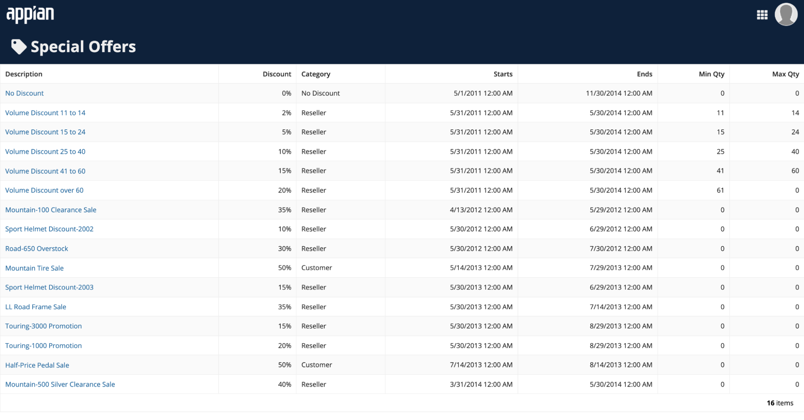
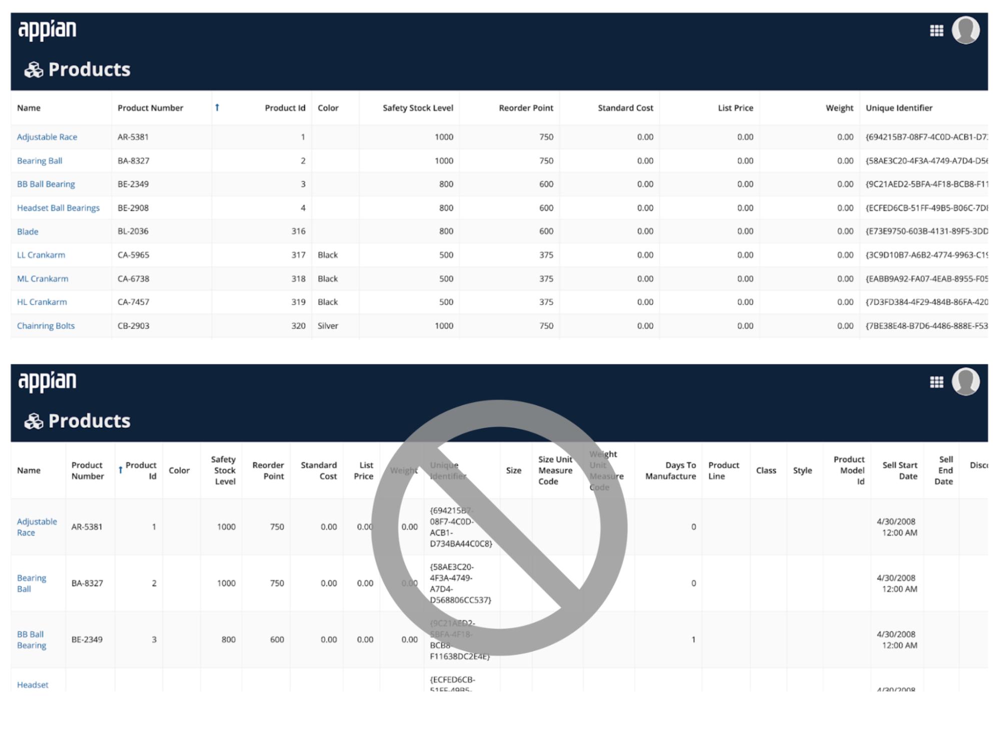
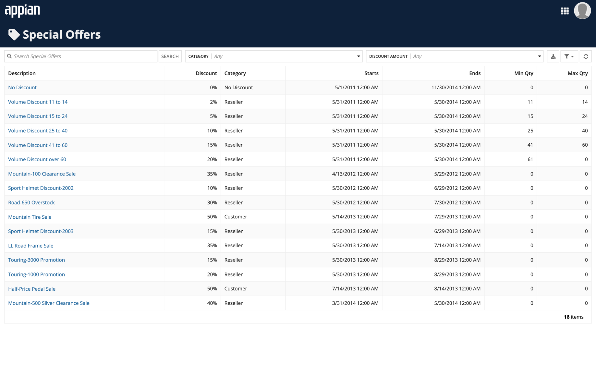

# Tabular Data Display [SAIL Design System: Patterns]

*Section: patterns | source: https://docs.appian.com/suite/help/26.7/sail/tabular-data-display.html | images referenced live in corpus/images/*

# Tabular Data Display

Consider best practices for showing data in grids.

## List-style grid

This style of tabular data layout is designed to fit within the width of the containing page or page column without horizontal scrolling.

Its most common use is as a list of records or other data set, featuring links to drill into item details.

When configuring width for a list-style grid:

- Use "Auto" width on all columns to allow the grid to automatically set column widths based on their contents, as in this example.

- Use weighted column widths to set proportional widths across columns. For example, "3x."

- See the grid design guidance for more details on column width configurations.

## Spreadsheet-style grid

This style of tabular data layout is intended to feature fixed widths for each column, with horizontal scrolling to overflowing grid columns when they don't fit within the containing page or page column.

Use this style for data-rich grids where the primary use is analysis, not navigation.

When configuring width for a spreadsheet-style grid:

- Set a fixed width, such as "Narrow" or "Medium," for all columns in a spreadsheet-style grid.

- Choose a width that is appropriate for the length of the column header label and typical row contents.

- Do not set "Auto" or relative widths, such as "3x," for columns in a spreadsheet-style grid as this shrinks the columns in an attempt to fit all of them into the width of the component.

## Grids for smaller device widths

Grids layouts that work well on wide screens may require adjustments for viewing on narrower screens.

In particular, list-style grids featuring columns that distribute available horizontal space on a laptop screen may not be as legible on a phone. Conditionally switch to a spreadsheet-style layout approach, with fixed width columns, for grids that don't fit well in narrow screens.

## User controls on records-powered grids

Configuring a read-only grid to use a record type as its data source allows you to easily enable filtering, search, and export features with a few clicks.

These user controls are also automatically arranged to minimize their footprint on the screen, leaving more space for viewing data.

Always consider this low-code approach before taking on the added effort of building custom user controls from scratch.

