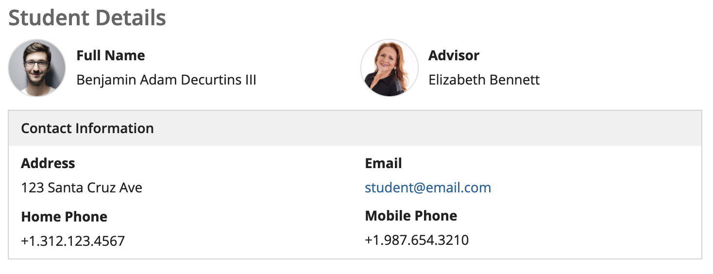
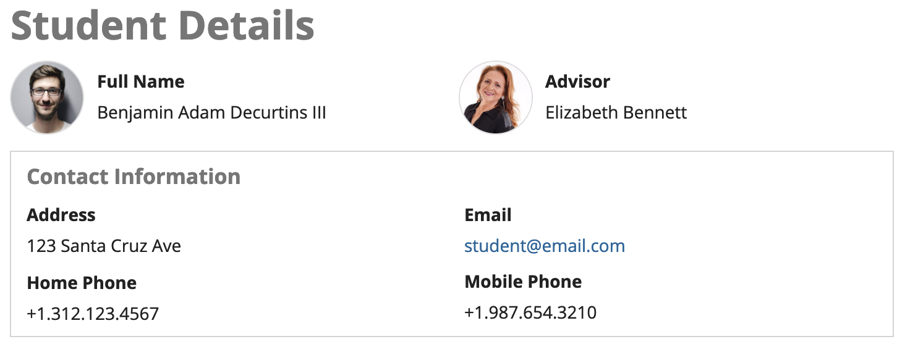
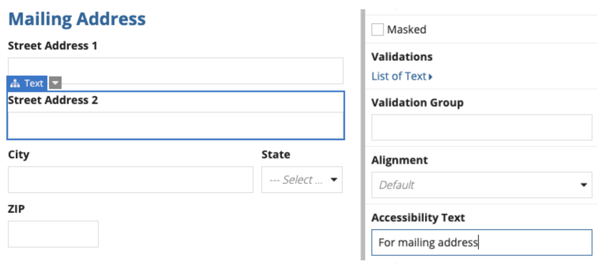

# Accessibility [SAIL Design System: Guidelines]

*Section: guidance | source: https://docs.appian.com/suite/help/26.7/sail/ux-accessibility.html | images referenced live in corpus/images/*

# Accessibility

## Designing user interfaces for accessibility

Appian is committed to providing user interface features that allow the widest audience to benefit from applications built on the platform. The SAIL framework was designed with accessibility as a primary concern, with a goal of functional equivalence for users with low vision, limited dexterity, and other disabilities.

Check out some of our other documentation on accessibility to learn more about:

- The industry standards that guide our accessibility approach.

- Testing applications for accessibility.

While many of SAIL's accessibility features are transparent—designers do not have to do anything special to benefit from them—a number of UI design choices do dictate the quality of experience for people with disabilities. The reference documentation for each interface component highlights relevant accessibility considerations. Also keep in mind the following best practices when designing for all users.

## Always provide a text equivalent

Non-sighted or low-vision users rely on assistive technologies to translate visible UI content into text that is either read aloud or presented as Braille. Information in UI elements that without plain text representation is not automatically conveyed to these users. For example, an image that includes text will only be accessible to sighted users who can see the rendered screen.

Use the alternative text configuration to specify a text equivalent for images and icons; this text will not appear on-screen, but can be read by screen readers. While decorative images without a text equivalent are permissible, crucial data and controls should be expressed with text.

Include accessibility text for read-only grids with conditionally-formatted background colors to explain the significance of each background color.

## Avoid relying on color to communicate information

Color is a useful supplemental technique to help some users comprehend information. For instance, the positive rich text style shows data in green to suggest a gain or success. However, users with limited vision or those with certain types of color blindness would not benefit from this differentiation. Never assume the ability to identify colors in order to complete a task. For example, instructions to "Click the red button to continue" would not be accessible.

For users with low vision, there is an Accessibility option in User Settings where they can enable fill patterns on column, bar, and pie charts.

## Explicitly describe form inputs

Accessibility is automatically optimized when using the label, instructions, and validation message configurations of interface inputs. The framework takes care of letting screen reader users know the relevant description of the currently-focused field. However, accessibility may suffer when a designer relies solely on the visual representation of a rendered screen to make a form comprehensible. For example, close proximity of instructions to an input on-screen may help a sighted user fill out the form correctly, but a visually-impaired user would not benefit from that context unless the information is explicitly associated with the field.

Even when choosing not to show a visible field label on-screen, designers can use the "Hidden" label position to make label text available only to screen reader users.

## Use accessible headers

Box labels, section labels, and headers help users understand the structure of information on a page. Although colors, styles, and sizes for rich text items may be used to mimic the appearance of a header, screen readers will not interpret this formatted text as section headers. Instead, use section headers and heading fields to accurately represent the structure of page content.

 **[DO example]**

Use sections, boxes, and the headings to clearly outline page structure

 **[DON'T example]**

Don't use rich text items to mimic the appearance of a header. You can use the heading component to configure the colors, size, and font weight for a header.

Use the "Accessibility Heading Tag" parameter in heading fields and section headers to ensure screen readers properly announce page structure. The accessibility heading tag allows screen reader users to understand how content is organized on a page and to easily navigate between different sections.

By default, section labels map to the following:

| Section Label Size | Accessibility Heading Tag |
| --- | --- |
| Extra Large | H1 |
| Large Plus | H1 |
| Large | H1 |
| Medium Plus | H2 |
| Medium | H2 |
| Small | H3 |
| Extra Small | H4 |

Depending on the hierarchy of sections on the page, the section label sizes and default heading tags may not be representative of your page organization. For example, if you have a section using an "Extra Large" label and a nested section using a "Large" label, the accessibility heading tag for the "Large" label should be changed from H1 to H2. Make sure that your section label heading tags accurately represent page structure using the proper H1 through H6 values.

By default, heading fields map to the following:

| Section Label Size | Accessibility Heading Tag |
| --- | --- |
| Large Plus | H1 |
| Large | H2 |
| Medium Plus | H3 |
| Medium | H4 |
| Small | H5 |
| Extra Small | H6 |

Depending on the hierarchy of headings on the page, the heading sizes and default heading tags may not be representative of your page organization.

## Use accessibility text to provide supplemental information

The "Accessibility Text" parameter allows designers to specify text on a field or layout that will be read by screen readers in addition to the label and instruction text.

For example, consider a form with "Mailing Address" and "Shipping Address" sections. A sighted user will have the benefit of seeing the corresponding section label in close proximity while filling out each field. But, a screen reader user may benefit from a more direct reminder of the current section.

By specifying "For mailing address" as the accessibility text for the "Street Address 2" field, a screen reader will read out, "Street Address 2, For mailing address" (the label followed by the accessibility text).

## Announce status messages with the message banner component

Use the message banner component to announce important information to users of assistive technologies.

Use the *announceBehavior* parameter to control how assistive technologies, like screen readers, announce the message banner's text.

The following table explains each option and when to use it.

| Option | Behavior | Use When | Example |
| --- | --- | --- | --- |
| "DISPLAY_AND_ANNOUNCE" | Shows the banner and announces the message when the component is evaluated. | To display a banner for status messages that convey important and timely information regarding a change in page content. | A success message that confirms that a form was submitted. |
| "DISPLAY_ONLY" | Shows the banner but does not announce the message when it appears. The message is only announced if a user navigates to it. | For information that is static and doesn't appear based on a change in the interface. | A banner at the top of a form that provides instructions. |
| "ANNOUNCE_ONLY" | Hides the banner but announces the message when the component is evaluated. | To announce a visual change that a screen reader user would otherwise miss, or to pair an announcement with your own custom-built banner. | Adding or deleting a row in a grid. |

``
 
 
 
 
 
 ``
 
 
 
 
 
 ``

### Avoid overusing announcements

The `"DISPLAY_AND_ANNOUNCE"` and `"ANNOUNCE_ONLY"` options create a "live region" that instructs screen readers to politely announce updates without interrupting the user's current task or shifting the user's focus. Because these live announcements can be disruptive if overused, you should reserve them for important and dynamic changes that are essential for the user to understand what's happening on the interface. For any static or non-critical messages, use `"DISPLAY_ONLY"`.

## Provide consistent help and assistance

If you provide a help mechanism that is repeated on multiple screens in your application, position the help mechanism in the same relative location on each page. This assists all users in looking for help to complete tasks, including those who may have a cognitive or learning disability.

Typical help mechanisms include:

- Human contact details like a phone number, email address, or hours of operation.

- Human mechanisms like a messaging system or contact form.

- Self-help options like an FAQ, "How do I…", or Support page.

## Make it easy to re-enter previously entered information

When a user is asked to complete a multi-step process with inputs, some information entered in one step may be needed again in the same process. In those cases, the information should either be auto-populated or available for the user to select. This assists users who have cognitive or mobility disabilities in completing a multi-step process.

For example, it is common for a user's billing address and shipping address to match. You could add a checkbox that auto-populates the billing address details in the shipping address fields and prevent unnecessary work for the user.

Note that this does not mean you must store information between sessions.
