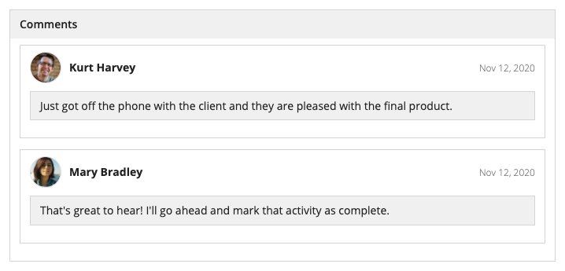
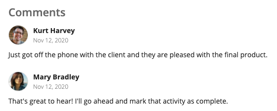
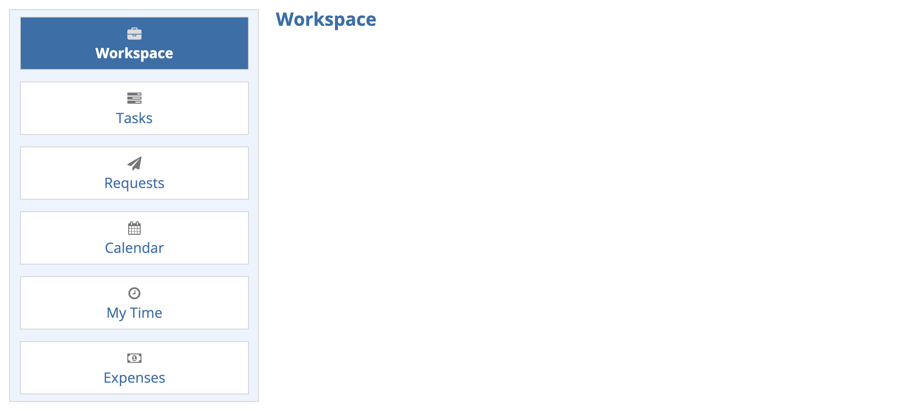
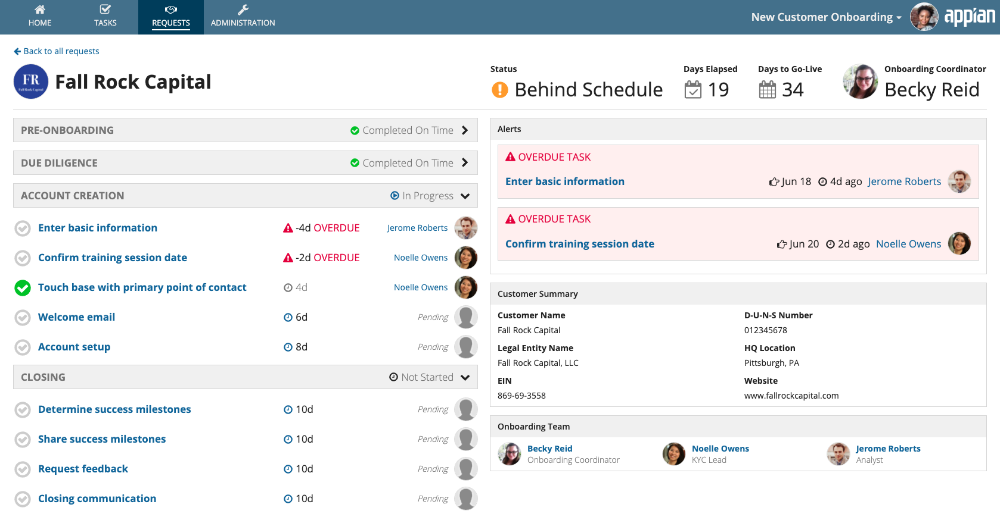
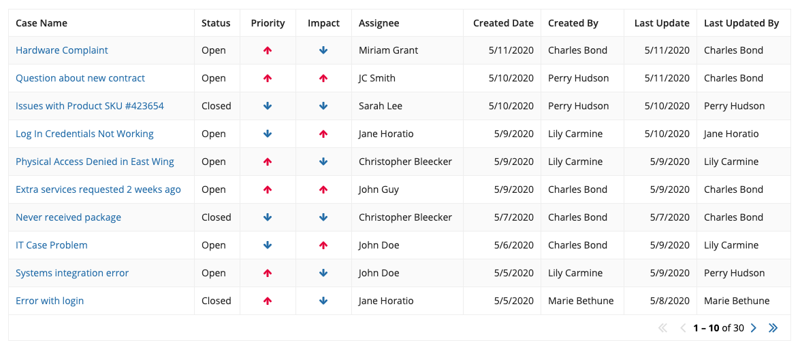
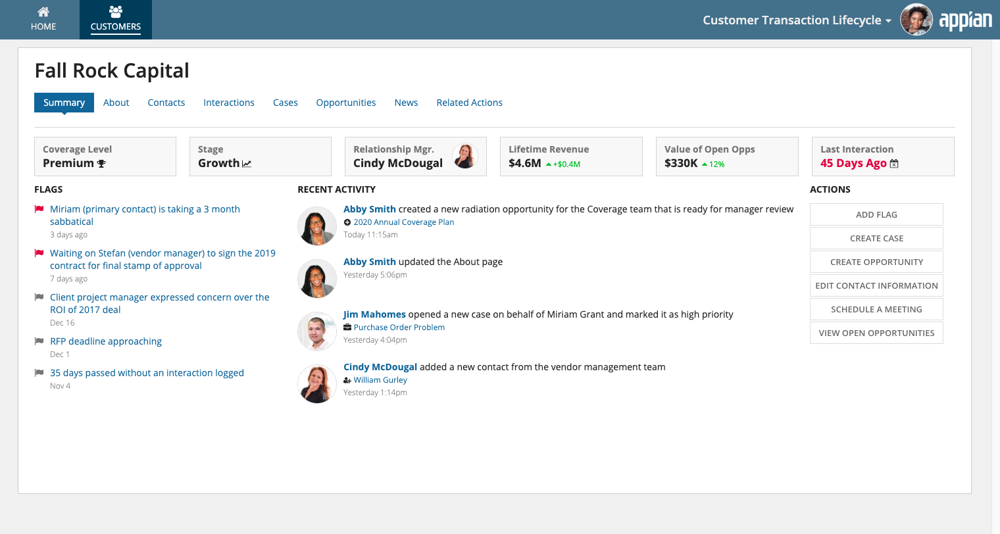
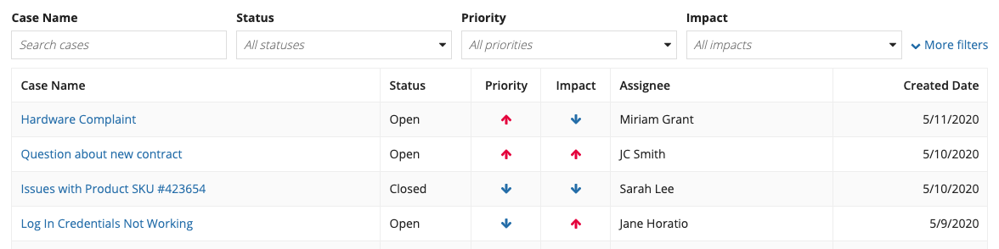

# Avoiding Clutter [SAIL Design System: Guidelines]

*Section: guidance | source: https://docs.appian.com/suite/help/26.7/sail/ux-avoiding-clutter.html | images referenced live in corpus/images/*

# Avoiding Clutter

## Introduction

Visual clutter is a common cause of inefficient user interfaces. When certain interface components are used superfluously or when interfaces are designed without considering the right amount of information for the intended audience, the additional cognitive load slows users down and distracts from the task at hand.

## Avoid nested cards and boxes

Because card layouts and box layouts have borders, they are effective for grouping together information. However, when these layouts are nested (ie., a card or box is placed inside another card or box), the borders often hinder comprehension by adding unnecessary visual clutter.

 **[DON'T example]**

Multiple levels of borders make it more difficult for users to parse information

 **[DO example]**

Borders are not necessary when there is a clear delineation of items. The user photo and bold name clearly signal the beginning of a new entry, and whitespace can be used to convey structure without adding clutter.

 **[DON'T example]**

Don’t place a list of selectable cards within a wrapper card. This makes it harder to understand which card is selected.

 **[DO example]**

An unnested representation is cleaner and more quickly understandable

## Use billboards sparingly

Although they can add visual appeal to a page, billboards are another common culprit of unnecessary clutter. When designing a user interface, consider whether it needs the addition of a decorative photo or block of color. Oftentimes, subtle visual elements make the page look appealing without the clutter of an unimportant billboard.

Users’ eyes naturally start at the top of the page, so it’s especially important to use this valuable real estate effectively. When used inappropriately, billboards can be distracting and waste screen space.

 **[DON'T example]**

The details of some background images can make overlay contents hard to read. In this example, the text within the image competes with the content of the overlay, resulting in a cluttered look.

 **[DO example]**

Use subtle visual elements like icons, user avatar images, and rich text to add visual appeal without wasting space or creating clutter

## Utilize navigation and progressive disclosure

Another way to avoid clutter is to reduce the amount of information displayed on the screen at one time. When reviewing a cluttered interface, ask these two questions:

- **“What information can be moved to a related page that’s one click away?”** Eliminate clutter on the interface by providing a navigation control that allows the user to view this information on a separate page.

- **“What information can be hidden initially and available behind a control?”** Reduce clutter by hiding this information until the user needs it. This pattern is known as progressive disclosure.

 **[DON'T example]**

Don’t try to pack in as much information as possible into a grid. Instead, consider what information the user needs on the page, and what information can be shown after selecting an item.

 **[DO example]**

Use familiar navigation controls to limit the amount of information presented at one time. In this example, the tabular navigation for record views allows users to find information about customer contacts, interactions, and cases when they need it.

 **[DO example]**

Provide dynamic links that allow users to see more information when they need it. In this example, less commonly used filters are available behind a control.
