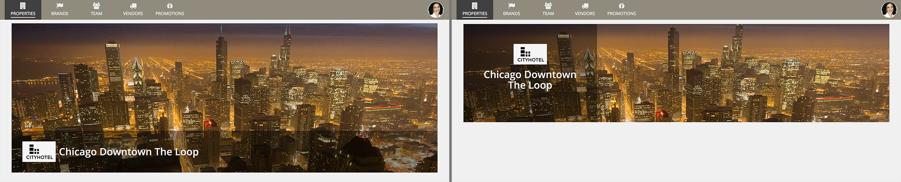
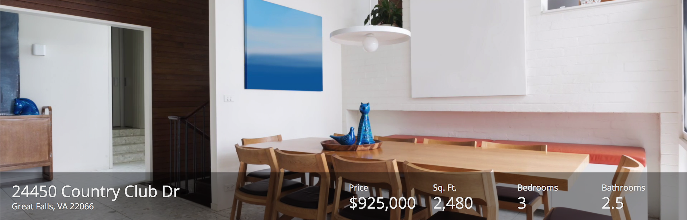
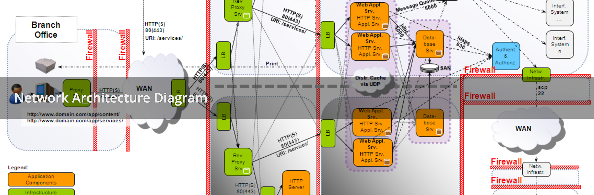
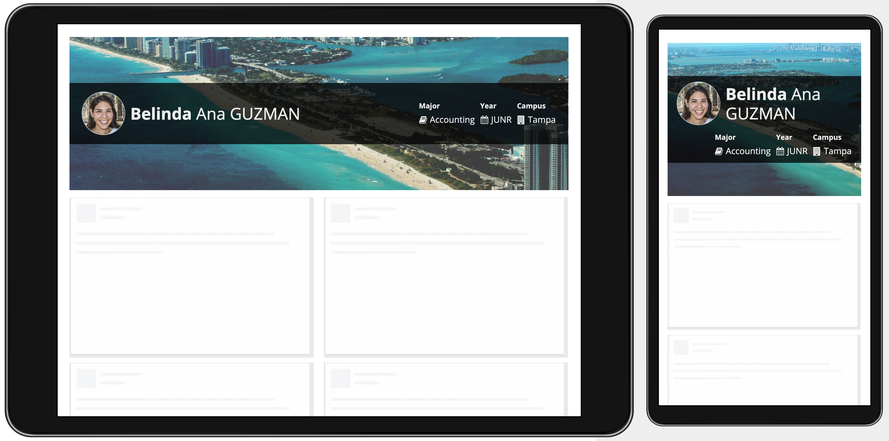
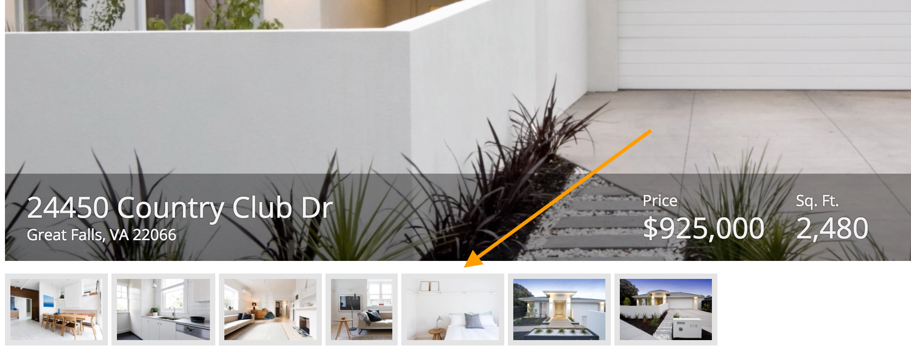

# Billboard Layout [SAIL Design System: Components]

*Section: components | source: https://docs.appian.com/suite/help/26.7/sail/ux-billboard-layout.html | images referenced live in corpus/images/*

# Billboard Layout

## When to use a billboard layout

Use a billboard layout to show content overlaid above a decorative background color, photo, or video. The height of the billboard can be configured, as well as the position of the overlay. Choose an overlay background style ("Dark", "Light", or "None") to make sure that content can be easily seen against the selected background. Note that standard text color is automatically switched to white for improved legibility when the "Dark" style is selected.

*A variety of size and style configurations allow designers to tailor how content is displayed on top of a decorative background in the billboard layout*

 **[DO example]**

Use billboards to add visual interest and richness to pages. Choose backgrounds that complement, but don’t distract from page content.

 **[DON'T example]**

Don’t use a billboard to show informational images or videos which users need to review. Billboards with a fixed height may crop the background content. Overlay content could also obscure part of the background. Use an image or video component instead if the intent is not solely decorative.

## Overlay style

 **[DO example]**

Use the full overlay style to reduce visual clutter when overlay contents cover up most of the background image

 **[DON'T example]**

Avoid using a bar overlay style for a group of billboards with varying content sizes. This results in inconsistent height and visual clutter.

## Billboard height

Choose the “Auto” height for a billboard to make the entire background image or video visible. As the billboard width increases, the height will increase accordingly.

*“Auto” height varies across different screen widths*

Choose one of the fixed height options (“Extra Short”, “Short”, “Short Plus”, “Medium”, “Medium Plus", “Tall”, “Tall Plus”, or “Extra Tall”) for a consistent billboard height across all screen sizes. Background images and videos will be cropped automatically to fit within the specified height.

*A fixed height remains the same across different screen widths*

## Billboard spacing

Select the “Standard” margin below value to create vertical space between billboards and other contents below.

## Background media position

Choose the horizontal and vertical positions to keep the most important parts of your background media visible in various orientations and screen sizes. For example, if your background media has a logo or call to action in the upper left corner, choose "LEFT" for the horizontal positon and "TOP" for the vertical position.

## Ensuring sufficient contrast

Legibility of information displayed within a billboard layout depends on the interplay between the content style, overlay style, and background media. For example, if negative-style rich text (red) is displayed in an overlay with style of "None" (transparent) above a background color of red, then the text would not be readable.

Consider the following guidelines when designing for maximum contrast:

- Try the various overlay styles to see which one creates the best balance between visibility of the background media and legibility of the overlay contents.

- In general, use the "Light" and "Semi-Light" overlay styles with lighter backgrounds and the "Dark" and "Semi-Dark" styles for darker images and videos. Use a transparent overlay style of "None" only when the background content/color is known to provide sufficient contrast with the overlay content.

- It is generally more difficult to guarantee good legibility for content displayed above a busy, high-contrast image or video.

- When the overlay style is "Dark" or "Semi-Dark", standard text color is automatically switched to white. When the overlay style is "Light" or "Semi-Light", standard text color is automatically switched to a dark gray.

- When the overlay style is "None", the standard text color changes based on the selected background color. For light background colors, standard text is dark gray. For dark background colors, standard text is switched to white. This is true even when background media is set.

## Performance considerations

Provide images and videos with appropriate resolution and quality for the display size. But also be aware that users with bandwidth constraints may see an empty billboard background before media loads completely–avoid unnecessarily large downloads.
