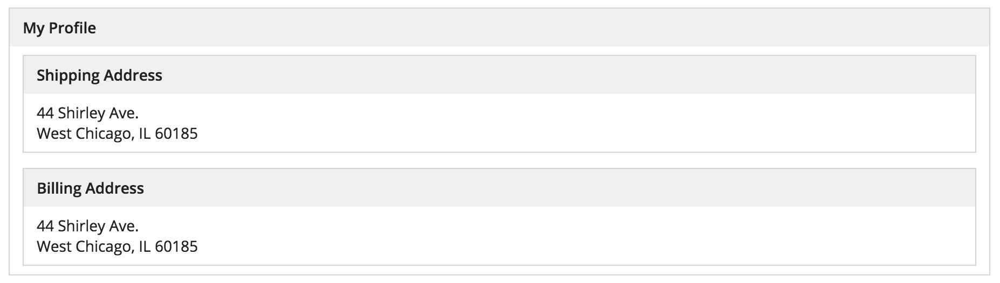
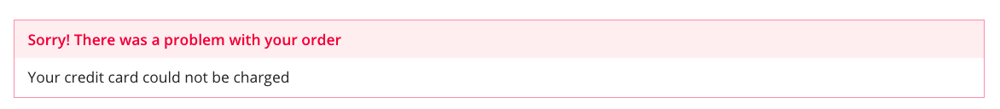
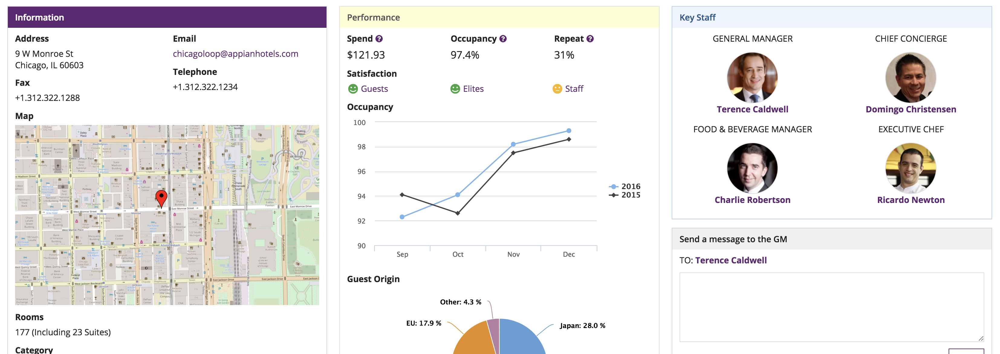
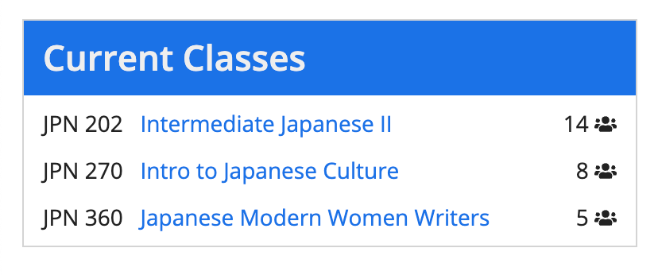
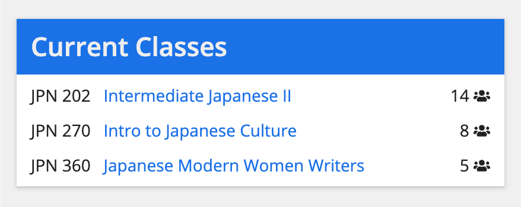

# Box Layout [SAIL Design System: Components]

*Section: components | source: https://docs.appian.com/suite/help/26.7/sail/ux-box-layout.html | images referenced live in corpus/images/*

# Box Layout

## When to use a box layout

Use a box layout to create a strong visual grouping of related components. Each box consists of a title bar and can have a border or shadow. Specify a concise heading in the title bar to describe the box contents.

Use box layouts sparingly as they may make pages look more cluttered. Choose a simpler design if a box layout would not help users to better comprehend the UI.

 **[DON'T example]**

Don’t nest box layouts within other box layouts as this creates a cluttered interface

Below are some examples of how box layouts may be used effectively.

## Highlight key information and controls

Use a box layout to draw attention to particular portions of a form such as important prompts or error messages. Choose the appropriate style for the content of the box. For example, use "ERROR" to tell the user about a problem.

## Designate primary content sections

Use box layouts *instead* of section layouts to organize and describe main content sections on a page. This approach results in a heavily-compartmentalized page design that may not be appropriate for all use cases. Choose this method if it is very important for users to notice the distinction between content sections. Examples include longer forms where grouping questions into box layouts will help keep users from feeling overwhelmed, and dense dashboards where boxes break information up into digestible chunks.

Avoid mixing box layouts and section headings as that may make it harder for users to understand the structure of the page.

Also avoid mixing box styles for decorative purposes. Styles such as "WARN" and "ERROR" are intended to help draw attention to a single box shown in an interface. When using multiple box layouts to organize a page, the "STANDARD" and "ACCENT" styles are most appropriate.

 **[DO example]**

Use the same style for all boxes when they represent page sections (generally, "Standard" and "Accent" styles work best)

 **[DON'T example]**

Don't mix box styles on the same page

## When to use borders and shadows

Don't use borders and shadows together. Use either borders or shadows, depending on the header content layout background color.

 **[DO example]**

On white page backgrounds, use borders without shadows for the best look.

 **[DO example]**

On transparent page backgrounds, use shadows without borders to help the box layout stand out more.
