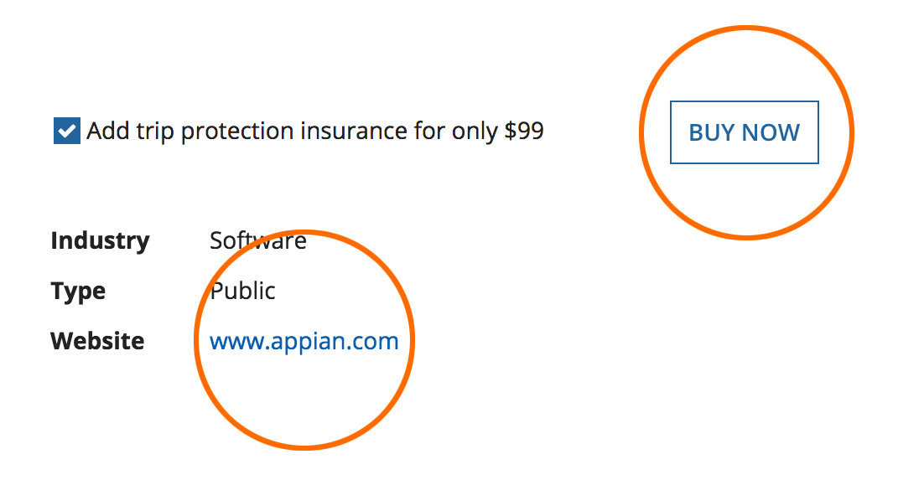
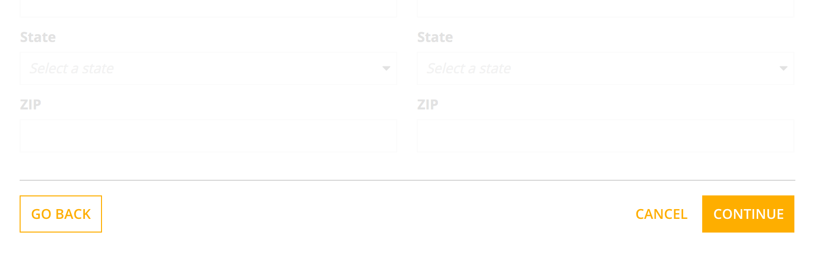
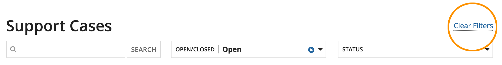

# Buttons vs. Links [SAIL Design System: Guidelines]

*Section: guidance | source: https://docs.appian.com/suite/help/26.7/sail/ux-buttons-vs-links.html | images referenced live in corpus/images/*

# Buttons vs. Links

## When to use buttons versus links

In general, buttons are for taking actions, and links are for navigation.

However, form footer buttons are appropriate for *submission*, *cancellation*, and *stepping back*, even though there is a navigation result to those actions.

Links may be used for localized actions, such as expanding collapsed text where a button would be too prominent.

