# Buttons [SAIL Design System: Components]

*Section: components | source: https://docs.appian.com/suite/help/26.7/sail/ux-buttons.html | images referenced live in corpus/images/*

# Buttons

## Styles

By default, use "Outline" button styling.

Don't rely on the styling of buttons to convey their meaning. Use text labels that convey sufficient information to users who cannot see the button.

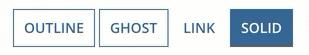 *(animated GIF)*

### Solid

"Solid" button styling draws attention to the most common action on an interface to speed up user interactions.

Assume that many users will be biased toward selecting the solid button; make sure to limit side effects of mistakes.

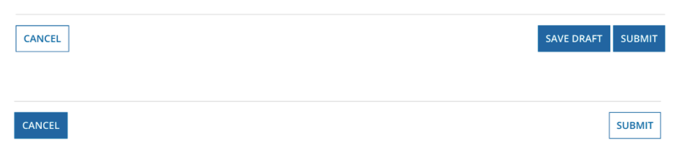 **[DON'T example]**

Don't show more than one solid button on an interface.
Don't use "Solid" styling for buttons that delete data or cancel the user's current activity.

### Ghost

"Ghost" style emphasizes interactivity. Initially they look like outline buttons, but on focus they become solid. In cases where the solid style is too visually disruptive, use the ghost to emphasize a key action.

This style can be used in combination with the "Negative" color to emphasize a destructive action.

### Link

Use the "Link" style to de-emphasize less common actions. The "Link" style should be used sparingly.

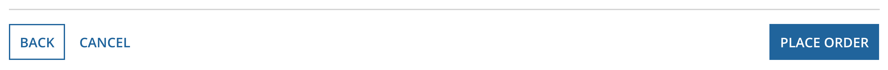 **[DO example]**

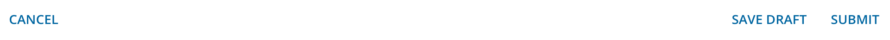 **[DON'T example]**

Avoid having more than one "Link" style button in a group

## Colors

By default, buttons use the configured accent color. The accent color can be defined for a site or portal, which helps create a consistent look.

Most buttons should use the accent color, or one of the other pre-configured colors depending on the action they trigger. Avoid using more than one custom button color on an interface.

Similar to styling, don't rely solely on color of buttons to convey their meaning. Use text labels that convey sufficient information to users who cannot see the button.

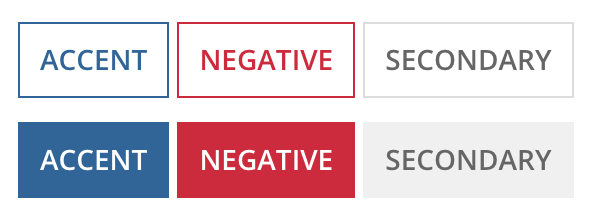

### Secondary

"Secondary" button styling is gray, it is used for actions that need to be differentiated from form submission buttons or for less common actions on an interface. This color should be used in combination with "Outline" and "Link" styles as they are also more subdued.

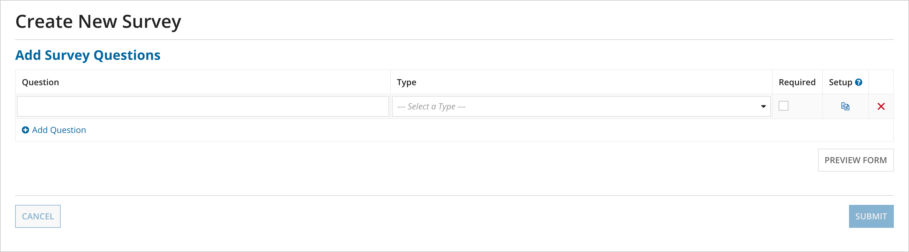 **[DO example]**

Use "Secondary" color for inline buttons within the body of a form

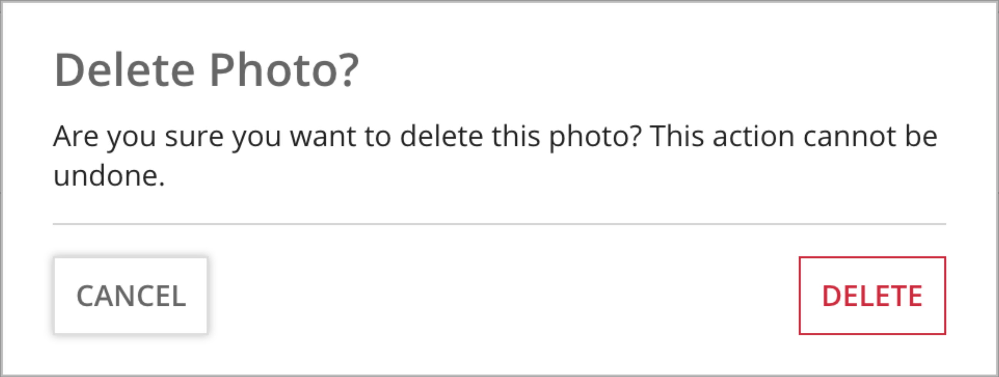 **[DO example]**

Use "Secondary" color, instead of the accent color, for buttons alongside a destructive action

### Negative

"Negative" button color highlights actions that result in loss of persisted data.

This color can be used in combination with the "Ghost" style to emphasize a destructive action.

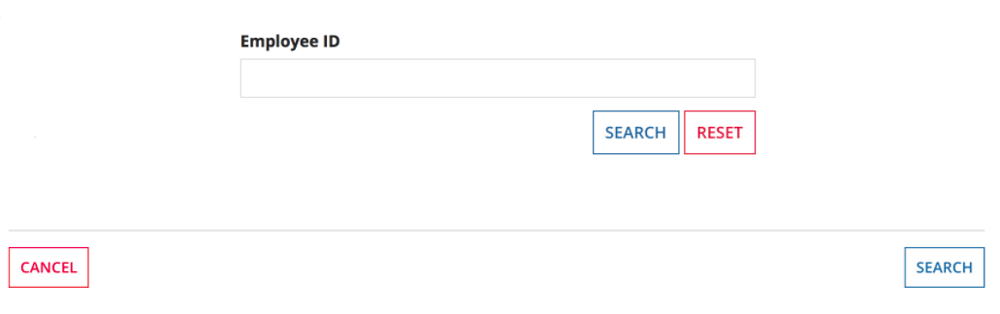 **[DON'T example]**

Don't use the "Negative" color for easily-reversible actions or the removal of information entered by the user while viewing the interface.

## Size

By default, use "Standard" size.

Keep in mind that there is only one button size on mobile devices.

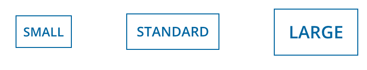

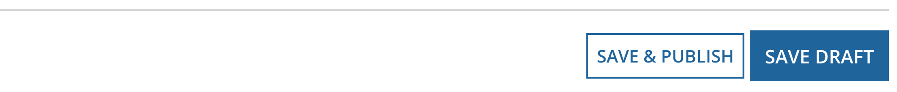 **[DON'T example]**

Don't use more than one size button for a group of buttons

### Small

Use "Small" button size with "Secondary" color to differentiate inline buttons, such as grid toolbars, from form submission buttons.

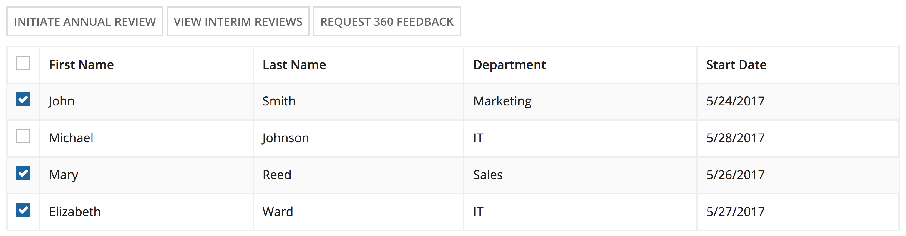

When using buttons in a columns layout or side-by-side layout, use "Small" button size to match the height of other interface components, such as a text box or dropdown.

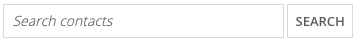

### Large

Use "Large" button size to draw more attention to the main action on the page.

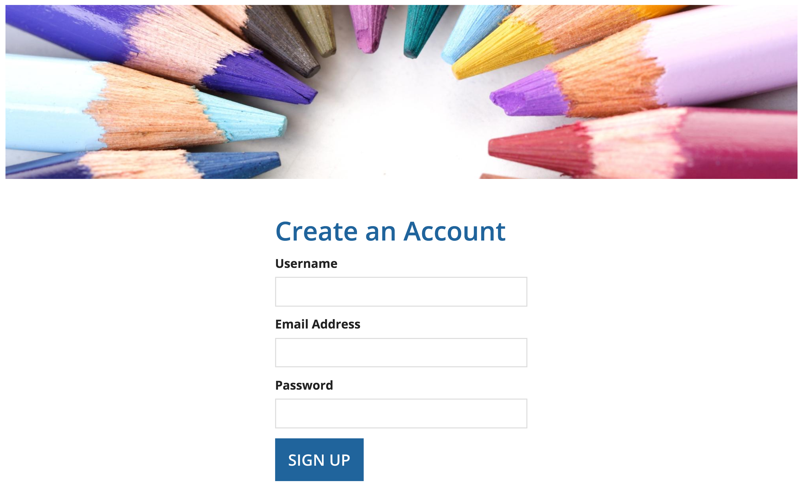

## Width

By default, buttons are "Minimize" width everywhere except for mobile browsers and phones, where they are "Fill" width.

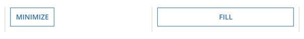 **[DON'T example]**

Avoid using more than one button width for a group of buttons.

### Minimize

Use the "Minimize" button width when you want the button to be as wide as the content inside.

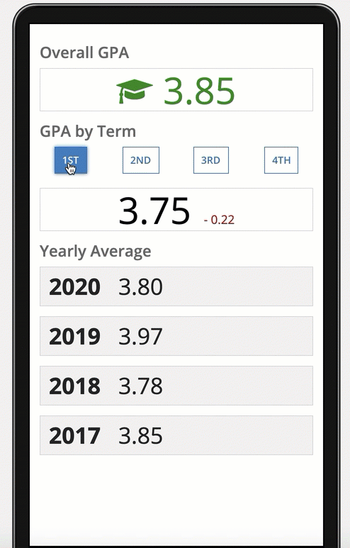 **[DO example]** *(animated GIF)*

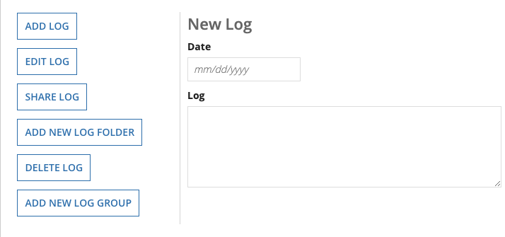 **[DON'T example]**

Avoid using "Minimize" for a list of stacked buttons that have different text widths.

### Fill

Use "Fill" button width to make the buttons as wide as the container that they're in. Use "Fill" with responsive interfaces, such as those where the buttons should stack and/or fill their container depending on page size.

You should also use "Fill" to make a list of stacked buttons a uniform width.

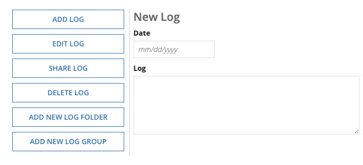 **[DO example]**

**Note:  **If the buttons that you want to display in a list represent record actions, use the record action component's sidebar style to automatically format your buttons in this way.

## Loading indicator

Use the "Loading indicator" parameter on buttons that may trigger longer processing times. For example, data retrievals, integration calls, or large data submissions. The indicator lets users know that their request is loading so that they don't click the button twice or refresh the page.

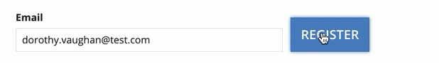 **[DO example]** *(animated GIF)*

## Labels

If possible, use a verb that best describes the button action (e.g. "Approve") instead of a generic label (e.g. "Submit").

For wizards, use a "Next" or "Continue" label to indicate that additional steps remain.

## Button shape and capitalization

By default, all buttons have a squared shape and use uppercase capitalization for labels.

Button shape and button label capitalization can be controlled in the **Branding** section of site and portal objects. These settings apply to all interfaces that display in the site or portal.

When editing interfaces, use the Branding preview

menu to choose the site or portal that your interface will display in. This will update all of the buttons in your interface to use the shape and capitalization configured in the site or portal.

### Button shape

The following are the options for button shape that can be configured in site and portal objects.

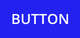

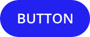

| Shape | Example |
| --- | --- |
| Squared (default) |  |
| Semi-rounded |  |
| Rounded |  |

### Button label capitalization

If you deselect **Use uppercase capitalization for button labels**, you can control button label capitalization in each button component. Be sure to use consistent capitalization across all buttons in your site or portal.

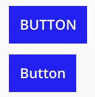

## Icons

Icons can be used in buttons to draw attention. If a button contains an icon but no text, be sure to add a label via the accessibility text parameter for non-sighted users.

In most cases, the icon should be positioned at the start of the text. If a button is used to navigate through multiple screens (like the **Next** button in a wizard), the icon can be positioned at the end of the text to better indicate the direction of the user's flow.

Adding an icon to a button isn't always necessary and can lead to a more cluttered interface, especially when there is already text on the button.

## Location

The form footer button group is only for buttons that submit an entire form or navigate away from the form (Cancel, Go Back, etc.).

Use inline button groups within the interface content for buttons that act on part of the content and do not take the user away from the interface (e.g. buttons as a toolbar for selected items in a grid).

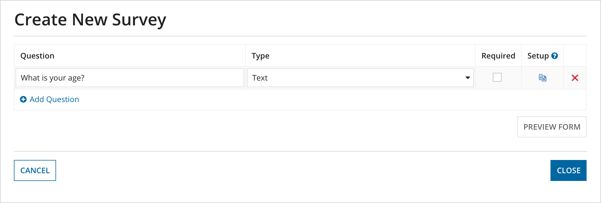 **[DO example]**

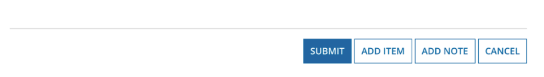 **[DON'T example]**

Don't use "Solid" styling for buttons that delete data or cancel the user's current activity.

## Position

Place all form submission buttons on the right side of the button group. The most commonly-used button should come first (left-most). This button should use the solid style (unless the action deletes persisted data, in which case it should use the ghost style and negative color).

Go back/cancel buttons should be placed on the left side of the button group (back button left-most).

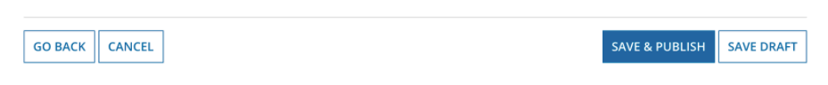 **[DO example]**

## Availability

Buttons that are temporarily unavailable due to the state of form data should generally be disabled, not hidden.

However, if the availability of a large number of buttons changes as users interact with the form, unavailable buttons should be hidden to reduce clutter and allow users to easily see valid options.

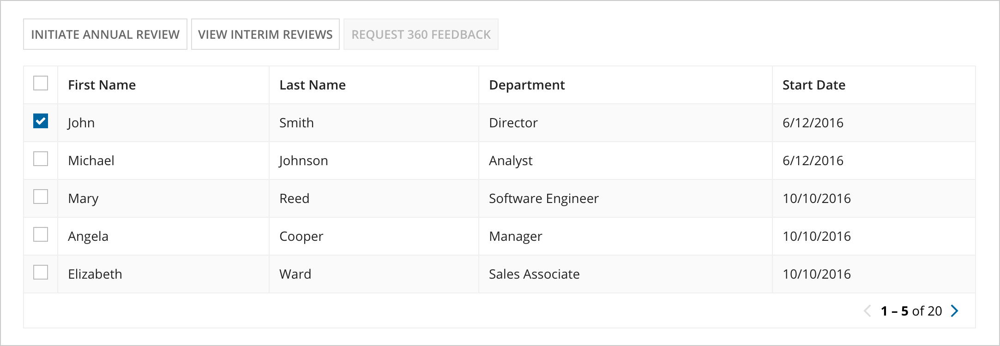 **[DO example]**

## Related actions shortcuts

Use concise titles for related actions to prevent shortcut button label truncation. If additional text is needed to convey the purpose of the action, add descriptive text rather than lengthening the title.

Make only the most relevant related actions to a record view available as shortcuts, no more than 3 if possible.

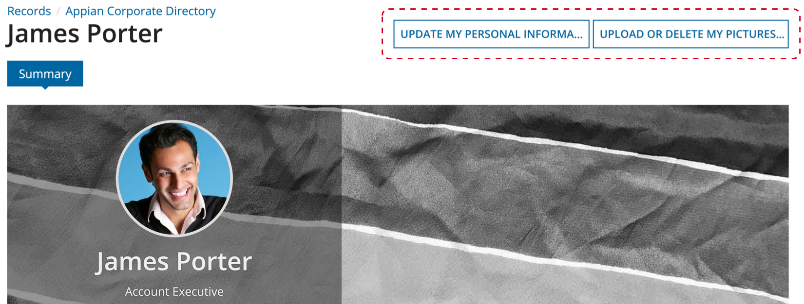 **[DON'T example]**
