# Card Layout [SAIL Design System: Components]

*Section: components | source: https://docs.appian.com/suite/help/26.7/sail/ux-card-layout.html | images referenced live in corpus/images/*

# Card Layout

## Introduction

Cards are configurable components that act as containers for information and data across your interface.

Proper construction and arrangement of card layouts helps you design a UI that is efficient, intuitive, and visually appealing.

This page talks about when to use the card layout, how to use its parameter configurations, and what style guidelines to follow when designing interfaces.

## When to use a card layout

Use cards to display and group content while bringing balance and visual appeal to your interface designs.

In the following examples, notice the difference in page balance. The first example shows how displaying the Open Accounts and Top Expenses sections in card layouts balances the page design while the second example shows what the page would look like without the benefit of displaying each conent group in a card.

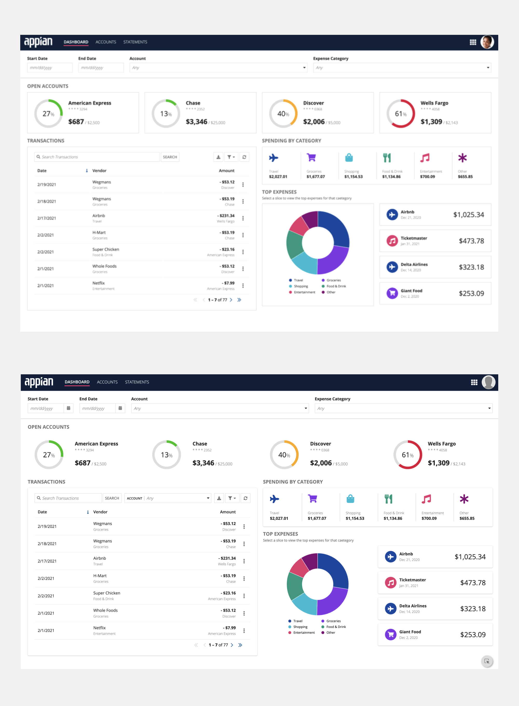

In this next example, four key performance indicator (KPI) values are shown, paired with their corresponding microcharts. Notice how it is difficult to see where one pair ends and the next begins without the use of cards. Using cards to group each value-chart pair makes it easier to scan the related content.

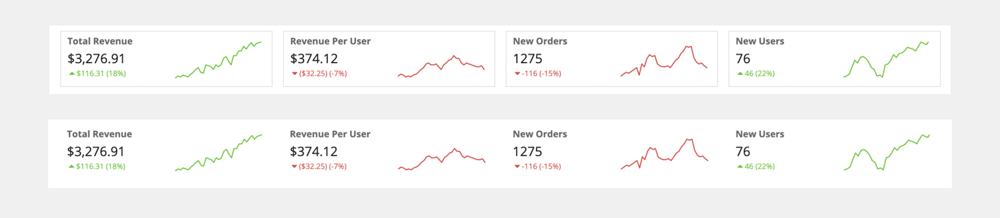

## Parameter configurations

This section highlights variations of the card layout component to help you visualize what's possible for your interface designs.

### Styling configurations

The parameters in this section control how things display for the component.

#### Height parameter

Use the **Height** parameter to set the height of each card.

When set to "Auto" (default), the card height is determined by the height of its contents. When set to a fixed value, the card contents will scroll if they don't fit within the selected height.

Valid fixed values are: "Extra Short," "Short," "Short Plus," "Medium," "Medium Plus," "Tall," "Tall Plus," "Extra Tall."

The following example shows a card with "Auto" height and a card with a fixed value of "Medium-Plus."

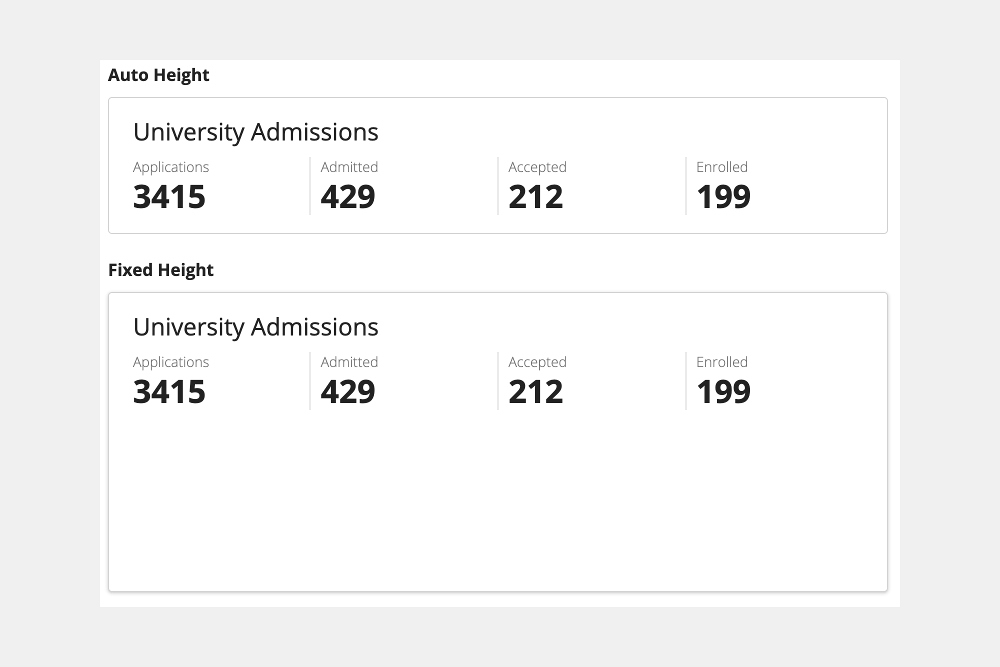

#### Style parameter

Use the **Style** parameter to change the background color of each card.

A card with a style parameter value of "None" (default), shows a white background color.

The style parameter also accepts various pre-defined values for common card background colors.

Valid pre-defined colors are: "None," "Transparent," "Standard," "Accent," "Success," "Info," "Warn," "Error," "Charcoal scheme," "Navy scheme," "Plum scheme."

You can also set a custom color by using a hex code or hex code including transparency. To add transparency to the hex code, add two additional digits between 00 (more transparent) and FF (less transparent).

The following examples show cards with:

- A style parameter value of "None."

- A pre-defined value of "Info."

- A custom color set by using a hex code value of #20124d.

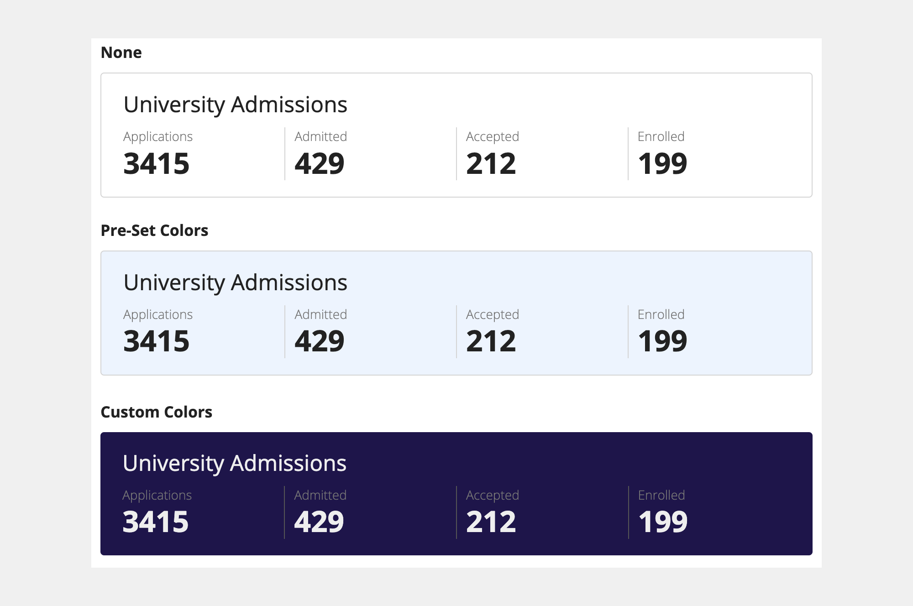

#### Show shadow parameter

Use the **Show Shadow** parameter to add greater visual depth to your cards.

The following examples show what the card layout looks like with a shadow and without a shadow (default).

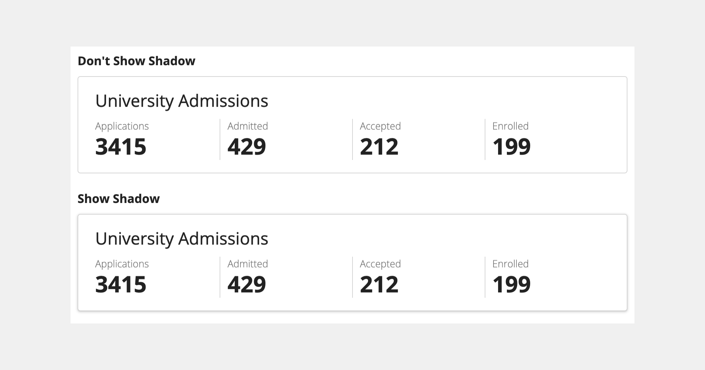

#### Show border parameter

Use the **Show Border** parameter to show or hide the border around your card.

The following examples show what the card layout looks like with a border (default) and without a border.

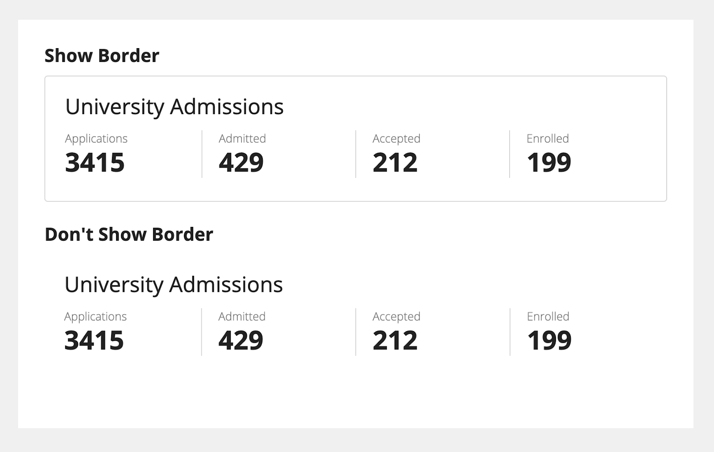

#### Border color parameter

Use the **Border Color** parameter to add additional visual prominence to a card.

Valid pre-defined color values are: "Standard" (Default), "Accent", "Positive", "Warn", and "Negative". You can also set a custom color by using a hex code or hex code including transparency. To add transparency to the hex code, add two additional digits between 00 (more transparent) and FF (less transparent).

The following example shows the difference between a card with a standard border color and a card with an accent colored border.

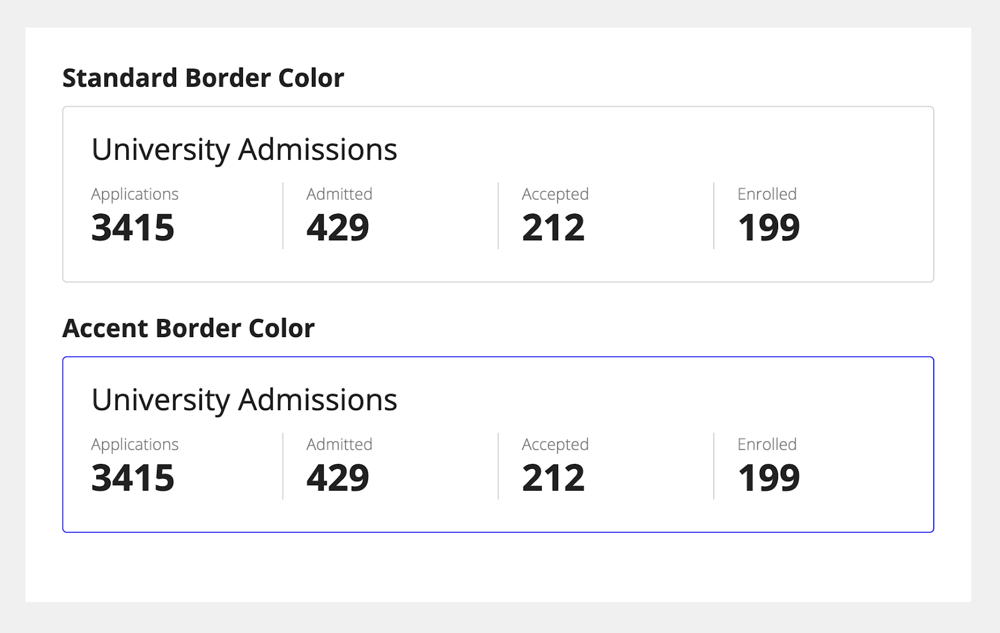

#### Padding parameter

Use the **Padding** parameter to control spacing around card contents.

The following examples illustrate what the spacing around the card contents will look like with each possible setting: "None," "Even Less," "Less" (default), "Standard," "More," "Even More."

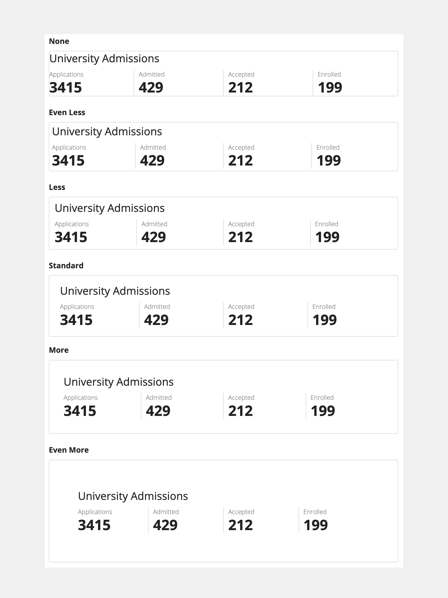

#### Shape parameter

Use the **Shape** parameter to adjust the corner rounding on each card.

The following examples illustrate what the corners will look like with each of the possible settings: "Squared" (default), "Semi-Rounded," "Rounded."

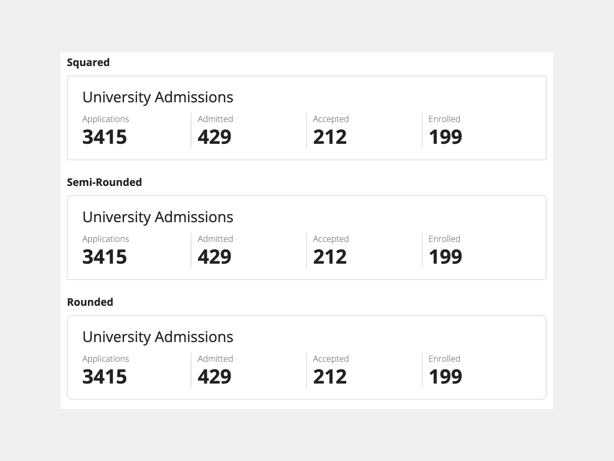

#### Decorative bar position parameter

Use the **Decorative Bar Position** and **Decorative Bar Color** parameters to add a visual highlight to a card and increase its prominence.

Valid position values are: "None" (default), "Top," "Bottom," "Start," "End."

Note that a position value of "Start," means the bar will be positioned on the left side of the card for user languages that read from left-to-right.

Valid pre-defined color values are: "Accent" (default), "Positive," "Warn," "Negative." You can also set a custom color by using a hex code or hex code including transparency. To add transparency to the hex code, add two additional digits between 00 (more transparent) and FF (less transparent).

The following examples show:

- A card with a decorative bar position value of "Start" and a decorative bar color value of "Accent."

- A card with the position value of "Top" and a custom color set by using a hex code value of #674ea7.

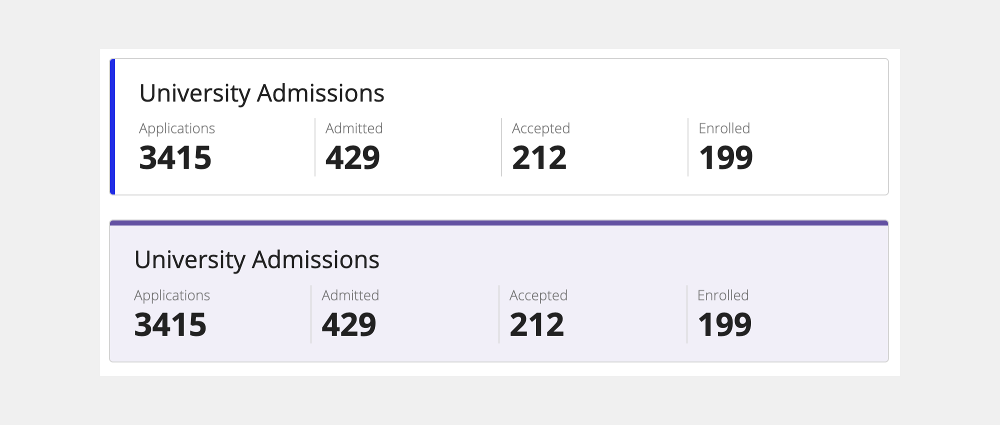

## Style guidelines

This section highlights specific design guidelines and recommendations.

### Shadows and borders

Never use shadows and borders at the same time. When deciding between shadows or borders, the primary consideration is the page background color.

#### Show borders, but not shadows on white page backgrounds

Cards on white background pages look best with borders enabled, but not shadows.

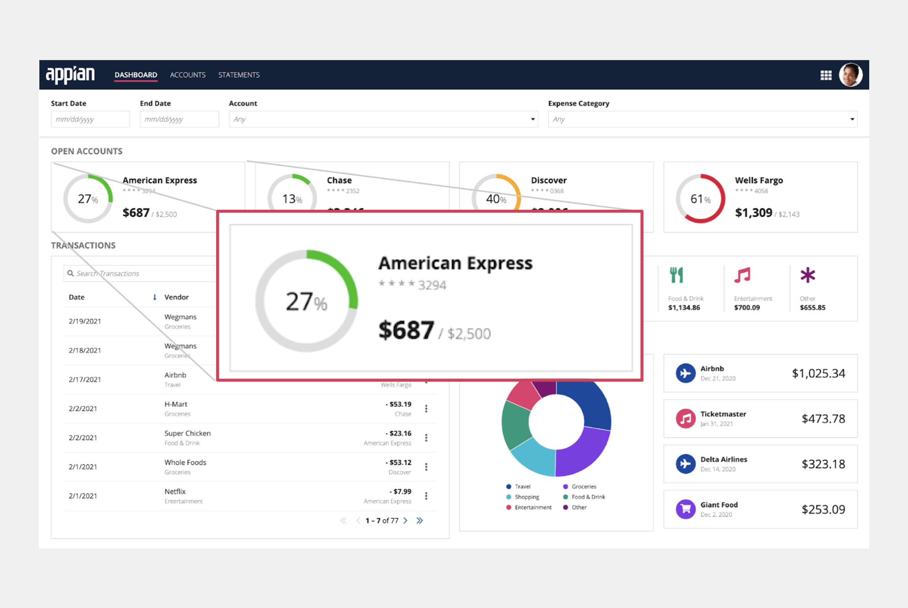

#### Show shadows, but not borders on transparent page backgrounds

Cards on transparent background pages look best with shadows enabled, but not borders.

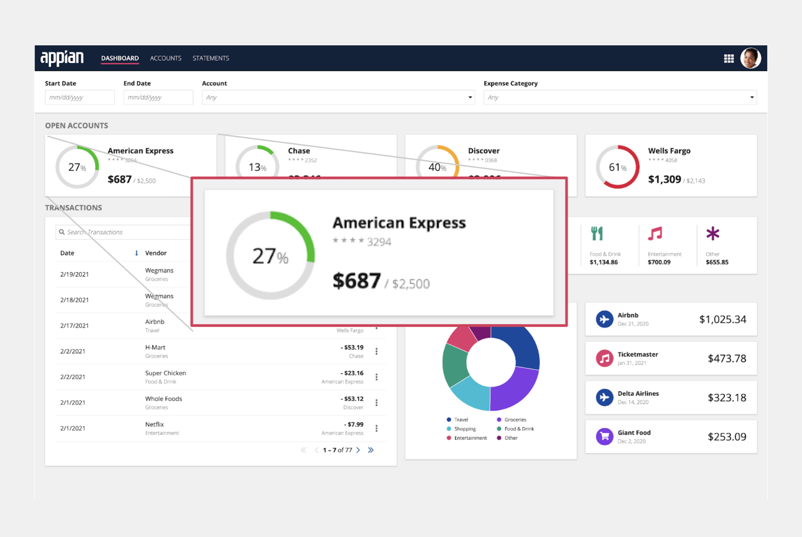

#### Don't show borders or shadows on dark page backgrounds

Cards on dark background pages look best without borders or shadows. Use a slightly lighter tint of the page background color for the card background. You can use our predefined dark color schemes to automatically use a lighter tint for the card background color.

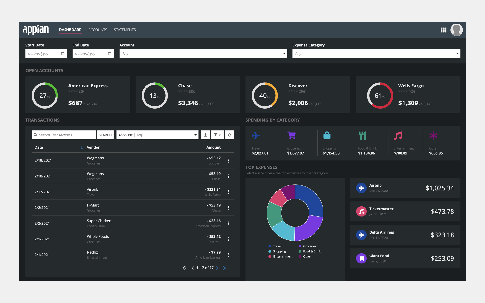

### Card background color

Use the following guidelines to help you choose card background colors.

#### Only use white background color for content cards

The most common usage of the card layout component is for content cards. This means using cards as groups of content on the page rather than alternative usages like headers and buttons.

White background cards are a familiar standard for web interfaces but should only be used for content cards. This advice does not apply to headers or buttons.

On white or transparent pages, avoid using card background colors other than white. On dark-themed pages, use an appropriate card color.

See Limit use of colors other than white for occasional exceptions.

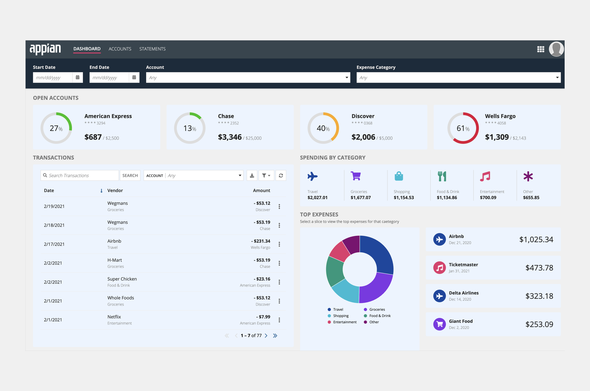 **[DON'T example]**

Avoid using card background colors other than white on pages with white or transparent backgrounds.

#### Limit use of background colors other than white

Card background colors other than white, which corresponds to the style parameter value of "None," may be used in limited cases for emphasis.

In this example, light gray cards are used for dismissible instruction messages. An accent-colored background is used to draw attention to a feature promotion.

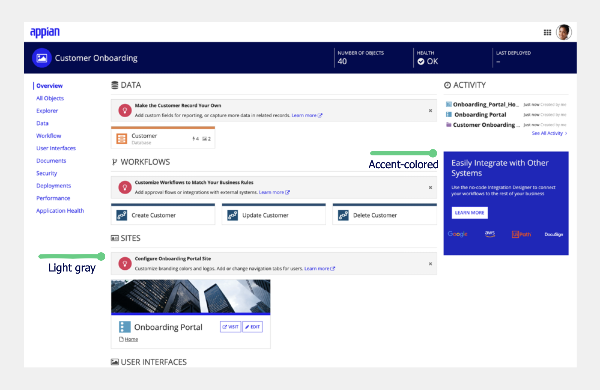

#### Avoid using card background color to denote meaning

For Key Performance Indicators (KPIs) and similar designs, consider using a limited set of meaningful colors to highlight information and data by changing the text color. Use this to bring attention to the card content without overwhelming your users by making the entire card one color. However, be careful that you’re not using color alone to convey meaning and that your text follows all accessibility guidelines.

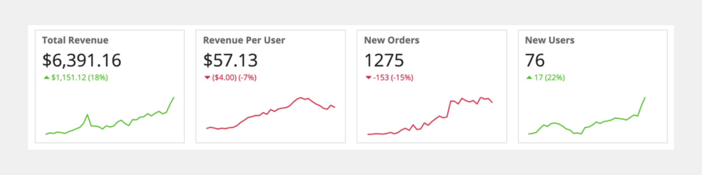 **[DO example]**

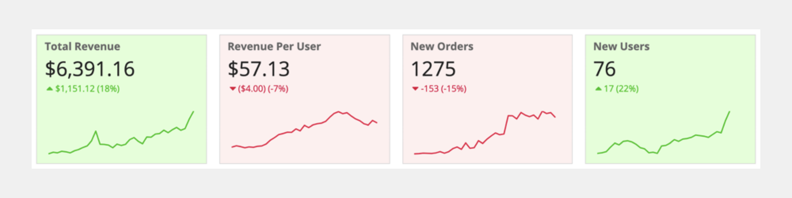 **[DON'T example]**

#### Use transparent style for cards that will be layered on top of variable backgrounds

We generally recommend using white backgrounds for content cards, but you can use the "Transparent" style to allow your cards to blend into any background. This style is great for cards that will appear on multiple interfaces and will be reused throughout an application.

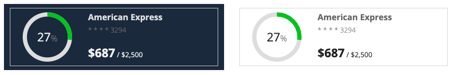

### Page background for card-based pages

Start with a white page background color for card-based pages. Consider a transparent page background for added contrast only if you find that it's hard to comprehend the page structure with a white background.

For pages with lots of white space, avoid transparent page backgrounds. While transparent page backgrounds can provide useful visual contrast against white content cards, the large amount of visible background color draws attention to the empty space when the content doesn't fill the window on a typical user's screen.

 **[DON'T example]**

For pages with a dark background or dark color scheme, use a similar but lighter color in your color scheme for the card background to help the cards stand out.

For more information on using different color schemes with cards, view guidance on dark color schemes and Header Content Layout background color guidance.

### Navigation

Use cards as a simple and effective way for users to navigate an interface. 
Use a card layout and links associated with each card to allow for users to navigate to external links or from page to page similar to a wizard.

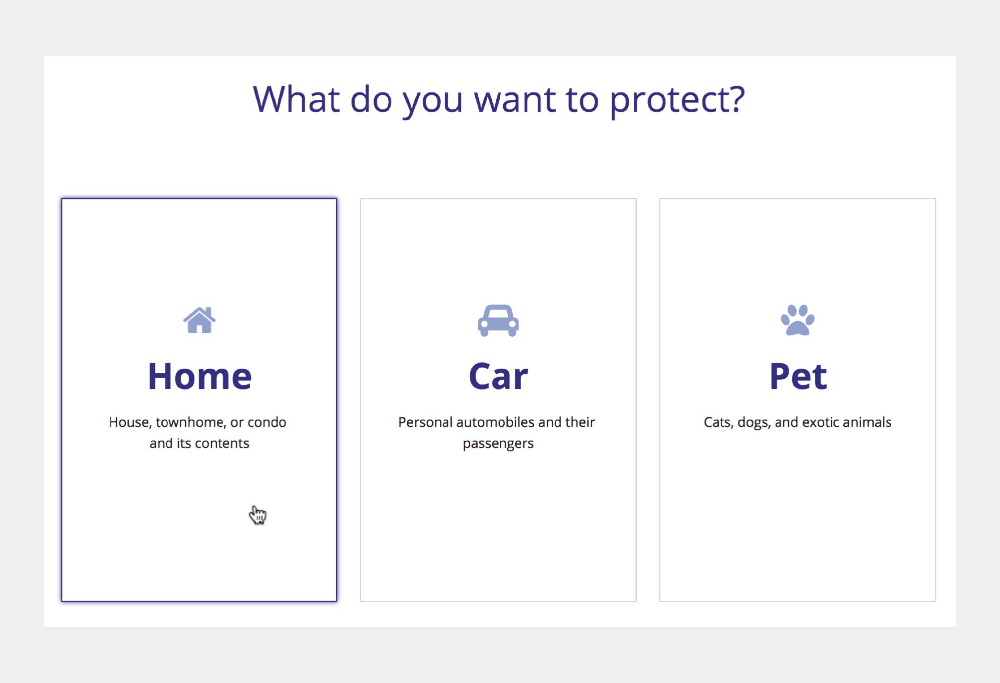 **[DO example]**

Use linked cards to present a set of clear and prominent choices to users

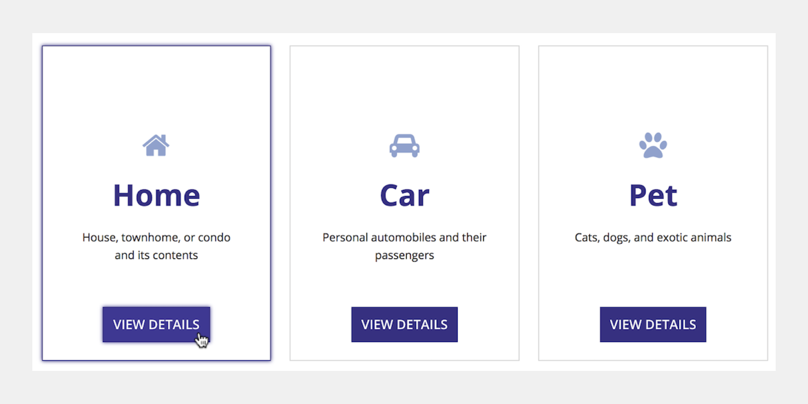 **[DON'T example]**

For accessibility reasons, avoid using interactive components, such as links or buttons, within the contents of the card when the card itself has a link. This may make it difficult for the user to differentiate between clicking on the card or one of the components within the card.

For an example of using cards layouts to display navigation, see the Cards as Buttons pattern.

See the Other components with card styling section for guidelines on how to design interactive components with card styling.

### Card decorative bar

You can use the decorative bar position and decorative bar color parameters to call attention to cards and their content. For accessibility reasons, don’t rely on the decorative bar alone to convey information.

#### Use decorative bar positions consistently

To create a consistent and orderly UI, use the same decorative bar position for all cards on an interface.

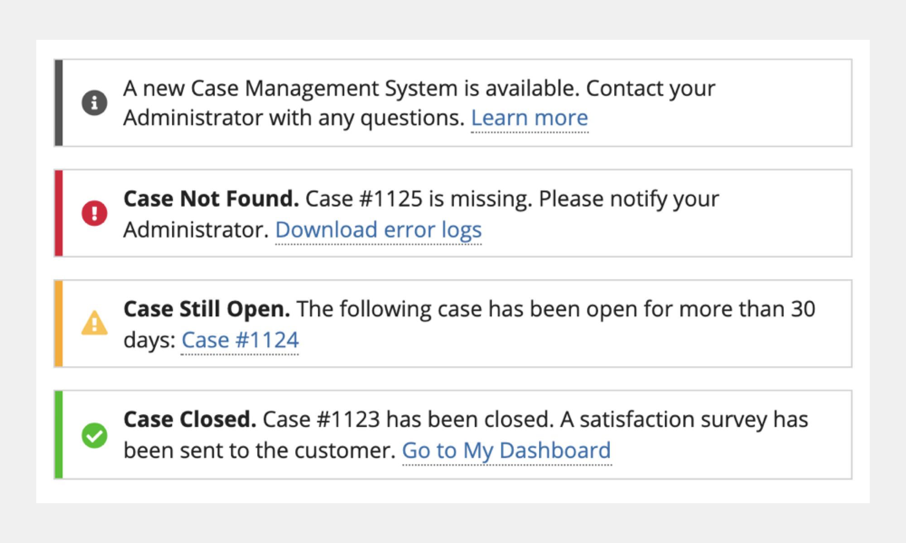 **[DO example]**

Make your decorative bar position consistent.

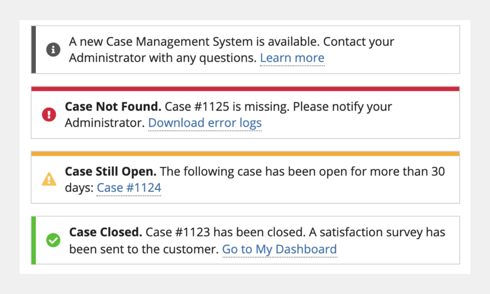 **[DON'T example]**

Don't mix and match decorative bar position.

#### Use decorative bar colors that complement card content

Make sure your decorative bar and card border color work well with the card's style and content within the card. In the following image, the bar colors match the titles and icons in the cards.

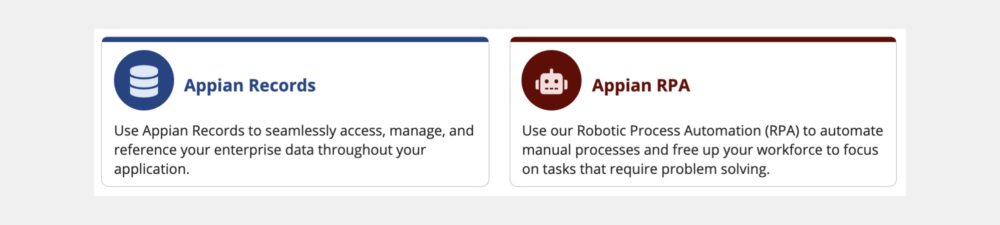 **[DO example]**

Use a decorative bar color that compliments your card contents.

 **[DO example]**

Use the same or a complimentary color for the decorative bar and card border.

 **[DON'T example]**

Don't use clashing colors for the decorative bar and card border.

### Margins

Use consistent margin dimensions within card groups on a page to achieve a balanced UI. When displaying multiple cards, make sure that the horizontal and vertical spacing is consistent.

To adjust horizontal spacing, use the **Column Spacing** parameter in the column layout. To adjust vertical spacing, use the **Margin Below** parameter in the card layout.

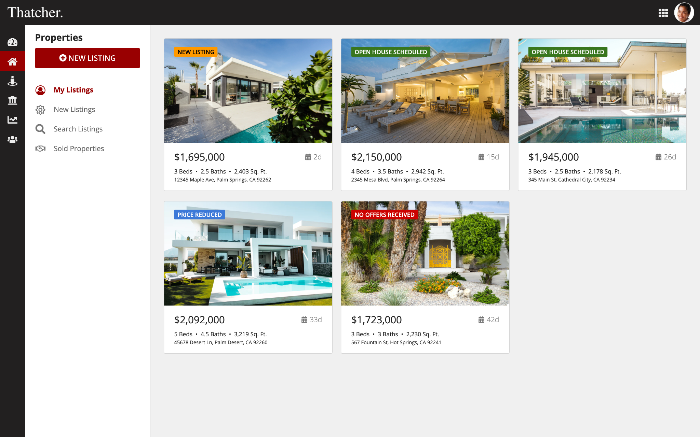

### Padding

Use card padding to keep your interfaces visually balanced and easy to read.

The right amount of padding for your interface depends on the card size, card contents, and page layout.

Adjust the card padding settings to see which works best for your interface.

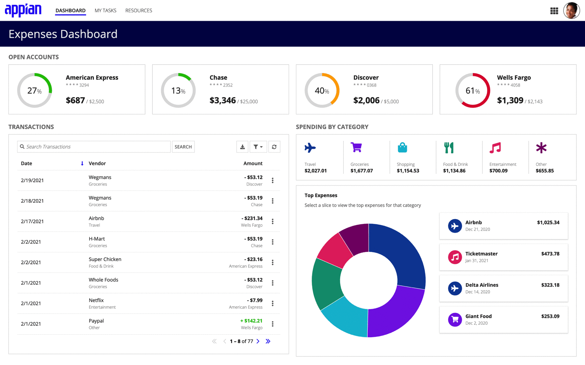 *(animated GIF)*

### Width

Cards automatically occupy the full width of their containers. Place cards within columns to set their width.

Fixing the width of a card keeps the layout of its contents consistent across different screen sizes. To fix the width of a card, place it inside a column configured with a fixed width.

The three cards in the fixed width example are each inside a column with a fixed width of "Narrow Plus." This ensures the width of the card will not change as a user's screen size changes.

To allow cards to shrink or stretch as screen size changes, place cards inside columns with the "Auto" width value or relative width values like "2X."

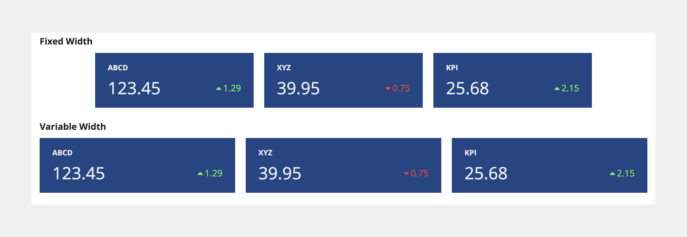

**Fixed**

```sail
a!columnsLayout(
  columns: {
    a!columnLayout(),
    a!columnLayout(
      contents: {
        a!cardLayout(
          contents: {
            a!richTextDisplayField(
              labelPosition: "COLLAPSED",
              value: {
                a!richTextItem(text: { "ABCD" }, style: { "STRONG" })
              }
            ),
            a!sideBySideLayout(
              items: {
                a!sideBySideItem(
                  item: a!richTextDisplayField(
                    labelPosition: "COLLAPSED",
                    value: {
                      a!richTextItem(text: { "123.45" }, size: "LARGE")
                    }
                  )
                ),
                a!sideBySideItem(
                  item: a!richTextDisplayField(
                    labelPosition: "COLLAPSED",
                    value: {
                      a!richTextItem(
                        text: { a!richTextIcon(icon: "caret-up"), "1.29" },
                        color: "POSITIVE",
                        size: "MEDIUM"
                      )
                    }
                  ),
                  width: "MINIMIZE"
                )
              },
              alignVertical: "MIDDLE"
            )
          },
          height: "AUTO",
          style: "#1c4587",
          padding: "STANDARD",
          marginBelow: "STANDARD",
          showBorder: false
        )
      },
      width: "NARROW_PLUS"
    ),
    a!columnLayout(
      contents: {
        a!cardLayout(
          contents: {
            a!richTextDisplayField(
              labelPosition: "COLLAPSED",
              value: {
                a!richTextItem(text: { "XYZ" }, style: { "STRONG" })
              }
            ),
            a!sideBySideLayout(
              items: {
                a!sideBySideItem(
                  item: a!richTextDisplayField(
                    labelPosition: "COLLAPSED",
                    value: {
                      a!richTextItem(text: { "39.95" }, size: "LARGE")
                    }
                  )
                ),
                a!sideBySideItem(
                  item: a!richTextDisplayField(
                    labelPosition: "COLLAPSED",
                    value: {
                      a!richTextItem(
                        text: {
                          a!richTextIcon(icon: "caret-down"),
                          "0.75"
                        },
                        color: "NEGATIVE",
                        size: "MEDIUM"
                      )
                    }
                  ),
                  width: "MINIMIZE"
                )
              },
              alignVertical: "MIDDLE"
            )
          },
          height: "AUTO",
          style: "#1c4587",
          padding: "STANDARD",
          marginBelow: "STANDARD",
          showBorder: false
        )
      },
      width: "NARROW_PLUS"
    ),
    a!columnLayout(
      contents: {
        a!cardLayout(
          contents: {
            a!richTextDisplayField(
              labelPosition: "COLLAPSED",
              value: {
                a!richTextItem(text: { "KPI" }, style: { "STRONG" })
              }
            ),
            a!sideBySideLayout(
              items: {
                a!sideBySideItem(
                  item: a!richTextDisplayField(
                    labelPosition: "COLLAPSED",
                    value: {
                      a!richTextItem(text: { "25.68" }, size: "LARGE")
                    }
                  )
                ),
                a!sideBySideItem(
                  item: a!richTextDisplayField(
                    labelPosition: "COLLAPSED",
                    value: {
                      a!richTextItem(
                        text: { a!richTextIcon(icon: "caret-up"), "2.15" },
                        color: "POSITIVE",
                        size: "MEDIUM"
                      )
                    }
                  ),
                  width: "MINIMIZE"
                )
              },
              alignVertical: "MIDDLE"
            )
          },
          height: "AUTO",
          style: "#1c4587",
          padding: "STANDARD",
          marginBelow: "STANDARD",
          showBorder: false
        )
      },
      width: "NARROW_PLUS"
    ),
    a!columnLayout()
  }
)
```

**Variable**

```sail
a!columnsLayout(
  columns: {
    a!columnLayout(
      contents: {
        a!cardLayout(
          contents: {
            a!richTextDisplayField(
              labelPosition: "COLLAPSED",
              value: {
                a!richTextItem(text: { "ABCD" }, style: { "STRONG" })
              }
            ),
            a!sideBySideLayout(
              items: {
                a!sideBySideItem(
                  item: a!richTextDisplayField(
                    labelPosition: "COLLAPSED",
                    value: {
                      a!richTextItem(text: { "123.45" }, size: "LARGE")
                    }
                  )
                ),
                a!sideBySideItem(
                  item: a!richTextDisplayField(
                    labelPosition: "COLLAPSED",
                    value: {
                      a!richTextItem(
                        text: { a!richTextIcon(icon: "caret-up"), "1.29" },
                        color: "POSITIVE",
                        size: "MEDIUM"
                      )
                    }
                  ),
                  width: "MINIMIZE"
                )
              },
              alignVertical: "MIDDLE"
            )
          },
          height: "AUTO",
          style: "#1c4587",
          padding: "STANDARD",
          marginBelow: "STANDARD",
          showBorder: false
        )
      }
    ),
    a!columnLayout(
      contents: {
        a!cardLayout(
          contents: {
            a!richTextDisplayField(
              labelPosition: "COLLAPSED",
              value: {
                a!richTextItem(text: { "XYZ" }, style: { "STRONG" })
              }
            ),
            a!sideBySideLayout(
              items: {
                a!sideBySideItem(
                  item: a!richTextDisplayField(
                    labelPosition: "COLLAPSED",
                    value: {
                      a!richTextItem(text: { "39.95" }, size: "LARGE")
                    }
                  )
                ),
                a!sideBySideItem(
                  item: a!richTextDisplayField(
                    labelPosition: "COLLAPSED",
                    value: {
                      a!richTextItem(
                        text: {
                          a!richTextIcon(icon: "caret-down"),
                          "0.75"
                        },
                        color: "NEGATIVE",
                        size: "MEDIUM"
                      )
                    }
                  ),
                  width: "MINIMIZE"
                )
              },
              alignVertical: "MIDDLE"
            )
          },
          height: "AUTO",
          style: "#1c4587",
          padding: "STANDARD",
          marginBelow: "STANDARD",
          showBorder: false
        )
      }
    ),
    a!columnLayout(
      contents: {
        a!cardLayout(
          contents: {
            a!richTextDisplayField(
              labelPosition: "COLLAPSED",
              value: {
                a!richTextItem(text: { "KPI" }, style: { "STRONG" })
              }
            ),
            a!sideBySideLayout(
              items: {
                a!sideBySideItem(
                  item: a!richTextDisplayField(
                    labelPosition: "COLLAPSED",
                    value: {
                      a!richTextItem(text: { "25.68" }, size: "LARGE")
                    }
                  )
                ),
                a!sideBySideItem(
                  item: a!richTextDisplayField(
                    labelPosition: "COLLAPSED",
                    value: {
                      a!richTextItem(
                        text: { a!richTextIcon(icon: "caret-up"), "2.15" },
                        color: "POSITIVE",
                        size: "MEDIUM"
                      )
                    }
                  ),
                  width: "MINIMIZE"
                )
              },
              alignVertical: "MIDDLE"
            )
          },
          height: "AUTO",
          style: "#1c4587",
          padding: "STANDARD",
          marginBelow: "STANDARD",
          showBorder: false
        )
      }
    )
  }
)
```

### Nested cards

You can nest cards within other cards to create more complex layouts.

For cards that will be used on different types of background, use the "Transparent" style to make sure they blend in regardless of the background.

The following example shows an outer card with the border parameter enabled and the padding parameter set to "None."

The outer card contains two layouts: a billboard layout that displays the item photograph and an inner card that displays the item details.

The inner card is configured with a hidden border and its padding set to "Standard."

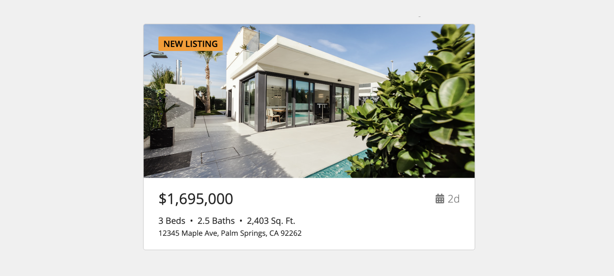

```sail
a!columnLayout(
  contents: {
    a!cardLayout(
      contents: {
        a!billboardLayout(
          backgroundMedia: a!webImage(
            source: "https://images.unsplash.com/photo-1512917774080-9991f1c4c750?ixid=MnwxMjA3fDB8MHxwaG90by1wYWdlfHx8fGVufDB8fHx8&ixlib=rb-1.2.1&auto=format&fit=crop&w=2550&q=80"
          ),
          backgroundColor: "#f0f0f0",
          height: "SHORT_PLUS",
          marginBelow: "NONE",
          overlay: a!fullOverlay(
            alignVertical: "TOP",
            contents: {
              a!tagField(
                labelPosition: "COLLAPSED",
                tags: {
                  a!tagItem(
                    text: "NEW LISTING",
                    backgroundColor: "#ff9900"
                  )
                }
              )
            },
            style: "NONE"
          )
        ),
        a!cardLayout(
          contents: {
            a!sideBySideLayout(
              items: {
                a!sideBySideItem(
                  item: a!richTextDisplayField(
                    labelPosition: "COLLAPSED",
                    value: {
                      a!richTextItem(text: { "$1,695,000" }, size: "MEDIUM_PLUS")
                    }
                  )
                ),
                a!sideBySideItem(
                  item: a!richTextDisplayField(
                    labelPosition: "COLLAPSED",
                    value: {
                      a!richTextItem(
                        text: { a!richTextIcon(icon: "calendar"), " 2d" },
                        color: "SECONDARY",
                        size: "MEDIUM"
                      )
                    }
                  ),
                  width: "MINIMIZE"
                )
              },
              alignVertical: "MIDDLE",
              marginBelow: "STANDARD"
            ),
            a!richTextDisplayField(
              labelPosition: "COLLAPSED",
              value: {
                a!richTextItem(text: { "3 Beds  " }, size: "STANDARD"),
                "•  2.5 Baths  •  2,403 Sq. Ft.",
                char(10),
                a!richTextItem(
                  text: {
                    "12345 Maple Ave, Palm Springs, CA 92262"
                  },
                  size: "SMALL"
                )
              },
              preventWrapping: false
            )
          },
          height: "AUTO",
          style: "NONE",
          padding: "STANDARD",
          marginBelow: "NONE",
          showBorder: false
        )
      },
      link: a!dynamicLink(label: "Dynamic Link", saveInto: {}),
      height: "AUTO",
      style: "NONE",
      shape: "SEMI_ROUNDED",
      padding: "NONE",
      marginBelow: "STANDARD"
    )
  },
  width: "MEDIUM_PLUS"
)
```

The following example shows an outer card with the border parameter enabled and the padding parameter set to "None".

The outer card contains an inner card that displays the item details.

The inner card is configured with a hidden border and the padding parameter set to "Less".

The outer card also contains a progress bar below the inner card.

Because the outer card has no padding, the progress bar is displayed flush with the bottom edge of the card.


```sail
a!columnLayout(
  contents: {
    a!cardLayout(
      contents: {
        a!cardLayout(
          contents: {
            a!richTextDisplayField(
              labelPosition: "COLLAPSED",
              value: {
                a!richTextItem(text: { "REVENUE" }, size: "MEDIUM")
              },
              marginBelow: "EVEN_LESS"
            ),
            a!sideBySideLayout(
              items: {
                a!sideBySideItem(
                  item: a!richTextDisplayField(
                    labelPosition: "COLLAPSED",
                    value: {
                      a!richTextItem(
                        text: { "$5.3" },
                        color: "ACCENT",
                        size: "LARGE",
                        style: { "STRONG" }
                      ),
                      a!richTextItem(text: { "M" }, size: "LARGE")
                    }
                  )
                ),
                a!sideBySideItem(
                  item: a!richTextDisplayField(
                    labelPosition: "COLLAPSED",
                    value: {
                      a!richTextItem(
                        text: { "GOAL:" },
                        color: "SECONDARY",
                        size: "STANDARD"
                      ),
                      a!richTextItem(text: { " $8.2M" }, size: "STANDARD")
                    }
                  ),
                  width: "MINIMIZE"
                )
              },
              alignVertical: "BOTTOM"
            )
          },
          height: "AUTO",
          style: "NONE",
          padding: "LESS",
          marginBelow: "NONE",
          showBorder: false
        ),
        a!progressBarField(
          label: "Progress to goal",
          labelPosition: "COLLAPSED",
          percentage: 65,
          style: "THIN",
          showPercentage: false
        )
      },
      height: "AUTO",
      style: "NONE",
      padding: "NONE",
      marginBelow: "STANDARD"
    )
  },
  width: "NARROW_PLUS"
)
```

### Other components with card styling

There are multiple components that can be used for selection and choices, such as radio buttons, checkboxes, card choices, and buttons. Use these components rather than displaying choices in card layouts to ensure that your interface is accessible to all users.

Apply a card styling to either radio buttons or checkboxes to get a similar look to cards while maintaining accessibility and providing larger click targets for your users.

The cards choices component is a visually and information rich alternative to other form choices that combines accessibility and style. Use it to easily create selectable and professional looking card choices from a set of data.

For more information on and examples of the card choices component, see card choices component page and the Cards as Choices pattern.
