# Charts [SAIL Design System: Components]

*Section: components | source: https://docs.appian.com/suite/help/26.7/sail/ux-charts.html | images referenced live in corpus/images/*

# Charts

## Introduction

There are a variety of chart types and configurations that can be used to build rich reporting dashboards that provide users with visualizations of their data.

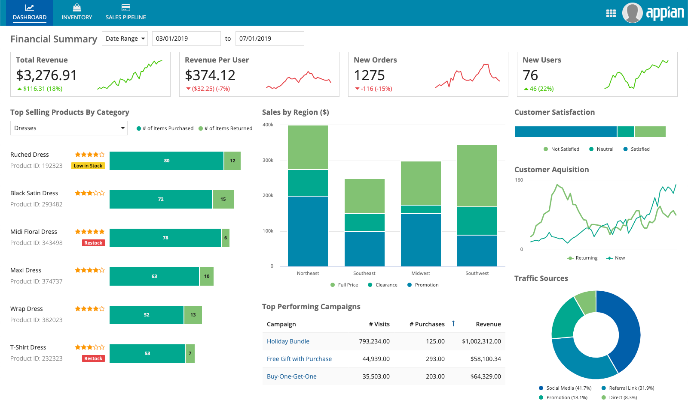

## Chart types

### Choosing a chart type

Every chart should tell a story. A common mistake in data visualization is to force a dataset into a specific chart type. To avoid this mistake, start by identifying values of interest and understanding what the user intends to do with the data. Then, decide what story the data should tell, and what information is important for the user to learn.

Finally, determine which chart type will be most effective for telling the story. Ask These questions to help determine the purpose of the chart:

Should the chart depict…

- Individual parts that make up a whole? (e.g. number of customers per region)

  - With one category:

    - Pie Chart

  - With multiple categories:

    - Stacked Bar Chart or Column Chart

  - Over time:

    - Stacked Area Chart

- Distribution of data? (e.g. average customer rating of products)

  - With positive and/or negative values:

    - Column Chart

  - With a relatively large number of categories:

    - Bar Chart

  - To compare two measures at once:

    - Scatter Chart

- Trends over time? (e.g. monthly revenue over the last year)

  - Over a relatively small number of intervals:

    - Column Chart or Line Chart

  - Over a relatively large number of intervals:

    - Line Chart or Area Chart

- Compare values across categories? (e.g. number of customers in each region yearly)

  - With a relatively small set of values:

    - Column Chart, Line Chart, or Area Chart

  - With a relatively large set of values:

    - Line Chart

### Pie charts

Pie charts are generally used to show proportional data and can help a user understand the contribution of parts to a whole. Pie charts should only be used to represent data that can be placed into distinct categories and should not consist of more than 5 slices. Always include data and category labels for the slices.

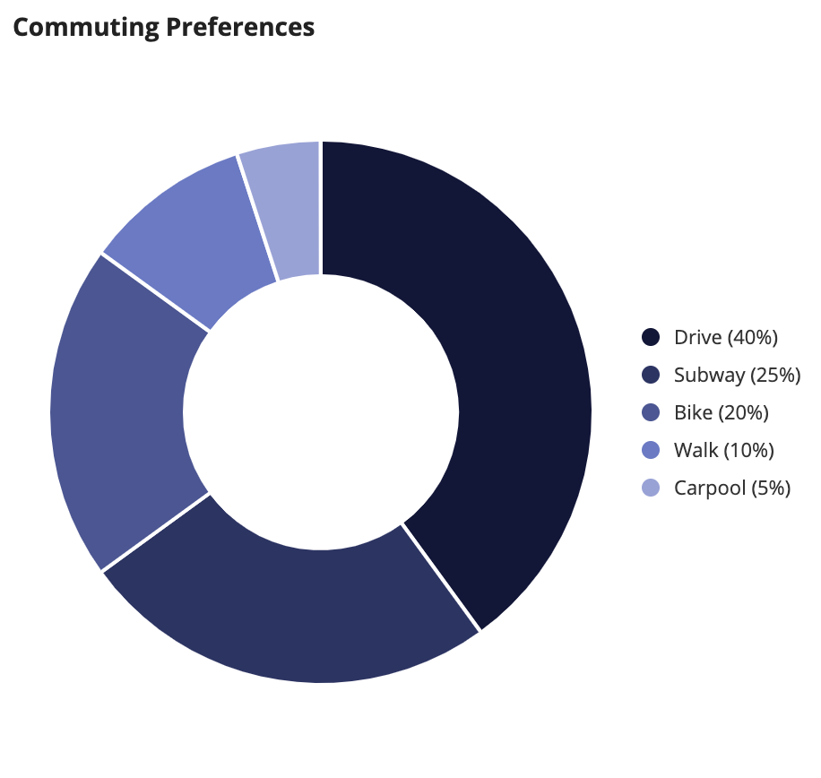 **[DO example]**

Use pie charts to show proportional data.

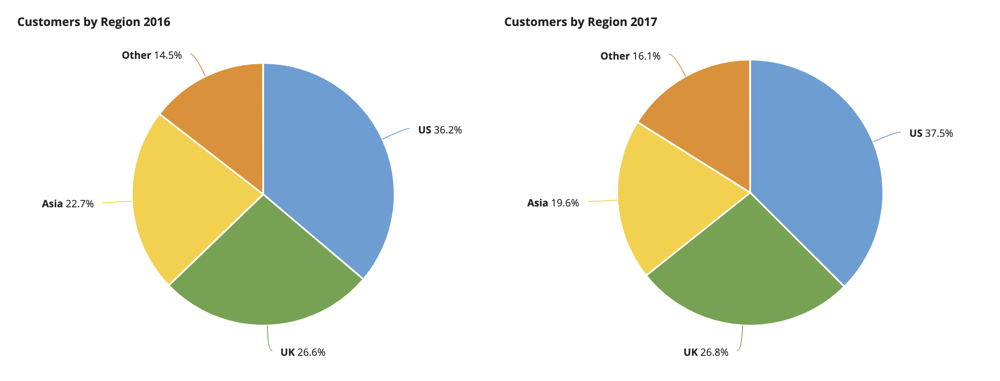 **[DON'T example]**

Don’t use multiple pie charts when comparing multiple sets of data. Instead of the above example, use a line chart with categories for each year so users can easily compare values.

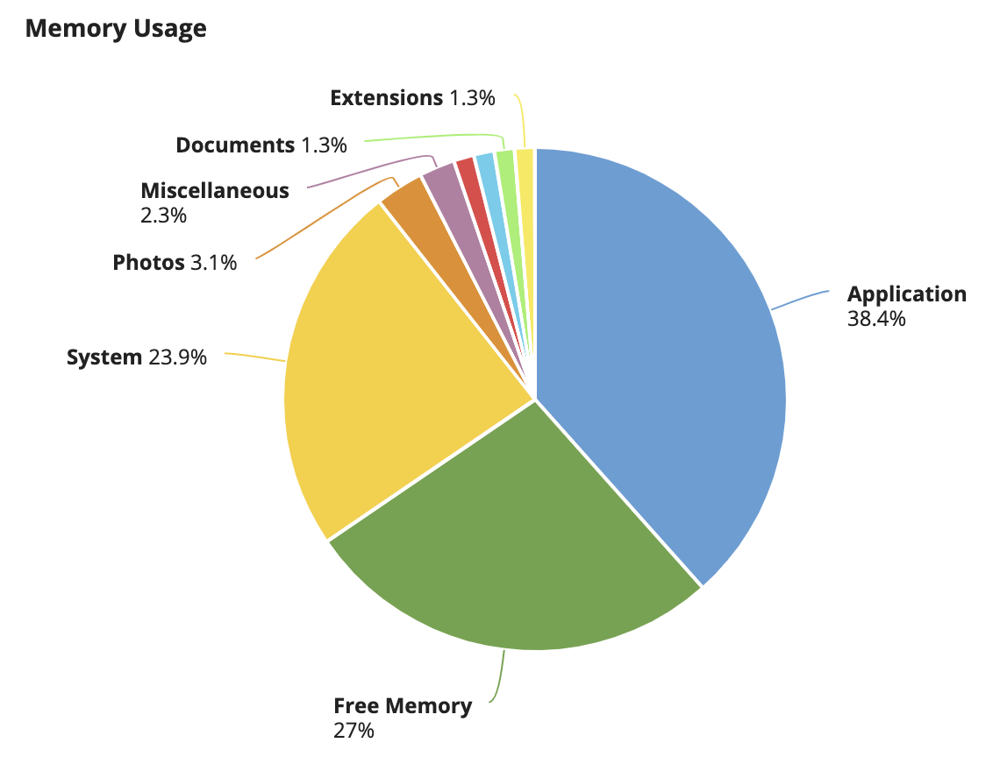 **[DON'T example]**

Don’t use too many slices in a pie chart, as this will cause some labels to become hidden (like the red and light blue slices above). Try using broader categories or grouping those which have relatively small values into a single “Other” category.

### Column charts

Use column charts for direct comparison of data or to show data over time only when the number of time intervals is small. In addition, column charts are useful for displaying data with both positive and negative values.

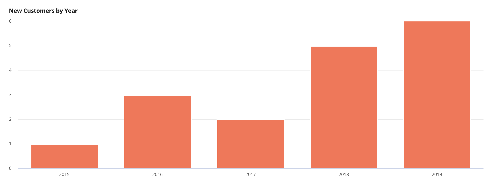 **[DO example]**

Use column charts to compare values across time-based categories with a relatively small number of intervals.

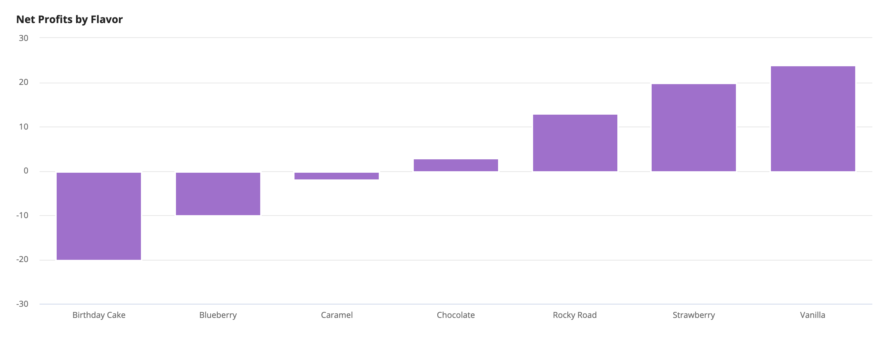 **[DO example]**

A column chart is useful for displaying negative and positive values because the y-axis can display numbers below zero.

### Bar charts

Use bar charts to compare values across categories that are not sequential or time-based. If labels are long or if there are many categories, a bar chart is more effective than a column chart because each label will have sufficient space regardless of the number of categories.

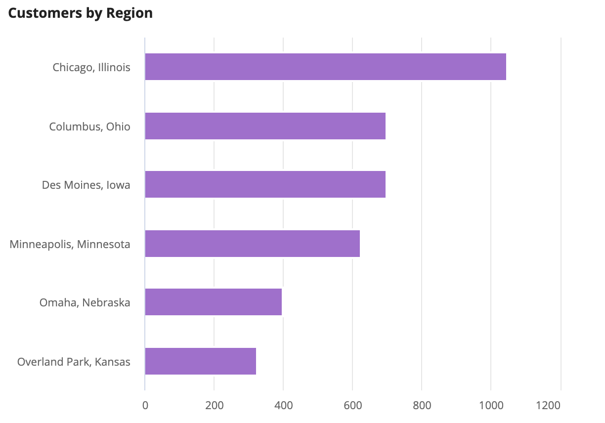 **[DO example]**

Use bar charts for categories with especially long labels.

### Line charts

Line charts are best used for comparing data over time and are effective at presenting many data points. They are also effective for displaying data in scenarios where the differences between data points are small because the y-axis automatically adjusts to fit the data.

Conventionally, the x-axis contains the categories of time, and y-axis contains the frequency of the measured data.

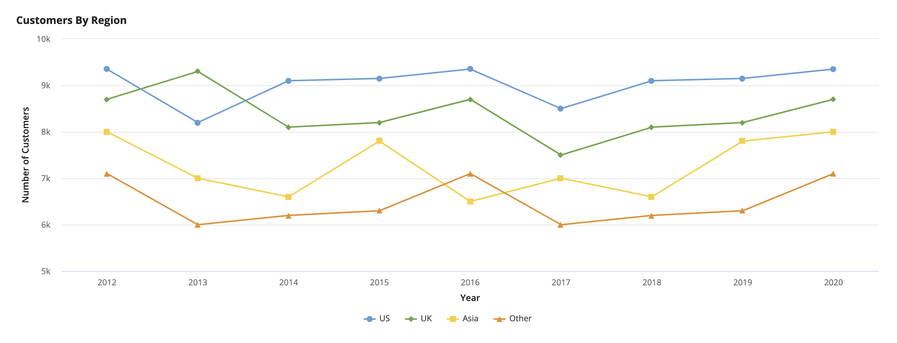 **[DO example]**

Line charts are useful for depicting time-based categories.

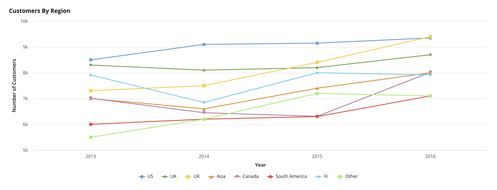 **[DON'T example]**

Charts with more than 5 lines are difficult to decipher. We recommend using a column chart for this scenario.

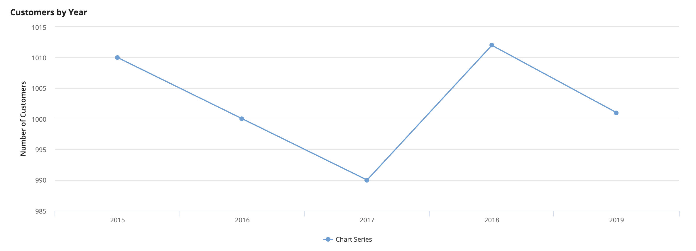 **[DO example]**

A line chart’s y-axis values are automatically scaled to fit the line chart, which increases the visibility of relatively small differences in data values.

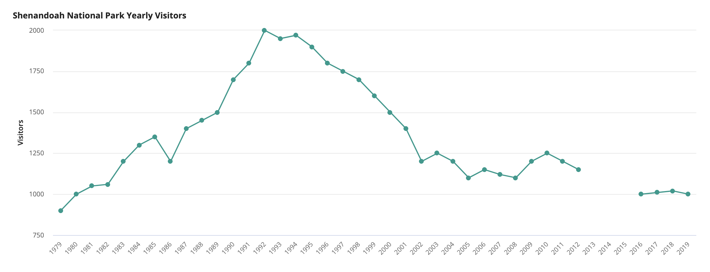 **[DO example]**

Leave gaps in line charts to represent missing data.

### Area charts

Area and line charts are both used for comparing data over time, but call attention to different aspects of the data. Area charts emphasize volume or cumulative data progression while line charts focus on precise data points.

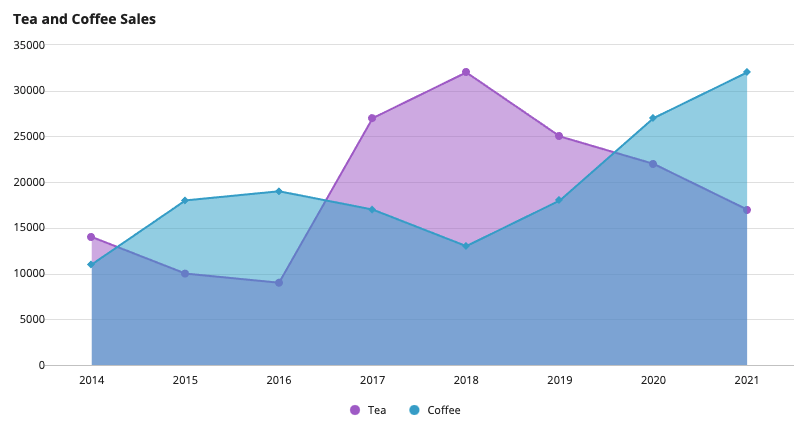 **[DO example]**

Use area charts without stacking to compare cumulative data over time.

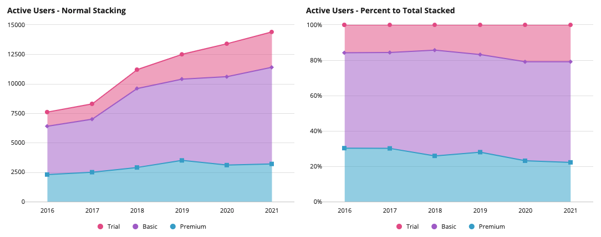 **[DO example]**

Use “Normal” stacking (left) on area charts to compare how each category’s total value and trends compare to the others. Alternatively, if information about the trend is not necessary, use “Percent to total” stacking (right) to show the relative contribution of each category to the total.

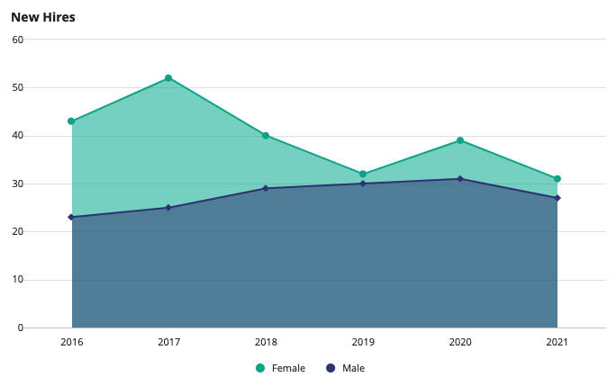 **[DON'T example]**

Don't use area charts without stacking if one series of data is always greater than the other. In this example, it is not immediately obvious whether the series are stacked or overlapping. Instead, consider using a line chart, or applying “Normal” or “Percent to total” stacking behavior with added context.

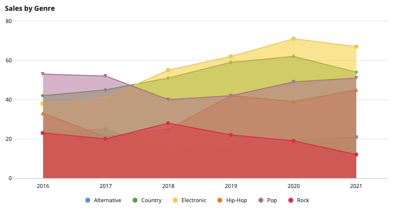 **[DON'T example]**

Don’t use area charts if you have more than three series because overlapping areas make it difficult to associate each color with a specific category.

### Scatter charts

Use scatter charts to represent the relationship between two fields by plotting the fields' values on a two-dimensional plane.

Scatter charts depict large sets of data concisely and allow readers to find correlations and outliers.

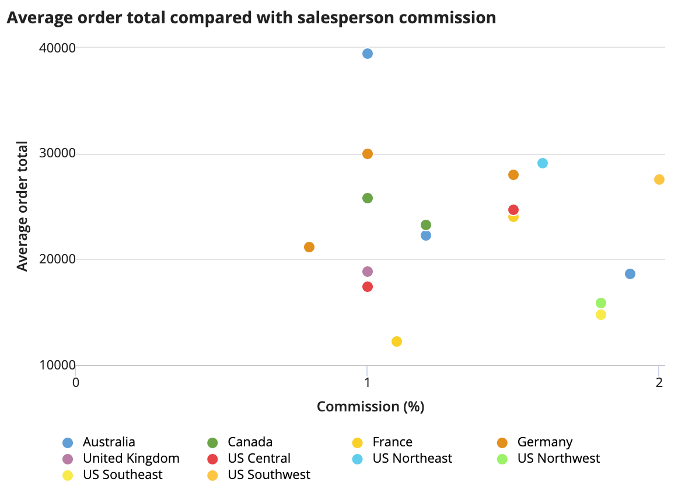 **[DO example]**

Use a scatter chart when you want to compare two related variables. Add a secondary grouping to show grouped variables in the legend.

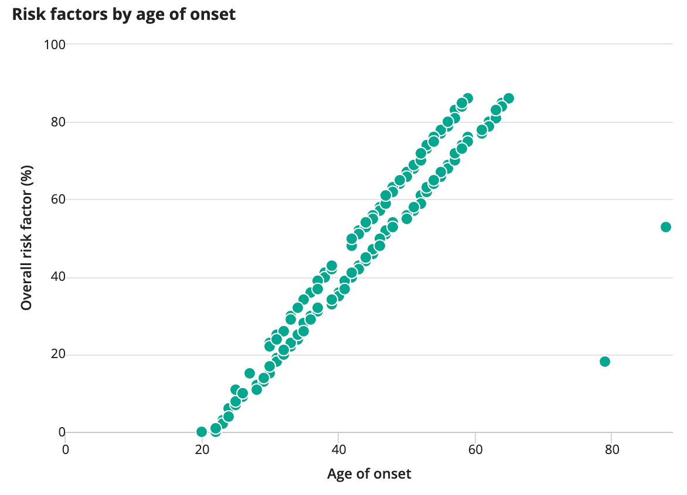 **[DO example]**

Include outliers. They are an important part of your dataset, even if they don't look like they belong. Only use data filters when narrowing the dataset as a whole, rather than removing individual data points.

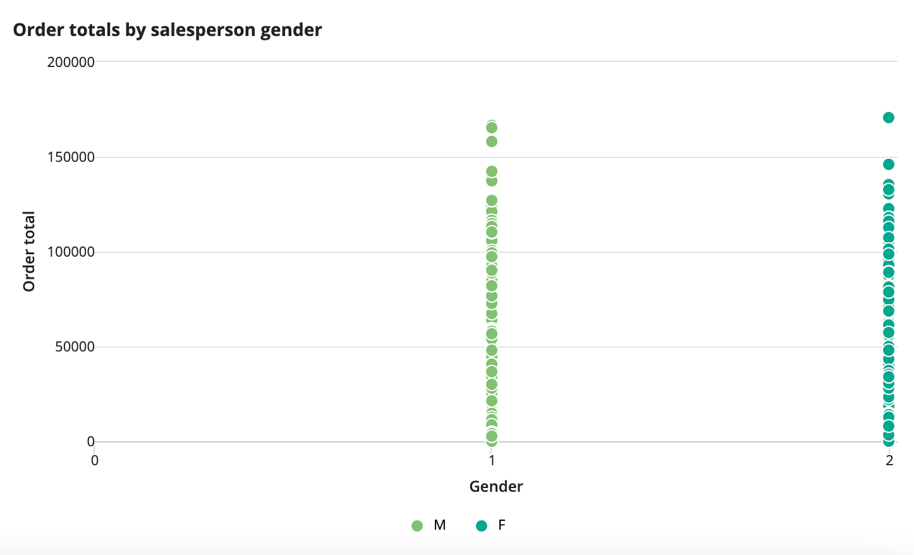 **[DON'T example]**

Don't use scatter plots if you need to evaluate qualitative data (such as gender or pass/fail). For qualitative data, consider using another chart type such as a bar or pie chart. Scatter plots should be used with quantitative data (like age, income, or temperature).

## Sort order

As with all displays of aggregate data, the sort order should be meaningful and obvious to the user. Always sort chart data by magnitude or by sequential categories, such as time.

### Sorting by magnitude

#### Pie chart and bar chart

In most scenarios, it is best to sort pie and bar chart data values in descending order to emphasize the largest value in a data set and make it easier for users to compare the relative sizes of slices and bars.

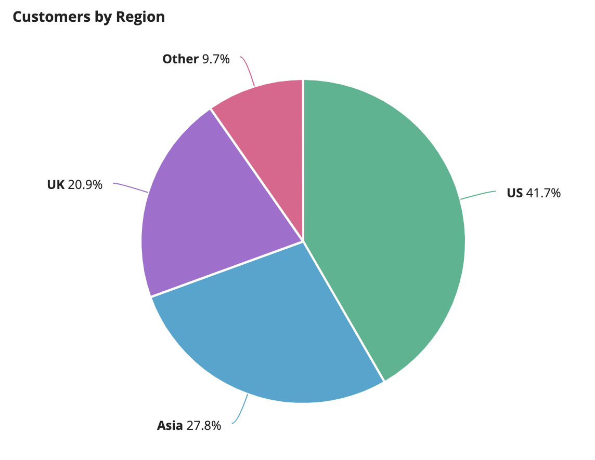 **[DO example]**

Pie charts sorted in descending order make it easier to quickly compare and identify the relative size of slices.

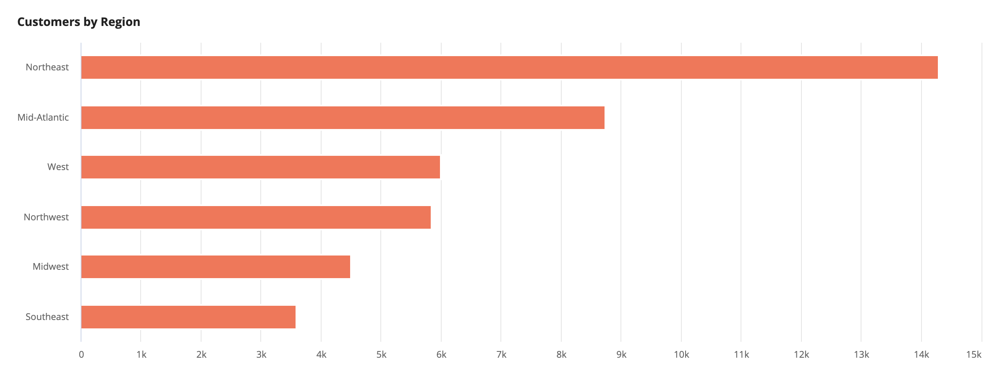 **[DO example]**

A bar chart sorted in descending order will draw attention to the largest category.

#### Column chart

Sort column chart data in ascending order to emphasize the largest value in a data set.

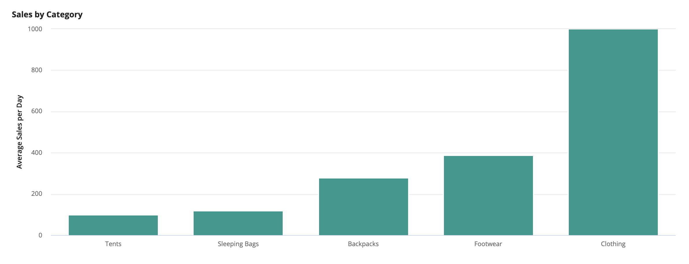 **[DO example]**

A column chart sorted in ascending order will draw attention to the largest column.

### Sorting by category

#### Column chart and line chart

Use a sequential sort order if categories are related to time (e.g. sorting by year).

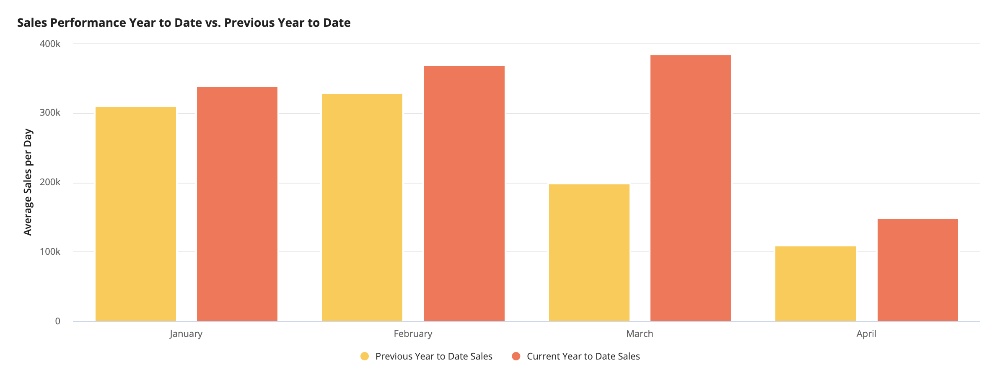 **[DO example]**

A column chart sorted by time is appropriate for displaying time-based categories.

## Height

Choose chart heights based on the amount of data displayed and the chart’s relationship to other page content. For example, tall charts can be used to visualize complex datasets, whereas short charts may be more appropriate for displaying simpler datasets. See the Chart Height reference page for more information on how to implement chart heights.

### Visual balance

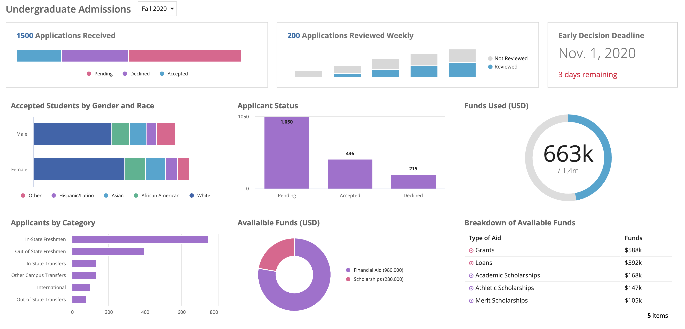 **[DO example]**

Use chart heights that are proportional to surrounding content.

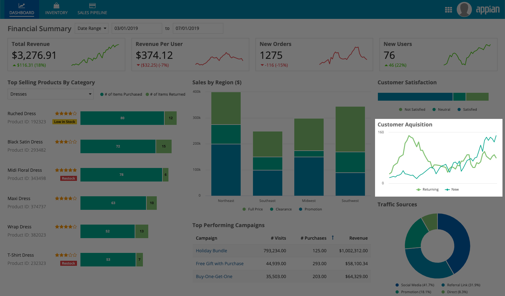 **[DO example]**

Use an appropriate height to maintain visual balance and restrict the overall column from being too tall in comparison to the rest of the interface. In this example, a “Short” height is used to restrict the column from being significantly taller than the rest of the content on the page.

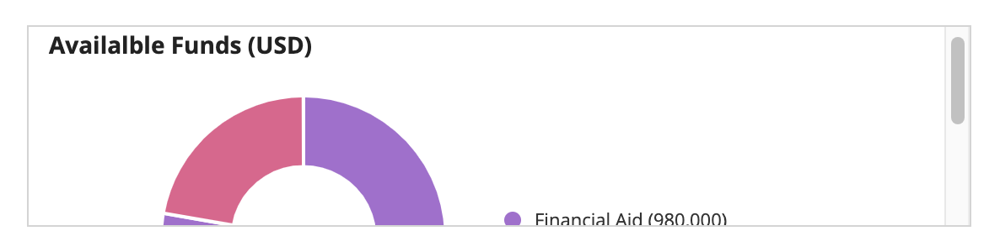 **[DON'T example]**

Don’t place a chart in a card layout that is too short for the chart to fit in.

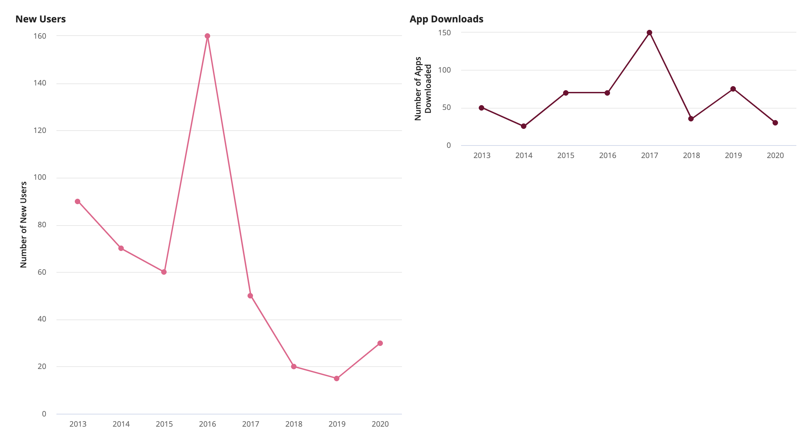 **[DON'T example]**

Don’t use mismatched heights for charts placed side-by-side if it results in large areas of unused whitespace.

### Height proportional to size of data

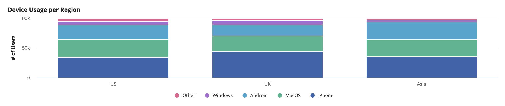 **[DON'T example]**

Don’t use a short height for charts with data that users are intended to interact with. Instead, use a taller height to provide ample screen space for the visualization and larger click targets for users to drill down into specific data points.

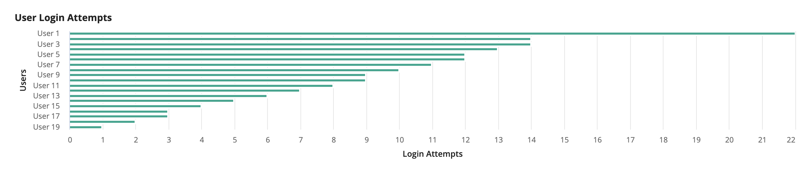 **[DON'T example]**

When there are too many categories to display within a fixed height, the chart will automatically hide some of categories. Instead, use “Auto” so the chart height can grow and shrink according to the number of categories in the dataset.

### Adapting charts to shorter heights

 **[DO example]**

When using a micro height, the axes can be hidden to reserve more space for the data and legend.

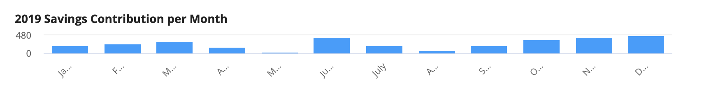 **[DON'T example]**

Don’t use a micro height to display extensive data or labels.

## Colors

Colors can be used to enhance chart readability or reflect an organization's branding. 
Color schemes can be applied to charts to show meaningful associations between the colors and the data they represent. A full list of out of the box color scheme options can be found in the Chart Color Scheme reference page.

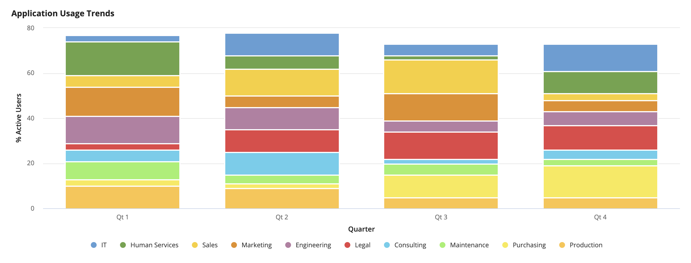 **[DON'T example]**

Don’t use more than 5 colors in a single chart. The more colors there are, the more difficult it is to differentiate between colors. Instead, consider combining multiple small categories into a single “Other” category.

### Consistent colors

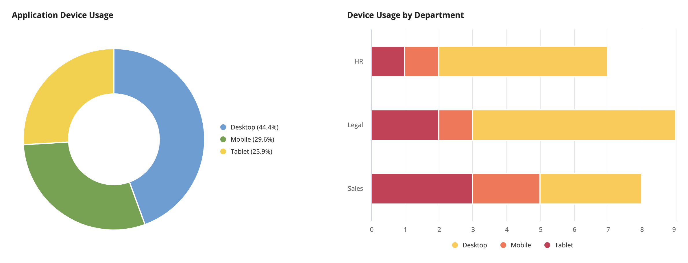 **[DON'T example]**

Don’t use multiple color schemes in a single interface because it can be distracting.

### Colors to represent data values

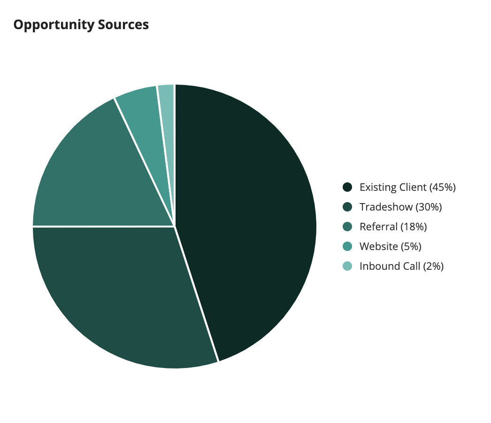 **[DO example]**

Use gradient color schemes on sorted pie charts to reflect the relative size of the slices, where darker colors represent larger slices and lighter colors represent smaller slices.

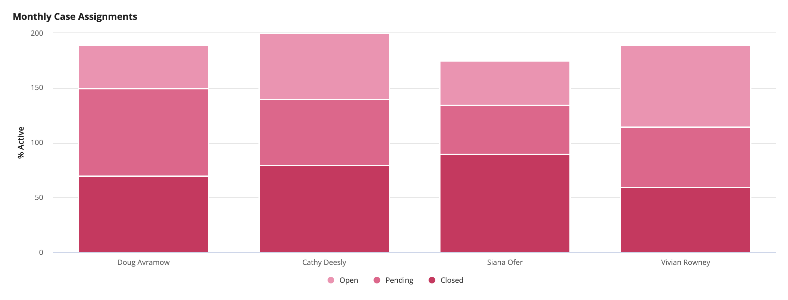 **[DO example]**

A column chart sorted by category with a gradient color scheme shows a clear association between the colors and the values they represent.

### Colors for distinct categories

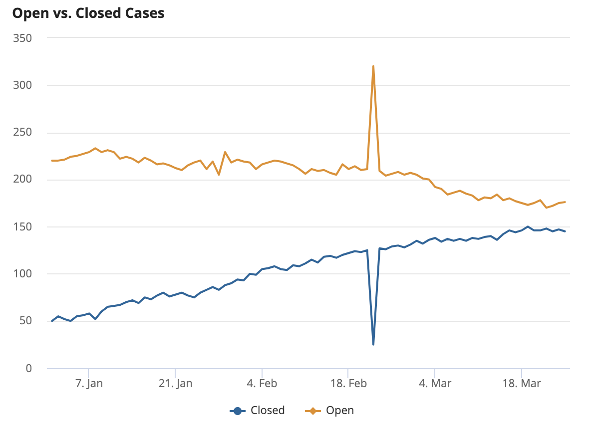 **[DO example]**

Use contrasting colors to depict contrasting categories.

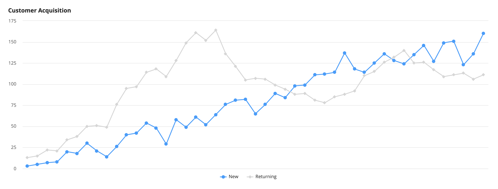 **[DO example]**

Use a bright, primary color to direct the user’s eye to the most important value or value set in a chart, and a muted color to deemphasize other, less important values.

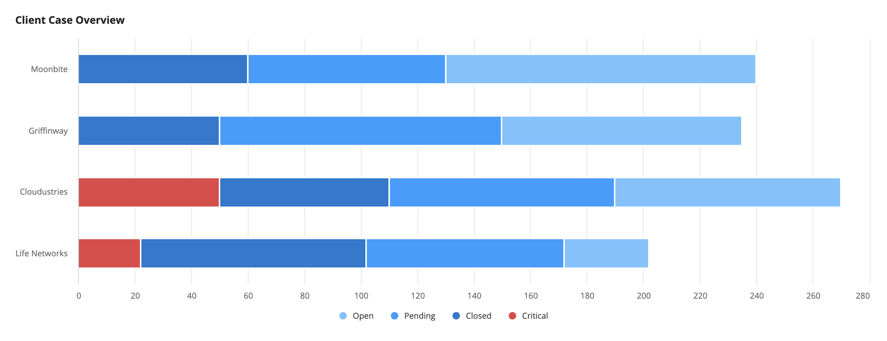 **[DO example]**

Colors can be applied to individual series of data to highlight key elements in the chart. Consider the connotation of the color you choose (e.g Red implies a negative status, like “Critical”).

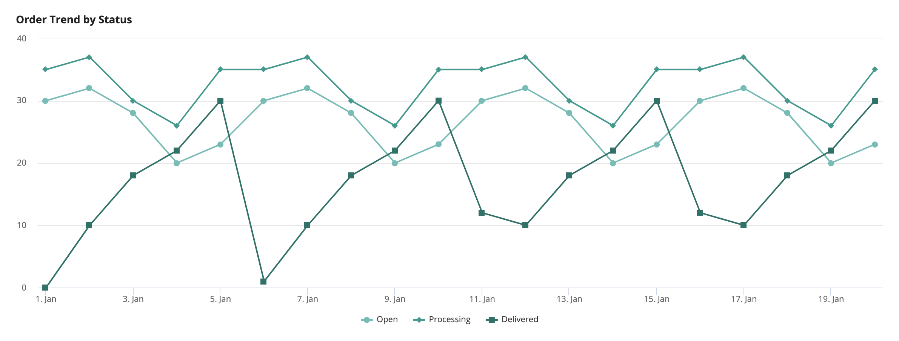 **[DON'T example]**

Gradient color schemes should not be used for line charts with multiple lines, as the similar colors are difficult for users to map to each category. Instead, try using a color scheme that has distinct variations in color.

### Background colors

As of Appian 20.4, charts no longer have a white background color. Keep this in mind as you decide where to place your charts.

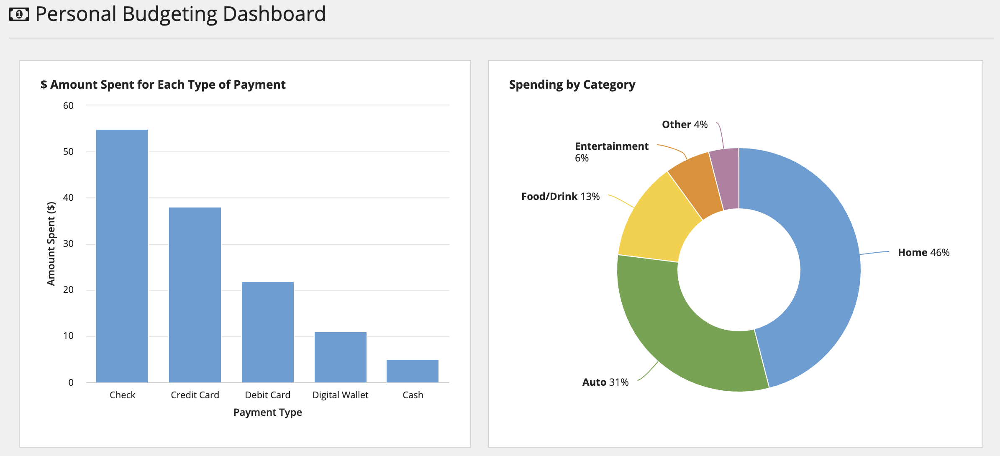 **[DO example]**

When using a transparent background color with header-content layout, place charts within card layouts.

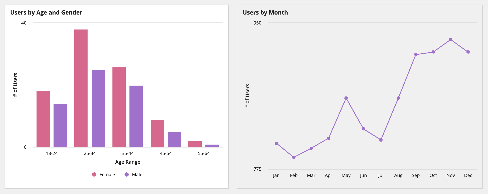 **[DON'T example]**

Don’t show charts on different colored backgrounds.

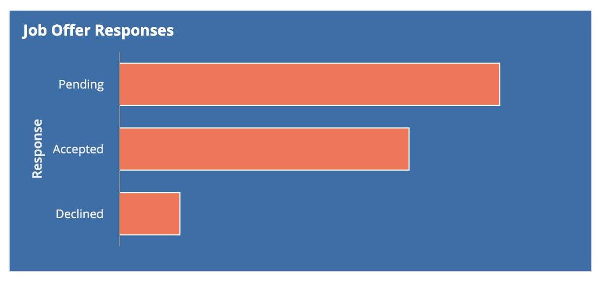 **[DON'T example]**

Brightly colored backgrounds tend to look unprofessional and distract from the chart contents.

## Text

### Labels, legends, and tooltips

Axis labels and legends are used to provide context and help users interpret chart data more accurately. However, they can be removed depending on the purpose of the chart and how much space is available. Keep in mind that additional contextual information might need to be provided if certain elements of the chart are hidden.

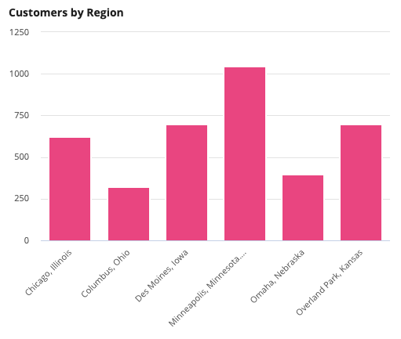 **[DON'T example]**

Don’t use column charts when x-axis labels are long, especially if label text is truncated or rotated. Use a bar chart instead to allow more space for labels.

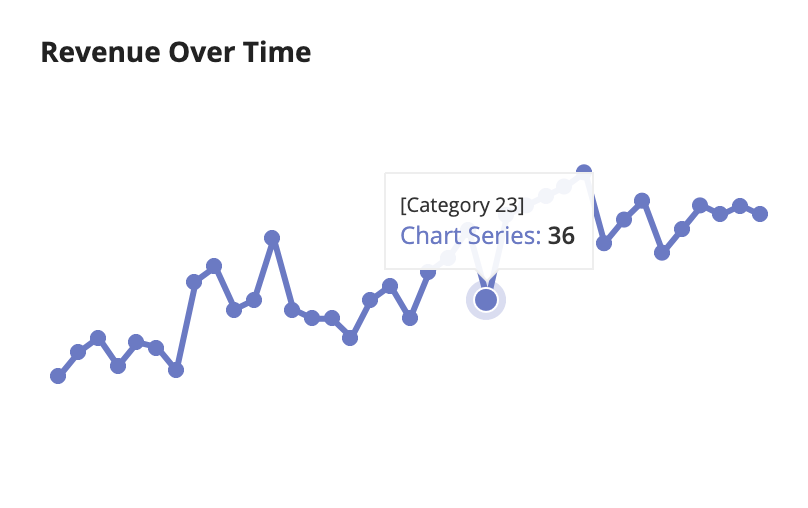 **[DON'T example]**

When hiding the axes, do not leave the series and category labels undefined, because they provide contextual information in the tooltip.

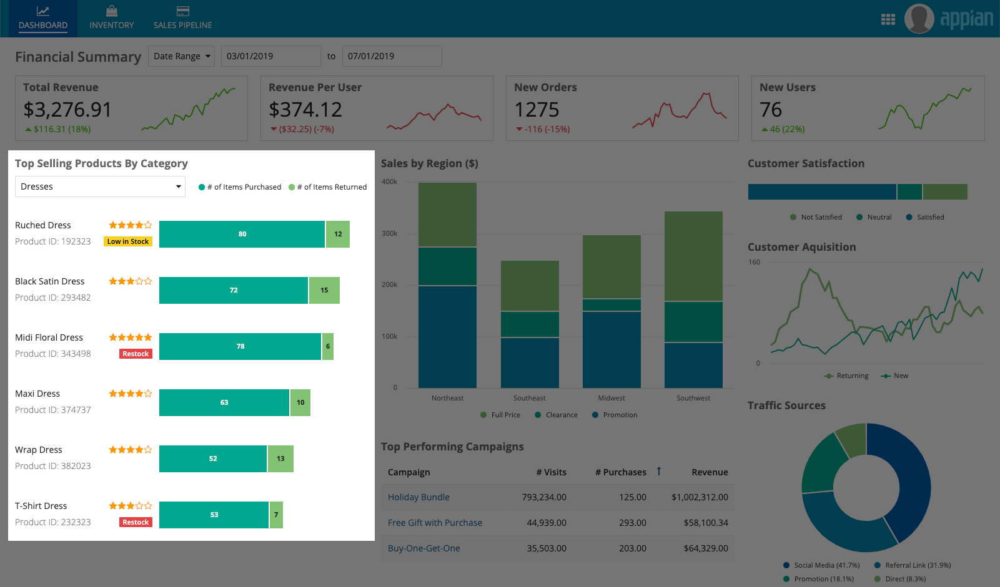 **[DO example]**

Hiding axes can enhance a visualization by reducing the amount of clutter. However, when doing so it is important to provide additional context to ensure readability like the products list does in this example.

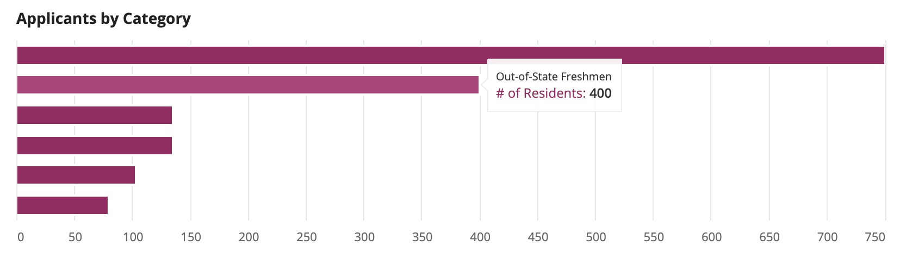 **[DON'T example]**

Although tooltips are enabled, don’t hide the axes and labels if there is enough space to display them. The labels enable users to easily understand the information on the chart.

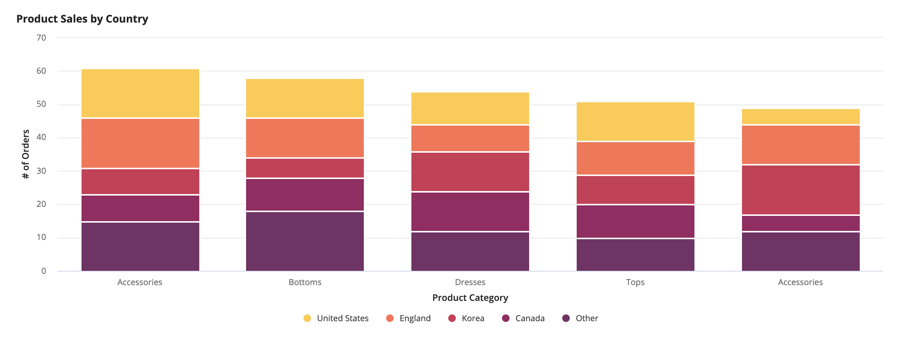 **[DO example]**

When there are too many categories, use broader category labels or group those which have relatively small values into a single “Other” category.

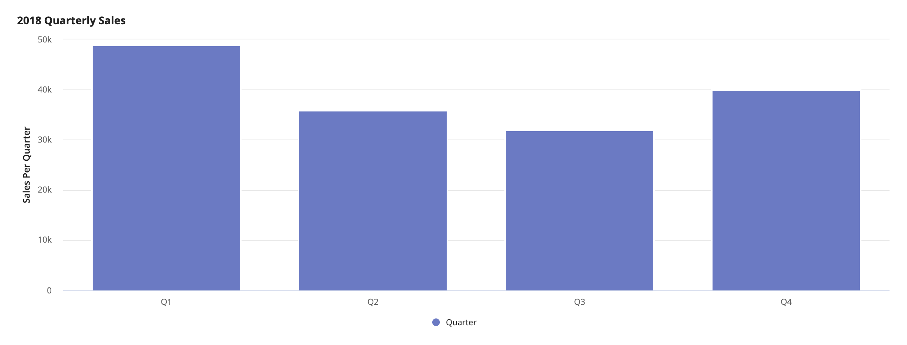 **[DON'T example]**

Don’t include a legend when there is only one data series. Instead, try using a descriptive title to indicate the data that is plotted.

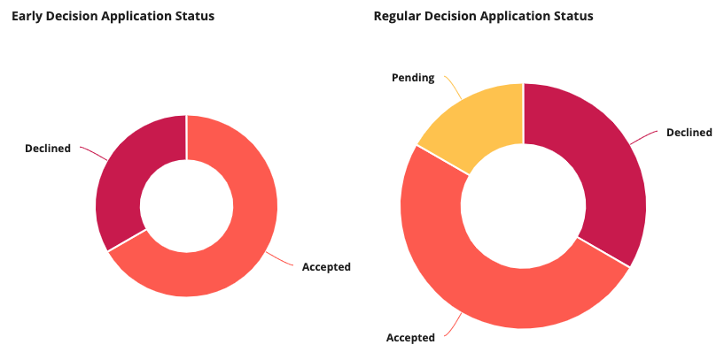 **[DON'T example]**

Don’t show the series label on the chart when multiple pie charts are displayed in a row or column, as it can result in inconsistent sizing across charts. Instead, use a legend to display the labels.
