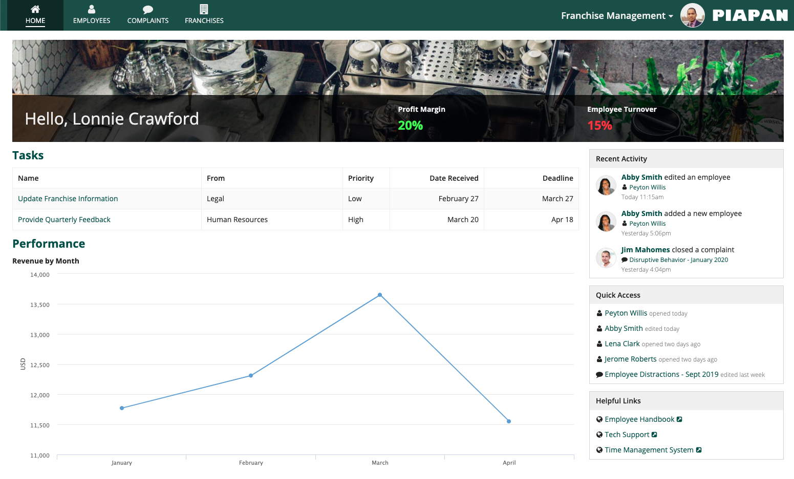
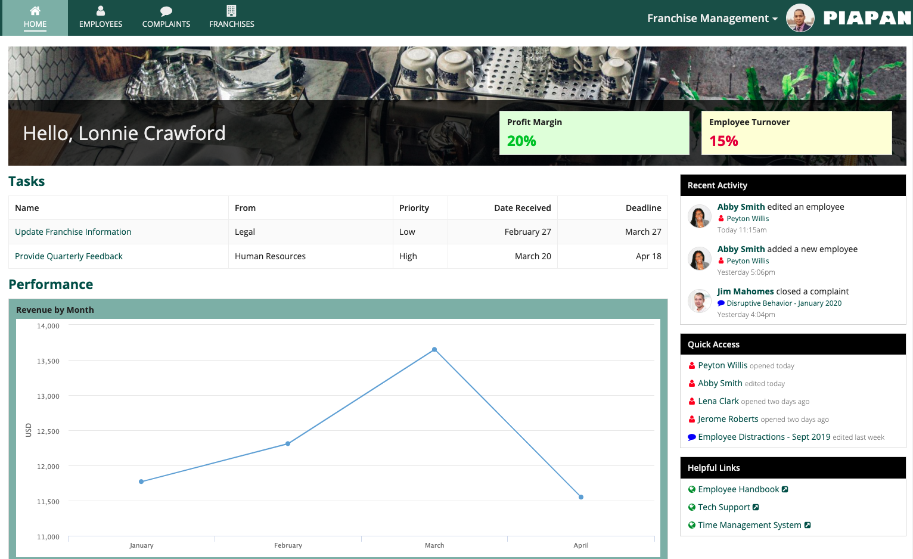
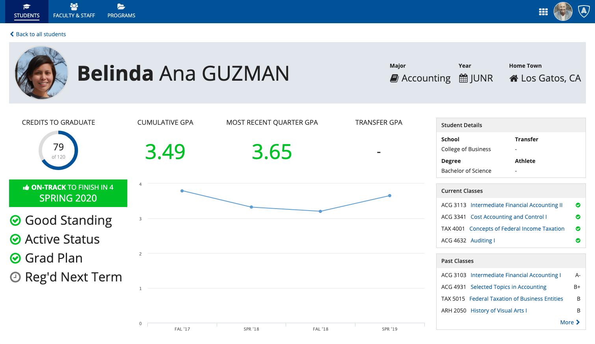
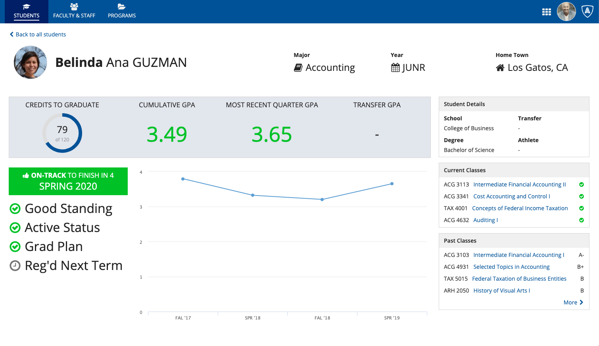
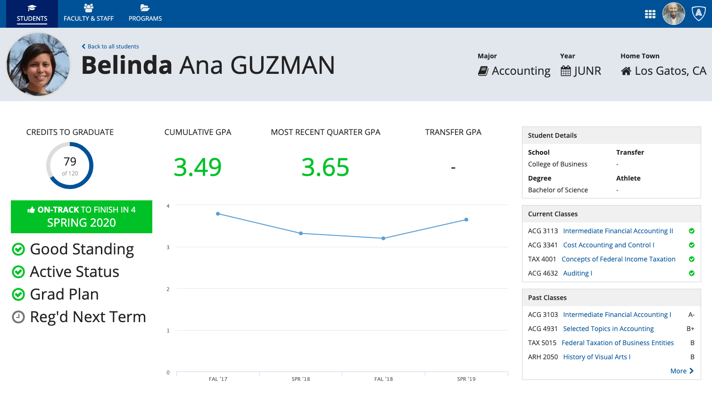
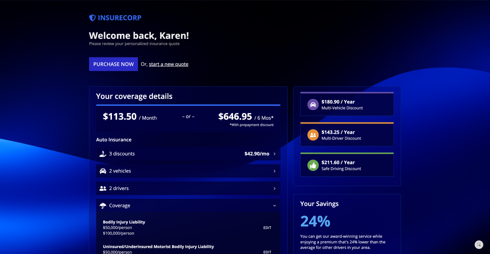
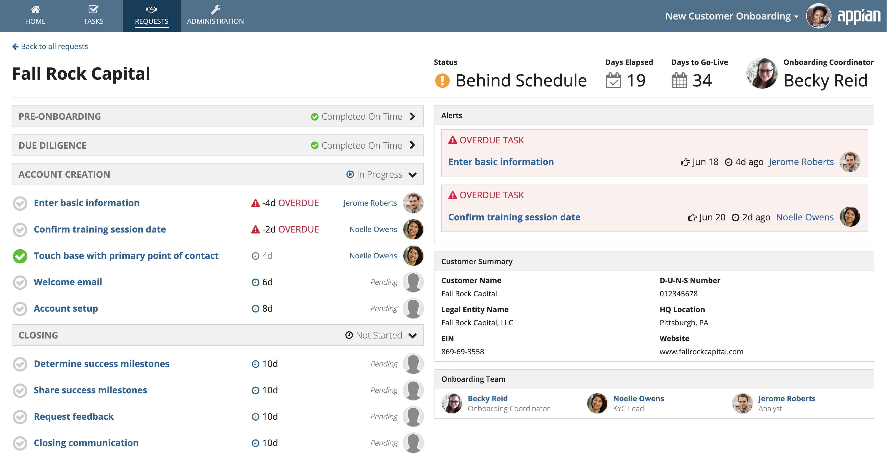
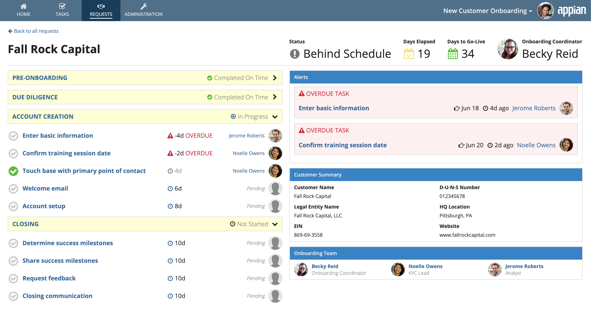
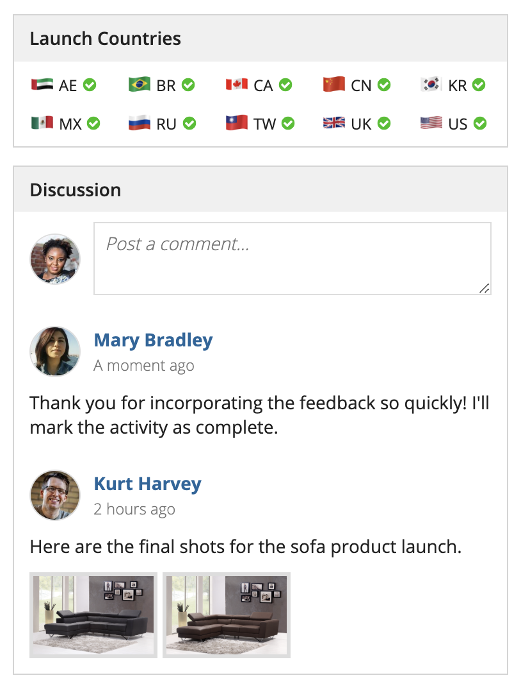

# Using Colors [SAIL Design System: Guidelines]

*Section: guidance | source: https://docs.appian.com/suite/help/26.7/sail/ux-color-overview.html | images referenced live in corpus/images/*

# Using Colors

## Introduction

This page provides guidance on how to use color effectively in your applications to create consistent branding, convey page structure, and highlight important information.

Well-designed software applications use a small, consistent color palette. To ensure a tasteful and professional style, use a minimal number of colors to communicate the identity of your application.

 **[DO example]**

Use a small color palette to convey branding without distracting from the page content

 **[DON'T example]**

A diversity of colors and shades tends to look messy and disruptive

## Using color to convey page structure

Styled cards and billboards with solid background colors can be used to establish structure for a page. To use these big blocks of color effectively, place them along the perimeter of the page. At a more granular level, use box layouts to create visually distinct subheaders.

 **[DO example]**

Use a block of color (e.g., a card) to create a visually distinct page header

 **[DON'T example]**

Avoid using blocks of color to highlight random sections that are not on the perimeter of the page

 **[DO example]**

Use out-of-the-box features, including the header-content layout (pictured above) and record view header backgrounds, to create colored page headers. When choosing a color for these flush headers, it’s especially important to consider the color of the header bar above it.

When selecting a color for a header or other structural element, keep in mind that a bright, intense color will pull the user’s eye toward that section. If you want to avoid this, use a less intense shade. For example, using “Standard” box styles is usually a safe choice to ensure the color doesn’t call more attention to the box headers than to the content of the boxes themselves.

Used without caution, colored cards and boxes are an easy way to put disruptive eyesores on a page. Appropriate use of color within structural elements allows color to more effectively be used to highlight important information on the screen (in the student dashboard example above, green is used to quickly convey the status of the student’s performance and graduation schedule).

## Using color to create layers

You can style certain components with hex codes that include transparency to create layered designs within your interfaces.

By incorporating hex codes with transparency in your layouts, charts, and other components, you can highlight a specific area of the screen without completely obscuring the background. You can also use transparency to create visual hierarchy, so users can quickly understand the layout, identify key information, and interact with the most critical components first.

Hex codes including transparency are formatted as `#RRGGBBAA`, where the final two hexadecimal digits (`AA`) represent the opacity of the color. You can configure these two digit with values ranging from `00` (completely transparent) to `FF` (fully opaque).

 **[DO example]**

In this example, the card layout has the *style* parameter set to a transparent hex code for blue to showcase the background.

## Using color to highlight information

Color can be used to convey meaning and make certain information stand out, such as alerts, statuses, and key performance indicators. This should be done sparingly, as each additional instance of color competes for attention. When using colors to display information, consider what the user’s attention should be drawn to when they first see a page.

Colors should be used consistently throughout an application or site, and the meaning of each color should be clear and obvious to the user (e.g., green = positive, red = negative).

 **[DO example]**

Selectively use color to call attention to items on a page. In this example, green signifies completed tasks, orange warns of a delay, and red denotes alerts that should not be overlooked.

 **[DON'T example]**

Don’t use more than a handful of colors to highlight information on a page. Random, unmeaningful colors distract from the rest of the page content.

## Using color in images and icons

Diverse or varied colors that are represented within content such as images and icons can work well, as long as the user can clearly tell what the colors represent.

*A set of colorful flag icons represents the countries that are part of this product launch. Because the user can clearly tell what the images and icons represent, the effect isn’t distracting.*

## See also

- Dark Color Schemes: Complete guidance on using Appian's three predefined dark color schemes.
