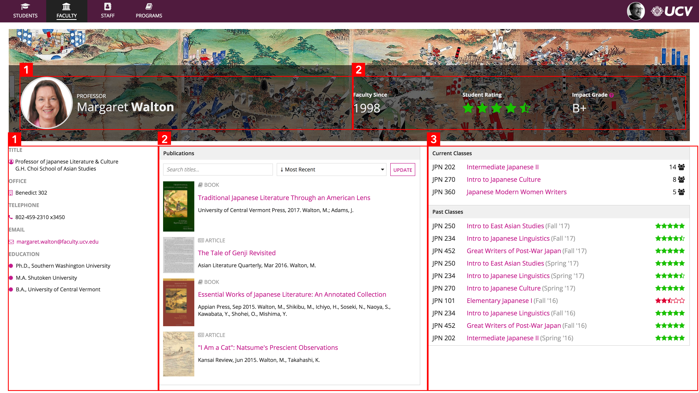
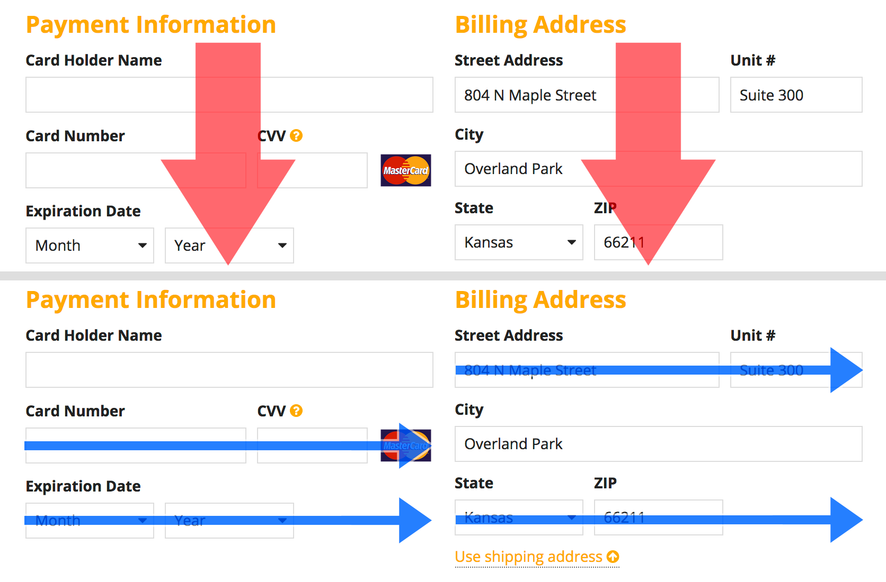

# Columns vs. Side by Side [SAIL Design System: Guidelines]

*Section: guidance | source: https://docs.appian.com/suite/help/26.7/sail/ux-columns-and-side-by-side.html | images referenced live in corpus/images/*

# Columns vs. Side by Side

## Introduction

The columns layout and side by side layout provide two complementary techniques for specifying the lateral arrangement of components across the width of your pages.

The **columns layout** is used for the primary, top-level organization of a page or section.

*Columns are used to define the overall content arrangement of this page: the billboard is divided into 2 columns and the main body is divided into 3 columns*

The **side by side layout** is used for fine-grained control over the presentation of small groups of related components.

*The orange outlines show all the places in this UI where side by side layouts are used to precisely arrange components within the overall columns of the page*

Another key difference between columns and side by side is the logical relationship between their horizontal layout elements.

Across columns, the meaningful order of components is vertical. That is, users read from top to bottom within each column. The horizontal relationship between column contents is generally incidental (i.e. which field in one column lines up with which field in the next column). This becomes significant when viewing UIs on small form-factor devices (like mobile phones); columns are "flattened" into a vertical stack instead of being alongside each other.

With side by side layouts, the meaningful order of components is horizontal. That is, users read from left to right (or right to left, depending on the language) to comprehend the contents.

*Column contents flow from top to bottom, while side by side items flow horizontally. This example combines columns for "Payment Information" and "Billing Address" with side by side layouts for arranging field groups for credit card and address inputs.*
