# Columns Layout [SAIL Design System: Components]

*Section: components | source: https://docs.appian.com/suite/help/26.7/sail/ux-columns-layout.html | images referenced live in corpus/images/*

# Columns Layout

## Introduction

The columns layout is a component that allows you to establish the primary structure of an interface.

Organizing page components into columns of similar content leads to a clean and well-structured design.

This page talks about when to use the columns layout component, its design configurations, and interface style guidelines.

## When to use a column layout

Use columns to define the primary organizational structure of your page.

Be mindful to choose columns appropriately, as there are situations where other layouts like the Side by Side or Pane layout components might be more suitable.

Here is a quick rundown of their differences, with further explanations below:

| Layouts | Uses | Benefits |
| --- | --- | --- |
| Columns | Establishes the basic structure of an interface and organizes large groups in vertical order. | Content is easier to scan, enhancing the user experience. |
| Side by Side | Horizontally organizes small groups of content within a columns layout. | Adjacent positioning of components is more precise. |
| Pane | This layout is used in place of the columns layout if each column should scroll independently. | Columns behave independently of one another. |

### Columns vs. Side by Side

Choosing the right layout for your interface depends on the type of content you plan to display and how you want to organize and arrange that content.

When deciding between using the columns or side by side layout, ask yourself two questions:

1. Am I trying to organize groups of components or am I focusing on formatting and spacing my content?

2. Am I arranging large or small component groups?

If you are focusing on large component groups, you are likely working with groups that encompass the main content of the page, such as dashboards, as they define the foundational page structure. In this case, use columns or pane layouts to organize these component groups.

If you are working with small component groups, like a profile image and name, use side by side layouts to format and precisely space this smaller-scale content within an overarching layout.

In the following example is a dashboard that displays:

1. The main body divided into two columns, which establishes the primary page structure.

2. The side by side layout used within a column to precisely arrange driver information.

For more information on the differences between the columns and side by side layouts, check out the Columns vs. Side by Side page.

### Columns vs. Pane

Deciding between a columns layout and pane layout is more straightforward. By default, use the columns layout to separate and organize page components. When you need independent column scrolling, use the pane layout.

Let's say you want to make an interface that consists of a sidebar menu and main page content. Your first thought may be to use columns to separate each section, but the pane layout would be a better option because we want the user to be able to scroll through individual columns.

 *(animated GIF)*

See the Pane Layout component page for more information about its usage.

## Columns layout parameter configurations

This section highlights the variations of the columns layout component to help you visualize what's possible for your interface designs.

The columns component can be found in the **LAYOUTS** menu within the **COMPONENTS PALETTE**. When in design mode, you can either place this component in a blank interface or within a top level layout.

Let's start with a basic column layout within a **Form** layout.

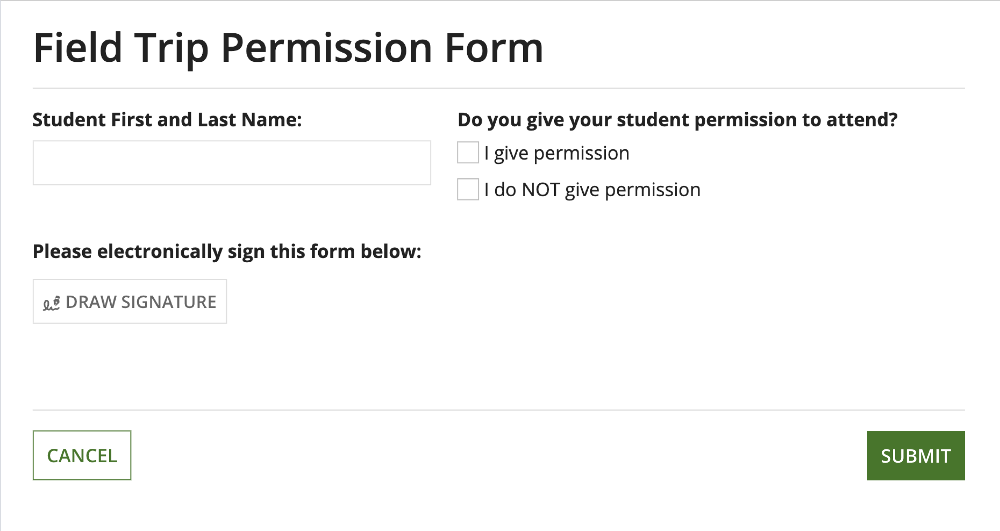

### Behavior configurations

The parameters in this section control how things behave when users interact with the component.

#### Stack when parameter

Use the **Stack When** parameter to set the window width at which the column layouts stack vertically. The possible window widths you can choose to stack at are: "Phone only" (default), "Portrait Tablet or narrower," "Landscape Tablet or narrower," "Narrow Desktop or narrower," "Desktop or narrower," "Never stack," "Custom."

You can also select a custom combination of screen widths you want your columns to stack in.

By default, columns and buttons stack at phone width where columns on the right go below columns on the left.

### Styling configurations

The parameters in this section control how things display for the component.

#### Margin above and below parameters

Use the **Margin Above** and **Margin Below** parameters to control the spacing above and below column content.

The possible options for both above and below are: "None" (default), "Even Less," "Less," "Standard," "More," "Even More."

The following examples illustrate what the margins above and below the column content will look like with "Standard" and "Even More" widths.

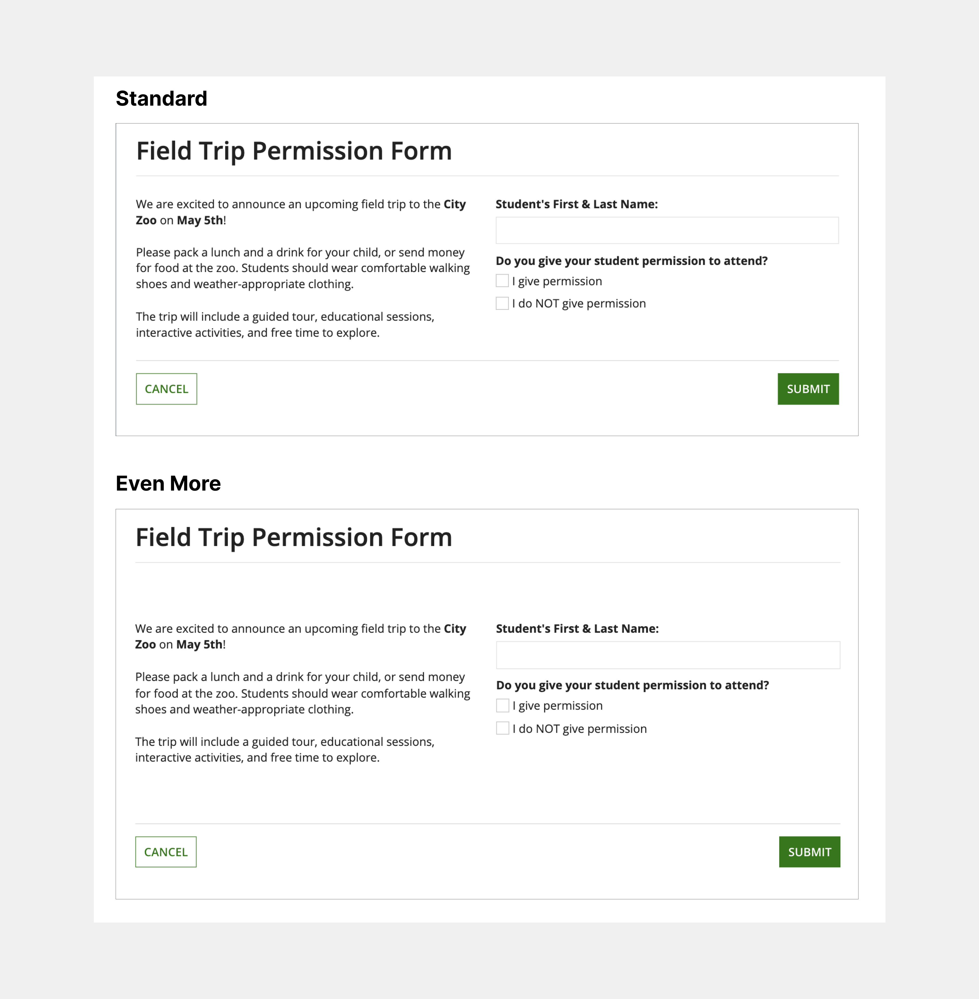

#### Vertical alignment parameter

Use the **Vertical Alignment** parameter to adjust how components are aligned vertically within the column.

You can set the vertical alignment to the following values: "Top" (default), "Middle," and "Bottom."

The following examples show what columns would look like with "Top" and "Bottom" alignment.

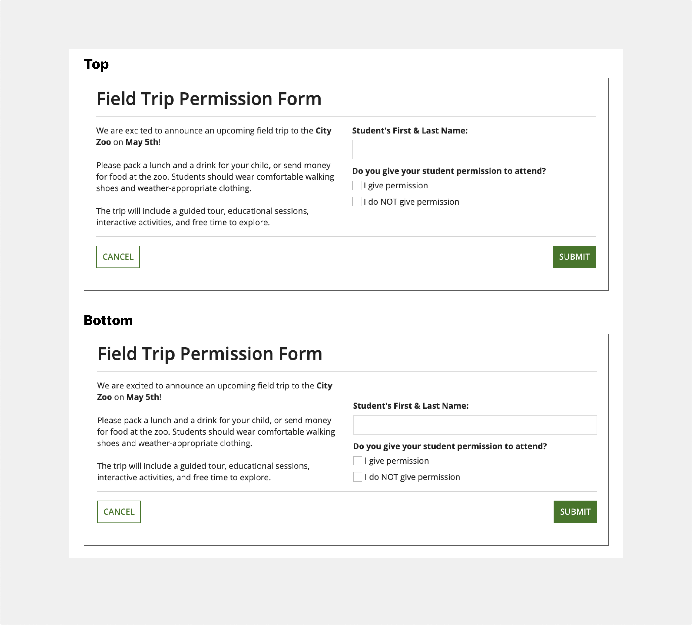

#### Column spacing parameter

Use the **Column Spacing** parameter to adjust the horizontal spacing between columns. The possible spacing settings are: "Standard" (default), "None," "Dense," "Sparse."

The following examples illustrate what the spacing between columns will look like with "None" and "Sparse" selected.

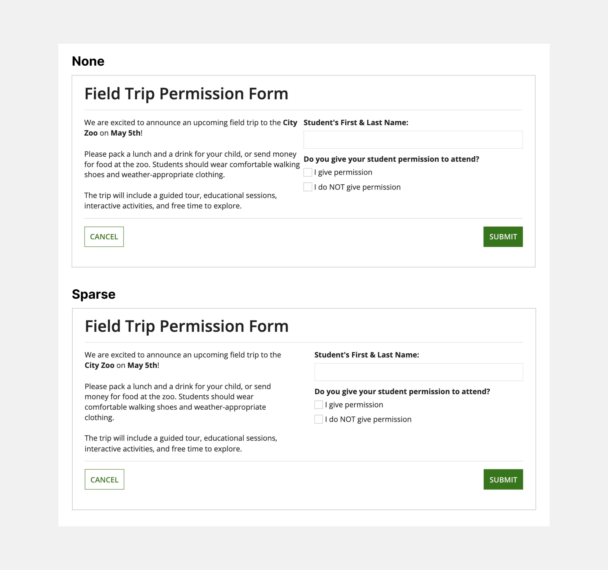

## Column layout parameter configurations

The parameters in this section are for the column layout contained within the columns layout.

### Styling configurations

The parameters in this section control how things display for the layout.

#### Width parameter

Use the **Width** parameter to define the width of the columns. Select each individual column component to view and select the width configuration. There are three types of column widths: Automatic, Relative, and Fixed. See the Column Layout component page for a deeper look into how these widths work.

**Tip:  **Be sure to test your interface on multiple screen sizes to make sure that the column widths you choose look good on different device widths.

##### Automatically distribute width

If no width is specified, "Automatically Distribute" is selected by default, automatically distributing columns evenly across the width of your screen.

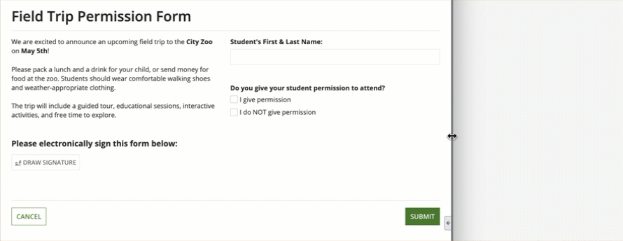 *(animated GIF)*

##### Set relative width

Select "Set Relative Width" to make columns proportional to one another. This width type is best used on columns that you expect to be expanded and contracted often as the screen size changes.

In the following example, the left column is set to a relative width of "2x" and the right column is set to "1x".

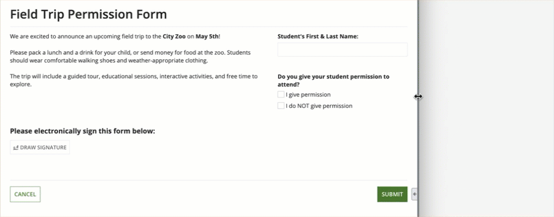 *(animated GIF)*

##### Set fixed width

Select "Set Fixed Width" to assign columns a constant pixel count regardless of window size. Use fixed column widths for content that should keep the same width across different screen sizes.

In the following example, the right column has a "Medium" fixed width while the left column has an automatic width.

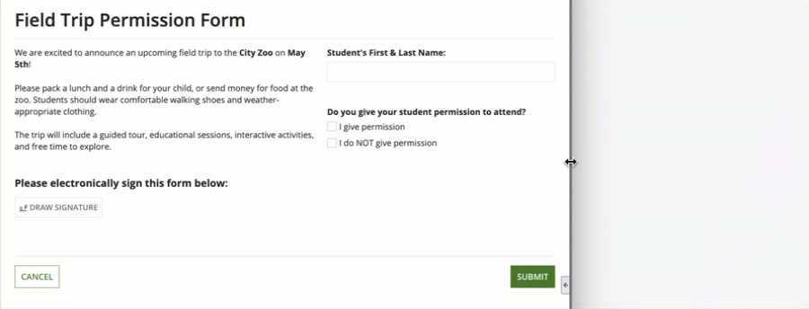 *(animated GIF)*

A useful approach is to set the leftmost and rightmost columns to fixed widths and allowing the center column to remain automatic. This ensures that the main content remains the center focus of the interface, without the side content distracting the user. The following example displays what this would look like:

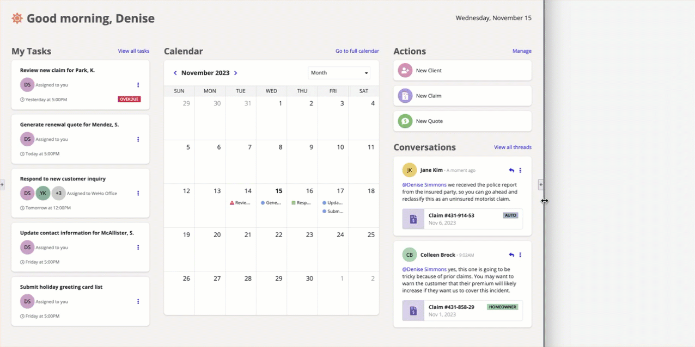 *(animated GIF)*

The columns on either side of the calendar are a fixed width while the calendar column is automatic.

## Style guidelines

This section highlights specific design guidelines and recommendations.

### Width

#### Using relative column widths

For interfaces that utilize relative column widths, ensure that the content within the columns maintain your intended layout and hierarchy as the screen dimensions change.

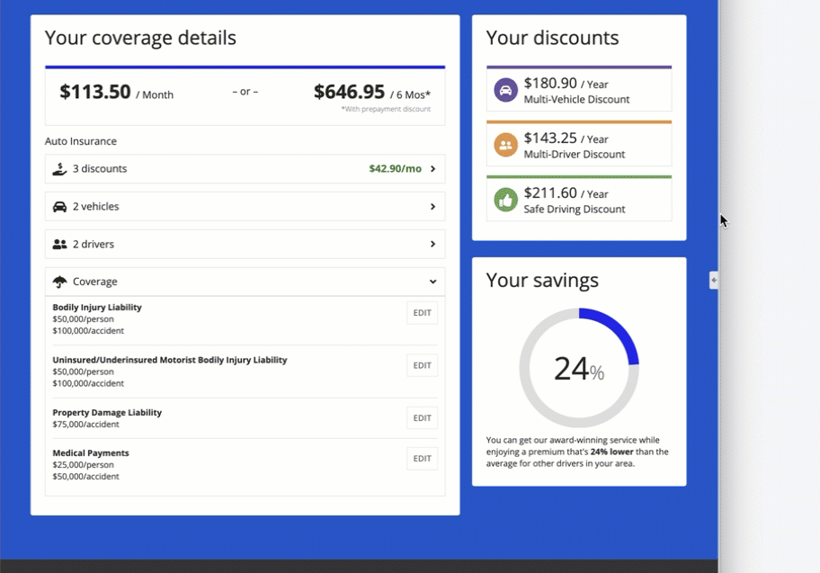 *(animated GIF)*

#### Using fixed column widths

It's important not to make all columns in one column layout fixed width because not every user has the same screen size. The fixed widths won't fit within every user's screen.

Additionally, be mindful of making widths too narrow or wide. Ensure that the width you set the column works with all the screen sizes you are designing for.

### Spacing

Use **Column Spacing** to adjust how dense or sparse your page will be. Adjust the column spacing settings to see which works best for your interface.

#### Negative space

Pay close attention to your use of negative space throughout your interface. Use proper negative space to enhance the readability and visual appeal of your design, while also preventing the feeling of clutter.

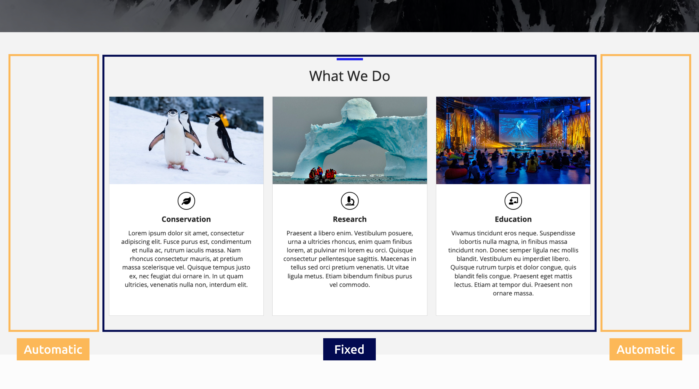 **[DO example]**

This page contains three foundational columns, where the left and right columns are set to the automatic width and remain empty. This centers the main content and prevents it from unnecessarily filling the entire screen.

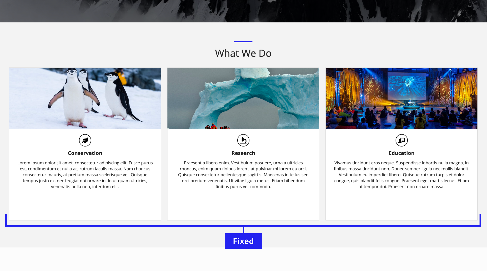 **[DON'T example]**

Even though there is space to make the content bigger and add more components, doing so isn't always necessary. More is not always better; avoid filling the entire screen if it does not enhance the user experience.

For more information, check out this UI Design Tip video on how to use negative space in your interface:

### Responsive stacking

Responsive design is vital for creating a usable and flexible interface. When designing and building an interface, keep in mind that it will be accessed on devices with varying screen sizes.

Use the **Stack When** parameter to define when content should stack at specific screen dimensions, enhancing your interface's responsiveness.

The following example shows a columns layout that is configured to stack when the window dimensions are equal to a portrait tablet or narrower.

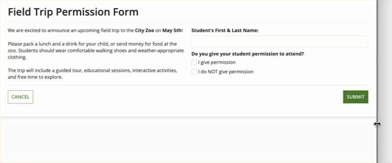 *(animated GIF)*

For more information about creating a responsive interface, visit the Responsive Design page.
