# Designing for Your Users [SAIL Design System: Guidelines]

*Section: guidance | source: https://docs.appian.com/suite/help/26.7/sail/ux-designing-for-your-users.html | images referenced live in corpus/images/*

# Designing for Your Users

## Introduction

It's often tempting to jump straight into the technical implementation of an application, checking off functional requirements one by one in an effort to quickly show everything working end-to-end. Such an approach may result in a suboptimal user experience where features merely work, but don't work well.

Crafting a great user experience requires research and planning before application construction begins. Specifically, you must understand who your users are and what they need to achieve. A superior design allows those users to successfully complete their work quickly and easily.

## Start with personas

Begin the design process by identifying your personas (the key audience groups for your application). For each persona, understand the users' needs and objectives as they perform their tasks. Optimize each user interface to best ensure the success of the associated persona.

For example, when designing an expense reporting tool:

- The employee persona may benefit most from a very simple and guided experience that avoids the need for training and minimizes errors.

- The expense approver persona may benefit from very dense UIs that allow them to efficiently process more reports in less time, even if the experience is less apparently friendly.

## Pay attention to flow and layout

Just because all of the required content and controls are shown on-screen doesn't mean that you've created the right solution for your users. Before building your interfaces, take time to plan out the right flow between steps and the best layout for each UI.

**Flow** refers to how users will navigate between the interfaces that they need to interact with to complete each activity.

- Will it be obvious to users where they need to go?

- Can users accomplish their tasks with a reasonable number of steps?

- Ask yourself, "are users going to get lost?"

The **layout** of each screen dictates the arrangement of content and controls.

- Is the interface balanced and visually appealing?

- Does the organization of UI sections map well to users' mental models of where they expect to find things?

- Ask yourself, "does this arrangement make sense?"

## Example: Reimagining a complex form

A mortgage loan application is a typical example of a complex paper form. Simply mirroring this layout with a digital form would be a missed opportunity for improving usability.

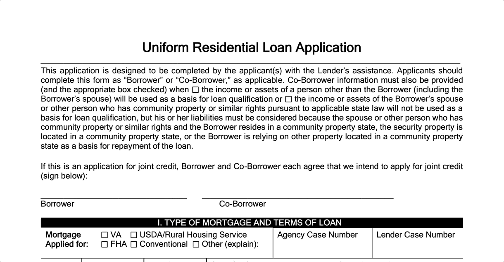 *(animated GIF)*

A new user, such as a first-time borrower, would likely be overwhelmed by a dense, multi-page form. Instead, the ideal UI design should guide users, step-by-step, through the activity. The user can concentrate on one question or decision at a time, instead of the daunting scale of the whole form. And the app could easily skip over unnecessary steps, while automating others.

The three representative screens below show how the cluttered, lengthy paper form could be transformed into a guided wizard. One topic is shown at a given time, making it easy to highlight the information that the user needs to provide. Buttons direct the user's progress through the sequence of tasks, while the left bar shows overall progress.

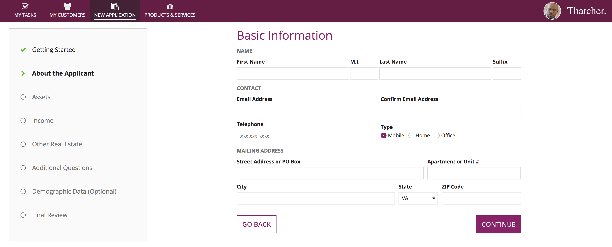

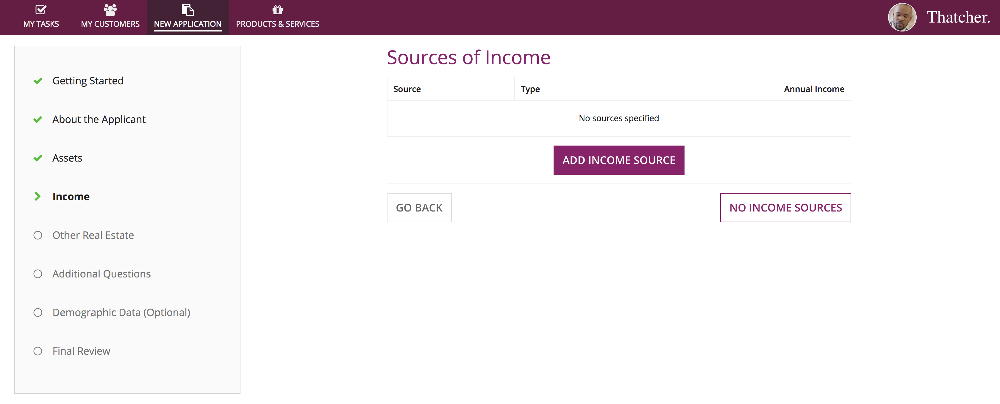

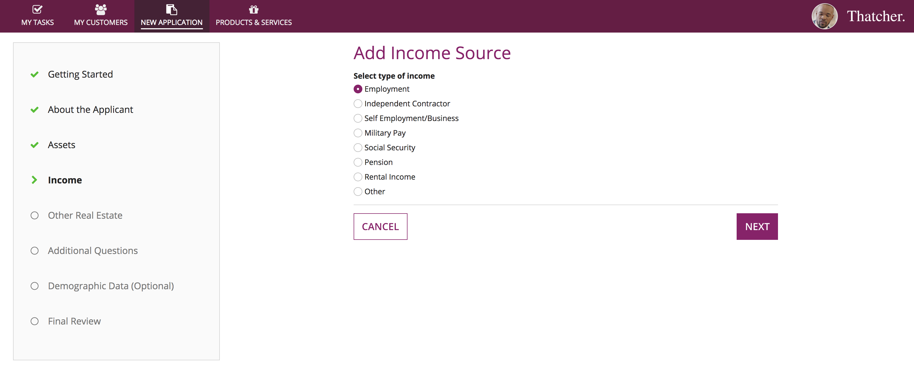

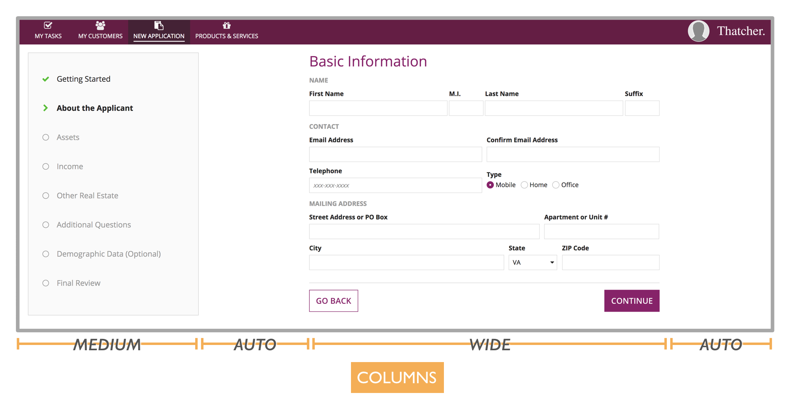

*The overall layout of this wizard UI is established with a 4-column arrangement. A "Medium" width column for the left bar and a "Wide" column for the current-step form contents keeps the widths of those elements constant. The 2 "Auto" width columns take up any remaining space across a variety of browser window widths.*

## Example: An information-rich dashboard

Many users rely on dashboards to see a single view of data related to a topic. A top priority for these UIs is information density. But it's also important for information to be clear and easy to understand.

In this example, executives will use a dashboard to review the financial performance of a cruise ship route.

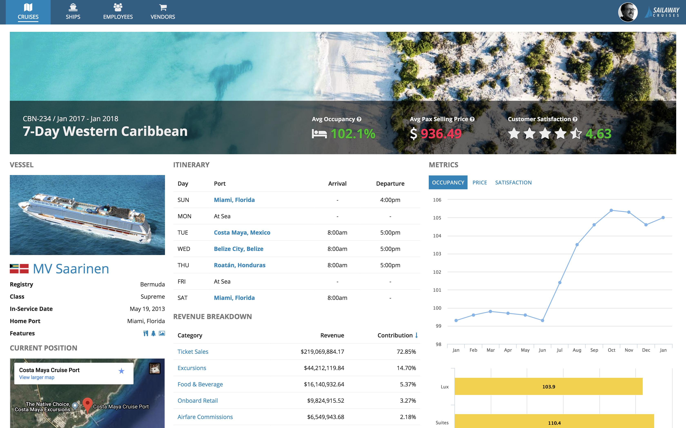

Let's take a closer look at the design of this dashboard.

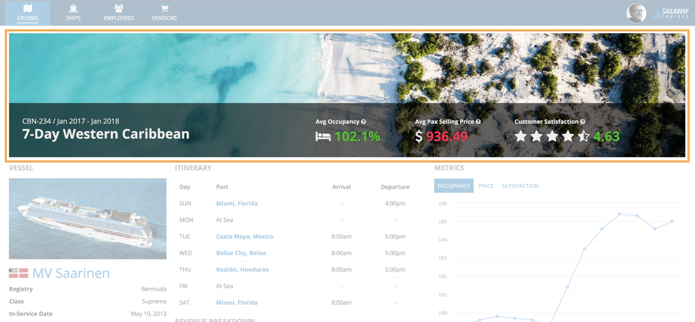

A billboard at top of the page adds visual appeal and also serves as an obvious header. It includes the title of the dashboard (the name of the cruise route being reviewed), as well as key performance metrics that can easily be scanned without having to examine the rest of the page contents. The metrics are made more easily readable through using a combination of rich text size, color, and icon features.

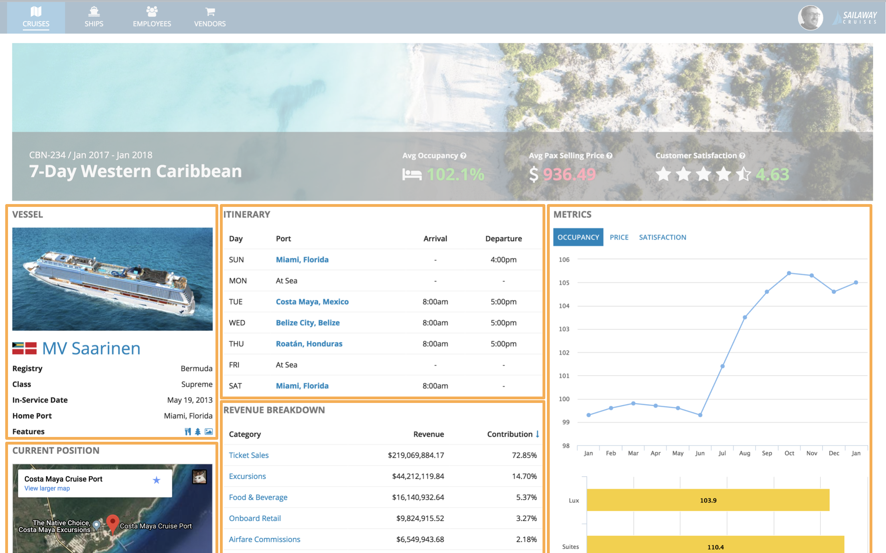

The main body of the page is divided into sections representing the main categories of information. Each section is labeled consistently with a title ("VESSEL", "CURRENT POSITION", "ITINERARY", etc.), making it easy for a viewer to scan the page to understand its structure.

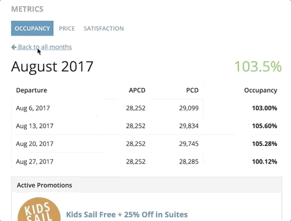 *(animated GIF)*

The "Metrics" section is an example of the in-place drill down pattern. From a chart showing monthly performance data, users can click on a month to see its details. The details view temporarily replaces the chart, and a link allows the user to return to the previous view.

This pattern allows more content to be made available on the dashboard without increasing clutter or requiring more scrolling. At the same time, users don't have to navigate to another page, and the overall layout of the dashboard remains constant.

## Example: An easy-to-use price quote wizard

When designing applications for novice or infrequent users, it is especially important to make choices to facilitate their success. Such users don't have the luxury of being able to make mistakes before learning through practice how to effectively use a new tool. If they can't get it right the first time, they may not want to try again.

In this example, we'll take a look at how a home insurance policy price quote wizard could be built to deliver a great experience even for a first-time user.

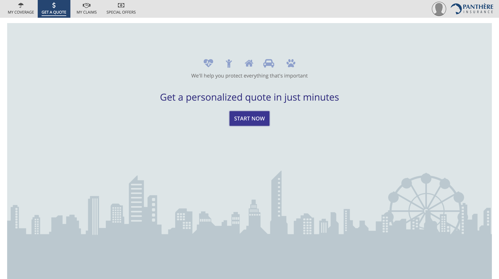

The start page uses billboards, rich text icons, large rich text with color, and a single large button to create a welcoming experience. This is a good example of how packing as much functionality into one page and removing clicks may not always be the best choice. Some personas benefit more from reassurance and simplified instructions.

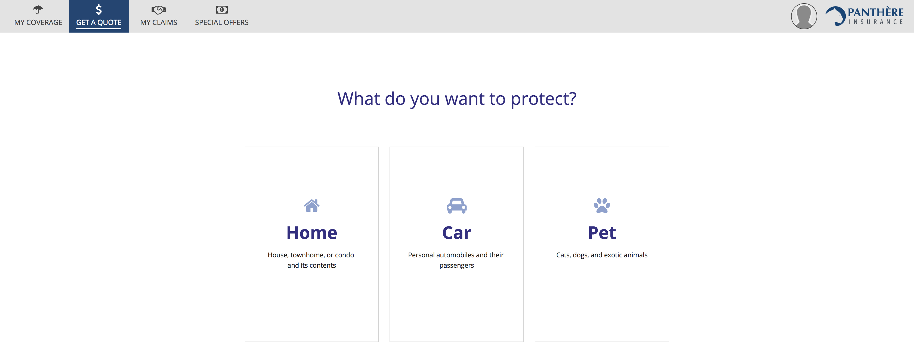

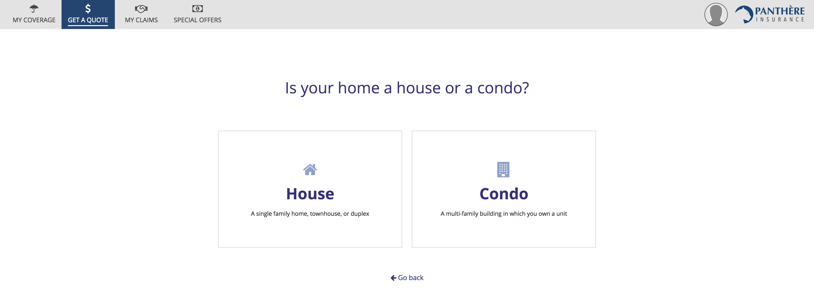

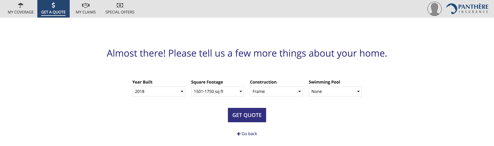

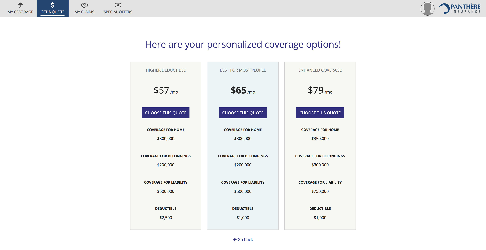

The initial steps of the price quote wizard ask the user one question at a time and offer a small number of answer choices via cards. While it would be possible to construct a functionally-equivalent single-page form with a series of radio button fields, the card-based approach is friendlier. Cards provide larger click targets for mouse users that require less effort to select. They also make it easier to show clear explanations for each choice, aided by icons and rich text.

## Research, design, and validate

Remember to keep your users in mind throughout the application creation lifecycle:

- Make time for research to identify your personas and their needs.

- Allow user needs, in addition to functional requirements, to drive your designs.

Don't assume that your initial designs will remain unchanged. Validate your design choices early and often by testing with representative users and applying their feedback to new iterations.
