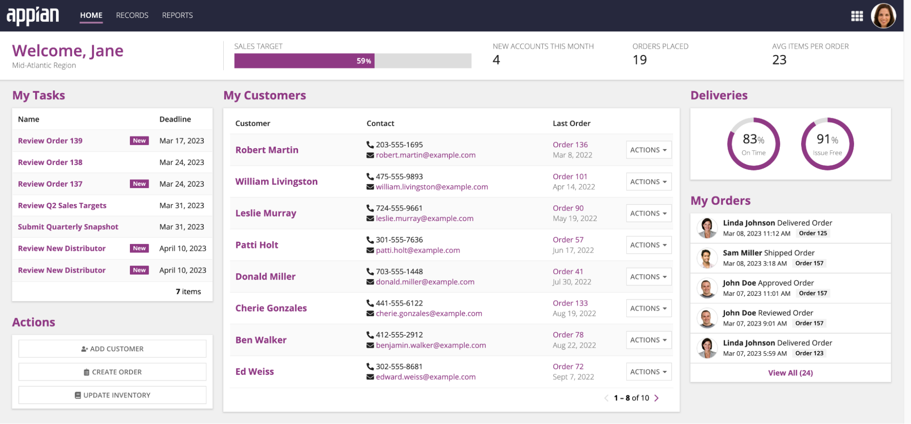
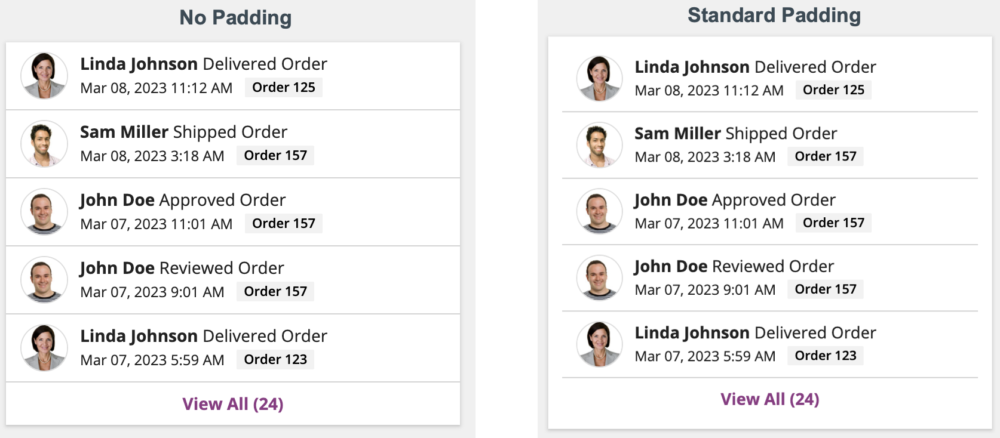
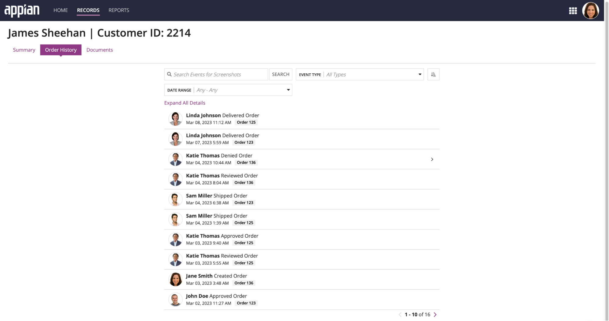
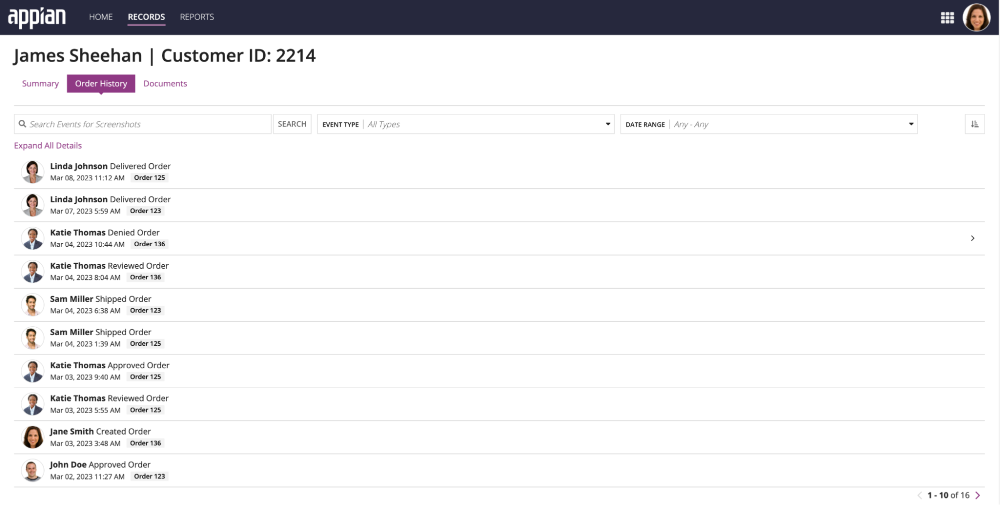
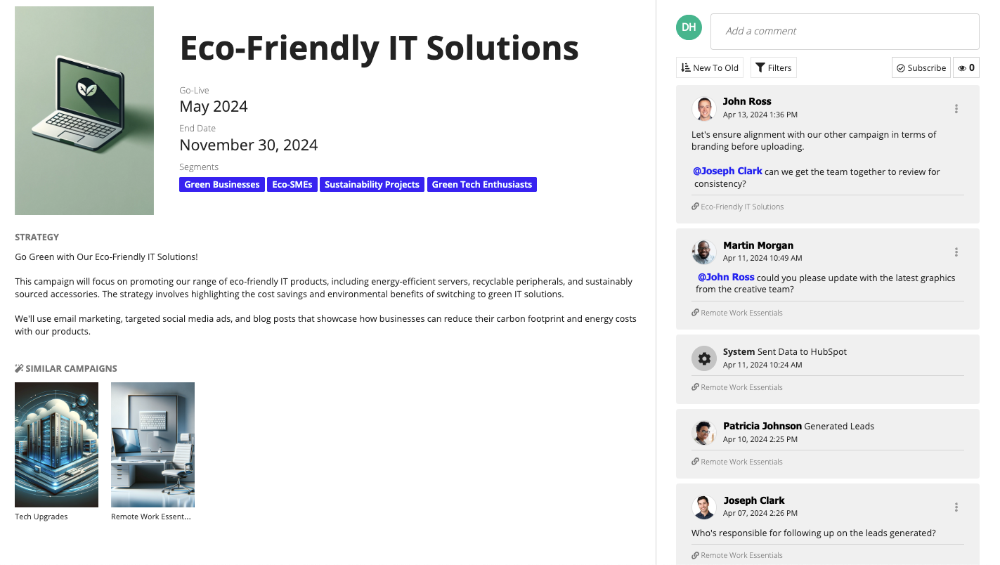
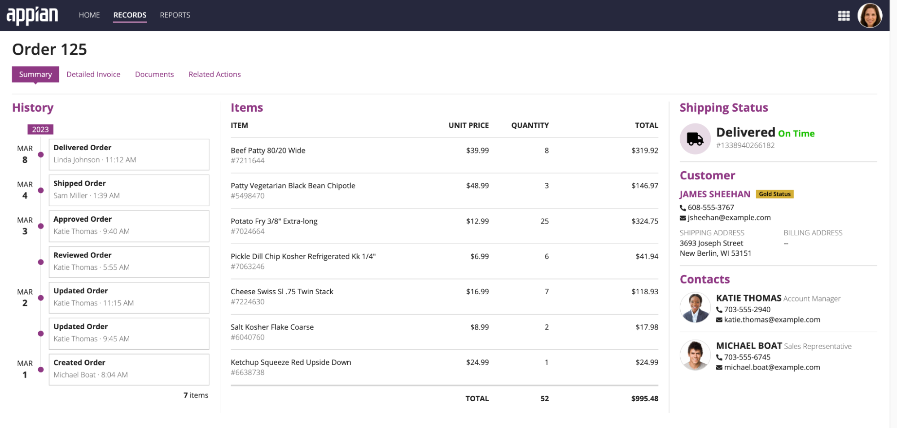
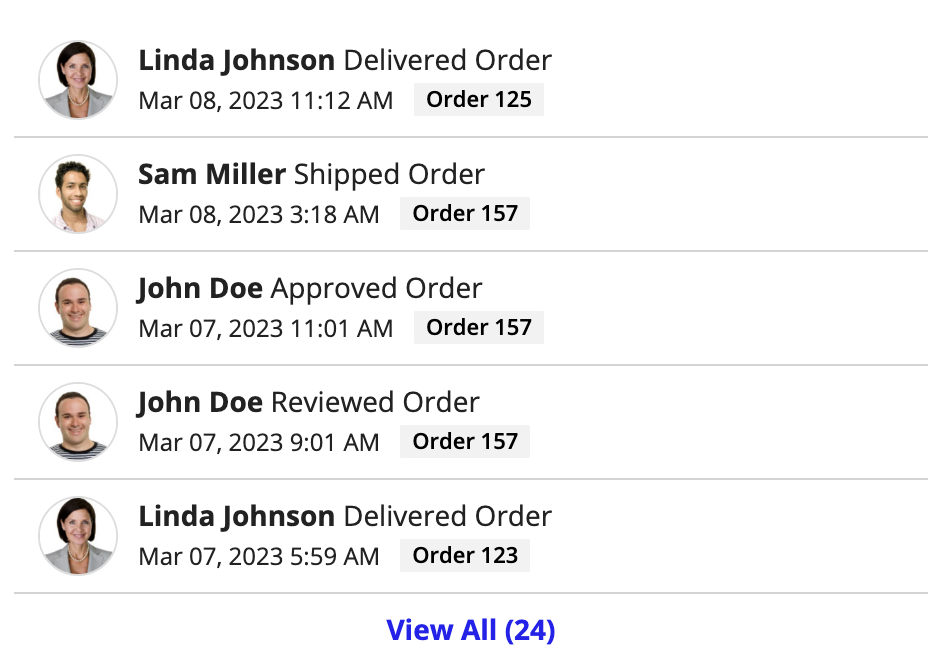
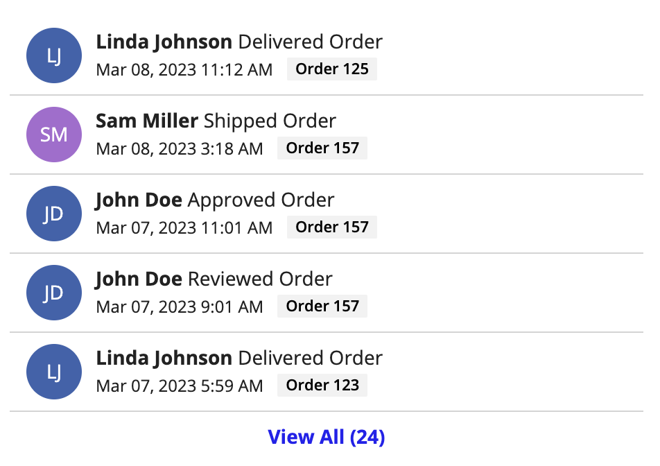
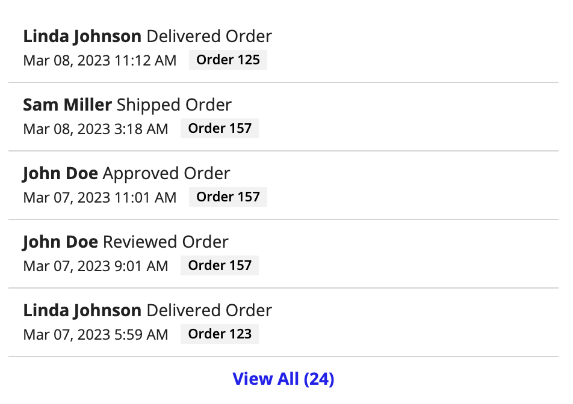

# Event History List [SAIL Design System: Components]

*Section: components | source: https://docs.appian.com/suite/help/26.7/sail/ux-event-history-list.html | images referenced live in corpus/images/*

# Event History List

## Introduction

Record events allow you to seamlessly track who takes action on your records and when. As you capture events, you can display them in an event history list component.

This page describes when to use the event history list and provides specific design guidelines and recommendations for using the event history list.

## When to use an event history list component

Use the event history list component to display record events for one or more record types in single, cohesive view. Proper usage of the event history list component will help you design a UI that displays process event data in an efficient and visually appealing manner.

## Event styles

You can choose between the following styles for the event history list: Preview List, Full List, Comment List, and Timeline.

### Preview list

Use the **Preview List** style when you want to display your event history alongside other components, like in a summary view or report. This allows users to get a quick snapshot of your most recent event history.

To display the event history list component alongside other components, use a column layout with a fixed width of "Medium", "Medium Plus", "Wide", or "Wide Plus" for the best view of the event history list. If you need to use a smaller column width, consider using the timeline style instead.

When placing this component inside of a card, set the card padding to "None" so the component lies flush with the edges of the card. Other padding options will impact the length of the divider lines in the event history component. For example:

### Full list

Use the **Full List** style when the event history list is the only component or the main component on an interface. This allows users to see a comprehensive list of events that can be quickly searched or filtered.

If collaboration features are configured, users can also add top-level comments and threaded conversations using this style. If you're using collaboration features, you may want to choose this style if you want the component to focus more on the events than on conversations.

When using the event history list as the main component on an interface, place it inside a columns layout. Set the middle column to a "Wide" width, and set the column width on the left and right to "Default". This will give the component enough space on the screen and feel balanced.

 **[DO example]**

Place the component in the middle of a columns layout.

 **[DON'T example]**

Place the component on an interface without using a columns layout.

### Comment list

Use the **Comment List** style to allow users to collaborate, add context to events, and mention other users in discussions right on the component. This style is most useful when you want users to be able to discuss events and view comments with events in a unified activity stream. This style should be used when you want to display the event history alongside other components and allow users to add top-level comments and threaded conversations.

### Timeline

Use the **Timeline** style to highlight milestones or events that do not have additional details. This style is most useful when users need to quickly understand the date and time in which an event occurred. Similar to the preview list style, this style should also be used when you want to display the event history alongside other components.

To display the event history list component alongside other components, use a column layout with a fixed width of "Medium", "Medium Plus", "Wide", or "Wide Plus" for the best view of the timeline. If you do not have tags configured on the component, consider using "Narrow Place" to remove the extra white space.

For longer timelines, consider using a column that extends the entire length of the interface.

## Page size

The page size determines the number of rows to display in each page of the event history list. Depending on your selected style, you will either configure a single **Page Size**, or you'll configure a **Preview List Page Size** and a **Page Size**.

The table below provides the recommended page size depending on your selected style:

| Style | Page Size Recommendation |
| --- | --- |
| Preview List | For Preview List Page Size, enter a value between 3 and 5. If the component extends the entire length of the interface, enter a value between 5 and 10.For Page Size, enter a value between 25 and 50. The dialog will automatically resize based on the number you select. |
| Full List | For Page Size, enter a value between 25 and 50. The component should take up the majority of the interface. |
| Comment List | For Page Size, enter a value between 5 and 10. The component should not take up the majority of the interface. |
| Timeline | For Page Size, enter a number between 6 and 10. The component should not take up the majority of the interface. |

****
 **** ****
 
 
 ****
 ****
 
 
 ****
 ****
 
 
 ****
 ****

## Date display

You can format the **Timestamp** field of the event history list component as a date, date and time, or a date and time with the timezone. When deciding which format to use, consider how important each of these attributes will be to understand the presented data.

For example, if users don't need to know the exact time an event occurred, consider omitting both time and timezone and just display the date.

## User image styles

This section highlights when to use the different user image style options.

### Profile Photo

Use the **Profile Photo** option when most of your application users have a profile picture. If a user does not have a profile photo, their initials will be displayed.

### Initials

Use the **Initials** option when most of your application users *do not* have a profile picture. This will create a more consistent display of user information.

### None

Use the **None** option when you need to remove extra space in the component, or you want to simplify the look of your component. The user's name will still appear in the component, but without any other visual elements.

## Color scheme

The User Color Scheme is used when User Image Style is set to the Initials style or when the profile option is selected and there is no image for the profile photo. You can choose between a pre-defined color scheme and a custom color scheme using a hex value.

For more information on choosing colors, see color schemes.
