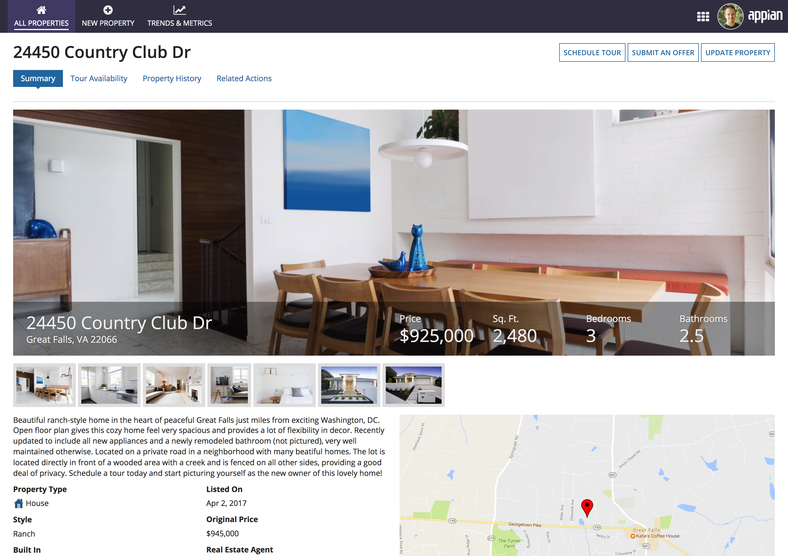
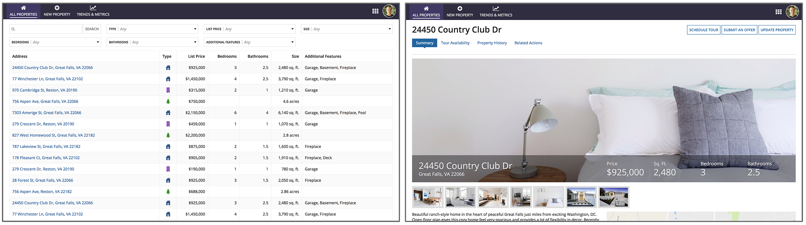
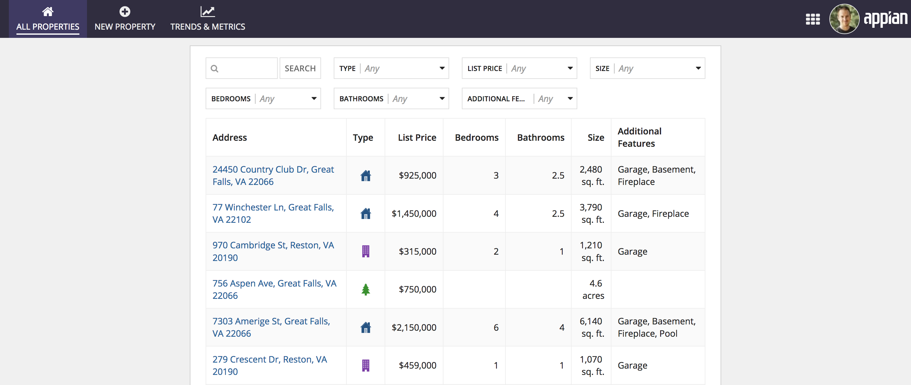
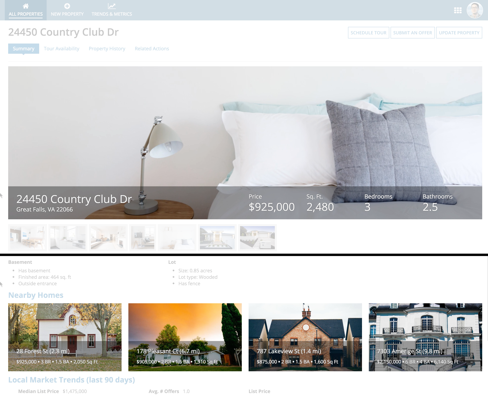

# Example Walk-Through [SAIL Design System: Guidelines]

*Section: guidance | source: https://docs.appian.com/suite/help/26.7/sail/ux-example-walkthrough.html | images referenced live in corpus/images/*

# Example Walk-Through

## Introduction

This real estate listing example UI shows how the range of interface layouts can be assembled to create an information-dense and visually-appealing page. The walk-through below describes the role of each layout in the overall design.

## Page width

Since this UI is shown in a site, the first layout choice is the page width. The selected width is applied to all of the content shown on the page. Here, this consists of the property search results grid (a record list) and the property summary (a record view). Since both of these UIs benefit from maximized horizontal space, the "Wide" page width is used.

*Both the record list and the record view benefit from the "Wide" page width*

*Using the "Narrow" page width would not have been appropriate for this content*

## Billboards

At the top of this page, a video tour of the real estate property loops in the background of a billboard layout. Key attributes of the property are shown in a bottom-positioned bar overlay. The "Dark" overlay style is used to create greater contrast between the foreground text and the background video.

As with other parts of the page, columns are used to arrange the content of the billboard overlay. A two-column layout splits the left and right parts of the bar, while a four-column layout within the right column is used to arrange the four attribute fields ("Price", "Sq. Ft", etc.).

## Sections

Section headings are used in this UI to highlight key areas like "Property Details" and "Nearby Homes". Users can easily scan the page to understand how content is organized.

## Columns

Columns are used to define the broad, top-level arrangement of content within sections. Nested columns are also used to create a dense, but balanced layout of components within the top-level columns.

Review the annotated image below to see how two layers of columns are used to establish this page layout.

