# Form Layout [SAIL Design System: Components]

*Section: components | source: https://docs.appian.com/suite/help/26.7/sail/ux-form-layout.html | images referenced live in corpus/images/*

# Form Layout

## Introduction

The form layout allows you to design pages with built-in features that streamline form design, including:

- A title bar that can be easily configured using title bar templates.

- A contents section with input fields as well as other components and layouts.

- A button section that allows you to specify primary and secondary button placement and can stick to the bottom of the screen.

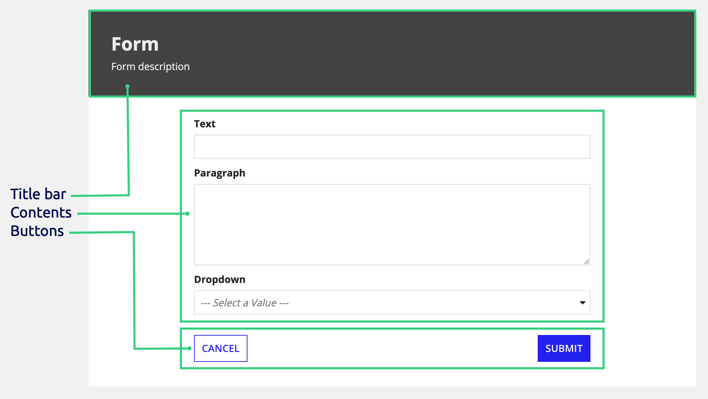

Because the form layout is a top-level layout, it cannot be nested within other layouts.

This page talks about when to use the form layout, how to use its design configurations, and what style guidelines to follow when designing interfaces.

## When to use a form layout

Use the form layout as your top-level interface to collect data in a structured, intuitive way. Drag and drop it from the component palette to quickly create a form with a title bar, content area, and button footer for a familiar user experience.

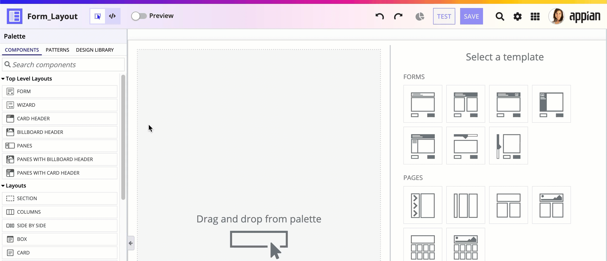 *(animated GIF)*

The form layout includes built-in features that help you provide a user-friendly experience:

- Buttons can be fixed to the bottom of the form.

- Primary and secondary buttons are automatically placed and styled.

- You can decide whether the form should focus on the first field when it is loaded.

- You can configure form-level validations.

Consider the following when deciding which layouts to use for form content.

| Use | When |
| --- | --- |
| A form layout | The form is simple and doesn't need to be divided into separate sections |
| A wizard layout | The form is complex and the form sections are best organized into sequential steps |
| A tab layout inside a form layout | The form is complex and the form sections are independent and can be completed in any order |
| Section layouts inside a form layout | The form is complex and all the form sections should be viewed at once |

Use a pane layout inside a form layout when the form is best organized into 2-3 independently scrolling columns.

For example, if you have two columns of content and one or both columns is longer than the height of most screens, you could use a pane layout instead of a columns layout so that users could scroll each pane separately.

## Parameter configurations

This section highlights variations of the form layout to help you visualize what's possible for your interface designs.

To use a form layout in design view, you must start with a blank interface. For existing interfaces, the **TOP LEVEL LAYOUTS** menu is not visible. To add a form layout to an existing page, either remove all existing content or switch to expression mode.

The following sections describe the parameter configurations as they are displayed in the component configuration pane of an interface object.

### Content configurations

The parameters in this section control what displays for the layout.

#### Contents parameter

Content configurations affect the main body of the form. They allow you to specify a list of components to display in the form's contents, the contents width, whether to automatically focus on the first form input.

Use the **Contents** parameter to add components and layouts you want to display in the body of the form. This will usually be input field components, but you can display any component or layout in the form contents, as long as it isn't a top-level layout.

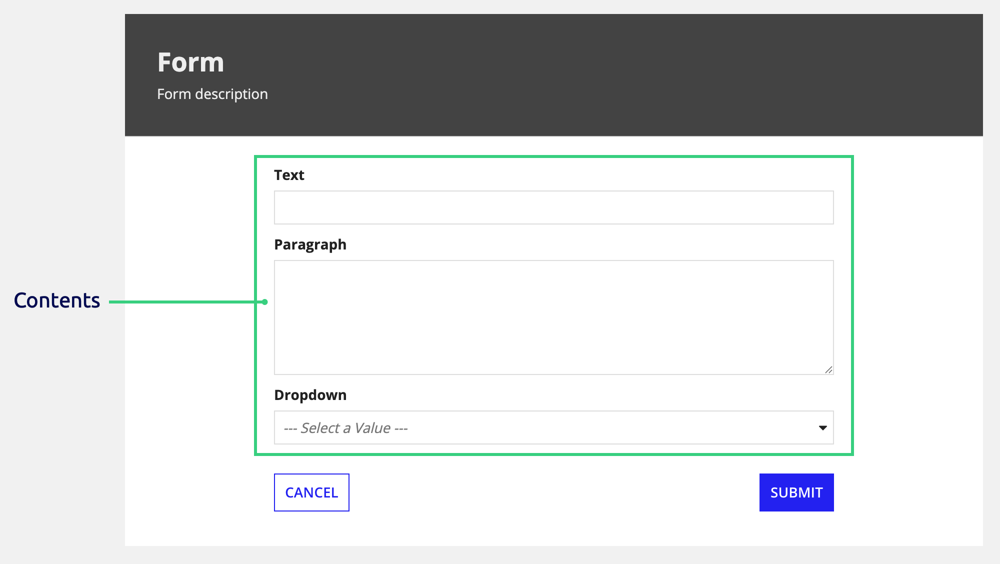

#### Buttons parameter

Use the **Buttons** parameter to add buttons to the bottom of the form using the Button Layout component.

The button layout splits buttons into primary buttons and secondary buttons. It automatically handles the placement and style of the buttons as follows.

##### **Button location**

When there is enough room for the buttons to display side by side without responsively stacking, primary buttons are aligned to the right and secondary buttons are aligned to the left (in left-to-right locales).

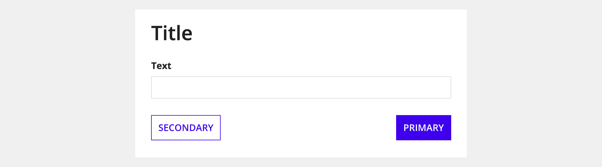

When the buttons are stacked due to the screen width, primary buttons appear on top.

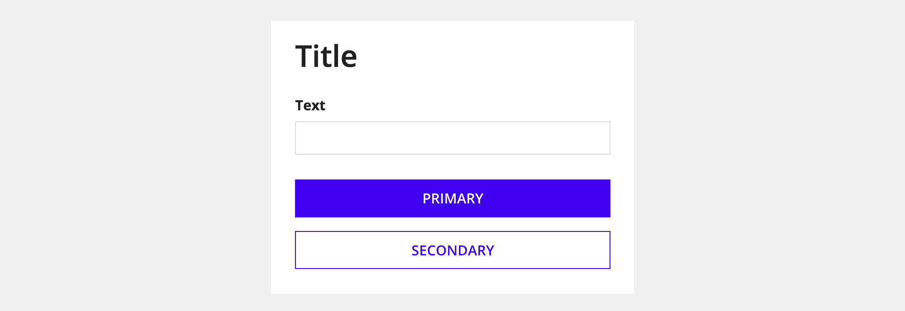

##### **Multiple primary and secondary button location**

Multiple primary and secondary buttons are automatically ordered based on their position in the list of buttons.

- Primary buttons: The first button in the list is the most prominent. It appears to the left of the other primary buttons (in left-to-right locales).

- Secondary buttons: The first button in the list is the least prominent. It appears to the left of the other secondary buttons (in left-to-right locales).

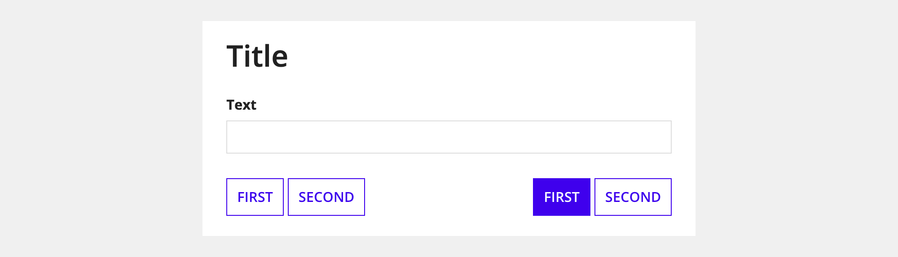

##### **Button style**

When you drag and drop a form layout from the palette, the primary button uses the "Solid" style and the secondary button uses the "Outline" style. All other buttons you add use the "Outline" style by default.

### Behavior configurations

The parameters in this section control how things behave when users interact with the layout.

#### Show when parameter

Use the **Show When** parameter to show or hide the entire form.

#### Validations parameter

You can use form validation parameters to alert users about problems that aren't specific to one component.

For example, in a contact form requiring either a phone number or an email address, you wouldn't use the **Required** parameter for both fields, since only one is needed. Instead, you could use form-level validation to ensure at least one field is filled. If both are empty, it alerts the user to fill out at least one of the fields.

See Showing Validation Errors that Aren't Specific to One Component for an example of how to set this up.

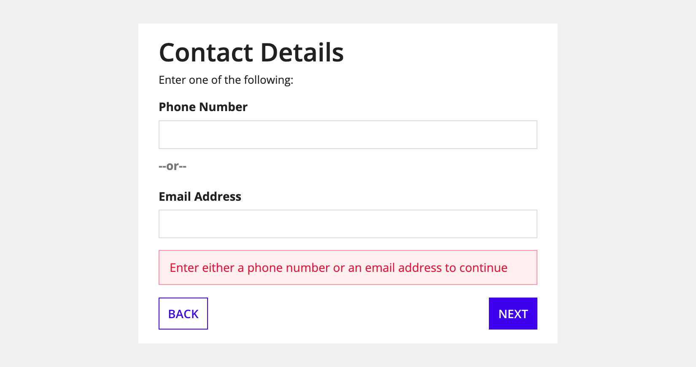

Use the **Validations** parameter to display one or more messages using the Validation Message component.

#### Validation group parameter

Use the validation group parameter to specify which fields to validate when a user clicks a certain button.

See the following recipes for more information:

- Configure Buttons with Conditional Requiredness

- Validation Groups for Buttons with Multiple Validation Rules

#### Automatically focus on first input parameter

Use the **Automatically focus on first input** parameter to control whether the cursor is automatically placed in the first field when the form loads. When this option is enabled, the first input field will be active by default.

 *(animated GIF)*

 *(animated GIF)*

| Focus on first input | Don't focus on first input |
| --- | --- |

#### Fix title bar when scrolling parameter

*Related style guidelines: In scrolling dialogs, use a fixed title bar and buttons*

Use the **Fix title bar when scrolling** parameter to choose if the title bar stays fixed at the top while scrolling.

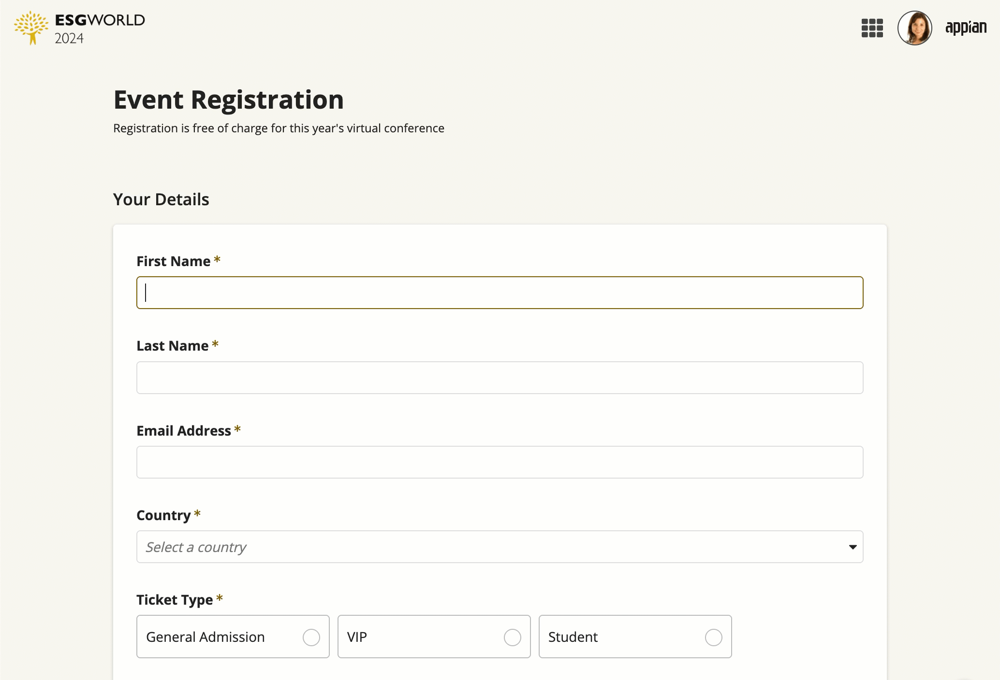 *(animated GIF)*

#### Fix buttons to bottom of form parameter

*Related style guidelines: In scrolling dialogs, use a fixed title bar and buttons*

Use the **Fix buttons to the bottom of the form** parameter to choose if the buttons stay fixed to the bottom of the form.

### Styling configurations

The parameters in this section control how things display for the layout.

#### Title bar template parameter

Title bar configurations affect the title bar. They allow you to control the title bar appearance, title bar divider, and whether the title bar is fixed when scrolling.

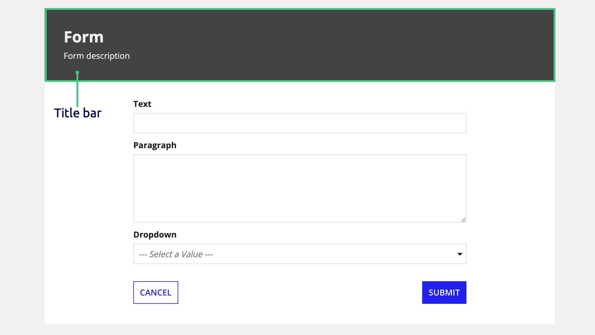

*Related style guidelines: Title bar guidelines*

Use the **Title Bar Template** parameter to customize the title bar's main text, optional secondary text, and style. You can configure this parameter using text, a title bar template (simple, full, image, or sidebar), a single billboard layout or card layout, or an array of billboard and card layouts.

#### Contents width parameter

*Related style guidelines: Use "Full" width when displaying forms in dialogs, Use one narrow column for the form content, Don't add additional columns to center form content*

Use the **Contents Width** parameter to set the width of the contents of the form. Valid values are "Full", "Wide", "Medium", "Narrow", and "Extra Narrow".

Select "Full" if you want the form to take up the entire width of the screen. If you are displaying the form in a record action dialog, we recommend selecting "Full" and configuring the dialog size in the record type to control the width of the form.

The following example shows the progression of contents width values from "Full" to "Extra Narrow".

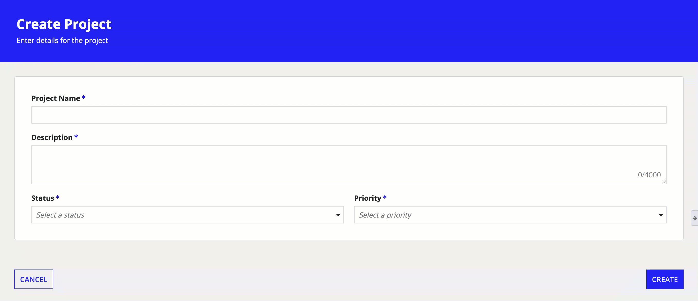 *(animated GIF)*

#### Form background color parameter

*Related style guidelines: Form background color guidelines*

Use the **Form Background Color** parameter to change the color of the form page. Valid values are, "White" (default), "Transparent", "Charcoal Scheme", "Navy Scheme", and "Plum Scheme". You can also set a custom color by using a hex code or hex code including transparency. To add transparency to the hex code, add two additional digits between 00 (more transparent) and FF (less transparent).

If you set the background color to "Transparent", the wizard will use the standard light gray background color that is standard in all sites and portals.

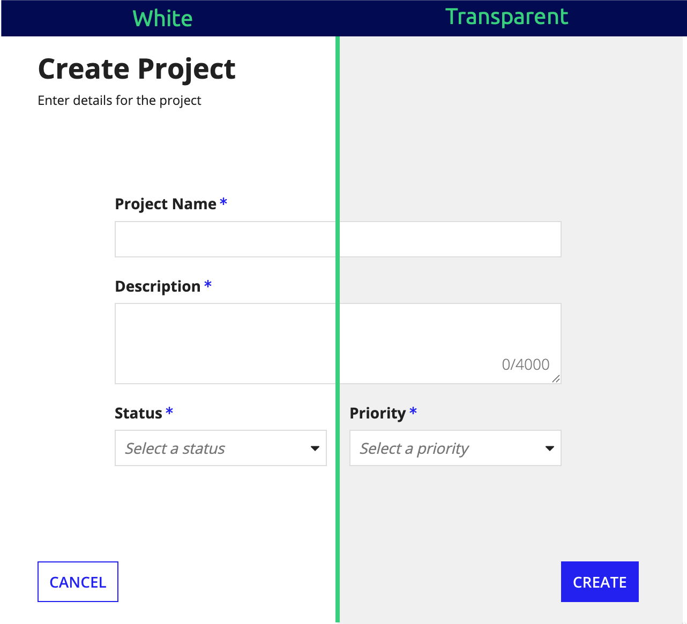

For information about the three dark color schemes (Charcoal, Navy, and Plum), see Dark Color Schemes.

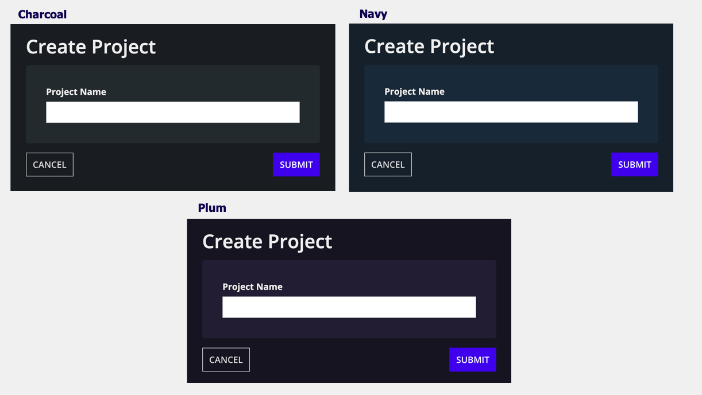

#### Show title bar divider parameter

Use the **Show title bar divider parameter** to show or hide a divider line below the title bar.

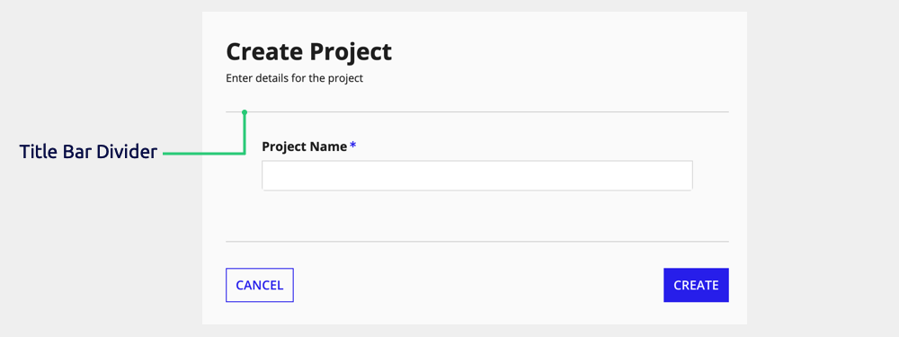

#### Show button divider parameter

Use the **Show button divider parameter** to show or hide a divider above the form buttons.

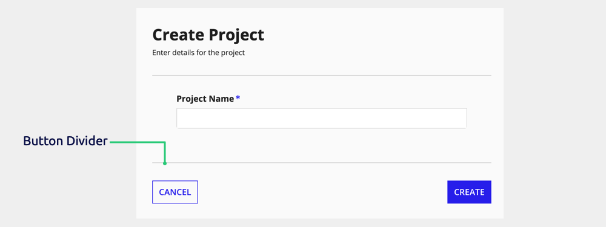

## Style guidelines - Form and wizard layouts

This section highlights specific design guidelines and recommendations for both form and wizard layouts.

See also: Accessibility (SAIL Design System: Guidelines), Forms (SAIL Design System: Patterns)

### Displaying forms in record action dialogs

#### In scrolling dialogs, use a fixed title bar and buttons

When displaying the wizard in record action dialogs that are likely to require scrolling, we recommend fixing the title bar and buttons.

If you leave the default option for fixing the title bar and buttons, they will automatically be fixed when displayed in record action dialogs, and not fixed when displayed elsewhere.

#### Use "Full" width when displaying forms in dialogs

If you are planning to display the form in a record action dialog, set the **Contents Width** to "Full". This allows the Dialog Box Size to control the width of the form and ensure the form takes up the entire width of the dialog.

### Structuring forms

#### Use one narrow column for the form content

To make your forms more usable, consider placing all the content in one column.

Using multiple columns for wider forms is often driven by the desire to avoid scrolling and fit everything on one screen. However, having too much information on one screen can overwhelm users. In fact, users don't mind scrolling and find it easier to navigate forms that have one main column.

You can use columns or side-by-side layout sparingly to group related information like first and last name.

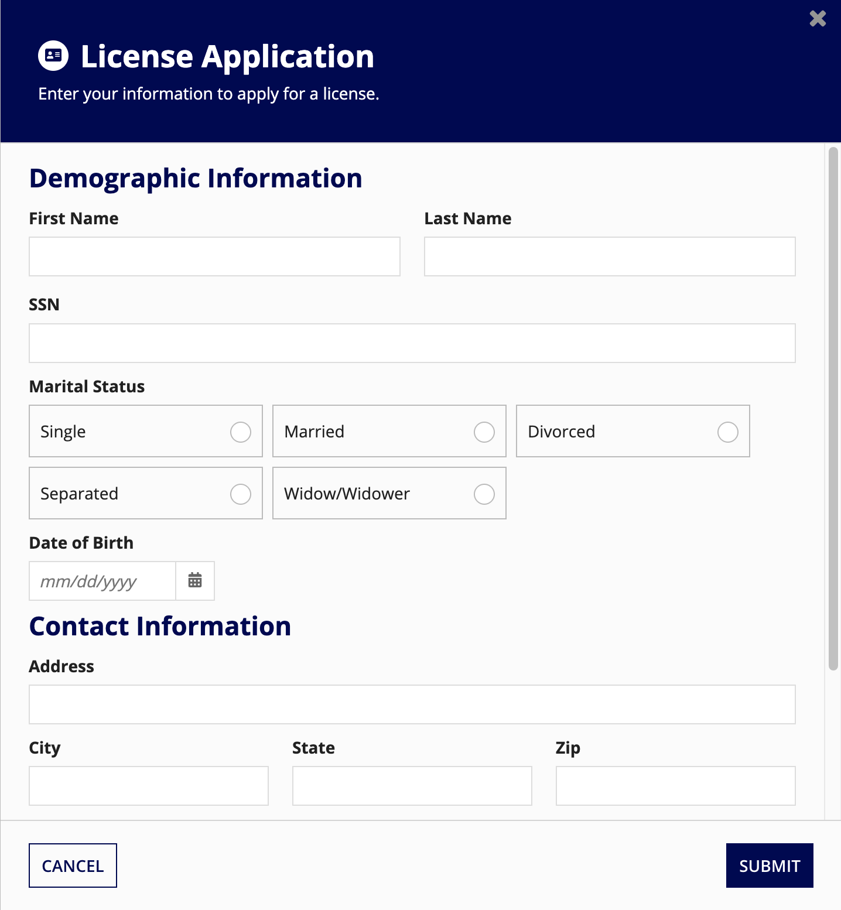 **[DO example]**

Using one column helps users navigate and looks cleaner.

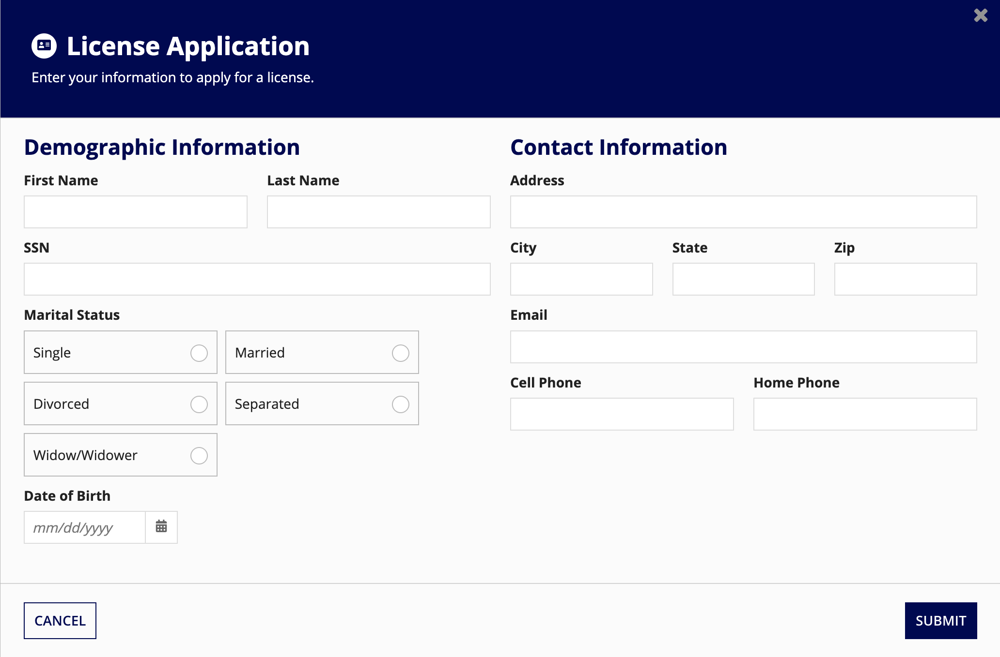 **[DON'T example]**

Placing two sections next to each other makes the form look cluttered and hard to navigate.

You'll want to use a narrower width for these forms so that your fields don't stretch across the entire screen.

If you are displaying the form in a record action dialog, you will still want to use "Full" for the contents width. Just be sure to configure the dialog in the record type to be smaller.

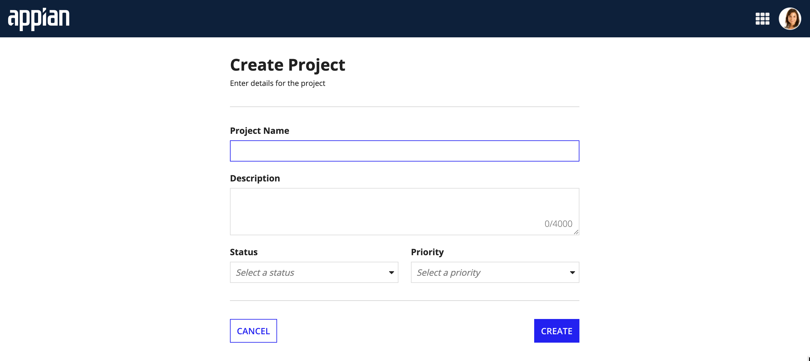 **[DO example]**

This form uses "Narrow" for the **Contents Width** so that the fields take up only as much space as they need.

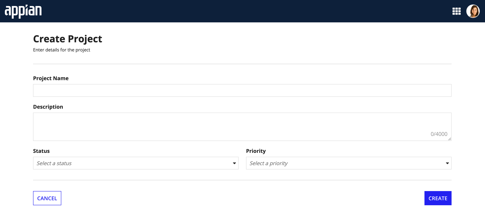 **[DON'T example]**

The **Contents Width** is too wide for this form, allowing the fields stretch across the entire screen and take up more space than they need.

#### Don't add additional columns to center form content

Form layouts are designed to use the contents width parameter to keep the content centered on the screen. Do not add additional columns to try to center the content.

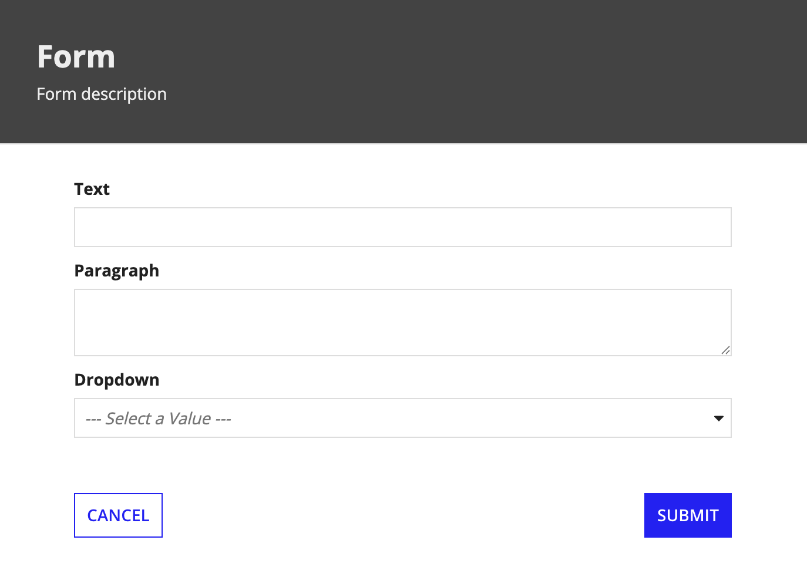 **[DO example]**

This interface uses "Narrow" for the contents width which allows the form contents and buttons to align. Extra space is automatically added to the sides of the form and the content is automatically centered.

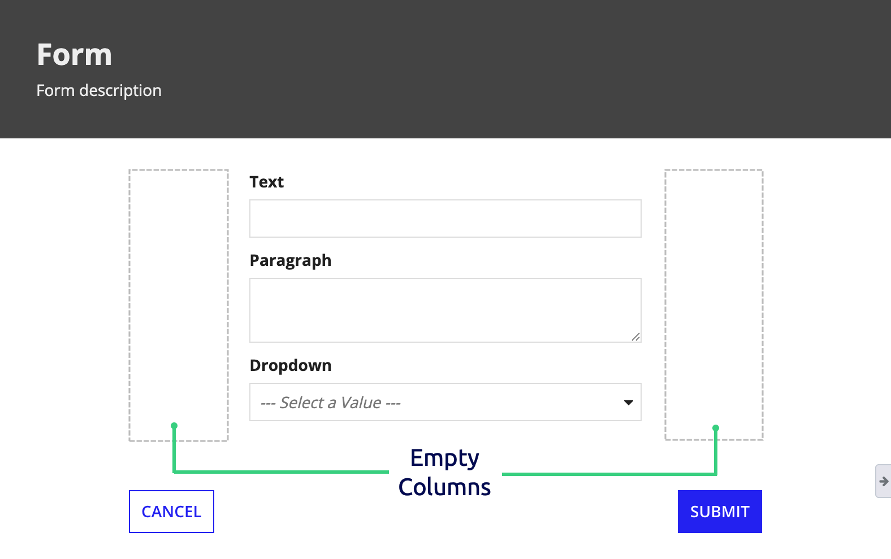 **[DON'T example]**

The form buttons should be aligned with the form contents. In this interface, the buttons don't look aligned with the form contents because there are empty columns added.

#### Constrain input width and group related fields

Constrain input widths based on expected length.

Additionally, use side by side layout to group related fields, organizing related fields horizontally to follow patterns that users expect. This makes it easier for users to scan the form and quickly complete it.

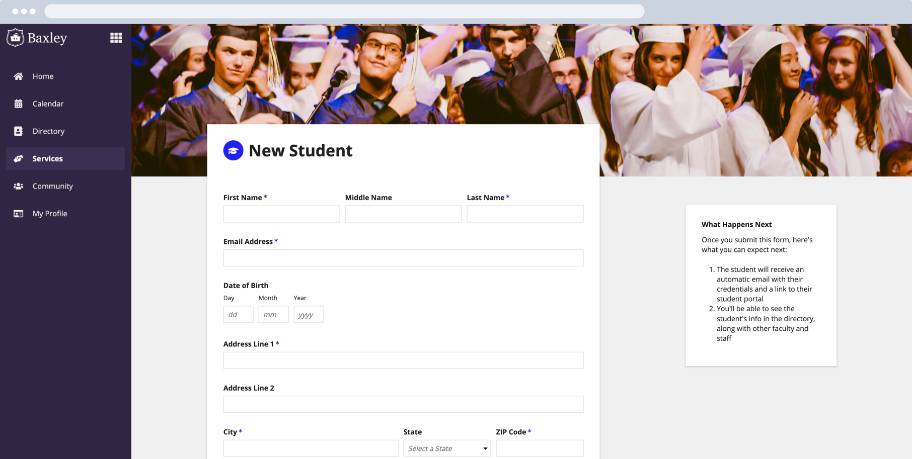

*In this example, input fields for **City**, **State**, and **Zip Code** are organized together because they are all address-related. Each of these fields also takes up an appropriate amount of space based on their expected input length.*

#### Use cards and headings to group related content

When structuring a form, consider using cards and headings to group related content and visually distinguish sections from one another.

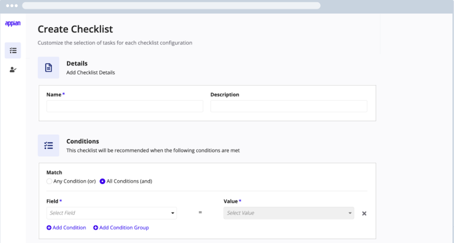

*In this example, headings are used to create visual distinction and provide instructions for the user. White cards group related fields and make the page easier to scan.*

### Form background color guidelines

#### Use transparent background color or hex code when content is primarily cards or boxes

Use the "Transparent" background color or a hex code with transparency when your content is mostly or entirely arranged within card or box layouts. Because cards and boxes provide their own white backgrounds, this setting allows them to stand out clearly against a contrasting background.

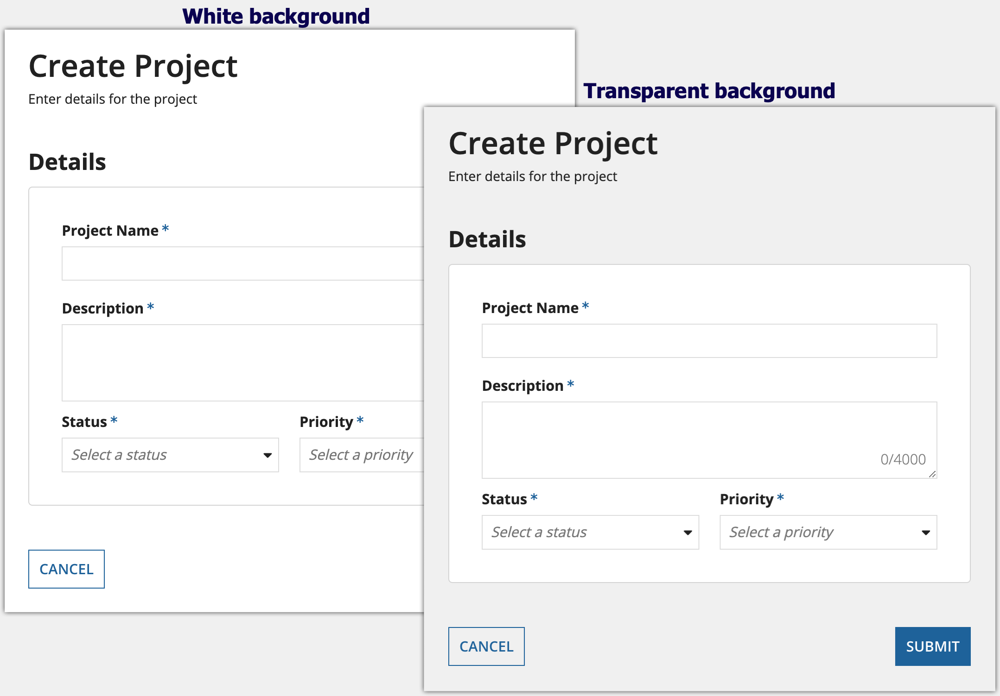

#### Create enough contrast between contents and background color

If you are using a custom background color, make sure there is enough contrast between the page contents and the page background color to ensure accessibility compliance.

#### Don't alternate between dark and light color schemes across site pages

Use dark color schemes only when you can apply the scheme to **all** of your site pages. Avoid creating sites with a mix of pages with dark and light color schemes.

For guidance on using dark color schemes consistently across your site, see Dark Color Schemes.

### Title bar guidelines

#### Simple header template guidelines

The following are some guidelines for using the simple header template.

- Consider adding an icon to simple headers to help the header stand out.

- If the secondary text in your title bar has long secondary text, use the title bar divider to help separate the instructions from the content of the form.

#### Image header template guidelines

If you display an image header template in a dialog, make sure the image size is appropriate. Both the text and the size of the image changes when you change the image size, so be aware that title text will also be larger when you choose a larger image size.

Be especially careful on shorter dialogs, where even a smaller image size can take up more space than necessary, leading to unnecessary scrolling.

**Tip:  **The image won't appear on narrower screen sizes since it is automatically responsive.

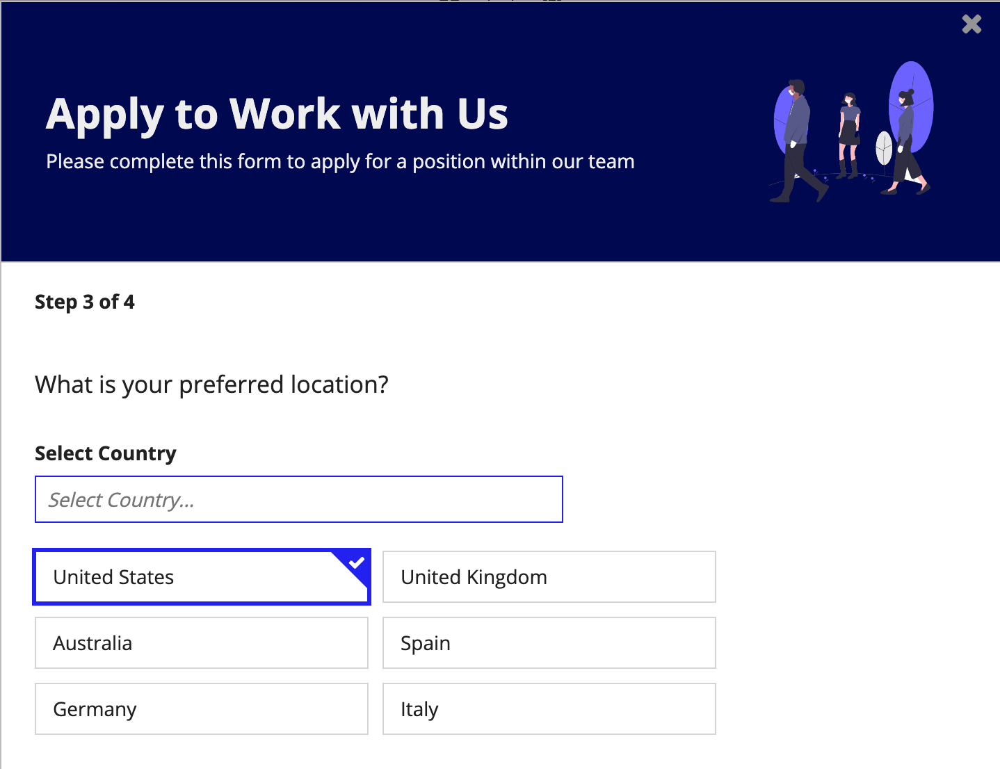 **[DO example]**

In this example, the image header takes up an appropriate amount of space.

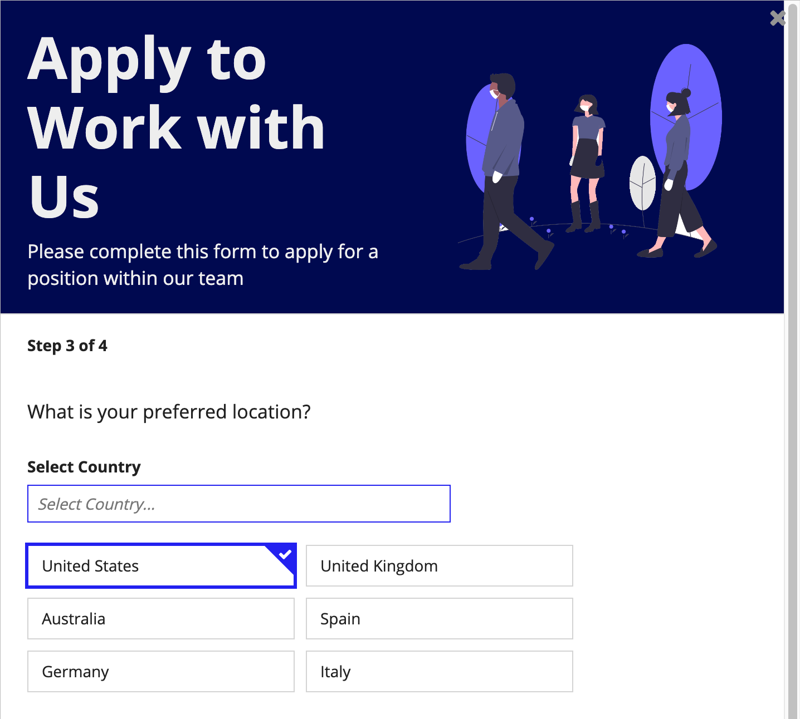 **[DON'T example]**

In this example, the image header is too large for the dialog.

#### Sidebar template guidelines

If you are displaying your form in a dialog with a sidebar title bar, make sure the dialog is wide enough to display the sidebar. Dialogs with a width of Medium or smaller will automatically display the sidebar as a header.

See the Sidebar Template Usage considerations for more information about the sidebar behavior.

#### Choosing a title bar template

We recommend starting with the full header template for most forms, as it generally looks good on all kinds of forms.

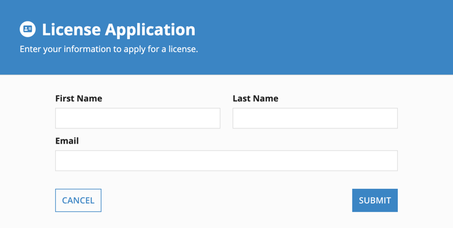

Consider using the simple header template for data-heavy forms, especially if you are displaying it in a dialog.

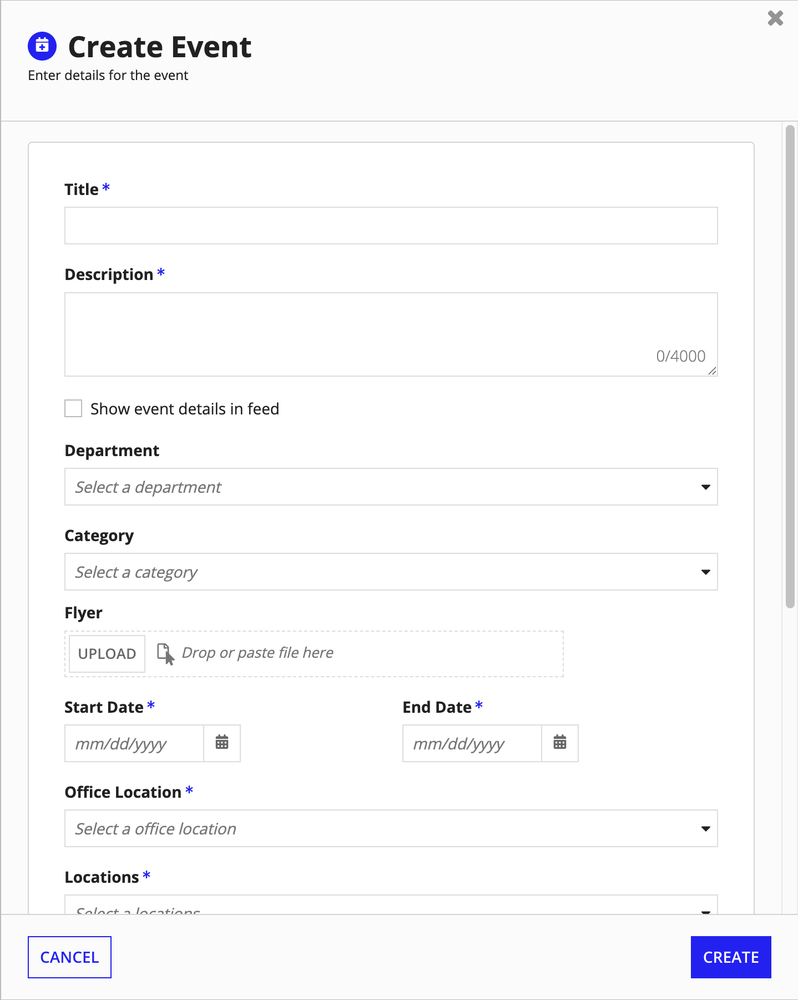

The image header template looks great on customer facing forms, like in portals.

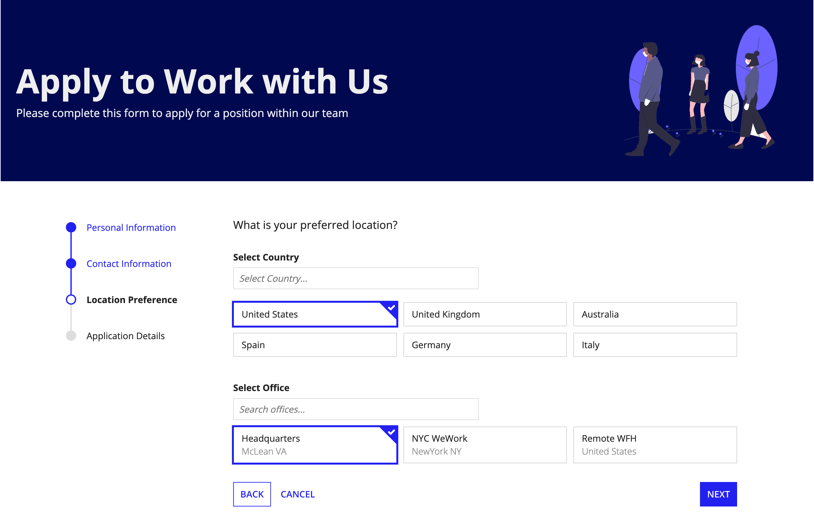

Use the sidebar template to anchor the form with supporting content that provides helpful context, such as a checklist or contact information.

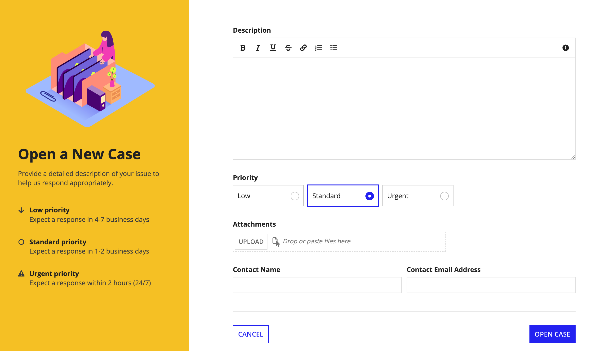

### Additional guidelines

#### Match verb choice in titles and buttons

Any verbs in the form title, such as "create," should be used consistently in the submit button label and the label of any button used to launch the form.

#### Always include a cancel button, consider including a save button

Always include a cancel button that doesn't save changes, to allow users to exit the form without input.

Consider providing a button for users to save their progress and return later for forms that can't easily be completed in one session.

#### Select the appropriate component type for user inputs

When creating a form, select the components that are the most appropriate for the type of information the user needs to input.

For example, use radio buttons for forms where users must select one option from a short list, and checkboxes for selecting none, one, or many options from a short list.

See Inputs, Selection, and Pickers (SAIL Design System: Guidelines) for more details about choosing these types of components.
