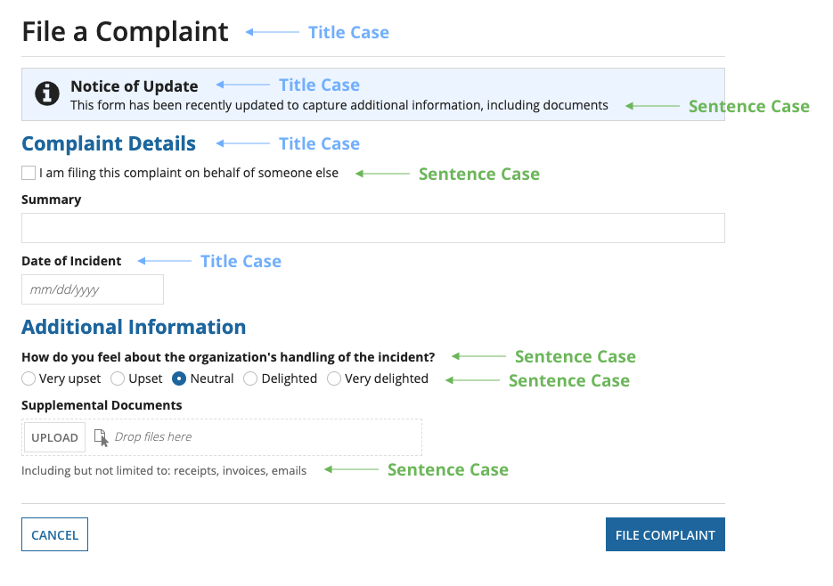
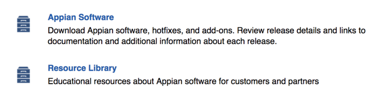
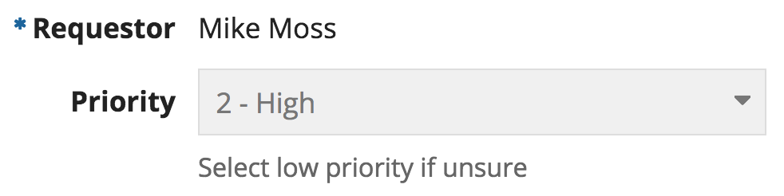
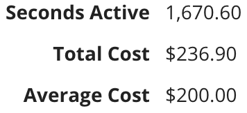
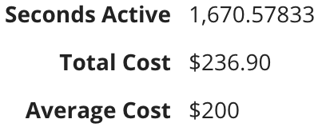

# Formatting and Punctuation [SAIL Design System: Guidelines]

*Section: guidance | source: https://docs.appian.com/suite/help/26.7/sail/ux-formatting-and-punctuation.html | images referenced live in corpus/images/*

# Formatting and Punctuation

## Capitalization

Use title case capitalization for page titles and section headers. Use sentence case capitalization for messages, instructions, and the choice labels of radio buttons and checkboxes.

For field labels, use title case capitalization. Long field labels are difficult to scan and should be avoided. If a field label cannot be trimmed down to a concise length, use sentence case capitalization to improve readability.

## Period usage

When an instruction or description is composed of a single sentence, do not include a period at the end of the sentence.

When there is more than one sentence, all sentences should end with punctuation.

 **[DO example]**

## Action and task form titles

Use titles with data specific to the form instance rather than generic form titles, without being too verbose.

Action or task form titles should match the title that appears in the actions or task list exactly.

 **[DO example]**

 **[DON'T example]**

## List view items

 **[DO example]**

Use concise and self-explanatory titles. If not possible, add a description and make sure it is not redundant.

 **[DON'T example]**

Avoid restating the object type (i.e. record, report, action) in the description

## Read-only format

Avoid displaying information intended to assist users with data input (i.e. required indicator, instructions) on read-only fields.

Use read-only text instead of a disabled dropdown component to display a selected dropdown value on a dashboard.

 **[DO example]**

 **[DON'T example]**

## Number format

Use digit group separators for long numbers to increase readability. This does not apply to ID numbers.

Show the appropriate level of precision necessary given the purpose of the data.

Use consistent number precision (even if ".00").

 **[DO example]**

 **[DON'T example]**

## Date and time format

When displaying a date and/or time in a read-only text field, show times in the user’s configured timezone to eliminate the need to display the timezone abbreviation or offset.

 **[DO example]**

 **[DON'T example]**
