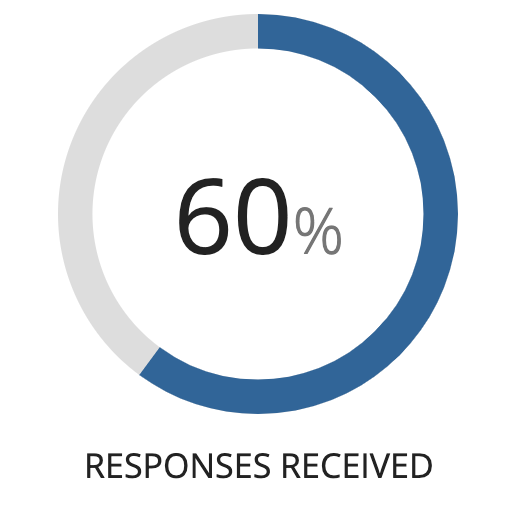
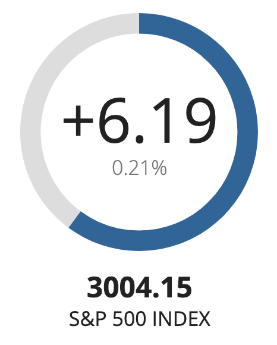
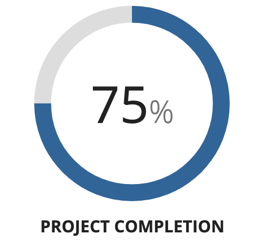
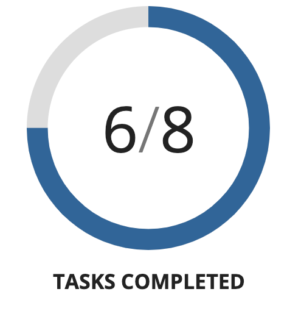
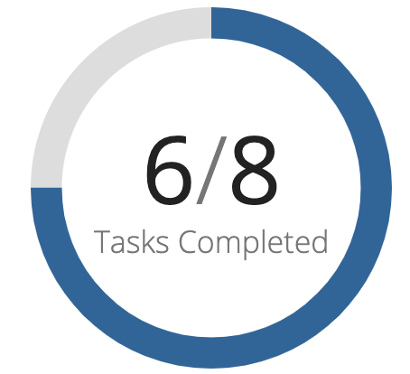
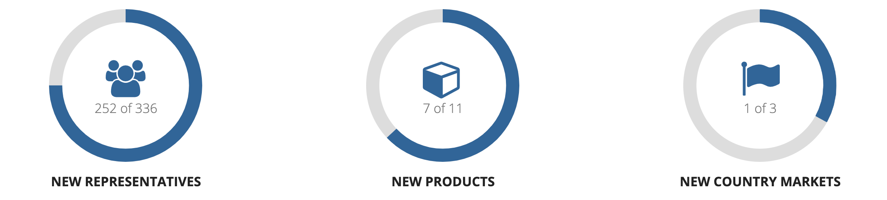

# Gauges [SAIL Design System: Components]

*Section: components | source: https://docs.appian.com/suite/help/26.7/sail/ux-gauge.html | images referenced live in corpus/images/*

# Gauges

## When to use a gauge

Use gauges to display values that represent measurable progress towards completion.

 **[DO example]**

 **[DON'T example]**

Don’t use gauges to show values that are unbounded and don’t have an obvious 100% threshold

## Gauge display text

The gauge’s primary text is displayed prominently inside the gauge's ring. Use primary text to show the underlying value that the gauge ring represents.

Use the “Percentage” format if the percentage value is most meaningful to viewers.

Use the “Fraction” format if the count of completed items out of a total count is most meaningful.

Secondary text is shown below the primary text. Use secondary text to label the value being shown. Or, add a label above or below the gauge if more space is needed.

Alternatively, use the “Icon” format to add an eye-catching marker and use the secondary text to show the underlying value.

