# Grids [SAIL Design System: Components]

*Section: components | source: https://docs.appian.com/suite/help/26.7/sail/ux-grids.html | images referenced live in corpus/images/*

# Grids

## Introduction

Use grids to display tabular data in a structured, easy-to-scan layout. Keep grid data values concise and consistently-formatted to maximize readability.

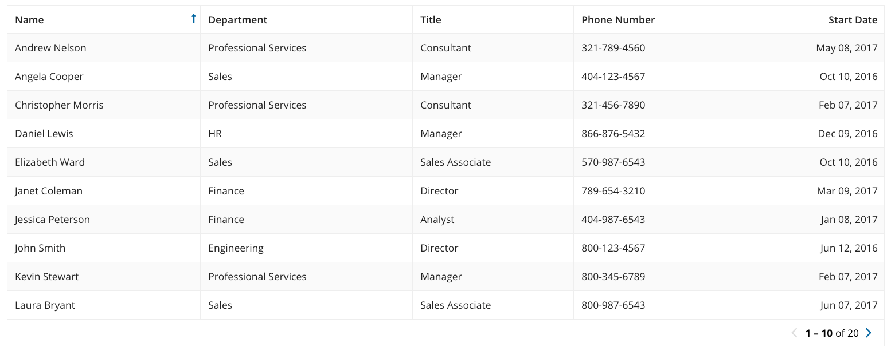 **[DO example]**

Apply the same formatting to all data in a given column.

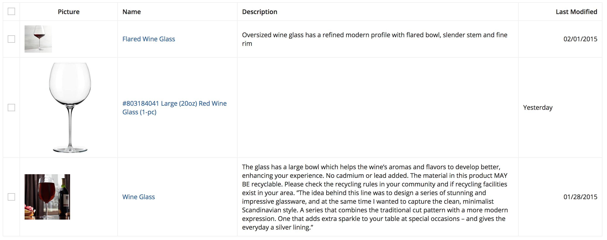 **[DON'T example]**

Don't use grids to display large blocks of text.

## Sort order and filtering

Grids should be designed to allow users to quickly find the item(s) that they are looking for.

The first priority should be to apply a logical sort order that would display the most important information at the top of the list.

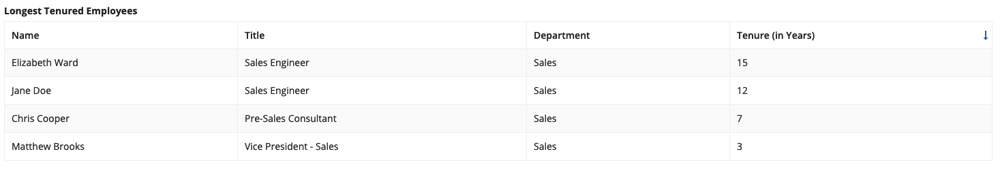

*The sort order of the grid is applied to the "Tenure (in Years)" column*

Then, provide commonly used filter and search capabilities to let users narrow down the list.

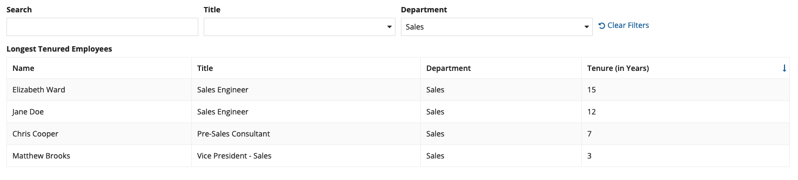

Use a Record Type as the grid’s data source to take advantage of a search field and user filters that have already been defined in the Record Type object.

If your users need to be able to customize the order of rows in editable grids, you can enable row reordering.

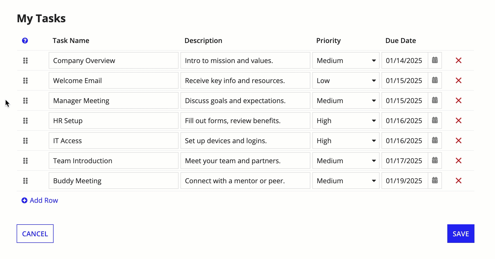 *(animated GIF)*

## Record actions

### In grid columns

Record action buttons can be displayed in a grid column by using the Record Action component.

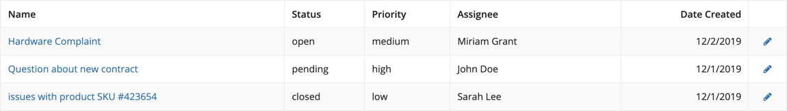

*The pencil icon is a related action using the “Icon Only” style*

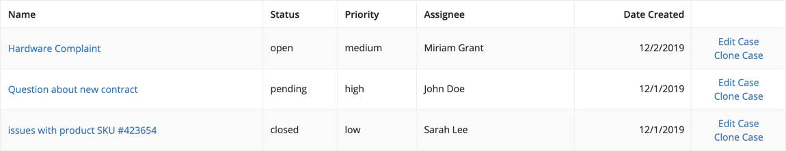 **[DON'T example]**

Don’t display multiple related actions within a grid cell. Instead, try placing actions above the grid or in separate columns.

### Above grids with record data

Record actions can be displayed in “Toolbar” style above a grid when the grid is backed by a Record Type. Selection is often necessary when related actions are configured. Refer to the Read-Only Grid documentation to learn more.

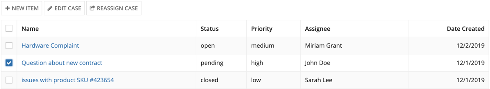

*“New Item” is a record list action and “Edit Case” and “Reassign Case” are related actions*

## Batch size

Establish an appropriate batch size that minimizes scrolling.

### Multiple component interface

If the interface has several other components along with the grid, then use a smaller batch size, such as 5 - 10 items, so that the user can easily access the other components in the interface.

### Single grid interface

If the grid is the only component on the interface, prioritize getting the user to the items they are looking for on the first page using sort order and filter controls. Use a large batch size, such as 50 items, so that users can scroll to their items rather than paging multiple times and waiting for items to load.

If you are not sure if the sort order and filter controls will get the users to the items they are looking for on the first page, then use a smaller batch, size such as 25 items, and ensure that users are able to access paging controls without scrolling.

## Cell formatting

### Alignment

The first column should always be left-aligned (in left-to-right languages) regardless of the value type. For all other columns, left-align text columns and right-align columns with numerical values. Quantitative numbers like amounts, measures, and percentages should always be right aligned to be easily compared across rows. Qualitative numbers like dates, postal codes, and phone numbers can be left-aligned if preferred.

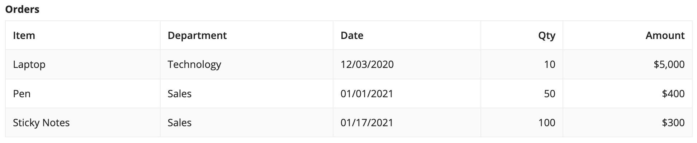

For editable grid columns, use left alignment for all field types (in left-to-right languages) including numbers and dates.

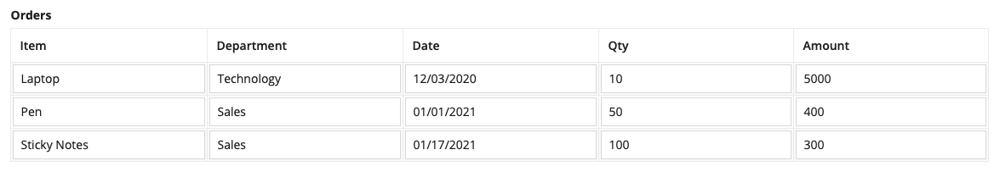

If an icon is the only component displayed in a grid column, keep it center-aligned.

Always align headers consistently with column content.

### Calling attention to important information

Use visual elements like rich text and tags to emphasize information and make grid contents easier to digest.

#### Color

Use color sparingly to draw the user's attention to important details in your grid. Using too many colors can dilute their meaning, overwhelm the user, and make your grid difficult to scan.

Bright shades of red, yellow, and green should be used minimally to indicate negative, warning, or positive values like risk level and priority. Avoid using these colors decoratively, and only use them on important values that need attention. It is generally recommended to use no more than two non-neutral colors in a grid.

Do not rely on text color to communicate meaning, because users with limited vision or those with certain types of color blindness will not benefit from the color differentiation.

Avoid displaying accent-colored text that is not a link. Because the accent color is used for links, users may think accent-colored text is clickable.

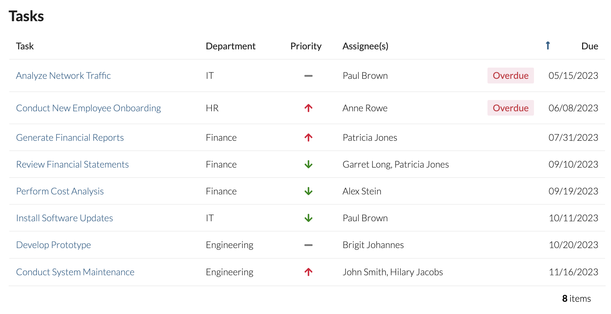 **[DO example]**

Use colorful components to highlight only the most important information in your grid

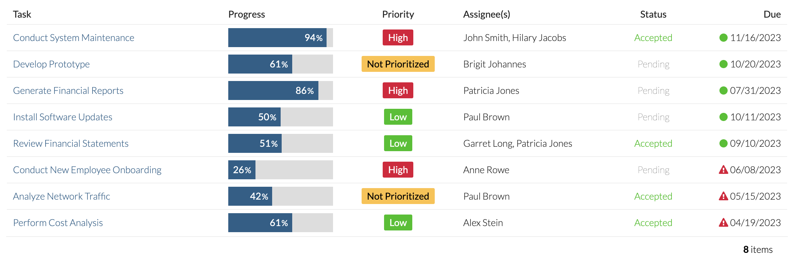 **[DON'T example]**

Avoid using too much color in a grid. Don't rely only on text color to convey meaning or use low-contrast colors which may be harder to read.

#### Icons

Icons can be used to differentiate grid values. When using icons in a grid column, make sure they are useful and have clear and obvious meanings. If using colored icons, choose a limited set of colors that have a high level of contrast with the grid background color. Emphasize important values with color. De-emphasize values that are not as important by giving them a neutral color, like gray or black, or by using a less prominent shape.

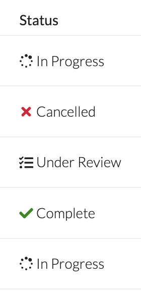

#### Tags

Tags can be used to emphasize important information in your grid. When using tags in grids, use a limited set of colors, and avoid mixing several bright colors.

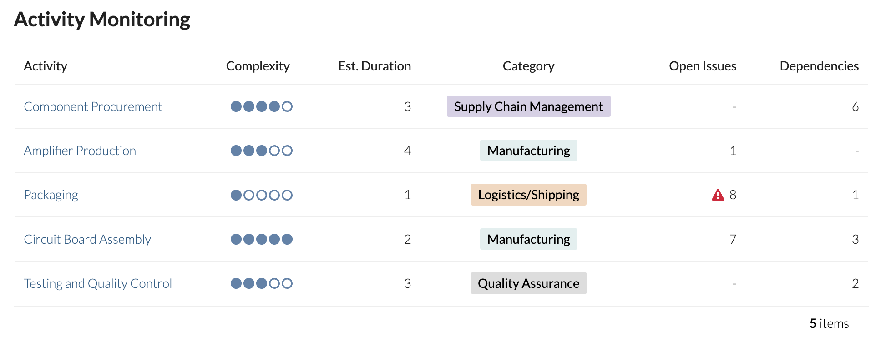 **[DO example]**

When using tags to display neutral values, like categories, use a limited set of muted, neutral colors to ensure they are not too prominent relative to the rest of the grid

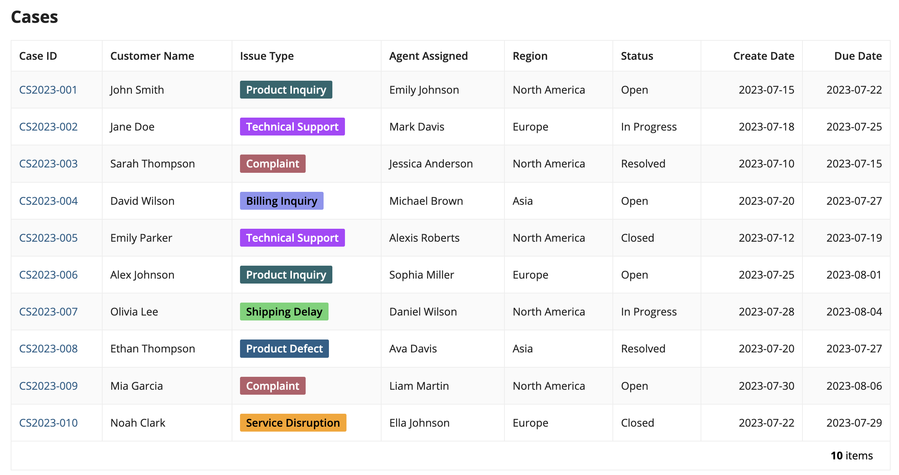 **[DON'T example]**

When displaying tags in every row of a grid, avoid using overly prominent colors or a large set of colors

To give more emphasis to important values, consider using tags to highlight certain values in a grid column.

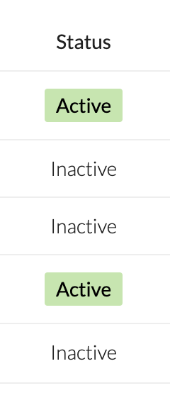 **[DO example]**

Use tags to highlight only the most important values in a grid column

### Consolidated columns

Use text formatting to consolidate logical groupings of fields into a single grid column. This is especially useful when horizontal space is limited and you need to display grid information in a denser layout. Use rich text display components to format the consolidated information in an easy-to-read format.

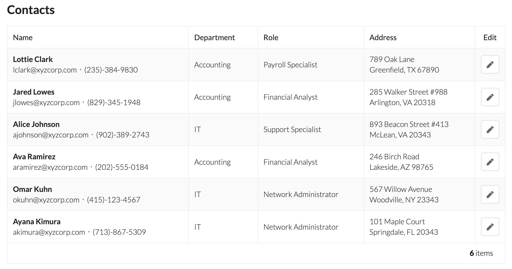 **[DO example]**

Rather than having individual columns for related information, like a person's name, email, and phone number, or the parts of an address, you can condense information into fewer columns for a simpler view.

When combining data in a grid column, make sure each row has an appropriate height. When a grid displays many rows, avoid formatting information into more than 2-3 lines, especially when other grid columns do not require additional row height.

Use an appropriate sort field for a column with consolidated information. If there is a primary value in the column, sort by that field. In the above example, the Name column should sort by the contact's name, because it is the primary value in the column.

Do not consolidate multiple columns that need to be individually sortable, because you will only be able to sort on one field per column.

### Concise Language

Avoid redundancy in grid cell contents. Use appropriate column headers to keep values concise.

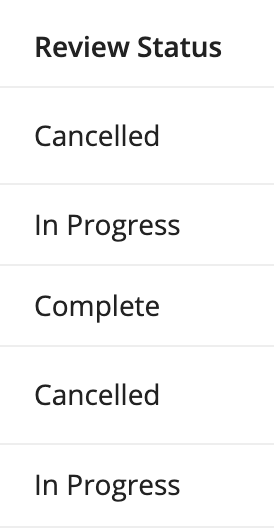 **[DO example]**

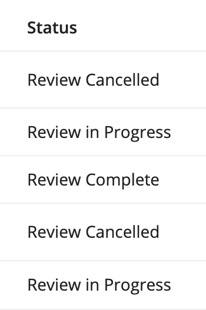 **[DON'T example]**

Avoid using redundant language across grid rows

### Empty cells

Use a hyphen (–) when displaying cells with no value/data.

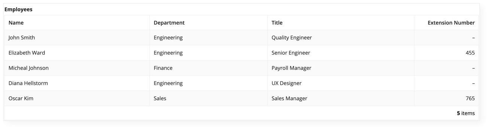 **[DO example]**

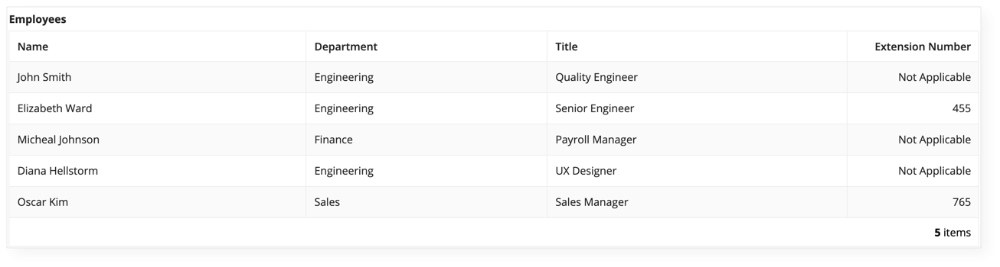 **[DON'T example]**

Avoid using "N/A" or "Not Applicable", as it tends to create clutter

## Column widths

### Read-only grids

#### Automatic column widths

Set column widths to “Auto” (this is the default for new columns) to allow the grid to distribute space based on the amount of content in each column. When in doubt, try this setting first as it often produces good results without additional effort. Note that column widths will fluctuate as data changes: a cell with a large amount of text will cause its column to be wider, all else being equal.

#### Fixed column widths

Use fixed column widths, such as "Narrow" or "Wide", for consistent behavior that mimics how spreadsheets work. The width of each column will remain constant even as the width of the grid changes (such as when resizing the browser window). Horizontal scrolling will be automatically enabled when the total of column widths exceeds the grid’s width.

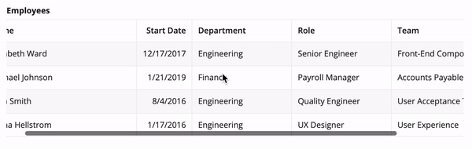 *(animated GIF)*

Note: when the total of configured column widths is less than the grid’s overall width, columns will be expanded to fill the available space.

#### Relative column widths

Use relative widths to set proportional column widths that distribute available space. For example, 3 columns with "2X", "3X", and "5X" widths, respectively, will take up 20%, 30%, and 50% of the width of the grid. As much as possible, the proportional relationship between columns will be preserved as the overall grid width changes. A particular set of relative widths that look appropriate on a wide monitor, for example, may not work well on a phone display because each column will become much narrower.

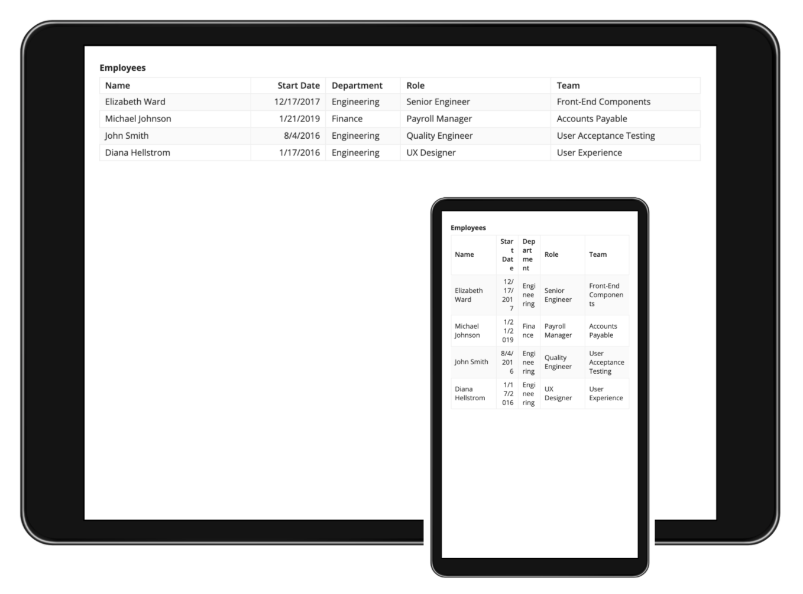

*A particular set of relative widths that work well on wide screens may not transfer well to narrow screens. The "Start Date" and "Department" column values on the phone are too narrow.*

In general, relative column widths work well when the grid is typically viewed on similar screen sizes (i.e. mostly viewed on a phone or mostly viewed on a desktop monitor). Fixed column widths offer more predictability when grids are viewed across a wide variety of screen sizes.

#### Combining different types of width configurations

Sometimes, the best results may come from using more than one type of grid column width configuration within the same grid. For example, one might set fixed widths for columns that always require the same amount of space: "Icon"-width for a column that shows a status icon, "Narrow"-width for a column that shows a percentage value. The remaining columns in the grid may show varying amounts of text and work best with "Auto" or a set proportion of relative widths.

### Editable grids

While considerations for setting column widths are similar across the two types of grids, editable grids lack some of the configurations available for read-only grids.

#### No automatic column widths

Editable grids do not support automatic column widths based on the amount of content in each cell. The default column width of "Distribute" produces the same result as specifying "1" as the weight. A grid with all "Distribute"-width columns will evenly distribute space across all columns.

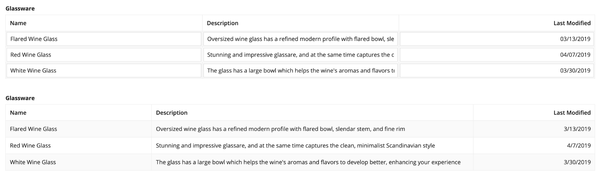

*The editable grid (TOP) has "Distribute"-width columns, so the column spacing is evenly distributed. The read-only grid (BOTTOM) has "Auto"-width columns, allocating space based on the column content.*

## Styling options

### Spacing

The "Standard" grid spacing offers a good balance between information density and readability.

Use the "Dense" spacing option to reduce the need for vertical scrolling when showing grids with a large number of rows. Note that some users may find the dense grids to be harder to read because of their reduced white space.

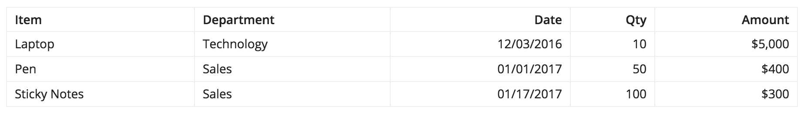

### Background color

Use column background colors to highlight certain columns in read-only grids. You can create a heatmap grid by configuring conditionally-formatted background colors, so the background color of the cell conveys important information at a glance. Heatmaps are a great tool you can use to spot trends by finding regions of concentration of a certain color. You can see an example heatmap in the grid with heatmap pattern

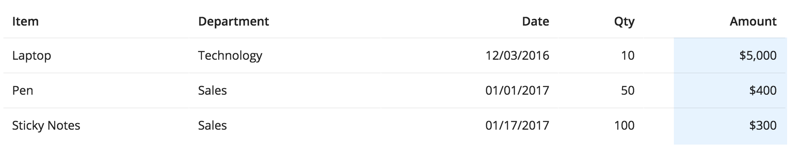

### Shade alternate rows

Use the alternate row shading option to help users match up values on the same row when scanning grids with a lot of data. The shading may not be necessary when showing grids with only a few rows of data.

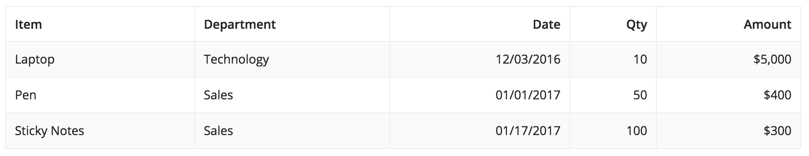

### Border style

Use the "Light" border style to remove the outer border and vertical column divider lines from grids. This creates a less cluttered look for simple grids that can easily be scanned without the need for extra decorative lines.

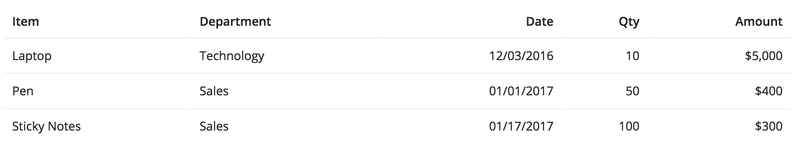

### Selection style

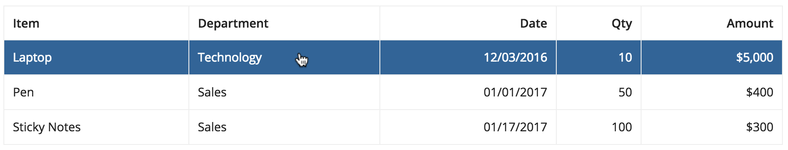 **[DO example]**

Use the "Row Highlight" selection style for read only content. An example of this can be seen in the grid with detail pattern.

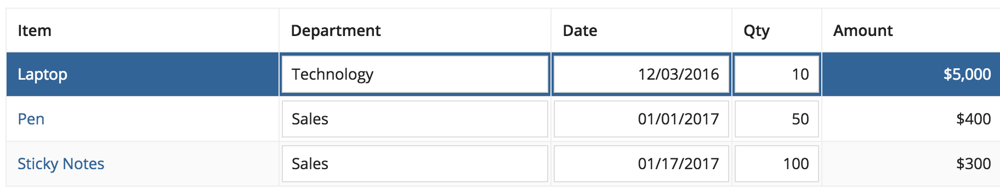 **[DON'T example]**

Avoid mixing "Row Highlight" selection style and interactive components, such as links or inputs, in grid cells. This may make it difficult for the user to differentiate between clicking on the row or one of the interactive components within the row. Instead, use the "Checkbox" selection style when there are interactive components in a grid.

## Consistency

When displaying multiple grids on the same page, use the same density and styling options for all grids to create a consistent experience.

## Fixed height

Use the height option to maintain a fixed height for the grid regardless of the number of rows and to ensure that the header is always visible.

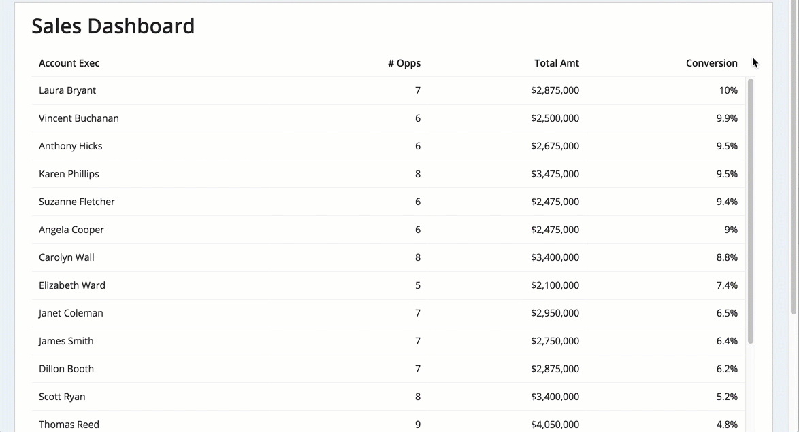 **[DON'T example]** *(animated GIF)*

Don't pick a fixed height when the grid is the only/main thing on the page as users may have to scroll the page AND scroll the contents of the grid to find what they're looking for

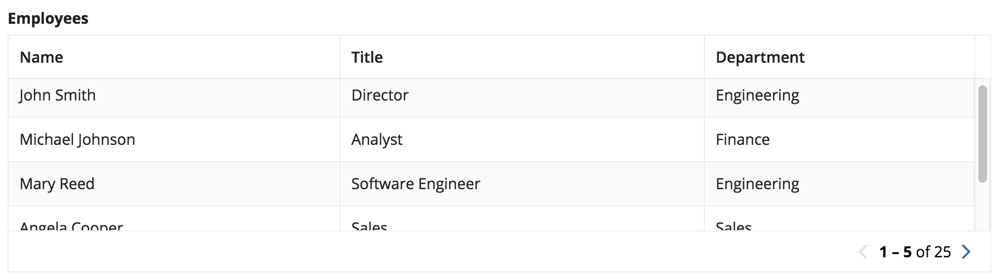 **[DON'T example]**

Don't mix paging and fixed heights as users would have to scroll and page to find what they're looking for. At the same time, be aware of performance considerations when choosing to remove paging or setting a very large batch size and relying on scrolling.

## Accessibility

### Row headers

When designing a grid, use the **Row Header** parameter to help users with screen readers better understand the context of each cell they're traversing. The row header acts as the identifier for a given row, similar to how the column header is the identifier for each column. When screen reader users navigate to a cell within a grid, both the corresponding column header and row header values are announced by the screen reader.

Note that the row header is only recognized as the header for columns to its right. Because of this, the first column containing text is usually the correct choice for row header.

### Grid column labels

Include a column header, even for icon-only columns. Because the column header and row header values are announced by the screen reader when a user navigates to a grid cell, defining both will help users understand the cell contents.
