# Header Content Layout [SAIL Design System: Components]

*Section: components | source: https://docs.appian.com/suite/help/26.7/sail/ux-header-content-layout.html | images referenced live in corpus/images/*

# Header Content Layout

## Introduction

The header content layout component is a layout that allows you to design pages with two distinct sections:

- The header section consists of one or more card or billboard layouts into which other components and layouts may be placed. For a more seamless look, the header extends to the top, left, and right edges of the page.

- The contents section will contain any components and layouts you want to display in the body of the interface.

Because the header content layout component is a top-level layout, it cannot be nested within other layout components.

This page talks about when to use the header content layout component, design configurations, and what style guidelines to follow when designing interfaces.

## When to use a header content layout

Use a header content layout as the top-level layout for your interface when you want to highlight or otherwise draw attention to the top of your page or when it is important to split your UI into two distinctly separate sections.

Welcome banners, title bars, and secondary navigation menus are all great examples of when using a header content layout would improve page design and user experience.

You'll also want to use a header content layout if you want control over the background color and padding around the contents of your page.

** If your interface is on a record view, you can achieve a similar look to the header content layout by adding a record header. This will create a card or billboard background on the header that extends to the top, left, and right edges of the page. See the Define record views page for more information.

### Welcome banners

Welcome banners help draw attention to text and images that identify the purpose of the page or site. Simpler designs with larger font sizes, bold pictures, and appropriate white space tend to work best.

Matching the background color of the billboard or card used in the header content layout to the site navigation bar background color also works well to create the impression of a larger, sleeker banner.

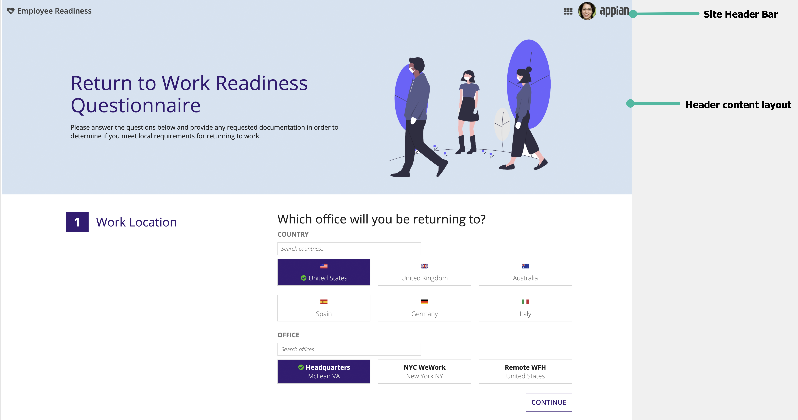

*This employee health questionnaire site uses a bold welcome banner to clearly identify the purpose of the page*

For more inspiration, check out additional welcome banner examples.

### Title bars

Use a header content layout to display a prominent title bar that announces the topic of the page. The title bar can also highlight key attributes that provide summary information to viewers.

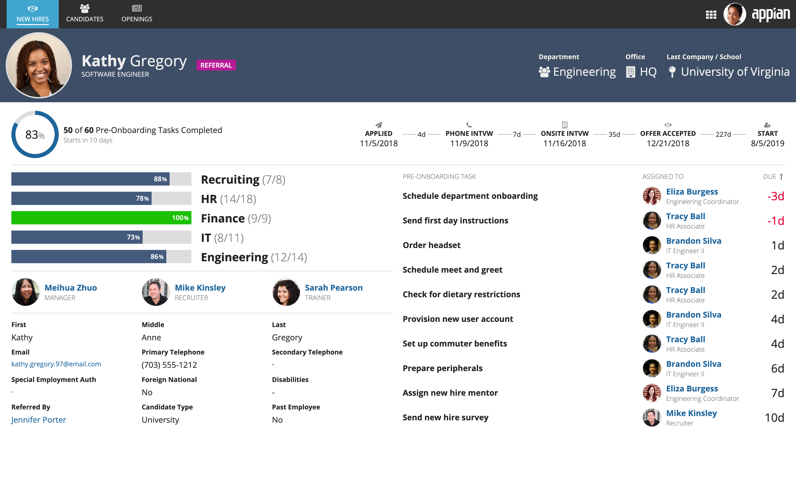

*This new hire onboarding dashboard uses a header card to draw attention to the employee's photograph, name, and key information*

For more inspiration, check out additional title bar examples.

### Secondary navigation

A header can also be used to display secondary navigation controls that link to a sublevel of destinations within each site page.

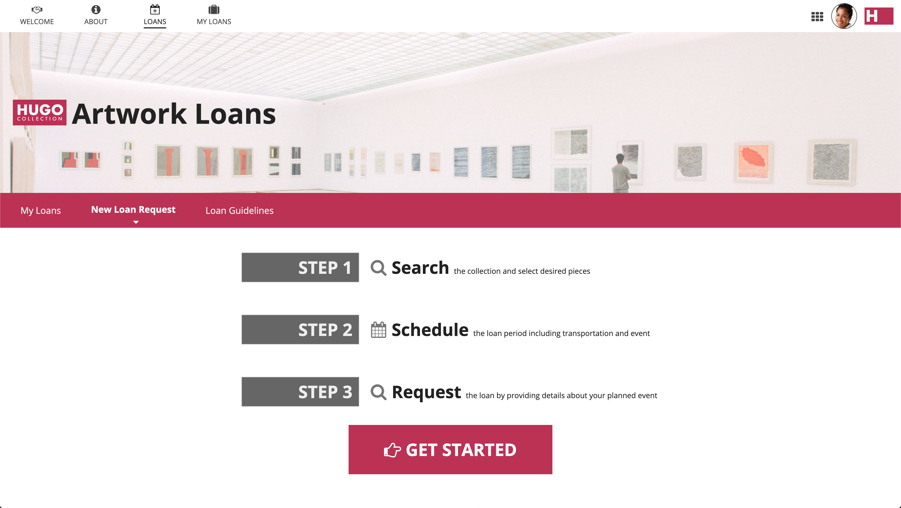

*A billboard layout is combined with a card layout containing secondary navigation controls in this header example*

For more inspiration, check out additional secondary navigation examples.

### Background color and padding

There are two additional scenarios where using a header content layout would not only be beneficial, but necessary. If you want control over the background color and padding around the contents of your page, you'll need to use a header content layout as the top-level layout on your interface.

You can only configure the values for the background color and contents padding parameters within this component and you can even leave the header contents empty if these two parameters are all you need to control.


## Parameter configurations

This section highlights variations of the header content layout component to help you visualize what's possible for your interface designs.

To use a header content layout component in design view, you must start with a blank interface. For existing interfaces, the **Top Level Layouts** menu is not visible. To add a header content layout to an existing page, either remove all existing content or switch to expression mode.

In the **Components Palette**, under the **Top Level Layouts** section, drag and drop a layout with a header onto the page.

 *(animated GIF)*

### Content configurations

The parameters in this section control what displays for the layout.

#### Header parameter

The **Header** parameter accepts either a billboard layout or card layout component. You can also use multiple instances of either component or mix and match them as needed.

Choose a billboard layout if you want an image or video overlay in your header content layout.

The following is a very basic example that uses a card layout for the header parameter. Notice how the header content layout divides the interface into two distinct sections.

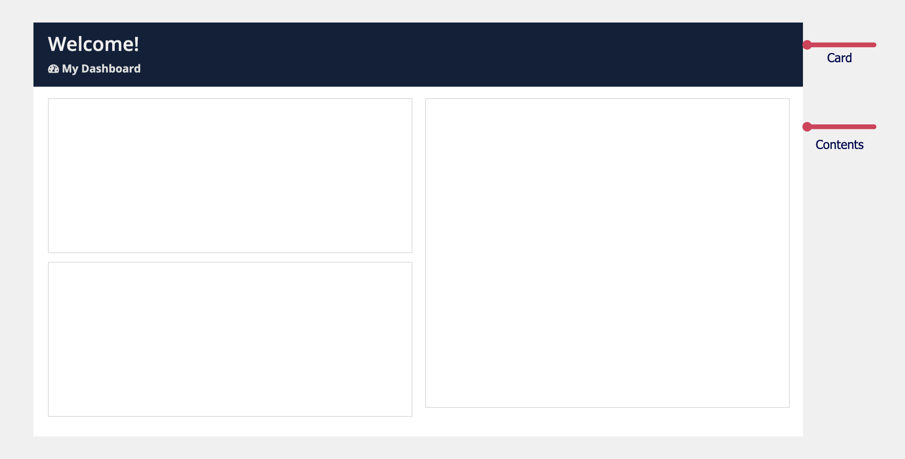

```sail
a!headerContentLayout(
  header: {
    a!cardLayout(
      contents: {
        a!columnsLayout(
          columns: {
            a!columnLayout(
              contents: {
                a!richTextDisplayField(
                  labelPosition: "COLLAPSED",
                  value: {
                    a!richTextHeader(
                      text: {
                        "Welcome!"
                      },
                      size: "LARGE"
                    )
                  }
                ),
                a!richTextDisplayField(
                  labelPosition: "COLLAPSED",
                  value: {
                    a!richTextHeader(
                      text: {
                        a!richTextIcon(
                          icon: "tachometer"
                        ),
                        " My Dashboard"
                      },
                      size: "SMALL"
                    )
                  }
                )
              }
            )
          }
        )
      },
      height: "AUTO",
      style: "#0f203a",
      padding: "STANDARD",
      marginBelow: "NONE",
      showBorder: false
    )
  },
  contents: {
    a!columnsLayout(
      columns: {
        a!columnLayout(
          contents: {
            a!cardLayout(
              contents: {},
              height: "MEDIUM",
              style: "NONE",
              marginBelow: "STANDARD",
              showBorder: true,
              showShadow: false
            ),
            a!cardLayout(
              contents: {},
              height: "MEDIUM",
              style: "NONE",
              marginBelow: "STANDARD",
              showBorder: true,
              showShadow: false
            )
          }
        ),
        a!columnLayout(
          contents: {
            a!cardLayout(
              contents: {},
              height: "TALL_PLUS",
              style: "NONE",
              marginBelow: "STANDARD"
            )
          }
        )
      }
    ),
    {
    }
  },
  backgroundColor: "WHITE",
  contentsPadding: "STANDARD"
)
```

##### **Billboard header**

To use a billboard header for your header content layout:

- In the **Components Palette**, under the **Top Level Layouts** section, drag and drop a **BILLBOARD HEADER** onto the page.

See the Billboard layout page for more information on designing billboard layout components.

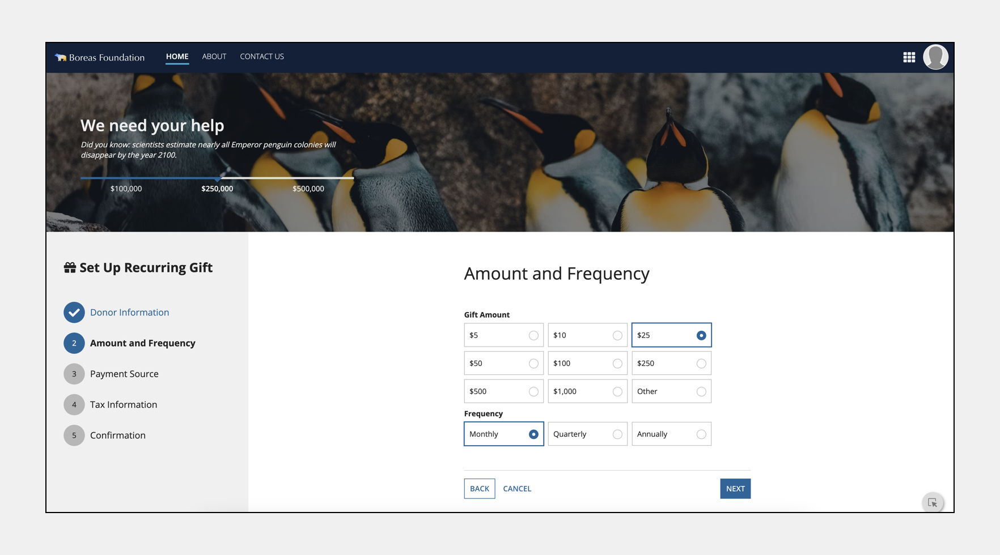

```sail
a!headerContentLayout(
  header: {
    a!billboardLayout(
      backgroundMedia: a!webImage(
        source: "https://images.unsplash.com/photo-1574950333594-f3e9a9446d0f?ixid=MXwxMjA3fDB8MHxwaG90by1wYWdlfHx8fGVufDB8fHw%3D&ixlib=rb-1.2.1&auto=format&fit=crop&w=2250&q=80"
        /*"https://unsplash.com/photos/iTYShprNeRE"*/
      ),
      backgroundColor: "#f0f0f0",
      height: "MEDIUM",
      marginBelow: "NONE",
      overlay: a!fullOverlay(
        alignVertical: "MIDDLE",
        contents: {
          a!columnsLayout(
            columns: {
              a!columnLayout(
                contents: {
                  a!richTextDisplayField(
                    labelPosition: "COLLAPSED",
                    value: {
                      a!richTextHeader(
                        text: {
                          "We need your help"
                        },
                        size: "LARGE"
                      ),
                      a!richTextItem(
                        text: {
                          "Did you know: scientists estimate nearly all Emperor penguin colonies will disappear by the year 2100."
                        },
                        style: {
                          "EMPHASIS"
                        }
                      )
                    },
                    align: "LEFT",
                    marginAbove: "STANDARD",
                    marginBelow: "STANDARD"
                  ),
                  a!milestoneField(
                    label: "",
                    labelPosition: "ABOVE",
                    steps: {"$100,000", "$250,000", "$500,000"},
                    links: {},
                    active: 2,
                    orientation: "HORIZONTAL",
                    color: "ACCENT",
                    marginAbove: "STANDARD"
                  )
                }
              ),
              a!columnLayout(
                contents: {}
              ),
              a!columnLayout(
                contents: {}
              )
            }
          )
        },
        style: "SEMI_DARK",
        padding: "EVEN_MORE"
      )
    )
  },
  isHeaderFixed: true,
  contents: {
    a!cardLayout(
      contents: {
        a!columnsLayout(
          columns: {
            a!columnLayout(
              contents: {
                a!cardLayout(
                  contents: {
                    a!richTextDisplayField(
                      labelPosition: "COLLAPSED",
                      value: {
                        char(10),
                        a!richTextItem(
                          text: {
                            a!richTextIcon(
                              icon: "gift"
                            ),
                            " Set Up Recurring Gift"
                          },
                          size: "MEDIUM_PLUS",
                          style: {
                            "STRONG"
                          }
                        ),
                        char(10),
                        char(10),
                        char(10)
                      }
                    ),
                    a!sideBySideLayout(
                      items: {
                        a!sideBySideItem(
                          item: a!stampField(
                            labelPosition: "COLLAPSED",
                            icon: "check",
                            backgroundColor: "ACCENT",
                            contentColor: "STANDARD",
                            size: "TINY"
                          ),
                          width: "MINIMIZE"
                        ),
                        a!sideBySideItem(
                          item: a!richTextDisplayField(
                            labelPosition: "COLLAPSED",
                            value: {
                              a!richTextItem(
                                text: {
                                  "Donor Information"
                                },
                                color: "ACCENT",
                                size: "MEDIUM"
                              )
                            }
                          )
                        )
                      },
                      alignVertical: "MIDDLE",
                      marginBelow: "STANDARD"
                    ),
                    a!cardLayout(
                      contents: {},
                      height: "AUTO",
                      style: "#f0f0f0",
                      padding: "EVEN_LESS",
                      marginBelow: "NONE",
                      showBorder: false
                    ),
                    a!sideBySideLayout(
                      items: {
                        a!sideBySideItem(
                          item: a!stampField(
                            labelPosition: "COLLAPSED",
                            text: "2",
                            backgroundColor: "ACCENT",
                            contentColor: "STANDARD",
                            size: "TINY"
                          ),
                          width: "MINIMIZE"
                        ),
                        a!sideBySideItem(
                          item: a!richTextDisplayField(
                            labelPosition: "COLLAPSED",
                            value: {
                              a!richTextItem(
                                text: {
                                  "Amount and Frequency"
                                },
                                color: "STANDARD",
                                size: "MEDIUM",
                                style: {
                                  "STRONG"
                                }
                              )
                            }
                          )
                        )
                      },
                      alignVertical: "MIDDLE",
                      marginBelow: "STANDARD"
                    ),
                    a!cardLayout(
                      contents: {},
                      height: "AUTO",
                      style: "#f0f0f0",
                      padding: "EVEN_LESS",
                      marginBelow: "NONE",
                      showBorder: false
                    ),
                    a!sideBySideLayout(
                      items: {
                        a!sideBySideItem(
                          item: a!stampField(
                            labelPosition: "COLLAPSED",
                            text: "3",
                            backgroundColor: "#b7b7b7",
                            contentColor: "STANDARD",
                            size: "TINY"
                          ),
                          width: "MINIMIZE"
                        ),
                        a!sideBySideItem(
                          item: a!richTextDisplayField(
                            labelPosition: "COLLAPSED",
                            value: {
                              a!richTextItem(
                                text: {
                                  "Payment Source"
                                },
                                color: "STANDARD",
                                size: "MEDIUM"
                              )
                            }
                          )
                        )
                      },
                      alignVertical: "MIDDLE",
                      marginBelow: "STANDARD"
                    ),
                    a!cardLayout(
                      contents: {},
                      height: "AUTO",
                      style: "#f0f0f0",
                      padding: "EVEN_LESS",
                      marginBelow: "NONE",
                      showBorder: false
                    ),
                    a!sideBySideLayout(
                      items: {
                        a!sideBySideItem(
                          item: a!stampField(
                            labelPosition: "COLLAPSED",
                            text: "4",
                            backgroundColor: "#b7b7b7",
                            contentColor: "STANDARD",
                            size: "TINY"
                          ),
                          width: "MINIMIZE"
                        ),
                        a!sideBySideItem(
                          item: a!richTextDisplayField(
                            labelPosition: "COLLAPSED",
                            value: {
                              a!richTextItem(
                                text: {
                                  "Tax Information"
                                },
                                color: "STANDARD",
                                size: "MEDIUM"
                              )
                            }
                          )
                        )
                      },
                      alignVertical: "MIDDLE",
                      marginBelow: "STANDARD"
                    ),
                    a!cardLayout(
                      contents: {},
                      height: "AUTO",
                      style: "#f0f0f0",
                      padding: "EVEN_LESS",
                      marginBelow: "NONE",
                      showBorder: false
                    ),
                    a!sideBySideLayout(
                      items: {
                        a!sideBySideItem(
                          item: a!stampField(
                            labelPosition: "COLLAPSED",
                            text: "5",
                            backgroundColor: "#b7b7b7",
                            contentColor: "STANDARD",
                            size: "TINY"
                          ),
                          width: "MINIMIZE"
                        ),
                        a!sideBySideItem(
                          item: a!richTextDisplayField(
                            labelPosition: "COLLAPSED",
                            value: {
                              a!richTextItem(
                                text: {
                                  "Confirmation"
                                },
                                color: "STANDARD",
                                size: "MEDIUM"
                              )
                            }
                          )
                        )
                      },
                      alignVertical: "MIDDLE",
                      marginBelow: "STANDARD"
                    ),
                    a!cardLayout(
                      contents: {},
                      height: "EXTRA_TALL",
                      style: "#f0f0f0",
                      marginBelow: "STANDARD",
                      showBorder: false
                    )
                  },
                  height: "AUTO",
                  style: "#f0f0f0",
                  padding: "MORE",
                  marginBelow: "NONE",
                  showBorder: false
                )
              },
              width: "MEDIUM"
            ),
            a!columnLayout(
              contents: {
                a!columnsLayout(
                  columns: {
                    a!columnLayout(
                      contents: {}
                    ),
                    a!columnLayout(
                      contents: {
                        a!richTextDisplayField(
                          labelPosition: "COLLAPSED",
                          value: {
                            char(10),
                            char(10),
                            char(10),
                            a!richTextItem(
                              text: {
                                "Amount and Frequency"
                              },
                              size: "LARGE"
                            ),
                            char(10),
                            char(10),
                            char(10)
                          }
                        ),
                        a!radioButtonField_23r3(
                          label: "Gift Amount",
                          labelPosition: "ABOVE",
                          choiceLabels: {"$5", "$10", "$25", "$50", "$100", "$250", "$500", "$1,000", "Other"},
                          choiceValues: {1, 2, 3,4,5,6,7,8,9},
                          value: 3,
                          saveInto: {},
                          choiceLayout: "COMPACT",
                          choiceStyle: "CARDS",
                          validations: {}
                        ),
                        a!radioButtonField_23r3(
                          label: "Frequency",
                          labelPosition: "ABOVE",
                          choiceLabels: {"Monthly","Quarterly","Annually"},
                          choiceValues: {1, 2, 3},
                          value: 1,
                          saveInto: {},
                          choiceLayout: "COMPACT",
                          choiceStyle: "CARDS",
                          validations: {}
                        ),
                        a!sectionLayout(
                          label: "",
                          contents: {
                            a!columnsLayout(
                              columns: {
                                a!columnLayout(
                                  contents: {
                                    a!buttonArrayLayout(
                                      buttons: {
                                        a!buttonWidget_23r3(
                                          label: "Back",
                                          style: "NORMAL"
                                        ),
                                        a!buttonWidget_23r3(
                                          label: "Cancel",
                                          style: "LINK"
                                        )
                                      },
                                      align: "START",
                                      marginBelow: "NONE"
                                    )
                                  }
                                ),
                                a!columnLayout(
                                  contents: {
                                    a!buttonArrayLayout(
                                      buttons: {
                                        a!buttonWidget_23r3(
                                          label: "Next",
                                          style: "PRIMARY"
                                        )
                                      },
                                      align: "END",
                                      marginBelow: "NONE"
                                    )
                                  }
                                )
                              }
                            )
                          },
                          divider: "ABOVE"
                        )
                      },
                      width: "MEDIUM_PLUS"
                    ),
                    a!columnLayout(
                      contents: {}
                    )
                  }
                )
              }
            )
          }
        )
      },
      height: "AUTO",
      padding: "NONE",
      marginBelow: "NONE",
      showBorder: false
    ),
    {
    }
  },
  backgroundColor: "WHITE",
  contentsPadding: "NONE"
)
```

##### **Card header**

To use a card header for your header content layout:

- In the **Components Palette**, under the **Top Level Layouts** section, drag and drop a **CARD HEADER** onto the page.

See the Card layout page for more information on designing card layout components.

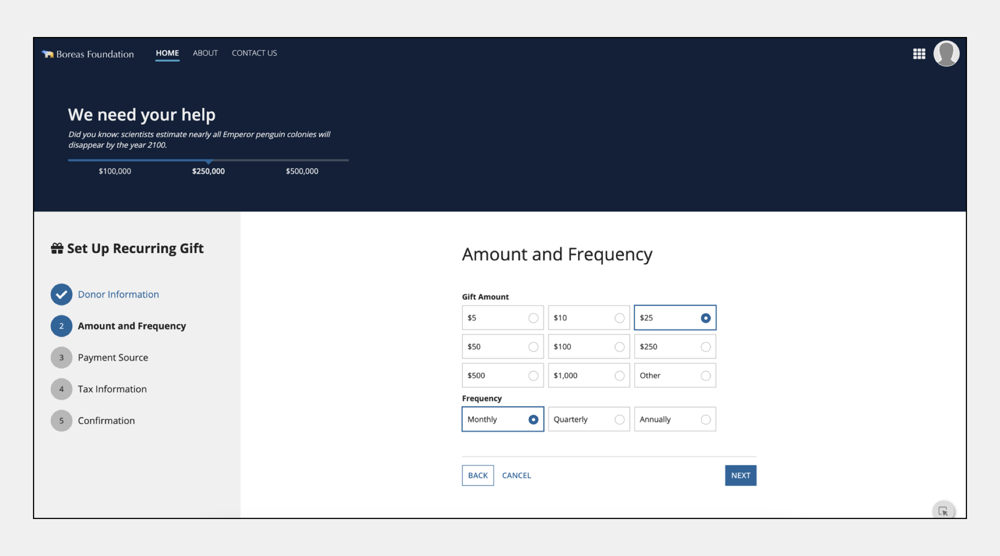

```sail
a!headerContentLayout(
  header: {
    a!cardLayout(
      contents: {
        a!columnsLayout(
          columns: {
            a!columnLayout(
              contents: {
                a!richTextDisplayField(
                  labelPosition: "COLLAPSED",
                  value: {
                    a!richTextHeader(
                      text: {
                        "We need your help"
                      },
                      size: "LARGE"
                    ),
                    a!richTextItem(
                      text: {
                        "Did you know: scientists estimate nearly all Emperor penguin colonies will disappear by the year 2100."
                      },
                      style: {
                        "EMPHASIS"
                      }
                    )
                  }
                ),
                a!milestoneField(
                  label: "Milestone",
                  labelPosition: "COLLAPSED",
                  steps: {"$100,000", "$250,000", "$500,000"},
                  links: {},
                  active: 2
                )
              }
            ),
            a!columnLayout(
              contents: {}
            ),
            a!columnLayout(
              contents: {}
            )
          }
        )
      },
      height: "AUTO",
      style: "#0f203a",
      padding: "EVEN_MORE",
      marginBelow: "NONE",
      showBorder: false
    )
  },
  contents: {
    a!cardLayout(
      contents: {
        a!columnsLayout(
          columns: {
            a!columnLayout(
              contents: {
                a!cardLayout(
                  contents: {
                    a!richTextDisplayField(
                      labelPosition: "COLLAPSED",
                      value: {
                        char(10),
                        a!richTextItem(
                          text: {
                            a!richTextIcon(
                              icon: "gift"
                            ),
                            " Set Up Recurring Gift"
                          },
                          size: "MEDIUM_PLUS",
                          style: {
                            "STRONG"
                          }
                        ),
                        char(10),
                        char(10),
                        char(10)
                      }
                    ),
                    a!sideBySideLayout(
                      items: {
                        a!sideBySideItem(
                          item: a!stampField(
                            labelPosition: "COLLAPSED",
                            icon: "check",
                            backgroundColor: "ACCENT",
                            contentColor: "STANDARD",
                            size: "TINY"
                          ),
                          width: "MINIMIZE"
                        ),
                        a!sideBySideItem(
                          item: a!richTextDisplayField(
                            labelPosition: "COLLAPSED",
                            value: {
                              a!richTextItem(
                                text: {
                                  "Donor Information"
                                },
                                color: "ACCENT",
                                size: "MEDIUM"
                              )
                            }
                          )
                        )
                      },
                      alignVertical: "MIDDLE",
                      marginBelow: "STANDARD"
                    ),
                    a!cardLayout(
                      contents: {},
                      height: "AUTO",
                      style: "#f0f0f0",
                      padding: "EVEN_LESS",
                      marginBelow: "NONE",
                      showBorder: false
                    ),
                    a!sideBySideLayout(
                      items: {
                        a!sideBySideItem(
                          item: a!stampField(
                            labelPosition: "COLLAPSED",
                            text: "2",
                            backgroundColor: "ACCENT",
                            contentColor: "STANDARD",
                            size: "TINY"
                          ),
                          width: "MINIMIZE"
                        ),
                        a!sideBySideItem(
                          item: a!richTextDisplayField(
                            labelPosition: "COLLAPSED",
                            value: {
                              a!richTextItem(
                                text: {
                                  "Amount and Frequency"
                                },
                                color: "STANDARD",
                                size: "MEDIUM",
                                style: {
                                  "STRONG"
                                }
                              )
                            }
                          )
                        )
                      },
                      alignVertical: "MIDDLE",
                      marginBelow: "STANDARD"
                    ),
                    a!cardLayout(
                      contents: {},
                      height: "AUTO",
                      style: "#f0f0f0",
                      padding: "EVEN_LESS",
                      marginBelow: "NONE",
                      showBorder: false
                    ),
                    a!sideBySideLayout(
                      items: {
                        a!sideBySideItem(
                          item: a!stampField(
                            labelPosition: "COLLAPSED",
                            text: "3",
                            backgroundColor: "#b7b7b7",
                            contentColor: "STANDARD",
                            size: "TINY"
                          ),
                          width: "MINIMIZE"
                        ),
                        a!sideBySideItem(
                          item: a!richTextDisplayField(
                            labelPosition: "COLLAPSED",
                            value: {
                              a!richTextItem(
                                text: {
                                  "Payment Source"
                                },
                                color: "STANDARD",
                                size: "MEDIUM"
                              )
                            }
                          )
                        )
                      },
                      alignVertical: "MIDDLE",
                      marginBelow: "STANDARD"
                    ),
                    a!cardLayout(
                      contents: {},
                      height: "AUTO",
                      style: "#f0f0f0",
                      padding: "EVEN_LESS",
                      marginBelow: "NONE",
                      showBorder: false
                    ),
                    a!sideBySideLayout(
                      items: {
                        a!sideBySideItem(
                          item: a!stampField(
                            labelPosition: "COLLAPSED",
                            text: "4",
                            backgroundColor: "#b7b7b7",
                            contentColor: "STANDARD",
                            size: "TINY"
                          ),
                          width: "MINIMIZE"
                        ),
                        a!sideBySideItem(
                          item: a!richTextDisplayField(
                            labelPosition: "COLLAPSED",
                            value: {
                              a!richTextItem(
                                text: {
                                  "Tax Information"
                                },
                                color: "STANDARD",
                                size: "MEDIUM"
                              )
                            }
                          )
                        )
                      },
                      alignVertical: "MIDDLE",
                      marginBelow: "STANDARD"
                    ),
                    a!cardLayout(
                      contents: {},
                      height: "AUTO",
                      style: "#f0f0f0",
                      padding: "EVEN_LESS",
                      marginBelow: "NONE",
                      showBorder: false
                    ),
                    a!sideBySideLayout(
                      items: {
                        a!sideBySideItem(
                          item: a!stampField(
                            labelPosition: "COLLAPSED",
                            text: "5",
                            backgroundColor: "#b7b7b7",
                            contentColor: "STANDARD",
                            size: "TINY"
                          ),
                          width: "MINIMIZE"
                        ),
                        a!sideBySideItem(
                          item: a!richTextDisplayField(
                            labelPosition: "COLLAPSED",
                            value: {
                              a!richTextItem(
                                text: {
                                  "Confirmation"
                                },
                                color: "STANDARD",
                                size: "MEDIUM"
                              )
                            }
                          )
                        )
                      },
                      alignVertical: "MIDDLE",
                      marginBelow: "STANDARD"
                    ),
                    a!cardLayout(
                      contents: {},
                      height: "EXTRA_TALL",
                      style: "#f0f0f0",
                      marginBelow: "STANDARD",
                      showBorder: false
                    )
                  },
                  height: "AUTO",
                  style: "#f0f0f0",
                  padding: "MORE",
                  marginBelow: "NONE",
                  showBorder: false
                )
              },
              width: "MEDIUM"
            ),
            a!columnLayout(
              contents: {
                a!columnsLayout(
                  columns: {
                    a!columnLayout(
                      contents: {}
                    ),
                    a!columnLayout(
                      contents: {
                        a!richTextDisplayField(
                          labelPosition: "COLLAPSED",
                          value: {
                            char(10),
                            char(10),
                            char(10),
                            a!richTextItem(
                              text: {
                                "Amount and Frequency"
                              },
                              size: "LARGE"
                            ),
                            char(10),
                            char(10),
                            char(10)
                          }
                        ),
                        a!radioButtonField_23r3(
                          label: "Gift Amount",
                          labelPosition: "ABOVE",
                          choiceLabels: {"$5", "$10", "$25", "$50", "$100", "$250", "$500", "$1,000", "Other"},
                          choiceValues: {1, 2, 3,4,5,6,7,8,9},
                          value: 3,
                          saveInto: {},
                          choiceLayout: "COMPACT",
                          choiceStyle: "CARDS",
                          validations: {}
                        ),
                        a!radioButtonField_23r3(
                          label: "Frequency",
                          labelPosition: "ABOVE",
                          choiceLabels: {"Monthly","Quarterly","Annually"},
                          choiceValues: {1, 2, 3},
                          value: 1,
                          saveInto: {},
                          choiceLayout: "COMPACT",
                          choiceStyle: "CARDS",
                          validations: {}
                        ),
                        a!sectionLayout(
                          label: "",
                          contents: {
                            a!columnsLayout(
                              columns: {
                                a!columnLayout(
                                  contents: {
                                    a!buttonArrayLayout(
                                      buttons: {
                                        a!buttonWidget_23r3(
                                          label: "Back",
                                          style: "NORMAL"
                                        ),
                                        a!buttonWidget_23r3(
                                          label: "Cancel",
                                          style: "LINK"
                                        )
                                      },
                                      align: "START",
                                      marginBelow: "NONE"
                                    )
                                  }
                                ),
                                a!columnLayout(
                                  contents: {
                                    a!buttonArrayLayout(
                                      buttons: {
                                        a!buttonWidget_23r3(
                                          label: "Next",
                                          style: "PRIMARY"
                                        )
                                      },
                                      align: "END",
                                      marginBelow: "NONE"
                                    )
                                  }
                                )
                              }
                            )
                          },
                          divider: "ABOVE"
                        )
                      },
                      width: "MEDIUM_PLUS"
                    ),
                    a!columnLayout(
                      contents: {}
                    )
                  }
                )
              }
            )
          }
        )
      },
      height: "AUTO",
      padding: "NONE",
      marginBelow: "NONE",
      showBorder: false
    ),
    {
    }
  },
  backgroundColor: "WHITE",
  contentsPadding: "NONE"
)
```

##### **Mixed header**

You can also use both billboard and card layout components in your header content layout.

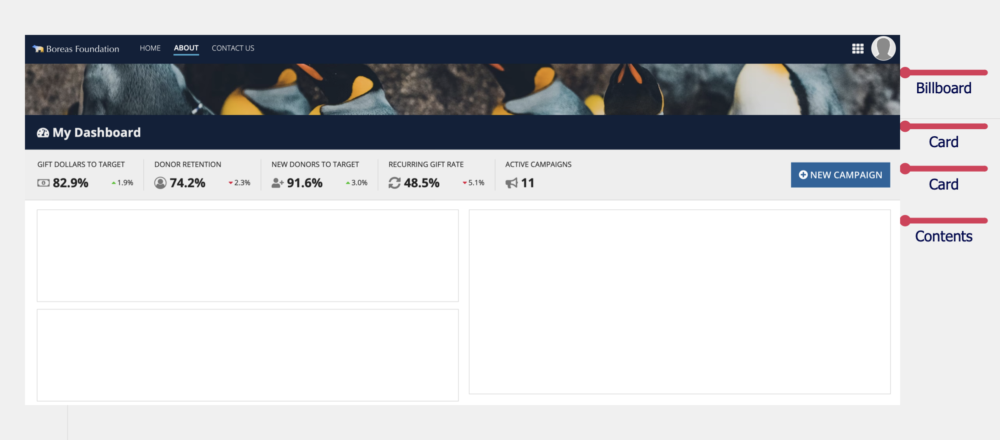

```sail
a!headerContentLayout(
  header: {
    a!billboardLayout(
      backgroundMedia: a!webImage(
        source: "https://images.unsplash.com/photo-1574950333594-f3e9a9446d0f?ixid=MXwxMjA3fDB8MHxwaG90by1wYWdlfHx8fGVufDB8fHw%3D&ixlib=rb-1.2.1&auto=format&fit=crop&w=2250&q=80"
        /* https://unsplash.com/photos/12R_znWtJHQ */
      ),
      height: "EXTRA_SHORT",
      marginBelow: "NONE"
    ),
    a!cardLayout(
      contents: {
        a!richTextDisplayField(
          labelPosition: "COLLAPSED",
          value: {
            a!richTextItem(
              text: {
                a!richTextIcon(
                  icon: "tachometer"
                ),
                " My Dashboard"
              },
              size: "MEDIUM_PLUS",
              style: {
                "STRONG"
              }
            )
          }
        )
      },
      height: "AUTO",
      style: "#0f203a",
      padding: "STANDARD",
      marginBelow: "NONE",
      showBorder: false
    ),
    a!cardLayout(
      contents: {
        a!columnsLayout(
          columns: {
            a!columnLayout(
              contents: {
                a!columnsLayout(
                  columns: {
                    a!columnLayout(
                      contents: {
                        a!richTextDisplayField(
                          labelPosition: "COLLAPSED",
                          value: { "GIFT DOLLARS TO TARGET" }
                        ),
                        a!sideBySideLayout(
                          items: {
                            a!sideBySideItem(
                              item: a!richTextDisplayField(
                                labelPosition: "COLLAPSED",
                                value: {
                                  a!richTextIcon(
                                    icon: "money",
                                    color: "SECONDARY",
                                    size: "MEDIUM_PLUS"
                                  ),
                                  a!richTextItem(
                                    text: { " 82.9%" },
                                    size: "MEDIUM_PLUS",
                                    style: { "STRONG" }
                                  )
                                }
                              )
                            ),
                            a!sideBySideItem(
                              item: a!richTextDisplayField(
                                labelPosition: "COLLAPSED",
                                value: {
                                  a!richTextIcon(
                                    icon: "caret-up",
                                    color: "POSITIVE",
                                    size: "STANDARD"
                                  ),
                                  a!richTextItem(
                                    text: { "1.9%" },
                                    color: "STANDARD",
                                    size: "STANDARD"
                                  )
                                }
                              ),
                              width: "MINIMIZE"
                            )
                          },
                          alignVertical: "MIDDLE"
                        )
                      }
                    ),
                    a!columnLayout(
                      contents: {
                        a!richTextDisplayField(
                          labelPosition: "COLLAPSED",
                          value: { "DONOR RETENTION" }
                        ),
                        a!sideBySideLayout(
                          items: {
                            a!sideBySideItem(
                              item: a!richTextDisplayField(
                                labelPosition: "COLLAPSED",
                                value: {
                                  a!richTextIcon(
                                    icon: "user-circle-o",
                                    color: "SECONDARY",
                                    size: "MEDIUM_PLUS"
                                  ),
                                  a!richTextItem(
                                    text: { " 74.2%" },
                                    size: "MEDIUM_PLUS",
                                    style: { "STRONG" }
                                  )
                                }
                              )
                            ),
                            a!sideBySideItem(
                              item: a!richTextDisplayField(
                                labelPosition: "COLLAPSED",
                                value: {
                                  a!richTextIcon(
                                    icon: "caret-down",
                                    color: "NEGATIVE",
                                    size: "STANDARD"
                                  ),
                                  a!richTextItem(
                                    text: { "2.3%" },
                                    color: "STANDARD",
                                    size: "STANDARD"
                                  )
                                }
                              ),
                              width: "MINIMIZE"
                            )
                          },
                          alignVertical: "MIDDLE"
                        )
                      }
                    ),
                    a!columnLayout(
                      contents: {
                        a!richTextDisplayField(
                          labelPosition: "COLLAPSED",
                          value: { "NEW DONORS TO TARGET" }
                        ),
                        a!sideBySideLayout(
                          items: {
                            a!sideBySideItem(
                              item: a!richTextDisplayField(
                                labelPosition: "COLLAPSED",
                                value: {
                                  a!richTextIcon(
                                    icon: "user-plus",
                                    color: "SECONDARY",
                                    size: "MEDIUM_PLUS"
                                  ),
                                  a!richTextItem(
                                    text: { " 91.6%" },
                                    size: "MEDIUM_PLUS",
                                    style: { "STRONG" }
                                  )
                                }
                              )
                            ),
                            a!sideBySideItem(
                              item: a!richTextDisplayField(
                                labelPosition: "COLLAPSED",
                                value: {
                                  a!richTextIcon(
                                    icon: "caret-up",
                                    color: "POSITIVE",
                                    size: "STANDARD"
                                  ),
                                  a!richTextItem(
                                    text: { "3.0%" },
                                    color: "STANDARD",
                                    size: "STANDARD"
                                  )
                                }
                              ),
                              width: "MINIMIZE"
                            )
                          },
                          alignVertical: "MIDDLE"
                        )
                      }
                    ),
                    a!columnLayout(
                      contents: {
                        a!richTextDisplayField(
                          labelPosition: "COLLAPSED",
                          value: { "RECURRING GIFT RATE" }
                        ),
                        a!sideBySideLayout(
                          items: {
                            a!sideBySideItem(
                              item: a!richTextDisplayField(
                                labelPosition: "COLLAPSED",
                                value: {
                                  a!richTextIcon(
                                    icon: "refresh",
                                    color: "SECONDARY",
                                    size: "MEDIUM_PLUS"
                                  ),
                                  a!richTextItem(
                                    text: { " 48.5%" },
                                    size: "MEDIUM_PLUS",
                                    style: { "STRONG" }
                                  )
                                }
                              )
                            ),
                            a!sideBySideItem(
                              item: a!richTextDisplayField(
                                labelPosition: "COLLAPSED",
                                value: {
                                  a!richTextIcon(
                                    icon: "caret-down",
                                    color: "NEGATIVE",
                                    size: "STANDARD"
                                  ),
                                  a!richTextItem(
                                    text: { "5.1%" },
                                    color: "STANDARD",
                                    size: "STANDARD"
                                  )
                                }
                              ),
                              width: "MINIMIZE"
                            )
                          },
                          alignVertical: "MIDDLE"
                        )
                      }
                    ),
                    a!columnLayout(
                      contents: {
                        a!richTextDisplayField(
                          labelPosition: "COLLAPSED",
                          value: { "ACTIVE CAMPAIGNS" }
                        ),
                        a!sideBySideLayout(
                          items: {
                            a!sideBySideItem(
                              item: a!richTextDisplayField(
                                labelPosition: "COLLAPSED",
                                value: {
                                  a!richTextIcon(
                                    icon: "bullhorn",
                                    color: "SECONDARY",
                                    size: "MEDIUM_PLUS"
                                  ),
                                  a!richTextItem(
                                    text: { " 11" },
                                    size: "MEDIUM_PLUS",
                                    style: { "STRONG" }
                                  )
                                }
                              )
                            )
                          },
                          alignVertical: "MIDDLE"
                        )
                      }
                    )
                  },
                  spacing: "SPARSE",
                  showDividers: true
                )
              },
              width: "WIDE_PLUS"
            ),
            a!columnLayout(contents: {}, width: "AUTO"),
            a!columnLayout(
              contents: {
                a!buttonArrayLayout(
                  buttons: {
                    a!buttonWidget(
                      label: "NEW CAMPAIGN",
                      icon: "plus-circle",
                      size: "LARGE",
                      style: "SOLID"
                    )
                  },
                  align: "END",
                  marginBelow: "NONE"
                )
              },
              width: "NARROW"
            )
          },
          alignVertical: "MIDDLE"
        )
      },
      height: "AUTO",
      style: "#eee",
      padding: "STANDARD",
      marginBelow: "NONE"
    )
  },
  contents: {
    a!columnsLayout(
      columns: {
        a!columnLayout(
          contents: {
            a!cardLayout(
              contents: {},
              height: "SHORT_PLUS",
              style: "NONE",
              marginBelow: "STANDARD"
            ),
            a!cardLayout(
              contents: {},
              height: "SHORT_PLUS",
              style: "NONE",
              marginBelow: "STANDARD"
            )
          }
        ),
        a!columnLayout(
          contents: {
            a!cardLayout(
              contents: {},
              height: "TALL",
              style: "NONE",
              marginBelow: "STANDARD"
            )
          }
        )
      }
    )
  },
  backgroundColor: "WHITE"
)
```

#### Contents parameter

Use the **Contents** parameter to add components and layouts you want to display in the body of the interface.

The following example shows a few empty card layouts in the content section to help you visualize the difference between the two sections.

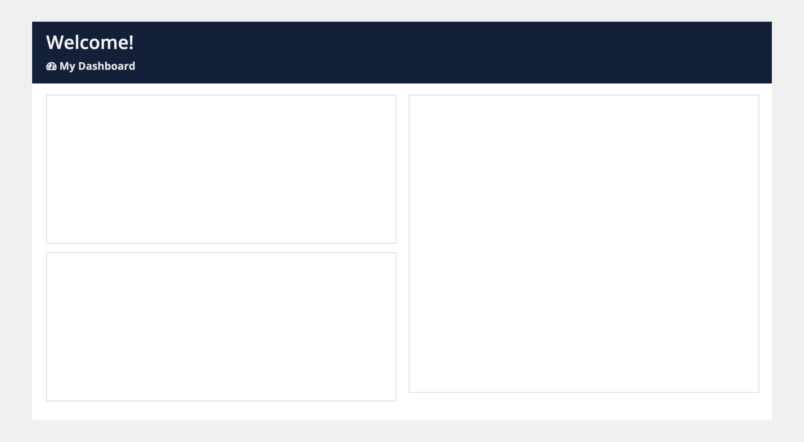

### Behavior configurations

The parameters in this section control how things behave when users interact with the layout.

#### Fix header when scrolling parameter

Use the **Fix header when scrolling** parameter so users can easily see and act on important information, no matter where they are on the page.

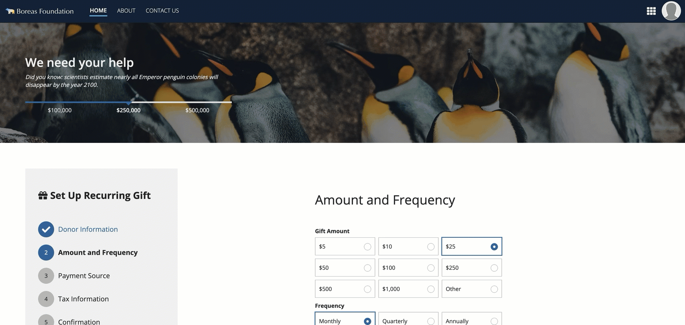 *(animated GIF)*

### Styling configurations

The parameters in this section control how things display for the layout.

#### Background color parameter

Use the **Background Color** parameter to change the color that appears behind the page content. Valid values are, "White" (default), "Transparent", "Charcoal Scheme", "Navy Scheme", and "Plum Scheme". You can also set a custom color by using a hex code or a hex code including transparency.

When configured with a "Transparent" background, the light gray site background color will appear behind page content, instead of the default white page background.

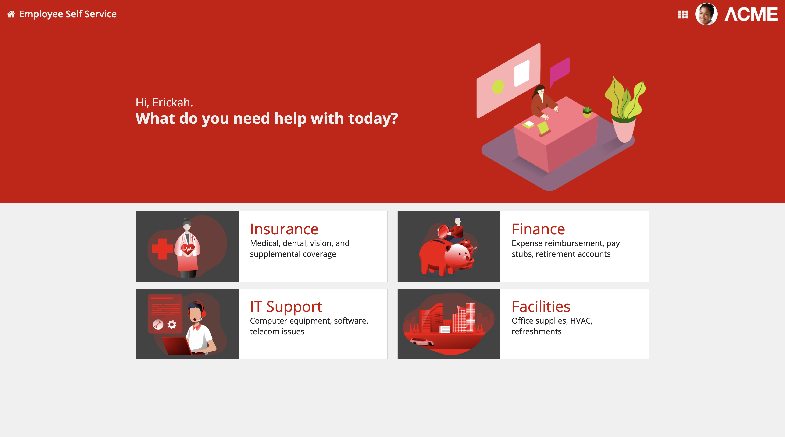

*The four category cards on this landing page stand out clearly against the transparent page background*

For information about the three dark color schemes (Charcoal, Navy, and Plum), see Dark Color Schemes.

** The **Background Color** parameter in the header content layout component only affects the background color in the contents section of the page. If you want to change the background color of the billboard or card layout in your header, you have to change that component's parameter value.

#### Contents padding parameter

Use the **Contents Padding** parameter to set the desired amount of whitespace around the content section of your page. Valid values are "None", "Even Less", "Less", "Standard" (default), "More", and "Even More".

As you adjust this parameter to increase the padding, you'll notice you're creating more space around the contents section of your page.

Select the "None" value for the parameter if you want zero space around the contents section so that it's flush with the header section.

The right amount of padding for your interface may depend on a variety of factors. Adjust the contents padding settings to see which works best for your interface.

The following example shows the progression of contents padding values from "None" through "Even More".

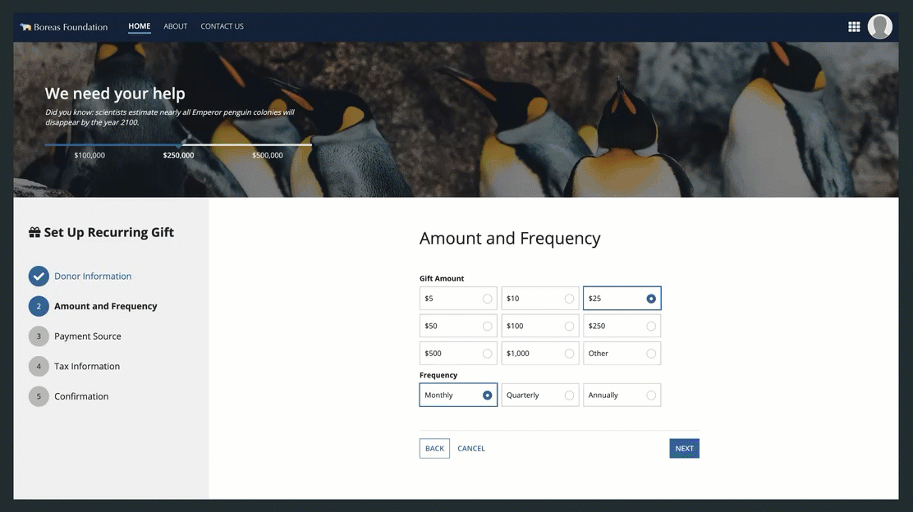 *(animated GIF)*

## Style guidelines

This section highlights specific design guidelines and recommendations.

### Page contents background color

#### Use transparent background color when content is primarily cards or boxes

Use this option when your content is mostly or entirely arranged within card or box layouts. Because cards and boxes provide their own white backgrounds, this setting allows them to stand out clearly against a contrasting background.

If the image in your billboard layout has a transparent background, you can create a clean look by setting the billboard background to be the same hex value as the transparent page content background.

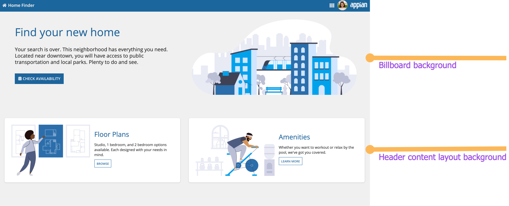

*This landing page uses the same color for the billboard header background and page content backgrounds*

#### Create enough contrast between contents and background color

If you are using a custom background color, make sure there is enough contrast between the page contents and the page background color to ensure accessibility compliance.

#### Don't alternate between dark and light color schemes across site pages

Use dark color schemes only when you can apply the scheme to **all** of your site pages. Avoid creating sites with a mix of pages with dark and light color schemes.

For guidance on using dark color schemes consistently across your site, see Dark Color Schemes.

#### Use a custom background color to match company branding

To better match your company branding, set a custom background color. To set a custom background color, select **Use a custom color** for the Background Color parameter. Remember to also place content in cards that are a lighter hex value than your set background color. See our Using Colors guidance to ensure your page looks clean and professional.


*This dashboard uses a custom color scheme. The cards have a lighter hex value than the background color.*

### Site page width

While the header in a header content layout is flush with the top, left, and right edges of the page, the width of the site page configured on the site object also affects the appearance of the overall interface.

While the header in a header content layout is flush with the top, left, and right edges of the page, the width of the page itself also affects the appearance of the overall interface.

Site pages configured to use the “Full” width will fill the interface edge-to-edge and the page will be flush with the navigation bar. This is also the case with the “Wide” width on typical devices and monitors.


*When the site page fills the width of the interface, there are no gaps around the header*

When using the "Medium" or "Narrow" site page widths, the page does not fill the whole interface and a visible margin remains around the page. This is also the case when viewing the page in Tempo and when the pages with the "Wide" setting are viewed on very wide monitors.

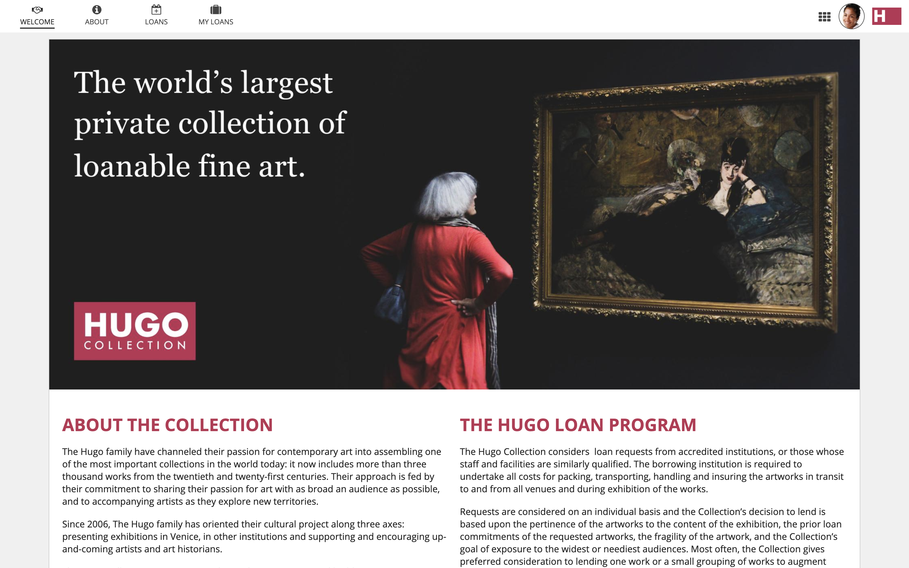

*When the site page is narrower than the full interface, a margin surrounds the page*

### Fixed headers

Fixing a header to the top of a page allows users to easily see and act on important information, no matter where they are on the page. To use this in a header content layout, simply select **Fix header when scrolling** in the **Component Configuration** pane.

#### Defining margins for fixed headers

When you use a fixed header on your interface, the margins of the card or billboard layout will be fixed with the header. We recommend setting the Margin Below setting to "None" so that it isn't fixed with the header.

In order to create appropriate spacing between the header and the contents, use the Margin Above setting on the top component of the page.

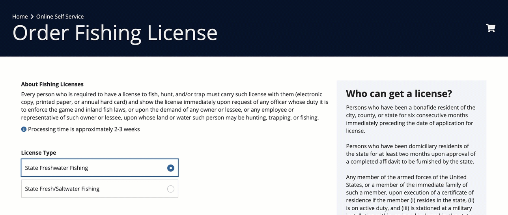 **[DO example]** *(animated GIF)*

This example uses the Margin Above parameter on the columns layout in the contents of the page. This causes the margin to scroll with the rest of the page.

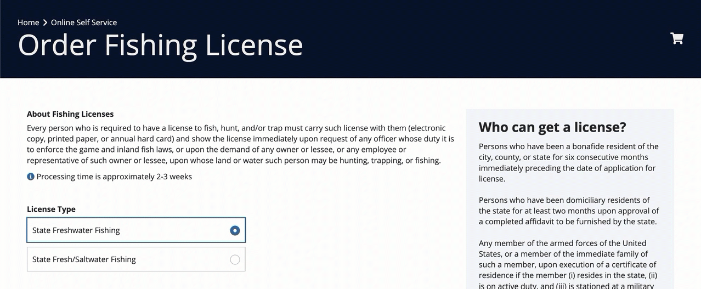 **[DON'T example]** *(animated GIF)*

This example uses the Margin Below parameter on the card header. This causes the margin to be fixed with the header.

#### Responsive fixed headers

When you use a fixed header in your header content layout, be sure to test it on narrower screen sizes. You may need to use responsive design techniques, such as using `a!isPageWidth()`, to make sure your header looks good on all screen sizes.

 **[DON'T example]** *(animated GIF)*

Using a fixed header on this mobile interface takes up most of the screen and blocks interacting with the content below.

 **[DO example]** *(animated GIF)*

This interface uses a!isPageWidth() to set the fixed header to false if it is being viewed on a narrow device.
