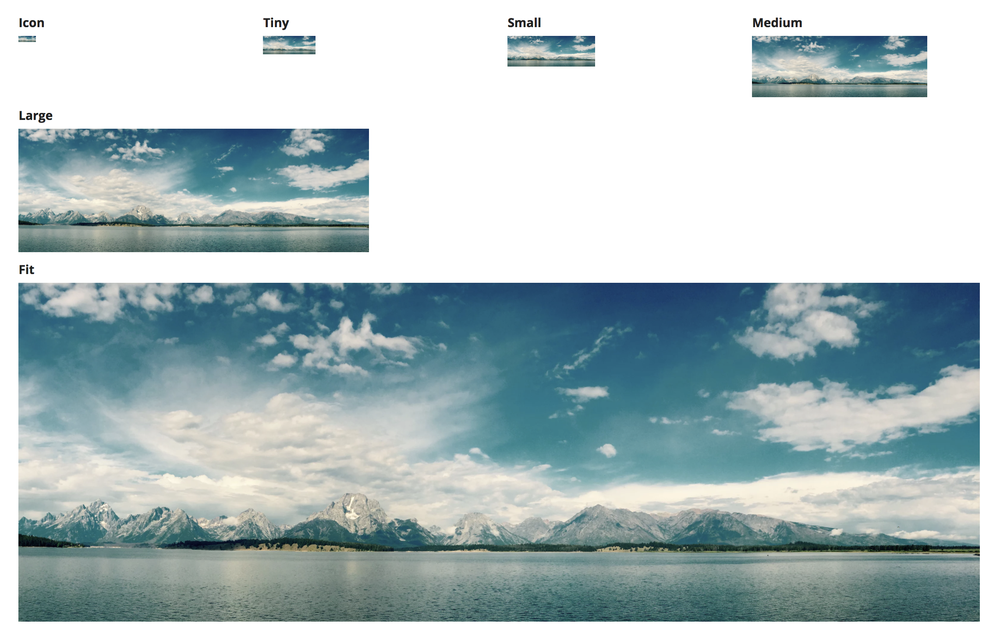
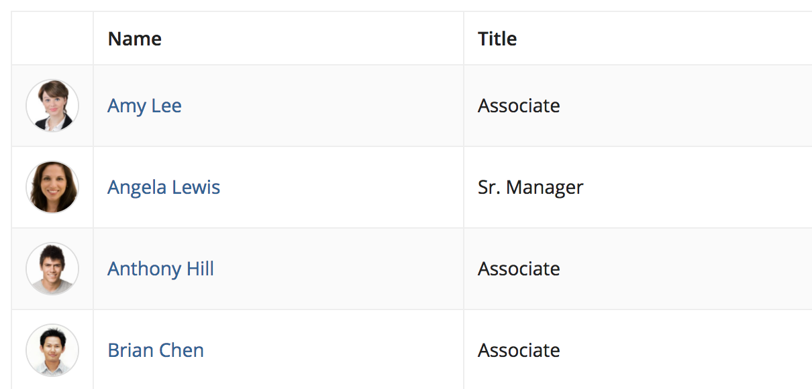
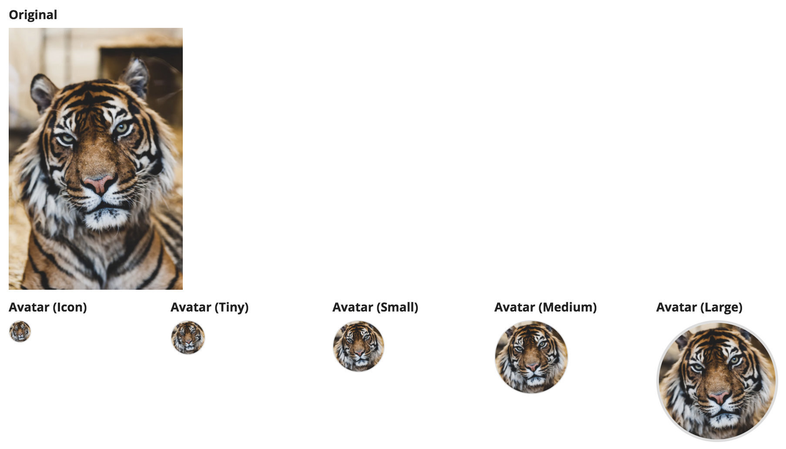
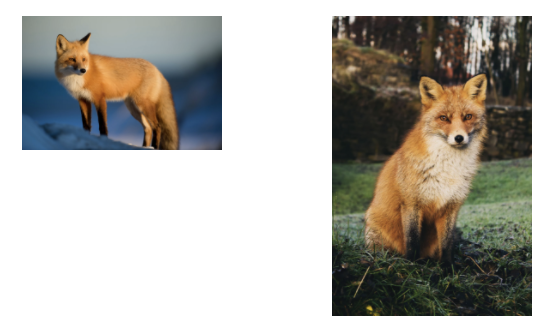
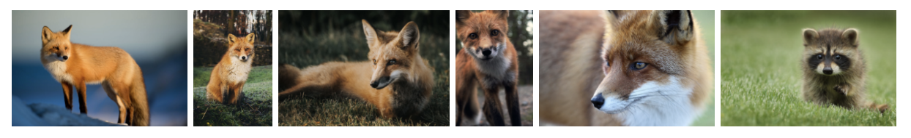
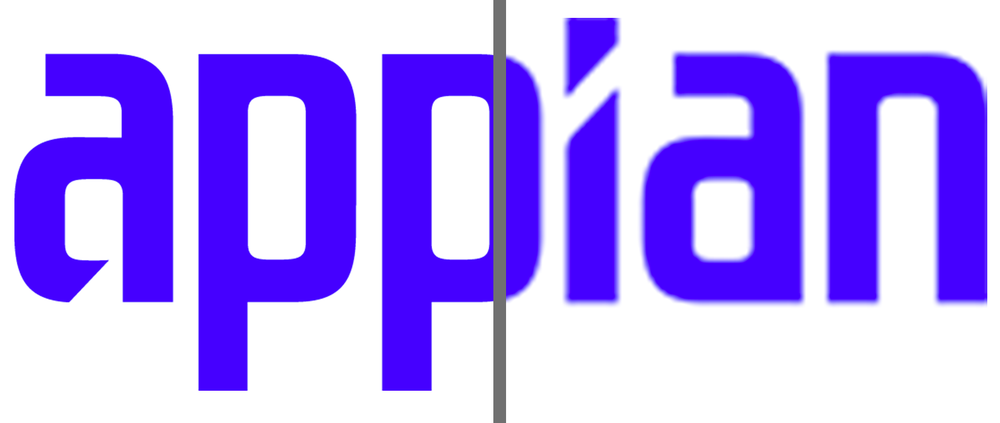
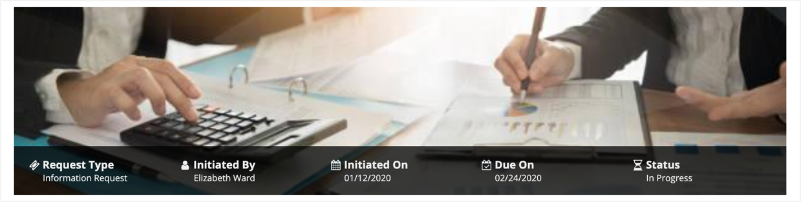

# Images [SAIL Design System: Components]

*Section: components | source: https://docs.appian.com/suite/help/26.7/sail/ux-images.html | images referenced live in corpus/images/*

# Images

## Styles

Use the "Standard" image style to preserve the natural aspect ratio of icons and photographs. For example, if an image is twice as wide as it is tall, it will always be shown as a rectangle. Standard style images are never distorted or cropped.

Use the "Avatar" style to show images as a circular shape. Portions of images that fall outside of the circle will not be visible. If the source image does not have a square aspect ratio (its width and height are not the same), part of the image will be cropped and only the center portion of the image will be visible.

*The "Avatar" image style is effective for showing profile photos of people*

*"Avatar" style images are always shown as circles regardless of the source photo's aspect ratio*

## Sizes

Choose an appropriate image size to balance layout density with recognizability. Too large a size may create unnecessary white space while leaving less room for other content and controls. Too small a size will make icons, logos, and photos unrecognizable.

Each size option for standard style images defines maximum height and width limits for images while preserving each image's natural aspect ratio. Images that are smaller than the maximum dimensions are not stretched in order to avoid blurriness. As a result, a set of different 
images with the same size setting may not all be displayed at the same size.

*Both of these images are shown at the "Small" size. Their actual dimensions differ because the source images have different aspect ratios.*

Use the "Gallery" size to display grouped collections of images. This setting generally results in a consistent height for displayed images (even if their aspect ratios differ) so that the group lines up evenly. Very wide images will be shown with a shorter height in order to constrain their overall size.

"Avatar" style images always fill a circular frame whose diameter is determined by the size configuration. Small source images will be stretched to fill the frame. This means that all avatar images with the same size setting will be rendered at exactly the same size on-screen.

## Image quality

Provide images that can be displayed with high quality at the specified size without unnecessarily wasting download bandwidth.

Photographs or other images with a lot of detail benefit from the file size compression of the JPEG format.

Icons, logos, and other images that consist of simple shapes generally look best when rendered from uncompressed files, such as those saved in the PNG format. Vector graphics (Appian supports the SVG file format) often provide the best balance between file size and display quality for these types of images.

*SVG images scale to different display sizes without a loss of quality (left), while low-resolution PNGs and JPGs can look blurry when shown at larger sizes (right)*

## Stock photography

Commercially available stock photography options often look artificial and staged. As a result, including them in an application can distract from more relevant page content. In addition, overusing generic stock photos can cause users to lose trust in an application. Instead, use photos of actual employees or customers (with permission) for greater authenticity.

 **[DON'T example]**

Avoid using stock photography because it shifts the user's focus away from more relevant page content

## Images vs. icons

Avoid using images in situations where icons are more appropriate. Icons are simple shapes that can be used to help identify controls without adding a lot of clutter to the interface.

 **[DO example]**

Use icons to help users identify, and quickly differentiate between, options

 **[DON'T example]**

Photos can be distracting because users end up looking at the details of the images
