# Inputs, Selection, and Pickers [SAIL Design System: Guidelines]

*Section: guidance | source: https://docs.appian.com/suite/help/26.7/sail/ux-inputs.html | images referenced live in corpus/images/*

# Inputs, Selection, and Pickers

## Radio buttons and checkboxes

Radio buttons and checkboxes display a short list of choices for users to select from. They are best used for displaying less than 5 choices.

### Radio buttons

Use a radio button component when only one option can be selected.

For lists with more than five choices, use a dropdown component.

One option should always be selected by default, preferably the most desired or frequently selected.

### Checkboxes

Use a checkbox component when one, none, or many choices can be selected.

For a single true or false value, such as agreeing to terms and conditions, use a boolean checkbox component.

For lists with more than five options, use a multiple dropdown component.

Always include a choice label.

### Choice best practices

You can configure the look of your radio buttons and checkboxes using the Choice layout, Choice style, or Choice position parameters. Boolean checkbox and toggle components only have the choice position parameter.

This section outlines the best practices for configuring these parameters.

#### Choice layout

The **Choice Layout** parameter determines whether the choice labels should be stacked on top of each other ("Stacked") or adjacent to each other ("Compact").

Use the "Compact" layout only for short radio button labels that aren't likely to wrap onto the next line, such as "Yes", "No", or "Maybe". For longer labels that are likely to wrap, use the "Stacked" layout.

Labels longer than two lines will be truncated.

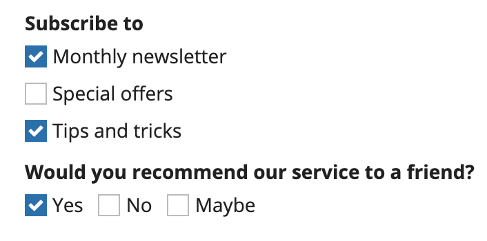

*Examples of checkboxes using both "Compact" and "Stacked" layouts*

#### Choice style

The **Choice Style** parameter determines whether the choice labels should display as text only ("Standard") or in a card ("Card").

Use the "Cards" style to give your choices more visual prominence and your users a larger click target.

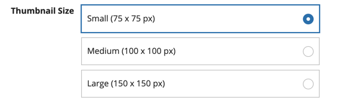

*Example of radio buttons with the "Cards" style*

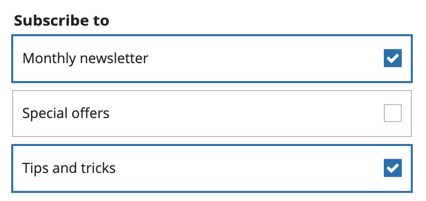

*Example of checkboxes with the "Cards" style*

#### Choice position - Radio button and checkbox components

The **Choice Position** parameter determines the placement of radio buttons or checkboxes relative to their labels.

The default choice position works best for most cases and should only be changed for specific circumstances.

Default choice position:

- **"Standard" Choice Style**: "Start" (left in left-to-right locales).

- **"Cards" Choice Style**: "End" (right in left-to-right locales).

Generally, you will want to try to use the same choice position for all radio button and checkbox components in an interface. This is especially important for "Card" choice style, since the bolder styling will make mismatched choice positions stand out more.

The "Standard" choice style with the "End" choice position works best for something like a filter pane. Avoid using it for form inputs.

When using this combination, be sure to constrain the width using pane, columns, or side by side layouts.

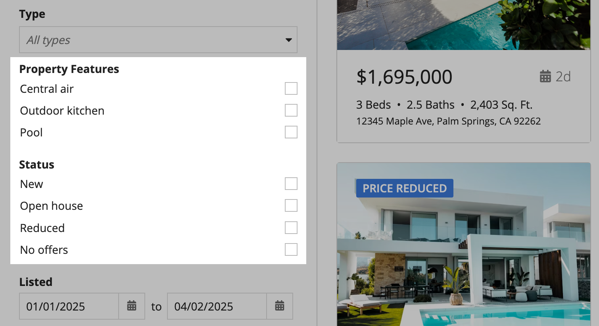

*In this example, the pane constrains the width of the checkbox filters so using the "Standard" choice style with "End" choice position works.*

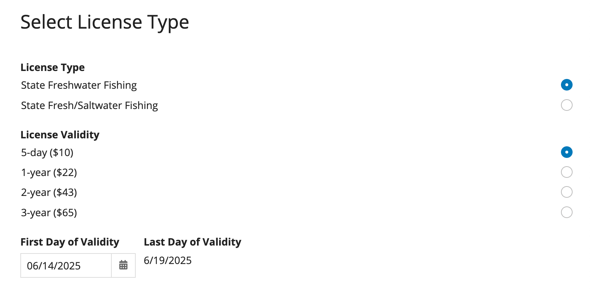 **[DON'T example]**

Using the "Standard" choice style with "End" choice position in this form makes it difficult for users to locate the correct radio button because they are too far away from the label.

When you are using the "Card" style and have long labels, consider using "Start" alignment to make the selection more clear and visible.

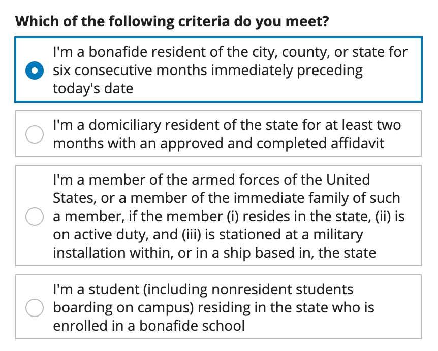 **[DO example]**

#### Choice position - Boolean checkbox and toggle components

For boolean checkbox and toggle components, the default choice position is "Start". This works best for most cases and should only be changed for specific circumstances.

When using "End", be sure to constrain the width using columns or side by side layouts, or it may be difficult for users to locate the checkbox because it is too far away from the label.

## Dropdowns

Use a dropdown to create moderately long lists of choices from which users can select one or many.

Use radio button groups, checkbox groups, or card choices for shorter lists, so that the user can easily see all choices.

Sort dropdown lists in a logical order, such as alphabetical.

If your dropdown list is too long to easily browse, use pickers so that users can search.

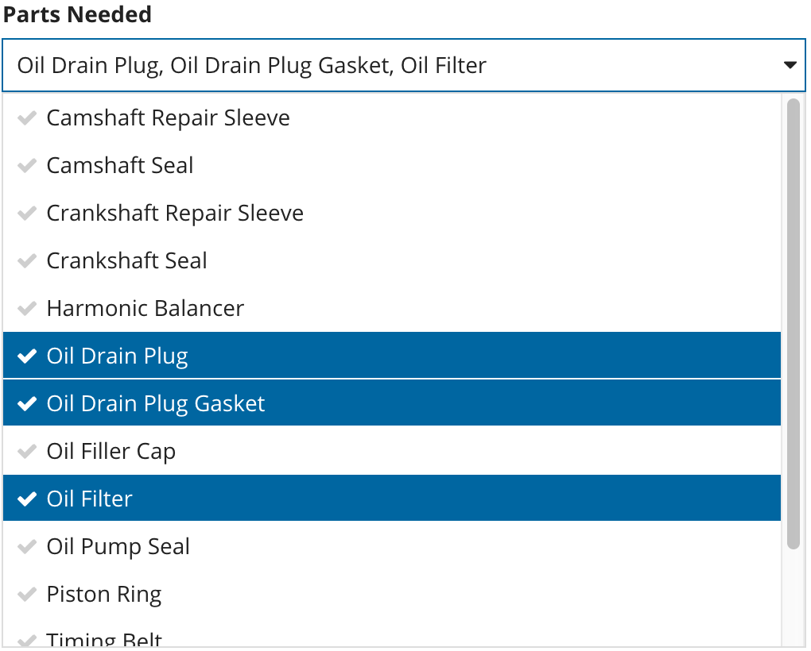

## Card choices

Use card choices as a more visually engaging alternative to other input choices, like radio buttons or checkbox fields.

Use card choices to create a short list of choices from which users can select one or many. If your list of card choices is too long to easily browse, consider using a picker or dropdown.

Sort card choices in a logical order. For lists of response options (like yes, no, no opinion), sort or group them in order of intention. Otherwise, sort lists in a logical order, such as alphabetical order.

For a uniform and professional UI, make sure that you have consistent values for the icon, primary text, and secondary text fields for all card choices on an interface. For example, all card choices should include primary text, or none of them should.

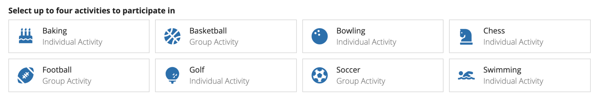 **[DO example]**

Use consistent parameters for all card choices options

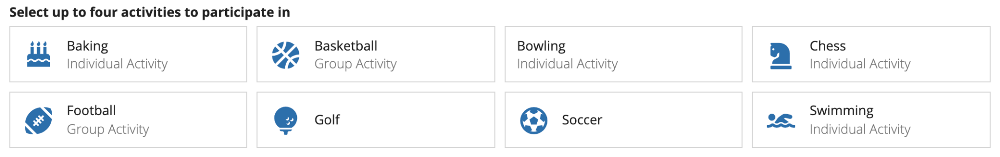 **[DON'T example]**

Don't mix data so that some have values for all parameters and others don't

Our templates are designed so that you can quickly and easily make visually impressive and well organized interfaces. Use the template that best fits your data and will best capture your users' attention. Each template fits data differently and works best in different UIs. The card tile template works best for a simple form or wizard step where you are completing one question at a time. The card bar templates are denser and work better inline on forms.

## Text inputs

### Choosing which text input to use

When designing interfaces that require text inputs, it's important to choose the right component for the specific use case. There are three types of text input components, each suited for different needs:

- **For short text inputs**: Use the text field for more concise entries, such as names, addresses, or single-line answers.

- **For longer text inputs**: Use the paragraph field where users would need to enter more text, like descriptions, comments, or multi-line responses.

- **If users might want to format their text**: Use the styled text editor to allow users to format their text, such as applying bold, italics, or lists.

If users don't need to style their text, using a styled text editor component may introduce unnecessary complexity and clutter to an interface. If you know users will not need to style their text, use a paragraph component to help maintain a clean and simple page design.

If you know you will need to eventually display a longer text input value in the grid, instead of a styled text editor component, consider using a paragraph component to collect the user's input. By default, displaying the value from a styled text editor component in a grid includes the HTML tags used for formatting. In order to display the value in a grid, you need strip the HTML using stripHtml(). This removes all formatting so the text will display as one string with no line breaks or list items, which could affect the readability of the content. See the Styled Text Editor Component page for details.

### Paragraph and styled text editor height

For the paragraph and styled text editor components, select the appropriate height based on the expected length of user inputs. Avoid heights that exceed the visible area, particularly in shorter dialogs.

For the styled text editor, ensure the bottom-right corner of the editor is visible. This helps users keep the size limit validation in view.

For the paragraph component, in editable grids use the "Short" paragraph height to align the paragraph with the inputs in adjacent columns.

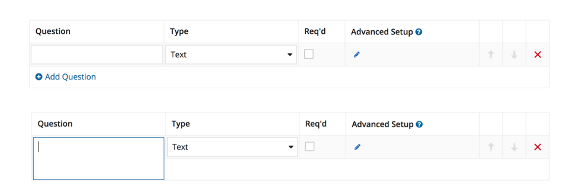

### Show character limit count

When using a character limit on a text or paragraph component, hide the character count if it is unlikely that users will exceed the character limit. This reduces clutter and distractions on the interface.

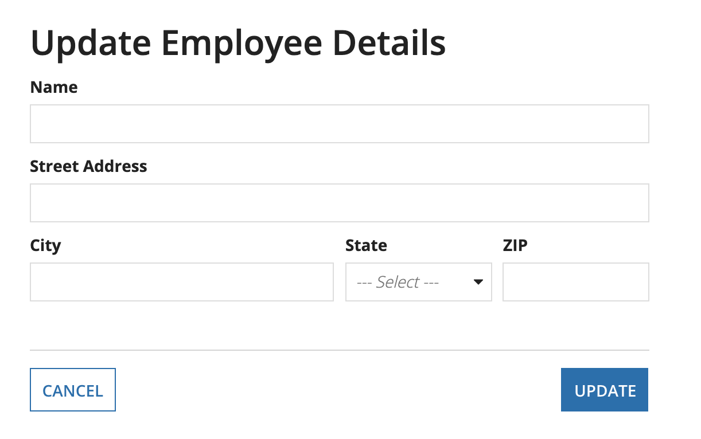 **[DO example]**

In this example, the Name, Street Address, City and ZIP fields all use the "Character Limit" parameter with "Show Character Limit Count" set to false. Users will see a validation when the character limit is reached, but will not see the character count in the text fields so that they are not distracted while filling out the form.

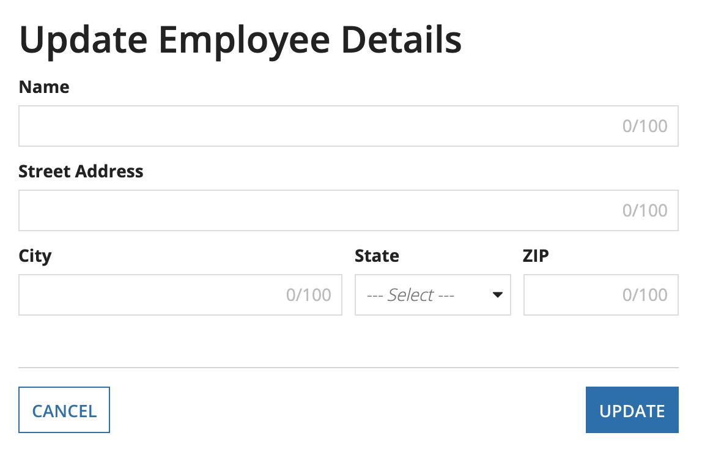 **[DON'T example]**

### Displaying read-only styled text editor values

Consider distinguishing read-only styled text editor values from other formatted text, like component labels. The bold text in these values can be confused with component labels or bold rich text items.

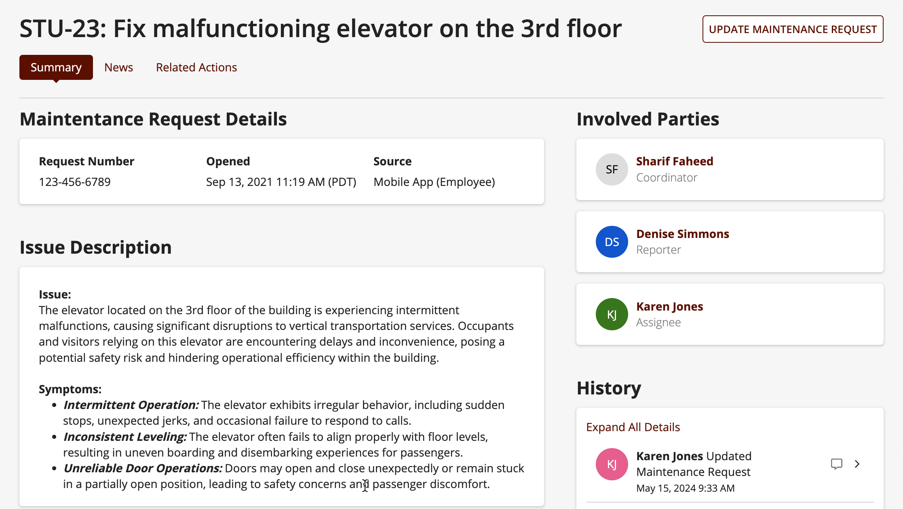 **[DO example]**

Set read-only styled text editor values apart from other bold text elements on interfaces. This example uses a section and card layout, but you could also use something like white space or divider lines.

## Input shape

By default, all input, selection, and picker components have a squared shape.

Input shape can be controlled in the **Branding** section of site and portal objects. These settings apply to all interfaces that display in the site or portal.

For more granular control over component shapes, if CSS profile properties are available in your environment, you can use them to set specific border radius values for input boxes, cards, tags, tooltips, and checkboxes.

When editing interfaces, use the Branding preview

menu to choose the site or portal that your interface will display in. This will update all of the inputs in your interface to use the shape configured in the site or portal.

The following are the options for many of the input shapes that can be configured in site and portal objects.

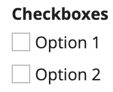

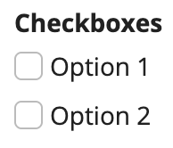

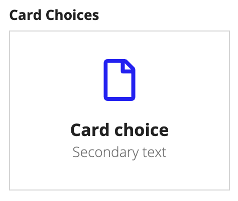

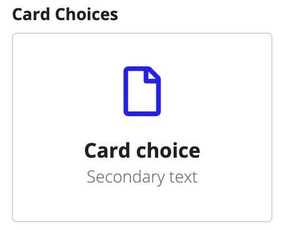

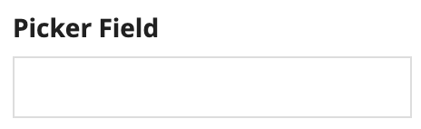

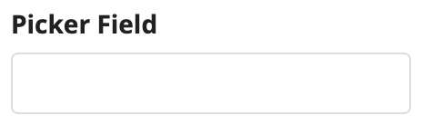

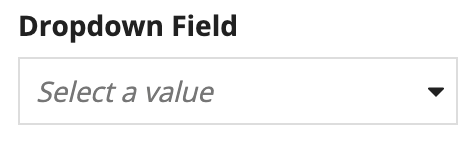

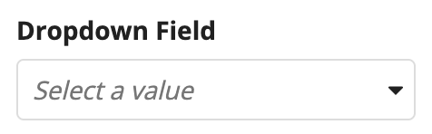

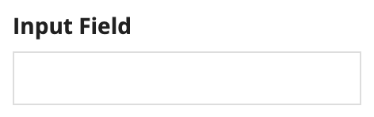

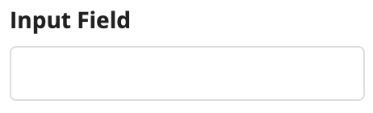

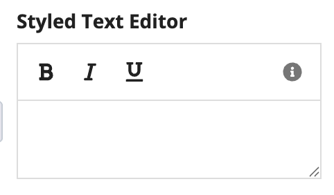

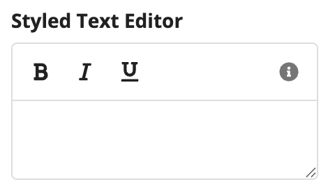

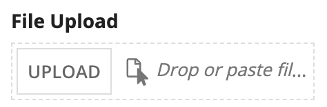

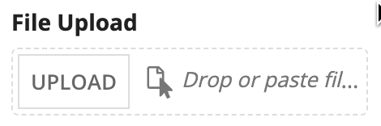

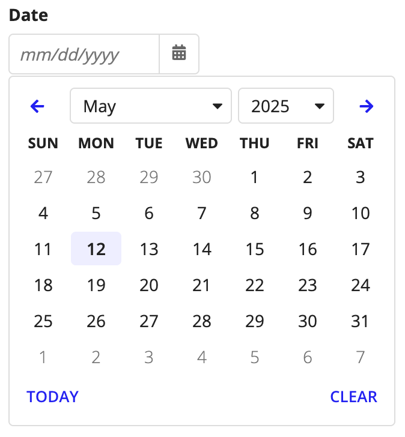

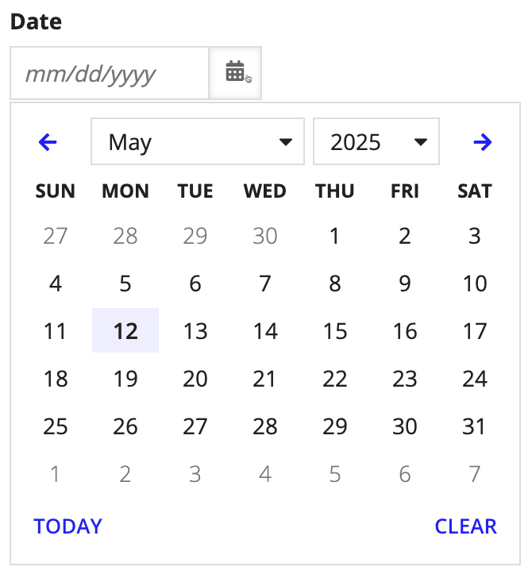

| Shape | Squared (Default) | Semi-Rounded |
| --- | --- | --- |
| Checkboxes |  |  |
| Card choices |  |  |
| Picker |  |  |
| Dropdown |  |  |
| Input |  |  |
| Styled text editor |  |  |
| File upload |  |  |
| Date |  |  |

## Help tooltips

Consider using a help tooltip instead of instructions for content that does not need be to read each time a user views the form.

For example, a help tooltip is appropriate for showing instructions that are most useful to new users.

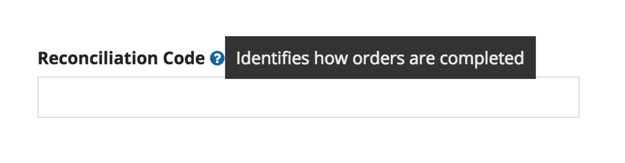

## Placeholder text

Use placeholder text to describe the correct input format or provide a brief hint to assist with value input.

Placeholder text should not replace field labels.

Note that whether placeholder text clears on focus or input varies by device and browser.

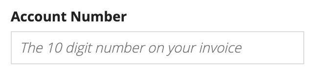 **[DO example]**

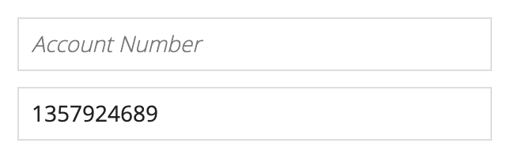 **[DON'T example]**

### Picker placeholder text

Use placeholder text for picker components to provide a distinction from regular text inputs.

In general, use sentence case capitalization and keep the message as short as possible.

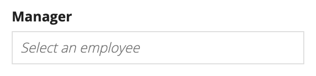 **[DO example]**

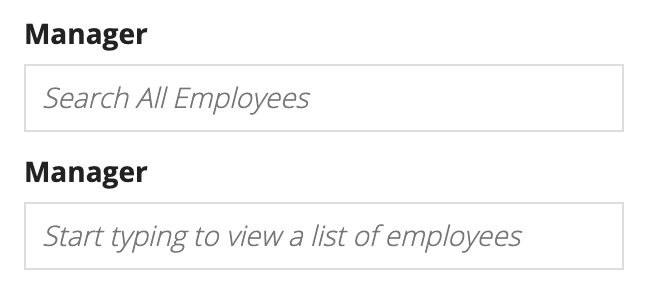 **[DON'T example]**

### File upload placeholder text

The default placeholder text is "Drop files here." Use custom placeholder text to provide more detailed guidance to users.

In general, use sentence case capitalization and keep the message as short as possible.

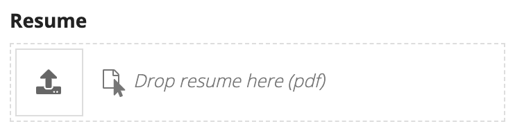 **[DO example]**

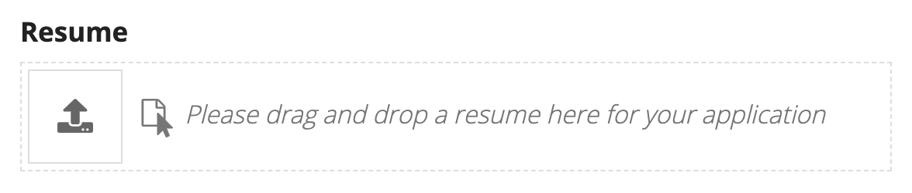 **[DON'T example]**

## Alignment

In left-to-right languages, use left alignment for inputs.

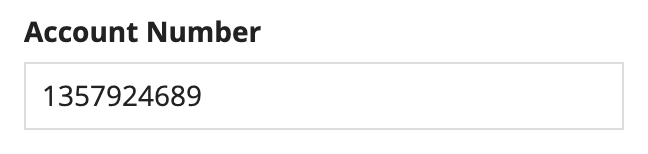 **[DO example]**

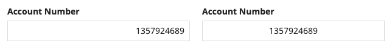 **[DON'T example]**
