# KPIs [SAIL Design System: Components]

*Section: components | source: https://docs.appian.com/suite/help/26.7/sail/ux-kpi.html | images referenced live in corpus/images/*

# KPIs

## When to use a KPI

Use KPIs to display the current value of a business metric defined by the primary measure.

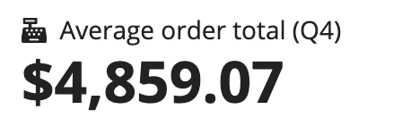 **[DO example]**

Add a secondary measure to show a trend, a comparison between the two measures.

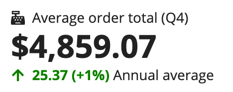 **[DO example]**

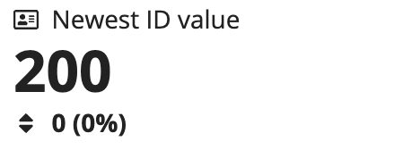 **[DON'T example]**

Don't use KPIs to show values that are not indicative of an important metric or trend.

## Trends

Trends let you display a calculated comparison of the primary and secondary measures. By default, the trend will show both the numeric difference and percentage change.

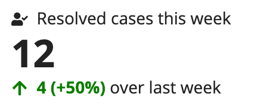

Use the "Percentage" option to show only the percentage change between the primary and secondary measures.

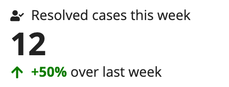

Use the "Difference" option to show only the actual value difference between the primary and secondary measures.

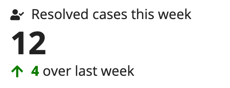

## KPI display text

The KPI's primary text is displayed prominently above the KPI's primary measure. Use primary text to describe the value that the measure represents.

Secondary text is shown next to the secondary measure. Use secondary text to label the value that the secondary measure represents.

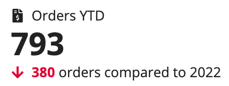

## Icons

The KPI component uses icons to help users identify the KPI on a complex interface and give extra context to the data.

 **[DO example]**

By default, an arrow icon appears next to the calculated trend value. This icon can be changed by creating an expression comparing the `fv!primaryMeasure` and `fv!secondaryMeasure` variables. Use this expression in an `a!match()` to select the icon you want to appear based on the evaluation. Make sure to include icon values for positive change, negative change, and a default value for no change.

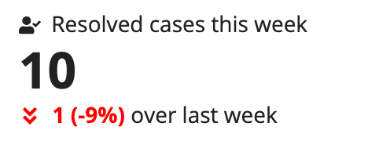 **[DO example]**

## Templates

Three templates are available to let you quickly style the component.

The default template, "COMPACT", shows the icon and primary text on the same line. Below that, the value of the primary measure is prominently displayed. If you add a trend, this is shown at the bottom of the component.

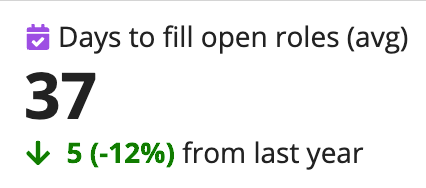

On a mobile device or in layouts with minimal horizontal space, you may choose to use the "STACKED" template. This puts each major element of the KPI on a separate line. The following example also has the *align* parameter set to "CENTER".

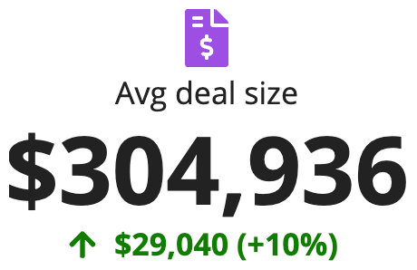

On a dense dashboard, it may help to have a large icon to draw the eye to important data. The "ADJACENT" template places a larger icon next to the text and trend data for maximum visual impact.

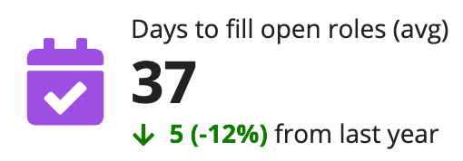

## Examples

### KPIs with supporting data

Using a KPI with other data display components can help users understand the data on your dashboards faster and put that information in context to make better decisions.

#### KPI with chart

You can combine KPIs with charts to show the current value of a metric and its performance over time. This context helps users visualize and see the details of the change over time.

This combined display can be built by adding a KPI component and a column chart to a card layout. Because both KPIs and charts are built with records, you can quickly configure each component to show the relevant record data.

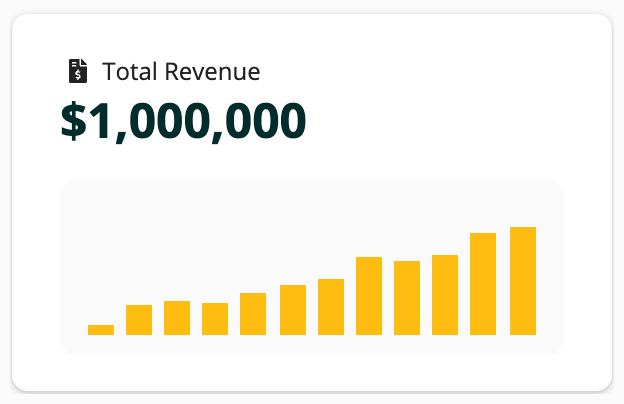

```sail
a!cardLayout(
  contents: {
    a!kpiField(
      /* Select a record type for the data parameter */
      data: null,
      primaryText: "Total Revenue",
      icon: "file-invoice-dollar",
      size: "SMALL"
    ),
    a!sectionLayout(
      label: "",
      contents: {},
      marginAbove: "NONE",
      marginBelow: "NONE"
    ),
    a!cardLayout(
      contents: {
        a!columnChartField(
          label: "",
          categories: {
            "Jan",
            "Feb",
            "Mar",
            "Apr",
            "May",
            "Jun",
            "Jul",
            "Aug",
            "Sep",
            "Oct",
            "Nov",
            "Dec"
          },
          series: {
            a!chartSeries(
              label: "2023 Total Revenue",
              data: {
                100000,
                290000,
                330000,
                300000,
                400000,
                480000,
                520000,
                720000,
                680000,
                750000,
                950000,
                1000000
              }
            )
          },
          xAxisTitle: "",
          yAxisTitle: "",
          yAxisMin: null,
          yAxisMax: 1250000,
          stacking: "NORMAL",
          referenceLines: a!chartReferenceLine(
            value: 1.85E3,
            color: "#2E2E35",
            style: "SHORTDASH"
          ),
          showLegend: false,
          showDataLabels: false,
          showTooltips: true,
          allowDecimalAxisLabels: false,
          labelPosition: "COLLAPSED",
          colorScheme: a!colorSchemeCustom(
            colors: {
              "#ffbc11",
              "#9d4de3",
              "#F3961F",
              "#18b4ab",
              "#F9CC00"
            }
          ),
          height: "MICRO",
          xAxisStyle: "NONE",
          yAxisStyle: "NONE"
        )
      },
      style: "#FAFAFA",
      shape: "ROUNDED",
      padding: "LESS",
      showBorder: false
    )
  },
  height: "AUTO",
  shape: "ROUNDED",
  padding: "STANDARD",
  showBorder: false,
  showShadow: true()
)
```

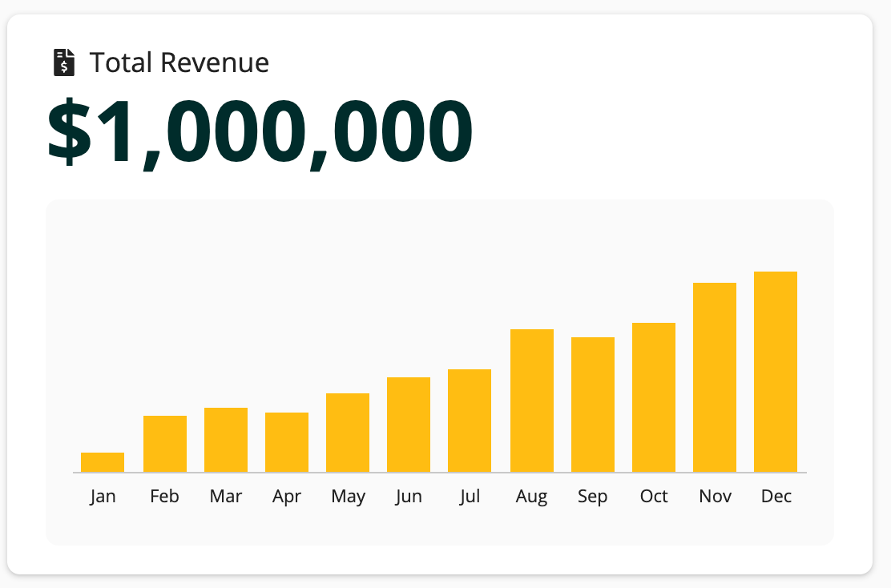

```sail
a!cardLayout(
  contents: {
    a!kpiField(
      /* Select a record type for the data parameter */
      data: null,
      primaryText: "Total Revenue",
      icon: "file-invoice-dollar",
      size: "LARGE"
    ),
    a!sectionLayout(
      label: "",
      contents: {},
      marginAbove: "NONE",
      marginBelow: "NONE"
    ),
    a!cardLayout(
      contents: {
        a!columnChartField(
          label: "",
          categories: { "Jan", "Feb", "Mar", "Apr", "May", "Jun", "Jul", "Aug", "Sep", "Oct", "Nov", "Dec" },
          series: {
            a!chartSeries(label: "2023 Total Revenue", data: { 100000, 290000, 330000, 300000, 400000,480000,520000,720000,680000,750000,950000,1000000})
          },
          xAxisTitle: "",
          yAxisTitle: "",
          yAxisMin: null,
          yAxisMax: 1250000,
          stacking: "NORMAL",
          referenceLines: a!chartReferenceLine(value: 1.85E3, color: "#2E2E35", style: "SHORTDASH"),
          showLegend: false,
          showDataLabels: false,
          showTooltips: true,
          allowDecimalAxisLabels: false,
          labelPosition: "COLLAPSED",
          colorScheme: a!colorSchemeCustom(
            colors: {
              "#ffbc11",
              "#9d4de3",
              "#F3961F",
              "#18b4ab",
              "#F9CC00"
            }
          ),
          height: "SHORT",
          xAxisStyle: "STANDARD",
          yAxisStyle: "NONE"
        )
      },
      style: "#FAFAFA",
      shape: "ROUNDED",
      padding: "LESS",
      showBorder: false
    )
  },
  height: "AUTO",
  shape: "ROUNDED",
  padding: "STANDARD",
  showBorder: false,
  showShadow: true()
)
```

#### KPI with sparkline

Another option for visualizing performance is to combine a KPI with a sparkline. This is a small line chart that shows the movement of the metric over time.

If you are showing multiple metrics, the sparkline and KPI should be placed in a card layout or other container to provide visual separation.

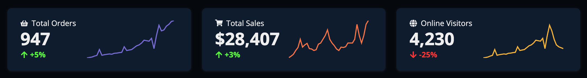

```sail
a!columnsLayout(
  columns: {
    a!columnLayout(
      contents: {
        a!cardLayout(
          contents: {
            a!sideBySideLayout(
              items: {
                a!sideBySideItem(
                  item: a!kpiField(
                    /* Select a record type for the data parameter */
                    data: null,
                    primaryText: "Total Orders",
                    icon: "shopping-basket",
                    trend: "PERCENTAGE",
                    size: "STANDARD",
                    
                  ),
                  width: "MINIMIZE"
                ),
                a!sideBySideItem(
                  item: a!lineChartField(
                    label: "",
                    labelPosition: "COLLAPSED",
                    categories: {
                      "Jan",
                      "Feb",
                      "Mar",
                      "Apr",
                      "May",
                      "Jun",
                      "Jul",
                      "Aug",
                      "Sep",
                      "Oct",
                      "Nov",
                      "Dec",
                      "Jan",
                      "Feb",
                      "Mar",
                      "Apr",
                      "May",
                      "Jun",
                      "Jul",
                      "Aug",
                      "Sep",
                      "Oct",
                      "Nov",
                      "Dec",
                      "Jan",
                      "Feb",
                      "Mar",
                      "Apr",
                      "May",
                      "Jun",
                      "Jul",
                      "Aug",
                      "Sep",
                      "Oct",
                      "Nov",
                      "Dec"
                    },
                    series: {
                      a!chartSeries(
                        label: "2023 Total Revenue",
                        data: {
                          1,
                          5,
                          10,
                          20,
                          28,
                          90,
                          29,
                          35,
                          39,
                          43,
                          40,
                          50,
                          52,
                          57,
                          60,
                          120,
                          80,
                          85,
                          90,
                          110,
                          130,
                          140,
                          160,
                          190,
                          185,
                          180,
                          210,
                          100,
                          240,
                          350,
                          290,
                          300,
                          340,
                          360,
                          390,
                          400
                        }
                      )
                    },
                    xAxisTitle: "",
                    yAxisTitle: "",
                    yAxisMin: null,
                    yAxisMax: null,
                    referenceLines: a!chartReferenceLine(value: null, style: "SOLID"),
                    showLegend: false,
                    showDataLabels: false,
                    showTooltips: false,
                    allowDecimalAxisLabels: false,
                    connectNulls: false,
                    colorScheme: a!colorSchemeCustom(colors: { "#756BD1", "#5448C6" }),
                    height: "MICRO",
                    xAxisStyle: "NONE",
                    yAxisStyle: "NONE"
                  ),
                  width: "AUTO"
                )
              }
            )
          },
          style: "#0F1C2E",
          shape: "ROUNDED",
          padding: "STANDARD",
          showBorder: false(),
          showShadow: true()
        )
      }
    ),
    a!columnLayout(
      contents: {
        a!cardLayout(
          contents: {
            a!sideBySideLayout(
              items: {
                a!sideBySideItem(
                  item: a!kpiField(
                    data: null,
                    primaryText: "Total Sales",
                    icon: "shopping-cart",
                    trend: "PERCENTAGE",
                    size: "STANDARD",
                    
                  ),
                  width: "MINIMIZE"
                ),
                a!sideBySideItem(
                  item: a!lineChartField(
                    label: "",
                    labelPosition: "COLLAPSED",
                    categories: {
                      "Jan",
                      "Feb",
                      "Mar",
                      "Apr",
                      "May",
                      "Jun",
                      "Jul",
                      "Aug",
                      "Sep",
                      "Oct",
                      "Nov",
                      "Dec",
                      "Jan",
                      "Feb",
                      "Mar",
                      "Apr",
                      "May",
                      "Jun",
                      "Jul",
                      "Aug",
                      "Sep",
                      "Oct",
                      "Nov",
                      "Dec",
                      "Jan",
                      "Feb",
                      "Mar",
                      "Apr",
                      "May",
                      "Jun",
                      "Jul",
                      "Aug",
                      "Sep",
                      "Oct",
                      "Nov",
                      "Dec"
                    },
                    series: {
                      a!chartSeries(
                        label: "2023 Total Revenue",
                        data: {
                          1,
                          5,
                          10,
                          20,
                          28,
                          50,
                          29,
                          35,
                          39,
                          25,
                          24,
                          20,
                          22,
                          37,
                          40,
                          50,
                          60,
                          75,
                          50,
                          40,
                          33,
                          24,
                          20,
                          29,
                          28,
                          30,
                          40,
                          40,
                          40,
                          50,
                          90,
                          60,
                          40,
                          60,
                          90,
                          100
                        }
                      )
                    },
                    xAxisTitle: "",
                    yAxisTitle: "",
                    yAxisMin: null,
                    yAxisMax: null,
                    referenceLines: a!chartReferenceLine(value: null, style: "SOLID"),
                    showLegend: false,
                    showDataLabels: false,
                    showTooltips: false,
                    allowDecimalAxisLabels: false,
                    connectNulls: false,
                    colorScheme: a!colorSchemeCustom(colors: { "#F47348", "#5448C6" }),
                    height: "MICRO",
                    xAxisStyle: "NONE",
                    yAxisStyle: "NONE"
                  ),
                  width: "AUTO"
                )
              }
            )
          },
          style: "#0F1C2E",
          shape: "ROUNDED",
          padding: "STANDARD",
          showBorder: false(),
          showShadow: true()
        )
      }
    ),
    a!columnLayout(
      contents: {
        a!cardLayout(
          contents: {
            a!sideBySideLayout(
              items: {
                a!sideBySideItem(
                  item: a!kpiField(
                    data: null,
                    primaryText: "Online Visitors",
                    icon: "globe-alt",
                    trend: "PERCENTAGE",
                    size: "STANDARD",
                    
                  ),
                  width: "MINIMIZE"
                ),
                a!sideBySideItem(
                  item: a!lineChartField(
                    label: "",
                    labelPosition: "COLLAPSED",
                    categories: {
                      "Jan",
                      "Feb",
                      "Mar",
                      "Apr",
                      "May",
                      "Jun",
                      "Jul",
                      "Aug",
                      "Sep",
                      "Oct",
                      "Nov",
                      "Dec",
                      "Jan",
                      "Feb",
                      "Mar",
                      "Apr",
                      "May",
                      "Jun",
                      "Jul",
                      "Aug",
                      "Sep",
                      "Oct",
                      "Nov",
                      "Dec",
                      "Jan",
                      "Feb",
                      "Mar",
                      "Apr",
                      "May",
                      "Jun",
                      "Jul",
                      "Aug",
                      "Sep",
                      "Oct",
                      "Nov",
                      "Dec"
                    },
                    series: {
                      a!chartSeries(
                        label: "2023 Total Revenue",
                        data: {
                          1,
                          5,
                          10,
                          20,
                          28,
                          90,
                          29,
                          35,
                          39,
                          43,
                          40,
                          50,
                          52,
                          57,
                          60,
                          120,
                          80,
                          85,
                          90,
                          110,
                          130,
                          140,
                          160,
                          190,
                          185,
                          180,
                          210,
                          100,
                          240,
                          350,
                          290,
                          200,
                          140,
                          120,
                          110,
                          100
                        }
                      )
                    },
                    xAxisTitle: "",
                    yAxisTitle: "",
                    yAxisMin: null,
                    yAxisMax: null,
                    referenceLines: a!chartReferenceLine(value: null, style: "SOLID"),
                    showLegend: false,
                    showDataLabels: false,
                    showTooltips: false,
                    allowDecimalAxisLabels: false,
                    connectNulls: false,
                    colorScheme: a!colorSchemeCustom(colors: { "#F8B439", "#5448C6" }),
                    height: "MICRO",
                    xAxisStyle: "NONE",
                    yAxisStyle: "NONE"
                  ),
                  width: "AUTO"
                )
              }
            )
          },
          style: "#0F1C2E",
          shape: "ROUNDED",
          padding: "STANDARD",
          showBorder: false(),
          showShadow: true()
        )
      }
    )
  }
),
```

#### KPI with progress bar

For tracking progress toward a goal, you can combine a KPI with a progress bar.

If you are showing multiple metrics, the progress bar and KPI should be placed in a card layout or other container to provide visual separation.

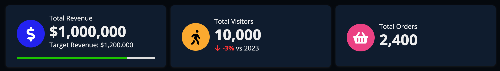

```sail
a!columnslayout(
  columns: {
    a!columnLayout(
      contents: a!cardLayout(
        contents: {
          a!cardLayout(
            contents: {
              a!kpiField(
                /* Select a record type for the data parameter */
                data: null,
                template: "ADJACENT",
                iconStyle: "STAMP",
                icon: "usd",
                primaryText: "Total Revenue",
                trend: "NONE",
                secondaryText: "Target Revenue: $1,200,000"
              ),
              a!progressBarField(
                labelPosition: "COLLAPSED",
                percentage: 80,
                color: "POSITIVE",
                style: "THIN",
                marginAbove: "LESS",
                marginBelow: "NONE",
                showPercentage: false()
              )
            },
            style: "TRANSPARENT",
            padding: "NONE",
            showBorder: false
          )
        },
        style: "#0F1C2E",
        shape: "ROUNDED",
        padding: "STANDARD",
        showBorder: false,
        showShadow: true()
      )
    ),
    a!columnLayout(
      contents: a!cardLayout(
        contents: {
          a!kpiField(
            data: null(),
            template: "ADJACENT",
            iconColor: "#FAA92F",
            iconStyle: "STAMP",
            icon: "walking",
            primaryText: "Total Visitors",
            trend: "PERCENTAGE",
            secondaryText: "vs 2023"
          ),
          
        },
        style: "#0F1C2E",
        shape: "ROUNDED",
        padding: "STANDARD",
        showBorder: false,
        showShadow: true()
      )
    ),
    a!columnLayout(
      contents: a!cardLayout(
        contents: {
          a!kpiField(
            data: null(),
            template: "ADJACENT",
            iconStyle: "STAMP",
            icon: "shopping-basket",
            iconColor: "#EB4183",
            primaryText: "Total Orders",
            trend: "NONE",
            
          ),
          
        },
        style: "#0F1C2E",
        shape: "ROUNDED",
        padding: "STANDARD",
        showBorder: false,
        showShadow: true()
      )
    )
  }
),
```

### Multiple KPIs in a card

You can combine multiple KPIs in one card to group similar metrics in a visual container.

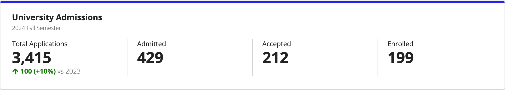

```sail
a!cardLayout(
  contents: {
    a!richTextDisplayField(
      labelPosition: "COLLAPSED",
      value: {
        a!richTextItem(
          text: "University Admissions",
          size: "MEDIUM",
          style: "STRONG"
        )
      },
      marginBelow: "NONE"
    ),
    a!richTextDisplayField(
      labelPosition: "COLLAPSED",
      value: {
        a!richTextItem(
          text: { "2024 ", "Fall Semester" },
          color: "SECONDARY",
          size: "SMALL",
          style: "PLAIN"
        )
      },
      marginAbove: "NONE",
      marginBelow: "STANDARD"
    ),
    a!columnsLayout(
      columns: {
        a!columnLayout(
          contents: {
            a!kpiField(
              /* Select a record type for the data parameter */
              data: null,
              primaryText: "Total Applications",
              
            ),
            
          }
        ),
        a!columnLayout(
          contents: {
            a!kpiField(
              /* Select a record type for the data parameter */
              data: null,
              primaryText: "Admitted",
              trend: "NONE",
              
            ),
            
          }
        ),
        a!columnLayout(
          contents: {
            a!kpiField(
              /* Select a record type for the data parameter */
              data: null,
              primaryText: "Accepted",
              trend: "NONE",
              
            ),
            
          }
        ),
        a!columnLayout(
          contents: {
            a!kpiField(
              /* Select a record type for the data parameter */
              data: null,
              primaryText: "Enrolled",
              trend: "NONE",
              
            ),
            
          }
        ),
        
      },
      alignVertical: "TOP",
      marginAbove: "EVEN_LESS",
      marginBelow: "STANDARD",
      spacing: "SPARSE",
      showDividers: true()
    )
  },
  height: "AUTO",
  style: "#ffffff",
  shape: "SEMI_ROUNDED",
  padding: "STANDARD",
  marginBelow: "STANDARD",
  showBorder: false(),
  showShadow: true(),
  decorativeBarPosition: "TOP",
  decorativeBarColor: "ACCENT"
)
```

### KPI overlay

The billboard layout's overlay options provide a way to condense your display and visually connect the KPIs to the subject of the data.

For example, say you are building metrics for a wildlife foundation. You could place the KPIs inside a bar overlay to include all of the important data with a meaningful background image.

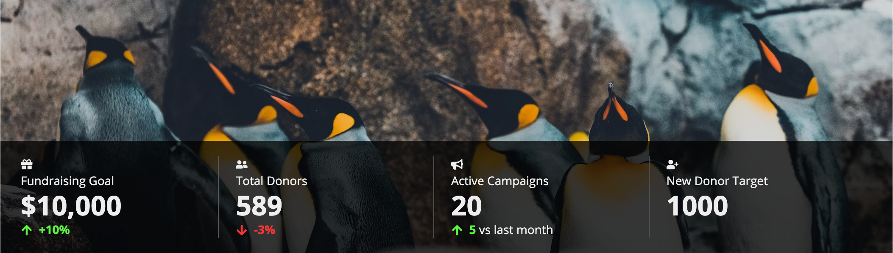

```sail
a!billboardLayout(
  backgroundMedia: a!webImage(
    source: "https://images.unsplash.com/photo-1574950333594-f3e9a9446d0f?ixid=MXwxMjA3fDB8MHxwaG90by1wYWdlfHx8fGVufDB8fHw%3D&ixlib=rb-1.2.1&auto=format&fit=crop&w=2250&q=80"
  ),
  height: "MEDIUM",
  marginBelow: "NONE",
  overlay: a!barOverlay(
    position: "BOTTOM",
    contents: {
      a!columnsLayout(
        columns: {
          a!columnLayout(
            contents: {
              a!columnsLayout(
                columns: {
                  a!columnLayout(
                    contents: {
                      a!kpiField(
                        /* Select a record type for the data parameter */
                        data: null,
                        template: "STACKED",
                        primaryText: "Gifts Dollars to target",
                        icon: "gift",
                        trend: "PERCENTAGE"
                      ),
                      
                    }
                  ),
                  a!columnLayout(
                    contents: {
                      a!kpiField(
                        /* Select a record type for the data parameter */
                        data: null,
                        template: "STACKED",
                        primaryText: "Total Donors",
                        icon: "user-friends",
                        trend: "PERCENTAGE"
                      ),
                      
                    }
                  ),
                  a!columnLayout(
                    contents: {
                      a!kpiField(
                        /* Select a record type for the data parameter */
                        data: null,
                        template: "STACKED",
                        primaryText: "Active Campaigns",
                        icon: "bullhorn",
                        trend: "DIFFERENCE",
                        secondaryText: "vs last month"
                      ),
                      
                    }
                  ),
                  a!columnLayout(
                    contents: {
                      a!kpiField(
                        /* Select a record type for the data parameter */
                        data: null,
                        template: "STACKED",
                        primaryText: "New Donors to target",
                        icon: "user-plus",
                        trend: "NONE",
                        
                      ),
                      
                    }
                  )
                },
                spacing: "SPARSE",
                stackWhen: {
                  "PHONE",
                  "TABLET_PORTRAIT",
                  "TABLET_LANDSCAPE"
                },
                showDividers: true
              )
            },
            width: "WIDE_PLUS"
          ),
          a!columnLayout(
            contents: {},
            width: "AUTO",
            showWhen: not(
              a!isPageWidth(
                {
                  "DESKTOP_NARROW",
                  "TABLET_LANDSCAPE",
                  "TABLET_PORTRAIT",
                  "PHONE"
                }
              )
            )
          )
        },
        alignVertical: "MIDDLE",
        spacing: "DENSE",
        stackWhen: {
          "PHONE",
          "TABLET_PORTRAIT",
          "TABLET_LANDSCAPE",
          "DESKTOP_NARROW"
        }
      )
    }
  )
)
```
