# Labels [SAIL Design System: Guidelines]

*Section: guidance | source: https://docs.appian.com/suite/help/26.7/sail/ux-labels.html | images referenced live in corpus/images/*

# Labels

## Position

Field labels may be shown above the component, adjacent to the component (left- or right-aligned), or not shown at all.

Note that labels are always shown above the component in the mobile application.

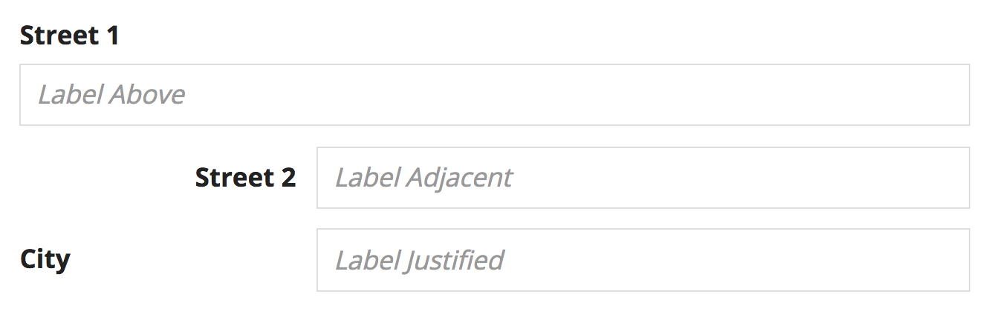

*Adjacent-positioned labels may appear ragged or misaligned when shown next to other page content*

## Above

The above-component label position generally works well for form input fields (like textboxes and dropdowns).

For all components, labels above are especially preferable to adjacent when:

- The component is wide (e.g. grids & charts), since adjacent labels take up horizontal space

- The label text is long (to avoid wrapping)

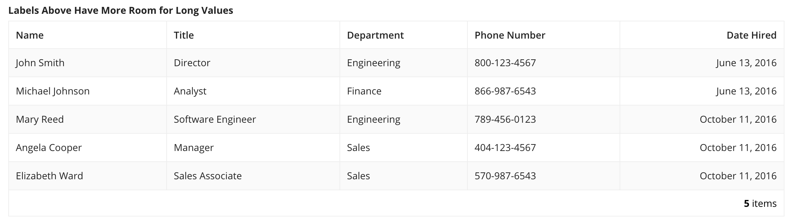 **[DO example]**

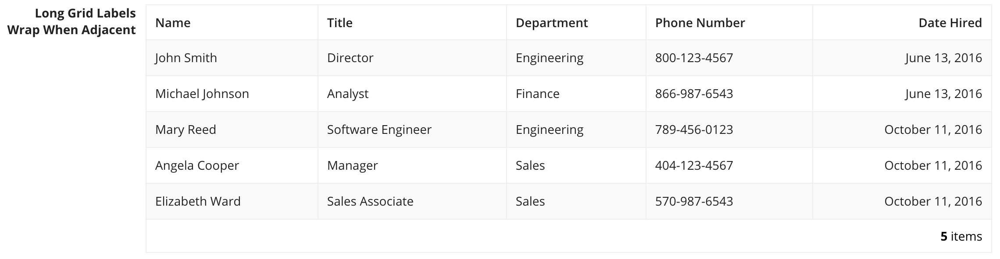 **[DON'T example]**

## Adjacent and justified

Use the adjacent or justified position to show a label next to its corresponding component.

Choose one of these options when:

- Displaying non-editable values, such as record attributes (to enhance visual grouping of labels vs. values, especially when some of the values may be blank)

- The interface has many fields (to minimize vertical scrolling)

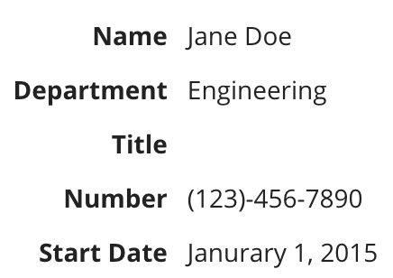 **[DO example]**

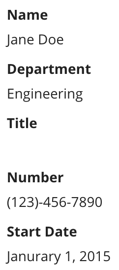 **[DON'T example]**

Don't use the above label position for read only values. This makes reading fields with missing values difficult.

The adjacent position right-aligns labels in languages that read left-to-right (like English). This position keeps labels close to the components that they describe and generally allows users to more quickly scan forms than the justified label.

Consider using the justified label in situations where the adjacent label results in visual imbalance of the user interface. Since adjacent labels are right-aligned, shorter labels may appear to be offset from other page content that is left-aligned (such as section headers and above-positioned labels).

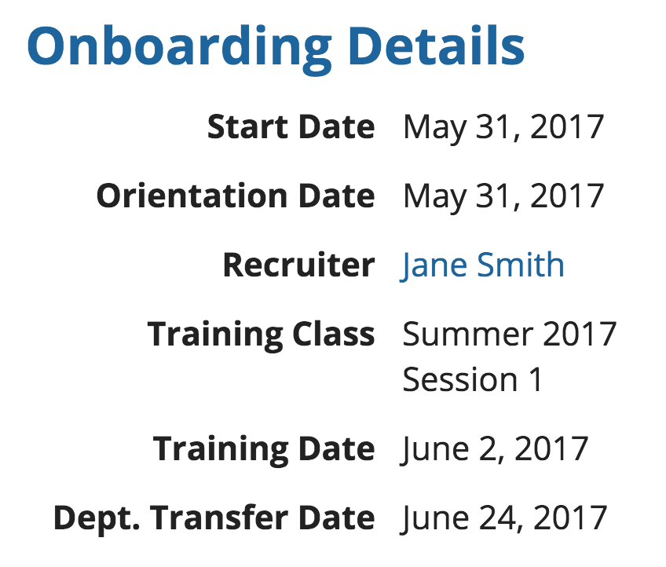

*Adjacent-positioned labels may appear ragged or misaligned when shown next to other page content*

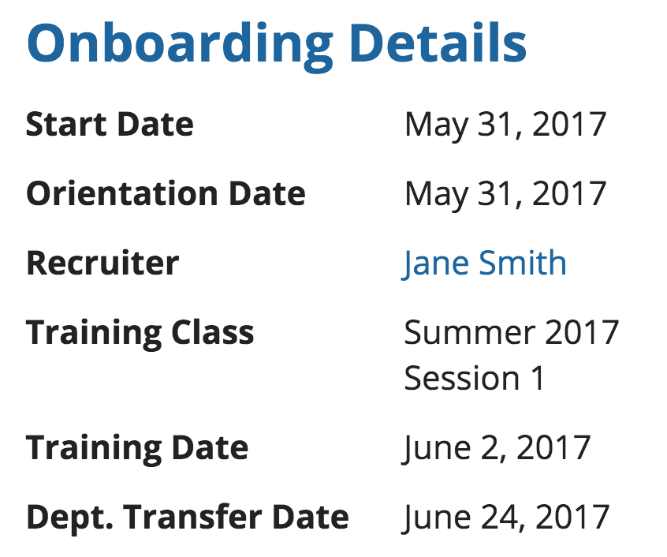

*Justified-positioned labels create more even alignment with other page elements such as section headers*

## Consistency

Avoid mixing different label positions within the same interface or section as this creates an unbalanced layout.

Consider the guidelines for determining label positioning and choose the option that best balances the requirements of all fields.

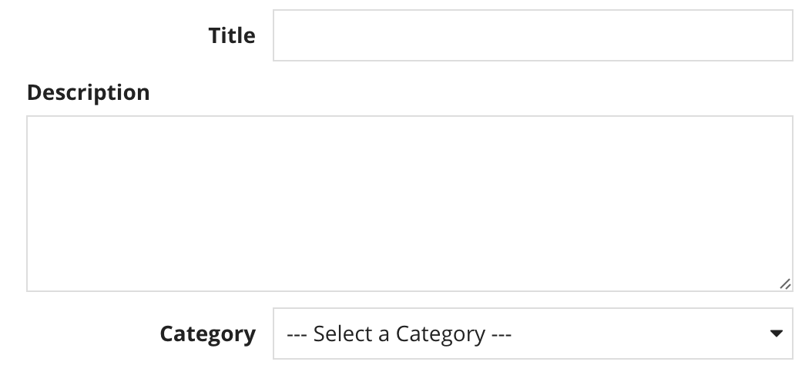 **[DON'T example]**

## Excluding labels

Field labels may be excluded if they would be redundant. For example, if:

- An interface contains a single grid or chart and the page title sufficiently describes it.

- A section header label sufficiently describes a group of related fields.

Be careful of the accessibility impact of excluding labels. Assistive technologies may expect a text label description of each field.

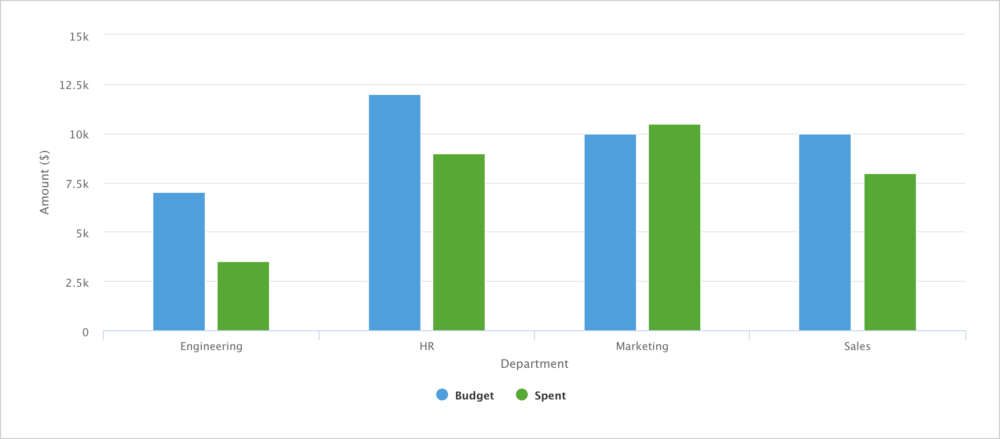

If you set *labelPosition* to `"ADJACENT"` or `"ABOVE"`, but do not give a value for *label*, a space still displays for the label. To display the component without a label, use `"COLLAPSED"` for *labelPosition* to avoid unintentionally adding extra spacing.

## Redundant labels

Avoid repeating words when labeling a group of related inputs.

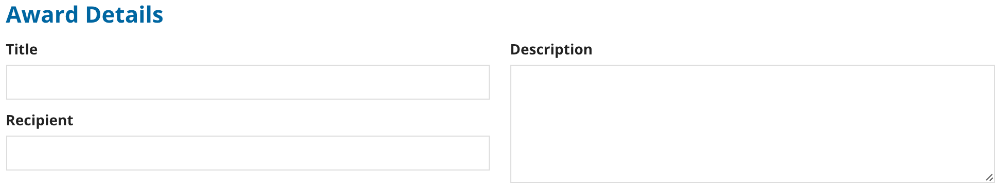 **[DO example]**

Use a section header to provide context, allowing for more concise field labels

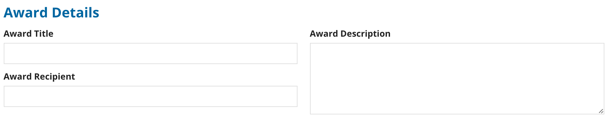 **[DON'T example]**

## Label format

Avoid using a colon (":") after a field or section label.

Use consistent capitalization in labels. Title case is recommended.

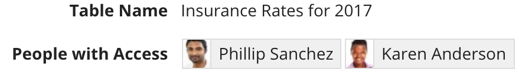 **[DO example]**

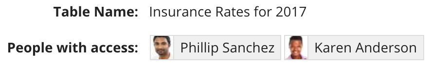 **[DON'T example]**

## Consistent tone

Avoid using labels with a conversational tone if other labels on the form are concise and direct.

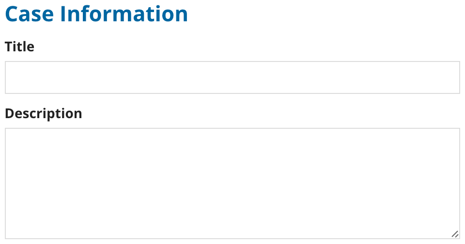 **[DO example]**

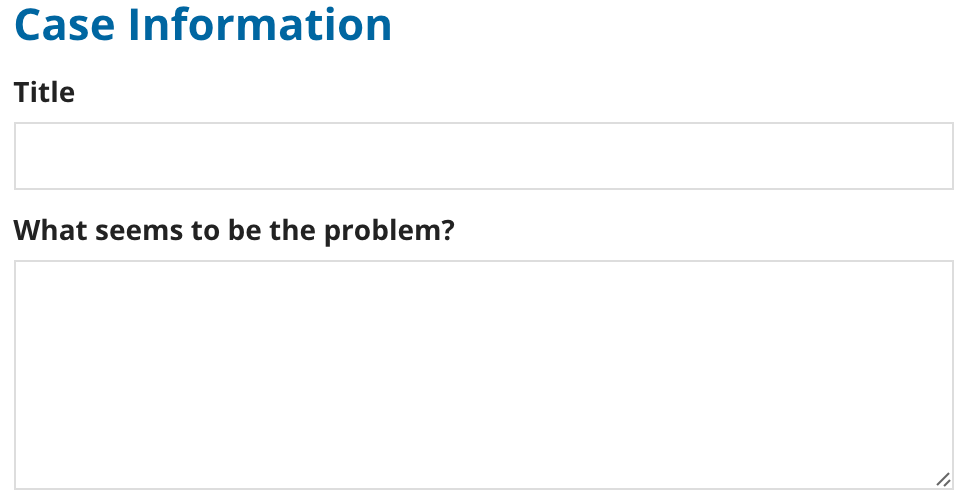 **[DON'T example]**

## Rich text headers

When displaying rich text headers, use the above label position or exclude the label for proper alignment.

Field labels may be excluded if the headers are sufficient to describe or organize the content.

 **[DO example]**

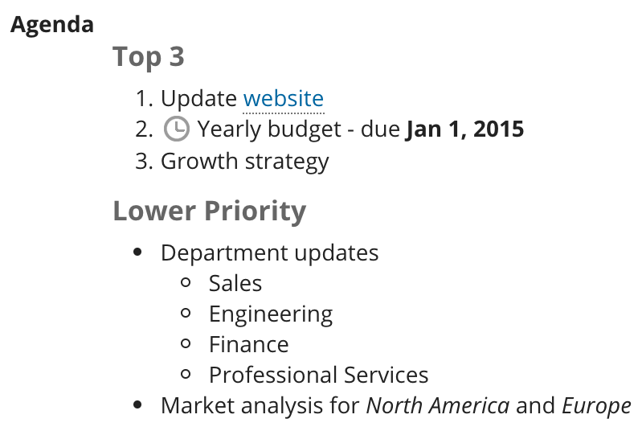 **[DON'T example]**

## Link labels

Use descriptive display text for link labels.

Avoid unnecessary or redundant words like "link".

A URL should not be displayed as the link label unless there is an explicit reason for users to see the URL.

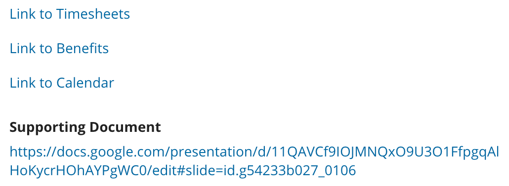 **[DON'T example]**
