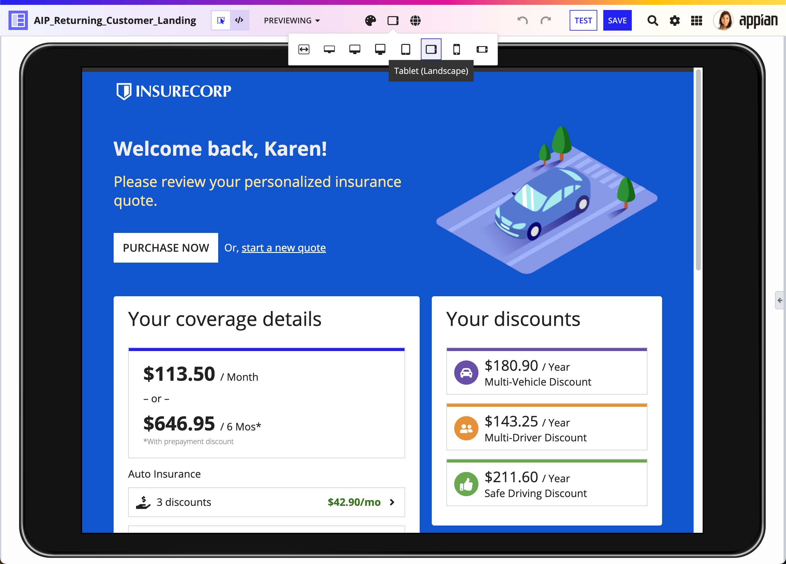
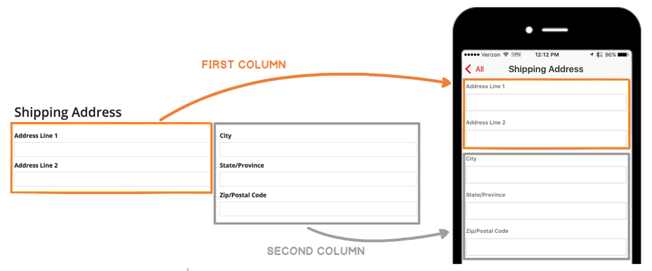
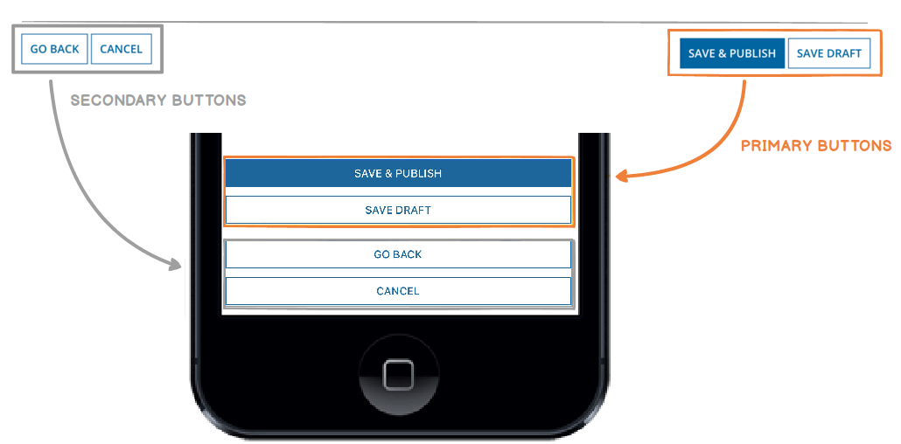
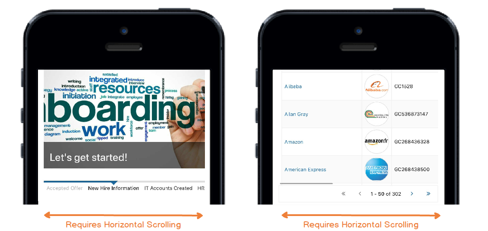
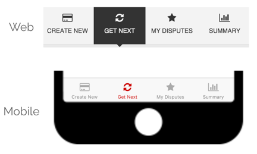
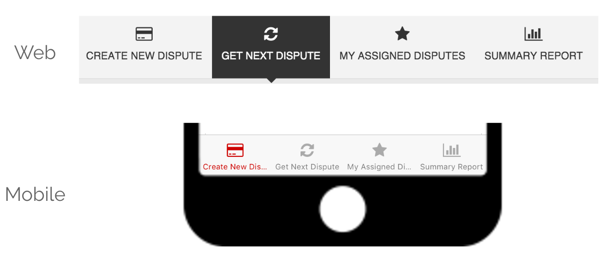
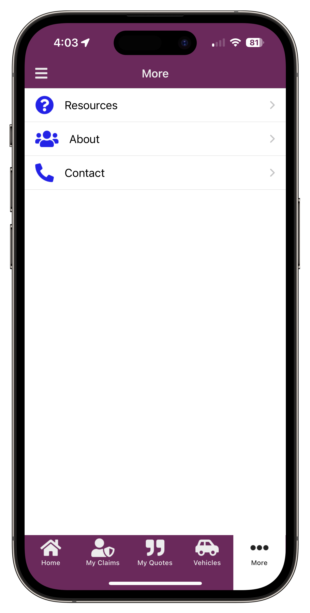
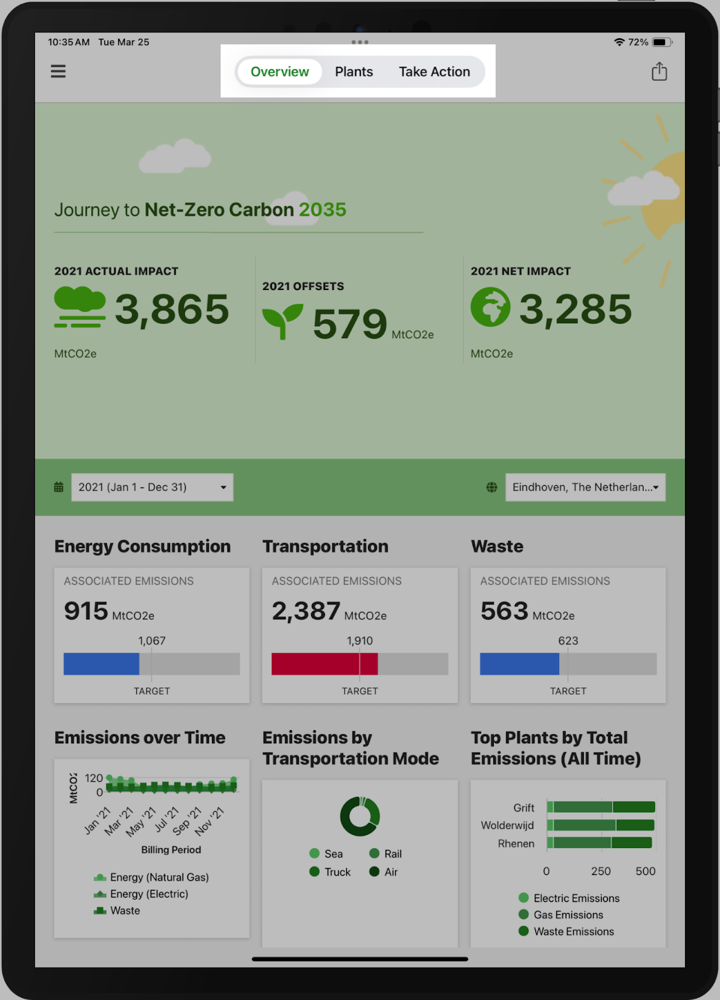
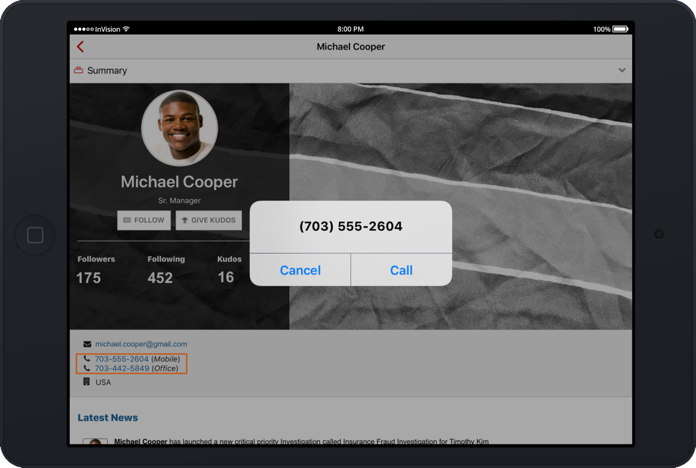

# Mobile Considerations [SAIL Design System: Guidelines]

*Section: guidance | source: https://docs.appian.com/suite/help/26.7/sail/ux-mobile-considerations.html | images referenced live in corpus/images/*

# Mobile Considerations

## Introduction

Remember that users may be using devices with a variety of screen sizes to view interfaces in Appian. When designing an interface, use device width preview to determine if it also works well on smaller screens.

See responsive design to learn how to ensure your interfaces look great on any screen size.

## Flattened columns

Columns layouts are flattened into a single column on phones by default. However, you are able to configure column stacking behaviors for a variety of different screen sizes using the *stackWhen* parameter.

If you choose to keep the default stacking behavior, make sure that your design doesn’t only make sense when certain fields are placed next to each other.

## Flattened buttons

When using the iOS or Android mobile app, button layouts are flattened into a single column on phones, with primary buttons appearing above secondary buttons.

Make sure that the button order makes sense in this alternate layout.

## Wrapping & scrolling

While concise labels and instructions are always recommended, it's particularly important to reduce clutter, wrapping, and scrolling on mobile screens.

Certain components, by definition, may be configured to require a lot of screen real estate (e.g. milestones with many steps, grids with many columns). Avoid these situations if you're targeting narrow screens.

## Site pages

Use concise titles for multi-page sites. Keep in mind that there is even less horizontal space on a mobile device.

 **[DO example]**

 **[DON'T example]**

For mobile-first sites that are only accessed on Appian Mobile, we recommend limiting the number of pages or page groups to five. See Designing Sites and Portals for more guidance on adding pages and page groups to sites.

**Note:  **Page groups are not supported in offline mobile.

For iOS devices, the fifth page is replaced with a **More** menu.

*Site with more than five pages on an iOS device.*

On Android devices, the menu will try to fit in as many pages as possible. When no more pages will fit, the pages scroll horizontally.

In Appian Mobile on iPads that are on iPadOS 18, site pages will display in the app header via a floating tab bar.

## Phone links

Both the iOS and Android applications automatically convert phone numbers inside read-only Text or Paragraph Components to clickable links. These links launch the 'Phone' application and initiate dialing of the specified number.

