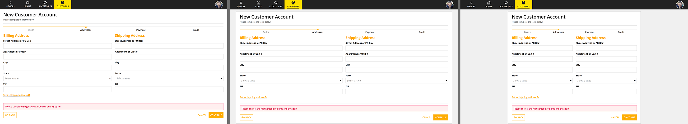
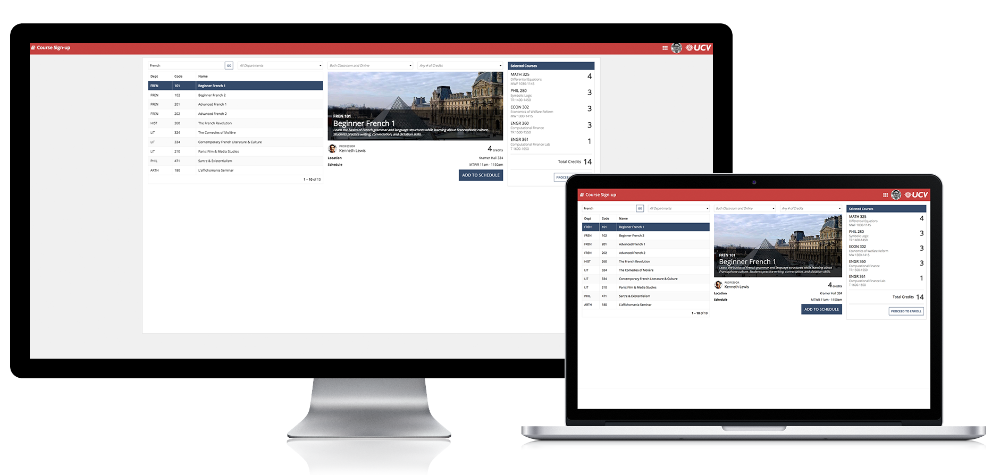
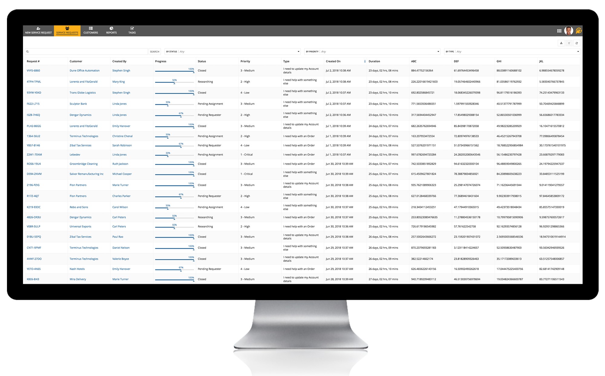
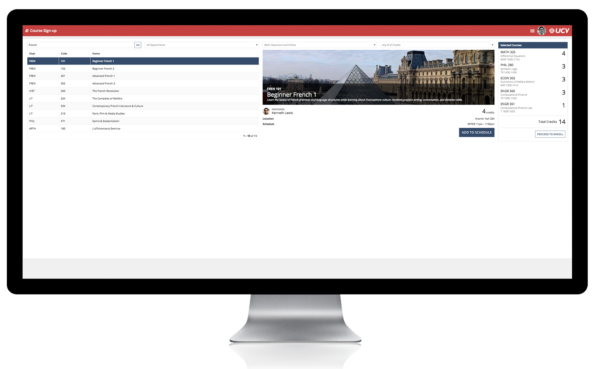

# Page Width [SAIL Design System: Guidelines]

*Section: guidance | source: https://docs.appian.com/suite/help/26.7/sail/ux-page-width.html | images referenced live in corpus/images/*

# Page Width

## Introduction

When designing for a sites user experience, select the appropriate page width for the content. Choose the "Wide" or "Full" page width for content-packed UIs such as those with many columns of data (see the section below for tips on when to use each setting). The "Narrow" width is appropriate for interfaces such as simple one-column and two-column forms where excessive white space is undesirable. The "Medium" width is a good compromise for many common use cases. Keep in mind that the selected width for a site page applies until the user navigates to another page, even when UI content is updated (such as when drilling into a record from a record list). Make sure that the width you choose works well for all content that will be displayed on that page.

*Page widths compared: (L-R) "Wide", "Medium", and "Narrow"*

On mobile devices, sites pages always use the full width of the screen regardless of the configured page width.

The page width for a portal is equivalent to "Full" in a site page.

For task-specific start pages on sites, the page width is always "Medium" and cannot be changed.

The page width for UIs viewed in Tempo is always equivalent to the "Medium" setting for sites pages. Interfaces designed for "Wide" or "Narrow" sites pages will automatically adjust to fit within Tempo pages. Tempo pages always use the full width of the screen when viewed on mobile devices.

When embedding interfaces into another web page, the available width is dictated by the dimensions of the Appian container, which is controlled by the web page designer.

## Wide vs. full page width

Pages that use the "Wide" width setting will fill the browser window when viewed on a typical display. However, when using a screen with very high horizontal resolution (such as an ultrawide monitor), the page width will be limited to 2,000 device independent pixels. This behavior minimizes variation in page content layout, providing a more consistent experience for users with varied display setups.

 **[DO example]**

Use the "Wide" page width setting instead of "Full" to provide a consistent layout for users across a range of display resolutions.

The "Full" width setting allows pages to fill any size browser window, even on very wide displays. Use this configuration to maximize content space for users who will reliably view the page on high-horizontal-resolution displays.

 **[DO example]**

Use the "Full" page width setting to optimize the experience for users with very wide displays.

 **[DON'T example]**

Don’t use the "Full" setting for pages intended to be viewed across a range of display widths. Pages designed for typical screen sizes may not look good when allowed to fill the full width of very wide displays. Contents may look unexpectedly stretched or there may be too much white space.
