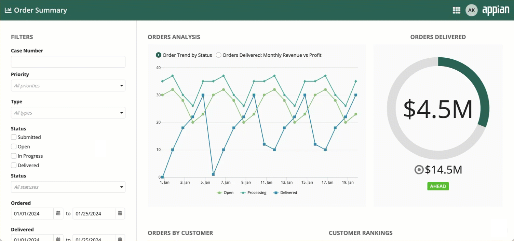
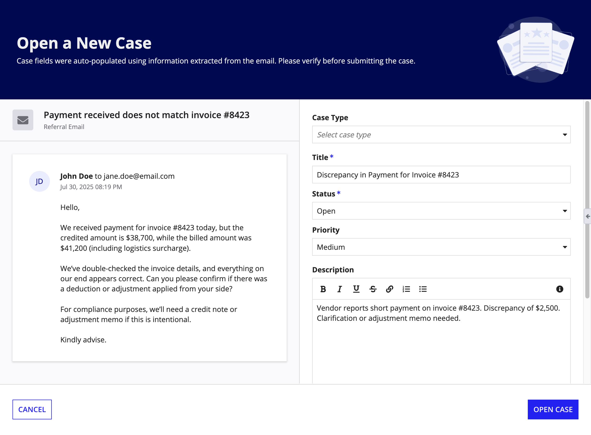
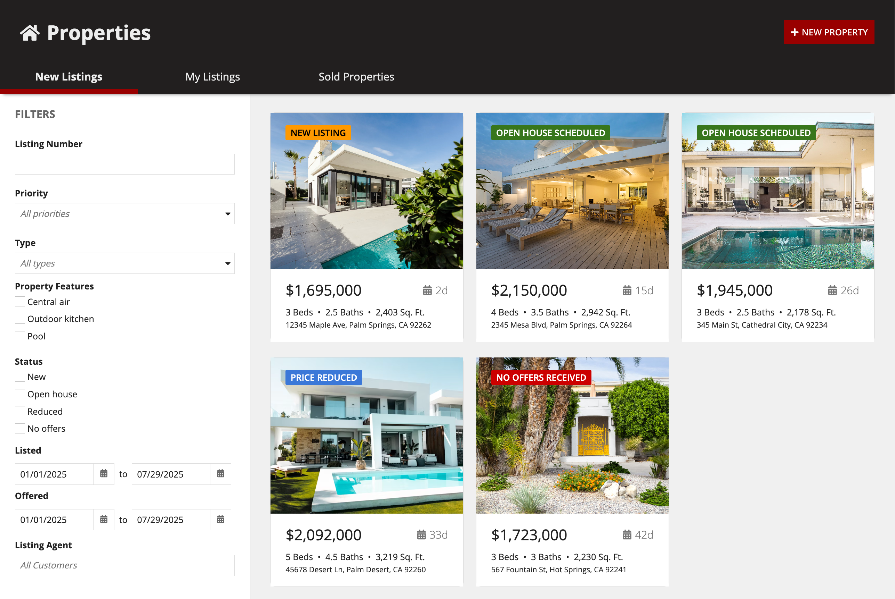
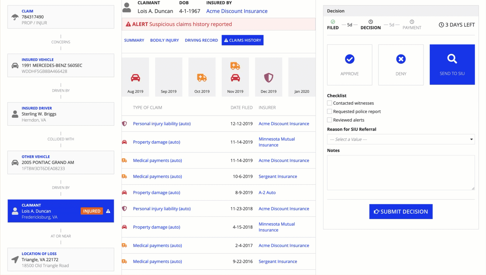
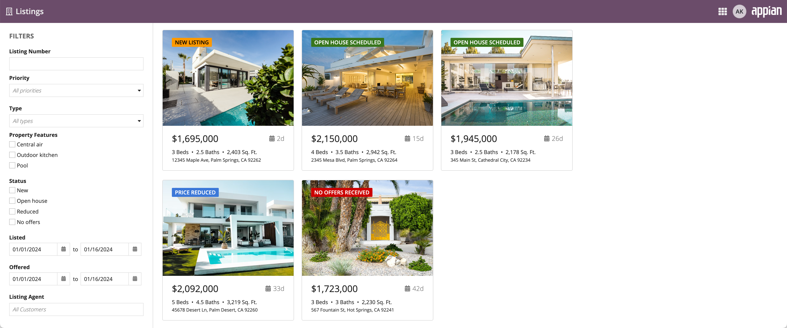
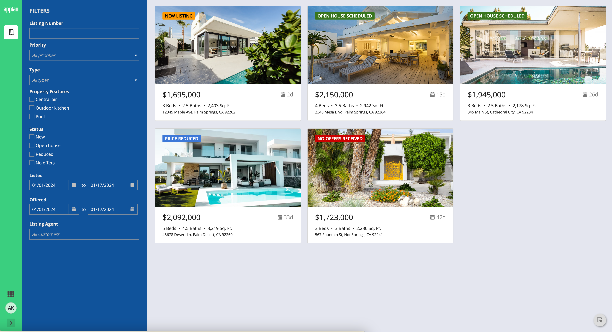

# Pane Layout [SAIL Design System: Components]

*Section: components | source: https://docs.appian.com/suite/help/26.7/sail/ux-pane-layout.html | images referenced live in corpus/images/*

# Pane Layout

## Introduction

The pane layout component lets you design pages with multiple scrollable areas. This could be a two-pane design with controls on one side and the main content in the other, or a three-pane layout with two content areas.

The pane layout can have two or three panes, each containing input fields, images, charts, grids, and other components.

## When to use pane layout

The pane layout is primarily a top-level layout designed to structure an entire interface.

You can also use it within an a form layout or header content layout to create interfaces with independently scrolling sections below a common header or within a form structure.

### Pane layout as a top-level layout

*Related usage considerations: Using a pane layout as a top-level layout*

When used as a top-level layout, the pane layout takes up the full width and height of the screen.

#### Pane layout in a form layout

*Related usage considerations: Using a pane layout in a form layout*

You can place a single pane layout within the *contents* parameter of a form layout to create forms with multiple, independently scrolling columns of content.

#### Pane layout in a header content layout

*Related usage considerations: Using a pane layout in a header content layout*

You can place a single pane layout inside the *contents* parameter of a header content layout.This is useful when you need a consistent header that spans across multiple, independently scrollable content sections.

## Pane layout parameter configurations

This section highlights variations of the pane layout component to help you visualize what's possible for your interface designs.

To use a pane layout component in design view, you must start with a blank interface. For existing interfaces, the **Top Level Layouts** menu is not visible. To add a pane layout to an existing page, either remove all existing content or switch to expression mode.

In the **Components Palette**, under the **Top Level Layouts** section, drag and drop a PANE LAYOUT onto the page.

 *(animated GIF)*

### Styling configurations

The parameters in this section control how things display for the layout.

#### Show pane dividers parameter

*Related style guidelines: Turn off pane dividers in forms with header and button footer dividers*

Use the **Show pane dividers** parameter to turn on or off the dividers between the panes.

## Pane component parameter configurations

The parameters in this section are for the pane component contained within the pane layout.

### Content configurations

The parameters in this section control what displays for the component.

#### Contents parameter

The **Contents** parameter contains all of the input and display components you want to appear

### Styling configurations

The parameters in this section control how things display for the component.

#### Width parameter

*Related style guidelines: Pane widths*

Use the **Width** parameter to control the resizing behavior of the pane.

#### Background color parameter

Use the **Background Color** parameter to change the color that appears behind the pane content. You can use different background colors to quickly create distinct vertical sections that completely fill the height of the window.

Valid values are "White" (default), "Gray", "Transparent", "Charcoal Scheme", "Navy Scheme", and "Plum Scheme". You can also set a custom color by using a hex code or a hex code that includes transparency. To add transparency to the hex code, add two additional digits between 00 (more transparent) and FF (less transparent).

#### Padding parameter

Use the **Padding** parameter to set the desired amount of whitespace around a pane's content. Valid values are "None", "Even Less", "Less", "Standard" (default), "More", and "Even More".

As you adjust this parameter to increase the padding, you'll notice you're creating more space around the contents section of your page.

If you want zero space around the contents section so that it's flush with the border of the page, select "None" for the parameter value.

The right amount of padding for your interface may depend on a variety of factors. Adjust the contents padding settings to see what works best.

The following example shows the progression of the padding values from "None" through "Even More".

 *(animated GIF)*

## Style guidelines

This section highlights specific design guidelines and recommendations.

### Pane widths

#### Using fixed pane widths

Most designs have a pane that should have a fixed width, so we recommend a fixed width value to maintain the same look across different screen sizes. For example, panes used to fix controls like filters to the side of the page should have a consistent width.

 **[DO example]** *(animated GIF)*

Using a fixed pane width allows the filters to look good on different screen sizes.

 **[DON'T example]** *(animated GIF)*

Using the automatic width for a control pane doesn't look good on different screen sizes.

#### Using automatic pane widths

When you set a fixed with for a pane, you must set at least one other pane to use the "AUTO" width. This ensures that the layout will adjust to fit any screen size.

 **[DO example]**

Using automatic width for the main content on this interface allows the pane to take up the rest of the screen, no matter how wide the screen is.

 **[DON'T example]**

Using a fixed width for the main content on this interface doesn't allow the content to take up the rest of the screen when using a wide monitor.

Use the default automatic pane width to distribute space evenly across all panes.

If you don't specify a value for the *width* parameter, the pane's width will be set to auto. In general, we recommend that your layout have at least one pane with a fixed width for a consistent design across different screen sizes.

### Page contents background color

#### Create enough contrast between contents and background color

If you are using a custom background color, make sure there is enough contrast between the page contents and the page background color to ensure accessibility compliance.

#### Don't mix and match dark color schemes across site pages

Avoid creating pages with a mix of dark color scheme panes and non-dark color scheme panes. It is important that your pane background color works well with your site branding colors and is consistent across all site pages.

#### Use a custom background color to match company branding

To better match your company branding, set a custom background color. To set a custom background color, select **Use a custom color** for the Background Color parameter. Remember to also place content in cards that are a lighter hex value than your set background color. See our Using Colors guidance to ensure your page looks clean and professional.

*This dashboard uses a custom color scheme. The cards have a lighter hex value than the background color.*

### Turn off pane dividers in forms with header and button footer dividers

When using a pane layout within a form layout, consider turning off **Show pane dividers** when the form also has dividers for the header and button footer. This avoids a visually heavy and boxy look.
