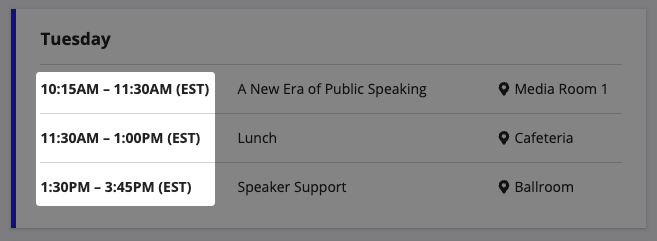
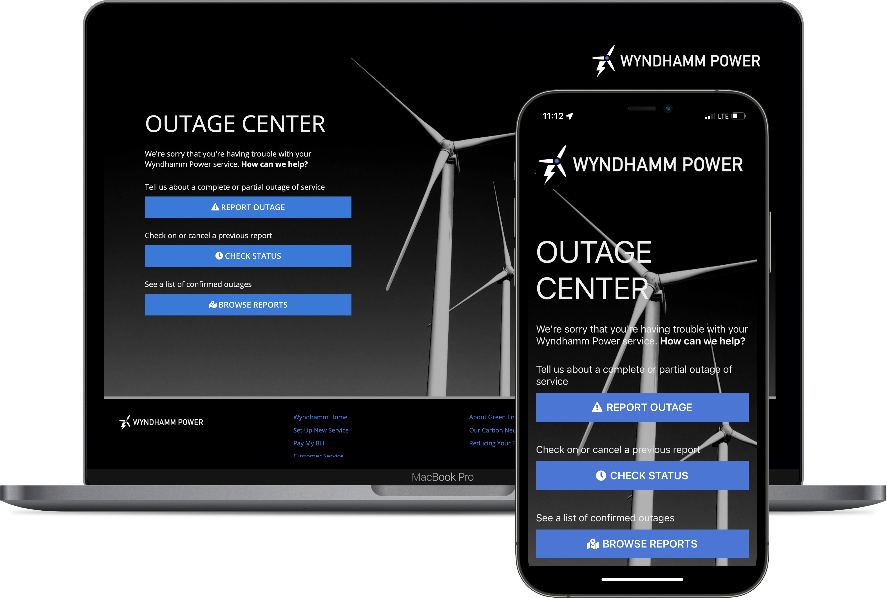

# Portal Design Guidelines [SAIL Design System: Guidelines]

*Section: guidance | source: https://docs.appian.com/suite/help/26.7/sail/ux-portals.html | images referenced live in corpus/images/*

# Portal Design Guidelines

## Introduction

With portals you need to consider a user type that you don't deal with in an authenticated interface—anonymous users. These users will likely access your portal from many different locations on many different device types. Since the users aren't a part of your organization, you know a lot less about them than your typical Appian users. Additionally, since they aren't logged in, you don't automatically know information about them like their preferred language or time zone.

This page offers a few high-level guidlines to consider when trying to provide the best possible user experience in your portal.

For more information:

- See the Portal Object page.

- Check out Designing Sites and Portals page to learn more about branding options for your portal.

- For functional design considerations, see the Portal Best Practices page.

## Design your interface to account for time zones and localization

### Specify the time zone in your interface design

Because users of your portal aren't logged in with a user account, you can't access their time zone.

For any component that displays time or asks users to enter a time, always display the time zone that your portal is using.

### For multilingual portals, provide a way for users to switch between locales

By default, portals use the primary locale, time zone, and calendar settings that are configured in the Administration Console for the environment when the portal is published.

You can create links that switch between locales using a!portalUrlWithLocale() in a safe link component.

Changing a portal locale will automatically update the following to match the locale:

- Date and time fields

- Right-to-left or left-to-right layout

- Translation strings

- Components that use system text, such as the file upload component

 *(animated GIF)*

Scroll or drag to pan · ⌘+/⌘− to zoom · Esc to close

 *(animated GIF)*

## Use responsive design

Keep in mind that your users will likely be accessing your portal from many different types of devices. Make sure you design your portal so that it looks good on any screen size. For more guidance, check out our content on Responsive Design.

Additionally, to change the design based on the device width, be sure to use the a!isPageWidth() function. The a!isNativeMobile() function will not work with portals since portals don't display in the Appian Mobile application. You can also use the *stackWhen* parameter in columns layouts and side by side layouts to make your design look great on any screen size.

Note that the page width for a portal is equivalent to "Full" in a site page.

## Consider a header bar layout for your portal

To quickly configure a fixed header in a single-page portal, consider enabling the HEADER BAR layout option for the navigation bar. On multipage portals, the navigation bar is always enabled. Enabling the navigation bar also provides you with additional branding options and navigation for multipage portals.

## Using reCAPTCHA in your portal

Using reCAPTCHA in your portal is a great way to frustrate bots and protect your portal from malicious or fraudulent activity. Just make sure you don't frustrate your human users when you enable reCAPTCHA on a portal interface. Because the reCAPTCHA icon will always display on the bottom-right corner of your interface, you'll want to center the content at the bottom of the page with white space on either side. This will ensure you don't cover up important content, like a submit button, with the reCAPTCHA icon.
