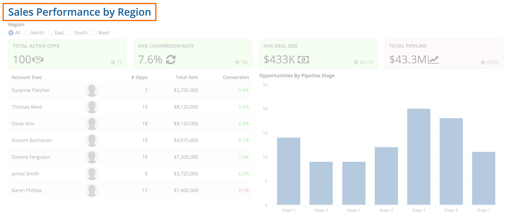
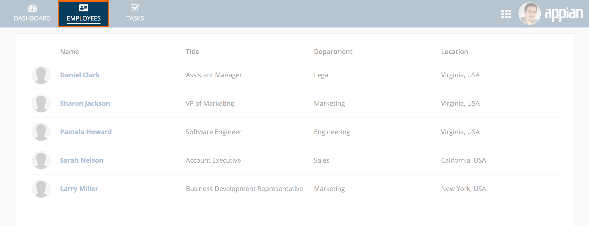
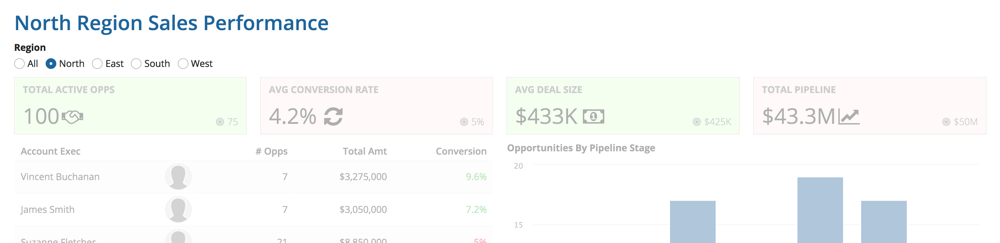
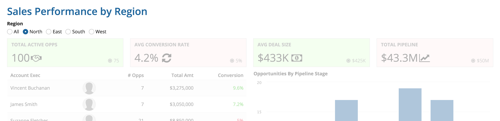
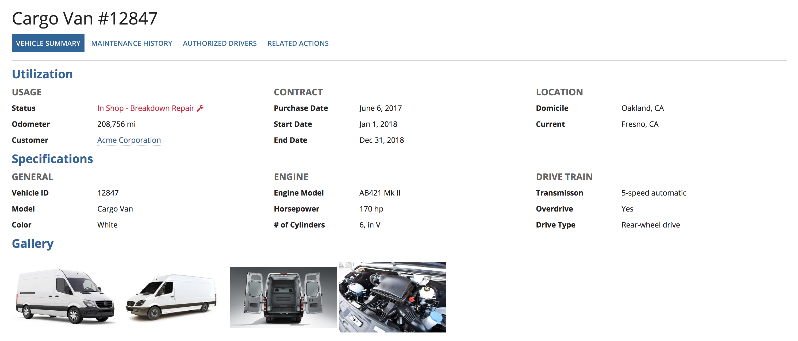
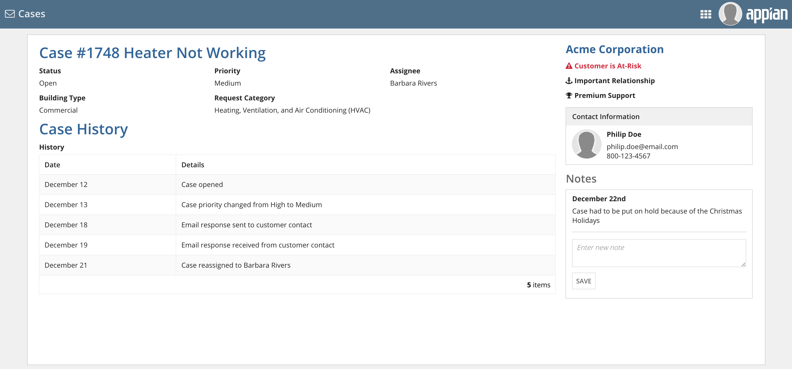
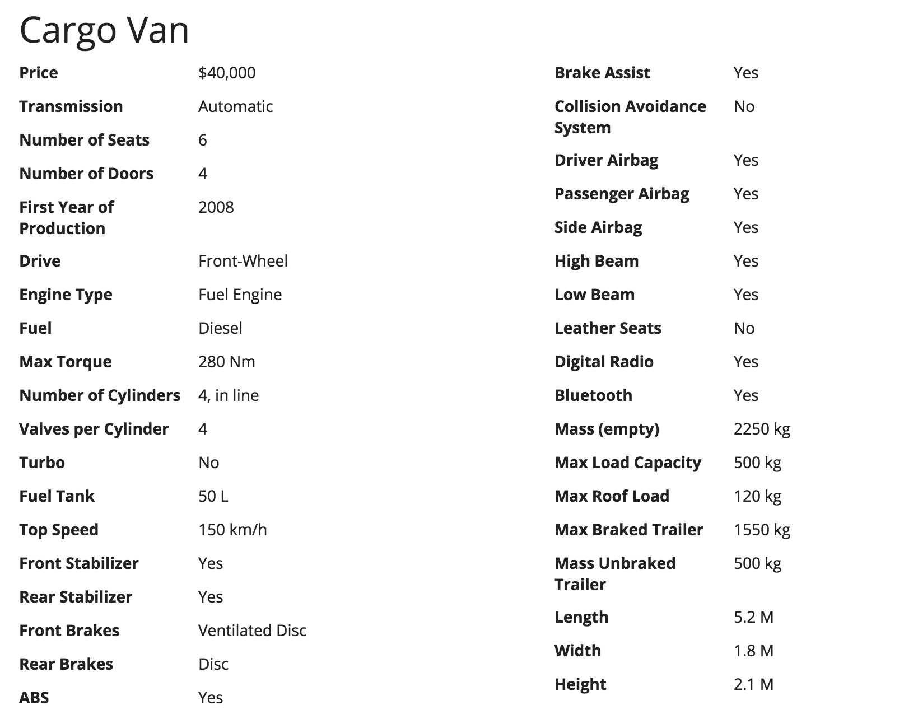
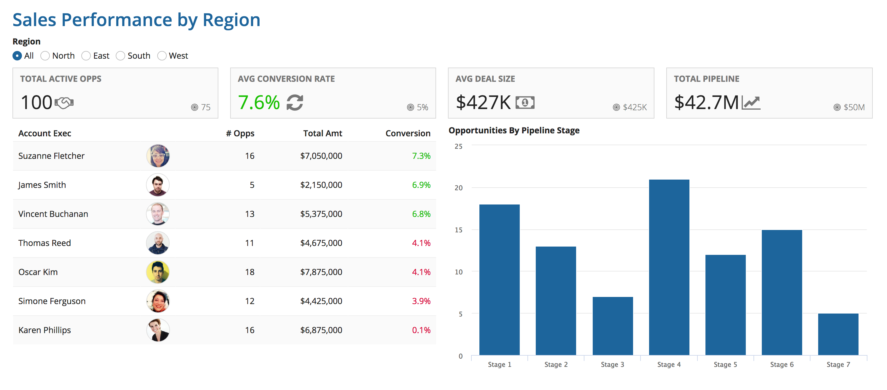
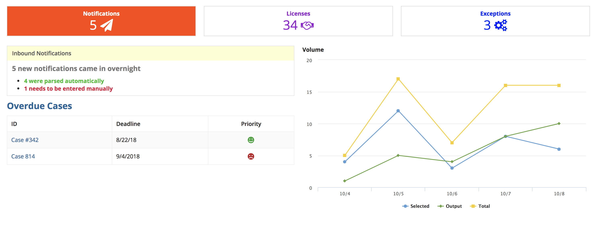
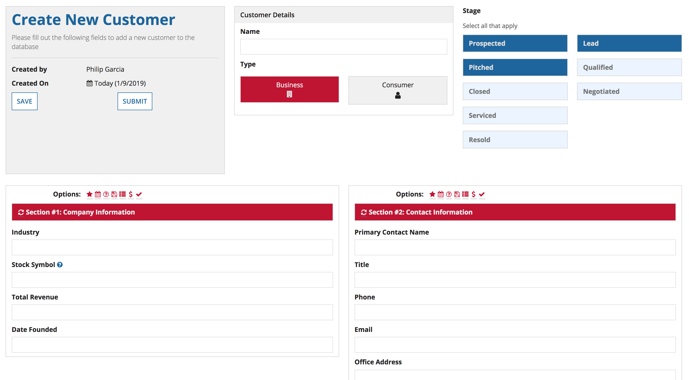

# Presenting Information Clearly [SAIL Design System: Guidelines]

*Section: guidance | source: https://docs.appian.com/suite/help/26.7/sail/ux-presenting-information-clearly.html | images referenced live in corpus/images/*

# Presenting Information Clearly

## Introduction

Powerful functionality and rich data are of limited value if they cannot effectively be consumed by their audiences. That's why presenting application content with great clarity is a crucial part of user experience design. This page describes how to structure the elements of your UIs to conform to a logical and effective information architecture.

**Information architecture** is the practice of organizing and describing content to maximize comprehension. Getting this right requires thinking about the top-level navigation of your application, the presentation of each individual field or control, and everything in between.

When designing each new interface, make sure that your choices allow users to accomplish their tasks with ease. Specifically, visitors to a page should find it intuitive to:

- Understand the purpose of the page

- Know how to navigate to related pages

- Recognize how page contents are organized

- Quickly find controls and comprehend specific pieces of information on the page

## Facilitate orientation and navigation

Use prominent titles to identify the content of each page. Be concise, but specific. For example:

- "Approve Conference Expenses for Jane Smith" describes a task

- "Sales Performance by Region" describes a report dashboard

A separate title may not be needed if the selected site page title adequately describes the purpose of the page.

Page titles should remain constant. Avoid changing the title to reflect user selections made on the page.

 **[DON'T example]**

Don't change the page title as users interact with page contents

 **[DO example]**

Keep the page title consistent even as page contents update

It should also be easy for users to tell where the current page is situated within a network of related pages, with clear navigation options to jump to those other interfaces.

*A back navigation link reminds viewers that they're looking at the details of a selected item and provides an obvious way to return to the full list of items*

*Breadcrumbs describe the current page's position within a logical hierarchy of items. Breadcrumb links make it easy to jump to other parts of the same hierarchy.*

For more information on how to organize your site content into pages and page groups, see Designing Sites and Portals.

## Clearly outline page structure

While the simplest pages may only need to be described by a single title, many pages feature a varied collection of content and controls which benefit from structured organization.

Take time to explicitly define the structure of what you plan to show on each page:
How many organizational levels will be required?
Which groups should be children of which parent sections?
Which groups are siblings of each other?

Select appropriate interface components to clearly express the page structure. Users should be able to easily identify and understand the organizational hierarchy. When selecting interface components to structure the information on a page, keep in mind that section labels, box labels, and rich text headers are more accessible than rich text items.

 **[DO example]**

Use a consistent and intuitive set of visual styles to represent the content structure of pages.

In the example interface above, the hierarchy is expressed, in order, as follows:

1. The page title is the most visually-prominent text in the interface and represents the topic of the entire page.

2. Tabs represent separate views of the same topic. The content below the tab bar corresponds to the selected tab.

3. Section headings represent major content groupings.

4. A less prominent text style is used to represent subsections at the lowest level.

 **[DON'T example]**

Don't make it hard for users to understand the structure of pages. Avoid layouts that create ambiguity and confusion.

In this example:

1. A section heading ("Case History") is shown with the same style as the title of the entire page ("Case #1748…").

2. The name of the customer ("Acme Corporation") is styled like a section heading, but it's actually a data value.

3. The "Notes" section is a sibling to the "Case History" section, but it's styled to look like it belongs at a different level of the information hierarchy.

## Use visual differentiation to aid comprehension

Users may find it difficult to consume pages with a lot of uniformly-presented content.

 **[DON'T example]**

Visual differentiation helps to reinforce separation of content groupings within a page, helping users to quickly scan for and understand the most important parts.
Differentiate content by varying:

- **Size** (use larger sizes to draw attention to more important values)

- **Weight** (vary boldness to contrast different values)

- **Color** (use different colors to highlight certain values, keeping accessibility considerations in mind)

- **Container** (show some content in box or card layouts to segregate from rest of page)

 **[DO example]**

This dashboard uses restrained differences in styling to make it easier for viewers to understand the content. Key performance indicator cards at the top of the page use large numbers and icons to highlight important values. Green and red text colors are used to supplement numeric values to make it easy to spot performance trends. User photos make it easier to scan for a particular person and also break up the visual uniformity of the data grid.

Avoid creating an unnecessary amount of visual differentiation as that results in clutter and reduces ease of comprehension.

 **[DON'T example]**

Don't use a wide range of colors to differentiate content, particularly when the colors won't have obvious meaning to viewers. The result could look cluttered and garish.

 **[DON'T example]**

Don't use the same layout to represent different concepts on the same page. In this example interface, card layouts are used to demarcate content sections, act as selection toggles, and represent section header bars. The inconsistency and visual clutter make it hard for users to navigate the page.
