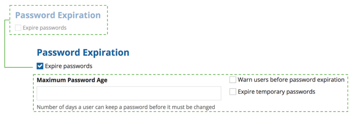
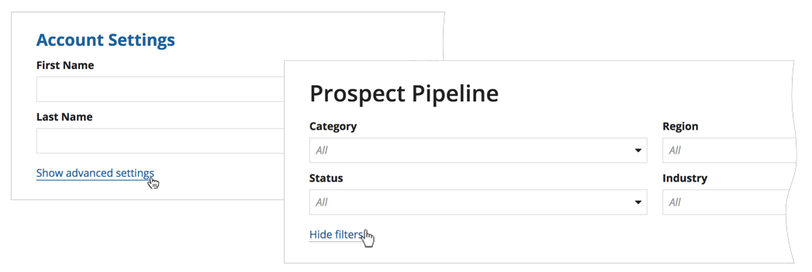
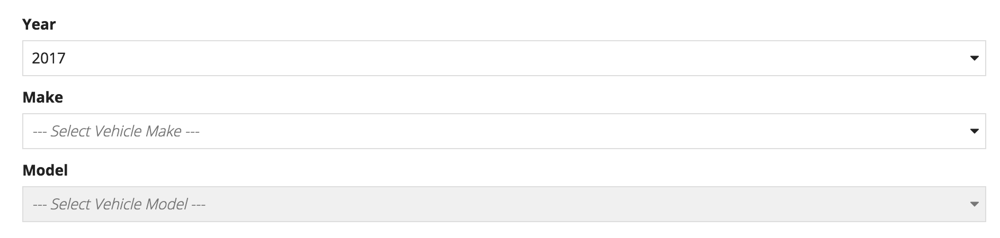

# Progressive Disclosure [SAIL Design System: Guidelines]

*Section: guidance | source: https://docs.appian.com/suite/help/26.7/sail/ux-progressive-disclosure.html | images referenced live in corpus/images/*

# Progressive Disclosure

## Introduction

Progressive disclosure refers to the hiding of user interface elements until they are needed. This technique presents a simpler initial experience to users, allowing them to better focus and complete the task more quickly.

## Progressively disclose based on user selection

If certain UI elements are only relevant when the user makes a particular selection, then it may be helpful to hide those items until the corresponding selection has been made.

*The "Maximum Password Age" input and the two checkboxes to its right are only relevant when the user enables the "Expire passwords" option. Therefore, it is a good idea to hide those fields until the "Expire passwords" checkbox is checked.*

## Progressively disclose based on user action

Less frequently used elements may be hidden to reduce clutter until the user opts to display them. This is typically achieved by providing a "Show advanced options" link (and corresponding "Hide advanced options" link).

## Avoid hiding items that are part of a sequential flow

Progressive disclosure is appropriate for **conditional** display scenarios where certain UI elements should remain hidden until certain conditions are met. It is possible to successfully use the interface without ever revealing those items (for example, a user could choose not to show advanced options).

However, progressive disclosure should not be applied to **sequential flows**. In these scenarios, users always follow the same steps (which are known ahead of time), but certain inputs cannot be made modified until preceding selections have been made. For sequential steps, fields that are not yet available should be disabled and not hidden.

*In this example of a sequential flow, the "Model" dropdown is disabled until the "Make" and "Year" selections have been made*
