# Record Actions [SAIL Design System: Components]

*Section: components | source: https://docs.appian.com/suite/help/26.7/sail/ux-record-actions.html | images referenced live in corpus/images/*

# Record Actions

## Introduction

The record action component enables one or more record actions – related actions and record list actions – to be placed on any interface. It provides quick and easy implementation and greater flexibility for action styling and behavior, including launching forms in dialogs. As a result, this component is recommended for all user actions.

There are a number of configurations available that affect user experience: the style configuration changes how the list of actions appears on the interface, the display configuration dictates which details are shown, and the action behavior configuration determines how the form is presented to the user once the action is launched.

## Style

When choosing a style, consider the number of actions, the density of information on the page, and the level of prominence that’s appropriate relative to other content on the page.

### Toolbar

The “Toolbar” style displays small, secondary buttons side by side. Use it to provide actions above related elements on the page. For example, use this style to display actions above a grid.

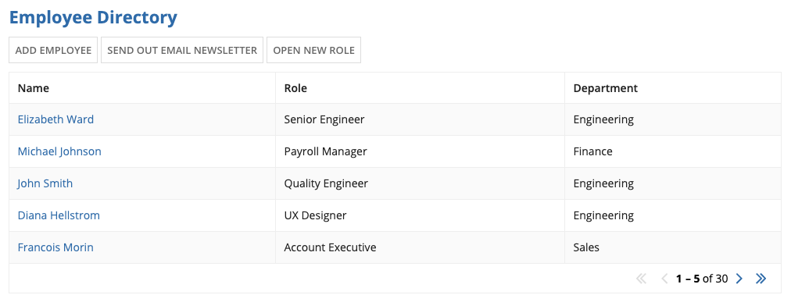 **[DO example]**

Use the “Toolbar” style to display actions above the content to which they relate.

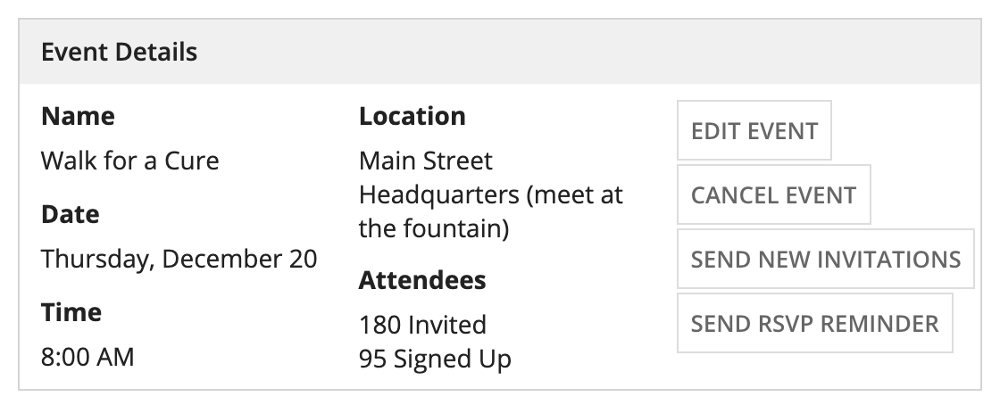 **[DON'T example]**

Don’t use the “Toolbar” style when there is limited horizontal space, which can cause the buttons to wrap. Try the “Links” or “Sidebar” styles instead.

### Links

The “Links” style displays standard-sized link text. When multiple actions are configured in the record action component, the links are displayed in a stacked layout. This style provides a subtle, lightweight display that’s appropriate for dense interfaces and small spaces (e.g. in a grid cell).

In general, links aren’t as effective as buttons for conveying that an action is available, as described in the best practices for Buttons vs. Links.

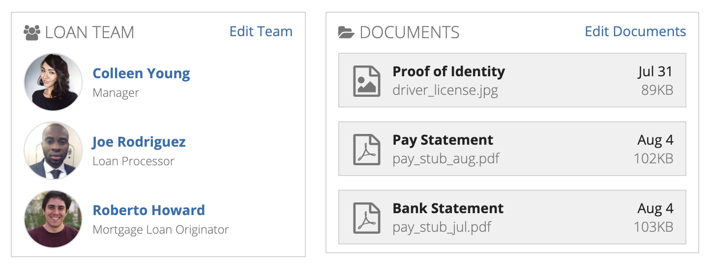 **[DO example]**

Use the “Links” style to provide a subtle action in a small space (e.g., an “Edit” link in a section of read-only information).

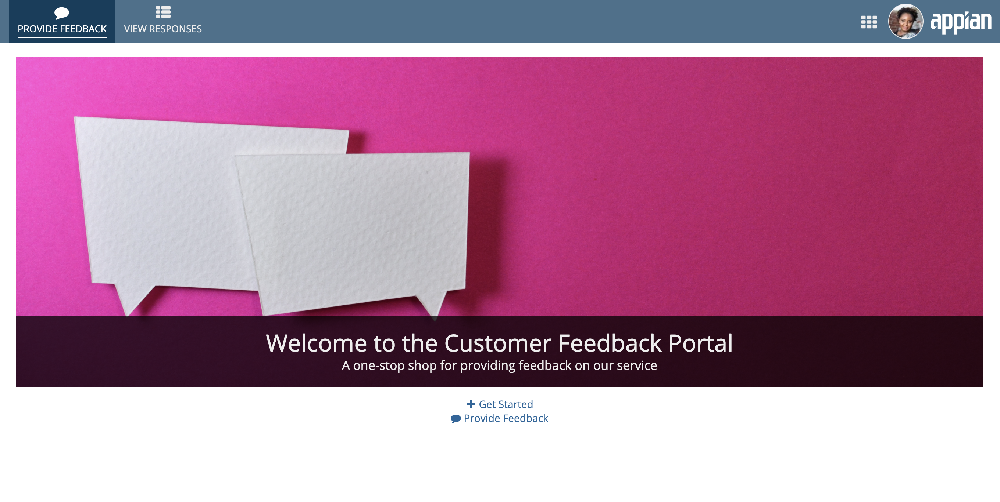 **[DON'T example]**

Don’t use the “Links” style when the actions should catch the user’s attention. Each of the other four display styles stands out more on the page.

### Cards

The “Cards” style displays rich text within equally sized card layouts. Depending on the width of the container they’re in (e.g., a column), cards may wrap onto a new row or have their labels truncated.

The “Cards” style presents actions prominently with large click targets. Use this style when the actions are the focal point of the page. Because a single card may not be as easily perceived as a clickable action, this style works best with multiple actions.

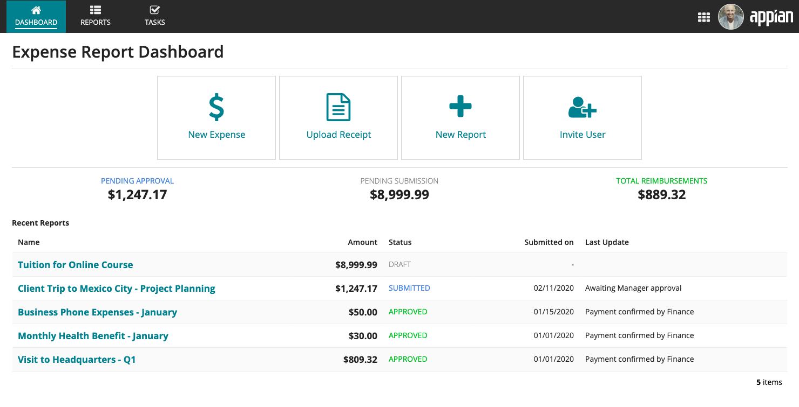 **[DO example]**

Use the “Cards” style to prominently display actions on a dashboard or home page.

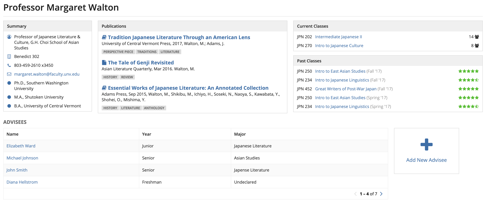 **[DON'T example]**

Avoid using the “Cards” style when the actions aren’t the focal point of the page. On dense interfaces, the “Toolbar” style, “Links” style, or “Sidebar” style may work better.

### Sidebar

The “Sidebar” style displays small, secondary buttons in a stacked layout. All buttons configured in the component have a consistent width determined by the action with the longest label. When placed in a relatively narrow container, however, the buttons instead fill the width of the container.

Use the “Sidebar” style to designate a place on the page for standalone actions.

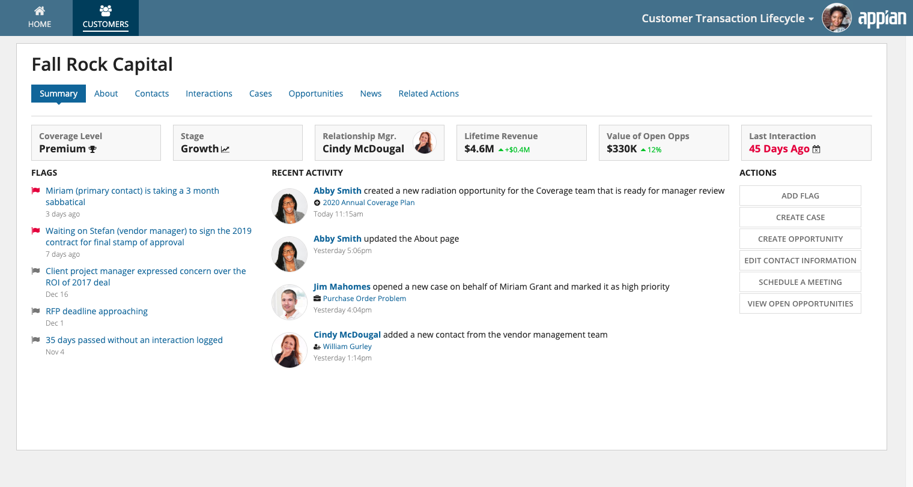 **[DO example]**

Use the “Sidebar” style to group a list of actions together on the page.

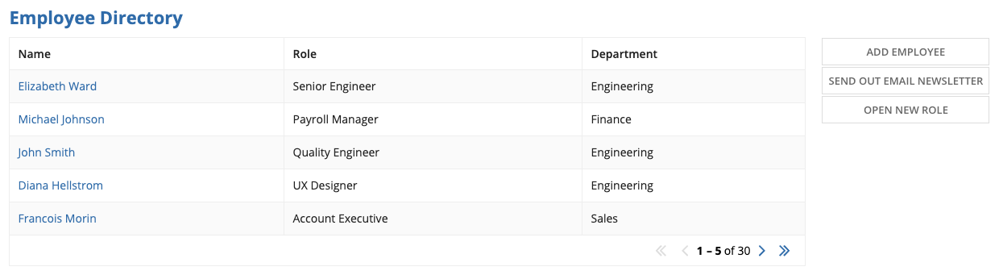 **[DON'T example]**

Don’t use the “Sidebar” style to associate actions with content in a grid. Use the more familiar “Toolbar” style instead.

### Call to action

The “Call to Action” style displays large, primary style buttons that invite the user to take action. Use the “Call to Action” style to display a single important action.

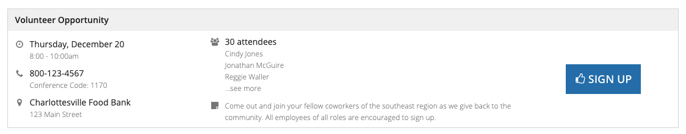 **[DO example]**

Use the “Call to Action” style when there is ample whitespace around the component.

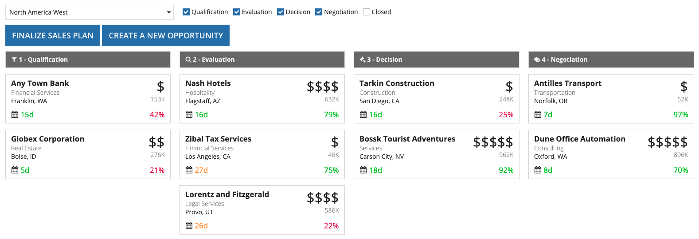 **[DON'T example]**

Don’t squeeze the “Call to Action” style into small spaces, and avoid using this style for multiple actions. In this example, “Toolbar” would be more appropriate.

### Menu

The "Menu" style displays an "ACTIONS" dropdown containing a list of available record actions. Use this style when you want to show multiple actions without cluttering the page. This style may improve the interface's overall performance since record action security can be evaluated on demand.

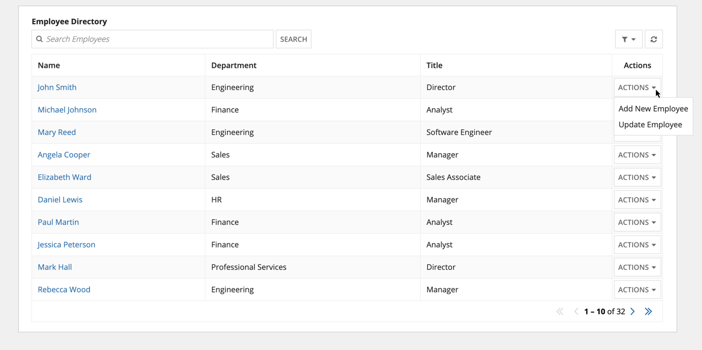 **[DO example]**

Use the "Menu" style when you don't have space to have a button for each record action.

### Menu (Icon)

The "Menu (Icon)" style displays a vertical ellipses icon containing a list of available record actions. Use this style when you want to show multiple actions in minimal space. This style may improve the interface's overall performance since record action security can be evaluated on demand.

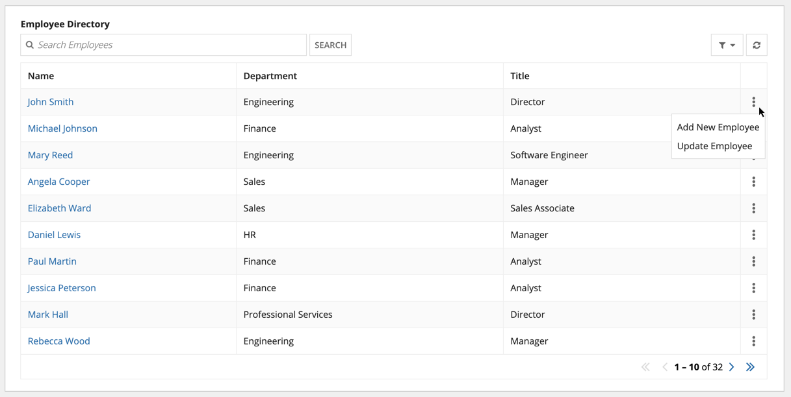 **[DO example]**

Use the "Menu (Icon)" style when there isn't room for each record action.

## Display

The display configuration determines whether the record actions display labels, icons, or both. Record action icons are configured within the record type object.

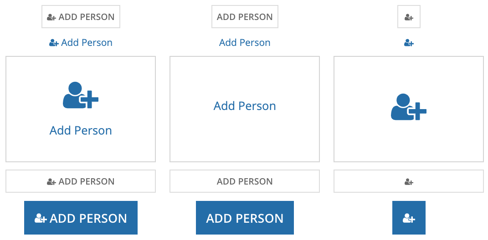

*The first column shows “Label and Icon” combined with each of the available styles. The second column shows “Label Only” and the third shows “Icon Only.”*

Of the three options, “Label and Icon” displays actions most prominently. Only consider using the “Label and Icon” and “Icon Only” options if the icons clearly and accurately reflect the actions.

Keep in mind that when paired with the “Links” style, the “Icon Only” display is small and thus can be easy to miss for users who are unfamiliar with the interface.

## Action Behavior

The record action component provides three different ways the form can open to the user.

### Dialog

The “Dialog” action behavior provides a seamless user experience and is most often the best choice. It enables the user to complete the action without navigating away from the original page.

For action forms that open in a dialog, we recommend using Form Layout to ensure a balanced form interface. Form Layouts provide a header and footer that remain fixed to the top and bottom of the dialog.

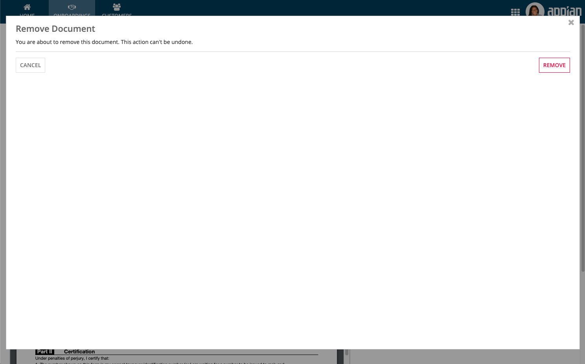 **[DON'T example]**

Avoid configuring a “Dialog” action that doesn't fill the available space. Instead, use dialog sizes that fit the contents.

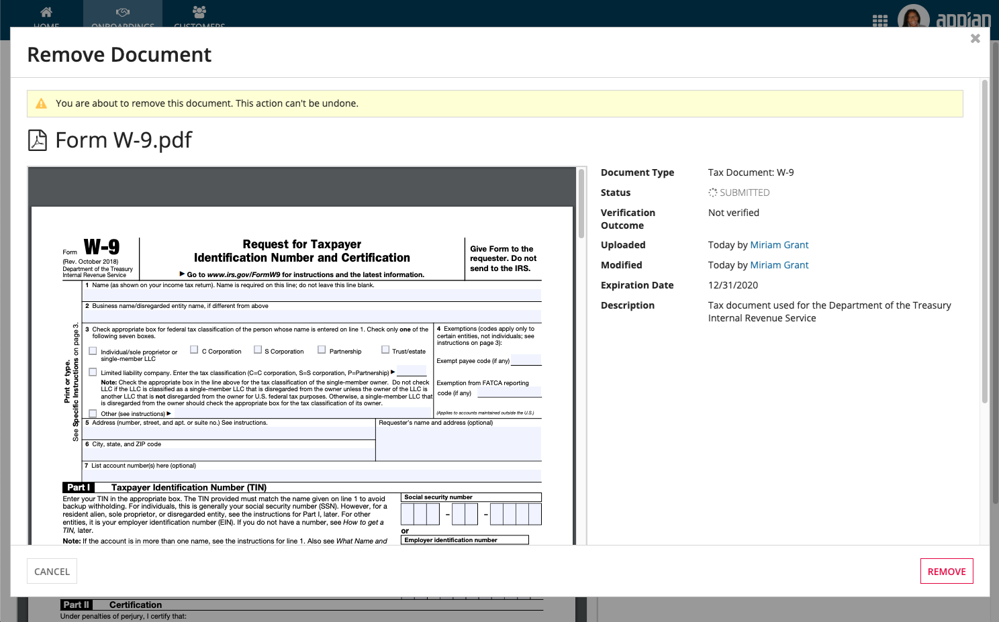 **[DO example]**

Instead of showing unnecessary white space, this form provides additional information – a reminder of what document will be removed – to help the user with the decision. It uses Form Layout, which provides a header for the title, footer for buttons, and scrolling for the form contents.

A record action dialog can be launched from another record action dialog form. It's appropriate to use the nested dialog paradigm when the second dialog is short-lived and supports the purpose of the first action. In general, however, it is best practice to minimize the use of nested dialogs.

#### Dialog shapes

You can configure the shape of all dialogs for a site in the site object.

#### Dialog sizes

You can set the height and width of each dialog separately. When choosing a dialog size, use a width that will fit the length of the expected input values. Avoid setting a wider width than needed, since this can result in very long inputs that are difficult to read at a glance.

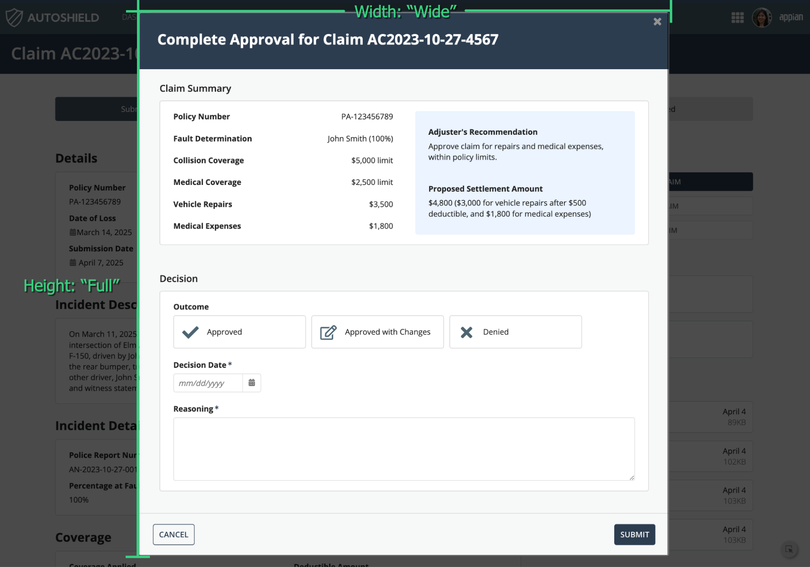

If your dialog contents might dynamically change or if your dialog contains a wizard, avoid using "Auto" height for your dialog, since it could cause a jumpy experience. Use "Auto" height when your dialog contents are short and you want to fit the dialog to the content height.

Avoid combining very wide dialog widths with very short heights, as it will feel unbalanced on the page.

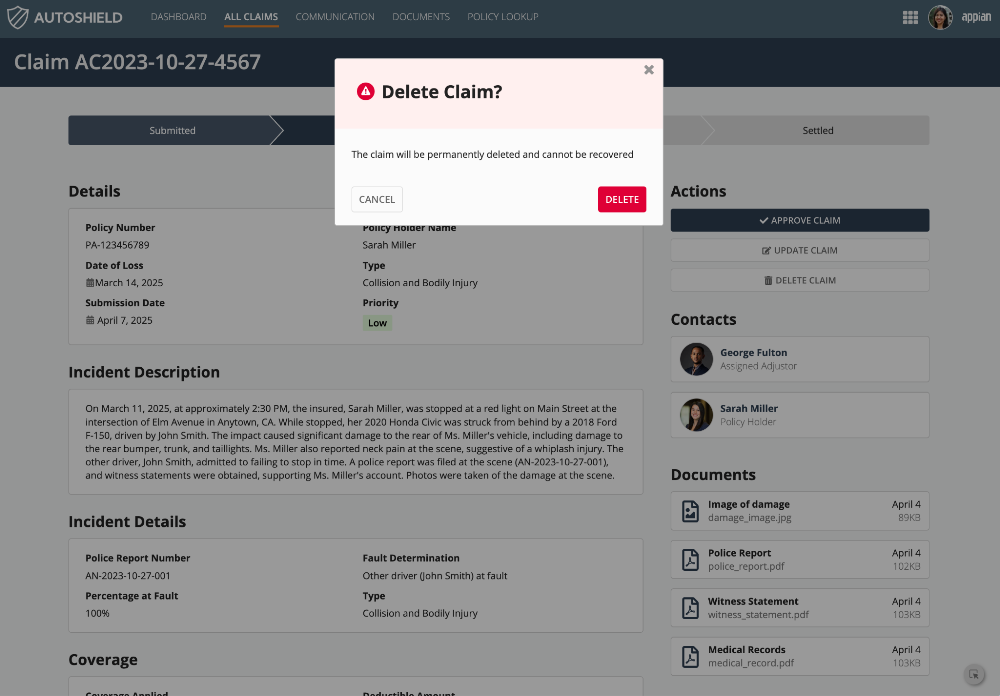 **[DO example]**

Choose a height and width that fits the dialog contents and the page appropriately.

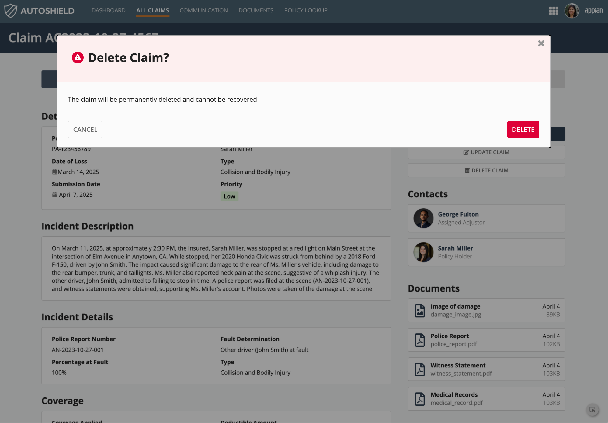 **[DON'T example]**

Choose a height and width that make the dialog contents difficult to read or take up too much space on the page.

When building forms for dialogs, choose a narrower width and put inputs in a single column to keep the flow of the form clear and help reduce input errors. Although this may introduce more scrolling, it improves the readability of the form. If your form scrolls excessively, consider using a wizard or tabbed form pattern to break up a large set of input fields into logical steps.

Forms and wizards that will display in dialogs should always use the "Full" contents width. That way, your form or wizard will always fit the dialog size you choose.

### New tab

Use “New Tab” to open the action form in a new browser tab while preserving the state of the original page. This allows the user to cross reference information between the original page and the action form.

### Same tab

The “Same Tab” option is consistent with the traditional Appian related action behavior. Therefore, this option may be appropriate for users who are familiar and comfortable with related actions prior to 20.1.
