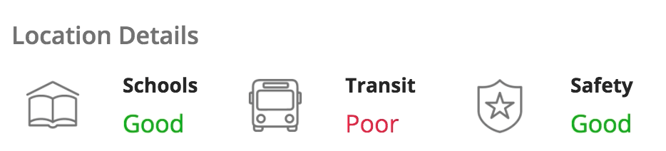
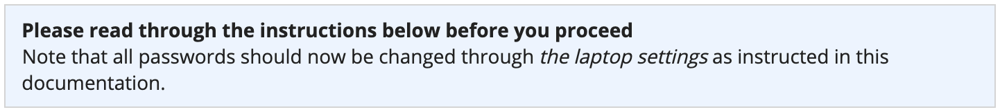
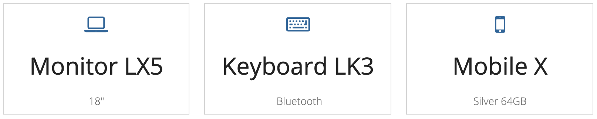
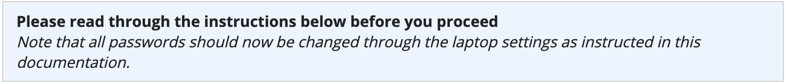
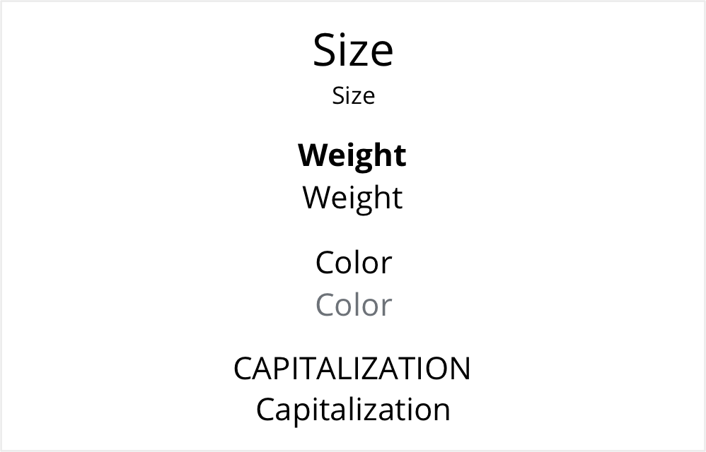
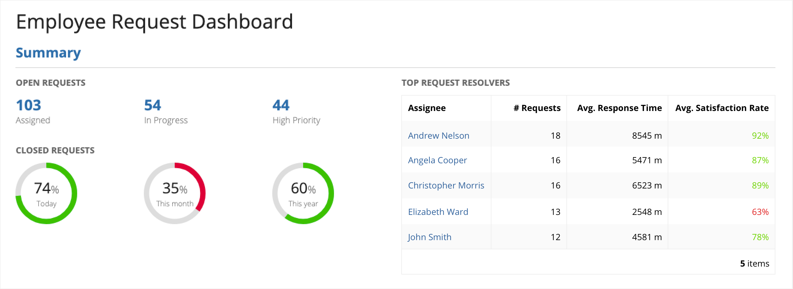
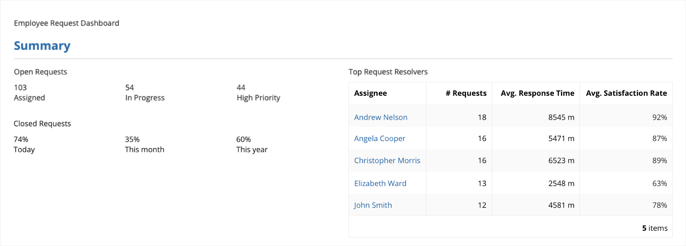

# Rich Text [SAIL Design System: Components]

*Section: components | source: https://docs.appian.com/suite/help/26.7/sail/ux-rich-text.html | images referenced live in corpus/images/*

# Rich Text

## Accessibility considerations

Rich text formatting allow designers to visually differentiate text in user interfaces in order to aid information comprehension. This formatting should be used only as supplemental techniques since not all users can benefit from them. For example, non-sighted or low-vision users who rely on a screen reader to announce text in a UI will not know which words are bolded or shown at a larger size. Similarly, color blind users may not be able to identify the green color of positive-style text, nor the red color of negative-style text. The words and numbers in UI content should convey the most critical information without relying on formatting.

 **[DO example]**

In this example, "Positive" and "Negative" colors highlight qualitative record attributes, while the "Medium" text size makes the values more noticeable on the page. The fundamental information is conveyed in words as plain text so that users with limited vision can still comprehend the content.

When selecting custom colors for rich text values, remember to ensure that there is sufficient contrast between the text and the background for legibility. This is particularly important when the text will be displayed on top of a colored background (such as a billboard layout or card layout).

## Positive and negative colors

The "Positive" and "Negative" rich text colors are intended to highlight values of business significance (for example, increased or decreased revenues). It is not recommended to use these colors for decorative purposes, i.e. to make text arbitrarily green or red without a corresponding meaning.

When using "Positive" or "Negative" rich text colors for billboard content, pay careful attention to ensure sufficient contrast between the background media and the text. When the "Dark" overlay style is selected, the regular text color is automatically switched from black to white to maximize contrast. However, positive and negative text retain their green and red colors, respectively.

 **[DO example]**

 **[DON'T example]**

Don’t use "Positive" or "Negative" colors for content that will be shown above a background which would not provide sufficient contrast for easy reading

## Emphasis style

 **[DO example]**

Use the “Emphasis” rich text style to draw attention to certain words or phrases in a sentence or paragraph.

 **[DO example]**

Use a smaller text size and/or the “Secondary” rich text color, instead of the “Emphasis” style, to differentiate subordinate text

 **[DON'T example]**

Don’t use the “Emphasis” rich text style for an entire sentence or paragraph because italicized text is harder to read

## Using varied font features

Too much uniform text can make it hard to scan a page and identify important information. Use varied font features to highlight key values and to convey visual hierarchy.

There are a variety of ways to effectively differentiate text, including size, weight, color, and capitalization.

 **[DO example]**

This example shows how a clear hierarchy can be created by using different font features for the page title, section title, and subsection titles. In addition, it shows how font styles can be used to emphasize important data points, like the number of open requests that are assigned, in progress, and high priority.

 **[DON'T example]**

In this example, the standard text style is overused, making it hard to understand the structure of the page and quickly find important information.
